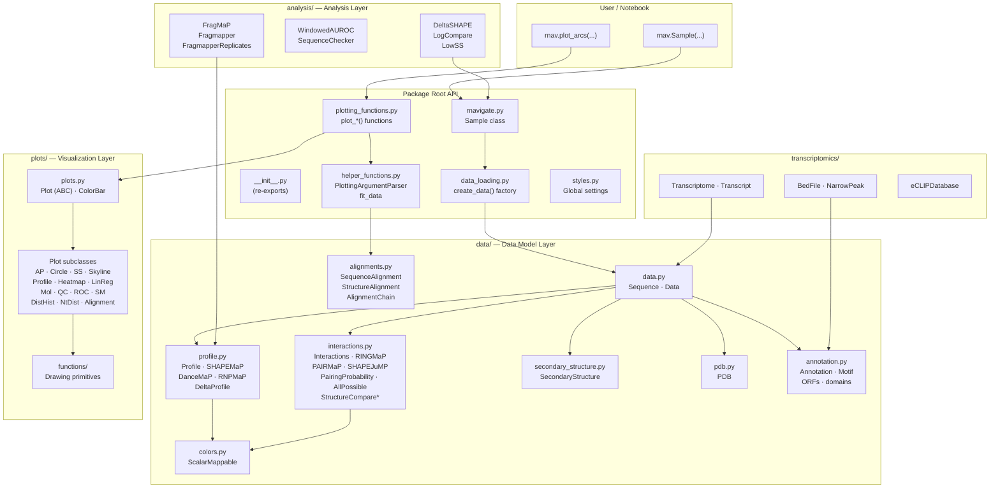
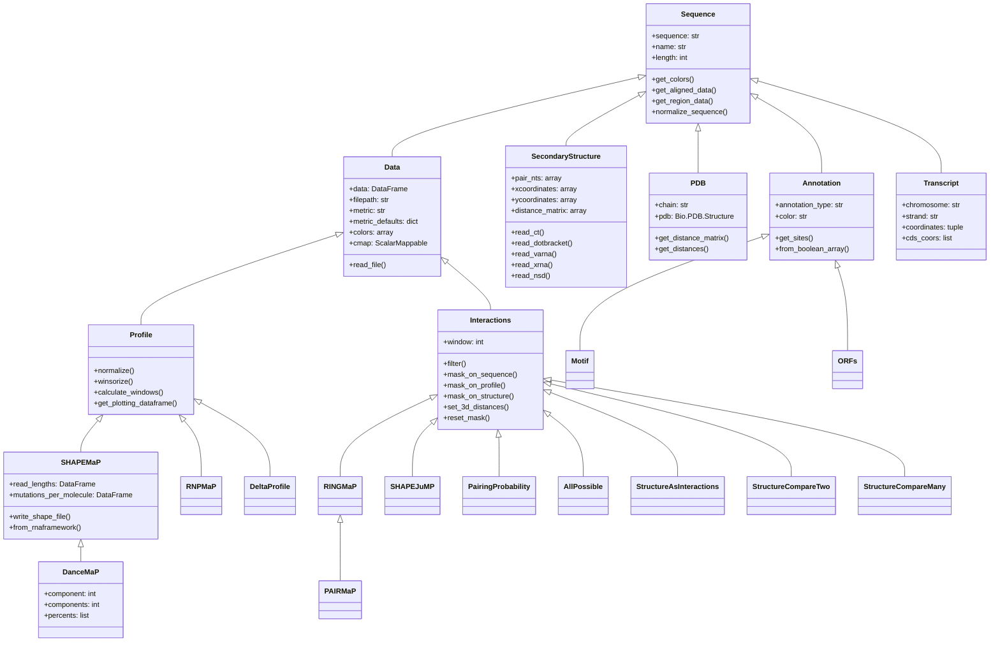
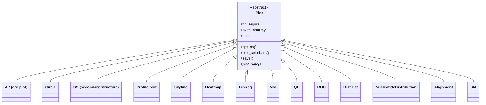
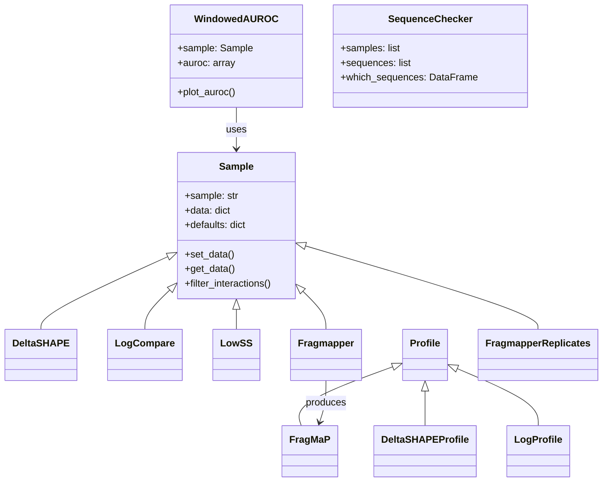
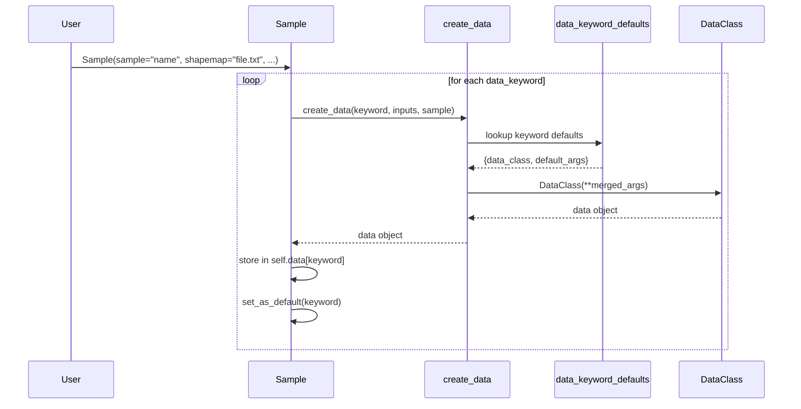
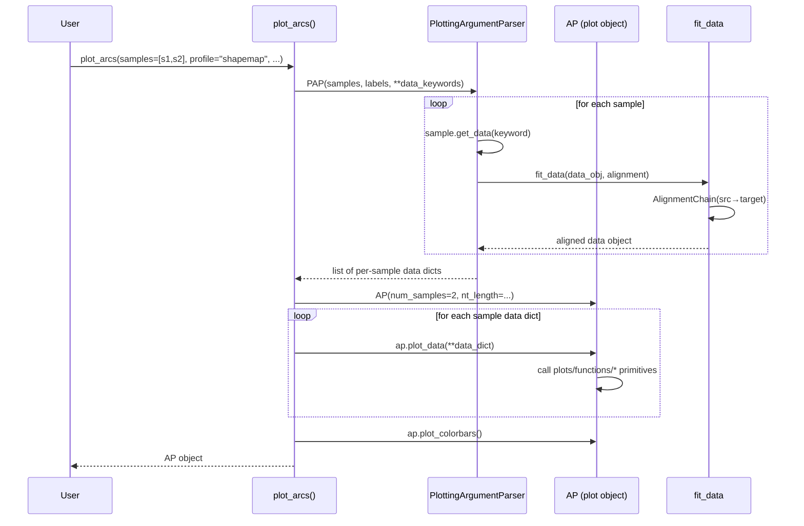
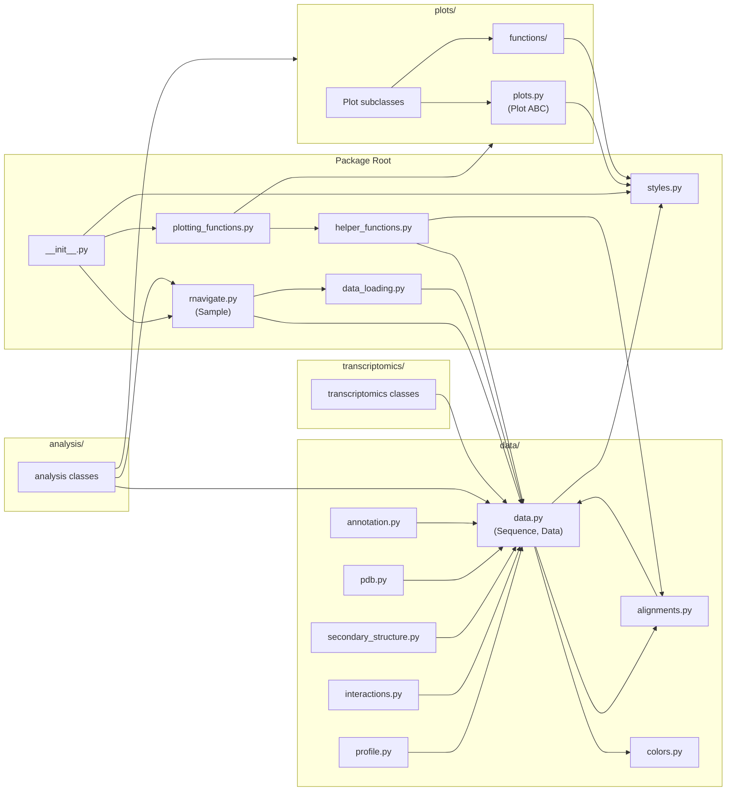

# RNAvigate Architecture

> **Purpose:** This document is the authoritative reference for how RNAvigate is structured. It is intended to be kept up-to-date as the codebase evolves, so that both human developers and AI collaborators can reason about the system quickly. Update this file whenever a module's responsibilities, public API, or inter-module dependencies change.

---

## Table of Contents

1. [High-Level Overview](#1-high-level-overview)
2. [Directory Map](#2-directory-map)
3. [Layer Architecture](#3-layer-architecture)
4. [Module Reference](#4-module-reference)
   - [rnavigate (package root)](#41-rnavigate-package-root)
   - [data — Data Model Layer](#42-data--data-model-layer)
   - [plots — Visualization Layer](#43-plots--visualization-layer)
   - [analysis — Analysis Layer](#44-analysis--analysis-layer)
   - [transcriptomics — Genomics Integration](#45-transcriptomics--genomics-integration)
   - [examples — Built-in Datasets](#46-examples--built-in-datasets)
5. [Class Hierarchies](#5-class-hierarchies)
6. [Data Flow](#6-data-flow)
7. [Key Design Patterns](#7-key-design-patterns)
8. [Dependency Map](#8-dependency-map)
9. [External Dependencies](#9-external-dependencies)
10. [Known Issues & Refactoring Opportunities](#10-known-issues--refactoring-opportunities)

---

## 1. High-Level Overview

RNAvigate is a Jupyter-compatible Python package for loading, aligning, analyzing, and
visualizing RNA chemical probing data (SHAPE-MaP, DMS-MaP, RING-MaP, PAIR-MaP, etc.)
alongside secondary and tertiary structure information.

The conceptual pipeline is:

```
User's data files  →  ( Sample → Plotting Functions )  →  publication-ready figures
                      (          RNAvigate          )
```

The `Sample` object is the central unit of the API. Users load one `Sample` per
experiment, storing all associated data under string *data keywords*. Plotting
functions accept one or more `Sample` objects and render them into publication-quality
figures.

---

## 2. Directory Map

```
rnavigate/
├── __init__.py              # Public API surface
├── rnavigate.py             # Sample class
├── data_loading.py          # Data keyword factory (create_data)
├── plotting_functions.py    # High-level plot_*() convenience functions
├── helper_functions.py      # PlottingArgumentParser, fit_data
├── styles.py                # Global visual settings
│
├── data/                    # Data model layer
│   ├── __init__.py
│   ├── data.py              # Sequence (root base class), Data (tabular base)
│   ├── profile.py           # Profile, SHAPEMaP, DanceMaP, RNPMaP, DeltaProfile
│   ├── interactions.py      # Interactions + 8 subclasses
│   ├── secondary_structure.py  # SecondaryStructure, StructureCoordinates, SequenceCircle
│   ├── pdb.py               # PDB (tertiary structure)
│   ├── annotation.py        # Annotation, Motif, ORFs, domains
│   ├── alignments.py        # SequenceAlignment, StructureAlignment, AlignmentChain
│   └── colors.py            # ScalarMappable (colormap/colorbar helper)
│
├── plots/                   # Visualization layer
│   ├── __init__.py
│   ├── plots.py             # Plot (ABC), ColorBar
│   ├── arc.py               # AP (arc plot)
│   ├── circle.py            # Circle
│   ├── ss.py                # SS (secondary structure drawing)
│   ├── profile.py           # Profile plot
│   ├── skyline.py           # Skyline plot
│   ├── heatmap.py           # Heatmap
│   ├── linreg.py            # LinReg (linear regression)
│   ├── mol.py               # Mol (3D via py3Dmol)
│   ├── qc.py                # QC (ShapeMapper quality control)
│   ├── roc.py               # ROC curve
│   ├── disthist.py          # DistHist (3D distance histogram)
│   ├── ntdist.py            # NucleotideDistribution
│   ├── alignment.py         # Alignment plot
│   ├── sm.py                # SM (ShapeMapper multi-panel)
│   └── functions/           # Low-level drawing primitives
│       ├── __init__.py
│       ├── functions.py     # Axes helpers, arc/bar/skyline draw functions
│       ├── tracks.py        # Linear track drawing (sequence, annotations, domain)
│       ├── ss.py            # Secondary structure drawing helpers
│       └── circle.py        # Circular layout drawing helpers
│
├── analysis/                # Analysis layer
│   ├── __init__.py
│   ├── deltashape.py        # DeltaSHAPE, DeltaSHAPEProfile
│   ├── fragmapper.py        # FragMaP, Fragmapper, FragmapperReplicates
│   ├── lowss.py             # LowSS
│   ├── logcompare.py        # LogCompare
│   ├── auroc.py             # WindowedAUROC
│   ├── check_sequence.py    # SequenceChecker
│   └── logcompare_old.py    # [DEPRECATED] old implementation
│
├── transcriptomics/         # Genomics integration layer
│   ├── __init__.py
│   ├── transcriptome.py     # Transcriptome, Transcript
│   ├── bed.py               # BedFile, NarrowPeak
│   └── eclip.py             # eCLIPDatabase, download_eclip_peaks
│
└── examples/                # Built-in sample datasets
    ├── __init__.py          # Lazy-loading __getattr__ factory
    ├── tpp_data/            # TPP riboswitch DMS-MaP
    ├── rmrp_data/           # RMRP RNPMaP
    ├── rnasep_data/         # RNase P SHAPE-MaP (4 samples)
    └── rrna_fragmap_data/   # rRNA Frag-MaP (3 samples)
```

---

## 3. Layer Architecture



---

## 4. Module Reference

### 4.1 `rnavigate` (package root)

#### `__init__.py`

The public surface of the package.
Re-exports `Sample`, all `plot_*()` functions, and each sub-module.
Users only need `import rnavigate as rnav`.

#### `rnavigate.py` contains `rnav.Sample`

The central user-facing object. Responsibilities:

- Stores all data for one RNA and for one experimental sample in `self.data`
  - `self.data` is a dictionary of `{string data keywords: DataObject}`
- Stores raw user inputs in `self.inputs` for reproducibility.
- Tracks one "default" per data category in `self.defaults`.
- Supports data inheritance between samples (`inherit=`).
- Provides `get_data()`, `set_data()`, `set_as_default()`, `filter_interactions()`, and `print_data_keywords()`.

Key design constraint: `Sample` does **not** know about plots. It delegates data creation to `data_loading.create_data()`.

#### `data_loading.py` — `create_data()` factory

Translates the user-facing keyword-based API into concrete `data.*` objects.
The `data_keyword_defaults` dict maps every recognized keyword string to a `data_class` constructor and its default arguments.
`create_data()` is the single point of truth for how a keyword becomes a data object.

#### `plotting_functions.py` — `plot_*()` functions

Sixteen high-level functions (`plot_arcs`, `plot_ss`, `plot_circle`, etc.). Each one:

1. Accepts `samples`, data keyword strings, and display options.
2. Uses `PlottingArgumentParser` (from `helper_functions`) to resolve keywords → data objects and optionally align them to a common sequence.
3. Instantiates the appropriate `plots.*` class.
4. Iterates over samples calling `plot_obj.plot_data(...)`.
5. Returns the `Plot` object so the user can call `.save()` or further customize.

#### `helper_functions.py`

- `PlottingArgumentParser`: accepts `samples` + data-keyword kwargs, resolves each keyword to a data object per sample, handles optional sequence alignment via `fit_data`.
- `fit_data()`: recursively aligns any `Data` object (or list/dict of them) to a target sequence via `AlignmentChain`.

#### `styles.py`

Global matplotlib/seaborn styling, nucleotide color lookup, and a `Settings` object. Imported by most modules that do any drawing.

---

### 4.2 `data/` — Data Model Layer

All data classes ultimately inherit from `Sequence`. The hierarchy separates sequence identity (string + FASTA I/O) from tabular data (DataFrame + metric/color system).

#### `data.py`

| Class | Inherits | Responsibility |
|-------|----------|----------------|
| `Sequence` | `object` | Base for all RNAvigate data. Stores sequence string, reads FASTA, provides `get_colors()` and `get_aligned_data()`. |
| `Data` | `Sequence` | Base for all tabular data. Adds a `pandas.DataFrame`, a metric system (`metric_defaults`, `_metric` property), and `ScalarMappable`-based color generation. |

#### `profile.py`

| Class | Inherits | Input format(s) |
|-------|----------|----------------|
| `Profile` | `Data` | Generic per-nucleotide data (CSV/TSV), or BYO `pandas.DataFrame` |
| `SHAPEMaP` | `Profile` | ShapeMapper2 `profile.txt`, `.map`, `_log.txt` or RNAFramework XML |
| `DanceMaP` | `SHAPEMaP` | DanceMapper `reactivities.txt` |
| `RNPMaP` | `Profile` | RNPMapper CSV |
| `DeltaProfile` | `Profile` | Computed from two `Profile` objects |

`Profile` provides the data normalization engine: `norm_boxplot`, `norm_eDMS`, `norm_percentiles`, `normalize()`, `normalize_external()`, and `winsorize()`.

#### `interactions.py`

| Class | Inherits | File format(s) |
|-------|----------|--------------------------|
| `Interactions` | `Data` | Base class for pairwise (i, j) data that describe relationships between nucleotides |
| `RINGMaP` | `Interactions` | RINGMapper `rings.txt` |
| `PAIRMaP` | `RINGMaP` | PAIRMapper `pairs.txt` |
| `SHAPEJuMP` | `Interactions` | SHAPE-JuMP deletions `.txt` |
| `PairingProbability` | `Interactions` | RNAstructure `.dp`, `.bps`, `pairprob.txt` |
| `AllPossible` | `Interactions` | Computed: all i-j pairs |
| `StructureAsInteractions` | `Interactions` | Converts `SecondaryStructure` base-pairs |
| `StructureCompareTwo` | `Interactions` | Compares two structures |
| `StructureCompareMany` | `Interactions` | Compares many structures |

`Interactions` provides a rich filtering API: `filter()`, `mask_on_sequence()`, `mask_on_profile()`, `mask_on_structure()`, `set_3d_distances()`.

#### `secondary_structure.py`

| Class | Inherits | Responsibility |
| ------|----------------|
| `SecondaryStructure` | `Data` | Stores base-pair table + optional 2D drawing coordinates. Parses `.ct`, `.dbn`/`.db`, `.varna`, `.xrna`, `.nsd`, `.cte`, `.json` (R2DT), `.forna`. |
| `StructureCoordinates` | `object` | Helper for coordinate transforms (scale, rotate, center). |
| `SequenceCircle` | `SecondaryStructure` | Creates a circular coordinate layout for circular plots. |

#### `pdb.py` — `PDB`

Wraps a `Bio.PDB` structure. Provides `get_distance_matrix()` and `get_distances()` for computing inter-residue 3D distances, used by `Sample.filter_interactions()`.

#### `annotation.py`

| Class | Inherits | Description |
| --- | --- | --- |
| `Annotation` | `Sequence` | Sites, spans, primers, or groups of nucleotides. |
| `Motif` | `Annotation` | Regex-found sequence motifs. |
| `ORFs` | `Annotation` | Open reading frame spans. |
| `domains()` | Function | Returns a list of `Annotation` objects from a domain table. |

#### `alignments.py`

The alignment subsystem enables multi-sample plots where samples have different but related sequences by converting data structures between the coordinate systems of two sequences. Alignment objects inherit from the abstract `BaseAlignment` class, which requires methods to get a map between coordinate systems from the child class.

| Class | Description |
|-------|-------------|
| `SequenceAlignment` | Aligns two sequences via Biopython `pairwise2`. Cached globally. |
| `StructureAlignment` | Aligns two sequences using both sequence + secondary structure (pseudo-amino-acid encoding). |
| `AlignmentChain` | Composes two alignments in series. Used by `fit_data()`. |
| `lookup_alignment` / `set_alignment` | Cache management for pre-computed alignments. |

#### `colors.py` — `ScalarMappable`

Extends `matplotlib.cm.ScalarMappable`. Supports normalization strategies: `"min_max"`, `"0_1"`, `"none"`, `"bins"`, `"percentiles"`. Used everywhere color → value mapping is needed.

---

### 4.3 `plots/` — Visualization Layer

#### `plots.py` — `Plot` (ABC), `ColorBar`

`Plot` is the abstract base class for all plot types. It:

- Creates a `matplotlib` figure with a grid of axes.
- Provides `get_ax(i)`, `add_colorbar_args()`, `plot_colorbars()`, `save()`.
- Declares `plot_data()` as abstract (subclasses implement this).

#### Plot subclasses

| Class | File | Description |
|-------|------|-------------|
| `AP` | `arc.py` | Arc plot: semi-circular arcs connect *i/j* nucleotide interactions above/below a linear sequence track. |
| `Circle` | `circle.py` | Nucleotide positions arranged in a circular layout: *i/j* interactions as chords, annotations as ring segments. |
| `SS` | `ss.py` | Secondary structure diagram using pre-computed 2D coordinates. |
| `Skyline` | `skyline.py` | Per-nucleotide skyline (step-bar) chart. |
| `Profile` | `profile.py` | Per-nucleotide bar chart. |
| `Heatmap` | `heatmap.py` | *i/j* interactions as 2D heatmap matrix. |
| `LinReg` | `linreg.py` | Linear regression scatter plot comparing two profiles. |
| `Mol` | `mol.py` | Interactive 3D structure via py3Dmol (Jupyter widget). |
| `QC` | `qc.py` | ShapeMapper quality control multi-panel plot. |
| `ROC` | `roc.py` | ROC curve for profile vs. structure agreement. |
| `DistHist` | `disthist.py` | Histogram of 3D distances for filtered interactions. |
| `NucleotideDistribution` | `ntdist.py` | Nucleotide identity distribution. |
| `Alignment` | `alignment.py` | Pairwise sequence alignment visualization. |
| `SM` | `sm.py` | Multi-panel ShapeMapper summary plot. |

#### `plots/functions/` — Drawing Primitives
Low-level, stateless functions that draw onto a given `matplotlib.Axes`. Organized by layout type:

- `functions.py`: axes helpers (`adjust_spines`, `clip_spines`, `get_nt_ticks`), arc drawing (`plot_interactions_arcs`), profile bar/skyline drawing.
- `tracks.py`: linear track elements — sequence bar, annotation tracks, domain tracks.
- `ss.py`: secondary structure elements — nucleotide scatter, base-pair lines, interaction lines, annotation highlights.
- `circle.py`: circular layout elements — chord arcs, ring annotations.

---

### 4.4 `analysis/` — Analysis Layer

Analysis classes extend either `Sample` (to produce a new annotated sample that can be directly plotted) or `data.Profile` (to produce a new data type), or are standalone utilities.

| Class | Base | Description |
|-------|------|-------------|
| `DeltaSHAPE` | `Sample` | Z-score-based detection of significant SHAPE reactivity changes between two conditions. Calls sites of protection/enhancement. (doi:10.1021/acs.biochem.5b00977) |
| `DeltaSHAPEProfile` | `data.Profile` | Profile data object produced by `DeltaSHAPE`. |
| `LogCompare` | `Sample` | Compares log-rate profiles across replicates; calls significant differences via Z-scores. |
| `LowSS` | `Sample` | Identifies low-SHAPE, low-Shannon-entropy regions predictive of alternative structures. (doi:10.1038/nmeth.3029) |
| `WindowedAUROC` | — | Sliding-window AUROC to assess how well a reactivity profile predicts base-pairing. |
| `SequenceChecker` | — | Audit all sequences across a list of samples; identify mismatches. |
| `FragMaP` | `data.Profile` | Per-nucleotide Frag-MaP crosslinking signal (delta Z-score). |
| `Fragmapper` | `Sample` | Orchestrates `FragMaP` computation between two `SHAPEMaP` profiles; stores results as a new Sample. |
| `FragmapperReplicates` | `Sample` | Replicate-level Frag-MaP with FDR correction (uses `statsmodels`). |
| `LogProfile` | `data.Profile` | Internal profile data type used by `LogCompare`. |

---

### 4.5 `transcriptomics/` — Genomics Integration

Bridges genome-scale data (BED files, eCLIP peaks) to transcript-coordinate `data.*` objects usable in standard RNAvigate plots.

| Class / Function | Description |
|-----------------|-------------|
| `Transcriptome` | Loads a genome FASTA + GTF annotation. Provides `get_transcript(id)`. |
| `Transcript` | Extends `data.Sequence`. Stores exon coordinates, CDS, UTR. Converts genome-coordinate data to transcript coordinates. |
| `BedFile` | Reads BED6 files; converts to `data.Annotation` or `data.Profile` per transcript. |
| `NarrowPeak` | Extends `BedFile`; reads ENCODE narrowPeak format. |
| `eCLIPDatabase` | Reads ENCODE eCLIP metadata; downloads peaks for a given RBP. |
| `create_eclip_table` / `download_eclip_peaks` | Convenience utilities for eCLIP data acquisition. |

---

### 4.6 `examples/` — Built-in Datasets

Four bundled RNA datasets with real experimental data. The `__init__.py` uses a lazy `__getattr__` factory so each `Sample` is only constructed on first access.

| Name | RNA | Data types |
|------|-----|------------|
| `tpp` | TPP riboswitch | DMS-MaP, RING-MaP, pairing probs, PDB, SS |
| `rmrp` | RMRP | RNPMaP, SS |
| `rnasep_1`–`4` | RNase P | SHAPE-MaP, RING-MaP, PAIR-MaP, SHAPE-JuMP, PDB, SS, pairing probs |
| `linezolid`, `quinaxoline`, `methyl` | rRNA | SHAPE-MaP, Frag-MaP, PDB, SS |

---

## 5. Class Hierarchies

### 5.1 Data Class Hierarchy



### 5.2 Plot Class Hierarchy



### 5.3 Analysis Class Relationships



---

## 6. Data Flow

### 6.1 Loading a Sample



### 6.2 Generating a Plot



---

## 7. Key Design Patterns

### 7.1 Data Keyword System
`data_keyword_defaults` in `data_loading.py` is a flat registry mapping string keywords (e.g. `"shapemap"`, `"ringmap"`) to constructor defaults. This decouples the user-facing API from the class hierarchy and makes it easy to add new data types without modifying `Sample`.

### 7.2 Metric System
Every `Data` subclass carries `metric_defaults`: a dict of named color-and-scale configurations. Switching metrics (`data.metric = "Norm_profile"`) changes colormaps, normalization, and column selection without reloading data.

### 7.3 Alignment-Transparent Data
Every `Data` subclass implements `get_aligned_data(alignment)` to return a positionally remapped copy. `fit_data()` in `helper_functions` applies this transparently before plotting, enabling comparison of data from sequences that differ in length or content.

### 7.4 Analysis-as-Sample
Several analysis classes (`DeltaSHAPE`, `LogCompare`, `LowSS`) subclass `Sample`. This means analysis results are immediately usable as a new sample in any plotting function — a powerful pattern that keeps the API consistent.

### 7.5 Lazy Example Loading
`examples/__init__.py` uses `__getattr__` so example `Sample` objects are only constructed when first accessed. This avoids parsing all bundled data files at import time.

### 7.6 Global Alignment Cache
`data/alignments.py` caches `SequenceAlignment` results in a module-level `_alignments_cache` dict. This avoids re-running Biopython pairwise alignment repeatedly when the same sequence pair is used across many plot calls.

---

## 8. Dependency Map

### 8.1 Internal Module Dependencies



### 8.2 Data Class Dependency on other `data/` modules

| Module | Imports from `data/` |
|--------|---------------------|
| `data.py` | `alignments`, `styles`, `colors` |
| `profile.py` | `data.py`, `alignments` |
| `interactions.py` | `data.py` |
| `secondary_structure.py` | `data.py` |
| `pdb.py` | `data.py` |
| `annotation.py` | `data.py` |
| `alignments.py` | `data.py` (circular — handled via `from rnavigate import data`) |
| `colors.py` | *(no internal imports)* |

---

## 9. External Dependencies

| Package | Version (env) | Used for |
|---------|--------------|----------|
| `biopython` | 1.78 | FASTA I/O, PDB parsing, pairwise sequence alignment |
| `numpy` | 1.20.1 | Numeric arrays throughout |
| `pandas` | 1.4.4 | All tabular data storage and manipulation |
| `matplotlib` | *(via seaborn)* | All 2D plotting |
| `seaborn` | 0.13.0 | Figure styling |
| `scipy` | 1.6.2 | Statistical tests (DeltaSHAPE, FragMaP, LogCompare) |
| `scikit-learn` | 1.0.2 | ROC / AUC curves (WindowedAUROC, ROC plot) |
| `statsmodels` | *(via fragmapper)* | Multiple testing correction (Fragmapper FDR) |
| `py3dmol` | 2.0.0.post2 | Interactive 3D molecular visualization (`Mol` plot) |
| `openpyxl` | 3.1.2 | Excel I/O (eCLIP metadata) |
| `ipykernel` / `jupyter` | 6.6.0 / 1.0.0 | Notebook environment |
