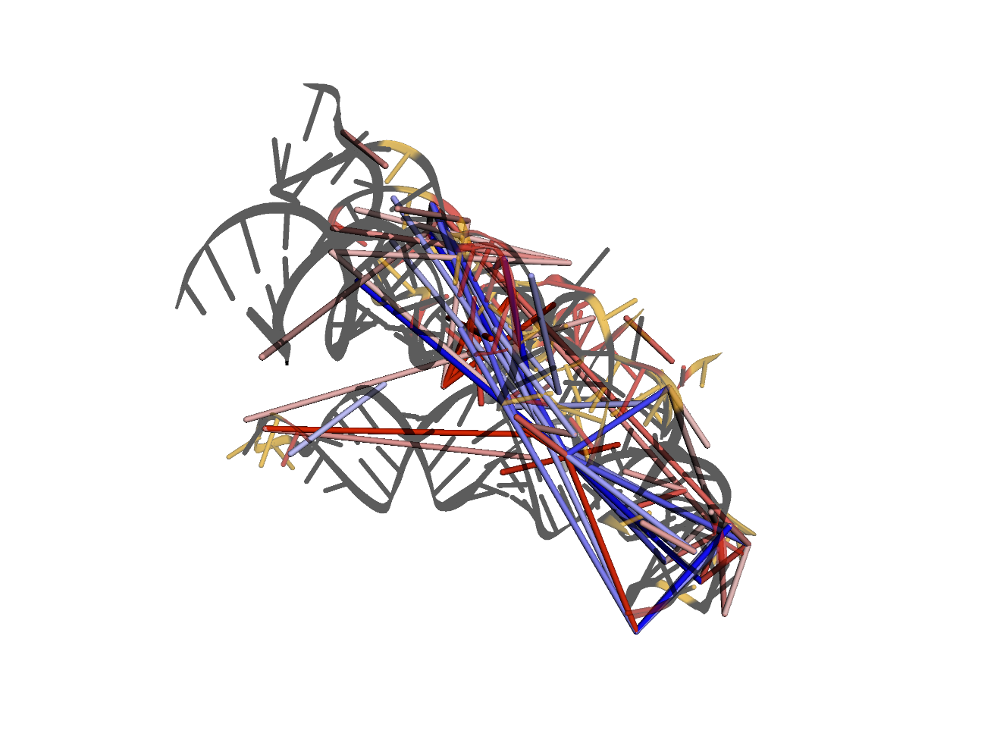
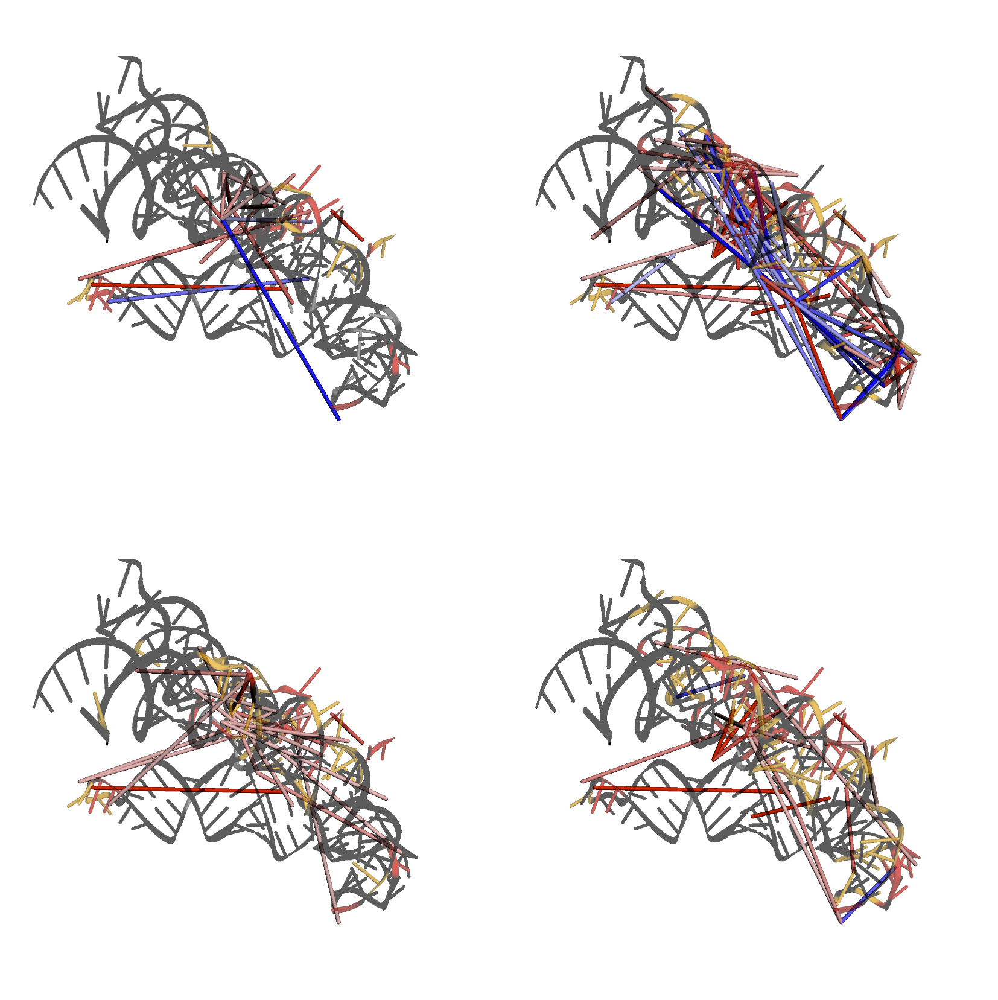
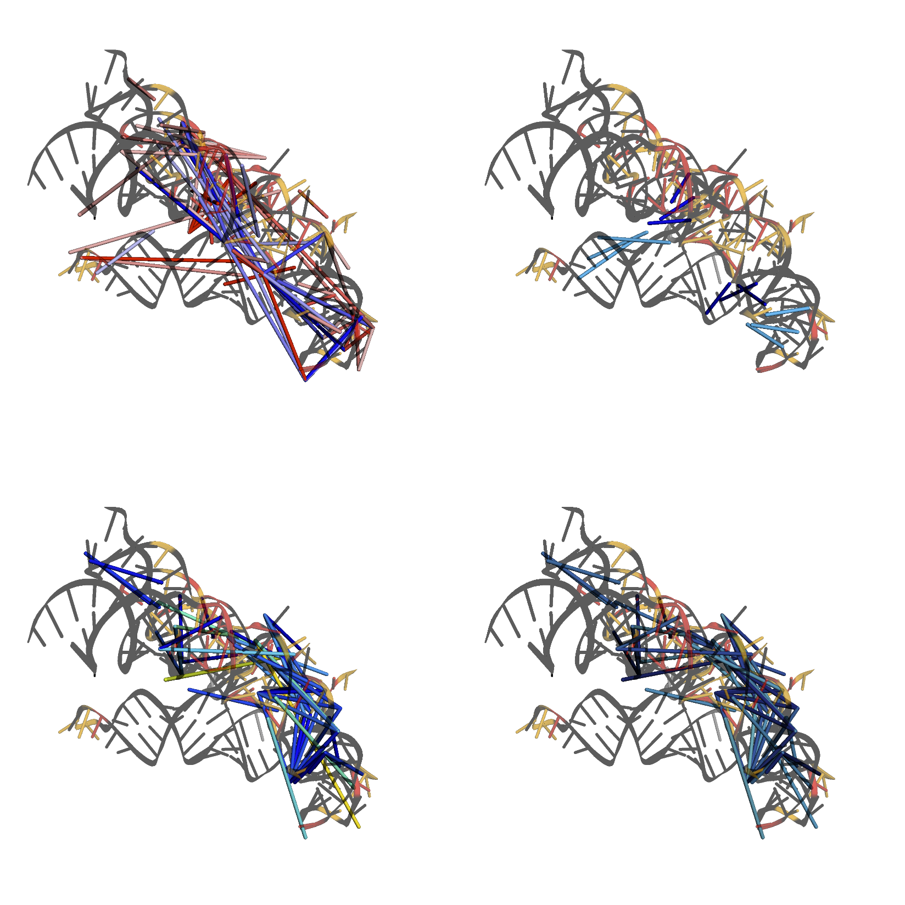

3D model options test script
============================
This test script is to test implemented features with tertiary structures.

You can also use it to view the different options and how they look.
The function calls are likely to stay the same, but the default plots
may look a little different in the future.

Currently broken
----------------
* nothing that I'm aware of

Notebook set-up
---------------


```python
# This sets plots to display in-line by default
%matplotlib inline
import sys
# Import module, for high-level functions, no additional modules are needed
import plotmapper as MaP


# Creates an HTML button that hides/shows code cells
# Useful for lab notebook reports and research updates
# NOTE: this does not display well on GitHub.
MaP.create_code_button()
```

The code button doesn't render correctly in GitHub markdown.


Initializing MaP sample
-----------------------
If you have consistently named files, (which you should), you can use a function to create a dictionary of keyword arguments (kwargs). Then, "unpack" the dictionary using the double asterisk.


```python
path = 'data/'
def kwargs(sample):
    kwargs = {"sample": sample,
              "profile": path+sample+"_rnasep_profile.txt",
              "ct": path+"RNaseP.ct",
              "ss": path+"RC_CRYSTAL_STRUCTURE.xrna",
              "rings": path+sample+"-rnasep.corrs",
              "pairs": path+sample+"-rnasep-pairmap.txt",
              "log": path+sample+"_shapemapper_log.txt",
              "dance_prefix": path+sample+"_rnasep",
              "deletions": path+"example-rnasep-deletions.txt",
              "fasta": path+"RNaseP-noSC.fasta",
              "pdb": path+"3dhs_Correct.pdb"}
    return kwargs

example1 = MaP.Sample(**kwargs("example1"))
example2 = MaP.Sample(**kwargs("example2"))
example3 = MaP.Sample(**kwargs("example3"))
example4 = MaP.Sample(**kwargs("example4"))
```


```python
example2.make_3d(ij_data="rings")
```

Unfortunately, the interactive version will not display in GitHub markdown.
Here is a still image from the notebook version.



```python
MaP.array_3d([example1, example2, example3, example4], ij_data="rings")
```

Unfortunately, the interactive version will not display in GitHub markdown.
Here is a still image from the notebook version.



```python
import py3Dmol
view = py3Dmol.view(viewergrid=(2,2), width=800, height=800)
view = example2.set_3d_view(view)
view = example2.make_3d(view, (0,1), ij_data="pairs")
view = example2.make_3d(view, (0,0), ij_data="rings", metric="Statistic", Statistic=20)
view = example2.make_3d(view, (1,0), ij_data="deletions", metric="Distance", Percentile=0.99)
view = example2.make_3d(view, (1,1), ij_data="deletions", Percentile=0.99)
view.show()
```

Unfortunately, the interactive version will not display in GitHub markdown.
Here is a still image from the notebook version.


