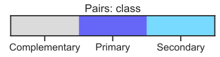
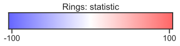
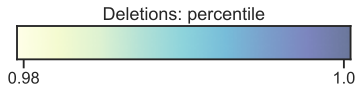
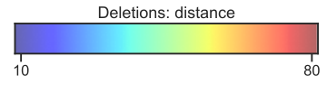

```python
import plotmapper as MaP
```


```python
MaP.view_colormap("pairs")
```


    

    


```python
MaP.view_colormap("rings")
```


    

    


```python
MaP.view_colormap("deletions")
```


    

    


```python
MaP.view_colormap("deletions", metric="Distance")
```


    

    


```python

```
