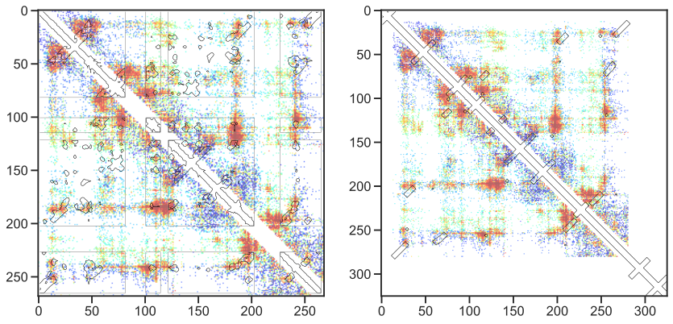
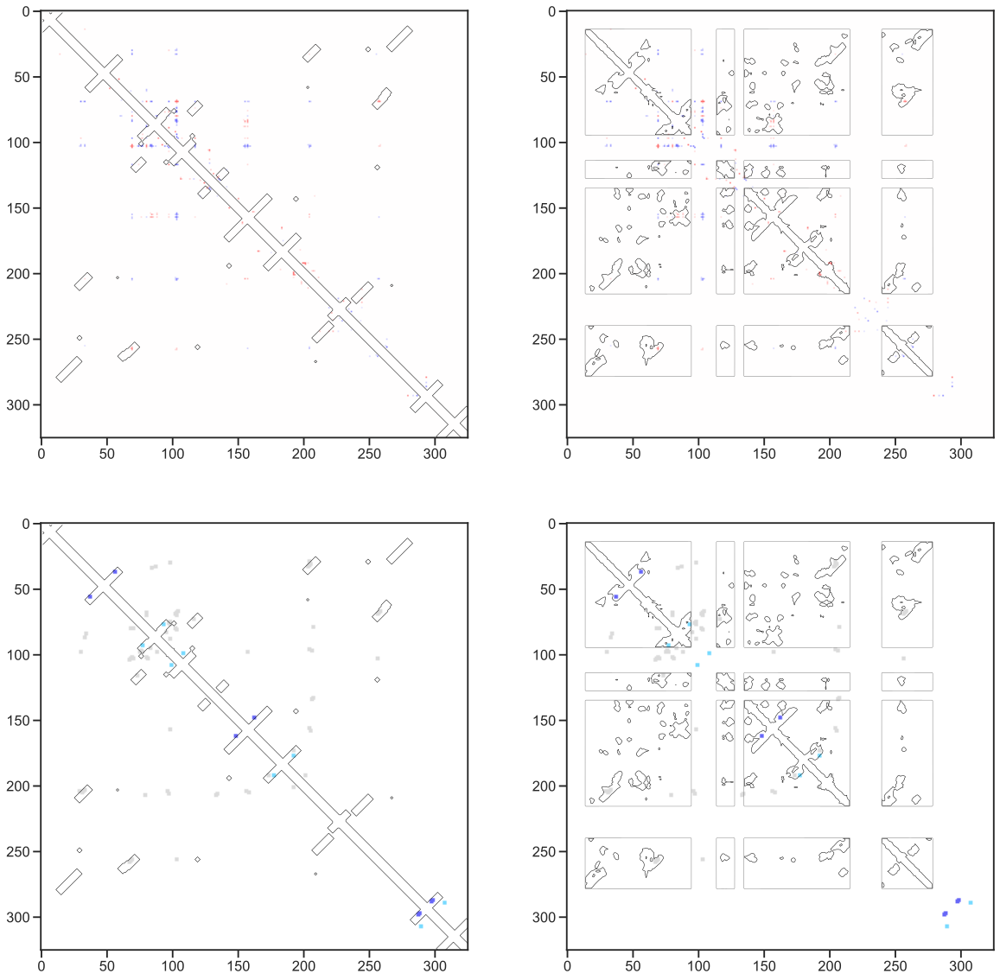

Heatmap plot testing
====================
example heat map plots to implement in plotmapper.py

Currently Broken
----------------
* i, j  data is shifted by 1, because axis is 0-indexed.

Notebook set-up
---------------


```python
# This sets plots to display in-line by default
%matplotlib inline

# Import module, for high-level functions, no additional modules are needed
import plotmapper as MaP
import matplotlib.pyplot as plt

# Creates an HTML button that hides/shows code cells
# Useful for lab notebook reports and research updates
# NOTE: this does not display well on GitHub.
MaP.create_code_button()
```


<script>
                 code_show=true;
                 function code_toggle() {
                 if (code_show) {$('div.input').hide();}
                 else {$('div.input').show();}
                 code_show = !code_show
                 }
                 $( document ).ready(code_toggle);
                 </script>
                 <form action="javascript:code_toggle()">
                 <input type="submit" value="Hide/show raw code.">
                 </form>


Initializing MaP sample
-----------------------
If you have consistently named files, (which you should), you can use a function to create a dictionary of keyword arguments (kwargs). Then, "unpack" the dictionary using the double asterisk.


```python
path = 'data/'
def kwargs(sample):
    kwargs = {}
    kwargs["sample"] = sample
    kwargs["profile"] = path+sample+"_rnasep_profile.txt"
    kwargs["ct"] = path+"RNaseP.ct"
    kwargs["ss"] = path+"RC_CRYSTAL_STRUCTURE.xrna"
    kwargs["rings"] = path+sample+"-rnasep.corrs"
    kwargs["pairs"] = path+sample+"-rnasep-pairmap.txt"
    kwargs["log"] = path+sample+"_shapemapper_log.txt"
    kwargs["dance_prefix"] = path+sample+"_rnasep"
    kwargs["deletions"] = path+"example-rnasep-deletions.txt"
    kwargs["fasta"] = path+"RNaseP-noSC.fasta"
    kwargs["pdb"] = path+"3dhs_Correct.pdb"
    kwargs["pdb_name"] = "3dhs"
    return kwargs

example = MaP.Sample(**kwargs("example2"))
```


```python
fig, ax = plt.subplots(1, 2, figsize=(14, 7))
example.make_heatmap("deletions", "pdb", ax=ax[0])
example.make_heatmap("deletions", "ct", ax=ax[1])
```


    

    


```python
fig, ax = plt.subplots(2,2, figsize=(20,20))
example.make_heatmap("rings", "ct", ax=ax[0,0])
example.make_heatmap("rings", "pdb", ax=ax[0,1])
example.make_heatmap("pairs", "ct", ax=ax[1,0])
example.make_heatmap("pairs", "pdb", ax=ax[1,1])
```


    

    


```python

```
