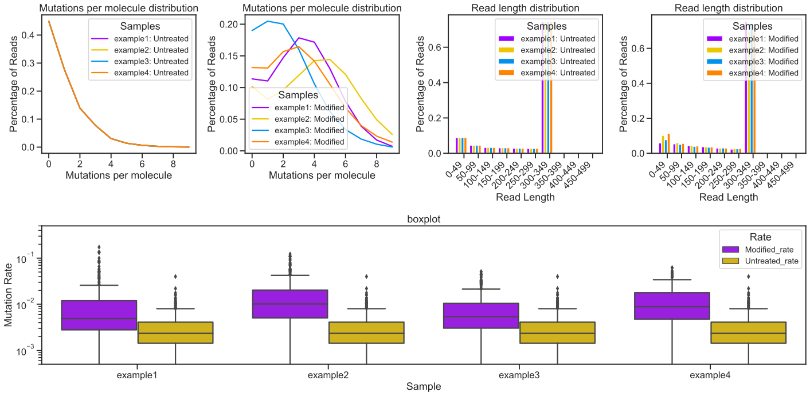
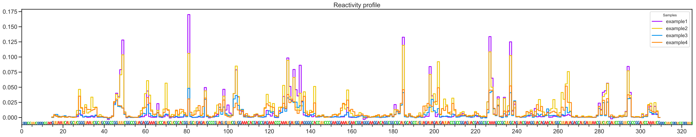
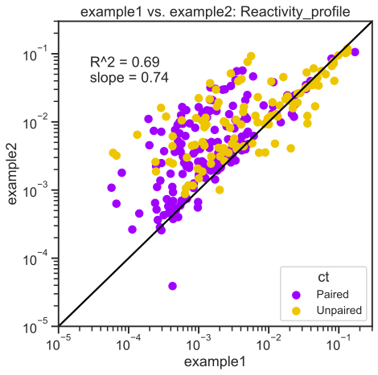
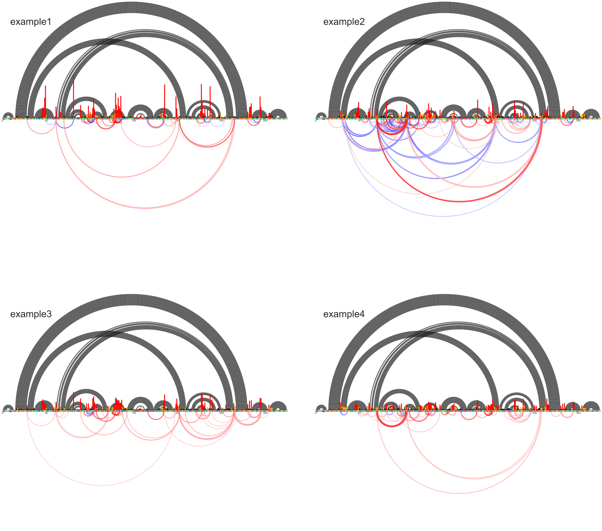
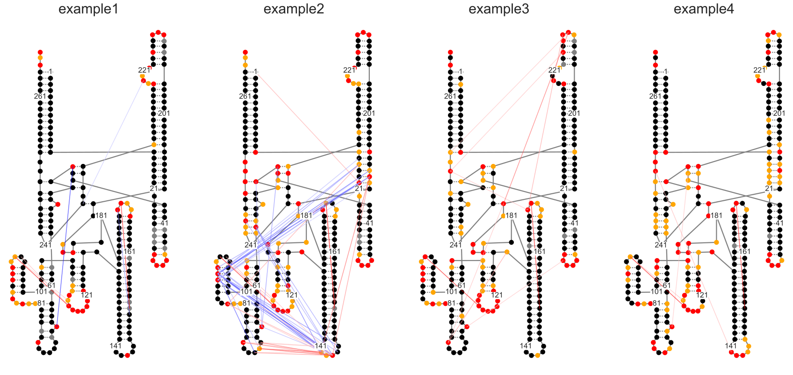

Plotting multiple samples
=========================

Contents:
- [Notebook set-up](#notebook-set-up)
- [Initializing MaP sample](#initializing-map-sample)
- [ShapeMapper QC](#shapemapper-qc)
- [Skyline plots](#skyline-plots)
- [Arc Plots](#arc-plots)
- [Secondary Structure](#secondary-structure)

Notebook set-up
---------------


```python
# This sets plots to display in-line by default
%matplotlib inline

# Import module. For high-level functions, no additional modules are needed
import plotmapper as MaP

# Creates an HTML button that hides/shows code cells
# Useful for lab notebook reports and research updates
# Note: This works in html and jupyter notebooks
#   but not github markdown (where you are likely looking.)
MaP.create_code_button()
```


<script>
                 code_show=true;
                 function code_toggle() {
                 if (code_show) {$('div.input').hide();}
                 else {$('div.input').show();}
                 code_show = !code_show
                 }
                 $( document ).ready(code_toggle);
                 </script>
                 <form action="javascript:code_toggle()">
                 <input type="submit" value="Hide/show raw code.">
                 </form>


Initializing MaP sample
-----------------------
If you have consistently named files, (which you should), you can use a function to create a dictionary of keyword arguments (kwargs). Then, "unpack" the dictionary using the double asterisk.


```python
path = 'data/'
def kwargs(sample):
    kwargs = {}
    kwargs["sample"] = sample
    kwargs["profile"] = path+sample+"_rnasep_profile.txt"
    kwargs["ct"] = path+"RNaseP.ct"
    kwargs["ss"] = path+"RC_CRYSTAL_STRUCTURE.xrna"
    kwargs["rings"] = path+sample+"-rnasep.corrs"
    kwargs["pairs"] = path+sample+"-rnasep-pairmap.txt"
    kwargs["log"] = path+sample+"_shapemapper_log.txt"
    kwargs["dance_prefix"] = path+sample+"_rnasep"
    kwargs["deletions"] = "data/example-rnasep-deletions.txt"
    kwargs["fasta"] = "data/RNaseP-noSC.fasta"
    kwargs["pdb"] = "data/3dhs_Correct.pdb"
    kwargs["pdb_name"] = "3dhs"
    return kwargs

samples = [MaP.Sample(**kwargs("example"+n)) for n in "1234"]
```

ShapeMapper QC
--------------

This plot is ugly. It will look better in the future, but the function call will stay the same.
- Mutations per Molecule, separated by modified and untreated
- Read length distribution, separated by modified and untreated
- Boxplot of Mutation rates, colored by modified and untreated


```python
MaP.array_qc(samples)
```


    

    


Skyline Plots
-------------
Each sample is plotted on the same skyline.


```python
MaP.array_skyline(samples)
```


    

    


```python
samples[0].make_regression(samples[1])
```


    

    


Arc Plots
---------


```python
MaP.array_ap(samples, ij_data="rings", cdBelow=30)
```


    

    


Secondary Structure
-------------------


```python
MaP.array_ss(samples, ij_data="rings", cdAbove=15, Statistic=15)
```


    

    


## 3D structures


```python
MaP.array_3d(samples, ij_data="pairs")
```


<div id="3dmolviewer_162152240695076"  style="position: relative; width: 800px; height: 800px">
        <p id="3dmolwarning_162152240695076" style="background-color:#ffcccc;color:black">You appear to be running in JupyterLab (or JavaScript failed to load for some other reason).  You need to install the 3dmol extension: <br>
        <tt>jupyter labextension install jupyterlab_3dmol</tt></p>
        </div>
<script>

var loadScriptAsync = function(uri){
  return new Promise((resolve, reject) => {
    var tag = document.createElement('script');
    tag.src = uri;
    tag.async = true;
    tag.onload = () => {
      resolve();
    };
  var firstScriptTag = document.getElementsByTagName('script')[0];
  firstScriptTag.parentNode.insertBefore(tag, firstScriptTag);
});
};

if(typeof $3Dmolpromise === 'undefined') {
$3Dmolpromise = null;
  $3Dmolpromise = loadScriptAsync('https://3dmol.org/build/3Dmol.js');
}

var viewer_162152240695076 = null;
var warn = document.getElementById("3dmolwarning_162152240695076");
if(warn) {
    warn.parentNode.removeChild(warn);
}
$3Dmolpromise.then(function() {
var viewergrid_162152240695076 = null;
viewergrid_162152240695076 = $3Dmol.createViewerGrid($("#3dmolviewer_162152240695076"),{rows: 2, cols: 2, control_all: true},{backgroundColor:"white"});
viewer_162152240695076 = viewergrid_162152240695076[0][0];
$3Dmol.download("pdb:3dhs", viewergrid_162152240695076[0][0], {}, function() {
$3Dmol.download("pdb:3dhs", viewergrid_162152240695076[0][1], {}, function() {
$3Dmol.download("pdb:3dhs", viewergrid_162152240695076[1][0], {}, function() {
$3Dmol.download("pdb:3dhs", viewergrid_162152240695076[1][1], {}, function() {
viewergrid_162152240695076[0][0].zoomTo();viewergrid_162152240695076[0][1].zoomTo();viewergrid_162152240695076[1][0].zoomTo();viewergrid_162152240695076[1][1].zoomTo();	viewergrid_162152240695076[0][0].setStyle({"model": -1, "serial": 1},{"cartoon": {"color": "black", "opacity": 0.8}});
	viewergrid_162152240695076[0][0].setStyle({"model": -1, "serial": 2},{"cartoon": {"color": "black", "opacity": 0.8}});
	viewergrid_162152240695076[0][0].setStyle({"model": -1, "serial": 3},{"cartoon": {"color": "black", "opacity": 0.8}});
	viewergrid_162152240695076[0][0].setStyle({"model": -1, "serial": 4},{"cartoon": {"color": "black", "opacity": 0.8}});
	viewergrid_162152240695076[0][0].setStyle({"model": -1, "serial": 5},{"cartoon": {"color": "black", "opacity": 0.8}});
	viewergrid_162152240695076[0][0].setStyle({"model": -1, "serial": 6},{"cartoon": {"color": "black", "opacity": 0.8}});
	viewergrid_162152240695076[0][0].setStyle({"model": -1, "serial": 7},{"cartoon": {"color": "black", "opacity": 0.8}});
	viewergrid_162152240695076[0][0].setStyle({"model": -1, "serial": 8},{"cartoon": {"color": "black", "opacity": 0.8}});
	viewergrid_162152240695076[0][0].setStyle({"model": -1, "serial": 9},{"cartoon": {"color": "black", "opacity": 0.8}});
	viewergrid_162152240695076[0][0].setStyle({"model": -1, "serial": 10},{"cartoon": {"color": "black", "opacity": 0.8}});
	viewergrid_162152240695076[0][0].setStyle({"model": -1, "serial": 11},{"cartoon": {"color": "black", "opacity": 0.8}});
	viewergrid_162152240695076[0][0].setStyle({"model": -1, "serial": 12},{"cartoon": {"color": "black", "opacity": 0.8}});
	viewergrid_162152240695076[0][0].setStyle({"model": -1, "serial": 13},{"cartoon": {"color": "black", "opacity": 0.8}});
	viewergrid_162152240695076[0][0].setStyle({"model": -1, "serial": 14},{"cartoon": {"color": "black", "opacity": 0.8}});
	viewergrid_162152240695076[0][0].setStyle({"model": -1, "serial": 15},{"cartoon": {"color": "black", "opacity": 0.8}});
	viewergrid_162152240695076[0][0].setStyle({"model": -1, "serial": 16},{"cartoon": {"color": "black", "opacity": 0.8}});
	viewergrid_162152240695076[0][0].setStyle({"model": -1, "serial": 17},{"cartoon": {"color": "black", "opacity": 0.8}});
	viewergrid_162152240695076[0][0].setStyle({"model": -1, "serial": 18},{"cartoon": {"color": "black", "opacity": 0.8}});
	viewergrid_162152240695076[0][0].setStyle({"model": -1, "serial": 19},{"cartoon": {"color": "black", "opacity": 0.8}});
	viewergrid_162152240695076[0][0].setStyle({"model": -1, "serial": 20},{"cartoon": {"color": "black", "opacity": 0.8}});
	viewergrid_162152240695076[0][0].setStyle({"model": -1, "serial": 21},{"cartoon": {"color": "black", "opacity": 0.8}});
	viewergrid_162152240695076[0][0].setStyle({"model": -1, "serial": 22},{"cartoon": {"color": "black", "opacity": 0.8}});
	viewergrid_162152240695076[0][0].setStyle({"model": -1, "serial": 23},{"cartoon": {"color": "black", "opacity": 0.8}});
	viewergrid_162152240695076[0][0].setStyle({"model": -1, "serial": 24},{"cartoon": {"color": "black", "opacity": 0.8}});
	viewergrid_162152240695076[0][0].setStyle({"model": -1, "serial": 25},{"cartoon": {"color": "black", "opacity": 0.8}});
	viewergrid_162152240695076[0][0].setStyle({"model": -1, "serial": 26},{"cartoon": {"color": "black", "opacity": 0.8}});
	viewergrid_162152240695076[0][0].setStyle({"model": -1, "serial": 27},{"cartoon": {"color": "black", "opacity": 0.8}});
	viewergrid_162152240695076[0][0].setStyle({"model": -1, "serial": 28},{"cartoon": {"color": "black", "opacity": 0.8}});
	viewergrid_162152240695076[0][0].setStyle({"model": -1, "serial": 29},{"cartoon": {"color": "black", "opacity": 0.8}});
	viewergrid_162152240695076[0][0].setStyle({"model": -1, "serial": 30},{"cartoon": {"color": "black", "opacity": 0.8}});
	viewergrid_162152240695076[0][0].setStyle({"model": -1, "serial": 31},{"cartoon": {"color": "black", "opacity": 0.8}});
	viewergrid_162152240695076[0][0].setStyle({"model": -1, "serial": 32},{"cartoon": {"color": "black", "opacity": 0.8}});
	viewergrid_162152240695076[0][0].setStyle({"model": -1, "serial": 33},{"cartoon": {"color": "black", "opacity": 0.8}});
	viewergrid_162152240695076[0][0].setStyle({"model": -1, "serial": 34},{"cartoon": {"color": "black", "opacity": 0.8}});
	viewergrid_162152240695076[0][0].setStyle({"model": -1, "serial": 35},{"cartoon": {"color": "black", "opacity": 0.8}});
	viewergrid_162152240695076[0][0].setStyle({"model": -1, "serial": 36},{"cartoon": {"color": "black", "opacity": 0.8}});
	viewergrid_162152240695076[0][0].setStyle({"model": -1, "serial": 37},{"cartoon": {"color": "black", "opacity": 0.8}});
	viewergrid_162152240695076[0][0].setStyle({"model": -1, "serial": 38},{"cartoon": {"color": "black", "opacity": 0.8}});
	viewergrid_162152240695076[0][0].setStyle({"model": -1, "serial": 39},{"cartoon": {"color": "black", "opacity": 0.8}});
	viewergrid_162152240695076[0][0].setStyle({"model": -1, "serial": 40},{"cartoon": {"color": "black", "opacity": 0.8}});
	viewergrid_162152240695076[0][0].setStyle({"model": -1, "serial": 41},{"cartoon": {"color": "black", "opacity": 0.8}});
	viewergrid_162152240695076[0][0].setStyle({"model": -1, "serial": 42},{"cartoon": {"color": "black", "opacity": 0.8}});
	viewergrid_162152240695076[0][0].setStyle({"model": -1, "serial": 43},{"cartoon": {"color": "black", "opacity": 0.8}});
	viewergrid_162152240695076[0][0].setStyle({"model": -1, "serial": 44},{"cartoon": {"color": "black", "opacity": 0.8}});
	viewergrid_162152240695076[0][0].setStyle({"model": -1, "serial": 45},{"cartoon": {"color": "black", "opacity": 0.8}});
	viewergrid_162152240695076[0][0].setStyle({"model": -1, "serial": 46},{"cartoon": {"color": "black", "opacity": 0.8}});
	viewergrid_162152240695076[0][0].setStyle({"model": -1, "serial": 47},{"cartoon": {"color": "black", "opacity": 0.8}});
	viewergrid_162152240695076[0][0].setStyle({"model": -1, "serial": 48},{"cartoon": {"color": "black", "opacity": 0.8}});
	viewergrid_162152240695076[0][0].setStyle({"model": -1, "serial": 49},{"cartoon": {"color": "black", "opacity": 0.8}});
	viewergrid_162152240695076[0][0].setStyle({"model": -1, "serial": 50},{"cartoon": {"color": "black", "opacity": 0.8}});
	viewergrid_162152240695076[0][0].setStyle({"model": -1, "serial": 51},{"cartoon": {"color": "black", "opacity": 0.8}});
	viewergrid_162152240695076[0][0].setStyle({"model": -1, "serial": 52},{"cartoon": {"color": "black", "opacity": 0.8}});
	viewergrid_162152240695076[0][0].setStyle({"model": -1, "serial": 53},{"cartoon": {"color": "black", "opacity": 0.8}});
	viewergrid_162152240695076[0][0].setStyle({"model": -1, "serial": 54},{"cartoon": {"color": "black", "opacity": 0.8}});
	viewergrid_162152240695076[0][0].setStyle({"model": -1, "serial": 55},{"cartoon": {"color": "black", "opacity": 0.8}});
	viewergrid_162152240695076[0][0].setStyle({"model": -1, "serial": 56},{"cartoon": {"color": "black", "opacity": 0.8}});
	viewergrid_162152240695076[0][0].setStyle({"model": -1, "serial": 57},{"cartoon": {"color": "black", "opacity": 0.8}});
	viewergrid_162152240695076[0][0].setStyle({"model": -1, "serial": 58},{"cartoon": {"color": "black", "opacity": 0.8}});
	viewergrid_162152240695076[0][0].setStyle({"model": -1, "serial": 59},{"cartoon": {"color": "black", "opacity": 0.8}});
	viewergrid_162152240695076[0][0].setStyle({"model": -1, "serial": 60},{"cartoon": {"color": "black", "opacity": 0.8}});
	viewergrid_162152240695076[0][0].setStyle({"model": -1, "serial": 61},{"cartoon": {"color": "black", "opacity": 0.8}});
	viewergrid_162152240695076[0][0].setStyle({"model": -1, "serial": 62},{"cartoon": {"color": "black", "opacity": 0.8}});
	viewergrid_162152240695076[0][0].setStyle({"model": -1, "serial": 63},{"cartoon": {"color": "black", "opacity": 0.8}});
	viewergrid_162152240695076[0][0].setStyle({"model": -1, "serial": 64},{"cartoon": {"color": "black", "opacity": 0.8}});
	viewergrid_162152240695076[0][0].setStyle({"model": -1, "serial": 65},{"cartoon": {"color": "black", "opacity": 0.8}});
	viewergrid_162152240695076[0][0].setStyle({"model": -1, "serial": 66},{"cartoon": {"color": "black", "opacity": 0.8}});
	viewergrid_162152240695076[0][0].setStyle({"model": -1, "serial": 67},{"cartoon": {"color": "black", "opacity": 0.8}});
	viewergrid_162152240695076[0][0].setStyle({"model": -1, "serial": 68},{"cartoon": {"color": "black", "opacity": 0.8}});
	viewergrid_162152240695076[0][0].setStyle({"model": -1, "serial": 69},{"cartoon": {"color": "black", "opacity": 0.8}});
	viewergrid_162152240695076[0][0].setStyle({"model": -1, "serial": 70},{"cartoon": {"color": "black", "opacity": 0.8}});
	viewergrid_162152240695076[0][0].setStyle({"model": -1, "serial": 71},{"cartoon": {"color": "black", "opacity": 0.8}});
	viewergrid_162152240695076[0][0].setStyle({"model": -1, "serial": 72},{"cartoon": {"color": "black", "opacity": 0.8}});
	viewergrid_162152240695076[0][0].setStyle({"model": -1, "serial": 73},{"cartoon": {"color": "black", "opacity": 0.8}});
	viewergrid_162152240695076[0][0].setStyle({"model": -1, "serial": 74},{"cartoon": {"color": "black", "opacity": 0.8}});
	viewergrid_162152240695076[0][0].setStyle({"model": -1, "serial": 75},{"cartoon": {"color": "black", "opacity": 0.8}});
	viewergrid_162152240695076[0][0].setStyle({"model": -1, "serial": 76},{"cartoon": {"color": "black", "opacity": 0.8}});
	viewergrid_162152240695076[0][0].setStyle({"model": -1, "serial": 77},{"cartoon": {"color": "black", "opacity": 0.8}});
	viewergrid_162152240695076[0][0].setStyle({"model": -1, "serial": 78},{"cartoon": {"color": "black", "opacity": 0.8}});
	viewergrid_162152240695076[0][0].setStyle({"model": -1, "serial": 79},{"cartoon": {"color": "black", "opacity": 0.8}});
	viewergrid_162152240695076[0][0].setStyle({"model": -1, "serial": 80},{"cartoon": {"color": "black", "opacity": 0.8}});
	viewergrid_162152240695076[0][0].setStyle({"model": -1, "serial": 81},{"cartoon": {"color": "black", "opacity": 0.8}});
	viewergrid_162152240695076[0][0].setStyle({"model": -1, "serial": 82},{"cartoon": {"color": "black", "opacity": 0.8}});
	viewergrid_162152240695076[0][0].setStyle({"model": -1, "serial": 83},{"cartoon": {"color": "black", "opacity": 0.8}});
	viewergrid_162152240695076[0][0].setStyle({"model": -1, "serial": 84},{"cartoon": {"color": "black", "opacity": 0.8}});
	viewergrid_162152240695076[0][0].setStyle({"model": -1, "serial": 85},{"cartoon": {"color": "black", "opacity": 0.8}});
	viewergrid_162152240695076[0][0].setStyle({"model": -1, "serial": 86},{"cartoon": {"color": "black", "opacity": 0.8}});
	viewergrid_162152240695076[0][0].setStyle({"model": -1, "serial": 87},{"cartoon": {"color": "black", "opacity": 0.8}});
	viewergrid_162152240695076[0][0].setStyle({"model": -1, "serial": 88},{"cartoon": {"color": "black", "opacity": 0.8}});
	viewergrid_162152240695076[0][0].setStyle({"model": -1, "serial": 89},{"cartoon": {"color": "black", "opacity": 0.8}});
	viewergrid_162152240695076[0][0].setStyle({"model": -1, "serial": 90},{"cartoon": {"color": "black", "opacity": 0.8}});
	viewergrid_162152240695076[0][0].setStyle({"model": -1, "serial": 91},{"cartoon": {"color": "black", "opacity": 0.8}});
	viewergrid_162152240695076[0][0].setStyle({"model": -1, "serial": 92},{"cartoon": {"color": "black", "opacity": 0.8}});
	viewergrid_162152240695076[0][0].setStyle({"model": -1, "serial": 93},{"cartoon": {"color": "black", "opacity": 0.8}});
	viewergrid_162152240695076[0][0].setStyle({"model": -1, "serial": 94},{"cartoon": {"color": "black", "opacity": 0.8}});
	viewergrid_162152240695076[0][0].setStyle({"model": -1, "serial": 95},{"cartoon": {"color": "black", "opacity": 0.8}});
	viewergrid_162152240695076[0][0].setStyle({"model": -1, "serial": 96},{"cartoon": {"color": "black", "opacity": 0.8}});
	viewergrid_162152240695076[0][0].setStyle({"model": -1, "serial": 97},{"cartoon": {"color": "black", "opacity": 0.8}});
	viewergrid_162152240695076[0][0].setStyle({"model": -1, "serial": 98},{"cartoon": {"color": "black", "opacity": 0.8}});
	viewergrid_162152240695076[0][0].setStyle({"model": -1, "serial": 99},{"cartoon": {"color": "black", "opacity": 0.8}});
	viewergrid_162152240695076[0][0].setStyle({"model": -1, "serial": 100},{"cartoon": {"color": "black", "opacity": 0.8}});
	viewergrid_162152240695076[0][0].setStyle({"model": -1, "serial": 101},{"cartoon": {"color": "black", "opacity": 0.8}});
	viewergrid_162152240695076[0][0].setStyle({"model": -1, "serial": 102},{"cartoon": {"color": "black", "opacity": 0.8}});
	viewergrid_162152240695076[0][0].setStyle({"model": -1, "serial": 103},{"cartoon": {"color": "black", "opacity": 0.8}});
	viewergrid_162152240695076[0][0].setStyle({"model": -1, "serial": 104},{"cartoon": {"color": "black", "opacity": 0.8}});
	viewergrid_162152240695076[0][0].setStyle({"model": -1, "serial": 105},{"cartoon": {"color": "black", "opacity": 0.8}});
	viewergrid_162152240695076[0][0].setStyle({"model": -1, "serial": 106},{"cartoon": {"color": "black", "opacity": 0.8}});
	viewergrid_162152240695076[0][0].setStyle({"model": -1, "serial": 107},{"cartoon": {"color": "black", "opacity": 0.8}});
	viewergrid_162152240695076[0][0].setStyle({"model": -1, "serial": 108},{"cartoon": {"color": "black", "opacity": 0.8}});
	viewergrid_162152240695076[0][0].setStyle({"model": -1, "serial": 109},{"cartoon": {"color": "black", "opacity": 0.8}});
	viewergrid_162152240695076[0][0].setStyle({"model": -1, "serial": 110},{"cartoon": {"color": "black", "opacity": 0.8}});
	viewergrid_162152240695076[0][0].setStyle({"model": -1, "serial": 111},{"cartoon": {"color": "black", "opacity": 0.8}});
	viewergrid_162152240695076[0][0].setStyle({"model": -1, "serial": 112},{"cartoon": {"color": "black", "opacity": 0.8}});
	viewergrid_162152240695076[0][0].setStyle({"model": -1, "serial": 113},{"cartoon": {"color": "black", "opacity": 0.8}});
	viewergrid_162152240695076[0][0].setStyle({"model": -1, "serial": 114},{"cartoon": {"color": "black", "opacity": 0.8}});
	viewergrid_162152240695076[0][0].setStyle({"model": -1, "serial": 115},{"cartoon": {"color": "black", "opacity": 0.8}});
	viewergrid_162152240695076[0][0].setStyle({"model": -1, "serial": 116},{"cartoon": {"color": "black", "opacity": 0.8}});
	viewergrid_162152240695076[0][0].setStyle({"model": -1, "serial": 117},{"cartoon": {"color": "black", "opacity": 0.8}});
	viewergrid_162152240695076[0][0].setStyle({"model": -1, "serial": 118},{"cartoon": {"color": "black", "opacity": 0.8}});
	viewergrid_162152240695076[0][0].setStyle({"model": -1, "serial": 119},{"cartoon": {"color": "black", "opacity": 0.8}});
	viewergrid_162152240695076[0][0].setStyle({"model": -1, "serial": 120},{"cartoon": {"color": "black", "opacity": 0.8}});
	viewergrid_162152240695076[0][0].setStyle({"model": -1, "serial": 121},{"cartoon": {"color": "black", "opacity": 0.8}});
	viewergrid_162152240695076[0][0].setStyle({"model": -1, "serial": 122},{"cartoon": {"color": "black", "opacity": 0.8}});
	viewergrid_162152240695076[0][0].setStyle({"model": -1, "serial": 123},{"cartoon": {"color": "black", "opacity": 0.8}});
	viewergrid_162152240695076[0][0].setStyle({"model": -1, "serial": 124},{"cartoon": {"color": "black", "opacity": 0.8}});
	viewergrid_162152240695076[0][0].setStyle({"model": -1, "serial": 125},{"cartoon": {"color": "black", "opacity": 0.8}});
	viewergrid_162152240695076[0][0].setStyle({"model": -1, "serial": 126},{"cartoon": {"color": "black", "opacity": 0.8}});
	viewergrid_162152240695076[0][0].setStyle({"model": -1, "serial": 127},{"cartoon": {"color": "black", "opacity": 0.8}});
	viewergrid_162152240695076[0][0].setStyle({"model": -1, "serial": 128},{"cartoon": {"color": "black", "opacity": 0.8}});
	viewergrid_162152240695076[0][0].setStyle({"model": -1, "serial": 129},{"cartoon": {"color": "black", "opacity": 0.8}});
	viewergrid_162152240695076[0][0].setStyle({"model": -1, "serial": 130},{"cartoon": {"color": "black", "opacity": 0.8}});
	viewergrid_162152240695076[0][0].setStyle({"model": -1, "serial": 131},{"cartoon": {"color": "black", "opacity": 0.8}});
	viewergrid_162152240695076[0][0].setStyle({"model": -1, "serial": 132},{"cartoon": {"color": "black", "opacity": 0.8}});
	viewergrid_162152240695076[0][0].setStyle({"model": -1, "serial": 133},{"cartoon": {"color": "black", "opacity": 0.8}});
	viewergrid_162152240695076[0][0].setStyle({"model": -1, "serial": 134},{"cartoon": {"color": "black", "opacity": 0.8}});
	viewergrid_162152240695076[0][0].setStyle({"model": -1, "serial": 135},{"cartoon": {"color": "black", "opacity": 0.8}});
	viewergrid_162152240695076[0][0].setStyle({"model": -1, "serial": 136},{"cartoon": {"color": "black", "opacity": 0.8}});
	viewergrid_162152240695076[0][0].setStyle({"model": -1, "serial": 137},{"cartoon": {"color": "black", "opacity": 0.8}});
	viewergrid_162152240695076[0][0].setStyle({"model": -1, "serial": 138},{"cartoon": {"color": "black", "opacity": 0.8}});
	viewergrid_162152240695076[0][0].setStyle({"model": -1, "serial": 139},{"cartoon": {"color": "black", "opacity": 0.8}});
	viewergrid_162152240695076[0][0].setStyle({"model": -1, "serial": 140},{"cartoon": {"color": "black", "opacity": 0.8}});
	viewergrid_162152240695076[0][0].setStyle({"model": -1, "serial": 141},{"cartoon": {"color": "black", "opacity": 0.8}});
	viewergrid_162152240695076[0][0].setStyle({"model": -1, "serial": 142},{"cartoon": {"color": "black", "opacity": 0.8}});
	viewergrid_162152240695076[0][0].setStyle({"model": -1, "serial": 143},{"cartoon": {"color": "black", "opacity": 0.8}});
	viewergrid_162152240695076[0][0].setStyle({"model": -1, "serial": 144},{"cartoon": {"color": "black", "opacity": 0.8}});
	viewergrid_162152240695076[0][0].setStyle({"model": -1, "serial": 145},{"cartoon": {"color": "black", "opacity": 0.8}});
	viewergrid_162152240695076[0][0].setStyle({"model": -1, "serial": 146},{"cartoon": {"color": "black", "opacity": 0.8}});
	viewergrid_162152240695076[0][0].setStyle({"model": -1, "serial": 147},{"cartoon": {"color": "black", "opacity": 0.8}});
	viewergrid_162152240695076[0][0].setStyle({"model": -1, "serial": 148},{"cartoon": {"color": "black", "opacity": 0.8}});
	viewergrid_162152240695076[0][0].setStyle({"model": -1, "serial": 149},{"cartoon": {"color": "black", "opacity": 0.8}});
	viewergrid_162152240695076[0][0].setStyle({"model": -1, "serial": 150},{"cartoon": {"color": "black", "opacity": 0.8}});
	viewergrid_162152240695076[0][0].setStyle({"model": -1, "serial": 151},{"cartoon": {"color": "black", "opacity": 0.8}});
	viewergrid_162152240695076[0][0].setStyle({"model": -1, "serial": 152},{"cartoon": {"color": "black", "opacity": 0.8}});
	viewergrid_162152240695076[0][0].setStyle({"model": -1, "serial": 153},{"cartoon": {"color": "black", "opacity": 0.8}});
	viewergrid_162152240695076[0][0].setStyle({"model": -1, "serial": 154},{"cartoon": {"color": "black", "opacity": 0.8}});
	viewergrid_162152240695076[0][0].setStyle({"model": -1, "serial": 155},{"cartoon": {"color": "black", "opacity": 0.8}});
	viewergrid_162152240695076[0][0].setStyle({"model": -1, "serial": 156},{"cartoon": {"color": "black", "opacity": 0.8}});
	viewergrid_162152240695076[0][0].setStyle({"model": -1, "serial": 157},{"cartoon": {"color": "black", "opacity": 0.8}});
	viewergrid_162152240695076[0][0].setStyle({"model": -1, "serial": 158},{"cartoon": {"color": "black", "opacity": 0.8}});
	viewergrid_162152240695076[0][0].setStyle({"model": -1, "serial": 159},{"cartoon": {"color": "black", "opacity": 0.8}});
	viewergrid_162152240695076[0][0].setStyle({"model": -1, "serial": 160},{"cartoon": {"color": "black", "opacity": 0.8}});
	viewergrid_162152240695076[0][0].setStyle({"model": -1, "serial": 161},{"cartoon": {"color": "black", "opacity": 0.8}});
	viewergrid_162152240695076[0][0].setStyle({"model": -1, "serial": 162},{"cartoon": {"color": "black", "opacity": 0.8}});
	viewergrid_162152240695076[0][0].setStyle({"model": -1, "serial": 163},{"cartoon": {"color": "black", "opacity": 0.8}});
	viewergrid_162152240695076[0][0].setStyle({"model": -1, "serial": 164},{"cartoon": {"color": "black", "opacity": 0.8}});
	viewergrid_162152240695076[0][0].setStyle({"model": -1, "serial": 165},{"cartoon": {"color": "black", "opacity": 0.8}});
	viewergrid_162152240695076[0][0].setStyle({"model": -1, "serial": 166},{"cartoon": {"color": "black", "opacity": 0.8}});
	viewergrid_162152240695076[0][0].setStyle({"model": -1, "serial": 167},{"cartoon": {"color": "black", "opacity": 0.8}});
	viewergrid_162152240695076[0][0].setStyle({"model": -1, "serial": 168},{"cartoon": {"color": "black", "opacity": 0.8}});
	viewergrid_162152240695076[0][0].setStyle({"model": -1, "serial": 169},{"cartoon": {"color": "black", "opacity": 0.8}});
	viewergrid_162152240695076[0][0].setStyle({"model": -1, "serial": 170},{"cartoon": {"color": "black", "opacity": 0.8}});
	viewergrid_162152240695076[0][0].setStyle({"model": -1, "serial": 171},{"cartoon": {"color": "black", "opacity": 0.8}});
	viewergrid_162152240695076[0][0].setStyle({"model": -1, "serial": 172},{"cartoon": {"color": "black", "opacity": 0.8}});
	viewergrid_162152240695076[0][0].setStyle({"model": -1, "serial": 173},{"cartoon": {"color": "black", "opacity": 0.8}});
	viewergrid_162152240695076[0][0].setStyle({"model": -1, "serial": 174},{"cartoon": {"color": "black", "opacity": 0.8}});
	viewergrid_162152240695076[0][0].setStyle({"model": -1, "serial": 175},{"cartoon": {"color": "black", "opacity": 0.8}});
	viewergrid_162152240695076[0][0].setStyle({"model": -1, "serial": 176},{"cartoon": {"color": "black", "opacity": 0.8}});
	viewergrid_162152240695076[0][0].setStyle({"model": -1, "serial": 177},{"cartoon": {"color": "black", "opacity": 0.8}});
	viewergrid_162152240695076[0][0].setStyle({"model": -1, "serial": 178},{"cartoon": {"color": "black", "opacity": 0.8}});
	viewergrid_162152240695076[0][0].setStyle({"model": -1, "serial": 179},{"cartoon": {"color": "black", "opacity": 0.8}});
	viewergrid_162152240695076[0][0].setStyle({"model": -1, "serial": 180},{"cartoon": {"color": "black", "opacity": 0.8}});
	viewergrid_162152240695076[0][0].setStyle({"model": -1, "serial": 181},{"cartoon": {"color": "black", "opacity": 0.8}});
	viewergrid_162152240695076[0][0].setStyle({"model": -1, "serial": 182},{"cartoon": {"color": "black", "opacity": 0.8}});
	viewergrid_162152240695076[0][0].setStyle({"model": -1, "serial": 183},{"cartoon": {"color": "black", "opacity": 0.8}});
	viewergrid_162152240695076[0][0].setStyle({"model": -1, "serial": 184},{"cartoon": {"color": "black", "opacity": 0.8}});
	viewergrid_162152240695076[0][0].setStyle({"model": -1, "serial": 185},{"cartoon": {"color": "black", "opacity": 0.8}});
	viewergrid_162152240695076[0][0].setStyle({"model": -1, "serial": 186},{"cartoon": {"color": "black", "opacity": 0.8}});
	viewergrid_162152240695076[0][0].setStyle({"model": -1, "serial": 187},{"cartoon": {"color": "black", "opacity": 0.8}});
	viewergrid_162152240695076[0][0].setStyle({"model": -1, "serial": 188},{"cartoon": {"color": "black", "opacity": 0.8}});
	viewergrid_162152240695076[0][0].setStyle({"model": -1, "serial": 189},{"cartoon": {"color": "black", "opacity": 0.8}});
	viewergrid_162152240695076[0][0].setStyle({"model": -1, "serial": 190},{"cartoon": {"color": "black", "opacity": 0.8}});
	viewergrid_162152240695076[0][0].setStyle({"model": -1, "serial": 191},{"cartoon": {"color": "black", "opacity": 0.8}});
	viewergrid_162152240695076[0][0].setStyle({"model": -1, "serial": 192},{"cartoon": {"color": "black", "opacity": 0.8}});
	viewergrid_162152240695076[0][0].setStyle({"model": -1, "serial": 193},{"cartoon": {"color": "black", "opacity": 0.8}});
	viewergrid_162152240695076[0][0].setStyle({"model": -1, "serial": 194},{"cartoon": {"color": "black", "opacity": 0.8}});
	viewergrid_162152240695076[0][0].setStyle({"model": -1, "serial": 195},{"cartoon": {"color": "black", "opacity": 0.8}});
	viewergrid_162152240695076[0][0].setStyle({"model": -1, "serial": 196},{"cartoon": {"color": "black", "opacity": 0.8}});
	viewergrid_162152240695076[0][0].setStyle({"model": -1, "serial": 197},{"cartoon": {"color": "black", "opacity": 0.8}});
	viewergrid_162152240695076[0][0].setStyle({"model": -1, "serial": 198},{"cartoon": {"color": "black", "opacity": 0.8}});
	viewergrid_162152240695076[0][0].setStyle({"model": -1, "serial": 199},{"cartoon": {"color": "black", "opacity": 0.8}});
	viewergrid_162152240695076[0][0].setStyle({"model": -1, "serial": 200},{"cartoon": {"color": "black", "opacity": 0.8}});
	viewergrid_162152240695076[0][0].setStyle({"model": -1, "serial": 201},{"cartoon": {"color": "black", "opacity": 0.8}});
	viewergrid_162152240695076[0][0].setStyle({"model": -1, "serial": 202},{"cartoon": {"color": "black", "opacity": 0.8}});
	viewergrid_162152240695076[0][0].setStyle({"model": -1, "serial": 203},{"cartoon": {"color": "black", "opacity": 0.8}});
	viewergrid_162152240695076[0][0].setStyle({"model": -1, "serial": 204},{"cartoon": {"color": "black", "opacity": 0.8}});
	viewergrid_162152240695076[0][0].setStyle({"model": -1, "serial": 205},{"cartoon": {"color": "black", "opacity": 0.8}});
	viewergrid_162152240695076[0][0].setStyle({"model": -1, "serial": 206},{"cartoon": {"color": "black", "opacity": 0.8}});
	viewergrid_162152240695076[0][0].setStyle({"model": -1, "serial": 207},{"cartoon": {"color": "black", "opacity": 0.8}});
	viewergrid_162152240695076[0][0].setStyle({"model": -1, "serial": 208},{"cartoon": {"color": "black", "opacity": 0.8}});
	viewergrid_162152240695076[0][0].setStyle({"model": -1, "serial": 209},{"cartoon": {"color": "black", "opacity": 0.8}});
	viewergrid_162152240695076[0][0].setStyle({"model": -1, "serial": 210},{"cartoon": {"color": "black", "opacity": 0.8}});
	viewergrid_162152240695076[0][0].setStyle({"model": -1, "serial": 211},{"cartoon": {"color": "black", "opacity": 0.8}});
	viewergrid_162152240695076[0][0].setStyle({"model": -1, "serial": 212},{"cartoon": {"color": "black", "opacity": 0.8}});
	viewergrid_162152240695076[0][0].setStyle({"model": -1, "serial": 213},{"cartoon": {"color": "black", "opacity": 0.8}});
	viewergrid_162152240695076[0][0].setStyle({"model": -1, "serial": 214},{"cartoon": {"color": "black", "opacity": 0.8}});
	viewergrid_162152240695076[0][0].setStyle({"model": -1, "serial": 215},{"cartoon": {"color": "black", "opacity": 0.8}});
	viewergrid_162152240695076[0][0].setStyle({"model": -1, "serial": 216},{"cartoon": {"color": "black", "opacity": 0.8}});
	viewergrid_162152240695076[0][0].setStyle({"model": -1, "serial": 217},{"cartoon": {"color": "black", "opacity": 0.8}});
	viewergrid_162152240695076[0][0].setStyle({"model": -1, "serial": 218},{"cartoon": {"color": "black", "opacity": 0.8}});
	viewergrid_162152240695076[0][0].setStyle({"model": -1, "serial": 219},{"cartoon": {"color": "black", "opacity": 0.8}});
	viewergrid_162152240695076[0][0].setStyle({"model": -1, "serial": 220},{"cartoon": {"color": "black", "opacity": 0.8}});
	viewergrid_162152240695076[0][0].setStyle({"model": -1, "serial": 221},{"cartoon": {"color": "black", "opacity": 0.8}});
	viewergrid_162152240695076[0][0].setStyle({"model": -1, "serial": 222},{"cartoon": {"color": "black", "opacity": 0.8}});
	viewergrid_162152240695076[0][0].setStyle({"model": -1, "serial": 223},{"cartoon": {"color": "black", "opacity": 0.8}});
	viewergrid_162152240695076[0][0].setStyle({"model": -1, "serial": 224},{"cartoon": {"color": "black", "opacity": 0.8}});
	viewergrid_162152240695076[0][0].setStyle({"model": -1, "serial": 225},{"cartoon": {"color": "black", "opacity": 0.8}});
	viewergrid_162152240695076[0][0].setStyle({"model": -1, "serial": 226},{"cartoon": {"color": "black", "opacity": 0.8}});
	viewergrid_162152240695076[0][0].setStyle({"model": -1, "serial": 227},{"cartoon": {"color": "black", "opacity": 0.8}});
	viewergrid_162152240695076[0][0].setStyle({"model": -1, "serial": 228},{"cartoon": {"color": "black", "opacity": 0.8}});
	viewergrid_162152240695076[0][0].setStyle({"model": -1, "serial": 229},{"cartoon": {"color": "black", "opacity": 0.8}});
	viewergrid_162152240695076[0][0].setStyle({"model": -1, "serial": 230},{"cartoon": {"color": "black", "opacity": 0.8}});
	viewergrid_162152240695076[0][0].setStyle({"model": -1, "serial": 231},{"cartoon": {"color": "black", "opacity": 0.8}});
	viewergrid_162152240695076[0][0].setStyle({"model": -1, "serial": 232},{"cartoon": {"color": "black", "opacity": 0.8}});
	viewergrid_162152240695076[0][0].setStyle({"model": -1, "serial": 233},{"cartoon": {"color": "black", "opacity": 0.8}});
	viewergrid_162152240695076[0][0].setStyle({"model": -1, "serial": 234},{"cartoon": {"color": "black", "opacity": 0.8}});
	viewergrid_162152240695076[0][0].setStyle({"model": -1, "serial": 235},{"cartoon": {"color": "black", "opacity": 0.8}});
	viewergrid_162152240695076[0][0].setStyle({"model": -1, "serial": 236},{"cartoon": {"color": "black", "opacity": 0.8}});
	viewergrid_162152240695076[0][0].setStyle({"model": -1, "serial": 237},{"cartoon": {"color": "black", "opacity": 0.8}});
	viewergrid_162152240695076[0][0].setStyle({"model": -1, "serial": 238},{"cartoon": {"color": "black", "opacity": 0.8}});
	viewergrid_162152240695076[0][0].setStyle({"model": -1, "serial": 239},{"cartoon": {"color": "black", "opacity": 0.8}});
	viewergrid_162152240695076[0][0].setStyle({"model": -1, "serial": 240},{"cartoon": {"color": "black", "opacity": 0.8}});
	viewergrid_162152240695076[0][0].setStyle({"model": -1, "serial": 241},{"cartoon": {"color": "black", "opacity": 0.8}});
	viewergrid_162152240695076[0][0].setStyle({"model": -1, "serial": 242},{"cartoon": {"color": "black", "opacity": 0.8}});
	viewergrid_162152240695076[0][0].setStyle({"model": -1, "serial": 243},{"cartoon": {"color": "black", "opacity": 0.8}});
	viewergrid_162152240695076[0][0].setStyle({"model": -1, "serial": 244},{"cartoon": {"color": "black", "opacity": 0.8}});
	viewergrid_162152240695076[0][0].setStyle({"model": -1, "serial": 245},{"cartoon": {"color": "black", "opacity": 0.8}});
	viewergrid_162152240695076[0][0].setStyle({"model": -1, "serial": 246},{"cartoon": {"color": "black", "opacity": 0.8}});
	viewergrid_162152240695076[0][0].setStyle({"model": -1, "serial": 247},{"cartoon": {"color": "black", "opacity": 0.8}});
	viewergrid_162152240695076[0][0].setStyle({"model": -1, "serial": 248},{"cartoon": {"color": "black", "opacity": 0.8}});
	viewergrid_162152240695076[0][0].setStyle({"model": -1, "serial": 249},{"cartoon": {"color": "black", "opacity": 0.8}});
	viewergrid_162152240695076[0][0].setStyle({"model": -1, "serial": 250},{"cartoon": {"color": "black", "opacity": 0.8}});
	viewergrid_162152240695076[0][0].setStyle({"model": -1, "serial": 251},{"cartoon": {"color": "black", "opacity": 0.8}});
	viewergrid_162152240695076[0][0].setStyle({"model": -1, "serial": 252},{"cartoon": {"color": "black", "opacity": 0.8}});
	viewergrid_162152240695076[0][0].setStyle({"model": -1, "serial": 253},{"cartoon": {"color": "black", "opacity": 0.8}});
	viewergrid_162152240695076[0][0].setStyle({"model": -1, "serial": 254},{"cartoon": {"color": "black", "opacity": 0.8}});
	viewergrid_162152240695076[0][0].setStyle({"model": -1, "serial": 255},{"cartoon": {"color": "black", "opacity": 0.8}});
	viewergrid_162152240695076[0][0].setStyle({"model": -1, "serial": 256},{"cartoon": {"color": "black", "opacity": 0.8}});
	viewergrid_162152240695076[0][0].setStyle({"model": -1, "serial": 257},{"cartoon": {"color": "black", "opacity": 0.8}});
	viewergrid_162152240695076[0][0].setStyle({"model": -1, "serial": 258},{"cartoon": {"color": "black", "opacity": 0.8}});
	viewergrid_162152240695076[0][0].setStyle({"model": -1, "serial": 259},{"cartoon": {"color": "black", "opacity": 0.8}});
	viewergrid_162152240695076[0][0].setStyle({"model": -1, "serial": 260},{"cartoon": {"color": "black", "opacity": 0.8}});
	viewergrid_162152240695076[0][0].setStyle({"model": -1, "serial": 261},{"cartoon": {"color": "black", "opacity": 0.8}});
	viewergrid_162152240695076[0][0].setStyle({"model": -1, "serial": 262},{"cartoon": {"color": "black", "opacity": 0.8}});
	viewergrid_162152240695076[0][0].setStyle({"model": -1, "serial": 263},{"cartoon": {"color": "black", "opacity": 0.8}});
	viewergrid_162152240695076[0][0].setStyle({"model": -1, "serial": 264},{"cartoon": {"color": "black", "opacity": 0.8}});
	viewergrid_162152240695076[0][0].setStyle({"model": -1, "serial": 265},{"cartoon": {"color": "black", "opacity": 0.8}});
	viewergrid_162152240695076[0][0].setStyle({"model": -1, "serial": 266},{"cartoon": {"color": "black", "opacity": 0.8}});
	viewergrid_162152240695076[0][0].setStyle({"model": -1, "serial": 267},{"cartoon": {"color": "black", "opacity": 0.8}});
	viewergrid_162152240695076[0][0].setStyle({"model": -1, "serial": 268},{"cartoon": {"color": "black", "opacity": 0.8}});
	viewergrid_162152240695076[0][0].setStyle({"model": -1, "serial": 269},{"cartoon": {"color": "black", "opacity": 0.8}});
	viewergrid_162152240695076[0][0].setStyle({"model": -1, "serial": 270},{"cartoon": {"color": "black", "opacity": 0.8}});
	viewergrid_162152240695076[0][0].setStyle({"model": -1, "serial": 271},{"cartoon": {"color": "black", "opacity": 0.8}});
	viewergrid_162152240695076[0][0].setStyle({"model": -1, "serial": 272},{"cartoon": {"color": "black", "opacity": 0.8}});
	viewergrid_162152240695076[0][0].setStyle({"model": -1, "serial": 273},{"cartoon": {"color": "black", "opacity": 0.8}});
	viewergrid_162152240695076[0][0].setStyle({"model": -1, "serial": 274},{"cartoon": {"color": "black", "opacity": 0.8}});
	viewergrid_162152240695076[0][0].setStyle({"model": -1, "serial": 275},{"cartoon": {"color": "black", "opacity": 0.8}});
	viewergrid_162152240695076[0][0].setStyle({"model": -1, "serial": 276},{"cartoon": {"color": "black", "opacity": 0.8}});
	viewergrid_162152240695076[0][0].setStyle({"model": -1, "serial": 277},{"cartoon": {"color": "black", "opacity": 0.8}});
	viewergrid_162152240695076[0][0].setStyle({"model": -1, "serial": 278},{"cartoon": {"color": "black", "opacity": 0.8}});
	viewergrid_162152240695076[0][0].setStyle({"model": -1, "serial": 279},{"cartoon": {"color": "black", "opacity": 0.8}});
	viewergrid_162152240695076[0][0].setStyle({"model": -1, "serial": 280},{"cartoon": {"color": "black", "opacity": 0.8}});
	viewergrid_162152240695076[0][0].setStyle({"model": -1, "serial": 281},{"cartoon": {"color": "black", "opacity": 0.8}});
	viewergrid_162152240695076[0][0].setStyle({"model": -1, "serial": 282},{"cartoon": {"color": "black", "opacity": 0.8}});
	viewergrid_162152240695076[0][0].setStyle({"model": -1, "serial": 283},{"cartoon": {"color": "black", "opacity": 0.8}});
	viewergrid_162152240695076[0][0].setStyle({"model": -1, "serial": 284},{"cartoon": {"color": "black", "opacity": 0.8}});
	viewergrid_162152240695076[0][0].setStyle({"model": -1, "serial": 285},{"cartoon": {"color": "black", "opacity": 0.8}});
	viewergrid_162152240695076[0][0].setStyle({"model": -1, "serial": 286},{"cartoon": {"color": "black", "opacity": 0.8}});
	viewergrid_162152240695076[0][0].setStyle({"model": -1, "serial": 287},{"cartoon": {"color": "black", "opacity": 0.8}});
	viewergrid_162152240695076[0][0].setStyle({"model": -1, "serial": 288},{"cartoon": {"color": "black", "opacity": 0.8}});
	viewergrid_162152240695076[0][0].setStyle({"model": -1, "serial": 289},{"cartoon": {"color": "black", "opacity": 0.8}});
	viewergrid_162152240695076[0][0].setStyle({"model": -1, "serial": 290},{"cartoon": {"color": "black", "opacity": 0.8}});
	viewergrid_162152240695076[0][0].setStyle({"model": -1, "serial": 291},{"cartoon": {"color": "black", "opacity": 0.8}});
	viewergrid_162152240695076[0][0].setStyle({"model": -1, "serial": 292},{"cartoon": {"color": "black", "opacity": 0.8}});
	viewergrid_162152240695076[0][0].setStyle({"model": -1, "serial": 293},{"cartoon": {"color": "black", "opacity": 0.8}});
	viewergrid_162152240695076[0][0].setStyle({"model": -1, "serial": 294},{"cartoon": {"color": "black", "opacity": 0.8}});
	viewergrid_162152240695076[0][0].setStyle({"model": -1, "serial": 295},{"cartoon": {"color": "black", "opacity": 0.8}});
	viewergrid_162152240695076[0][0].setStyle({"model": -1, "serial": 296},{"cartoon": {"color": "black", "opacity": 0.8}});
	viewergrid_162152240695076[0][0].setStyle({"model": -1, "serial": 297},{"cartoon": {"color": "black", "opacity": 0.8}});
	viewergrid_162152240695076[0][0].setStyle({"model": -1, "serial": 298},{"cartoon": {"color": "black", "opacity": 0.8}});
	viewergrid_162152240695076[0][0].setStyle({"model": -1, "serial": 299},{"cartoon": {"color": "black", "opacity": 0.8}});
	viewergrid_162152240695076[0][0].setStyle({"model": -1, "serial": 300},{"cartoon": {"color": "black", "opacity": 0.8}});
	viewergrid_162152240695076[0][0].setStyle({"model": -1, "serial": 301},{"cartoon": {"color": "black", "opacity": 0.8}});
	viewergrid_162152240695076[0][0].setStyle({"model": -1, "serial": 302},{"cartoon": {"color": "black", "opacity": 0.8}});
	viewergrid_162152240695076[0][0].setStyle({"model": -1, "serial": 303},{"cartoon": {"color": "black", "opacity": 0.8}});
	viewergrid_162152240695076[0][0].setStyle({"model": -1, "serial": 304},{"cartoon": {"color": "black", "opacity": 0.8}});
	viewergrid_162152240695076[0][0].setStyle({"model": -1, "serial": 305},{"cartoon": {"color": "black", "opacity": 0.8}});
	viewergrid_162152240695076[0][0].setStyle({"model": -1, "serial": 306},{"cartoon": {"color": "black", "opacity": 0.8}});
	viewergrid_162152240695076[0][0].setStyle({"model": -1, "serial": 307},{"cartoon": {"color": "black", "opacity": 0.8}});
	viewergrid_162152240695076[0][0].setStyle({"model": -1, "serial": 308},{"cartoon": {"color": "black", "opacity": 0.8}});
	viewergrid_162152240695076[0][0].setStyle({"model": -1, "serial": 309},{"cartoon": {"color": "black", "opacity": 0.8}});
	viewergrid_162152240695076[0][0].setStyle({"model": -1, "serial": 310},{"cartoon": {"color": "black", "opacity": 0.8}});
	viewergrid_162152240695076[0][0].setStyle({"model": -1, "serial": 311},{"cartoon": {"color": "black", "opacity": 0.8}});
	viewergrid_162152240695076[0][0].setStyle({"model": -1, "serial": 312},{"cartoon": {"color": "black", "opacity": 0.8}});
	viewergrid_162152240695076[0][0].setStyle({"model": -1, "serial": 313},{"cartoon": {"color": "black", "opacity": 0.8}});
	viewergrid_162152240695076[0][0].setStyle({"model": -1, "serial": 314},{"cartoon": {"color": "black", "opacity": 0.8}});
	viewergrid_162152240695076[0][0].setStyle({"model": -1, "serial": 315},{"cartoon": {"color": "black", "opacity": 0.8}});
	viewergrid_162152240695076[0][0].setStyle({"model": -1, "serial": 316},{"cartoon": {"color": "black", "opacity": 0.8}});
	viewergrid_162152240695076[0][0].setStyle({"model": -1, "serial": 317},{"cartoon": {"color": "black", "opacity": 0.8}});
	viewergrid_162152240695076[0][0].setStyle({"model": -1, "serial": 318},{"cartoon": {"color": "black", "opacity": 0.8}});
	viewergrid_162152240695076[0][0].setStyle({"model": -1, "serial": 319},{"cartoon": {"color": "black", "opacity": 0.8}});
	viewergrid_162152240695076[0][0].setStyle({"model": -1, "serial": 320},{"cartoon": {"color": "black", "opacity": 0.8}});
	viewergrid_162152240695076[0][0].setStyle({"model": -1, "serial": 321},{"cartoon": {"color": "black", "opacity": 0.8}});
	viewergrid_162152240695076[0][0].setStyle({"model": -1, "serial": 322},{"cartoon": {"color": "black", "opacity": 0.8}});
	viewergrid_162152240695076[0][0].setStyle({"model": -1, "serial": 323},{"cartoon": {"color": "black", "opacity": 0.8}});
	viewergrid_162152240695076[0][0].setStyle({"model": -1, "serial": 324},{"cartoon": {"color": "black", "opacity": 0.8}});
	viewergrid_162152240695076[0][0].setStyle({"model": -1, "serial": 325},{"cartoon": {"color": "black", "opacity": 0.8}});
	viewergrid_162152240695076[0][0].setStyle({"model": -1, "serial": 326},{"cartoon": {"color": "black", "opacity": 0.8}});
	viewergrid_162152240695076[0][0].setStyle({"model": -1, "serial": 327},{"cartoon": {"color": "black", "opacity": 0.8}});
	viewergrid_162152240695076[0][0].setStyle({"model": -1, "serial": 328},{"cartoon": {"color": "black", "opacity": 0.8}});
	viewergrid_162152240695076[0][0].setStyle({"model": -1, "serial": 329},{"cartoon": {"color": "black", "opacity": 0.8}});
	viewergrid_162152240695076[0][0].setStyle({"model": -1, "serial": 330},{"cartoon": {"color": "black", "opacity": 0.8}});
	viewergrid_162152240695076[0][0].setStyle({"model": -1, "serial": 331},{"cartoon": {"color": "black", "opacity": 0.8}});
	viewergrid_162152240695076[0][0].setStyle({"model": -1, "serial": 332},{"cartoon": {"color": "black", "opacity": 0.8}});
	viewergrid_162152240695076[0][0].setStyle({"model": -1, "serial": 333},{"cartoon": {"color": "black", "opacity": 0.8}});
	viewergrid_162152240695076[0][0].setStyle({"model": -1, "serial": 334},{"cartoon": {"color": "black", "opacity": 0.8}});
	viewergrid_162152240695076[0][0].setStyle({"model": -1, "serial": 335},{"cartoon": {"color": "black", "opacity": 0.8}});
	viewergrid_162152240695076[0][0].setStyle({"model": -1, "serial": 336},{"cartoon": {"color": "black", "opacity": 0.8}});
	viewergrid_162152240695076[0][0].setStyle({"model": -1, "serial": 337},{"cartoon": {"color": "black", "opacity": 0.8}});
	viewergrid_162152240695076[0][0].setStyle({"model": -1, "serial": 338},{"cartoon": {"color": "black", "opacity": 0.8}});
	viewergrid_162152240695076[0][0].setStyle({"model": -1, "serial": 339},{"cartoon": {"color": "black", "opacity": 0.8}});
	viewergrid_162152240695076[0][0].setStyle({"model": -1, "serial": 340},{"cartoon": {"color": "black", "opacity": 0.8}});
	viewergrid_162152240695076[0][0].setStyle({"model": -1, "serial": 341},{"cartoon": {"color": "black", "opacity": 0.8}});
	viewergrid_162152240695076[0][0].setStyle({"model": -1, "serial": 342},{"cartoon": {"color": "black", "opacity": 0.8}});
	viewergrid_162152240695076[0][0].setStyle({"model": -1, "serial": 343},{"cartoon": {"color": "black", "opacity": 0.8}});
	viewergrid_162152240695076[0][0].setStyle({"model": -1, "serial": 344},{"cartoon": {"color": "black", "opacity": 0.8}});
	viewergrid_162152240695076[0][0].setStyle({"model": -1, "serial": 345},{"cartoon": {"color": "black", "opacity": 0.8}});
	viewergrid_162152240695076[0][0].setStyle({"model": -1, "serial": 346},{"cartoon": {"color": "black", "opacity": 0.8}});
	viewergrid_162152240695076[0][0].setStyle({"model": -1, "serial": 347},{"cartoon": {"color": "black", "opacity": 0.8}});
	viewergrid_162152240695076[0][0].setStyle({"model": -1, "serial": 348},{"cartoon": {"color": "black", "opacity": 0.8}});
	viewergrid_162152240695076[0][0].setStyle({"model": -1, "serial": 349},{"cartoon": {"color": "black", "opacity": 0.8}});
	viewergrid_162152240695076[0][0].setStyle({"model": -1, "serial": 350},{"cartoon": {"color": "black", "opacity": 0.8}});
	viewergrid_162152240695076[0][0].setStyle({"model": -1, "serial": 351},{"cartoon": {"color": "black", "opacity": 0.8}});
	viewergrid_162152240695076[0][0].setStyle({"model": -1, "serial": 352},{"cartoon": {"color": "black", "opacity": 0.8}});
	viewergrid_162152240695076[0][0].setStyle({"model": -1, "serial": 353},{"cartoon": {"color": "black", "opacity": 0.8}});
	viewergrid_162152240695076[0][0].setStyle({"model": -1, "serial": 354},{"cartoon": {"color": "black", "opacity": 0.8}});
	viewergrid_162152240695076[0][0].setStyle({"model": -1, "serial": 355},{"cartoon": {"color": "black", "opacity": 0.8}});
	viewergrid_162152240695076[0][0].setStyle({"model": -1, "serial": 356},{"cartoon": {"color": "black", "opacity": 0.8}});
	viewergrid_162152240695076[0][0].setStyle({"model": -1, "serial": 357},{"cartoon": {"color": "black", "opacity": 0.8}});
	viewergrid_162152240695076[0][0].setStyle({"model": -1, "serial": 358},{"cartoon": {"color": "black", "opacity": 0.8}});
	viewergrid_162152240695076[0][0].setStyle({"model": -1, "serial": 359},{"cartoon": {"color": "black", "opacity": 0.8}});
	viewergrid_162152240695076[0][0].setStyle({"model": -1, "serial": 360},{"cartoon": {"color": "black", "opacity": 0.8}});
	viewergrid_162152240695076[0][0].setStyle({"model": -1, "serial": 361},{"cartoon": {"color": "black", "opacity": 0.8}});
	viewergrid_162152240695076[0][0].setStyle({"model": -1, "serial": 362},{"cartoon": {"color": "black", "opacity": 0.8}});
	viewergrid_162152240695076[0][0].setStyle({"model": -1, "serial": 363},{"cartoon": {"color": "black", "opacity": 0.8}});
	viewergrid_162152240695076[0][0].setStyle({"model": -1, "serial": 364},{"cartoon": {"color": "black", "opacity": 0.8}});
	viewergrid_162152240695076[0][0].setStyle({"model": -1, "serial": 365},{"cartoon": {"color": "black", "opacity": 0.8}});
	viewergrid_162152240695076[0][0].setStyle({"model": -1, "serial": 366},{"cartoon": {"color": "black", "opacity": 0.8}});
	viewergrid_162152240695076[0][0].setStyle({"model": -1, "serial": 367},{"cartoon": {"color": "black", "opacity": 0.8}});
	viewergrid_162152240695076[0][0].setStyle({"model": -1, "serial": 368},{"cartoon": {"color": "black", "opacity": 0.8}});
	viewergrid_162152240695076[0][0].setStyle({"model": -1, "serial": 369},{"cartoon": {"color": "black", "opacity": 0.8}});
	viewergrid_162152240695076[0][0].setStyle({"model": -1, "serial": 370},{"cartoon": {"color": "black", "opacity": 0.8}});
	viewergrid_162152240695076[0][0].setStyle({"model": -1, "serial": 371},{"cartoon": {"color": "black", "opacity": 0.8}});
	viewergrid_162152240695076[0][0].setStyle({"model": -1, "serial": 372},{"cartoon": {"color": "black", "opacity": 0.8}});
	viewergrid_162152240695076[0][0].setStyle({"model": -1, "serial": 373},{"cartoon": {"color": "black", "opacity": 0.8}});
	viewergrid_162152240695076[0][0].setStyle({"model": -1, "serial": 374},{"cartoon": {"color": "black", "opacity": 0.8}});
	viewergrid_162152240695076[0][0].setStyle({"model": -1, "serial": 375},{"cartoon": {"color": "black", "opacity": 0.8}});
	viewergrid_162152240695076[0][0].setStyle({"model": -1, "serial": 376},{"cartoon": {"color": "black", "opacity": 0.8}});
	viewergrid_162152240695076[0][0].setStyle({"model": -1, "serial": 377},{"cartoon": {"color": "black", "opacity": 0.8}});
	viewergrid_162152240695076[0][0].setStyle({"model": -1, "serial": 378},{"cartoon": {"color": "black", "opacity": 0.8}});
	viewergrid_162152240695076[0][0].setStyle({"model": -1, "serial": 379},{"cartoon": {"color": "black", "opacity": 0.8}});
	viewergrid_162152240695076[0][0].setStyle({"model": -1, "serial": 380},{"cartoon": {"color": "black", "opacity": 0.8}});
	viewergrid_162152240695076[0][0].setStyle({"model": -1, "serial": 381},{"cartoon": {"color": "black", "opacity": 0.8}});
	viewergrid_162152240695076[0][0].setStyle({"model": -1, "serial": 382},{"cartoon": {"color": "black", "opacity": 0.8}});
	viewergrid_162152240695076[0][0].setStyle({"model": -1, "serial": 383},{"cartoon": {"color": "black", "opacity": 0.8}});
	viewergrid_162152240695076[0][0].setStyle({"model": -1, "serial": 384},{"cartoon": {"color": "black", "opacity": 0.8}});
	viewergrid_162152240695076[0][0].setStyle({"model": -1, "serial": 385},{"cartoon": {"color": "black", "opacity": 0.8}});
	viewergrid_162152240695076[0][0].setStyle({"model": -1, "serial": 386},{"cartoon": {"color": "black", "opacity": 0.8}});
	viewergrid_162152240695076[0][0].setStyle({"model": -1, "serial": 387},{"cartoon": {"color": "black", "opacity": 0.8}});
	viewergrid_162152240695076[0][0].setStyle({"model": -1, "serial": 388},{"cartoon": {"color": "black", "opacity": 0.8}});
	viewergrid_162152240695076[0][0].setStyle({"model": -1, "serial": 389},{"cartoon": {"color": "black", "opacity": 0.8}});
	viewergrid_162152240695076[0][0].setStyle({"model": -1, "serial": 390},{"cartoon": {"color": "black", "opacity": 0.8}});
	viewergrid_162152240695076[0][0].setStyle({"model": -1, "serial": 391},{"cartoon": {"color": "black", "opacity": 0.8}});
	viewergrid_162152240695076[0][0].setStyle({"model": -1, "serial": 392},{"cartoon": {"color": "black", "opacity": 0.8}});
	viewergrid_162152240695076[0][0].setStyle({"model": -1, "serial": 393},{"cartoon": {"color": "black", "opacity": 0.8}});
	viewergrid_162152240695076[0][0].setStyle({"model": -1, "serial": 394},{"cartoon": {"color": "black", "opacity": 0.8}});
	viewergrid_162152240695076[0][0].setStyle({"model": -1, "serial": 395},{"cartoon": {"color": "black", "opacity": 0.8}});
	viewergrid_162152240695076[0][0].setStyle({"model": -1, "serial": 396},{"cartoon": {"color": "black", "opacity": 0.8}});
	viewergrid_162152240695076[0][0].setStyle({"model": -1, "serial": 397},{"cartoon": {"color": "black", "opacity": 0.8}});
	viewergrid_162152240695076[0][0].setStyle({"model": -1, "serial": 398},{"cartoon": {"color": "black", "opacity": 0.8}});
	viewergrid_162152240695076[0][0].setStyle({"model": -1, "serial": 399},{"cartoon": {"color": "black", "opacity": 0.8}});
	viewergrid_162152240695076[0][0].setStyle({"model": -1, "serial": 400},{"cartoon": {"color": "black", "opacity": 0.8}});
	viewergrid_162152240695076[0][0].setStyle({"model": -1, "serial": 401},{"cartoon": {"color": "black", "opacity": 0.8}});
	viewergrid_162152240695076[0][0].setStyle({"model": -1, "serial": 402},{"cartoon": {"color": "black", "opacity": 0.8}});
	viewergrid_162152240695076[0][0].setStyle({"model": -1, "serial": 403},{"cartoon": {"color": "black", "opacity": 0.8}});
	viewergrid_162152240695076[0][0].setStyle({"model": -1, "serial": 404},{"cartoon": {"color": "black", "opacity": 0.8}});
	viewergrid_162152240695076[0][0].setStyle({"model": -1, "serial": 405},{"cartoon": {"color": "black", "opacity": 0.8}});
	viewergrid_162152240695076[0][0].setStyle({"model": -1, "serial": 406},{"cartoon": {"color": "black", "opacity": 0.8}});
	viewergrid_162152240695076[0][0].setStyle({"model": -1, "serial": 407},{"cartoon": {"color": "black", "opacity": 0.8}});
	viewergrid_162152240695076[0][0].setStyle({"model": -1, "serial": 408},{"cartoon": {"color": "black", "opacity": 0.8}});
	viewergrid_162152240695076[0][0].setStyle({"model": -1, "serial": 409},{"cartoon": {"color": "black", "opacity": 0.8}});
	viewergrid_162152240695076[0][0].setStyle({"model": -1, "serial": 410},{"cartoon": {"color": "black", "opacity": 0.8}});
	viewergrid_162152240695076[0][0].setStyle({"model": -1, "serial": 411},{"cartoon": {"color": "black", "opacity": 0.8}});
	viewergrid_162152240695076[0][0].setStyle({"model": -1, "serial": 412},{"cartoon": {"color": "black", "opacity": 0.8}});
	viewergrid_162152240695076[0][0].setStyle({"model": -1, "serial": 413},{"cartoon": {"color": "black", "opacity": 0.8}});
	viewergrid_162152240695076[0][0].setStyle({"model": -1, "serial": 414},{"cartoon": {"color": "black", "opacity": 0.8}});
	viewergrid_162152240695076[0][0].setStyle({"model": -1, "serial": 415},{"cartoon": {"color": "black", "opacity": 0.8}});
	viewergrid_162152240695076[0][0].setStyle({"model": -1, "serial": 416},{"cartoon": {"color": "black", "opacity": 0.8}});
	viewergrid_162152240695076[0][0].setStyle({"model": -1, "serial": 417},{"cartoon": {"color": "black", "opacity": 0.8}});
	viewergrid_162152240695076[0][0].setStyle({"model": -1, "serial": 418},{"cartoon": {"color": "black", "opacity": 0.8}});
	viewergrid_162152240695076[0][0].setStyle({"model": -1, "serial": 419},{"cartoon": {"color": "black", "opacity": 0.8}});
	viewergrid_162152240695076[0][0].setStyle({"model": -1, "serial": 420},{"cartoon": {"color": "black", "opacity": 0.8}});
	viewergrid_162152240695076[0][0].setStyle({"model": -1, "serial": 421},{"cartoon": {"color": "black", "opacity": 0.8}});
	viewergrid_162152240695076[0][0].setStyle({"model": -1, "serial": 422},{"cartoon": {"color": "black", "opacity": 0.8}});
	viewergrid_162152240695076[0][0].setStyle({"model": -1, "serial": 423},{"cartoon": {"color": "black", "opacity": 0.8}});
	viewergrid_162152240695076[0][0].setStyle({"model": -1, "serial": 424},{"cartoon": {"color": "black", "opacity": 0.8}});
	viewergrid_162152240695076[0][0].setStyle({"model": -1, "serial": 425},{"cartoon": {"color": "black", "opacity": 0.8}});
	viewergrid_162152240695076[0][0].setStyle({"model": -1, "serial": 426},{"cartoon": {"color": "black", "opacity": 0.8}});
	viewergrid_162152240695076[0][0].setStyle({"model": -1, "serial": 427},{"cartoon": {"color": "black", "opacity": 0.8}});
	viewergrid_162152240695076[0][0].setStyle({"model": -1, "serial": 428},{"cartoon": {"color": "black", "opacity": 0.8}});
	viewergrid_162152240695076[0][0].setStyle({"model": -1, "serial": 429},{"cartoon": {"color": "black", "opacity": 0.8}});
	viewergrid_162152240695076[0][0].setStyle({"model": -1, "serial": 430},{"cartoon": {"color": "black", "opacity": 0.8}});
	viewergrid_162152240695076[0][0].setStyle({"model": -1, "serial": 431},{"cartoon": {"color": "black", "opacity": 0.8}});
	viewergrid_162152240695076[0][0].setStyle({"model": -1, "serial": 432},{"cartoon": {"color": "black", "opacity": 0.8}});
	viewergrid_162152240695076[0][0].setStyle({"model": -1, "serial": 433},{"cartoon": {"color": "black", "opacity": 0.8}});
	viewergrid_162152240695076[0][0].setStyle({"model": -1, "serial": 434},{"cartoon": {"color": "black", "opacity": 0.8}});
	viewergrid_162152240695076[0][0].setStyle({"model": -1, "serial": 435},{"cartoon": {"color": "black", "opacity": 0.8}});
	viewergrid_162152240695076[0][0].setStyle({"model": -1, "serial": 436},{"cartoon": {"color": "black", "opacity": 0.8}});
	viewergrid_162152240695076[0][0].setStyle({"model": -1, "serial": 437},{"cartoon": {"color": "black", "opacity": 0.8}});
	viewergrid_162152240695076[0][0].setStyle({"model": -1, "serial": 438},{"cartoon": {"color": "black", "opacity": 0.8}});
	viewergrid_162152240695076[0][0].setStyle({"model": -1, "serial": 439},{"cartoon": {"color": "black", "opacity": 0.8}});
	viewergrid_162152240695076[0][0].setStyle({"model": -1, "serial": 440},{"cartoon": {"color": "black", "opacity": 0.8}});
	viewergrid_162152240695076[0][0].setStyle({"model": -1, "serial": 441},{"cartoon": {"color": "black", "opacity": 0.8}});
	viewergrid_162152240695076[0][0].setStyle({"model": -1, "serial": 442},{"cartoon": {"color": "black", "opacity": 0.8}});
	viewergrid_162152240695076[0][0].setStyle({"model": -1, "serial": 443},{"cartoon": {"color": "black", "opacity": 0.8}});
	viewergrid_162152240695076[0][0].setStyle({"model": -1, "serial": 444},{"cartoon": {"color": "black", "opacity": 0.8}});
	viewergrid_162152240695076[0][0].setStyle({"model": -1, "serial": 445},{"cartoon": {"color": "black", "opacity": 0.8}});
	viewergrid_162152240695076[0][0].setStyle({"model": -1, "serial": 446},{"cartoon": {"color": "black", "opacity": 0.8}});
	viewergrid_162152240695076[0][0].setStyle({"model": -1, "serial": 447},{"cartoon": {"color": "black", "opacity": 0.8}});
	viewergrid_162152240695076[0][0].setStyle({"model": -1, "serial": 448},{"cartoon": {"color": "black", "opacity": 0.8}});
	viewergrid_162152240695076[0][0].setStyle({"model": -1, "serial": 449},{"cartoon": {"color": "black", "opacity": 0.8}});
	viewergrid_162152240695076[0][0].setStyle({"model": -1, "serial": 450},{"cartoon": {"color": "black", "opacity": 0.8}});
	viewergrid_162152240695076[0][0].setStyle({"model": -1, "serial": 451},{"cartoon": {"color": "black", "opacity": 0.8}});
	viewergrid_162152240695076[0][0].setStyle({"model": -1, "serial": 452},{"cartoon": {"color": "black", "opacity": 0.8}});
	viewergrid_162152240695076[0][0].setStyle({"model": -1, "serial": 453},{"cartoon": {"color": "black", "opacity": 0.8}});
	viewergrid_162152240695076[0][0].setStyle({"model": -1, "serial": 454},{"cartoon": {"color": "black", "opacity": 0.8}});
	viewergrid_162152240695076[0][0].setStyle({"model": -1, "serial": 455},{"cartoon": {"color": "black", "opacity": 0.8}});
	viewergrid_162152240695076[0][0].setStyle({"model": -1, "serial": 456},{"cartoon": {"color": "black", "opacity": 0.8}});
	viewergrid_162152240695076[0][0].setStyle({"model": -1, "serial": 457},{"cartoon": {"color": "black", "opacity": 0.8}});
	viewergrid_162152240695076[0][0].setStyle({"model": -1, "serial": 458},{"cartoon": {"color": "black", "opacity": 0.8}});
	viewergrid_162152240695076[0][0].setStyle({"model": -1, "serial": 459},{"cartoon": {"color": "black", "opacity": 0.8}});
	viewergrid_162152240695076[0][0].setStyle({"model": -1, "serial": 460},{"cartoon": {"color": "black", "opacity": 0.8}});
	viewergrid_162152240695076[0][0].setStyle({"model": -1, "serial": 461},{"cartoon": {"color": "black", "opacity": 0.8}});
	viewergrid_162152240695076[0][0].setStyle({"model": -1, "serial": 462},{"cartoon": {"color": "black", "opacity": 0.8}});
	viewergrid_162152240695076[0][0].setStyle({"model": -1, "serial": 463},{"cartoon": {"color": "black", "opacity": 0.8}});
	viewergrid_162152240695076[0][0].setStyle({"model": -1, "serial": 464},{"cartoon": {"color": "black", "opacity": 0.8}});
	viewergrid_162152240695076[0][0].setStyle({"model": -1, "serial": 465},{"cartoon": {"color": "black", "opacity": 0.8}});
	viewergrid_162152240695076[0][0].setStyle({"model": -1, "serial": 466},{"cartoon": {"color": "black", "opacity": 0.8}});
	viewergrid_162152240695076[0][0].setStyle({"model": -1, "serial": 467},{"cartoon": {"color": "black", "opacity": 0.8}});
	viewergrid_162152240695076[0][0].setStyle({"model": -1, "serial": 468},{"cartoon": {"color": "black", "opacity": 0.8}});
	viewergrid_162152240695076[0][0].setStyle({"model": -1, "serial": 469},{"cartoon": {"color": "black", "opacity": 0.8}});
	viewergrid_162152240695076[0][0].setStyle({"model": -1, "serial": 470},{"cartoon": {"color": "black", "opacity": 0.8}});
	viewergrid_162152240695076[0][0].setStyle({"model": -1, "serial": 471},{"cartoon": {"color": "black", "opacity": 0.8}});
	viewergrid_162152240695076[0][0].setStyle({"model": -1, "serial": 472},{"cartoon": {"color": "black", "opacity": 0.8}});
	viewergrid_162152240695076[0][0].setStyle({"model": -1, "serial": 473},{"cartoon": {"color": "black", "opacity": 0.8}});
	viewergrid_162152240695076[0][0].setStyle({"model": -1, "serial": 474},{"cartoon": {"color": "black", "opacity": 0.8}});
	viewergrid_162152240695076[0][0].setStyle({"model": -1, "serial": 475},{"cartoon": {"color": "black", "opacity": 0.8}});
	viewergrid_162152240695076[0][0].setStyle({"model": -1, "serial": 476},{"cartoon": {"color": "black", "opacity": 0.8}});
	viewergrid_162152240695076[0][0].setStyle({"model": -1, "serial": 477},{"cartoon": {"color": "black", "opacity": 0.8}});
	viewergrid_162152240695076[0][0].setStyle({"model": -1, "serial": 478},{"cartoon": {"color": "black", "opacity": 0.8}});
	viewergrid_162152240695076[0][0].setStyle({"model": -1, "serial": 479},{"cartoon": {"color": "black", "opacity": 0.8}});
	viewergrid_162152240695076[0][0].setStyle({"model": -1, "serial": 480},{"cartoon": {"color": "black", "opacity": 0.8}});
	viewergrid_162152240695076[0][0].setStyle({"model": -1, "serial": 481},{"cartoon": {"color": "black", "opacity": 0.8}});
	viewergrid_162152240695076[0][0].setStyle({"model": -1, "serial": 482},{"cartoon": {"color": "black", "opacity": 0.8}});
	viewergrid_162152240695076[0][0].setStyle({"model": -1, "serial": 483},{"cartoon": {"color": "black", "opacity": 0.8}});
	viewergrid_162152240695076[0][0].setStyle({"model": -1, "serial": 484},{"cartoon": {"color": "black", "opacity": 0.8}});
	viewergrid_162152240695076[0][0].setStyle({"model": -1, "serial": 485},{"cartoon": {"color": "black", "opacity": 0.8}});
	viewergrid_162152240695076[0][0].setStyle({"model": -1, "serial": 486},{"cartoon": {"color": "black", "opacity": 0.8}});
	viewergrid_162152240695076[0][0].setStyle({"model": -1, "serial": 487},{"cartoon": {"color": "black", "opacity": 0.8}});
	viewergrid_162152240695076[0][0].setStyle({"model": -1, "serial": 488},{"cartoon": {"color": "black", "opacity": 0.8}});
	viewergrid_162152240695076[0][0].setStyle({"model": -1, "serial": 489},{"cartoon": {"color": "black", "opacity": 0.8}});
	viewergrid_162152240695076[0][0].setStyle({"model": -1, "serial": 490},{"cartoon": {"color": "black", "opacity": 0.8}});
	viewergrid_162152240695076[0][0].setStyle({"model": -1, "serial": 491},{"cartoon": {"color": "black", "opacity": 0.8}});
	viewergrid_162152240695076[0][0].setStyle({"model": -1, "serial": 492},{"cartoon": {"color": "black", "opacity": 0.8}});
	viewergrid_162152240695076[0][0].setStyle({"model": -1, "serial": 493},{"cartoon": {"color": "black", "opacity": 0.8}});
	viewergrid_162152240695076[0][0].setStyle({"model": -1, "serial": 494},{"cartoon": {"color": "black", "opacity": 0.8}});
	viewergrid_162152240695076[0][0].setStyle({"model": -1, "serial": 495},{"cartoon": {"color": "black", "opacity": 0.8}});
	viewergrid_162152240695076[0][0].setStyle({"model": -1, "serial": 496},{"cartoon": {"color": "black", "opacity": 0.8}});
	viewergrid_162152240695076[0][0].setStyle({"model": -1, "serial": 497},{"cartoon": {"color": "black", "opacity": 0.8}});
	viewergrid_162152240695076[0][0].setStyle({"model": -1, "serial": 498},{"cartoon": {"color": "black", "opacity": 0.8}});
	viewergrid_162152240695076[0][0].setStyle({"model": -1, "serial": 499},{"cartoon": {"color": "black", "opacity": 0.8}});
	viewergrid_162152240695076[0][0].setStyle({"model": -1, "serial": 500},{"cartoon": {"color": "black", "opacity": 0.8}});
	viewergrid_162152240695076[0][0].setStyle({"model": -1, "serial": 501},{"cartoon": {"color": "black", "opacity": 0.8}});
	viewergrid_162152240695076[0][0].setStyle({"model": -1, "serial": 502},{"cartoon": {"color": "black", "opacity": 0.8}});
	viewergrid_162152240695076[0][0].setStyle({"model": -1, "serial": 503},{"cartoon": {"color": "black", "opacity": 0.8}});
	viewergrid_162152240695076[0][0].setStyle({"model": -1, "serial": 504},{"cartoon": {"color": "black", "opacity": 0.8}});
	viewergrid_162152240695076[0][0].setStyle({"model": -1, "serial": 505},{"cartoon": {"color": "black", "opacity": 0.8}});
	viewergrid_162152240695076[0][0].setStyle({"model": -1, "serial": 506},{"cartoon": {"color": "black", "opacity": 0.8}});
	viewergrid_162152240695076[0][0].setStyle({"model": -1, "serial": 507},{"cartoon": {"color": "black", "opacity": 0.8}});
	viewergrid_162152240695076[0][0].setStyle({"model": -1, "serial": 508},{"cartoon": {"color": "black", "opacity": 0.8}});
	viewergrid_162152240695076[0][0].setStyle({"model": -1, "serial": 509},{"cartoon": {"color": "black", "opacity": 0.8}});
	viewergrid_162152240695076[0][0].setStyle({"model": -1, "serial": 510},{"cartoon": {"color": "black", "opacity": 0.8}});
	viewergrid_162152240695076[0][0].setStyle({"model": -1, "serial": 511},{"cartoon": {"color": "black", "opacity": 0.8}});
	viewergrid_162152240695076[0][0].setStyle({"model": -1, "serial": 512},{"cartoon": {"color": "black", "opacity": 0.8}});
	viewergrid_162152240695076[0][0].setStyle({"model": -1, "serial": 513},{"cartoon": {"color": "black", "opacity": 0.8}});
	viewergrid_162152240695076[0][0].setStyle({"model": -1, "serial": 514},{"cartoon": {"color": "black", "opacity": 0.8}});
	viewergrid_162152240695076[0][0].setStyle({"model": -1, "serial": 515},{"cartoon": {"color": "black", "opacity": 0.8}});
	viewergrid_162152240695076[0][0].setStyle({"model": -1, "serial": 516},{"cartoon": {"color": "black", "opacity": 0.8}});
	viewergrid_162152240695076[0][0].setStyle({"model": -1, "serial": 517},{"cartoon": {"color": "black", "opacity": 0.8}});
	viewergrid_162152240695076[0][0].setStyle({"model": -1, "serial": 518},{"cartoon": {"color": "black", "opacity": 0.8}});
	viewergrid_162152240695076[0][0].setStyle({"model": -1, "serial": 519},{"cartoon": {"color": "black", "opacity": 0.8}});
	viewergrid_162152240695076[0][0].setStyle({"model": -1, "serial": 520},{"cartoon": {"color": "black", "opacity": 0.8}});
	viewergrid_162152240695076[0][0].setStyle({"model": -1, "serial": 521},{"cartoon": {"color": "black", "opacity": 0.8}});
	viewergrid_162152240695076[0][0].setStyle({"model": -1, "serial": 522},{"cartoon": {"color": "black", "opacity": 0.8}});
	viewergrid_162152240695076[0][0].setStyle({"model": -1, "serial": 523},{"cartoon": {"color": "black", "opacity": 0.8}});
	viewergrid_162152240695076[0][0].setStyle({"model": -1, "serial": 524},{"cartoon": {"color": "black", "opacity": 0.8}});
	viewergrid_162152240695076[0][0].setStyle({"model": -1, "serial": 525},{"cartoon": {"color": "black", "opacity": 0.8}});
	viewergrid_162152240695076[0][0].setStyle({"model": -1, "serial": 526},{"cartoon": {"color": "black", "opacity": 0.8}});
	viewergrid_162152240695076[0][0].setStyle({"model": -1, "serial": 527},{"cartoon": {"color": "black", "opacity": 0.8}});
	viewergrid_162152240695076[0][0].setStyle({"model": -1, "serial": 528},{"cartoon": {"color": "black", "opacity": 0.8}});
	viewergrid_162152240695076[0][0].setStyle({"model": -1, "serial": 529},{"cartoon": {"color": "black", "opacity": 0.8}});
	viewergrid_162152240695076[0][0].setStyle({"model": -1, "serial": 530},{"cartoon": {"color": "black", "opacity": 0.8}});
	viewergrid_162152240695076[0][0].setStyle({"model": -1, "serial": 531},{"cartoon": {"color": "black", "opacity": 0.8}});
	viewergrid_162152240695076[0][0].setStyle({"model": -1, "serial": 532},{"cartoon": {"color": "black", "opacity": 0.8}});
	viewergrid_162152240695076[0][0].setStyle({"model": -1, "serial": 533},{"cartoon": {"color": "black", "opacity": 0.8}});
	viewergrid_162152240695076[0][0].setStyle({"model": -1, "serial": 534},{"cartoon": {"color": "black", "opacity": 0.8}});
	viewergrid_162152240695076[0][0].setStyle({"model": -1, "serial": 535},{"cartoon": {"color": "black", "opacity": 0.8}});
	viewergrid_162152240695076[0][0].setStyle({"model": -1, "serial": 536},{"cartoon": {"color": "black", "opacity": 0.8}});
	viewergrid_162152240695076[0][0].setStyle({"model": -1, "serial": 537},{"cartoon": {"color": "black", "opacity": 0.8}});
	viewergrid_162152240695076[0][0].setStyle({"model": -1, "serial": 538},{"cartoon": {"color": "black", "opacity": 0.8}});
	viewergrid_162152240695076[0][0].setStyle({"model": -1, "serial": 539},{"cartoon": {"color": "black", "opacity": 0.8}});
	viewergrid_162152240695076[0][0].setStyle({"model": -1, "serial": 540},{"cartoon": {"color": "black", "opacity": 0.8}});
	viewergrid_162152240695076[0][0].setStyle({"model": -1, "serial": 541},{"cartoon": {"color": "black", "opacity": 0.8}});
	viewergrid_162152240695076[0][0].setStyle({"model": -1, "serial": 542},{"cartoon": {"color": "black", "opacity": 0.8}});
	viewergrid_162152240695076[0][0].setStyle({"model": -1, "serial": 543},{"cartoon": {"color": "black", "opacity": 0.8}});
	viewergrid_162152240695076[0][0].setStyle({"model": -1, "serial": 544},{"cartoon": {"color": "black", "opacity": 0.8}});
	viewergrid_162152240695076[0][0].setStyle({"model": -1, "serial": 545},{"cartoon": {"color": "black", "opacity": 0.8}});
	viewergrid_162152240695076[0][0].setStyle({"model": -1, "serial": 546},{"cartoon": {"color": "black", "opacity": 0.8}});
	viewergrid_162152240695076[0][0].setStyle({"model": -1, "serial": 547},{"cartoon": {"color": "black", "opacity": 0.8}});
	viewergrid_162152240695076[0][0].setStyle({"model": -1, "serial": 548},{"cartoon": {"color": "black", "opacity": 0.8}});
	viewergrid_162152240695076[0][0].setStyle({"model": -1, "serial": 549},{"cartoon": {"color": "gray", "opacity": 0.8}});
	viewergrid_162152240695076[0][0].setStyle({"model": -1, "serial": 550},{"cartoon": {"color": "gray", "opacity": 0.8}});
	viewergrid_162152240695076[0][0].setStyle({"model": -1, "serial": 551},{"cartoon": {"color": "gray", "opacity": 0.8}});
	viewergrid_162152240695076[0][0].setStyle({"model": -1, "serial": 552},{"cartoon": {"color": "gray", "opacity": 0.8}});
	viewergrid_162152240695076[0][0].setStyle({"model": -1, "serial": 553},{"cartoon": {"color": "gray", "opacity": 0.8}});
	viewergrid_162152240695076[0][0].setStyle({"model": -1, "serial": 554},{"cartoon": {"color": "gray", "opacity": 0.8}});
	viewergrid_162152240695076[0][0].setStyle({"model": -1, "serial": 555},{"cartoon": {"color": "gray", "opacity": 0.8}});
	viewergrid_162152240695076[0][0].setStyle({"model": -1, "serial": 556},{"cartoon": {"color": "gray", "opacity": 0.8}});
	viewergrid_162152240695076[0][0].setStyle({"model": -1, "serial": 557},{"cartoon": {"color": "gray", "opacity": 0.8}});
	viewergrid_162152240695076[0][0].setStyle({"model": -1, "serial": 558},{"cartoon": {"color": "gray", "opacity": 0.8}});
	viewergrid_162152240695076[0][0].setStyle({"model": -1, "serial": 559},{"cartoon": {"color": "gray", "opacity": 0.8}});
	viewergrid_162152240695076[0][0].setStyle({"model": -1, "serial": 560},{"cartoon": {"color": "gray", "opacity": 0.8}});
	viewergrid_162152240695076[0][0].setStyle({"model": -1, "serial": 561},{"cartoon": {"color": "gray", "opacity": 0.8}});
	viewergrid_162152240695076[0][0].setStyle({"model": -1, "serial": 562},{"cartoon": {"color": "gray", "opacity": 0.8}});
	viewergrid_162152240695076[0][0].setStyle({"model": -1, "serial": 563},{"cartoon": {"color": "gray", "opacity": 0.8}});
	viewergrid_162152240695076[0][0].setStyle({"model": -1, "serial": 564},{"cartoon": {"color": "gray", "opacity": 0.8}});
	viewergrid_162152240695076[0][0].setStyle({"model": -1, "serial": 565},{"cartoon": {"color": "gray", "opacity": 0.8}});
	viewergrid_162152240695076[0][0].setStyle({"model": -1, "serial": 566},{"cartoon": {"color": "gray", "opacity": 0.8}});
	viewergrid_162152240695076[0][0].setStyle({"model": -1, "serial": 567},{"cartoon": {"color": "gray", "opacity": 0.8}});
	viewergrid_162152240695076[0][0].setStyle({"model": -1, "serial": 568},{"cartoon": {"color": "gray", "opacity": 0.8}});
	viewergrid_162152240695076[0][0].setStyle({"model": -1, "serial": 569},{"cartoon": {"color": "gray", "opacity": 0.8}});
	viewergrid_162152240695076[0][0].setStyle({"model": -1, "serial": 570},{"cartoon": {"color": "gray", "opacity": 0.8}});
	viewergrid_162152240695076[0][0].setStyle({"model": -1, "serial": 571},{"cartoon": {"color": "gray", "opacity": 0.8}});
	viewergrid_162152240695076[0][0].setStyle({"model": -1, "serial": 572},{"cartoon": {"color": "gray", "opacity": 0.8}});
	viewergrid_162152240695076[0][0].setStyle({"model": -1, "serial": 573},{"cartoon": {"color": "gray", "opacity": 0.8}});
	viewergrid_162152240695076[0][0].setStyle({"model": -1, "serial": 574},{"cartoon": {"color": "gray", "opacity": 0.8}});
	viewergrid_162152240695076[0][0].setStyle({"model": -1, "serial": 575},{"cartoon": {"color": "gray", "opacity": 0.8}});
	viewergrid_162152240695076[0][0].setStyle({"model": -1, "serial": 576},{"cartoon": {"color": "gray", "opacity": 0.8}});
	viewergrid_162152240695076[0][0].setStyle({"model": -1, "serial": 577},{"cartoon": {"color": "gray", "opacity": 0.8}});
	viewergrid_162152240695076[0][0].setStyle({"model": -1, "serial": 578},{"cartoon": {"color": "gray", "opacity": 0.8}});
	viewergrid_162152240695076[0][0].setStyle({"model": -1, "serial": 579},{"cartoon": {"color": "gray", "opacity": 0.8}});
	viewergrid_162152240695076[0][0].setStyle({"model": -1, "serial": 580},{"cartoon": {"color": "gray", "opacity": 0.8}});
	viewergrid_162152240695076[0][0].setStyle({"model": -1, "serial": 581},{"cartoon": {"color": "gray", "opacity": 0.8}});
	viewergrid_162152240695076[0][0].setStyle({"model": -1, "serial": 582},{"cartoon": {"color": "gray", "opacity": 0.8}});
	viewergrid_162152240695076[0][0].setStyle({"model": -1, "serial": 583},{"cartoon": {"color": "gray", "opacity": 0.8}});
	viewergrid_162152240695076[0][0].setStyle({"model": -1, "serial": 584},{"cartoon": {"color": "gray", "opacity": 0.8}});
	viewergrid_162152240695076[0][0].setStyle({"model": -1, "serial": 585},{"cartoon": {"color": "gray", "opacity": 0.8}});
	viewergrid_162152240695076[0][0].setStyle({"model": -1, "serial": 586},{"cartoon": {"color": "gray", "opacity": 0.8}});
	viewergrid_162152240695076[0][0].setStyle({"model": -1, "serial": 587},{"cartoon": {"color": "gray", "opacity": 0.8}});
	viewergrid_162152240695076[0][0].setStyle({"model": -1, "serial": 588},{"cartoon": {"color": "gray", "opacity": 0.8}});
	viewergrid_162152240695076[0][0].setStyle({"model": -1, "serial": 589},{"cartoon": {"color": "gray", "opacity": 0.8}});
	viewergrid_162152240695076[0][0].setStyle({"model": -1, "serial": 590},{"cartoon": {"color": "gray", "opacity": 0.8}});
	viewergrid_162152240695076[0][0].setStyle({"model": -1, "serial": 591},{"cartoon": {"color": "gray", "opacity": 0.8}});
	viewergrid_162152240695076[0][0].setStyle({"model": -1, "serial": 592},{"cartoon": {"color": "gray", "opacity": 0.8}});
	viewergrid_162152240695076[0][0].setStyle({"model": -1, "serial": 593},{"cartoon": {"color": "gray", "opacity": 0.8}});
	viewergrid_162152240695076[0][0].setStyle({"model": -1, "serial": 594},{"cartoon": {"color": "gray", "opacity": 0.8}});
	viewergrid_162152240695076[0][0].setStyle({"model": -1, "serial": 595},{"cartoon": {"color": "gray", "opacity": 0.8}});
	viewergrid_162152240695076[0][0].setStyle({"model": -1, "serial": 596},{"cartoon": {"color": "gray", "opacity": 0.8}});
	viewergrid_162152240695076[0][0].setStyle({"model": -1, "serial": 597},{"cartoon": {"color": "gray", "opacity": 0.8}});
	viewergrid_162152240695076[0][0].setStyle({"model": -1, "serial": 598},{"cartoon": {"color": "gray", "opacity": 0.8}});
	viewergrid_162152240695076[0][0].setStyle({"model": -1, "serial": 599},{"cartoon": {"color": "gray", "opacity": 0.8}});
	viewergrid_162152240695076[0][0].setStyle({"model": -1, "serial": 600},{"cartoon": {"color": "gray", "opacity": 0.8}});
	viewergrid_162152240695076[0][0].setStyle({"model": -1, "serial": 601},{"cartoon": {"color": "gray", "opacity": 0.8}});
	viewergrid_162152240695076[0][0].setStyle({"model": -1, "serial": 602},{"cartoon": {"color": "gray", "opacity": 0.8}});
	viewergrid_162152240695076[0][0].setStyle({"model": -1, "serial": 603},{"cartoon": {"color": "gray", "opacity": 0.8}});
	viewergrid_162152240695076[0][0].setStyle({"model": -1, "serial": 604},{"cartoon": {"color": "gray", "opacity": 0.8}});
	viewergrid_162152240695076[0][0].setStyle({"model": -1, "serial": 605},{"cartoon": {"color": "gray", "opacity": 0.8}});
	viewergrid_162152240695076[0][0].setStyle({"model": -1, "serial": 606},{"cartoon": {"color": "gray", "opacity": 0.8}});
	viewergrid_162152240695076[0][0].setStyle({"model": -1, "serial": 607},{"cartoon": {"color": "gray", "opacity": 0.8}});
	viewergrid_162152240695076[0][0].setStyle({"model": -1, "serial": 608},{"cartoon": {"color": "gray", "opacity": 0.8}});
	viewergrid_162152240695076[0][0].setStyle({"model": -1, "serial": 609},{"cartoon": {"color": "gray", "opacity": 0.8}});
	viewergrid_162152240695076[0][0].setStyle({"model": -1, "serial": 610},{"cartoon": {"color": "gray", "opacity": 0.8}});
	viewergrid_162152240695076[0][0].setStyle({"model": -1, "serial": 611},{"cartoon": {"color": "gray", "opacity": 0.8}});
	viewergrid_162152240695076[0][0].setStyle({"model": -1, "serial": 612},{"cartoon": {"color": "gray", "opacity": 0.8}});
	viewergrid_162152240695076[0][0].setStyle({"model": -1, "serial": 613},{"cartoon": {"color": "gray", "opacity": 0.8}});
	viewergrid_162152240695076[0][0].setStyle({"model": -1, "serial": 614},{"cartoon": {"color": "gray", "opacity": 0.8}});
	viewergrid_162152240695076[0][0].setStyle({"model": -1, "serial": 615},{"cartoon": {"color": "black", "opacity": 0.8}});
	viewergrid_162152240695076[0][0].setStyle({"model": -1, "serial": 616},{"cartoon": {"color": "black", "opacity": 0.8}});
	viewergrid_162152240695076[0][0].setStyle({"model": -1, "serial": 617},{"cartoon": {"color": "black", "opacity": 0.8}});
	viewergrid_162152240695076[0][0].setStyle({"model": -1, "serial": 618},{"cartoon": {"color": "black", "opacity": 0.8}});
	viewergrid_162152240695076[0][0].setStyle({"model": -1, "serial": 619},{"cartoon": {"color": "black", "opacity": 0.8}});
	viewergrid_162152240695076[0][0].setStyle({"model": -1, "serial": 620},{"cartoon": {"color": "black", "opacity": 0.8}});
	viewergrid_162152240695076[0][0].setStyle({"model": -1, "serial": 621},{"cartoon": {"color": "black", "opacity": 0.8}});
	viewergrid_162152240695076[0][0].setStyle({"model": -1, "serial": 622},{"cartoon": {"color": "black", "opacity": 0.8}});
	viewergrid_162152240695076[0][0].setStyle({"model": -1, "serial": 623},{"cartoon": {"color": "black", "opacity": 0.8}});
	viewergrid_162152240695076[0][0].setStyle({"model": -1, "serial": 624},{"cartoon": {"color": "black", "opacity": 0.8}});
	viewergrid_162152240695076[0][0].setStyle({"model": -1, "serial": 625},{"cartoon": {"color": "black", "opacity": 0.8}});
	viewergrid_162152240695076[0][0].setStyle({"model": -1, "serial": 626},{"cartoon": {"color": "black", "opacity": 0.8}});
	viewergrid_162152240695076[0][0].setStyle({"model": -1, "serial": 627},{"cartoon": {"color": "black", "opacity": 0.8}});
	viewergrid_162152240695076[0][0].setStyle({"model": -1, "serial": 628},{"cartoon": {"color": "black", "opacity": 0.8}});
	viewergrid_162152240695076[0][0].setStyle({"model": -1, "serial": 629},{"cartoon": {"color": "black", "opacity": 0.8}});
	viewergrid_162152240695076[0][0].setStyle({"model": -1, "serial": 630},{"cartoon": {"color": "black", "opacity": 0.8}});
	viewergrid_162152240695076[0][0].setStyle({"model": -1, "serial": 631},{"cartoon": {"color": "black", "opacity": 0.8}});
	viewergrid_162152240695076[0][0].setStyle({"model": -1, "serial": 632},{"cartoon": {"color": "black", "opacity": 0.8}});
	viewergrid_162152240695076[0][0].setStyle({"model": -1, "serial": 633},{"cartoon": {"color": "black", "opacity": 0.8}});
	viewergrid_162152240695076[0][0].setStyle({"model": -1, "serial": 634},{"cartoon": {"color": "black", "opacity": 0.8}});
	viewergrid_162152240695076[0][0].setStyle({"model": -1, "serial": 635},{"cartoon": {"color": "red", "opacity": 0.8}});
	viewergrid_162152240695076[0][0].setStyle({"model": -1, "serial": 636},{"cartoon": {"color": "red", "opacity": 0.8}});
	viewergrid_162152240695076[0][0].setStyle({"model": -1, "serial": 637},{"cartoon": {"color": "red", "opacity": 0.8}});
	viewergrid_162152240695076[0][0].setStyle({"model": -1, "serial": 638},{"cartoon": {"color": "red", "opacity": 0.8}});
	viewergrid_162152240695076[0][0].setStyle({"model": -1, "serial": 639},{"cartoon": {"color": "red", "opacity": 0.8}});
	viewergrid_162152240695076[0][0].setStyle({"model": -1, "serial": 640},{"cartoon": {"color": "red", "opacity": 0.8}});
	viewergrid_162152240695076[0][0].setStyle({"model": -1, "serial": 641},{"cartoon": {"color": "red", "opacity": 0.8}});
	viewergrid_162152240695076[0][0].setStyle({"model": -1, "serial": 642},{"cartoon": {"color": "red", "opacity": 0.8}});
	viewergrid_162152240695076[0][0].setStyle({"model": -1, "serial": 643},{"cartoon": {"color": "red", "opacity": 0.8}});
	viewergrid_162152240695076[0][0].setStyle({"model": -1, "serial": 644},{"cartoon": {"color": "red", "opacity": 0.8}});
	viewergrid_162152240695076[0][0].setStyle({"model": -1, "serial": 645},{"cartoon": {"color": "red", "opacity": 0.8}});
	viewergrid_162152240695076[0][0].setStyle({"model": -1, "serial": 646},{"cartoon": {"color": "red", "opacity": 0.8}});
	viewergrid_162152240695076[0][0].setStyle({"model": -1, "serial": 647},{"cartoon": {"color": "red", "opacity": 0.8}});
	viewergrid_162152240695076[0][0].setStyle({"model": -1, "serial": 648},{"cartoon": {"color": "red", "opacity": 0.8}});
	viewergrid_162152240695076[0][0].setStyle({"model": -1, "serial": 649},{"cartoon": {"color": "red", "opacity": 0.8}});
	viewergrid_162152240695076[0][0].setStyle({"model": -1, "serial": 650},{"cartoon": {"color": "red", "opacity": 0.8}});
	viewergrid_162152240695076[0][0].setStyle({"model": -1, "serial": 651},{"cartoon": {"color": "red", "opacity": 0.8}});
	viewergrid_162152240695076[0][0].setStyle({"model": -1, "serial": 652},{"cartoon": {"color": "red", "opacity": 0.8}});
	viewergrid_162152240695076[0][0].setStyle({"model": -1, "serial": 653},{"cartoon": {"color": "red", "opacity": 0.8}});
	viewergrid_162152240695076[0][0].setStyle({"model": -1, "serial": 654},{"cartoon": {"color": "red", "opacity": 0.8}});
	viewergrid_162152240695076[0][0].setStyle({"model": -1, "serial": 655},{"cartoon": {"color": "red", "opacity": 0.8}});
	viewergrid_162152240695076[0][0].setStyle({"model": -1, "serial": 656},{"cartoon": {"color": "red", "opacity": 0.8}});
	viewergrid_162152240695076[0][0].setStyle({"model": -1, "serial": 657},{"cartoon": {"color": "red", "opacity": 0.8}});
	viewergrid_162152240695076[0][0].setStyle({"model": -1, "serial": 658},{"cartoon": {"color": "red", "opacity": 0.8}});
	viewergrid_162152240695076[0][0].setStyle({"model": -1, "serial": 659},{"cartoon": {"color": "red", "opacity": 0.8}});
	viewergrid_162152240695076[0][0].setStyle({"model": -1, "serial": 660},{"cartoon": {"color": "red", "opacity": 0.8}});
	viewergrid_162152240695076[0][0].setStyle({"model": -1, "serial": 661},{"cartoon": {"color": "red", "opacity": 0.8}});
	viewergrid_162152240695076[0][0].setStyle({"model": -1, "serial": 662},{"cartoon": {"color": "red", "opacity": 0.8}});
	viewergrid_162152240695076[0][0].setStyle({"model": -1, "serial": 663},{"cartoon": {"color": "red", "opacity": 0.8}});
	viewergrid_162152240695076[0][0].setStyle({"model": -1, "serial": 664},{"cartoon": {"color": "red", "opacity": 0.8}});
	viewergrid_162152240695076[0][0].setStyle({"model": -1, "serial": 665},{"cartoon": {"color": "red", "opacity": 0.8}});
	viewergrid_162152240695076[0][0].setStyle({"model": -1, "serial": 666},{"cartoon": {"color": "red", "opacity": 0.8}});
	viewergrid_162152240695076[0][0].setStyle({"model": -1, "serial": 667},{"cartoon": {"color": "red", "opacity": 0.8}});
	viewergrid_162152240695076[0][0].setStyle({"model": -1, "serial": 668},{"cartoon": {"color": "red", "opacity": 0.8}});
	viewergrid_162152240695076[0][0].setStyle({"model": -1, "serial": 669},{"cartoon": {"color": "red", "opacity": 0.8}});
	viewergrid_162152240695076[0][0].setStyle({"model": -1, "serial": 670},{"cartoon": {"color": "red", "opacity": 0.8}});
	viewergrid_162152240695076[0][0].setStyle({"model": -1, "serial": 671},{"cartoon": {"color": "red", "opacity": 0.8}});
	viewergrid_162152240695076[0][0].setStyle({"model": -1, "serial": 672},{"cartoon": {"color": "red", "opacity": 0.8}});
	viewergrid_162152240695076[0][0].setStyle({"model": -1, "serial": 673},{"cartoon": {"color": "red", "opacity": 0.8}});
	viewergrid_162152240695076[0][0].setStyle({"model": -1, "serial": 674},{"cartoon": {"color": "red", "opacity": 0.8}});
	viewergrid_162152240695076[0][0].setStyle({"model": -1, "serial": 675},{"cartoon": {"color": "red", "opacity": 0.8}});
	viewergrid_162152240695076[0][0].setStyle({"model": -1, "serial": 676},{"cartoon": {"color": "red", "opacity": 0.8}});
	viewergrid_162152240695076[0][0].setStyle({"model": -1, "serial": 677},{"cartoon": {"color": "red", "opacity": 0.8}});
	viewergrid_162152240695076[0][0].setStyle({"model": -1, "serial": 678},{"cartoon": {"color": "red", "opacity": 0.8}});
	viewergrid_162152240695076[0][0].setStyle({"model": -1, "serial": 679},{"cartoon": {"color": "red", "opacity": 0.8}});
	viewergrid_162152240695076[0][0].setStyle({"model": -1, "serial": 680},{"cartoon": {"color": "red", "opacity": 0.8}});
	viewergrid_162152240695076[0][0].setStyle({"model": -1, "serial": 681},{"cartoon": {"color": "red", "opacity": 0.8}});
	viewergrid_162152240695076[0][0].setStyle({"model": -1, "serial": 682},{"cartoon": {"color": "red", "opacity": 0.8}});
	viewergrid_162152240695076[0][0].setStyle({"model": -1, "serial": 683},{"cartoon": {"color": "red", "opacity": 0.8}});
	viewergrid_162152240695076[0][0].setStyle({"model": -1, "serial": 684},{"cartoon": {"color": "red", "opacity": 0.8}});
	viewergrid_162152240695076[0][0].setStyle({"model": -1, "serial": 685},{"cartoon": {"color": "red", "opacity": 0.8}});
	viewergrid_162152240695076[0][0].setStyle({"model": -1, "serial": 686},{"cartoon": {"color": "red", "opacity": 0.8}});
	viewergrid_162152240695076[0][0].setStyle({"model": -1, "serial": 687},{"cartoon": {"color": "red", "opacity": 0.8}});
	viewergrid_162152240695076[0][0].setStyle({"model": -1, "serial": 688},{"cartoon": {"color": "red", "opacity": 0.8}});
	viewergrid_162152240695076[0][0].setStyle({"model": -1, "serial": 689},{"cartoon": {"color": "red", "opacity": 0.8}});
	viewergrid_162152240695076[0][0].setStyle({"model": -1, "serial": 690},{"cartoon": {"color": "red", "opacity": 0.8}});
	viewergrid_162152240695076[0][0].setStyle({"model": -1, "serial": 691},{"cartoon": {"color": "red", "opacity": 0.8}});
	viewergrid_162152240695076[0][0].setStyle({"model": -1, "serial": 692},{"cartoon": {"color": "red", "opacity": 0.8}});
	viewergrid_162152240695076[0][0].setStyle({"model": -1, "serial": 693},{"cartoon": {"color": "red", "opacity": 0.8}});
	viewergrid_162152240695076[0][0].setStyle({"model": -1, "serial": 694},{"cartoon": {"color": "red", "opacity": 0.8}});
	viewergrid_162152240695076[0][0].setStyle({"model": -1, "serial": 695},{"cartoon": {"color": "red", "opacity": 0.8}});
	viewergrid_162152240695076[0][0].setStyle({"model": -1, "serial": 696},{"cartoon": {"color": "red", "opacity": 0.8}});
	viewergrid_162152240695076[0][0].setStyle({"model": -1, "serial": 697},{"cartoon": {"color": "red", "opacity": 0.8}});
	viewergrid_162152240695076[0][0].setStyle({"model": -1, "serial": 698},{"cartoon": {"color": "red", "opacity": 0.8}});
	viewergrid_162152240695076[0][0].setStyle({"model": -1, "serial": 699},{"cartoon": {"color": "red", "opacity": 0.8}});
	viewergrid_162152240695076[0][0].setStyle({"model": -1, "serial": 700},{"cartoon": {"color": "red", "opacity": 0.8}});
	viewergrid_162152240695076[0][0].setStyle({"model": -1, "serial": 701},{"cartoon": {"color": "red", "opacity": 0.8}});
	viewergrid_162152240695076[0][0].setStyle({"model": -1, "serial": 702},{"cartoon": {"color": "red", "opacity": 0.8}});
	viewergrid_162152240695076[0][0].setStyle({"model": -1, "serial": 703},{"cartoon": {"color": "red", "opacity": 0.8}});
	viewergrid_162152240695076[0][0].setStyle({"model": -1, "serial": 704},{"cartoon": {"color": "red", "opacity": 0.8}});
	viewergrid_162152240695076[0][0].setStyle({"model": -1, "serial": 705},{"cartoon": {"color": "red", "opacity": 0.8}});
	viewergrid_162152240695076[0][0].setStyle({"model": -1, "serial": 706},{"cartoon": {"color": "red", "opacity": 0.8}});
	viewergrid_162152240695076[0][0].setStyle({"model": -1, "serial": 707},{"cartoon": {"color": "red", "opacity": 0.8}});
	viewergrid_162152240695076[0][0].setStyle({"model": -1, "serial": 708},{"cartoon": {"color": "red", "opacity": 0.8}});
	viewergrid_162152240695076[0][0].setStyle({"model": -1, "serial": 709},{"cartoon": {"color": "red", "opacity": 0.8}});
	viewergrid_162152240695076[0][0].setStyle({"model": -1, "serial": 710},{"cartoon": {"color": "red", "opacity": 0.8}});
	viewergrid_162152240695076[0][0].setStyle({"model": -1, "serial": 711},{"cartoon": {"color": "red", "opacity": 0.8}});
	viewergrid_162152240695076[0][0].setStyle({"model": -1, "serial": 712},{"cartoon": {"color": "red", "opacity": 0.8}});
	viewergrid_162152240695076[0][0].setStyle({"model": -1, "serial": 713},{"cartoon": {"color": "red", "opacity": 0.8}});
	viewergrid_162152240695076[0][0].setStyle({"model": -1, "serial": 714},{"cartoon": {"color": "red", "opacity": 0.8}});
	viewergrid_162152240695076[0][0].setStyle({"model": -1, "serial": 715},{"cartoon": {"color": "red", "opacity": 0.8}});
	viewergrid_162152240695076[0][0].setStyle({"model": -1, "serial": 716},{"cartoon": {"color": "red", "opacity": 0.8}});
	viewergrid_162152240695076[0][0].setStyle({"model": -1, "serial": 717},{"cartoon": {"color": "red", "opacity": 0.8}});
	viewergrid_162152240695076[0][0].setStyle({"model": -1, "serial": 718},{"cartoon": {"color": "red", "opacity": 0.8}});
	viewergrid_162152240695076[0][0].setStyle({"model": -1, "serial": 719},{"cartoon": {"color": "red", "opacity": 0.8}});
	viewergrid_162152240695076[0][0].setStyle({"model": -1, "serial": 720},{"cartoon": {"color": "red", "opacity": 0.8}});
	viewergrid_162152240695076[0][0].setStyle({"model": -1, "serial": 721},{"cartoon": {"color": "red", "opacity": 0.8}});
	viewergrid_162152240695076[0][0].setStyle({"model": -1, "serial": 722},{"cartoon": {"color": "red", "opacity": 0.8}});
	viewergrid_162152240695076[0][0].setStyle({"model": -1, "serial": 723},{"cartoon": {"color": "red", "opacity": 0.8}});
	viewergrid_162152240695076[0][0].setStyle({"model": -1, "serial": 724},{"cartoon": {"color": "red", "opacity": 0.8}});
	viewergrid_162152240695076[0][0].setStyle({"model": -1, "serial": 725},{"cartoon": {"color": "red", "opacity": 0.8}});
	viewergrid_162152240695076[0][0].setStyle({"model": -1, "serial": 726},{"cartoon": {"color": "red", "opacity": 0.8}});
	viewergrid_162152240695076[0][0].setStyle({"model": -1, "serial": 727},{"cartoon": {"color": "red", "opacity": 0.8}});
	viewergrid_162152240695076[0][0].setStyle({"model": -1, "serial": 728},{"cartoon": {"color": "red", "opacity": 0.8}});
	viewergrid_162152240695076[0][0].setStyle({"model": -1, "serial": 729},{"cartoon": {"color": "red", "opacity": 0.8}});
	viewergrid_162152240695076[0][0].setStyle({"model": -1, "serial": 730},{"cartoon": {"color": "red", "opacity": 0.8}});
	viewergrid_162152240695076[0][0].setStyle({"model": -1, "serial": 731},{"cartoon": {"color": "red", "opacity": 0.8}});
	viewergrid_162152240695076[0][0].setStyle({"model": -1, "serial": 732},{"cartoon": {"color": "red", "opacity": 0.8}});
	viewergrid_162152240695076[0][0].setStyle({"model": -1, "serial": 733},{"cartoon": {"color": "red", "opacity": 0.8}});
	viewergrid_162152240695076[0][0].setStyle({"model": -1, "serial": 734},{"cartoon": {"color": "red", "opacity": 0.8}});
	viewergrid_162152240695076[0][0].setStyle({"model": -1, "serial": 735},{"cartoon": {"color": "red", "opacity": 0.8}});
	viewergrid_162152240695076[0][0].setStyle({"model": -1, "serial": 736},{"cartoon": {"color": "red", "opacity": 0.8}});
	viewergrid_162152240695076[0][0].setStyle({"model": -1, "serial": 737},{"cartoon": {"color": "red", "opacity": 0.8}});
	viewergrid_162152240695076[0][0].setStyle({"model": -1, "serial": 738},{"cartoon": {"color": "red", "opacity": 0.8}});
	viewergrid_162152240695076[0][0].setStyle({"model": -1, "serial": 739},{"cartoon": {"color": "red", "opacity": 0.8}});
	viewergrid_162152240695076[0][0].setStyle({"model": -1, "serial": 740},{"cartoon": {"color": "red", "opacity": 0.8}});
	viewergrid_162152240695076[0][0].setStyle({"model": -1, "serial": 741},{"cartoon": {"color": "orange", "opacity": 0.8}});
	viewergrid_162152240695076[0][0].setStyle({"model": -1, "serial": 742},{"cartoon": {"color": "orange", "opacity": 0.8}});
	viewergrid_162152240695076[0][0].setStyle({"model": -1, "serial": 743},{"cartoon": {"color": "orange", "opacity": 0.8}});
	viewergrid_162152240695076[0][0].setStyle({"model": -1, "serial": 744},{"cartoon": {"color": "orange", "opacity": 0.8}});
	viewergrid_162152240695076[0][0].setStyle({"model": -1, "serial": 745},{"cartoon": {"color": "orange", "opacity": 0.8}});
	viewergrid_162152240695076[0][0].setStyle({"model": -1, "serial": 746},{"cartoon": {"color": "orange", "opacity": 0.8}});
	viewergrid_162152240695076[0][0].setStyle({"model": -1, "serial": 747},{"cartoon": {"color": "orange", "opacity": 0.8}});
	viewergrid_162152240695076[0][0].setStyle({"model": -1, "serial": 748},{"cartoon": {"color": "orange", "opacity": 0.8}});
	viewergrid_162152240695076[0][0].setStyle({"model": -1, "serial": 749},{"cartoon": {"color": "orange", "opacity": 0.8}});
	viewergrid_162152240695076[0][0].setStyle({"model": -1, "serial": 750},{"cartoon": {"color": "orange", "opacity": 0.8}});
	viewergrid_162152240695076[0][0].setStyle({"model": -1, "serial": 751},{"cartoon": {"color": "orange", "opacity": 0.8}});
	viewergrid_162152240695076[0][0].setStyle({"model": -1, "serial": 752},{"cartoon": {"color": "orange", "opacity": 0.8}});
	viewergrid_162152240695076[0][0].setStyle({"model": -1, "serial": 753},{"cartoon": {"color": "orange", "opacity": 0.8}});
	viewergrid_162152240695076[0][0].setStyle({"model": -1, "serial": 754},{"cartoon": {"color": "orange", "opacity": 0.8}});
	viewergrid_162152240695076[0][0].setStyle({"model": -1, "serial": 755},{"cartoon": {"color": "orange", "opacity": 0.8}});
	viewergrid_162152240695076[0][0].setStyle({"model": -1, "serial": 756},{"cartoon": {"color": "orange", "opacity": 0.8}});
	viewergrid_162152240695076[0][0].setStyle({"model": -1, "serial": 757},{"cartoon": {"color": "orange", "opacity": 0.8}});
	viewergrid_162152240695076[0][0].setStyle({"model": -1, "serial": 758},{"cartoon": {"color": "orange", "opacity": 0.8}});
	viewergrid_162152240695076[0][0].setStyle({"model": -1, "serial": 759},{"cartoon": {"color": "orange", "opacity": 0.8}});
	viewergrid_162152240695076[0][0].setStyle({"model": -1, "serial": 760},{"cartoon": {"color": "orange", "opacity": 0.8}});
	viewergrid_162152240695076[0][0].setStyle({"model": -1, "serial": 761},{"cartoon": {"color": "gray", "opacity": 0.8}});
	viewergrid_162152240695076[0][0].setStyle({"model": -1, "serial": 762},{"cartoon": {"color": "gray", "opacity": 0.8}});
	viewergrid_162152240695076[0][0].setStyle({"model": -1, "serial": 763},{"cartoon": {"color": "gray", "opacity": 0.8}});
	viewergrid_162152240695076[0][0].setStyle({"model": -1, "serial": 764},{"cartoon": {"color": "gray", "opacity": 0.8}});
	viewergrid_162152240695076[0][0].setStyle({"model": -1, "serial": 765},{"cartoon": {"color": "gray", "opacity": 0.8}});
	viewergrid_162152240695076[0][0].setStyle({"model": -1, "serial": 766},{"cartoon": {"color": "gray", "opacity": 0.8}});
	viewergrid_162152240695076[0][0].setStyle({"model": -1, "serial": 767},{"cartoon": {"color": "gray", "opacity": 0.8}});
	viewergrid_162152240695076[0][0].setStyle({"model": -1, "serial": 768},{"cartoon": {"color": "gray", "opacity": 0.8}});
	viewergrid_162152240695076[0][0].setStyle({"model": -1, "serial": 769},{"cartoon": {"color": "gray", "opacity": 0.8}});
	viewergrid_162152240695076[0][0].setStyle({"model": -1, "serial": 770},{"cartoon": {"color": "gray", "opacity": 0.8}});
	viewergrid_162152240695076[0][0].setStyle({"model": -1, "serial": 771},{"cartoon": {"color": "gray", "opacity": 0.8}});
	viewergrid_162152240695076[0][0].setStyle({"model": -1, "serial": 772},{"cartoon": {"color": "gray", "opacity": 0.8}});
	viewergrid_162152240695076[0][0].setStyle({"model": -1, "serial": 773},{"cartoon": {"color": "gray", "opacity": 0.8}});
	viewergrid_162152240695076[0][0].setStyle({"model": -1, "serial": 774},{"cartoon": {"color": "gray", "opacity": 0.8}});
	viewergrid_162152240695076[0][0].setStyle({"model": -1, "serial": 775},{"cartoon": {"color": "gray", "opacity": 0.8}});
	viewergrid_162152240695076[0][0].setStyle({"model": -1, "serial": 776},{"cartoon": {"color": "gray", "opacity": 0.8}});
	viewergrid_162152240695076[0][0].setStyle({"model": -1, "serial": 777},{"cartoon": {"color": "gray", "opacity": 0.8}});
	viewergrid_162152240695076[0][0].setStyle({"model": -1, "serial": 778},{"cartoon": {"color": "gray", "opacity": 0.8}});
	viewergrid_162152240695076[0][0].setStyle({"model": -1, "serial": 779},{"cartoon": {"color": "gray", "opacity": 0.8}});
	viewergrid_162152240695076[0][0].setStyle({"model": -1, "serial": 780},{"cartoon": {"color": "gray", "opacity": 0.8}});
	viewergrid_162152240695076[0][0].setStyle({"model": -1, "serial": 781},{"cartoon": {"color": "gray", "opacity": 0.8}});
	viewergrid_162152240695076[0][0].setStyle({"model": -1, "serial": 782},{"cartoon": {"color": "gray", "opacity": 0.8}});
	viewergrid_162152240695076[0][0].setStyle({"model": -1, "serial": 783},{"cartoon": {"color": "gray", "opacity": 0.8}});
	viewergrid_162152240695076[0][0].setStyle({"model": -1, "serial": 784},{"cartoon": {"color": "black", "opacity": 0.8}});
	viewergrid_162152240695076[0][0].setStyle({"model": -1, "serial": 785},{"cartoon": {"color": "black", "opacity": 0.8}});
	viewergrid_162152240695076[0][0].setStyle({"model": -1, "serial": 786},{"cartoon": {"color": "black", "opacity": 0.8}});
	viewergrid_162152240695076[0][0].setStyle({"model": -1, "serial": 787},{"cartoon": {"color": "black", "opacity": 0.8}});
	viewergrid_162152240695076[0][0].setStyle({"model": -1, "serial": 788},{"cartoon": {"color": "black", "opacity": 0.8}});
	viewergrid_162152240695076[0][0].setStyle({"model": -1, "serial": 789},{"cartoon": {"color": "black", "opacity": 0.8}});
	viewergrid_162152240695076[0][0].setStyle({"model": -1, "serial": 790},{"cartoon": {"color": "black", "opacity": 0.8}});
	viewergrid_162152240695076[0][0].setStyle({"model": -1, "serial": 791},{"cartoon": {"color": "black", "opacity": 0.8}});
	viewergrid_162152240695076[0][0].setStyle({"model": -1, "serial": 792},{"cartoon": {"color": "black", "opacity": 0.8}});
	viewergrid_162152240695076[0][0].setStyle({"model": -1, "serial": 793},{"cartoon": {"color": "black", "opacity": 0.8}});
	viewergrid_162152240695076[0][0].setStyle({"model": -1, "serial": 794},{"cartoon": {"color": "black", "opacity": 0.8}});
	viewergrid_162152240695076[0][0].setStyle({"model": -1, "serial": 795},{"cartoon": {"color": "black", "opacity": 0.8}});
	viewergrid_162152240695076[0][0].setStyle({"model": -1, "serial": 796},{"cartoon": {"color": "black", "opacity": 0.8}});
	viewergrid_162152240695076[0][0].setStyle({"model": -1, "serial": 797},{"cartoon": {"color": "black", "opacity": 0.8}});
	viewergrid_162152240695076[0][0].setStyle({"model": -1, "serial": 798},{"cartoon": {"color": "black", "opacity": 0.8}});
	viewergrid_162152240695076[0][0].setStyle({"model": -1, "serial": 799},{"cartoon": {"color": "black", "opacity": 0.8}});
	viewergrid_162152240695076[0][0].setStyle({"model": -1, "serial": 800},{"cartoon": {"color": "black", "opacity": 0.8}});
	viewergrid_162152240695076[0][0].setStyle({"model": -1, "serial": 801},{"cartoon": {"color": "black", "opacity": 0.8}});
	viewergrid_162152240695076[0][0].setStyle({"model": -1, "serial": 802},{"cartoon": {"color": "black", "opacity": 0.8}});
	viewergrid_162152240695076[0][0].setStyle({"model": -1, "serial": 803},{"cartoon": {"color": "black", "opacity": 0.8}});
	viewergrid_162152240695076[0][0].setStyle({"model": -1, "serial": 804},{"cartoon": {"color": "black", "opacity": 0.8}});
	viewergrid_162152240695076[0][0].setStyle({"model": -1, "serial": 805},{"cartoon": {"color": "black", "opacity": 0.8}});
	viewergrid_162152240695076[0][0].setStyle({"model": -1, "serial": 806},{"cartoon": {"color": "black", "opacity": 0.8}});
	viewergrid_162152240695076[0][0].setStyle({"model": -1, "serial": 807},{"cartoon": {"color": "black", "opacity": 0.8}});
	viewergrid_162152240695076[0][0].setStyle({"model": -1, "serial": 808},{"cartoon": {"color": "black", "opacity": 0.8}});
	viewergrid_162152240695076[0][0].setStyle({"model": -1, "serial": 809},{"cartoon": {"color": "black", "opacity": 0.8}});
	viewergrid_162152240695076[0][0].setStyle({"model": -1, "serial": 810},{"cartoon": {"color": "black", "opacity": 0.8}});
	viewergrid_162152240695076[0][0].setStyle({"model": -1, "serial": 811},{"cartoon": {"color": "black", "opacity": 0.8}});
	viewergrid_162152240695076[0][0].setStyle({"model": -1, "serial": 812},{"cartoon": {"color": "black", "opacity": 0.8}});
	viewergrid_162152240695076[0][0].setStyle({"model": -1, "serial": 813},{"cartoon": {"color": "black", "opacity": 0.8}});
	viewergrid_162152240695076[0][0].setStyle({"model": -1, "serial": 814},{"cartoon": {"color": "black", "opacity": 0.8}});
	viewergrid_162152240695076[0][0].setStyle({"model": -1, "serial": 815},{"cartoon": {"color": "black", "opacity": 0.8}});
	viewergrid_162152240695076[0][0].setStyle({"model": -1, "serial": 816},{"cartoon": {"color": "black", "opacity": 0.8}});
	viewergrid_162152240695076[0][0].setStyle({"model": -1, "serial": 817},{"cartoon": {"color": "black", "opacity": 0.8}});
	viewergrid_162152240695076[0][0].setStyle({"model": -1, "serial": 818},{"cartoon": {"color": "black", "opacity": 0.8}});
	viewergrid_162152240695076[0][0].setStyle({"model": -1, "serial": 819},{"cartoon": {"color": "black", "opacity": 0.8}});
	viewergrid_162152240695076[0][0].setStyle({"model": -1, "serial": 820},{"cartoon": {"color": "black", "opacity": 0.8}});
	viewergrid_162152240695076[0][0].setStyle({"model": -1, "serial": 821},{"cartoon": {"color": "black", "opacity": 0.8}});
	viewergrid_162152240695076[0][0].setStyle({"model": -1, "serial": 822},{"cartoon": {"color": "black", "opacity": 0.8}});
	viewergrid_162152240695076[0][0].setStyle({"model": -1, "serial": 823},{"cartoon": {"color": "black", "opacity": 0.8}});
	viewergrid_162152240695076[0][0].setStyle({"model": -1, "serial": 824},{"cartoon": {"color": "black", "opacity": 0.8}});
	viewergrid_162152240695076[0][0].setStyle({"model": -1, "serial": 825},{"cartoon": {"color": "black", "opacity": 0.8}});
	viewergrid_162152240695076[0][0].setStyle({"model": -1, "serial": 826},{"cartoon": {"color": "black", "opacity": 0.8}});
	viewergrid_162152240695076[0][0].setStyle({"model": -1, "serial": 827},{"cartoon": {"color": "gray", "opacity": 0.8}});
	viewergrid_162152240695076[0][0].setStyle({"model": -1, "serial": 828},{"cartoon": {"color": "gray", "opacity": 0.8}});
	viewergrid_162152240695076[0][0].setStyle({"model": -1, "serial": 829},{"cartoon": {"color": "gray", "opacity": 0.8}});
	viewergrid_162152240695076[0][0].setStyle({"model": -1, "serial": 830},{"cartoon": {"color": "gray", "opacity": 0.8}});
	viewergrid_162152240695076[0][0].setStyle({"model": -1, "serial": 831},{"cartoon": {"color": "gray", "opacity": 0.8}});
	viewergrid_162152240695076[0][0].setStyle({"model": -1, "serial": 832},{"cartoon": {"color": "gray", "opacity": 0.8}});
	viewergrid_162152240695076[0][0].setStyle({"model": -1, "serial": 833},{"cartoon": {"color": "gray", "opacity": 0.8}});
	viewergrid_162152240695076[0][0].setStyle({"model": -1, "serial": 834},{"cartoon": {"color": "gray", "opacity": 0.8}});
	viewergrid_162152240695076[0][0].setStyle({"model": -1, "serial": 835},{"cartoon": {"color": "gray", "opacity": 0.8}});
	viewergrid_162152240695076[0][0].setStyle({"model": -1, "serial": 836},{"cartoon": {"color": "gray", "opacity": 0.8}});
	viewergrid_162152240695076[0][0].setStyle({"model": -1, "serial": 837},{"cartoon": {"color": "gray", "opacity": 0.8}});
	viewergrid_162152240695076[0][0].setStyle({"model": -1, "serial": 838},{"cartoon": {"color": "gray", "opacity": 0.8}});
	viewergrid_162152240695076[0][0].setStyle({"model": -1, "serial": 839},{"cartoon": {"color": "gray", "opacity": 0.8}});
	viewergrid_162152240695076[0][0].setStyle({"model": -1, "serial": 840},{"cartoon": {"color": "gray", "opacity": 0.8}});
	viewergrid_162152240695076[0][0].setStyle({"model": -1, "serial": 841},{"cartoon": {"color": "gray", "opacity": 0.8}});
	viewergrid_162152240695076[0][0].setStyle({"model": -1, "serial": 842},{"cartoon": {"color": "gray", "opacity": 0.8}});
	viewergrid_162152240695076[0][0].setStyle({"model": -1, "serial": 843},{"cartoon": {"color": "gray", "opacity": 0.8}});
	viewergrid_162152240695076[0][0].setStyle({"model": -1, "serial": 844},{"cartoon": {"color": "gray", "opacity": 0.8}});
	viewergrid_162152240695076[0][0].setStyle({"model": -1, "serial": 845},{"cartoon": {"color": "gray", "opacity": 0.8}});
	viewergrid_162152240695076[0][0].setStyle({"model": -1, "serial": 846},{"cartoon": {"color": "gray", "opacity": 0.8}});
	viewergrid_162152240695076[0][0].setStyle({"model": -1, "serial": 847},{"cartoon": {"color": "black", "opacity": 0.8}});
	viewergrid_162152240695076[0][0].setStyle({"model": -1, "serial": 848},{"cartoon": {"color": "black", "opacity": 0.8}});
	viewergrid_162152240695076[0][0].setStyle({"model": -1, "serial": 849},{"cartoon": {"color": "black", "opacity": 0.8}});
	viewergrid_162152240695076[0][0].setStyle({"model": -1, "serial": 850},{"cartoon": {"color": "black", "opacity": 0.8}});
	viewergrid_162152240695076[0][0].setStyle({"model": -1, "serial": 851},{"cartoon": {"color": "black", "opacity": 0.8}});
	viewergrid_162152240695076[0][0].setStyle({"model": -1, "serial": 852},{"cartoon": {"color": "black", "opacity": 0.8}});
	viewergrid_162152240695076[0][0].setStyle({"model": -1, "serial": 853},{"cartoon": {"color": "black", "opacity": 0.8}});
	viewergrid_162152240695076[0][0].setStyle({"model": -1, "serial": 854},{"cartoon": {"color": "black", "opacity": 0.8}});
	viewergrid_162152240695076[0][0].setStyle({"model": -1, "serial": 855},{"cartoon": {"color": "black", "opacity": 0.8}});
	viewergrid_162152240695076[0][0].setStyle({"model": -1, "serial": 856},{"cartoon": {"color": "black", "opacity": 0.8}});
	viewergrid_162152240695076[0][0].setStyle({"model": -1, "serial": 857},{"cartoon": {"color": "black", "opacity": 0.8}});
	viewergrid_162152240695076[0][0].setStyle({"model": -1, "serial": 858},{"cartoon": {"color": "black", "opacity": 0.8}});
	viewergrid_162152240695076[0][0].setStyle({"model": -1, "serial": 859},{"cartoon": {"color": "black", "opacity": 0.8}});
	viewergrid_162152240695076[0][0].setStyle({"model": -1, "serial": 860},{"cartoon": {"color": "black", "opacity": 0.8}});
	viewergrid_162152240695076[0][0].setStyle({"model": -1, "serial": 861},{"cartoon": {"color": "black", "opacity": 0.8}});
	viewergrid_162152240695076[0][0].setStyle({"model": -1, "serial": 862},{"cartoon": {"color": "black", "opacity": 0.8}});
	viewergrid_162152240695076[0][0].setStyle({"model": -1, "serial": 863},{"cartoon": {"color": "black", "opacity": 0.8}});
	viewergrid_162152240695076[0][0].setStyle({"model": -1, "serial": 864},{"cartoon": {"color": "black", "opacity": 0.8}});
	viewergrid_162152240695076[0][0].setStyle({"model": -1, "serial": 865},{"cartoon": {"color": "black", "opacity": 0.8}});
	viewergrid_162152240695076[0][0].setStyle({"model": -1, "serial": 866},{"cartoon": {"color": "black", "opacity": 0.8}});
	viewergrid_162152240695076[0][0].setStyle({"model": -1, "serial": 867},{"cartoon": {"color": "black", "opacity": 0.8}});
	viewergrid_162152240695076[0][0].setStyle({"model": -1, "serial": 868},{"cartoon": {"color": "black", "opacity": 0.8}});
	viewergrid_162152240695076[0][0].setStyle({"model": -1, "serial": 869},{"cartoon": {"color": "black", "opacity": 0.8}});
	viewergrid_162152240695076[0][0].setStyle({"model": -1, "serial": 870},{"cartoon": {"color": "black", "opacity": 0.8}});
	viewergrid_162152240695076[0][0].setStyle({"model": -1, "serial": 871},{"cartoon": {"color": "black", "opacity": 0.8}});
	viewergrid_162152240695076[0][0].setStyle({"model": -1, "serial": 872},{"cartoon": {"color": "black", "opacity": 0.8}});
	viewergrid_162152240695076[0][0].setStyle({"model": -1, "serial": 873},{"cartoon": {"color": "black", "opacity": 0.8}});
	viewergrid_162152240695076[0][0].setStyle({"model": -1, "serial": 874},{"cartoon": {"color": "black", "opacity": 0.8}});
	viewergrid_162152240695076[0][0].setStyle({"model": -1, "serial": 875},{"cartoon": {"color": "black", "opacity": 0.8}});
	viewergrid_162152240695076[0][0].setStyle({"model": -1, "serial": 876},{"cartoon": {"color": "black", "opacity": 0.8}});
	viewergrid_162152240695076[0][0].setStyle({"model": -1, "serial": 877},{"cartoon": {"color": "black", "opacity": 0.8}});
	viewergrid_162152240695076[0][0].setStyle({"model": -1, "serial": 878},{"cartoon": {"color": "black", "opacity": 0.8}});
	viewergrid_162152240695076[0][0].setStyle({"model": -1, "serial": 879},{"cartoon": {"color": "black", "opacity": 0.8}});
	viewergrid_162152240695076[0][0].setStyle({"model": -1, "serial": 880},{"cartoon": {"color": "black", "opacity": 0.8}});
	viewergrid_162152240695076[0][0].setStyle({"model": -1, "serial": 881},{"cartoon": {"color": "black", "opacity": 0.8}});
	viewergrid_162152240695076[0][0].setStyle({"model": -1, "serial": 882},{"cartoon": {"color": "black", "opacity": 0.8}});
	viewergrid_162152240695076[0][0].setStyle({"model": -1, "serial": 883},{"cartoon": {"color": "black", "opacity": 0.8}});
	viewergrid_162152240695076[0][0].setStyle({"model": -1, "serial": 884},{"cartoon": {"color": "black", "opacity": 0.8}});
	viewergrid_162152240695076[0][0].setStyle({"model": -1, "serial": 885},{"cartoon": {"color": "black", "opacity": 0.8}});
	viewergrid_162152240695076[0][0].setStyle({"model": -1, "serial": 886},{"cartoon": {"color": "black", "opacity": 0.8}});
	viewergrid_162152240695076[0][0].setStyle({"model": -1, "serial": 887},{"cartoon": {"color": "black", "opacity": 0.8}});
	viewergrid_162152240695076[0][0].setStyle({"model": -1, "serial": 888},{"cartoon": {"color": "black", "opacity": 0.8}});
	viewergrid_162152240695076[0][0].setStyle({"model": -1, "serial": 889},{"cartoon": {"color": "black", "opacity": 0.8}});
	viewergrid_162152240695076[0][0].setStyle({"model": -1, "serial": 890},{"cartoon": {"color": "black", "opacity": 0.8}});
	viewergrid_162152240695076[0][0].setStyle({"model": -1, "serial": 891},{"cartoon": {"color": "black", "opacity": 0.8}});
	viewergrid_162152240695076[0][0].setStyle({"model": -1, "serial": 892},{"cartoon": {"color": "black", "opacity": 0.8}});
	viewergrid_162152240695076[0][0].setStyle({"model": -1, "serial": 893},{"cartoon": {"color": "black", "opacity": 0.8}});
	viewergrid_162152240695076[0][0].setStyle({"model": -1, "serial": 894},{"cartoon": {"color": "black", "opacity": 0.8}});
	viewergrid_162152240695076[0][0].setStyle({"model": -1, "serial": 895},{"cartoon": {"color": "black", "opacity": 0.8}});
	viewergrid_162152240695076[0][0].setStyle({"model": -1, "serial": 896},{"cartoon": {"color": "black", "opacity": 0.8}});
	viewergrid_162152240695076[0][0].setStyle({"model": -1, "serial": 897},{"cartoon": {"color": "black", "opacity": 0.8}});
	viewergrid_162152240695076[0][0].setStyle({"model": -1, "serial": 898},{"cartoon": {"color": "black", "opacity": 0.8}});
	viewergrid_162152240695076[0][0].setStyle({"model": -1, "serial": 899},{"cartoon": {"color": "black", "opacity": 0.8}});
	viewergrid_162152240695076[0][0].setStyle({"model": -1, "serial": 900},{"cartoon": {"color": "black", "opacity": 0.8}});
	viewergrid_162152240695076[0][0].setStyle({"model": -1, "serial": 901},{"cartoon": {"color": "black", "opacity": 0.8}});
	viewergrid_162152240695076[0][0].setStyle({"model": -1, "serial": 902},{"cartoon": {"color": "black", "opacity": 0.8}});
	viewergrid_162152240695076[0][0].setStyle({"model": -1, "serial": 903},{"cartoon": {"color": "black", "opacity": 0.8}});
	viewergrid_162152240695076[0][0].setStyle({"model": -1, "serial": 904},{"cartoon": {"color": "black", "opacity": 0.8}});
	viewergrid_162152240695076[0][0].setStyle({"model": -1, "serial": 905},{"cartoon": {"color": "black", "opacity": 0.8}});
	viewergrid_162152240695076[0][0].setStyle({"model": -1, "serial": 906},{"cartoon": {"color": "black", "opacity": 0.8}});
	viewergrid_162152240695076[0][0].setStyle({"model": -1, "serial": 907},{"cartoon": {"color": "black", "opacity": 0.8}});
	viewergrid_162152240695076[0][0].setStyle({"model": -1, "serial": 908},{"cartoon": {"color": "black", "opacity": 0.8}});
	viewergrid_162152240695076[0][0].setStyle({"model": -1, "serial": 909},{"cartoon": {"color": "black", "opacity": 0.8}});
	viewergrid_162152240695076[0][0].setStyle({"model": -1, "serial": 910},{"cartoon": {"color": "black", "opacity": 0.8}});
	viewergrid_162152240695076[0][0].setStyle({"model": -1, "serial": 911},{"cartoon": {"color": "black", "opacity": 0.8}});
	viewergrid_162152240695076[0][0].setStyle({"model": -1, "serial": 912},{"cartoon": {"color": "black", "opacity": 0.8}});
	viewergrid_162152240695076[0][0].setStyle({"model": -1, "serial": 913},{"cartoon": {"color": "black", "opacity": 0.8}});
	viewergrid_162152240695076[0][0].setStyle({"model": -1, "serial": 914},{"cartoon": {"color": "black", "opacity": 0.8}});
	viewergrid_162152240695076[0][0].setStyle({"model": -1, "serial": 915},{"cartoon": {"color": "black", "opacity": 0.8}});
	viewergrid_162152240695076[0][0].setStyle({"model": -1, "serial": 916},{"cartoon": {"color": "black", "opacity": 0.8}});
	viewergrid_162152240695076[0][0].setStyle({"model": -1, "serial": 917},{"cartoon": {"color": "black", "opacity": 0.8}});
	viewergrid_162152240695076[0][0].setStyle({"model": -1, "serial": 918},{"cartoon": {"color": "black", "opacity": 0.8}});
	viewergrid_162152240695076[0][0].setStyle({"model": -1, "serial": 919},{"cartoon": {"color": "black", "opacity": 0.8}});
	viewergrid_162152240695076[0][0].setStyle({"model": -1, "serial": 920},{"cartoon": {"color": "black", "opacity": 0.8}});
	viewergrid_162152240695076[0][0].setStyle({"model": -1, "serial": 921},{"cartoon": {"color": "black", "opacity": 0.8}});
	viewergrid_162152240695076[0][0].setStyle({"model": -1, "serial": 922},{"cartoon": {"color": "black", "opacity": 0.8}});
	viewergrid_162152240695076[0][0].setStyle({"model": -1, "serial": 923},{"cartoon": {"color": "black", "opacity": 0.8}});
	viewergrid_162152240695076[0][0].setStyle({"model": -1, "serial": 924},{"cartoon": {"color": "black", "opacity": 0.8}});
	viewergrid_162152240695076[0][0].setStyle({"model": -1, "serial": 925},{"cartoon": {"color": "black", "opacity": 0.8}});
	viewergrid_162152240695076[0][0].setStyle({"model": -1, "serial": 926},{"cartoon": {"color": "black", "opacity": 0.8}});
	viewergrid_162152240695076[0][0].setStyle({"model": -1, "serial": 927},{"cartoon": {"color": "black", "opacity": 0.8}});
	viewergrid_162152240695076[0][0].setStyle({"model": -1, "serial": 928},{"cartoon": {"color": "black", "opacity": 0.8}});
	viewergrid_162152240695076[0][0].setStyle({"model": -1, "serial": 929},{"cartoon": {"color": "black", "opacity": 0.8}});
	viewergrid_162152240695076[0][0].setStyle({"model": -1, "serial": 930},{"cartoon": {"color": "black", "opacity": 0.8}});
	viewergrid_162152240695076[0][0].setStyle({"model": -1, "serial": 931},{"cartoon": {"color": "black", "opacity": 0.8}});
	viewergrid_162152240695076[0][0].setStyle({"model": -1, "serial": 932},{"cartoon": {"color": "black", "opacity": 0.8}});
	viewergrid_162152240695076[0][0].setStyle({"model": -1, "serial": 933},{"cartoon": {"color": "black", "opacity": 0.8}});
	viewergrid_162152240695076[0][0].setStyle({"model": -1, "serial": 934},{"cartoon": {"color": "black", "opacity": 0.8}});
	viewergrid_162152240695076[0][0].setStyle({"model": -1, "serial": 935},{"cartoon": {"color": "black", "opacity": 0.8}});
	viewergrid_162152240695076[0][0].setStyle({"model": -1, "serial": 936},{"cartoon": {"color": "black", "opacity": 0.8}});
	viewergrid_162152240695076[0][0].setStyle({"model": -1, "serial": 937},{"cartoon": {"color": "black", "opacity": 0.8}});
	viewergrid_162152240695076[0][0].setStyle({"model": -1, "serial": 938},{"cartoon": {"color": "black", "opacity": 0.8}});
	viewergrid_162152240695076[0][0].setStyle({"model": -1, "serial": 939},{"cartoon": {"color": "black", "opacity": 0.8}});
	viewergrid_162152240695076[0][0].setStyle({"model": -1, "serial": 940},{"cartoon": {"color": "black", "opacity": 0.8}});
	viewergrid_162152240695076[0][0].setStyle({"model": -1, "serial": 941},{"cartoon": {"color": "black", "opacity": 0.8}});
	viewergrid_162152240695076[0][0].setStyle({"model": -1, "serial": 942},{"cartoon": {"color": "black", "opacity": 0.8}});
	viewergrid_162152240695076[0][0].setStyle({"model": -1, "serial": 943},{"cartoon": {"color": "black", "opacity": 0.8}});
	viewergrid_162152240695076[0][0].setStyle({"model": -1, "serial": 944},{"cartoon": {"color": "black", "opacity": 0.8}});
	viewergrid_162152240695076[0][0].setStyle({"model": -1, "serial": 945},{"cartoon": {"color": "black", "opacity": 0.8}});
	viewergrid_162152240695076[0][0].setStyle({"model": -1, "serial": 946},{"cartoon": {"color": "black", "opacity": 0.8}});
	viewergrid_162152240695076[0][0].setStyle({"model": -1, "serial": 947},{"cartoon": {"color": "black", "opacity": 0.8}});
	viewergrid_162152240695076[0][0].setStyle({"model": -1, "serial": 948},{"cartoon": {"color": "black", "opacity": 0.8}});
	viewergrid_162152240695076[0][0].setStyle({"model": -1, "serial": 949},{"cartoon": {"color": "black", "opacity": 0.8}});
	viewergrid_162152240695076[0][0].setStyle({"model": -1, "serial": 950},{"cartoon": {"color": "black", "opacity": 0.8}});
	viewergrid_162152240695076[0][0].setStyle({"model": -1, "serial": 951},{"cartoon": {"color": "black", "opacity": 0.8}});
	viewergrid_162152240695076[0][0].setStyle({"model": -1, "serial": 952},{"cartoon": {"color": "black", "opacity": 0.8}});
	viewergrid_162152240695076[0][0].setStyle({"model": -1, "serial": 953},{"cartoon": {"color": "black", "opacity": 0.8}});
	viewergrid_162152240695076[0][0].setStyle({"model": -1, "serial": 954},{"cartoon": {"color": "black", "opacity": 0.8}});
	viewergrid_162152240695076[0][0].setStyle({"model": -1, "serial": 955},{"cartoon": {"color": "black", "opacity": 0.8}});
	viewergrid_162152240695076[0][0].setStyle({"model": -1, "serial": 956},{"cartoon": {"color": "black", "opacity": 0.8}});
	viewergrid_162152240695076[0][0].setStyle({"model": -1, "serial": 957},{"cartoon": {"color": "black", "opacity": 0.8}});
	viewergrid_162152240695076[0][0].setStyle({"model": -1, "serial": 958},{"cartoon": {"color": "black", "opacity": 0.8}});
	viewergrid_162152240695076[0][0].setStyle({"model": -1, "serial": 959},{"cartoon": {"color": "black", "opacity": 0.8}});
	viewergrid_162152240695076[0][0].setStyle({"model": -1, "serial": 960},{"cartoon": {"color": "black", "opacity": 0.8}});
	viewergrid_162152240695076[0][0].setStyle({"model": -1, "serial": 961},{"cartoon": {"color": "black", "opacity": 0.8}});
	viewergrid_162152240695076[0][0].setStyle({"model": -1, "serial": 962},{"cartoon": {"color": "black", "opacity": 0.8}});
	viewergrid_162152240695076[0][0].setStyle({"model": -1, "serial": 963},{"cartoon": {"color": "black", "opacity": 0.8}});
	viewergrid_162152240695076[0][0].setStyle({"model": -1, "serial": 964},{"cartoon": {"color": "black", "opacity": 0.8}});
	viewergrid_162152240695076[0][0].setStyle({"model": -1, "serial": 965},{"cartoon": {"color": "black", "opacity": 0.8}});
	viewergrid_162152240695076[0][0].setStyle({"model": -1, "serial": 966},{"cartoon": {"color": "black", "opacity": 0.8}});
	viewergrid_162152240695076[0][0].setStyle({"model": -1, "serial": 967},{"cartoon": {"color": "black", "opacity": 0.8}});
	viewergrid_162152240695076[0][0].setStyle({"model": -1, "serial": 968},{"cartoon": {"color": "black", "opacity": 0.8}});
	viewergrid_162152240695076[0][0].setStyle({"model": -1, "serial": 969},{"cartoon": {"color": "black", "opacity": 0.8}});
	viewergrid_162152240695076[0][0].setStyle({"model": -1, "serial": 970},{"cartoon": {"color": "black", "opacity": 0.8}});
	viewergrid_162152240695076[0][0].setStyle({"model": -1, "serial": 971},{"cartoon": {"color": "black", "opacity": 0.8}});
	viewergrid_162152240695076[0][0].setStyle({"model": -1, "serial": 972},{"cartoon": {"color": "black", "opacity": 0.8}});
	viewergrid_162152240695076[0][0].setStyle({"model": -1, "serial": 973},{"cartoon": {"color": "black", "opacity": 0.8}});
	viewergrid_162152240695076[0][0].setStyle({"model": -1, "serial": 974},{"cartoon": {"color": "black", "opacity": 0.8}});
	viewergrid_162152240695076[0][0].setStyle({"model": -1, "serial": 975},{"cartoon": {"color": "black", "opacity": 0.8}});
	viewergrid_162152240695076[0][0].setStyle({"model": -1, "serial": 976},{"cartoon": {"color": "black", "opacity": 0.8}});
	viewergrid_162152240695076[0][0].setStyle({"model": -1, "serial": 977},{"cartoon": {"color": "black", "opacity": 0.8}});
	viewergrid_162152240695076[0][0].setStyle({"model": -1, "serial": 978},{"cartoon": {"color": "black", "opacity": 0.8}});
	viewergrid_162152240695076[0][0].setStyle({"model": -1, "serial": 979},{"cartoon": {"color": "black", "opacity": 0.8}});
	viewergrid_162152240695076[0][0].setStyle({"model": -1, "serial": 980},{"cartoon": {"color": "red", "opacity": 0.8}});
	viewergrid_162152240695076[0][0].setStyle({"model": -1, "serial": 981},{"cartoon": {"color": "red", "opacity": 0.8}});
	viewergrid_162152240695076[0][0].setStyle({"model": -1, "serial": 982},{"cartoon": {"color": "red", "opacity": 0.8}});
	viewergrid_162152240695076[0][0].setStyle({"model": -1, "serial": 983},{"cartoon": {"color": "red", "opacity": 0.8}});
	viewergrid_162152240695076[0][0].setStyle({"model": -1, "serial": 984},{"cartoon": {"color": "red", "opacity": 0.8}});
	viewergrid_162152240695076[0][0].setStyle({"model": -1, "serial": 985},{"cartoon": {"color": "red", "opacity": 0.8}});
	viewergrid_162152240695076[0][0].setStyle({"model": -1, "serial": 986},{"cartoon": {"color": "red", "opacity": 0.8}});
	viewergrid_162152240695076[0][0].setStyle({"model": -1, "serial": 987},{"cartoon": {"color": "red", "opacity": 0.8}});
	viewergrid_162152240695076[0][0].setStyle({"model": -1, "serial": 988},{"cartoon": {"color": "red", "opacity": 0.8}});
	viewergrid_162152240695076[0][0].setStyle({"model": -1, "serial": 989},{"cartoon": {"color": "red", "opacity": 0.8}});
	viewergrid_162152240695076[0][0].setStyle({"model": -1, "serial": 990},{"cartoon": {"color": "red", "opacity": 0.8}});
	viewergrid_162152240695076[0][0].setStyle({"model": -1, "serial": 991},{"cartoon": {"color": "red", "opacity": 0.8}});
	viewergrid_162152240695076[0][0].setStyle({"model": -1, "serial": 992},{"cartoon": {"color": "red", "opacity": 0.8}});
	viewergrid_162152240695076[0][0].setStyle({"model": -1, "serial": 993},{"cartoon": {"color": "red", "opacity": 0.8}});
	viewergrid_162152240695076[0][0].setStyle({"model": -1, "serial": 994},{"cartoon": {"color": "red", "opacity": 0.8}});
	viewergrid_162152240695076[0][0].setStyle({"model": -1, "serial": 995},{"cartoon": {"color": "red", "opacity": 0.8}});
	viewergrid_162152240695076[0][0].setStyle({"model": -1, "serial": 996},{"cartoon": {"color": "red", "opacity": 0.8}});
	viewergrid_162152240695076[0][0].setStyle({"model": -1, "serial": 997},{"cartoon": {"color": "red", "opacity": 0.8}});
	viewergrid_162152240695076[0][0].setStyle({"model": -1, "serial": 998},{"cartoon": {"color": "red", "opacity": 0.8}});
	viewergrid_162152240695076[0][0].setStyle({"model": -1, "serial": 999},{"cartoon": {"color": "red", "opacity": 0.8}});
	viewergrid_162152240695076[0][0].setStyle({"model": -1, "serial": 1000},{"cartoon": {"color": "red", "opacity": 0.8}});
	viewergrid_162152240695076[0][0].setStyle({"model": -1, "serial": 1001},{"cartoon": {"color": "red", "opacity": 0.8}});
	viewergrid_162152240695076[0][0].setStyle({"model": -1, "serial": 1002},{"cartoon": {"color": "red", "opacity": 0.8}});
	viewergrid_162152240695076[0][0].setStyle({"model": -1, "serial": 1003},{"cartoon": {"color": "black", "opacity": 0.8}});
	viewergrid_162152240695076[0][0].setStyle({"model": -1, "serial": 1004},{"cartoon": {"color": "black", "opacity": 0.8}});
	viewergrid_162152240695076[0][0].setStyle({"model": -1, "serial": 1005},{"cartoon": {"color": "black", "opacity": 0.8}});
	viewergrid_162152240695076[0][0].setStyle({"model": -1, "serial": 1006},{"cartoon": {"color": "black", "opacity": 0.8}});
	viewergrid_162152240695076[0][0].setStyle({"model": -1, "serial": 1007},{"cartoon": {"color": "black", "opacity": 0.8}});
	viewergrid_162152240695076[0][0].setStyle({"model": -1, "serial": 1008},{"cartoon": {"color": "black", "opacity": 0.8}});
	viewergrid_162152240695076[0][0].setStyle({"model": -1, "serial": 1009},{"cartoon": {"color": "black", "opacity": 0.8}});
	viewergrid_162152240695076[0][0].setStyle({"model": -1, "serial": 1010},{"cartoon": {"color": "black", "opacity": 0.8}});
	viewergrid_162152240695076[0][0].setStyle({"model": -1, "serial": 1011},{"cartoon": {"color": "black", "opacity": 0.8}});
	viewergrid_162152240695076[0][0].setStyle({"model": -1, "serial": 1012},{"cartoon": {"color": "black", "opacity": 0.8}});
	viewergrid_162152240695076[0][0].setStyle({"model": -1, "serial": 1013},{"cartoon": {"color": "black", "opacity": 0.8}});
	viewergrid_162152240695076[0][0].setStyle({"model": -1, "serial": 1014},{"cartoon": {"color": "black", "opacity": 0.8}});
	viewergrid_162152240695076[0][0].setStyle({"model": -1, "serial": 1015},{"cartoon": {"color": "black", "opacity": 0.8}});
	viewergrid_162152240695076[0][0].setStyle({"model": -1, "serial": 1016},{"cartoon": {"color": "black", "opacity": 0.8}});
	viewergrid_162152240695076[0][0].setStyle({"model": -1, "serial": 1017},{"cartoon": {"color": "black", "opacity": 0.8}});
	viewergrid_162152240695076[0][0].setStyle({"model": -1, "serial": 1018},{"cartoon": {"color": "black", "opacity": 0.8}});
	viewergrid_162152240695076[0][0].setStyle({"model": -1, "serial": 1019},{"cartoon": {"color": "black", "opacity": 0.8}});
	viewergrid_162152240695076[0][0].setStyle({"model": -1, "serial": 1020},{"cartoon": {"color": "black", "opacity": 0.8}});
	viewergrid_162152240695076[0][0].setStyle({"model": -1, "serial": 1021},{"cartoon": {"color": "black", "opacity": 0.8}});
	viewergrid_162152240695076[0][0].setStyle({"model": -1, "serial": 1022},{"cartoon": {"color": "black", "opacity": 0.8}});
	viewergrid_162152240695076[0][0].setStyle({"model": -1, "serial": 1023},{"cartoon": {"color": "black", "opacity": 0.8}});
	viewergrid_162152240695076[0][0].setStyle({"model": -1, "serial": 1024},{"cartoon": {"color": "black", "opacity": 0.8}});
	viewergrid_162152240695076[0][0].setStyle({"model": -1, "serial": 1025},{"cartoon": {"color": "black", "opacity": 0.8}});
	viewergrid_162152240695076[0][0].setStyle({"model": -1, "serial": 1026},{"cartoon": {"color": "black", "opacity": 0.8}});
	viewergrid_162152240695076[0][0].setStyle({"model": -1, "serial": 1027},{"cartoon": {"color": "black", "opacity": 0.8}});
	viewergrid_162152240695076[0][0].setStyle({"model": -1, "serial": 1028},{"cartoon": {"color": "black", "opacity": 0.8}});
	viewergrid_162152240695076[0][0].setStyle({"model": -1, "serial": 1029},{"cartoon": {"color": "black", "opacity": 0.8}});
	viewergrid_162152240695076[0][0].setStyle({"model": -1, "serial": 1030},{"cartoon": {"color": "black", "opacity": 0.8}});
	viewergrid_162152240695076[0][0].setStyle({"model": -1, "serial": 1031},{"cartoon": {"color": "black", "opacity": 0.8}});
	viewergrid_162152240695076[0][0].setStyle({"model": -1, "serial": 1032},{"cartoon": {"color": "black", "opacity": 0.8}});
	viewergrid_162152240695076[0][0].setStyle({"model": -1, "serial": 1033},{"cartoon": {"color": "black", "opacity": 0.8}});
	viewergrid_162152240695076[0][0].setStyle({"model": -1, "serial": 1034},{"cartoon": {"color": "black", "opacity": 0.8}});
	viewergrid_162152240695076[0][0].setStyle({"model": -1, "serial": 1035},{"cartoon": {"color": "black", "opacity": 0.8}});
	viewergrid_162152240695076[0][0].setStyle({"model": -1, "serial": 1036},{"cartoon": {"color": "black", "opacity": 0.8}});
	viewergrid_162152240695076[0][0].setStyle({"model": -1, "serial": 1037},{"cartoon": {"color": "black", "opacity": 0.8}});
	viewergrid_162152240695076[0][0].setStyle({"model": -1, "serial": 1038},{"cartoon": {"color": "black", "opacity": 0.8}});
	viewergrid_162152240695076[0][0].setStyle({"model": -1, "serial": 1039},{"cartoon": {"color": "black", "opacity": 0.8}});
	viewergrid_162152240695076[0][0].setStyle({"model": -1, "serial": 1040},{"cartoon": {"color": "black", "opacity": 0.8}});
	viewergrid_162152240695076[0][0].setStyle({"model": -1, "serial": 1041},{"cartoon": {"color": "black", "opacity": 0.8}});
	viewergrid_162152240695076[0][0].setStyle({"model": -1, "serial": 1042},{"cartoon": {"color": "black", "opacity": 0.8}});
	viewergrid_162152240695076[0][0].setStyle({"model": -1, "serial": 1043},{"cartoon": {"color": "black", "opacity": 0.8}});
	viewergrid_162152240695076[0][0].setStyle({"model": -1, "serial": 1044},{"cartoon": {"color": "black", "opacity": 0.8}});
	viewergrid_162152240695076[0][0].setStyle({"model": -1, "serial": 1045},{"cartoon": {"color": "black", "opacity": 0.8}});
	viewergrid_162152240695076[0][0].setStyle({"model": -1, "serial": 1046},{"cartoon": {"color": "black", "opacity": 0.8}});
	viewergrid_162152240695076[0][0].setStyle({"model": -1, "serial": 1047},{"cartoon": {"color": "black", "opacity": 0.8}});
	viewergrid_162152240695076[0][0].setStyle({"model": -1, "serial": 1048},{"cartoon": {"color": "black", "opacity": 0.8}});
	viewergrid_162152240695076[0][0].setStyle({"model": -1, "serial": 1049},{"cartoon": {"color": "black", "opacity": 0.8}});
	viewergrid_162152240695076[0][0].setStyle({"model": -1, "serial": 1050},{"cartoon": {"color": "black", "opacity": 0.8}});
	viewergrid_162152240695076[0][0].setStyle({"model": -1, "serial": 1051},{"cartoon": {"color": "black", "opacity": 0.8}});
	viewergrid_162152240695076[0][0].setStyle({"model": -1, "serial": 1052},{"cartoon": {"color": "black", "opacity": 0.8}});
	viewergrid_162152240695076[0][0].setStyle({"model": -1, "serial": 1053},{"cartoon": {"color": "black", "opacity": 0.8}});
	viewergrid_162152240695076[0][0].setStyle({"model": -1, "serial": 1054},{"cartoon": {"color": "black", "opacity": 0.8}});
	viewergrid_162152240695076[0][0].setStyle({"model": -1, "serial": 1055},{"cartoon": {"color": "black", "opacity": 0.8}});
	viewergrid_162152240695076[0][0].setStyle({"model": -1, "serial": 1056},{"cartoon": {"color": "black", "opacity": 0.8}});
	viewergrid_162152240695076[0][0].setStyle({"model": -1, "serial": 1057},{"cartoon": {"color": "black", "opacity": 0.8}});
	viewergrid_162152240695076[0][0].setStyle({"model": -1, "serial": 1058},{"cartoon": {"color": "black", "opacity": 0.8}});
	viewergrid_162152240695076[0][0].setStyle({"model": -1, "serial": 1059},{"cartoon": {"color": "black", "opacity": 0.8}});
	viewergrid_162152240695076[0][0].setStyle({"model": -1, "serial": 1060},{"cartoon": {"color": "black", "opacity": 0.8}});
	viewergrid_162152240695076[0][0].setStyle({"model": -1, "serial": 1061},{"cartoon": {"color": "black", "opacity": 0.8}});
	viewergrid_162152240695076[0][0].setStyle({"model": -1, "serial": 1062},{"cartoon": {"color": "black", "opacity": 0.8}});
	viewergrid_162152240695076[0][0].setStyle({"model": -1, "serial": 1063},{"cartoon": {"color": "black", "opacity": 0.8}});
	viewergrid_162152240695076[0][0].setStyle({"model": -1, "serial": 1064},{"cartoon": {"color": "black", "opacity": 0.8}});
	viewergrid_162152240695076[0][0].setStyle({"model": -1, "serial": 1065},{"cartoon": {"color": "black", "opacity": 0.8}});
	viewergrid_162152240695076[0][0].setStyle({"model": -1, "serial": 1066},{"cartoon": {"color": "black", "opacity": 0.8}});
	viewergrid_162152240695076[0][0].setStyle({"model": -1, "serial": 1067},{"cartoon": {"color": "black", "opacity": 0.8}});
	viewergrid_162152240695076[0][0].setStyle({"model": -1, "serial": 1068},{"cartoon": {"color": "black", "opacity": 0.8}});
	viewergrid_162152240695076[0][0].setStyle({"model": -1, "serial": 1069},{"cartoon": {"color": "black", "opacity": 0.8}});
	viewergrid_162152240695076[0][0].setStyle({"model": -1, "serial": 1070},{"cartoon": {"color": "black", "opacity": 0.8}});
	viewergrid_162152240695076[0][0].setStyle({"model": -1, "serial": 1071},{"cartoon": {"color": "black", "opacity": 0.8}});
	viewergrid_162152240695076[0][0].setStyle({"model": -1, "serial": 1072},{"cartoon": {"color": "black", "opacity": 0.8}});
	viewergrid_162152240695076[0][0].setStyle({"model": -1, "serial": 1073},{"cartoon": {"color": "black", "opacity": 0.8}});
	viewergrid_162152240695076[0][0].setStyle({"model": -1, "serial": 1074},{"cartoon": {"color": "black", "opacity": 0.8}});
	viewergrid_162152240695076[0][0].setStyle({"model": -1, "serial": 1075},{"cartoon": {"color": "black", "opacity": 0.8}});
	viewergrid_162152240695076[0][0].setStyle({"model": -1, "serial": 1076},{"cartoon": {"color": "black", "opacity": 0.8}});
	viewergrid_162152240695076[0][0].setStyle({"model": -1, "serial": 1077},{"cartoon": {"color": "black", "opacity": 0.8}});
	viewergrid_162152240695076[0][0].setStyle({"model": -1, "serial": 1078},{"cartoon": {"color": "black", "opacity": 0.8}});
	viewergrid_162152240695076[0][0].setStyle({"model": -1, "serial": 1079},{"cartoon": {"color": "black", "opacity": 0.8}});
	viewergrid_162152240695076[0][0].setStyle({"model": -1, "serial": 1080},{"cartoon": {"color": "black", "opacity": 0.8}});
	viewergrid_162152240695076[0][0].setStyle({"model": -1, "serial": 1081},{"cartoon": {"color": "black", "opacity": 0.8}});
	viewergrid_162152240695076[0][0].setStyle({"model": -1, "serial": 1082},{"cartoon": {"color": "black", "opacity": 0.8}});
	viewergrid_162152240695076[0][0].setStyle({"model": -1, "serial": 1083},{"cartoon": {"color": "black", "opacity": 0.8}});
	viewergrid_162152240695076[0][0].setStyle({"model": -1, "serial": 1084},{"cartoon": {"color": "black", "opacity": 0.8}});
	viewergrid_162152240695076[0][0].setStyle({"model": -1, "serial": 1085},{"cartoon": {"color": "black", "opacity": 0.8}});
	viewergrid_162152240695076[0][0].setStyle({"model": -1, "serial": 1086},{"cartoon": {"color": "black", "opacity": 0.8}});
	viewergrid_162152240695076[0][0].setStyle({"model": -1, "serial": 1087},{"cartoon": {"color": "black", "opacity": 0.8}});
	viewergrid_162152240695076[0][0].setStyle({"model": -1, "serial": 1088},{"cartoon": {"color": "black", "opacity": 0.8}});
	viewergrid_162152240695076[0][0].setStyle({"model": -1, "serial": 1089},{"cartoon": {"color": "black", "opacity": 0.8}});
	viewergrid_162152240695076[0][0].setStyle({"model": -1, "serial": 1090},{"cartoon": {"color": "black", "opacity": 0.8}});
	viewergrid_162152240695076[0][0].setStyle({"model": -1, "serial": 1091},{"cartoon": {"color": "black", "opacity": 0.8}});
	viewergrid_162152240695076[0][0].setStyle({"model": -1, "serial": 1092},{"cartoon": {"color": "red", "opacity": 0.8}});
	viewergrid_162152240695076[0][0].setStyle({"model": -1, "serial": 1093},{"cartoon": {"color": "red", "opacity": 0.8}});
	viewergrid_162152240695076[0][0].setStyle({"model": -1, "serial": 1094},{"cartoon": {"color": "red", "opacity": 0.8}});
	viewergrid_162152240695076[0][0].setStyle({"model": -1, "serial": 1095},{"cartoon": {"color": "red", "opacity": 0.8}});
	viewergrid_162152240695076[0][0].setStyle({"model": -1, "serial": 1096},{"cartoon": {"color": "red", "opacity": 0.8}});
	viewergrid_162152240695076[0][0].setStyle({"model": -1, "serial": 1097},{"cartoon": {"color": "red", "opacity": 0.8}});
	viewergrid_162152240695076[0][0].setStyle({"model": -1, "serial": 1098},{"cartoon": {"color": "red", "opacity": 0.8}});
	viewergrid_162152240695076[0][0].setStyle({"model": -1, "serial": 1099},{"cartoon": {"color": "red", "opacity": 0.8}});
	viewergrid_162152240695076[0][0].setStyle({"model": -1, "serial": 1100},{"cartoon": {"color": "red", "opacity": 0.8}});
	viewergrid_162152240695076[0][0].setStyle({"model": -1, "serial": 1101},{"cartoon": {"color": "red", "opacity": 0.8}});
	viewergrid_162152240695076[0][0].setStyle({"model": -1, "serial": 1102},{"cartoon": {"color": "red", "opacity": 0.8}});
	viewergrid_162152240695076[0][0].setStyle({"model": -1, "serial": 1103},{"cartoon": {"color": "red", "opacity": 0.8}});
	viewergrid_162152240695076[0][0].setStyle({"model": -1, "serial": 1104},{"cartoon": {"color": "red", "opacity": 0.8}});
	viewergrid_162152240695076[0][0].setStyle({"model": -1, "serial": 1105},{"cartoon": {"color": "red", "opacity": 0.8}});
	viewergrid_162152240695076[0][0].setStyle({"model": -1, "serial": 1106},{"cartoon": {"color": "red", "opacity": 0.8}});
	viewergrid_162152240695076[0][0].setStyle({"model": -1, "serial": 1107},{"cartoon": {"color": "red", "opacity": 0.8}});
	viewergrid_162152240695076[0][0].setStyle({"model": -1, "serial": 1108},{"cartoon": {"color": "red", "opacity": 0.8}});
	viewergrid_162152240695076[0][0].setStyle({"model": -1, "serial": 1109},{"cartoon": {"color": "red", "opacity": 0.8}});
	viewergrid_162152240695076[0][0].setStyle({"model": -1, "serial": 1110},{"cartoon": {"color": "red", "opacity": 0.8}});
	viewergrid_162152240695076[0][0].setStyle({"model": -1, "serial": 1111},{"cartoon": {"color": "red", "opacity": 0.8}});
	viewergrid_162152240695076[0][0].setStyle({"model": -1, "serial": 1112},{"cartoon": {"color": "black", "opacity": 0.8}});
	viewergrid_162152240695076[0][0].setStyle({"model": -1, "serial": 1113},{"cartoon": {"color": "black", "opacity": 0.8}});
	viewergrid_162152240695076[0][0].setStyle({"model": -1, "serial": 1114},{"cartoon": {"color": "black", "opacity": 0.8}});
	viewergrid_162152240695076[0][0].setStyle({"model": -1, "serial": 1115},{"cartoon": {"color": "black", "opacity": 0.8}});
	viewergrid_162152240695076[0][0].setStyle({"model": -1, "serial": 1116},{"cartoon": {"color": "black", "opacity": 0.8}});
	viewergrid_162152240695076[0][0].setStyle({"model": -1, "serial": 1117},{"cartoon": {"color": "black", "opacity": 0.8}});
	viewergrid_162152240695076[0][0].setStyle({"model": -1, "serial": 1118},{"cartoon": {"color": "black", "opacity": 0.8}});
	viewergrid_162152240695076[0][0].setStyle({"model": -1, "serial": 1119},{"cartoon": {"color": "black", "opacity": 0.8}});
	viewergrid_162152240695076[0][0].setStyle({"model": -1, "serial": 1120},{"cartoon": {"color": "black", "opacity": 0.8}});
	viewergrid_162152240695076[0][0].setStyle({"model": -1, "serial": 1121},{"cartoon": {"color": "black", "opacity": 0.8}});
	viewergrid_162152240695076[0][0].setStyle({"model": -1, "serial": 1122},{"cartoon": {"color": "black", "opacity": 0.8}});
	viewergrid_162152240695076[0][0].setStyle({"model": -1, "serial": 1123},{"cartoon": {"color": "black", "opacity": 0.8}});
	viewergrid_162152240695076[0][0].setStyle({"model": -1, "serial": 1124},{"cartoon": {"color": "black", "opacity": 0.8}});
	viewergrid_162152240695076[0][0].setStyle({"model": -1, "serial": 1125},{"cartoon": {"color": "black", "opacity": 0.8}});
	viewergrid_162152240695076[0][0].setStyle({"model": -1, "serial": 1126},{"cartoon": {"color": "black", "opacity": 0.8}});
	viewergrid_162152240695076[0][0].setStyle({"model": -1, "serial": 1127},{"cartoon": {"color": "black", "opacity": 0.8}});
	viewergrid_162152240695076[0][0].setStyle({"model": -1, "serial": 1128},{"cartoon": {"color": "black", "opacity": 0.8}});
	viewergrid_162152240695076[0][0].setStyle({"model": -1, "serial": 1129},{"cartoon": {"color": "black", "opacity": 0.8}});
	viewergrid_162152240695076[0][0].setStyle({"model": -1, "serial": 1130},{"cartoon": {"color": "black", "opacity": 0.8}});
	viewergrid_162152240695076[0][0].setStyle({"model": -1, "serial": 1131},{"cartoon": {"color": "black", "opacity": 0.8}});
	viewergrid_162152240695076[0][0].setStyle({"model": -1, "serial": 1132},{"cartoon": {"color": "black", "opacity": 0.8}});
	viewergrid_162152240695076[0][0].setStyle({"model": -1, "serial": 1133},{"cartoon": {"color": "black", "opacity": 0.8}});
	viewergrid_162152240695076[0][0].setStyle({"model": -1, "serial": 1134},{"cartoon": {"color": "black", "opacity": 0.8}});
	viewergrid_162152240695076[0][0].setStyle({"model": -1, "serial": 1135},{"cartoon": {"color": "black", "opacity": 0.8}});
	viewergrid_162152240695076[0][0].setStyle({"model": -1, "serial": 1136},{"cartoon": {"color": "black", "opacity": 0.8}});
	viewergrid_162152240695076[0][0].setStyle({"model": -1, "serial": 1137},{"cartoon": {"color": "black", "opacity": 0.8}});
	viewergrid_162152240695076[0][0].setStyle({"model": -1, "serial": 1138},{"cartoon": {"color": "black", "opacity": 0.8}});
	viewergrid_162152240695076[0][0].setStyle({"model": -1, "serial": 1139},{"cartoon": {"color": "black", "opacity": 0.8}});
	viewergrid_162152240695076[0][0].setStyle({"model": -1, "serial": 1140},{"cartoon": {"color": "black", "opacity": 0.8}});
	viewergrid_162152240695076[0][0].setStyle({"model": -1, "serial": 1141},{"cartoon": {"color": "black", "opacity": 0.8}});
	viewergrid_162152240695076[0][0].setStyle({"model": -1, "serial": 1142},{"cartoon": {"color": "black", "opacity": 0.8}});
	viewergrid_162152240695076[0][0].setStyle({"model": -1, "serial": 1143},{"cartoon": {"color": "black", "opacity": 0.8}});
	viewergrid_162152240695076[0][0].setStyle({"model": -1, "serial": 1144},{"cartoon": {"color": "black", "opacity": 0.8}});
	viewergrid_162152240695076[0][0].setStyle({"model": -1, "serial": 1145},{"cartoon": {"color": "black", "opacity": 0.8}});
	viewergrid_162152240695076[0][0].setStyle({"model": -1, "serial": 1146},{"cartoon": {"color": "black", "opacity": 0.8}});
	viewergrid_162152240695076[0][0].setStyle({"model": -1, "serial": 1147},{"cartoon": {"color": "black", "opacity": 0.8}});
	viewergrid_162152240695076[0][0].setStyle({"model": -1, "serial": 1148},{"cartoon": {"color": "black", "opacity": 0.8}});
	viewergrid_162152240695076[0][0].setStyle({"model": -1, "serial": 1149},{"cartoon": {"color": "black", "opacity": 0.8}});
	viewergrid_162152240695076[0][0].setStyle({"model": -1, "serial": 1150},{"cartoon": {"color": "black", "opacity": 0.8}});
	viewergrid_162152240695076[0][0].setStyle({"model": -1, "serial": 1151},{"cartoon": {"color": "black", "opacity": 0.8}});
	viewergrid_162152240695076[0][0].setStyle({"model": -1, "serial": 1152},{"cartoon": {"color": "black", "opacity": 0.8}});
	viewergrid_162152240695076[0][0].setStyle({"model": -1, "serial": 1153},{"cartoon": {"color": "black", "opacity": 0.8}});
	viewergrid_162152240695076[0][0].setStyle({"model": -1, "serial": 1154},{"cartoon": {"color": "black", "opacity": 0.8}});
	viewergrid_162152240695076[0][0].setStyle({"model": -1, "serial": 1155},{"cartoon": {"color": "black", "opacity": 0.8}});
	viewergrid_162152240695076[0][0].setStyle({"model": -1, "serial": 1156},{"cartoon": {"color": "black", "opacity": 0.8}});
	viewergrid_162152240695076[0][0].setStyle({"model": -1, "serial": 1157},{"cartoon": {"color": "black", "opacity": 0.8}});
	viewergrid_162152240695076[0][0].setStyle({"model": -1, "serial": 1158},{"cartoon": {"color": "black", "opacity": 0.8}});
	viewergrid_162152240695076[0][0].setStyle({"model": -1, "serial": 1159},{"cartoon": {"color": "black", "opacity": 0.8}});
	viewergrid_162152240695076[0][0].setStyle({"model": -1, "serial": 1160},{"cartoon": {"color": "black", "opacity": 0.8}});
	viewergrid_162152240695076[0][0].setStyle({"model": -1, "serial": 1161},{"cartoon": {"color": "black", "opacity": 0.8}});
	viewergrid_162152240695076[0][0].setStyle({"model": -1, "serial": 1162},{"cartoon": {"color": "black", "opacity": 0.8}});
	viewergrid_162152240695076[0][0].setStyle({"model": -1, "serial": 1163},{"cartoon": {"color": "black", "opacity": 0.8}});
	viewergrid_162152240695076[0][0].setStyle({"model": -1, "serial": 1164},{"cartoon": {"color": "black", "opacity": 0.8}});
	viewergrid_162152240695076[0][0].setStyle({"model": -1, "serial": 1165},{"cartoon": {"color": "black", "opacity": 0.8}});
	viewergrid_162152240695076[0][0].setStyle({"model": -1, "serial": 1166},{"cartoon": {"color": "black", "opacity": 0.8}});
	viewergrid_162152240695076[0][0].setStyle({"model": -1, "serial": 1167},{"cartoon": {"color": "black", "opacity": 0.8}});
	viewergrid_162152240695076[0][0].setStyle({"model": -1, "serial": 1168},{"cartoon": {"color": "black", "opacity": 0.8}});
	viewergrid_162152240695076[0][0].setStyle({"model": -1, "serial": 1169},{"cartoon": {"color": "black", "opacity": 0.8}});
	viewergrid_162152240695076[0][0].setStyle({"model": -1, "serial": 1170},{"cartoon": {"color": "black", "opacity": 0.8}});
	viewergrid_162152240695076[0][0].setStyle({"model": -1, "serial": 1171},{"cartoon": {"color": "black", "opacity": 0.8}});
	viewergrid_162152240695076[0][0].setStyle({"model": -1, "serial": 1172},{"cartoon": {"color": "black", "opacity": 0.8}});
	viewergrid_162152240695076[0][0].setStyle({"model": -1, "serial": 1173},{"cartoon": {"color": "black", "opacity": 0.8}});
	viewergrid_162152240695076[0][0].setStyle({"model": -1, "serial": 1174},{"cartoon": {"color": "black", "opacity": 0.8}});
	viewergrid_162152240695076[0][0].setStyle({"model": -1, "serial": 1175},{"cartoon": {"color": "black", "opacity": 0.8}});
	viewergrid_162152240695076[0][0].setStyle({"model": -1, "serial": 1176},{"cartoon": {"color": "black", "opacity": 0.8}});
	viewergrid_162152240695076[0][0].setStyle({"model": -1, "serial": 1177},{"cartoon": {"color": "black", "opacity": 0.8}});
	viewergrid_162152240695076[0][0].setStyle({"model": -1, "serial": 1178},{"cartoon": {"color": "black", "opacity": 0.8}});
	viewergrid_162152240695076[0][0].setStyle({"model": -1, "serial": 1179},{"cartoon": {"color": "black", "opacity": 0.8}});
	viewergrid_162152240695076[0][0].setStyle({"model": -1, "serial": 1180},{"cartoon": {"color": "black", "opacity": 0.8}});
	viewergrid_162152240695076[0][0].setStyle({"model": -1, "serial": 1181},{"cartoon": {"color": "black", "opacity": 0.8}});
	viewergrid_162152240695076[0][0].setStyle({"model": -1, "serial": 1182},{"cartoon": {"color": "black", "opacity": 0.8}});
	viewergrid_162152240695076[0][0].setStyle({"model": -1, "serial": 1183},{"cartoon": {"color": "black", "opacity": 0.8}});
	viewergrid_162152240695076[0][0].setStyle({"model": -1, "serial": 1184},{"cartoon": {"color": "black", "opacity": 0.8}});
	viewergrid_162152240695076[0][0].setStyle({"model": -1, "serial": 1185},{"cartoon": {"color": "black", "opacity": 0.8}});
	viewergrid_162152240695076[0][0].setStyle({"model": -1, "serial": 1186},{"cartoon": {"color": "black", "opacity": 0.8}});
	viewergrid_162152240695076[0][0].setStyle({"model": -1, "serial": 1187},{"cartoon": {"color": "black", "opacity": 0.8}});
	viewergrid_162152240695076[0][0].setStyle({"model": -1, "serial": 1188},{"cartoon": {"color": "black", "opacity": 0.8}});
	viewergrid_162152240695076[0][0].setStyle({"model": -1, "serial": 1189},{"cartoon": {"color": "black", "opacity": 0.8}});
	viewergrid_162152240695076[0][0].setStyle({"model": -1, "serial": 1190},{"cartoon": {"color": "black", "opacity": 0.8}});
	viewergrid_162152240695076[0][0].setStyle({"model": -1, "serial": 1191},{"cartoon": {"color": "black", "opacity": 0.8}});
	viewergrid_162152240695076[0][0].setStyle({"model": -1, "serial": 1192},{"cartoon": {"color": "black", "opacity": 0.8}});
	viewergrid_162152240695076[0][0].setStyle({"model": -1, "serial": 1193},{"cartoon": {"color": "black", "opacity": 0.8}});
	viewergrid_162152240695076[0][0].setStyle({"model": -1, "serial": 1194},{"cartoon": {"color": "black", "opacity": 0.8}});
	viewergrid_162152240695076[0][0].setStyle({"model": -1, "serial": 1195},{"cartoon": {"color": "black", "opacity": 0.8}});
	viewergrid_162152240695076[0][0].setStyle({"model": -1, "serial": 1196},{"cartoon": {"color": "black", "opacity": 0.8}});
	viewergrid_162152240695076[0][0].setStyle({"model": -1, "serial": 1197},{"cartoon": {"color": "black", "opacity": 0.8}});
	viewergrid_162152240695076[0][0].setStyle({"model": -1, "serial": 1198},{"cartoon": {"color": "black", "opacity": 0.8}});
	viewergrid_162152240695076[0][0].setStyle({"model": -1, "serial": 1199},{"cartoon": {"color": "black", "opacity": 0.8}});
	viewergrid_162152240695076[0][0].setStyle({"model": -1, "serial": 1200},{"cartoon": {"color": "black", "opacity": 0.8}});
	viewergrid_162152240695076[0][0].setStyle({"model": -1, "serial": 1201},{"cartoon": {"color": "black", "opacity": 0.8}});
	viewergrid_162152240695076[0][0].setStyle({"model": -1, "serial": 1202},{"cartoon": {"color": "black", "opacity": 0.8}});
	viewergrid_162152240695076[0][0].setStyle({"model": -1, "serial": 1203},{"cartoon": {"color": "black", "opacity": 0.8}});
	viewergrid_162152240695076[0][0].setStyle({"model": -1, "serial": 1204},{"cartoon": {"color": "black", "opacity": 0.8}});
	viewergrid_162152240695076[0][0].setStyle({"model": -1, "serial": 1205},{"cartoon": {"color": "black", "opacity": 0.8}});
	viewergrid_162152240695076[0][0].setStyle({"model": -1, "serial": 1206},{"cartoon": {"color": "black", "opacity": 0.8}});
	viewergrid_162152240695076[0][0].setStyle({"model": -1, "serial": 1207},{"cartoon": {"color": "black", "opacity": 0.8}});
	viewergrid_162152240695076[0][0].setStyle({"model": -1, "serial": 1208},{"cartoon": {"color": "black", "opacity": 0.8}});
	viewergrid_162152240695076[0][0].setStyle({"model": -1, "serial": 1209},{"cartoon": {"color": "black", "opacity": 0.8}});
	viewergrid_162152240695076[0][0].setStyle({"model": -1, "serial": 1210},{"cartoon": {"color": "black", "opacity": 0.8}});
	viewergrid_162152240695076[0][0].setStyle({"model": -1, "serial": 1211},{"cartoon": {"color": "black", "opacity": 0.8}});
	viewergrid_162152240695076[0][0].setStyle({"model": -1, "serial": 1212},{"cartoon": {"color": "black", "opacity": 0.8}});
	viewergrid_162152240695076[0][0].setStyle({"model": -1, "serial": 1213},{"cartoon": {"color": "black", "opacity": 0.8}});
	viewergrid_162152240695076[0][0].setStyle({"model": -1, "serial": 1214},{"cartoon": {"color": "black", "opacity": 0.8}});
	viewergrid_162152240695076[0][0].setStyle({"model": -1, "serial": 1215},{"cartoon": {"color": "black", "opacity": 0.8}});
	viewergrid_162152240695076[0][0].setStyle({"model": -1, "serial": 1216},{"cartoon": {"color": "black", "opacity": 0.8}});
	viewergrid_162152240695076[0][0].setStyle({"model": -1, "serial": 1217},{"cartoon": {"color": "gray", "opacity": 0.8}});
	viewergrid_162152240695076[0][0].setStyle({"model": -1, "serial": 1218},{"cartoon": {"color": "gray", "opacity": 0.8}});
	viewergrid_162152240695076[0][0].setStyle({"model": -1, "serial": 1219},{"cartoon": {"color": "gray", "opacity": 0.8}});
	viewergrid_162152240695076[0][0].setStyle({"model": -1, "serial": 1220},{"cartoon": {"color": "gray", "opacity": 0.8}});
	viewergrid_162152240695076[0][0].setStyle({"model": -1, "serial": 1221},{"cartoon": {"color": "gray", "opacity": 0.8}});
	viewergrid_162152240695076[0][0].setStyle({"model": -1, "serial": 1222},{"cartoon": {"color": "gray", "opacity": 0.8}});
	viewergrid_162152240695076[0][0].setStyle({"model": -1, "serial": 1223},{"cartoon": {"color": "gray", "opacity": 0.8}});
	viewergrid_162152240695076[0][0].setStyle({"model": -1, "serial": 1224},{"cartoon": {"color": "gray", "opacity": 0.8}});
	viewergrid_162152240695076[0][0].setStyle({"model": -1, "serial": 1225},{"cartoon": {"color": "gray", "opacity": 0.8}});
	viewergrid_162152240695076[0][0].setStyle({"model": -1, "serial": 1226},{"cartoon": {"color": "gray", "opacity": 0.8}});
	viewergrid_162152240695076[0][0].setStyle({"model": -1, "serial": 1227},{"cartoon": {"color": "gray", "opacity": 0.8}});
	viewergrid_162152240695076[0][0].setStyle({"model": -1, "serial": 1228},{"cartoon": {"color": "gray", "opacity": 0.8}});
	viewergrid_162152240695076[0][0].setStyle({"model": -1, "serial": 1229},{"cartoon": {"color": "gray", "opacity": 0.8}});
	viewergrid_162152240695076[0][0].setStyle({"model": -1, "serial": 1230},{"cartoon": {"color": "gray", "opacity": 0.8}});
	viewergrid_162152240695076[0][0].setStyle({"model": -1, "serial": 1231},{"cartoon": {"color": "gray", "opacity": 0.8}});
	viewergrid_162152240695076[0][0].setStyle({"model": -1, "serial": 1232},{"cartoon": {"color": "gray", "opacity": 0.8}});
	viewergrid_162152240695076[0][0].setStyle({"model": -1, "serial": 1233},{"cartoon": {"color": "gray", "opacity": 0.8}});
	viewergrid_162152240695076[0][0].setStyle({"model": -1, "serial": 1234},{"cartoon": {"color": "gray", "opacity": 0.8}});
	viewergrid_162152240695076[0][0].setStyle({"model": -1, "serial": 1235},{"cartoon": {"color": "gray", "opacity": 0.8}});
	viewergrid_162152240695076[0][0].setStyle({"model": -1, "serial": 1236},{"cartoon": {"color": "gray", "opacity": 0.8}});
	viewergrid_162152240695076[0][0].setStyle({"model": -1, "serial": 1237},{"cartoon": {"color": "black", "opacity": 0.8}});
	viewergrid_162152240695076[0][0].setStyle({"model": -1, "serial": 1238},{"cartoon": {"color": "black", "opacity": 0.8}});
	viewergrid_162152240695076[0][0].setStyle({"model": -1, "serial": 1239},{"cartoon": {"color": "black", "opacity": 0.8}});
	viewergrid_162152240695076[0][0].setStyle({"model": -1, "serial": 1240},{"cartoon": {"color": "black", "opacity": 0.8}});
	viewergrid_162152240695076[0][0].setStyle({"model": -1, "serial": 1241},{"cartoon": {"color": "black", "opacity": 0.8}});
	viewergrid_162152240695076[0][0].setStyle({"model": -1, "serial": 1242},{"cartoon": {"color": "black", "opacity": 0.8}});
	viewergrid_162152240695076[0][0].setStyle({"model": -1, "serial": 1243},{"cartoon": {"color": "black", "opacity": 0.8}});
	viewergrid_162152240695076[0][0].setStyle({"model": -1, "serial": 1244},{"cartoon": {"color": "black", "opacity": 0.8}});
	viewergrid_162152240695076[0][0].setStyle({"model": -1, "serial": 1245},{"cartoon": {"color": "black", "opacity": 0.8}});
	viewergrid_162152240695076[0][0].setStyle({"model": -1, "serial": 1246},{"cartoon": {"color": "black", "opacity": 0.8}});
	viewergrid_162152240695076[0][0].setStyle({"model": -1, "serial": 1247},{"cartoon": {"color": "black", "opacity": 0.8}});
	viewergrid_162152240695076[0][0].setStyle({"model": -1, "serial": 1248},{"cartoon": {"color": "black", "opacity": 0.8}});
	viewergrid_162152240695076[0][0].setStyle({"model": -1, "serial": 1249},{"cartoon": {"color": "black", "opacity": 0.8}});
	viewergrid_162152240695076[0][0].setStyle({"model": -1, "serial": 1250},{"cartoon": {"color": "black", "opacity": 0.8}});
	viewergrid_162152240695076[0][0].setStyle({"model": -1, "serial": 1251},{"cartoon": {"color": "black", "opacity": 0.8}});
	viewergrid_162152240695076[0][0].setStyle({"model": -1, "serial": 1252},{"cartoon": {"color": "black", "opacity": 0.8}});
	viewergrid_162152240695076[0][0].setStyle({"model": -1, "serial": 1253},{"cartoon": {"color": "black", "opacity": 0.8}});
	viewergrid_162152240695076[0][0].setStyle({"model": -1, "serial": 1254},{"cartoon": {"color": "black", "opacity": 0.8}});
	viewergrid_162152240695076[0][0].setStyle({"model": -1, "serial": 1255},{"cartoon": {"color": "black", "opacity": 0.8}});
	viewergrid_162152240695076[0][0].setStyle({"model": -1, "serial": 1256},{"cartoon": {"color": "black", "opacity": 0.8}});
	viewergrid_162152240695076[0][0].setStyle({"model": -1, "serial": 1257},{"cartoon": {"color": "black", "opacity": 0.8}});
	viewergrid_162152240695076[0][0].setStyle({"model": -1, "serial": 1258},{"cartoon": {"color": "black", "opacity": 0.8}});
	viewergrid_162152240695076[0][0].setStyle({"model": -1, "serial": 1259},{"cartoon": {"color": "black", "opacity": 0.8}});
	viewergrid_162152240695076[0][0].setStyle({"model": -1, "serial": 1260},{"cartoon": {"color": "black", "opacity": 0.8}});
	viewergrid_162152240695076[0][0].setStyle({"model": -1, "serial": 1261},{"cartoon": {"color": "black", "opacity": 0.8}});
	viewergrid_162152240695076[0][0].setStyle({"model": -1, "serial": 1262},{"cartoon": {"color": "black", "opacity": 0.8}});
	viewergrid_162152240695076[0][0].setStyle({"model": -1, "serial": 1263},{"cartoon": {"color": "black", "opacity": 0.8}});
	viewergrid_162152240695076[0][0].setStyle({"model": -1, "serial": 1264},{"cartoon": {"color": "black", "opacity": 0.8}});
	viewergrid_162152240695076[0][0].setStyle({"model": -1, "serial": 1265},{"cartoon": {"color": "black", "opacity": 0.8}});
	viewergrid_162152240695076[0][0].setStyle({"model": -1, "serial": 1266},{"cartoon": {"color": "black", "opacity": 0.8}});
	viewergrid_162152240695076[0][0].setStyle({"model": -1, "serial": 1267},{"cartoon": {"color": "black", "opacity": 0.8}});
	viewergrid_162152240695076[0][0].setStyle({"model": -1, "serial": 1268},{"cartoon": {"color": "black", "opacity": 0.8}});
	viewergrid_162152240695076[0][0].setStyle({"model": -1, "serial": 1269},{"cartoon": {"color": "black", "opacity": 0.8}});
	viewergrid_162152240695076[0][0].setStyle({"model": -1, "serial": 1270},{"cartoon": {"color": "black", "opacity": 0.8}});
	viewergrid_162152240695076[0][0].setStyle({"model": -1, "serial": 1271},{"cartoon": {"color": "black", "opacity": 0.8}});
	viewergrid_162152240695076[0][0].setStyle({"model": -1, "serial": 1272},{"cartoon": {"color": "black", "opacity": 0.8}});
	viewergrid_162152240695076[0][0].setStyle({"model": -1, "serial": 1273},{"cartoon": {"color": "black", "opacity": 0.8}});
	viewergrid_162152240695076[0][0].setStyle({"model": -1, "serial": 1274},{"cartoon": {"color": "black", "opacity": 0.8}});
	viewergrid_162152240695076[0][0].setStyle({"model": -1, "serial": 1275},{"cartoon": {"color": "black", "opacity": 0.8}});
	viewergrid_162152240695076[0][0].setStyle({"model": -1, "serial": 1276},{"cartoon": {"color": "black", "opacity": 0.8}});
	viewergrid_162152240695076[0][0].setStyle({"model": -1, "serial": 1277},{"cartoon": {"color": "black", "opacity": 0.8}});
	viewergrid_162152240695076[0][0].setStyle({"model": -1, "serial": 1278},{"cartoon": {"color": "black", "opacity": 0.8}});
	viewergrid_162152240695076[0][0].setStyle({"model": -1, "serial": 1279},{"cartoon": {"color": "black", "opacity": 0.8}});
	viewergrid_162152240695076[0][0].setStyle({"model": -1, "serial": 1280},{"cartoon": {"color": "black", "opacity": 0.8}});
	viewergrid_162152240695076[0][0].setStyle({"model": -1, "serial": 1281},{"cartoon": {"color": "black", "opacity": 0.8}});
	viewergrid_162152240695076[0][0].setStyle({"model": -1, "serial": 1282},{"cartoon": {"color": "black", "opacity": 0.8}});
	viewergrid_162152240695076[0][0].setStyle({"model": -1, "serial": 1283},{"cartoon": {"color": "black", "opacity": 0.8}});
	viewergrid_162152240695076[0][0].setStyle({"model": -1, "serial": 1284},{"cartoon": {"color": "black", "opacity": 0.8}});
	viewergrid_162152240695076[0][0].setStyle({"model": -1, "serial": 1285},{"cartoon": {"color": "black", "opacity": 0.8}});
	viewergrid_162152240695076[0][0].setStyle({"model": -1, "serial": 1286},{"cartoon": {"color": "black", "opacity": 0.8}});
	viewergrid_162152240695076[0][0].setStyle({"model": -1, "serial": 1287},{"cartoon": {"color": "black", "opacity": 0.8}});
	viewergrid_162152240695076[0][0].setStyle({"model": -1, "serial": 1288},{"cartoon": {"color": "black", "opacity": 0.8}});
	viewergrid_162152240695076[0][0].setStyle({"model": -1, "serial": 1289},{"cartoon": {"color": "black", "opacity": 0.8}});
	viewergrid_162152240695076[0][0].setStyle({"model": -1, "serial": 1290},{"cartoon": {"color": "black", "opacity": 0.8}});
	viewergrid_162152240695076[0][0].setStyle({"model": -1, "serial": 1291},{"cartoon": {"color": "black", "opacity": 0.8}});
	viewergrid_162152240695076[0][0].setStyle({"model": -1, "serial": 1292},{"cartoon": {"color": "black", "opacity": 0.8}});
	viewergrid_162152240695076[0][0].setStyle({"model": -1, "serial": 1293},{"cartoon": {"color": "black", "opacity": 0.8}});
	viewergrid_162152240695076[0][0].setStyle({"model": -1, "serial": 1294},{"cartoon": {"color": "black", "opacity": 0.8}});
	viewergrid_162152240695076[0][0].setStyle({"model": -1, "serial": 1295},{"cartoon": {"color": "black", "opacity": 0.8}});
	viewergrid_162152240695076[0][0].setStyle({"model": -1, "serial": 1296},{"cartoon": {"color": "black", "opacity": 0.8}});
	viewergrid_162152240695076[0][0].setStyle({"model": -1, "serial": 1297},{"cartoon": {"color": "black", "opacity": 0.8}});
	viewergrid_162152240695076[0][0].setStyle({"model": -1, "serial": 1298},{"cartoon": {"color": "black", "opacity": 0.8}});
	viewergrid_162152240695076[0][0].setStyle({"model": -1, "serial": 1299},{"cartoon": {"color": "black", "opacity": 0.8}});
	viewergrid_162152240695076[0][0].setStyle({"model": -1, "serial": 1300},{"cartoon": {"color": "gray", "opacity": 0.8}});
	viewergrid_162152240695076[0][0].setStyle({"model": -1, "serial": 1301},{"cartoon": {"color": "gray", "opacity": 0.8}});
	viewergrid_162152240695076[0][0].setStyle({"model": -1, "serial": 1302},{"cartoon": {"color": "gray", "opacity": 0.8}});
	viewergrid_162152240695076[0][0].setStyle({"model": -1, "serial": 1303},{"cartoon": {"color": "gray", "opacity": 0.8}});
	viewergrid_162152240695076[0][0].setStyle({"model": -1, "serial": 1304},{"cartoon": {"color": "gray", "opacity": 0.8}});
	viewergrid_162152240695076[0][0].setStyle({"model": -1, "serial": 1305},{"cartoon": {"color": "gray", "opacity": 0.8}});
	viewergrid_162152240695076[0][0].setStyle({"model": -1, "serial": 1306},{"cartoon": {"color": "gray", "opacity": 0.8}});
	viewergrid_162152240695076[0][0].setStyle({"model": -1, "serial": 1307},{"cartoon": {"color": "gray", "opacity": 0.8}});
	viewergrid_162152240695076[0][0].setStyle({"model": -1, "serial": 1308},{"cartoon": {"color": "gray", "opacity": 0.8}});
	viewergrid_162152240695076[0][0].setStyle({"model": -1, "serial": 1309},{"cartoon": {"color": "gray", "opacity": 0.8}});
	viewergrid_162152240695076[0][0].setStyle({"model": -1, "serial": 1310},{"cartoon": {"color": "gray", "opacity": 0.8}});
	viewergrid_162152240695076[0][0].setStyle({"model": -1, "serial": 1311},{"cartoon": {"color": "gray", "opacity": 0.8}});
	viewergrid_162152240695076[0][0].setStyle({"model": -1, "serial": 1312},{"cartoon": {"color": "gray", "opacity": 0.8}});
	viewergrid_162152240695076[0][0].setStyle({"model": -1, "serial": 1313},{"cartoon": {"color": "gray", "opacity": 0.8}});
	viewergrid_162152240695076[0][0].setStyle({"model": -1, "serial": 1314},{"cartoon": {"color": "gray", "opacity": 0.8}});
	viewergrid_162152240695076[0][0].setStyle({"model": -1, "serial": 1315},{"cartoon": {"color": "gray", "opacity": 0.8}});
	viewergrid_162152240695076[0][0].setStyle({"model": -1, "serial": 1316},{"cartoon": {"color": "gray", "opacity": 0.8}});
	viewergrid_162152240695076[0][0].setStyle({"model": -1, "serial": 1317},{"cartoon": {"color": "gray", "opacity": 0.8}});
	viewergrid_162152240695076[0][0].setStyle({"model": -1, "serial": 1318},{"cartoon": {"color": "gray", "opacity": 0.8}});
	viewergrid_162152240695076[0][0].setStyle({"model": -1, "serial": 1319},{"cartoon": {"color": "gray", "opacity": 0.8}});
	viewergrid_162152240695076[0][0].setStyle({"model": -1, "serial": 1320},{"cartoon": {"color": "black", "opacity": 0.8}});
	viewergrid_162152240695076[0][0].setStyle({"model": -1, "serial": 1321},{"cartoon": {"color": "black", "opacity": 0.8}});
	viewergrid_162152240695076[0][0].setStyle({"model": -1, "serial": 1322},{"cartoon": {"color": "black", "opacity": 0.8}});
	viewergrid_162152240695076[0][0].setStyle({"model": -1, "serial": 1323},{"cartoon": {"color": "black", "opacity": 0.8}});
	viewergrid_162152240695076[0][0].setStyle({"model": -1, "serial": 1324},{"cartoon": {"color": "black", "opacity": 0.8}});
	viewergrid_162152240695076[0][0].setStyle({"model": -1, "serial": 1325},{"cartoon": {"color": "black", "opacity": 0.8}});
	viewergrid_162152240695076[0][0].setStyle({"model": -1, "serial": 1326},{"cartoon": {"color": "black", "opacity": 0.8}});
	viewergrid_162152240695076[0][0].setStyle({"model": -1, "serial": 1327},{"cartoon": {"color": "black", "opacity": 0.8}});
	viewergrid_162152240695076[0][0].setStyle({"model": -1, "serial": 1328},{"cartoon": {"color": "black", "opacity": 0.8}});
	viewergrid_162152240695076[0][0].setStyle({"model": -1, "serial": 1329},{"cartoon": {"color": "black", "opacity": 0.8}});
	viewergrid_162152240695076[0][0].setStyle({"model": -1, "serial": 1330},{"cartoon": {"color": "black", "opacity": 0.8}});
	viewergrid_162152240695076[0][0].setStyle({"model": -1, "serial": 1331},{"cartoon": {"color": "black", "opacity": 0.8}});
	viewergrid_162152240695076[0][0].setStyle({"model": -1, "serial": 1332},{"cartoon": {"color": "black", "opacity": 0.8}});
	viewergrid_162152240695076[0][0].setStyle({"model": -1, "serial": 1333},{"cartoon": {"color": "black", "opacity": 0.8}});
	viewergrid_162152240695076[0][0].setStyle({"model": -1, "serial": 1334},{"cartoon": {"color": "black", "opacity": 0.8}});
	viewergrid_162152240695076[0][0].setStyle({"model": -1, "serial": 1335},{"cartoon": {"color": "black", "opacity": 0.8}});
	viewergrid_162152240695076[0][0].setStyle({"model": -1, "serial": 1336},{"cartoon": {"color": "black", "opacity": 0.8}});
	viewergrid_162152240695076[0][0].setStyle({"model": -1, "serial": 1337},{"cartoon": {"color": "black", "opacity": 0.8}});
	viewergrid_162152240695076[0][0].setStyle({"model": -1, "serial": 1338},{"cartoon": {"color": "black", "opacity": 0.8}});
	viewergrid_162152240695076[0][0].setStyle({"model": -1, "serial": 1339},{"cartoon": {"color": "black", "opacity": 0.8}});
	viewergrid_162152240695076[0][0].setStyle({"model": -1, "serial": 1340},{"cartoon": {"color": "black", "opacity": 0.8}});
	viewergrid_162152240695076[0][0].setStyle({"model": -1, "serial": 1341},{"cartoon": {"color": "black", "opacity": 0.8}});
	viewergrid_162152240695076[0][0].setStyle({"model": -1, "serial": 1342},{"cartoon": {"color": "black", "opacity": 0.8}});
	viewergrid_162152240695076[0][0].setStyle({"model": -1, "serial": 1343},{"cartoon": {"color": "black", "opacity": 0.8}});
	viewergrid_162152240695076[0][0].setStyle({"model": -1, "serial": 1344},{"cartoon": {"color": "black", "opacity": 0.8}});
	viewergrid_162152240695076[0][0].setStyle({"model": -1, "serial": 1345},{"cartoon": {"color": "black", "opacity": 0.8}});
	viewergrid_162152240695076[0][0].setStyle({"model": -1, "serial": 1346},{"cartoon": {"color": "black", "opacity": 0.8}});
	viewergrid_162152240695076[0][0].setStyle({"model": -1, "serial": 1347},{"cartoon": {"color": "black", "opacity": 0.8}});
	viewergrid_162152240695076[0][0].setStyle({"model": -1, "serial": 1348},{"cartoon": {"color": "black", "opacity": 0.8}});
	viewergrid_162152240695076[0][0].setStyle({"model": -1, "serial": 1349},{"cartoon": {"color": "black", "opacity": 0.8}});
	viewergrid_162152240695076[0][0].setStyle({"model": -1, "serial": 1350},{"cartoon": {"color": "black", "opacity": 0.8}});
	viewergrid_162152240695076[0][0].setStyle({"model": -1, "serial": 1351},{"cartoon": {"color": "black", "opacity": 0.8}});
	viewergrid_162152240695076[0][0].setStyle({"model": -1, "serial": 1352},{"cartoon": {"color": "black", "opacity": 0.8}});
	viewergrid_162152240695076[0][0].setStyle({"model": -1, "serial": 1353},{"cartoon": {"color": "black", "opacity": 0.8}});
	viewergrid_162152240695076[0][0].setStyle({"model": -1, "serial": 1354},{"cartoon": {"color": "black", "opacity": 0.8}});
	viewergrid_162152240695076[0][0].setStyle({"model": -1, "serial": 1355},{"cartoon": {"color": "black", "opacity": 0.8}});
	viewergrid_162152240695076[0][0].setStyle({"model": -1, "serial": 1356},{"cartoon": {"color": "black", "opacity": 0.8}});
	viewergrid_162152240695076[0][0].setStyle({"model": -1, "serial": 1357},{"cartoon": {"color": "black", "opacity": 0.8}});
	viewergrid_162152240695076[0][0].setStyle({"model": -1, "serial": 1358},{"cartoon": {"color": "black", "opacity": 0.8}});
	viewergrid_162152240695076[0][0].setStyle({"model": -1, "serial": 1359},{"cartoon": {"color": "black", "opacity": 0.8}});
	viewergrid_162152240695076[0][0].setStyle({"model": -1, "serial": 1360},{"cartoon": {"color": "black", "opacity": 0.8}});
	viewergrid_162152240695076[0][0].setStyle({"model": -1, "serial": 1361},{"cartoon": {"color": "black", "opacity": 0.8}});
	viewergrid_162152240695076[0][0].setStyle({"model": -1, "serial": 1362},{"cartoon": {"color": "black", "opacity": 0.8}});
	viewergrid_162152240695076[0][0].setStyle({"model": -1, "serial": 1363},{"cartoon": {"color": "black", "opacity": 0.8}});
	viewergrid_162152240695076[0][0].setStyle({"model": -1, "serial": 1364},{"cartoon": {"color": "black", "opacity": 0.8}});
	viewergrid_162152240695076[0][0].setStyle({"model": -1, "serial": 1365},{"cartoon": {"color": "black", "opacity": 0.8}});
	viewergrid_162152240695076[0][0].setStyle({"model": -1, "serial": 1366},{"cartoon": {"color": "black", "opacity": 0.8}});
	viewergrid_162152240695076[0][0].setStyle({"model": -1, "serial": 1367},{"cartoon": {"color": "black", "opacity": 0.8}});
	viewergrid_162152240695076[0][0].setStyle({"model": -1, "serial": 1368},{"cartoon": {"color": "black", "opacity": 0.8}});
	viewergrid_162152240695076[0][0].setStyle({"model": -1, "serial": 1369},{"cartoon": {"color": "black", "opacity": 0.8}});
	viewergrid_162152240695076[0][0].setStyle({"model": -1, "serial": 1370},{"cartoon": {"color": "black", "opacity": 0.8}});
	viewergrid_162152240695076[0][0].setStyle({"model": -1, "serial": 1371},{"cartoon": {"color": "black", "opacity": 0.8}});
	viewergrid_162152240695076[0][0].setStyle({"model": -1, "serial": 1372},{"cartoon": {"color": "black", "opacity": 0.8}});
	viewergrid_162152240695076[0][0].setStyle({"model": -1, "serial": 1373},{"cartoon": {"color": "black", "opacity": 0.8}});
	viewergrid_162152240695076[0][0].setStyle({"model": -1, "serial": 1374},{"cartoon": {"color": "black", "opacity": 0.8}});
	viewergrid_162152240695076[0][0].setStyle({"model": -1, "serial": 1375},{"cartoon": {"color": "black", "opacity": 0.8}});
	viewergrid_162152240695076[0][0].setStyle({"model": -1, "serial": 1376},{"cartoon": {"color": "black", "opacity": 0.8}});
	viewergrid_162152240695076[0][0].setStyle({"model": -1, "serial": 1377},{"cartoon": {"color": "black", "opacity": 0.8}});
	viewergrid_162152240695076[0][0].setStyle({"model": -1, "serial": 1378},{"cartoon": {"color": "black", "opacity": 0.8}});
	viewergrid_162152240695076[0][0].setStyle({"model": -1, "serial": 1379},{"cartoon": {"color": "black", "opacity": 0.8}});
	viewergrid_162152240695076[0][0].setStyle({"model": -1, "serial": 1380},{"cartoon": {"color": "black", "opacity": 0.8}});
	viewergrid_162152240695076[0][0].setStyle({"model": -1, "serial": 1381},{"cartoon": {"color": "black", "opacity": 0.8}});
	viewergrid_162152240695076[0][0].setStyle({"model": -1, "serial": 1382},{"cartoon": {"color": "black", "opacity": 0.8}});
	viewergrid_162152240695076[0][0].setStyle({"model": -1, "serial": 1383},{"cartoon": {"color": "black", "opacity": 0.8}});
	viewergrid_162152240695076[0][0].setStyle({"model": -1, "serial": 1384},{"cartoon": {"color": "black", "opacity": 0.8}});
	viewergrid_162152240695076[0][0].setStyle({"model": -1, "serial": 1385},{"cartoon": {"color": "black", "opacity": 0.8}});
	viewergrid_162152240695076[0][0].setStyle({"model": -1, "serial": 1386},{"cartoon": {"color": "black", "opacity": 0.8}});
	viewergrid_162152240695076[0][0].setStyle({"model": -1, "serial": 1387},{"cartoon": {"color": "black", "opacity": 0.8}});
	viewergrid_162152240695076[0][0].setStyle({"model": -1, "serial": 1388},{"cartoon": {"color": "black", "opacity": 0.8}});
	viewergrid_162152240695076[0][0].setStyle({"model": -1, "serial": 1389},{"cartoon": {"color": "black", "opacity": 0.8}});
	viewergrid_162152240695076[0][0].setStyle({"model": -1, "serial": 1390},{"cartoon": {"color": "black", "opacity": 0.8}});
	viewergrid_162152240695076[0][0].setStyle({"model": -1, "serial": 1391},{"cartoon": {"color": "black", "opacity": 0.8}});
	viewergrid_162152240695076[0][0].setStyle({"model": -1, "serial": 1392},{"cartoon": {"color": "black", "opacity": 0.8}});
	viewergrid_162152240695076[0][0].setStyle({"model": -1, "serial": 1393},{"cartoon": {"color": "black", "opacity": 0.8}});
	viewergrid_162152240695076[0][0].setStyle({"model": -1, "serial": 1394},{"cartoon": {"color": "black", "opacity": 0.8}});
	viewergrid_162152240695076[0][0].setStyle({"model": -1, "serial": 1395},{"cartoon": {"color": "black", "opacity": 0.8}});
	viewergrid_162152240695076[0][0].setStyle({"model": -1, "serial": 1396},{"cartoon": {"color": "black", "opacity": 0.8}});
	viewergrid_162152240695076[0][0].setStyle({"model": -1, "serial": 1397},{"cartoon": {"color": "black", "opacity": 0.8}});
	viewergrid_162152240695076[0][0].setStyle({"model": -1, "serial": 1398},{"cartoon": {"color": "black", "opacity": 0.8}});
	viewergrid_162152240695076[0][0].setStyle({"model": -1, "serial": 1399},{"cartoon": {"color": "black", "opacity": 0.8}});
	viewergrid_162152240695076[0][0].setStyle({"model": -1, "serial": 1400},{"cartoon": {"color": "black", "opacity": 0.8}});
	viewergrid_162152240695076[0][0].setStyle({"model": -1, "serial": 1401},{"cartoon": {"color": "black", "opacity": 0.8}});
	viewergrid_162152240695076[0][0].setStyle({"model": -1, "serial": 1402},{"cartoon": {"color": "black", "opacity": 0.8}});
	viewergrid_162152240695076[0][0].setStyle({"model": -1, "serial": 1403},{"cartoon": {"color": "black", "opacity": 0.8}});
	viewergrid_162152240695076[0][0].setStyle({"model": -1, "serial": 1404},{"cartoon": {"color": "black", "opacity": 0.8}});
	viewergrid_162152240695076[0][0].setStyle({"model": -1, "serial": 1405},{"cartoon": {"color": "black", "opacity": 0.8}});
	viewergrid_162152240695076[0][0].setStyle({"model": -1, "serial": 1406},{"cartoon": {"color": "black", "opacity": 0.8}});
	viewergrid_162152240695076[0][0].setStyle({"model": -1, "serial": 1407},{"cartoon": {"color": "black", "opacity": 0.8}});
	viewergrid_162152240695076[0][0].setStyle({"model": -1, "serial": 1408},{"cartoon": {"color": "red", "opacity": 0.8}});
	viewergrid_162152240695076[0][0].setStyle({"model": -1, "serial": 1409},{"cartoon": {"color": "red", "opacity": 0.8}});
	viewergrid_162152240695076[0][0].setStyle({"model": -1, "serial": 1410},{"cartoon": {"color": "red", "opacity": 0.8}});
	viewergrid_162152240695076[0][0].setStyle({"model": -1, "serial": 1411},{"cartoon": {"color": "red", "opacity": 0.8}});
	viewergrid_162152240695076[0][0].setStyle({"model": -1, "serial": 1412},{"cartoon": {"color": "red", "opacity": 0.8}});
	viewergrid_162152240695076[0][0].setStyle({"model": -1, "serial": 1413},{"cartoon": {"color": "red", "opacity": 0.8}});
	viewergrid_162152240695076[0][0].setStyle({"model": -1, "serial": 1414},{"cartoon": {"color": "red", "opacity": 0.8}});
	viewergrid_162152240695076[0][0].setStyle({"model": -1, "serial": 1415},{"cartoon": {"color": "red", "opacity": 0.8}});
	viewergrid_162152240695076[0][0].setStyle({"model": -1, "serial": 1416},{"cartoon": {"color": "red", "opacity": 0.8}});
	viewergrid_162152240695076[0][0].setStyle({"model": -1, "serial": 1417},{"cartoon": {"color": "red", "opacity": 0.8}});
	viewergrid_162152240695076[0][0].setStyle({"model": -1, "serial": 1418},{"cartoon": {"color": "red", "opacity": 0.8}});
	viewergrid_162152240695076[0][0].setStyle({"model": -1, "serial": 1419},{"cartoon": {"color": "red", "opacity": 0.8}});
	viewergrid_162152240695076[0][0].setStyle({"model": -1, "serial": 1420},{"cartoon": {"color": "red", "opacity": 0.8}});
	viewergrid_162152240695076[0][0].setStyle({"model": -1, "serial": 1421},{"cartoon": {"color": "red", "opacity": 0.8}});
	viewergrid_162152240695076[0][0].setStyle({"model": -1, "serial": 1422},{"cartoon": {"color": "red", "opacity": 0.8}});
	viewergrid_162152240695076[0][0].setStyle({"model": -1, "serial": 1423},{"cartoon": {"color": "red", "opacity": 0.8}});
	viewergrid_162152240695076[0][0].setStyle({"model": -1, "serial": 1424},{"cartoon": {"color": "red", "opacity": 0.8}});
	viewergrid_162152240695076[0][0].setStyle({"model": -1, "serial": 1425},{"cartoon": {"color": "red", "opacity": 0.8}});
	viewergrid_162152240695076[0][0].setStyle({"model": -1, "serial": 1426},{"cartoon": {"color": "red", "opacity": 0.8}});
	viewergrid_162152240695076[0][0].setStyle({"model": -1, "serial": 1427},{"cartoon": {"color": "red", "opacity": 0.8}});
	viewergrid_162152240695076[0][0].setStyle({"model": -1, "serial": 1428},{"cartoon": {"color": "black", "opacity": 0.8}});
	viewergrid_162152240695076[0][0].setStyle({"model": -1, "serial": 1429},{"cartoon": {"color": "black", "opacity": 0.8}});
	viewergrid_162152240695076[0][0].setStyle({"model": -1, "serial": 1430},{"cartoon": {"color": "black", "opacity": 0.8}});
	viewergrid_162152240695076[0][0].setStyle({"model": -1, "serial": 1431},{"cartoon": {"color": "black", "opacity": 0.8}});
	viewergrid_162152240695076[0][0].setStyle({"model": -1, "serial": 1432},{"cartoon": {"color": "black", "opacity": 0.8}});
	viewergrid_162152240695076[0][0].setStyle({"model": -1, "serial": 1433},{"cartoon": {"color": "black", "opacity": 0.8}});
	viewergrid_162152240695076[0][0].setStyle({"model": -1, "serial": 1434},{"cartoon": {"color": "black", "opacity": 0.8}});
	viewergrid_162152240695076[0][0].setStyle({"model": -1, "serial": 1435},{"cartoon": {"color": "black", "opacity": 0.8}});
	viewergrid_162152240695076[0][0].setStyle({"model": -1, "serial": 1436},{"cartoon": {"color": "black", "opacity": 0.8}});
	viewergrid_162152240695076[0][0].setStyle({"model": -1, "serial": 1437},{"cartoon": {"color": "black", "opacity": 0.8}});
	viewergrid_162152240695076[0][0].setStyle({"model": -1, "serial": 1438},{"cartoon": {"color": "black", "opacity": 0.8}});
	viewergrid_162152240695076[0][0].setStyle({"model": -1, "serial": 1439},{"cartoon": {"color": "black", "opacity": 0.8}});
	viewergrid_162152240695076[0][0].setStyle({"model": -1, "serial": 1440},{"cartoon": {"color": "black", "opacity": 0.8}});
	viewergrid_162152240695076[0][0].setStyle({"model": -1, "serial": 1441},{"cartoon": {"color": "black", "opacity": 0.8}});
	viewergrid_162152240695076[0][0].setStyle({"model": -1, "serial": 1442},{"cartoon": {"color": "black", "opacity": 0.8}});
	viewergrid_162152240695076[0][0].setStyle({"model": -1, "serial": 1443},{"cartoon": {"color": "black", "opacity": 0.8}});
	viewergrid_162152240695076[0][0].setStyle({"model": -1, "serial": 1444},{"cartoon": {"color": "black", "opacity": 0.8}});
	viewergrid_162152240695076[0][0].setStyle({"model": -1, "serial": 1445},{"cartoon": {"color": "black", "opacity": 0.8}});
	viewergrid_162152240695076[0][0].setStyle({"model": -1, "serial": 1446},{"cartoon": {"color": "black", "opacity": 0.8}});
	viewergrid_162152240695076[0][0].setStyle({"model": -1, "serial": 1447},{"cartoon": {"color": "black", "opacity": 0.8}});
	viewergrid_162152240695076[0][0].setStyle({"model": -1, "serial": 1448},{"cartoon": {"color": "black", "opacity": 0.8}});
	viewergrid_162152240695076[0][0].setStyle({"model": -1, "serial": 1449},{"cartoon": {"color": "black", "opacity": 0.8}});
	viewergrid_162152240695076[0][0].setStyle({"model": -1, "serial": 1450},{"cartoon": {"color": "black", "opacity": 0.8}});
	viewergrid_162152240695076[0][0].setStyle({"model": -1, "serial": 1451},{"cartoon": {"color": "gray", "opacity": 0.8}});
	viewergrid_162152240695076[0][0].setStyle({"model": -1, "serial": 1452},{"cartoon": {"color": "gray", "opacity": 0.8}});
	viewergrid_162152240695076[0][0].setStyle({"model": -1, "serial": 1453},{"cartoon": {"color": "gray", "opacity": 0.8}});
	viewergrid_162152240695076[0][0].setStyle({"model": -1, "serial": 1454},{"cartoon": {"color": "gray", "opacity": 0.8}});
	viewergrid_162152240695076[0][0].setStyle({"model": -1, "serial": 1455},{"cartoon": {"color": "gray", "opacity": 0.8}});
	viewergrid_162152240695076[0][0].setStyle({"model": -1, "serial": 1456},{"cartoon": {"color": "gray", "opacity": 0.8}});
	viewergrid_162152240695076[0][0].setStyle({"model": -1, "serial": 1457},{"cartoon": {"color": "gray", "opacity": 0.8}});
	viewergrid_162152240695076[0][0].setStyle({"model": -1, "serial": 1458},{"cartoon": {"color": "gray", "opacity": 0.8}});
	viewergrid_162152240695076[0][0].setStyle({"model": -1, "serial": 1459},{"cartoon": {"color": "gray", "opacity": 0.8}});
	viewergrid_162152240695076[0][0].setStyle({"model": -1, "serial": 1460},{"cartoon": {"color": "gray", "opacity": 0.8}});
	viewergrid_162152240695076[0][0].setStyle({"model": -1, "serial": 1461},{"cartoon": {"color": "gray", "opacity": 0.8}});
	viewergrid_162152240695076[0][0].setStyle({"model": -1, "serial": 1462},{"cartoon": {"color": "gray", "opacity": 0.8}});
	viewergrid_162152240695076[0][0].setStyle({"model": -1, "serial": 1463},{"cartoon": {"color": "gray", "opacity": 0.8}});
	viewergrid_162152240695076[0][0].setStyle({"model": -1, "serial": 1464},{"cartoon": {"color": "gray", "opacity": 0.8}});
	viewergrid_162152240695076[0][0].setStyle({"model": -1, "serial": 1465},{"cartoon": {"color": "gray", "opacity": 0.8}});
	viewergrid_162152240695076[0][0].setStyle({"model": -1, "serial": 1466},{"cartoon": {"color": "gray", "opacity": 0.8}});
	viewergrid_162152240695076[0][0].setStyle({"model": -1, "serial": 1467},{"cartoon": {"color": "gray", "opacity": 0.8}});
	viewergrid_162152240695076[0][0].setStyle({"model": -1, "serial": 1468},{"cartoon": {"color": "gray", "opacity": 0.8}});
	viewergrid_162152240695076[0][0].setStyle({"model": -1, "serial": 1469},{"cartoon": {"color": "gray", "opacity": 0.8}});
	viewergrid_162152240695076[0][0].setStyle({"model": -1, "serial": 1470},{"cartoon": {"color": "gray", "opacity": 0.8}});
	viewergrid_162152240695076[0][0].setStyle({"model": -1, "serial": 1471},{"cartoon": {"color": "black", "opacity": 0.8}});
	viewergrid_162152240695076[0][0].setStyle({"model": -1, "serial": 1472},{"cartoon": {"color": "black", "opacity": 0.8}});
	viewergrid_162152240695076[0][0].setStyle({"model": -1, "serial": 1473},{"cartoon": {"color": "black", "opacity": 0.8}});
	viewergrid_162152240695076[0][0].setStyle({"model": -1, "serial": 1474},{"cartoon": {"color": "black", "opacity": 0.8}});
	viewergrid_162152240695076[0][0].setStyle({"model": -1, "serial": 1475},{"cartoon": {"color": "black", "opacity": 0.8}});
	viewergrid_162152240695076[0][0].setStyle({"model": -1, "serial": 1476},{"cartoon": {"color": "black", "opacity": 0.8}});
	viewergrid_162152240695076[0][0].setStyle({"model": -1, "serial": 1477},{"cartoon": {"color": "black", "opacity": 0.8}});
	viewergrid_162152240695076[0][0].setStyle({"model": -1, "serial": 1478},{"cartoon": {"color": "black", "opacity": 0.8}});
	viewergrid_162152240695076[0][0].setStyle({"model": -1, "serial": 1479},{"cartoon": {"color": "black", "opacity": 0.8}});
	viewergrid_162152240695076[0][0].setStyle({"model": -1, "serial": 1480},{"cartoon": {"color": "black", "opacity": 0.8}});
	viewergrid_162152240695076[0][0].setStyle({"model": -1, "serial": 1481},{"cartoon": {"color": "black", "opacity": 0.8}});
	viewergrid_162152240695076[0][0].setStyle({"model": -1, "serial": 1482},{"cartoon": {"color": "black", "opacity": 0.8}});
	viewergrid_162152240695076[0][0].setStyle({"model": -1, "serial": 1483},{"cartoon": {"color": "black", "opacity": 0.8}});
	viewergrid_162152240695076[0][0].setStyle({"model": -1, "serial": 1484},{"cartoon": {"color": "black", "opacity": 0.8}});
	viewergrid_162152240695076[0][0].setStyle({"model": -1, "serial": 1485},{"cartoon": {"color": "black", "opacity": 0.8}});
	viewergrid_162152240695076[0][0].setStyle({"model": -1, "serial": 1486},{"cartoon": {"color": "black", "opacity": 0.8}});
	viewergrid_162152240695076[0][0].setStyle({"model": -1, "serial": 1487},{"cartoon": {"color": "black", "opacity": 0.8}});
	viewergrid_162152240695076[0][0].setStyle({"model": -1, "serial": 1488},{"cartoon": {"color": "black", "opacity": 0.8}});
	viewergrid_162152240695076[0][0].setStyle({"model": -1, "serial": 1489},{"cartoon": {"color": "black", "opacity": 0.8}});
	viewergrid_162152240695076[0][0].setStyle({"model": -1, "serial": 1490},{"cartoon": {"color": "black", "opacity": 0.8}});
	viewergrid_162152240695076[0][0].setStyle({"model": -1, "serial": 1491},{"cartoon": {"color": "black", "opacity": 0.8}});
	viewergrid_162152240695076[0][0].setStyle({"model": -1, "serial": 1492},{"cartoon": {"color": "black", "opacity": 0.8}});
	viewergrid_162152240695076[0][0].setStyle({"model": -1, "serial": 1493},{"cartoon": {"color": "black", "opacity": 0.8}});
	viewergrid_162152240695076[0][0].setStyle({"model": -1, "serial": 1494},{"cartoon": {"color": "black", "opacity": 0.8}});
	viewergrid_162152240695076[0][0].setStyle({"model": -1, "serial": 1495},{"cartoon": {"color": "black", "opacity": 0.8}});
	viewergrid_162152240695076[0][0].setStyle({"model": -1, "serial": 1496},{"cartoon": {"color": "black", "opacity": 0.8}});
	viewergrid_162152240695076[0][0].setStyle({"model": -1, "serial": 1497},{"cartoon": {"color": "black", "opacity": 0.8}});
	viewergrid_162152240695076[0][0].setStyle({"model": -1, "serial": 1498},{"cartoon": {"color": "black", "opacity": 0.8}});
	viewergrid_162152240695076[0][0].setStyle({"model": -1, "serial": 1499},{"cartoon": {"color": "black", "opacity": 0.8}});
	viewergrid_162152240695076[0][0].setStyle({"model": -1, "serial": 1500},{"cartoon": {"color": "black", "opacity": 0.8}});
	viewergrid_162152240695076[0][0].setStyle({"model": -1, "serial": 1501},{"cartoon": {"color": "black", "opacity": 0.8}});
	viewergrid_162152240695076[0][0].setStyle({"model": -1, "serial": 1502},{"cartoon": {"color": "black", "opacity": 0.8}});
	viewergrid_162152240695076[0][0].setStyle({"model": -1, "serial": 1503},{"cartoon": {"color": "black", "opacity": 0.8}});
	viewergrid_162152240695076[0][0].setStyle({"model": -1, "serial": 1504},{"cartoon": {"color": "black", "opacity": 0.8}});
	viewergrid_162152240695076[0][0].setStyle({"model": -1, "serial": 1505},{"cartoon": {"color": "black", "opacity": 0.8}});
	viewergrid_162152240695076[0][0].setStyle({"model": -1, "serial": 1506},{"cartoon": {"color": "black", "opacity": 0.8}});
	viewergrid_162152240695076[0][0].setStyle({"model": -1, "serial": 1507},{"cartoon": {"color": "black", "opacity": 0.8}});
	viewergrid_162152240695076[0][0].setStyle({"model": -1, "serial": 1508},{"cartoon": {"color": "black", "opacity": 0.8}});
	viewergrid_162152240695076[0][0].setStyle({"model": -1, "serial": 1509},{"cartoon": {"color": "black", "opacity": 0.8}});
	viewergrid_162152240695076[0][0].setStyle({"model": -1, "serial": 1510},{"cartoon": {"color": "black", "opacity": 0.8}});
	viewergrid_162152240695076[0][0].setStyle({"model": -1, "serial": 1511},{"cartoon": {"color": "black", "opacity": 0.8}});
	viewergrid_162152240695076[0][0].setStyle({"model": -1, "serial": 1512},{"cartoon": {"color": "black", "opacity": 0.8}});
	viewergrid_162152240695076[0][0].setStyle({"model": -1, "serial": 1513},{"cartoon": {"color": "black", "opacity": 0.8}});
	viewergrid_162152240695076[0][0].setStyle({"model": -1, "serial": 1514},{"cartoon": {"color": "black", "opacity": 0.8}});
	viewergrid_162152240695076[0][0].setStyle({"model": -1, "serial": 1515},{"cartoon": {"color": "black", "opacity": 0.8}});
	viewergrid_162152240695076[0][0].setStyle({"model": -1, "serial": 1516},{"cartoon": {"color": "black", "opacity": 0.8}});
	viewergrid_162152240695076[0][0].setStyle({"model": -1, "serial": 1517},{"cartoon": {"color": "black", "opacity": 0.8}});
	viewergrid_162152240695076[0][0].setStyle({"model": -1, "serial": 1518},{"cartoon": {"color": "black", "opacity": 0.8}});
	viewergrid_162152240695076[0][0].setStyle({"model": -1, "serial": 1519},{"cartoon": {"color": "black", "opacity": 0.8}});
	viewergrid_162152240695076[0][0].setStyle({"model": -1, "serial": 1520},{"cartoon": {"color": "black", "opacity": 0.8}});
	viewergrid_162152240695076[0][0].setStyle({"model": -1, "serial": 1521},{"cartoon": {"color": "black", "opacity": 0.8}});
	viewergrid_162152240695076[0][0].setStyle({"model": -1, "serial": 1522},{"cartoon": {"color": "black", "opacity": 0.8}});
	viewergrid_162152240695076[0][0].setStyle({"model": -1, "serial": 1523},{"cartoon": {"color": "black", "opacity": 0.8}});
	viewergrid_162152240695076[0][0].setStyle({"model": -1, "serial": 1524},{"cartoon": {"color": "black", "opacity": 0.8}});
	viewergrid_162152240695076[0][0].setStyle({"model": -1, "serial": 1525},{"cartoon": {"color": "black", "opacity": 0.8}});
	viewergrid_162152240695076[0][0].setStyle({"model": -1, "serial": 1526},{"cartoon": {"color": "black", "opacity": 0.8}});
	viewergrid_162152240695076[0][0].setStyle({"model": -1, "serial": 1527},{"cartoon": {"color": "black", "opacity": 0.8}});
	viewergrid_162152240695076[0][0].setStyle({"model": -1, "serial": 1528},{"cartoon": {"color": "black", "opacity": 0.8}});
	viewergrid_162152240695076[0][0].setStyle({"model": -1, "serial": 1529},{"cartoon": {"color": "black", "opacity": 0.8}});
	viewergrid_162152240695076[0][0].setStyle({"model": -1, "serial": 1530},{"cartoon": {"color": "black", "opacity": 0.8}});
	viewergrid_162152240695076[0][0].setStyle({"model": -1, "serial": 1531},{"cartoon": {"color": "black", "opacity": 0.8}});
	viewergrid_162152240695076[0][0].setStyle({"model": -1, "serial": 1532},{"cartoon": {"color": "black", "opacity": 0.8}});
	viewergrid_162152240695076[0][0].setStyle({"model": -1, "serial": 1533},{"cartoon": {"color": "black", "opacity": 0.8}});
	viewergrid_162152240695076[0][0].setStyle({"model": -1, "serial": 1534},{"cartoon": {"color": "black", "opacity": 0.8}});
	viewergrid_162152240695076[0][0].setStyle({"model": -1, "serial": 1535},{"cartoon": {"color": "black", "opacity": 0.8}});
	viewergrid_162152240695076[0][0].setStyle({"model": -1, "serial": 1536},{"cartoon": {"color": "black", "opacity": 0.8}});
	viewergrid_162152240695076[0][0].setStyle({"model": -1, "serial": 1537},{"cartoon": {"color": "black", "opacity": 0.8}});
	viewergrid_162152240695076[0][0].setStyle({"model": -1, "serial": 1538},{"cartoon": {"color": "black", "opacity": 0.8}});
	viewergrid_162152240695076[0][0].setStyle({"model": -1, "serial": 1539},{"cartoon": {"color": "black", "opacity": 0.8}});
	viewergrid_162152240695076[0][0].setStyle({"model": -1, "serial": 1540},{"cartoon": {"color": "black", "opacity": 0.8}});
	viewergrid_162152240695076[0][0].setStyle({"model": -1, "serial": 1541},{"cartoon": {"color": "black", "opacity": 0.8}});
	viewergrid_162152240695076[0][0].setStyle({"model": -1, "serial": 1542},{"cartoon": {"color": "black", "opacity": 0.8}});
	viewergrid_162152240695076[0][0].setStyle({"model": -1, "serial": 1543},{"cartoon": {"color": "black", "opacity": 0.8}});
	viewergrid_162152240695076[0][0].setStyle({"model": -1, "serial": 1544},{"cartoon": {"color": "black", "opacity": 0.8}});
	viewergrid_162152240695076[0][0].setStyle({"model": -1, "serial": 1545},{"cartoon": {"color": "black", "opacity": 0.8}});
	viewergrid_162152240695076[0][0].setStyle({"model": -1, "serial": 1546},{"cartoon": {"color": "black", "opacity": 0.8}});
	viewergrid_162152240695076[0][0].setStyle({"model": -1, "serial": 1547},{"cartoon": {"color": "black", "opacity": 0.8}});
	viewergrid_162152240695076[0][0].setStyle({"model": -1, "serial": 1548},{"cartoon": {"color": "black", "opacity": 0.8}});
	viewergrid_162152240695076[0][0].setStyle({"model": -1, "serial": 1549},{"cartoon": {"color": "black", "opacity": 0.8}});
	viewergrid_162152240695076[0][0].setStyle({"model": -1, "serial": 1550},{"cartoon": {"color": "black", "opacity": 0.8}});
	viewergrid_162152240695076[0][0].setStyle({"model": -1, "serial": 1551},{"cartoon": {"color": "black", "opacity": 0.8}});
	viewergrid_162152240695076[0][0].setStyle({"model": -1, "serial": 1552},{"cartoon": {"color": "black", "opacity": 0.8}});
	viewergrid_162152240695076[0][0].setStyle({"model": -1, "serial": 1553},{"cartoon": {"color": "black", "opacity": 0.8}});
	viewergrid_162152240695076[0][0].setStyle({"model": -1, "serial": 1554},{"cartoon": {"color": "black", "opacity": 0.8}});
	viewergrid_162152240695076[0][0].setStyle({"model": -1, "serial": 1555},{"cartoon": {"color": "black", "opacity": 0.8}});
	viewergrid_162152240695076[0][0].setStyle({"model": -1, "serial": 1556},{"cartoon": {"color": "black", "opacity": 0.8}});
	viewergrid_162152240695076[0][0].setStyle({"model": -1, "serial": 1557},{"cartoon": {"color": "black", "opacity": 0.8}});
	viewergrid_162152240695076[0][0].setStyle({"model": -1, "serial": 1558},{"cartoon": {"color": "black", "opacity": 0.8}});
	viewergrid_162152240695076[0][0].setStyle({"model": -1, "serial": 1559},{"cartoon": {"color": "black", "opacity": 0.8}});
	viewergrid_162152240695076[0][0].setStyle({"model": -1, "serial": 1560},{"cartoon": {"color": "black", "opacity": 0.8}});
	viewergrid_162152240695076[0][0].setStyle({"model": -1, "serial": 1561},{"cartoon": {"color": "black", "opacity": 0.8}});
	viewergrid_162152240695076[0][0].setStyle({"model": -1, "serial": 1562},{"cartoon": {"color": "black", "opacity": 0.8}});
	viewergrid_162152240695076[0][0].setStyle({"model": -1, "serial": 1563},{"cartoon": {"color": "black", "opacity": 0.8}});
	viewergrid_162152240695076[0][0].setStyle({"model": -1, "serial": 1564},{"cartoon": {"color": "black", "opacity": 0.8}});
	viewergrid_162152240695076[0][0].setStyle({"model": -1, "serial": 1565},{"cartoon": {"color": "black", "opacity": 0.8}});
	viewergrid_162152240695076[0][0].setStyle({"model": -1, "serial": 1566},{"cartoon": {"color": "black", "opacity": 0.8}});
	viewergrid_162152240695076[0][0].setStyle({"model": -1, "serial": 1567},{"cartoon": {"color": "black", "opacity": 0.8}});
	viewergrid_162152240695076[0][0].setStyle({"model": -1, "serial": 1568},{"cartoon": {"color": "black", "opacity": 0.8}});
	viewergrid_162152240695076[0][0].setStyle({"model": -1, "serial": 1569},{"cartoon": {"color": "black", "opacity": 0.8}});
	viewergrid_162152240695076[0][0].setStyle({"model": -1, "serial": 1570},{"cartoon": {"color": "black", "opacity": 0.8}});
	viewergrid_162152240695076[0][0].setStyle({"model": -1, "serial": 1571},{"cartoon": {"color": "black", "opacity": 0.8}});
	viewergrid_162152240695076[0][0].setStyle({"model": -1, "serial": 1572},{"cartoon": {"color": "black", "opacity": 0.8}});
	viewergrid_162152240695076[0][0].setStyle({"model": -1, "serial": 1573},{"cartoon": {"color": "black", "opacity": 0.8}});
	viewergrid_162152240695076[0][0].setStyle({"model": -1, "serial": 1574},{"cartoon": {"color": "black", "opacity": 0.8}});
	viewergrid_162152240695076[0][0].setStyle({"model": -1, "serial": 1575},{"cartoon": {"color": "black", "opacity": 0.8}});
	viewergrid_162152240695076[0][0].setStyle({"model": -1, "serial": 1576},{"cartoon": {"color": "black", "opacity": 0.8}});
	viewergrid_162152240695076[0][0].setStyle({"model": -1, "serial": 1577},{"cartoon": {"color": "black", "opacity": 0.8}});
	viewergrid_162152240695076[0][0].setStyle({"model": -1, "serial": 1578},{"cartoon": {"color": "black", "opacity": 0.8}});
	viewergrid_162152240695076[0][0].setStyle({"model": -1, "serial": 1579},{"cartoon": {"color": "black", "opacity": 0.8}});
	viewergrid_162152240695076[0][0].setStyle({"model": -1, "serial": 1580},{"cartoon": {"color": "black", "opacity": 0.8}});
	viewergrid_162152240695076[0][0].setStyle({"model": -1, "serial": 1581},{"cartoon": {"color": "red", "opacity": 0.8}});
	viewergrid_162152240695076[0][0].setStyle({"model": -1, "serial": 1582},{"cartoon": {"color": "red", "opacity": 0.8}});
	viewergrid_162152240695076[0][0].setStyle({"model": -1, "serial": 1583},{"cartoon": {"color": "red", "opacity": 0.8}});
	viewergrid_162152240695076[0][0].setStyle({"model": -1, "serial": 1584},{"cartoon": {"color": "red", "opacity": 0.8}});
	viewergrid_162152240695076[0][0].setStyle({"model": -1, "serial": 1585},{"cartoon": {"color": "red", "opacity": 0.8}});
	viewergrid_162152240695076[0][0].setStyle({"model": -1, "serial": 1586},{"cartoon": {"color": "red", "opacity": 0.8}});
	viewergrid_162152240695076[0][0].setStyle({"model": -1, "serial": 1587},{"cartoon": {"color": "red", "opacity": 0.8}});
	viewergrid_162152240695076[0][0].setStyle({"model": -1, "serial": 1588},{"cartoon": {"color": "red", "opacity": 0.8}});
	viewergrid_162152240695076[0][0].setStyle({"model": -1, "serial": 1589},{"cartoon": {"color": "red", "opacity": 0.8}});
	viewergrid_162152240695076[0][0].setStyle({"model": -1, "serial": 1590},{"cartoon": {"color": "red", "opacity": 0.8}});
	viewergrid_162152240695076[0][0].setStyle({"model": -1, "serial": 1591},{"cartoon": {"color": "red", "opacity": 0.8}});
	viewergrid_162152240695076[0][0].setStyle({"model": -1, "serial": 1592},{"cartoon": {"color": "red", "opacity": 0.8}});
	viewergrid_162152240695076[0][0].setStyle({"model": -1, "serial": 1593},{"cartoon": {"color": "red", "opacity": 0.8}});
	viewergrid_162152240695076[0][0].setStyle({"model": -1, "serial": 1594},{"cartoon": {"color": "red", "opacity": 0.8}});
	viewergrid_162152240695076[0][0].setStyle({"model": -1, "serial": 1595},{"cartoon": {"color": "red", "opacity": 0.8}});
	viewergrid_162152240695076[0][0].setStyle({"model": -1, "serial": 1596},{"cartoon": {"color": "red", "opacity": 0.8}});
	viewergrid_162152240695076[0][0].setStyle({"model": -1, "serial": 1597},{"cartoon": {"color": "red", "opacity": 0.8}});
	viewergrid_162152240695076[0][0].setStyle({"model": -1, "serial": 1598},{"cartoon": {"color": "red", "opacity": 0.8}});
	viewergrid_162152240695076[0][0].setStyle({"model": -1, "serial": 1599},{"cartoon": {"color": "red", "opacity": 0.8}});
	viewergrid_162152240695076[0][0].setStyle({"model": -1, "serial": 1600},{"cartoon": {"color": "red", "opacity": 0.8}});
	viewergrid_162152240695076[0][0].setStyle({"model": -1, "serial": 1601},{"cartoon": {"color": "black", "opacity": 0.8}});
	viewergrid_162152240695076[0][0].setStyle({"model": -1, "serial": 1602},{"cartoon": {"color": "black", "opacity": 0.8}});
	viewergrid_162152240695076[0][0].setStyle({"model": -1, "serial": 1603},{"cartoon": {"color": "black", "opacity": 0.8}});
	viewergrid_162152240695076[0][0].setStyle({"model": -1, "serial": 1604},{"cartoon": {"color": "black", "opacity": 0.8}});
	viewergrid_162152240695076[0][0].setStyle({"model": -1, "serial": 1605},{"cartoon": {"color": "black", "opacity": 0.8}});
	viewergrid_162152240695076[0][0].setStyle({"model": -1, "serial": 1606},{"cartoon": {"color": "black", "opacity": 0.8}});
	viewergrid_162152240695076[0][0].setStyle({"model": -1, "serial": 1607},{"cartoon": {"color": "black", "opacity": 0.8}});
	viewergrid_162152240695076[0][0].setStyle({"model": -1, "serial": 1608},{"cartoon": {"color": "black", "opacity": 0.8}});
	viewergrid_162152240695076[0][0].setStyle({"model": -1, "serial": 1609},{"cartoon": {"color": "black", "opacity": 0.8}});
	viewergrid_162152240695076[0][0].setStyle({"model": -1, "serial": 1610},{"cartoon": {"color": "black", "opacity": 0.8}});
	viewergrid_162152240695076[0][0].setStyle({"model": -1, "serial": 1611},{"cartoon": {"color": "black", "opacity": 0.8}});
	viewergrid_162152240695076[0][0].setStyle({"model": -1, "serial": 1612},{"cartoon": {"color": "black", "opacity": 0.8}});
	viewergrid_162152240695076[0][0].setStyle({"model": -1, "serial": 1613},{"cartoon": {"color": "black", "opacity": 0.8}});
	viewergrid_162152240695076[0][0].setStyle({"model": -1, "serial": 1614},{"cartoon": {"color": "black", "opacity": 0.8}});
	viewergrid_162152240695076[0][0].setStyle({"model": -1, "serial": 1615},{"cartoon": {"color": "black", "opacity": 0.8}});
	viewergrid_162152240695076[0][0].setStyle({"model": -1, "serial": 1616},{"cartoon": {"color": "black", "opacity": 0.8}});
	viewergrid_162152240695076[0][0].setStyle({"model": -1, "serial": 1617},{"cartoon": {"color": "black", "opacity": 0.8}});
	viewergrid_162152240695076[0][0].setStyle({"model": -1, "serial": 1618},{"cartoon": {"color": "black", "opacity": 0.8}});
	viewergrid_162152240695076[0][0].setStyle({"model": -1, "serial": 1619},{"cartoon": {"color": "black", "opacity": 0.8}});
	viewergrid_162152240695076[0][0].setStyle({"model": -1, "serial": 1620},{"cartoon": {"color": "black", "opacity": 0.8}});
	viewergrid_162152240695076[0][0].setStyle({"model": -1, "serial": 1621},{"cartoon": {"color": "black", "opacity": 0.8}});
	viewergrid_162152240695076[0][0].setStyle({"model": -1, "serial": 1622},{"cartoon": {"color": "black", "opacity": 0.8}});
	viewergrid_162152240695076[0][0].setStyle({"model": -1, "serial": 1623},{"cartoon": {"color": "black", "opacity": 0.8}});
	viewergrid_162152240695076[0][0].setStyle({"model": -1, "serial": 1624},{"cartoon": {"color": "gray", "opacity": 0.8}});
	viewergrid_162152240695076[0][0].setStyle({"model": -1, "serial": 1625},{"cartoon": {"color": "gray", "opacity": 0.8}});
	viewergrid_162152240695076[0][0].setStyle({"model": -1, "serial": 1626},{"cartoon": {"color": "gray", "opacity": 0.8}});
	viewergrid_162152240695076[0][0].setStyle({"model": -1, "serial": 1627},{"cartoon": {"color": "gray", "opacity": 0.8}});
	viewergrid_162152240695076[0][0].setStyle({"model": -1, "serial": 1628},{"cartoon": {"color": "gray", "opacity": 0.8}});
	viewergrid_162152240695076[0][0].setStyle({"model": -1, "serial": 1629},{"cartoon": {"color": "gray", "opacity": 0.8}});
	viewergrid_162152240695076[0][0].setStyle({"model": -1, "serial": 1630},{"cartoon": {"color": "gray", "opacity": 0.8}});
	viewergrid_162152240695076[0][0].setStyle({"model": -1, "serial": 1631},{"cartoon": {"color": "gray", "opacity": 0.8}});
	viewergrid_162152240695076[0][0].setStyle({"model": -1, "serial": 1632},{"cartoon": {"color": "gray", "opacity": 0.8}});
	viewergrid_162152240695076[0][0].setStyle({"model": -1, "serial": 1633},{"cartoon": {"color": "gray", "opacity": 0.8}});
	viewergrid_162152240695076[0][0].setStyle({"model": -1, "serial": 1634},{"cartoon": {"color": "gray", "opacity": 0.8}});
	viewergrid_162152240695076[0][0].setStyle({"model": -1, "serial": 1635},{"cartoon": {"color": "gray", "opacity": 0.8}});
	viewergrid_162152240695076[0][0].setStyle({"model": -1, "serial": 1636},{"cartoon": {"color": "gray", "opacity": 0.8}});
	viewergrid_162152240695076[0][0].setStyle({"model": -1, "serial": 1637},{"cartoon": {"color": "gray", "opacity": 0.8}});
	viewergrid_162152240695076[0][0].setStyle({"model": -1, "serial": 1638},{"cartoon": {"color": "gray", "opacity": 0.8}});
	viewergrid_162152240695076[0][0].setStyle({"model": -1, "serial": 1639},{"cartoon": {"color": "gray", "opacity": 0.8}});
	viewergrid_162152240695076[0][0].setStyle({"model": -1, "serial": 1640},{"cartoon": {"color": "gray", "opacity": 0.8}});
	viewergrid_162152240695076[0][0].setStyle({"model": -1, "serial": 1641},{"cartoon": {"color": "gray", "opacity": 0.8}});
	viewergrid_162152240695076[0][0].setStyle({"model": -1, "serial": 1642},{"cartoon": {"color": "gray", "opacity": 0.8}});
	viewergrid_162152240695076[0][0].setStyle({"model": -1, "serial": 1643},{"cartoon": {"color": "gray", "opacity": 0.8}});
	viewergrid_162152240695076[0][0].setStyle({"model": -1, "serial": 1644},{"cartoon": {"color": "black", "opacity": 0.8}});
	viewergrid_162152240695076[0][0].setStyle({"model": -1, "serial": 1645},{"cartoon": {"color": "black", "opacity": 0.8}});
	viewergrid_162152240695076[0][0].setStyle({"model": -1, "serial": 1646},{"cartoon": {"color": "black", "opacity": 0.8}});
	viewergrid_162152240695076[0][0].setStyle({"model": -1, "serial": 1647},{"cartoon": {"color": "black", "opacity": 0.8}});
	viewergrid_162152240695076[0][0].setStyle({"model": -1, "serial": 1648},{"cartoon": {"color": "black", "opacity": 0.8}});
	viewergrid_162152240695076[0][0].setStyle({"model": -1, "serial": 1649},{"cartoon": {"color": "black", "opacity": 0.8}});
	viewergrid_162152240695076[0][0].setStyle({"model": -1, "serial": 1650},{"cartoon": {"color": "black", "opacity": 0.8}});
	viewergrid_162152240695076[0][0].setStyle({"model": -1, "serial": 1651},{"cartoon": {"color": "black", "opacity": 0.8}});
	viewergrid_162152240695076[0][0].setStyle({"model": -1, "serial": 1652},{"cartoon": {"color": "black", "opacity": 0.8}});
	viewergrid_162152240695076[0][0].setStyle({"model": -1, "serial": 1653},{"cartoon": {"color": "black", "opacity": 0.8}});
	viewergrid_162152240695076[0][0].setStyle({"model": -1, "serial": 1654},{"cartoon": {"color": "black", "opacity": 0.8}});
	viewergrid_162152240695076[0][0].setStyle({"model": -1, "serial": 1655},{"cartoon": {"color": "black", "opacity": 0.8}});
	viewergrid_162152240695076[0][0].setStyle({"model": -1, "serial": 1656},{"cartoon": {"color": "black", "opacity": 0.8}});
	viewergrid_162152240695076[0][0].setStyle({"model": -1, "serial": 1657},{"cartoon": {"color": "black", "opacity": 0.8}});
	viewergrid_162152240695076[0][0].setStyle({"model": -1, "serial": 1658},{"cartoon": {"color": "black", "opacity": 0.8}});
	viewergrid_162152240695076[0][0].setStyle({"model": -1, "serial": 1659},{"cartoon": {"color": "black", "opacity": 0.8}});
	viewergrid_162152240695076[0][0].setStyle({"model": -1, "serial": 1660},{"cartoon": {"color": "black", "opacity": 0.8}});
	viewergrid_162152240695076[0][0].setStyle({"model": -1, "serial": 1661},{"cartoon": {"color": "black", "opacity": 0.8}});
	viewergrid_162152240695076[0][0].setStyle({"model": -1, "serial": 1662},{"cartoon": {"color": "black", "opacity": 0.8}});
	viewergrid_162152240695076[0][0].setStyle({"model": -1, "serial": 1663},{"cartoon": {"color": "black", "opacity": 0.8}});
	viewergrid_162152240695076[0][0].setStyle({"model": -1, "serial": 1664},{"cartoon": {"color": "black", "opacity": 0.8}});
	viewergrid_162152240695076[0][0].setStyle({"model": -1, "serial": 1665},{"cartoon": {"color": "black", "opacity": 0.8}});
	viewergrid_162152240695076[0][0].setStyle({"model": -1, "serial": 1666},{"cartoon": {"color": "black", "opacity": 0.8}});
	viewergrid_162152240695076[0][0].setStyle({"model": -1, "serial": 1667},{"cartoon": {"color": "black", "opacity": 0.8}});
	viewergrid_162152240695076[0][0].setStyle({"model": -1, "serial": 1668},{"cartoon": {"color": "black", "opacity": 0.8}});
	viewergrid_162152240695076[0][0].setStyle({"model": -1, "serial": 1669},{"cartoon": {"color": "black", "opacity": 0.8}});
	viewergrid_162152240695076[0][0].setStyle({"model": -1, "serial": 1670},{"cartoon": {"color": "black", "opacity": 0.8}});
	viewergrid_162152240695076[0][0].setStyle({"model": -1, "serial": 1671},{"cartoon": {"color": "black", "opacity": 0.8}});
	viewergrid_162152240695076[0][0].setStyle({"model": -1, "serial": 1672},{"cartoon": {"color": "black", "opacity": 0.8}});
	viewergrid_162152240695076[0][0].setStyle({"model": -1, "serial": 1673},{"cartoon": {"color": "black", "opacity": 0.8}});
	viewergrid_162152240695076[0][0].setStyle({"model": -1, "serial": 1674},{"cartoon": {"color": "black", "opacity": 0.8}});
	viewergrid_162152240695076[0][0].setStyle({"model": -1, "serial": 1675},{"cartoon": {"color": "black", "opacity": 0.8}});
	viewergrid_162152240695076[0][0].setStyle({"model": -1, "serial": 1676},{"cartoon": {"color": "black", "opacity": 0.8}});
	viewergrid_162152240695076[0][0].setStyle({"model": -1, "serial": 1677},{"cartoon": {"color": "black", "opacity": 0.8}});
	viewergrid_162152240695076[0][0].setStyle({"model": -1, "serial": 1678},{"cartoon": {"color": "black", "opacity": 0.8}});
	viewergrid_162152240695076[0][0].setStyle({"model": -1, "serial": 1679},{"cartoon": {"color": "black", "opacity": 0.8}});
	viewergrid_162152240695076[0][0].setStyle({"model": -1, "serial": 1680},{"cartoon": {"color": "black", "opacity": 0.8}});
	viewergrid_162152240695076[0][0].setStyle({"model": -1, "serial": 1681},{"cartoon": {"color": "black", "opacity": 0.8}});
	viewergrid_162152240695076[0][0].setStyle({"model": -1, "serial": 1682},{"cartoon": {"color": "black", "opacity": 0.8}});
	viewergrid_162152240695076[0][0].setStyle({"model": -1, "serial": 1683},{"cartoon": {"color": "black", "opacity": 0.8}});
	viewergrid_162152240695076[0][0].setStyle({"model": -1, "serial": 1684},{"cartoon": {"color": "black", "opacity": 0.8}});
	viewergrid_162152240695076[0][0].setStyle({"model": -1, "serial": 1685},{"cartoon": {"color": "black", "opacity": 0.8}});
	viewergrid_162152240695076[0][0].setStyle({"model": -1, "serial": 1686},{"cartoon": {"color": "black", "opacity": 0.8}});
	viewergrid_162152240695076[0][0].setStyle({"model": -1, "serial": 1687},{"cartoon": {"color": "black", "opacity": 0.8}});
	viewergrid_162152240695076[0][0].setStyle({"model": -1, "serial": 1688},{"cartoon": {"color": "black", "opacity": 0.8}});
	viewergrid_162152240695076[0][0].setStyle({"model": -1, "serial": 1689},{"cartoon": {"color": "black", "opacity": 0.8}});
	viewergrid_162152240695076[0][0].setStyle({"model": -1, "serial": 1690},{"cartoon": {"color": "black", "opacity": 0.8}});
	viewergrid_162152240695076[0][0].setStyle({"model": -1, "serial": 1691},{"cartoon": {"color": "black", "opacity": 0.8}});
	viewergrid_162152240695076[0][0].setStyle({"model": -1, "serial": 1692},{"cartoon": {"color": "black", "opacity": 0.8}});
	viewergrid_162152240695076[0][0].setStyle({"model": -1, "serial": 1693},{"cartoon": {"color": "black", "opacity": 0.8}});
	viewergrid_162152240695076[0][0].setStyle({"model": -1, "serial": 1694},{"cartoon": {"color": "black", "opacity": 0.8}});
	viewergrid_162152240695076[0][0].setStyle({"model": -1, "serial": 1695},{"cartoon": {"color": "black", "opacity": 0.8}});
	viewergrid_162152240695076[0][0].setStyle({"model": -1, "serial": 1696},{"cartoon": {"color": "black", "opacity": 0.8}});
	viewergrid_162152240695076[0][0].setStyle({"model": -1, "serial": 1697},{"cartoon": {"color": "black", "opacity": 0.8}});
	viewergrid_162152240695076[0][0].setStyle({"model": -1, "serial": 1698},{"cartoon": {"color": "black", "opacity": 0.8}});
	viewergrid_162152240695076[0][0].setStyle({"model": -1, "serial": 1699},{"cartoon": {"color": "black", "opacity": 0.8}});
	viewergrid_162152240695076[0][0].setStyle({"model": -1, "serial": 1700},{"cartoon": {"color": "black", "opacity": 0.8}});
	viewergrid_162152240695076[0][0].setStyle({"model": -1, "serial": 1701},{"cartoon": {"color": "black", "opacity": 0.8}});
	viewergrid_162152240695076[0][0].setStyle({"model": -1, "serial": 1702},{"cartoon": {"color": "black", "opacity": 0.8}});
	viewergrid_162152240695076[0][0].setStyle({"model": -1, "serial": 1703},{"cartoon": {"color": "black", "opacity": 0.8}});
	viewergrid_162152240695076[0][0].setStyle({"model": -1, "serial": 1704},{"cartoon": {"color": "black", "opacity": 0.8}});
	viewergrid_162152240695076[0][0].setStyle({"model": -1, "serial": 1705},{"cartoon": {"color": "black", "opacity": 0.8}});
	viewergrid_162152240695076[0][0].setStyle({"model": -1, "serial": 1706},{"cartoon": {"color": "black", "opacity": 0.8}});
	viewergrid_162152240695076[0][0].setStyle({"model": -1, "serial": 1707},{"cartoon": {"color": "black", "opacity": 0.8}});
	viewergrid_162152240695076[0][0].setStyle({"model": -1, "serial": 1708},{"cartoon": {"color": "black", "opacity": 0.8}});
	viewergrid_162152240695076[0][0].setStyle({"model": -1, "serial": 1709},{"cartoon": {"color": "black", "opacity": 0.8}});
	viewergrid_162152240695076[0][0].setStyle({"model": -1, "serial": 1710},{"cartoon": {"color": "black", "opacity": 0.8}});
	viewergrid_162152240695076[0][0].setStyle({"model": -1, "serial": 1711},{"cartoon": {"color": "black", "opacity": 0.8}});
	viewergrid_162152240695076[0][0].setStyle({"model": -1, "serial": 1712},{"cartoon": {"color": "black", "opacity": 0.8}});
	viewergrid_162152240695076[0][0].setStyle({"model": -1, "serial": 1713},{"cartoon": {"color": "black", "opacity": 0.8}});
	viewergrid_162152240695076[0][0].setStyle({"model": -1, "serial": 1714},{"cartoon": {"color": "black", "opacity": 0.8}});
	viewergrid_162152240695076[0][0].setStyle({"model": -1, "serial": 1715},{"cartoon": {"color": "black", "opacity": 0.8}});
	viewergrid_162152240695076[0][0].setStyle({"model": -1, "serial": 1716},{"cartoon": {"color": "black", "opacity": 0.8}});
	viewergrid_162152240695076[0][0].setStyle({"model": -1, "serial": 1717},{"cartoon": {"color": "black", "opacity": 0.8}});
	viewergrid_162152240695076[0][0].setStyle({"model": -1, "serial": 1718},{"cartoon": {"color": "black", "opacity": 0.8}});
	viewergrid_162152240695076[0][0].setStyle({"model": -1, "serial": 1719},{"cartoon": {"color": "black", "opacity": 0.8}});
	viewergrid_162152240695076[0][0].setStyle({"model": -1, "serial": 1720},{"cartoon": {"color": "black", "opacity": 0.8}});
	viewergrid_162152240695076[0][0].setStyle({"model": -1, "serial": 1721},{"cartoon": {"color": "black", "opacity": 0.8}});
	viewergrid_162152240695076[0][0].setStyle({"model": -1, "serial": 1722},{"cartoon": {"color": "black", "opacity": 0.8}});
	viewergrid_162152240695076[0][0].setStyle({"model": -1, "serial": 1723},{"cartoon": {"color": "black", "opacity": 0.8}});
	viewergrid_162152240695076[0][0].setStyle({"model": -1, "serial": 1724},{"cartoon": {"color": "black", "opacity": 0.8}});
	viewergrid_162152240695076[0][0].setStyle({"model": -1, "serial": 1725},{"cartoon": {"color": "black", "opacity": 0.8}});
	viewergrid_162152240695076[0][0].setStyle({"model": -1, "serial": 1726},{"cartoon": {"color": "black", "opacity": 0.8}});
	viewergrid_162152240695076[0][0].setStyle({"model": -1, "serial": 1727},{"cartoon": {"color": "black", "opacity": 0.8}});
	viewergrid_162152240695076[0][0].setStyle({"model": -1, "serial": 1728},{"cartoon": {"color": "black", "opacity": 0.8}});
	viewergrid_162152240695076[0][0].setStyle({"model": -1, "serial": 1729},{"cartoon": {"color": "black", "opacity": 0.8}});
	viewergrid_162152240695076[0][0].setStyle({"model": -1, "serial": 1730},{"cartoon": {"color": "black", "opacity": 0.8}});
	viewergrid_162152240695076[0][0].setStyle({"model": -1, "serial": 1731},{"cartoon": {"color": "black", "opacity": 0.8}});
	viewergrid_162152240695076[0][0].setStyle({"model": -1, "serial": 1732},{"cartoon": {"color": "black", "opacity": 0.8}});
	viewergrid_162152240695076[0][0].setStyle({"model": -1, "serial": 1733},{"cartoon": {"color": "black", "opacity": 0.8}});
	viewergrid_162152240695076[0][0].setStyle({"model": -1, "serial": 1734},{"cartoon": {"color": "black", "opacity": 0.8}});
	viewergrid_162152240695076[0][0].setStyle({"model": -1, "serial": 1735},{"cartoon": {"color": "black", "opacity": 0.8}});
	viewergrid_162152240695076[0][0].setStyle({"model": -1, "serial": 1736},{"cartoon": {"color": "black", "opacity": 0.8}});
	viewergrid_162152240695076[0][0].setStyle({"model": -1, "serial": 1737},{"cartoon": {"color": "black", "opacity": 0.8}});
	viewergrid_162152240695076[0][0].setStyle({"model": -1, "serial": 1738},{"cartoon": {"color": "black", "opacity": 0.8}});
	viewergrid_162152240695076[0][0].setStyle({"model": -1, "serial": 1739},{"cartoon": {"color": "black", "opacity": 0.8}});
	viewergrid_162152240695076[0][0].setStyle({"model": -1, "serial": 1740},{"cartoon": {"color": "black", "opacity": 0.8}});
	viewergrid_162152240695076[0][0].setStyle({"model": -1, "serial": 1741},{"cartoon": {"color": "black", "opacity": 0.8}});
	viewergrid_162152240695076[0][0].setStyle({"model": -1, "serial": 1742},{"cartoon": {"color": "black", "opacity": 0.8}});
	viewergrid_162152240695076[0][0].setStyle({"model": -1, "serial": 1743},{"cartoon": {"color": "black", "opacity": 0.8}});
	viewergrid_162152240695076[0][0].setStyle({"model": -1, "serial": 1744},{"cartoon": {"color": "black", "opacity": 0.8}});
	viewergrid_162152240695076[0][0].setStyle({"model": -1, "serial": 1745},{"cartoon": {"color": "black", "opacity": 0.8}});
	viewergrid_162152240695076[0][0].setStyle({"model": -1, "serial": 1746},{"cartoon": {"color": "black", "opacity": 0.8}});
	viewergrid_162152240695076[0][0].setStyle({"model": -1, "serial": 1747},{"cartoon": {"color": "black", "opacity": 0.8}});
	viewergrid_162152240695076[0][0].setStyle({"model": -1, "serial": 1748},{"cartoon": {"color": "black", "opacity": 0.8}});
	viewergrid_162152240695076[0][0].setStyle({"model": -1, "serial": 1749},{"cartoon": {"color": "black", "opacity": 0.8}});
	viewergrid_162152240695076[0][0].setStyle({"model": -1, "serial": 1750},{"cartoon": {"color": "black", "opacity": 0.8}});
	viewergrid_162152240695076[0][0].setStyle({"model": -1, "serial": 1751},{"cartoon": {"color": "black", "opacity": 0.8}});
	viewergrid_162152240695076[0][0].setStyle({"model": -1, "serial": 1752},{"cartoon": {"color": "black", "opacity": 0.8}});
	viewergrid_162152240695076[0][0].setStyle({"model": -1, "serial": 1753},{"cartoon": {"color": "black", "opacity": 0.8}});
	viewergrid_162152240695076[0][0].setStyle({"model": -1, "serial": 1754},{"cartoon": {"color": "black", "opacity": 0.8}});
	viewergrid_162152240695076[0][0].setStyle({"model": -1, "serial": 1755},{"cartoon": {"color": "black", "opacity": 0.8}});
	viewergrid_162152240695076[0][0].setStyle({"model": -1, "serial": 1756},{"cartoon": {"color": "black", "opacity": 0.8}});
	viewergrid_162152240695076[0][0].setStyle({"model": -1, "serial": 1757},{"cartoon": {"color": "black", "opacity": 0.8}});
	viewergrid_162152240695076[0][0].setStyle({"model": -1, "serial": 1758},{"cartoon": {"color": "black", "opacity": 0.8}});
	viewergrid_162152240695076[0][0].setStyle({"model": -1, "serial": 1759},{"cartoon": {"color": "black", "opacity": 0.8}});
	viewergrid_162152240695076[0][0].setStyle({"model": -1, "serial": 1760},{"cartoon": {"color": "black", "opacity": 0.8}});
	viewergrid_162152240695076[0][0].setStyle({"model": -1, "serial": 1761},{"cartoon": {"color": "black", "opacity": 0.8}});
	viewergrid_162152240695076[0][0].setStyle({"model": -1, "serial": 1762},{"cartoon": {"color": "black", "opacity": 0.8}});
	viewergrid_162152240695076[0][0].setStyle({"model": -1, "serial": 1763},{"cartoon": {"color": "black", "opacity": 0.8}});
	viewergrid_162152240695076[0][0].setStyle({"model": -1, "serial": 1764},{"cartoon": {"color": "black", "opacity": 0.8}});
	viewergrid_162152240695076[0][0].setStyle({"model": -1, "serial": 1765},{"cartoon": {"color": "black", "opacity": 0.8}});
	viewergrid_162152240695076[0][0].setStyle({"model": -1, "serial": 1766},{"cartoon": {"color": "black", "opacity": 0.8}});
	viewergrid_162152240695076[0][0].setStyle({"model": -1, "serial": 1767},{"cartoon": {"color": "black", "opacity": 0.8}});
	viewergrid_162152240695076[0][0].setStyle({"model": -1, "serial": 1768},{"cartoon": {"color": "black", "opacity": 0.8}});
	viewergrid_162152240695076[0][0].setStyle({"model": -1, "serial": 1769},{"cartoon": {"color": "black", "opacity": 0.8}});
	viewergrid_162152240695076[0][0].setStyle({"model": -1, "serial": 1770},{"cartoon": {"color": "black", "opacity": 0.8}});
	viewergrid_162152240695076[0][0].setStyle({"model": -1, "serial": 1771},{"cartoon": {"color": "black", "opacity": 0.8}});
	viewergrid_162152240695076[0][0].setStyle({"model": -1, "serial": 1772},{"cartoon": {"color": "black", "opacity": 0.8}});
	viewergrid_162152240695076[0][0].setStyle({"model": -1, "serial": 1773},{"cartoon": {"color": "black", "opacity": 0.8}});
	viewergrid_162152240695076[0][0].setStyle({"model": -1, "serial": 1774},{"cartoon": {"color": "black", "opacity": 0.8}});
	viewergrid_162152240695076[0][0].setStyle({"model": -1, "serial": 1775},{"cartoon": {"color": "black", "opacity": 0.8}});
	viewergrid_162152240695076[0][0].setStyle({"model": -1, "serial": 1776},{"cartoon": {"color": "black", "opacity": 0.8}});
	viewergrid_162152240695076[0][0].setStyle({"model": -1, "serial": 1777},{"cartoon": {"color": "black", "opacity": 0.8}});
	viewergrid_162152240695076[0][0].setStyle({"model": -1, "serial": 1778},{"cartoon": {"color": "black", "opacity": 0.8}});
	viewergrid_162152240695076[0][0].setStyle({"model": -1, "serial": 1779},{"cartoon": {"color": "black", "opacity": 0.8}});
	viewergrid_162152240695076[0][0].setStyle({"model": -1, "serial": 1780},{"cartoon": {"color": "black", "opacity": 0.8}});
	viewergrid_162152240695076[0][0].setStyle({"model": -1, "serial": 1781},{"cartoon": {"color": "black", "opacity": 0.8}});
	viewergrid_162152240695076[0][0].setStyle({"model": -1, "serial": 1782},{"cartoon": {"color": "black", "opacity": 0.8}});
	viewergrid_162152240695076[0][0].setStyle({"model": -1, "serial": 1783},{"cartoon": {"color": "black", "opacity": 0.8}});
	viewergrid_162152240695076[0][0].setStyle({"model": -1, "serial": 1784},{"cartoon": {"color": "black", "opacity": 0.8}});
	viewergrid_162152240695076[0][0].setStyle({"model": -1, "serial": 1785},{"cartoon": {"color": "black", "opacity": 0.8}});
	viewergrid_162152240695076[0][0].setStyle({"model": -1, "serial": 1786},{"cartoon": {"color": "black", "opacity": 0.8}});
	viewergrid_162152240695076[0][0].setStyle({"model": -1, "serial": 1787},{"cartoon": {"color": "black", "opacity": 0.8}});
	viewergrid_162152240695076[0][0].setStyle({"model": -1, "serial": 1788},{"cartoon": {"color": "black", "opacity": 0.8}});
	viewergrid_162152240695076[0][0].setStyle({"model": -1, "serial": 1789},{"cartoon": {"color": "black", "opacity": 0.8}});
	viewergrid_162152240695076[0][0].setStyle({"model": -1, "serial": 1790},{"cartoon": {"color": "black", "opacity": 0.8}});
	viewergrid_162152240695076[0][0].setStyle({"model": -1, "serial": 1791},{"cartoon": {"color": "black", "opacity": 0.8}});
	viewergrid_162152240695076[0][0].setStyle({"model": -1, "serial": 1792},{"cartoon": {"color": "black", "opacity": 0.8}});
	viewergrid_162152240695076[0][0].setStyle({"model": -1, "serial": 1793},{"cartoon": {"color": "black", "opacity": 0.8}});
	viewergrid_162152240695076[0][0].setStyle({"model": -1, "serial": 1794},{"cartoon": {"color": "black", "opacity": 0.8}});
	viewergrid_162152240695076[0][0].setStyle({"model": -1, "serial": 1795},{"cartoon": {"color": "black", "opacity": 0.8}});
	viewergrid_162152240695076[0][0].setStyle({"model": -1, "serial": 1796},{"cartoon": {"color": "black", "opacity": 0.8}});
	viewergrid_162152240695076[0][0].setStyle({"model": -1, "serial": 1797},{"cartoon": {"color": "black", "opacity": 0.8}});
	viewergrid_162152240695076[0][0].setStyle({"model": -1, "serial": 1798},{"cartoon": {"color": "black", "opacity": 0.8}});
	viewergrid_162152240695076[0][0].setStyle({"model": -1, "serial": 1799},{"cartoon": {"color": "black", "opacity": 0.8}});
	viewergrid_162152240695076[0][0].setStyle({"model": -1, "serial": 1800},{"cartoon": {"color": "black", "opacity": 0.8}});
	viewergrid_162152240695076[0][0].setStyle({"model": -1, "serial": 1801},{"cartoon": {"color": "black", "opacity": 0.8}});
	viewergrid_162152240695076[0][0].setStyle({"model": -1, "serial": 1802},{"cartoon": {"color": "black", "opacity": 0.8}});
	viewergrid_162152240695076[0][0].setStyle({"model": -1, "serial": 1803},{"cartoon": {"color": "black", "opacity": 0.8}});
	viewergrid_162152240695076[0][0].setStyle({"model": -1, "serial": 1804},{"cartoon": {"color": "black", "opacity": 0.8}});
	viewergrid_162152240695076[0][0].setStyle({"model": -1, "serial": 1805},{"cartoon": {"color": "black", "opacity": 0.8}});
	viewergrid_162152240695076[0][0].setStyle({"model": -1, "serial": 1806},{"cartoon": {"color": "black", "opacity": 0.8}});
	viewergrid_162152240695076[0][0].setStyle({"model": -1, "serial": 1807},{"cartoon": {"color": "black", "opacity": 0.8}});
	viewergrid_162152240695076[0][0].setStyle({"model": -1, "serial": 1808},{"cartoon": {"color": "black", "opacity": 0.8}});
	viewergrid_162152240695076[0][0].setStyle({"model": -1, "serial": 1809},{"cartoon": {"color": "black", "opacity": 0.8}});
	viewergrid_162152240695076[0][0].setStyle({"model": -1, "serial": 1810},{"cartoon": {"color": "black", "opacity": 0.8}});
	viewergrid_162152240695076[0][0].setStyle({"model": -1, "serial": 1811},{"cartoon": {"color": "black", "opacity": 0.8}});
	viewergrid_162152240695076[0][0].setStyle({"model": -1, "serial": 1812},{"cartoon": {"color": "orange", "opacity": 0.8}});
	viewergrid_162152240695076[0][0].setStyle({"model": -1, "serial": 1813},{"cartoon": {"color": "orange", "opacity": 0.8}});
	viewergrid_162152240695076[0][0].setStyle({"model": -1, "serial": 1814},{"cartoon": {"color": "orange", "opacity": 0.8}});
	viewergrid_162152240695076[0][0].setStyle({"model": -1, "serial": 1815},{"cartoon": {"color": "orange", "opacity": 0.8}});
	viewergrid_162152240695076[0][0].setStyle({"model": -1, "serial": 1816},{"cartoon": {"color": "orange", "opacity": 0.8}});
	viewergrid_162152240695076[0][0].setStyle({"model": -1, "serial": 1817},{"cartoon": {"color": "orange", "opacity": 0.8}});
	viewergrid_162152240695076[0][0].setStyle({"model": -1, "serial": 1818},{"cartoon": {"color": "orange", "opacity": 0.8}});
	viewergrid_162152240695076[0][0].setStyle({"model": -1, "serial": 1819},{"cartoon": {"color": "orange", "opacity": 0.8}});
	viewergrid_162152240695076[0][0].setStyle({"model": -1, "serial": 1820},{"cartoon": {"color": "orange", "opacity": 0.8}});
	viewergrid_162152240695076[0][0].setStyle({"model": -1, "serial": 1821},{"cartoon": {"color": "orange", "opacity": 0.8}});
	viewergrid_162152240695076[0][0].setStyle({"model": -1, "serial": 1822},{"cartoon": {"color": "orange", "opacity": 0.8}});
	viewergrid_162152240695076[0][0].setStyle({"model": -1, "serial": 1823},{"cartoon": {"color": "orange", "opacity": 0.8}});
	viewergrid_162152240695076[0][0].setStyle({"model": -1, "serial": 1824},{"cartoon": {"color": "orange", "opacity": 0.8}});
	viewergrid_162152240695076[0][0].setStyle({"model": -1, "serial": 1825},{"cartoon": {"color": "orange", "opacity": 0.8}});
	viewergrid_162152240695076[0][0].setStyle({"model": -1, "serial": 1826},{"cartoon": {"color": "orange", "opacity": 0.8}});
	viewergrid_162152240695076[0][0].setStyle({"model": -1, "serial": 1827},{"cartoon": {"color": "orange", "opacity": 0.8}});
	viewergrid_162152240695076[0][0].setStyle({"model": -1, "serial": 1828},{"cartoon": {"color": "orange", "opacity": 0.8}});
	viewergrid_162152240695076[0][0].setStyle({"model": -1, "serial": 1829},{"cartoon": {"color": "orange", "opacity": 0.8}});
	viewergrid_162152240695076[0][0].setStyle({"model": -1, "serial": 1830},{"cartoon": {"color": "orange", "opacity": 0.8}});
	viewergrid_162152240695076[0][0].setStyle({"model": -1, "serial": 1831},{"cartoon": {"color": "orange", "opacity": 0.8}});
	viewergrid_162152240695076[0][0].setStyle({"model": -1, "serial": 1832},{"cartoon": {"color": "orange", "opacity": 0.8}});
	viewergrid_162152240695076[0][0].setStyle({"model": -1, "serial": 1833},{"cartoon": {"color": "orange", "opacity": 0.8}});
	viewergrid_162152240695076[0][0].setStyle({"model": -1, "serial": 1834},{"cartoon": {"color": "orange", "opacity": 0.8}});
	viewergrid_162152240695076[0][0].setStyle({"model": -1, "serial": 1835},{"cartoon": {"color": "black", "opacity": 0.8}});
	viewergrid_162152240695076[0][0].setStyle({"model": -1, "serial": 1836},{"cartoon": {"color": "black", "opacity": 0.8}});
	viewergrid_162152240695076[0][0].setStyle({"model": -1, "serial": 1837},{"cartoon": {"color": "black", "opacity": 0.8}});
	viewergrid_162152240695076[0][0].setStyle({"model": -1, "serial": 1838},{"cartoon": {"color": "black", "opacity": 0.8}});
	viewergrid_162152240695076[0][0].setStyle({"model": -1, "serial": 1839},{"cartoon": {"color": "black", "opacity": 0.8}});
	viewergrid_162152240695076[0][0].setStyle({"model": -1, "serial": 1840},{"cartoon": {"color": "black", "opacity": 0.8}});
	viewergrid_162152240695076[0][0].setStyle({"model": -1, "serial": 1841},{"cartoon": {"color": "black", "opacity": 0.8}});
	viewergrid_162152240695076[0][0].setStyle({"model": -1, "serial": 1842},{"cartoon": {"color": "black", "opacity": 0.8}});
	viewergrid_162152240695076[0][0].setStyle({"model": -1, "serial": 1843},{"cartoon": {"color": "black", "opacity": 0.8}});
	viewergrid_162152240695076[0][0].setStyle({"model": -1, "serial": 1844},{"cartoon": {"color": "black", "opacity": 0.8}});
	viewergrid_162152240695076[0][0].setStyle({"model": -1, "serial": 1845},{"cartoon": {"color": "black", "opacity": 0.8}});
	viewergrid_162152240695076[0][0].setStyle({"model": -1, "serial": 1846},{"cartoon": {"color": "black", "opacity": 0.8}});
	viewergrid_162152240695076[0][0].setStyle({"model": -1, "serial": 1847},{"cartoon": {"color": "black", "opacity": 0.8}});
	viewergrid_162152240695076[0][0].setStyle({"model": -1, "serial": 1848},{"cartoon": {"color": "black", "opacity": 0.8}});
	viewergrid_162152240695076[0][0].setStyle({"model": -1, "serial": 1849},{"cartoon": {"color": "black", "opacity": 0.8}});
	viewergrid_162152240695076[0][0].setStyle({"model": -1, "serial": 1850},{"cartoon": {"color": "black", "opacity": 0.8}});
	viewergrid_162152240695076[0][0].setStyle({"model": -1, "serial": 1851},{"cartoon": {"color": "black", "opacity": 0.8}});
	viewergrid_162152240695076[0][0].setStyle({"model": -1, "serial": 1852},{"cartoon": {"color": "black", "opacity": 0.8}});
	viewergrid_162152240695076[0][0].setStyle({"model": -1, "serial": 1853},{"cartoon": {"color": "black", "opacity": 0.8}});
	viewergrid_162152240695076[0][0].setStyle({"model": -1, "serial": 1854},{"cartoon": {"color": "black", "opacity": 0.8}});
	viewergrid_162152240695076[0][0].setStyle({"model": -1, "serial": 1855},{"cartoon": {"color": "black", "opacity": 0.8}});
	viewergrid_162152240695076[0][0].setStyle({"model": -1, "serial": 1856},{"cartoon": {"color": "black", "opacity": 0.8}});
	viewergrid_162152240695076[0][0].setStyle({"model": -1, "serial": 1857},{"cartoon": {"color": "black", "opacity": 0.8}});
	viewergrid_162152240695076[0][0].setStyle({"model": -1, "serial": 1858},{"cartoon": {"color": "black", "opacity": 0.8}});
	viewergrid_162152240695076[0][0].setStyle({"model": -1, "serial": 1859},{"cartoon": {"color": "black", "opacity": 0.8}});
	viewergrid_162152240695076[0][0].setStyle({"model": -1, "serial": 1860},{"cartoon": {"color": "black", "opacity": 0.8}});
	viewergrid_162152240695076[0][0].setStyle({"model": -1, "serial": 1861},{"cartoon": {"color": "black", "opacity": 0.8}});
	viewergrid_162152240695076[0][0].setStyle({"model": -1, "serial": 1862},{"cartoon": {"color": "black", "opacity": 0.8}});
	viewergrid_162152240695076[0][0].setStyle({"model": -1, "serial": 1863},{"cartoon": {"color": "black", "opacity": 0.8}});
	viewergrid_162152240695076[0][0].setStyle({"model": -1, "serial": 1864},{"cartoon": {"color": "black", "opacity": 0.8}});
	viewergrid_162152240695076[0][0].setStyle({"model": -1, "serial": 1865},{"cartoon": {"color": "black", "opacity": 0.8}});
	viewergrid_162152240695076[0][0].setStyle({"model": -1, "serial": 1866},{"cartoon": {"color": "black", "opacity": 0.8}});
	viewergrid_162152240695076[0][0].setStyle({"model": -1, "serial": 1867},{"cartoon": {"color": "black", "opacity": 0.8}});
	viewergrid_162152240695076[0][0].setStyle({"model": -1, "serial": 1868},{"cartoon": {"color": "black", "opacity": 0.8}});
	viewergrid_162152240695076[0][0].setStyle({"model": -1, "serial": 1869},{"cartoon": {"color": "black", "opacity": 0.8}});
	viewergrid_162152240695076[0][0].setStyle({"model": -1, "serial": 1870},{"cartoon": {"color": "black", "opacity": 0.8}});
	viewergrid_162152240695076[0][0].setStyle({"model": -1, "serial": 1871},{"cartoon": {"color": "black", "opacity": 0.8}});
	viewergrid_162152240695076[0][0].setStyle({"model": -1, "serial": 1872},{"cartoon": {"color": "black", "opacity": 0.8}});
	viewergrid_162152240695076[0][0].setStyle({"model": -1, "serial": 1873},{"cartoon": {"color": "black", "opacity": 0.8}});
	viewergrid_162152240695076[0][0].setStyle({"model": -1, "serial": 1874},{"cartoon": {"color": "black", "opacity": 0.8}});
	viewergrid_162152240695076[0][0].setStyle({"model": -1, "serial": 1875},{"cartoon": {"color": "black", "opacity": 0.8}});
	viewergrid_162152240695076[0][0].setStyle({"model": -1, "serial": 1876},{"cartoon": {"color": "black", "opacity": 0.8}});
	viewergrid_162152240695076[0][0].setStyle({"model": -1, "serial": 1877},{"cartoon": {"color": "black", "opacity": 0.8}});
	viewergrid_162152240695076[0][0].setStyle({"model": -1, "serial": 1878},{"cartoon": {"color": "black", "opacity": 0.8}});
	viewergrid_162152240695076[0][0].setStyle({"model": -1, "serial": 1879},{"cartoon": {"color": "black", "opacity": 0.8}});
	viewergrid_162152240695076[0][0].setStyle({"model": -1, "serial": 1880},{"cartoon": {"color": "black", "opacity": 0.8}});
	viewergrid_162152240695076[0][0].setStyle({"model": -1, "serial": 1881},{"cartoon": {"color": "black", "opacity": 0.8}});
	viewergrid_162152240695076[0][0].setStyle({"model": -1, "serial": 1882},{"cartoon": {"color": "black", "opacity": 0.8}});
	viewergrid_162152240695076[0][0].setStyle({"model": -1, "serial": 1883},{"cartoon": {"color": "black", "opacity": 0.8}});
	viewergrid_162152240695076[0][0].setStyle({"model": -1, "serial": 1884},{"cartoon": {"color": "black", "opacity": 0.8}});
	viewergrid_162152240695076[0][0].setStyle({"model": -1, "serial": 1885},{"cartoon": {"color": "black", "opacity": 0.8}});
	viewergrid_162152240695076[0][0].setStyle({"model": -1, "serial": 1886},{"cartoon": {"color": "black", "opacity": 0.8}});
	viewergrid_162152240695076[0][0].setStyle({"model": -1, "serial": 1887},{"cartoon": {"color": "black", "opacity": 0.8}});
	viewergrid_162152240695076[0][0].setStyle({"model": -1, "serial": 1888},{"cartoon": {"color": "black", "opacity": 0.8}});
	viewergrid_162152240695076[0][0].setStyle({"model": -1, "serial": 1889},{"cartoon": {"color": "black", "opacity": 0.8}});
	viewergrid_162152240695076[0][0].setStyle({"model": -1, "serial": 1890},{"cartoon": {"color": "black", "opacity": 0.8}});
	viewergrid_162152240695076[0][0].setStyle({"model": -1, "serial": 1891},{"cartoon": {"color": "black", "opacity": 0.8}});
	viewergrid_162152240695076[0][0].setStyle({"model": -1, "serial": 1892},{"cartoon": {"color": "black", "opacity": 0.8}});
	viewergrid_162152240695076[0][0].setStyle({"model": -1, "serial": 1893},{"cartoon": {"color": "black", "opacity": 0.8}});
	viewergrid_162152240695076[0][0].setStyle({"model": -1, "serial": 1894},{"cartoon": {"color": "black", "opacity": 0.8}});
	viewergrid_162152240695076[0][0].setStyle({"model": -1, "serial": 1895},{"cartoon": {"color": "black", "opacity": 0.8}});
	viewergrid_162152240695076[0][0].setStyle({"model": -1, "serial": 1896},{"cartoon": {"color": "black", "opacity": 0.8}});
	viewergrid_162152240695076[0][0].setStyle({"model": -1, "serial": 1897},{"cartoon": {"color": "black", "opacity": 0.8}});
	viewergrid_162152240695076[0][0].setStyle({"model": -1, "serial": 1898},{"cartoon": {"color": "black", "opacity": 0.8}});
	viewergrid_162152240695076[0][0].setStyle({"model": -1, "serial": 1899},{"cartoon": {"color": "black", "opacity": 0.8}});
	viewergrid_162152240695076[0][0].setStyle({"model": -1, "serial": 1900},{"cartoon": {"color": "black", "opacity": 0.8}});
	viewergrid_162152240695076[0][0].setStyle({"model": -1, "serial": 1901},{"cartoon": {"color": "black", "opacity": 0.8}});
	viewergrid_162152240695076[0][0].setStyle({"model": -1, "serial": 1902},{"cartoon": {"color": "black", "opacity": 0.8}});
	viewergrid_162152240695076[0][0].setStyle({"model": -1, "serial": 1903},{"cartoon": {"color": "black", "opacity": 0.8}});
	viewergrid_162152240695076[0][0].setStyle({"model": -1, "serial": 1904},{"cartoon": {"color": "black", "opacity": 0.8}});
	viewergrid_162152240695076[0][0].setStyle({"model": -1, "serial": 1905},{"cartoon": {"color": "black", "opacity": 0.8}});
	viewergrid_162152240695076[0][0].setStyle({"model": -1, "serial": 1906},{"cartoon": {"color": "black", "opacity": 0.8}});
	viewergrid_162152240695076[0][0].setStyle({"model": -1, "serial": 1907},{"cartoon": {"color": "black", "opacity": 0.8}});
	viewergrid_162152240695076[0][0].setStyle({"model": -1, "serial": 1908},{"cartoon": {"color": "black", "opacity": 0.8}});
	viewergrid_162152240695076[0][0].setStyle({"model": -1, "serial": 1909},{"cartoon": {"color": "black", "opacity": 0.8}});
	viewergrid_162152240695076[0][0].setStyle({"model": -1, "serial": 1910},{"cartoon": {"color": "black", "opacity": 0.8}});
	viewergrid_162152240695076[0][0].setStyle({"model": -1, "serial": 1911},{"cartoon": {"color": "black", "opacity": 0.8}});
	viewergrid_162152240695076[0][0].setStyle({"model": -1, "serial": 1912},{"cartoon": {"color": "black", "opacity": 0.8}});
	viewergrid_162152240695076[0][0].setStyle({"model": -1, "serial": 1913},{"cartoon": {"color": "black", "opacity": 0.8}});
	viewergrid_162152240695076[0][0].setStyle({"model": -1, "serial": 1914},{"cartoon": {"color": "black", "opacity": 0.8}});
	viewergrid_162152240695076[0][0].setStyle({"model": -1, "serial": 1915},{"cartoon": {"color": "black", "opacity": 0.8}});
	viewergrid_162152240695076[0][0].setStyle({"model": -1, "serial": 1916},{"cartoon": {"color": "black", "opacity": 0.8}});
	viewergrid_162152240695076[0][0].setStyle({"model": -1, "serial": 1917},{"cartoon": {"color": "black", "opacity": 0.8}});
	viewergrid_162152240695076[0][0].setStyle({"model": -1, "serial": 1918},{"cartoon": {"color": "black", "opacity": 0.8}});
	viewergrid_162152240695076[0][0].setStyle({"model": -1, "serial": 1919},{"cartoon": {"color": "black", "opacity": 0.8}});
	viewergrid_162152240695076[0][0].setStyle({"model": -1, "serial": 1920},{"cartoon": {"color": "black", "opacity": 0.8}});
	viewergrid_162152240695076[0][0].setStyle({"model": -1, "serial": 1921},{"cartoon": {"color": "gray", "opacity": 0.8}});
	viewergrid_162152240695076[0][0].setStyle({"model": -1, "serial": 1922},{"cartoon": {"color": "gray", "opacity": 0.8}});
	viewergrid_162152240695076[0][0].setStyle({"model": -1, "serial": 1923},{"cartoon": {"color": "gray", "opacity": 0.8}});
	viewergrid_162152240695076[0][0].setStyle({"model": -1, "serial": 1924},{"cartoon": {"color": "gray", "opacity": 0.8}});
	viewergrid_162152240695076[0][0].setStyle({"model": -1, "serial": 1925},{"cartoon": {"color": "gray", "opacity": 0.8}});
	viewergrid_162152240695076[0][0].setStyle({"model": -1, "serial": 1926},{"cartoon": {"color": "gray", "opacity": 0.8}});
	viewergrid_162152240695076[0][0].setStyle({"model": -1, "serial": 1927},{"cartoon": {"color": "gray", "opacity": 0.8}});
	viewergrid_162152240695076[0][0].setStyle({"model": -1, "serial": 1928},{"cartoon": {"color": "gray", "opacity": 0.8}});
	viewergrid_162152240695076[0][0].setStyle({"model": -1, "serial": 1929},{"cartoon": {"color": "gray", "opacity": 0.8}});
	viewergrid_162152240695076[0][0].setStyle({"model": -1, "serial": 1930},{"cartoon": {"color": "gray", "opacity": 0.8}});
	viewergrid_162152240695076[0][0].setStyle({"model": -1, "serial": 1931},{"cartoon": {"color": "gray", "opacity": 0.8}});
	viewergrid_162152240695076[0][0].setStyle({"model": -1, "serial": 1932},{"cartoon": {"color": "gray", "opacity": 0.8}});
	viewergrid_162152240695076[0][0].setStyle({"model": -1, "serial": 1933},{"cartoon": {"color": "gray", "opacity": 0.8}});
	viewergrid_162152240695076[0][0].setStyle({"model": -1, "serial": 1934},{"cartoon": {"color": "gray", "opacity": 0.8}});
	viewergrid_162152240695076[0][0].setStyle({"model": -1, "serial": 1935},{"cartoon": {"color": "gray", "opacity": 0.8}});
	viewergrid_162152240695076[0][0].setStyle({"model": -1, "serial": 1936},{"cartoon": {"color": "gray", "opacity": 0.8}});
	viewergrid_162152240695076[0][0].setStyle({"model": -1, "serial": 1937},{"cartoon": {"color": "gray", "opacity": 0.8}});
	viewergrid_162152240695076[0][0].setStyle({"model": -1, "serial": 1938},{"cartoon": {"color": "gray", "opacity": 0.8}});
	viewergrid_162152240695076[0][0].setStyle({"model": -1, "serial": 1939},{"cartoon": {"color": "gray", "opacity": 0.8}});
	viewergrid_162152240695076[0][0].setStyle({"model": -1, "serial": 1940},{"cartoon": {"color": "gray", "opacity": 0.8}});
	viewergrid_162152240695076[0][0].setStyle({"model": -1, "serial": 1941},{"cartoon": {"color": "orange", "opacity": 0.8}});
	viewergrid_162152240695076[0][0].setStyle({"model": -1, "serial": 1942},{"cartoon": {"color": "orange", "opacity": 0.8}});
	viewergrid_162152240695076[0][0].setStyle({"model": -1, "serial": 1943},{"cartoon": {"color": "orange", "opacity": 0.8}});
	viewergrid_162152240695076[0][0].setStyle({"model": -1, "serial": 1944},{"cartoon": {"color": "orange", "opacity": 0.8}});
	viewergrid_162152240695076[0][0].setStyle({"model": -1, "serial": 1945},{"cartoon": {"color": "orange", "opacity": 0.8}});
	viewergrid_162152240695076[0][0].setStyle({"model": -1, "serial": 1946},{"cartoon": {"color": "orange", "opacity": 0.8}});
	viewergrid_162152240695076[0][0].setStyle({"model": -1, "serial": 1947},{"cartoon": {"color": "orange", "opacity": 0.8}});
	viewergrid_162152240695076[0][0].setStyle({"model": -1, "serial": 1948},{"cartoon": {"color": "orange", "opacity": 0.8}});
	viewergrid_162152240695076[0][0].setStyle({"model": -1, "serial": 1949},{"cartoon": {"color": "orange", "opacity": 0.8}});
	viewergrid_162152240695076[0][0].setStyle({"model": -1, "serial": 1950},{"cartoon": {"color": "orange", "opacity": 0.8}});
	viewergrid_162152240695076[0][0].setStyle({"model": -1, "serial": 1951},{"cartoon": {"color": "orange", "opacity": 0.8}});
	viewergrid_162152240695076[0][0].setStyle({"model": -1, "serial": 1952},{"cartoon": {"color": "orange", "opacity": 0.8}});
	viewergrid_162152240695076[0][0].setStyle({"model": -1, "serial": 1953},{"cartoon": {"color": "orange", "opacity": 0.8}});
	viewergrid_162152240695076[0][0].setStyle({"model": -1, "serial": 1954},{"cartoon": {"color": "orange", "opacity": 0.8}});
	viewergrid_162152240695076[0][0].setStyle({"model": -1, "serial": 1955},{"cartoon": {"color": "orange", "opacity": 0.8}});
	viewergrid_162152240695076[0][0].setStyle({"model": -1, "serial": 1956},{"cartoon": {"color": "orange", "opacity": 0.8}});
	viewergrid_162152240695076[0][0].setStyle({"model": -1, "serial": 1957},{"cartoon": {"color": "orange", "opacity": 0.8}});
	viewergrid_162152240695076[0][0].setStyle({"model": -1, "serial": 1958},{"cartoon": {"color": "orange", "opacity": 0.8}});
	viewergrid_162152240695076[0][0].setStyle({"model": -1, "serial": 1959},{"cartoon": {"color": "orange", "opacity": 0.8}});
	viewergrid_162152240695076[0][0].setStyle({"model": -1, "serial": 1960},{"cartoon": {"color": "orange", "opacity": 0.8}});
	viewergrid_162152240695076[0][0].setStyle({"model": -1, "serial": 1961},{"cartoon": {"color": "orange", "opacity": 0.8}});
	viewergrid_162152240695076[0][0].setStyle({"model": -1, "serial": 1962},{"cartoon": {"color": "orange", "opacity": 0.8}});
	viewergrid_162152240695076[0][0].setStyle({"model": -1, "serial": 1963},{"cartoon": {"color": "orange", "opacity": 0.8}});
	viewergrid_162152240695076[0][0].setStyle({"model": -1, "serial": 1964},{"cartoon": {"color": "orange", "opacity": 0.8}});
	viewergrid_162152240695076[0][0].setStyle({"model": -1, "serial": 1965},{"cartoon": {"color": "orange", "opacity": 0.8}});
	viewergrid_162152240695076[0][0].setStyle({"model": -1, "serial": 1966},{"cartoon": {"color": "orange", "opacity": 0.8}});
	viewergrid_162152240695076[0][0].setStyle({"model": -1, "serial": 1967},{"cartoon": {"color": "orange", "opacity": 0.8}});
	viewergrid_162152240695076[0][0].setStyle({"model": -1, "serial": 1968},{"cartoon": {"color": "orange", "opacity": 0.8}});
	viewergrid_162152240695076[0][0].setStyle({"model": -1, "serial": 1969},{"cartoon": {"color": "orange", "opacity": 0.8}});
	viewergrid_162152240695076[0][0].setStyle({"model": -1, "serial": 1970},{"cartoon": {"color": "orange", "opacity": 0.8}});
	viewergrid_162152240695076[0][0].setStyle({"model": -1, "serial": 1971},{"cartoon": {"color": "orange", "opacity": 0.8}});
	viewergrid_162152240695076[0][0].setStyle({"model": -1, "serial": 1972},{"cartoon": {"color": "orange", "opacity": 0.8}});
	viewergrid_162152240695076[0][0].setStyle({"model": -1, "serial": 1973},{"cartoon": {"color": "orange", "opacity": 0.8}});
	viewergrid_162152240695076[0][0].setStyle({"model": -1, "serial": 1974},{"cartoon": {"color": "orange", "opacity": 0.8}});
	viewergrid_162152240695076[0][0].setStyle({"model": -1, "serial": 1975},{"cartoon": {"color": "orange", "opacity": 0.8}});
	viewergrid_162152240695076[0][0].setStyle({"model": -1, "serial": 1976},{"cartoon": {"color": "orange", "opacity": 0.8}});
	viewergrid_162152240695076[0][0].setStyle({"model": -1, "serial": 1977},{"cartoon": {"color": "orange", "opacity": 0.8}});
	viewergrid_162152240695076[0][0].setStyle({"model": -1, "serial": 1978},{"cartoon": {"color": "orange", "opacity": 0.8}});
	viewergrid_162152240695076[0][0].setStyle({"model": -1, "serial": 1979},{"cartoon": {"color": "orange", "opacity": 0.8}});
	viewergrid_162152240695076[0][0].setStyle({"model": -1, "serial": 1980},{"cartoon": {"color": "orange", "opacity": 0.8}});
	viewergrid_162152240695076[0][0].setStyle({"model": -1, "serial": 1981},{"cartoon": {"color": "orange", "opacity": 0.8}});
	viewergrid_162152240695076[0][0].setStyle({"model": -1, "serial": 1982},{"cartoon": {"color": "orange", "opacity": 0.8}});
	viewergrid_162152240695076[0][0].setStyle({"model": -1, "serial": 1983},{"cartoon": {"color": "red", "opacity": 0.8}});
	viewergrid_162152240695076[0][0].setStyle({"model": -1, "serial": 1984},{"cartoon": {"color": "red", "opacity": 0.8}});
	viewergrid_162152240695076[0][0].setStyle({"model": -1, "serial": 1985},{"cartoon": {"color": "red", "opacity": 0.8}});
	viewergrid_162152240695076[0][0].setStyle({"model": -1, "serial": 1986},{"cartoon": {"color": "red", "opacity": 0.8}});
	viewergrid_162152240695076[0][0].setStyle({"model": -1, "serial": 1987},{"cartoon": {"color": "red", "opacity": 0.8}});
	viewergrid_162152240695076[0][0].setStyle({"model": -1, "serial": 1988},{"cartoon": {"color": "red", "opacity": 0.8}});
	viewergrid_162152240695076[0][0].setStyle({"model": -1, "serial": 1989},{"cartoon": {"color": "red", "opacity": 0.8}});
	viewergrid_162152240695076[0][0].setStyle({"model": -1, "serial": 1990},{"cartoon": {"color": "red", "opacity": 0.8}});
	viewergrid_162152240695076[0][0].setStyle({"model": -1, "serial": 1991},{"cartoon": {"color": "red", "opacity": 0.8}});
	viewergrid_162152240695076[0][0].setStyle({"model": -1, "serial": 1992},{"cartoon": {"color": "red", "opacity": 0.8}});
	viewergrid_162152240695076[0][0].setStyle({"model": -1, "serial": 1993},{"cartoon": {"color": "red", "opacity": 0.8}});
	viewergrid_162152240695076[0][0].setStyle({"model": -1, "serial": 1994},{"cartoon": {"color": "red", "opacity": 0.8}});
	viewergrid_162152240695076[0][0].setStyle({"model": -1, "serial": 1995},{"cartoon": {"color": "red", "opacity": 0.8}});
	viewergrid_162152240695076[0][0].setStyle({"model": -1, "serial": 1996},{"cartoon": {"color": "red", "opacity": 0.8}});
	viewergrid_162152240695076[0][0].setStyle({"model": -1, "serial": 1997},{"cartoon": {"color": "red", "opacity": 0.8}});
	viewergrid_162152240695076[0][0].setStyle({"model": -1, "serial": 1998},{"cartoon": {"color": "red", "opacity": 0.8}});
	viewergrid_162152240695076[0][0].setStyle({"model": -1, "serial": 1999},{"cartoon": {"color": "red", "opacity": 0.8}});
	viewergrid_162152240695076[0][0].setStyle({"model": -1, "serial": 2000},{"cartoon": {"color": "red", "opacity": 0.8}});
	viewergrid_162152240695076[0][0].setStyle({"model": -1, "serial": 2001},{"cartoon": {"color": "red", "opacity": 0.8}});
	viewergrid_162152240695076[0][0].setStyle({"model": -1, "serial": 2002},{"cartoon": {"color": "red", "opacity": 0.8}});
	viewergrid_162152240695076[0][0].setStyle({"model": -1, "serial": 2003},{"cartoon": {"color": "red", "opacity": 0.8}});
	viewergrid_162152240695076[0][0].setStyle({"model": -1, "serial": 2004},{"cartoon": {"color": "red", "opacity": 0.8}});
	viewergrid_162152240695076[0][0].setStyle({"model": -1, "serial": 2005},{"cartoon": {"color": "orange", "opacity": 0.8}});
	viewergrid_162152240695076[0][0].setStyle({"model": -1, "serial": 2006},{"cartoon": {"color": "orange", "opacity": 0.8}});
	viewergrid_162152240695076[0][0].setStyle({"model": -1, "serial": 2007},{"cartoon": {"color": "orange", "opacity": 0.8}});
	viewergrid_162152240695076[0][0].setStyle({"model": -1, "serial": 2008},{"cartoon": {"color": "orange", "opacity": 0.8}});
	viewergrid_162152240695076[0][0].setStyle({"model": -1, "serial": 2009},{"cartoon": {"color": "orange", "opacity": 0.8}});
	viewergrid_162152240695076[0][0].setStyle({"model": -1, "serial": 2010},{"cartoon": {"color": "orange", "opacity": 0.8}});
	viewergrid_162152240695076[0][0].setStyle({"model": -1, "serial": 2011},{"cartoon": {"color": "orange", "opacity": 0.8}});
	viewergrid_162152240695076[0][0].setStyle({"model": -1, "serial": 2012},{"cartoon": {"color": "orange", "opacity": 0.8}});
	viewergrid_162152240695076[0][0].setStyle({"model": -1, "serial": 2013},{"cartoon": {"color": "orange", "opacity": 0.8}});
	viewergrid_162152240695076[0][0].setStyle({"model": -1, "serial": 2014},{"cartoon": {"color": "orange", "opacity": 0.8}});
	viewergrid_162152240695076[0][0].setStyle({"model": -1, "serial": 2015},{"cartoon": {"color": "orange", "opacity": 0.8}});
	viewergrid_162152240695076[0][0].setStyle({"model": -1, "serial": 2016},{"cartoon": {"color": "orange", "opacity": 0.8}});
	viewergrid_162152240695076[0][0].setStyle({"model": -1, "serial": 2017},{"cartoon": {"color": "orange", "opacity": 0.8}});
	viewergrid_162152240695076[0][0].setStyle({"model": -1, "serial": 2018},{"cartoon": {"color": "orange", "opacity": 0.8}});
	viewergrid_162152240695076[0][0].setStyle({"model": -1, "serial": 2019},{"cartoon": {"color": "orange", "opacity": 0.8}});
	viewergrid_162152240695076[0][0].setStyle({"model": -1, "serial": 2020},{"cartoon": {"color": "orange", "opacity": 0.8}});
	viewergrid_162152240695076[0][0].setStyle({"model": -1, "serial": 2021},{"cartoon": {"color": "orange", "opacity": 0.8}});
	viewergrid_162152240695076[0][0].setStyle({"model": -1, "serial": 2022},{"cartoon": {"color": "orange", "opacity": 0.8}});
	viewergrid_162152240695076[0][0].setStyle({"model": -1, "serial": 2023},{"cartoon": {"color": "orange", "opacity": 0.8}});
	viewergrid_162152240695076[0][0].setStyle({"model": -1, "serial": 2024},{"cartoon": {"color": "orange", "opacity": 0.8}});
	viewergrid_162152240695076[0][0].setStyle({"model": -1, "serial": 2025},{"cartoon": {"color": "orange", "opacity": 0.8}});
	viewergrid_162152240695076[0][0].setStyle({"model": -1, "serial": 2026},{"cartoon": {"color": "orange", "opacity": 0.8}});
	viewergrid_162152240695076[0][0].setStyle({"model": -1, "serial": 2027},{"cartoon": {"color": "red", "opacity": 0.8}});
	viewergrid_162152240695076[0][0].setStyle({"model": -1, "serial": 2028},{"cartoon": {"color": "red", "opacity": 0.8}});
	viewergrid_162152240695076[0][0].setStyle({"model": -1, "serial": 2029},{"cartoon": {"color": "red", "opacity": 0.8}});
	viewergrid_162152240695076[0][0].setStyle({"model": -1, "serial": 2030},{"cartoon": {"color": "red", "opacity": 0.8}});
	viewergrid_162152240695076[0][0].setStyle({"model": -1, "serial": 2031},{"cartoon": {"color": "red", "opacity": 0.8}});
	viewergrid_162152240695076[0][0].setStyle({"model": -1, "serial": 2032},{"cartoon": {"color": "red", "opacity": 0.8}});
	viewergrid_162152240695076[0][0].setStyle({"model": -1, "serial": 2033},{"cartoon": {"color": "red", "opacity": 0.8}});
	viewergrid_162152240695076[0][0].setStyle({"model": -1, "serial": 2034},{"cartoon": {"color": "red", "opacity": 0.8}});
	viewergrid_162152240695076[0][0].setStyle({"model": -1, "serial": 2035},{"cartoon": {"color": "red", "opacity": 0.8}});
	viewergrid_162152240695076[0][0].setStyle({"model": -1, "serial": 2036},{"cartoon": {"color": "red", "opacity": 0.8}});
	viewergrid_162152240695076[0][0].setStyle({"model": -1, "serial": 2037},{"cartoon": {"color": "red", "opacity": 0.8}});
	viewergrid_162152240695076[0][0].setStyle({"model": -1, "serial": 2038},{"cartoon": {"color": "red", "opacity": 0.8}});
	viewergrid_162152240695076[0][0].setStyle({"model": -1, "serial": 2039},{"cartoon": {"color": "red", "opacity": 0.8}});
	viewergrid_162152240695076[0][0].setStyle({"model": -1, "serial": 2040},{"cartoon": {"color": "red", "opacity": 0.8}});
	viewergrid_162152240695076[0][0].setStyle({"model": -1, "serial": 2041},{"cartoon": {"color": "red", "opacity": 0.8}});
	viewergrid_162152240695076[0][0].setStyle({"model": -1, "serial": 2042},{"cartoon": {"color": "red", "opacity": 0.8}});
	viewergrid_162152240695076[0][0].setStyle({"model": -1, "serial": 2043},{"cartoon": {"color": "red", "opacity": 0.8}});
	viewergrid_162152240695076[0][0].setStyle({"model": -1, "serial": 2044},{"cartoon": {"color": "red", "opacity": 0.8}});
	viewergrid_162152240695076[0][0].setStyle({"model": -1, "serial": 2045},{"cartoon": {"color": "red", "opacity": 0.8}});
	viewergrid_162152240695076[0][0].setStyle({"model": -1, "serial": 2046},{"cartoon": {"color": "black", "opacity": 0.8}});
	viewergrid_162152240695076[0][0].setStyle({"model": -1, "serial": 2047},{"cartoon": {"color": "black", "opacity": 0.8}});
	viewergrid_162152240695076[0][0].setStyle({"model": -1, "serial": 2048},{"cartoon": {"color": "black", "opacity": 0.8}});
	viewergrid_162152240695076[0][0].setStyle({"model": -1, "serial": 2049},{"cartoon": {"color": "black", "opacity": 0.8}});
	viewergrid_162152240695076[0][0].setStyle({"model": -1, "serial": 2050},{"cartoon": {"color": "black", "opacity": 0.8}});
	viewergrid_162152240695076[0][0].setStyle({"model": -1, "serial": 2051},{"cartoon": {"color": "black", "opacity": 0.8}});
	viewergrid_162152240695076[0][0].setStyle({"model": -1, "serial": 2052},{"cartoon": {"color": "black", "opacity": 0.8}});
	viewergrid_162152240695076[0][0].setStyle({"model": -1, "serial": 2053},{"cartoon": {"color": "black", "opacity": 0.8}});
	viewergrid_162152240695076[0][0].setStyle({"model": -1, "serial": 2054},{"cartoon": {"color": "black", "opacity": 0.8}});
	viewergrid_162152240695076[0][0].setStyle({"model": -1, "serial": 2055},{"cartoon": {"color": "black", "opacity": 0.8}});
	viewergrid_162152240695076[0][0].setStyle({"model": -1, "serial": 2056},{"cartoon": {"color": "black", "opacity": 0.8}});
	viewergrid_162152240695076[0][0].setStyle({"model": -1, "serial": 2057},{"cartoon": {"color": "black", "opacity": 0.8}});
	viewergrid_162152240695076[0][0].setStyle({"model": -1, "serial": 2058},{"cartoon": {"color": "black", "opacity": 0.8}});
	viewergrid_162152240695076[0][0].setStyle({"model": -1, "serial": 2059},{"cartoon": {"color": "black", "opacity": 0.8}});
	viewergrid_162152240695076[0][0].setStyle({"model": -1, "serial": 2060},{"cartoon": {"color": "black", "opacity": 0.8}});
	viewergrid_162152240695076[0][0].setStyle({"model": -1, "serial": 2061},{"cartoon": {"color": "black", "opacity": 0.8}});
	viewergrid_162152240695076[0][0].setStyle({"model": -1, "serial": 2062},{"cartoon": {"color": "black", "opacity": 0.8}});
	viewergrid_162152240695076[0][0].setStyle({"model": -1, "serial": 2063},{"cartoon": {"color": "black", "opacity": 0.8}});
	viewergrid_162152240695076[0][0].setStyle({"model": -1, "serial": 2064},{"cartoon": {"color": "black", "opacity": 0.8}});
	viewergrid_162152240695076[0][0].setStyle({"model": -1, "serial": 2065},{"cartoon": {"color": "black", "opacity": 0.8}});
	viewergrid_162152240695076[0][0].setStyle({"model": -1, "serial": 2066},{"cartoon": {"color": "black", "opacity": 0.8}});
	viewergrid_162152240695076[0][0].setStyle({"model": -1, "serial": 2067},{"cartoon": {"color": "black", "opacity": 0.8}});
	viewergrid_162152240695076[0][0].setStyle({"model": -1, "serial": 2068},{"cartoon": {"color": "black", "opacity": 0.8}});
	viewergrid_162152240695076[0][0].setStyle({"model": -1, "serial": 2069},{"cartoon": {"color": "black", "opacity": 0.8}});
	viewergrid_162152240695076[0][0].setStyle({"model": -1, "serial": 2070},{"cartoon": {"color": "black", "opacity": 0.8}});
	viewergrid_162152240695076[0][0].setStyle({"model": -1, "serial": 2071},{"cartoon": {"color": "black", "opacity": 0.8}});
	viewergrid_162152240695076[0][0].setStyle({"model": -1, "serial": 2072},{"cartoon": {"color": "black", "opacity": 0.8}});
	viewergrid_162152240695076[0][0].setStyle({"model": -1, "serial": 2073},{"cartoon": {"color": "black", "opacity": 0.8}});
	viewergrid_162152240695076[0][0].setStyle({"model": -1, "serial": 2074},{"cartoon": {"color": "black", "opacity": 0.8}});
	viewergrid_162152240695076[0][0].setStyle({"model": -1, "serial": 2075},{"cartoon": {"color": "black", "opacity": 0.8}});
	viewergrid_162152240695076[0][0].setStyle({"model": -1, "serial": 2076},{"cartoon": {"color": "black", "opacity": 0.8}});
	viewergrid_162152240695076[0][0].setStyle({"model": -1, "serial": 2077},{"cartoon": {"color": "black", "opacity": 0.8}});
	viewergrid_162152240695076[0][0].setStyle({"model": -1, "serial": 2078},{"cartoon": {"color": "black", "opacity": 0.8}});
	viewergrid_162152240695076[0][0].setStyle({"model": -1, "serial": 2079},{"cartoon": {"color": "black", "opacity": 0.8}});
	viewergrid_162152240695076[0][0].setStyle({"model": -1, "serial": 2080},{"cartoon": {"color": "black", "opacity": 0.8}});
	viewergrid_162152240695076[0][0].setStyle({"model": -1, "serial": 2081},{"cartoon": {"color": "black", "opacity": 0.8}});
	viewergrid_162152240695076[0][0].setStyle({"model": -1, "serial": 2082},{"cartoon": {"color": "black", "opacity": 0.8}});
	viewergrid_162152240695076[0][0].setStyle({"model": -1, "serial": 2083},{"cartoon": {"color": "black", "opacity": 0.8}});
	viewergrid_162152240695076[0][0].setStyle({"model": -1, "serial": 2084},{"cartoon": {"color": "black", "opacity": 0.8}});
	viewergrid_162152240695076[0][0].setStyle({"model": -1, "serial": 2085},{"cartoon": {"color": "black", "opacity": 0.8}});
	viewergrid_162152240695076[0][0].setStyle({"model": -1, "serial": 2086},{"cartoon": {"color": "black", "opacity": 0.8}});
	viewergrid_162152240695076[0][0].setStyle({"model": -1, "serial": 2087},{"cartoon": {"color": "black", "opacity": 0.8}});
	viewergrid_162152240695076[0][0].setStyle({"model": -1, "serial": 2088},{"cartoon": {"color": "black", "opacity": 0.8}});
	viewergrid_162152240695076[0][0].setStyle({"model": -1, "serial": 2089},{"cartoon": {"color": "black", "opacity": 0.8}});
	viewergrid_162152240695076[0][0].setStyle({"model": -1, "serial": 2090},{"cartoon": {"color": "black", "opacity": 0.8}});
	viewergrid_162152240695076[0][0].setStyle({"model": -1, "serial": 2091},{"cartoon": {"color": "black", "opacity": 0.8}});
	viewergrid_162152240695076[0][0].setStyle({"model": -1, "serial": 2092},{"cartoon": {"color": "black", "opacity": 0.8}});
	viewergrid_162152240695076[0][0].setStyle({"model": -1, "serial": 2093},{"cartoon": {"color": "black", "opacity": 0.8}});
	viewergrid_162152240695076[0][0].setStyle({"model": -1, "serial": 2094},{"cartoon": {"color": "black", "opacity": 0.8}});
	viewergrid_162152240695076[0][0].setStyle({"model": -1, "serial": 2095},{"cartoon": {"color": "black", "opacity": 0.8}});
	viewergrid_162152240695076[0][0].setStyle({"model": -1, "serial": 2096},{"cartoon": {"color": "black", "opacity": 0.8}});
	viewergrid_162152240695076[0][0].setStyle({"model": -1, "serial": 2097},{"cartoon": {"color": "black", "opacity": 0.8}});
	viewergrid_162152240695076[0][0].setStyle({"model": -1, "serial": 2098},{"cartoon": {"color": "black", "opacity": 0.8}});
	viewergrid_162152240695076[0][0].setStyle({"model": -1, "serial": 2099},{"cartoon": {"color": "black", "opacity": 0.8}});
	viewergrid_162152240695076[0][0].setStyle({"model": -1, "serial": 2100},{"cartoon": {"color": "black", "opacity": 0.8}});
	viewergrid_162152240695076[0][0].setStyle({"model": -1, "serial": 2101},{"cartoon": {"color": "black", "opacity": 0.8}});
	viewergrid_162152240695076[0][0].setStyle({"model": -1, "serial": 2102},{"cartoon": {"color": "black", "opacity": 0.8}});
	viewergrid_162152240695076[0][0].setStyle({"model": -1, "serial": 2103},{"cartoon": {"color": "black", "opacity": 0.8}});
	viewergrid_162152240695076[0][0].setStyle({"model": -1, "serial": 2104},{"cartoon": {"color": "black", "opacity": 0.8}});
	viewergrid_162152240695076[0][0].setStyle({"model": -1, "serial": 2105},{"cartoon": {"color": "black", "opacity": 0.8}});
	viewergrid_162152240695076[0][0].setStyle({"model": -1, "serial": 2106},{"cartoon": {"color": "black", "opacity": 0.8}});
	viewergrid_162152240695076[0][0].setStyle({"model": -1, "serial": 2107},{"cartoon": {"color": "black", "opacity": 0.8}});
	viewergrid_162152240695076[0][0].setStyle({"model": -1, "serial": 2108},{"cartoon": {"color": "black", "opacity": 0.8}});
	viewergrid_162152240695076[0][0].setStyle({"model": -1, "serial": 2109},{"cartoon": {"color": "black", "opacity": 0.8}});
	viewergrid_162152240695076[0][0].setStyle({"model": -1, "serial": 2110},{"cartoon": {"color": "black", "opacity": 0.8}});
	viewergrid_162152240695076[0][0].setStyle({"model": -1, "serial": 2111},{"cartoon": {"color": "black", "opacity": 0.8}});
	viewergrid_162152240695076[0][0].setStyle({"model": -1, "serial": 2112},{"cartoon": {"color": "black", "opacity": 0.8}});
	viewergrid_162152240695076[0][0].setStyle({"model": -1, "serial": 2113},{"cartoon": {"color": "black", "opacity": 0.8}});
	viewergrid_162152240695076[0][0].setStyle({"model": -1, "serial": 2114},{"cartoon": {"color": "black", "opacity": 0.8}});
	viewergrid_162152240695076[0][0].setStyle({"model": -1, "serial": 2115},{"cartoon": {"color": "black", "opacity": 0.8}});
	viewergrid_162152240695076[0][0].setStyle({"model": -1, "serial": 2116},{"cartoon": {"color": "black", "opacity": 0.8}});
	viewergrid_162152240695076[0][0].setStyle({"model": -1, "serial": 2117},{"cartoon": {"color": "black", "opacity": 0.8}});
	viewergrid_162152240695076[0][0].setStyle({"model": -1, "serial": 2118},{"cartoon": {"color": "black", "opacity": 0.8}});
	viewergrid_162152240695076[0][0].setStyle({"model": -1, "serial": 2119},{"cartoon": {"color": "black", "opacity": 0.8}});
	viewergrid_162152240695076[0][0].setStyle({"model": -1, "serial": 2120},{"cartoon": {"color": "black", "opacity": 0.8}});
	viewergrid_162152240695076[0][0].setStyle({"model": -1, "serial": 2121},{"cartoon": {"color": "black", "opacity": 0.8}});
	viewergrid_162152240695076[0][0].setStyle({"model": -1, "serial": 2122},{"cartoon": {"color": "black", "opacity": 0.8}});
	viewergrid_162152240695076[0][0].setStyle({"model": -1, "serial": 2123},{"cartoon": {"color": "black", "opacity": 0.8}});
	viewergrid_162152240695076[0][0].setStyle({"model": -1, "serial": 2124},{"cartoon": {"color": "black", "opacity": 0.8}});
	viewergrid_162152240695076[0][0].setStyle({"model": -1, "serial": 2125},{"cartoon": {"color": "black", "opacity": 0.8}});
	viewergrid_162152240695076[0][0].setStyle({"model": -1, "serial": 2126},{"cartoon": {"color": "black", "opacity": 0.8}});
	viewergrid_162152240695076[0][0].setStyle({"model": -1, "serial": 2127},{"cartoon": {"color": "black", "opacity": 0.8}});
	viewergrid_162152240695076[0][0].setStyle({"model": -1, "serial": 2128},{"cartoon": {"color": "black", "opacity": 0.8}});
	viewergrid_162152240695076[0][0].setStyle({"model": -1, "serial": 2129},{"cartoon": {"color": "black", "opacity": 0.8}});
	viewergrid_162152240695076[0][0].setStyle({"model": -1, "serial": 2130},{"cartoon": {"color": "black", "opacity": 0.8}});
	viewergrid_162152240695076[0][0].setStyle({"model": -1, "serial": 2131},{"cartoon": {"color": "black", "opacity": 0.8}});
	viewergrid_162152240695076[0][0].setStyle({"model": -1, "serial": 2132},{"cartoon": {"color": "black", "opacity": 0.8}});
	viewergrid_162152240695076[0][0].setStyle({"model": -1, "serial": 2133},{"cartoon": {"color": "black", "opacity": 0.8}});
	viewergrid_162152240695076[0][0].setStyle({"model": -1, "serial": 2134},{"cartoon": {"color": "black", "opacity": 0.8}});
	viewergrid_162152240695076[0][0].setStyle({"model": -1, "serial": 2135},{"cartoon": {"color": "black", "opacity": 0.8}});
	viewergrid_162152240695076[0][0].setStyle({"model": -1, "serial": 2136},{"cartoon": {"color": "black", "opacity": 0.8}});
	viewergrid_162152240695076[0][0].setStyle({"model": -1, "serial": 2137},{"cartoon": {"color": "black", "opacity": 0.8}});
	viewergrid_162152240695076[0][0].setStyle({"model": -1, "serial": 2138},{"cartoon": {"color": "black", "opacity": 0.8}});
	viewergrid_162152240695076[0][0].setStyle({"model": -1, "serial": 2139},{"cartoon": {"color": "black", "opacity": 0.8}});
	viewergrid_162152240695076[0][0].setStyle({"model": -1, "serial": 2140},{"cartoon": {"color": "black", "opacity": 0.8}});
	viewergrid_162152240695076[0][0].setStyle({"model": -1, "serial": 2141},{"cartoon": {"color": "black", "opacity": 0.8}});
	viewergrid_162152240695076[0][0].setStyle({"model": -1, "serial": 2142},{"cartoon": {"color": "black", "opacity": 0.8}});
	viewergrid_162152240695076[0][0].setStyle({"model": -1, "serial": 2143},{"cartoon": {"color": "black", "opacity": 0.8}});
	viewergrid_162152240695076[0][0].setStyle({"model": -1, "serial": 2144},{"cartoon": {"color": "black", "opacity": 0.8}});
	viewergrid_162152240695076[0][0].setStyle({"model": -1, "serial": 2145},{"cartoon": {"color": "black", "opacity": 0.8}});
	viewergrid_162152240695076[0][0].setStyle({"model": -1, "serial": 2146},{"cartoon": {"color": "black", "opacity": 0.8}});
	viewergrid_162152240695076[0][0].setStyle({"model": -1, "serial": 2147},{"cartoon": {"color": "black", "opacity": 0.8}});
	viewergrid_162152240695076[0][0].setStyle({"model": -1, "serial": 2148},{"cartoon": {"color": "black", "opacity": 0.8}});
	viewergrid_162152240695076[0][0].setStyle({"model": -1, "serial": 2149},{"cartoon": {"color": "black", "opacity": 0.8}});
	viewergrid_162152240695076[0][0].setStyle({"model": -1, "serial": 2150},{"cartoon": {"color": "black", "opacity": 0.8}});
	viewergrid_162152240695076[0][0].setStyle({"model": -1, "serial": 2151},{"cartoon": {"color": "black", "opacity": 0.8}});
	viewergrid_162152240695076[0][0].setStyle({"model": -1, "serial": 2152},{"cartoon": {"color": "black", "opacity": 0.8}});
	viewergrid_162152240695076[0][0].setStyle({"model": -1, "serial": 2153},{"cartoon": {"color": "black", "opacity": 0.8}});
	viewergrid_162152240695076[0][0].setStyle({"model": -1, "serial": 2154},{"cartoon": {"color": "black", "opacity": 0.8}});
	viewergrid_162152240695076[0][0].setStyle({"model": -1, "serial": 2155},{"cartoon": {"color": "black", "opacity": 0.8}});
	viewergrid_162152240695076[0][0].setStyle({"model": -1, "serial": 2156},{"cartoon": {"color": "black", "opacity": 0.8}});
	viewergrid_162152240695076[0][0].setStyle({"model": -1, "serial": 2157},{"cartoon": {"color": "black", "opacity": 0.8}});
	viewergrid_162152240695076[0][0].setStyle({"model": -1, "serial": 2158},{"cartoon": {"color": "black", "opacity": 0.8}});
	viewergrid_162152240695076[0][0].setStyle({"model": -1, "serial": 2159},{"cartoon": {"color": "black", "opacity": 0.8}});
	viewergrid_162152240695076[0][0].setStyle({"model": -1, "serial": 2160},{"cartoon": {"color": "black", "opacity": 0.8}});
	viewergrid_162152240695076[0][0].setStyle({"model": -1, "serial": 2161},{"cartoon": {"color": "black", "opacity": 0.8}});
	viewergrid_162152240695076[0][0].setStyle({"model": -1, "serial": 2162},{"cartoon": {"color": "black", "opacity": 0.8}});
	viewergrid_162152240695076[0][0].setStyle({"model": -1, "serial": 2163},{"cartoon": {"color": "black", "opacity": 0.8}});
	viewergrid_162152240695076[0][0].setStyle({"model": -1, "serial": 2164},{"cartoon": {"color": "black", "opacity": 0.8}});
	viewergrid_162152240695076[0][0].setStyle({"model": -1, "serial": 2165},{"cartoon": {"color": "black", "opacity": 0.8}});
	viewergrid_162152240695076[0][0].setStyle({"model": -1, "serial": 2166},{"cartoon": {"color": "black", "opacity": 0.8}});
	viewergrid_162152240695076[0][0].setStyle({"model": -1, "serial": 2167},{"cartoon": {"color": "black", "opacity": 0.8}});
	viewergrid_162152240695076[0][0].setStyle({"model": -1, "serial": 2168},{"cartoon": {"color": "black", "opacity": 0.8}});
	viewergrid_162152240695076[0][0].setStyle({"model": -1, "serial": 2169},{"cartoon": {"color": "black", "opacity": 0.8}});
	viewergrid_162152240695076[0][0].setStyle({"model": -1, "serial": 2170},{"cartoon": {"color": "black", "opacity": 0.8}});
	viewergrid_162152240695076[0][0].setStyle({"model": -1, "serial": 2171},{"cartoon": {"color": "black", "opacity": 0.8}});
	viewergrid_162152240695076[0][0].setStyle({"model": -1, "serial": 2172},{"cartoon": {"color": "black", "opacity": 0.8}});
	viewergrid_162152240695076[0][0].setStyle({"model": -1, "serial": 2173},{"cartoon": {"color": "black", "opacity": 0.8}});
	viewergrid_162152240695076[0][0].setStyle({"model": -1, "serial": 2174},{"cartoon": {"color": "black", "opacity": 0.8}});
	viewergrid_162152240695076[0][0].setStyle({"model": -1, "serial": 2175},{"cartoon": {"color": "black", "opacity": 0.8}});
	viewergrid_162152240695076[0][0].setStyle({"model": -1, "serial": 2176},{"cartoon": {"color": "black", "opacity": 0.8}});
	viewergrid_162152240695076[0][0].setStyle({"model": -1, "serial": 2177},{"cartoon": {"color": "black", "opacity": 0.8}});
	viewergrid_162152240695076[0][0].setStyle({"model": -1, "serial": 2178},{"cartoon": {"color": "black", "opacity": 0.8}});
	viewergrid_162152240695076[0][0].setStyle({"model": -1, "serial": 2179},{"cartoon": {"color": "black", "opacity": 0.8}});
	viewergrid_162152240695076[0][0].setStyle({"model": -1, "serial": 2180},{"cartoon": {"color": "black", "opacity": 0.8}});
	viewergrid_162152240695076[0][0].setStyle({"model": -1, "serial": 2181},{"cartoon": {"color": "black", "opacity": 0.8}});
	viewergrid_162152240695076[0][0].setStyle({"model": -1, "serial": 2182},{"cartoon": {"color": "black", "opacity": 0.8}});
	viewergrid_162152240695076[0][0].setStyle({"model": -1, "serial": 2183},{"cartoon": {"color": "black", "opacity": 0.8}});
	viewergrid_162152240695076[0][0].setStyle({"model": -1, "serial": 2184},{"cartoon": {"color": "black", "opacity": 0.8}});
	viewergrid_162152240695076[0][0].setStyle({"model": -1, "serial": 2185},{"cartoon": {"color": "black", "opacity": 0.8}});
	viewergrid_162152240695076[0][0].setStyle({"model": -1, "serial": 2186},{"cartoon": {"color": "black", "opacity": 0.8}});
	viewergrid_162152240695076[0][0].setStyle({"model": -1, "serial": 2187},{"cartoon": {"color": "black", "opacity": 0.8}});
	viewergrid_162152240695076[0][0].setStyle({"model": -1, "serial": 2188},{"cartoon": {"color": "black", "opacity": 0.8}});
	viewergrid_162152240695076[0][0].setStyle({"model": -1, "serial": 2189},{"cartoon": {"color": "black", "opacity": 0.8}});
	viewergrid_162152240695076[0][0].setStyle({"model": -1, "serial": 2190},{"cartoon": {"color": "black", "opacity": 0.8}});
	viewergrid_162152240695076[0][0].setStyle({"model": -1, "serial": 2191},{"cartoon": {"color": "black", "opacity": 0.8}});
	viewergrid_162152240695076[0][0].setStyle({"model": -1, "serial": 2192},{"cartoon": {"color": "black", "opacity": 0.8}});
	viewergrid_162152240695076[0][0].setStyle({"model": -1, "serial": 2193},{"cartoon": {"color": "black", "opacity": 0.8}});
	viewergrid_162152240695076[0][0].setStyle({"model": -1, "serial": 2194},{"cartoon": {"color": "black", "opacity": 0.8}});
	viewergrid_162152240695076[0][0].setStyle({"model": -1, "serial": 2195},{"cartoon": {"color": "black", "opacity": 0.8}});
	viewergrid_162152240695076[0][0].setStyle({"model": -1, "serial": 2196},{"cartoon": {"color": "black", "opacity": 0.8}});
	viewergrid_162152240695076[0][0].setStyle({"model": -1, "serial": 2197},{"cartoon": {"color": "black", "opacity": 0.8}});
	viewergrid_162152240695076[0][0].setStyle({"model": -1, "serial": 2198},{"cartoon": {"color": "black", "opacity": 0.8}});
	viewergrid_162152240695076[0][0].setStyle({"model": -1, "serial": 2199},{"cartoon": {"color": "black", "opacity": 0.8}});
	viewergrid_162152240695076[0][0].setStyle({"model": -1, "serial": 2200},{"cartoon": {"color": "black", "opacity": 0.8}});
	viewergrid_162152240695076[0][0].setStyle({"model": -1, "serial": 2201},{"cartoon": {"color": "black", "opacity": 0.8}});
	viewergrid_162152240695076[0][0].setStyle({"model": -1, "serial": 2202},{"cartoon": {"color": "black", "opacity": 0.8}});
	viewergrid_162152240695076[0][0].setStyle({"model": -1, "serial": 2203},{"cartoon": {"color": "black", "opacity": 0.8}});
	viewergrid_162152240695076[0][0].setStyle({"model": -1, "serial": 2204},{"cartoon": {"color": "black", "opacity": 0.8}});
	viewergrid_162152240695076[0][0].setStyle({"model": -1, "serial": 2205},{"cartoon": {"color": "black", "opacity": 0.8}});
	viewergrid_162152240695076[0][0].setStyle({"model": -1, "serial": 2206},{"cartoon": {"color": "black", "opacity": 0.8}});
	viewergrid_162152240695076[0][0].setStyle({"model": -1, "serial": 2207},{"cartoon": {"color": "black", "opacity": 0.8}});
	viewergrid_162152240695076[0][0].setStyle({"model": -1, "serial": 2208},{"cartoon": {"color": "black", "opacity": 0.8}});
	viewergrid_162152240695076[0][0].setStyle({"model": -1, "serial": 2209},{"cartoon": {"color": "black", "opacity": 0.8}});
	viewergrid_162152240695076[0][0].setStyle({"model": -1, "serial": 2210},{"cartoon": {"color": "black", "opacity": 0.8}});
	viewergrid_162152240695076[0][0].setStyle({"model": -1, "serial": 2211},{"cartoon": {"color": "black", "opacity": 0.8}});
	viewergrid_162152240695076[0][0].setStyle({"model": -1, "serial": 2212},{"cartoon": {"color": "black", "opacity": 0.8}});
	viewergrid_162152240695076[0][0].setStyle({"model": -1, "serial": 2213},{"cartoon": {"color": "black", "opacity": 0.8}});
	viewergrid_162152240695076[0][0].setStyle({"model": -1, "serial": 2214},{"cartoon": {"color": "black", "opacity": 0.8}});
	viewergrid_162152240695076[0][0].setStyle({"model": -1, "serial": 2215},{"cartoon": {"color": "black", "opacity": 0.8}});
	viewergrid_162152240695076[0][0].setStyle({"model": -1, "serial": 2216},{"cartoon": {"color": "black", "opacity": 0.8}});
	viewergrid_162152240695076[0][0].setStyle({"model": -1, "serial": 2217},{"cartoon": {"color": "black", "opacity": 0.8}});
	viewergrid_162152240695076[0][0].setStyle({"model": -1, "serial": 2218},{"cartoon": {"color": "black", "opacity": 0.8}});
	viewergrid_162152240695076[0][0].setStyle({"model": -1, "serial": 2219},{"cartoon": {"color": "black", "opacity": 0.8}});
	viewergrid_162152240695076[0][0].setStyle({"model": -1, "serial": 2220},{"cartoon": {"color": "black", "opacity": 0.8}});
	viewergrid_162152240695076[0][0].setStyle({"model": -1, "serial": 2221},{"cartoon": {"color": "black", "opacity": 0.8}});
	viewergrid_162152240695076[0][0].setStyle({"model": -1, "serial": 2222},{"cartoon": {"color": "black", "opacity": 0.8}});
	viewergrid_162152240695076[0][0].setStyle({"model": -1, "serial": 2223},{"cartoon": {"color": "black", "opacity": 0.8}});
	viewergrid_162152240695076[0][0].setStyle({"model": -1, "serial": 2224},{"cartoon": {"color": "black", "opacity": 0.8}});
	viewergrid_162152240695076[0][0].setStyle({"model": -1, "serial": 2225},{"cartoon": {"color": "black", "opacity": 0.8}});
	viewergrid_162152240695076[0][0].setStyle({"model": -1, "serial": 2226},{"cartoon": {"color": "black", "opacity": 0.8}});
	viewergrid_162152240695076[0][0].setStyle({"model": -1, "serial": 2227},{"cartoon": {"color": "black", "opacity": 0.8}});
	viewergrid_162152240695076[0][0].setStyle({"model": -1, "serial": 2228},{"cartoon": {"color": "black", "opacity": 0.8}});
	viewergrid_162152240695076[0][0].setStyle({"model": -1, "serial": 2229},{"cartoon": {"color": "black", "opacity": 0.8}});
	viewergrid_162152240695076[0][0].setStyle({"model": -1, "serial": 2230},{"cartoon": {"color": "black", "opacity": 0.8}});
	viewergrid_162152240695076[0][0].setStyle({"model": -1, "serial": 2231},{"cartoon": {"color": "black", "opacity": 0.8}});
	viewergrid_162152240695076[0][0].setStyle({"model": -1, "serial": 2232},{"cartoon": {"color": "black", "opacity": 0.8}});
	viewergrid_162152240695076[0][0].setStyle({"model": -1, "serial": 2233},{"cartoon": {"color": "black", "opacity": 0.8}});
	viewergrid_162152240695076[0][0].setStyle({"model": -1, "serial": 2234},{"cartoon": {"color": "black", "opacity": 0.8}});
	viewergrid_162152240695076[0][0].setStyle({"model": -1, "serial": 2235},{"cartoon": {"color": "black", "opacity": 0.8}});
	viewergrid_162152240695076[0][0].setStyle({"model": -1, "serial": 2236},{"cartoon": {"color": "black", "opacity": 0.8}});
	viewergrid_162152240695076[0][0].setStyle({"model": -1, "serial": 2237},{"cartoon": {"color": "black", "opacity": 0.8}});
	viewergrid_162152240695076[0][0].setStyle({"model": -1, "serial": 2238},{"cartoon": {"color": "black", "opacity": 0.8}});
	viewergrid_162152240695076[0][0].setStyle({"model": -1, "serial": 2239},{"cartoon": {"color": "black", "opacity": 0.8}});
	viewergrid_162152240695076[0][0].setStyle({"model": -1, "serial": 2240},{"cartoon": {"color": "black", "opacity": 0.8}});
	viewergrid_162152240695076[0][0].setStyle({"model": -1, "serial": 2241},{"cartoon": {"color": "black", "opacity": 0.8}});
	viewergrid_162152240695076[0][0].setStyle({"model": -1, "serial": 2242},{"cartoon": {"color": "black", "opacity": 0.8}});
	viewergrid_162152240695076[0][0].setStyle({"model": -1, "serial": 2243},{"cartoon": {"color": "black", "opacity": 0.8}});
	viewergrid_162152240695076[0][0].setStyle({"model": -1, "serial": 2244},{"cartoon": {"color": "black", "opacity": 0.8}});
	viewergrid_162152240695076[0][0].setStyle({"model": -1, "serial": 2245},{"cartoon": {"color": "black", "opacity": 0.8}});
	viewergrid_162152240695076[0][0].setStyle({"model": -1, "serial": 2246},{"cartoon": {"color": "black", "opacity": 0.8}});
	viewergrid_162152240695076[0][0].setStyle({"model": -1, "serial": 2247},{"cartoon": {"color": "black", "opacity": 0.8}});
	viewergrid_162152240695076[0][0].setStyle({"model": -1, "serial": 2248},{"cartoon": {"color": "black", "opacity": 0.8}});
	viewergrid_162152240695076[0][0].setStyle({"model": -1, "serial": 2249},{"cartoon": {"color": "black", "opacity": 0.8}});
	viewergrid_162152240695076[0][0].setStyle({"model": -1, "serial": 2250},{"cartoon": {"color": "black", "opacity": 0.8}});
	viewergrid_162152240695076[0][0].setStyle({"model": -1, "serial": 2251},{"cartoon": {"color": "black", "opacity": 0.8}});
	viewergrid_162152240695076[0][0].setStyle({"model": -1, "serial": 2252},{"cartoon": {"color": "black", "opacity": 0.8}});
	viewergrid_162152240695076[0][0].setStyle({"model": -1, "serial": 2253},{"cartoon": {"color": "black", "opacity": 0.8}});
	viewergrid_162152240695076[0][0].setStyle({"model": -1, "serial": 2254},{"cartoon": {"color": "black", "opacity": 0.8}});
	viewergrid_162152240695076[0][0].setStyle({"model": -1, "serial": 2255},{"cartoon": {"color": "black", "opacity": 0.8}});
	viewergrid_162152240695076[0][0].setStyle({"model": -1, "serial": 2256},{"cartoon": {"color": "black", "opacity": 0.8}});
	viewergrid_162152240695076[0][0].setStyle({"model": -1, "serial": 2257},{"cartoon": {"color": "black", "opacity": 0.8}});
	viewergrid_162152240695076[0][0].setStyle({"model": -1, "serial": 2258},{"cartoon": {"color": "black", "opacity": 0.8}});
	viewergrid_162152240695076[0][0].setStyle({"model": -1, "serial": 2259},{"cartoon": {"color": "black", "opacity": 0.8}});
	viewergrid_162152240695076[0][0].setStyle({"model": -1, "serial": 2260},{"cartoon": {"color": "black", "opacity": 0.8}});
	viewergrid_162152240695076[0][0].setStyle({"model": -1, "serial": 2261},{"cartoon": {"color": "black", "opacity": 0.8}});
	viewergrid_162152240695076[0][0].setStyle({"model": -1, "serial": 2262},{"cartoon": {"color": "black", "opacity": 0.8}});
	viewergrid_162152240695076[0][0].setStyle({"model": -1, "serial": 2263},{"cartoon": {"color": "black", "opacity": 0.8}});
	viewergrid_162152240695076[0][0].setStyle({"model": -1, "serial": 2264},{"cartoon": {"color": "black", "opacity": 0.8}});
	viewergrid_162152240695076[0][0].setStyle({"model": -1, "serial": 2265},{"cartoon": {"color": "black", "opacity": 0.8}});
	viewergrid_162152240695076[0][0].setStyle({"model": -1, "serial": 2266},{"cartoon": {"color": "black", "opacity": 0.8}});
	viewergrid_162152240695076[0][0].setStyle({"model": -1, "serial": 2267},{"cartoon": {"color": "black", "opacity": 0.8}});
	viewergrid_162152240695076[0][0].setStyle({"model": -1, "serial": 2268},{"cartoon": {"color": "black", "opacity": 0.8}});
	viewergrid_162152240695076[0][0].setStyle({"model": -1, "serial": 2269},{"cartoon": {"color": "black", "opacity": 0.8}});
	viewergrid_162152240695076[0][0].setStyle({"model": -1, "serial": 2270},{"cartoon": {"color": "black", "opacity": 0.8}});
	viewergrid_162152240695076[0][0].setStyle({"model": -1, "serial": 2271},{"cartoon": {"color": "black", "opacity": 0.8}});
	viewergrid_162152240695076[0][0].setStyle({"model": -1, "serial": 2272},{"cartoon": {"color": "black", "opacity": 0.8}});
	viewergrid_162152240695076[0][0].setStyle({"model": -1, "serial": 2273},{"cartoon": {"color": "black", "opacity": 0.8}});
	viewergrid_162152240695076[0][0].setStyle({"model": -1, "serial": 2274},{"cartoon": {"color": "black", "opacity": 0.8}});
	viewergrid_162152240695076[0][0].setStyle({"model": -1, "serial": 2275},{"cartoon": {"color": "black", "opacity": 0.8}});
	viewergrid_162152240695076[0][0].setStyle({"model": -1, "serial": 2276},{"cartoon": {"color": "black", "opacity": 0.8}});
	viewergrid_162152240695076[0][0].setStyle({"model": -1, "serial": 2277},{"cartoon": {"color": "black", "opacity": 0.8}});
	viewergrid_162152240695076[0][0].setStyle({"model": -1, "serial": 2278},{"cartoon": {"color": "black", "opacity": 0.8}});
	viewergrid_162152240695076[0][0].setStyle({"model": -1, "serial": 2279},{"cartoon": {"color": "black", "opacity": 0.8}});
	viewergrid_162152240695076[0][0].setStyle({"model": -1, "serial": 2280},{"cartoon": {"color": "black", "opacity": 0.8}});
	viewergrid_162152240695076[0][0].setStyle({"model": -1, "serial": 2281},{"cartoon": {"color": "black", "opacity": 0.8}});
	viewergrid_162152240695076[0][0].setStyle({"model": -1, "serial": 2282},{"cartoon": {"color": "black", "opacity": 0.8}});
	viewergrid_162152240695076[0][0].setStyle({"model": -1, "serial": 2283},{"cartoon": {"color": "black", "opacity": 0.8}});
	viewergrid_162152240695076[0][0].setStyle({"model": -1, "serial": 2284},{"cartoon": {"color": "black", "opacity": 0.8}});
	viewergrid_162152240695076[0][0].setStyle({"model": -1, "serial": 2285},{"cartoon": {"color": "black", "opacity": 0.8}});
	viewergrid_162152240695076[0][0].setStyle({"model": -1, "serial": 2286},{"cartoon": {"color": "black", "opacity": 0.8}});
	viewergrid_162152240695076[0][0].setStyle({"model": -1, "serial": 2287},{"cartoon": {"color": "black", "opacity": 0.8}});
	viewergrid_162152240695076[0][0].setStyle({"model": -1, "serial": 2288},{"cartoon": {"color": "black", "opacity": 0.8}});
	viewergrid_162152240695076[0][0].setStyle({"model": -1, "serial": 2289},{"cartoon": {"color": "black", "opacity": 0.8}});
	viewergrid_162152240695076[0][0].setStyle({"model": -1, "serial": 2290},{"cartoon": {"color": "black", "opacity": 0.8}});
	viewergrid_162152240695076[0][0].setStyle({"model": -1, "serial": 2291},{"cartoon": {"color": "black", "opacity": 0.8}});
	viewergrid_162152240695076[0][0].setStyle({"model": -1, "serial": 2292},{"cartoon": {"color": "black", "opacity": 0.8}});
	viewergrid_162152240695076[0][0].setStyle({"model": -1, "serial": 2293},{"cartoon": {"color": "black", "opacity": 0.8}});
	viewergrid_162152240695076[0][0].setStyle({"model": -1, "serial": 2294},{"cartoon": {"color": "black", "opacity": 0.8}});
	viewergrid_162152240695076[0][0].setStyle({"model": -1, "serial": 2295},{"cartoon": {"color": "black", "opacity": 0.8}});
	viewergrid_162152240695076[0][0].setStyle({"model": -1, "serial": 2296},{"cartoon": {"color": "black", "opacity": 0.8}});
	viewergrid_162152240695076[0][0].setStyle({"model": -1, "serial": 2297},{"cartoon": {"color": "black", "opacity": 0.8}});
	viewergrid_162152240695076[0][0].setStyle({"model": -1, "serial": 2298},{"cartoon": {"color": "black", "opacity": 0.8}});
	viewergrid_162152240695076[0][0].setStyle({"model": -1, "serial": 2299},{"cartoon": {"color": "black", "opacity": 0.8}});
	viewergrid_162152240695076[0][0].setStyle({"model": -1, "serial": 2300},{"cartoon": {"color": "black", "opacity": 0.8}});
	viewergrid_162152240695076[0][0].setStyle({"model": -1, "serial": 2301},{"cartoon": {"color": "black", "opacity": 0.8}});
	viewergrid_162152240695076[0][0].setStyle({"model": -1, "serial": 2302},{"cartoon": {"color": "black", "opacity": 0.8}});
	viewergrid_162152240695076[0][0].setStyle({"model": -1, "serial": 2303},{"cartoon": {"color": "black", "opacity": 0.8}});
	viewergrid_162152240695076[0][0].setStyle({"model": -1, "serial": 2304},{"cartoon": {"color": "black", "opacity": 0.8}});
	viewergrid_162152240695076[0][0].setStyle({"model": -1, "serial": 2305},{"cartoon": {"color": "black", "opacity": 0.8}});
	viewergrid_162152240695076[0][0].setStyle({"model": -1, "serial": 2306},{"cartoon": {"color": "black", "opacity": 0.8}});
	viewergrid_162152240695076[0][0].setStyle({"model": -1, "serial": 2307},{"cartoon": {"color": "black", "opacity": 0.8}});
	viewergrid_162152240695076[0][0].setStyle({"model": -1, "serial": 2308},{"cartoon": {"color": "black", "opacity": 0.8}});
	viewergrid_162152240695076[0][0].setStyle({"model": -1, "serial": 2309},{"cartoon": {"color": "black", "opacity": 0.8}});
	viewergrid_162152240695076[0][0].setStyle({"model": -1, "serial": 2310},{"cartoon": {"color": "black", "opacity": 0.8}});
	viewergrid_162152240695076[0][0].setStyle({"model": -1, "serial": 2311},{"cartoon": {"color": "black", "opacity": 0.8}});
	viewergrid_162152240695076[0][0].setStyle({"model": -1, "serial": 2312},{"cartoon": {"color": "black", "opacity": 0.8}});
	viewergrid_162152240695076[0][0].setStyle({"model": -1, "serial": 2313},{"cartoon": {"color": "black", "opacity": 0.8}});
	viewergrid_162152240695076[0][0].setStyle({"model": -1, "serial": 2314},{"cartoon": {"color": "black", "opacity": 0.8}});
	viewergrid_162152240695076[0][0].setStyle({"model": -1, "serial": 2315},{"cartoon": {"color": "black", "opacity": 0.8}});
	viewergrid_162152240695076[0][0].setStyle({"model": -1, "serial": 2316},{"cartoon": {"color": "black", "opacity": 0.8}});
	viewergrid_162152240695076[0][0].setStyle({"model": -1, "serial": 2317},{"cartoon": {"color": "black", "opacity": 0.8}});
	viewergrid_162152240695076[0][0].setStyle({"model": -1, "serial": 2318},{"cartoon": {"color": "black", "opacity": 0.8}});
	viewergrid_162152240695076[0][0].setStyle({"model": -1, "serial": 2319},{"cartoon": {"color": "black", "opacity": 0.8}});
	viewergrid_162152240695076[0][0].setStyle({"model": -1, "serial": 2320},{"cartoon": {"color": "black", "opacity": 0.8}});
	viewergrid_162152240695076[0][0].setStyle({"model": -1, "serial": 2321},{"cartoon": {"color": "black", "opacity": 0.8}});
	viewergrid_162152240695076[0][0].setStyle({"model": -1, "serial": 2322},{"cartoon": {"color": "black", "opacity": 0.8}});
	viewergrid_162152240695076[0][0].setStyle({"model": -1, "serial": 2323},{"cartoon": {"color": "black", "opacity": 0.8}});
	viewergrid_162152240695076[0][0].setStyle({"model": -1, "serial": 2324},{"cartoon": {"color": "black", "opacity": 0.8}});
	viewergrid_162152240695076[0][0].setStyle({"model": -1, "serial": 2325},{"cartoon": {"color": "black", "opacity": 0.8}});
	viewergrid_162152240695076[0][0].setStyle({"model": -1, "serial": 2326},{"cartoon": {"color": "black", "opacity": 0.8}});
	viewergrid_162152240695076[0][0].setStyle({"model": -1, "serial": 2327},{"cartoon": {"color": "black", "opacity": 0.8}});
	viewergrid_162152240695076[0][0].setStyle({"model": -1, "serial": 2328},{"cartoon": {"color": "black", "opacity": 0.8}});
	viewergrid_162152240695076[0][0].setStyle({"model": -1, "serial": 2329},{"cartoon": {"color": "black", "opacity": 0.8}});
	viewergrid_162152240695076[0][0].setStyle({"model": -1, "serial": 2330},{"cartoon": {"color": "black", "opacity": 0.8}});
	viewergrid_162152240695076[0][0].setStyle({"model": -1, "serial": 2331},{"cartoon": {"color": "black", "opacity": 0.8}});
	viewergrid_162152240695076[0][0].setStyle({"model": -1, "serial": 2332},{"cartoon": {"color": "black", "opacity": 0.8}});
	viewergrid_162152240695076[0][0].setStyle({"model": -1, "serial": 2333},{"cartoon": {"color": "black", "opacity": 0.8}});
	viewergrid_162152240695076[0][0].setStyle({"model": -1, "serial": 2334},{"cartoon": {"color": "black", "opacity": 0.8}});
	viewergrid_162152240695076[0][0].setStyle({"model": -1, "serial": 2335},{"cartoon": {"color": "black", "opacity": 0.8}});
	viewergrid_162152240695076[0][0].setStyle({"model": -1, "serial": 2336},{"cartoon": {"color": "black", "opacity": 0.8}});
	viewergrid_162152240695076[0][0].setStyle({"model": -1, "serial": 2337},{"cartoon": {"color": "black", "opacity": 0.8}});
	viewergrid_162152240695076[0][0].setStyle({"model": -1, "serial": 2338},{"cartoon": {"color": "black", "opacity": 0.8}});
	viewergrid_162152240695076[0][0].setStyle({"model": -1, "serial": 2339},{"cartoon": {"color": "black", "opacity": 0.8}});
	viewergrid_162152240695076[0][0].setStyle({"model": -1, "serial": 2340},{"cartoon": {"color": "black", "opacity": 0.8}});
	viewergrid_162152240695076[0][0].setStyle({"model": -1, "serial": 2341},{"cartoon": {"color": "black", "opacity": 0.8}});
	viewergrid_162152240695076[0][0].setStyle({"model": -1, "serial": 2342},{"cartoon": {"color": "black", "opacity": 0.8}});
	viewergrid_162152240695076[0][0].setStyle({"model": -1, "serial": 2343},{"cartoon": {"color": "black", "opacity": 0.8}});
	viewergrid_162152240695076[0][0].setStyle({"model": -1, "serial": 2344},{"cartoon": {"color": "black", "opacity": 0.8}});
	viewergrid_162152240695076[0][0].setStyle({"model": -1, "serial": 2345},{"cartoon": {"color": "black", "opacity": 0.8}});
	viewergrid_162152240695076[0][0].setStyle({"model": -1, "serial": 2346},{"cartoon": {"color": "black", "opacity": 0.8}});
	viewergrid_162152240695076[0][0].setStyle({"model": -1, "serial": 2347},{"cartoon": {"color": "black", "opacity": 0.8}});
	viewergrid_162152240695076[0][0].setStyle({"model": -1, "serial": 2348},{"cartoon": {"color": "black", "opacity": 0.8}});
	viewergrid_162152240695076[0][0].setStyle({"model": -1, "serial": 2349},{"cartoon": {"color": "black", "opacity": 0.8}});
	viewergrid_162152240695076[0][0].setStyle({"model": -1, "serial": 2350},{"cartoon": {"color": "black", "opacity": 0.8}});
	viewergrid_162152240695076[0][0].setStyle({"model": -1, "serial": 2351},{"cartoon": {"color": "black", "opacity": 0.8}});
	viewergrid_162152240695076[0][0].setStyle({"model": -1, "serial": 2352},{"cartoon": {"color": "black", "opacity": 0.8}});
	viewergrid_162152240695076[0][0].setStyle({"model": -1, "serial": 2353},{"cartoon": {"color": "black", "opacity": 0.8}});
	viewergrid_162152240695076[0][0].setStyle({"model": -1, "serial": 2354},{"cartoon": {"color": "black", "opacity": 0.8}});
	viewergrid_162152240695076[0][0].setStyle({"model": -1, "serial": 2355},{"cartoon": {"color": "black", "opacity": 0.8}});
	viewergrid_162152240695076[0][0].setStyle({"model": -1, "serial": 2356},{"cartoon": {"color": "black", "opacity": 0.8}});
	viewergrid_162152240695076[0][0].setStyle({"model": -1, "serial": 2357},{"cartoon": {"color": "black", "opacity": 0.8}});
	viewergrid_162152240695076[0][0].setStyle({"model": -1, "serial": 2358},{"cartoon": {"color": "black", "opacity": 0.8}});
	viewergrid_162152240695076[0][0].setStyle({"model": -1, "serial": 2359},{"cartoon": {"color": "black", "opacity": 0.8}});
	viewergrid_162152240695076[0][0].setStyle({"model": -1, "serial": 2360},{"cartoon": {"color": "black", "opacity": 0.8}});
	viewergrid_162152240695076[0][0].setStyle({"model": -1, "serial": 2361},{"cartoon": {"color": "black", "opacity": 0.8}});
	viewergrid_162152240695076[0][0].setStyle({"model": -1, "serial": 2362},{"cartoon": {"color": "black", "opacity": 0.8}});
	viewergrid_162152240695076[0][0].setStyle({"model": -1, "serial": 2363},{"cartoon": {"color": "black", "opacity": 0.8}});
	viewergrid_162152240695076[0][0].setStyle({"model": -1, "serial": 2364},{"cartoon": {"color": "black", "opacity": 0.8}});
	viewergrid_162152240695076[0][0].setStyle({"model": -1, "serial": 2365},{"cartoon": {"color": "black", "opacity": 0.8}});
	viewergrid_162152240695076[0][0].setStyle({"model": -1, "serial": 2366},{"cartoon": {"color": "black", "opacity": 0.8}});
	viewergrid_162152240695076[0][0].setStyle({"model": -1, "serial": 2367},{"cartoon": {"color": "black", "opacity": 0.8}});
	viewergrid_162152240695076[0][0].setStyle({"model": -1, "serial": 2368},{"cartoon": {"color": "black", "opacity": 0.8}});
	viewergrid_162152240695076[0][0].setStyle({"model": -1, "serial": 2369},{"cartoon": {"color": "black", "opacity": 0.8}});
	viewergrid_162152240695076[0][0].setStyle({"model": -1, "serial": 2370},{"cartoon": {"color": "black", "opacity": 0.8}});
	viewergrid_162152240695076[0][0].setStyle({"model": -1, "serial": 2371},{"cartoon": {"color": "black", "opacity": 0.8}});
	viewergrid_162152240695076[0][0].setStyle({"model": -1, "serial": 2372},{"cartoon": {"color": "black", "opacity": 0.8}});
	viewergrid_162152240695076[0][0].setStyle({"model": -1, "serial": 2373},{"cartoon": {"color": "black", "opacity": 0.8}});
	viewergrid_162152240695076[0][0].setStyle({"model": -1, "serial": 2374},{"cartoon": {"color": "black", "opacity": 0.8}});
	viewergrid_162152240695076[0][0].setStyle({"model": -1, "serial": 2375},{"cartoon": {"color": "black", "opacity": 0.8}});
	viewergrid_162152240695076[0][0].setStyle({"model": -1, "serial": 2376},{"cartoon": {"color": "black", "opacity": 0.8}});
	viewergrid_162152240695076[0][0].setStyle({"model": -1, "serial": 2377},{"cartoon": {"color": "black", "opacity": 0.8}});
	viewergrid_162152240695076[0][0].setStyle({"model": -1, "serial": 2378},{"cartoon": {"color": "black", "opacity": 0.8}});
	viewergrid_162152240695076[0][0].setStyle({"model": -1, "serial": 2379},{"cartoon": {"color": "black", "opacity": 0.8}});
	viewergrid_162152240695076[0][0].setStyle({"model": -1, "serial": 2380},{"cartoon": {"color": "black", "opacity": 0.8}});
	viewergrid_162152240695076[0][0].setStyle({"model": -1, "serial": 2381},{"cartoon": {"color": "black", "opacity": 0.8}});
	viewergrid_162152240695076[0][0].setStyle({"model": -1, "serial": 2382},{"cartoon": {"color": "black", "opacity": 0.8}});
	viewergrid_162152240695076[0][0].setStyle({"model": -1, "serial": 2383},{"cartoon": {"color": "black", "opacity": 0.8}});
	viewergrid_162152240695076[0][0].setStyle({"model": -1, "serial": 2384},{"cartoon": {"color": "black", "opacity": 0.8}});
	viewergrid_162152240695076[0][0].setStyle({"model": -1, "serial": 2385},{"cartoon": {"color": "black", "opacity": 0.8}});
	viewergrid_162152240695076[0][0].setStyle({"model": -1, "serial": 2386},{"cartoon": {"color": "black", "opacity": 0.8}});
	viewergrid_162152240695076[0][0].setStyle({"model": -1, "serial": 2387},{"cartoon": {"color": "black", "opacity": 0.8}});
	viewergrid_162152240695076[0][0].setStyle({"model": -1, "serial": 2388},{"cartoon": {"color": "black", "opacity": 0.8}});
	viewergrid_162152240695076[0][0].setStyle({"model": -1, "serial": 2389},{"cartoon": {"color": "black", "opacity": 0.8}});
	viewergrid_162152240695076[0][0].setStyle({"model": -1, "serial": 2390},{"cartoon": {"color": "black", "opacity": 0.8}});
	viewergrid_162152240695076[0][0].setStyle({"model": -1, "serial": 2391},{"cartoon": {"color": "black", "opacity": 0.8}});
	viewergrid_162152240695076[0][0].setStyle({"model": -1, "serial": 2392},{"cartoon": {"color": "black", "opacity": 0.8}});
	viewergrid_162152240695076[0][0].setStyle({"model": -1, "serial": 2393},{"cartoon": {"color": "black", "opacity": 0.8}});
	viewergrid_162152240695076[0][0].setStyle({"model": -1, "serial": 2394},{"cartoon": {"color": "black", "opacity": 0.8}});
	viewergrid_162152240695076[0][0].setStyle({"model": -1, "serial": 2395},{"cartoon": {"color": "black", "opacity": 0.8}});
	viewergrid_162152240695076[0][0].setStyle({"model": -1, "serial": 2396},{"cartoon": {"color": "black", "opacity": 0.8}});
	viewergrid_162152240695076[0][0].setStyle({"model": -1, "serial": 2397},{"cartoon": {"color": "black", "opacity": 0.8}});
	viewergrid_162152240695076[0][0].setStyle({"model": -1, "serial": 2398},{"cartoon": {"color": "black", "opacity": 0.8}});
	viewergrid_162152240695076[0][0].setStyle({"model": -1, "serial": 2399},{"cartoon": {"color": "black", "opacity": 0.8}});
	viewergrid_162152240695076[0][0].setStyle({"model": -1, "serial": 2400},{"cartoon": {"color": "black", "opacity": 0.8}});
	viewergrid_162152240695076[0][0].setStyle({"model": -1, "serial": 2401},{"cartoon": {"color": "black", "opacity": 0.8}});
	viewergrid_162152240695076[0][0].setStyle({"model": -1, "serial": 2402},{"cartoon": {"color": "black", "opacity": 0.8}});
	viewergrid_162152240695076[0][0].setStyle({"model": -1, "serial": 2403},{"cartoon": {"color": "black", "opacity": 0.8}});
	viewergrid_162152240695076[0][0].setStyle({"model": -1, "serial": 2404},{"cartoon": {"color": "black", "opacity": 0.8}});
	viewergrid_162152240695076[0][0].setStyle({"model": -1, "serial": 2405},{"cartoon": {"color": "black", "opacity": 0.8}});
	viewergrid_162152240695076[0][0].setStyle({"model": -1, "serial": 2406},{"cartoon": {"color": "black", "opacity": 0.8}});
	viewergrid_162152240695076[0][0].setStyle({"model": -1, "serial": 2407},{"cartoon": {"color": "black", "opacity": 0.8}});
	viewergrid_162152240695076[0][0].setStyle({"model": -1, "serial": 2408},{"cartoon": {"color": "black", "opacity": 0.8}});
	viewergrid_162152240695076[0][0].setStyle({"model": -1, "serial": 2409},{"cartoon": {"color": "black", "opacity": 0.8}});
	viewergrid_162152240695076[0][0].setStyle({"model": -1, "serial": 2410},{"cartoon": {"color": "black", "opacity": 0.8}});
	viewergrid_162152240695076[0][0].setStyle({"model": -1, "serial": 2411},{"cartoon": {"color": "black", "opacity": 0.8}});
	viewergrid_162152240695076[0][0].setStyle({"model": -1, "serial": 2412},{"cartoon": {"color": "black", "opacity": 0.8}});
	viewergrid_162152240695076[0][0].setStyle({"model": -1, "serial": 2413},{"cartoon": {"color": "black", "opacity": 0.8}});
	viewergrid_162152240695076[0][0].setStyle({"model": -1, "serial": 2414},{"cartoon": {"color": "black", "opacity": 0.8}});
	viewergrid_162152240695076[0][0].setStyle({"model": -1, "serial": 2415},{"cartoon": {"color": "black", "opacity": 0.8}});
	viewergrid_162152240695076[0][0].setStyle({"model": -1, "serial": 2416},{"cartoon": {"color": "black", "opacity": 0.8}});
	viewergrid_162152240695076[0][0].setStyle({"model": -1, "serial": 2417},{"cartoon": {"color": "black", "opacity": 0.8}});
	viewergrid_162152240695076[0][0].setStyle({"model": -1, "serial": 2418},{"cartoon": {"color": "black", "opacity": 0.8}});
	viewergrid_162152240695076[0][0].setStyle({"model": -1, "serial": 2419},{"cartoon": {"color": "black", "opacity": 0.8}});
	viewergrid_162152240695076[0][0].setStyle({"model": -1, "serial": 2420},{"cartoon": {"color": "black", "opacity": 0.8}});
	viewergrid_162152240695076[0][0].setStyle({"model": -1, "serial": 2421},{"cartoon": {"color": "black", "opacity": 0.8}});
	viewergrid_162152240695076[0][0].setStyle({"model": -1, "serial": 2422},{"cartoon": {"color": "black", "opacity": 0.8}});
	viewergrid_162152240695076[0][0].setStyle({"model": -1, "serial": 2423},{"cartoon": {"color": "black", "opacity": 0.8}});
	viewergrid_162152240695076[0][0].setStyle({"model": -1, "serial": 2424},{"cartoon": {"color": "black", "opacity": 0.8}});
	viewergrid_162152240695076[0][0].setStyle({"model": -1, "serial": 2425},{"cartoon": {"color": "black", "opacity": 0.8}});
	viewergrid_162152240695076[0][0].setStyle({"model": -1, "serial": 2426},{"cartoon": {"color": "black", "opacity": 0.8}});
	viewergrid_162152240695076[0][0].setStyle({"model": -1, "serial": 2427},{"cartoon": {"color": "black", "opacity": 0.8}});
	viewergrid_162152240695076[0][0].setStyle({"model": -1, "serial": 2428},{"cartoon": {"color": "black", "opacity": 0.8}});
	viewergrid_162152240695076[0][0].setStyle({"model": -1, "serial": 2429},{"cartoon": {"color": "black", "opacity": 0.8}});
	viewergrid_162152240695076[0][0].setStyle({"model": -1, "serial": 2430},{"cartoon": {"color": "black", "opacity": 0.8}});
	viewergrid_162152240695076[0][0].setStyle({"model": -1, "serial": 2431},{"cartoon": {"color": "black", "opacity": 0.8}});
	viewergrid_162152240695076[0][0].setStyle({"model": -1, "serial": 2432},{"cartoon": {"color": "black", "opacity": 0.8}});
	viewergrid_162152240695076[0][0].setStyle({"model": -1, "serial": 2433},{"cartoon": {"color": "black", "opacity": 0.8}});
	viewergrid_162152240695076[0][0].setStyle({"model": -1, "serial": 2434},{"cartoon": {"color": "black", "opacity": 0.8}});
	viewergrid_162152240695076[0][0].setStyle({"model": -1, "serial": 2435},{"cartoon": {"color": "black", "opacity": 0.8}});
	viewergrid_162152240695076[0][0].setStyle({"model": -1, "serial": 2436},{"cartoon": {"color": "black", "opacity": 0.8}});
	viewergrid_162152240695076[0][0].setStyle({"model": -1, "serial": 2437},{"cartoon": {"color": "black", "opacity": 0.8}});
	viewergrid_162152240695076[0][0].setStyle({"model": -1, "serial": 2438},{"cartoon": {"color": "black", "opacity": 0.8}});
	viewergrid_162152240695076[0][0].setStyle({"model": -1, "serial": 2439},{"cartoon": {"color": "black", "opacity": 0.8}});
	viewergrid_162152240695076[0][0].setStyle({"model": -1, "serial": 2440},{"cartoon": {"color": "black", "opacity": 0.8}});
	viewergrid_162152240695076[0][0].setStyle({"model": -1, "serial": 2441},{"cartoon": {"color": "black", "opacity": 0.8}});
	viewergrid_162152240695076[0][0].setStyle({"model": -1, "serial": 2442},{"cartoon": {"color": "black", "opacity": 0.8}});
	viewergrid_162152240695076[0][0].setStyle({"model": -1, "serial": 2443},{"cartoon": {"color": "black", "opacity": 0.8}});
	viewergrid_162152240695076[0][0].setStyle({"model": -1, "serial": 2444},{"cartoon": {"color": "black", "opacity": 0.8}});
	viewergrid_162152240695076[0][0].setStyle({"model": -1, "serial": 2445},{"cartoon": {"color": "black", "opacity": 0.8}});
	viewergrid_162152240695076[0][0].setStyle({"model": -1, "serial": 2446},{"cartoon": {"color": "black", "opacity": 0.8}});
	viewergrid_162152240695076[0][0].setStyle({"model": -1, "serial": 2447},{"cartoon": {"color": "black", "opacity": 0.8}});
	viewergrid_162152240695076[0][0].setStyle({"model": -1, "serial": 2448},{"cartoon": {"color": "black", "opacity": 0.8}});
	viewergrid_162152240695076[0][0].setStyle({"model": -1, "serial": 2449},{"cartoon": {"color": "black", "opacity": 0.8}});
	viewergrid_162152240695076[0][0].setStyle({"model": -1, "serial": 2450},{"cartoon": {"color": "black", "opacity": 0.8}});
	viewergrid_162152240695076[0][0].setStyle({"model": -1, "serial": 2451},{"cartoon": {"color": "black", "opacity": 0.8}});
	viewergrid_162152240695076[0][0].setStyle({"model": -1, "serial": 2452},{"cartoon": {"color": "black", "opacity": 0.8}});
	viewergrid_162152240695076[0][0].setStyle({"model": -1, "serial": 2453},{"cartoon": {"color": "black", "opacity": 0.8}});
	viewergrid_162152240695076[0][0].setStyle({"model": -1, "serial": 2454},{"cartoon": {"color": "black", "opacity": 0.8}});
	viewergrid_162152240695076[0][0].setStyle({"model": -1, "serial": 2455},{"cartoon": {"color": "black", "opacity": 0.8}});
	viewergrid_162152240695076[0][0].setStyle({"model": -1, "serial": 2456},{"cartoon": {"color": "black", "opacity": 0.8}});
	viewergrid_162152240695076[0][0].setStyle({"model": -1, "serial": 2457},{"cartoon": {"color": "black", "opacity": 0.8}});
	viewergrid_162152240695076[0][0].setStyle({"model": -1, "serial": 2458},{"cartoon": {"color": "black", "opacity": 0.8}});
	viewergrid_162152240695076[0][0].setStyle({"model": -1, "serial": 2459},{"cartoon": {"color": "black", "opacity": 0.8}});
	viewergrid_162152240695076[0][0].setStyle({"model": -1, "serial": 2460},{"cartoon": {"color": "black", "opacity": 0.8}});
	viewergrid_162152240695076[0][0].setStyle({"model": -1, "serial": 2461},{"cartoon": {"color": "black", "opacity": 0.8}});
	viewergrid_162152240695076[0][0].setStyle({"model": -1, "serial": 2462},{"cartoon": {"color": "black", "opacity": 0.8}});
	viewergrid_162152240695076[0][0].setStyle({"model": -1, "serial": 2463},{"cartoon": {"color": "black", "opacity": 0.8}});
	viewergrid_162152240695076[0][0].setStyle({"model": -1, "serial": 2464},{"cartoon": {"color": "black", "opacity": 0.8}});
	viewergrid_162152240695076[0][0].setStyle({"model": -1, "serial": 2465},{"cartoon": {"color": "black", "opacity": 0.8}});
	viewergrid_162152240695076[0][0].setStyle({"model": -1, "serial": 2466},{"cartoon": {"color": "black", "opacity": 0.8}});
	viewergrid_162152240695076[0][0].setStyle({"model": -1, "serial": 2467},{"cartoon": {"color": "black", "opacity": 0.8}});
	viewergrid_162152240695076[0][0].setStyle({"model": -1, "serial": 2468},{"cartoon": {"color": "black", "opacity": 0.8}});
	viewergrid_162152240695076[0][0].setStyle({"model": -1, "serial": 2469},{"cartoon": {"color": "black", "opacity": 0.8}});
	viewergrid_162152240695076[0][0].setStyle({"model": -1, "serial": 2470},{"cartoon": {"color": "black", "opacity": 0.8}});
	viewergrid_162152240695076[0][0].setStyle({"model": -1, "serial": 2471},{"cartoon": {"color": "black", "opacity": 0.8}});
	viewergrid_162152240695076[0][0].setStyle({"model": -1, "serial": 2472},{"cartoon": {"color": "black", "opacity": 0.8}});
	viewergrid_162152240695076[0][0].setStyle({"model": -1, "serial": 2473},{"cartoon": {"color": "black", "opacity": 0.8}});
	viewergrid_162152240695076[0][0].setStyle({"model": -1, "serial": 2474},{"cartoon": {"color": "black", "opacity": 0.8}});
	viewergrid_162152240695076[0][0].setStyle({"model": -1, "serial": 2475},{"cartoon": {"color": "black", "opacity": 0.8}});
	viewergrid_162152240695076[0][0].setStyle({"model": -1, "serial": 2476},{"cartoon": {"color": "black", "opacity": 0.8}});
	viewergrid_162152240695076[0][0].setStyle({"model": -1, "serial": 2477},{"cartoon": {"color": "black", "opacity": 0.8}});
	viewergrid_162152240695076[0][0].setStyle({"model": -1, "serial": 2478},{"cartoon": {"color": "black", "opacity": 0.8}});
	viewergrid_162152240695076[0][0].setStyle({"model": -1, "serial": 2479},{"cartoon": {"color": "black", "opacity": 0.8}});
	viewergrid_162152240695076[0][0].setStyle({"model": -1, "serial": 2480},{"cartoon": {"color": "black", "opacity": 0.8}});
	viewergrid_162152240695076[0][0].setStyle({"model": -1, "serial": 2481},{"cartoon": {"color": "black", "opacity": 0.8}});
	viewergrid_162152240695076[0][0].setStyle({"model": -1, "serial": 2482},{"cartoon": {"color": "black", "opacity": 0.8}});
	viewergrid_162152240695076[0][0].setStyle({"model": -1, "serial": 2483},{"cartoon": {"color": "black", "opacity": 0.8}});
	viewergrid_162152240695076[0][0].setStyle({"model": -1, "serial": 2484},{"cartoon": {"color": "black", "opacity": 0.8}});
	viewergrid_162152240695076[0][0].setStyle({"model": -1, "serial": 2485},{"cartoon": {"color": "black", "opacity": 0.8}});
	viewergrid_162152240695076[0][0].setStyle({"model": -1, "serial": 2486},{"cartoon": {"color": "black", "opacity": 0.8}});
	viewergrid_162152240695076[0][0].setStyle({"model": -1, "serial": 2487},{"cartoon": {"color": "black", "opacity": 0.8}});
	viewergrid_162152240695076[0][0].setStyle({"model": -1, "serial": 2488},{"cartoon": {"color": "black", "opacity": 0.8}});
	viewergrid_162152240695076[0][0].setStyle({"model": -1, "serial": 2489},{"cartoon": {"color": "black", "opacity": 0.8}});
	viewergrid_162152240695076[0][0].setStyle({"model": -1, "serial": 2490},{"cartoon": {"color": "black", "opacity": 0.8}});
	viewergrid_162152240695076[0][0].setStyle({"model": -1, "serial": 2491},{"cartoon": {"color": "black", "opacity": 0.8}});
	viewergrid_162152240695076[0][0].setStyle({"model": -1, "serial": 2492},{"cartoon": {"color": "black", "opacity": 0.8}});
	viewergrid_162152240695076[0][0].setStyle({"model": -1, "serial": 2493},{"cartoon": {"color": "black", "opacity": 0.8}});
	viewergrid_162152240695076[0][0].setStyle({"model": -1, "serial": 2494},{"cartoon": {"color": "black", "opacity": 0.8}});
	viewergrid_162152240695076[0][0].setStyle({"model": -1, "serial": 2495},{"cartoon": {"color": "black", "opacity": 0.8}});
	viewergrid_162152240695076[0][0].setStyle({"model": -1, "serial": 2496},{"cartoon": {"color": "black", "opacity": 0.8}});
	viewergrid_162152240695076[0][0].setStyle({"model": -1, "serial": 2497},{"cartoon": {"color": "black", "opacity": 0.8}});
	viewergrid_162152240695076[0][0].setStyle({"model": -1, "serial": 2498},{"cartoon": {"color": "black", "opacity": 0.8}});
	viewergrid_162152240695076[0][0].setStyle({"model": -1, "serial": 2499},{"cartoon": {"color": "red", "opacity": 0.8}});
	viewergrid_162152240695076[0][0].setStyle({"model": -1, "serial": 2500},{"cartoon": {"color": "red", "opacity": 0.8}});
	viewergrid_162152240695076[0][0].setStyle({"model": -1, "serial": 2501},{"cartoon": {"color": "red", "opacity": 0.8}});
	viewergrid_162152240695076[0][0].setStyle({"model": -1, "serial": 2502},{"cartoon": {"color": "red", "opacity": 0.8}});
	viewergrid_162152240695076[0][0].setStyle({"model": -1, "serial": 2503},{"cartoon": {"color": "red", "opacity": 0.8}});
	viewergrid_162152240695076[0][0].setStyle({"model": -1, "serial": 2504},{"cartoon": {"color": "red", "opacity": 0.8}});
	viewergrid_162152240695076[0][0].setStyle({"model": -1, "serial": 2505},{"cartoon": {"color": "red", "opacity": 0.8}});
	viewergrid_162152240695076[0][0].setStyle({"model": -1, "serial": 2506},{"cartoon": {"color": "red", "opacity": 0.8}});
	viewergrid_162152240695076[0][0].setStyle({"model": -1, "serial": 2507},{"cartoon": {"color": "red", "opacity": 0.8}});
	viewergrid_162152240695076[0][0].setStyle({"model": -1, "serial": 2508},{"cartoon": {"color": "red", "opacity": 0.8}});
	viewergrid_162152240695076[0][0].setStyle({"model": -1, "serial": 2509},{"cartoon": {"color": "red", "opacity": 0.8}});
	viewergrid_162152240695076[0][0].setStyle({"model": -1, "serial": 2510},{"cartoon": {"color": "red", "opacity": 0.8}});
	viewergrid_162152240695076[0][0].setStyle({"model": -1, "serial": 2511},{"cartoon": {"color": "red", "opacity": 0.8}});
	viewergrid_162152240695076[0][0].setStyle({"model": -1, "serial": 2512},{"cartoon": {"color": "red", "opacity": 0.8}});
	viewergrid_162152240695076[0][0].setStyle({"model": -1, "serial": 2513},{"cartoon": {"color": "red", "opacity": 0.8}});
	viewergrid_162152240695076[0][0].setStyle({"model": -1, "serial": 2514},{"cartoon": {"color": "red", "opacity": 0.8}});
	viewergrid_162152240695076[0][0].setStyle({"model": -1, "serial": 2515},{"cartoon": {"color": "red", "opacity": 0.8}});
	viewergrid_162152240695076[0][0].setStyle({"model": -1, "serial": 2516},{"cartoon": {"color": "red", "opacity": 0.8}});
	viewergrid_162152240695076[0][0].setStyle({"model": -1, "serial": 2517},{"cartoon": {"color": "red", "opacity": 0.8}});
	viewergrid_162152240695076[0][0].setStyle({"model": -1, "serial": 2518},{"cartoon": {"color": "red", "opacity": 0.8}});
	viewergrid_162152240695076[0][0].setStyle({"model": -1, "serial": 2519},{"cartoon": {"color": "black", "opacity": 0.8}});
	viewergrid_162152240695076[0][0].setStyle({"model": -1, "serial": 2520},{"cartoon": {"color": "black", "opacity": 0.8}});
	viewergrid_162152240695076[0][0].setStyle({"model": -1, "serial": 2521},{"cartoon": {"color": "black", "opacity": 0.8}});
	viewergrid_162152240695076[0][0].setStyle({"model": -1, "serial": 2522},{"cartoon": {"color": "black", "opacity": 0.8}});
	viewergrid_162152240695076[0][0].setStyle({"model": -1, "serial": 2523},{"cartoon": {"color": "black", "opacity": 0.8}});
	viewergrid_162152240695076[0][0].setStyle({"model": -1, "serial": 2524},{"cartoon": {"color": "black", "opacity": 0.8}});
	viewergrid_162152240695076[0][0].setStyle({"model": -1, "serial": 2525},{"cartoon": {"color": "black", "opacity": 0.8}});
	viewergrid_162152240695076[0][0].setStyle({"model": -1, "serial": 2526},{"cartoon": {"color": "black", "opacity": 0.8}});
	viewergrid_162152240695076[0][0].setStyle({"model": -1, "serial": 2527},{"cartoon": {"color": "black", "opacity": 0.8}});
	viewergrid_162152240695076[0][0].setStyle({"model": -1, "serial": 2528},{"cartoon": {"color": "black", "opacity": 0.8}});
	viewergrid_162152240695076[0][0].setStyle({"model": -1, "serial": 2529},{"cartoon": {"color": "black", "opacity": 0.8}});
	viewergrid_162152240695076[0][0].setStyle({"model": -1, "serial": 2530},{"cartoon": {"color": "black", "opacity": 0.8}});
	viewergrid_162152240695076[0][0].setStyle({"model": -1, "serial": 2531},{"cartoon": {"color": "black", "opacity": 0.8}});
	viewergrid_162152240695076[0][0].setStyle({"model": -1, "serial": 2532},{"cartoon": {"color": "black", "opacity": 0.8}});
	viewergrid_162152240695076[0][0].setStyle({"model": -1, "serial": 2533},{"cartoon": {"color": "black", "opacity": 0.8}});
	viewergrid_162152240695076[0][0].setStyle({"model": -1, "serial": 2534},{"cartoon": {"color": "black", "opacity": 0.8}});
	viewergrid_162152240695076[0][0].setStyle({"model": -1, "serial": 2535},{"cartoon": {"color": "black", "opacity": 0.8}});
	viewergrid_162152240695076[0][0].setStyle({"model": -1, "serial": 2536},{"cartoon": {"color": "black", "opacity": 0.8}});
	viewergrid_162152240695076[0][0].setStyle({"model": -1, "serial": 2537},{"cartoon": {"color": "black", "opacity": 0.8}});
	viewergrid_162152240695076[0][0].setStyle({"model": -1, "serial": 2538},{"cartoon": {"color": "black", "opacity": 0.8}});
	viewergrid_162152240695076[0][0].setStyle({"model": -1, "serial": 2539},{"cartoon": {"color": "black", "opacity": 0.8}});
	viewergrid_162152240695076[0][0].setStyle({"model": -1, "serial": 2540},{"cartoon": {"color": "black", "opacity": 0.8}});
	viewergrid_162152240695076[0][0].setStyle({"model": -1, "serial": 2541},{"cartoon": {"color": "black", "opacity": 0.8}});
	viewergrid_162152240695076[0][0].setStyle({"model": -1, "serial": 2542},{"cartoon": {"color": "black", "opacity": 0.8}});
	viewergrid_162152240695076[0][0].setStyle({"model": -1, "serial": 2543},{"cartoon": {"color": "black", "opacity": 0.8}});
	viewergrid_162152240695076[0][0].setStyle({"model": -1, "serial": 2544},{"cartoon": {"color": "black", "opacity": 0.8}});
	viewergrid_162152240695076[0][0].setStyle({"model": -1, "serial": 2545},{"cartoon": {"color": "black", "opacity": 0.8}});
	viewergrid_162152240695076[0][0].setStyle({"model": -1, "serial": 2546},{"cartoon": {"color": "black", "opacity": 0.8}});
	viewergrid_162152240695076[0][0].setStyle({"model": -1, "serial": 2547},{"cartoon": {"color": "black", "opacity": 0.8}});
	viewergrid_162152240695076[0][0].setStyle({"model": -1, "serial": 2548},{"cartoon": {"color": "black", "opacity": 0.8}});
	viewergrid_162152240695076[0][0].setStyle({"model": -1, "serial": 2549},{"cartoon": {"color": "black", "opacity": 0.8}});
	viewergrid_162152240695076[0][0].setStyle({"model": -1, "serial": 2550},{"cartoon": {"color": "black", "opacity": 0.8}});
	viewergrid_162152240695076[0][0].setStyle({"model": -1, "serial": 2551},{"cartoon": {"color": "black", "opacity": 0.8}});
	viewergrid_162152240695076[0][0].setStyle({"model": -1, "serial": 2552},{"cartoon": {"color": "black", "opacity": 0.8}});
	viewergrid_162152240695076[0][0].setStyle({"model": -1, "serial": 2553},{"cartoon": {"color": "black", "opacity": 0.8}});
	viewergrid_162152240695076[0][0].setStyle({"model": -1, "serial": 2554},{"cartoon": {"color": "black", "opacity": 0.8}});
	viewergrid_162152240695076[0][0].setStyle({"model": -1, "serial": 2555},{"cartoon": {"color": "black", "opacity": 0.8}});
	viewergrid_162152240695076[0][0].setStyle({"model": -1, "serial": 2556},{"cartoon": {"color": "black", "opacity": 0.8}});
	viewergrid_162152240695076[0][0].setStyle({"model": -1, "serial": 2557},{"cartoon": {"color": "black", "opacity": 0.8}});
	viewergrid_162152240695076[0][0].setStyle({"model": -1, "serial": 2558},{"cartoon": {"color": "black", "opacity": 0.8}});
	viewergrid_162152240695076[0][0].setStyle({"model": -1, "serial": 2559},{"cartoon": {"color": "black", "opacity": 0.8}});
	viewergrid_162152240695076[0][0].setStyle({"model": -1, "serial": 2560},{"cartoon": {"color": "black", "opacity": 0.8}});
	viewergrid_162152240695076[0][0].setStyle({"model": -1, "serial": 2561},{"cartoon": {"color": "black", "opacity": 0.8}});
	viewergrid_162152240695076[0][0].setStyle({"model": -1, "serial": 2562},{"cartoon": {"color": "black", "opacity": 0.8}});
	viewergrid_162152240695076[0][0].setStyle({"model": -1, "serial": 2563},{"cartoon": {"color": "black", "opacity": 0.8}});
	viewergrid_162152240695076[0][0].setStyle({"model": -1, "serial": 2564},{"cartoon": {"color": "black", "opacity": 0.8}});
	viewergrid_162152240695076[0][0].setStyle({"model": -1, "serial": 2565},{"cartoon": {"color": "black", "opacity": 0.8}});
	viewergrid_162152240695076[0][0].setStyle({"model": -1, "serial": 2566},{"cartoon": {"color": "black", "opacity": 0.8}});
	viewergrid_162152240695076[0][0].setStyle({"model": -1, "serial": 2567},{"cartoon": {"color": "black", "opacity": 0.8}});
	viewergrid_162152240695076[0][0].setStyle({"model": -1, "serial": 2568},{"cartoon": {"color": "black", "opacity": 0.8}});
	viewergrid_162152240695076[0][0].setStyle({"model": -1, "serial": 2569},{"cartoon": {"color": "black", "opacity": 0.8}});
	viewergrid_162152240695076[0][0].setStyle({"model": -1, "serial": 2570},{"cartoon": {"color": "black", "opacity": 0.8}});
	viewergrid_162152240695076[0][0].setStyle({"model": -1, "serial": 2571},{"cartoon": {"color": "black", "opacity": 0.8}});
	viewergrid_162152240695076[0][0].setStyle({"model": -1, "serial": 2572},{"cartoon": {"color": "black", "opacity": 0.8}});
	viewergrid_162152240695076[0][0].setStyle({"model": -1, "serial": 2573},{"cartoon": {"color": "black", "opacity": 0.8}});
	viewergrid_162152240695076[0][0].setStyle({"model": -1, "serial": 2574},{"cartoon": {"color": "black", "opacity": 0.8}});
	viewergrid_162152240695076[0][0].setStyle({"model": -1, "serial": 2575},{"cartoon": {"color": "black", "opacity": 0.8}});
	viewergrid_162152240695076[0][0].setStyle({"model": -1, "serial": 2576},{"cartoon": {"color": "black", "opacity": 0.8}});
	viewergrid_162152240695076[0][0].setStyle({"model": -1, "serial": 2577},{"cartoon": {"color": "black", "opacity": 0.8}});
	viewergrid_162152240695076[0][0].setStyle({"model": -1, "serial": 2578},{"cartoon": {"color": "black", "opacity": 0.8}});
	viewergrid_162152240695076[0][0].setStyle({"model": -1, "serial": 2579},{"cartoon": {"color": "black", "opacity": 0.8}});
	viewergrid_162152240695076[0][0].setStyle({"model": -1, "serial": 2580},{"cartoon": {"color": "black", "opacity": 0.8}});
	viewergrid_162152240695076[0][0].setStyle({"model": -1, "serial": 2581},{"cartoon": {"color": "black", "opacity": 0.8}});
	viewergrid_162152240695076[0][0].setStyle({"model": -1, "serial": 2582},{"cartoon": {"color": "black", "opacity": 0.8}});
	viewergrid_162152240695076[0][0].setStyle({"model": -1, "serial": 2583},{"cartoon": {"color": "black", "opacity": 0.8}});
	viewergrid_162152240695076[0][0].setStyle({"model": -1, "serial": 2584},{"cartoon": {"color": "black", "opacity": 0.8}});
	viewergrid_162152240695076[0][0].setStyle({"model": -1, "serial": 2585},{"cartoon": {"color": "black", "opacity": 0.8}});
	viewergrid_162152240695076[0][0].setStyle({"model": -1, "serial": 2586},{"cartoon": {"color": "black", "opacity": 0.8}});
	viewergrid_162152240695076[0][0].setStyle({"model": -1, "serial": 2587},{"cartoon": {"color": "black", "opacity": 0.8}});
	viewergrid_162152240695076[0][0].setStyle({"model": -1, "serial": 2588},{"cartoon": {"color": "black", "opacity": 0.8}});
	viewergrid_162152240695076[0][0].setStyle({"model": -1, "serial": 2589},{"cartoon": {"color": "black", "opacity": 0.8}});
	viewergrid_162152240695076[0][0].setStyle({"model": -1, "serial": 2590},{"cartoon": {"color": "black", "opacity": 0.8}});
	viewergrid_162152240695076[0][0].setStyle({"model": -1, "serial": 2591},{"cartoon": {"color": "black", "opacity": 0.8}});
	viewergrid_162152240695076[0][0].setStyle({"model": -1, "serial": 2592},{"cartoon": {"color": "black", "opacity": 0.8}});
	viewergrid_162152240695076[0][0].setStyle({"model": -1, "serial": 2593},{"cartoon": {"color": "black", "opacity": 0.8}});
	viewergrid_162152240695076[0][0].setStyle({"model": -1, "serial": 2594},{"cartoon": {"color": "black", "opacity": 0.8}});
	viewergrid_162152240695076[0][0].setStyle({"model": -1, "serial": 2595},{"cartoon": {"color": "black", "opacity": 0.8}});
	viewergrid_162152240695076[0][0].setStyle({"model": -1, "serial": 2596},{"cartoon": {"color": "black", "opacity": 0.8}});
	viewergrid_162152240695076[0][0].setStyle({"model": -1, "serial": 2597},{"cartoon": {"color": "black", "opacity": 0.8}});
	viewergrid_162152240695076[0][0].setStyle({"model": -1, "serial": 2598},{"cartoon": {"color": "black", "opacity": 0.8}});
	viewergrid_162152240695076[0][0].setStyle({"model": -1, "serial": 2599},{"cartoon": {"color": "black", "opacity": 0.8}});
	viewergrid_162152240695076[0][0].setStyle({"model": -1, "serial": 2600},{"cartoon": {"color": "black", "opacity": 0.8}});
	viewergrid_162152240695076[0][0].setStyle({"model": -1, "serial": 2601},{"cartoon": {"color": "black", "opacity": 0.8}});
	viewergrid_162152240695076[0][0].setStyle({"model": -1, "serial": 2602},{"cartoon": {"color": "black", "opacity": 0.8}});
	viewergrid_162152240695076[0][0].setStyle({"model": -1, "serial": 2603},{"cartoon": {"color": "black", "opacity": 0.8}});
	viewergrid_162152240695076[0][0].setStyle({"model": -1, "serial": 2604},{"cartoon": {"color": "black", "opacity": 0.8}});
	viewergrid_162152240695076[0][0].setStyle({"model": -1, "serial": 2605},{"cartoon": {"color": "black", "opacity": 0.8}});
	viewergrid_162152240695076[0][0].setStyle({"model": -1, "serial": 2606},{"cartoon": {"color": "black", "opacity": 0.8}});
	viewergrid_162152240695076[0][0].setStyle({"model": -1, "serial": 2607},{"cartoon": {"color": "black", "opacity": 0.8}});
	viewergrid_162152240695076[0][0].setStyle({"model": -1, "serial": 2608},{"cartoon": {"color": "black", "opacity": 0.8}});
	viewergrid_162152240695076[0][0].setStyle({"model": -1, "serial": 2609},{"cartoon": {"color": "black", "opacity": 0.8}});
	viewergrid_162152240695076[0][0].setStyle({"model": -1, "serial": 2610},{"cartoon": {"color": "black", "opacity": 0.8}});
	viewergrid_162152240695076[0][0].setStyle({"model": -1, "serial": 2611},{"cartoon": {"color": "black", "opacity": 0.8}});
	viewergrid_162152240695076[0][0].setStyle({"model": -1, "serial": 2612},{"cartoon": {"color": "black", "opacity": 0.8}});
	viewergrid_162152240695076[0][0].setStyle({"model": -1, "serial": 2613},{"cartoon": {"color": "black", "opacity": 0.8}});
	viewergrid_162152240695076[0][0].setStyle({"model": -1, "serial": 2614},{"cartoon": {"color": "black", "opacity": 0.8}});
	viewergrid_162152240695076[0][0].setStyle({"model": -1, "serial": 2615},{"cartoon": {"color": "black", "opacity": 0.8}});
	viewergrid_162152240695076[0][0].setStyle({"model": -1, "serial": 2616},{"cartoon": {"color": "black", "opacity": 0.8}});
	viewergrid_162152240695076[0][0].setStyle({"model": -1, "serial": 2617},{"cartoon": {"color": "black", "opacity": 0.8}});
	viewergrid_162152240695076[0][0].setStyle({"model": -1, "serial": 2618},{"cartoon": {"color": "black", "opacity": 0.8}});
	viewergrid_162152240695076[0][0].setStyle({"model": -1, "serial": 2619},{"cartoon": {"color": "black", "opacity": 0.8}});
	viewergrid_162152240695076[0][0].setStyle({"model": -1, "serial": 2620},{"cartoon": {"color": "black", "opacity": 0.8}});
	viewergrid_162152240695076[0][0].setStyle({"model": -1, "serial": 2621},{"cartoon": {"color": "black", "opacity": 0.8}});
	viewergrid_162152240695076[0][0].setStyle({"model": -1, "serial": 2622},{"cartoon": {"color": "black", "opacity": 0.8}});
	viewergrid_162152240695076[0][0].setStyle({"model": -1, "serial": 2623},{"cartoon": {"color": "black", "opacity": 0.8}});
	viewergrid_162152240695076[0][0].setStyle({"model": -1, "serial": 2624},{"cartoon": {"color": "black", "opacity": 0.8}});
	viewergrid_162152240695076[0][0].setStyle({"model": -1, "serial": 2625},{"cartoon": {"color": "black", "opacity": 0.8}});
	viewergrid_162152240695076[0][0].setStyle({"model": -1, "serial": 2626},{"cartoon": {"color": "black", "opacity": 0.8}});
	viewergrid_162152240695076[0][0].setStyle({"model": -1, "serial": 2627},{"cartoon": {"color": "black", "opacity": 0.8}});
	viewergrid_162152240695076[0][0].setStyle({"model": -1, "serial": 2628},{"cartoon": {"color": "black", "opacity": 0.8}});
	viewergrid_162152240695076[0][0].setStyle({"model": -1, "serial": 2629},{"cartoon": {"color": "black", "opacity": 0.8}});
	viewergrid_162152240695076[0][0].setStyle({"model": -1, "serial": 2630},{"cartoon": {"color": "black", "opacity": 0.8}});
	viewergrid_162152240695076[0][0].setStyle({"model": -1, "serial": 2631},{"cartoon": {"color": "black", "opacity": 0.8}});
	viewergrid_162152240695076[0][0].setStyle({"model": -1, "serial": 2632},{"cartoon": {"color": "black", "opacity": 0.8}});
	viewergrid_162152240695076[0][0].setStyle({"model": -1, "serial": 2633},{"cartoon": {"color": "black", "opacity": 0.8}});
	viewergrid_162152240695076[0][0].setStyle({"model": -1, "serial": 2634},{"cartoon": {"color": "black", "opacity": 0.8}});
	viewergrid_162152240695076[0][0].setStyle({"model": -1, "serial": 2635},{"cartoon": {"color": "black", "opacity": 0.8}});
	viewergrid_162152240695076[0][0].setStyle({"model": -1, "serial": 2636},{"cartoon": {"color": "black", "opacity": 0.8}});
	viewergrid_162152240695076[0][0].setStyle({"model": -1, "serial": 2637},{"cartoon": {"color": "black", "opacity": 0.8}});
	viewergrid_162152240695076[0][0].setStyle({"model": -1, "serial": 2638},{"cartoon": {"color": "black", "opacity": 0.8}});
	viewergrid_162152240695076[0][0].setStyle({"model": -1, "serial": 2639},{"cartoon": {"color": "black", "opacity": 0.8}});
	viewergrid_162152240695076[0][0].setStyle({"model": -1, "serial": 2640},{"cartoon": {"color": "black", "opacity": 0.8}});
	viewergrid_162152240695076[0][0].setStyle({"model": -1, "serial": 2641},{"cartoon": {"color": "black", "opacity": 0.8}});
	viewergrid_162152240695076[0][0].setStyle({"model": -1, "serial": 2642},{"cartoon": {"color": "black", "opacity": 0.8}});
	viewergrid_162152240695076[0][0].setStyle({"model": -1, "serial": 2643},{"cartoon": {"color": "black", "opacity": 0.8}});
	viewergrid_162152240695076[0][0].setStyle({"model": -1, "serial": 2644},{"cartoon": {"color": "black", "opacity": 0.8}});
	viewergrid_162152240695076[0][0].setStyle({"model": -1, "serial": 2645},{"cartoon": {"color": "black", "opacity": 0.8}});
	viewergrid_162152240695076[0][0].setStyle({"model": -1, "serial": 2646},{"cartoon": {"color": "black", "opacity": 0.8}});
	viewergrid_162152240695076[0][0].setStyle({"model": -1, "serial": 2647},{"cartoon": {"color": "black", "opacity": 0.8}});
	viewergrid_162152240695076[0][0].setStyle({"model": -1, "serial": 2648},{"cartoon": {"color": "black", "opacity": 0.8}});
	viewergrid_162152240695076[0][0].setStyle({"model": -1, "serial": 2649},{"cartoon": {"color": "black", "opacity": 0.8}});
	viewergrid_162152240695076[0][0].setStyle({"model": -1, "serial": 2650},{"cartoon": {"color": "black", "opacity": 0.8}});
	viewergrid_162152240695076[0][0].setStyle({"model": -1, "serial": 2651},{"cartoon": {"color": "black", "opacity": 0.8}});
	viewergrid_162152240695076[0][0].setStyle({"model": -1, "serial": 2652},{"cartoon": {"color": "black", "opacity": 0.8}});
	viewergrid_162152240695076[0][0].setStyle({"model": -1, "serial": 2653},{"cartoon": {"color": "black", "opacity": 0.8}});
	viewergrid_162152240695076[0][0].setStyle({"model": -1, "serial": 2654},{"cartoon": {"color": "black", "opacity": 0.8}});
	viewergrid_162152240695076[0][0].setStyle({"model": -1, "serial": 2655},{"cartoon": {"color": "black", "opacity": 0.8}});
	viewergrid_162152240695076[0][0].setStyle({"model": -1, "serial": 2656},{"cartoon": {"color": "black", "opacity": 0.8}});
	viewergrid_162152240695076[0][0].setStyle({"model": -1, "serial": 2657},{"cartoon": {"color": "black", "opacity": 0.8}});
	viewergrid_162152240695076[0][0].setStyle({"model": -1, "serial": 2658},{"cartoon": {"color": "black", "opacity": 0.8}});
	viewergrid_162152240695076[0][0].setStyle({"model": -1, "serial": 2659},{"cartoon": {"color": "black", "opacity": 0.8}});
	viewergrid_162152240695076[0][0].setStyle({"model": -1, "serial": 2660},{"cartoon": {"color": "black", "opacity": 0.8}});
	viewergrid_162152240695076[0][0].setStyle({"model": -1, "serial": 2661},{"cartoon": {"color": "black", "opacity": 0.8}});
	viewergrid_162152240695076[0][0].setStyle({"model": -1, "serial": 2662},{"cartoon": {"color": "black", "opacity": 0.8}});
	viewergrid_162152240695076[0][0].setStyle({"model": -1, "serial": 2663},{"cartoon": {"color": "black", "opacity": 0.8}});
	viewergrid_162152240695076[0][0].setStyle({"model": -1, "serial": 2664},{"cartoon": {"color": "black", "opacity": 0.8}});
	viewergrid_162152240695076[0][0].setStyle({"model": -1, "serial": 2665},{"cartoon": {"color": "black", "opacity": 0.8}});
	viewergrid_162152240695076[0][0].setStyle({"model": -1, "serial": 2666},{"cartoon": {"color": "black", "opacity": 0.8}});
	viewergrid_162152240695076[0][0].setStyle({"model": -1, "serial": 2667},{"cartoon": {"color": "black", "opacity": 0.8}});
	viewergrid_162152240695076[0][0].setStyle({"model": -1, "serial": 2668},{"cartoon": {"color": "black", "opacity": 0.8}});
	viewergrid_162152240695076[0][0].setStyle({"model": -1, "serial": 2669},{"cartoon": {"color": "black", "opacity": 0.8}});
	viewergrid_162152240695076[0][0].setStyle({"model": -1, "serial": 2670},{"cartoon": {"color": "black", "opacity": 0.8}});
	viewergrid_162152240695076[0][0].setStyle({"model": -1, "serial": 2671},{"cartoon": {"color": "black", "opacity": 0.8}});
	viewergrid_162152240695076[0][0].setStyle({"model": -1, "serial": 2672},{"cartoon": {"color": "black", "opacity": 0.8}});
	viewergrid_162152240695076[0][0].setStyle({"model": -1, "serial": 2673},{"cartoon": {"color": "black", "opacity": 0.8}});
	viewergrid_162152240695076[0][0].setStyle({"model": -1, "serial": 2674},{"cartoon": {"color": "gray", "opacity": 0.8}});
	viewergrid_162152240695076[0][0].setStyle({"model": -1, "serial": 2675},{"cartoon": {"color": "gray", "opacity": 0.8}});
	viewergrid_162152240695076[0][0].setStyle({"model": -1, "serial": 2676},{"cartoon": {"color": "gray", "opacity": 0.8}});
	viewergrid_162152240695076[0][0].setStyle({"model": -1, "serial": 2677},{"cartoon": {"color": "gray", "opacity": 0.8}});
	viewergrid_162152240695076[0][0].setStyle({"model": -1, "serial": 2678},{"cartoon": {"color": "gray", "opacity": 0.8}});
	viewergrid_162152240695076[0][0].setStyle({"model": -1, "serial": 2679},{"cartoon": {"color": "gray", "opacity": 0.8}});
	viewergrid_162152240695076[0][0].setStyle({"model": -1, "serial": 2680},{"cartoon": {"color": "gray", "opacity": 0.8}});
	viewergrid_162152240695076[0][0].setStyle({"model": -1, "serial": 2681},{"cartoon": {"color": "gray", "opacity": 0.8}});
	viewergrid_162152240695076[0][0].setStyle({"model": -1, "serial": 2682},{"cartoon": {"color": "gray", "opacity": 0.8}});
	viewergrid_162152240695076[0][0].setStyle({"model": -1, "serial": 2683},{"cartoon": {"color": "gray", "opacity": 0.8}});
	viewergrid_162152240695076[0][0].setStyle({"model": -1, "serial": 2684},{"cartoon": {"color": "gray", "opacity": 0.8}});
	viewergrid_162152240695076[0][0].setStyle({"model": -1, "serial": 2685},{"cartoon": {"color": "gray", "opacity": 0.8}});
	viewergrid_162152240695076[0][0].setStyle({"model": -1, "serial": 2686},{"cartoon": {"color": "gray", "opacity": 0.8}});
	viewergrid_162152240695076[0][0].setStyle({"model": -1, "serial": 2687},{"cartoon": {"color": "gray", "opacity": 0.8}});
	viewergrid_162152240695076[0][0].setStyle({"model": -1, "serial": 2688},{"cartoon": {"color": "gray", "opacity": 0.8}});
	viewergrid_162152240695076[0][0].setStyle({"model": -1, "serial": 2689},{"cartoon": {"color": "gray", "opacity": 0.8}});
	viewergrid_162152240695076[0][0].setStyle({"model": -1, "serial": 2690},{"cartoon": {"color": "gray", "opacity": 0.8}});
	viewergrid_162152240695076[0][0].setStyle({"model": -1, "serial": 2691},{"cartoon": {"color": "gray", "opacity": 0.8}});
	viewergrid_162152240695076[0][0].setStyle({"model": -1, "serial": 2692},{"cartoon": {"color": "gray", "opacity": 0.8}});
	viewergrid_162152240695076[0][0].setStyle({"model": -1, "serial": 2693},{"cartoon": {"color": "gray", "opacity": 0.8}});
	viewergrid_162152240695076[0][0].setStyle({"model": -1, "serial": 2694},{"cartoon": {"color": "gray", "opacity": 0.8}});
	viewergrid_162152240695076[0][0].setStyle({"model": -1, "serial": 2695},{"cartoon": {"color": "gray", "opacity": 0.8}});
	viewergrid_162152240695076[0][0].setStyle({"model": -1, "serial": 2696},{"cartoon": {"color": "gray", "opacity": 0.8}});
	viewergrid_162152240695076[0][0].setStyle({"model": -1, "serial": 2697},{"cartoon": {"color": "gray", "opacity": 0.8}});
	viewergrid_162152240695076[0][0].setStyle({"model": -1, "serial": 2698},{"cartoon": {"color": "gray", "opacity": 0.8}});
	viewergrid_162152240695076[0][0].setStyle({"model": -1, "serial": 2699},{"cartoon": {"color": "gray", "opacity": 0.8}});
	viewergrid_162152240695076[0][0].setStyle({"model": -1, "serial": 2700},{"cartoon": {"color": "gray", "opacity": 0.8}});
	viewergrid_162152240695076[0][0].setStyle({"model": -1, "serial": 2701},{"cartoon": {"color": "gray", "opacity": 0.8}});
	viewergrid_162152240695076[0][0].setStyle({"model": -1, "serial": 2702},{"cartoon": {"color": "gray", "opacity": 0.8}});
	viewergrid_162152240695076[0][0].setStyle({"model": -1, "serial": 2703},{"cartoon": {"color": "gray", "opacity": 0.8}});
	viewergrid_162152240695076[0][0].setStyle({"model": -1, "serial": 2704},{"cartoon": {"color": "gray", "opacity": 0.8}});
	viewergrid_162152240695076[0][0].setStyle({"model": -1, "serial": 2705},{"cartoon": {"color": "gray", "opacity": 0.8}});
	viewergrid_162152240695076[0][0].setStyle({"model": -1, "serial": 2706},{"cartoon": {"color": "gray", "opacity": 0.8}});
	viewergrid_162152240695076[0][0].setStyle({"model": -1, "serial": 2707},{"cartoon": {"color": "gray", "opacity": 0.8}});
	viewergrid_162152240695076[0][0].setStyle({"model": -1, "serial": 2708},{"cartoon": {"color": "gray", "opacity": 0.8}});
	viewergrid_162152240695076[0][0].setStyle({"model": -1, "serial": 2709},{"cartoon": {"color": "gray", "opacity": 0.8}});
	viewergrid_162152240695076[0][0].setStyle({"model": -1, "serial": 2710},{"cartoon": {"color": "gray", "opacity": 0.8}});
	viewergrid_162152240695076[0][0].setStyle({"model": -1, "serial": 2711},{"cartoon": {"color": "gray", "opacity": 0.8}});
	viewergrid_162152240695076[0][0].setStyle({"model": -1, "serial": 2712},{"cartoon": {"color": "gray", "opacity": 0.8}});
	viewergrid_162152240695076[0][0].setStyle({"model": -1, "serial": 2713},{"cartoon": {"color": "gray", "opacity": 0.8}});
	viewergrid_162152240695076[0][0].setStyle({"model": -1, "serial": 2714},{"cartoon": {"color": "gray", "opacity": 0.8}});
	viewergrid_162152240695076[0][0].setStyle({"model": -1, "serial": 2715},{"cartoon": {"color": "gray", "opacity": 0.8}});
	viewergrid_162152240695076[0][0].setStyle({"model": -1, "serial": 2716},{"cartoon": {"color": "gray", "opacity": 0.8}});
	viewergrid_162152240695076[0][0].setStyle({"model": -1, "serial": 2717},{"cartoon": {"color": "gray", "opacity": 0.8}});
	viewergrid_162152240695076[0][0].setStyle({"model": -1, "serial": 2718},{"cartoon": {"color": "gray", "opacity": 0.8}});
	viewergrid_162152240695076[0][0].setStyle({"model": -1, "serial": 2719},{"cartoon": {"color": "gray", "opacity": 0.8}});
	viewergrid_162152240695076[0][0].setStyle({"model": -1, "serial": 2720},{"cartoon": {"color": "black", "opacity": 0.8}});
	viewergrid_162152240695076[0][0].setStyle({"model": -1, "serial": 2721},{"cartoon": {"color": "black", "opacity": 0.8}});
	viewergrid_162152240695076[0][0].setStyle({"model": -1, "serial": 2722},{"cartoon": {"color": "black", "opacity": 0.8}});
	viewergrid_162152240695076[0][0].setStyle({"model": -1, "serial": 2723},{"cartoon": {"color": "black", "opacity": 0.8}});
	viewergrid_162152240695076[0][0].setStyle({"model": -1, "serial": 2724},{"cartoon": {"color": "black", "opacity": 0.8}});
	viewergrid_162152240695076[0][0].setStyle({"model": -1, "serial": 2725},{"cartoon": {"color": "black", "opacity": 0.8}});
	viewergrid_162152240695076[0][0].setStyle({"model": -1, "serial": 2726},{"cartoon": {"color": "black", "opacity": 0.8}});
	viewergrid_162152240695076[0][0].setStyle({"model": -1, "serial": 2727},{"cartoon": {"color": "black", "opacity": 0.8}});
	viewergrid_162152240695076[0][0].setStyle({"model": -1, "serial": 2728},{"cartoon": {"color": "black", "opacity": 0.8}});
	viewergrid_162152240695076[0][0].setStyle({"model": -1, "serial": 2729},{"cartoon": {"color": "black", "opacity": 0.8}});
	viewergrid_162152240695076[0][0].setStyle({"model": -1, "serial": 2730},{"cartoon": {"color": "black", "opacity": 0.8}});
	viewergrid_162152240695076[0][0].setStyle({"model": -1, "serial": 2731},{"cartoon": {"color": "black", "opacity": 0.8}});
	viewergrid_162152240695076[0][0].setStyle({"model": -1, "serial": 2732},{"cartoon": {"color": "black", "opacity": 0.8}});
	viewergrid_162152240695076[0][0].setStyle({"model": -1, "serial": 2733},{"cartoon": {"color": "black", "opacity": 0.8}});
	viewergrid_162152240695076[0][0].setStyle({"model": -1, "serial": 2734},{"cartoon": {"color": "black", "opacity": 0.8}});
	viewergrid_162152240695076[0][0].setStyle({"model": -1, "serial": 2735},{"cartoon": {"color": "black", "opacity": 0.8}});
	viewergrid_162152240695076[0][0].setStyle({"model": -1, "serial": 2736},{"cartoon": {"color": "black", "opacity": 0.8}});
	viewergrid_162152240695076[0][0].setStyle({"model": -1, "serial": 2737},{"cartoon": {"color": "black", "opacity": 0.8}});
	viewergrid_162152240695076[0][0].setStyle({"model": -1, "serial": 2738},{"cartoon": {"color": "black", "opacity": 0.8}});
	viewergrid_162152240695076[0][0].setStyle({"model": -1, "serial": 2739},{"cartoon": {"color": "black", "opacity": 0.8}});
	viewergrid_162152240695076[0][0].setStyle({"model": -1, "serial": 2740},{"cartoon": {"color": "black", "opacity": 0.8}});
	viewergrid_162152240695076[0][0].setStyle({"model": -1, "serial": 2741},{"cartoon": {"color": "black", "opacity": 0.8}});
	viewergrid_162152240695076[0][0].setStyle({"model": -1, "serial": 2742},{"cartoon": {"color": "black", "opacity": 0.8}});
	viewergrid_162152240695076[0][0].setStyle({"model": -1, "serial": 2743},{"cartoon": {"color": "black", "opacity": 0.8}});
	viewergrid_162152240695076[0][0].setStyle({"model": -1, "serial": 2744},{"cartoon": {"color": "black", "opacity": 0.8}});
	viewergrid_162152240695076[0][0].setStyle({"model": -1, "serial": 2745},{"cartoon": {"color": "black", "opacity": 0.8}});
	viewergrid_162152240695076[0][0].setStyle({"model": -1, "serial": 2746},{"cartoon": {"color": "black", "opacity": 0.8}});
	viewergrid_162152240695076[0][0].setStyle({"model": -1, "serial": 2747},{"cartoon": {"color": "black", "opacity": 0.8}});
	viewergrid_162152240695076[0][0].setStyle({"model": -1, "serial": 2748},{"cartoon": {"color": "black", "opacity": 0.8}});
	viewergrid_162152240695076[0][0].setStyle({"model": -1, "serial": 2749},{"cartoon": {"color": "black", "opacity": 0.8}});
	viewergrid_162152240695076[0][0].setStyle({"model": -1, "serial": 2750},{"cartoon": {"color": "black", "opacity": 0.8}});
	viewergrid_162152240695076[0][0].setStyle({"model": -1, "serial": 2751},{"cartoon": {"color": "black", "opacity": 0.8}});
	viewergrid_162152240695076[0][0].setStyle({"model": -1, "serial": 2752},{"cartoon": {"color": "black", "opacity": 0.8}});
	viewergrid_162152240695076[0][0].setStyle({"model": -1, "serial": 2753},{"cartoon": {"color": "black", "opacity": 0.8}});
	viewergrid_162152240695076[0][0].setStyle({"model": -1, "serial": 2754},{"cartoon": {"color": "black", "opacity": 0.8}});
	viewergrid_162152240695076[0][0].setStyle({"model": -1, "serial": 2755},{"cartoon": {"color": "black", "opacity": 0.8}});
	viewergrid_162152240695076[0][0].setStyle({"model": -1, "serial": 2756},{"cartoon": {"color": "black", "opacity": 0.8}});
	viewergrid_162152240695076[0][0].setStyle({"model": -1, "serial": 2757},{"cartoon": {"color": "black", "opacity": 0.8}});
	viewergrid_162152240695076[0][0].setStyle({"model": -1, "serial": 2758},{"cartoon": {"color": "black", "opacity": 0.8}});
	viewergrid_162152240695076[0][0].setStyle({"model": -1, "serial": 2759},{"cartoon": {"color": "black", "opacity": 0.8}});
	viewergrid_162152240695076[0][0].setStyle({"model": -1, "serial": 2760},{"cartoon": {"color": "black", "opacity": 0.8}});
	viewergrid_162152240695076[0][0].setStyle({"model": -1, "serial": 2761},{"cartoon": {"color": "black", "opacity": 0.8}});
	viewergrid_162152240695076[0][0].setStyle({"model": -1, "serial": 2762},{"cartoon": {"color": "black", "opacity": 0.8}});
	viewergrid_162152240695076[0][0].setStyle({"model": -1, "serial": 2763},{"cartoon": {"color": "black", "opacity": 0.8}});
	viewergrid_162152240695076[0][0].setStyle({"model": -1, "serial": 2764},{"cartoon": {"color": "black", "opacity": 0.8}});
	viewergrid_162152240695076[0][0].setStyle({"model": -1, "serial": 2765},{"cartoon": {"color": "black", "opacity": 0.8}});
	viewergrid_162152240695076[0][0].setStyle({"model": -1, "serial": 2766},{"cartoon": {"color": "black", "opacity": 0.8}});
	viewergrid_162152240695076[0][0].setStyle({"model": -1, "serial": 2767},{"cartoon": {"color": "black", "opacity": 0.8}});
	viewergrid_162152240695076[0][0].setStyle({"model": -1, "serial": 2768},{"cartoon": {"color": "black", "opacity": 0.8}});
	viewergrid_162152240695076[0][0].setStyle({"model": -1, "serial": 2769},{"cartoon": {"color": "black", "opacity": 0.8}});
	viewergrid_162152240695076[0][0].setStyle({"model": -1, "serial": 2770},{"cartoon": {"color": "black", "opacity": 0.8}});
	viewergrid_162152240695076[0][0].setStyle({"model": -1, "serial": 2771},{"cartoon": {"color": "black", "opacity": 0.8}});
	viewergrid_162152240695076[0][0].setStyle({"model": -1, "serial": 2772},{"cartoon": {"color": "black", "opacity": 0.8}});
	viewergrid_162152240695076[0][0].setStyle({"model": -1, "serial": 2773},{"cartoon": {"color": "black", "opacity": 0.8}});
	viewergrid_162152240695076[0][0].setStyle({"model": -1, "serial": 2774},{"cartoon": {"color": "black", "opacity": 0.8}});
	viewergrid_162152240695076[0][0].setStyle({"model": -1, "serial": 2775},{"cartoon": {"color": "black", "opacity": 0.8}});
	viewergrid_162152240695076[0][0].setStyle({"model": -1, "serial": 2776},{"cartoon": {"color": "black", "opacity": 0.8}});
	viewergrid_162152240695076[0][0].setStyle({"model": -1, "serial": 2777},{"cartoon": {"color": "black", "opacity": 0.8}});
	viewergrid_162152240695076[0][0].setStyle({"model": -1, "serial": 2778},{"cartoon": {"color": "black", "opacity": 0.8}});
	viewergrid_162152240695076[0][0].setStyle({"model": -1, "serial": 2779},{"cartoon": {"color": "black", "opacity": 0.8}});
	viewergrid_162152240695076[0][0].setStyle({"model": -1, "serial": 2780},{"cartoon": {"color": "black", "opacity": 0.8}});
	viewergrid_162152240695076[0][0].setStyle({"model": -1, "serial": 2781},{"cartoon": {"color": "black", "opacity": 0.8}});
	viewergrid_162152240695076[0][0].setStyle({"model": -1, "serial": 2782},{"cartoon": {"color": "black", "opacity": 0.8}});
	viewergrid_162152240695076[0][0].setStyle({"model": -1, "serial": 2783},{"cartoon": {"color": "black", "opacity": 0.8}});
	viewergrid_162152240695076[0][0].setStyle({"model": -1, "serial": 2784},{"cartoon": {"color": "black", "opacity": 0.8}});
	viewergrid_162152240695076[0][0].setStyle({"model": -1, "serial": 2785},{"cartoon": {"color": "black", "opacity": 0.8}});
	viewergrid_162152240695076[0][0].setStyle({"model": -1, "serial": 2786},{"cartoon": {"color": "black", "opacity": 0.8}});
	viewergrid_162152240695076[0][0].setStyle({"model": -1, "serial": 2787},{"cartoon": {"color": "black", "opacity": 0.8}});
	viewergrid_162152240695076[0][0].setStyle({"model": -1, "serial": 2788},{"cartoon": {"color": "black", "opacity": 0.8}});
	viewergrid_162152240695076[0][0].setStyle({"model": -1, "serial": 2789},{"cartoon": {"color": "black", "opacity": 0.8}});
	viewergrid_162152240695076[0][0].setStyle({"model": -1, "serial": 2790},{"cartoon": {"color": "black", "opacity": 0.8}});
	viewergrid_162152240695076[0][0].setStyle({"model": -1, "serial": 2791},{"cartoon": {"color": "black", "opacity": 0.8}});
	viewergrid_162152240695076[0][0].setStyle({"model": -1, "serial": 2792},{"cartoon": {"color": "black", "opacity": 0.8}});
	viewergrid_162152240695076[0][0].setStyle({"model": -1, "serial": 2793},{"cartoon": {"color": "black", "opacity": 0.8}});
	viewergrid_162152240695076[0][0].setStyle({"model": -1, "serial": 2794},{"cartoon": {"color": "black", "opacity": 0.8}});
	viewergrid_162152240695076[0][0].setStyle({"model": -1, "serial": 2795},{"cartoon": {"color": "black", "opacity": 0.8}});
	viewergrid_162152240695076[0][0].setStyle({"model": -1, "serial": 2796},{"cartoon": {"color": "black", "opacity": 0.8}});
	viewergrid_162152240695076[0][0].setStyle({"model": -1, "serial": 2797},{"cartoon": {"color": "black", "opacity": 0.8}});
	viewergrid_162152240695076[0][0].setStyle({"model": -1, "serial": 2798},{"cartoon": {"color": "black", "opacity": 0.8}});
	viewergrid_162152240695076[0][0].setStyle({"model": -1, "serial": 2799},{"cartoon": {"color": "black", "opacity": 0.8}});
	viewergrid_162152240695076[0][0].setStyle({"model": -1, "serial": 2800},{"cartoon": {"color": "black", "opacity": 0.8}});
	viewergrid_162152240695076[0][0].setStyle({"model": -1, "serial": 2801},{"cartoon": {"color": "black", "opacity": 0.8}});
	viewergrid_162152240695076[0][0].setStyle({"model": -1, "serial": 2802},{"cartoon": {"color": "black", "opacity": 0.8}});
	viewergrid_162152240695076[0][0].setStyle({"model": -1, "serial": 2803},{"cartoon": {"color": "black", "opacity": 0.8}});
	viewergrid_162152240695076[0][0].setStyle({"model": -1, "serial": 2804},{"cartoon": {"color": "black", "opacity": 0.8}});
	viewergrid_162152240695076[0][0].setStyle({"model": -1, "serial": 2805},{"cartoon": {"color": "black", "opacity": 0.8}});
	viewergrid_162152240695076[0][0].setStyle({"model": -1, "serial": 2806},{"cartoon": {"color": "black", "opacity": 0.8}});
	viewergrid_162152240695076[0][0].setStyle({"model": -1, "serial": 2807},{"cartoon": {"color": "black", "opacity": 0.8}});
	viewergrid_162152240695076[0][0].setStyle({"model": -1, "serial": 2808},{"cartoon": {"color": "black", "opacity": 0.8}});
	viewergrid_162152240695076[0][0].setStyle({"model": -1, "serial": 2809},{"cartoon": {"color": "black", "opacity": 0.8}});
	viewergrid_162152240695076[0][0].setStyle({"model": -1, "serial": 2810},{"cartoon": {"color": "black", "opacity": 0.8}});
	viewergrid_162152240695076[0][0].setStyle({"model": -1, "serial": 2811},{"cartoon": {"color": "black", "opacity": 0.8}});
	viewergrid_162152240695076[0][0].setStyle({"model": -1, "serial": 2812},{"cartoon": {"color": "black", "opacity": 0.8}});
	viewergrid_162152240695076[0][0].setStyle({"model": -1, "serial": 2813},{"cartoon": {"color": "black", "opacity": 0.8}});
	viewergrid_162152240695076[0][0].setStyle({"model": -1, "serial": 2814},{"cartoon": {"color": "black", "opacity": 0.8}});
	viewergrid_162152240695076[0][0].setStyle({"model": -1, "serial": 2815},{"cartoon": {"color": "black", "opacity": 0.8}});
	viewergrid_162152240695076[0][0].setStyle({"model": -1, "serial": 2816},{"cartoon": {"color": "black", "opacity": 0.8}});
	viewergrid_162152240695076[0][0].setStyle({"model": -1, "serial": 2817},{"cartoon": {"color": "black", "opacity": 0.8}});
	viewergrid_162152240695076[0][0].setStyle({"model": -1, "serial": 2818},{"cartoon": {"color": "black", "opacity": 0.8}});
	viewergrid_162152240695076[0][0].setStyle({"model": -1, "serial": 2819},{"cartoon": {"color": "black", "opacity": 0.8}});
	viewergrid_162152240695076[0][0].setStyle({"model": -1, "serial": 2820},{"cartoon": {"color": "black", "opacity": 0.8}});
	viewergrid_162152240695076[0][0].setStyle({"model": -1, "serial": 2821},{"cartoon": {"color": "black", "opacity": 0.8}});
	viewergrid_162152240695076[0][0].setStyle({"model": -1, "serial": 2822},{"cartoon": {"color": "black", "opacity": 0.8}});
	viewergrid_162152240695076[0][0].setStyle({"model": -1, "serial": 2823},{"cartoon": {"color": "black", "opacity": 0.8}});
	viewergrid_162152240695076[0][0].setStyle({"model": -1, "serial": 2824},{"cartoon": {"color": "black", "opacity": 0.8}});
	viewergrid_162152240695076[0][0].setStyle({"model": -1, "serial": 2825},{"cartoon": {"color": "black", "opacity": 0.8}});
	viewergrid_162152240695076[0][0].setStyle({"model": -1, "serial": 2826},{"cartoon": {"color": "black", "opacity": 0.8}});
	viewergrid_162152240695076[0][0].setStyle({"model": -1, "serial": 2827},{"cartoon": {"color": "black", "opacity": 0.8}});
	viewergrid_162152240695076[0][0].setStyle({"model": -1, "serial": 2828},{"cartoon": {"color": "black", "opacity": 0.8}});
	viewergrid_162152240695076[0][0].setStyle({"model": -1, "serial": 2829},{"cartoon": {"color": "black", "opacity": 0.8}});
	viewergrid_162152240695076[0][0].setStyle({"model": -1, "serial": 2830},{"cartoon": {"color": "black", "opacity": 0.8}});
	viewergrid_162152240695076[0][0].setStyle({"model": -1, "serial": 2831},{"cartoon": {"color": "black", "opacity": 0.8}});
	viewergrid_162152240695076[0][0].setStyle({"model": -1, "serial": 2832},{"cartoon": {"color": "black", "opacity": 0.8}});
	viewergrid_162152240695076[0][0].setStyle({"model": -1, "serial": 2833},{"cartoon": {"color": "black", "opacity": 0.8}});
	viewergrid_162152240695076[0][0].setStyle({"model": -1, "serial": 2834},{"cartoon": {"color": "black", "opacity": 0.8}});
	viewergrid_162152240695076[0][0].setStyle({"model": -1, "serial": 2835},{"cartoon": {"color": "black", "opacity": 0.8}});
	viewergrid_162152240695076[0][0].setStyle({"model": -1, "serial": 2836},{"cartoon": {"color": "black", "opacity": 0.8}});
	viewergrid_162152240695076[0][0].setStyle({"model": -1, "serial": 2837},{"cartoon": {"color": "black", "opacity": 0.8}});
	viewergrid_162152240695076[0][0].setStyle({"model": -1, "serial": 2838},{"cartoon": {"color": "black", "opacity": 0.8}});
	viewergrid_162152240695076[0][0].setStyle({"model": -1, "serial": 2839},{"cartoon": {"color": "black", "opacity": 0.8}});
	viewergrid_162152240695076[0][0].setStyle({"model": -1, "serial": 2840},{"cartoon": {"color": "black", "opacity": 0.8}});
	viewergrid_162152240695076[0][0].setStyle({"model": -1, "serial": 2841},{"cartoon": {"color": "black", "opacity": 0.8}});
	viewergrid_162152240695076[0][0].setStyle({"model": -1, "serial": 2842},{"cartoon": {"color": "black", "opacity": 0.8}});
	viewergrid_162152240695076[0][0].setStyle({"model": -1, "serial": 2843},{"cartoon": {"color": "black", "opacity": 0.8}});
	viewergrid_162152240695076[0][0].setStyle({"model": -1, "serial": 2844},{"cartoon": {"color": "black", "opacity": 0.8}});
	viewergrid_162152240695076[0][0].setStyle({"model": -1, "serial": 2845},{"cartoon": {"color": "black", "opacity": 0.8}});
	viewergrid_162152240695076[0][0].setStyle({"model": -1, "serial": 2846},{"cartoon": {"color": "black", "opacity": 0.8}});
	viewergrid_162152240695076[0][0].setStyle({"model": -1, "serial": 2847},{"cartoon": {"color": "black", "opacity": 0.8}});
	viewergrid_162152240695076[0][0].setStyle({"model": -1, "serial": 2848},{"cartoon": {"color": "black", "opacity": 0.8}});
	viewergrid_162152240695076[0][0].setStyle({"model": -1, "serial": 2849},{"cartoon": {"color": "black", "opacity": 0.8}});
	viewergrid_162152240695076[0][0].setStyle({"model": -1, "serial": 2850},{"cartoon": {"color": "black", "opacity": 0.8}});
	viewergrid_162152240695076[0][0].setStyle({"model": -1, "serial": 2851},{"cartoon": {"color": "black", "opacity": 0.8}});
	viewergrid_162152240695076[0][0].setStyle({"model": -1, "serial": 2852},{"cartoon": {"color": "black", "opacity": 0.8}});
	viewergrid_162152240695076[0][0].setStyle({"model": -1, "serial": 2853},{"cartoon": {"color": "black", "opacity": 0.8}});
	viewergrid_162152240695076[0][0].setStyle({"model": -1, "serial": 2854},{"cartoon": {"color": "black", "opacity": 0.8}});
	viewergrid_162152240695076[0][0].setStyle({"model": -1, "serial": 2855},{"cartoon": {"color": "gray", "opacity": 0.8}});
	viewergrid_162152240695076[0][0].setStyle({"model": -1, "serial": 2856},{"cartoon": {"color": "gray", "opacity": 0.8}});
	viewergrid_162152240695076[0][0].setStyle({"model": -1, "serial": 2857},{"cartoon": {"color": "gray", "opacity": 0.8}});
	viewergrid_162152240695076[0][0].setStyle({"model": -1, "serial": 2858},{"cartoon": {"color": "gray", "opacity": 0.8}});
	viewergrid_162152240695076[0][0].setStyle({"model": -1, "serial": 2859},{"cartoon": {"color": "gray", "opacity": 0.8}});
	viewergrid_162152240695076[0][0].setStyle({"model": -1, "serial": 2860},{"cartoon": {"color": "gray", "opacity": 0.8}});
	viewergrid_162152240695076[0][0].setStyle({"model": -1, "serial": 2861},{"cartoon": {"color": "gray", "opacity": 0.8}});
	viewergrid_162152240695076[0][0].setStyle({"model": -1, "serial": 2862},{"cartoon": {"color": "gray", "opacity": 0.8}});
	viewergrid_162152240695076[0][0].setStyle({"model": -1, "serial": 2863},{"cartoon": {"color": "gray", "opacity": 0.8}});
	viewergrid_162152240695076[0][0].setStyle({"model": -1, "serial": 2864},{"cartoon": {"color": "gray", "opacity": 0.8}});
	viewergrid_162152240695076[0][0].setStyle({"model": -1, "serial": 2865},{"cartoon": {"color": "gray", "opacity": 0.8}});
	viewergrid_162152240695076[0][0].setStyle({"model": -1, "serial": 2866},{"cartoon": {"color": "gray", "opacity": 0.8}});
	viewergrid_162152240695076[0][0].setStyle({"model": -1, "serial": 2867},{"cartoon": {"color": "gray", "opacity": 0.8}});
	viewergrid_162152240695076[0][0].setStyle({"model": -1, "serial": 2868},{"cartoon": {"color": "gray", "opacity": 0.8}});
	viewergrid_162152240695076[0][0].setStyle({"model": -1, "serial": 2869},{"cartoon": {"color": "gray", "opacity": 0.8}});
	viewergrid_162152240695076[0][0].setStyle({"model": -1, "serial": 2870},{"cartoon": {"color": "gray", "opacity": 0.8}});
	viewergrid_162152240695076[0][0].setStyle({"model": -1, "serial": 2871},{"cartoon": {"color": "gray", "opacity": 0.8}});
	viewergrid_162152240695076[0][0].setStyle({"model": -1, "serial": 2872},{"cartoon": {"color": "gray", "opacity": 0.8}});
	viewergrid_162152240695076[0][0].setStyle({"model": -1, "serial": 2873},{"cartoon": {"color": "gray", "opacity": 0.8}});
	viewergrid_162152240695076[0][0].setStyle({"model": -1, "serial": 2874},{"cartoon": {"color": "gray", "opacity": 0.8}});
	viewergrid_162152240695076[0][0].setStyle({"model": -1, "serial": 2875},{"cartoon": {"color": "black", "opacity": 0.8}});
	viewergrid_162152240695076[0][0].setStyle({"model": -1, "serial": 2876},{"cartoon": {"color": "black", "opacity": 0.8}});
	viewergrid_162152240695076[0][0].setStyle({"model": -1, "serial": 2877},{"cartoon": {"color": "black", "opacity": 0.8}});
	viewergrid_162152240695076[0][0].setStyle({"model": -1, "serial": 2878},{"cartoon": {"color": "black", "opacity": 0.8}});
	viewergrid_162152240695076[0][0].setStyle({"model": -1, "serial": 2879},{"cartoon": {"color": "black", "opacity": 0.8}});
	viewergrid_162152240695076[0][0].setStyle({"model": -1, "serial": 2880},{"cartoon": {"color": "black", "opacity": 0.8}});
	viewergrid_162152240695076[0][0].setStyle({"model": -1, "serial": 2881},{"cartoon": {"color": "black", "opacity": 0.8}});
	viewergrid_162152240695076[0][0].setStyle({"model": -1, "serial": 2882},{"cartoon": {"color": "black", "opacity": 0.8}});
	viewergrid_162152240695076[0][0].setStyle({"model": -1, "serial": 2883},{"cartoon": {"color": "black", "opacity": 0.8}});
	viewergrid_162152240695076[0][0].setStyle({"model": -1, "serial": 2884},{"cartoon": {"color": "black", "opacity": 0.8}});
	viewergrid_162152240695076[0][0].setStyle({"model": -1, "serial": 2885},{"cartoon": {"color": "black", "opacity": 0.8}});
	viewergrid_162152240695076[0][0].setStyle({"model": -1, "serial": 2886},{"cartoon": {"color": "black", "opacity": 0.8}});
	viewergrid_162152240695076[0][0].setStyle({"model": -1, "serial": 2887},{"cartoon": {"color": "black", "opacity": 0.8}});
	viewergrid_162152240695076[0][0].setStyle({"model": -1, "serial": 2888},{"cartoon": {"color": "black", "opacity": 0.8}});
	viewergrid_162152240695076[0][0].setStyle({"model": -1, "serial": 2889},{"cartoon": {"color": "black", "opacity": 0.8}});
	viewergrid_162152240695076[0][0].setStyle({"model": -1, "serial": 2890},{"cartoon": {"color": "black", "opacity": 0.8}});
	viewergrid_162152240695076[0][0].setStyle({"model": -1, "serial": 2891},{"cartoon": {"color": "black", "opacity": 0.8}});
	viewergrid_162152240695076[0][0].setStyle({"model": -1, "serial": 2892},{"cartoon": {"color": "black", "opacity": 0.8}});
	viewergrid_162152240695076[0][0].setStyle({"model": -1, "serial": 2893},{"cartoon": {"color": "black", "opacity": 0.8}});
	viewergrid_162152240695076[0][0].setStyle({"model": -1, "serial": 2894},{"cartoon": {"color": "black", "opacity": 0.8}});
	viewergrid_162152240695076[0][0].setStyle({"model": -1, "serial": 2895},{"cartoon": {"color": "black", "opacity": 0.8}});
	viewergrid_162152240695076[0][0].setStyle({"model": -1, "serial": 2896},{"cartoon": {"color": "black", "opacity": 0.8}});
	viewergrid_162152240695076[0][0].setStyle({"model": -1, "serial": 2897},{"cartoon": {"color": "black", "opacity": 0.8}});
	viewergrid_162152240695076[0][0].setStyle({"model": -1, "serial": 2898},{"cartoon": {"color": "black", "opacity": 0.8}});
	viewergrid_162152240695076[0][0].setStyle({"model": -1, "serial": 2899},{"cartoon": {"color": "black", "opacity": 0.8}});
	viewergrid_162152240695076[0][0].setStyle({"model": -1, "serial": 2900},{"cartoon": {"color": "black", "opacity": 0.8}});
	viewergrid_162152240695076[0][0].setStyle({"model": -1, "serial": 2901},{"cartoon": {"color": "black", "opacity": 0.8}});
	viewergrid_162152240695076[0][0].setStyle({"model": -1, "serial": 2902},{"cartoon": {"color": "black", "opacity": 0.8}});
	viewergrid_162152240695076[0][0].setStyle({"model": -1, "serial": 2903},{"cartoon": {"color": "black", "opacity": 0.8}});
	viewergrid_162152240695076[0][0].setStyle({"model": -1, "serial": 2904},{"cartoon": {"color": "black", "opacity": 0.8}});
	viewergrid_162152240695076[0][0].setStyle({"model": -1, "serial": 2905},{"cartoon": {"color": "black", "opacity": 0.8}});
	viewergrid_162152240695076[0][0].setStyle({"model": -1, "serial": 2906},{"cartoon": {"color": "black", "opacity": 0.8}});
	viewergrid_162152240695076[0][0].setStyle({"model": -1, "serial": 2907},{"cartoon": {"color": "black", "opacity": 0.8}});
	viewergrid_162152240695076[0][0].setStyle({"model": -1, "serial": 2908},{"cartoon": {"color": "black", "opacity": 0.8}});
	viewergrid_162152240695076[0][0].setStyle({"model": -1, "serial": 2909},{"cartoon": {"color": "black", "opacity": 0.8}});
	viewergrid_162152240695076[0][0].setStyle({"model": -1, "serial": 2910},{"cartoon": {"color": "black", "opacity": 0.8}});
	viewergrid_162152240695076[0][0].setStyle({"model": -1, "serial": 2911},{"cartoon": {"color": "black", "opacity": 0.8}});
	viewergrid_162152240695076[0][0].setStyle({"model": -1, "serial": 2912},{"cartoon": {"color": "black", "opacity": 0.8}});
	viewergrid_162152240695076[0][0].setStyle({"model": -1, "serial": 2913},{"cartoon": {"color": "black", "opacity": 0.8}});
	viewergrid_162152240695076[0][0].setStyle({"model": -1, "serial": 2914},{"cartoon": {"color": "black", "opacity": 0.8}});
	viewergrid_162152240695076[0][0].setStyle({"model": -1, "serial": 2915},{"cartoon": {"color": "black", "opacity": 0.8}});
	viewergrid_162152240695076[0][0].setStyle({"model": -1, "serial": 2916},{"cartoon": {"color": "black", "opacity": 0.8}});
	viewergrid_162152240695076[0][0].setStyle({"model": -1, "serial": 2917},{"cartoon": {"color": "black", "opacity": 0.8}});
	viewergrid_162152240695076[0][0].setStyle({"model": -1, "serial": 2918},{"cartoon": {"color": "black", "opacity": 0.8}});
	viewergrid_162152240695076[0][0].setStyle({"model": -1, "serial": 2919},{"cartoon": {"color": "black", "opacity": 0.8}});
	viewergrid_162152240695076[0][0].setStyle({"model": -1, "serial": 2920},{"cartoon": {"color": "black", "opacity": 0.8}});
	viewergrid_162152240695076[0][0].setStyle({"model": -1, "serial": 2921},{"cartoon": {"color": "black", "opacity": 0.8}});
	viewergrid_162152240695076[0][0].setStyle({"model": -1, "serial": 2922},{"cartoon": {"color": "black", "opacity": 0.8}});
	viewergrid_162152240695076[0][0].setStyle({"model": -1, "serial": 2923},{"cartoon": {"color": "black", "opacity": 0.8}});
	viewergrid_162152240695076[0][0].setStyle({"model": -1, "serial": 2924},{"cartoon": {"color": "black", "opacity": 0.8}});
	viewergrid_162152240695076[0][0].setStyle({"model": -1, "serial": 2925},{"cartoon": {"color": "black", "opacity": 0.8}});
	viewergrid_162152240695076[0][0].setStyle({"model": -1, "serial": 2926},{"cartoon": {"color": "black", "opacity": 0.8}});
	viewergrid_162152240695076[0][0].setStyle({"model": -1, "serial": 2927},{"cartoon": {"color": "black", "opacity": 0.8}});
	viewergrid_162152240695076[0][0].setStyle({"model": -1, "serial": 2928},{"cartoon": {"color": "black", "opacity": 0.8}});
	viewergrid_162152240695076[0][0].setStyle({"model": -1, "serial": 2929},{"cartoon": {"color": "black", "opacity": 0.8}});
	viewergrid_162152240695076[0][0].setStyle({"model": -1, "serial": 2930},{"cartoon": {"color": "black", "opacity": 0.8}});
	viewergrid_162152240695076[0][0].setStyle({"model": -1, "serial": 2931},{"cartoon": {"color": "black", "opacity": 0.8}});
	viewergrid_162152240695076[0][0].setStyle({"model": -1, "serial": 2932},{"cartoon": {"color": "black", "opacity": 0.8}});
	viewergrid_162152240695076[0][0].setStyle({"model": -1, "serial": 2933},{"cartoon": {"color": "black", "opacity": 0.8}});
	viewergrid_162152240695076[0][0].setStyle({"model": -1, "serial": 2934},{"cartoon": {"color": "black", "opacity": 0.8}});
	viewergrid_162152240695076[0][0].setStyle({"model": -1, "serial": 2935},{"cartoon": {"color": "black", "opacity": 0.8}});
	viewergrid_162152240695076[0][0].setStyle({"model": -1, "serial": 2936},{"cartoon": {"color": "black", "opacity": 0.8}});
	viewergrid_162152240695076[0][0].setStyle({"model": -1, "serial": 2937},{"cartoon": {"color": "black", "opacity": 0.8}});
	viewergrid_162152240695076[0][0].setStyle({"model": -1, "serial": 2938},{"cartoon": {"color": "black", "opacity": 0.8}});
	viewergrid_162152240695076[0][0].setStyle({"model": -1, "serial": 2939},{"cartoon": {"color": "black", "opacity": 0.8}});
	viewergrid_162152240695076[0][0].setStyle({"model": -1, "serial": 2940},{"cartoon": {"color": "black", "opacity": 0.8}});
	viewergrid_162152240695076[0][0].setStyle({"model": -1, "serial": 2941},{"cartoon": {"color": "black", "opacity": 0.8}});
	viewergrid_162152240695076[0][0].setStyle({"model": -1, "serial": 2942},{"cartoon": {"color": "black", "opacity": 0.8}});
	viewergrid_162152240695076[0][0].setStyle({"model": -1, "serial": 2943},{"cartoon": {"color": "black", "opacity": 0.8}});
	viewergrid_162152240695076[0][0].setStyle({"model": -1, "serial": 2944},{"cartoon": {"color": "black", "opacity": 0.8}});
	viewergrid_162152240695076[0][0].setStyle({"model": -1, "serial": 2945},{"cartoon": {"color": "black", "opacity": 0.8}});
	viewergrid_162152240695076[0][0].setStyle({"model": -1, "serial": 2946},{"cartoon": {"color": "black", "opacity": 0.8}});
	viewergrid_162152240695076[0][0].setStyle({"model": -1, "serial": 2947},{"cartoon": {"color": "black", "opacity": 0.8}});
	viewergrid_162152240695076[0][0].setStyle({"model": -1, "serial": 2948},{"cartoon": {"color": "black", "opacity": 0.8}});
	viewergrid_162152240695076[0][0].setStyle({"model": -1, "serial": 2949},{"cartoon": {"color": "black", "opacity": 0.8}});
	viewergrid_162152240695076[0][0].setStyle({"model": -1, "serial": 2950},{"cartoon": {"color": "black", "opacity": 0.8}});
	viewergrid_162152240695076[0][0].setStyle({"model": -1, "serial": 2951},{"cartoon": {"color": "black", "opacity": 0.8}});
	viewergrid_162152240695076[0][0].setStyle({"model": -1, "serial": 2952},{"cartoon": {"color": "black", "opacity": 0.8}});
	viewergrid_162152240695076[0][0].setStyle({"model": -1, "serial": 2953},{"cartoon": {"color": "black", "opacity": 0.8}});
	viewergrid_162152240695076[0][0].setStyle({"model": -1, "serial": 2954},{"cartoon": {"color": "black", "opacity": 0.8}});
	viewergrid_162152240695076[0][0].setStyle({"model": -1, "serial": 2955},{"cartoon": {"color": "black", "opacity": 0.8}});
	viewergrid_162152240695076[0][0].setStyle({"model": -1, "serial": 2956},{"cartoon": {"color": "black", "opacity": 0.8}});
	viewergrid_162152240695076[0][0].setStyle({"model": -1, "serial": 2957},{"cartoon": {"color": "black", "opacity": 0.8}});
	viewergrid_162152240695076[0][0].setStyle({"model": -1, "serial": 2958},{"cartoon": {"color": "black", "opacity": 0.8}});
	viewergrid_162152240695076[0][0].setStyle({"model": -1, "serial": 2959},{"cartoon": {"color": "black", "opacity": 0.8}});
	viewergrid_162152240695076[0][0].setStyle({"model": -1, "serial": 2960},{"cartoon": {"color": "black", "opacity": 0.8}});
	viewergrid_162152240695076[0][0].setStyle({"model": -1, "serial": 2961},{"cartoon": {"color": "black", "opacity": 0.8}});
	viewergrid_162152240695076[0][0].setStyle({"model": -1, "serial": 2962},{"cartoon": {"color": "black", "opacity": 0.8}});
	viewergrid_162152240695076[0][0].setStyle({"model": -1, "serial": 2963},{"cartoon": {"color": "black", "opacity": 0.8}});
	viewergrid_162152240695076[0][0].setStyle({"model": -1, "serial": 2964},{"cartoon": {"color": "black", "opacity": 0.8}});
	viewergrid_162152240695076[0][0].setStyle({"model": -1, "serial": 2965},{"cartoon": {"color": "black", "opacity": 0.8}});
	viewergrid_162152240695076[0][0].setStyle({"model": -1, "serial": 2966},{"cartoon": {"color": "black", "opacity": 0.8}});
	viewergrid_162152240695076[0][0].setStyle({"model": -1, "serial": 2967},{"cartoon": {"color": "black", "opacity": 0.8}});
	viewergrid_162152240695076[0][0].setStyle({"model": -1, "serial": 2968},{"cartoon": {"color": "black", "opacity": 0.8}});
	viewergrid_162152240695076[0][0].setStyle({"model": -1, "serial": 2969},{"cartoon": {"color": "black", "opacity": 0.8}});
	viewergrid_162152240695076[0][0].setStyle({"model": -1, "serial": 2970},{"cartoon": {"color": "black", "opacity": 0.8}});
	viewergrid_162152240695076[0][0].setStyle({"model": -1, "serial": 2971},{"cartoon": {"color": "black", "opacity": 0.8}});
	viewergrid_162152240695076[0][0].setStyle({"model": -1, "serial": 2972},{"cartoon": {"color": "black", "opacity": 0.8}});
	viewergrid_162152240695076[0][0].setStyle({"model": -1, "serial": 2973},{"cartoon": {"color": "black", "opacity": 0.8}});
	viewergrid_162152240695076[0][0].setStyle({"model": -1, "serial": 2974},{"cartoon": {"color": "black", "opacity": 0.8}});
	viewergrid_162152240695076[0][0].setStyle({"model": -1, "serial": 2975},{"cartoon": {"color": "black", "opacity": 0.8}});
	viewergrid_162152240695076[0][0].setStyle({"model": -1, "serial": 2976},{"cartoon": {"color": "black", "opacity": 0.8}});
	viewergrid_162152240695076[0][0].setStyle({"model": -1, "serial": 2977},{"cartoon": {"color": "black", "opacity": 0.8}});
	viewergrid_162152240695076[0][0].setStyle({"model": -1, "serial": 2978},{"cartoon": {"color": "black", "opacity": 0.8}});
	viewergrid_162152240695076[0][0].setStyle({"model": -1, "serial": 2979},{"cartoon": {"color": "black", "opacity": 0.8}});
	viewergrid_162152240695076[0][0].setStyle({"model": -1, "serial": 2980},{"cartoon": {"color": "black", "opacity": 0.8}});
	viewergrid_162152240695076[0][0].setStyle({"model": -1, "serial": 2981},{"cartoon": {"color": "black", "opacity": 0.8}});
	viewergrid_162152240695076[0][0].setStyle({"model": -1, "serial": 2982},{"cartoon": {"color": "black", "opacity": 0.8}});
	viewergrid_162152240695076[0][0].setStyle({"model": -1, "serial": 2983},{"cartoon": {"color": "black", "opacity": 0.8}});
	viewergrid_162152240695076[0][0].setStyle({"model": -1, "serial": 2984},{"cartoon": {"color": "black", "opacity": 0.8}});
	viewergrid_162152240695076[0][0].setStyle({"model": -1, "serial": 2985},{"cartoon": {"color": "black", "opacity": 0.8}});
	viewergrid_162152240695076[0][0].setStyle({"model": -1, "serial": 2986},{"cartoon": {"color": "black", "opacity": 0.8}});
	viewergrid_162152240695076[0][0].setStyle({"model": -1, "serial": 2987},{"cartoon": {"color": "black", "opacity": 0.8}});
	viewergrid_162152240695076[0][0].setStyle({"model": -1, "serial": 2988},{"cartoon": {"color": "black", "opacity": 0.8}});
	viewergrid_162152240695076[0][0].setStyle({"model": -1, "serial": 2989},{"cartoon": {"color": "black", "opacity": 0.8}});
	viewergrid_162152240695076[0][0].setStyle({"model": -1, "serial": 2990},{"cartoon": {"color": "black", "opacity": 0.8}});
	viewergrid_162152240695076[0][0].setStyle({"model": -1, "serial": 2991},{"cartoon": {"color": "black", "opacity": 0.8}});
	viewergrid_162152240695076[0][0].setStyle({"model": -1, "serial": 2992},{"cartoon": {"color": "black", "opacity": 0.8}});
	viewergrid_162152240695076[0][0].setStyle({"model": -1, "serial": 2993},{"cartoon": {"color": "black", "opacity": 0.8}});
	viewergrid_162152240695076[0][0].setStyle({"model": -1, "serial": 2994},{"cartoon": {"color": "black", "opacity": 0.8}});
	viewergrid_162152240695076[0][0].setStyle({"model": -1, "serial": 2995},{"cartoon": {"color": "black", "opacity": 0.8}});
	viewergrid_162152240695076[0][0].setStyle({"model": -1, "serial": 2996},{"cartoon": {"color": "black", "opacity": 0.8}});
	viewergrid_162152240695076[0][0].setStyle({"model": -1, "serial": 2997},{"cartoon": {"color": "black", "opacity": 0.8}});
	viewergrid_162152240695076[0][0].setStyle({"model": -1, "serial": 2998},{"cartoon": {"color": "black", "opacity": 0.8}});
	viewergrid_162152240695076[0][0].setStyle({"model": -1, "serial": 2999},{"cartoon": {"color": "black", "opacity": 0.8}});
	viewergrid_162152240695076[0][0].setStyle({"model": -1, "serial": 3000},{"cartoon": {"color": "black", "opacity": 0.8}});
	viewergrid_162152240695076[0][0].setStyle({"model": -1, "serial": 3001},{"cartoon": {"color": "black", "opacity": 0.8}});
	viewergrid_162152240695076[0][0].setStyle({"model": -1, "serial": 3002},{"cartoon": {"color": "black", "opacity": 0.8}});
	viewergrid_162152240695076[0][0].setStyle({"model": -1, "serial": 3003},{"cartoon": {"color": "black", "opacity": 0.8}});
	viewergrid_162152240695076[0][0].setStyle({"model": -1, "serial": 3004},{"cartoon": {"color": "black", "opacity": 0.8}});
	viewergrid_162152240695076[0][0].setStyle({"model": -1, "serial": 3005},{"cartoon": {"color": "black", "opacity": 0.8}});
	viewergrid_162152240695076[0][0].setStyle({"model": -1, "serial": 3006},{"cartoon": {"color": "black", "opacity": 0.8}});
	viewergrid_162152240695076[0][0].setStyle({"model": -1, "serial": 3007},{"cartoon": {"color": "black", "opacity": 0.8}});
	viewergrid_162152240695076[0][0].setStyle({"model": -1, "serial": 3008},{"cartoon": {"color": "black", "opacity": 0.8}});
	viewergrid_162152240695076[0][0].setStyle({"model": -1, "serial": 3009},{"cartoon": {"color": "red", "opacity": 0.8}});
	viewergrid_162152240695076[0][0].setStyle({"model": -1, "serial": 3010},{"cartoon": {"color": "red", "opacity": 0.8}});
	viewergrid_162152240695076[0][0].setStyle({"model": -1, "serial": 3011},{"cartoon": {"color": "red", "opacity": 0.8}});
	viewergrid_162152240695076[0][0].setStyle({"model": -1, "serial": 3012},{"cartoon": {"color": "red", "opacity": 0.8}});
	viewergrid_162152240695076[0][0].setStyle({"model": -1, "serial": 3013},{"cartoon": {"color": "red", "opacity": 0.8}});
	viewergrid_162152240695076[0][0].setStyle({"model": -1, "serial": 3014},{"cartoon": {"color": "red", "opacity": 0.8}});
	viewergrid_162152240695076[0][0].setStyle({"model": -1, "serial": 3015},{"cartoon": {"color": "red", "opacity": 0.8}});
	viewergrid_162152240695076[0][0].setStyle({"model": -1, "serial": 3016},{"cartoon": {"color": "red", "opacity": 0.8}});
	viewergrid_162152240695076[0][0].setStyle({"model": -1, "serial": 3017},{"cartoon": {"color": "red", "opacity": 0.8}});
	viewergrid_162152240695076[0][0].setStyle({"model": -1, "serial": 3018},{"cartoon": {"color": "red", "opacity": 0.8}});
	viewergrid_162152240695076[0][0].setStyle({"model": -1, "serial": 3019},{"cartoon": {"color": "red", "opacity": 0.8}});
	viewergrid_162152240695076[0][0].setStyle({"model": -1, "serial": 3020},{"cartoon": {"color": "red", "opacity": 0.8}});
	viewergrid_162152240695076[0][0].setStyle({"model": -1, "serial": 3021},{"cartoon": {"color": "red", "opacity": 0.8}});
	viewergrid_162152240695076[0][0].setStyle({"model": -1, "serial": 3022},{"cartoon": {"color": "red", "opacity": 0.8}});
	viewergrid_162152240695076[0][0].setStyle({"model": -1, "serial": 3023},{"cartoon": {"color": "red", "opacity": 0.8}});
	viewergrid_162152240695076[0][0].setStyle({"model": -1, "serial": 3024},{"cartoon": {"color": "red", "opacity": 0.8}});
	viewergrid_162152240695076[0][0].setStyle({"model": -1, "serial": 3025},{"cartoon": {"color": "red", "opacity": 0.8}});
	viewergrid_162152240695076[0][0].setStyle({"model": -1, "serial": 3026},{"cartoon": {"color": "red", "opacity": 0.8}});
	viewergrid_162152240695076[0][0].setStyle({"model": -1, "serial": 3027},{"cartoon": {"color": "red", "opacity": 0.8}});
	viewergrid_162152240695076[0][0].setStyle({"model": -1, "serial": 3028},{"cartoon": {"color": "red", "opacity": 0.8}});
	viewergrid_162152240695076[0][0].setStyle({"model": -1, "serial": 3029},{"cartoon": {"color": "orange", "opacity": 0.8}});
	viewergrid_162152240695076[0][0].setStyle({"model": -1, "serial": 3030},{"cartoon": {"color": "orange", "opacity": 0.8}});
	viewergrid_162152240695076[0][0].setStyle({"model": -1, "serial": 3031},{"cartoon": {"color": "orange", "opacity": 0.8}});
	viewergrid_162152240695076[0][0].setStyle({"model": -1, "serial": 3032},{"cartoon": {"color": "orange", "opacity": 0.8}});
	viewergrid_162152240695076[0][0].setStyle({"model": -1, "serial": 3033},{"cartoon": {"color": "orange", "opacity": 0.8}});
	viewergrid_162152240695076[0][0].setStyle({"model": -1, "serial": 3034},{"cartoon": {"color": "orange", "opacity": 0.8}});
	viewergrid_162152240695076[0][0].setStyle({"model": -1, "serial": 3035},{"cartoon": {"color": "orange", "opacity": 0.8}});
	viewergrid_162152240695076[0][0].setStyle({"model": -1, "serial": 3036},{"cartoon": {"color": "orange", "opacity": 0.8}});
	viewergrid_162152240695076[0][0].setStyle({"model": -1, "serial": 3037},{"cartoon": {"color": "orange", "opacity": 0.8}});
	viewergrid_162152240695076[0][0].setStyle({"model": -1, "serial": 3038},{"cartoon": {"color": "orange", "opacity": 0.8}});
	viewergrid_162152240695076[0][0].setStyle({"model": -1, "serial": 3039},{"cartoon": {"color": "orange", "opacity": 0.8}});
	viewergrid_162152240695076[0][0].setStyle({"model": -1, "serial": 3040},{"cartoon": {"color": "orange", "opacity": 0.8}});
	viewergrid_162152240695076[0][0].setStyle({"model": -1, "serial": 3041},{"cartoon": {"color": "orange", "opacity": 0.8}});
	viewergrid_162152240695076[0][0].setStyle({"model": -1, "serial": 3042},{"cartoon": {"color": "orange", "opacity": 0.8}});
	viewergrid_162152240695076[0][0].setStyle({"model": -1, "serial": 3043},{"cartoon": {"color": "orange", "opacity": 0.8}});
	viewergrid_162152240695076[0][0].setStyle({"model": -1, "serial": 3044},{"cartoon": {"color": "orange", "opacity": 0.8}});
	viewergrid_162152240695076[0][0].setStyle({"model": -1, "serial": 3045},{"cartoon": {"color": "orange", "opacity": 0.8}});
	viewergrid_162152240695076[0][0].setStyle({"model": -1, "serial": 3046},{"cartoon": {"color": "orange", "opacity": 0.8}});
	viewergrid_162152240695076[0][0].setStyle({"model": -1, "serial": 3047},{"cartoon": {"color": "orange", "opacity": 0.8}});
	viewergrid_162152240695076[0][0].setStyle({"model": -1, "serial": 3048},{"cartoon": {"color": "orange", "opacity": 0.8}});
	viewergrid_162152240695076[0][0].setStyle({"model": -1, "serial": 3049},{"cartoon": {"color": "orange", "opacity": 0.8}});
	viewergrid_162152240695076[0][0].setStyle({"model": -1, "serial": 3050},{"cartoon": {"color": "orange", "opacity": 0.8}});
	viewergrid_162152240695076[0][0].setStyle({"model": -1, "serial": 3051},{"cartoon": {"color": "orange", "opacity": 0.8}});
	viewergrid_162152240695076[0][0].setStyle({"model": -1, "serial": 3052},{"cartoon": {"color": "orange", "opacity": 0.8}});
	viewergrid_162152240695076[0][0].setStyle({"model": -1, "serial": 3053},{"cartoon": {"color": "orange", "opacity": 0.8}});
	viewergrid_162152240695076[0][0].setStyle({"model": -1, "serial": 3054},{"cartoon": {"color": "orange", "opacity": 0.8}});
	viewergrid_162152240695076[0][0].setStyle({"model": -1, "serial": 3055},{"cartoon": {"color": "orange", "opacity": 0.8}});
	viewergrid_162152240695076[0][0].setStyle({"model": -1, "serial": 3056},{"cartoon": {"color": "orange", "opacity": 0.8}});
	viewergrid_162152240695076[0][0].setStyle({"model": -1, "serial": 3057},{"cartoon": {"color": "orange", "opacity": 0.8}});
	viewergrid_162152240695076[0][0].setStyle({"model": -1, "serial": 3058},{"cartoon": {"color": "orange", "opacity": 0.8}});
	viewergrid_162152240695076[0][0].setStyle({"model": -1, "serial": 3059},{"cartoon": {"color": "orange", "opacity": 0.8}});
	viewergrid_162152240695076[0][0].setStyle({"model": -1, "serial": 3060},{"cartoon": {"color": "orange", "opacity": 0.8}});
	viewergrid_162152240695076[0][0].setStyle({"model": -1, "serial": 3061},{"cartoon": {"color": "orange", "opacity": 0.8}});
	viewergrid_162152240695076[0][0].setStyle({"model": -1, "serial": 3062},{"cartoon": {"color": "orange", "opacity": 0.8}});
	viewergrid_162152240695076[0][0].setStyle({"model": -1, "serial": 3063},{"cartoon": {"color": "orange", "opacity": 0.8}});
	viewergrid_162152240695076[0][0].setStyle({"model": -1, "serial": 3064},{"cartoon": {"color": "orange", "opacity": 0.8}});
	viewergrid_162152240695076[0][0].setStyle({"model": -1, "serial": 3065},{"cartoon": {"color": "orange", "opacity": 0.8}});
	viewergrid_162152240695076[0][0].setStyle({"model": -1, "serial": 3066},{"cartoon": {"color": "orange", "opacity": 0.8}});
	viewergrid_162152240695076[0][0].setStyle({"model": -1, "serial": 3067},{"cartoon": {"color": "orange", "opacity": 0.8}});
	viewergrid_162152240695076[0][0].setStyle({"model": -1, "serial": 3068},{"cartoon": {"color": "orange", "opacity": 0.8}});
	viewergrid_162152240695076[0][0].setStyle({"model": -1, "serial": 3069},{"cartoon": {"color": "orange", "opacity": 0.8}});
	viewergrid_162152240695076[0][0].setStyle({"model": -1, "serial": 3070},{"cartoon": {"color": "orange", "opacity": 0.8}});
	viewergrid_162152240695076[0][0].setStyle({"model": -1, "serial": 3071},{"cartoon": {"color": "orange", "opacity": 0.8}});
	viewergrid_162152240695076[0][0].setStyle({"model": -1, "serial": 3072},{"cartoon": {"color": "red", "opacity": 0.8}});
	viewergrid_162152240695076[0][0].setStyle({"model": -1, "serial": 3073},{"cartoon": {"color": "red", "opacity": 0.8}});
	viewergrid_162152240695076[0][0].setStyle({"model": -1, "serial": 3074},{"cartoon": {"color": "red", "opacity": 0.8}});
	viewergrid_162152240695076[0][0].setStyle({"model": -1, "serial": 3075},{"cartoon": {"color": "red", "opacity": 0.8}});
	viewergrid_162152240695076[0][0].setStyle({"model": -1, "serial": 3076},{"cartoon": {"color": "red", "opacity": 0.8}});
	viewergrid_162152240695076[0][0].setStyle({"model": -1, "serial": 3077},{"cartoon": {"color": "red", "opacity": 0.8}});
	viewergrid_162152240695076[0][0].setStyle({"model": -1, "serial": 3078},{"cartoon": {"color": "red", "opacity": 0.8}});
	viewergrid_162152240695076[0][0].setStyle({"model": -1, "serial": 3079},{"cartoon": {"color": "red", "opacity": 0.8}});
	viewergrid_162152240695076[0][0].setStyle({"model": -1, "serial": 3080},{"cartoon": {"color": "red", "opacity": 0.8}});
	viewergrid_162152240695076[0][0].setStyle({"model": -1, "serial": 3081},{"cartoon": {"color": "red", "opacity": 0.8}});
	viewergrid_162152240695076[0][0].setStyle({"model": -1, "serial": 3082},{"cartoon": {"color": "red", "opacity": 0.8}});
	viewergrid_162152240695076[0][0].setStyle({"model": -1, "serial": 3083},{"cartoon": {"color": "red", "opacity": 0.8}});
	viewergrid_162152240695076[0][0].setStyle({"model": -1, "serial": 3084},{"cartoon": {"color": "red", "opacity": 0.8}});
	viewergrid_162152240695076[0][0].setStyle({"model": -1, "serial": 3085},{"cartoon": {"color": "red", "opacity": 0.8}});
	viewergrid_162152240695076[0][0].setStyle({"model": -1, "serial": 3086},{"cartoon": {"color": "red", "opacity": 0.8}});
	viewergrid_162152240695076[0][0].setStyle({"model": -1, "serial": 3087},{"cartoon": {"color": "red", "opacity": 0.8}});
	viewergrid_162152240695076[0][0].setStyle({"model": -1, "serial": 3088},{"cartoon": {"color": "red", "opacity": 0.8}});
	viewergrid_162152240695076[0][0].setStyle({"model": -1, "serial": 3089},{"cartoon": {"color": "red", "opacity": 0.8}});
	viewergrid_162152240695076[0][0].setStyle({"model": -1, "serial": 3090},{"cartoon": {"color": "red", "opacity": 0.8}});
	viewergrid_162152240695076[0][0].setStyle({"model": -1, "serial": 3091},{"cartoon": {"color": "red", "opacity": 0.8}});
	viewergrid_162152240695076[0][0].setStyle({"model": -1, "serial": 3092},{"cartoon": {"color": "red", "opacity": 0.8}});
	viewergrid_162152240695076[0][0].setStyle({"model": -1, "serial": 3093},{"cartoon": {"color": "red", "opacity": 0.8}});
	viewergrid_162152240695076[0][0].setStyle({"model": -1, "serial": 3094},{"cartoon": {"color": "red", "opacity": 0.8}});
	viewergrid_162152240695076[0][0].setStyle({"model": -1, "serial": 3095},{"cartoon": {"color": "red", "opacity": 0.8}});
	viewergrid_162152240695076[0][0].setStyle({"model": -1, "serial": 3096},{"cartoon": {"color": "red", "opacity": 0.8}});
	viewergrid_162152240695076[0][0].setStyle({"model": -1, "serial": 3097},{"cartoon": {"color": "red", "opacity": 0.8}});
	viewergrid_162152240695076[0][0].setStyle({"model": -1, "serial": 3098},{"cartoon": {"color": "red", "opacity": 0.8}});
	viewergrid_162152240695076[0][0].setStyle({"model": -1, "serial": 3099},{"cartoon": {"color": "red", "opacity": 0.8}});
	viewergrid_162152240695076[0][0].setStyle({"model": -1, "serial": 3100},{"cartoon": {"color": "red", "opacity": 0.8}});
	viewergrid_162152240695076[0][0].setStyle({"model": -1, "serial": 3101},{"cartoon": {"color": "red", "opacity": 0.8}});
	viewergrid_162152240695076[0][0].setStyle({"model": -1, "serial": 3102},{"cartoon": {"color": "red", "opacity": 0.8}});
	viewergrid_162152240695076[0][0].setStyle({"model": -1, "serial": 3103},{"cartoon": {"color": "red", "opacity": 0.8}});
	viewergrid_162152240695076[0][0].setStyle({"model": -1, "serial": 3104},{"cartoon": {"color": "red", "opacity": 0.8}});
	viewergrid_162152240695076[0][0].setStyle({"model": -1, "serial": 3105},{"cartoon": {"color": "red", "opacity": 0.8}});
	viewergrid_162152240695076[0][0].setStyle({"model": -1, "serial": 3106},{"cartoon": {"color": "red", "opacity": 0.8}});
	viewergrid_162152240695076[0][0].setStyle({"model": -1, "serial": 3107},{"cartoon": {"color": "red", "opacity": 0.8}});
	viewergrid_162152240695076[0][0].setStyle({"model": -1, "serial": 3108},{"cartoon": {"color": "red", "opacity": 0.8}});
	viewergrid_162152240695076[0][0].setStyle({"model": -1, "serial": 3109},{"cartoon": {"color": "red", "opacity": 0.8}});
	viewergrid_162152240695076[0][0].setStyle({"model": -1, "serial": 3110},{"cartoon": {"color": "red", "opacity": 0.8}});
	viewergrid_162152240695076[0][0].setStyle({"model": -1, "serial": 3111},{"cartoon": {"color": "red", "opacity": 0.8}});
	viewergrid_162152240695076[0][0].setStyle({"model": -1, "serial": 3112},{"cartoon": {"color": "red", "opacity": 0.8}});
	viewergrid_162152240695076[0][0].setStyle({"model": -1, "serial": 3113},{"cartoon": {"color": "red", "opacity": 0.8}});
	viewergrid_162152240695076[0][0].setStyle({"model": -1, "serial": 3114},{"cartoon": {"color": "black", "opacity": 0.8}});
	viewergrid_162152240695076[0][0].setStyle({"model": -1, "serial": 3115},{"cartoon": {"color": "black", "opacity": 0.8}});
	viewergrid_162152240695076[0][0].setStyle({"model": -1, "serial": 3116},{"cartoon": {"color": "black", "opacity": 0.8}});
	viewergrid_162152240695076[0][0].setStyle({"model": -1, "serial": 3117},{"cartoon": {"color": "black", "opacity": 0.8}});
	viewergrid_162152240695076[0][0].setStyle({"model": -1, "serial": 3118},{"cartoon": {"color": "black", "opacity": 0.8}});
	viewergrid_162152240695076[0][0].setStyle({"model": -1, "serial": 3119},{"cartoon": {"color": "black", "opacity": 0.8}});
	viewergrid_162152240695076[0][0].setStyle({"model": -1, "serial": 3120},{"cartoon": {"color": "black", "opacity": 0.8}});
	viewergrid_162152240695076[0][0].setStyle({"model": -1, "serial": 3121},{"cartoon": {"color": "black", "opacity": 0.8}});
	viewergrid_162152240695076[0][0].setStyle({"model": -1, "serial": 3122},{"cartoon": {"color": "black", "opacity": 0.8}});
	viewergrid_162152240695076[0][0].setStyle({"model": -1, "serial": 3123},{"cartoon": {"color": "black", "opacity": 0.8}});
	viewergrid_162152240695076[0][0].setStyle({"model": -1, "serial": 3124},{"cartoon": {"color": "black", "opacity": 0.8}});
	viewergrid_162152240695076[0][0].setStyle({"model": -1, "serial": 3125},{"cartoon": {"color": "black", "opacity": 0.8}});
	viewergrid_162152240695076[0][0].setStyle({"model": -1, "serial": 3126},{"cartoon": {"color": "black", "opacity": 0.8}});
	viewergrid_162152240695076[0][0].setStyle({"model": -1, "serial": 3127},{"cartoon": {"color": "black", "opacity": 0.8}});
	viewergrid_162152240695076[0][0].setStyle({"model": -1, "serial": 3128},{"cartoon": {"color": "black", "opacity": 0.8}});
	viewergrid_162152240695076[0][0].setStyle({"model": -1, "serial": 3129},{"cartoon": {"color": "black", "opacity": 0.8}});
	viewergrid_162152240695076[0][0].setStyle({"model": -1, "serial": 3130},{"cartoon": {"color": "black", "opacity": 0.8}});
	viewergrid_162152240695076[0][0].setStyle({"model": -1, "serial": 3131},{"cartoon": {"color": "black", "opacity": 0.8}});
	viewergrid_162152240695076[0][0].setStyle({"model": -1, "serial": 3132},{"cartoon": {"color": "black", "opacity": 0.8}});
	viewergrid_162152240695076[0][0].setStyle({"model": -1, "serial": 3133},{"cartoon": {"color": "black", "opacity": 0.8}});
	viewergrid_162152240695076[0][0].setStyle({"model": -1, "serial": 3134},{"cartoon": {"color": "black", "opacity": 0.8}});
	viewergrid_162152240695076[0][0].setStyle({"model": -1, "serial": 3135},{"cartoon": {"color": "black", "opacity": 0.8}});
	viewergrid_162152240695076[0][0].setStyle({"model": -1, "serial": 3136},{"cartoon": {"color": "black", "opacity": 0.8}});
	viewergrid_162152240695076[0][0].setStyle({"model": -1, "serial": 3137},{"cartoon": {"color": "black", "opacity": 0.8}});
	viewergrid_162152240695076[0][0].setStyle({"model": -1, "serial": 3138},{"cartoon": {"color": "black", "opacity": 0.8}});
	viewergrid_162152240695076[0][0].setStyle({"model": -1, "serial": 3139},{"cartoon": {"color": "black", "opacity": 0.8}});
	viewergrid_162152240695076[0][0].setStyle({"model": -1, "serial": 3140},{"cartoon": {"color": "black", "opacity": 0.8}});
	viewergrid_162152240695076[0][0].setStyle({"model": -1, "serial": 3141},{"cartoon": {"color": "black", "opacity": 0.8}});
	viewergrid_162152240695076[0][0].setStyle({"model": -1, "serial": 3142},{"cartoon": {"color": "black", "opacity": 0.8}});
	viewergrid_162152240695076[0][0].setStyle({"model": -1, "serial": 3143},{"cartoon": {"color": "black", "opacity": 0.8}});
	viewergrid_162152240695076[0][0].setStyle({"model": -1, "serial": 3144},{"cartoon": {"color": "black", "opacity": 0.8}});
	viewergrid_162152240695076[0][0].setStyle({"model": -1, "serial": 3145},{"cartoon": {"color": "black", "opacity": 0.8}});
	viewergrid_162152240695076[0][0].setStyle({"model": -1, "serial": 3146},{"cartoon": {"color": "black", "opacity": 0.8}});
	viewergrid_162152240695076[0][0].setStyle({"model": -1, "serial": 3147},{"cartoon": {"color": "black", "opacity": 0.8}});
	viewergrid_162152240695076[0][0].setStyle({"model": -1, "serial": 3148},{"cartoon": {"color": "black", "opacity": 0.8}});
	viewergrid_162152240695076[0][0].setStyle({"model": -1, "serial": 3149},{"cartoon": {"color": "black", "opacity": 0.8}});
	viewergrid_162152240695076[0][0].setStyle({"model": -1, "serial": 3150},{"cartoon": {"color": "black", "opacity": 0.8}});
	viewergrid_162152240695076[0][0].setStyle({"model": -1, "serial": 3151},{"cartoon": {"color": "black", "opacity": 0.8}});
	viewergrid_162152240695076[0][0].setStyle({"model": -1, "serial": 3152},{"cartoon": {"color": "black", "opacity": 0.8}});
	viewergrid_162152240695076[0][0].setStyle({"model": -1, "serial": 3153},{"cartoon": {"color": "black", "opacity": 0.8}});
	viewergrid_162152240695076[0][0].setStyle({"model": -1, "serial": 3154},{"cartoon": {"color": "black", "opacity": 0.8}});
	viewergrid_162152240695076[0][0].setStyle({"model": -1, "serial": 3155},{"cartoon": {"color": "black", "opacity": 0.8}});
	viewergrid_162152240695076[0][0].setStyle({"model": -1, "serial": 3156},{"cartoon": {"color": "black", "opacity": 0.8}});
	viewergrid_162152240695076[0][0].setStyle({"model": -1, "serial": 3157},{"cartoon": {"color": "black", "opacity": 0.8}});
	viewergrid_162152240695076[0][0].setStyle({"model": -1, "serial": 3158},{"cartoon": {"color": "black", "opacity": 0.8}});
	viewergrid_162152240695076[0][0].setStyle({"model": -1, "serial": 3159},{"cartoon": {"color": "black", "opacity": 0.8}});
	viewergrid_162152240695076[0][0].setStyle({"model": -1, "serial": 3160},{"cartoon": {"color": "black", "opacity": 0.8}});
	viewergrid_162152240695076[0][0].setStyle({"model": -1, "serial": 3161},{"cartoon": {"color": "black", "opacity": 0.8}});
	viewergrid_162152240695076[0][0].setStyle({"model": -1, "serial": 3162},{"cartoon": {"color": "black", "opacity": 0.8}});
	viewergrid_162152240695076[0][0].setStyle({"model": -1, "serial": 3163},{"cartoon": {"color": "black", "opacity": 0.8}});
	viewergrid_162152240695076[0][0].setStyle({"model": -1, "serial": 3164},{"cartoon": {"color": "black", "opacity": 0.8}});
	viewergrid_162152240695076[0][0].setStyle({"model": -1, "serial": 3165},{"cartoon": {"color": "black", "opacity": 0.8}});
	viewergrid_162152240695076[0][0].setStyle({"model": -1, "serial": 3166},{"cartoon": {"color": "black", "opacity": 0.8}});
	viewergrid_162152240695076[0][0].setStyle({"model": -1, "serial": 3167},{"cartoon": {"color": "black", "opacity": 0.8}});
	viewergrid_162152240695076[0][0].setStyle({"model": -1, "serial": 3168},{"cartoon": {"color": "black", "opacity": 0.8}});
	viewergrid_162152240695076[0][0].setStyle({"model": -1, "serial": 3169},{"cartoon": {"color": "black", "opacity": 0.8}});
	viewergrid_162152240695076[0][0].setStyle({"model": -1, "serial": 3170},{"cartoon": {"color": "black", "opacity": 0.8}});
	viewergrid_162152240695076[0][0].setStyle({"model": -1, "serial": 3171},{"cartoon": {"color": "black", "opacity": 0.8}});
	viewergrid_162152240695076[0][0].setStyle({"model": -1, "serial": 3172},{"cartoon": {"color": "black", "opacity": 0.8}});
	viewergrid_162152240695076[0][0].setStyle({"model": -1, "serial": 3173},{"cartoon": {"color": "black", "opacity": 0.8}});
	viewergrid_162152240695076[0][0].setStyle({"model": -1, "serial": 3174},{"cartoon": {"color": "black", "opacity": 0.8}});
	viewergrid_162152240695076[0][0].setStyle({"model": -1, "serial": 3175},{"cartoon": {"color": "black", "opacity": 0.8}});
	viewergrid_162152240695076[0][0].setStyle({"model": -1, "serial": 3176},{"cartoon": {"color": "black", "opacity": 0.8}});
	viewergrid_162152240695076[0][0].setStyle({"model": -1, "serial": 3177},{"cartoon": {"color": "black", "opacity": 0.8}});
	viewergrid_162152240695076[0][0].setStyle({"model": -1, "serial": 3178},{"cartoon": {"color": "black", "opacity": 0.8}});
	viewergrid_162152240695076[0][0].setStyle({"model": -1, "serial": 3179},{"cartoon": {"color": "black", "opacity": 0.8}});
	viewergrid_162152240695076[0][0].setStyle({"model": -1, "serial": 3180},{"cartoon": {"color": "black", "opacity": 0.8}});
	viewergrid_162152240695076[0][0].setStyle({"model": -1, "serial": 3181},{"cartoon": {"color": "black", "opacity": 0.8}});
	viewergrid_162152240695076[0][0].setStyle({"model": -1, "serial": 3182},{"cartoon": {"color": "black", "opacity": 0.8}});
	viewergrid_162152240695076[0][0].setStyle({"model": -1, "serial": 3183},{"cartoon": {"color": "black", "opacity": 0.8}});
	viewergrid_162152240695076[0][0].setStyle({"model": -1, "serial": 3184},{"cartoon": {"color": "black", "opacity": 0.8}});
	viewergrid_162152240695076[0][0].setStyle({"model": -1, "serial": 3185},{"cartoon": {"color": "black", "opacity": 0.8}});
	viewergrid_162152240695076[0][0].setStyle({"model": -1, "serial": 3186},{"cartoon": {"color": "black", "opacity": 0.8}});
	viewergrid_162152240695076[0][0].setStyle({"model": -1, "serial": 3187},{"cartoon": {"color": "black", "opacity": 0.8}});
	viewergrid_162152240695076[0][0].setStyle({"model": -1, "serial": 3188},{"cartoon": {"color": "black", "opacity": 0.8}});
	viewergrid_162152240695076[0][0].setStyle({"model": -1, "serial": 3189},{"cartoon": {"color": "black", "opacity": 0.8}});
	viewergrid_162152240695076[0][0].setStyle({"model": -1, "serial": 3190},{"cartoon": {"color": "black", "opacity": 0.8}});
	viewergrid_162152240695076[0][0].setStyle({"model": -1, "serial": 3191},{"cartoon": {"color": "black", "opacity": 0.8}});
	viewergrid_162152240695076[0][0].setStyle({"model": -1, "serial": 3192},{"cartoon": {"color": "black", "opacity": 0.8}});
	viewergrid_162152240695076[0][0].setStyle({"model": -1, "serial": 3193},{"cartoon": {"color": "black", "opacity": 0.8}});
	viewergrid_162152240695076[0][0].setStyle({"model": -1, "serial": 3194},{"cartoon": {"color": "black", "opacity": 0.8}});
	viewergrid_162152240695076[0][0].setStyle({"model": -1, "serial": 3195},{"cartoon": {"color": "black", "opacity": 0.8}});
	viewergrid_162152240695076[0][0].setStyle({"model": -1, "serial": 3196},{"cartoon": {"color": "black", "opacity": 0.8}});
	viewergrid_162152240695076[0][0].setStyle({"model": -1, "serial": 3197},{"cartoon": {"color": "black", "opacity": 0.8}});
	viewergrid_162152240695076[0][0].setStyle({"model": -1, "serial": 3198},{"cartoon": {"color": "black", "opacity": 0.8}});
	viewergrid_162152240695076[0][0].setStyle({"model": -1, "serial": 3199},{"cartoon": {"color": "black", "opacity": 0.8}});
	viewergrid_162152240695076[0][0].setStyle({"model": -1, "serial": 3200},{"cartoon": {"color": "black", "opacity": 0.8}});
	viewergrid_162152240695076[0][0].setStyle({"model": -1, "serial": 3201},{"cartoon": {"color": "black", "opacity": 0.8}});
	viewergrid_162152240695076[0][0].setStyle({"model": -1, "serial": 3202},{"cartoon": {"color": "black", "opacity": 0.8}});
	viewergrid_162152240695076[0][0].setStyle({"model": -1, "serial": 3203},{"cartoon": {"color": "black", "opacity": 0.8}});
	viewergrid_162152240695076[0][0].setStyle({"model": -1, "serial": 3204},{"cartoon": {"color": "black", "opacity": 0.8}});
	viewergrid_162152240695076[0][0].setStyle({"model": -1, "serial": 3205},{"cartoon": {"color": "black", "opacity": 0.8}});
	viewergrid_162152240695076[0][0].setStyle({"model": -1, "serial": 3206},{"cartoon": {"color": "black", "opacity": 0.8}});
	viewergrid_162152240695076[0][0].setStyle({"model": -1, "serial": 3207},{"cartoon": {"color": "black", "opacity": 0.8}});
	viewergrid_162152240695076[0][0].setStyle({"model": -1, "serial": 3208},{"cartoon": {"color": "black", "opacity": 0.8}});
	viewergrid_162152240695076[0][0].setStyle({"model": -1, "serial": 3209},{"cartoon": {"color": "black", "opacity": 0.8}});
	viewergrid_162152240695076[0][0].setStyle({"model": -1, "serial": 3210},{"cartoon": {"color": "black", "opacity": 0.8}});
	viewergrid_162152240695076[0][0].setStyle({"model": -1, "serial": 3211},{"cartoon": {"color": "black", "opacity": 0.8}});
	viewergrid_162152240695076[0][0].setStyle({"model": -1, "serial": 3212},{"cartoon": {"color": "black", "opacity": 0.8}});
	viewergrid_162152240695076[0][0].setStyle({"model": -1, "serial": 3213},{"cartoon": {"color": "black", "opacity": 0.8}});
	viewergrid_162152240695076[0][0].setStyle({"model": -1, "serial": 3214},{"cartoon": {"color": "black", "opacity": 0.8}});
	viewergrid_162152240695076[0][0].setStyle({"model": -1, "serial": 3215},{"cartoon": {"color": "black", "opacity": 0.8}});
	viewergrid_162152240695076[0][0].setStyle({"model": -1, "serial": 3216},{"cartoon": {"color": "black", "opacity": 0.8}});
	viewergrid_162152240695076[0][0].setStyle({"model": -1, "serial": 3217},{"cartoon": {"color": "black", "opacity": 0.8}});
	viewergrid_162152240695076[0][0].setStyle({"model": -1, "serial": 3218},{"cartoon": {"color": "black", "opacity": 0.8}});
	viewergrid_162152240695076[0][0].setStyle({"model": -1, "serial": 3219},{"cartoon": {"color": "black", "opacity": 0.8}});
	viewergrid_162152240695076[0][0].setStyle({"model": -1, "serial": 3220},{"cartoon": {"color": "black", "opacity": 0.8}});
	viewergrid_162152240695076[0][0].setStyle({"model": -1, "serial": 3221},{"cartoon": {"color": "black", "opacity": 0.8}});
	viewergrid_162152240695076[0][0].setStyle({"model": -1, "serial": 3222},{"cartoon": {"color": "black", "opacity": 0.8}});
	viewergrid_162152240695076[0][0].setStyle({"model": -1, "serial": 3223},{"cartoon": {"color": "black", "opacity": 0.8}});
	viewergrid_162152240695076[0][0].setStyle({"model": -1, "serial": 3224},{"cartoon": {"color": "black", "opacity": 0.8}});
	viewergrid_162152240695076[0][0].setStyle({"model": -1, "serial": 3225},{"cartoon": {"color": "black", "opacity": 0.8}});
	viewergrid_162152240695076[0][0].setStyle({"model": -1, "serial": 3226},{"cartoon": {"color": "black", "opacity": 0.8}});
	viewergrid_162152240695076[0][0].setStyle({"model": -1, "serial": 3227},{"cartoon": {"color": "black", "opacity": 0.8}});
	viewergrid_162152240695076[0][0].setStyle({"model": -1, "serial": 3228},{"cartoon": {"color": "black", "opacity": 0.8}});
	viewergrid_162152240695076[0][0].setStyle({"model": -1, "serial": 3229},{"cartoon": {"color": "black", "opacity": 0.8}});
	viewergrid_162152240695076[0][0].setStyle({"model": -1, "serial": 3230},{"cartoon": {"color": "black", "opacity": 0.8}});
	viewergrid_162152240695076[0][0].setStyle({"model": -1, "serial": 3231},{"cartoon": {"color": "black", "opacity": 0.8}});
	viewergrid_162152240695076[0][0].setStyle({"model": -1, "serial": 3232},{"cartoon": {"color": "black", "opacity": 0.8}});
	viewergrid_162152240695076[0][0].setStyle({"model": -1, "serial": 3233},{"cartoon": {"color": "black", "opacity": 0.8}});
	viewergrid_162152240695076[0][0].setStyle({"model": -1, "serial": 3234},{"cartoon": {"color": "black", "opacity": 0.8}});
	viewergrid_162152240695076[0][0].setStyle({"model": -1, "serial": 3235},{"cartoon": {"color": "black", "opacity": 0.8}});
	viewergrid_162152240695076[0][0].setStyle({"model": -1, "serial": 3236},{"cartoon": {"color": "black", "opacity": 0.8}});
	viewergrid_162152240695076[0][0].setStyle({"model": -1, "serial": 3237},{"cartoon": {"color": "black", "opacity": 0.8}});
	viewergrid_162152240695076[0][0].setStyle({"model": -1, "serial": 3238},{"cartoon": {"color": "black", "opacity": 0.8}});
	viewergrid_162152240695076[0][0].setStyle({"model": -1, "serial": 3239},{"cartoon": {"color": "black", "opacity": 0.8}});
	viewergrid_162152240695076[0][0].setStyle({"model": -1, "serial": 3240},{"cartoon": {"color": "black", "opacity": 0.8}});
	viewergrid_162152240695076[0][0].setStyle({"model": -1, "serial": 3241},{"cartoon": {"color": "black", "opacity": 0.8}});
	viewergrid_162152240695076[0][0].setStyle({"model": -1, "serial": 3242},{"cartoon": {"color": "black", "opacity": 0.8}});
	viewergrid_162152240695076[0][0].setStyle({"model": -1, "serial": 3243},{"cartoon": {"color": "black", "opacity": 0.8}});
	viewergrid_162152240695076[0][0].setStyle({"model": -1, "serial": 3244},{"cartoon": {"color": "black", "opacity": 0.8}});
	viewergrid_162152240695076[0][0].setStyle({"model": -1, "serial": 3245},{"cartoon": {"color": "black", "opacity": 0.8}});
	viewergrid_162152240695076[0][0].setStyle({"model": -1, "serial": 3246},{"cartoon": {"color": "black", "opacity": 0.8}});
	viewergrid_162152240695076[0][0].setStyle({"model": -1, "serial": 3247},{"cartoon": {"color": "black", "opacity": 0.8}});
	viewergrid_162152240695076[0][0].setStyle({"model": -1, "serial": 3248},{"cartoon": {"color": "black", "opacity": 0.8}});
	viewergrid_162152240695076[0][0].setStyle({"model": -1, "serial": 3249},{"cartoon": {"color": "black", "opacity": 0.8}});
	viewergrid_162152240695076[0][0].setStyle({"model": -1, "serial": 3250},{"cartoon": {"color": "black", "opacity": 0.8}});
	viewergrid_162152240695076[0][0].setStyle({"model": -1, "serial": 3251},{"cartoon": {"color": "black", "opacity": 0.8}});
	viewergrid_162152240695076[0][0].setStyle({"model": -1, "serial": 3252},{"cartoon": {"color": "black", "opacity": 0.8}});
	viewergrid_162152240695076[0][0].setStyle({"model": -1, "serial": 3253},{"cartoon": {"color": "black", "opacity": 0.8}});
	viewergrid_162152240695076[0][0].setStyle({"model": -1, "serial": 3254},{"cartoon": {"color": "black", "opacity": 0.8}});
	viewergrid_162152240695076[0][0].setStyle({"model": -1, "serial": 3255},{"cartoon": {"color": "black", "opacity": 0.8}});
	viewergrid_162152240695076[0][0].setStyle({"model": -1, "serial": 3256},{"cartoon": {"color": "black", "opacity": 0.8}});
	viewergrid_162152240695076[0][0].setStyle({"model": -1, "serial": 3257},{"cartoon": {"color": "black", "opacity": 0.8}});
	viewergrid_162152240695076[0][0].setStyle({"model": -1, "serial": 3258},{"cartoon": {"color": "black", "opacity": 0.8}});
	viewergrid_162152240695076[0][0].setStyle({"model": -1, "serial": 3259},{"cartoon": {"color": "black", "opacity": 0.8}});
	viewergrid_162152240695076[0][0].setStyle({"model": -1, "serial": 3260},{"cartoon": {"color": "black", "opacity": 0.8}});
	viewergrid_162152240695076[0][0].setStyle({"model": -1, "serial": 3261},{"cartoon": {"color": "black", "opacity": 0.8}});
	viewergrid_162152240695076[0][0].setStyle({"model": -1, "serial": 3262},{"cartoon": {"color": "black", "opacity": 0.8}});
	viewergrid_162152240695076[0][0].setStyle({"model": -1, "serial": 3263},{"cartoon": {"color": "black", "opacity": 0.8}});
	viewergrid_162152240695076[0][0].setStyle({"model": -1, "serial": 3264},{"cartoon": {"color": "black", "opacity": 0.8}});
	viewergrid_162152240695076[0][0].setStyle({"model": -1, "serial": 3265},{"cartoon": {"color": "black", "opacity": 0.8}});
	viewergrid_162152240695076[0][0].setStyle({"model": -1, "serial": 3266},{"cartoon": {"color": "black", "opacity": 0.8}});
	viewergrid_162152240695076[0][0].setStyle({"model": -1, "serial": 3267},{"cartoon": {"color": "black", "opacity": 0.8}});
	viewergrid_162152240695076[0][0].setStyle({"model": -1, "serial": 3268},{"cartoon": {"color": "black", "opacity": 0.8}});
	viewergrid_162152240695076[0][0].setStyle({"model": -1, "serial": 3269},{"cartoon": {"color": "black", "opacity": 0.8}});
	viewergrid_162152240695076[0][0].setStyle({"model": -1, "serial": 3270},{"cartoon": {"color": "black", "opacity": 0.8}});
	viewergrid_162152240695076[0][0].setStyle({"model": -1, "serial": 3271},{"cartoon": {"color": "black", "opacity": 0.8}});
	viewergrid_162152240695076[0][0].setStyle({"model": -1, "serial": 3272},{"cartoon": {"color": "black", "opacity": 0.8}});
	viewergrid_162152240695076[0][0].setStyle({"model": -1, "serial": 3273},{"cartoon": {"color": "black", "opacity": 0.8}});
	viewergrid_162152240695076[0][0].setStyle({"model": -1, "serial": 3274},{"cartoon": {"color": "black", "opacity": 0.8}});
	viewergrid_162152240695076[0][0].setStyle({"model": -1, "serial": 3275},{"cartoon": {"color": "black", "opacity": 0.8}});
	viewergrid_162152240695076[0][0].setStyle({"model": -1, "serial": 3276},{"cartoon": {"color": "black", "opacity": 0.8}});
	viewergrid_162152240695076[0][0].setStyle({"model": -1, "serial": 3277},{"cartoon": {"color": "black", "opacity": 0.8}});
	viewergrid_162152240695076[0][0].setStyle({"model": -1, "serial": 3278},{"cartoon": {"color": "black", "opacity": 0.8}});
	viewergrid_162152240695076[0][0].setStyle({"model": -1, "serial": 3279},{"cartoon": {"color": "black", "opacity": 0.8}});
	viewergrid_162152240695076[0][0].setStyle({"model": -1, "serial": 3280},{"cartoon": {"color": "black", "opacity": 0.8}});
	viewergrid_162152240695076[0][0].setStyle({"model": -1, "serial": 3281},{"cartoon": {"color": "black", "opacity": 0.8}});
	viewergrid_162152240695076[0][0].setStyle({"model": -1, "serial": 3282},{"cartoon": {"color": "black", "opacity": 0.8}});
	viewergrid_162152240695076[0][0].setStyle({"model": -1, "serial": 3283},{"cartoon": {"color": "black", "opacity": 0.8}});
	viewergrid_162152240695076[0][0].setStyle({"model": -1, "serial": 3284},{"cartoon": {"color": "black", "opacity": 0.8}});
	viewergrid_162152240695076[0][0].setStyle({"model": -1, "serial": 3285},{"cartoon": {"color": "black", "opacity": 0.8}});
	viewergrid_162152240695076[0][0].setStyle({"model": -1, "serial": 3286},{"cartoon": {"color": "black", "opacity": 0.8}});
	viewergrid_162152240695076[0][0].setStyle({"model": -1, "serial": 3287},{"cartoon": {"color": "black", "opacity": 0.8}});
	viewergrid_162152240695076[0][0].setStyle({"model": -1, "serial": 3288},{"cartoon": {"color": "black", "opacity": 0.8}});
	viewergrid_162152240695076[0][0].setStyle({"model": -1, "serial": 3289},{"cartoon": {"color": "black", "opacity": 0.8}});
	viewergrid_162152240695076[0][0].setStyle({"model": -1, "serial": 3290},{"cartoon": {"color": "black", "opacity": 0.8}});
	viewergrid_162152240695076[0][0].setStyle({"model": -1, "serial": 3291},{"cartoon": {"color": "black", "opacity": 0.8}});
	viewergrid_162152240695076[0][0].setStyle({"model": -1, "serial": 3292},{"cartoon": {"color": "black", "opacity": 0.8}});
	viewergrid_162152240695076[0][0].setStyle({"model": -1, "serial": 3293},{"cartoon": {"color": "black", "opacity": 0.8}});
	viewergrid_162152240695076[0][0].setStyle({"model": -1, "serial": 3294},{"cartoon": {"color": "black", "opacity": 0.8}});
	viewergrid_162152240695076[0][0].setStyle({"model": -1, "serial": 3295},{"cartoon": {"color": "black", "opacity": 0.8}});
	viewergrid_162152240695076[0][0].setStyle({"model": -1, "serial": 3296},{"cartoon": {"color": "black", "opacity": 0.8}});
	viewergrid_162152240695076[0][0].setStyle({"model": -1, "serial": 3297},{"cartoon": {"color": "black", "opacity": 0.8}});
	viewergrid_162152240695076[0][0].setStyle({"model": -1, "serial": 3298},{"cartoon": {"color": "black", "opacity": 0.8}});
	viewergrid_162152240695076[0][0].setStyle({"model": -1, "serial": 3299},{"cartoon": {"color": "black", "opacity": 0.8}});
	viewergrid_162152240695076[0][0].setStyle({"model": -1, "serial": 3300},{"cartoon": {"color": "black", "opacity": 0.8}});
	viewergrid_162152240695076[0][0].setStyle({"model": -1, "serial": 3301},{"cartoon": {"color": "black", "opacity": 0.8}});
	viewergrid_162152240695076[0][0].setStyle({"model": -1, "serial": 3302},{"cartoon": {"color": "black", "opacity": 0.8}});
	viewergrid_162152240695076[0][0].setStyle({"model": -1, "serial": 3303},{"cartoon": {"color": "black", "opacity": 0.8}});
	viewergrid_162152240695076[0][0].setStyle({"model": -1, "serial": 3304},{"cartoon": {"color": "black", "opacity": 0.8}});
	viewergrid_162152240695076[0][0].setStyle({"model": -1, "serial": 3305},{"cartoon": {"color": "black", "opacity": 0.8}});
	viewergrid_162152240695076[0][0].setStyle({"model": -1, "serial": 3306},{"cartoon": {"color": "black", "opacity": 0.8}});
	viewergrid_162152240695076[0][0].setStyle({"model": -1, "serial": 3307},{"cartoon": {"color": "black", "opacity": 0.8}});
	viewergrid_162152240695076[0][0].setStyle({"model": -1, "serial": 3308},{"cartoon": {"color": "black", "opacity": 0.8}});
	viewergrid_162152240695076[0][0].setStyle({"model": -1, "serial": 3309},{"cartoon": {"color": "black", "opacity": 0.8}});
	viewergrid_162152240695076[0][0].setStyle({"model": -1, "serial": 3310},{"cartoon": {"color": "black", "opacity": 0.8}});
	viewergrid_162152240695076[0][0].setStyle({"model": -1, "serial": 3311},{"cartoon": {"color": "black", "opacity": 0.8}});
	viewergrid_162152240695076[0][0].setStyle({"model": -1, "serial": 3312},{"cartoon": {"color": "black", "opacity": 0.8}});
	viewergrid_162152240695076[0][0].setStyle({"model": -1, "serial": 3313},{"cartoon": {"color": "black", "opacity": 0.8}});
	viewergrid_162152240695076[0][0].setStyle({"model": -1, "serial": 3314},{"cartoon": {"color": "black", "opacity": 0.8}});
	viewergrid_162152240695076[0][0].setStyle({"model": -1, "serial": 3315},{"cartoon": {"color": "black", "opacity": 0.8}});
	viewergrid_162152240695076[0][0].setStyle({"model": -1, "serial": 3316},{"cartoon": {"color": "black", "opacity": 0.8}});
	viewergrid_162152240695076[0][0].setStyle({"model": -1, "serial": 3317},{"cartoon": {"color": "black", "opacity": 0.8}});
	viewergrid_162152240695076[0][0].setStyle({"model": -1, "serial": 3318},{"cartoon": {"color": "black", "opacity": 0.8}});
	viewergrid_162152240695076[0][0].setStyle({"model": -1, "serial": 3319},{"cartoon": {"color": "black", "opacity": 0.8}});
	viewergrid_162152240695076[0][0].setStyle({"model": -1, "serial": 3320},{"cartoon": {"color": "black", "opacity": 0.8}});
	viewergrid_162152240695076[0][0].setStyle({"model": -1, "serial": 3321},{"cartoon": {"color": "black", "opacity": 0.8}});
	viewergrid_162152240695076[0][0].setStyle({"model": -1, "serial": 3322},{"cartoon": {"color": "black", "opacity": 0.8}});
	viewergrid_162152240695076[0][0].setStyle({"model": -1, "serial": 3323},{"cartoon": {"color": "black", "opacity": 0.8}});
	viewergrid_162152240695076[0][0].setStyle({"model": -1, "serial": 3324},{"cartoon": {"color": "black", "opacity": 0.8}});
	viewergrid_162152240695076[0][0].setStyle({"model": -1, "serial": 3325},{"cartoon": {"color": "black", "opacity": 0.8}});
	viewergrid_162152240695076[0][0].setStyle({"model": -1, "serial": 3326},{"cartoon": {"color": "black", "opacity": 0.8}});
	viewergrid_162152240695076[0][0].setStyle({"model": -1, "serial": 3327},{"cartoon": {"color": "black", "opacity": 0.8}});
	viewergrid_162152240695076[0][0].setStyle({"model": -1, "serial": 3328},{"cartoon": {"color": "black", "opacity": 0.8}});
	viewergrid_162152240695076[0][0].setStyle({"model": -1, "serial": 3329},{"cartoon": {"color": "black", "opacity": 0.8}});
	viewergrid_162152240695076[0][0].setStyle({"model": -1, "serial": 3330},{"cartoon": {"color": "black", "opacity": 0.8}});
	viewergrid_162152240695076[0][0].setStyle({"model": -1, "serial": 3331},{"cartoon": {"color": "black", "opacity": 0.8}});
	viewergrid_162152240695076[0][0].setStyle({"model": -1, "serial": 3332},{"cartoon": {"color": "black", "opacity": 0.8}});
	viewergrid_162152240695076[0][0].setStyle({"model": -1, "serial": 3333},{"cartoon": {"color": "black", "opacity": 0.8}});
	viewergrid_162152240695076[0][0].setStyle({"model": -1, "serial": 3334},{"cartoon": {"color": "black", "opacity": 0.8}});
	viewergrid_162152240695076[0][0].setStyle({"model": -1, "serial": 3335},{"cartoon": {"color": "black", "opacity": 0.8}});
	viewergrid_162152240695076[0][0].setStyle({"model": -1, "serial": 3336},{"cartoon": {"color": "black", "opacity": 0.8}});
	viewergrid_162152240695076[0][0].setStyle({"model": -1, "serial": 3337},{"cartoon": {"color": "black", "opacity": 0.8}});
	viewergrid_162152240695076[0][0].setStyle({"model": -1, "serial": 3338},{"cartoon": {"color": "black", "opacity": 0.8}});
	viewergrid_162152240695076[0][0].setStyle({"model": -1, "serial": 3339},{"cartoon": {"color": "black", "opacity": 0.8}});
	viewergrid_162152240695076[0][0].setStyle({"model": -1, "serial": 3340},{"cartoon": {"color": "black", "opacity": 0.8}});
	viewergrid_162152240695076[0][0].setStyle({"model": -1, "serial": 3341},{"cartoon": {"color": "black", "opacity": 0.8}});
	viewergrid_162152240695076[0][0].setStyle({"model": -1, "serial": 3342},{"cartoon": {"color": "black", "opacity": 0.8}});
	viewergrid_162152240695076[0][0].setStyle({"model": -1, "serial": 3343},{"cartoon": {"color": "black", "opacity": 0.8}});
	viewergrid_162152240695076[0][0].setStyle({"model": -1, "serial": 3344},{"cartoon": {"color": "black", "opacity": 0.8}});
	viewergrid_162152240695076[0][0].setStyle({"model": -1, "serial": 3345},{"cartoon": {"color": "black", "opacity": 0.8}});
	viewergrid_162152240695076[0][0].setStyle({"model": -1, "serial": 3346},{"cartoon": {"color": "black", "opacity": 0.8}});
	viewergrid_162152240695076[0][0].setStyle({"model": -1, "serial": 3347},{"cartoon": {"color": "black", "opacity": 0.8}});
	viewergrid_162152240695076[0][0].setStyle({"model": -1, "serial": 3348},{"cartoon": {"color": "black", "opacity": 0.8}});
	viewergrid_162152240695076[0][0].setStyle({"model": -1, "serial": 3349},{"cartoon": {"color": "black", "opacity": 0.8}});
	viewergrid_162152240695076[0][0].setStyle({"model": -1, "serial": 3350},{"cartoon": {"color": "black", "opacity": 0.8}});
	viewergrid_162152240695076[0][0].setStyle({"model": -1, "serial": 3351},{"cartoon": {"color": "black", "opacity": 0.8}});
	viewergrid_162152240695076[0][0].setStyle({"model": -1, "serial": 3352},{"cartoon": {"color": "black", "opacity": 0.8}});
	viewergrid_162152240695076[0][0].setStyle({"model": -1, "serial": 3353},{"cartoon": {"color": "black", "opacity": 0.8}});
	viewergrid_162152240695076[0][0].setStyle({"model": -1, "serial": 3354},{"cartoon": {"color": "black", "opacity": 0.8}});
	viewergrid_162152240695076[0][0].setStyle({"model": -1, "serial": 3355},{"cartoon": {"color": "black", "opacity": 0.8}});
	viewergrid_162152240695076[0][0].setStyle({"model": -1, "serial": 3356},{"cartoon": {"color": "black", "opacity": 0.8}});
	viewergrid_162152240695076[0][0].setStyle({"model": -1, "serial": 3357},{"cartoon": {"color": "black", "opacity": 0.8}});
	viewergrid_162152240695076[0][0].setStyle({"model": -1, "serial": 3358},{"cartoon": {"color": "black", "opacity": 0.8}});
	viewergrid_162152240695076[0][0].setStyle({"model": -1, "serial": 3359},{"cartoon": {"color": "black", "opacity": 0.8}});
	viewergrid_162152240695076[0][0].setStyle({"model": -1, "serial": 3360},{"cartoon": {"color": "black", "opacity": 0.8}});
	viewergrid_162152240695076[0][0].setStyle({"model": -1, "serial": 3361},{"cartoon": {"color": "black", "opacity": 0.8}});
	viewergrid_162152240695076[0][0].setStyle({"model": -1, "serial": 3362},{"cartoon": {"color": "black", "opacity": 0.8}});
	viewergrid_162152240695076[0][0].setStyle({"model": -1, "serial": 3363},{"cartoon": {"color": "black", "opacity": 0.8}});
	viewergrid_162152240695076[0][0].setStyle({"model": -1, "serial": 3364},{"cartoon": {"color": "black", "opacity": 0.8}});
	viewergrid_162152240695076[0][0].setStyle({"model": -1, "serial": 3365},{"cartoon": {"color": "black", "opacity": 0.8}});
	viewergrid_162152240695076[0][0].setStyle({"model": -1, "serial": 3366},{"cartoon": {"color": "black", "opacity": 0.8}});
	viewergrid_162152240695076[0][0].setStyle({"model": -1, "serial": 3367},{"cartoon": {"color": "black", "opacity": 0.8}});
	viewergrid_162152240695076[0][0].setStyle({"model": -1, "serial": 3368},{"cartoon": {"color": "black", "opacity": 0.8}});
	viewergrid_162152240695076[0][0].setStyle({"model": -1, "serial": 3369},{"cartoon": {"color": "black", "opacity": 0.8}});
	viewergrid_162152240695076[0][0].setStyle({"model": -1, "serial": 3370},{"cartoon": {"color": "black", "opacity": 0.8}});
	viewergrid_162152240695076[0][0].setStyle({"model": -1, "serial": 3371},{"cartoon": {"color": "black", "opacity": 0.8}});
	viewergrid_162152240695076[0][0].setStyle({"model": -1, "serial": 3372},{"cartoon": {"color": "red", "opacity": 0.8}});
	viewergrid_162152240695076[0][0].setStyle({"model": -1, "serial": 3373},{"cartoon": {"color": "red", "opacity": 0.8}});
	viewergrid_162152240695076[0][0].setStyle({"model": -1, "serial": 3374},{"cartoon": {"color": "red", "opacity": 0.8}});
	viewergrid_162152240695076[0][0].setStyle({"model": -1, "serial": 3375},{"cartoon": {"color": "red", "opacity": 0.8}});
	viewergrid_162152240695076[0][0].setStyle({"model": -1, "serial": 3376},{"cartoon": {"color": "red", "opacity": 0.8}});
	viewergrid_162152240695076[0][0].setStyle({"model": -1, "serial": 3377},{"cartoon": {"color": "red", "opacity": 0.8}});
	viewergrid_162152240695076[0][0].setStyle({"model": -1, "serial": 3378},{"cartoon": {"color": "red", "opacity": 0.8}});
	viewergrid_162152240695076[0][0].setStyle({"model": -1, "serial": 3379},{"cartoon": {"color": "red", "opacity": 0.8}});
	viewergrid_162152240695076[0][0].setStyle({"model": -1, "serial": 3380},{"cartoon": {"color": "red", "opacity": 0.8}});
	viewergrid_162152240695076[0][0].setStyle({"model": -1, "serial": 3381},{"cartoon": {"color": "red", "opacity": 0.8}});
	viewergrid_162152240695076[0][0].setStyle({"model": -1, "serial": 3382},{"cartoon": {"color": "red", "opacity": 0.8}});
	viewergrid_162152240695076[0][0].setStyle({"model": -1, "serial": 3383},{"cartoon": {"color": "red", "opacity": 0.8}});
	viewergrid_162152240695076[0][0].setStyle({"model": -1, "serial": 3384},{"cartoon": {"color": "red", "opacity": 0.8}});
	viewergrid_162152240695076[0][0].setStyle({"model": -1, "serial": 3385},{"cartoon": {"color": "red", "opacity": 0.8}});
	viewergrid_162152240695076[0][0].setStyle({"model": -1, "serial": 3386},{"cartoon": {"color": "red", "opacity": 0.8}});
	viewergrid_162152240695076[0][0].setStyle({"model": -1, "serial": 3387},{"cartoon": {"color": "red", "opacity": 0.8}});
	viewergrid_162152240695076[0][0].setStyle({"model": -1, "serial": 3388},{"cartoon": {"color": "red", "opacity": 0.8}});
	viewergrid_162152240695076[0][0].setStyle({"model": -1, "serial": 3389},{"cartoon": {"color": "red", "opacity": 0.8}});
	viewergrid_162152240695076[0][0].setStyle({"model": -1, "serial": 3390},{"cartoon": {"color": "red", "opacity": 0.8}});
	viewergrid_162152240695076[0][0].setStyle({"model": -1, "serial": 3391},{"cartoon": {"color": "red", "opacity": 0.8}});
	viewergrid_162152240695076[0][0].setStyle({"model": -1, "serial": 3392},{"cartoon": {"color": "red", "opacity": 0.8}});
	viewergrid_162152240695076[0][0].setStyle({"model": -1, "serial": 3393},{"cartoon": {"color": "red", "opacity": 0.8}});
	viewergrid_162152240695076[0][0].setStyle({"model": -1, "serial": 3394},{"cartoon": {"color": "red", "opacity": 0.8}});
	viewergrid_162152240695076[0][0].setStyle({"model": -1, "serial": 3395},{"cartoon": {"color": "red", "opacity": 0.8}});
	viewergrid_162152240695076[0][0].setStyle({"model": -1, "serial": 3396},{"cartoon": {"color": "red", "opacity": 0.8}});
	viewergrid_162152240695076[0][0].setStyle({"model": -1, "serial": 3397},{"cartoon": {"color": "red", "opacity": 0.8}});
	viewergrid_162152240695076[0][0].setStyle({"model": -1, "serial": 3398},{"cartoon": {"color": "red", "opacity": 0.8}});
	viewergrid_162152240695076[0][0].setStyle({"model": -1, "serial": 3399},{"cartoon": {"color": "red", "opacity": 0.8}});
	viewergrid_162152240695076[0][0].setStyle({"model": -1, "serial": 3400},{"cartoon": {"color": "red", "opacity": 0.8}});
	viewergrid_162152240695076[0][0].setStyle({"model": -1, "serial": 3401},{"cartoon": {"color": "red", "opacity": 0.8}});
	viewergrid_162152240695076[0][0].setStyle({"model": -1, "serial": 3402},{"cartoon": {"color": "red", "opacity": 0.8}});
	viewergrid_162152240695076[0][0].setStyle({"model": -1, "serial": 3403},{"cartoon": {"color": "red", "opacity": 0.8}});
	viewergrid_162152240695076[0][0].setStyle({"model": -1, "serial": 3404},{"cartoon": {"color": "red", "opacity": 0.8}});
	viewergrid_162152240695076[0][0].setStyle({"model": -1, "serial": 3405},{"cartoon": {"color": "red", "opacity": 0.8}});
	viewergrid_162152240695076[0][0].setStyle({"model": -1, "serial": 3406},{"cartoon": {"color": "red", "opacity": 0.8}});
	viewergrid_162152240695076[0][0].setStyle({"model": -1, "serial": 3407},{"cartoon": {"color": "red", "opacity": 0.8}});
	viewergrid_162152240695076[0][0].setStyle({"model": -1, "serial": 3408},{"cartoon": {"color": "red", "opacity": 0.8}});
	viewergrid_162152240695076[0][0].setStyle({"model": -1, "serial": 3409},{"cartoon": {"color": "red", "opacity": 0.8}});
	viewergrid_162152240695076[0][0].setStyle({"model": -1, "serial": 3410},{"cartoon": {"color": "red", "opacity": 0.8}});
	viewergrid_162152240695076[0][0].setStyle({"model": -1, "serial": 3411},{"cartoon": {"color": "red", "opacity": 0.8}});
	viewergrid_162152240695076[0][0].setStyle({"model": -1, "serial": 3412},{"cartoon": {"color": "red", "opacity": 0.8}});
	viewergrid_162152240695076[0][0].setStyle({"model": -1, "serial": 3413},{"cartoon": {"color": "red", "opacity": 0.8}});
	viewergrid_162152240695076[0][0].setStyle({"model": -1, "serial": 3414},{"cartoon": {"color": "orange", "opacity": 0.8}});
	viewergrid_162152240695076[0][0].setStyle({"model": -1, "serial": 3415},{"cartoon": {"color": "orange", "opacity": 0.8}});
	viewergrid_162152240695076[0][0].setStyle({"model": -1, "serial": 3416},{"cartoon": {"color": "orange", "opacity": 0.8}});
	viewergrid_162152240695076[0][0].setStyle({"model": -1, "serial": 3417},{"cartoon": {"color": "orange", "opacity": 0.8}});
	viewergrid_162152240695076[0][0].setStyle({"model": -1, "serial": 3418},{"cartoon": {"color": "orange", "opacity": 0.8}});
	viewergrid_162152240695076[0][0].setStyle({"model": -1, "serial": 3419},{"cartoon": {"color": "orange", "opacity": 0.8}});
	viewergrid_162152240695076[0][0].setStyle({"model": -1, "serial": 3420},{"cartoon": {"color": "orange", "opacity": 0.8}});
	viewergrid_162152240695076[0][0].setStyle({"model": -1, "serial": 3421},{"cartoon": {"color": "orange", "opacity": 0.8}});
	viewergrid_162152240695076[0][0].setStyle({"model": -1, "serial": 3422},{"cartoon": {"color": "orange", "opacity": 0.8}});
	viewergrid_162152240695076[0][0].setStyle({"model": -1, "serial": 3423},{"cartoon": {"color": "orange", "opacity": 0.8}});
	viewergrid_162152240695076[0][0].setStyle({"model": -1, "serial": 3424},{"cartoon": {"color": "orange", "opacity": 0.8}});
	viewergrid_162152240695076[0][0].setStyle({"model": -1, "serial": 3425},{"cartoon": {"color": "orange", "opacity": 0.8}});
	viewergrid_162152240695076[0][0].setStyle({"model": -1, "serial": 3426},{"cartoon": {"color": "orange", "opacity": 0.8}});
	viewergrid_162152240695076[0][0].setStyle({"model": -1, "serial": 3427},{"cartoon": {"color": "orange", "opacity": 0.8}});
	viewergrid_162152240695076[0][0].setStyle({"model": -1, "serial": 3428},{"cartoon": {"color": "orange", "opacity": 0.8}});
	viewergrid_162152240695076[0][0].setStyle({"model": -1, "serial": 3429},{"cartoon": {"color": "orange", "opacity": 0.8}});
	viewergrid_162152240695076[0][0].setStyle({"model": -1, "serial": 3430},{"cartoon": {"color": "orange", "opacity": 0.8}});
	viewergrid_162152240695076[0][0].setStyle({"model": -1, "serial": 3431},{"cartoon": {"color": "orange", "opacity": 0.8}});
	viewergrid_162152240695076[0][0].setStyle({"model": -1, "serial": 3432},{"cartoon": {"color": "orange", "opacity": 0.8}});
	viewergrid_162152240695076[0][0].setStyle({"model": -1, "serial": 3433},{"cartoon": {"color": "orange", "opacity": 0.8}});
	viewergrid_162152240695076[0][0].setStyle({"model": -1, "serial": 3434},{"cartoon": {"color": "orange", "opacity": 0.8}});
	viewergrid_162152240695076[0][0].setStyle({"model": -1, "serial": 3435},{"cartoon": {"color": "orange", "opacity": 0.8}});
	viewergrid_162152240695076[0][0].setStyle({"model": -1, "serial": 3436},{"cartoon": {"color": "orange", "opacity": 0.8}});
	viewergrid_162152240695076[0][0].setStyle({"model": -1, "serial": 3437},{"cartoon": {"color": "black", "opacity": 0.8}});
	viewergrid_162152240695076[0][0].setStyle({"model": -1, "serial": 3438},{"cartoon": {"color": "black", "opacity": 0.8}});
	viewergrid_162152240695076[0][0].setStyle({"model": -1, "serial": 3439},{"cartoon": {"color": "black", "opacity": 0.8}});
	viewergrid_162152240695076[0][0].setStyle({"model": -1, "serial": 3440},{"cartoon": {"color": "black", "opacity": 0.8}});
	viewergrid_162152240695076[0][0].setStyle({"model": -1, "serial": 3441},{"cartoon": {"color": "black", "opacity": 0.8}});
	viewergrid_162152240695076[0][0].setStyle({"model": -1, "serial": 3442},{"cartoon": {"color": "black", "opacity": 0.8}});
	viewergrid_162152240695076[0][0].setStyle({"model": -1, "serial": 3443},{"cartoon": {"color": "black", "opacity": 0.8}});
	viewergrid_162152240695076[0][0].setStyle({"model": -1, "serial": 3444},{"cartoon": {"color": "black", "opacity": 0.8}});
	viewergrid_162152240695076[0][0].setStyle({"model": -1, "serial": 3445},{"cartoon": {"color": "black", "opacity": 0.8}});
	viewergrid_162152240695076[0][0].setStyle({"model": -1, "serial": 3446},{"cartoon": {"color": "black", "opacity": 0.8}});
	viewergrid_162152240695076[0][0].setStyle({"model": -1, "serial": 3447},{"cartoon": {"color": "black", "opacity": 0.8}});
	viewergrid_162152240695076[0][0].setStyle({"model": -1, "serial": 3448},{"cartoon": {"color": "black", "opacity": 0.8}});
	viewergrid_162152240695076[0][0].setStyle({"model": -1, "serial": 3449},{"cartoon": {"color": "black", "opacity": 0.8}});
	viewergrid_162152240695076[0][0].setStyle({"model": -1, "serial": 3450},{"cartoon": {"color": "black", "opacity": 0.8}});
	viewergrid_162152240695076[0][0].setStyle({"model": -1, "serial": 3451},{"cartoon": {"color": "black", "opacity": 0.8}});
	viewergrid_162152240695076[0][0].setStyle({"model": -1, "serial": 3452},{"cartoon": {"color": "black", "opacity": 0.8}});
	viewergrid_162152240695076[0][0].setStyle({"model": -1, "serial": 3453},{"cartoon": {"color": "black", "opacity": 0.8}});
	viewergrid_162152240695076[0][0].setStyle({"model": -1, "serial": 3454},{"cartoon": {"color": "black", "opacity": 0.8}});
	viewergrid_162152240695076[0][0].setStyle({"model": -1, "serial": 3455},{"cartoon": {"color": "black", "opacity": 0.8}});
	viewergrid_162152240695076[0][0].setStyle({"model": -1, "serial": 3456},{"cartoon": {"color": "black", "opacity": 0.8}});
	viewergrid_162152240695076[0][0].setStyle({"model": -1, "serial": 3457},{"cartoon": {"color": "black", "opacity": 0.8}});
	viewergrid_162152240695076[0][0].setStyle({"model": -1, "serial": 3458},{"cartoon": {"color": "black", "opacity": 0.8}});
	viewergrid_162152240695076[0][0].setStyle({"model": -1, "serial": 3459},{"cartoon": {"color": "black", "opacity": 0.8}});
	viewergrid_162152240695076[0][0].setStyle({"model": -1, "serial": 3460},{"cartoon": {"color": "black", "opacity": 0.8}});
	viewergrid_162152240695076[0][0].setStyle({"model": -1, "serial": 3461},{"cartoon": {"color": "black", "opacity": 0.8}});
	viewergrid_162152240695076[0][0].setStyle({"model": -1, "serial": 3462},{"cartoon": {"color": "black", "opacity": 0.8}});
	viewergrid_162152240695076[0][0].setStyle({"model": -1, "serial": 3463},{"cartoon": {"color": "black", "opacity": 0.8}});
	viewergrid_162152240695076[0][0].setStyle({"model": -1, "serial": 3464},{"cartoon": {"color": "black", "opacity": 0.8}});
	viewergrid_162152240695076[0][0].setStyle({"model": -1, "serial": 3465},{"cartoon": {"color": "black", "opacity": 0.8}});
	viewergrid_162152240695076[0][0].setStyle({"model": -1, "serial": 3466},{"cartoon": {"color": "black", "opacity": 0.8}});
	viewergrid_162152240695076[0][0].setStyle({"model": -1, "serial": 3467},{"cartoon": {"color": "black", "opacity": 0.8}});
	viewergrid_162152240695076[0][0].setStyle({"model": -1, "serial": 3468},{"cartoon": {"color": "black", "opacity": 0.8}});
	viewergrid_162152240695076[0][0].setStyle({"model": -1, "serial": 3469},{"cartoon": {"color": "black", "opacity": 0.8}});
	viewergrid_162152240695076[0][0].setStyle({"model": -1, "serial": 3470},{"cartoon": {"color": "black", "opacity": 0.8}});
	viewergrid_162152240695076[0][0].setStyle({"model": -1, "serial": 3471},{"cartoon": {"color": "black", "opacity": 0.8}});
	viewergrid_162152240695076[0][0].setStyle({"model": -1, "serial": 3472},{"cartoon": {"color": "black", "opacity": 0.8}});
	viewergrid_162152240695076[0][0].setStyle({"model": -1, "serial": 3473},{"cartoon": {"color": "black", "opacity": 0.8}});
	viewergrid_162152240695076[0][0].setStyle({"model": -1, "serial": 3474},{"cartoon": {"color": "black", "opacity": 0.8}});
	viewergrid_162152240695076[0][0].setStyle({"model": -1, "serial": 3475},{"cartoon": {"color": "black", "opacity": 0.8}});
	viewergrid_162152240695076[0][0].setStyle({"model": -1, "serial": 3476},{"cartoon": {"color": "black", "opacity": 0.8}});
	viewergrid_162152240695076[0][0].setStyle({"model": -1, "serial": 3477},{"cartoon": {"color": "black", "opacity": 0.8}});
	viewergrid_162152240695076[0][0].setStyle({"model": -1, "serial": 3478},{"cartoon": {"color": "black", "opacity": 0.8}});
	viewergrid_162152240695076[0][0].setStyle({"model": -1, "serial": 3479},{"cartoon": {"color": "black", "opacity": 0.8}});
	viewergrid_162152240695076[0][0].setStyle({"model": -1, "serial": 3480},{"cartoon": {"color": "black", "opacity": 0.8}});
	viewergrid_162152240695076[0][0].setStyle({"model": -1, "serial": 3481},{"cartoon": {"color": "black", "opacity": 0.8}});
	viewergrid_162152240695076[0][0].setStyle({"model": -1, "serial": 3482},{"cartoon": {"color": "black", "opacity": 0.8}});
	viewergrid_162152240695076[0][0].setStyle({"model": -1, "serial": 3483},{"cartoon": {"color": "black", "opacity": 0.8}});
	viewergrid_162152240695076[0][0].setStyle({"model": -1, "serial": 3484},{"cartoon": {"color": "black", "opacity": 0.8}});
	viewergrid_162152240695076[0][0].setStyle({"model": -1, "serial": 3485},{"cartoon": {"color": "black", "opacity": 0.8}});
	viewergrid_162152240695076[0][0].setStyle({"model": -1, "serial": 3486},{"cartoon": {"color": "black", "opacity": 0.8}});
	viewergrid_162152240695076[0][0].setStyle({"model": -1, "serial": 3487},{"cartoon": {"color": "black", "opacity": 0.8}});
	viewergrid_162152240695076[0][0].setStyle({"model": -1, "serial": 3488},{"cartoon": {"color": "black", "opacity": 0.8}});
	viewergrid_162152240695076[0][0].setStyle({"model": -1, "serial": 3489},{"cartoon": {"color": "black", "opacity": 0.8}});
	viewergrid_162152240695076[0][0].setStyle({"model": -1, "serial": 3490},{"cartoon": {"color": "black", "opacity": 0.8}});
	viewergrid_162152240695076[0][0].setStyle({"model": -1, "serial": 3491},{"cartoon": {"color": "black", "opacity": 0.8}});
	viewergrid_162152240695076[0][0].setStyle({"model": -1, "serial": 3492},{"cartoon": {"color": "black", "opacity": 0.8}});
	viewergrid_162152240695076[0][0].setStyle({"model": -1, "serial": 3493},{"cartoon": {"color": "black", "opacity": 0.8}});
	viewergrid_162152240695076[0][0].setStyle({"model": -1, "serial": 3494},{"cartoon": {"color": "black", "opacity": 0.8}});
	viewergrid_162152240695076[0][0].setStyle({"model": -1, "serial": 3495},{"cartoon": {"color": "black", "opacity": 0.8}});
	viewergrid_162152240695076[0][0].setStyle({"model": -1, "serial": 3496},{"cartoon": {"color": "black", "opacity": 0.8}});
	viewergrid_162152240695076[0][0].setStyle({"model": -1, "serial": 3497},{"cartoon": {"color": "black", "opacity": 0.8}});
	viewergrid_162152240695076[0][0].setStyle({"model": -1, "serial": 3498},{"cartoon": {"color": "black", "opacity": 0.8}});
	viewergrid_162152240695076[0][0].setStyle({"model": -1, "serial": 3499},{"cartoon": {"color": "black", "opacity": 0.8}});
	viewergrid_162152240695076[0][0].setStyle({"model": -1, "serial": 3500},{"cartoon": {"color": "black", "opacity": 0.8}});
	viewergrid_162152240695076[0][0].setStyle({"model": -1, "serial": 3501},{"cartoon": {"color": "black", "opacity": 0.8}});
	viewergrid_162152240695076[0][0].setStyle({"model": -1, "serial": 3502},{"cartoon": {"color": "black", "opacity": 0.8}});
	viewergrid_162152240695076[0][0].setStyle({"model": -1, "serial": 3503},{"cartoon": {"color": "black", "opacity": 0.8}});
	viewergrid_162152240695076[0][0].setStyle({"model": -1, "serial": 3504},{"cartoon": {"color": "black", "opacity": 0.8}});
	viewergrid_162152240695076[0][0].setStyle({"model": -1, "serial": 3505},{"cartoon": {"color": "black", "opacity": 0.8}});
	viewergrid_162152240695076[0][0].setStyle({"model": -1, "serial": 3506},{"cartoon": {"color": "black", "opacity": 0.8}});
	viewergrid_162152240695076[0][0].setStyle({"model": -1, "serial": 3507},{"cartoon": {"color": "black", "opacity": 0.8}});
	viewergrid_162152240695076[0][0].setStyle({"model": -1, "serial": 3508},{"cartoon": {"color": "black", "opacity": 0.8}});
	viewergrid_162152240695076[0][0].setStyle({"model": -1, "serial": 3509},{"cartoon": {"color": "black", "opacity": 0.8}});
	viewergrid_162152240695076[0][0].setStyle({"model": -1, "serial": 3510},{"cartoon": {"color": "black", "opacity": 0.8}});
	viewergrid_162152240695076[0][0].setStyle({"model": -1, "serial": 3511},{"cartoon": {"color": "black", "opacity": 0.8}});
	viewergrid_162152240695076[0][0].setStyle({"model": -1, "serial": 3512},{"cartoon": {"color": "black", "opacity": 0.8}});
	viewergrid_162152240695076[0][0].setStyle({"model": -1, "serial": 3513},{"cartoon": {"color": "black", "opacity": 0.8}});
	viewergrid_162152240695076[0][0].setStyle({"model": -1, "serial": 3514},{"cartoon": {"color": "black", "opacity": 0.8}});
	viewergrid_162152240695076[0][0].setStyle({"model": -1, "serial": 3515},{"cartoon": {"color": "black", "opacity": 0.8}});
	viewergrid_162152240695076[0][0].setStyle({"model": -1, "serial": 3516},{"cartoon": {"color": "black", "opacity": 0.8}});
	viewergrid_162152240695076[0][0].setStyle({"model": -1, "serial": 3517},{"cartoon": {"color": "black", "opacity": 0.8}});
	viewergrid_162152240695076[0][0].setStyle({"model": -1, "serial": 3518},{"cartoon": {"color": "black", "opacity": 0.8}});
	viewergrid_162152240695076[0][0].setStyle({"model": -1, "serial": 3519},{"cartoon": {"color": "black", "opacity": 0.8}});
	viewergrid_162152240695076[0][0].setStyle({"model": -1, "serial": 3520},{"cartoon": {"color": "black", "opacity": 0.8}});
	viewergrid_162152240695076[0][0].setStyle({"model": -1, "serial": 3521},{"cartoon": {"color": "black", "opacity": 0.8}});
	viewergrid_162152240695076[0][0].setStyle({"model": -1, "serial": 3522},{"cartoon": {"color": "black", "opacity": 0.8}});
	viewergrid_162152240695076[0][0].setStyle({"model": -1, "serial": 3523},{"cartoon": {"color": "black", "opacity": 0.8}});
	viewergrid_162152240695076[0][0].setStyle({"model": -1, "serial": 3524},{"cartoon": {"color": "black", "opacity": 0.8}});
	viewergrid_162152240695076[0][0].setStyle({"model": -1, "serial": 3525},{"cartoon": {"color": "black", "opacity": 0.8}});
	viewergrid_162152240695076[0][0].setStyle({"model": -1, "serial": 3526},{"cartoon": {"color": "black", "opacity": 0.8}});
	viewergrid_162152240695076[0][0].setStyle({"model": -1, "serial": 3527},{"cartoon": {"color": "black", "opacity": 0.8}});
	viewergrid_162152240695076[0][0].setStyle({"model": -1, "serial": 3528},{"cartoon": {"color": "black", "opacity": 0.8}});
	viewergrid_162152240695076[0][0].setStyle({"model": -1, "serial": 3529},{"cartoon": {"color": "black", "opacity": 0.8}});
	viewergrid_162152240695076[0][0].setStyle({"model": -1, "serial": 3530},{"cartoon": {"color": "black", "opacity": 0.8}});
	viewergrid_162152240695076[0][0].setStyle({"model": -1, "serial": 3531},{"cartoon": {"color": "black", "opacity": 0.8}});
	viewergrid_162152240695076[0][0].setStyle({"model": -1, "serial": 3532},{"cartoon": {"color": "black", "opacity": 0.8}});
	viewergrid_162152240695076[0][0].setStyle({"model": -1, "serial": 3533},{"cartoon": {"color": "black", "opacity": 0.8}});
	viewergrid_162152240695076[0][0].setStyle({"model": -1, "serial": 3534},{"cartoon": {"color": "black", "opacity": 0.8}});
	viewergrid_162152240695076[0][0].setStyle({"model": -1, "serial": 3535},{"cartoon": {"color": "black", "opacity": 0.8}});
	viewergrid_162152240695076[0][0].setStyle({"model": -1, "serial": 3536},{"cartoon": {"color": "black", "opacity": 0.8}});
	viewergrid_162152240695076[0][0].setStyle({"model": -1, "serial": 3537},{"cartoon": {"color": "black", "opacity": 0.8}});
	viewergrid_162152240695076[0][0].setStyle({"model": -1, "serial": 3538},{"cartoon": {"color": "black", "opacity": 0.8}});
	viewergrid_162152240695076[0][0].setStyle({"model": -1, "serial": 3539},{"cartoon": {"color": "black", "opacity": 0.8}});
	viewergrid_162152240695076[0][0].setStyle({"model": -1, "serial": 3540},{"cartoon": {"color": "black", "opacity": 0.8}});
	viewergrid_162152240695076[0][0].setStyle({"model": -1, "serial": 3541},{"cartoon": {"color": "black", "opacity": 0.8}});
	viewergrid_162152240695076[0][0].setStyle({"model": -1, "serial": 3542},{"cartoon": {"color": "black", "opacity": 0.8}});
	viewergrid_162152240695076[0][0].setStyle({"model": -1, "serial": 3543},{"cartoon": {"color": "black", "opacity": 0.8}});
	viewergrid_162152240695076[0][0].setStyle({"model": -1, "serial": 3544},{"cartoon": {"color": "black", "opacity": 0.8}});
	viewergrid_162152240695076[0][0].setStyle({"model": -1, "serial": 3545},{"cartoon": {"color": "black", "opacity": 0.8}});
	viewergrid_162152240695076[0][0].setStyle({"model": -1, "serial": 3546},{"cartoon": {"color": "black", "opacity": 0.8}});
	viewergrid_162152240695076[0][0].setStyle({"model": -1, "serial": 3547},{"cartoon": {"color": "black", "opacity": 0.8}});
	viewergrid_162152240695076[0][0].setStyle({"model": -1, "serial": 3548},{"cartoon": {"color": "black", "opacity": 0.8}});
	viewergrid_162152240695076[0][0].setStyle({"model": -1, "serial": 3549},{"cartoon": {"color": "black", "opacity": 0.8}});
	viewergrid_162152240695076[0][0].setStyle({"model": -1, "serial": 3550},{"cartoon": {"color": "black", "opacity": 0.8}});
	viewergrid_162152240695076[0][0].setStyle({"model": -1, "serial": 3551},{"cartoon": {"color": "black", "opacity": 0.8}});
	viewergrid_162152240695076[0][0].setStyle({"model": -1, "serial": 3552},{"cartoon": {"color": "black", "opacity": 0.8}});
	viewergrid_162152240695076[0][0].setStyle({"model": -1, "serial": 3553},{"cartoon": {"color": "black", "opacity": 0.8}});
	viewergrid_162152240695076[0][0].setStyle({"model": -1, "serial": 3554},{"cartoon": {"color": "black", "opacity": 0.8}});
	viewergrid_162152240695076[0][0].setStyle({"model": -1, "serial": 3555},{"cartoon": {"color": "black", "opacity": 0.8}});
	viewergrid_162152240695076[0][0].setStyle({"model": -1, "serial": 3556},{"cartoon": {"color": "black", "opacity": 0.8}});
	viewergrid_162152240695076[0][0].setStyle({"model": -1, "serial": 3557},{"cartoon": {"color": "black", "opacity": 0.8}});
	viewergrid_162152240695076[0][0].setStyle({"model": -1, "serial": 3558},{"cartoon": {"color": "black", "opacity": 0.8}});
	viewergrid_162152240695076[0][0].setStyle({"model": -1, "serial": 3559},{"cartoon": {"color": "black", "opacity": 0.8}});
	viewergrid_162152240695076[0][0].setStyle({"model": -1, "serial": 3560},{"cartoon": {"color": "black", "opacity": 0.8}});
	viewergrid_162152240695076[0][0].setStyle({"model": -1, "serial": 3561},{"cartoon": {"color": "black", "opacity": 0.8}});
	viewergrid_162152240695076[0][0].setStyle({"model": -1, "serial": 3562},{"cartoon": {"color": "black", "opacity": 0.8}});
	viewergrid_162152240695076[0][0].setStyle({"model": -1, "serial": 3563},{"cartoon": {"color": "black", "opacity": 0.8}});
	viewergrid_162152240695076[0][0].setStyle({"model": -1, "serial": 3564},{"cartoon": {"color": "black", "opacity": 0.8}});
	viewergrid_162152240695076[0][0].setStyle({"model": -1, "serial": 3565},{"cartoon": {"color": "black", "opacity": 0.8}});
	viewergrid_162152240695076[0][0].setStyle({"model": -1, "serial": 3566},{"cartoon": {"color": "black", "opacity": 0.8}});
	viewergrid_162152240695076[0][0].setStyle({"model": -1, "serial": 3567},{"cartoon": {"color": "black", "opacity": 0.8}});
	viewergrid_162152240695076[0][0].setStyle({"model": -1, "serial": 3568},{"cartoon": {"color": "black", "opacity": 0.8}});
	viewergrid_162152240695076[0][0].setStyle({"model": -1, "serial": 3569},{"cartoon": {"color": "black", "opacity": 0.8}});
	viewergrid_162152240695076[0][0].setStyle({"model": -1, "serial": 3570},{"cartoon": {"color": "black", "opacity": 0.8}});
	viewergrid_162152240695076[0][0].setStyle({"model": -1, "serial": 3571},{"cartoon": {"color": "black", "opacity": 0.8}});
	viewergrid_162152240695076[0][0].setStyle({"model": -1, "serial": 3572},{"cartoon": {"color": "black", "opacity": 0.8}});
	viewergrid_162152240695076[0][0].setStyle({"model": -1, "serial": 3573},{"cartoon": {"color": "black", "opacity": 0.8}});
	viewergrid_162152240695076[0][0].setStyle({"model": -1, "serial": 3574},{"cartoon": {"color": "black", "opacity": 0.8}});
	viewergrid_162152240695076[0][0].setStyle({"model": -1, "serial": 3575},{"cartoon": {"color": "black", "opacity": 0.8}});
	viewergrid_162152240695076[0][0].setStyle({"model": -1, "serial": 3576},{"cartoon": {"color": "black", "opacity": 0.8}});
	viewergrid_162152240695076[0][0].setStyle({"model": -1, "serial": 3577},{"cartoon": {"color": "black", "opacity": 0.8}});
	viewergrid_162152240695076[0][0].setStyle({"model": -1, "serial": 3578},{"cartoon": {"color": "black", "opacity": 0.8}});
	viewergrid_162152240695076[0][0].setStyle({"model": -1, "serial": 3579},{"cartoon": {"color": "black", "opacity": 0.8}});
	viewergrid_162152240695076[0][0].setStyle({"model": -1, "serial": 3580},{"cartoon": {"color": "black", "opacity": 0.8}});
	viewergrid_162152240695076[0][0].setStyle({"model": -1, "serial": 3581},{"cartoon": {"color": "black", "opacity": 0.8}});
	viewergrid_162152240695076[0][0].setStyle({"model": -1, "serial": 3582},{"cartoon": {"color": "black", "opacity": 0.8}});
	viewergrid_162152240695076[0][0].setStyle({"model": -1, "serial": 3583},{"cartoon": {"color": "black", "opacity": 0.8}});
	viewergrid_162152240695076[0][0].setStyle({"model": -1, "serial": 3584},{"cartoon": {"color": "black", "opacity": 0.8}});
	viewergrid_162152240695076[0][0].setStyle({"model": -1, "serial": 3585},{"cartoon": {"color": "black", "opacity": 0.8}});
	viewergrid_162152240695076[0][0].setStyle({"model": -1, "serial": 3586},{"cartoon": {"color": "black", "opacity": 0.8}});
	viewergrid_162152240695076[0][0].setStyle({"model": -1, "serial": 3587},{"cartoon": {"color": "black", "opacity": 0.8}});
	viewergrid_162152240695076[0][0].setStyle({"model": -1, "serial": 3588},{"cartoon": {"color": "black", "opacity": 0.8}});
	viewergrid_162152240695076[0][0].setStyle({"model": -1, "serial": 3589},{"cartoon": {"color": "black", "opacity": 0.8}});
	viewergrid_162152240695076[0][0].setStyle({"model": -1, "serial": 3590},{"cartoon": {"color": "black", "opacity": 0.8}});
	viewergrid_162152240695076[0][0].setStyle({"model": -1, "serial": 3591},{"cartoon": {"color": "black", "opacity": 0.8}});
	viewergrid_162152240695076[0][0].setStyle({"model": -1, "serial": 3592},{"cartoon": {"color": "black", "opacity": 0.8}});
	viewergrid_162152240695076[0][0].setStyle({"model": -1, "serial": 3593},{"cartoon": {"color": "black", "opacity": 0.8}});
	viewergrid_162152240695076[0][0].setStyle({"model": -1, "serial": 3594},{"cartoon": {"color": "black", "opacity": 0.8}});
	viewergrid_162152240695076[0][0].setStyle({"model": -1, "serial": 3595},{"cartoon": {"color": "black", "opacity": 0.8}});
	viewergrid_162152240695076[0][0].setStyle({"model": -1, "serial": 3596},{"cartoon": {"color": "black", "opacity": 0.8}});
	viewergrid_162152240695076[0][0].setStyle({"model": -1, "serial": 3597},{"cartoon": {"color": "black", "opacity": 0.8}});
	viewergrid_162152240695076[0][0].setStyle({"model": -1, "serial": 3598},{"cartoon": {"color": "black", "opacity": 0.8}});
	viewergrid_162152240695076[0][0].setStyle({"model": -1, "serial": 3599},{"cartoon": {"color": "black", "opacity": 0.8}});
	viewergrid_162152240695076[0][0].setStyle({"model": -1, "serial": 3600},{"cartoon": {"color": "black", "opacity": 0.8}});
	viewergrid_162152240695076[0][0].setStyle({"model": -1, "serial": 3601},{"cartoon": {"color": "black", "opacity": 0.8}});
	viewergrid_162152240695076[0][0].setStyle({"model": -1, "serial": 3602},{"cartoon": {"color": "black", "opacity": 0.8}});
	viewergrid_162152240695076[0][0].setStyle({"model": -1, "serial": 3603},{"cartoon": {"color": "black", "opacity": 0.8}});
	viewergrid_162152240695076[0][0].setStyle({"model": -1, "serial": 3604},{"cartoon": {"color": "black", "opacity": 0.8}});
	viewergrid_162152240695076[0][0].setStyle({"model": -1, "serial": 3605},{"cartoon": {"color": "black", "opacity": 0.8}});
	viewergrid_162152240695076[0][0].setStyle({"model": -1, "serial": 3606},{"cartoon": {"color": "black", "opacity": 0.8}});
	viewergrid_162152240695076[0][0].setStyle({"model": -1, "serial": 3607},{"cartoon": {"color": "black", "opacity": 0.8}});
	viewergrid_162152240695076[0][0].setStyle({"model": -1, "serial": 3608},{"cartoon": {"color": "black", "opacity": 0.8}});
	viewergrid_162152240695076[0][0].setStyle({"model": -1, "serial": 3609},{"cartoon": {"color": "black", "opacity": 0.8}});
	viewergrid_162152240695076[0][0].setStyle({"model": -1, "serial": 3610},{"cartoon": {"color": "black", "opacity": 0.8}});
	viewergrid_162152240695076[0][0].setStyle({"model": -1, "serial": 3611},{"cartoon": {"color": "black", "opacity": 0.8}});
	viewergrid_162152240695076[0][0].setStyle({"model": -1, "serial": 3612},{"cartoon": {"color": "black", "opacity": 0.8}});
	viewergrid_162152240695076[0][0].setStyle({"model": -1, "serial": 3613},{"cartoon": {"color": "black", "opacity": 0.8}});
	viewergrid_162152240695076[0][0].setStyle({"model": -1, "serial": 3614},{"cartoon": {"color": "black", "opacity": 0.8}});
	viewergrid_162152240695076[0][0].setStyle({"model": -1, "serial": 3615},{"cartoon": {"color": "black", "opacity": 0.8}});
	viewergrid_162152240695076[0][0].setStyle({"model": -1, "serial": 3616},{"cartoon": {"color": "black", "opacity": 0.8}});
	viewergrid_162152240695076[0][0].setStyle({"model": -1, "serial": 3617},{"cartoon": {"color": "black", "opacity": 0.8}});
	viewergrid_162152240695076[0][0].setStyle({"model": -1, "serial": 3618},{"cartoon": {"color": "black", "opacity": 0.8}});
	viewergrid_162152240695076[0][0].setStyle({"model": -1, "serial": 3619},{"cartoon": {"color": "black", "opacity": 0.8}});
	viewergrid_162152240695076[0][0].setStyle({"model": -1, "serial": 3620},{"cartoon": {"color": "black", "opacity": 0.8}});
	viewergrid_162152240695076[0][0].setStyle({"model": -1, "serial": 3621},{"cartoon": {"color": "black", "opacity": 0.8}});
	viewergrid_162152240695076[0][0].setStyle({"model": -1, "serial": 3622},{"cartoon": {"color": "black", "opacity": 0.8}});
	viewergrid_162152240695076[0][0].setStyle({"model": -1, "serial": 3623},{"cartoon": {"color": "black", "opacity": 0.8}});
	viewergrid_162152240695076[0][0].setStyle({"model": -1, "serial": 3624},{"cartoon": {"color": "black", "opacity": 0.8}});
	viewergrid_162152240695076[0][0].setStyle({"model": -1, "serial": 3625},{"cartoon": {"color": "black", "opacity": 0.8}});
	viewergrid_162152240695076[0][0].setStyle({"model": -1, "serial": 3626},{"cartoon": {"color": "black", "opacity": 0.8}});
	viewergrid_162152240695076[0][0].setStyle({"model": -1, "serial": 3627},{"cartoon": {"color": "black", "opacity": 0.8}});
	viewergrid_162152240695076[0][0].setStyle({"model": -1, "serial": 3628},{"cartoon": {"color": "black", "opacity": 0.8}});
	viewergrid_162152240695076[0][0].setStyle({"model": -1, "serial": 3629},{"cartoon": {"color": "black", "opacity": 0.8}});
	viewergrid_162152240695076[0][0].setStyle({"model": -1, "serial": 3630},{"cartoon": {"color": "black", "opacity": 0.8}});
	viewergrid_162152240695076[0][0].setStyle({"model": -1, "serial": 3631},{"cartoon": {"color": "black", "opacity": 0.8}});
	viewergrid_162152240695076[0][0].setStyle({"model": -1, "serial": 3632},{"cartoon": {"color": "black", "opacity": 0.8}});
	viewergrid_162152240695076[0][0].setStyle({"model": -1, "serial": 3633},{"cartoon": {"color": "black", "opacity": 0.8}});
	viewergrid_162152240695076[0][0].setStyle({"model": -1, "serial": 3634},{"cartoon": {"color": "black", "opacity": 0.8}});
	viewergrid_162152240695076[0][0].setStyle({"model": -1, "serial": 3635},{"cartoon": {"color": "black", "opacity": 0.8}});
	viewergrid_162152240695076[0][0].setStyle({"model": -1, "serial": 3636},{"cartoon": {"color": "black", "opacity": 0.8}});
	viewergrid_162152240695076[0][0].setStyle({"model": -1, "serial": 3637},{"cartoon": {"color": "black", "opacity": 0.8}});
	viewergrid_162152240695076[0][0].setStyle({"model": -1, "serial": 3638},{"cartoon": {"color": "black", "opacity": 0.8}});
	viewergrid_162152240695076[0][0].setStyle({"model": -1, "serial": 3639},{"cartoon": {"color": "black", "opacity": 0.8}});
	viewergrid_162152240695076[0][0].setStyle({"model": -1, "serial": 3640},{"cartoon": {"color": "black", "opacity": 0.8}});
	viewergrid_162152240695076[0][0].setStyle({"model": -1, "serial": 3641},{"cartoon": {"color": "black", "opacity": 0.8}});
	viewergrid_162152240695076[0][0].setStyle({"model": -1, "serial": 3642},{"cartoon": {"color": "black", "opacity": 0.8}});
	viewergrid_162152240695076[0][0].setStyle({"model": -1, "serial": 3643},{"cartoon": {"color": "black", "opacity": 0.8}});
	viewergrid_162152240695076[0][0].setStyle({"model": -1, "serial": 3644},{"cartoon": {"color": "black", "opacity": 0.8}});
	viewergrid_162152240695076[0][0].setStyle({"model": -1, "serial": 3645},{"cartoon": {"color": "black", "opacity": 0.8}});
	viewergrid_162152240695076[0][0].setStyle({"model": -1, "serial": 3646},{"cartoon": {"color": "black", "opacity": 0.8}});
	viewergrid_162152240695076[0][0].setStyle({"model": -1, "serial": 3647},{"cartoon": {"color": "black", "opacity": 0.8}});
	viewergrid_162152240695076[0][0].setStyle({"model": -1, "serial": 3648},{"cartoon": {"color": "black", "opacity": 0.8}});
	viewergrid_162152240695076[0][0].setStyle({"model": -1, "serial": 3649},{"cartoon": {"color": "black", "opacity": 0.8}});
	viewergrid_162152240695076[0][0].setStyle({"model": -1, "serial": 3650},{"cartoon": {"color": "black", "opacity": 0.8}});
	viewergrid_162152240695076[0][0].setStyle({"model": -1, "serial": 3651},{"cartoon": {"color": "black", "opacity": 0.8}});
	viewergrid_162152240695076[0][0].setStyle({"model": -1, "serial": 3652},{"cartoon": {"color": "black", "opacity": 0.8}});
	viewergrid_162152240695076[0][0].setStyle({"model": -1, "serial": 3653},{"cartoon": {"color": "black", "opacity": 0.8}});
	viewergrid_162152240695076[0][0].setStyle({"model": -1, "serial": 3654},{"cartoon": {"color": "black", "opacity": 0.8}});
	viewergrid_162152240695076[0][0].setStyle({"model": -1, "serial": 3655},{"cartoon": {"color": "black", "opacity": 0.8}});
	viewergrid_162152240695076[0][0].setStyle({"model": -1, "serial": 3656},{"cartoon": {"color": "black", "opacity": 0.8}});
	viewergrid_162152240695076[0][0].setStyle({"model": -1, "serial": 3657},{"cartoon": {"color": "black", "opacity": 0.8}});
	viewergrid_162152240695076[0][0].setStyle({"model": -1, "serial": 3658},{"cartoon": {"color": "black", "opacity": 0.8}});
	viewergrid_162152240695076[0][0].setStyle({"model": -1, "serial": 3659},{"cartoon": {"color": "black", "opacity": 0.8}});
	viewergrid_162152240695076[0][0].setStyle({"model": -1, "serial": 3660},{"cartoon": {"color": "black", "opacity": 0.8}});
	viewergrid_162152240695076[0][0].setStyle({"model": -1, "serial": 3661},{"cartoon": {"color": "black", "opacity": 0.8}});
	viewergrid_162152240695076[0][0].setStyle({"model": -1, "serial": 3662},{"cartoon": {"color": "black", "opacity": 0.8}});
	viewergrid_162152240695076[0][0].setStyle({"model": -1, "serial": 3663},{"cartoon": {"color": "black", "opacity": 0.8}});
	viewergrid_162152240695076[0][0].setStyle({"model": -1, "serial": 3664},{"cartoon": {"color": "black", "opacity": 0.8}});
	viewergrid_162152240695076[0][0].setStyle({"model": -1, "serial": 3665},{"cartoon": {"color": "black", "opacity": 0.8}});
	viewergrid_162152240695076[0][0].setStyle({"model": -1, "serial": 3666},{"cartoon": {"color": "black", "opacity": 0.8}});
	viewergrid_162152240695076[0][0].setStyle({"model": -1, "serial": 3667},{"cartoon": {"color": "black", "opacity": 0.8}});
	viewergrid_162152240695076[0][0].setStyle({"model": -1, "serial": 3668},{"cartoon": {"color": "black", "opacity": 0.8}});
	viewergrid_162152240695076[0][0].setStyle({"model": -1, "serial": 3669},{"cartoon": {"color": "black", "opacity": 0.8}});
	viewergrid_162152240695076[0][0].setStyle({"model": -1, "serial": 3670},{"cartoon": {"color": "black", "opacity": 0.8}});
	viewergrid_162152240695076[0][0].setStyle({"model": -1, "serial": 3671},{"cartoon": {"color": "black", "opacity": 0.8}});
	viewergrid_162152240695076[0][0].setStyle({"model": -1, "serial": 3672},{"cartoon": {"color": "black", "opacity": 0.8}});
	viewergrid_162152240695076[0][0].setStyle({"model": -1, "serial": 3673},{"cartoon": {"color": "black", "opacity": 0.8}});
	viewergrid_162152240695076[0][0].setStyle({"model": -1, "serial": 3674},{"cartoon": {"color": "black", "opacity": 0.8}});
	viewergrid_162152240695076[0][0].setStyle({"model": -1, "serial": 3675},{"cartoon": {"color": "black", "opacity": 0.8}});
	viewergrid_162152240695076[0][0].setStyle({"model": -1, "serial": 3676},{"cartoon": {"color": "black", "opacity": 0.8}});
	viewergrid_162152240695076[0][0].setStyle({"model": -1, "serial": 3677},{"cartoon": {"color": "black", "opacity": 0.8}});
	viewergrid_162152240695076[0][0].setStyle({"model": -1, "serial": 3678},{"cartoon": {"color": "black", "opacity": 0.8}});
	viewergrid_162152240695076[0][0].setStyle({"model": -1, "serial": 3679},{"cartoon": {"color": "black", "opacity": 0.8}});
	viewergrid_162152240695076[0][0].setStyle({"model": -1, "serial": 3680},{"cartoon": {"color": "black", "opacity": 0.8}});
	viewergrid_162152240695076[0][0].setStyle({"model": -1, "serial": 3681},{"cartoon": {"color": "black", "opacity": 0.8}});
	viewergrid_162152240695076[0][0].setStyle({"model": -1, "serial": 3682},{"cartoon": {"color": "black", "opacity": 0.8}});
	viewergrid_162152240695076[0][0].setStyle({"model": -1, "serial": 3683},{"cartoon": {"color": "black", "opacity": 0.8}});
	viewergrid_162152240695076[0][0].setStyle({"model": -1, "serial": 3684},{"cartoon": {"color": "black", "opacity": 0.8}});
	viewergrid_162152240695076[0][0].setStyle({"model": -1, "serial": 3685},{"cartoon": {"color": "black", "opacity": 0.8}});
	viewergrid_162152240695076[0][0].setStyle({"model": -1, "serial": 3686},{"cartoon": {"color": "black", "opacity": 0.8}});
	viewergrid_162152240695076[0][0].setStyle({"model": -1, "serial": 3687},{"cartoon": {"color": "black", "opacity": 0.8}});
	viewergrid_162152240695076[0][0].setStyle({"model": -1, "serial": 3688},{"cartoon": {"color": "black", "opacity": 0.8}});
	viewergrid_162152240695076[0][0].setStyle({"model": -1, "serial": 3689},{"cartoon": {"color": "black", "opacity": 0.8}});
	viewergrid_162152240695076[0][0].setStyle({"model": -1, "serial": 3690},{"cartoon": {"color": "black", "opacity": 0.8}});
	viewergrid_162152240695076[0][0].setStyle({"model": -1, "serial": 3691},{"cartoon": {"color": "black", "opacity": 0.8}});
	viewergrid_162152240695076[0][0].setStyle({"model": -1, "serial": 3692},{"cartoon": {"color": "black", "opacity": 0.8}});
	viewergrid_162152240695076[0][0].setStyle({"model": -1, "serial": 3693},{"cartoon": {"color": "black", "opacity": 0.8}});
	viewergrid_162152240695076[0][0].setStyle({"model": -1, "serial": 3694},{"cartoon": {"color": "black", "opacity": 0.8}});
	viewergrid_162152240695076[0][0].setStyle({"model": -1, "serial": 3695},{"cartoon": {"color": "black", "opacity": 0.8}});
	viewergrid_162152240695076[0][0].setStyle({"model": -1, "serial": 3696},{"cartoon": {"color": "black", "opacity": 0.8}});
	viewergrid_162152240695076[0][0].setStyle({"model": -1, "serial": 3697},{"cartoon": {"color": "black", "opacity": 0.8}});
	viewergrid_162152240695076[0][0].setStyle({"model": -1, "serial": 3698},{"cartoon": {"color": "black", "opacity": 0.8}});
	viewergrid_162152240695076[0][0].setStyle({"model": -1, "serial": 3699},{"cartoon": {"color": "black", "opacity": 0.8}});
	viewergrid_162152240695076[0][0].setStyle({"model": -1, "serial": 3700},{"cartoon": {"color": "black", "opacity": 0.8}});
	viewergrid_162152240695076[0][0].setStyle({"model": -1, "serial": 3701},{"cartoon": {"color": "black", "opacity": 0.8}});
	viewergrid_162152240695076[0][0].setStyle({"model": -1, "serial": 3702},{"cartoon": {"color": "black", "opacity": 0.8}});
	viewergrid_162152240695076[0][0].setStyle({"model": -1, "serial": 3703},{"cartoon": {"color": "black", "opacity": 0.8}});
	viewergrid_162152240695076[0][0].setStyle({"model": -1, "serial": 3704},{"cartoon": {"color": "black", "opacity": 0.8}});
	viewergrid_162152240695076[0][0].setStyle({"model": -1, "serial": 3705},{"cartoon": {"color": "black", "opacity": 0.8}});
	viewergrid_162152240695076[0][0].setStyle({"model": -1, "serial": 3706},{"cartoon": {"color": "black", "opacity": 0.8}});
	viewergrid_162152240695076[0][0].setStyle({"model": -1, "serial": 3707},{"cartoon": {"color": "black", "opacity": 0.8}});
	viewergrid_162152240695076[0][0].setStyle({"model": -1, "serial": 3708},{"cartoon": {"color": "black", "opacity": 0.8}});
	viewergrid_162152240695076[0][0].setStyle({"model": -1, "serial": 3709},{"cartoon": {"color": "black", "opacity": 0.8}});
	viewergrid_162152240695076[0][0].setStyle({"model": -1, "serial": 3710},{"cartoon": {"color": "black", "opacity": 0.8}});
	viewergrid_162152240695076[0][0].setStyle({"model": -1, "serial": 3711},{"cartoon": {"color": "black", "opacity": 0.8}});
	viewergrid_162152240695076[0][0].setStyle({"model": -1, "serial": 3712},{"cartoon": {"color": "black", "opacity": 0.8}});
	viewergrid_162152240695076[0][0].setStyle({"model": -1, "serial": 3713},{"cartoon": {"color": "black", "opacity": 0.8}});
	viewergrid_162152240695076[0][0].setStyle({"model": -1, "serial": 3714},{"cartoon": {"color": "black", "opacity": 0.8}});
	viewergrid_162152240695076[0][0].setStyle({"model": -1, "serial": 3715},{"cartoon": {"color": "black", "opacity": 0.8}});
	viewergrid_162152240695076[0][0].setStyle({"model": -1, "serial": 3716},{"cartoon": {"color": "black", "opacity": 0.8}});
	viewergrid_162152240695076[0][0].setStyle({"model": -1, "serial": 3717},{"cartoon": {"color": "black", "opacity": 0.8}});
	viewergrid_162152240695076[0][0].setStyle({"model": -1, "serial": 3718},{"cartoon": {"color": "black", "opacity": 0.8}});
	viewergrid_162152240695076[0][0].setStyle({"model": -1, "serial": 3719},{"cartoon": {"color": "black", "opacity": 0.8}});
	viewergrid_162152240695076[0][0].setStyle({"model": -1, "serial": 3720},{"cartoon": {"color": "black", "opacity": 0.8}});
	viewergrid_162152240695076[0][0].setStyle({"model": -1, "serial": 3721},{"cartoon": {"color": "black", "opacity": 0.8}});
	viewergrid_162152240695076[0][0].setStyle({"model": -1, "serial": 3722},{"cartoon": {"color": "black", "opacity": 0.8}});
	viewergrid_162152240695076[0][0].setStyle({"model": -1, "serial": 3723},{"cartoon": {"color": "black", "opacity": 0.8}});
	viewergrid_162152240695076[0][0].setStyle({"model": -1, "serial": 3724},{"cartoon": {"color": "black", "opacity": 0.8}});
	viewergrid_162152240695076[0][0].setStyle({"model": -1, "serial": 3725},{"cartoon": {"color": "black", "opacity": 0.8}});
	viewergrid_162152240695076[0][0].setStyle({"model": -1, "serial": 3726},{"cartoon": {"color": "black", "opacity": 0.8}});
	viewergrid_162152240695076[0][0].setStyle({"model": -1, "serial": 3727},{"cartoon": {"color": "black", "opacity": 0.8}});
	viewergrid_162152240695076[0][0].setStyle({"model": -1, "serial": 3728},{"cartoon": {"color": "black", "opacity": 0.8}});
	viewergrid_162152240695076[0][0].setStyle({"model": -1, "serial": 3729},{"cartoon": {"color": "black", "opacity": 0.8}});
	viewergrid_162152240695076[0][0].setStyle({"model": -1, "serial": 3730},{"cartoon": {"color": "black", "opacity": 0.8}});
	viewergrid_162152240695076[0][0].setStyle({"model": -1, "serial": 3731},{"cartoon": {"color": "black", "opacity": 0.8}});
	viewergrid_162152240695076[0][0].setStyle({"model": -1, "serial": 3732},{"cartoon": {"color": "black", "opacity": 0.8}});
	viewergrid_162152240695076[0][0].setStyle({"model": -1, "serial": 3733},{"cartoon": {"color": "black", "opacity": 0.8}});
	viewergrid_162152240695076[0][0].setStyle({"model": -1, "serial": 3734},{"cartoon": {"color": "black", "opacity": 0.8}});
	viewergrid_162152240695076[0][0].setStyle({"model": -1, "serial": 3735},{"cartoon": {"color": "black", "opacity": 0.8}});
	viewergrid_162152240695076[0][0].setStyle({"model": -1, "serial": 3736},{"cartoon": {"color": "black", "opacity": 0.8}});
	viewergrid_162152240695076[0][0].setStyle({"model": -1, "serial": 3737},{"cartoon": {"color": "black", "opacity": 0.8}});
	viewergrid_162152240695076[0][0].setStyle({"model": -1, "serial": 3738},{"cartoon": {"color": "black", "opacity": 0.8}});
	viewergrid_162152240695076[0][0].setStyle({"model": -1, "serial": 3739},{"cartoon": {"color": "black", "opacity": 0.8}});
	viewergrid_162152240695076[0][0].setStyle({"model": -1, "serial": 3740},{"cartoon": {"color": "black", "opacity": 0.8}});
	viewergrid_162152240695076[0][0].setStyle({"model": -1, "serial": 3741},{"cartoon": {"color": "black", "opacity": 0.8}});
	viewergrid_162152240695076[0][0].setStyle({"model": -1, "serial": 3742},{"cartoon": {"color": "black", "opacity": 0.8}});
	viewergrid_162152240695076[0][0].setStyle({"model": -1, "serial": 3743},{"cartoon": {"color": "black", "opacity": 0.8}});
	viewergrid_162152240695076[0][0].setStyle({"model": -1, "serial": 3744},{"cartoon": {"color": "black", "opacity": 0.8}});
	viewergrid_162152240695076[0][0].setStyle({"model": -1, "serial": 3745},{"cartoon": {"color": "black", "opacity": 0.8}});
	viewergrid_162152240695076[0][0].setStyle({"model": -1, "serial": 3746},{"cartoon": {"color": "black", "opacity": 0.8}});
	viewergrid_162152240695076[0][0].setStyle({"model": -1, "serial": 3747},{"cartoon": {"color": "black", "opacity": 0.8}});
	viewergrid_162152240695076[0][0].setStyle({"model": -1, "serial": 3748},{"cartoon": {"color": "black", "opacity": 0.8}});
	viewergrid_162152240695076[0][0].setStyle({"model": -1, "serial": 3749},{"cartoon": {"color": "black", "opacity": 0.8}});
	viewergrid_162152240695076[0][0].setStyle({"model": -1, "serial": 3750},{"cartoon": {"color": "black", "opacity": 0.8}});
	viewergrid_162152240695076[0][0].setStyle({"model": -1, "serial": 3751},{"cartoon": {"color": "black", "opacity": 0.8}});
	viewergrid_162152240695076[0][0].setStyle({"model": -1, "serial": 3752},{"cartoon": {"color": "black", "opacity": 0.8}});
	viewergrid_162152240695076[0][0].setStyle({"model": -1, "serial": 3753},{"cartoon": {"color": "black", "opacity": 0.8}});
	viewergrid_162152240695076[0][0].setStyle({"model": -1, "serial": 3754},{"cartoon": {"color": "black", "opacity": 0.8}});
	viewergrid_162152240695076[0][0].setStyle({"model": -1, "serial": 3755},{"cartoon": {"color": "black", "opacity": 0.8}});
	viewergrid_162152240695076[0][0].setStyle({"model": -1, "serial": 3756},{"cartoon": {"color": "black", "opacity": 0.8}});
	viewergrid_162152240695076[0][0].setStyle({"model": -1, "serial": 3757},{"cartoon": {"color": "black", "opacity": 0.8}});
	viewergrid_162152240695076[0][0].setStyle({"model": -1, "serial": 3758},{"cartoon": {"color": "black", "opacity": 0.8}});
	viewergrid_162152240695076[0][0].setStyle({"model": -1, "serial": 3759},{"cartoon": {"color": "black", "opacity": 0.8}});
	viewergrid_162152240695076[0][0].setStyle({"model": -1, "serial": 3760},{"cartoon": {"color": "black", "opacity": 0.8}});
	viewergrid_162152240695076[0][0].setStyle({"model": -1, "serial": 3761},{"cartoon": {"color": "black", "opacity": 0.8}});
	viewergrid_162152240695076[0][0].setStyle({"model": -1, "serial": 3762},{"cartoon": {"color": "black", "opacity": 0.8}});
	viewergrid_162152240695076[0][0].setStyle({"model": -1, "serial": 3763},{"cartoon": {"color": "black", "opacity": 0.8}});
	viewergrid_162152240695076[0][0].setStyle({"model": -1, "serial": 3764},{"cartoon": {"color": "black", "opacity": 0.8}});
	viewergrid_162152240695076[0][0].setStyle({"model": -1, "serial": 3765},{"cartoon": {"color": "black", "opacity": 0.8}});
	viewergrid_162152240695076[0][0].setStyle({"model": -1, "serial": 3766},{"cartoon": {"color": "black", "opacity": 0.8}});
	viewergrid_162152240695076[0][0].setStyle({"model": -1, "serial": 3767},{"cartoon": {"color": "black", "opacity": 0.8}});
	viewergrid_162152240695076[0][0].setStyle({"model": -1, "serial": 3768},{"cartoon": {"color": "black", "opacity": 0.8}});
	viewergrid_162152240695076[0][0].setStyle({"model": -1, "serial": 3769},{"cartoon": {"color": "black", "opacity": 0.8}});
	viewergrid_162152240695076[0][0].setStyle({"model": -1, "serial": 3770},{"cartoon": {"color": "black", "opacity": 0.8}});
	viewergrid_162152240695076[0][0].setStyle({"model": -1, "serial": 3771},{"cartoon": {"color": "black", "opacity": 0.8}});
	viewergrid_162152240695076[0][0].setStyle({"model": -1, "serial": 3772},{"cartoon": {"color": "black", "opacity": 0.8}});
	viewergrid_162152240695076[0][0].setStyle({"model": -1, "serial": 3773},{"cartoon": {"color": "black", "opacity": 0.8}});
	viewergrid_162152240695076[0][0].setStyle({"model": -1, "serial": 3774},{"cartoon": {"color": "black", "opacity": 0.8}});
	viewergrid_162152240695076[0][0].setStyle({"model": -1, "serial": 3775},{"cartoon": {"color": "black", "opacity": 0.8}});
	viewergrid_162152240695076[0][0].setStyle({"model": -1, "serial": 3776},{"cartoon": {"color": "black", "opacity": 0.8}});
	viewergrid_162152240695076[0][0].setStyle({"model": -1, "serial": 3777},{"cartoon": {"color": "black", "opacity": 0.8}});
	viewergrid_162152240695076[0][0].setStyle({"model": -1, "serial": 3778},{"cartoon": {"color": "black", "opacity": 0.8}});
	viewergrid_162152240695076[0][0].setStyle({"model": -1, "serial": 3779},{"cartoon": {"color": "black", "opacity": 0.8}});
	viewergrid_162152240695076[0][0].setStyle({"model": -1, "serial": 3780},{"cartoon": {"color": "black", "opacity": 0.8}});
	viewergrid_162152240695076[0][0].setStyle({"model": -1, "serial": 3781},{"cartoon": {"color": "black", "opacity": 0.8}});
	viewergrid_162152240695076[0][0].setStyle({"model": -1, "serial": 3782},{"cartoon": {"color": "black", "opacity": 0.8}});
	viewergrid_162152240695076[0][0].setStyle({"model": -1, "serial": 3783},{"cartoon": {"color": "black", "opacity": 0.8}});
	viewergrid_162152240695076[0][0].setStyle({"model": -1, "serial": 3784},{"cartoon": {"color": "black", "opacity": 0.8}});
	viewergrid_162152240695076[0][0].setStyle({"model": -1, "serial": 3785},{"cartoon": {"color": "black", "opacity": 0.8}});
	viewergrid_162152240695076[0][0].setStyle({"model": -1, "serial": 3786},{"cartoon": {"color": "black", "opacity": 0.8}});
	viewergrid_162152240695076[0][0].setStyle({"model": -1, "serial": 3787},{"cartoon": {"color": "black", "opacity": 0.8}});
	viewergrid_162152240695076[0][0].setStyle({"model": -1, "serial": 3788},{"cartoon": {"color": "black", "opacity": 0.8}});
	viewergrid_162152240695076[0][0].setStyle({"model": -1, "serial": 3789},{"cartoon": {"color": "black", "opacity": 0.8}});
	viewergrid_162152240695076[0][0].setStyle({"model": -1, "serial": 3790},{"cartoon": {"color": "black", "opacity": 0.8}});
	viewergrid_162152240695076[0][0].setStyle({"model": -1, "serial": 3791},{"cartoon": {"color": "black", "opacity": 0.8}});
	viewergrid_162152240695076[0][0].setStyle({"model": -1, "serial": 3792},{"cartoon": {"color": "black", "opacity": 0.8}});
	viewergrid_162152240695076[0][0].setStyle({"model": -1, "serial": 3793},{"cartoon": {"color": "black", "opacity": 0.8}});
	viewergrid_162152240695076[0][0].setStyle({"model": -1, "serial": 3794},{"cartoon": {"color": "black", "opacity": 0.8}});
	viewergrid_162152240695076[0][0].setStyle({"model": -1, "serial": 3795},{"cartoon": {"color": "black", "opacity": 0.8}});
	viewergrid_162152240695076[0][0].setStyle({"model": -1, "serial": 3796},{"cartoon": {"color": "black", "opacity": 0.8}});
	viewergrid_162152240695076[0][0].setStyle({"model": -1, "serial": 3797},{"cartoon": {"color": "black", "opacity": 0.8}});
	viewergrid_162152240695076[0][0].setStyle({"model": -1, "serial": 3798},{"cartoon": {"color": "black", "opacity": 0.8}});
	viewergrid_162152240695076[0][0].setStyle({"model": -1, "serial": 3799},{"cartoon": {"color": "black", "opacity": 0.8}});
	viewergrid_162152240695076[0][0].setStyle({"model": -1, "serial": 3800},{"cartoon": {"color": "black", "opacity": 0.8}});
	viewergrid_162152240695076[0][0].setStyle({"model": -1, "serial": 3801},{"cartoon": {"color": "black", "opacity": 0.8}});
	viewergrid_162152240695076[0][0].setStyle({"model": -1, "serial": 3802},{"cartoon": {"color": "black", "opacity": 0.8}});
	viewergrid_162152240695076[0][0].setStyle({"model": -1, "serial": 3803},{"cartoon": {"color": "black", "opacity": 0.8}});
	viewergrid_162152240695076[0][0].setStyle({"model": -1, "serial": 3804},{"cartoon": {"color": "black", "opacity": 0.8}});
	viewergrid_162152240695076[0][0].setStyle({"model": -1, "serial": 3805},{"cartoon": {"color": "black", "opacity": 0.8}});
	viewergrid_162152240695076[0][0].setStyle({"model": -1, "serial": 3806},{"cartoon": {"color": "black", "opacity": 0.8}});
	viewergrid_162152240695076[0][0].setStyle({"model": -1, "serial": 3807},{"cartoon": {"color": "black", "opacity": 0.8}});
	viewergrid_162152240695076[0][0].setStyle({"model": -1, "serial": 3808},{"cartoon": {"color": "black", "opacity": 0.8}});
	viewergrid_162152240695076[0][0].setStyle({"model": -1, "serial": 3809},{"cartoon": {"color": "black", "opacity": 0.8}});
	viewergrid_162152240695076[0][0].setStyle({"model": -1, "serial": 3810},{"cartoon": {"color": "black", "opacity": 0.8}});
	viewergrid_162152240695076[0][0].setStyle({"model": -1, "serial": 3811},{"cartoon": {"color": "black", "opacity": 0.8}});
	viewergrid_162152240695076[0][0].setStyle({"model": -1, "serial": 3812},{"cartoon": {"color": "black", "opacity": 0.8}});
	viewergrid_162152240695076[0][0].setStyle({"model": -1, "serial": 3813},{"cartoon": {"color": "black", "opacity": 0.8}});
	viewergrid_162152240695076[0][0].setStyle({"model": -1, "serial": 3814},{"cartoon": {"color": "black", "opacity": 0.8}});
	viewergrid_162152240695076[0][0].setStyle({"model": -1, "serial": 3815},{"cartoon": {"color": "black", "opacity": 0.8}});
	viewergrid_162152240695076[0][0].setStyle({"model": -1, "serial": 3816},{"cartoon": {"color": "black", "opacity": 0.8}});
	viewergrid_162152240695076[0][0].setStyle({"model": -1, "serial": 3817},{"cartoon": {"color": "black", "opacity": 0.8}});
	viewergrid_162152240695076[0][0].setStyle({"model": -1, "serial": 3818},{"cartoon": {"color": "black", "opacity": 0.8}});
	viewergrid_162152240695076[0][0].setStyle({"model": -1, "serial": 3819},{"cartoon": {"color": "black", "opacity": 0.8}});
	viewergrid_162152240695076[0][0].setStyle({"model": -1, "serial": 3820},{"cartoon": {"color": "black", "opacity": 0.8}});
	viewergrid_162152240695076[0][0].setStyle({"model": -1, "serial": 3821},{"cartoon": {"color": "black", "opacity": 0.8}});
	viewergrid_162152240695076[0][0].setStyle({"model": -1, "serial": 3822},{"cartoon": {"color": "black", "opacity": 0.8}});
	viewergrid_162152240695076[0][0].setStyle({"model": -1, "serial": 3823},{"cartoon": {"color": "black", "opacity": 0.8}});
	viewergrid_162152240695076[0][0].setStyle({"model": -1, "serial": 3824},{"cartoon": {"color": "black", "opacity": 0.8}});
	viewergrid_162152240695076[0][0].setStyle({"model": -1, "serial": 3825},{"cartoon": {"color": "black", "opacity": 0.8}});
	viewergrid_162152240695076[0][0].setStyle({"model": -1, "serial": 3826},{"cartoon": {"color": "black", "opacity": 0.8}});
	viewergrid_162152240695076[0][0].setStyle({"model": -1, "serial": 3827},{"cartoon": {"color": "black", "opacity": 0.8}});
	viewergrid_162152240695076[0][0].setStyle({"model": -1, "serial": 3828},{"cartoon": {"color": "black", "opacity": 0.8}});
	viewergrid_162152240695076[0][0].setStyle({"model": -1, "serial": 3829},{"cartoon": {"color": "black", "opacity": 0.8}});
	viewergrid_162152240695076[0][0].setStyle({"model": -1, "serial": 3830},{"cartoon": {"color": "black", "opacity": 0.8}});
	viewergrid_162152240695076[0][0].setStyle({"model": -1, "serial": 3831},{"cartoon": {"color": "black", "opacity": 0.8}});
	viewergrid_162152240695076[0][0].setStyle({"model": -1, "serial": 3832},{"cartoon": {"color": "black", "opacity": 0.8}});
	viewergrid_162152240695076[0][0].setStyle({"model": -1, "serial": 3833},{"cartoon": {"color": "black", "opacity": 0.8}});
	viewergrid_162152240695076[0][0].setStyle({"model": -1, "serial": 3834},{"cartoon": {"color": "black", "opacity": 0.8}});
	viewergrid_162152240695076[0][0].setStyle({"model": -1, "serial": 3835},{"cartoon": {"color": "black", "opacity": 0.8}});
	viewergrid_162152240695076[0][0].setStyle({"model": -1, "serial": 3836},{"cartoon": {"color": "black", "opacity": 0.8}});
	viewergrid_162152240695076[0][0].setStyle({"model": -1, "serial": 3837},{"cartoon": {"color": "black", "opacity": 0.8}});
	viewergrid_162152240695076[0][0].setStyle({"model": -1, "serial": 3838},{"cartoon": {"color": "black", "opacity": 0.8}});
	viewergrid_162152240695076[0][0].setStyle({"model": -1, "serial": 3839},{"cartoon": {"color": "black", "opacity": 0.8}});
	viewergrid_162152240695076[0][0].setStyle({"model": -1, "serial": 3840},{"cartoon": {"color": "black", "opacity": 0.8}});
	viewergrid_162152240695076[0][0].setStyle({"model": -1, "serial": 3841},{"cartoon": {"color": "black", "opacity": 0.8}});
	viewergrid_162152240695076[0][0].setStyle({"model": -1, "serial": 3842},{"cartoon": {"color": "black", "opacity": 0.8}});
	viewergrid_162152240695076[0][0].setStyle({"model": -1, "serial": 3843},{"cartoon": {"color": "black", "opacity": 0.8}});
	viewergrid_162152240695076[0][0].setStyle({"model": -1, "serial": 3844},{"cartoon": {"color": "black", "opacity": 0.8}});
	viewergrid_162152240695076[0][0].setStyle({"model": -1, "serial": 3845},{"cartoon": {"color": "black", "opacity": 0.8}});
	viewergrid_162152240695076[0][0].setStyle({"model": -1, "serial": 3846},{"cartoon": {"color": "black", "opacity": 0.8}});
	viewergrid_162152240695076[0][0].setStyle({"model": -1, "serial": 3847},{"cartoon": {"color": "black", "opacity": 0.8}});
	viewergrid_162152240695076[0][0].setStyle({"model": -1, "serial": 3848},{"cartoon": {"color": "black", "opacity": 0.8}});
	viewergrid_162152240695076[0][0].setStyle({"model": -1, "serial": 3849},{"cartoon": {"color": "black", "opacity": 0.8}});
	viewergrid_162152240695076[0][0].setStyle({"model": -1, "serial": 3850},{"cartoon": {"color": "black", "opacity": 0.8}});
	viewergrid_162152240695076[0][0].setStyle({"model": -1, "serial": 3851},{"cartoon": {"color": "black", "opacity": 0.8}});
	viewergrid_162152240695076[0][0].setStyle({"model": -1, "serial": 3852},{"cartoon": {"color": "black", "opacity": 0.8}});
	viewergrid_162152240695076[0][0].setStyle({"model": -1, "serial": 3853},{"cartoon": {"color": "black", "opacity": 0.8}});
	viewergrid_162152240695076[0][0].setStyle({"model": -1, "serial": 3854},{"cartoon": {"color": "black", "opacity": 0.8}});
	viewergrid_162152240695076[0][0].setStyle({"model": -1, "serial": 3855},{"cartoon": {"color": "black", "opacity": 0.8}});
	viewergrid_162152240695076[0][0].setStyle({"model": -1, "serial": 3856},{"cartoon": {"color": "black", "opacity": 0.8}});
	viewergrid_162152240695076[0][0].setStyle({"model": -1, "serial": 3857},{"cartoon": {"color": "black", "opacity": 0.8}});
	viewergrid_162152240695076[0][0].setStyle({"model": -1, "serial": 3858},{"cartoon": {"color": "black", "opacity": 0.8}});
	viewergrid_162152240695076[0][0].setStyle({"model": -1, "serial": 3859},{"cartoon": {"color": "black", "opacity": 0.8}});
	viewergrid_162152240695076[0][0].setStyle({"model": -1, "serial": 3860},{"cartoon": {"color": "black", "opacity": 0.8}});
	viewergrid_162152240695076[0][0].setStyle({"model": -1, "serial": 3861},{"cartoon": {"color": "black", "opacity": 0.8}});
	viewergrid_162152240695076[0][0].setStyle({"model": -1, "serial": 3862},{"cartoon": {"color": "black", "opacity": 0.8}});
	viewergrid_162152240695076[0][0].setStyle({"model": -1, "serial": 3863},{"cartoon": {"color": "black", "opacity": 0.8}});
	viewergrid_162152240695076[0][0].setStyle({"model": -1, "serial": 3864},{"cartoon": {"color": "black", "opacity": 0.8}});
	viewergrid_162152240695076[0][0].setStyle({"model": -1, "serial": 3865},{"cartoon": {"color": "black", "opacity": 0.8}});
	viewergrid_162152240695076[0][0].setStyle({"model": -1, "serial": 3866},{"cartoon": {"color": "black", "opacity": 0.8}});
	viewergrid_162152240695076[0][0].setStyle({"model": -1, "serial": 3867},{"cartoon": {"color": "black", "opacity": 0.8}});
	viewergrid_162152240695076[0][0].setStyle({"model": -1, "serial": 3868},{"cartoon": {"color": "black", "opacity": 0.8}});
	viewergrid_162152240695076[0][0].setStyle({"model": -1, "serial": 3869},{"cartoon": {"color": "black", "opacity": 0.8}});
	viewergrid_162152240695076[0][0].setStyle({"model": -1, "serial": 3870},{"cartoon": {"color": "black", "opacity": 0.8}});
	viewergrid_162152240695076[0][0].setStyle({"model": -1, "serial": 3871},{"cartoon": {"color": "black", "opacity": 0.8}});
	viewergrid_162152240695076[0][0].setStyle({"model": -1, "serial": 3872},{"cartoon": {"color": "black", "opacity": 0.8}});
	viewergrid_162152240695076[0][0].setStyle({"model": -1, "serial": 3873},{"cartoon": {"color": "black", "opacity": 0.8}});
	viewergrid_162152240695076[0][0].setStyle({"model": -1, "serial": 3874},{"cartoon": {"color": "black", "opacity": 0.8}});
	viewergrid_162152240695076[0][0].setStyle({"model": -1, "serial": 3875},{"cartoon": {"color": "black", "opacity": 0.8}});
	viewergrid_162152240695076[0][0].setStyle({"model": -1, "serial": 3876},{"cartoon": {"color": "black", "opacity": 0.8}});
	viewergrid_162152240695076[0][0].setStyle({"model": -1, "serial": 3877},{"cartoon": {"color": "black", "opacity": 0.8}});
	viewergrid_162152240695076[0][0].setStyle({"model": -1, "serial": 3878},{"cartoon": {"color": "black", "opacity": 0.8}});
	viewergrid_162152240695076[0][0].setStyle({"model": -1, "serial": 3879},{"cartoon": {"color": "black", "opacity": 0.8}});
	viewergrid_162152240695076[0][0].setStyle({"model": -1, "serial": 3880},{"cartoon": {"color": "black", "opacity": 0.8}});
	viewergrid_162152240695076[0][0].setStyle({"model": -1, "serial": 3881},{"cartoon": {"color": "black", "opacity": 0.8}});
	viewergrid_162152240695076[0][0].setStyle({"model": -1, "serial": 3882},{"cartoon": {"color": "black", "opacity": 0.8}});
	viewergrid_162152240695076[0][0].setStyle({"model": -1, "serial": 3883},{"cartoon": {"color": "black", "opacity": 0.8}});
	viewergrid_162152240695076[0][0].setStyle({"model": -1, "serial": 3884},{"cartoon": {"color": "black", "opacity": 0.8}});
	viewergrid_162152240695076[0][0].setStyle({"model": -1, "serial": 3885},{"cartoon": {"color": "black", "opacity": 0.8}});
	viewergrid_162152240695076[0][0].setStyle({"model": -1, "serial": 3886},{"cartoon": {"color": "black", "opacity": 0.8}});
	viewergrid_162152240695076[0][0].setStyle({"model": -1, "serial": 3887},{"cartoon": {"color": "black", "opacity": 0.8}});
	viewergrid_162152240695076[0][0].setStyle({"model": -1, "serial": 3888},{"cartoon": {"color": "black", "opacity": 0.8}});
	viewergrid_162152240695076[0][0].setStyle({"model": -1, "serial": 3889},{"cartoon": {"color": "black", "opacity": 0.8}});
	viewergrid_162152240695076[0][0].setStyle({"model": -1, "serial": 3890},{"cartoon": {"color": "black", "opacity": 0.8}});
	viewergrid_162152240695076[0][0].setStyle({"model": -1, "serial": 3891},{"cartoon": {"color": "black", "opacity": 0.8}});
	viewergrid_162152240695076[0][0].setStyle({"model": -1, "serial": 3892},{"cartoon": {"color": "black", "opacity": 0.8}});
	viewergrid_162152240695076[0][0].setStyle({"model": -1, "serial": 3893},{"cartoon": {"color": "black", "opacity": 0.8}});
	viewergrid_162152240695076[0][0].setStyle({"model": -1, "serial": 3894},{"cartoon": {"color": "black", "opacity": 0.8}});
	viewergrid_162152240695076[0][0].setStyle({"model": -1, "serial": 3895},{"cartoon": {"color": "black", "opacity": 0.8}});
	viewergrid_162152240695076[0][0].setStyle({"model": -1, "serial": 3896},{"cartoon": {"color": "black", "opacity": 0.8}});
	viewergrid_162152240695076[0][0].setStyle({"model": -1, "serial": 3897},{"cartoon": {"color": "black", "opacity": 0.8}});
	viewergrid_162152240695076[0][0].setStyle({"model": -1, "serial": 3898},{"cartoon": {"color": "black", "opacity": 0.8}});
	viewergrid_162152240695076[0][0].setStyle({"model": -1, "serial": 3899},{"cartoon": {"color": "black", "opacity": 0.8}});
	viewergrid_162152240695076[0][0].setStyle({"model": -1, "serial": 3900},{"cartoon": {"color": "black", "opacity": 0.8}});
	viewergrid_162152240695076[0][0].setStyle({"model": -1, "serial": 3901},{"cartoon": {"color": "black", "opacity": 0.8}});
	viewergrid_162152240695076[0][0].setStyle({"model": -1, "serial": 3902},{"cartoon": {"color": "black", "opacity": 0.8}});
	viewergrid_162152240695076[0][0].setStyle({"model": -1, "serial": 3903},{"cartoon": {"color": "black", "opacity": 0.8}});
	viewergrid_162152240695076[0][0].setStyle({"model": -1, "serial": 3904},{"cartoon": {"color": "black", "opacity": 0.8}});
	viewergrid_162152240695076[0][0].setStyle({"model": -1, "serial": 3905},{"cartoon": {"color": "black", "opacity": 0.8}});
	viewergrid_162152240695076[0][0].setStyle({"model": -1, "serial": 3906},{"cartoon": {"color": "black", "opacity": 0.8}});
	viewergrid_162152240695076[0][0].setStyle({"model": -1, "serial": 3907},{"cartoon": {"color": "black", "opacity": 0.8}});
	viewergrid_162152240695076[0][0].setStyle({"model": -1, "serial": 3908},{"cartoon": {"color": "black", "opacity": 0.8}});
	viewergrid_162152240695076[0][0].setStyle({"model": -1, "serial": 3909},{"cartoon": {"color": "black", "opacity": 0.8}});
	viewergrid_162152240695076[0][0].setStyle({"model": -1, "serial": 3910},{"cartoon": {"color": "black", "opacity": 0.8}});
	viewergrid_162152240695076[0][0].setStyle({"model": -1, "serial": 3911},{"cartoon": {"color": "black", "opacity": 0.8}});
	viewergrid_162152240695076[0][0].setStyle({"model": -1, "serial": 3912},{"cartoon": {"color": "black", "opacity": 0.8}});
	viewergrid_162152240695076[0][0].setStyle({"model": -1, "serial": 3913},{"cartoon": {"color": "black", "opacity": 0.8}});
	viewergrid_162152240695076[0][0].setStyle({"model": -1, "serial": 3914},{"cartoon": {"color": "black", "opacity": 0.8}});
	viewergrid_162152240695076[0][0].setStyle({"model": -1, "serial": 3915},{"cartoon": {"color": "black", "opacity": 0.8}});
	viewergrid_162152240695076[0][0].setStyle({"model": -1, "serial": 3916},{"cartoon": {"color": "black", "opacity": 0.8}});
	viewergrid_162152240695076[0][0].setStyle({"model": -1, "serial": 3917},{"cartoon": {"color": "black", "opacity": 0.8}});
	viewergrid_162152240695076[0][0].setStyle({"model": -1, "serial": 3918},{"cartoon": {"color": "black", "opacity": 0.8}});
	viewergrid_162152240695076[0][0].setStyle({"model": -1, "serial": 3919},{"cartoon": {"color": "black", "opacity": 0.8}});
	viewergrid_162152240695076[0][0].setStyle({"model": -1, "serial": 3920},{"cartoon": {"color": "black", "opacity": 0.8}});
	viewergrid_162152240695076[0][0].setStyle({"model": -1, "serial": 3921},{"cartoon": {"color": "black", "opacity": 0.8}});
	viewergrid_162152240695076[0][0].setStyle({"model": -1, "serial": 3922},{"cartoon": {"color": "black", "opacity": 0.8}});
	viewergrid_162152240695076[0][0].setStyle({"model": -1, "serial": 3923},{"cartoon": {"color": "black", "opacity": 0.8}});
	viewergrid_162152240695076[0][0].setStyle({"model": -1, "serial": 3924},{"cartoon": {"color": "black", "opacity": 0.8}});
	viewergrid_162152240695076[0][0].setStyle({"model": -1, "serial": 3925},{"cartoon": {"color": "black", "opacity": 0.8}});
	viewergrid_162152240695076[0][0].setStyle({"model": -1, "serial": 3926},{"cartoon": {"color": "black", "opacity": 0.8}});
	viewergrid_162152240695076[0][0].setStyle({"model": -1, "serial": 3927},{"cartoon": {"color": "black", "opacity": 0.8}});
	viewergrid_162152240695076[0][0].setStyle({"model": -1, "serial": 3928},{"cartoon": {"color": "black", "opacity": 0.8}});
	viewergrid_162152240695076[0][0].setStyle({"model": -1, "serial": 3929},{"cartoon": {"color": "black", "opacity": 0.8}});
	viewergrid_162152240695076[0][0].setStyle({"model": -1, "serial": 3930},{"cartoon": {"color": "black", "opacity": 0.8}});
	viewergrid_162152240695076[0][0].setStyle({"model": -1, "serial": 3931},{"cartoon": {"color": "black", "opacity": 0.8}});
	viewergrid_162152240695076[0][0].setStyle({"model": -1, "serial": 3932},{"cartoon": {"color": "black", "opacity": 0.8}});
	viewergrid_162152240695076[0][0].setStyle({"model": -1, "serial": 3933},{"cartoon": {"color": "black", "opacity": 0.8}});
	viewergrid_162152240695076[0][0].setStyle({"model": -1, "serial": 3934},{"cartoon": {"color": "black", "opacity": 0.8}});
	viewergrid_162152240695076[0][0].setStyle({"model": -1, "serial": 3935},{"cartoon": {"color": "black", "opacity": 0.8}});
	viewergrid_162152240695076[0][0].setStyle({"model": -1, "serial": 3936},{"cartoon": {"color": "black", "opacity": 0.8}});
	viewergrid_162152240695076[0][0].setStyle({"model": -1, "serial": 3937},{"cartoon": {"color": "black", "opacity": 0.8}});
	viewergrid_162152240695076[0][0].setStyle({"model": -1, "serial": 3938},{"cartoon": {"color": "black", "opacity": 0.8}});
	viewergrid_162152240695076[0][0].setStyle({"model": -1, "serial": 3939},{"cartoon": {"color": "black", "opacity": 0.8}});
	viewergrid_162152240695076[0][0].setStyle({"model": -1, "serial": 3940},{"cartoon": {"color": "black", "opacity": 0.8}});
	viewergrid_162152240695076[0][0].setStyle({"model": -1, "serial": 3941},{"cartoon": {"color": "black", "opacity": 0.8}});
	viewergrid_162152240695076[0][0].setStyle({"model": -1, "serial": 3942},{"cartoon": {"color": "black", "opacity": 0.8}});
	viewergrid_162152240695076[0][0].setStyle({"model": -1, "serial": 3943},{"cartoon": {"color": "black", "opacity": 0.8}});
	viewergrid_162152240695076[0][0].setStyle({"model": -1, "serial": 3944},{"cartoon": {"color": "black", "opacity": 0.8}});
	viewergrid_162152240695076[0][0].setStyle({"model": -1, "serial": 3945},{"cartoon": {"color": "black", "opacity": 0.8}});
	viewergrid_162152240695076[0][0].setStyle({"model": -1, "serial": 3946},{"cartoon": {"color": "black", "opacity": 0.8}});
	viewergrid_162152240695076[0][0].setStyle({"model": -1, "serial": 3947},{"cartoon": {"color": "black", "opacity": 0.8}});
	viewergrid_162152240695076[0][0].setStyle({"model": -1, "serial": 3948},{"cartoon": {"color": "black", "opacity": 0.8}});
	viewergrid_162152240695076[0][0].setStyle({"model": -1, "serial": 3949},{"cartoon": {"color": "black", "opacity": 0.8}});
	viewergrid_162152240695076[0][0].setStyle({"model": -1, "serial": 3950},{"cartoon": {"color": "black", "opacity": 0.8}});
	viewergrid_162152240695076[0][0].setStyle({"model": -1, "serial": 3951},{"cartoon": {"color": "black", "opacity": 0.8}});
	viewergrid_162152240695076[0][0].setStyle({"model": -1, "serial": 3952},{"cartoon": {"color": "orange", "opacity": 0.8}});
	viewergrid_162152240695076[0][0].setStyle({"model": -1, "serial": 3953},{"cartoon": {"color": "orange", "opacity": 0.8}});
	viewergrid_162152240695076[0][0].setStyle({"model": -1, "serial": 3954},{"cartoon": {"color": "orange", "opacity": 0.8}});
	viewergrid_162152240695076[0][0].setStyle({"model": -1, "serial": 3955},{"cartoon": {"color": "orange", "opacity": 0.8}});
	viewergrid_162152240695076[0][0].setStyle({"model": -1, "serial": 3956},{"cartoon": {"color": "orange", "opacity": 0.8}});
	viewergrid_162152240695076[0][0].setStyle({"model": -1, "serial": 3957},{"cartoon": {"color": "orange", "opacity": 0.8}});
	viewergrid_162152240695076[0][0].setStyle({"model": -1, "serial": 3958},{"cartoon": {"color": "orange", "opacity": 0.8}});
	viewergrid_162152240695076[0][0].setStyle({"model": -1, "serial": 3959},{"cartoon": {"color": "orange", "opacity": 0.8}});
	viewergrid_162152240695076[0][0].setStyle({"model": -1, "serial": 3960},{"cartoon": {"color": "orange", "opacity": 0.8}});
	viewergrid_162152240695076[0][0].setStyle({"model": -1, "serial": 3961},{"cartoon": {"color": "orange", "opacity": 0.8}});
	viewergrid_162152240695076[0][0].setStyle({"model": -1, "serial": 3962},{"cartoon": {"color": "orange", "opacity": 0.8}});
	viewergrid_162152240695076[0][0].setStyle({"model": -1, "serial": 3963},{"cartoon": {"color": "orange", "opacity": 0.8}});
	viewergrid_162152240695076[0][0].setStyle({"model": -1, "serial": 3964},{"cartoon": {"color": "orange", "opacity": 0.8}});
	viewergrid_162152240695076[0][0].setStyle({"model": -1, "serial": 3965},{"cartoon": {"color": "orange", "opacity": 0.8}});
	viewergrid_162152240695076[0][0].setStyle({"model": -1, "serial": 3966},{"cartoon": {"color": "orange", "opacity": 0.8}});
	viewergrid_162152240695076[0][0].setStyle({"model": -1, "serial": 3967},{"cartoon": {"color": "orange", "opacity": 0.8}});
	viewergrid_162152240695076[0][0].setStyle({"model": -1, "serial": 3968},{"cartoon": {"color": "orange", "opacity": 0.8}});
	viewergrid_162152240695076[0][0].setStyle({"model": -1, "serial": 3969},{"cartoon": {"color": "orange", "opacity": 0.8}});
	viewergrid_162152240695076[0][0].setStyle({"model": -1, "serial": 3970},{"cartoon": {"color": "orange", "opacity": 0.8}});
	viewergrid_162152240695076[0][0].setStyle({"model": -1, "serial": 3971},{"cartoon": {"color": "orange", "opacity": 0.8}});
	viewergrid_162152240695076[0][0].setStyle({"model": -1, "serial": 3972},{"cartoon": {"color": "black", "opacity": 0.8}});
	viewergrid_162152240695076[0][0].setStyle({"model": -1, "serial": 3973},{"cartoon": {"color": "black", "opacity": 0.8}});
	viewergrid_162152240695076[0][0].setStyle({"model": -1, "serial": 3974},{"cartoon": {"color": "black", "opacity": 0.8}});
	viewergrid_162152240695076[0][0].setStyle({"model": -1, "serial": 3975},{"cartoon": {"color": "black", "opacity": 0.8}});
	viewergrid_162152240695076[0][0].setStyle({"model": -1, "serial": 3976},{"cartoon": {"color": "black", "opacity": 0.8}});
	viewergrid_162152240695076[0][0].setStyle({"model": -1, "serial": 3977},{"cartoon": {"color": "black", "opacity": 0.8}});
	viewergrid_162152240695076[0][0].setStyle({"model": -1, "serial": 3978},{"cartoon": {"color": "black", "opacity": 0.8}});
	viewergrid_162152240695076[0][0].setStyle({"model": -1, "serial": 3979},{"cartoon": {"color": "black", "opacity": 0.8}});
	viewergrid_162152240695076[0][0].setStyle({"model": -1, "serial": 3980},{"cartoon": {"color": "black", "opacity": 0.8}});
	viewergrid_162152240695076[0][0].setStyle({"model": -1, "serial": 3981},{"cartoon": {"color": "black", "opacity": 0.8}});
	viewergrid_162152240695076[0][0].setStyle({"model": -1, "serial": 3982},{"cartoon": {"color": "black", "opacity": 0.8}});
	viewergrid_162152240695076[0][0].setStyle({"model": -1, "serial": 3983},{"cartoon": {"color": "black", "opacity": 0.8}});
	viewergrid_162152240695076[0][0].setStyle({"model": -1, "serial": 3984},{"cartoon": {"color": "black", "opacity": 0.8}});
	viewergrid_162152240695076[0][0].setStyle({"model": -1, "serial": 3985},{"cartoon": {"color": "black", "opacity": 0.8}});
	viewergrid_162152240695076[0][0].setStyle({"model": -1, "serial": 3986},{"cartoon": {"color": "black", "opacity": 0.8}});
	viewergrid_162152240695076[0][0].setStyle({"model": -1, "serial": 3987},{"cartoon": {"color": "black", "opacity": 0.8}});
	viewergrid_162152240695076[0][0].setStyle({"model": -1, "serial": 3988},{"cartoon": {"color": "black", "opacity": 0.8}});
	viewergrid_162152240695076[0][0].setStyle({"model": -1, "serial": 3989},{"cartoon": {"color": "black", "opacity": 0.8}});
	viewergrid_162152240695076[0][0].setStyle({"model": -1, "serial": 3990},{"cartoon": {"color": "black", "opacity": 0.8}});
	viewergrid_162152240695076[0][0].setStyle({"model": -1, "serial": 3991},{"cartoon": {"color": "black", "opacity": 0.8}});
	viewergrid_162152240695076[0][0].setStyle({"model": -1, "serial": 3992},{"cartoon": {"color": "black", "opacity": 0.8}});
	viewergrid_162152240695076[0][0].setStyle({"model": -1, "serial": 3993},{"cartoon": {"color": "black", "opacity": 0.8}});
	viewergrid_162152240695076[0][0].setStyle({"model": -1, "serial": 3994},{"cartoon": {"color": "black", "opacity": 0.8}});
	viewergrid_162152240695076[0][0].setStyle({"model": -1, "serial": 3995},{"cartoon": {"color": "black", "opacity": 0.8}});
	viewergrid_162152240695076[0][0].setStyle({"model": -1, "serial": 3996},{"cartoon": {"color": "black", "opacity": 0.8}});
	viewergrid_162152240695076[0][0].setStyle({"model": -1, "serial": 3997},{"cartoon": {"color": "black", "opacity": 0.8}});
	viewergrid_162152240695076[0][0].setStyle({"model": -1, "serial": 3998},{"cartoon": {"color": "black", "opacity": 0.8}});
	viewergrid_162152240695076[0][0].setStyle({"model": -1, "serial": 3999},{"cartoon": {"color": "black", "opacity": 0.8}});
	viewergrid_162152240695076[0][0].setStyle({"model": -1, "serial": 4000},{"cartoon": {"color": "black", "opacity": 0.8}});
	viewergrid_162152240695076[0][0].setStyle({"model": -1, "serial": 4001},{"cartoon": {"color": "black", "opacity": 0.8}});
	viewergrid_162152240695076[0][0].setStyle({"model": -1, "serial": 4002},{"cartoon": {"color": "black", "opacity": 0.8}});
	viewergrid_162152240695076[0][0].setStyle({"model": -1, "serial": 4003},{"cartoon": {"color": "black", "opacity": 0.8}});
	viewergrid_162152240695076[0][0].setStyle({"model": -1, "serial": 4004},{"cartoon": {"color": "black", "opacity": 0.8}});
	viewergrid_162152240695076[0][0].setStyle({"model": -1, "serial": 4005},{"cartoon": {"color": "black", "opacity": 0.8}});
	viewergrid_162152240695076[0][0].setStyle({"model": -1, "serial": 4006},{"cartoon": {"color": "black", "opacity": 0.8}});
	viewergrid_162152240695076[0][0].setStyle({"model": -1, "serial": 4007},{"cartoon": {"color": "black", "opacity": 0.8}});
	viewergrid_162152240695076[0][0].setStyle({"model": -1, "serial": 4008},{"cartoon": {"color": "black", "opacity": 0.8}});
	viewergrid_162152240695076[0][0].setStyle({"model": -1, "serial": 4009},{"cartoon": {"color": "black", "opacity": 0.8}});
	viewergrid_162152240695076[0][0].setStyle({"model": -1, "serial": 4010},{"cartoon": {"color": "black", "opacity": 0.8}});
	viewergrid_162152240695076[0][0].setStyle({"model": -1, "serial": 4011},{"cartoon": {"color": "black", "opacity": 0.8}});
	viewergrid_162152240695076[0][0].setStyle({"model": -1, "serial": 4012},{"cartoon": {"color": "black", "opacity": 0.8}});
	viewergrid_162152240695076[0][0].setStyle({"model": -1, "serial": 4013},{"cartoon": {"color": "black", "opacity": 0.8}});
	viewergrid_162152240695076[0][0].setStyle({"model": -1, "serial": 4014},{"cartoon": {"color": "black", "opacity": 0.8}});
	viewergrid_162152240695076[0][0].setStyle({"model": -1, "serial": 4015},{"cartoon": {"color": "black", "opacity": 0.8}});
	viewergrid_162152240695076[0][0].setStyle({"model": -1, "serial": 4016},{"cartoon": {"color": "black", "opacity": 0.8}});
	viewergrid_162152240695076[0][0].setStyle({"model": -1, "serial": 4017},{"cartoon": {"color": "black", "opacity": 0.8}});
	viewergrid_162152240695076[0][0].setStyle({"model": -1, "serial": 4018},{"cartoon": {"color": "black", "opacity": 0.8}});
	viewergrid_162152240695076[0][0].setStyle({"model": -1, "serial": 4019},{"cartoon": {"color": "black", "opacity": 0.8}});
	viewergrid_162152240695076[0][0].setStyle({"model": -1, "serial": 4020},{"cartoon": {"color": "black", "opacity": 0.8}});
	viewergrid_162152240695076[0][0].setStyle({"model": -1, "serial": 4021},{"cartoon": {"color": "black", "opacity": 0.8}});
	viewergrid_162152240695076[0][0].setStyle({"model": -1, "serial": 4022},{"cartoon": {"color": "black", "opacity": 0.8}});
	viewergrid_162152240695076[0][0].setStyle({"model": -1, "serial": 4023},{"cartoon": {"color": "black", "opacity": 0.8}});
	viewergrid_162152240695076[0][0].setStyle({"model": -1, "serial": 4024},{"cartoon": {"color": "black", "opacity": 0.8}});
	viewergrid_162152240695076[0][0].setStyle({"model": -1, "serial": 4025},{"cartoon": {"color": "black", "opacity": 0.8}});
	viewergrid_162152240695076[0][0].setStyle({"model": -1, "serial": 4026},{"cartoon": {"color": "black", "opacity": 0.8}});
	viewergrid_162152240695076[0][0].setStyle({"model": -1, "serial": 4027},{"cartoon": {"color": "black", "opacity": 0.8}});
	viewergrid_162152240695076[0][0].setStyle({"model": -1, "serial": 4028},{"cartoon": {"color": "black", "opacity": 0.8}});
	viewergrid_162152240695076[0][0].setStyle({"model": -1, "serial": 4029},{"cartoon": {"color": "black", "opacity": 0.8}});
	viewergrid_162152240695076[0][0].setStyle({"model": -1, "serial": 4030},{"cartoon": {"color": "black", "opacity": 0.8}});
	viewergrid_162152240695076[0][0].setStyle({"model": -1, "serial": 4031},{"cartoon": {"color": "black", "opacity": 0.8}});
	viewergrid_162152240695076[0][0].setStyle({"model": -1, "serial": 4032},{"cartoon": {"color": "black", "opacity": 0.8}});
	viewergrid_162152240695076[0][0].setStyle({"model": -1, "serial": 4033},{"cartoon": {"color": "black", "opacity": 0.8}});
	viewergrid_162152240695076[0][0].setStyle({"model": -1, "serial": 4034},{"cartoon": {"color": "black", "opacity": 0.8}});
	viewergrid_162152240695076[0][0].setStyle({"model": -1, "serial": 4035},{"cartoon": {"color": "black", "opacity": 0.8}});
	viewergrid_162152240695076[0][0].setStyle({"model": -1, "serial": 4036},{"cartoon": {"color": "black", "opacity": 0.8}});
	viewergrid_162152240695076[0][0].setStyle({"model": -1, "serial": 4037},{"cartoon": {"color": "black", "opacity": 0.8}});
	viewergrid_162152240695076[0][0].setStyle({"model": -1, "serial": 4038},{"cartoon": {"color": "black", "opacity": 0.8}});
	viewergrid_162152240695076[0][0].setStyle({"model": -1, "serial": 4039},{"cartoon": {"color": "black", "opacity": 0.8}});
	viewergrid_162152240695076[0][0].setStyle({"model": -1, "serial": 4040},{"cartoon": {"color": "black", "opacity": 0.8}});
	viewergrid_162152240695076[0][0].setStyle({"model": -1, "serial": 4041},{"cartoon": {"color": "black", "opacity": 0.8}});
	viewergrid_162152240695076[0][0].setStyle({"model": -1, "serial": 4042},{"cartoon": {"color": "black", "opacity": 0.8}});
	viewergrid_162152240695076[0][0].setStyle({"model": -1, "serial": 4043},{"cartoon": {"color": "black", "opacity": 0.8}});
	viewergrid_162152240695076[0][0].setStyle({"model": -1, "serial": 4044},{"cartoon": {"color": "black", "opacity": 0.8}});
	viewergrid_162152240695076[0][0].setStyle({"model": -1, "serial": 4045},{"cartoon": {"color": "black", "opacity": 0.8}});
	viewergrid_162152240695076[0][0].setStyle({"model": -1, "serial": 4046},{"cartoon": {"color": "black", "opacity": 0.8}});
	viewergrid_162152240695076[0][0].setStyle({"model": -1, "serial": 4047},{"cartoon": {"color": "black", "opacity": 0.8}});
	viewergrid_162152240695076[0][0].setStyle({"model": -1, "serial": 4048},{"cartoon": {"color": "black", "opacity": 0.8}});
	viewergrid_162152240695076[0][0].setStyle({"model": -1, "serial": 4049},{"cartoon": {"color": "black", "opacity": 0.8}});
	viewergrid_162152240695076[0][0].setStyle({"model": -1, "serial": 4050},{"cartoon": {"color": "black", "opacity": 0.8}});
	viewergrid_162152240695076[0][0].setStyle({"model": -1, "serial": 4051},{"cartoon": {"color": "black", "opacity": 0.8}});
	viewergrid_162152240695076[0][0].setStyle({"model": -1, "serial": 4052},{"cartoon": {"color": "black", "opacity": 0.8}});
	viewergrid_162152240695076[0][0].setStyle({"model": -1, "serial": 4053},{"cartoon": {"color": "black", "opacity": 0.8}});
	viewergrid_162152240695076[0][0].setStyle({"model": -1, "serial": 4054},{"cartoon": {"color": "black", "opacity": 0.8}});
	viewergrid_162152240695076[0][0].setStyle({"model": -1, "serial": 4055},{"cartoon": {"color": "black", "opacity": 0.8}});
	viewergrid_162152240695076[0][0].setStyle({"model": -1, "serial": 4056},{"cartoon": {"color": "black", "opacity": 0.8}});
	viewergrid_162152240695076[0][0].setStyle({"model": -1, "serial": 4057},{"cartoon": {"color": "black", "opacity": 0.8}});
	viewergrid_162152240695076[0][0].setStyle({"model": -1, "serial": 4058},{"cartoon": {"color": "black", "opacity": 0.8}});
	viewergrid_162152240695076[0][0].setStyle({"model": -1, "serial": 4059},{"cartoon": {"color": "black", "opacity": 0.8}});
	viewergrid_162152240695076[0][0].setStyle({"model": -1, "serial": 4060},{"cartoon": {"color": "black", "opacity": 0.8}});
	viewergrid_162152240695076[0][0].setStyle({"model": -1, "serial": 4061},{"cartoon": {"color": "black", "opacity": 0.8}});
	viewergrid_162152240695076[0][0].setStyle({"model": -1, "serial": 4062},{"cartoon": {"color": "black", "opacity": 0.8}});
	viewergrid_162152240695076[0][0].setStyle({"model": -1, "serial": 4063},{"cartoon": {"color": "black", "opacity": 0.8}});
	viewergrid_162152240695076[0][0].setStyle({"model": -1, "serial": 4064},{"cartoon": {"color": "black", "opacity": 0.8}});
	viewergrid_162152240695076[0][0].setStyle({"model": -1, "serial": 4065},{"cartoon": {"color": "black", "opacity": 0.8}});
	viewergrid_162152240695076[0][0].setStyle({"model": -1, "serial": 4066},{"cartoon": {"color": "black", "opacity": 0.8}});
	viewergrid_162152240695076[0][0].setStyle({"model": -1, "serial": 4067},{"cartoon": {"color": "black", "opacity": 0.8}});
	viewergrid_162152240695076[0][0].setStyle({"model": -1, "serial": 4068},{"cartoon": {"color": "black", "opacity": 0.8}});
	viewergrid_162152240695076[0][0].setStyle({"model": -1, "serial": 4069},{"cartoon": {"color": "black", "opacity": 0.8}});
	viewergrid_162152240695076[0][0].setStyle({"model": -1, "serial": 4070},{"cartoon": {"color": "black", "opacity": 0.8}});
	viewergrid_162152240695076[0][0].setStyle({"model": -1, "serial": 4071},{"cartoon": {"color": "black", "opacity": 0.8}});
	viewergrid_162152240695076[0][0].setStyle({"model": -1, "serial": 4072},{"cartoon": {"color": "black", "opacity": 0.8}});
	viewergrid_162152240695076[0][0].setStyle({"model": -1, "serial": 4073},{"cartoon": {"color": "black", "opacity": 0.8}});
	viewergrid_162152240695076[0][0].setStyle({"model": -1, "serial": 4074},{"cartoon": {"color": "black", "opacity": 0.8}});
	viewergrid_162152240695076[0][0].setStyle({"model": -1, "serial": 4075},{"cartoon": {"color": "black", "opacity": 0.8}});
	viewergrid_162152240695076[0][0].setStyle({"model": -1, "serial": 4076},{"cartoon": {"color": "black", "opacity": 0.8}});
	viewergrid_162152240695076[0][0].setStyle({"model": -1, "serial": 4077},{"cartoon": {"color": "black", "opacity": 0.8}});
	viewergrid_162152240695076[0][0].setStyle({"model": -1, "serial": 4078},{"cartoon": {"color": "black", "opacity": 0.8}});
	viewergrid_162152240695076[0][0].setStyle({"model": -1, "serial": 4079},{"cartoon": {"color": "black", "opacity": 0.8}});
	viewergrid_162152240695076[0][0].setStyle({"model": -1, "serial": 4080},{"cartoon": {"color": "black", "opacity": 0.8}});
	viewergrid_162152240695076[0][0].setStyle({"model": -1, "serial": 4081},{"cartoon": {"color": "orange", "opacity": 0.8}});
	viewergrid_162152240695076[0][0].setStyle({"model": -1, "serial": 4082},{"cartoon": {"color": "orange", "opacity": 0.8}});
	viewergrid_162152240695076[0][0].setStyle({"model": -1, "serial": 4083},{"cartoon": {"color": "orange", "opacity": 0.8}});
	viewergrid_162152240695076[0][0].setStyle({"model": -1, "serial": 4084},{"cartoon": {"color": "orange", "opacity": 0.8}});
	viewergrid_162152240695076[0][0].setStyle({"model": -1, "serial": 4085},{"cartoon": {"color": "orange", "opacity": 0.8}});
	viewergrid_162152240695076[0][0].setStyle({"model": -1, "serial": 4086},{"cartoon": {"color": "orange", "opacity": 0.8}});
	viewergrid_162152240695076[0][0].setStyle({"model": -1, "serial": 4087},{"cartoon": {"color": "orange", "opacity": 0.8}});
	viewergrid_162152240695076[0][0].setStyle({"model": -1, "serial": 4088},{"cartoon": {"color": "orange", "opacity": 0.8}});
	viewergrid_162152240695076[0][0].setStyle({"model": -1, "serial": 4089},{"cartoon": {"color": "orange", "opacity": 0.8}});
	viewergrid_162152240695076[0][0].setStyle({"model": -1, "serial": 4090},{"cartoon": {"color": "orange", "opacity": 0.8}});
	viewergrid_162152240695076[0][0].setStyle({"model": -1, "serial": 4091},{"cartoon": {"color": "orange", "opacity": 0.8}});
	viewergrid_162152240695076[0][0].setStyle({"model": -1, "serial": 4092},{"cartoon": {"color": "orange", "opacity": 0.8}});
	viewergrid_162152240695076[0][0].setStyle({"model": -1, "serial": 4093},{"cartoon": {"color": "orange", "opacity": 0.8}});
	viewergrid_162152240695076[0][0].setStyle({"model": -1, "serial": 4094},{"cartoon": {"color": "orange", "opacity": 0.8}});
	viewergrid_162152240695076[0][0].setStyle({"model": -1, "serial": 4095},{"cartoon": {"color": "orange", "opacity": 0.8}});
	viewergrid_162152240695076[0][0].setStyle({"model": -1, "serial": 4096},{"cartoon": {"color": "orange", "opacity": 0.8}});
	viewergrid_162152240695076[0][0].setStyle({"model": -1, "serial": 4097},{"cartoon": {"color": "orange", "opacity": 0.8}});
	viewergrid_162152240695076[0][0].setStyle({"model": -1, "serial": 4098},{"cartoon": {"color": "orange", "opacity": 0.8}});
	viewergrid_162152240695076[0][0].setStyle({"model": -1, "serial": 4099},{"cartoon": {"color": "orange", "opacity": 0.8}});
	viewergrid_162152240695076[0][0].setStyle({"model": -1, "serial": 4100},{"cartoon": {"color": "orange", "opacity": 0.8}});
	viewergrid_162152240695076[0][0].setStyle({"model": -1, "serial": 4101},{"cartoon": {"color": "orange", "opacity": 0.8}});
	viewergrid_162152240695076[0][0].setStyle({"model": -1, "serial": 4102},{"cartoon": {"color": "orange", "opacity": 0.8}});
	viewergrid_162152240695076[0][0].setStyle({"model": -1, "serial": 4103},{"cartoon": {"color": "black", "opacity": 0.8}});
	viewergrid_162152240695076[0][0].setStyle({"model": -1, "serial": 4104},{"cartoon": {"color": "black", "opacity": 0.8}});
	viewergrid_162152240695076[0][0].setStyle({"model": -1, "serial": 4105},{"cartoon": {"color": "black", "opacity": 0.8}});
	viewergrid_162152240695076[0][0].setStyle({"model": -1, "serial": 4106},{"cartoon": {"color": "black", "opacity": 0.8}});
	viewergrid_162152240695076[0][0].setStyle({"model": -1, "serial": 4107},{"cartoon": {"color": "black", "opacity": 0.8}});
	viewergrid_162152240695076[0][0].setStyle({"model": -1, "serial": 4108},{"cartoon": {"color": "black", "opacity": 0.8}});
	viewergrid_162152240695076[0][0].setStyle({"model": -1, "serial": 4109},{"cartoon": {"color": "black", "opacity": 0.8}});
	viewergrid_162152240695076[0][0].setStyle({"model": -1, "serial": 4110},{"cartoon": {"color": "black", "opacity": 0.8}});
	viewergrid_162152240695076[0][0].setStyle({"model": -1, "serial": 4111},{"cartoon": {"color": "black", "opacity": 0.8}});
	viewergrid_162152240695076[0][0].setStyle({"model": -1, "serial": 4112},{"cartoon": {"color": "black", "opacity": 0.8}});
	viewergrid_162152240695076[0][0].setStyle({"model": -1, "serial": 4113},{"cartoon": {"color": "black", "opacity": 0.8}});
	viewergrid_162152240695076[0][0].setStyle({"model": -1, "serial": 4114},{"cartoon": {"color": "black", "opacity": 0.8}});
	viewergrid_162152240695076[0][0].setStyle({"model": -1, "serial": 4115},{"cartoon": {"color": "black", "opacity": 0.8}});
	viewergrid_162152240695076[0][0].setStyle({"model": -1, "serial": 4116},{"cartoon": {"color": "black", "opacity": 0.8}});
	viewergrid_162152240695076[0][0].setStyle({"model": -1, "serial": 4117},{"cartoon": {"color": "black", "opacity": 0.8}});
	viewergrid_162152240695076[0][0].setStyle({"model": -1, "serial": 4118},{"cartoon": {"color": "black", "opacity": 0.8}});
	viewergrid_162152240695076[0][0].setStyle({"model": -1, "serial": 4119},{"cartoon": {"color": "black", "opacity": 0.8}});
	viewergrid_162152240695076[0][0].setStyle({"model": -1, "serial": 4120},{"cartoon": {"color": "black", "opacity": 0.8}});
	viewergrid_162152240695076[0][0].setStyle({"model": -1, "serial": 4121},{"cartoon": {"color": "black", "opacity": 0.8}});
	viewergrid_162152240695076[0][0].setStyle({"model": -1, "serial": 4122},{"cartoon": {"color": "black", "opacity": 0.8}});
	viewergrid_162152240695076[0][0].setStyle({"model": -1, "serial": 4123},{"cartoon": {"color": "black", "opacity": 0.8}});
	viewergrid_162152240695076[0][0].setStyle({"model": -1, "serial": 4124},{"cartoon": {"color": "black", "opacity": 0.8}});
	viewergrid_162152240695076[0][0].setStyle({"model": -1, "serial": 4125},{"cartoon": {"color": "black", "opacity": 0.8}});
	viewergrid_162152240695076[0][0].setStyle({"model": -1, "serial": 4126},{"cartoon": {"color": "black", "opacity": 0.8}});
	viewergrid_162152240695076[0][0].setStyle({"model": -1, "serial": 4127},{"cartoon": {"color": "black", "opacity": 0.8}});
	viewergrid_162152240695076[0][0].setStyle({"model": -1, "serial": 4128},{"cartoon": {"color": "black", "opacity": 0.8}});
	viewergrid_162152240695076[0][0].setStyle({"model": -1, "serial": 4129},{"cartoon": {"color": "black", "opacity": 0.8}});
	viewergrid_162152240695076[0][0].setStyle({"model": -1, "serial": 4130},{"cartoon": {"color": "black", "opacity": 0.8}});
	viewergrid_162152240695076[0][0].setStyle({"model": -1, "serial": 4131},{"cartoon": {"color": "black", "opacity": 0.8}});
	viewergrid_162152240695076[0][0].setStyle({"model": -1, "serial": 4132},{"cartoon": {"color": "black", "opacity": 0.8}});
	viewergrid_162152240695076[0][0].setStyle({"model": -1, "serial": 4133},{"cartoon": {"color": "black", "opacity": 0.8}});
	viewergrid_162152240695076[0][0].setStyle({"model": -1, "serial": 4134},{"cartoon": {"color": "black", "opacity": 0.8}});
	viewergrid_162152240695076[0][0].setStyle({"model": -1, "serial": 4135},{"cartoon": {"color": "black", "opacity": 0.8}});
	viewergrid_162152240695076[0][0].setStyle({"model": -1, "serial": 4136},{"cartoon": {"color": "black", "opacity": 0.8}});
	viewergrid_162152240695076[0][0].setStyle({"model": -1, "serial": 4137},{"cartoon": {"color": "black", "opacity": 0.8}});
	viewergrid_162152240695076[0][0].setStyle({"model": -1, "serial": 4138},{"cartoon": {"color": "black", "opacity": 0.8}});
	viewergrid_162152240695076[0][0].setStyle({"model": -1, "serial": 4139},{"cartoon": {"color": "black", "opacity": 0.8}});
	viewergrid_162152240695076[0][0].setStyle({"model": -1, "serial": 4140},{"cartoon": {"color": "black", "opacity": 0.8}});
	viewergrid_162152240695076[0][0].setStyle({"model": -1, "serial": 4141},{"cartoon": {"color": "black", "opacity": 0.8}});
	viewergrid_162152240695076[0][0].setStyle({"model": -1, "serial": 4142},{"cartoon": {"color": "black", "opacity": 0.8}});
	viewergrid_162152240695076[0][0].setStyle({"model": -1, "serial": 4143},{"cartoon": {"color": "black", "opacity": 0.8}});
	viewergrid_162152240695076[0][0].setStyle({"model": -1, "serial": 4144},{"cartoon": {"color": "black", "opacity": 0.8}});
	viewergrid_162152240695076[0][0].setStyle({"model": -1, "serial": 4145},{"cartoon": {"color": "black", "opacity": 0.8}});
	viewergrid_162152240695076[0][0].setStyle({"model": -1, "serial": 4146},{"cartoon": {"color": "black", "opacity": 0.8}});
	viewergrid_162152240695076[0][0].setStyle({"model": -1, "serial": 4147},{"cartoon": {"color": "black", "opacity": 0.8}});
	viewergrid_162152240695076[0][0].setStyle({"model": -1, "serial": 4148},{"cartoon": {"color": "black", "opacity": 0.8}});
	viewergrid_162152240695076[0][0].setStyle({"model": -1, "serial": 4149},{"cartoon": {"color": "black", "opacity": 0.8}});
	viewergrid_162152240695076[0][0].setStyle({"model": -1, "serial": 4150},{"cartoon": {"color": "black", "opacity": 0.8}});
	viewergrid_162152240695076[0][0].setStyle({"model": -1, "serial": 4151},{"cartoon": {"color": "black", "opacity": 0.8}});
	viewergrid_162152240695076[0][0].setStyle({"model": -1, "serial": 4152},{"cartoon": {"color": "black", "opacity": 0.8}});
	viewergrid_162152240695076[0][0].setStyle({"model": -1, "serial": 4153},{"cartoon": {"color": "black", "opacity": 0.8}});
	viewergrid_162152240695076[0][0].setStyle({"model": -1, "serial": 4154},{"cartoon": {"color": "black", "opacity": 0.8}});
	viewergrid_162152240695076[0][0].setStyle({"model": -1, "serial": 4155},{"cartoon": {"color": "black", "opacity": 0.8}});
	viewergrid_162152240695076[0][0].setStyle({"model": -1, "serial": 4156},{"cartoon": {"color": "black", "opacity": 0.8}});
	viewergrid_162152240695076[0][0].setStyle({"model": -1, "serial": 4157},{"cartoon": {"color": "black", "opacity": 0.8}});
	viewergrid_162152240695076[0][0].setStyle({"model": -1, "serial": 4158},{"cartoon": {"color": "black", "opacity": 0.8}});
	viewergrid_162152240695076[0][0].setStyle({"model": -1, "serial": 4159},{"cartoon": {"color": "black", "opacity": 0.8}});
	viewergrid_162152240695076[0][0].setStyle({"model": -1, "serial": 4160},{"cartoon": {"color": "black", "opacity": 0.8}});
	viewergrid_162152240695076[0][0].setStyle({"model": -1, "serial": 4161},{"cartoon": {"color": "black", "opacity": 0.8}});
	viewergrid_162152240695076[0][0].setStyle({"model": -1, "serial": 4162},{"cartoon": {"color": "black", "opacity": 0.8}});
	viewergrid_162152240695076[0][0].setStyle({"model": -1, "serial": 4163},{"cartoon": {"color": "black", "opacity": 0.8}});
	viewergrid_162152240695076[0][0].setStyle({"model": -1, "serial": 4164},{"cartoon": {"color": "black", "opacity": 0.8}});
	viewergrid_162152240695076[0][0].setStyle({"model": -1, "serial": 4165},{"cartoon": {"color": "black", "opacity": 0.8}});
	viewergrid_162152240695076[0][0].setStyle({"model": -1, "serial": 4166},{"cartoon": {"color": "black", "opacity": 0.8}});
	viewergrid_162152240695076[0][0].setStyle({"model": -1, "serial": 4167},{"cartoon": {"color": "black", "opacity": 0.8}});
	viewergrid_162152240695076[0][0].setStyle({"model": -1, "serial": 4168},{"cartoon": {"color": "black", "opacity": 0.8}});
	viewergrid_162152240695076[0][0].setStyle({"model": -1, "serial": 4169},{"cartoon": {"color": "black", "opacity": 0.8}});
	viewergrid_162152240695076[0][0].setStyle({"model": -1, "serial": 4170},{"cartoon": {"color": "black", "opacity": 0.8}});
	viewergrid_162152240695076[0][0].setStyle({"model": -1, "serial": 4171},{"cartoon": {"color": "black", "opacity": 0.8}});
	viewergrid_162152240695076[0][0].setStyle({"model": -1, "serial": 4172},{"cartoon": {"color": "black", "opacity": 0.8}});
	viewergrid_162152240695076[0][0].setStyle({"model": -1, "serial": 4173},{"cartoon": {"color": "black", "opacity": 0.8}});
	viewergrid_162152240695076[0][0].setStyle({"model": -1, "serial": 4174},{"cartoon": {"color": "black", "opacity": 0.8}});
	viewergrid_162152240695076[0][0].setStyle({"model": -1, "serial": 4175},{"cartoon": {"color": "black", "opacity": 0.8}});
	viewergrid_162152240695076[0][0].setStyle({"model": -1, "serial": 4176},{"cartoon": {"color": "black", "opacity": 0.8}});
	viewergrid_162152240695076[0][0].setStyle({"model": -1, "serial": 4177},{"cartoon": {"color": "black", "opacity": 0.8}});
	viewergrid_162152240695076[0][0].setStyle({"model": -1, "serial": 4178},{"cartoon": {"color": "black", "opacity": 0.8}});
	viewergrid_162152240695076[0][0].setStyle({"model": -1, "serial": 4179},{"cartoon": {"color": "black", "opacity": 0.8}});
	viewergrid_162152240695076[0][0].setStyle({"model": -1, "serial": 4180},{"cartoon": {"color": "black", "opacity": 0.8}});
	viewergrid_162152240695076[0][0].setStyle({"model": -1, "serial": 4181},{"cartoon": {"color": "black", "opacity": 0.8}});
	viewergrid_162152240695076[0][0].setStyle({"model": -1, "serial": 4182},{"cartoon": {"color": "black", "opacity": 0.8}});
	viewergrid_162152240695076[0][0].setStyle({"model": -1, "serial": 4183},{"cartoon": {"color": "black", "opacity": 0.8}});
	viewergrid_162152240695076[0][0].setStyle({"model": -1, "serial": 4184},{"cartoon": {"color": "black", "opacity": 0.8}});
	viewergrid_162152240695076[0][0].setStyle({"model": -1, "serial": 4185},{"cartoon": {"color": "black", "opacity": 0.8}});
	viewergrid_162152240695076[0][0].setStyle({"model": -1, "serial": 4186},{"cartoon": {"color": "black", "opacity": 0.8}});
	viewergrid_162152240695076[0][0].setStyle({"model": -1, "serial": 4187},{"cartoon": {"color": "black", "opacity": 0.8}});
	viewergrid_162152240695076[0][0].setStyle({"model": -1, "serial": 4188},{"cartoon": {"color": "black", "opacity": 0.8}});
	viewergrid_162152240695076[0][0].setStyle({"model": -1, "serial": 4189},{"cartoon": {"color": "black", "opacity": 0.8}});
	viewergrid_162152240695076[0][0].setStyle({"model": -1, "serial": 4190},{"cartoon": {"color": "black", "opacity": 0.8}});
	viewergrid_162152240695076[0][0].setStyle({"model": -1, "serial": 4191},{"cartoon": {"color": "black", "opacity": 0.8}});
	viewergrid_162152240695076[0][0].setStyle({"model": -1, "serial": 4192},{"cartoon": {"color": "black", "opacity": 0.8}});
	viewergrid_162152240695076[0][0].setStyle({"model": -1, "serial": 4193},{"cartoon": {"color": "black", "opacity": 0.8}});
	viewergrid_162152240695076[0][0].setStyle({"model": -1, "serial": 4194},{"cartoon": {"color": "black", "opacity": 0.8}});
	viewergrid_162152240695076[0][0].setStyle({"model": -1, "serial": 4195},{"cartoon": {"color": "black", "opacity": 0.8}});
	viewergrid_162152240695076[0][0].setStyle({"model": -1, "serial": 4196},{"cartoon": {"color": "black", "opacity": 0.8}});
	viewergrid_162152240695076[0][0].setStyle({"model": -1, "serial": 4197},{"cartoon": {"color": "black", "opacity": 0.8}});
	viewergrid_162152240695076[0][0].setStyle({"model": -1, "serial": 4198},{"cartoon": {"color": "black", "opacity": 0.8}});
	viewergrid_162152240695076[0][0].setStyle({"model": -1, "serial": 4199},{"cartoon": {"color": "black", "opacity": 0.8}});
	viewergrid_162152240695076[0][0].setStyle({"model": -1, "serial": 4200},{"cartoon": {"color": "black", "opacity": 0.8}});
	viewergrid_162152240695076[0][0].setStyle({"model": -1, "serial": 4201},{"cartoon": {"color": "black", "opacity": 0.8}});
	viewergrid_162152240695076[0][0].setStyle({"model": -1, "serial": 4202},{"cartoon": {"color": "black", "opacity": 0.8}});
	viewergrid_162152240695076[0][0].setStyle({"model": -1, "serial": 4203},{"cartoon": {"color": "black", "opacity": 0.8}});
	viewergrid_162152240695076[0][0].setStyle({"model": -1, "serial": 4204},{"cartoon": {"color": "black", "opacity": 0.8}});
	viewergrid_162152240695076[0][0].setStyle({"model": -1, "serial": 4205},{"cartoon": {"color": "black", "opacity": 0.8}});
	viewergrid_162152240695076[0][0].setStyle({"model": -1, "serial": 4206},{"cartoon": {"color": "black", "opacity": 0.8}});
	viewergrid_162152240695076[0][0].setStyle({"model": -1, "serial": 4207},{"cartoon": {"color": "black", "opacity": 0.8}});
	viewergrid_162152240695076[0][0].setStyle({"model": -1, "serial": 4208},{"cartoon": {"color": "black", "opacity": 0.8}});
	viewergrid_162152240695076[0][0].setStyle({"model": -1, "serial": 4209},{"cartoon": {"color": "black", "opacity": 0.8}});
	viewergrid_162152240695076[0][0].setStyle({"model": -1, "serial": 4210},{"cartoon": {"color": "black", "opacity": 0.8}});
	viewergrid_162152240695076[0][0].setStyle({"model": -1, "serial": 4211},{"cartoon": {"color": "black", "opacity": 0.8}});
	viewergrid_162152240695076[0][0].setStyle({"model": -1, "serial": 4212},{"cartoon": {"color": "black", "opacity": 0.8}});
	viewergrid_162152240695076[0][0].setStyle({"model": -1, "serial": 4213},{"cartoon": {"color": "black", "opacity": 0.8}});
	viewergrid_162152240695076[0][0].setStyle({"model": -1, "serial": 4214},{"cartoon": {"color": "black", "opacity": 0.8}});
	viewergrid_162152240695076[0][0].setStyle({"model": -1, "serial": 4215},{"cartoon": {"color": "black", "opacity": 0.8}});
	viewergrid_162152240695076[0][0].setStyle({"model": -1, "serial": 4216},{"cartoon": {"color": "black", "opacity": 0.8}});
	viewergrid_162152240695076[0][0].setStyle({"model": -1, "serial": 4217},{"cartoon": {"color": "black", "opacity": 0.8}});
	viewergrid_162152240695076[0][0].setStyle({"model": -1, "serial": 4218},{"cartoon": {"color": "black", "opacity": 0.8}});
	viewergrid_162152240695076[0][0].setStyle({"model": -1, "serial": 4219},{"cartoon": {"color": "black", "opacity": 0.8}});
	viewergrid_162152240695076[0][0].setStyle({"model": -1, "serial": 4220},{"cartoon": {"color": "black", "opacity": 0.8}});
	viewergrid_162152240695076[0][0].setStyle({"model": -1, "serial": 4221},{"cartoon": {"color": "black", "opacity": 0.8}});
	viewergrid_162152240695076[0][0].setStyle({"model": -1, "serial": 4222},{"cartoon": {"color": "black", "opacity": 0.8}});
	viewergrid_162152240695076[0][0].setStyle({"model": -1, "serial": 4223},{"cartoon": {"color": "black", "opacity": 0.8}});
	viewergrid_162152240695076[0][0].setStyle({"model": -1, "serial": 4224},{"cartoon": {"color": "black", "opacity": 0.8}});
	viewergrid_162152240695076[0][0].setStyle({"model": -1, "serial": 4225},{"cartoon": {"color": "black", "opacity": 0.8}});
	viewergrid_162152240695076[0][0].setStyle({"model": -1, "serial": 4226},{"cartoon": {"color": "black", "opacity": 0.8}});
	viewergrid_162152240695076[0][0].setStyle({"model": -1, "serial": 4227},{"cartoon": {"color": "black", "opacity": 0.8}});
	viewergrid_162152240695076[0][0].setStyle({"model": -1, "serial": 4228},{"cartoon": {"color": "black", "opacity": 0.8}});
	viewergrid_162152240695076[0][0].setStyle({"model": -1, "serial": 4229},{"cartoon": {"color": "black", "opacity": 0.8}});
	viewergrid_162152240695076[0][0].setStyle({"model": -1, "serial": 4230},{"cartoon": {"color": "black", "opacity": 0.8}});
	viewergrid_162152240695076[0][0].setStyle({"model": -1, "serial": 4231},{"cartoon": {"color": "black", "opacity": 0.8}});
	viewergrid_162152240695076[0][0].setStyle({"model": -1, "serial": 4232},{"cartoon": {"color": "black", "opacity": 0.8}});
	viewergrid_162152240695076[0][0].setStyle({"model": -1, "serial": 4233},{"cartoon": {"color": "black", "opacity": 0.8}});
	viewergrid_162152240695076[0][0].setStyle({"model": -1, "serial": 4234},{"cartoon": {"color": "black", "opacity": 0.8}});
	viewergrid_162152240695076[0][0].setStyle({"model": -1, "serial": 4235},{"cartoon": {"color": "black", "opacity": 0.8}});
	viewergrid_162152240695076[0][0].setStyle({"model": -1, "serial": 4236},{"cartoon": {"color": "black", "opacity": 0.8}});
	viewergrid_162152240695076[0][0].setStyle({"model": -1, "serial": 4237},{"cartoon": {"color": "black", "opacity": 0.8}});
	viewergrid_162152240695076[0][0].setStyle({"model": -1, "serial": 4238},{"cartoon": {"color": "black", "opacity": 0.8}});
	viewergrid_162152240695076[0][0].setStyle({"model": -1, "serial": 4239},{"cartoon": {"color": "black", "opacity": 0.8}});
	viewergrid_162152240695076[0][0].setStyle({"model": -1, "serial": 4240},{"cartoon": {"color": "black", "opacity": 0.8}});
	viewergrid_162152240695076[0][0].setStyle({"model": -1, "serial": 4241},{"cartoon": {"color": "black", "opacity": 0.8}});
	viewergrid_162152240695076[0][0].setStyle({"model": -1, "serial": 4242},{"cartoon": {"color": "black", "opacity": 0.8}});
	viewergrid_162152240695076[0][0].setStyle({"model": -1, "serial": 4243},{"cartoon": {"color": "black", "opacity": 0.8}});
	viewergrid_162152240695076[0][0].setStyle({"model": -1, "serial": 4244},{"cartoon": {"color": "black", "opacity": 0.8}});
	viewergrid_162152240695076[0][0].setStyle({"model": -1, "serial": 4245},{"cartoon": {"color": "black", "opacity": 0.8}});
	viewergrid_162152240695076[0][0].setStyle({"model": -1, "serial": 4246},{"cartoon": {"color": "black", "opacity": 0.8}});
	viewergrid_162152240695076[0][0].setStyle({"model": -1, "serial": 4247},{"cartoon": {"color": "black", "opacity": 0.8}});
	viewergrid_162152240695076[0][0].setStyle({"model": -1, "serial": 4248},{"cartoon": {"color": "black", "opacity": 0.8}});
	viewergrid_162152240695076[0][0].setStyle({"model": -1, "serial": 4249},{"cartoon": {"color": "black", "opacity": 0.8}});
	viewergrid_162152240695076[0][0].setStyle({"model": -1, "serial": 4250},{"cartoon": {"color": "black", "opacity": 0.8}});
	viewergrid_162152240695076[0][0].setStyle({"model": -1, "serial": 4251},{"cartoon": {"color": "black", "opacity": 0.8}});
	viewergrid_162152240695076[0][0].setStyle({"model": -1, "serial": 4252},{"cartoon": {"color": "black", "opacity": 0.8}});
	viewergrid_162152240695076[0][0].setStyle({"model": -1, "serial": 4253},{"cartoon": {"color": "black", "opacity": 0.8}});
	viewergrid_162152240695076[0][0].setStyle({"model": -1, "serial": 4254},{"cartoon": {"color": "black", "opacity": 0.8}});
	viewergrid_162152240695076[0][0].setStyle({"model": -1, "serial": 4255},{"cartoon": {"color": "black", "opacity": 0.8}});
	viewergrid_162152240695076[0][0].setStyle({"model": -1, "serial": 4256},{"cartoon": {"color": "black", "opacity": 0.8}});
	viewergrid_162152240695076[0][0].setStyle({"model": -1, "serial": 4257},{"cartoon": {"color": "black", "opacity": 0.8}});
	viewergrid_162152240695076[0][0].setStyle({"model": -1, "serial": 4258},{"cartoon": {"color": "black", "opacity": 0.8}});
	viewergrid_162152240695076[0][0].setStyle({"model": -1, "serial": 4259},{"cartoon": {"color": "black", "opacity": 0.8}});
	viewergrid_162152240695076[0][0].setStyle({"model": -1, "serial": 4260},{"cartoon": {"color": "black", "opacity": 0.8}});
	viewergrid_162152240695076[0][0].setStyle({"model": -1, "serial": 4261},{"cartoon": {"color": "black", "opacity": 0.8}});
	viewergrid_162152240695076[0][0].setStyle({"model": -1, "serial": 4262},{"cartoon": {"color": "black", "opacity": 0.8}});
	viewergrid_162152240695076[0][0].setStyle({"model": -1, "serial": 4263},{"cartoon": {"color": "black", "opacity": 0.8}});
	viewergrid_162152240695076[0][0].setStyle({"model": -1, "serial": 4264},{"cartoon": {"color": "black", "opacity": 0.8}});
	viewergrid_162152240695076[0][0].setStyle({"model": -1, "serial": 4265},{"cartoon": {"color": "black", "opacity": 0.8}});
	viewergrid_162152240695076[0][0].setStyle({"model": -1, "serial": 4266},{"cartoon": {"color": "black", "opacity": 0.8}});
	viewergrid_162152240695076[0][0].setStyle({"model": -1, "serial": 4267},{"cartoon": {"color": "black", "opacity": 0.8}});
	viewergrid_162152240695076[0][0].setStyle({"model": -1, "serial": 4268},{"cartoon": {"color": "black", "opacity": 0.8}});
	viewergrid_162152240695076[0][0].setStyle({"model": -1, "serial": 4269},{"cartoon": {"color": "black", "opacity": 0.8}});
	viewergrid_162152240695076[0][0].setStyle({"model": -1, "serial": 4270},{"cartoon": {"color": "black", "opacity": 0.8}});
	viewergrid_162152240695076[0][0].setStyle({"model": -1, "serial": 4271},{"cartoon": {"color": "black", "opacity": 0.8}});
	viewergrid_162152240695076[0][0].setStyle({"model": -1, "serial": 4272},{"cartoon": {"color": "black", "opacity": 0.8}});
	viewergrid_162152240695076[0][0].setStyle({"model": -1, "serial": 4273},{"cartoon": {"color": "black", "opacity": 0.8}});
	viewergrid_162152240695076[0][0].setStyle({"model": -1, "serial": 4274},{"cartoon": {"color": "black", "opacity": 0.8}});
	viewergrid_162152240695076[0][0].setStyle({"model": -1, "serial": 4275},{"cartoon": {"color": "black", "opacity": 0.8}});
	viewergrid_162152240695076[0][0].setStyle({"model": -1, "serial": 4276},{"cartoon": {"color": "black", "opacity": 0.8}});
	viewergrid_162152240695076[0][0].setStyle({"model": -1, "serial": 4277},{"cartoon": {"color": "black", "opacity": 0.8}});
	viewergrid_162152240695076[0][0].setStyle({"model": -1, "serial": 4278},{"cartoon": {"color": "black", "opacity": 0.8}});
	viewergrid_162152240695076[0][0].setStyle({"model": -1, "serial": 4279},{"cartoon": {"color": "black", "opacity": 0.8}});
	viewergrid_162152240695076[0][0].setStyle({"model": -1, "serial": 4280},{"cartoon": {"color": "black", "opacity": 0.8}});
	viewergrid_162152240695076[0][0].setStyle({"model": -1, "serial": 4281},{"cartoon": {"color": "black", "opacity": 0.8}});
	viewergrid_162152240695076[0][0].setStyle({"model": -1, "serial": 4282},{"cartoon": {"color": "black", "opacity": 0.8}});
	viewergrid_162152240695076[0][0].setStyle({"model": -1, "serial": 4283},{"cartoon": {"color": "black", "opacity": 0.8}});
	viewergrid_162152240695076[0][0].setStyle({"model": -1, "serial": 4284},{"cartoon": {"color": "black", "opacity": 0.8}});
	viewergrid_162152240695076[0][0].setStyle({"model": -1, "serial": 4285},{"cartoon": {"color": "black", "opacity": 0.8}});
	viewergrid_162152240695076[0][0].setStyle({"model": -1, "serial": 4286},{"cartoon": {"color": "black", "opacity": 0.8}});
	viewergrid_162152240695076[0][0].setStyle({"model": -1, "serial": 4287},{"cartoon": {"color": "black", "opacity": 0.8}});
	viewergrid_162152240695076[0][0].setStyle({"model": -1, "serial": 4288},{"cartoon": {"color": "black", "opacity": 0.8}});
	viewergrid_162152240695076[0][0].setStyle({"model": -1, "serial": 4289},{"cartoon": {"color": "black", "opacity": 0.8}});
	viewergrid_162152240695076[0][0].setStyle({"model": -1, "serial": 4290},{"cartoon": {"color": "black", "opacity": 0.8}});
	viewergrid_162152240695076[0][0].setStyle({"model": -1, "serial": 4291},{"cartoon": {"color": "black", "opacity": 0.8}});
	viewergrid_162152240695076[0][0].setStyle({"model": -1, "serial": 4292},{"cartoon": {"color": "black", "opacity": 0.8}});
	viewergrid_162152240695076[0][0].setStyle({"model": -1, "serial": 4293},{"cartoon": {"color": "black", "opacity": 0.8}});
	viewergrid_162152240695076[0][0].setStyle({"model": -1, "serial": 4294},{"cartoon": {"color": "black", "opacity": 0.8}});
	viewergrid_162152240695076[0][0].setStyle({"model": -1, "serial": 4295},{"cartoon": {"color": "black", "opacity": 0.8}});
	viewergrid_162152240695076[0][0].setStyle({"model": -1, "serial": 4296},{"cartoon": {"color": "black", "opacity": 0.8}});
	viewergrid_162152240695076[0][0].setStyle({"model": -1, "serial": 4297},{"cartoon": {"color": "black", "opacity": 0.8}});
	viewergrid_162152240695076[0][0].setStyle({"model": -1, "serial": 4298},{"cartoon": {"color": "black", "opacity": 0.8}});
	viewergrid_162152240695076[0][0].setStyle({"model": -1, "serial": 4299},{"cartoon": {"color": "black", "opacity": 0.8}});
	viewergrid_162152240695076[0][0].setStyle({"model": -1, "serial": 4300},{"cartoon": {"color": "black", "opacity": 0.8}});
	viewergrid_162152240695076[0][0].setStyle({"model": -1, "serial": 4301},{"cartoon": {"color": "black", "opacity": 0.8}});
	viewergrid_162152240695076[0][0].setStyle({"model": -1, "serial": 4302},{"cartoon": {"color": "black", "opacity": 0.8}});
	viewergrid_162152240695076[0][0].setStyle({"model": -1, "serial": 4303},{"cartoon": {"color": "black", "opacity": 0.8}});
	viewergrid_162152240695076[0][0].setStyle({"model": -1, "serial": 4304},{"cartoon": {"color": "black", "opacity": 0.8}});
	viewergrid_162152240695076[0][0].setStyle({"model": -1, "serial": 4305},{"cartoon": {"color": "black", "opacity": 0.8}});
	viewergrid_162152240695076[0][0].setStyle({"model": -1, "serial": 4306},{"cartoon": {"color": "black", "opacity": 0.8}});
	viewergrid_162152240695076[0][0].setStyle({"model": -1, "serial": 4307},{"cartoon": {"color": "black", "opacity": 0.8}});
	viewergrid_162152240695076[0][0].setStyle({"model": -1, "serial": 4308},{"cartoon": {"color": "black", "opacity": 0.8}});
	viewergrid_162152240695076[0][0].setStyle({"model": -1, "serial": 4309},{"cartoon": {"color": "black", "opacity": 0.8}});
	viewergrid_162152240695076[0][0].setStyle({"model": -1, "serial": 4310},{"cartoon": {"color": "black", "opacity": 0.8}});
	viewergrid_162152240695076[0][0].setStyle({"model": -1, "serial": 4311},{"cartoon": {"color": "black", "opacity": 0.8}});
	viewergrid_162152240695076[0][0].setStyle({"model": -1, "serial": 4312},{"cartoon": {"color": "black", "opacity": 0.8}});
	viewergrid_162152240695076[0][0].setStyle({"model": -1, "serial": 4313},{"cartoon": {"color": "black", "opacity": 0.8}});
	viewergrid_162152240695076[0][0].setStyle({"model": -1, "serial": 4314},{"cartoon": {"color": "black", "opacity": 0.8}});
	viewergrid_162152240695076[0][0].setStyle({"model": -1, "serial": 4315},{"cartoon": {"color": "black", "opacity": 0.8}});
	viewergrid_162152240695076[0][0].setStyle({"model": -1, "serial": 4316},{"cartoon": {"color": "black", "opacity": 0.8}});
	viewergrid_162152240695076[0][0].setStyle({"model": -1, "serial": 4317},{"cartoon": {"color": "black", "opacity": 0.8}});
	viewergrid_162152240695076[0][0].setStyle({"model": -1, "serial": 4318},{"cartoon": {"color": "black", "opacity": 0.8}});
	viewergrid_162152240695076[0][0].setStyle({"model": -1, "serial": 4319},{"cartoon": {"color": "black", "opacity": 0.8}});
	viewergrid_162152240695076[0][0].setStyle({"model": -1, "serial": 4320},{"cartoon": {"color": "black", "opacity": 0.8}});
	viewergrid_162152240695076[0][0].setStyle({"model": -1, "serial": 4321},{"cartoon": {"color": "black", "opacity": 0.8}});
	viewergrid_162152240695076[0][0].setStyle({"model": -1, "serial": 4322},{"cartoon": {"color": "black", "opacity": 0.8}});
	viewergrid_162152240695076[0][0].setStyle({"model": -1, "serial": 4323},{"cartoon": {"color": "black", "opacity": 0.8}});
	viewergrid_162152240695076[0][0].setStyle({"model": -1, "serial": 4324},{"cartoon": {"color": "black", "opacity": 0.8}});
	viewergrid_162152240695076[0][0].setStyle({"model": -1, "serial": 4325},{"cartoon": {"color": "black", "opacity": 0.8}});
	viewergrid_162152240695076[0][0].setStyle({"model": -1, "serial": 4326},{"cartoon": {"color": "black", "opacity": 0.8}});
	viewergrid_162152240695076[0][0].setStyle({"model": -1, "serial": 4327},{"cartoon": {"color": "black", "opacity": 0.8}});
	viewergrid_162152240695076[0][0].setStyle({"model": -1, "serial": 4328},{"cartoon": {"color": "black", "opacity": 0.8}});
	viewergrid_162152240695076[0][0].setStyle({"model": -1, "serial": 4329},{"cartoon": {"color": "black", "opacity": 0.8}});
	viewergrid_162152240695076[0][0].setStyle({"model": -1, "serial": 4330},{"cartoon": {"color": "black", "opacity": 0.8}});
	viewergrid_162152240695076[0][0].setStyle({"model": -1, "serial": 4331},{"cartoon": {"color": "black", "opacity": 0.8}});
	viewergrid_162152240695076[0][0].setStyle({"model": -1, "serial": 4332},{"cartoon": {"color": "black", "opacity": 0.8}});
	viewergrid_162152240695076[0][0].setStyle({"model": -1, "serial": 4333},{"cartoon": {"color": "black", "opacity": 0.8}});
	viewergrid_162152240695076[0][0].setStyle({"model": -1, "serial": 4334},{"cartoon": {"color": "black", "opacity": 0.8}});
	viewergrid_162152240695076[0][0].setStyle({"model": -1, "serial": 4335},{"cartoon": {"color": "black", "opacity": 0.8}});
	viewergrid_162152240695076[0][0].setStyle({"model": -1, "serial": 4336},{"cartoon": {"color": "black", "opacity": 0.8}});
	viewergrid_162152240695076[0][0].setStyle({"model": -1, "serial": 4337},{"cartoon": {"color": "black", "opacity": 0.8}});
	viewergrid_162152240695076[0][0].setStyle({"model": -1, "serial": 4338},{"cartoon": {"color": "black", "opacity": 0.8}});
	viewergrid_162152240695076[0][0].setStyle({"model": -1, "serial": 4339},{"cartoon": {"color": "black", "opacity": 0.8}});
	viewergrid_162152240695076[0][0].setStyle({"model": -1, "serial": 4340},{"cartoon": {"color": "black", "opacity": 0.8}});
	viewergrid_162152240695076[0][0].setStyle({"model": -1, "serial": 4341},{"cartoon": {"color": "black", "opacity": 0.8}});
	viewergrid_162152240695076[0][0].setStyle({"model": -1, "serial": 4342},{"cartoon": {"color": "black", "opacity": 0.8}});
	viewergrid_162152240695076[0][0].setStyle({"model": -1, "serial": 4343},{"cartoon": {"color": "black", "opacity": 0.8}});
	viewergrid_162152240695076[0][0].setStyle({"model": -1, "serial": 4344},{"cartoon": {"color": "black", "opacity": 0.8}});
	viewergrid_162152240695076[0][0].setStyle({"model": -1, "serial": 4345},{"cartoon": {"color": "black", "opacity": 0.8}});
	viewergrid_162152240695076[0][0].setStyle({"model": -1, "serial": 4346},{"cartoon": {"color": "black", "opacity": 0.8}});
	viewergrid_162152240695076[0][0].setStyle({"model": -1, "serial": 4347},{"cartoon": {"color": "black", "opacity": 0.8}});
	viewergrid_162152240695076[0][0].setStyle({"model": -1, "serial": 4348},{"cartoon": {"color": "black", "opacity": 0.8}});
	viewergrid_162152240695076[0][0].setStyle({"model": -1, "serial": 4349},{"cartoon": {"color": "black", "opacity": 0.8}});
	viewergrid_162152240695076[0][0].setStyle({"model": -1, "serial": 4350},{"cartoon": {"color": "black", "opacity": 0.8}});
	viewergrid_162152240695076[0][0].setStyle({"model": -1, "serial": 4351},{"cartoon": {"color": "black", "opacity": 0.8}});
	viewergrid_162152240695076[0][0].setStyle({"model": -1, "serial": 4352},{"cartoon": {"color": "black", "opacity": 0.8}});
	viewergrid_162152240695076[0][0].setStyle({"model": -1, "serial": 4353},{"cartoon": {"color": "black", "opacity": 0.8}});
	viewergrid_162152240695076[0][0].setStyle({"model": -1, "serial": 4354},{"cartoon": {"color": "black", "opacity": 0.8}});
	viewergrid_162152240695076[0][0].setStyle({"model": -1, "serial": 4355},{"cartoon": {"color": "black", "opacity": 0.8}});
	viewergrid_162152240695076[0][0].setStyle({"model": -1, "serial": 4356},{"cartoon": {"color": "black", "opacity": 0.8}});
	viewergrid_162152240695076[0][0].setStyle({"model": -1, "serial": 4357},{"cartoon": {"color": "black", "opacity": 0.8}});
	viewergrid_162152240695076[0][0].setStyle({"model": -1, "serial": 4358},{"cartoon": {"color": "black", "opacity": 0.8}});
	viewergrid_162152240695076[0][0].setStyle({"model": -1, "serial": 4359},{"cartoon": {"color": "black", "opacity": 0.8}});
	viewergrid_162152240695076[0][0].setStyle({"model": -1, "serial": 4360},{"cartoon": {"color": "black", "opacity": 0.8}});
	viewergrid_162152240695076[0][0].setStyle({"model": -1, "serial": 4361},{"cartoon": {"color": "black", "opacity": 0.8}});
	viewergrid_162152240695076[0][0].setStyle({"model": -1, "serial": 4362},{"cartoon": {"color": "black", "opacity": 0.8}});
	viewergrid_162152240695076[0][0].setStyle({"model": -1, "serial": 4363},{"cartoon": {"color": "black", "opacity": 0.8}});
	viewergrid_162152240695076[0][0].setStyle({"model": -1, "serial": 4364},{"cartoon": {"color": "black", "opacity": 0.8}});
	viewergrid_162152240695076[0][0].setStyle({"model": -1, "serial": 4365},{"cartoon": {"color": "black", "opacity": 0.8}});
	viewergrid_162152240695076[0][0].setStyle({"model": -1, "serial": 4366},{"cartoon": {"color": "black", "opacity": 0.8}});
	viewergrid_162152240695076[0][0].setStyle({"model": -1, "serial": 4367},{"cartoon": {"color": "black", "opacity": 0.8}});
	viewergrid_162152240695076[0][0].setStyle({"model": -1, "serial": 4368},{"cartoon": {"color": "black", "opacity": 0.8}});
	viewergrid_162152240695076[0][0].setStyle({"model": -1, "serial": 4369},{"cartoon": {"color": "black", "opacity": 0.8}});
	viewergrid_162152240695076[0][0].setStyle({"model": -1, "serial": 4370},{"cartoon": {"color": "black", "opacity": 0.8}});
	viewergrid_162152240695076[0][0].setStyle({"model": -1, "serial": 4371},{"cartoon": {"color": "black", "opacity": 0.8}});
	viewergrid_162152240695076[0][0].setStyle({"model": -1, "serial": 4372},{"cartoon": {"color": "black", "opacity": 0.8}});
	viewergrid_162152240695076[0][0].setStyle({"model": -1, "serial": 4373},{"cartoon": {"color": "black", "opacity": 0.8}});
	viewergrid_162152240695076[0][0].setStyle({"model": -1, "serial": 4374},{"cartoon": {"color": "black", "opacity": 0.8}});
	viewergrid_162152240695076[0][0].setStyle({"model": -1, "serial": 4375},{"cartoon": {"color": "black", "opacity": 0.8}});
	viewergrid_162152240695076[0][0].setStyle({"model": -1, "serial": 4376},{"cartoon": {"color": "black", "opacity": 0.8}});
	viewergrid_162152240695076[0][0].setStyle({"model": -1, "serial": 4377},{"cartoon": {"color": "black", "opacity": 0.8}});
	viewergrid_162152240695076[0][0].setStyle({"model": -1, "serial": 4378},{"cartoon": {"color": "black", "opacity": 0.8}});
	viewergrid_162152240695076[0][0].setStyle({"model": -1, "serial": 4379},{"cartoon": {"color": "black", "opacity": 0.8}});
	viewergrid_162152240695076[0][0].setStyle({"model": -1, "serial": 4380},{"cartoon": {"color": "black", "opacity": 0.8}});
	viewergrid_162152240695076[0][0].setStyle({"model": -1, "serial": 4381},{"cartoon": {"color": "black", "opacity": 0.8}});
	viewergrid_162152240695076[0][0].setStyle({"model": -1, "serial": 4382},{"cartoon": {"color": "black", "opacity": 0.8}});
	viewergrid_162152240695076[0][0].setStyle({"model": -1, "serial": 4383},{"cartoon": {"color": "black", "opacity": 0.8}});
	viewergrid_162152240695076[0][0].setStyle({"model": -1, "serial": 4384},{"cartoon": {"color": "black", "opacity": 0.8}});
	viewergrid_162152240695076[0][0].setStyle({"model": -1, "serial": 4385},{"cartoon": {"color": "black", "opacity": 0.8}});
	viewergrid_162152240695076[0][0].setStyle({"model": -1, "serial": 4386},{"cartoon": {"color": "black", "opacity": 0.8}});
	viewergrid_162152240695076[0][0].setStyle({"model": -1, "serial": 4387},{"cartoon": {"color": "black", "opacity": 0.8}});
	viewergrid_162152240695076[0][0].setStyle({"model": -1, "serial": 4388},{"cartoon": {"color": "black", "opacity": 0.8}});
	viewergrid_162152240695076[0][0].setStyle({"model": -1, "serial": 4389},{"cartoon": {"color": "black", "opacity": 0.8}});
	viewergrid_162152240695076[0][0].setStyle({"model": -1, "serial": 4390},{"cartoon": {"color": "black", "opacity": 0.8}});
	viewergrid_162152240695076[0][0].setStyle({"model": -1, "serial": 4391},{"cartoon": {"color": "black", "opacity": 0.8}});
	viewergrid_162152240695076[0][0].setStyle({"model": -1, "serial": 4392},{"cartoon": {"color": "black", "opacity": 0.8}});
	viewergrid_162152240695076[0][0].setStyle({"model": -1, "serial": 4393},{"cartoon": {"color": "black", "opacity": 0.8}});
	viewergrid_162152240695076[0][0].setStyle({"model": -1, "serial": 4394},{"cartoon": {"color": "black", "opacity": 0.8}});
	viewergrid_162152240695076[0][0].setStyle({"model": -1, "serial": 4395},{"cartoon": {"color": "black", "opacity": 0.8}});
	viewergrid_162152240695076[0][0].setStyle({"model": -1, "serial": 4396},{"cartoon": {"color": "black", "opacity": 0.8}});
	viewergrid_162152240695076[0][0].setStyle({"model": -1, "serial": 4397},{"cartoon": {"color": "black", "opacity": 0.8}});
	viewergrid_162152240695076[0][0].setStyle({"model": -1, "serial": 4398},{"cartoon": {"color": "black", "opacity": 0.8}});
	viewergrid_162152240695076[0][0].setStyle({"model": -1, "serial": 4399},{"cartoon": {"color": "black", "opacity": 0.8}});
	viewergrid_162152240695076[0][0].setStyle({"model": -1, "serial": 4400},{"cartoon": {"color": "black", "opacity": 0.8}});
	viewergrid_162152240695076[0][0].setStyle({"model": -1, "serial": 4401},{"cartoon": {"color": "black", "opacity": 0.8}});
	viewergrid_162152240695076[0][0].setStyle({"model": -1, "serial": 4402},{"cartoon": {"color": "black", "opacity": 0.8}});
	viewergrid_162152240695076[0][0].setStyle({"model": -1, "serial": 4403},{"cartoon": {"color": "black", "opacity": 0.8}});
	viewergrid_162152240695076[0][0].setStyle({"model": -1, "serial": 4404},{"cartoon": {"color": "black", "opacity": 0.8}});
	viewergrid_162152240695076[0][0].setStyle({"model": -1, "serial": 4405},{"cartoon": {"color": "black", "opacity": 0.8}});
	viewergrid_162152240695076[0][0].setStyle({"model": -1, "serial": 4406},{"cartoon": {"color": "black", "opacity": 0.8}});
	viewergrid_162152240695076[0][0].setStyle({"model": -1, "serial": 4407},{"cartoon": {"color": "black", "opacity": 0.8}});
	viewergrid_162152240695076[0][0].setStyle({"model": -1, "serial": 4408},{"cartoon": {"color": "black", "opacity": 0.8}});
	viewergrid_162152240695076[0][0].setStyle({"model": -1, "serial": 4409},{"cartoon": {"color": "black", "opacity": 0.8}});
	viewergrid_162152240695076[0][0].setStyle({"model": -1, "serial": 4410},{"cartoon": {"color": "black", "opacity": 0.8}});
	viewergrid_162152240695076[0][0].setStyle({"model": -1, "serial": 4411},{"cartoon": {"color": "black", "opacity": 0.8}});
	viewergrid_162152240695076[0][0].setStyle({"model": -1, "serial": 4412},{"cartoon": {"color": "black", "opacity": 0.8}});
	viewergrid_162152240695076[0][0].setStyle({"model": -1, "serial": 4413},{"cartoon": {"color": "black", "opacity": 0.8}});
	viewergrid_162152240695076[0][0].setStyle({"model": -1, "serial": 4414},{"cartoon": {"color": "black", "opacity": 0.8}});
	viewergrid_162152240695076[0][0].setStyle({"model": -1, "serial": 4415},{"cartoon": {"color": "black", "opacity": 0.8}});
	viewergrid_162152240695076[0][0].setStyle({"model": -1, "serial": 4416},{"cartoon": {"color": "black", "opacity": 0.8}});
	viewergrid_162152240695076[0][0].setStyle({"model": -1, "serial": 4417},{"cartoon": {"color": "black", "opacity": 0.8}});
	viewergrid_162152240695076[0][0].setStyle({"model": -1, "serial": 4418},{"cartoon": {"color": "black", "opacity": 0.8}});
	viewergrid_162152240695076[0][0].setStyle({"model": -1, "serial": 4419},{"cartoon": {"color": "black", "opacity": 0.8}});
	viewergrid_162152240695076[0][0].setStyle({"model": -1, "serial": 4420},{"cartoon": {"color": "black", "opacity": 0.8}});
	viewergrid_162152240695076[0][0].setStyle({"model": -1, "serial": 4421},{"cartoon": {"color": "black", "opacity": 0.8}});
	viewergrid_162152240695076[0][0].setStyle({"model": -1, "serial": 4422},{"cartoon": {"color": "black", "opacity": 0.8}});
	viewergrid_162152240695076[0][0].setStyle({"model": -1, "serial": 4423},{"cartoon": {"color": "black", "opacity": 0.8}});
	viewergrid_162152240695076[0][0].setStyle({"model": -1, "serial": 4424},{"cartoon": {"color": "black", "opacity": 0.8}});
	viewergrid_162152240695076[0][0].setStyle({"model": -1, "serial": 4425},{"cartoon": {"color": "black", "opacity": 0.8}});
	viewergrid_162152240695076[0][0].setStyle({"model": -1, "serial": 4426},{"cartoon": {"color": "black", "opacity": 0.8}});
	viewergrid_162152240695076[0][0].setStyle({"model": -1, "serial": 4427},{"cartoon": {"color": "black", "opacity": 0.8}});
	viewergrid_162152240695076[0][0].setStyle({"model": -1, "serial": 4428},{"cartoon": {"color": "black", "opacity": 0.8}});
	viewergrid_162152240695076[0][0].setStyle({"model": -1, "serial": 4429},{"cartoon": {"color": "black", "opacity": 0.8}});
	viewergrid_162152240695076[0][0].setStyle({"model": -1, "serial": 4430},{"cartoon": {"color": "black", "opacity": 0.8}});
	viewergrid_162152240695076[0][0].setStyle({"model": -1, "serial": 4431},{"cartoon": {"color": "black", "opacity": 0.8}});
	viewergrid_162152240695076[0][0].setStyle({"model": -1, "serial": 4432},{"cartoon": {"color": "black", "opacity": 0.8}});
	viewergrid_162152240695076[0][0].setStyle({"model": -1, "serial": 4433},{"cartoon": {"color": "black", "opacity": 0.8}});
	viewergrid_162152240695076[0][0].setStyle({"model": -1, "serial": 4434},{"cartoon": {"color": "black", "opacity": 0.8}});
	viewergrid_162152240695076[0][0].setStyle({"model": -1, "serial": 4435},{"cartoon": {"color": "black", "opacity": 0.8}});
	viewergrid_162152240695076[0][0].setStyle({"model": -1, "serial": 4436},{"cartoon": {"color": "black", "opacity": 0.8}});
	viewergrid_162152240695076[0][0].setStyle({"model": -1, "serial": 4437},{"cartoon": {"color": "black", "opacity": 0.8}});
	viewergrid_162152240695076[0][0].setStyle({"model": -1, "serial": 4438},{"cartoon": {"color": "black", "opacity": 0.8}});
	viewergrid_162152240695076[0][0].setStyle({"model": -1, "serial": 4439},{"cartoon": {"color": "black", "opacity": 0.8}});
	viewergrid_162152240695076[0][0].setStyle({"model": -1, "serial": 4440},{"cartoon": {"color": "black", "opacity": 0.8}});
	viewergrid_162152240695076[0][0].setStyle({"model": -1, "serial": 4441},{"cartoon": {"color": "black", "opacity": 0.8}});
	viewergrid_162152240695076[0][0].setStyle({"model": -1, "serial": 4442},{"cartoon": {"color": "black", "opacity": 0.8}});
	viewergrid_162152240695076[0][0].setStyle({"model": -1, "serial": 4443},{"cartoon": {"color": "black", "opacity": 0.8}});
	viewergrid_162152240695076[0][0].setStyle({"model": -1, "serial": 4444},{"cartoon": {"color": "black", "opacity": 0.8}});
	viewergrid_162152240695076[0][0].setStyle({"model": -1, "serial": 4445},{"cartoon": {"color": "black", "opacity": 0.8}});
	viewergrid_162152240695076[0][0].setStyle({"model": -1, "serial": 4446},{"cartoon": {"color": "black", "opacity": 0.8}});
	viewergrid_162152240695076[0][0].setStyle({"model": -1, "serial": 4447},{"cartoon": {"color": "black", "opacity": 0.8}});
	viewergrid_162152240695076[0][0].setStyle({"model": -1, "serial": 4448},{"cartoon": {"color": "black", "opacity": 0.8}});
	viewergrid_162152240695076[0][0].setStyle({"model": -1, "serial": 4449},{"cartoon": {"color": "black", "opacity": 0.8}});
	viewergrid_162152240695076[0][0].setStyle({"model": -1, "serial": 4450},{"cartoon": {"color": "black", "opacity": 0.8}});
	viewergrid_162152240695076[0][0].setStyle({"model": -1, "serial": 4451},{"cartoon": {"color": "black", "opacity": 0.8}});
	viewergrid_162152240695076[0][0].setStyle({"model": -1, "serial": 4452},{"cartoon": {"color": "black", "opacity": 0.8}});
	viewergrid_162152240695076[0][0].setStyle({"model": -1, "serial": 4453},{"cartoon": {"color": "black", "opacity": 0.8}});
	viewergrid_162152240695076[0][0].setStyle({"model": -1, "serial": 4454},{"cartoon": {"color": "black", "opacity": 0.8}});
	viewergrid_162152240695076[0][0].setStyle({"model": -1, "serial": 4455},{"cartoon": {"color": "black", "opacity": 0.8}});
	viewergrid_162152240695076[0][0].setStyle({"model": -1, "serial": 4456},{"cartoon": {"color": "black", "opacity": 0.8}});
	viewergrid_162152240695076[0][0].setStyle({"model": -1, "serial": 4457},{"cartoon": {"color": "black", "opacity": 0.8}});
	viewergrid_162152240695076[0][0].setStyle({"model": -1, "serial": 4458},{"cartoon": {"color": "black", "opacity": 0.8}});
	viewergrid_162152240695076[0][0].setStyle({"model": -1, "serial": 4459},{"cartoon": {"color": "black", "opacity": 0.8}});
	viewergrid_162152240695076[0][0].setStyle({"model": -1, "serial": 4460},{"cartoon": {"color": "black", "opacity": 0.8}});
	viewergrid_162152240695076[0][0].setStyle({"model": -1, "serial": 4461},{"cartoon": {"color": "black", "opacity": 0.8}});
	viewergrid_162152240695076[0][0].setStyle({"model": -1, "serial": 4462},{"cartoon": {"color": "black", "opacity": 0.8}});
	viewergrid_162152240695076[0][0].setStyle({"model": -1, "serial": 4463},{"cartoon": {"color": "black", "opacity": 0.8}});
	viewergrid_162152240695076[0][0].setStyle({"model": -1, "serial": 4464},{"cartoon": {"color": "black", "opacity": 0.8}});
	viewergrid_162152240695076[0][0].setStyle({"model": -1, "serial": 4465},{"cartoon": {"color": "black", "opacity": 0.8}});
	viewergrid_162152240695076[0][0].setStyle({"model": -1, "serial": 4466},{"cartoon": {"color": "black", "opacity": 0.8}});
	viewergrid_162152240695076[0][0].setStyle({"model": -1, "serial": 4467},{"cartoon": {"color": "black", "opacity": 0.8}});
	viewergrid_162152240695076[0][0].setStyle({"model": -1, "serial": 4468},{"cartoon": {"color": "black", "opacity": 0.8}});
	viewergrid_162152240695076[0][0].setStyle({"model": -1, "serial": 4469},{"cartoon": {"color": "black", "opacity": 0.8}});
	viewergrid_162152240695076[0][0].setStyle({"model": -1, "serial": 4470},{"cartoon": {"color": "black", "opacity": 0.8}});
	viewergrid_162152240695076[0][0].setStyle({"model": -1, "serial": 4471},{"cartoon": {"color": "black", "opacity": 0.8}});
	viewergrid_162152240695076[0][0].setStyle({"model": -1, "serial": 4472},{"cartoon": {"color": "black", "opacity": 0.8}});
	viewergrid_162152240695076[0][0].setStyle({"model": -1, "serial": 4473},{"cartoon": {"color": "black", "opacity": 0.8}});
	viewergrid_162152240695076[0][0].setStyle({"model": -1, "serial": 4474},{"cartoon": {"color": "black", "opacity": 0.8}});
	viewergrid_162152240695076[0][0].setStyle({"model": -1, "serial": 4475},{"cartoon": {"color": "black", "opacity": 0.8}});
	viewergrid_162152240695076[0][0].setStyle({"model": -1, "serial": 4476},{"cartoon": {"color": "black", "opacity": 0.8}});
	viewergrid_162152240695076[0][0].setStyle({"model": -1, "serial": 4477},{"cartoon": {"color": "black", "opacity": 0.8}});
	viewergrid_162152240695076[0][0].setStyle({"model": -1, "serial": 4478},{"cartoon": {"color": "black", "opacity": 0.8}});
	viewergrid_162152240695076[0][0].setStyle({"model": -1, "serial": 4479},{"cartoon": {"color": "black", "opacity": 0.8}});
	viewergrid_162152240695076[0][0].setStyle({"model": -1, "serial": 4480},{"cartoon": {"color": "black", "opacity": 0.8}});
	viewergrid_162152240695076[0][0].setStyle({"model": -1, "serial": 4481},{"cartoon": {"color": "black", "opacity": 0.8}});
	viewergrid_162152240695076[0][0].setStyle({"model": -1, "serial": 4482},{"cartoon": {"color": "black", "opacity": 0.8}});
	viewergrid_162152240695076[0][0].setStyle({"model": -1, "serial": 4483},{"cartoon": {"color": "black", "opacity": 0.8}});
	viewergrid_162152240695076[0][0].setStyle({"model": -1, "serial": 4484},{"cartoon": {"color": "black", "opacity": 0.8}});
	viewergrid_162152240695076[0][0].setStyle({"model": -1, "serial": 4485},{"cartoon": {"color": "black", "opacity": 0.8}});
	viewergrid_162152240695076[0][0].setStyle({"model": -1, "serial": 4486},{"cartoon": {"color": "black", "opacity": 0.8}});
	viewergrid_162152240695076[0][0].setStyle({"model": -1, "serial": 4487},{"cartoon": {"color": "black", "opacity": 0.8}});
	viewergrid_162152240695076[0][0].setStyle({"model": -1, "serial": 4488},{"cartoon": {"color": "black", "opacity": 0.8}});
	viewergrid_162152240695076[0][0].setStyle({"model": -1, "serial": 4489},{"cartoon": {"color": "black", "opacity": 0.8}});
	viewergrid_162152240695076[0][0].setStyle({"model": -1, "serial": 4490},{"cartoon": {"color": "black", "opacity": 0.8}});
	viewergrid_162152240695076[0][0].setStyle({"model": -1, "serial": 4491},{"cartoon": {"color": "black", "opacity": 0.8}});
	viewergrid_162152240695076[0][0].setStyle({"model": -1, "serial": 4492},{"cartoon": {"color": "black", "opacity": 0.8}});
	viewergrid_162152240695076[0][0].setStyle({"model": -1, "serial": 4493},{"cartoon": {"color": "black", "opacity": 0.8}});
	viewergrid_162152240695076[0][0].setStyle({"model": -1, "serial": 4494},{"cartoon": {"color": "black", "opacity": 0.8}});
	viewergrid_162152240695076[0][0].setStyle({"model": -1, "serial": 4495},{"cartoon": {"color": "black", "opacity": 0.8}});
	viewergrid_162152240695076[0][0].setStyle({"model": -1, "serial": 4496},{"cartoon": {"color": "black", "opacity": 0.8}});
	viewergrid_162152240695076[0][0].setStyle({"model": -1, "serial": 4497},{"cartoon": {"color": "black", "opacity": 0.8}});
	viewergrid_162152240695076[0][0].setStyle({"model": -1, "serial": 4498},{"cartoon": {"color": "black", "opacity": 0.8}});
	viewergrid_162152240695076[0][0].setStyle({"model": -1, "serial": 4499},{"cartoon": {"color": "black", "opacity": 0.8}});
	viewergrid_162152240695076[0][0].setStyle({"model": -1, "serial": 4500},{"cartoon": {"color": "black", "opacity": 0.8}});
	viewergrid_162152240695076[0][0].setStyle({"model": -1, "serial": 4501},{"cartoon": {"color": "black", "opacity": 0.8}});
	viewergrid_162152240695076[0][0].setStyle({"model": -1, "serial": 4502},{"cartoon": {"color": "black", "opacity": 0.8}});
	viewergrid_162152240695076[0][0].setStyle({"model": -1, "serial": 4503},{"cartoon": {"color": "black", "opacity": 0.8}});
	viewergrid_162152240695076[0][0].setStyle({"model": -1, "serial": 4504},{"cartoon": {"color": "black", "opacity": 0.8}});
	viewergrid_162152240695076[0][0].setStyle({"model": -1, "serial": 4505},{"cartoon": {"color": "black", "opacity": 0.8}});
	viewergrid_162152240695076[0][0].setStyle({"model": -1, "serial": 4506},{"cartoon": {"color": "black", "opacity": 0.8}});
	viewergrid_162152240695076[0][0].setStyle({"model": -1, "serial": 4507},{"cartoon": {"color": "black", "opacity": 0.8}});
	viewergrid_162152240695076[0][0].setStyle({"model": -1, "serial": 4508},{"cartoon": {"color": "black", "opacity": 0.8}});
	viewergrid_162152240695076[0][0].setStyle({"model": -1, "serial": 4509},{"cartoon": {"color": "black", "opacity": 0.8}});
	viewergrid_162152240695076[0][0].setStyle({"model": -1, "serial": 4510},{"cartoon": {"color": "black", "opacity": 0.8}});
	viewergrid_162152240695076[0][0].setStyle({"model": -1, "serial": 4511},{"cartoon": {"color": "black", "opacity": 0.8}});
	viewergrid_162152240695076[0][0].setStyle({"model": -1, "serial": 4512},{"cartoon": {"color": "black", "opacity": 0.8}});
	viewergrid_162152240695076[0][0].setStyle({"model": -1, "serial": 4513},{"cartoon": {"color": "black", "opacity": 0.8}});
	viewergrid_162152240695076[0][0].setStyle({"model": -1, "serial": 4514},{"cartoon": {"color": "black", "opacity": 0.8}});
	viewergrid_162152240695076[0][0].setStyle({"model": -1, "serial": 4515},{"cartoon": {"color": "black", "opacity": 0.8}});
	viewergrid_162152240695076[0][0].setStyle({"model": -1, "serial": 4516},{"cartoon": {"color": "black", "opacity": 0.8}});
	viewergrid_162152240695076[0][0].setStyle({"model": -1, "serial": 4517},{"cartoon": {"color": "black", "opacity": 0.8}});
	viewergrid_162152240695076[0][0].setStyle({"model": -1, "serial": 4518},{"cartoon": {"color": "black", "opacity": 0.8}});
	viewergrid_162152240695076[0][0].setStyle({"model": -1, "serial": 4519},{"cartoon": {"color": "black", "opacity": 0.8}});
	viewergrid_162152240695076[0][0].setStyle({"model": -1, "serial": 4520},{"cartoon": {"color": "black", "opacity": 0.8}});
	viewergrid_162152240695076[0][0].setStyle({"model": -1, "serial": 4521},{"cartoon": {"color": "black", "opacity": 0.8}});
	viewergrid_162152240695076[0][0].setStyle({"model": -1, "serial": 4522},{"cartoon": {"color": "black", "opacity": 0.8}});
	viewergrid_162152240695076[0][0].setStyle({"model": -1, "serial": 4523},{"cartoon": {"color": "black", "opacity": 0.8}});
	viewergrid_162152240695076[0][0].setStyle({"model": -1, "serial": 4524},{"cartoon": {"color": "black", "opacity": 0.8}});
	viewergrid_162152240695076[0][0].setStyle({"model": -1, "serial": 4525},{"cartoon": {"color": "black", "opacity": 0.8}});
	viewergrid_162152240695076[0][0].setStyle({"model": -1, "serial": 4526},{"cartoon": {"color": "black", "opacity": 0.8}});
	viewergrid_162152240695076[0][0].setStyle({"model": -1, "serial": 4527},{"cartoon": {"color": "black", "opacity": 0.8}});
	viewergrid_162152240695076[0][0].setStyle({"model": -1, "serial": 4528},{"cartoon": {"color": "black", "opacity": 0.8}});
	viewergrid_162152240695076[0][0].setStyle({"model": -1, "serial": 4529},{"cartoon": {"color": "black", "opacity": 0.8}});
	viewergrid_162152240695076[0][0].setStyle({"model": -1, "serial": 4530},{"cartoon": {"color": "black", "opacity": 0.8}});
	viewergrid_162152240695076[0][0].setStyle({"model": -1, "serial": 4531},{"cartoon": {"color": "black", "opacity": 0.8}});
	viewergrid_162152240695076[0][0].setStyle({"model": -1, "serial": 4532},{"cartoon": {"color": "black", "opacity": 0.8}});
	viewergrid_162152240695076[0][0].setStyle({"model": -1, "serial": 4533},{"cartoon": {"color": "black", "opacity": 0.8}});
	viewergrid_162152240695076[0][0].setStyle({"model": -1, "serial": 4534},{"cartoon": {"color": "black", "opacity": 0.8}});
	viewergrid_162152240695076[0][0].setStyle({"model": -1, "serial": 4535},{"cartoon": {"color": "black", "opacity": 0.8}});
	viewergrid_162152240695076[0][0].setStyle({"model": -1, "serial": 4536},{"cartoon": {"color": "black", "opacity": 0.8}});
	viewergrid_162152240695076[0][0].setStyle({"model": -1, "serial": 4537},{"cartoon": {"color": "black", "opacity": 0.8}});
	viewergrid_162152240695076[0][0].setStyle({"model": -1, "serial": 4538},{"cartoon": {"color": "black", "opacity": 0.8}});
	viewergrid_162152240695076[0][0].setStyle({"model": -1, "serial": 4539},{"cartoon": {"color": "black", "opacity": 0.8}});
	viewergrid_162152240695076[0][0].setStyle({"model": -1, "serial": 4540},{"cartoon": {"color": "black", "opacity": 0.8}});
	viewergrid_162152240695076[0][0].setStyle({"model": -1, "serial": 4541},{"cartoon": {"color": "black", "opacity": 0.8}});
	viewergrid_162152240695076[0][0].setStyle({"model": -1, "serial": 4542},{"cartoon": {"color": "black", "opacity": 0.8}});
	viewergrid_162152240695076[0][0].setStyle({"model": -1, "serial": 4543},{"cartoon": {"color": "black", "opacity": 0.8}});
	viewergrid_162152240695076[0][0].setStyle({"model": -1, "serial": 4544},{"cartoon": {"color": "black", "opacity": 0.8}});
	viewergrid_162152240695076[0][0].setStyle({"model": -1, "serial": 4545},{"cartoon": {"color": "black", "opacity": 0.8}});
	viewergrid_162152240695076[0][0].setStyle({"model": -1, "serial": 4546},{"cartoon": {"color": "black", "opacity": 0.8}});
	viewergrid_162152240695076[0][0].setStyle({"model": -1, "serial": 4547},{"cartoon": {"color": "black", "opacity": 0.8}});
	viewergrid_162152240695076[0][0].setStyle({"model": -1, "serial": 4548},{"cartoon": {"color": "black", "opacity": 0.8}});
	viewergrid_162152240695076[0][0].setStyle({"model": -1, "serial": 4549},{"cartoon": {"color": "black", "opacity": 0.8}});
	viewergrid_162152240695076[0][0].setStyle({"model": -1, "serial": 4550},{"cartoon": {"color": "black", "opacity": 0.8}});
	viewergrid_162152240695076[0][0].setStyle({"model": -1, "serial": 4551},{"cartoon": {"color": "black", "opacity": 0.8}});
	viewergrid_162152240695076[0][0].setStyle({"model": -1, "serial": 4552},{"cartoon": {"color": "black", "opacity": 0.8}});
	viewergrid_162152240695076[0][0].setStyle({"model": -1, "serial": 4553},{"cartoon": {"color": "black", "opacity": 0.8}});
	viewergrid_162152240695076[0][0].setStyle({"model": -1, "serial": 4554},{"cartoon": {"color": "black", "opacity": 0.8}});
	viewergrid_162152240695076[0][0].setStyle({"model": -1, "serial": 4555},{"cartoon": {"color": "black", "opacity": 0.8}});
	viewergrid_162152240695076[0][0].setStyle({"model": -1, "serial": 4556},{"cartoon": {"color": "black", "opacity": 0.8}});
	viewergrid_162152240695076[0][0].setStyle({"model": -1, "serial": 4557},{"cartoon": {"color": "black", "opacity": 0.8}});
	viewergrid_162152240695076[0][0].setStyle({"model": -1, "serial": 4558},{"cartoon": {"color": "black", "opacity": 0.8}});
	viewergrid_162152240695076[0][0].setStyle({"model": -1, "serial": 4559},{"cartoon": {"color": "black", "opacity": 0.8}});
	viewergrid_162152240695076[0][0].setStyle({"model": -1, "serial": 4560},{"cartoon": {"color": "black", "opacity": 0.8}});
	viewergrid_162152240695076[0][0].setStyle({"model": -1, "serial": 4561},{"cartoon": {"color": "black", "opacity": 0.8}});
	viewergrid_162152240695076[0][0].setStyle({"model": -1, "serial": 4562},{"cartoon": {"color": "black", "opacity": 0.8}});
	viewergrid_162152240695076[0][0].setStyle({"model": -1, "serial": 4563},{"cartoon": {"color": "black", "opacity": 0.8}});
	viewergrid_162152240695076[0][0].setStyle({"model": -1, "serial": 4564},{"cartoon": {"color": "black", "opacity": 0.8}});
	viewergrid_162152240695076[0][0].setStyle({"model": -1, "serial": 4565},{"cartoon": {"color": "black", "opacity": 0.8}});
	viewergrid_162152240695076[0][0].setStyle({"model": -1, "serial": 4566},{"cartoon": {"color": "black", "opacity": 0.8}});
	viewergrid_162152240695076[0][0].setStyle({"model": -1, "serial": 4567},{"cartoon": {"color": "black", "opacity": 0.8}});
	viewergrid_162152240695076[0][0].setStyle({"model": -1, "serial": 4568},{"cartoon": {"color": "black", "opacity": 0.8}});
	viewergrid_162152240695076[0][0].setStyle({"model": -1, "serial": 4569},{"cartoon": {"color": "black", "opacity": 0.8}});
	viewergrid_162152240695076[0][0].setStyle({"model": -1, "serial": 4570},{"cartoon": {"color": "black", "opacity": 0.8}});
	viewergrid_162152240695076[0][0].setStyle({"model": -1, "serial": 4571},{"cartoon": {"color": "black", "opacity": 0.8}});
	viewergrid_162152240695076[0][0].setStyle({"model": -1, "serial": 4572},{"cartoon": {"color": "black", "opacity": 0.8}});
	viewergrid_162152240695076[0][0].setStyle({"model": -1, "serial": 4573},{"cartoon": {"color": "black", "opacity": 0.8}});
	viewergrid_162152240695076[0][0].setStyle({"model": -1, "serial": 4574},{"cartoon": {"color": "black", "opacity": 0.8}});
	viewergrid_162152240695076[0][0].setStyle({"model": -1, "serial": 4575},{"cartoon": {"color": "black", "opacity": 0.8}});
	viewergrid_162152240695076[0][0].setStyle({"model": -1, "serial": 4576},{"cartoon": {"color": "black", "opacity": 0.8}});
	viewergrid_162152240695076[0][0].setStyle({"model": -1, "serial": 4577},{"cartoon": {"color": "black", "opacity": 0.8}});
	viewergrid_162152240695076[0][0].setStyle({"model": -1, "serial": 4578},{"cartoon": {"color": "black", "opacity": 0.8}});
	viewergrid_162152240695076[0][0].setStyle({"model": -1, "serial": 4579},{"cartoon": {"color": "black", "opacity": 0.8}});
	viewergrid_162152240695076[0][0].setStyle({"model": -1, "serial": 4580},{"cartoon": {"color": "black", "opacity": 0.8}});
	viewergrid_162152240695076[0][0].setStyle({"model": -1, "serial": 4581},{"cartoon": {"color": "black", "opacity": 0.8}});
	viewergrid_162152240695076[0][0].setStyle({"model": -1, "serial": 4582},{"cartoon": {"color": "black", "opacity": 0.8}});
	viewergrid_162152240695076[0][0].setStyle({"model": -1, "serial": 4583},{"cartoon": {"color": "black", "opacity": 0.8}});
	viewergrid_162152240695076[0][0].setStyle({"model": -1, "serial": 4584},{"cartoon": {"color": "black", "opacity": 0.8}});
	viewergrid_162152240695076[0][0].setStyle({"model": -1, "serial": 4585},{"cartoon": {"color": "black", "opacity": 0.8}});
	viewergrid_162152240695076[0][0].setStyle({"model": -1, "serial": 4586},{"cartoon": {"color": "black", "opacity": 0.8}});
	viewergrid_162152240695076[0][0].setStyle({"model": -1, "serial": 4587},{"cartoon": {"color": "black", "opacity": 0.8}});
	viewergrid_162152240695076[0][0].setStyle({"model": -1, "serial": 4588},{"cartoon": {"color": "black", "opacity": 0.8}});
	viewergrid_162152240695076[0][0].setStyle({"model": -1, "serial": 4589},{"cartoon": {"color": "black", "opacity": 0.8}});
	viewergrid_162152240695076[0][0].setStyle({"model": -1, "serial": 4590},{"cartoon": {"color": "black", "opacity": 0.8}});
	viewergrid_162152240695076[0][0].setStyle({"model": -1, "serial": 4591},{"cartoon": {"color": "black", "opacity": 0.8}});
	viewergrid_162152240695076[0][0].setStyle({"model": -1, "serial": 4592},{"cartoon": {"color": "black", "opacity": 0.8}});
	viewergrid_162152240695076[0][0].setStyle({"model": -1, "serial": 4593},{"cartoon": {"color": "black", "opacity": 0.8}});
	viewergrid_162152240695076[0][0].setStyle({"model": -1, "serial": 4594},{"cartoon": {"color": "black", "opacity": 0.8}});
	viewergrid_162152240695076[0][0].setStyle({"model": -1, "serial": 4595},{"cartoon": {"color": "black", "opacity": 0.8}});
	viewergrid_162152240695076[0][0].setStyle({"model": -1, "serial": 4596},{"cartoon": {"color": "black", "opacity": 0.8}});
	viewergrid_162152240695076[0][0].setStyle({"model": -1, "serial": 4597},{"cartoon": {"color": "black", "opacity": 0.8}});
	viewergrid_162152240695076[0][0].setStyle({"model": -1, "serial": 4598},{"cartoon": {"color": "black", "opacity": 0.8}});
	viewergrid_162152240695076[0][0].setStyle({"model": -1, "serial": 4599},{"cartoon": {"color": "black", "opacity": 0.8}});
	viewergrid_162152240695076[0][0].setStyle({"model": -1, "serial": 4600},{"cartoon": {"color": "black", "opacity": 0.8}});
	viewergrid_162152240695076[0][0].setStyle({"model": -1, "serial": 4601},{"cartoon": {"color": "black", "opacity": 0.8}});
	viewergrid_162152240695076[0][0].setStyle({"model": -1, "serial": 4602},{"cartoon": {"color": "black", "opacity": 0.8}});
	viewergrid_162152240695076[0][0].setStyle({"model": -1, "serial": 4603},{"cartoon": {"color": "black", "opacity": 0.8}});
	viewergrid_162152240695076[0][0].setStyle({"model": -1, "serial": 4604},{"cartoon": {"color": "black", "opacity": 0.8}});
	viewergrid_162152240695076[0][0].setStyle({"model": -1, "serial": 4605},{"cartoon": {"color": "black", "opacity": 0.8}});
	viewergrid_162152240695076[0][0].setStyle({"model": -1, "serial": 4606},{"cartoon": {"color": "black", "opacity": 0.8}});
	viewergrid_162152240695076[0][0].setStyle({"model": -1, "serial": 4607},{"cartoon": {"color": "black", "opacity": 0.8}});
	viewergrid_162152240695076[0][0].setStyle({"model": -1, "serial": 4608},{"cartoon": {"color": "black", "opacity": 0.8}});
	viewergrid_162152240695076[0][0].setStyle({"model": -1, "serial": 4609},{"cartoon": {"color": "black", "opacity": 0.8}});
	viewergrid_162152240695076[0][0].setStyle({"model": -1, "serial": 4610},{"cartoon": {"color": "black", "opacity": 0.8}});
	viewergrid_162152240695076[0][0].setStyle({"model": -1, "serial": 4611},{"cartoon": {"color": "black", "opacity": 0.8}});
	viewergrid_162152240695076[0][0].setStyle({"model": -1, "serial": 4612},{"cartoon": {"color": "black", "opacity": 0.8}});
	viewergrid_162152240695076[0][0].setStyle({"model": -1, "serial": 4613},{"cartoon": {"color": "black", "opacity": 0.8}});
	viewergrid_162152240695076[0][0].addCylinder({"start": {"x": 40.137001037597656, "y": 102.70700073242188, "z": 28.690000534057617}, "end": {"x": 40.2599983215332, "y": 110.60600280761719, "z": 43.89099884033203}, "radius": 0.5, "fromCap": 2, "toCap": 2, "color": "0x1fc2ff"});
	viewergrid_162152240695076[0][0].addCylinder({"start": {"x": 41.82400131225586, "y": 109.24299621582031, "z": 35.31800079345703}, "end": {"x": 41.50600051879883, "y": 105.61499786376953, "z": 46.29399871826172}, "radius": 0.5, "fromCap": 2, "toCap": 2, "color": "0x1fc2ff"});
	viewergrid_162152240695076[0][0].addCylinder({"start": {"x": 46.83700180053711, "y": 107.58000183105469, "z": 40.11800003051758}, "end": {"x": 41.9900016784668, "y": 99.5459976196289, "z": 46.965999603271484}, "radius": 0.5, "fromCap": 2, "toCap": 2, "color": "0x1fc2ff"});
	viewergrid_162152240695076[0][0].addCylinder({"start": {"x": 48.49399948120117, "y": 92.37300109863281, "z": 43.196998596191406}, "end": {"x": 32.792999267578125, "y": 115.22599792480469, "z": 17.591999053955078}, "radius": 0.5, "fromCap": 2, "toCap": 2, "color": "0x1fc2ff"});
	viewergrid_162152240695076[0][0].addCylinder({"start": {"x": 46.70199966430664, "y": 87.21399688720703, "z": 40.595001220703125}, "end": {"x": 31.59000015258789, "y": 106.01899719238281, "z": 17.395999908447266}, "radius": 0.5, "fromCap": 2, "toCap": 2, "color": "0x1fc2ff"});
	viewergrid_162152240695076[0][0].addCylinder({"start": {"x": 45.685001373291016, "y": 83.98500061035156, "z": 35.3120002746582}, "end": {"x": 37.05500030517578, "y": 108.15599822998047, "z": 13.515000343322754}, "radius": 0.5, "fromCap": 2, "toCap": 2, "color": "0x1fc2ff"});
	viewergrid_162152240695076[0][0].addCylinder({"start": {"x": 48.49399948120117, "y": 92.37300109863281, "z": 43.196998596191406}, "end": {"x": 38.22100067138672, "y": 89.79399871826172, "z": 39.391998291015625}, "radius": 0.5, "fromCap": 2, "toCap": 2, "color": "0x1fc2ff"});
	viewergrid_162152240695076[0][0].addCylinder({"start": {"x": 46.70199966430664, "y": 87.21399688720703, "z": 40.595001220703125}, "end": {"x": 38.393001556396484, "y": 88.6989974975586, "z": 33.18199920654297}, "radius": 0.5, "fromCap": 2, "toCap": 2, "color": "0x1fc2ff"});
	viewergrid_162152240695076[0][0].addCylinder({"start": {"x": 45.685001373291016, "y": 83.98500061035156, "z": 35.3120002746582}, "end": {"x": 41.13800048828125, "y": 90.177001953125, "z": 27.138999938964844}, "radius": 0.5, "fromCap": 2, "toCap": 2, "color": "0x1fc2ff"});
	viewergrid_162152240695076[0][0].addCylinder({"start": {"x": 46.70199966430664, "y": 87.21399688720703, "z": 40.595001220703125}, "end": {"x": 38.393001556396484, "y": 88.6989974975586, "z": 33.18199920654297}, "radius": 0.5, "fromCap": 2, "toCap": 2, "color": "0x1fc2ff"});
	viewergrid_162152240695076[0][0].addCylinder({"start": {"x": 45.685001373291016, "y": 83.98500061035156, "z": 35.3120002746582}, "end": {"x": 41.13800048828125, "y": 90.177001953125, "z": 27.138999938964844}, "radius": 0.5, "fromCap": 2, "toCap": 2, "color": "0x1fc2ff"});
	viewergrid_162152240695076[0][0].addCylinder({"start": {"x": 45.73400115966797, "y": 83.48699951171875, "z": 29.176000595092773}, "end": {"x": 44.86199951171875, "y": 93.41999816894531, "z": 23.59600067138672}, "radius": 0.5, "fromCap": 2, "toCap": 2, "color": "0x1fc2ff"});
	viewergrid_162152240695076[0][0].addCylinder({"start": {"x": 46.70199966430664, "y": 87.21399688720703, "z": 40.595001220703125}, "end": {"x": 30.18199920654297, "y": 113.12999725341797, "z": 38.013999938964844}, "radius": 0.5, "fromCap": 2, "toCap": 2, "color": "0x1fc2ff"});
	viewergrid_162152240695076[0][0].addCylinder({"start": {"x": 45.685001373291016, "y": 83.98500061035156, "z": 35.3120002746582}, "end": {"x": 36.31700134277344, "y": 113.3740005493164, "z": 39.14699935913086}, "radius": 0.5, "fromCap": 2, "toCap": 2, "color": "0x1fc2ff"});
	viewergrid_162152240695076[0][0].addCylinder({"start": {"x": 45.73400115966797, "y": 83.48699951171875, "z": 29.176000595092773}, "end": {"x": 40.2599983215332, "y": 110.60600280761719, "z": 43.89099884033203}, "radius": 0.5, "fromCap": 2, "toCap": 2, "color": "0x1fc2ff"});
	viewergrid_162152240695076[0][0].addCylinder({"start": {"x": 32.7130012512207, "y": 91.56400299072266, "z": 18.11199951171875}, "end": {"x": 36.31700134277344, "y": 113.3740005493164, "z": 39.14699935913086}, "radius": 0.5, "fromCap": 2, "toCap": 2, "color": "0x1fc2ff"});
	viewergrid_162152240695076[0][0].addCylinder({"start": {"x": 36.31999969482422, "y": 100.05899810791016, "z": 15.970000267028809}, "end": {"x": 40.2599983215332, "y": 110.60600280761719, "z": 43.89099884033203}, "radius": 0.5, "fromCap": 2, "toCap": 2, "color": "0x1fc2ff"});
	viewergrid_162152240695076[0][0].addCylinder({"start": {"x": 41.42300033569336, "y": 100.38200378417969, "z": 16.222999572753906}, "end": {"x": 41.50600051879883, "y": 105.61499786376953, "z": 46.29399871826172}, "radius": 0.5, "fromCap": 2, "toCap": 2, "color": "0x1fc2ff"});
	viewergrid_162152240695076[0][0].addCylinder({"start": {"x": 37.05500030517578, "y": 108.15599822998047, "z": 13.515000343322754}, "end": {"x": 38.393001556396484, "y": 88.6989974975586, "z": 33.18199920654297}, "radius": 0.5, "fromCap": 2, "toCap": 2, "color": "0x1fc2ff"});
	viewergrid_162152240695076[0][0].addCylinder({"start": {"x": 31.59000015258789, "y": 106.01899719238281, "z": 17.395999908447266}, "end": {"x": 41.13800048828125, "y": 90.177001953125, "z": 27.138999938964844}, "radius": 0.5, "fromCap": 2, "toCap": 2, "color": "0x1fc2ff"});
	viewergrid_162152240695076[0][0].addCylinder({"start": {"x": 32.792999267578125, "y": 115.22599792480469, "z": 17.591999053955078}, "end": {"x": 44.86199951171875, "y": 93.41999816894531, "z": 23.59600067138672}, "radius": 0.5, "fromCap": 2, "toCap": 2, "color": "0x1fc2ff"});
	viewergrid_162152240695076[0][0].addCylinder({"start": {"x": 37.05500030517578, "y": 108.15599822998047, "z": 13.515000343322754}, "end": {"x": 30.18199920654297, "y": 113.12999725341797, "z": 38.013999938964844}, "radius": 0.5, "fromCap": 2, "toCap": 2, "color": "0x1fc2ff"});
	viewergrid_162152240695076[0][0].addCylinder({"start": {"x": 31.59000015258789, "y": 106.01899719238281, "z": 17.395999908447266}, "end": {"x": 36.31700134277344, "y": 113.3740005493164, "z": 39.14699935913086}, "radius": 0.5, "fromCap": 2, "toCap": 2, "color": "0x1fc2ff"});
	viewergrid_162152240695076[0][0].addCylinder({"start": {"x": 32.792999267578125, "y": 115.22599792480469, "z": 17.591999053955078}, "end": {"x": 40.2599983215332, "y": 110.60600280761719, "z": 43.89099884033203}, "radius": 0.5, "fromCap": 2, "toCap": 2, "color": "0x1fc2ff"});
	viewergrid_162152240695076[0][0].addCylinder({"start": {"x": 34.36199951171875, "y": 93.64800262451172, "z": 7.270999908447266}, "end": {"x": 24.466999053955078, "y": 98.06900024414062, "z": 4.682000160217285}, "radius": 0.5, "fromCap": 2, "toCap": 2, "color": "0x0000f2"});
	viewergrid_162152240695076[0][0].addCylinder({"start": {"x": 31.18899917602539, "y": 92.83999633789062, "z": 1.6100000143051147}, "end": {"x": 24.22800064086914, "y": 101.78500366210938, "z": -0.04800000041723251}, "radius": 0.5, "fromCap": 2, "toCap": 2, "color": "0x0000f2"});
	viewergrid_162152240695076[0][0].addCylinder({"start": {"x": 29.027999877929688, "y": 94.75800323486328, "z": -3.7679998874664307}, "end": {"x": 26.952999114990234, "y": 105.73799896240234, "z": -3.7100000381469727}, "radius": 0.5, "fromCap": 2, "toCap": 2, "color": "0x0000f2"});
	viewergrid_162152240695076[0][0].addCylinder({"start": {"x": 36.16999816894531, "y": 80.84500122070312, "z": 22.378999710083008}, "end": {"x": 28.885000228881836, "y": 74.0199966430664, "z": 17.082000732421875}, "radius": 0.5, "fromCap": 2, "toCap": 2, "color": "0x0000f2"});
	viewergrid_162152240695076[0][0].addCylinder({"start": {"x": 37.638999938964844, "y": 75.24199676513672, "z": 20.142000198364258}, "end": {"x": 30.493999481201172, "y": 72.91000366210938, "z": 11.746000289916992}, "radius": 0.5, "fromCap": 2, "toCap": 2, "color": "0x0000f2"});
	viewergrid_162152240695076[0][0].addCylinder({"start": {"x": 38.64400100708008, "y": 71.48899841308594, "z": 15.359000205993652}, "end": {"x": 33.22600173950195, "y": 74.06700134277344, "z": 6.015999794006348}, "radius": 0.5, "fromCap": 2, "toCap": 2, "color": "0x0000f2"});
	viewergrid_162152240695076[0][0].addCylinder({"start": {"x": 31.59000015258789, "y": 106.01899719238281, "z": 17.395999908447266}, "end": {"x": 36.31700134277344, "y": 113.3740005493164, "z": 39.14699935913086}, "radius": 0.5, "fromCap": 2, "toCap": 2, "color": "0x0000f2"});
	viewergrid_162152240695076[0][0].addCylinder({"start": {"x": 32.792999267578125, "y": 115.22599792480469, "z": 17.591999053955078}, "end": {"x": 40.2599983215332, "y": 110.60600280761719, "z": 43.89099884033203}, "radius": 0.5, "fromCap": 2, "toCap": 2, "color": "0x0000f2"});
	viewergrid_162152240695076[0][0].addCylinder({"start": {"x": 30.545000076293945, "y": 120.6780014038086, "z": 16.17799949645996}, "end": {"x": 41.50600051879883, "y": 105.61499786376953, "z": 46.29399871826172}, "radius": 0.5, "fromCap": 2, "toCap": 2, "color": "0x0000f2"});
	viewergrid_162152240695076[0][1].setStyle({"model": -1, "serial": 1},{"cartoon": {"color": "black", "opacity": 0.8}});
	viewergrid_162152240695076[0][1].setStyle({"model": -1, "serial": 2},{"cartoon": {"color": "black", "opacity": 0.8}});
	viewergrid_162152240695076[0][1].setStyle({"model": -1, "serial": 3},{"cartoon": {"color": "black", "opacity": 0.8}});
	viewergrid_162152240695076[0][1].setStyle({"model": -1, "serial": 4},{"cartoon": {"color": "black", "opacity": 0.8}});
	viewergrid_162152240695076[0][1].setStyle({"model": -1, "serial": 5},{"cartoon": {"color": "black", "opacity": 0.8}});
	viewergrid_162152240695076[0][1].setStyle({"model": -1, "serial": 6},{"cartoon": {"color": "black", "opacity": 0.8}});
	viewergrid_162152240695076[0][1].setStyle({"model": -1, "serial": 7},{"cartoon": {"color": "black", "opacity": 0.8}});
	viewergrid_162152240695076[0][1].setStyle({"model": -1, "serial": 8},{"cartoon": {"color": "black", "opacity": 0.8}});
	viewergrid_162152240695076[0][1].setStyle({"model": -1, "serial": 9},{"cartoon": {"color": "black", "opacity": 0.8}});
	viewergrid_162152240695076[0][1].setStyle({"model": -1, "serial": 10},{"cartoon": {"color": "black", "opacity": 0.8}});
	viewergrid_162152240695076[0][1].setStyle({"model": -1, "serial": 11},{"cartoon": {"color": "black", "opacity": 0.8}});
	viewergrid_162152240695076[0][1].setStyle({"model": -1, "serial": 12},{"cartoon": {"color": "black", "opacity": 0.8}});
	viewergrid_162152240695076[0][1].setStyle({"model": -1, "serial": 13},{"cartoon": {"color": "black", "opacity": 0.8}});
	viewergrid_162152240695076[0][1].setStyle({"model": -1, "serial": 14},{"cartoon": {"color": "black", "opacity": 0.8}});
	viewergrid_162152240695076[0][1].setStyle({"model": -1, "serial": 15},{"cartoon": {"color": "black", "opacity": 0.8}});
	viewergrid_162152240695076[0][1].setStyle({"model": -1, "serial": 16},{"cartoon": {"color": "black", "opacity": 0.8}});
	viewergrid_162152240695076[0][1].setStyle({"model": -1, "serial": 17},{"cartoon": {"color": "black", "opacity": 0.8}});
	viewergrid_162152240695076[0][1].setStyle({"model": -1, "serial": 18},{"cartoon": {"color": "black", "opacity": 0.8}});
	viewergrid_162152240695076[0][1].setStyle({"model": -1, "serial": 19},{"cartoon": {"color": "black", "opacity": 0.8}});
	viewergrid_162152240695076[0][1].setStyle({"model": -1, "serial": 20},{"cartoon": {"color": "black", "opacity": 0.8}});
	viewergrid_162152240695076[0][1].setStyle({"model": -1, "serial": 21},{"cartoon": {"color": "black", "opacity": 0.8}});
	viewergrid_162152240695076[0][1].setStyle({"model": -1, "serial": 22},{"cartoon": {"color": "black", "opacity": 0.8}});
	viewergrid_162152240695076[0][1].setStyle({"model": -1, "serial": 23},{"cartoon": {"color": "black", "opacity": 0.8}});
	viewergrid_162152240695076[0][1].setStyle({"model": -1, "serial": 24},{"cartoon": {"color": "black", "opacity": 0.8}});
	viewergrid_162152240695076[0][1].setStyle({"model": -1, "serial": 25},{"cartoon": {"color": "black", "opacity": 0.8}});
	viewergrid_162152240695076[0][1].setStyle({"model": -1, "serial": 26},{"cartoon": {"color": "black", "opacity": 0.8}});
	viewergrid_162152240695076[0][1].setStyle({"model": -1, "serial": 27},{"cartoon": {"color": "black", "opacity": 0.8}});
	viewergrid_162152240695076[0][1].setStyle({"model": -1, "serial": 28},{"cartoon": {"color": "black", "opacity": 0.8}});
	viewergrid_162152240695076[0][1].setStyle({"model": -1, "serial": 29},{"cartoon": {"color": "black", "opacity": 0.8}});
	viewergrid_162152240695076[0][1].setStyle({"model": -1, "serial": 30},{"cartoon": {"color": "black", "opacity": 0.8}});
	viewergrid_162152240695076[0][1].setStyle({"model": -1, "serial": 31},{"cartoon": {"color": "black", "opacity": 0.8}});
	viewergrid_162152240695076[0][1].setStyle({"model": -1, "serial": 32},{"cartoon": {"color": "black", "opacity": 0.8}});
	viewergrid_162152240695076[0][1].setStyle({"model": -1, "serial": 33},{"cartoon": {"color": "black", "opacity": 0.8}});
	viewergrid_162152240695076[0][1].setStyle({"model": -1, "serial": 34},{"cartoon": {"color": "black", "opacity": 0.8}});
	viewergrid_162152240695076[0][1].setStyle({"model": -1, "serial": 35},{"cartoon": {"color": "black", "opacity": 0.8}});
	viewergrid_162152240695076[0][1].setStyle({"model": -1, "serial": 36},{"cartoon": {"color": "black", "opacity": 0.8}});
	viewergrid_162152240695076[0][1].setStyle({"model": -1, "serial": 37},{"cartoon": {"color": "black", "opacity": 0.8}});
	viewergrid_162152240695076[0][1].setStyle({"model": -1, "serial": 38},{"cartoon": {"color": "black", "opacity": 0.8}});
	viewergrid_162152240695076[0][1].setStyle({"model": -1, "serial": 39},{"cartoon": {"color": "black", "opacity": 0.8}});
	viewergrid_162152240695076[0][1].setStyle({"model": -1, "serial": 40},{"cartoon": {"color": "black", "opacity": 0.8}});
	viewergrid_162152240695076[0][1].setStyle({"model": -1, "serial": 41},{"cartoon": {"color": "black", "opacity": 0.8}});
	viewergrid_162152240695076[0][1].setStyle({"model": -1, "serial": 42},{"cartoon": {"color": "black", "opacity": 0.8}});
	viewergrid_162152240695076[0][1].setStyle({"model": -1, "serial": 43},{"cartoon": {"color": "black", "opacity": 0.8}});
	viewergrid_162152240695076[0][1].setStyle({"model": -1, "serial": 44},{"cartoon": {"color": "black", "opacity": 0.8}});
	viewergrid_162152240695076[0][1].setStyle({"model": -1, "serial": 45},{"cartoon": {"color": "black", "opacity": 0.8}});
	viewergrid_162152240695076[0][1].setStyle({"model": -1, "serial": 46},{"cartoon": {"color": "black", "opacity": 0.8}});
	viewergrid_162152240695076[0][1].setStyle({"model": -1, "serial": 47},{"cartoon": {"color": "black", "opacity": 0.8}});
	viewergrid_162152240695076[0][1].setStyle({"model": -1, "serial": 48},{"cartoon": {"color": "black", "opacity": 0.8}});
	viewergrid_162152240695076[0][1].setStyle({"model": -1, "serial": 49},{"cartoon": {"color": "black", "opacity": 0.8}});
	viewergrid_162152240695076[0][1].setStyle({"model": -1, "serial": 50},{"cartoon": {"color": "black", "opacity": 0.8}});
	viewergrid_162152240695076[0][1].setStyle({"model": -1, "serial": 51},{"cartoon": {"color": "black", "opacity": 0.8}});
	viewergrid_162152240695076[0][1].setStyle({"model": -1, "serial": 52},{"cartoon": {"color": "black", "opacity": 0.8}});
	viewergrid_162152240695076[0][1].setStyle({"model": -1, "serial": 53},{"cartoon": {"color": "black", "opacity": 0.8}});
	viewergrid_162152240695076[0][1].setStyle({"model": -1, "serial": 54},{"cartoon": {"color": "black", "opacity": 0.8}});
	viewergrid_162152240695076[0][1].setStyle({"model": -1, "serial": 55},{"cartoon": {"color": "black", "opacity": 0.8}});
	viewergrid_162152240695076[0][1].setStyle({"model": -1, "serial": 56},{"cartoon": {"color": "black", "opacity": 0.8}});
	viewergrid_162152240695076[0][1].setStyle({"model": -1, "serial": 57},{"cartoon": {"color": "black", "opacity": 0.8}});
	viewergrid_162152240695076[0][1].setStyle({"model": -1, "serial": 58},{"cartoon": {"color": "black", "opacity": 0.8}});
	viewergrid_162152240695076[0][1].setStyle({"model": -1, "serial": 59},{"cartoon": {"color": "black", "opacity": 0.8}});
	viewergrid_162152240695076[0][1].setStyle({"model": -1, "serial": 60},{"cartoon": {"color": "black", "opacity": 0.8}});
	viewergrid_162152240695076[0][1].setStyle({"model": -1, "serial": 61},{"cartoon": {"color": "black", "opacity": 0.8}});
	viewergrid_162152240695076[0][1].setStyle({"model": -1, "serial": 62},{"cartoon": {"color": "black", "opacity": 0.8}});
	viewergrid_162152240695076[0][1].setStyle({"model": -1, "serial": 63},{"cartoon": {"color": "black", "opacity": 0.8}});
	viewergrid_162152240695076[0][1].setStyle({"model": -1, "serial": 64},{"cartoon": {"color": "black", "opacity": 0.8}});
	viewergrid_162152240695076[0][1].setStyle({"model": -1, "serial": 65},{"cartoon": {"color": "black", "opacity": 0.8}});
	viewergrid_162152240695076[0][1].setStyle({"model": -1, "serial": 66},{"cartoon": {"color": "black", "opacity": 0.8}});
	viewergrid_162152240695076[0][1].setStyle({"model": -1, "serial": 67},{"cartoon": {"color": "black", "opacity": 0.8}});
	viewergrid_162152240695076[0][1].setStyle({"model": -1, "serial": 68},{"cartoon": {"color": "black", "opacity": 0.8}});
	viewergrid_162152240695076[0][1].setStyle({"model": -1, "serial": 69},{"cartoon": {"color": "black", "opacity": 0.8}});
	viewergrid_162152240695076[0][1].setStyle({"model": -1, "serial": 70},{"cartoon": {"color": "black", "opacity": 0.8}});
	viewergrid_162152240695076[0][1].setStyle({"model": -1, "serial": 71},{"cartoon": {"color": "black", "opacity": 0.8}});
	viewergrid_162152240695076[0][1].setStyle({"model": -1, "serial": 72},{"cartoon": {"color": "black", "opacity": 0.8}});
	viewergrid_162152240695076[0][1].setStyle({"model": -1, "serial": 73},{"cartoon": {"color": "black", "opacity": 0.8}});
	viewergrid_162152240695076[0][1].setStyle({"model": -1, "serial": 74},{"cartoon": {"color": "black", "opacity": 0.8}});
	viewergrid_162152240695076[0][1].setStyle({"model": -1, "serial": 75},{"cartoon": {"color": "black", "opacity": 0.8}});
	viewergrid_162152240695076[0][1].setStyle({"model": -1, "serial": 76},{"cartoon": {"color": "black", "opacity": 0.8}});
	viewergrid_162152240695076[0][1].setStyle({"model": -1, "serial": 77},{"cartoon": {"color": "black", "opacity": 0.8}});
	viewergrid_162152240695076[0][1].setStyle({"model": -1, "serial": 78},{"cartoon": {"color": "black", "opacity": 0.8}});
	viewergrid_162152240695076[0][1].setStyle({"model": -1, "serial": 79},{"cartoon": {"color": "black", "opacity": 0.8}});
	viewergrid_162152240695076[0][1].setStyle({"model": -1, "serial": 80},{"cartoon": {"color": "black", "opacity": 0.8}});
	viewergrid_162152240695076[0][1].setStyle({"model": -1, "serial": 81},{"cartoon": {"color": "black", "opacity": 0.8}});
	viewergrid_162152240695076[0][1].setStyle({"model": -1, "serial": 82},{"cartoon": {"color": "black", "opacity": 0.8}});
	viewergrid_162152240695076[0][1].setStyle({"model": -1, "serial": 83},{"cartoon": {"color": "black", "opacity": 0.8}});
	viewergrid_162152240695076[0][1].setStyle({"model": -1, "serial": 84},{"cartoon": {"color": "black", "opacity": 0.8}});
	viewergrid_162152240695076[0][1].setStyle({"model": -1, "serial": 85},{"cartoon": {"color": "black", "opacity": 0.8}});
	viewergrid_162152240695076[0][1].setStyle({"model": -1, "serial": 86},{"cartoon": {"color": "black", "opacity": 0.8}});
	viewergrid_162152240695076[0][1].setStyle({"model": -1, "serial": 87},{"cartoon": {"color": "black", "opacity": 0.8}});
	viewergrid_162152240695076[0][1].setStyle({"model": -1, "serial": 88},{"cartoon": {"color": "black", "opacity": 0.8}});
	viewergrid_162152240695076[0][1].setStyle({"model": -1, "serial": 89},{"cartoon": {"color": "black", "opacity": 0.8}});
	viewergrid_162152240695076[0][1].setStyle({"model": -1, "serial": 90},{"cartoon": {"color": "black", "opacity": 0.8}});
	viewergrid_162152240695076[0][1].setStyle({"model": -1, "serial": 91},{"cartoon": {"color": "black", "opacity": 0.8}});
	viewergrid_162152240695076[0][1].setStyle({"model": -1, "serial": 92},{"cartoon": {"color": "black", "opacity": 0.8}});
	viewergrid_162152240695076[0][1].setStyle({"model": -1, "serial": 93},{"cartoon": {"color": "black", "opacity": 0.8}});
	viewergrid_162152240695076[0][1].setStyle({"model": -1, "serial": 94},{"cartoon": {"color": "black", "opacity": 0.8}});
	viewergrid_162152240695076[0][1].setStyle({"model": -1, "serial": 95},{"cartoon": {"color": "black", "opacity": 0.8}});
	viewergrid_162152240695076[0][1].setStyle({"model": -1, "serial": 96},{"cartoon": {"color": "black", "opacity": 0.8}});
	viewergrid_162152240695076[0][1].setStyle({"model": -1, "serial": 97},{"cartoon": {"color": "black", "opacity": 0.8}});
	viewergrid_162152240695076[0][1].setStyle({"model": -1, "serial": 98},{"cartoon": {"color": "black", "opacity": 0.8}});
	viewergrid_162152240695076[0][1].setStyle({"model": -1, "serial": 99},{"cartoon": {"color": "black", "opacity": 0.8}});
	viewergrid_162152240695076[0][1].setStyle({"model": -1, "serial": 100},{"cartoon": {"color": "black", "opacity": 0.8}});
	viewergrid_162152240695076[0][1].setStyle({"model": -1, "serial": 101},{"cartoon": {"color": "black", "opacity": 0.8}});
	viewergrid_162152240695076[0][1].setStyle({"model": -1, "serial": 102},{"cartoon": {"color": "black", "opacity": 0.8}});
	viewergrid_162152240695076[0][1].setStyle({"model": -1, "serial": 103},{"cartoon": {"color": "black", "opacity": 0.8}});
	viewergrid_162152240695076[0][1].setStyle({"model": -1, "serial": 104},{"cartoon": {"color": "black", "opacity": 0.8}});
	viewergrid_162152240695076[0][1].setStyle({"model": -1, "serial": 105},{"cartoon": {"color": "black", "opacity": 0.8}});
	viewergrid_162152240695076[0][1].setStyle({"model": -1, "serial": 106},{"cartoon": {"color": "black", "opacity": 0.8}});
	viewergrid_162152240695076[0][1].setStyle({"model": -1, "serial": 107},{"cartoon": {"color": "black", "opacity": 0.8}});
	viewergrid_162152240695076[0][1].setStyle({"model": -1, "serial": 108},{"cartoon": {"color": "black", "opacity": 0.8}});
	viewergrid_162152240695076[0][1].setStyle({"model": -1, "serial": 109},{"cartoon": {"color": "black", "opacity": 0.8}});
	viewergrid_162152240695076[0][1].setStyle({"model": -1, "serial": 110},{"cartoon": {"color": "black", "opacity": 0.8}});
	viewergrid_162152240695076[0][1].setStyle({"model": -1, "serial": 111},{"cartoon": {"color": "black", "opacity": 0.8}});
	viewergrid_162152240695076[0][1].setStyle({"model": -1, "serial": 112},{"cartoon": {"color": "black", "opacity": 0.8}});
	viewergrid_162152240695076[0][1].setStyle({"model": -1, "serial": 113},{"cartoon": {"color": "black", "opacity": 0.8}});
	viewergrid_162152240695076[0][1].setStyle({"model": -1, "serial": 114},{"cartoon": {"color": "black", "opacity": 0.8}});
	viewergrid_162152240695076[0][1].setStyle({"model": -1, "serial": 115},{"cartoon": {"color": "black", "opacity": 0.8}});
	viewergrid_162152240695076[0][1].setStyle({"model": -1, "serial": 116},{"cartoon": {"color": "black", "opacity": 0.8}});
	viewergrid_162152240695076[0][1].setStyle({"model": -1, "serial": 117},{"cartoon": {"color": "black", "opacity": 0.8}});
	viewergrid_162152240695076[0][1].setStyle({"model": -1, "serial": 118},{"cartoon": {"color": "black", "opacity": 0.8}});
	viewergrid_162152240695076[0][1].setStyle({"model": -1, "serial": 119},{"cartoon": {"color": "black", "opacity": 0.8}});
	viewergrid_162152240695076[0][1].setStyle({"model": -1, "serial": 120},{"cartoon": {"color": "black", "opacity": 0.8}});
	viewergrid_162152240695076[0][1].setStyle({"model": -1, "serial": 121},{"cartoon": {"color": "black", "opacity": 0.8}});
	viewergrid_162152240695076[0][1].setStyle({"model": -1, "serial": 122},{"cartoon": {"color": "black", "opacity": 0.8}});
	viewergrid_162152240695076[0][1].setStyle({"model": -1, "serial": 123},{"cartoon": {"color": "black", "opacity": 0.8}});
	viewergrid_162152240695076[0][1].setStyle({"model": -1, "serial": 124},{"cartoon": {"color": "black", "opacity": 0.8}});
	viewergrid_162152240695076[0][1].setStyle({"model": -1, "serial": 125},{"cartoon": {"color": "black", "opacity": 0.8}});
	viewergrid_162152240695076[0][1].setStyle({"model": -1, "serial": 126},{"cartoon": {"color": "black", "opacity": 0.8}});
	viewergrid_162152240695076[0][1].setStyle({"model": -1, "serial": 127},{"cartoon": {"color": "black", "opacity": 0.8}});
	viewergrid_162152240695076[0][1].setStyle({"model": -1, "serial": 128},{"cartoon": {"color": "black", "opacity": 0.8}});
	viewergrid_162152240695076[0][1].setStyle({"model": -1, "serial": 129},{"cartoon": {"color": "black", "opacity": 0.8}});
	viewergrid_162152240695076[0][1].setStyle({"model": -1, "serial": 130},{"cartoon": {"color": "black", "opacity": 0.8}});
	viewergrid_162152240695076[0][1].setStyle({"model": -1, "serial": 131},{"cartoon": {"color": "black", "opacity": 0.8}});
	viewergrid_162152240695076[0][1].setStyle({"model": -1, "serial": 132},{"cartoon": {"color": "black", "opacity": 0.8}});
	viewergrid_162152240695076[0][1].setStyle({"model": -1, "serial": 133},{"cartoon": {"color": "black", "opacity": 0.8}});
	viewergrid_162152240695076[0][1].setStyle({"model": -1, "serial": 134},{"cartoon": {"color": "black", "opacity": 0.8}});
	viewergrid_162152240695076[0][1].setStyle({"model": -1, "serial": 135},{"cartoon": {"color": "black", "opacity": 0.8}});
	viewergrid_162152240695076[0][1].setStyle({"model": -1, "serial": 136},{"cartoon": {"color": "black", "opacity": 0.8}});
	viewergrid_162152240695076[0][1].setStyle({"model": -1, "serial": 137},{"cartoon": {"color": "black", "opacity": 0.8}});
	viewergrid_162152240695076[0][1].setStyle({"model": -1, "serial": 138},{"cartoon": {"color": "black", "opacity": 0.8}});
	viewergrid_162152240695076[0][1].setStyle({"model": -1, "serial": 139},{"cartoon": {"color": "black", "opacity": 0.8}});
	viewergrid_162152240695076[0][1].setStyle({"model": -1, "serial": 140},{"cartoon": {"color": "black", "opacity": 0.8}});
	viewergrid_162152240695076[0][1].setStyle({"model": -1, "serial": 141},{"cartoon": {"color": "black", "opacity": 0.8}});
	viewergrid_162152240695076[0][1].setStyle({"model": -1, "serial": 142},{"cartoon": {"color": "black", "opacity": 0.8}});
	viewergrid_162152240695076[0][1].setStyle({"model": -1, "serial": 143},{"cartoon": {"color": "black", "opacity": 0.8}});
	viewergrid_162152240695076[0][1].setStyle({"model": -1, "serial": 144},{"cartoon": {"color": "black", "opacity": 0.8}});
	viewergrid_162152240695076[0][1].setStyle({"model": -1, "serial": 145},{"cartoon": {"color": "black", "opacity": 0.8}});
	viewergrid_162152240695076[0][1].setStyle({"model": -1, "serial": 146},{"cartoon": {"color": "black", "opacity": 0.8}});
	viewergrid_162152240695076[0][1].setStyle({"model": -1, "serial": 147},{"cartoon": {"color": "black", "opacity": 0.8}});
	viewergrid_162152240695076[0][1].setStyle({"model": -1, "serial": 148},{"cartoon": {"color": "black", "opacity": 0.8}});
	viewergrid_162152240695076[0][1].setStyle({"model": -1, "serial": 149},{"cartoon": {"color": "black", "opacity": 0.8}});
	viewergrid_162152240695076[0][1].setStyle({"model": -1, "serial": 150},{"cartoon": {"color": "black", "opacity": 0.8}});
	viewergrid_162152240695076[0][1].setStyle({"model": -1, "serial": 151},{"cartoon": {"color": "black", "opacity": 0.8}});
	viewergrid_162152240695076[0][1].setStyle({"model": -1, "serial": 152},{"cartoon": {"color": "black", "opacity": 0.8}});
	viewergrid_162152240695076[0][1].setStyle({"model": -1, "serial": 153},{"cartoon": {"color": "black", "opacity": 0.8}});
	viewergrid_162152240695076[0][1].setStyle({"model": -1, "serial": 154},{"cartoon": {"color": "black", "opacity": 0.8}});
	viewergrid_162152240695076[0][1].setStyle({"model": -1, "serial": 155},{"cartoon": {"color": "black", "opacity": 0.8}});
	viewergrid_162152240695076[0][1].setStyle({"model": -1, "serial": 156},{"cartoon": {"color": "black", "opacity": 0.8}});
	viewergrid_162152240695076[0][1].setStyle({"model": -1, "serial": 157},{"cartoon": {"color": "black", "opacity": 0.8}});
	viewergrid_162152240695076[0][1].setStyle({"model": -1, "serial": 158},{"cartoon": {"color": "black", "opacity": 0.8}});
	viewergrid_162152240695076[0][1].setStyle({"model": -1, "serial": 159},{"cartoon": {"color": "black", "opacity": 0.8}});
	viewergrid_162152240695076[0][1].setStyle({"model": -1, "serial": 160},{"cartoon": {"color": "black", "opacity": 0.8}});
	viewergrid_162152240695076[0][1].setStyle({"model": -1, "serial": 161},{"cartoon": {"color": "black", "opacity": 0.8}});
	viewergrid_162152240695076[0][1].setStyle({"model": -1, "serial": 162},{"cartoon": {"color": "black", "opacity": 0.8}});
	viewergrid_162152240695076[0][1].setStyle({"model": -1, "serial": 163},{"cartoon": {"color": "black", "opacity": 0.8}});
	viewergrid_162152240695076[0][1].setStyle({"model": -1, "serial": 164},{"cartoon": {"color": "black", "opacity": 0.8}});
	viewergrid_162152240695076[0][1].setStyle({"model": -1, "serial": 165},{"cartoon": {"color": "black", "opacity": 0.8}});
	viewergrid_162152240695076[0][1].setStyle({"model": -1, "serial": 166},{"cartoon": {"color": "black", "opacity": 0.8}});
	viewergrid_162152240695076[0][1].setStyle({"model": -1, "serial": 167},{"cartoon": {"color": "black", "opacity": 0.8}});
	viewergrid_162152240695076[0][1].setStyle({"model": -1, "serial": 168},{"cartoon": {"color": "black", "opacity": 0.8}});
	viewergrid_162152240695076[0][1].setStyle({"model": -1, "serial": 169},{"cartoon": {"color": "black", "opacity": 0.8}});
	viewergrid_162152240695076[0][1].setStyle({"model": -1, "serial": 170},{"cartoon": {"color": "black", "opacity": 0.8}});
	viewergrid_162152240695076[0][1].setStyle({"model": -1, "serial": 171},{"cartoon": {"color": "black", "opacity": 0.8}});
	viewergrid_162152240695076[0][1].setStyle({"model": -1, "serial": 172},{"cartoon": {"color": "black", "opacity": 0.8}});
	viewergrid_162152240695076[0][1].setStyle({"model": -1, "serial": 173},{"cartoon": {"color": "black", "opacity": 0.8}});
	viewergrid_162152240695076[0][1].setStyle({"model": -1, "serial": 174},{"cartoon": {"color": "black", "opacity": 0.8}});
	viewergrid_162152240695076[0][1].setStyle({"model": -1, "serial": 175},{"cartoon": {"color": "black", "opacity": 0.8}});
	viewergrid_162152240695076[0][1].setStyle({"model": -1, "serial": 176},{"cartoon": {"color": "black", "opacity": 0.8}});
	viewergrid_162152240695076[0][1].setStyle({"model": -1, "serial": 177},{"cartoon": {"color": "black", "opacity": 0.8}});
	viewergrid_162152240695076[0][1].setStyle({"model": -1, "serial": 178},{"cartoon": {"color": "black", "opacity": 0.8}});
	viewergrid_162152240695076[0][1].setStyle({"model": -1, "serial": 179},{"cartoon": {"color": "black", "opacity": 0.8}});
	viewergrid_162152240695076[0][1].setStyle({"model": -1, "serial": 180},{"cartoon": {"color": "black", "opacity": 0.8}});
	viewergrid_162152240695076[0][1].setStyle({"model": -1, "serial": 181},{"cartoon": {"color": "black", "opacity": 0.8}});
	viewergrid_162152240695076[0][1].setStyle({"model": -1, "serial": 182},{"cartoon": {"color": "black", "opacity": 0.8}});
	viewergrid_162152240695076[0][1].setStyle({"model": -1, "serial": 183},{"cartoon": {"color": "black", "opacity": 0.8}});
	viewergrid_162152240695076[0][1].setStyle({"model": -1, "serial": 184},{"cartoon": {"color": "black", "opacity": 0.8}});
	viewergrid_162152240695076[0][1].setStyle({"model": -1, "serial": 185},{"cartoon": {"color": "black", "opacity": 0.8}});
	viewergrid_162152240695076[0][1].setStyle({"model": -1, "serial": 186},{"cartoon": {"color": "black", "opacity": 0.8}});
	viewergrid_162152240695076[0][1].setStyle({"model": -1, "serial": 187},{"cartoon": {"color": "black", "opacity": 0.8}});
	viewergrid_162152240695076[0][1].setStyle({"model": -1, "serial": 188},{"cartoon": {"color": "black", "opacity": 0.8}});
	viewergrid_162152240695076[0][1].setStyle({"model": -1, "serial": 189},{"cartoon": {"color": "black", "opacity": 0.8}});
	viewergrid_162152240695076[0][1].setStyle({"model": -1, "serial": 190},{"cartoon": {"color": "black", "opacity": 0.8}});
	viewergrid_162152240695076[0][1].setStyle({"model": -1, "serial": 191},{"cartoon": {"color": "black", "opacity": 0.8}});
	viewergrid_162152240695076[0][1].setStyle({"model": -1, "serial": 192},{"cartoon": {"color": "black", "opacity": 0.8}});
	viewergrid_162152240695076[0][1].setStyle({"model": -1, "serial": 193},{"cartoon": {"color": "black", "opacity": 0.8}});
	viewergrid_162152240695076[0][1].setStyle({"model": -1, "serial": 194},{"cartoon": {"color": "black", "opacity": 0.8}});
	viewergrid_162152240695076[0][1].setStyle({"model": -1, "serial": 195},{"cartoon": {"color": "black", "opacity": 0.8}});
	viewergrid_162152240695076[0][1].setStyle({"model": -1, "serial": 196},{"cartoon": {"color": "black", "opacity": 0.8}});
	viewergrid_162152240695076[0][1].setStyle({"model": -1, "serial": 197},{"cartoon": {"color": "black", "opacity": 0.8}});
	viewergrid_162152240695076[0][1].setStyle({"model": -1, "serial": 198},{"cartoon": {"color": "black", "opacity": 0.8}});
	viewergrid_162152240695076[0][1].setStyle({"model": -1, "serial": 199},{"cartoon": {"color": "black", "opacity": 0.8}});
	viewergrid_162152240695076[0][1].setStyle({"model": -1, "serial": 200},{"cartoon": {"color": "black", "opacity": 0.8}});
	viewergrid_162152240695076[0][1].setStyle({"model": -1, "serial": 201},{"cartoon": {"color": "black", "opacity": 0.8}});
	viewergrid_162152240695076[0][1].setStyle({"model": -1, "serial": 202},{"cartoon": {"color": "black", "opacity": 0.8}});
	viewergrid_162152240695076[0][1].setStyle({"model": -1, "serial": 203},{"cartoon": {"color": "black", "opacity": 0.8}});
	viewergrid_162152240695076[0][1].setStyle({"model": -1, "serial": 204},{"cartoon": {"color": "black", "opacity": 0.8}});
	viewergrid_162152240695076[0][1].setStyle({"model": -1, "serial": 205},{"cartoon": {"color": "black", "opacity": 0.8}});
	viewergrid_162152240695076[0][1].setStyle({"model": -1, "serial": 206},{"cartoon": {"color": "black", "opacity": 0.8}});
	viewergrid_162152240695076[0][1].setStyle({"model": -1, "serial": 207},{"cartoon": {"color": "black", "opacity": 0.8}});
	viewergrid_162152240695076[0][1].setStyle({"model": -1, "serial": 208},{"cartoon": {"color": "black", "opacity": 0.8}});
	viewergrid_162152240695076[0][1].setStyle({"model": -1, "serial": 209},{"cartoon": {"color": "black", "opacity": 0.8}});
	viewergrid_162152240695076[0][1].setStyle({"model": -1, "serial": 210},{"cartoon": {"color": "black", "opacity": 0.8}});
	viewergrid_162152240695076[0][1].setStyle({"model": -1, "serial": 211},{"cartoon": {"color": "black", "opacity": 0.8}});
	viewergrid_162152240695076[0][1].setStyle({"model": -1, "serial": 212},{"cartoon": {"color": "black", "opacity": 0.8}});
	viewergrid_162152240695076[0][1].setStyle({"model": -1, "serial": 213},{"cartoon": {"color": "black", "opacity": 0.8}});
	viewergrid_162152240695076[0][1].setStyle({"model": -1, "serial": 214},{"cartoon": {"color": "black", "opacity": 0.8}});
	viewergrid_162152240695076[0][1].setStyle({"model": -1, "serial": 215},{"cartoon": {"color": "black", "opacity": 0.8}});
	viewergrid_162152240695076[0][1].setStyle({"model": -1, "serial": 216},{"cartoon": {"color": "black", "opacity": 0.8}});
	viewergrid_162152240695076[0][1].setStyle({"model": -1, "serial": 217},{"cartoon": {"color": "black", "opacity": 0.8}});
	viewergrid_162152240695076[0][1].setStyle({"model": -1, "serial": 218},{"cartoon": {"color": "black", "opacity": 0.8}});
	viewergrid_162152240695076[0][1].setStyle({"model": -1, "serial": 219},{"cartoon": {"color": "black", "opacity": 0.8}});
	viewergrid_162152240695076[0][1].setStyle({"model": -1, "serial": 220},{"cartoon": {"color": "black", "opacity": 0.8}});
	viewergrid_162152240695076[0][1].setStyle({"model": -1, "serial": 221},{"cartoon": {"color": "black", "opacity": 0.8}});
	viewergrid_162152240695076[0][1].setStyle({"model": -1, "serial": 222},{"cartoon": {"color": "black", "opacity": 0.8}});
	viewergrid_162152240695076[0][1].setStyle({"model": -1, "serial": 223},{"cartoon": {"color": "black", "opacity": 0.8}});
	viewergrid_162152240695076[0][1].setStyle({"model": -1, "serial": 224},{"cartoon": {"color": "black", "opacity": 0.8}});
	viewergrid_162152240695076[0][1].setStyle({"model": -1, "serial": 225},{"cartoon": {"color": "black", "opacity": 0.8}});
	viewergrid_162152240695076[0][1].setStyle({"model": -1, "serial": 226},{"cartoon": {"color": "black", "opacity": 0.8}});
	viewergrid_162152240695076[0][1].setStyle({"model": -1, "serial": 227},{"cartoon": {"color": "black", "opacity": 0.8}});
	viewergrid_162152240695076[0][1].setStyle({"model": -1, "serial": 228},{"cartoon": {"color": "black", "opacity": 0.8}});
	viewergrid_162152240695076[0][1].setStyle({"model": -1, "serial": 229},{"cartoon": {"color": "black", "opacity": 0.8}});
	viewergrid_162152240695076[0][1].setStyle({"model": -1, "serial": 230},{"cartoon": {"color": "black", "opacity": 0.8}});
	viewergrid_162152240695076[0][1].setStyle({"model": -1, "serial": 231},{"cartoon": {"color": "black", "opacity": 0.8}});
	viewergrid_162152240695076[0][1].setStyle({"model": -1, "serial": 232},{"cartoon": {"color": "black", "opacity": 0.8}});
	viewergrid_162152240695076[0][1].setStyle({"model": -1, "serial": 233},{"cartoon": {"color": "black", "opacity": 0.8}});
	viewergrid_162152240695076[0][1].setStyle({"model": -1, "serial": 234},{"cartoon": {"color": "black", "opacity": 0.8}});
	viewergrid_162152240695076[0][1].setStyle({"model": -1, "serial": 235},{"cartoon": {"color": "black", "opacity": 0.8}});
	viewergrid_162152240695076[0][1].setStyle({"model": -1, "serial": 236},{"cartoon": {"color": "black", "opacity": 0.8}});
	viewergrid_162152240695076[0][1].setStyle({"model": -1, "serial": 237},{"cartoon": {"color": "black", "opacity": 0.8}});
	viewergrid_162152240695076[0][1].setStyle({"model": -1, "serial": 238},{"cartoon": {"color": "black", "opacity": 0.8}});
	viewergrid_162152240695076[0][1].setStyle({"model": -1, "serial": 239},{"cartoon": {"color": "black", "opacity": 0.8}});
	viewergrid_162152240695076[0][1].setStyle({"model": -1, "serial": 240},{"cartoon": {"color": "black", "opacity": 0.8}});
	viewergrid_162152240695076[0][1].setStyle({"model": -1, "serial": 241},{"cartoon": {"color": "black", "opacity": 0.8}});
	viewergrid_162152240695076[0][1].setStyle({"model": -1, "serial": 242},{"cartoon": {"color": "black", "opacity": 0.8}});
	viewergrid_162152240695076[0][1].setStyle({"model": -1, "serial": 243},{"cartoon": {"color": "black", "opacity": 0.8}});
	viewergrid_162152240695076[0][1].setStyle({"model": -1, "serial": 244},{"cartoon": {"color": "black", "opacity": 0.8}});
	viewergrid_162152240695076[0][1].setStyle({"model": -1, "serial": 245},{"cartoon": {"color": "black", "opacity": 0.8}});
	viewergrid_162152240695076[0][1].setStyle({"model": -1, "serial": 246},{"cartoon": {"color": "black", "opacity": 0.8}});
	viewergrid_162152240695076[0][1].setStyle({"model": -1, "serial": 247},{"cartoon": {"color": "black", "opacity": 0.8}});
	viewergrid_162152240695076[0][1].setStyle({"model": -1, "serial": 248},{"cartoon": {"color": "black", "opacity": 0.8}});
	viewergrid_162152240695076[0][1].setStyle({"model": -1, "serial": 249},{"cartoon": {"color": "black", "opacity": 0.8}});
	viewergrid_162152240695076[0][1].setStyle({"model": -1, "serial": 250},{"cartoon": {"color": "black", "opacity": 0.8}});
	viewergrid_162152240695076[0][1].setStyle({"model": -1, "serial": 251},{"cartoon": {"color": "black", "opacity": 0.8}});
	viewergrid_162152240695076[0][1].setStyle({"model": -1, "serial": 252},{"cartoon": {"color": "black", "opacity": 0.8}});
	viewergrid_162152240695076[0][1].setStyle({"model": -1, "serial": 253},{"cartoon": {"color": "black", "opacity": 0.8}});
	viewergrid_162152240695076[0][1].setStyle({"model": -1, "serial": 254},{"cartoon": {"color": "black", "opacity": 0.8}});
	viewergrid_162152240695076[0][1].setStyle({"model": -1, "serial": 255},{"cartoon": {"color": "black", "opacity": 0.8}});
	viewergrid_162152240695076[0][1].setStyle({"model": -1, "serial": 256},{"cartoon": {"color": "black", "opacity": 0.8}});
	viewergrid_162152240695076[0][1].setStyle({"model": -1, "serial": 257},{"cartoon": {"color": "black", "opacity": 0.8}});
	viewergrid_162152240695076[0][1].setStyle({"model": -1, "serial": 258},{"cartoon": {"color": "black", "opacity": 0.8}});
	viewergrid_162152240695076[0][1].setStyle({"model": -1, "serial": 259},{"cartoon": {"color": "black", "opacity": 0.8}});
	viewergrid_162152240695076[0][1].setStyle({"model": -1, "serial": 260},{"cartoon": {"color": "black", "opacity": 0.8}});
	viewergrid_162152240695076[0][1].setStyle({"model": -1, "serial": 261},{"cartoon": {"color": "black", "opacity": 0.8}});
	viewergrid_162152240695076[0][1].setStyle({"model": -1, "serial": 262},{"cartoon": {"color": "black", "opacity": 0.8}});
	viewergrid_162152240695076[0][1].setStyle({"model": -1, "serial": 263},{"cartoon": {"color": "black", "opacity": 0.8}});
	viewergrid_162152240695076[0][1].setStyle({"model": -1, "serial": 264},{"cartoon": {"color": "black", "opacity": 0.8}});
	viewergrid_162152240695076[0][1].setStyle({"model": -1, "serial": 265},{"cartoon": {"color": "black", "opacity": 0.8}});
	viewergrid_162152240695076[0][1].setStyle({"model": -1, "serial": 266},{"cartoon": {"color": "black", "opacity": 0.8}});
	viewergrid_162152240695076[0][1].setStyle({"model": -1, "serial": 267},{"cartoon": {"color": "black", "opacity": 0.8}});
	viewergrid_162152240695076[0][1].setStyle({"model": -1, "serial": 268},{"cartoon": {"color": "black", "opacity": 0.8}});
	viewergrid_162152240695076[0][1].setStyle({"model": -1, "serial": 269},{"cartoon": {"color": "black", "opacity": 0.8}});
	viewergrid_162152240695076[0][1].setStyle({"model": -1, "serial": 270},{"cartoon": {"color": "red", "opacity": 0.8}});
	viewergrid_162152240695076[0][1].setStyle({"model": -1, "serial": 271},{"cartoon": {"color": "red", "opacity": 0.8}});
	viewergrid_162152240695076[0][1].setStyle({"model": -1, "serial": 272},{"cartoon": {"color": "red", "opacity": 0.8}});
	viewergrid_162152240695076[0][1].setStyle({"model": -1, "serial": 273},{"cartoon": {"color": "red", "opacity": 0.8}});
	viewergrid_162152240695076[0][1].setStyle({"model": -1, "serial": 274},{"cartoon": {"color": "red", "opacity": 0.8}});
	viewergrid_162152240695076[0][1].setStyle({"model": -1, "serial": 275},{"cartoon": {"color": "red", "opacity": 0.8}});
	viewergrid_162152240695076[0][1].setStyle({"model": -1, "serial": 276},{"cartoon": {"color": "red", "opacity": 0.8}});
	viewergrid_162152240695076[0][1].setStyle({"model": -1, "serial": 277},{"cartoon": {"color": "red", "opacity": 0.8}});
	viewergrid_162152240695076[0][1].setStyle({"model": -1, "serial": 278},{"cartoon": {"color": "red", "opacity": 0.8}});
	viewergrid_162152240695076[0][1].setStyle({"model": -1, "serial": 279},{"cartoon": {"color": "red", "opacity": 0.8}});
	viewergrid_162152240695076[0][1].setStyle({"model": -1, "serial": 280},{"cartoon": {"color": "red", "opacity": 0.8}});
	viewergrid_162152240695076[0][1].setStyle({"model": -1, "serial": 281},{"cartoon": {"color": "red", "opacity": 0.8}});
	viewergrid_162152240695076[0][1].setStyle({"model": -1, "serial": 282},{"cartoon": {"color": "red", "opacity": 0.8}});
	viewergrid_162152240695076[0][1].setStyle({"model": -1, "serial": 283},{"cartoon": {"color": "red", "opacity": 0.8}});
	viewergrid_162152240695076[0][1].setStyle({"model": -1, "serial": 284},{"cartoon": {"color": "red", "opacity": 0.8}});
	viewergrid_162152240695076[0][1].setStyle({"model": -1, "serial": 285},{"cartoon": {"color": "red", "opacity": 0.8}});
	viewergrid_162152240695076[0][1].setStyle({"model": -1, "serial": 286},{"cartoon": {"color": "red", "opacity": 0.8}});
	viewergrid_162152240695076[0][1].setStyle({"model": -1, "serial": 287},{"cartoon": {"color": "red", "opacity": 0.8}});
	viewergrid_162152240695076[0][1].setStyle({"model": -1, "serial": 288},{"cartoon": {"color": "red", "opacity": 0.8}});
	viewergrid_162152240695076[0][1].setStyle({"model": -1, "serial": 289},{"cartoon": {"color": "red", "opacity": 0.8}});
	viewergrid_162152240695076[0][1].setStyle({"model": -1, "serial": 290},{"cartoon": {"color": "red", "opacity": 0.8}});
	viewergrid_162152240695076[0][1].setStyle({"model": -1, "serial": 291},{"cartoon": {"color": "red", "opacity": 0.8}});
	viewergrid_162152240695076[0][1].setStyle({"model": -1, "serial": 292},{"cartoon": {"color": "red", "opacity": 0.8}});
	viewergrid_162152240695076[0][1].setStyle({"model": -1, "serial": 293},{"cartoon": {"color": "orange", "opacity": 0.8}});
	viewergrid_162152240695076[0][1].setStyle({"model": -1, "serial": 294},{"cartoon": {"color": "orange", "opacity": 0.8}});
	viewergrid_162152240695076[0][1].setStyle({"model": -1, "serial": 295},{"cartoon": {"color": "orange", "opacity": 0.8}});
	viewergrid_162152240695076[0][1].setStyle({"model": -1, "serial": 296},{"cartoon": {"color": "orange", "opacity": 0.8}});
	viewergrid_162152240695076[0][1].setStyle({"model": -1, "serial": 297},{"cartoon": {"color": "orange", "opacity": 0.8}});
	viewergrid_162152240695076[0][1].setStyle({"model": -1, "serial": 298},{"cartoon": {"color": "orange", "opacity": 0.8}});
	viewergrid_162152240695076[0][1].setStyle({"model": -1, "serial": 299},{"cartoon": {"color": "orange", "opacity": 0.8}});
	viewergrid_162152240695076[0][1].setStyle({"model": -1, "serial": 300},{"cartoon": {"color": "orange", "opacity": 0.8}});
	viewergrid_162152240695076[0][1].setStyle({"model": -1, "serial": 301},{"cartoon": {"color": "orange", "opacity": 0.8}});
	viewergrid_162152240695076[0][1].setStyle({"model": -1, "serial": 302},{"cartoon": {"color": "orange", "opacity": 0.8}});
	viewergrid_162152240695076[0][1].setStyle({"model": -1, "serial": 303},{"cartoon": {"color": "orange", "opacity": 0.8}});
	viewergrid_162152240695076[0][1].setStyle({"model": -1, "serial": 304},{"cartoon": {"color": "orange", "opacity": 0.8}});
	viewergrid_162152240695076[0][1].setStyle({"model": -1, "serial": 305},{"cartoon": {"color": "orange", "opacity": 0.8}});
	viewergrid_162152240695076[0][1].setStyle({"model": -1, "serial": 306},{"cartoon": {"color": "orange", "opacity": 0.8}});
	viewergrid_162152240695076[0][1].setStyle({"model": -1, "serial": 307},{"cartoon": {"color": "orange", "opacity": 0.8}});
	viewergrid_162152240695076[0][1].setStyle({"model": -1, "serial": 308},{"cartoon": {"color": "orange", "opacity": 0.8}});
	viewergrid_162152240695076[0][1].setStyle({"model": -1, "serial": 309},{"cartoon": {"color": "orange", "opacity": 0.8}});
	viewergrid_162152240695076[0][1].setStyle({"model": -1, "serial": 310},{"cartoon": {"color": "orange", "opacity": 0.8}});
	viewergrid_162152240695076[0][1].setStyle({"model": -1, "serial": 311},{"cartoon": {"color": "orange", "opacity": 0.8}});
	viewergrid_162152240695076[0][1].setStyle({"model": -1, "serial": 312},{"cartoon": {"color": "orange", "opacity": 0.8}});
	viewergrid_162152240695076[0][1].setStyle({"model": -1, "serial": 313},{"cartoon": {"color": "orange", "opacity": 0.8}});
	viewergrid_162152240695076[0][1].setStyle({"model": -1, "serial": 314},{"cartoon": {"color": "orange", "opacity": 0.8}});
	viewergrid_162152240695076[0][1].setStyle({"model": -1, "serial": 315},{"cartoon": {"color": "orange", "opacity": 0.8}});
	viewergrid_162152240695076[0][1].setStyle({"model": -1, "serial": 316},{"cartoon": {"color": "black", "opacity": 0.8}});
	viewergrid_162152240695076[0][1].setStyle({"model": -1, "serial": 317},{"cartoon": {"color": "black", "opacity": 0.8}});
	viewergrid_162152240695076[0][1].setStyle({"model": -1, "serial": 318},{"cartoon": {"color": "black", "opacity": 0.8}});
	viewergrid_162152240695076[0][1].setStyle({"model": -1, "serial": 319},{"cartoon": {"color": "black", "opacity": 0.8}});
	viewergrid_162152240695076[0][1].setStyle({"model": -1, "serial": 320},{"cartoon": {"color": "black", "opacity": 0.8}});
	viewergrid_162152240695076[0][1].setStyle({"model": -1, "serial": 321},{"cartoon": {"color": "black", "opacity": 0.8}});
	viewergrid_162152240695076[0][1].setStyle({"model": -1, "serial": 322},{"cartoon": {"color": "black", "opacity": 0.8}});
	viewergrid_162152240695076[0][1].setStyle({"model": -1, "serial": 323},{"cartoon": {"color": "black", "opacity": 0.8}});
	viewergrid_162152240695076[0][1].setStyle({"model": -1, "serial": 324},{"cartoon": {"color": "black", "opacity": 0.8}});
	viewergrid_162152240695076[0][1].setStyle({"model": -1, "serial": 325},{"cartoon": {"color": "black", "opacity": 0.8}});
	viewergrid_162152240695076[0][1].setStyle({"model": -1, "serial": 326},{"cartoon": {"color": "black", "opacity": 0.8}});
	viewergrid_162152240695076[0][1].setStyle({"model": -1, "serial": 327},{"cartoon": {"color": "black", "opacity": 0.8}});
	viewergrid_162152240695076[0][1].setStyle({"model": -1, "serial": 328},{"cartoon": {"color": "black", "opacity": 0.8}});
	viewergrid_162152240695076[0][1].setStyle({"model": -1, "serial": 329},{"cartoon": {"color": "black", "opacity": 0.8}});
	viewergrid_162152240695076[0][1].setStyle({"model": -1, "serial": 330},{"cartoon": {"color": "black", "opacity": 0.8}});
	viewergrid_162152240695076[0][1].setStyle({"model": -1, "serial": 331},{"cartoon": {"color": "black", "opacity": 0.8}});
	viewergrid_162152240695076[0][1].setStyle({"model": -1, "serial": 332},{"cartoon": {"color": "black", "opacity": 0.8}});
	viewergrid_162152240695076[0][1].setStyle({"model": -1, "serial": 333},{"cartoon": {"color": "black", "opacity": 0.8}});
	viewergrid_162152240695076[0][1].setStyle({"model": -1, "serial": 334},{"cartoon": {"color": "black", "opacity": 0.8}});
	viewergrid_162152240695076[0][1].setStyle({"model": -1, "serial": 335},{"cartoon": {"color": "black", "opacity": 0.8}});
	viewergrid_162152240695076[0][1].setStyle({"model": -1, "serial": 336},{"cartoon": {"color": "black", "opacity": 0.8}});
	viewergrid_162152240695076[0][1].setStyle({"model": -1, "serial": 337},{"cartoon": {"color": "black", "opacity": 0.8}});
	viewergrid_162152240695076[0][1].setStyle({"model": -1, "serial": 338},{"cartoon": {"color": "black", "opacity": 0.8}});
	viewergrid_162152240695076[0][1].setStyle({"model": -1, "serial": 339},{"cartoon": {"color": "orange", "opacity": 0.8}});
	viewergrid_162152240695076[0][1].setStyle({"model": -1, "serial": 340},{"cartoon": {"color": "orange", "opacity": 0.8}});
	viewergrid_162152240695076[0][1].setStyle({"model": -1, "serial": 341},{"cartoon": {"color": "orange", "opacity": 0.8}});
	viewergrid_162152240695076[0][1].setStyle({"model": -1, "serial": 342},{"cartoon": {"color": "orange", "opacity": 0.8}});
	viewergrid_162152240695076[0][1].setStyle({"model": -1, "serial": 343},{"cartoon": {"color": "orange", "opacity": 0.8}});
	viewergrid_162152240695076[0][1].setStyle({"model": -1, "serial": 344},{"cartoon": {"color": "orange", "opacity": 0.8}});
	viewergrid_162152240695076[0][1].setStyle({"model": -1, "serial": 345},{"cartoon": {"color": "orange", "opacity": 0.8}});
	viewergrid_162152240695076[0][1].setStyle({"model": -1, "serial": 346},{"cartoon": {"color": "orange", "opacity": 0.8}});
	viewergrid_162152240695076[0][1].setStyle({"model": -1, "serial": 347},{"cartoon": {"color": "orange", "opacity": 0.8}});
	viewergrid_162152240695076[0][1].setStyle({"model": -1, "serial": 348},{"cartoon": {"color": "orange", "opacity": 0.8}});
	viewergrid_162152240695076[0][1].setStyle({"model": -1, "serial": 349},{"cartoon": {"color": "orange", "opacity": 0.8}});
	viewergrid_162152240695076[0][1].setStyle({"model": -1, "serial": 350},{"cartoon": {"color": "orange", "opacity": 0.8}});
	viewergrid_162152240695076[0][1].setStyle({"model": -1, "serial": 351},{"cartoon": {"color": "orange", "opacity": 0.8}});
	viewergrid_162152240695076[0][1].setStyle({"model": -1, "serial": 352},{"cartoon": {"color": "orange", "opacity": 0.8}});
	viewergrid_162152240695076[0][1].setStyle({"model": -1, "serial": 353},{"cartoon": {"color": "orange", "opacity": 0.8}});
	viewergrid_162152240695076[0][1].setStyle({"model": -1, "serial": 354},{"cartoon": {"color": "orange", "opacity": 0.8}});
	viewergrid_162152240695076[0][1].setStyle({"model": -1, "serial": 355},{"cartoon": {"color": "orange", "opacity": 0.8}});
	viewergrid_162152240695076[0][1].setStyle({"model": -1, "serial": 356},{"cartoon": {"color": "orange", "opacity": 0.8}});
	viewergrid_162152240695076[0][1].setStyle({"model": -1, "serial": 357},{"cartoon": {"color": "orange", "opacity": 0.8}});
	viewergrid_162152240695076[0][1].setStyle({"model": -1, "serial": 358},{"cartoon": {"color": "orange", "opacity": 0.8}});
	viewergrid_162152240695076[0][1].setStyle({"model": -1, "serial": 359},{"cartoon": {"color": "black", "opacity": 0.8}});
	viewergrid_162152240695076[0][1].setStyle({"model": -1, "serial": 360},{"cartoon": {"color": "black", "opacity": 0.8}});
	viewergrid_162152240695076[0][1].setStyle({"model": -1, "serial": 361},{"cartoon": {"color": "black", "opacity": 0.8}});
	viewergrid_162152240695076[0][1].setStyle({"model": -1, "serial": 362},{"cartoon": {"color": "black", "opacity": 0.8}});
	viewergrid_162152240695076[0][1].setStyle({"model": -1, "serial": 363},{"cartoon": {"color": "black", "opacity": 0.8}});
	viewergrid_162152240695076[0][1].setStyle({"model": -1, "serial": 364},{"cartoon": {"color": "black", "opacity": 0.8}});
	viewergrid_162152240695076[0][1].setStyle({"model": -1, "serial": 365},{"cartoon": {"color": "black", "opacity": 0.8}});
	viewergrid_162152240695076[0][1].setStyle({"model": -1, "serial": 366},{"cartoon": {"color": "black", "opacity": 0.8}});
	viewergrid_162152240695076[0][1].setStyle({"model": -1, "serial": 367},{"cartoon": {"color": "black", "opacity": 0.8}});
	viewergrid_162152240695076[0][1].setStyle({"model": -1, "serial": 368},{"cartoon": {"color": "black", "opacity": 0.8}});
	viewergrid_162152240695076[0][1].setStyle({"model": -1, "serial": 369},{"cartoon": {"color": "black", "opacity": 0.8}});
	viewergrid_162152240695076[0][1].setStyle({"model": -1, "serial": 370},{"cartoon": {"color": "black", "opacity": 0.8}});
	viewergrid_162152240695076[0][1].setStyle({"model": -1, "serial": 371},{"cartoon": {"color": "black", "opacity": 0.8}});
	viewergrid_162152240695076[0][1].setStyle({"model": -1, "serial": 372},{"cartoon": {"color": "black", "opacity": 0.8}});
	viewergrid_162152240695076[0][1].setStyle({"model": -1, "serial": 373},{"cartoon": {"color": "black", "opacity": 0.8}});
	viewergrid_162152240695076[0][1].setStyle({"model": -1, "serial": 374},{"cartoon": {"color": "black", "opacity": 0.8}});
	viewergrid_162152240695076[0][1].setStyle({"model": -1, "serial": 375},{"cartoon": {"color": "black", "opacity": 0.8}});
	viewergrid_162152240695076[0][1].setStyle({"model": -1, "serial": 376},{"cartoon": {"color": "black", "opacity": 0.8}});
	viewergrid_162152240695076[0][1].setStyle({"model": -1, "serial": 377},{"cartoon": {"color": "black", "opacity": 0.8}});
	viewergrid_162152240695076[0][1].setStyle({"model": -1, "serial": 378},{"cartoon": {"color": "black", "opacity": 0.8}});
	viewergrid_162152240695076[0][1].setStyle({"model": -1, "serial": 379},{"cartoon": {"color": "black", "opacity": 0.8}});
	viewergrid_162152240695076[0][1].setStyle({"model": -1, "serial": 380},{"cartoon": {"color": "black", "opacity": 0.8}});
	viewergrid_162152240695076[0][1].setStyle({"model": -1, "serial": 381},{"cartoon": {"color": "black", "opacity": 0.8}});
	viewergrid_162152240695076[0][1].setStyle({"model": -1, "serial": 382},{"cartoon": {"color": "black", "opacity": 0.8}});
	viewergrid_162152240695076[0][1].setStyle({"model": -1, "serial": 383},{"cartoon": {"color": "black", "opacity": 0.8}});
	viewergrid_162152240695076[0][1].setStyle({"model": -1, "serial": 384},{"cartoon": {"color": "black", "opacity": 0.8}});
	viewergrid_162152240695076[0][1].setStyle({"model": -1, "serial": 385},{"cartoon": {"color": "black", "opacity": 0.8}});
	viewergrid_162152240695076[0][1].setStyle({"model": -1, "serial": 386},{"cartoon": {"color": "black", "opacity": 0.8}});
	viewergrid_162152240695076[0][1].setStyle({"model": -1, "serial": 387},{"cartoon": {"color": "black", "opacity": 0.8}});
	viewergrid_162152240695076[0][1].setStyle({"model": -1, "serial": 388},{"cartoon": {"color": "black", "opacity": 0.8}});
	viewergrid_162152240695076[0][1].setStyle({"model": -1, "serial": 389},{"cartoon": {"color": "black", "opacity": 0.8}});
	viewergrid_162152240695076[0][1].setStyle({"model": -1, "serial": 390},{"cartoon": {"color": "black", "opacity": 0.8}});
	viewergrid_162152240695076[0][1].setStyle({"model": -1, "serial": 391},{"cartoon": {"color": "black", "opacity": 0.8}});
	viewergrid_162152240695076[0][1].setStyle({"model": -1, "serial": 392},{"cartoon": {"color": "black", "opacity": 0.8}});
	viewergrid_162152240695076[0][1].setStyle({"model": -1, "serial": 393},{"cartoon": {"color": "black", "opacity": 0.8}});
	viewergrid_162152240695076[0][1].setStyle({"model": -1, "serial": 394},{"cartoon": {"color": "black", "opacity": 0.8}});
	viewergrid_162152240695076[0][1].setStyle({"model": -1, "serial": 395},{"cartoon": {"color": "black", "opacity": 0.8}});
	viewergrid_162152240695076[0][1].setStyle({"model": -1, "serial": 396},{"cartoon": {"color": "black", "opacity": 0.8}});
	viewergrid_162152240695076[0][1].setStyle({"model": -1, "serial": 397},{"cartoon": {"color": "black", "opacity": 0.8}});
	viewergrid_162152240695076[0][1].setStyle({"model": -1, "serial": 398},{"cartoon": {"color": "black", "opacity": 0.8}});
	viewergrid_162152240695076[0][1].setStyle({"model": -1, "serial": 399},{"cartoon": {"color": "black", "opacity": 0.8}});
	viewergrid_162152240695076[0][1].setStyle({"model": -1, "serial": 400},{"cartoon": {"color": "black", "opacity": 0.8}});
	viewergrid_162152240695076[0][1].setStyle({"model": -1, "serial": 401},{"cartoon": {"color": "black", "opacity": 0.8}});
	viewergrid_162152240695076[0][1].setStyle({"model": -1, "serial": 402},{"cartoon": {"color": "black", "opacity": 0.8}});
	viewergrid_162152240695076[0][1].setStyle({"model": -1, "serial": 403},{"cartoon": {"color": "red", "opacity": 0.8}});
	viewergrid_162152240695076[0][1].setStyle({"model": -1, "serial": 404},{"cartoon": {"color": "red", "opacity": 0.8}});
	viewergrid_162152240695076[0][1].setStyle({"model": -1, "serial": 405},{"cartoon": {"color": "red", "opacity": 0.8}});
	viewergrid_162152240695076[0][1].setStyle({"model": -1, "serial": 406},{"cartoon": {"color": "red", "opacity": 0.8}});
	viewergrid_162152240695076[0][1].setStyle({"model": -1, "serial": 407},{"cartoon": {"color": "red", "opacity": 0.8}});
	viewergrid_162152240695076[0][1].setStyle({"model": -1, "serial": 408},{"cartoon": {"color": "red", "opacity": 0.8}});
	viewergrid_162152240695076[0][1].setStyle({"model": -1, "serial": 409},{"cartoon": {"color": "red", "opacity": 0.8}});
	viewergrid_162152240695076[0][1].setStyle({"model": -1, "serial": 410},{"cartoon": {"color": "red", "opacity": 0.8}});
	viewergrid_162152240695076[0][1].setStyle({"model": -1, "serial": 411},{"cartoon": {"color": "red", "opacity": 0.8}});
	viewergrid_162152240695076[0][1].setStyle({"model": -1, "serial": 412},{"cartoon": {"color": "red", "opacity": 0.8}});
	viewergrid_162152240695076[0][1].setStyle({"model": -1, "serial": 413},{"cartoon": {"color": "red", "opacity": 0.8}});
	viewergrid_162152240695076[0][1].setStyle({"model": -1, "serial": 414},{"cartoon": {"color": "red", "opacity": 0.8}});
	viewergrid_162152240695076[0][1].setStyle({"model": -1, "serial": 415},{"cartoon": {"color": "red", "opacity": 0.8}});
	viewergrid_162152240695076[0][1].setStyle({"model": -1, "serial": 416},{"cartoon": {"color": "red", "opacity": 0.8}});
	viewergrid_162152240695076[0][1].setStyle({"model": -1, "serial": 417},{"cartoon": {"color": "red", "opacity": 0.8}});
	viewergrid_162152240695076[0][1].setStyle({"model": -1, "serial": 418},{"cartoon": {"color": "red", "opacity": 0.8}});
	viewergrid_162152240695076[0][1].setStyle({"model": -1, "serial": 419},{"cartoon": {"color": "red", "opacity": 0.8}});
	viewergrid_162152240695076[0][1].setStyle({"model": -1, "serial": 420},{"cartoon": {"color": "red", "opacity": 0.8}});
	viewergrid_162152240695076[0][1].setStyle({"model": -1, "serial": 421},{"cartoon": {"color": "red", "opacity": 0.8}});
	viewergrid_162152240695076[0][1].setStyle({"model": -1, "serial": 422},{"cartoon": {"color": "red", "opacity": 0.8}});
	viewergrid_162152240695076[0][1].setStyle({"model": -1, "serial": 423},{"cartoon": {"color": "orange", "opacity": 0.8}});
	viewergrid_162152240695076[0][1].setStyle({"model": -1, "serial": 424},{"cartoon": {"color": "orange", "opacity": 0.8}});
	viewergrid_162152240695076[0][1].setStyle({"model": -1, "serial": 425},{"cartoon": {"color": "orange", "opacity": 0.8}});
	viewergrid_162152240695076[0][1].setStyle({"model": -1, "serial": 426},{"cartoon": {"color": "orange", "opacity": 0.8}});
	viewergrid_162152240695076[0][1].setStyle({"model": -1, "serial": 427},{"cartoon": {"color": "orange", "opacity": 0.8}});
	viewergrid_162152240695076[0][1].setStyle({"model": -1, "serial": 428},{"cartoon": {"color": "orange", "opacity": 0.8}});
	viewergrid_162152240695076[0][1].setStyle({"model": -1, "serial": 429},{"cartoon": {"color": "orange", "opacity": 0.8}});
	viewergrid_162152240695076[0][1].setStyle({"model": -1, "serial": 430},{"cartoon": {"color": "orange", "opacity": 0.8}});
	viewergrid_162152240695076[0][1].setStyle({"model": -1, "serial": 431},{"cartoon": {"color": "orange", "opacity": 0.8}});
	viewergrid_162152240695076[0][1].setStyle({"model": -1, "serial": 432},{"cartoon": {"color": "orange", "opacity": 0.8}});
	viewergrid_162152240695076[0][1].setStyle({"model": -1, "serial": 433},{"cartoon": {"color": "orange", "opacity": 0.8}});
	viewergrid_162152240695076[0][1].setStyle({"model": -1, "serial": 434},{"cartoon": {"color": "orange", "opacity": 0.8}});
	viewergrid_162152240695076[0][1].setStyle({"model": -1, "serial": 435},{"cartoon": {"color": "orange", "opacity": 0.8}});
	viewergrid_162152240695076[0][1].setStyle({"model": -1, "serial": 436},{"cartoon": {"color": "orange", "opacity": 0.8}});
	viewergrid_162152240695076[0][1].setStyle({"model": -1, "serial": 437},{"cartoon": {"color": "orange", "opacity": 0.8}});
	viewergrid_162152240695076[0][1].setStyle({"model": -1, "serial": 438},{"cartoon": {"color": "orange", "opacity": 0.8}});
	viewergrid_162152240695076[0][1].setStyle({"model": -1, "serial": 439},{"cartoon": {"color": "orange", "opacity": 0.8}});
	viewergrid_162152240695076[0][1].setStyle({"model": -1, "serial": 440},{"cartoon": {"color": "orange", "opacity": 0.8}});
	viewergrid_162152240695076[0][1].setStyle({"model": -1, "serial": 441},{"cartoon": {"color": "orange", "opacity": 0.8}});
	viewergrid_162152240695076[0][1].setStyle({"model": -1, "serial": 442},{"cartoon": {"color": "orange", "opacity": 0.8}});
	viewergrid_162152240695076[0][1].setStyle({"model": -1, "serial": 443},{"cartoon": {"color": "orange", "opacity": 0.8}});
	viewergrid_162152240695076[0][1].setStyle({"model": -1, "serial": 444},{"cartoon": {"color": "orange", "opacity": 0.8}});
	viewergrid_162152240695076[0][1].setStyle({"model": -1, "serial": 445},{"cartoon": {"color": "orange", "opacity": 0.8}});
	viewergrid_162152240695076[0][1].setStyle({"model": -1, "serial": 446},{"cartoon": {"color": "orange", "opacity": 0.8}});
	viewergrid_162152240695076[0][1].setStyle({"model": -1, "serial": 447},{"cartoon": {"color": "orange", "opacity": 0.8}});
	viewergrid_162152240695076[0][1].setStyle({"model": -1, "serial": 448},{"cartoon": {"color": "orange", "opacity": 0.8}});
	viewergrid_162152240695076[0][1].setStyle({"model": -1, "serial": 449},{"cartoon": {"color": "orange", "opacity": 0.8}});
	viewergrid_162152240695076[0][1].setStyle({"model": -1, "serial": 450},{"cartoon": {"color": "orange", "opacity": 0.8}});
	viewergrid_162152240695076[0][1].setStyle({"model": -1, "serial": 451},{"cartoon": {"color": "orange", "opacity": 0.8}});
	viewergrid_162152240695076[0][1].setStyle({"model": -1, "serial": 452},{"cartoon": {"color": "orange", "opacity": 0.8}});
	viewergrid_162152240695076[0][1].setStyle({"model": -1, "serial": 453},{"cartoon": {"color": "orange", "opacity": 0.8}});
	viewergrid_162152240695076[0][1].setStyle({"model": -1, "serial": 454},{"cartoon": {"color": "orange", "opacity": 0.8}});
	viewergrid_162152240695076[0][1].setStyle({"model": -1, "serial": 455},{"cartoon": {"color": "orange", "opacity": 0.8}});
	viewergrid_162152240695076[0][1].setStyle({"model": -1, "serial": 456},{"cartoon": {"color": "orange", "opacity": 0.8}});
	viewergrid_162152240695076[0][1].setStyle({"model": -1, "serial": 457},{"cartoon": {"color": "orange", "opacity": 0.8}});
	viewergrid_162152240695076[0][1].setStyle({"model": -1, "serial": 458},{"cartoon": {"color": "orange", "opacity": 0.8}});
	viewergrid_162152240695076[0][1].setStyle({"model": -1, "serial": 459},{"cartoon": {"color": "orange", "opacity": 0.8}});
	viewergrid_162152240695076[0][1].setStyle({"model": -1, "serial": 460},{"cartoon": {"color": "orange", "opacity": 0.8}});
	viewergrid_162152240695076[0][1].setStyle({"model": -1, "serial": 461},{"cartoon": {"color": "orange", "opacity": 0.8}});
	viewergrid_162152240695076[0][1].setStyle({"model": -1, "serial": 462},{"cartoon": {"color": "orange", "opacity": 0.8}});
	viewergrid_162152240695076[0][1].setStyle({"model": -1, "serial": 463},{"cartoon": {"color": "orange", "opacity": 0.8}});
	viewergrid_162152240695076[0][1].setStyle({"model": -1, "serial": 464},{"cartoon": {"color": "orange", "opacity": 0.8}});
	viewergrid_162152240695076[0][1].setStyle({"model": -1, "serial": 465},{"cartoon": {"color": "orange", "opacity": 0.8}});
	viewergrid_162152240695076[0][1].setStyle({"model": -1, "serial": 466},{"cartoon": {"color": "black", "opacity": 0.8}});
	viewergrid_162152240695076[0][1].setStyle({"model": -1, "serial": 467},{"cartoon": {"color": "black", "opacity": 0.8}});
	viewergrid_162152240695076[0][1].setStyle({"model": -1, "serial": 468},{"cartoon": {"color": "black", "opacity": 0.8}});
	viewergrid_162152240695076[0][1].setStyle({"model": -1, "serial": 469},{"cartoon": {"color": "black", "opacity": 0.8}});
	viewergrid_162152240695076[0][1].setStyle({"model": -1, "serial": 470},{"cartoon": {"color": "black", "opacity": 0.8}});
	viewergrid_162152240695076[0][1].setStyle({"model": -1, "serial": 471},{"cartoon": {"color": "black", "opacity": 0.8}});
	viewergrid_162152240695076[0][1].setStyle({"model": -1, "serial": 472},{"cartoon": {"color": "black", "opacity": 0.8}});
	viewergrid_162152240695076[0][1].setStyle({"model": -1, "serial": 473},{"cartoon": {"color": "black", "opacity": 0.8}});
	viewergrid_162152240695076[0][1].setStyle({"model": -1, "serial": 474},{"cartoon": {"color": "black", "opacity": 0.8}});
	viewergrid_162152240695076[0][1].setStyle({"model": -1, "serial": 475},{"cartoon": {"color": "black", "opacity": 0.8}});
	viewergrid_162152240695076[0][1].setStyle({"model": -1, "serial": 476},{"cartoon": {"color": "black", "opacity": 0.8}});
	viewergrid_162152240695076[0][1].setStyle({"model": -1, "serial": 477},{"cartoon": {"color": "black", "opacity": 0.8}});
	viewergrid_162152240695076[0][1].setStyle({"model": -1, "serial": 478},{"cartoon": {"color": "black", "opacity": 0.8}});
	viewergrid_162152240695076[0][1].setStyle({"model": -1, "serial": 479},{"cartoon": {"color": "black", "opacity": 0.8}});
	viewergrid_162152240695076[0][1].setStyle({"model": -1, "serial": 480},{"cartoon": {"color": "black", "opacity": 0.8}});
	viewergrid_162152240695076[0][1].setStyle({"model": -1, "serial": 481},{"cartoon": {"color": "black", "opacity": 0.8}});
	viewergrid_162152240695076[0][1].setStyle({"model": -1, "serial": 482},{"cartoon": {"color": "black", "opacity": 0.8}});
	viewergrid_162152240695076[0][1].setStyle({"model": -1, "serial": 483},{"cartoon": {"color": "black", "opacity": 0.8}});
	viewergrid_162152240695076[0][1].setStyle({"model": -1, "serial": 484},{"cartoon": {"color": "black", "opacity": 0.8}});
	viewergrid_162152240695076[0][1].setStyle({"model": -1, "serial": 485},{"cartoon": {"color": "black", "opacity": 0.8}});
	viewergrid_162152240695076[0][1].setStyle({"model": -1, "serial": 486},{"cartoon": {"color": "black", "opacity": 0.8}});
	viewergrid_162152240695076[0][1].setStyle({"model": -1, "serial": 487},{"cartoon": {"color": "black", "opacity": 0.8}});
	viewergrid_162152240695076[0][1].setStyle({"model": -1, "serial": 488},{"cartoon": {"color": "black", "opacity": 0.8}});
	viewergrid_162152240695076[0][1].setStyle({"model": -1, "serial": 489},{"cartoon": {"color": "black", "opacity": 0.8}});
	viewergrid_162152240695076[0][1].setStyle({"model": -1, "serial": 490},{"cartoon": {"color": "black", "opacity": 0.8}});
	viewergrid_162152240695076[0][1].setStyle({"model": -1, "serial": 491},{"cartoon": {"color": "black", "opacity": 0.8}});
	viewergrid_162152240695076[0][1].setStyle({"model": -1, "serial": 492},{"cartoon": {"color": "black", "opacity": 0.8}});
	viewergrid_162152240695076[0][1].setStyle({"model": -1, "serial": 493},{"cartoon": {"color": "black", "opacity": 0.8}});
	viewergrid_162152240695076[0][1].setStyle({"model": -1, "serial": 494},{"cartoon": {"color": "black", "opacity": 0.8}});
	viewergrid_162152240695076[0][1].setStyle({"model": -1, "serial": 495},{"cartoon": {"color": "black", "opacity": 0.8}});
	viewergrid_162152240695076[0][1].setStyle({"model": -1, "serial": 496},{"cartoon": {"color": "black", "opacity": 0.8}});
	viewergrid_162152240695076[0][1].setStyle({"model": -1, "serial": 497},{"cartoon": {"color": "black", "opacity": 0.8}});
	viewergrid_162152240695076[0][1].setStyle({"model": -1, "serial": 498},{"cartoon": {"color": "black", "opacity": 0.8}});
	viewergrid_162152240695076[0][1].setStyle({"model": -1, "serial": 499},{"cartoon": {"color": "black", "opacity": 0.8}});
	viewergrid_162152240695076[0][1].setStyle({"model": -1, "serial": 500},{"cartoon": {"color": "black", "opacity": 0.8}});
	viewergrid_162152240695076[0][1].setStyle({"model": -1, "serial": 501},{"cartoon": {"color": "black", "opacity": 0.8}});
	viewergrid_162152240695076[0][1].setStyle({"model": -1, "serial": 502},{"cartoon": {"color": "black", "opacity": 0.8}});
	viewergrid_162152240695076[0][1].setStyle({"model": -1, "serial": 503},{"cartoon": {"color": "black", "opacity": 0.8}});
	viewergrid_162152240695076[0][1].setStyle({"model": -1, "serial": 504},{"cartoon": {"color": "black", "opacity": 0.8}});
	viewergrid_162152240695076[0][1].setStyle({"model": -1, "serial": 505},{"cartoon": {"color": "black", "opacity": 0.8}});
	viewergrid_162152240695076[0][1].setStyle({"model": -1, "serial": 506},{"cartoon": {"color": "black", "opacity": 0.8}});
	viewergrid_162152240695076[0][1].setStyle({"model": -1, "serial": 507},{"cartoon": {"color": "black", "opacity": 0.8}});
	viewergrid_162152240695076[0][1].setStyle({"model": -1, "serial": 508},{"cartoon": {"color": "black", "opacity": 0.8}});
	viewergrid_162152240695076[0][1].setStyle({"model": -1, "serial": 509},{"cartoon": {"color": "black", "opacity": 0.8}});
	viewergrid_162152240695076[0][1].setStyle({"model": -1, "serial": 510},{"cartoon": {"color": "black", "opacity": 0.8}});
	viewergrid_162152240695076[0][1].setStyle({"model": -1, "serial": 511},{"cartoon": {"color": "black", "opacity": 0.8}});
	viewergrid_162152240695076[0][1].setStyle({"model": -1, "serial": 512},{"cartoon": {"color": "black", "opacity": 0.8}});
	viewergrid_162152240695076[0][1].setStyle({"model": -1, "serial": 513},{"cartoon": {"color": "black", "opacity": 0.8}});
	viewergrid_162152240695076[0][1].setStyle({"model": -1, "serial": 514},{"cartoon": {"color": "black", "opacity": 0.8}});
	viewergrid_162152240695076[0][1].setStyle({"model": -1, "serial": 515},{"cartoon": {"color": "black", "opacity": 0.8}});
	viewergrid_162152240695076[0][1].setStyle({"model": -1, "serial": 516},{"cartoon": {"color": "black", "opacity": 0.8}});
	viewergrid_162152240695076[0][1].setStyle({"model": -1, "serial": 517},{"cartoon": {"color": "black", "opacity": 0.8}});
	viewergrid_162152240695076[0][1].setStyle({"model": -1, "serial": 518},{"cartoon": {"color": "black", "opacity": 0.8}});
	viewergrid_162152240695076[0][1].setStyle({"model": -1, "serial": 519},{"cartoon": {"color": "black", "opacity": 0.8}});
	viewergrid_162152240695076[0][1].setStyle({"model": -1, "serial": 520},{"cartoon": {"color": "black", "opacity": 0.8}});
	viewergrid_162152240695076[0][1].setStyle({"model": -1, "serial": 521},{"cartoon": {"color": "black", "opacity": 0.8}});
	viewergrid_162152240695076[0][1].setStyle({"model": -1, "serial": 522},{"cartoon": {"color": "black", "opacity": 0.8}});
	viewergrid_162152240695076[0][1].setStyle({"model": -1, "serial": 523},{"cartoon": {"color": "black", "opacity": 0.8}});
	viewergrid_162152240695076[0][1].setStyle({"model": -1, "serial": 524},{"cartoon": {"color": "black", "opacity": 0.8}});
	viewergrid_162152240695076[0][1].setStyle({"model": -1, "serial": 525},{"cartoon": {"color": "black", "opacity": 0.8}});
	viewergrid_162152240695076[0][1].setStyle({"model": -1, "serial": 526},{"cartoon": {"color": "black", "opacity": 0.8}});
	viewergrid_162152240695076[0][1].setStyle({"model": -1, "serial": 527},{"cartoon": {"color": "black", "opacity": 0.8}});
	viewergrid_162152240695076[0][1].setStyle({"model": -1, "serial": 528},{"cartoon": {"color": "black", "opacity": 0.8}});
	viewergrid_162152240695076[0][1].setStyle({"model": -1, "serial": 529},{"cartoon": {"color": "black", "opacity": 0.8}});
	viewergrid_162152240695076[0][1].setStyle({"model": -1, "serial": 530},{"cartoon": {"color": "black", "opacity": 0.8}});
	viewergrid_162152240695076[0][1].setStyle({"model": -1, "serial": 531},{"cartoon": {"color": "black", "opacity": 0.8}});
	viewergrid_162152240695076[0][1].setStyle({"model": -1, "serial": 532},{"cartoon": {"color": "black", "opacity": 0.8}});
	viewergrid_162152240695076[0][1].setStyle({"model": -1, "serial": 533},{"cartoon": {"color": "black", "opacity": 0.8}});
	viewergrid_162152240695076[0][1].setStyle({"model": -1, "serial": 534},{"cartoon": {"color": "black", "opacity": 0.8}});
	viewergrid_162152240695076[0][1].setStyle({"model": -1, "serial": 535},{"cartoon": {"color": "black", "opacity": 0.8}});
	viewergrid_162152240695076[0][1].setStyle({"model": -1, "serial": 536},{"cartoon": {"color": "black", "opacity": 0.8}});
	viewergrid_162152240695076[0][1].setStyle({"model": -1, "serial": 537},{"cartoon": {"color": "black", "opacity": 0.8}});
	viewergrid_162152240695076[0][1].setStyle({"model": -1, "serial": 538},{"cartoon": {"color": "black", "opacity": 0.8}});
	viewergrid_162152240695076[0][1].setStyle({"model": -1, "serial": 539},{"cartoon": {"color": "black", "opacity": 0.8}});
	viewergrid_162152240695076[0][1].setStyle({"model": -1, "serial": 540},{"cartoon": {"color": "black", "opacity": 0.8}});
	viewergrid_162152240695076[0][1].setStyle({"model": -1, "serial": 541},{"cartoon": {"color": "black", "opacity": 0.8}});
	viewergrid_162152240695076[0][1].setStyle({"model": -1, "serial": 542},{"cartoon": {"color": "black", "opacity": 0.8}});
	viewergrid_162152240695076[0][1].setStyle({"model": -1, "serial": 543},{"cartoon": {"color": "black", "opacity": 0.8}});
	viewergrid_162152240695076[0][1].setStyle({"model": -1, "serial": 544},{"cartoon": {"color": "black", "opacity": 0.8}});
	viewergrid_162152240695076[0][1].setStyle({"model": -1, "serial": 545},{"cartoon": {"color": "black", "opacity": 0.8}});
	viewergrid_162152240695076[0][1].setStyle({"model": -1, "serial": 546},{"cartoon": {"color": "black", "opacity": 0.8}});
	viewergrid_162152240695076[0][1].setStyle({"model": -1, "serial": 547},{"cartoon": {"color": "black", "opacity": 0.8}});
	viewergrid_162152240695076[0][1].setStyle({"model": -1, "serial": 548},{"cartoon": {"color": "black", "opacity": 0.8}});
	viewergrid_162152240695076[0][1].setStyle({"model": -1, "serial": 549},{"cartoon": {"color": "black", "opacity": 0.8}});
	viewergrid_162152240695076[0][1].setStyle({"model": -1, "serial": 550},{"cartoon": {"color": "black", "opacity": 0.8}});
	viewergrid_162152240695076[0][1].setStyle({"model": -1, "serial": 551},{"cartoon": {"color": "black", "opacity": 0.8}});
	viewergrid_162152240695076[0][1].setStyle({"model": -1, "serial": 552},{"cartoon": {"color": "black", "opacity": 0.8}});
	viewergrid_162152240695076[0][1].setStyle({"model": -1, "serial": 553},{"cartoon": {"color": "black", "opacity": 0.8}});
	viewergrid_162152240695076[0][1].setStyle({"model": -1, "serial": 554},{"cartoon": {"color": "black", "opacity": 0.8}});
	viewergrid_162152240695076[0][1].setStyle({"model": -1, "serial": 555},{"cartoon": {"color": "black", "opacity": 0.8}});
	viewergrid_162152240695076[0][1].setStyle({"model": -1, "serial": 556},{"cartoon": {"color": "black", "opacity": 0.8}});
	viewergrid_162152240695076[0][1].setStyle({"model": -1, "serial": 557},{"cartoon": {"color": "black", "opacity": 0.8}});
	viewergrid_162152240695076[0][1].setStyle({"model": -1, "serial": 558},{"cartoon": {"color": "black", "opacity": 0.8}});
	viewergrid_162152240695076[0][1].setStyle({"model": -1, "serial": 559},{"cartoon": {"color": "black", "opacity": 0.8}});
	viewergrid_162152240695076[0][1].setStyle({"model": -1, "serial": 560},{"cartoon": {"color": "black", "opacity": 0.8}});
	viewergrid_162152240695076[0][1].setStyle({"model": -1, "serial": 561},{"cartoon": {"color": "black", "opacity": 0.8}});
	viewergrid_162152240695076[0][1].setStyle({"model": -1, "serial": 562},{"cartoon": {"color": "black", "opacity": 0.8}});
	viewergrid_162152240695076[0][1].setStyle({"model": -1, "serial": 563},{"cartoon": {"color": "black", "opacity": 0.8}});
	viewergrid_162152240695076[0][1].setStyle({"model": -1, "serial": 564},{"cartoon": {"color": "black", "opacity": 0.8}});
	viewergrid_162152240695076[0][1].setStyle({"model": -1, "serial": 565},{"cartoon": {"color": "black", "opacity": 0.8}});
	viewergrid_162152240695076[0][1].setStyle({"model": -1, "serial": 566},{"cartoon": {"color": "black", "opacity": 0.8}});
	viewergrid_162152240695076[0][1].setStyle({"model": -1, "serial": 567},{"cartoon": {"color": "black", "opacity": 0.8}});
	viewergrid_162152240695076[0][1].setStyle({"model": -1, "serial": 568},{"cartoon": {"color": "black", "opacity": 0.8}});
	viewergrid_162152240695076[0][1].setStyle({"model": -1, "serial": 569},{"cartoon": {"color": "black", "opacity": 0.8}});
	viewergrid_162152240695076[0][1].setStyle({"model": -1, "serial": 570},{"cartoon": {"color": "black", "opacity": 0.8}});
	viewergrid_162152240695076[0][1].setStyle({"model": -1, "serial": 571},{"cartoon": {"color": "black", "opacity": 0.8}});
	viewergrid_162152240695076[0][1].setStyle({"model": -1, "serial": 572},{"cartoon": {"color": "gray", "opacity": 0.8}});
	viewergrid_162152240695076[0][1].setStyle({"model": -1, "serial": 573},{"cartoon": {"color": "gray", "opacity": 0.8}});
	viewergrid_162152240695076[0][1].setStyle({"model": -1, "serial": 574},{"cartoon": {"color": "gray", "opacity": 0.8}});
	viewergrid_162152240695076[0][1].setStyle({"model": -1, "serial": 575},{"cartoon": {"color": "gray", "opacity": 0.8}});
	viewergrid_162152240695076[0][1].setStyle({"model": -1, "serial": 576},{"cartoon": {"color": "gray", "opacity": 0.8}});
	viewergrid_162152240695076[0][1].setStyle({"model": -1, "serial": 577},{"cartoon": {"color": "gray", "opacity": 0.8}});
	viewergrid_162152240695076[0][1].setStyle({"model": -1, "serial": 578},{"cartoon": {"color": "gray", "opacity": 0.8}});
	viewergrid_162152240695076[0][1].setStyle({"model": -1, "serial": 579},{"cartoon": {"color": "gray", "opacity": 0.8}});
	viewergrid_162152240695076[0][1].setStyle({"model": -1, "serial": 580},{"cartoon": {"color": "gray", "opacity": 0.8}});
	viewergrid_162152240695076[0][1].setStyle({"model": -1, "serial": 581},{"cartoon": {"color": "gray", "opacity": 0.8}});
	viewergrid_162152240695076[0][1].setStyle({"model": -1, "serial": 582},{"cartoon": {"color": "gray", "opacity": 0.8}});
	viewergrid_162152240695076[0][1].setStyle({"model": -1, "serial": 583},{"cartoon": {"color": "gray", "opacity": 0.8}});
	viewergrid_162152240695076[0][1].setStyle({"model": -1, "serial": 584},{"cartoon": {"color": "gray", "opacity": 0.8}});
	viewergrid_162152240695076[0][1].setStyle({"model": -1, "serial": 585},{"cartoon": {"color": "gray", "opacity": 0.8}});
	viewergrid_162152240695076[0][1].setStyle({"model": -1, "serial": 586},{"cartoon": {"color": "gray", "opacity": 0.8}});
	viewergrid_162152240695076[0][1].setStyle({"model": -1, "serial": 587},{"cartoon": {"color": "gray", "opacity": 0.8}});
	viewergrid_162152240695076[0][1].setStyle({"model": -1, "serial": 588},{"cartoon": {"color": "gray", "opacity": 0.8}});
	viewergrid_162152240695076[0][1].setStyle({"model": -1, "serial": 589},{"cartoon": {"color": "gray", "opacity": 0.8}});
	viewergrid_162152240695076[0][1].setStyle({"model": -1, "serial": 590},{"cartoon": {"color": "gray", "opacity": 0.8}});
	viewergrid_162152240695076[0][1].setStyle({"model": -1, "serial": 591},{"cartoon": {"color": "gray", "opacity": 0.8}});
	viewergrid_162152240695076[0][1].setStyle({"model": -1, "serial": 592},{"cartoon": {"color": "gray", "opacity": 0.8}});
	viewergrid_162152240695076[0][1].setStyle({"model": -1, "serial": 593},{"cartoon": {"color": "gray", "opacity": 0.8}});
	viewergrid_162152240695076[0][1].setStyle({"model": -1, "serial": 594},{"cartoon": {"color": "gray", "opacity": 0.8}});
	viewergrid_162152240695076[0][1].setStyle({"model": -1, "serial": 595},{"cartoon": {"color": "gray", "opacity": 0.8}});
	viewergrid_162152240695076[0][1].setStyle({"model": -1, "serial": 596},{"cartoon": {"color": "gray", "opacity": 0.8}});
	viewergrid_162152240695076[0][1].setStyle({"model": -1, "serial": 597},{"cartoon": {"color": "gray", "opacity": 0.8}});
	viewergrid_162152240695076[0][1].setStyle({"model": -1, "serial": 598},{"cartoon": {"color": "gray", "opacity": 0.8}});
	viewergrid_162152240695076[0][1].setStyle({"model": -1, "serial": 599},{"cartoon": {"color": "gray", "opacity": 0.8}});
	viewergrid_162152240695076[0][1].setStyle({"model": -1, "serial": 600},{"cartoon": {"color": "gray", "opacity": 0.8}});
	viewergrid_162152240695076[0][1].setStyle({"model": -1, "serial": 601},{"cartoon": {"color": "gray", "opacity": 0.8}});
	viewergrid_162152240695076[0][1].setStyle({"model": -1, "serial": 602},{"cartoon": {"color": "gray", "opacity": 0.8}});
	viewergrid_162152240695076[0][1].setStyle({"model": -1, "serial": 603},{"cartoon": {"color": "gray", "opacity": 0.8}});
	viewergrid_162152240695076[0][1].setStyle({"model": -1, "serial": 604},{"cartoon": {"color": "gray", "opacity": 0.8}});
	viewergrid_162152240695076[0][1].setStyle({"model": -1, "serial": 605},{"cartoon": {"color": "gray", "opacity": 0.8}});
	viewergrid_162152240695076[0][1].setStyle({"model": -1, "serial": 606},{"cartoon": {"color": "gray", "opacity": 0.8}});
	viewergrid_162152240695076[0][1].setStyle({"model": -1, "serial": 607},{"cartoon": {"color": "gray", "opacity": 0.8}});
	viewergrid_162152240695076[0][1].setStyle({"model": -1, "serial": 608},{"cartoon": {"color": "gray", "opacity": 0.8}});
	viewergrid_162152240695076[0][1].setStyle({"model": -1, "serial": 609},{"cartoon": {"color": "gray", "opacity": 0.8}});
	viewergrid_162152240695076[0][1].setStyle({"model": -1, "serial": 610},{"cartoon": {"color": "gray", "opacity": 0.8}});
	viewergrid_162152240695076[0][1].setStyle({"model": -1, "serial": 611},{"cartoon": {"color": "gray", "opacity": 0.8}});
	viewergrid_162152240695076[0][1].setStyle({"model": -1, "serial": 612},{"cartoon": {"color": "gray", "opacity": 0.8}});
	viewergrid_162152240695076[0][1].setStyle({"model": -1, "serial": 613},{"cartoon": {"color": "gray", "opacity": 0.8}});
	viewergrid_162152240695076[0][1].setStyle({"model": -1, "serial": 614},{"cartoon": {"color": "gray", "opacity": 0.8}});
	viewergrid_162152240695076[0][1].setStyle({"model": -1, "serial": 615},{"cartoon": {"color": "black", "opacity": 0.8}});
	viewergrid_162152240695076[0][1].setStyle({"model": -1, "serial": 616},{"cartoon": {"color": "black", "opacity": 0.8}});
	viewergrid_162152240695076[0][1].setStyle({"model": -1, "serial": 617},{"cartoon": {"color": "black", "opacity": 0.8}});
	viewergrid_162152240695076[0][1].setStyle({"model": -1, "serial": 618},{"cartoon": {"color": "black", "opacity": 0.8}});
	viewergrid_162152240695076[0][1].setStyle({"model": -1, "serial": 619},{"cartoon": {"color": "black", "opacity": 0.8}});
	viewergrid_162152240695076[0][1].setStyle({"model": -1, "serial": 620},{"cartoon": {"color": "black", "opacity": 0.8}});
	viewergrid_162152240695076[0][1].setStyle({"model": -1, "serial": 621},{"cartoon": {"color": "black", "opacity": 0.8}});
	viewergrid_162152240695076[0][1].setStyle({"model": -1, "serial": 622},{"cartoon": {"color": "black", "opacity": 0.8}});
	viewergrid_162152240695076[0][1].setStyle({"model": -1, "serial": 623},{"cartoon": {"color": "black", "opacity": 0.8}});
	viewergrid_162152240695076[0][1].setStyle({"model": -1, "serial": 624},{"cartoon": {"color": "black", "opacity": 0.8}});
	viewergrid_162152240695076[0][1].setStyle({"model": -1, "serial": 625},{"cartoon": {"color": "black", "opacity": 0.8}});
	viewergrid_162152240695076[0][1].setStyle({"model": -1, "serial": 626},{"cartoon": {"color": "black", "opacity": 0.8}});
	viewergrid_162152240695076[0][1].setStyle({"model": -1, "serial": 627},{"cartoon": {"color": "black", "opacity": 0.8}});
	viewergrid_162152240695076[0][1].setStyle({"model": -1, "serial": 628},{"cartoon": {"color": "black", "opacity": 0.8}});
	viewergrid_162152240695076[0][1].setStyle({"model": -1, "serial": 629},{"cartoon": {"color": "black", "opacity": 0.8}});
	viewergrid_162152240695076[0][1].setStyle({"model": -1, "serial": 630},{"cartoon": {"color": "black", "opacity": 0.8}});
	viewergrid_162152240695076[0][1].setStyle({"model": -1, "serial": 631},{"cartoon": {"color": "black", "opacity": 0.8}});
	viewergrid_162152240695076[0][1].setStyle({"model": -1, "serial": 632},{"cartoon": {"color": "black", "opacity": 0.8}});
	viewergrid_162152240695076[0][1].setStyle({"model": -1, "serial": 633},{"cartoon": {"color": "black", "opacity": 0.8}});
	viewergrid_162152240695076[0][1].setStyle({"model": -1, "serial": 634},{"cartoon": {"color": "black", "opacity": 0.8}});
	viewergrid_162152240695076[0][1].setStyle({"model": -1, "serial": 635},{"cartoon": {"color": "orange", "opacity": 0.8}});
	viewergrid_162152240695076[0][1].setStyle({"model": -1, "serial": 636},{"cartoon": {"color": "orange", "opacity": 0.8}});
	viewergrid_162152240695076[0][1].setStyle({"model": -1, "serial": 637},{"cartoon": {"color": "orange", "opacity": 0.8}});
	viewergrid_162152240695076[0][1].setStyle({"model": -1, "serial": 638},{"cartoon": {"color": "orange", "opacity": 0.8}});
	viewergrid_162152240695076[0][1].setStyle({"model": -1, "serial": 639},{"cartoon": {"color": "orange", "opacity": 0.8}});
	viewergrid_162152240695076[0][1].setStyle({"model": -1, "serial": 640},{"cartoon": {"color": "orange", "opacity": 0.8}});
	viewergrid_162152240695076[0][1].setStyle({"model": -1, "serial": 641},{"cartoon": {"color": "orange", "opacity": 0.8}});
	viewergrid_162152240695076[0][1].setStyle({"model": -1, "serial": 642},{"cartoon": {"color": "orange", "opacity": 0.8}});
	viewergrid_162152240695076[0][1].setStyle({"model": -1, "serial": 643},{"cartoon": {"color": "orange", "opacity": 0.8}});
	viewergrid_162152240695076[0][1].setStyle({"model": -1, "serial": 644},{"cartoon": {"color": "orange", "opacity": 0.8}});
	viewergrid_162152240695076[0][1].setStyle({"model": -1, "serial": 645},{"cartoon": {"color": "orange", "opacity": 0.8}});
	viewergrid_162152240695076[0][1].setStyle({"model": -1, "serial": 646},{"cartoon": {"color": "orange", "opacity": 0.8}});
	viewergrid_162152240695076[0][1].setStyle({"model": -1, "serial": 647},{"cartoon": {"color": "orange", "opacity": 0.8}});
	viewergrid_162152240695076[0][1].setStyle({"model": -1, "serial": 648},{"cartoon": {"color": "orange", "opacity": 0.8}});
	viewergrid_162152240695076[0][1].setStyle({"model": -1, "serial": 649},{"cartoon": {"color": "orange", "opacity": 0.8}});
	viewergrid_162152240695076[0][1].setStyle({"model": -1, "serial": 650},{"cartoon": {"color": "orange", "opacity": 0.8}});
	viewergrid_162152240695076[0][1].setStyle({"model": -1, "serial": 651},{"cartoon": {"color": "orange", "opacity": 0.8}});
	viewergrid_162152240695076[0][1].setStyle({"model": -1, "serial": 652},{"cartoon": {"color": "orange", "opacity": 0.8}});
	viewergrid_162152240695076[0][1].setStyle({"model": -1, "serial": 653},{"cartoon": {"color": "orange", "opacity": 0.8}});
	viewergrid_162152240695076[0][1].setStyle({"model": -1, "serial": 654},{"cartoon": {"color": "orange", "opacity": 0.8}});
	viewergrid_162152240695076[0][1].setStyle({"model": -1, "serial": 655},{"cartoon": {"color": "orange", "opacity": 0.8}});
	viewergrid_162152240695076[0][1].setStyle({"model": -1, "serial": 656},{"cartoon": {"color": "orange", "opacity": 0.8}});
	viewergrid_162152240695076[0][1].setStyle({"model": -1, "serial": 657},{"cartoon": {"color": "orange", "opacity": 0.8}});
	viewergrid_162152240695076[0][1].setStyle({"model": -1, "serial": 658},{"cartoon": {"color": "red", "opacity": 0.8}});
	viewergrid_162152240695076[0][1].setStyle({"model": -1, "serial": 659},{"cartoon": {"color": "red", "opacity": 0.8}});
	viewergrid_162152240695076[0][1].setStyle({"model": -1, "serial": 660},{"cartoon": {"color": "red", "opacity": 0.8}});
	viewergrid_162152240695076[0][1].setStyle({"model": -1, "serial": 661},{"cartoon": {"color": "red", "opacity": 0.8}});
	viewergrid_162152240695076[0][1].setStyle({"model": -1, "serial": 662},{"cartoon": {"color": "red", "opacity": 0.8}});
	viewergrid_162152240695076[0][1].setStyle({"model": -1, "serial": 663},{"cartoon": {"color": "red", "opacity": 0.8}});
	viewergrid_162152240695076[0][1].setStyle({"model": -1, "serial": 664},{"cartoon": {"color": "red", "opacity": 0.8}});
	viewergrid_162152240695076[0][1].setStyle({"model": -1, "serial": 665},{"cartoon": {"color": "red", "opacity": 0.8}});
	viewergrid_162152240695076[0][1].setStyle({"model": -1, "serial": 666},{"cartoon": {"color": "red", "opacity": 0.8}});
	viewergrid_162152240695076[0][1].setStyle({"model": -1, "serial": 667},{"cartoon": {"color": "red", "opacity": 0.8}});
	viewergrid_162152240695076[0][1].setStyle({"model": -1, "serial": 668},{"cartoon": {"color": "red", "opacity": 0.8}});
	viewergrid_162152240695076[0][1].setStyle({"model": -1, "serial": 669},{"cartoon": {"color": "red", "opacity": 0.8}});
	viewergrid_162152240695076[0][1].setStyle({"model": -1, "serial": 670},{"cartoon": {"color": "red", "opacity": 0.8}});
	viewergrid_162152240695076[0][1].setStyle({"model": -1, "serial": 671},{"cartoon": {"color": "red", "opacity": 0.8}});
	viewergrid_162152240695076[0][1].setStyle({"model": -1, "serial": 672},{"cartoon": {"color": "red", "opacity": 0.8}});
	viewergrid_162152240695076[0][1].setStyle({"model": -1, "serial": 673},{"cartoon": {"color": "red", "opacity": 0.8}});
	viewergrid_162152240695076[0][1].setStyle({"model": -1, "serial": 674},{"cartoon": {"color": "red", "opacity": 0.8}});
	viewergrid_162152240695076[0][1].setStyle({"model": -1, "serial": 675},{"cartoon": {"color": "red", "opacity": 0.8}});
	viewergrid_162152240695076[0][1].setStyle({"model": -1, "serial": 676},{"cartoon": {"color": "red", "opacity": 0.8}});
	viewergrid_162152240695076[0][1].setStyle({"model": -1, "serial": 677},{"cartoon": {"color": "red", "opacity": 0.8}});
	viewergrid_162152240695076[0][1].setStyle({"model": -1, "serial": 678},{"cartoon": {"color": "red", "opacity": 0.8}});
	viewergrid_162152240695076[0][1].setStyle({"model": -1, "serial": 679},{"cartoon": {"color": "red", "opacity": 0.8}});
	viewergrid_162152240695076[0][1].setStyle({"model": -1, "serial": 680},{"cartoon": {"color": "red", "opacity": 0.8}});
	viewergrid_162152240695076[0][1].setStyle({"model": -1, "serial": 681},{"cartoon": {"color": "red", "opacity": 0.8}});
	viewergrid_162152240695076[0][1].setStyle({"model": -1, "serial": 682},{"cartoon": {"color": "red", "opacity": 0.8}});
	viewergrid_162152240695076[0][1].setStyle({"model": -1, "serial": 683},{"cartoon": {"color": "red", "opacity": 0.8}});
	viewergrid_162152240695076[0][1].setStyle({"model": -1, "serial": 684},{"cartoon": {"color": "red", "opacity": 0.8}});
	viewergrid_162152240695076[0][1].setStyle({"model": -1, "serial": 685},{"cartoon": {"color": "red", "opacity": 0.8}});
	viewergrid_162152240695076[0][1].setStyle({"model": -1, "serial": 686},{"cartoon": {"color": "red", "opacity": 0.8}});
	viewergrid_162152240695076[0][1].setStyle({"model": -1, "serial": 687},{"cartoon": {"color": "red", "opacity": 0.8}});
	viewergrid_162152240695076[0][1].setStyle({"model": -1, "serial": 688},{"cartoon": {"color": "red", "opacity": 0.8}});
	viewergrid_162152240695076[0][1].setStyle({"model": -1, "serial": 689},{"cartoon": {"color": "red", "opacity": 0.8}});
	viewergrid_162152240695076[0][1].setStyle({"model": -1, "serial": 690},{"cartoon": {"color": "red", "opacity": 0.8}});
	viewergrid_162152240695076[0][1].setStyle({"model": -1, "serial": 691},{"cartoon": {"color": "red", "opacity": 0.8}});
	viewergrid_162152240695076[0][1].setStyle({"model": -1, "serial": 692},{"cartoon": {"color": "red", "opacity": 0.8}});
	viewergrid_162152240695076[0][1].setStyle({"model": -1, "serial": 693},{"cartoon": {"color": "red", "opacity": 0.8}});
	viewergrid_162152240695076[0][1].setStyle({"model": -1, "serial": 694},{"cartoon": {"color": "red", "opacity": 0.8}});
	viewergrid_162152240695076[0][1].setStyle({"model": -1, "serial": 695},{"cartoon": {"color": "red", "opacity": 0.8}});
	viewergrid_162152240695076[0][1].setStyle({"model": -1, "serial": 696},{"cartoon": {"color": "red", "opacity": 0.8}});
	viewergrid_162152240695076[0][1].setStyle({"model": -1, "serial": 697},{"cartoon": {"color": "red", "opacity": 0.8}});
	viewergrid_162152240695076[0][1].setStyle({"model": -1, "serial": 698},{"cartoon": {"color": "red", "opacity": 0.8}});
	viewergrid_162152240695076[0][1].setStyle({"model": -1, "serial": 699},{"cartoon": {"color": "red", "opacity": 0.8}});
	viewergrid_162152240695076[0][1].setStyle({"model": -1, "serial": 700},{"cartoon": {"color": "red", "opacity": 0.8}});
	viewergrid_162152240695076[0][1].setStyle({"model": -1, "serial": 701},{"cartoon": {"color": "red", "opacity": 0.8}});
	viewergrid_162152240695076[0][1].setStyle({"model": -1, "serial": 702},{"cartoon": {"color": "red", "opacity": 0.8}});
	viewergrid_162152240695076[0][1].setStyle({"model": -1, "serial": 703},{"cartoon": {"color": "red", "opacity": 0.8}});
	viewergrid_162152240695076[0][1].setStyle({"model": -1, "serial": 704},{"cartoon": {"color": "red", "opacity": 0.8}});
	viewergrid_162152240695076[0][1].setStyle({"model": -1, "serial": 705},{"cartoon": {"color": "red", "opacity": 0.8}});
	viewergrid_162152240695076[0][1].setStyle({"model": -1, "serial": 706},{"cartoon": {"color": "red", "opacity": 0.8}});
	viewergrid_162152240695076[0][1].setStyle({"model": -1, "serial": 707},{"cartoon": {"color": "red", "opacity": 0.8}});
	viewergrid_162152240695076[0][1].setStyle({"model": -1, "serial": 708},{"cartoon": {"color": "red", "opacity": 0.8}});
	viewergrid_162152240695076[0][1].setStyle({"model": -1, "serial": 709},{"cartoon": {"color": "red", "opacity": 0.8}});
	viewergrid_162152240695076[0][1].setStyle({"model": -1, "serial": 710},{"cartoon": {"color": "red", "opacity": 0.8}});
	viewergrid_162152240695076[0][1].setStyle({"model": -1, "serial": 711},{"cartoon": {"color": "red", "opacity": 0.8}});
	viewergrid_162152240695076[0][1].setStyle({"model": -1, "serial": 712},{"cartoon": {"color": "red", "opacity": 0.8}});
	viewergrid_162152240695076[0][1].setStyle({"model": -1, "serial": 713},{"cartoon": {"color": "red", "opacity": 0.8}});
	viewergrid_162152240695076[0][1].setStyle({"model": -1, "serial": 714},{"cartoon": {"color": "red", "opacity": 0.8}});
	viewergrid_162152240695076[0][1].setStyle({"model": -1, "serial": 715},{"cartoon": {"color": "red", "opacity": 0.8}});
	viewergrid_162152240695076[0][1].setStyle({"model": -1, "serial": 716},{"cartoon": {"color": "red", "opacity": 0.8}});
	viewergrid_162152240695076[0][1].setStyle({"model": -1, "serial": 717},{"cartoon": {"color": "red", "opacity": 0.8}});
	viewergrid_162152240695076[0][1].setStyle({"model": -1, "serial": 718},{"cartoon": {"color": "red", "opacity": 0.8}});
	viewergrid_162152240695076[0][1].setStyle({"model": -1, "serial": 719},{"cartoon": {"color": "red", "opacity": 0.8}});
	viewergrid_162152240695076[0][1].setStyle({"model": -1, "serial": 720},{"cartoon": {"color": "red", "opacity": 0.8}});
	viewergrid_162152240695076[0][1].setStyle({"model": -1, "serial": 721},{"cartoon": {"color": "red", "opacity": 0.8}});
	viewergrid_162152240695076[0][1].setStyle({"model": -1, "serial": 722},{"cartoon": {"color": "red", "opacity": 0.8}});
	viewergrid_162152240695076[0][1].setStyle({"model": -1, "serial": 723},{"cartoon": {"color": "red", "opacity": 0.8}});
	viewergrid_162152240695076[0][1].setStyle({"model": -1, "serial": 724},{"cartoon": {"color": "red", "opacity": 0.8}});
	viewergrid_162152240695076[0][1].setStyle({"model": -1, "serial": 725},{"cartoon": {"color": "red", "opacity": 0.8}});
	viewergrid_162152240695076[0][1].setStyle({"model": -1, "serial": 726},{"cartoon": {"color": "red", "opacity": 0.8}});
	viewergrid_162152240695076[0][1].setStyle({"model": -1, "serial": 727},{"cartoon": {"color": "red", "opacity": 0.8}});
	viewergrid_162152240695076[0][1].setStyle({"model": -1, "serial": 728},{"cartoon": {"color": "red", "opacity": 0.8}});
	viewergrid_162152240695076[0][1].setStyle({"model": -1, "serial": 729},{"cartoon": {"color": "red", "opacity": 0.8}});
	viewergrid_162152240695076[0][1].setStyle({"model": -1, "serial": 730},{"cartoon": {"color": "red", "opacity": 0.8}});
	viewergrid_162152240695076[0][1].setStyle({"model": -1, "serial": 731},{"cartoon": {"color": "red", "opacity": 0.8}});
	viewergrid_162152240695076[0][1].setStyle({"model": -1, "serial": 732},{"cartoon": {"color": "red", "opacity": 0.8}});
	viewergrid_162152240695076[0][1].setStyle({"model": -1, "serial": 733},{"cartoon": {"color": "red", "opacity": 0.8}});
	viewergrid_162152240695076[0][1].setStyle({"model": -1, "serial": 734},{"cartoon": {"color": "red", "opacity": 0.8}});
	viewergrid_162152240695076[0][1].setStyle({"model": -1, "serial": 735},{"cartoon": {"color": "red", "opacity": 0.8}});
	viewergrid_162152240695076[0][1].setStyle({"model": -1, "serial": 736},{"cartoon": {"color": "red", "opacity": 0.8}});
	viewergrid_162152240695076[0][1].setStyle({"model": -1, "serial": 737},{"cartoon": {"color": "red", "opacity": 0.8}});
	viewergrid_162152240695076[0][1].setStyle({"model": -1, "serial": 738},{"cartoon": {"color": "red", "opacity": 0.8}});
	viewergrid_162152240695076[0][1].setStyle({"model": -1, "serial": 739},{"cartoon": {"color": "red", "opacity": 0.8}});
	viewergrid_162152240695076[0][1].setStyle({"model": -1, "serial": 740},{"cartoon": {"color": "red", "opacity": 0.8}});
	viewergrid_162152240695076[0][1].setStyle({"model": -1, "serial": 741},{"cartoon": {"color": "black", "opacity": 0.8}});
	viewergrid_162152240695076[0][1].setStyle({"model": -1, "serial": 742},{"cartoon": {"color": "black", "opacity": 0.8}});
	viewergrid_162152240695076[0][1].setStyle({"model": -1, "serial": 743},{"cartoon": {"color": "black", "opacity": 0.8}});
	viewergrid_162152240695076[0][1].setStyle({"model": -1, "serial": 744},{"cartoon": {"color": "black", "opacity": 0.8}});
	viewergrid_162152240695076[0][1].setStyle({"model": -1, "serial": 745},{"cartoon": {"color": "black", "opacity": 0.8}});
	viewergrid_162152240695076[0][1].setStyle({"model": -1, "serial": 746},{"cartoon": {"color": "black", "opacity": 0.8}});
	viewergrid_162152240695076[0][1].setStyle({"model": -1, "serial": 747},{"cartoon": {"color": "black", "opacity": 0.8}});
	viewergrid_162152240695076[0][1].setStyle({"model": -1, "serial": 748},{"cartoon": {"color": "black", "opacity": 0.8}});
	viewergrid_162152240695076[0][1].setStyle({"model": -1, "serial": 749},{"cartoon": {"color": "black", "opacity": 0.8}});
	viewergrid_162152240695076[0][1].setStyle({"model": -1, "serial": 750},{"cartoon": {"color": "black", "opacity": 0.8}});
	viewergrid_162152240695076[0][1].setStyle({"model": -1, "serial": 751},{"cartoon": {"color": "black", "opacity": 0.8}});
	viewergrid_162152240695076[0][1].setStyle({"model": -1, "serial": 752},{"cartoon": {"color": "black", "opacity": 0.8}});
	viewergrid_162152240695076[0][1].setStyle({"model": -1, "serial": 753},{"cartoon": {"color": "black", "opacity": 0.8}});
	viewergrid_162152240695076[0][1].setStyle({"model": -1, "serial": 754},{"cartoon": {"color": "black", "opacity": 0.8}});
	viewergrid_162152240695076[0][1].setStyle({"model": -1, "serial": 755},{"cartoon": {"color": "black", "opacity": 0.8}});
	viewergrid_162152240695076[0][1].setStyle({"model": -1, "serial": 756},{"cartoon": {"color": "black", "opacity": 0.8}});
	viewergrid_162152240695076[0][1].setStyle({"model": -1, "serial": 757},{"cartoon": {"color": "black", "opacity": 0.8}});
	viewergrid_162152240695076[0][1].setStyle({"model": -1, "serial": 758},{"cartoon": {"color": "black", "opacity": 0.8}});
	viewergrid_162152240695076[0][1].setStyle({"model": -1, "serial": 759},{"cartoon": {"color": "black", "opacity": 0.8}});
	viewergrid_162152240695076[0][1].setStyle({"model": -1, "serial": 760},{"cartoon": {"color": "black", "opacity": 0.8}});
	viewergrid_162152240695076[0][1].setStyle({"model": -1, "serial": 761},{"cartoon": {"color": "black", "opacity": 0.8}});
	viewergrid_162152240695076[0][1].setStyle({"model": -1, "serial": 762},{"cartoon": {"color": "black", "opacity": 0.8}});
	viewergrid_162152240695076[0][1].setStyle({"model": -1, "serial": 763},{"cartoon": {"color": "black", "opacity": 0.8}});
	viewergrid_162152240695076[0][1].setStyle({"model": -1, "serial": 764},{"cartoon": {"color": "black", "opacity": 0.8}});
	viewergrid_162152240695076[0][1].setStyle({"model": -1, "serial": 765},{"cartoon": {"color": "black", "opacity": 0.8}});
	viewergrid_162152240695076[0][1].setStyle({"model": -1, "serial": 766},{"cartoon": {"color": "black", "opacity": 0.8}});
	viewergrid_162152240695076[0][1].setStyle({"model": -1, "serial": 767},{"cartoon": {"color": "black", "opacity": 0.8}});
	viewergrid_162152240695076[0][1].setStyle({"model": -1, "serial": 768},{"cartoon": {"color": "black", "opacity": 0.8}});
	viewergrid_162152240695076[0][1].setStyle({"model": -1, "serial": 769},{"cartoon": {"color": "black", "opacity": 0.8}});
	viewergrid_162152240695076[0][1].setStyle({"model": -1, "serial": 770},{"cartoon": {"color": "black", "opacity": 0.8}});
	viewergrid_162152240695076[0][1].setStyle({"model": -1, "serial": 771},{"cartoon": {"color": "black", "opacity": 0.8}});
	viewergrid_162152240695076[0][1].setStyle({"model": -1, "serial": 772},{"cartoon": {"color": "black", "opacity": 0.8}});
	viewergrid_162152240695076[0][1].setStyle({"model": -1, "serial": 773},{"cartoon": {"color": "black", "opacity": 0.8}});
	viewergrid_162152240695076[0][1].setStyle({"model": -1, "serial": 774},{"cartoon": {"color": "black", "opacity": 0.8}});
	viewergrid_162152240695076[0][1].setStyle({"model": -1, "serial": 775},{"cartoon": {"color": "black", "opacity": 0.8}});
	viewergrid_162152240695076[0][1].setStyle({"model": -1, "serial": 776},{"cartoon": {"color": "black", "opacity": 0.8}});
	viewergrid_162152240695076[0][1].setStyle({"model": -1, "serial": 777},{"cartoon": {"color": "black", "opacity": 0.8}});
	viewergrid_162152240695076[0][1].setStyle({"model": -1, "serial": 778},{"cartoon": {"color": "black", "opacity": 0.8}});
	viewergrid_162152240695076[0][1].setStyle({"model": -1, "serial": 779},{"cartoon": {"color": "black", "opacity": 0.8}});
	viewergrid_162152240695076[0][1].setStyle({"model": -1, "serial": 780},{"cartoon": {"color": "black", "opacity": 0.8}});
	viewergrid_162152240695076[0][1].setStyle({"model": -1, "serial": 781},{"cartoon": {"color": "black", "opacity": 0.8}});
	viewergrid_162152240695076[0][1].setStyle({"model": -1, "serial": 782},{"cartoon": {"color": "black", "opacity": 0.8}});
	viewergrid_162152240695076[0][1].setStyle({"model": -1, "serial": 783},{"cartoon": {"color": "black", "opacity": 0.8}});
	viewergrid_162152240695076[0][1].setStyle({"model": -1, "serial": 784},{"cartoon": {"color": "black", "opacity": 0.8}});
	viewergrid_162152240695076[0][1].setStyle({"model": -1, "serial": 785},{"cartoon": {"color": "black", "opacity": 0.8}});
	viewergrid_162152240695076[0][1].setStyle({"model": -1, "serial": 786},{"cartoon": {"color": "black", "opacity": 0.8}});
	viewergrid_162152240695076[0][1].setStyle({"model": -1, "serial": 787},{"cartoon": {"color": "black", "opacity": 0.8}});
	viewergrid_162152240695076[0][1].setStyle({"model": -1, "serial": 788},{"cartoon": {"color": "black", "opacity": 0.8}});
	viewergrid_162152240695076[0][1].setStyle({"model": -1, "serial": 789},{"cartoon": {"color": "black", "opacity": 0.8}});
	viewergrid_162152240695076[0][1].setStyle({"model": -1, "serial": 790},{"cartoon": {"color": "black", "opacity": 0.8}});
	viewergrid_162152240695076[0][1].setStyle({"model": -1, "serial": 791},{"cartoon": {"color": "black", "opacity": 0.8}});
	viewergrid_162152240695076[0][1].setStyle({"model": -1, "serial": 792},{"cartoon": {"color": "black", "opacity": 0.8}});
	viewergrid_162152240695076[0][1].setStyle({"model": -1, "serial": 793},{"cartoon": {"color": "black", "opacity": 0.8}});
	viewergrid_162152240695076[0][1].setStyle({"model": -1, "serial": 794},{"cartoon": {"color": "black", "opacity": 0.8}});
	viewergrid_162152240695076[0][1].setStyle({"model": -1, "serial": 795},{"cartoon": {"color": "black", "opacity": 0.8}});
	viewergrid_162152240695076[0][1].setStyle({"model": -1, "serial": 796},{"cartoon": {"color": "black", "opacity": 0.8}});
	viewergrid_162152240695076[0][1].setStyle({"model": -1, "serial": 797},{"cartoon": {"color": "black", "opacity": 0.8}});
	viewergrid_162152240695076[0][1].setStyle({"model": -1, "serial": 798},{"cartoon": {"color": "black", "opacity": 0.8}});
	viewergrid_162152240695076[0][1].setStyle({"model": -1, "serial": 799},{"cartoon": {"color": "black", "opacity": 0.8}});
	viewergrid_162152240695076[0][1].setStyle({"model": -1, "serial": 800},{"cartoon": {"color": "black", "opacity": 0.8}});
	viewergrid_162152240695076[0][1].setStyle({"model": -1, "serial": 801},{"cartoon": {"color": "black", "opacity": 0.8}});
	viewergrid_162152240695076[0][1].setStyle({"model": -1, "serial": 802},{"cartoon": {"color": "black", "opacity": 0.8}});
	viewergrid_162152240695076[0][1].setStyle({"model": -1, "serial": 803},{"cartoon": {"color": "black", "opacity": 0.8}});
	viewergrid_162152240695076[0][1].setStyle({"model": -1, "serial": 804},{"cartoon": {"color": "black", "opacity": 0.8}});
	viewergrid_162152240695076[0][1].setStyle({"model": -1, "serial": 805},{"cartoon": {"color": "black", "opacity": 0.8}});
	viewergrid_162152240695076[0][1].setStyle({"model": -1, "serial": 806},{"cartoon": {"color": "black", "opacity": 0.8}});
	viewergrid_162152240695076[0][1].setStyle({"model": -1, "serial": 807},{"cartoon": {"color": "black", "opacity": 0.8}});
	viewergrid_162152240695076[0][1].setStyle({"model": -1, "serial": 808},{"cartoon": {"color": "black", "opacity": 0.8}});
	viewergrid_162152240695076[0][1].setStyle({"model": -1, "serial": 809},{"cartoon": {"color": "black", "opacity": 0.8}});
	viewergrid_162152240695076[0][1].setStyle({"model": -1, "serial": 810},{"cartoon": {"color": "black", "opacity": 0.8}});
	viewergrid_162152240695076[0][1].setStyle({"model": -1, "serial": 811},{"cartoon": {"color": "black", "opacity": 0.8}});
	viewergrid_162152240695076[0][1].setStyle({"model": -1, "serial": 812},{"cartoon": {"color": "black", "opacity": 0.8}});
	viewergrid_162152240695076[0][1].setStyle({"model": -1, "serial": 813},{"cartoon": {"color": "black", "opacity": 0.8}});
	viewergrid_162152240695076[0][1].setStyle({"model": -1, "serial": 814},{"cartoon": {"color": "black", "opacity": 0.8}});
	viewergrid_162152240695076[0][1].setStyle({"model": -1, "serial": 815},{"cartoon": {"color": "black", "opacity": 0.8}});
	viewergrid_162152240695076[0][1].setStyle({"model": -1, "serial": 816},{"cartoon": {"color": "black", "opacity": 0.8}});
	viewergrid_162152240695076[0][1].setStyle({"model": -1, "serial": 817},{"cartoon": {"color": "black", "opacity": 0.8}});
	viewergrid_162152240695076[0][1].setStyle({"model": -1, "serial": 818},{"cartoon": {"color": "black", "opacity": 0.8}});
	viewergrid_162152240695076[0][1].setStyle({"model": -1, "serial": 819},{"cartoon": {"color": "black", "opacity": 0.8}});
	viewergrid_162152240695076[0][1].setStyle({"model": -1, "serial": 820},{"cartoon": {"color": "black", "opacity": 0.8}});
	viewergrid_162152240695076[0][1].setStyle({"model": -1, "serial": 821},{"cartoon": {"color": "black", "opacity": 0.8}});
	viewergrid_162152240695076[0][1].setStyle({"model": -1, "serial": 822},{"cartoon": {"color": "black", "opacity": 0.8}});
	viewergrid_162152240695076[0][1].setStyle({"model": -1, "serial": 823},{"cartoon": {"color": "black", "opacity": 0.8}});
	viewergrid_162152240695076[0][1].setStyle({"model": -1, "serial": 824},{"cartoon": {"color": "black", "opacity": 0.8}});
	viewergrid_162152240695076[0][1].setStyle({"model": -1, "serial": 825},{"cartoon": {"color": "black", "opacity": 0.8}});
	viewergrid_162152240695076[0][1].setStyle({"model": -1, "serial": 826},{"cartoon": {"color": "black", "opacity": 0.8}});
	viewergrid_162152240695076[0][1].setStyle({"model": -1, "serial": 827},{"cartoon": {"color": "black", "opacity": 0.8}});
	viewergrid_162152240695076[0][1].setStyle({"model": -1, "serial": 828},{"cartoon": {"color": "black", "opacity": 0.8}});
	viewergrid_162152240695076[0][1].setStyle({"model": -1, "serial": 829},{"cartoon": {"color": "black", "opacity": 0.8}});
	viewergrid_162152240695076[0][1].setStyle({"model": -1, "serial": 830},{"cartoon": {"color": "black", "opacity": 0.8}});
	viewergrid_162152240695076[0][1].setStyle({"model": -1, "serial": 831},{"cartoon": {"color": "black", "opacity": 0.8}});
	viewergrid_162152240695076[0][1].setStyle({"model": -1, "serial": 832},{"cartoon": {"color": "black", "opacity": 0.8}});
	viewergrid_162152240695076[0][1].setStyle({"model": -1, "serial": 833},{"cartoon": {"color": "black", "opacity": 0.8}});
	viewergrid_162152240695076[0][1].setStyle({"model": -1, "serial": 834},{"cartoon": {"color": "black", "opacity": 0.8}});
	viewergrid_162152240695076[0][1].setStyle({"model": -1, "serial": 835},{"cartoon": {"color": "black", "opacity": 0.8}});
	viewergrid_162152240695076[0][1].setStyle({"model": -1, "serial": 836},{"cartoon": {"color": "black", "opacity": 0.8}});
	viewergrid_162152240695076[0][1].setStyle({"model": -1, "serial": 837},{"cartoon": {"color": "black", "opacity": 0.8}});
	viewergrid_162152240695076[0][1].setStyle({"model": -1, "serial": 838},{"cartoon": {"color": "black", "opacity": 0.8}});
	viewergrid_162152240695076[0][1].setStyle({"model": -1, "serial": 839},{"cartoon": {"color": "black", "opacity": 0.8}});
	viewergrid_162152240695076[0][1].setStyle({"model": -1, "serial": 840},{"cartoon": {"color": "black", "opacity": 0.8}});
	viewergrid_162152240695076[0][1].setStyle({"model": -1, "serial": 841},{"cartoon": {"color": "black", "opacity": 0.8}});
	viewergrid_162152240695076[0][1].setStyle({"model": -1, "serial": 842},{"cartoon": {"color": "black", "opacity": 0.8}});
	viewergrid_162152240695076[0][1].setStyle({"model": -1, "serial": 843},{"cartoon": {"color": "black", "opacity": 0.8}});
	viewergrid_162152240695076[0][1].setStyle({"model": -1, "serial": 844},{"cartoon": {"color": "black", "opacity": 0.8}});
	viewergrid_162152240695076[0][1].setStyle({"model": -1, "serial": 845},{"cartoon": {"color": "black", "opacity": 0.8}});
	viewergrid_162152240695076[0][1].setStyle({"model": -1, "serial": 846},{"cartoon": {"color": "black", "opacity": 0.8}});
	viewergrid_162152240695076[0][1].setStyle({"model": -1, "serial": 847},{"cartoon": {"color": "black", "opacity": 0.8}});
	viewergrid_162152240695076[0][1].setStyle({"model": -1, "serial": 848},{"cartoon": {"color": "black", "opacity": 0.8}});
	viewergrid_162152240695076[0][1].setStyle({"model": -1, "serial": 849},{"cartoon": {"color": "black", "opacity": 0.8}});
	viewergrid_162152240695076[0][1].setStyle({"model": -1, "serial": 850},{"cartoon": {"color": "black", "opacity": 0.8}});
	viewergrid_162152240695076[0][1].setStyle({"model": -1, "serial": 851},{"cartoon": {"color": "black", "opacity": 0.8}});
	viewergrid_162152240695076[0][1].setStyle({"model": -1, "serial": 852},{"cartoon": {"color": "black", "opacity": 0.8}});
	viewergrid_162152240695076[0][1].setStyle({"model": -1, "serial": 853},{"cartoon": {"color": "black", "opacity": 0.8}});
	viewergrid_162152240695076[0][1].setStyle({"model": -1, "serial": 854},{"cartoon": {"color": "black", "opacity": 0.8}});
	viewergrid_162152240695076[0][1].setStyle({"model": -1, "serial": 855},{"cartoon": {"color": "black", "opacity": 0.8}});
	viewergrid_162152240695076[0][1].setStyle({"model": -1, "serial": 856},{"cartoon": {"color": "black", "opacity": 0.8}});
	viewergrid_162152240695076[0][1].setStyle({"model": -1, "serial": 857},{"cartoon": {"color": "black", "opacity": 0.8}});
	viewergrid_162152240695076[0][1].setStyle({"model": -1, "serial": 858},{"cartoon": {"color": "black", "opacity": 0.8}});
	viewergrid_162152240695076[0][1].setStyle({"model": -1, "serial": 859},{"cartoon": {"color": "black", "opacity": 0.8}});
	viewergrid_162152240695076[0][1].setStyle({"model": -1, "serial": 860},{"cartoon": {"color": "black", "opacity": 0.8}});
	viewergrid_162152240695076[0][1].setStyle({"model": -1, "serial": 861},{"cartoon": {"color": "black", "opacity": 0.8}});
	viewergrid_162152240695076[0][1].setStyle({"model": -1, "serial": 862},{"cartoon": {"color": "black", "opacity": 0.8}});
	viewergrid_162152240695076[0][1].setStyle({"model": -1, "serial": 863},{"cartoon": {"color": "black", "opacity": 0.8}});
	viewergrid_162152240695076[0][1].setStyle({"model": -1, "serial": 864},{"cartoon": {"color": "black", "opacity": 0.8}});
	viewergrid_162152240695076[0][1].setStyle({"model": -1, "serial": 865},{"cartoon": {"color": "black", "opacity": 0.8}});
	viewergrid_162152240695076[0][1].setStyle({"model": -1, "serial": 866},{"cartoon": {"color": "black", "opacity": 0.8}});
	viewergrid_162152240695076[0][1].setStyle({"model": -1, "serial": 867},{"cartoon": {"color": "black", "opacity": 0.8}});
	viewergrid_162152240695076[0][1].setStyle({"model": -1, "serial": 868},{"cartoon": {"color": "black", "opacity": 0.8}});
	viewergrid_162152240695076[0][1].setStyle({"model": -1, "serial": 869},{"cartoon": {"color": "black", "opacity": 0.8}});
	viewergrid_162152240695076[0][1].setStyle({"model": -1, "serial": 870},{"cartoon": {"color": "black", "opacity": 0.8}});
	viewergrid_162152240695076[0][1].setStyle({"model": -1, "serial": 871},{"cartoon": {"color": "black", "opacity": 0.8}});
	viewergrid_162152240695076[0][1].setStyle({"model": -1, "serial": 872},{"cartoon": {"color": "black", "opacity": 0.8}});
	viewergrid_162152240695076[0][1].setStyle({"model": -1, "serial": 873},{"cartoon": {"color": "black", "opacity": 0.8}});
	viewergrid_162152240695076[0][1].setStyle({"model": -1, "serial": 874},{"cartoon": {"color": "black", "opacity": 0.8}});
	viewergrid_162152240695076[0][1].setStyle({"model": -1, "serial": 875},{"cartoon": {"color": "black", "opacity": 0.8}});
	viewergrid_162152240695076[0][1].setStyle({"model": -1, "serial": 876},{"cartoon": {"color": "black", "opacity": 0.8}});
	viewergrid_162152240695076[0][1].setStyle({"model": -1, "serial": 877},{"cartoon": {"color": "black", "opacity": 0.8}});
	viewergrid_162152240695076[0][1].setStyle({"model": -1, "serial": 878},{"cartoon": {"color": "black", "opacity": 0.8}});
	viewergrid_162152240695076[0][1].setStyle({"model": -1, "serial": 879},{"cartoon": {"color": "black", "opacity": 0.8}});
	viewergrid_162152240695076[0][1].setStyle({"model": -1, "serial": 880},{"cartoon": {"color": "black", "opacity": 0.8}});
	viewergrid_162152240695076[0][1].setStyle({"model": -1, "serial": 881},{"cartoon": {"color": "black", "opacity": 0.8}});
	viewergrid_162152240695076[0][1].setStyle({"model": -1, "serial": 882},{"cartoon": {"color": "black", "opacity": 0.8}});
	viewergrid_162152240695076[0][1].setStyle({"model": -1, "serial": 883},{"cartoon": {"color": "black", "opacity": 0.8}});
	viewergrid_162152240695076[0][1].setStyle({"model": -1, "serial": 884},{"cartoon": {"color": "black", "opacity": 0.8}});
	viewergrid_162152240695076[0][1].setStyle({"model": -1, "serial": 885},{"cartoon": {"color": "black", "opacity": 0.8}});
	viewergrid_162152240695076[0][1].setStyle({"model": -1, "serial": 886},{"cartoon": {"color": "black", "opacity": 0.8}});
	viewergrid_162152240695076[0][1].setStyle({"model": -1, "serial": 887},{"cartoon": {"color": "black", "opacity": 0.8}});
	viewergrid_162152240695076[0][1].setStyle({"model": -1, "serial": 888},{"cartoon": {"color": "black", "opacity": 0.8}});
	viewergrid_162152240695076[0][1].setStyle({"model": -1, "serial": 889},{"cartoon": {"color": "black", "opacity": 0.8}});
	viewergrid_162152240695076[0][1].setStyle({"model": -1, "serial": 890},{"cartoon": {"color": "black", "opacity": 0.8}});
	viewergrid_162152240695076[0][1].setStyle({"model": -1, "serial": 891},{"cartoon": {"color": "black", "opacity": 0.8}});
	viewergrid_162152240695076[0][1].setStyle({"model": -1, "serial": 892},{"cartoon": {"color": "black", "opacity": 0.8}});
	viewergrid_162152240695076[0][1].setStyle({"model": -1, "serial": 893},{"cartoon": {"color": "black", "opacity": 0.8}});
	viewergrid_162152240695076[0][1].setStyle({"model": -1, "serial": 894},{"cartoon": {"color": "black", "opacity": 0.8}});
	viewergrid_162152240695076[0][1].setStyle({"model": -1, "serial": 895},{"cartoon": {"color": "black", "opacity": 0.8}});
	viewergrid_162152240695076[0][1].setStyle({"model": -1, "serial": 896},{"cartoon": {"color": "black", "opacity": 0.8}});
	viewergrid_162152240695076[0][1].setStyle({"model": -1, "serial": 897},{"cartoon": {"color": "black", "opacity": 0.8}});
	viewergrid_162152240695076[0][1].setStyle({"model": -1, "serial": 898},{"cartoon": {"color": "black", "opacity": 0.8}});
	viewergrid_162152240695076[0][1].setStyle({"model": -1, "serial": 899},{"cartoon": {"color": "black", "opacity": 0.8}});
	viewergrid_162152240695076[0][1].setStyle({"model": -1, "serial": 900},{"cartoon": {"color": "black", "opacity": 0.8}});
	viewergrid_162152240695076[0][1].setStyle({"model": -1, "serial": 901},{"cartoon": {"color": "black", "opacity": 0.8}});
	viewergrid_162152240695076[0][1].setStyle({"model": -1, "serial": 902},{"cartoon": {"color": "black", "opacity": 0.8}});
	viewergrid_162152240695076[0][1].setStyle({"model": -1, "serial": 903},{"cartoon": {"color": "black", "opacity": 0.8}});
	viewergrid_162152240695076[0][1].setStyle({"model": -1, "serial": 904},{"cartoon": {"color": "black", "opacity": 0.8}});
	viewergrid_162152240695076[0][1].setStyle({"model": -1, "serial": 905},{"cartoon": {"color": "black", "opacity": 0.8}});
	viewergrid_162152240695076[0][1].setStyle({"model": -1, "serial": 906},{"cartoon": {"color": "black", "opacity": 0.8}});
	viewergrid_162152240695076[0][1].setStyle({"model": -1, "serial": 907},{"cartoon": {"color": "black", "opacity": 0.8}});
	viewergrid_162152240695076[0][1].setStyle({"model": -1, "serial": 908},{"cartoon": {"color": "black", "opacity": 0.8}});
	viewergrid_162152240695076[0][1].setStyle({"model": -1, "serial": 909},{"cartoon": {"color": "black", "opacity": 0.8}});
	viewergrid_162152240695076[0][1].setStyle({"model": -1, "serial": 910},{"cartoon": {"color": "black", "opacity": 0.8}});
	viewergrid_162152240695076[0][1].setStyle({"model": -1, "serial": 911},{"cartoon": {"color": "black", "opacity": 0.8}});
	viewergrid_162152240695076[0][1].setStyle({"model": -1, "serial": 912},{"cartoon": {"color": "black", "opacity": 0.8}});
	viewergrid_162152240695076[0][1].setStyle({"model": -1, "serial": 913},{"cartoon": {"color": "black", "opacity": 0.8}});
	viewergrid_162152240695076[0][1].setStyle({"model": -1, "serial": 914},{"cartoon": {"color": "black", "opacity": 0.8}});
	viewergrid_162152240695076[0][1].setStyle({"model": -1, "serial": 915},{"cartoon": {"color": "black", "opacity": 0.8}});
	viewergrid_162152240695076[0][1].setStyle({"model": -1, "serial": 916},{"cartoon": {"color": "black", "opacity": 0.8}});
	viewergrid_162152240695076[0][1].setStyle({"model": -1, "serial": 917},{"cartoon": {"color": "black", "opacity": 0.8}});
	viewergrid_162152240695076[0][1].setStyle({"model": -1, "serial": 918},{"cartoon": {"color": "black", "opacity": 0.8}});
	viewergrid_162152240695076[0][1].setStyle({"model": -1, "serial": 919},{"cartoon": {"color": "black", "opacity": 0.8}});
	viewergrid_162152240695076[0][1].setStyle({"model": -1, "serial": 920},{"cartoon": {"color": "black", "opacity": 0.8}});
	viewergrid_162152240695076[0][1].setStyle({"model": -1, "serial": 921},{"cartoon": {"color": "black", "opacity": 0.8}});
	viewergrid_162152240695076[0][1].setStyle({"model": -1, "serial": 922},{"cartoon": {"color": "black", "opacity": 0.8}});
	viewergrid_162152240695076[0][1].setStyle({"model": -1, "serial": 923},{"cartoon": {"color": "black", "opacity": 0.8}});
	viewergrid_162152240695076[0][1].setStyle({"model": -1, "serial": 924},{"cartoon": {"color": "black", "opacity": 0.8}});
	viewergrid_162152240695076[0][1].setStyle({"model": -1, "serial": 925},{"cartoon": {"color": "black", "opacity": 0.8}});
	viewergrid_162152240695076[0][1].setStyle({"model": -1, "serial": 926},{"cartoon": {"color": "black", "opacity": 0.8}});
	viewergrid_162152240695076[0][1].setStyle({"model": -1, "serial": 927},{"cartoon": {"color": "black", "opacity": 0.8}});
	viewergrid_162152240695076[0][1].setStyle({"model": -1, "serial": 928},{"cartoon": {"color": "black", "opacity": 0.8}});
	viewergrid_162152240695076[0][1].setStyle({"model": -1, "serial": 929},{"cartoon": {"color": "black", "opacity": 0.8}});
	viewergrid_162152240695076[0][1].setStyle({"model": -1, "serial": 930},{"cartoon": {"color": "black", "opacity": 0.8}});
	viewergrid_162152240695076[0][1].setStyle({"model": -1, "serial": 931},{"cartoon": {"color": "black", "opacity": 0.8}});
	viewergrid_162152240695076[0][1].setStyle({"model": -1, "serial": 932},{"cartoon": {"color": "black", "opacity": 0.8}});
	viewergrid_162152240695076[0][1].setStyle({"model": -1, "serial": 933},{"cartoon": {"color": "black", "opacity": 0.8}});
	viewergrid_162152240695076[0][1].setStyle({"model": -1, "serial": 934},{"cartoon": {"color": "black", "opacity": 0.8}});
	viewergrid_162152240695076[0][1].setStyle({"model": -1, "serial": 935},{"cartoon": {"color": "orange", "opacity": 0.8}});
	viewergrid_162152240695076[0][1].setStyle({"model": -1, "serial": 936},{"cartoon": {"color": "orange", "opacity": 0.8}});
	viewergrid_162152240695076[0][1].setStyle({"model": -1, "serial": 937},{"cartoon": {"color": "orange", "opacity": 0.8}});
	viewergrid_162152240695076[0][1].setStyle({"model": -1, "serial": 938},{"cartoon": {"color": "orange", "opacity": 0.8}});
	viewergrid_162152240695076[0][1].setStyle({"model": -1, "serial": 939},{"cartoon": {"color": "orange", "opacity": 0.8}});
	viewergrid_162152240695076[0][1].setStyle({"model": -1, "serial": 940},{"cartoon": {"color": "orange", "opacity": 0.8}});
	viewergrid_162152240695076[0][1].setStyle({"model": -1, "serial": 941},{"cartoon": {"color": "orange", "opacity": 0.8}});
	viewergrid_162152240695076[0][1].setStyle({"model": -1, "serial": 942},{"cartoon": {"color": "orange", "opacity": 0.8}});
	viewergrid_162152240695076[0][1].setStyle({"model": -1, "serial": 943},{"cartoon": {"color": "orange", "opacity": 0.8}});
	viewergrid_162152240695076[0][1].setStyle({"model": -1, "serial": 944},{"cartoon": {"color": "orange", "opacity": 0.8}});
	viewergrid_162152240695076[0][1].setStyle({"model": -1, "serial": 945},{"cartoon": {"color": "orange", "opacity": 0.8}});
	viewergrid_162152240695076[0][1].setStyle({"model": -1, "serial": 946},{"cartoon": {"color": "orange", "opacity": 0.8}});
	viewergrid_162152240695076[0][1].setStyle({"model": -1, "serial": 947},{"cartoon": {"color": "orange", "opacity": 0.8}});
	viewergrid_162152240695076[0][1].setStyle({"model": -1, "serial": 948},{"cartoon": {"color": "orange", "opacity": 0.8}});
	viewergrid_162152240695076[0][1].setStyle({"model": -1, "serial": 949},{"cartoon": {"color": "orange", "opacity": 0.8}});
	viewergrid_162152240695076[0][1].setStyle({"model": -1, "serial": 950},{"cartoon": {"color": "orange", "opacity": 0.8}});
	viewergrid_162152240695076[0][1].setStyle({"model": -1, "serial": 951},{"cartoon": {"color": "orange", "opacity": 0.8}});
	viewergrid_162152240695076[0][1].setStyle({"model": -1, "serial": 952},{"cartoon": {"color": "orange", "opacity": 0.8}});
	viewergrid_162152240695076[0][1].setStyle({"model": -1, "serial": 953},{"cartoon": {"color": "orange", "opacity": 0.8}});
	viewergrid_162152240695076[0][1].setStyle({"model": -1, "serial": 954},{"cartoon": {"color": "orange", "opacity": 0.8}});
	viewergrid_162152240695076[0][1].setStyle({"model": -1, "serial": 955},{"cartoon": {"color": "orange", "opacity": 0.8}});
	viewergrid_162152240695076[0][1].setStyle({"model": -1, "serial": 956},{"cartoon": {"color": "orange", "opacity": 0.8}});
	viewergrid_162152240695076[0][1].setStyle({"model": -1, "serial": 957},{"cartoon": {"color": "red", "opacity": 0.8}});
	viewergrid_162152240695076[0][1].setStyle({"model": -1, "serial": 958},{"cartoon": {"color": "red", "opacity": 0.8}});
	viewergrid_162152240695076[0][1].setStyle({"model": -1, "serial": 959},{"cartoon": {"color": "red", "opacity": 0.8}});
	viewergrid_162152240695076[0][1].setStyle({"model": -1, "serial": 960},{"cartoon": {"color": "red", "opacity": 0.8}});
	viewergrid_162152240695076[0][1].setStyle({"model": -1, "serial": 961},{"cartoon": {"color": "red", "opacity": 0.8}});
	viewergrid_162152240695076[0][1].setStyle({"model": -1, "serial": 962},{"cartoon": {"color": "red", "opacity": 0.8}});
	viewergrid_162152240695076[0][1].setStyle({"model": -1, "serial": 963},{"cartoon": {"color": "red", "opacity": 0.8}});
	viewergrid_162152240695076[0][1].setStyle({"model": -1, "serial": 964},{"cartoon": {"color": "red", "opacity": 0.8}});
	viewergrid_162152240695076[0][1].setStyle({"model": -1, "serial": 965},{"cartoon": {"color": "red", "opacity": 0.8}});
	viewergrid_162152240695076[0][1].setStyle({"model": -1, "serial": 966},{"cartoon": {"color": "red", "opacity": 0.8}});
	viewergrid_162152240695076[0][1].setStyle({"model": -1, "serial": 967},{"cartoon": {"color": "red", "opacity": 0.8}});
	viewergrid_162152240695076[0][1].setStyle({"model": -1, "serial": 968},{"cartoon": {"color": "red", "opacity": 0.8}});
	viewergrid_162152240695076[0][1].setStyle({"model": -1, "serial": 969},{"cartoon": {"color": "red", "opacity": 0.8}});
	viewergrid_162152240695076[0][1].setStyle({"model": -1, "serial": 970},{"cartoon": {"color": "red", "opacity": 0.8}});
	viewergrid_162152240695076[0][1].setStyle({"model": -1, "serial": 971},{"cartoon": {"color": "red", "opacity": 0.8}});
	viewergrid_162152240695076[0][1].setStyle({"model": -1, "serial": 972},{"cartoon": {"color": "red", "opacity": 0.8}});
	viewergrid_162152240695076[0][1].setStyle({"model": -1, "serial": 973},{"cartoon": {"color": "red", "opacity": 0.8}});
	viewergrid_162152240695076[0][1].setStyle({"model": -1, "serial": 974},{"cartoon": {"color": "red", "opacity": 0.8}});
	viewergrid_162152240695076[0][1].setStyle({"model": -1, "serial": 975},{"cartoon": {"color": "red", "opacity": 0.8}});
	viewergrid_162152240695076[0][1].setStyle({"model": -1, "serial": 976},{"cartoon": {"color": "red", "opacity": 0.8}});
	viewergrid_162152240695076[0][1].setStyle({"model": -1, "serial": 977},{"cartoon": {"color": "red", "opacity": 0.8}});
	viewergrid_162152240695076[0][1].setStyle({"model": -1, "serial": 978},{"cartoon": {"color": "red", "opacity": 0.8}});
	viewergrid_162152240695076[0][1].setStyle({"model": -1, "serial": 979},{"cartoon": {"color": "red", "opacity": 0.8}});
	viewergrid_162152240695076[0][1].setStyle({"model": -1, "serial": 980},{"cartoon": {"color": "red", "opacity": 0.8}});
	viewergrid_162152240695076[0][1].setStyle({"model": -1, "serial": 981},{"cartoon": {"color": "red", "opacity": 0.8}});
	viewergrid_162152240695076[0][1].setStyle({"model": -1, "serial": 982},{"cartoon": {"color": "red", "opacity": 0.8}});
	viewergrid_162152240695076[0][1].setStyle({"model": -1, "serial": 983},{"cartoon": {"color": "red", "opacity": 0.8}});
	viewergrid_162152240695076[0][1].setStyle({"model": -1, "serial": 984},{"cartoon": {"color": "red", "opacity": 0.8}});
	viewergrid_162152240695076[0][1].setStyle({"model": -1, "serial": 985},{"cartoon": {"color": "red", "opacity": 0.8}});
	viewergrid_162152240695076[0][1].setStyle({"model": -1, "serial": 986},{"cartoon": {"color": "red", "opacity": 0.8}});
	viewergrid_162152240695076[0][1].setStyle({"model": -1, "serial": 987},{"cartoon": {"color": "red", "opacity": 0.8}});
	viewergrid_162152240695076[0][1].setStyle({"model": -1, "serial": 988},{"cartoon": {"color": "red", "opacity": 0.8}});
	viewergrid_162152240695076[0][1].setStyle({"model": -1, "serial": 989},{"cartoon": {"color": "red", "opacity": 0.8}});
	viewergrid_162152240695076[0][1].setStyle({"model": -1, "serial": 990},{"cartoon": {"color": "red", "opacity": 0.8}});
	viewergrid_162152240695076[0][1].setStyle({"model": -1, "serial": 991},{"cartoon": {"color": "red", "opacity": 0.8}});
	viewergrid_162152240695076[0][1].setStyle({"model": -1, "serial": 992},{"cartoon": {"color": "red", "opacity": 0.8}});
	viewergrid_162152240695076[0][1].setStyle({"model": -1, "serial": 993},{"cartoon": {"color": "red", "opacity": 0.8}});
	viewergrid_162152240695076[0][1].setStyle({"model": -1, "serial": 994},{"cartoon": {"color": "red", "opacity": 0.8}});
	viewergrid_162152240695076[0][1].setStyle({"model": -1, "serial": 995},{"cartoon": {"color": "red", "opacity": 0.8}});
	viewergrid_162152240695076[0][1].setStyle({"model": -1, "serial": 996},{"cartoon": {"color": "red", "opacity": 0.8}});
	viewergrid_162152240695076[0][1].setStyle({"model": -1, "serial": 997},{"cartoon": {"color": "red", "opacity": 0.8}});
	viewergrid_162152240695076[0][1].setStyle({"model": -1, "serial": 998},{"cartoon": {"color": "red", "opacity": 0.8}});
	viewergrid_162152240695076[0][1].setStyle({"model": -1, "serial": 999},{"cartoon": {"color": "red", "opacity": 0.8}});
	viewergrid_162152240695076[0][1].setStyle({"model": -1, "serial": 1000},{"cartoon": {"color": "red", "opacity": 0.8}});
	viewergrid_162152240695076[0][1].setStyle({"model": -1, "serial": 1001},{"cartoon": {"color": "red", "opacity": 0.8}});
	viewergrid_162152240695076[0][1].setStyle({"model": -1, "serial": 1002},{"cartoon": {"color": "red", "opacity": 0.8}});
	viewergrid_162152240695076[0][1].setStyle({"model": -1, "serial": 1003},{"cartoon": {"color": "red", "opacity": 0.8}});
	viewergrid_162152240695076[0][1].setStyle({"model": -1, "serial": 1004},{"cartoon": {"color": "red", "opacity": 0.8}});
	viewergrid_162152240695076[0][1].setStyle({"model": -1, "serial": 1005},{"cartoon": {"color": "red", "opacity": 0.8}});
	viewergrid_162152240695076[0][1].setStyle({"model": -1, "serial": 1006},{"cartoon": {"color": "red", "opacity": 0.8}});
	viewergrid_162152240695076[0][1].setStyle({"model": -1, "serial": 1007},{"cartoon": {"color": "red", "opacity": 0.8}});
	viewergrid_162152240695076[0][1].setStyle({"model": -1, "serial": 1008},{"cartoon": {"color": "red", "opacity": 0.8}});
	viewergrid_162152240695076[0][1].setStyle({"model": -1, "serial": 1009},{"cartoon": {"color": "red", "opacity": 0.8}});
	viewergrid_162152240695076[0][1].setStyle({"model": -1, "serial": 1010},{"cartoon": {"color": "red", "opacity": 0.8}});
	viewergrid_162152240695076[0][1].setStyle({"model": -1, "serial": 1011},{"cartoon": {"color": "red", "opacity": 0.8}});
	viewergrid_162152240695076[0][1].setStyle({"model": -1, "serial": 1012},{"cartoon": {"color": "red", "opacity": 0.8}});
	viewergrid_162152240695076[0][1].setStyle({"model": -1, "serial": 1013},{"cartoon": {"color": "red", "opacity": 0.8}});
	viewergrid_162152240695076[0][1].setStyle({"model": -1, "serial": 1014},{"cartoon": {"color": "red", "opacity": 0.8}});
	viewergrid_162152240695076[0][1].setStyle({"model": -1, "serial": 1015},{"cartoon": {"color": "red", "opacity": 0.8}});
	viewergrid_162152240695076[0][1].setStyle({"model": -1, "serial": 1016},{"cartoon": {"color": "red", "opacity": 0.8}});
	viewergrid_162152240695076[0][1].setStyle({"model": -1, "serial": 1017},{"cartoon": {"color": "red", "opacity": 0.8}});
	viewergrid_162152240695076[0][1].setStyle({"model": -1, "serial": 1018},{"cartoon": {"color": "red", "opacity": 0.8}});
	viewergrid_162152240695076[0][1].setStyle({"model": -1, "serial": 1019},{"cartoon": {"color": "red", "opacity": 0.8}});
	viewergrid_162152240695076[0][1].setStyle({"model": -1, "serial": 1020},{"cartoon": {"color": "red", "opacity": 0.8}});
	viewergrid_162152240695076[0][1].setStyle({"model": -1, "serial": 1021},{"cartoon": {"color": "red", "opacity": 0.8}});
	viewergrid_162152240695076[0][1].setStyle({"model": -1, "serial": 1022},{"cartoon": {"color": "red", "opacity": 0.8}});
	viewergrid_162152240695076[0][1].setStyle({"model": -1, "serial": 1023},{"cartoon": {"color": "red", "opacity": 0.8}});
	viewergrid_162152240695076[0][1].setStyle({"model": -1, "serial": 1024},{"cartoon": {"color": "red", "opacity": 0.8}});
	viewergrid_162152240695076[0][1].setStyle({"model": -1, "serial": 1025},{"cartoon": {"color": "orange", "opacity": 0.8}});
	viewergrid_162152240695076[0][1].setStyle({"model": -1, "serial": 1026},{"cartoon": {"color": "orange", "opacity": 0.8}});
	viewergrid_162152240695076[0][1].setStyle({"model": -1, "serial": 1027},{"cartoon": {"color": "orange", "opacity": 0.8}});
	viewergrid_162152240695076[0][1].setStyle({"model": -1, "serial": 1028},{"cartoon": {"color": "orange", "opacity": 0.8}});
	viewergrid_162152240695076[0][1].setStyle({"model": -1, "serial": 1029},{"cartoon": {"color": "orange", "opacity": 0.8}});
	viewergrid_162152240695076[0][1].setStyle({"model": -1, "serial": 1030},{"cartoon": {"color": "orange", "opacity": 0.8}});
	viewergrid_162152240695076[0][1].setStyle({"model": -1, "serial": 1031},{"cartoon": {"color": "orange", "opacity": 0.8}});
	viewergrid_162152240695076[0][1].setStyle({"model": -1, "serial": 1032},{"cartoon": {"color": "orange", "opacity": 0.8}});
	viewergrid_162152240695076[0][1].setStyle({"model": -1, "serial": 1033},{"cartoon": {"color": "orange", "opacity": 0.8}});
	viewergrid_162152240695076[0][1].setStyle({"model": -1, "serial": 1034},{"cartoon": {"color": "orange", "opacity": 0.8}});
	viewergrid_162152240695076[0][1].setStyle({"model": -1, "serial": 1035},{"cartoon": {"color": "orange", "opacity": 0.8}});
	viewergrid_162152240695076[0][1].setStyle({"model": -1, "serial": 1036},{"cartoon": {"color": "orange", "opacity": 0.8}});
	viewergrid_162152240695076[0][1].setStyle({"model": -1, "serial": 1037},{"cartoon": {"color": "orange", "opacity": 0.8}});
	viewergrid_162152240695076[0][1].setStyle({"model": -1, "serial": 1038},{"cartoon": {"color": "orange", "opacity": 0.8}});
	viewergrid_162152240695076[0][1].setStyle({"model": -1, "serial": 1039},{"cartoon": {"color": "orange", "opacity": 0.8}});
	viewergrid_162152240695076[0][1].setStyle({"model": -1, "serial": 1040},{"cartoon": {"color": "orange", "opacity": 0.8}});
	viewergrid_162152240695076[0][1].setStyle({"model": -1, "serial": 1041},{"cartoon": {"color": "orange", "opacity": 0.8}});
	viewergrid_162152240695076[0][1].setStyle({"model": -1, "serial": 1042},{"cartoon": {"color": "orange", "opacity": 0.8}});
	viewergrid_162152240695076[0][1].setStyle({"model": -1, "serial": 1043},{"cartoon": {"color": "orange", "opacity": 0.8}});
	viewergrid_162152240695076[0][1].setStyle({"model": -1, "serial": 1044},{"cartoon": {"color": "orange", "opacity": 0.8}});
	viewergrid_162152240695076[0][1].setStyle({"model": -1, "serial": 1045},{"cartoon": {"color": "orange", "opacity": 0.8}});
	viewergrid_162152240695076[0][1].setStyle({"model": -1, "serial": 1046},{"cartoon": {"color": "orange", "opacity": 0.8}});
	viewergrid_162152240695076[0][1].setStyle({"model": -1, "serial": 1047},{"cartoon": {"color": "black", "opacity": 0.8}});
	viewergrid_162152240695076[0][1].setStyle({"model": -1, "serial": 1048},{"cartoon": {"color": "black", "opacity": 0.8}});
	viewergrid_162152240695076[0][1].setStyle({"model": -1, "serial": 1049},{"cartoon": {"color": "black", "opacity": 0.8}});
	viewergrid_162152240695076[0][1].setStyle({"model": -1, "serial": 1050},{"cartoon": {"color": "black", "opacity": 0.8}});
	viewergrid_162152240695076[0][1].setStyle({"model": -1, "serial": 1051},{"cartoon": {"color": "black", "opacity": 0.8}});
	viewergrid_162152240695076[0][1].setStyle({"model": -1, "serial": 1052},{"cartoon": {"color": "black", "opacity": 0.8}});
	viewergrid_162152240695076[0][1].setStyle({"model": -1, "serial": 1053},{"cartoon": {"color": "black", "opacity": 0.8}});
	viewergrid_162152240695076[0][1].setStyle({"model": -1, "serial": 1054},{"cartoon": {"color": "black", "opacity": 0.8}});
	viewergrid_162152240695076[0][1].setStyle({"model": -1, "serial": 1055},{"cartoon": {"color": "black", "opacity": 0.8}});
	viewergrid_162152240695076[0][1].setStyle({"model": -1, "serial": 1056},{"cartoon": {"color": "black", "opacity": 0.8}});
	viewergrid_162152240695076[0][1].setStyle({"model": -1, "serial": 1057},{"cartoon": {"color": "black", "opacity": 0.8}});
	viewergrid_162152240695076[0][1].setStyle({"model": -1, "serial": 1058},{"cartoon": {"color": "black", "opacity": 0.8}});
	viewergrid_162152240695076[0][1].setStyle({"model": -1, "serial": 1059},{"cartoon": {"color": "black", "opacity": 0.8}});
	viewergrid_162152240695076[0][1].setStyle({"model": -1, "serial": 1060},{"cartoon": {"color": "black", "opacity": 0.8}});
	viewergrid_162152240695076[0][1].setStyle({"model": -1, "serial": 1061},{"cartoon": {"color": "black", "opacity": 0.8}});
	viewergrid_162152240695076[0][1].setStyle({"model": -1, "serial": 1062},{"cartoon": {"color": "black", "opacity": 0.8}});
	viewergrid_162152240695076[0][1].setStyle({"model": -1, "serial": 1063},{"cartoon": {"color": "black", "opacity": 0.8}});
	viewergrid_162152240695076[0][1].setStyle({"model": -1, "serial": 1064},{"cartoon": {"color": "black", "opacity": 0.8}});
	viewergrid_162152240695076[0][1].setStyle({"model": -1, "serial": 1065},{"cartoon": {"color": "black", "opacity": 0.8}});
	viewergrid_162152240695076[0][1].setStyle({"model": -1, "serial": 1066},{"cartoon": {"color": "black", "opacity": 0.8}});
	viewergrid_162152240695076[0][1].setStyle({"model": -1, "serial": 1067},{"cartoon": {"color": "black", "opacity": 0.8}});
	viewergrid_162152240695076[0][1].setStyle({"model": -1, "serial": 1068},{"cartoon": {"color": "black", "opacity": 0.8}});
	viewergrid_162152240695076[0][1].setStyle({"model": -1, "serial": 1069},{"cartoon": {"color": "black", "opacity": 0.8}});
	viewergrid_162152240695076[0][1].setStyle({"model": -1, "serial": 1070},{"cartoon": {"color": "black", "opacity": 0.8}});
	viewergrid_162152240695076[0][1].setStyle({"model": -1, "serial": 1071},{"cartoon": {"color": "black", "opacity": 0.8}});
	viewergrid_162152240695076[0][1].setStyle({"model": -1, "serial": 1072},{"cartoon": {"color": "black", "opacity": 0.8}});
	viewergrid_162152240695076[0][1].setStyle({"model": -1, "serial": 1073},{"cartoon": {"color": "black", "opacity": 0.8}});
	viewergrid_162152240695076[0][1].setStyle({"model": -1, "serial": 1074},{"cartoon": {"color": "black", "opacity": 0.8}});
	viewergrid_162152240695076[0][1].setStyle({"model": -1, "serial": 1075},{"cartoon": {"color": "black", "opacity": 0.8}});
	viewergrid_162152240695076[0][1].setStyle({"model": -1, "serial": 1076},{"cartoon": {"color": "black", "opacity": 0.8}});
	viewergrid_162152240695076[0][1].setStyle({"model": -1, "serial": 1077},{"cartoon": {"color": "black", "opacity": 0.8}});
	viewergrid_162152240695076[0][1].setStyle({"model": -1, "serial": 1078},{"cartoon": {"color": "black", "opacity": 0.8}});
	viewergrid_162152240695076[0][1].setStyle({"model": -1, "serial": 1079},{"cartoon": {"color": "black", "opacity": 0.8}});
	viewergrid_162152240695076[0][1].setStyle({"model": -1, "serial": 1080},{"cartoon": {"color": "black", "opacity": 0.8}});
	viewergrid_162152240695076[0][1].setStyle({"model": -1, "serial": 1081},{"cartoon": {"color": "black", "opacity": 0.8}});
	viewergrid_162152240695076[0][1].setStyle({"model": -1, "serial": 1082},{"cartoon": {"color": "black", "opacity": 0.8}});
	viewergrid_162152240695076[0][1].setStyle({"model": -1, "serial": 1083},{"cartoon": {"color": "black", "opacity": 0.8}});
	viewergrid_162152240695076[0][1].setStyle({"model": -1, "serial": 1084},{"cartoon": {"color": "black", "opacity": 0.8}});
	viewergrid_162152240695076[0][1].setStyle({"model": -1, "serial": 1085},{"cartoon": {"color": "black", "opacity": 0.8}});
	viewergrid_162152240695076[0][1].setStyle({"model": -1, "serial": 1086},{"cartoon": {"color": "black", "opacity": 0.8}});
	viewergrid_162152240695076[0][1].setStyle({"model": -1, "serial": 1087},{"cartoon": {"color": "black", "opacity": 0.8}});
	viewergrid_162152240695076[0][1].setStyle({"model": -1, "serial": 1088},{"cartoon": {"color": "black", "opacity": 0.8}});
	viewergrid_162152240695076[0][1].setStyle({"model": -1, "serial": 1089},{"cartoon": {"color": "black", "opacity": 0.8}});
	viewergrid_162152240695076[0][1].setStyle({"model": -1, "serial": 1090},{"cartoon": {"color": "black", "opacity": 0.8}});
	viewergrid_162152240695076[0][1].setStyle({"model": -1, "serial": 1091},{"cartoon": {"color": "black", "opacity": 0.8}});
	viewergrid_162152240695076[0][1].setStyle({"model": -1, "serial": 1092},{"cartoon": {"color": "orange", "opacity": 0.8}});
	viewergrid_162152240695076[0][1].setStyle({"model": -1, "serial": 1093},{"cartoon": {"color": "orange", "opacity": 0.8}});
	viewergrid_162152240695076[0][1].setStyle({"model": -1, "serial": 1094},{"cartoon": {"color": "orange", "opacity": 0.8}});
	viewergrid_162152240695076[0][1].setStyle({"model": -1, "serial": 1095},{"cartoon": {"color": "orange", "opacity": 0.8}});
	viewergrid_162152240695076[0][1].setStyle({"model": -1, "serial": 1096},{"cartoon": {"color": "orange", "opacity": 0.8}});
	viewergrid_162152240695076[0][1].setStyle({"model": -1, "serial": 1097},{"cartoon": {"color": "orange", "opacity": 0.8}});
	viewergrid_162152240695076[0][1].setStyle({"model": -1, "serial": 1098},{"cartoon": {"color": "orange", "opacity": 0.8}});
	viewergrid_162152240695076[0][1].setStyle({"model": -1, "serial": 1099},{"cartoon": {"color": "orange", "opacity": 0.8}});
	viewergrid_162152240695076[0][1].setStyle({"model": -1, "serial": 1100},{"cartoon": {"color": "orange", "opacity": 0.8}});
	viewergrid_162152240695076[0][1].setStyle({"model": -1, "serial": 1101},{"cartoon": {"color": "orange", "opacity": 0.8}});
	viewergrid_162152240695076[0][1].setStyle({"model": -1, "serial": 1102},{"cartoon": {"color": "orange", "opacity": 0.8}});
	viewergrid_162152240695076[0][1].setStyle({"model": -1, "serial": 1103},{"cartoon": {"color": "orange", "opacity": 0.8}});
	viewergrid_162152240695076[0][1].setStyle({"model": -1, "serial": 1104},{"cartoon": {"color": "orange", "opacity": 0.8}});
	viewergrid_162152240695076[0][1].setStyle({"model": -1, "serial": 1105},{"cartoon": {"color": "orange", "opacity": 0.8}});
	viewergrid_162152240695076[0][1].setStyle({"model": -1, "serial": 1106},{"cartoon": {"color": "orange", "opacity": 0.8}});
	viewergrid_162152240695076[0][1].setStyle({"model": -1, "serial": 1107},{"cartoon": {"color": "orange", "opacity": 0.8}});
	viewergrid_162152240695076[0][1].setStyle({"model": -1, "serial": 1108},{"cartoon": {"color": "orange", "opacity": 0.8}});
	viewergrid_162152240695076[0][1].setStyle({"model": -1, "serial": 1109},{"cartoon": {"color": "orange", "opacity": 0.8}});
	viewergrid_162152240695076[0][1].setStyle({"model": -1, "serial": 1110},{"cartoon": {"color": "orange", "opacity": 0.8}});
	viewergrid_162152240695076[0][1].setStyle({"model": -1, "serial": 1111},{"cartoon": {"color": "orange", "opacity": 0.8}});
	viewergrid_162152240695076[0][1].setStyle({"model": -1, "serial": 1112},{"cartoon": {"color": "black", "opacity": 0.8}});
	viewergrid_162152240695076[0][1].setStyle({"model": -1, "serial": 1113},{"cartoon": {"color": "black", "opacity": 0.8}});
	viewergrid_162152240695076[0][1].setStyle({"model": -1, "serial": 1114},{"cartoon": {"color": "black", "opacity": 0.8}});
	viewergrid_162152240695076[0][1].setStyle({"model": -1, "serial": 1115},{"cartoon": {"color": "black", "opacity": 0.8}});
	viewergrid_162152240695076[0][1].setStyle({"model": -1, "serial": 1116},{"cartoon": {"color": "black", "opacity": 0.8}});
	viewergrid_162152240695076[0][1].setStyle({"model": -1, "serial": 1117},{"cartoon": {"color": "black", "opacity": 0.8}});
	viewergrid_162152240695076[0][1].setStyle({"model": -1, "serial": 1118},{"cartoon": {"color": "black", "opacity": 0.8}});
	viewergrid_162152240695076[0][1].setStyle({"model": -1, "serial": 1119},{"cartoon": {"color": "black", "opacity": 0.8}});
	viewergrid_162152240695076[0][1].setStyle({"model": -1, "serial": 1120},{"cartoon": {"color": "black", "opacity": 0.8}});
	viewergrid_162152240695076[0][1].setStyle({"model": -1, "serial": 1121},{"cartoon": {"color": "black", "opacity": 0.8}});
	viewergrid_162152240695076[0][1].setStyle({"model": -1, "serial": 1122},{"cartoon": {"color": "black", "opacity": 0.8}});
	viewergrid_162152240695076[0][1].setStyle({"model": -1, "serial": 1123},{"cartoon": {"color": "black", "opacity": 0.8}});
	viewergrid_162152240695076[0][1].setStyle({"model": -1, "serial": 1124},{"cartoon": {"color": "black", "opacity": 0.8}});
	viewergrid_162152240695076[0][1].setStyle({"model": -1, "serial": 1125},{"cartoon": {"color": "black", "opacity": 0.8}});
	viewergrid_162152240695076[0][1].setStyle({"model": -1, "serial": 1126},{"cartoon": {"color": "black", "opacity": 0.8}});
	viewergrid_162152240695076[0][1].setStyle({"model": -1, "serial": 1127},{"cartoon": {"color": "black", "opacity": 0.8}});
	viewergrid_162152240695076[0][1].setStyle({"model": -1, "serial": 1128},{"cartoon": {"color": "black", "opacity": 0.8}});
	viewergrid_162152240695076[0][1].setStyle({"model": -1, "serial": 1129},{"cartoon": {"color": "black", "opacity": 0.8}});
	viewergrid_162152240695076[0][1].setStyle({"model": -1, "serial": 1130},{"cartoon": {"color": "black", "opacity": 0.8}});
	viewergrid_162152240695076[0][1].setStyle({"model": -1, "serial": 1131},{"cartoon": {"color": "black", "opacity": 0.8}});
	viewergrid_162152240695076[0][1].setStyle({"model": -1, "serial": 1132},{"cartoon": {"color": "black", "opacity": 0.8}});
	viewergrid_162152240695076[0][1].setStyle({"model": -1, "serial": 1133},{"cartoon": {"color": "black", "opacity": 0.8}});
	viewergrid_162152240695076[0][1].setStyle({"model": -1, "serial": 1134},{"cartoon": {"color": "black", "opacity": 0.8}});
	viewergrid_162152240695076[0][1].setStyle({"model": -1, "serial": 1135},{"cartoon": {"color": "black", "opacity": 0.8}});
	viewergrid_162152240695076[0][1].setStyle({"model": -1, "serial": 1136},{"cartoon": {"color": "black", "opacity": 0.8}});
	viewergrid_162152240695076[0][1].setStyle({"model": -1, "serial": 1137},{"cartoon": {"color": "black", "opacity": 0.8}});
	viewergrid_162152240695076[0][1].setStyle({"model": -1, "serial": 1138},{"cartoon": {"color": "black", "opacity": 0.8}});
	viewergrid_162152240695076[0][1].setStyle({"model": -1, "serial": 1139},{"cartoon": {"color": "black", "opacity": 0.8}});
	viewergrid_162152240695076[0][1].setStyle({"model": -1, "serial": 1140},{"cartoon": {"color": "black", "opacity": 0.8}});
	viewergrid_162152240695076[0][1].setStyle({"model": -1, "serial": 1141},{"cartoon": {"color": "black", "opacity": 0.8}});
	viewergrid_162152240695076[0][1].setStyle({"model": -1, "serial": 1142},{"cartoon": {"color": "black", "opacity": 0.8}});
	viewergrid_162152240695076[0][1].setStyle({"model": -1, "serial": 1143},{"cartoon": {"color": "black", "opacity": 0.8}});
	viewergrid_162152240695076[0][1].setStyle({"model": -1, "serial": 1144},{"cartoon": {"color": "black", "opacity": 0.8}});
	viewergrid_162152240695076[0][1].setStyle({"model": -1, "serial": 1145},{"cartoon": {"color": "black", "opacity": 0.8}});
	viewergrid_162152240695076[0][1].setStyle({"model": -1, "serial": 1146},{"cartoon": {"color": "black", "opacity": 0.8}});
	viewergrid_162152240695076[0][1].setStyle({"model": -1, "serial": 1147},{"cartoon": {"color": "black", "opacity": 0.8}});
	viewergrid_162152240695076[0][1].setStyle({"model": -1, "serial": 1148},{"cartoon": {"color": "black", "opacity": 0.8}});
	viewergrid_162152240695076[0][1].setStyle({"model": -1, "serial": 1149},{"cartoon": {"color": "black", "opacity": 0.8}});
	viewergrid_162152240695076[0][1].setStyle({"model": -1, "serial": 1150},{"cartoon": {"color": "black", "opacity": 0.8}});
	viewergrid_162152240695076[0][1].setStyle({"model": -1, "serial": 1151},{"cartoon": {"color": "black", "opacity": 0.8}});
	viewergrid_162152240695076[0][1].setStyle({"model": -1, "serial": 1152},{"cartoon": {"color": "orange", "opacity": 0.8}});
	viewergrid_162152240695076[0][1].setStyle({"model": -1, "serial": 1153},{"cartoon": {"color": "orange", "opacity": 0.8}});
	viewergrid_162152240695076[0][1].setStyle({"model": -1, "serial": 1154},{"cartoon": {"color": "orange", "opacity": 0.8}});
	viewergrid_162152240695076[0][1].setStyle({"model": -1, "serial": 1155},{"cartoon": {"color": "orange", "opacity": 0.8}});
	viewergrid_162152240695076[0][1].setStyle({"model": -1, "serial": 1156},{"cartoon": {"color": "orange", "opacity": 0.8}});
	viewergrid_162152240695076[0][1].setStyle({"model": -1, "serial": 1157},{"cartoon": {"color": "orange", "opacity": 0.8}});
	viewergrid_162152240695076[0][1].setStyle({"model": -1, "serial": 1158},{"cartoon": {"color": "orange", "opacity": 0.8}});
	viewergrid_162152240695076[0][1].setStyle({"model": -1, "serial": 1159},{"cartoon": {"color": "orange", "opacity": 0.8}});
	viewergrid_162152240695076[0][1].setStyle({"model": -1, "serial": 1160},{"cartoon": {"color": "orange", "opacity": 0.8}});
	viewergrid_162152240695076[0][1].setStyle({"model": -1, "serial": 1161},{"cartoon": {"color": "orange", "opacity": 0.8}});
	viewergrid_162152240695076[0][1].setStyle({"model": -1, "serial": 1162},{"cartoon": {"color": "orange", "opacity": 0.8}});
	viewergrid_162152240695076[0][1].setStyle({"model": -1, "serial": 1163},{"cartoon": {"color": "orange", "opacity": 0.8}});
	viewergrid_162152240695076[0][1].setStyle({"model": -1, "serial": 1164},{"cartoon": {"color": "orange", "opacity": 0.8}});
	viewergrid_162152240695076[0][1].setStyle({"model": -1, "serial": 1165},{"cartoon": {"color": "orange", "opacity": 0.8}});
	viewergrid_162152240695076[0][1].setStyle({"model": -1, "serial": 1166},{"cartoon": {"color": "orange", "opacity": 0.8}});
	viewergrid_162152240695076[0][1].setStyle({"model": -1, "serial": 1167},{"cartoon": {"color": "orange", "opacity": 0.8}});
	viewergrid_162152240695076[0][1].setStyle({"model": -1, "serial": 1168},{"cartoon": {"color": "orange", "opacity": 0.8}});
	viewergrid_162152240695076[0][1].setStyle({"model": -1, "serial": 1169},{"cartoon": {"color": "orange", "opacity": 0.8}});
	viewergrid_162152240695076[0][1].setStyle({"model": -1, "serial": 1170},{"cartoon": {"color": "orange", "opacity": 0.8}});
	viewergrid_162152240695076[0][1].setStyle({"model": -1, "serial": 1171},{"cartoon": {"color": "orange", "opacity": 0.8}});
	viewergrid_162152240695076[0][1].setStyle({"model": -1, "serial": 1172},{"cartoon": {"color": "orange", "opacity": 0.8}});
	viewergrid_162152240695076[0][1].setStyle({"model": -1, "serial": 1173},{"cartoon": {"color": "orange", "opacity": 0.8}});
	viewergrid_162152240695076[0][1].setStyle({"model": -1, "serial": 1174},{"cartoon": {"color": "red", "opacity": 0.8}});
	viewergrid_162152240695076[0][1].setStyle({"model": -1, "serial": 1175},{"cartoon": {"color": "red", "opacity": 0.8}});
	viewergrid_162152240695076[0][1].setStyle({"model": -1, "serial": 1176},{"cartoon": {"color": "red", "opacity": 0.8}});
	viewergrid_162152240695076[0][1].setStyle({"model": -1, "serial": 1177},{"cartoon": {"color": "red", "opacity": 0.8}});
	viewergrid_162152240695076[0][1].setStyle({"model": -1, "serial": 1178},{"cartoon": {"color": "red", "opacity": 0.8}});
	viewergrid_162152240695076[0][1].setStyle({"model": -1, "serial": 1179},{"cartoon": {"color": "red", "opacity": 0.8}});
	viewergrid_162152240695076[0][1].setStyle({"model": -1, "serial": 1180},{"cartoon": {"color": "red", "opacity": 0.8}});
	viewergrid_162152240695076[0][1].setStyle({"model": -1, "serial": 1181},{"cartoon": {"color": "red", "opacity": 0.8}});
	viewergrid_162152240695076[0][1].setStyle({"model": -1, "serial": 1182},{"cartoon": {"color": "red", "opacity": 0.8}});
	viewergrid_162152240695076[0][1].setStyle({"model": -1, "serial": 1183},{"cartoon": {"color": "red", "opacity": 0.8}});
	viewergrid_162152240695076[0][1].setStyle({"model": -1, "serial": 1184},{"cartoon": {"color": "red", "opacity": 0.8}});
	viewergrid_162152240695076[0][1].setStyle({"model": -1, "serial": 1185},{"cartoon": {"color": "red", "opacity": 0.8}});
	viewergrid_162152240695076[0][1].setStyle({"model": -1, "serial": 1186},{"cartoon": {"color": "red", "opacity": 0.8}});
	viewergrid_162152240695076[0][1].setStyle({"model": -1, "serial": 1187},{"cartoon": {"color": "red", "opacity": 0.8}});
	viewergrid_162152240695076[0][1].setStyle({"model": -1, "serial": 1188},{"cartoon": {"color": "red", "opacity": 0.8}});
	viewergrid_162152240695076[0][1].setStyle({"model": -1, "serial": 1189},{"cartoon": {"color": "red", "opacity": 0.8}});
	viewergrid_162152240695076[0][1].setStyle({"model": -1, "serial": 1190},{"cartoon": {"color": "red", "opacity": 0.8}});
	viewergrid_162152240695076[0][1].setStyle({"model": -1, "serial": 1191},{"cartoon": {"color": "red", "opacity": 0.8}});
	viewergrid_162152240695076[0][1].setStyle({"model": -1, "serial": 1192},{"cartoon": {"color": "red", "opacity": 0.8}});
	viewergrid_162152240695076[0][1].setStyle({"model": -1, "serial": 1193},{"cartoon": {"color": "red", "opacity": 0.8}});
	viewergrid_162152240695076[0][1].setStyle({"model": -1, "serial": 1194},{"cartoon": {"color": "orange", "opacity": 0.8}});
	viewergrid_162152240695076[0][1].setStyle({"model": -1, "serial": 1195},{"cartoon": {"color": "orange", "opacity": 0.8}});
	viewergrid_162152240695076[0][1].setStyle({"model": -1, "serial": 1196},{"cartoon": {"color": "orange", "opacity": 0.8}});
	viewergrid_162152240695076[0][1].setStyle({"model": -1, "serial": 1197},{"cartoon": {"color": "orange", "opacity": 0.8}});
	viewergrid_162152240695076[0][1].setStyle({"model": -1, "serial": 1198},{"cartoon": {"color": "orange", "opacity": 0.8}});
	viewergrid_162152240695076[0][1].setStyle({"model": -1, "serial": 1199},{"cartoon": {"color": "orange", "opacity": 0.8}});
	viewergrid_162152240695076[0][1].setStyle({"model": -1, "serial": 1200},{"cartoon": {"color": "orange", "opacity": 0.8}});
	viewergrid_162152240695076[0][1].setStyle({"model": -1, "serial": 1201},{"cartoon": {"color": "orange", "opacity": 0.8}});
	viewergrid_162152240695076[0][1].setStyle({"model": -1, "serial": 1202},{"cartoon": {"color": "orange", "opacity": 0.8}});
	viewergrid_162152240695076[0][1].setStyle({"model": -1, "serial": 1203},{"cartoon": {"color": "orange", "opacity": 0.8}});
	viewergrid_162152240695076[0][1].setStyle({"model": -1, "serial": 1204},{"cartoon": {"color": "orange", "opacity": 0.8}});
	viewergrid_162152240695076[0][1].setStyle({"model": -1, "serial": 1205},{"cartoon": {"color": "orange", "opacity": 0.8}});
	viewergrid_162152240695076[0][1].setStyle({"model": -1, "serial": 1206},{"cartoon": {"color": "orange", "opacity": 0.8}});
	viewergrid_162152240695076[0][1].setStyle({"model": -1, "serial": 1207},{"cartoon": {"color": "orange", "opacity": 0.8}});
	viewergrid_162152240695076[0][1].setStyle({"model": -1, "serial": 1208},{"cartoon": {"color": "orange", "opacity": 0.8}});
	viewergrid_162152240695076[0][1].setStyle({"model": -1, "serial": 1209},{"cartoon": {"color": "orange", "opacity": 0.8}});
	viewergrid_162152240695076[0][1].setStyle({"model": -1, "serial": 1210},{"cartoon": {"color": "orange", "opacity": 0.8}});
	viewergrid_162152240695076[0][1].setStyle({"model": -1, "serial": 1211},{"cartoon": {"color": "orange", "opacity": 0.8}});
	viewergrid_162152240695076[0][1].setStyle({"model": -1, "serial": 1212},{"cartoon": {"color": "orange", "opacity": 0.8}});
	viewergrid_162152240695076[0][1].setStyle({"model": -1, "serial": 1213},{"cartoon": {"color": "orange", "opacity": 0.8}});
	viewergrid_162152240695076[0][1].setStyle({"model": -1, "serial": 1214},{"cartoon": {"color": "orange", "opacity": 0.8}});
	viewergrid_162152240695076[0][1].setStyle({"model": -1, "serial": 1215},{"cartoon": {"color": "orange", "opacity": 0.8}});
	viewergrid_162152240695076[0][1].setStyle({"model": -1, "serial": 1216},{"cartoon": {"color": "orange", "opacity": 0.8}});
	viewergrid_162152240695076[0][1].setStyle({"model": -1, "serial": 1217},{"cartoon": {"color": "black", "opacity": 0.8}});
	viewergrid_162152240695076[0][1].setStyle({"model": -1, "serial": 1218},{"cartoon": {"color": "black", "opacity": 0.8}});
	viewergrid_162152240695076[0][1].setStyle({"model": -1, "serial": 1219},{"cartoon": {"color": "black", "opacity": 0.8}});
	viewergrid_162152240695076[0][1].setStyle({"model": -1, "serial": 1220},{"cartoon": {"color": "black", "opacity": 0.8}});
	viewergrid_162152240695076[0][1].setStyle({"model": -1, "serial": 1221},{"cartoon": {"color": "black", "opacity": 0.8}});
	viewergrid_162152240695076[0][1].setStyle({"model": -1, "serial": 1222},{"cartoon": {"color": "black", "opacity": 0.8}});
	viewergrid_162152240695076[0][1].setStyle({"model": -1, "serial": 1223},{"cartoon": {"color": "black", "opacity": 0.8}});
	viewergrid_162152240695076[0][1].setStyle({"model": -1, "serial": 1224},{"cartoon": {"color": "black", "opacity": 0.8}});
	viewergrid_162152240695076[0][1].setStyle({"model": -1, "serial": 1225},{"cartoon": {"color": "black", "opacity": 0.8}});
	viewergrid_162152240695076[0][1].setStyle({"model": -1, "serial": 1226},{"cartoon": {"color": "black", "opacity": 0.8}});
	viewergrid_162152240695076[0][1].setStyle({"model": -1, "serial": 1227},{"cartoon": {"color": "black", "opacity": 0.8}});
	viewergrid_162152240695076[0][1].setStyle({"model": -1, "serial": 1228},{"cartoon": {"color": "black", "opacity": 0.8}});
	viewergrid_162152240695076[0][1].setStyle({"model": -1, "serial": 1229},{"cartoon": {"color": "black", "opacity": 0.8}});
	viewergrid_162152240695076[0][1].setStyle({"model": -1, "serial": 1230},{"cartoon": {"color": "black", "opacity": 0.8}});
	viewergrid_162152240695076[0][1].setStyle({"model": -1, "serial": 1231},{"cartoon": {"color": "black", "opacity": 0.8}});
	viewergrid_162152240695076[0][1].setStyle({"model": -1, "serial": 1232},{"cartoon": {"color": "black", "opacity": 0.8}});
	viewergrid_162152240695076[0][1].setStyle({"model": -1, "serial": 1233},{"cartoon": {"color": "black", "opacity": 0.8}});
	viewergrid_162152240695076[0][1].setStyle({"model": -1, "serial": 1234},{"cartoon": {"color": "black", "opacity": 0.8}});
	viewergrid_162152240695076[0][1].setStyle({"model": -1, "serial": 1235},{"cartoon": {"color": "black", "opacity": 0.8}});
	viewergrid_162152240695076[0][1].setStyle({"model": -1, "serial": 1236},{"cartoon": {"color": "black", "opacity": 0.8}});
	viewergrid_162152240695076[0][1].setStyle({"model": -1, "serial": 1237},{"cartoon": {"color": "black", "opacity": 0.8}});
	viewergrid_162152240695076[0][1].setStyle({"model": -1, "serial": 1238},{"cartoon": {"color": "black", "opacity": 0.8}});
	viewergrid_162152240695076[0][1].setStyle({"model": -1, "serial": 1239},{"cartoon": {"color": "black", "opacity": 0.8}});
	viewergrid_162152240695076[0][1].setStyle({"model": -1, "serial": 1240},{"cartoon": {"color": "black", "opacity": 0.8}});
	viewergrid_162152240695076[0][1].setStyle({"model": -1, "serial": 1241},{"cartoon": {"color": "black", "opacity": 0.8}});
	viewergrid_162152240695076[0][1].setStyle({"model": -1, "serial": 1242},{"cartoon": {"color": "black", "opacity": 0.8}});
	viewergrid_162152240695076[0][1].setStyle({"model": -1, "serial": 1243},{"cartoon": {"color": "black", "opacity": 0.8}});
	viewergrid_162152240695076[0][1].setStyle({"model": -1, "serial": 1244},{"cartoon": {"color": "black", "opacity": 0.8}});
	viewergrid_162152240695076[0][1].setStyle({"model": -1, "serial": 1245},{"cartoon": {"color": "black", "opacity": 0.8}});
	viewergrid_162152240695076[0][1].setStyle({"model": -1, "serial": 1246},{"cartoon": {"color": "black", "opacity": 0.8}});
	viewergrid_162152240695076[0][1].setStyle({"model": -1, "serial": 1247},{"cartoon": {"color": "black", "opacity": 0.8}});
	viewergrid_162152240695076[0][1].setStyle({"model": -1, "serial": 1248},{"cartoon": {"color": "black", "opacity": 0.8}});
	viewergrid_162152240695076[0][1].setStyle({"model": -1, "serial": 1249},{"cartoon": {"color": "black", "opacity": 0.8}});
	viewergrid_162152240695076[0][1].setStyle({"model": -1, "serial": 1250},{"cartoon": {"color": "black", "opacity": 0.8}});
	viewergrid_162152240695076[0][1].setStyle({"model": -1, "serial": 1251},{"cartoon": {"color": "black", "opacity": 0.8}});
	viewergrid_162152240695076[0][1].setStyle({"model": -1, "serial": 1252},{"cartoon": {"color": "black", "opacity": 0.8}});
	viewergrid_162152240695076[0][1].setStyle({"model": -1, "serial": 1253},{"cartoon": {"color": "black", "opacity": 0.8}});
	viewergrid_162152240695076[0][1].setStyle({"model": -1, "serial": 1254},{"cartoon": {"color": "black", "opacity": 0.8}});
	viewergrid_162152240695076[0][1].setStyle({"model": -1, "serial": 1255},{"cartoon": {"color": "black", "opacity": 0.8}});
	viewergrid_162152240695076[0][1].setStyle({"model": -1, "serial": 1256},{"cartoon": {"color": "black", "opacity": 0.8}});
	viewergrid_162152240695076[0][1].setStyle({"model": -1, "serial": 1257},{"cartoon": {"color": "black", "opacity": 0.8}});
	viewergrid_162152240695076[0][1].setStyle({"model": -1, "serial": 1258},{"cartoon": {"color": "black", "opacity": 0.8}});
	viewergrid_162152240695076[0][1].setStyle({"model": -1, "serial": 1259},{"cartoon": {"color": "black", "opacity": 0.8}});
	viewergrid_162152240695076[0][1].setStyle({"model": -1, "serial": 1260},{"cartoon": {"color": "black", "opacity": 0.8}});
	viewergrid_162152240695076[0][1].setStyle({"model": -1, "serial": 1261},{"cartoon": {"color": "black", "opacity": 0.8}});
	viewergrid_162152240695076[0][1].setStyle({"model": -1, "serial": 1262},{"cartoon": {"color": "black", "opacity": 0.8}});
	viewergrid_162152240695076[0][1].setStyle({"model": -1, "serial": 1263},{"cartoon": {"color": "black", "opacity": 0.8}});
	viewergrid_162152240695076[0][1].setStyle({"model": -1, "serial": 1264},{"cartoon": {"color": "black", "opacity": 0.8}});
	viewergrid_162152240695076[0][1].setStyle({"model": -1, "serial": 1265},{"cartoon": {"color": "black", "opacity": 0.8}});
	viewergrid_162152240695076[0][1].setStyle({"model": -1, "serial": 1266},{"cartoon": {"color": "black", "opacity": 0.8}});
	viewergrid_162152240695076[0][1].setStyle({"model": -1, "serial": 1267},{"cartoon": {"color": "black", "opacity": 0.8}});
	viewergrid_162152240695076[0][1].setStyle({"model": -1, "serial": 1268},{"cartoon": {"color": "black", "opacity": 0.8}});
	viewergrid_162152240695076[0][1].setStyle({"model": -1, "serial": 1269},{"cartoon": {"color": "black", "opacity": 0.8}});
	viewergrid_162152240695076[0][1].setStyle({"model": -1, "serial": 1270},{"cartoon": {"color": "black", "opacity": 0.8}});
	viewergrid_162152240695076[0][1].setStyle({"model": -1, "serial": 1271},{"cartoon": {"color": "black", "opacity": 0.8}});
	viewergrid_162152240695076[0][1].setStyle({"model": -1, "serial": 1272},{"cartoon": {"color": "black", "opacity": 0.8}});
	viewergrid_162152240695076[0][1].setStyle({"model": -1, "serial": 1273},{"cartoon": {"color": "black", "opacity": 0.8}});
	viewergrid_162152240695076[0][1].setStyle({"model": -1, "serial": 1274},{"cartoon": {"color": "black", "opacity": 0.8}});
	viewergrid_162152240695076[0][1].setStyle({"model": -1, "serial": 1275},{"cartoon": {"color": "black", "opacity": 0.8}});
	viewergrid_162152240695076[0][1].setStyle({"model": -1, "serial": 1276},{"cartoon": {"color": "black", "opacity": 0.8}});
	viewergrid_162152240695076[0][1].setStyle({"model": -1, "serial": 1277},{"cartoon": {"color": "black", "opacity": 0.8}});
	viewergrid_162152240695076[0][1].setStyle({"model": -1, "serial": 1278},{"cartoon": {"color": "black", "opacity": 0.8}});
	viewergrid_162152240695076[0][1].setStyle({"model": -1, "serial": 1279},{"cartoon": {"color": "black", "opacity": 0.8}});
	viewergrid_162152240695076[0][1].setStyle({"model": -1, "serial": 1280},{"cartoon": {"color": "black", "opacity": 0.8}});
	viewergrid_162152240695076[0][1].setStyle({"model": -1, "serial": 1281},{"cartoon": {"color": "black", "opacity": 0.8}});
	viewergrid_162152240695076[0][1].setStyle({"model": -1, "serial": 1282},{"cartoon": {"color": "black", "opacity": 0.8}});
	viewergrid_162152240695076[0][1].setStyle({"model": -1, "serial": 1283},{"cartoon": {"color": "black", "opacity": 0.8}});
	viewergrid_162152240695076[0][1].setStyle({"model": -1, "serial": 1284},{"cartoon": {"color": "black", "opacity": 0.8}});
	viewergrid_162152240695076[0][1].setStyle({"model": -1, "serial": 1285},{"cartoon": {"color": "black", "opacity": 0.8}});
	viewergrid_162152240695076[0][1].setStyle({"model": -1, "serial": 1286},{"cartoon": {"color": "black", "opacity": 0.8}});
	viewergrid_162152240695076[0][1].setStyle({"model": -1, "serial": 1287},{"cartoon": {"color": "black", "opacity": 0.8}});
	viewergrid_162152240695076[0][1].setStyle({"model": -1, "serial": 1288},{"cartoon": {"color": "black", "opacity": 0.8}});
	viewergrid_162152240695076[0][1].setStyle({"model": -1, "serial": 1289},{"cartoon": {"color": "black", "opacity": 0.8}});
	viewergrid_162152240695076[0][1].setStyle({"model": -1, "serial": 1290},{"cartoon": {"color": "black", "opacity": 0.8}});
	viewergrid_162152240695076[0][1].setStyle({"model": -1, "serial": 1291},{"cartoon": {"color": "black", "opacity": 0.8}});
	viewergrid_162152240695076[0][1].setStyle({"model": -1, "serial": 1292},{"cartoon": {"color": "black", "opacity": 0.8}});
	viewergrid_162152240695076[0][1].setStyle({"model": -1, "serial": 1293},{"cartoon": {"color": "black", "opacity": 0.8}});
	viewergrid_162152240695076[0][1].setStyle({"model": -1, "serial": 1294},{"cartoon": {"color": "black", "opacity": 0.8}});
	viewergrid_162152240695076[0][1].setStyle({"model": -1, "serial": 1295},{"cartoon": {"color": "black", "opacity": 0.8}});
	viewergrid_162152240695076[0][1].setStyle({"model": -1, "serial": 1296},{"cartoon": {"color": "black", "opacity": 0.8}});
	viewergrid_162152240695076[0][1].setStyle({"model": -1, "serial": 1297},{"cartoon": {"color": "black", "opacity": 0.8}});
	viewergrid_162152240695076[0][1].setStyle({"model": -1, "serial": 1298},{"cartoon": {"color": "black", "opacity": 0.8}});
	viewergrid_162152240695076[0][1].setStyle({"model": -1, "serial": 1299},{"cartoon": {"color": "black", "opacity": 0.8}});
	viewergrid_162152240695076[0][1].setStyle({"model": -1, "serial": 1300},{"cartoon": {"color": "black", "opacity": 0.8}});
	viewergrid_162152240695076[0][1].setStyle({"model": -1, "serial": 1301},{"cartoon": {"color": "black", "opacity": 0.8}});
	viewergrid_162152240695076[0][1].setStyle({"model": -1, "serial": 1302},{"cartoon": {"color": "black", "opacity": 0.8}});
	viewergrid_162152240695076[0][1].setStyle({"model": -1, "serial": 1303},{"cartoon": {"color": "black", "opacity": 0.8}});
	viewergrid_162152240695076[0][1].setStyle({"model": -1, "serial": 1304},{"cartoon": {"color": "black", "opacity": 0.8}});
	viewergrid_162152240695076[0][1].setStyle({"model": -1, "serial": 1305},{"cartoon": {"color": "black", "opacity": 0.8}});
	viewergrid_162152240695076[0][1].setStyle({"model": -1, "serial": 1306},{"cartoon": {"color": "black", "opacity": 0.8}});
	viewergrid_162152240695076[0][1].setStyle({"model": -1, "serial": 1307},{"cartoon": {"color": "black", "opacity": 0.8}});
	viewergrid_162152240695076[0][1].setStyle({"model": -1, "serial": 1308},{"cartoon": {"color": "black", "opacity": 0.8}});
	viewergrid_162152240695076[0][1].setStyle({"model": -1, "serial": 1309},{"cartoon": {"color": "black", "opacity": 0.8}});
	viewergrid_162152240695076[0][1].setStyle({"model": -1, "serial": 1310},{"cartoon": {"color": "black", "opacity": 0.8}});
	viewergrid_162152240695076[0][1].setStyle({"model": -1, "serial": 1311},{"cartoon": {"color": "black", "opacity": 0.8}});
	viewergrid_162152240695076[0][1].setStyle({"model": -1, "serial": 1312},{"cartoon": {"color": "black", "opacity": 0.8}});
	viewergrid_162152240695076[0][1].setStyle({"model": -1, "serial": 1313},{"cartoon": {"color": "black", "opacity": 0.8}});
	viewergrid_162152240695076[0][1].setStyle({"model": -1, "serial": 1314},{"cartoon": {"color": "black", "opacity": 0.8}});
	viewergrid_162152240695076[0][1].setStyle({"model": -1, "serial": 1315},{"cartoon": {"color": "black", "opacity": 0.8}});
	viewergrid_162152240695076[0][1].setStyle({"model": -1, "serial": 1316},{"cartoon": {"color": "black", "opacity": 0.8}});
	viewergrid_162152240695076[0][1].setStyle({"model": -1, "serial": 1317},{"cartoon": {"color": "black", "opacity": 0.8}});
	viewergrid_162152240695076[0][1].setStyle({"model": -1, "serial": 1318},{"cartoon": {"color": "black", "opacity": 0.8}});
	viewergrid_162152240695076[0][1].setStyle({"model": -1, "serial": 1319},{"cartoon": {"color": "black", "opacity": 0.8}});
	viewergrid_162152240695076[0][1].setStyle({"model": -1, "serial": 1320},{"cartoon": {"color": "black", "opacity": 0.8}});
	viewergrid_162152240695076[0][1].setStyle({"model": -1, "serial": 1321},{"cartoon": {"color": "black", "opacity": 0.8}});
	viewergrid_162152240695076[0][1].setStyle({"model": -1, "serial": 1322},{"cartoon": {"color": "black", "opacity": 0.8}});
	viewergrid_162152240695076[0][1].setStyle({"model": -1, "serial": 1323},{"cartoon": {"color": "black", "opacity": 0.8}});
	viewergrid_162152240695076[0][1].setStyle({"model": -1, "serial": 1324},{"cartoon": {"color": "black", "opacity": 0.8}});
	viewergrid_162152240695076[0][1].setStyle({"model": -1, "serial": 1325},{"cartoon": {"color": "black", "opacity": 0.8}});
	viewergrid_162152240695076[0][1].setStyle({"model": -1, "serial": 1326},{"cartoon": {"color": "black", "opacity": 0.8}});
	viewergrid_162152240695076[0][1].setStyle({"model": -1, "serial": 1327},{"cartoon": {"color": "black", "opacity": 0.8}});
	viewergrid_162152240695076[0][1].setStyle({"model": -1, "serial": 1328},{"cartoon": {"color": "black", "opacity": 0.8}});
	viewergrid_162152240695076[0][1].setStyle({"model": -1, "serial": 1329},{"cartoon": {"color": "black", "opacity": 0.8}});
	viewergrid_162152240695076[0][1].setStyle({"model": -1, "serial": 1330},{"cartoon": {"color": "black", "opacity": 0.8}});
	viewergrid_162152240695076[0][1].setStyle({"model": -1, "serial": 1331},{"cartoon": {"color": "black", "opacity": 0.8}});
	viewergrid_162152240695076[0][1].setStyle({"model": -1, "serial": 1332},{"cartoon": {"color": "black", "opacity": 0.8}});
	viewergrid_162152240695076[0][1].setStyle({"model": -1, "serial": 1333},{"cartoon": {"color": "black", "opacity": 0.8}});
	viewergrid_162152240695076[0][1].setStyle({"model": -1, "serial": 1334},{"cartoon": {"color": "black", "opacity": 0.8}});
	viewergrid_162152240695076[0][1].setStyle({"model": -1, "serial": 1335},{"cartoon": {"color": "black", "opacity": 0.8}});
	viewergrid_162152240695076[0][1].setStyle({"model": -1, "serial": 1336},{"cartoon": {"color": "black", "opacity": 0.8}});
	viewergrid_162152240695076[0][1].setStyle({"model": -1, "serial": 1337},{"cartoon": {"color": "black", "opacity": 0.8}});
	viewergrid_162152240695076[0][1].setStyle({"model": -1, "serial": 1338},{"cartoon": {"color": "black", "opacity": 0.8}});
	viewergrid_162152240695076[0][1].setStyle({"model": -1, "serial": 1339},{"cartoon": {"color": "black", "opacity": 0.8}});
	viewergrid_162152240695076[0][1].setStyle({"model": -1, "serial": 1340},{"cartoon": {"color": "black", "opacity": 0.8}});
	viewergrid_162152240695076[0][1].setStyle({"model": -1, "serial": 1341},{"cartoon": {"color": "black", "opacity": 0.8}});
	viewergrid_162152240695076[0][1].setStyle({"model": -1, "serial": 1342},{"cartoon": {"color": "black", "opacity": 0.8}});
	viewergrid_162152240695076[0][1].setStyle({"model": -1, "serial": 1343},{"cartoon": {"color": "black", "opacity": 0.8}});
	viewergrid_162152240695076[0][1].setStyle({"model": -1, "serial": 1344},{"cartoon": {"color": "black", "opacity": 0.8}});
	viewergrid_162152240695076[0][1].setStyle({"model": -1, "serial": 1345},{"cartoon": {"color": "black", "opacity": 0.8}});
	viewergrid_162152240695076[0][1].setStyle({"model": -1, "serial": 1346},{"cartoon": {"color": "black", "opacity": 0.8}});
	viewergrid_162152240695076[0][1].setStyle({"model": -1, "serial": 1347},{"cartoon": {"color": "black", "opacity": 0.8}});
	viewergrid_162152240695076[0][1].setStyle({"model": -1, "serial": 1348},{"cartoon": {"color": "black", "opacity": 0.8}});
	viewergrid_162152240695076[0][1].setStyle({"model": -1, "serial": 1349},{"cartoon": {"color": "black", "opacity": 0.8}});
	viewergrid_162152240695076[0][1].setStyle({"model": -1, "serial": 1350},{"cartoon": {"color": "black", "opacity": 0.8}});
	viewergrid_162152240695076[0][1].setStyle({"model": -1, "serial": 1351},{"cartoon": {"color": "black", "opacity": 0.8}});
	viewergrid_162152240695076[0][1].setStyle({"model": -1, "serial": 1352},{"cartoon": {"color": "black", "opacity": 0.8}});
	viewergrid_162152240695076[0][1].setStyle({"model": -1, "serial": 1353},{"cartoon": {"color": "black", "opacity": 0.8}});
	viewergrid_162152240695076[0][1].setStyle({"model": -1, "serial": 1354},{"cartoon": {"color": "black", "opacity": 0.8}});
	viewergrid_162152240695076[0][1].setStyle({"model": -1, "serial": 1355},{"cartoon": {"color": "black", "opacity": 0.8}});
	viewergrid_162152240695076[0][1].setStyle({"model": -1, "serial": 1356},{"cartoon": {"color": "black", "opacity": 0.8}});
	viewergrid_162152240695076[0][1].setStyle({"model": -1, "serial": 1357},{"cartoon": {"color": "black", "opacity": 0.8}});
	viewergrid_162152240695076[0][1].setStyle({"model": -1, "serial": 1358},{"cartoon": {"color": "black", "opacity": 0.8}});
	viewergrid_162152240695076[0][1].setStyle({"model": -1, "serial": 1359},{"cartoon": {"color": "black", "opacity": 0.8}});
	viewergrid_162152240695076[0][1].setStyle({"model": -1, "serial": 1360},{"cartoon": {"color": "black", "opacity": 0.8}});
	viewergrid_162152240695076[0][1].setStyle({"model": -1, "serial": 1361},{"cartoon": {"color": "black", "opacity": 0.8}});
	viewergrid_162152240695076[0][1].setStyle({"model": -1, "serial": 1362},{"cartoon": {"color": "black", "opacity": 0.8}});
	viewergrid_162152240695076[0][1].setStyle({"model": -1, "serial": 1363},{"cartoon": {"color": "black", "opacity": 0.8}});
	viewergrid_162152240695076[0][1].setStyle({"model": -1, "serial": 1364},{"cartoon": {"color": "black", "opacity": 0.8}});
	viewergrid_162152240695076[0][1].setStyle({"model": -1, "serial": 1365},{"cartoon": {"color": "black", "opacity": 0.8}});
	viewergrid_162152240695076[0][1].setStyle({"model": -1, "serial": 1366},{"cartoon": {"color": "black", "opacity": 0.8}});
	viewergrid_162152240695076[0][1].setStyle({"model": -1, "serial": 1367},{"cartoon": {"color": "black", "opacity": 0.8}});
	viewergrid_162152240695076[0][1].setStyle({"model": -1, "serial": 1368},{"cartoon": {"color": "black", "opacity": 0.8}});
	viewergrid_162152240695076[0][1].setStyle({"model": -1, "serial": 1369},{"cartoon": {"color": "black", "opacity": 0.8}});
	viewergrid_162152240695076[0][1].setStyle({"model": -1, "serial": 1370},{"cartoon": {"color": "black", "opacity": 0.8}});
	viewergrid_162152240695076[0][1].setStyle({"model": -1, "serial": 1371},{"cartoon": {"color": "black", "opacity": 0.8}});
	viewergrid_162152240695076[0][1].setStyle({"model": -1, "serial": 1372},{"cartoon": {"color": "black", "opacity": 0.8}});
	viewergrid_162152240695076[0][1].setStyle({"model": -1, "serial": 1373},{"cartoon": {"color": "black", "opacity": 0.8}});
	viewergrid_162152240695076[0][1].setStyle({"model": -1, "serial": 1374},{"cartoon": {"color": "black", "opacity": 0.8}});
	viewergrid_162152240695076[0][1].setStyle({"model": -1, "serial": 1375},{"cartoon": {"color": "black", "opacity": 0.8}});
	viewergrid_162152240695076[0][1].setStyle({"model": -1, "serial": 1376},{"cartoon": {"color": "black", "opacity": 0.8}});
	viewergrid_162152240695076[0][1].setStyle({"model": -1, "serial": 1377},{"cartoon": {"color": "black", "opacity": 0.8}});
	viewergrid_162152240695076[0][1].setStyle({"model": -1, "serial": 1378},{"cartoon": {"color": "black", "opacity": 0.8}});
	viewergrid_162152240695076[0][1].setStyle({"model": -1, "serial": 1379},{"cartoon": {"color": "black", "opacity": 0.8}});
	viewergrid_162152240695076[0][1].setStyle({"model": -1, "serial": 1380},{"cartoon": {"color": "black", "opacity": 0.8}});
	viewergrid_162152240695076[0][1].setStyle({"model": -1, "serial": 1381},{"cartoon": {"color": "black", "opacity": 0.8}});
	viewergrid_162152240695076[0][1].setStyle({"model": -1, "serial": 1382},{"cartoon": {"color": "black", "opacity": 0.8}});
	viewergrid_162152240695076[0][1].setStyle({"model": -1, "serial": 1383},{"cartoon": {"color": "black", "opacity": 0.8}});
	viewergrid_162152240695076[0][1].setStyle({"model": -1, "serial": 1384},{"cartoon": {"color": "black", "opacity": 0.8}});
	viewergrid_162152240695076[0][1].setStyle({"model": -1, "serial": 1385},{"cartoon": {"color": "black", "opacity": 0.8}});
	viewergrid_162152240695076[0][1].setStyle({"model": -1, "serial": 1386},{"cartoon": {"color": "black", "opacity": 0.8}});
	viewergrid_162152240695076[0][1].setStyle({"model": -1, "serial": 1387},{"cartoon": {"color": "black", "opacity": 0.8}});
	viewergrid_162152240695076[0][1].setStyle({"model": -1, "serial": 1388},{"cartoon": {"color": "black", "opacity": 0.8}});
	viewergrid_162152240695076[0][1].setStyle({"model": -1, "serial": 1389},{"cartoon": {"color": "black", "opacity": 0.8}});
	viewergrid_162152240695076[0][1].setStyle({"model": -1, "serial": 1390},{"cartoon": {"color": "black", "opacity": 0.8}});
	viewergrid_162152240695076[0][1].setStyle({"model": -1, "serial": 1391},{"cartoon": {"color": "black", "opacity": 0.8}});
	viewergrid_162152240695076[0][1].setStyle({"model": -1, "serial": 1392},{"cartoon": {"color": "black", "opacity": 0.8}});
	viewergrid_162152240695076[0][1].setStyle({"model": -1, "serial": 1393},{"cartoon": {"color": "black", "opacity": 0.8}});
	viewergrid_162152240695076[0][1].setStyle({"model": -1, "serial": 1394},{"cartoon": {"color": "black", "opacity": 0.8}});
	viewergrid_162152240695076[0][1].setStyle({"model": -1, "serial": 1395},{"cartoon": {"color": "black", "opacity": 0.8}});
	viewergrid_162152240695076[0][1].setStyle({"model": -1, "serial": 1396},{"cartoon": {"color": "black", "opacity": 0.8}});
	viewergrid_162152240695076[0][1].setStyle({"model": -1, "serial": 1397},{"cartoon": {"color": "black", "opacity": 0.8}});
	viewergrid_162152240695076[0][1].setStyle({"model": -1, "serial": 1398},{"cartoon": {"color": "black", "opacity": 0.8}});
	viewergrid_162152240695076[0][1].setStyle({"model": -1, "serial": 1399},{"cartoon": {"color": "black", "opacity": 0.8}});
	viewergrid_162152240695076[0][1].setStyle({"model": -1, "serial": 1400},{"cartoon": {"color": "black", "opacity": 0.8}});
	viewergrid_162152240695076[0][1].setStyle({"model": -1, "serial": 1401},{"cartoon": {"color": "black", "opacity": 0.8}});
	viewergrid_162152240695076[0][1].setStyle({"model": -1, "serial": 1402},{"cartoon": {"color": "black", "opacity": 0.8}});
	viewergrid_162152240695076[0][1].setStyle({"model": -1, "serial": 1403},{"cartoon": {"color": "black", "opacity": 0.8}});
	viewergrid_162152240695076[0][1].setStyle({"model": -1, "serial": 1404},{"cartoon": {"color": "black", "opacity": 0.8}});
	viewergrid_162152240695076[0][1].setStyle({"model": -1, "serial": 1405},{"cartoon": {"color": "black", "opacity": 0.8}});
	viewergrid_162152240695076[0][1].setStyle({"model": -1, "serial": 1406},{"cartoon": {"color": "black", "opacity": 0.8}});
	viewergrid_162152240695076[0][1].setStyle({"model": -1, "serial": 1407},{"cartoon": {"color": "black", "opacity": 0.8}});
	viewergrid_162152240695076[0][1].setStyle({"model": -1, "serial": 1408},{"cartoon": {"color": "red", "opacity": 0.8}});
	viewergrid_162152240695076[0][1].setStyle({"model": -1, "serial": 1409},{"cartoon": {"color": "red", "opacity": 0.8}});
	viewergrid_162152240695076[0][1].setStyle({"model": -1, "serial": 1410},{"cartoon": {"color": "red", "opacity": 0.8}});
	viewergrid_162152240695076[0][1].setStyle({"model": -1, "serial": 1411},{"cartoon": {"color": "red", "opacity": 0.8}});
	viewergrid_162152240695076[0][1].setStyle({"model": -1, "serial": 1412},{"cartoon": {"color": "red", "opacity": 0.8}});
	viewergrid_162152240695076[0][1].setStyle({"model": -1, "serial": 1413},{"cartoon": {"color": "red", "opacity": 0.8}});
	viewergrid_162152240695076[0][1].setStyle({"model": -1, "serial": 1414},{"cartoon": {"color": "red", "opacity": 0.8}});
	viewergrid_162152240695076[0][1].setStyle({"model": -1, "serial": 1415},{"cartoon": {"color": "red", "opacity": 0.8}});
	viewergrid_162152240695076[0][1].setStyle({"model": -1, "serial": 1416},{"cartoon": {"color": "red", "opacity": 0.8}});
	viewergrid_162152240695076[0][1].setStyle({"model": -1, "serial": 1417},{"cartoon": {"color": "red", "opacity": 0.8}});
	viewergrid_162152240695076[0][1].setStyle({"model": -1, "serial": 1418},{"cartoon": {"color": "red", "opacity": 0.8}});
	viewergrid_162152240695076[0][1].setStyle({"model": -1, "serial": 1419},{"cartoon": {"color": "red", "opacity": 0.8}});
	viewergrid_162152240695076[0][1].setStyle({"model": -1, "serial": 1420},{"cartoon": {"color": "red", "opacity": 0.8}});
	viewergrid_162152240695076[0][1].setStyle({"model": -1, "serial": 1421},{"cartoon": {"color": "red", "opacity": 0.8}});
	viewergrid_162152240695076[0][1].setStyle({"model": -1, "serial": 1422},{"cartoon": {"color": "red", "opacity": 0.8}});
	viewergrid_162152240695076[0][1].setStyle({"model": -1, "serial": 1423},{"cartoon": {"color": "red", "opacity": 0.8}});
	viewergrid_162152240695076[0][1].setStyle({"model": -1, "serial": 1424},{"cartoon": {"color": "red", "opacity": 0.8}});
	viewergrid_162152240695076[0][1].setStyle({"model": -1, "serial": 1425},{"cartoon": {"color": "red", "opacity": 0.8}});
	viewergrid_162152240695076[0][1].setStyle({"model": -1, "serial": 1426},{"cartoon": {"color": "red", "opacity": 0.8}});
	viewergrid_162152240695076[0][1].setStyle({"model": -1, "serial": 1427},{"cartoon": {"color": "red", "opacity": 0.8}});
	viewergrid_162152240695076[0][1].setStyle({"model": -1, "serial": 1428},{"cartoon": {"color": "black", "opacity": 0.8}});
	viewergrid_162152240695076[0][1].setStyle({"model": -1, "serial": 1429},{"cartoon": {"color": "black", "opacity": 0.8}});
	viewergrid_162152240695076[0][1].setStyle({"model": -1, "serial": 1430},{"cartoon": {"color": "black", "opacity": 0.8}});
	viewergrid_162152240695076[0][1].setStyle({"model": -1, "serial": 1431},{"cartoon": {"color": "black", "opacity": 0.8}});
	viewergrid_162152240695076[0][1].setStyle({"model": -1, "serial": 1432},{"cartoon": {"color": "black", "opacity": 0.8}});
	viewergrid_162152240695076[0][1].setStyle({"model": -1, "serial": 1433},{"cartoon": {"color": "black", "opacity": 0.8}});
	viewergrid_162152240695076[0][1].setStyle({"model": -1, "serial": 1434},{"cartoon": {"color": "black", "opacity": 0.8}});
	viewergrid_162152240695076[0][1].setStyle({"model": -1, "serial": 1435},{"cartoon": {"color": "black", "opacity": 0.8}});
	viewergrid_162152240695076[0][1].setStyle({"model": -1, "serial": 1436},{"cartoon": {"color": "black", "opacity": 0.8}});
	viewergrid_162152240695076[0][1].setStyle({"model": -1, "serial": 1437},{"cartoon": {"color": "black", "opacity": 0.8}});
	viewergrid_162152240695076[0][1].setStyle({"model": -1, "serial": 1438},{"cartoon": {"color": "black", "opacity": 0.8}});
	viewergrid_162152240695076[0][1].setStyle({"model": -1, "serial": 1439},{"cartoon": {"color": "black", "opacity": 0.8}});
	viewergrid_162152240695076[0][1].setStyle({"model": -1, "serial": 1440},{"cartoon": {"color": "black", "opacity": 0.8}});
	viewergrid_162152240695076[0][1].setStyle({"model": -1, "serial": 1441},{"cartoon": {"color": "black", "opacity": 0.8}});
	viewergrid_162152240695076[0][1].setStyle({"model": -1, "serial": 1442},{"cartoon": {"color": "black", "opacity": 0.8}});
	viewergrid_162152240695076[0][1].setStyle({"model": -1, "serial": 1443},{"cartoon": {"color": "black", "opacity": 0.8}});
	viewergrid_162152240695076[0][1].setStyle({"model": -1, "serial": 1444},{"cartoon": {"color": "black", "opacity": 0.8}});
	viewergrid_162152240695076[0][1].setStyle({"model": -1, "serial": 1445},{"cartoon": {"color": "black", "opacity": 0.8}});
	viewergrid_162152240695076[0][1].setStyle({"model": -1, "serial": 1446},{"cartoon": {"color": "black", "opacity": 0.8}});
	viewergrid_162152240695076[0][1].setStyle({"model": -1, "serial": 1447},{"cartoon": {"color": "black", "opacity": 0.8}});
	viewergrid_162152240695076[0][1].setStyle({"model": -1, "serial": 1448},{"cartoon": {"color": "black", "opacity": 0.8}});
	viewergrid_162152240695076[0][1].setStyle({"model": -1, "serial": 1449},{"cartoon": {"color": "black", "opacity": 0.8}});
	viewergrid_162152240695076[0][1].setStyle({"model": -1, "serial": 1450},{"cartoon": {"color": "black", "opacity": 0.8}});
	viewergrid_162152240695076[0][1].setStyle({"model": -1, "serial": 1451},{"cartoon": {"color": "black", "opacity": 0.8}});
	viewergrid_162152240695076[0][1].setStyle({"model": -1, "serial": 1452},{"cartoon": {"color": "black", "opacity": 0.8}});
	viewergrid_162152240695076[0][1].setStyle({"model": -1, "serial": 1453},{"cartoon": {"color": "black", "opacity": 0.8}});
	viewergrid_162152240695076[0][1].setStyle({"model": -1, "serial": 1454},{"cartoon": {"color": "black", "opacity": 0.8}});
	viewergrid_162152240695076[0][1].setStyle({"model": -1, "serial": 1455},{"cartoon": {"color": "black", "opacity": 0.8}});
	viewergrid_162152240695076[0][1].setStyle({"model": -1, "serial": 1456},{"cartoon": {"color": "black", "opacity": 0.8}});
	viewergrid_162152240695076[0][1].setStyle({"model": -1, "serial": 1457},{"cartoon": {"color": "black", "opacity": 0.8}});
	viewergrid_162152240695076[0][1].setStyle({"model": -1, "serial": 1458},{"cartoon": {"color": "black", "opacity": 0.8}});
	viewergrid_162152240695076[0][1].setStyle({"model": -1, "serial": 1459},{"cartoon": {"color": "black", "opacity": 0.8}});
	viewergrid_162152240695076[0][1].setStyle({"model": -1, "serial": 1460},{"cartoon": {"color": "black", "opacity": 0.8}});
	viewergrid_162152240695076[0][1].setStyle({"model": -1, "serial": 1461},{"cartoon": {"color": "black", "opacity": 0.8}});
	viewergrid_162152240695076[0][1].setStyle({"model": -1, "serial": 1462},{"cartoon": {"color": "black", "opacity": 0.8}});
	viewergrid_162152240695076[0][1].setStyle({"model": -1, "serial": 1463},{"cartoon": {"color": "black", "opacity": 0.8}});
	viewergrid_162152240695076[0][1].setStyle({"model": -1, "serial": 1464},{"cartoon": {"color": "black", "opacity": 0.8}});
	viewergrid_162152240695076[0][1].setStyle({"model": -1, "serial": 1465},{"cartoon": {"color": "black", "opacity": 0.8}});
	viewergrid_162152240695076[0][1].setStyle({"model": -1, "serial": 1466},{"cartoon": {"color": "black", "opacity": 0.8}});
	viewergrid_162152240695076[0][1].setStyle({"model": -1, "serial": 1467},{"cartoon": {"color": "black", "opacity": 0.8}});
	viewergrid_162152240695076[0][1].setStyle({"model": -1, "serial": 1468},{"cartoon": {"color": "black", "opacity": 0.8}});
	viewergrid_162152240695076[0][1].setStyle({"model": -1, "serial": 1469},{"cartoon": {"color": "black", "opacity": 0.8}});
	viewergrid_162152240695076[0][1].setStyle({"model": -1, "serial": 1470},{"cartoon": {"color": "black", "opacity": 0.8}});
	viewergrid_162152240695076[0][1].setStyle({"model": -1, "serial": 1471},{"cartoon": {"color": "black", "opacity": 0.8}});
	viewergrid_162152240695076[0][1].setStyle({"model": -1, "serial": 1472},{"cartoon": {"color": "black", "opacity": 0.8}});
	viewergrid_162152240695076[0][1].setStyle({"model": -1, "serial": 1473},{"cartoon": {"color": "black", "opacity": 0.8}});
	viewergrid_162152240695076[0][1].setStyle({"model": -1, "serial": 1474},{"cartoon": {"color": "black", "opacity": 0.8}});
	viewergrid_162152240695076[0][1].setStyle({"model": -1, "serial": 1475},{"cartoon": {"color": "black", "opacity": 0.8}});
	viewergrid_162152240695076[0][1].setStyle({"model": -1, "serial": 1476},{"cartoon": {"color": "black", "opacity": 0.8}});
	viewergrid_162152240695076[0][1].setStyle({"model": -1, "serial": 1477},{"cartoon": {"color": "black", "opacity": 0.8}});
	viewergrid_162152240695076[0][1].setStyle({"model": -1, "serial": 1478},{"cartoon": {"color": "black", "opacity": 0.8}});
	viewergrid_162152240695076[0][1].setStyle({"model": -1, "serial": 1479},{"cartoon": {"color": "black", "opacity": 0.8}});
	viewergrid_162152240695076[0][1].setStyle({"model": -1, "serial": 1480},{"cartoon": {"color": "black", "opacity": 0.8}});
	viewergrid_162152240695076[0][1].setStyle({"model": -1, "serial": 1481},{"cartoon": {"color": "black", "opacity": 0.8}});
	viewergrid_162152240695076[0][1].setStyle({"model": -1, "serial": 1482},{"cartoon": {"color": "black", "opacity": 0.8}});
	viewergrid_162152240695076[0][1].setStyle({"model": -1, "serial": 1483},{"cartoon": {"color": "black", "opacity": 0.8}});
	viewergrid_162152240695076[0][1].setStyle({"model": -1, "serial": 1484},{"cartoon": {"color": "black", "opacity": 0.8}});
	viewergrid_162152240695076[0][1].setStyle({"model": -1, "serial": 1485},{"cartoon": {"color": "black", "opacity": 0.8}});
	viewergrid_162152240695076[0][1].setStyle({"model": -1, "serial": 1486},{"cartoon": {"color": "black", "opacity": 0.8}});
	viewergrid_162152240695076[0][1].setStyle({"model": -1, "serial": 1487},{"cartoon": {"color": "black", "opacity": 0.8}});
	viewergrid_162152240695076[0][1].setStyle({"model": -1, "serial": 1488},{"cartoon": {"color": "black", "opacity": 0.8}});
	viewergrid_162152240695076[0][1].setStyle({"model": -1, "serial": 1489},{"cartoon": {"color": "black", "opacity": 0.8}});
	viewergrid_162152240695076[0][1].setStyle({"model": -1, "serial": 1490},{"cartoon": {"color": "black", "opacity": 0.8}});
	viewergrid_162152240695076[0][1].setStyle({"model": -1, "serial": 1491},{"cartoon": {"color": "orange", "opacity": 0.8}});
	viewergrid_162152240695076[0][1].setStyle({"model": -1, "serial": 1492},{"cartoon": {"color": "orange", "opacity": 0.8}});
	viewergrid_162152240695076[0][1].setStyle({"model": -1, "serial": 1493},{"cartoon": {"color": "orange", "opacity": 0.8}});
	viewergrid_162152240695076[0][1].setStyle({"model": -1, "serial": 1494},{"cartoon": {"color": "orange", "opacity": 0.8}});
	viewergrid_162152240695076[0][1].setStyle({"model": -1, "serial": 1495},{"cartoon": {"color": "orange", "opacity": 0.8}});
	viewergrid_162152240695076[0][1].setStyle({"model": -1, "serial": 1496},{"cartoon": {"color": "orange", "opacity": 0.8}});
	viewergrid_162152240695076[0][1].setStyle({"model": -1, "serial": 1497},{"cartoon": {"color": "orange", "opacity": 0.8}});
	viewergrid_162152240695076[0][1].setStyle({"model": -1, "serial": 1498},{"cartoon": {"color": "orange", "opacity": 0.8}});
	viewergrid_162152240695076[0][1].setStyle({"model": -1, "serial": 1499},{"cartoon": {"color": "orange", "opacity": 0.8}});
	viewergrid_162152240695076[0][1].setStyle({"model": -1, "serial": 1500},{"cartoon": {"color": "orange", "opacity": 0.8}});
	viewergrid_162152240695076[0][1].setStyle({"model": -1, "serial": 1501},{"cartoon": {"color": "orange", "opacity": 0.8}});
	viewergrid_162152240695076[0][1].setStyle({"model": -1, "serial": 1502},{"cartoon": {"color": "orange", "opacity": 0.8}});
	viewergrid_162152240695076[0][1].setStyle({"model": -1, "serial": 1503},{"cartoon": {"color": "orange", "opacity": 0.8}});
	viewergrid_162152240695076[0][1].setStyle({"model": -1, "serial": 1504},{"cartoon": {"color": "orange", "opacity": 0.8}});
	viewergrid_162152240695076[0][1].setStyle({"model": -1, "serial": 1505},{"cartoon": {"color": "orange", "opacity": 0.8}});
	viewergrid_162152240695076[0][1].setStyle({"model": -1, "serial": 1506},{"cartoon": {"color": "orange", "opacity": 0.8}});
	viewergrid_162152240695076[0][1].setStyle({"model": -1, "serial": 1507},{"cartoon": {"color": "orange", "opacity": 0.8}});
	viewergrid_162152240695076[0][1].setStyle({"model": -1, "serial": 1508},{"cartoon": {"color": "orange", "opacity": 0.8}});
	viewergrid_162152240695076[0][1].setStyle({"model": -1, "serial": 1509},{"cartoon": {"color": "orange", "opacity": 0.8}});
	viewergrid_162152240695076[0][1].setStyle({"model": -1, "serial": 1510},{"cartoon": {"color": "orange", "opacity": 0.8}});
	viewergrid_162152240695076[0][1].setStyle({"model": -1, "serial": 1511},{"cartoon": {"color": "orange", "opacity": 0.8}});
	viewergrid_162152240695076[0][1].setStyle({"model": -1, "serial": 1512},{"cartoon": {"color": "orange", "opacity": 0.8}});
	viewergrid_162152240695076[0][1].setStyle({"model": -1, "serial": 1513},{"cartoon": {"color": "orange", "opacity": 0.8}});
	viewergrid_162152240695076[0][1].setStyle({"model": -1, "serial": 1514},{"cartoon": {"color": "black", "opacity": 0.8}});
	viewergrid_162152240695076[0][1].setStyle({"model": -1, "serial": 1515},{"cartoon": {"color": "black", "opacity": 0.8}});
	viewergrid_162152240695076[0][1].setStyle({"model": -1, "serial": 1516},{"cartoon": {"color": "black", "opacity": 0.8}});
	viewergrid_162152240695076[0][1].setStyle({"model": -1, "serial": 1517},{"cartoon": {"color": "black", "opacity": 0.8}});
	viewergrid_162152240695076[0][1].setStyle({"model": -1, "serial": 1518},{"cartoon": {"color": "black", "opacity": 0.8}});
	viewergrid_162152240695076[0][1].setStyle({"model": -1, "serial": 1519},{"cartoon": {"color": "black", "opacity": 0.8}});
	viewergrid_162152240695076[0][1].setStyle({"model": -1, "serial": 1520},{"cartoon": {"color": "black", "opacity": 0.8}});
	viewergrid_162152240695076[0][1].setStyle({"model": -1, "serial": 1521},{"cartoon": {"color": "black", "opacity": 0.8}});
	viewergrid_162152240695076[0][1].setStyle({"model": -1, "serial": 1522},{"cartoon": {"color": "black", "opacity": 0.8}});
	viewergrid_162152240695076[0][1].setStyle({"model": -1, "serial": 1523},{"cartoon": {"color": "black", "opacity": 0.8}});
	viewergrid_162152240695076[0][1].setStyle({"model": -1, "serial": 1524},{"cartoon": {"color": "black", "opacity": 0.8}});
	viewergrid_162152240695076[0][1].setStyle({"model": -1, "serial": 1525},{"cartoon": {"color": "black", "opacity": 0.8}});
	viewergrid_162152240695076[0][1].setStyle({"model": -1, "serial": 1526},{"cartoon": {"color": "black", "opacity": 0.8}});
	viewergrid_162152240695076[0][1].setStyle({"model": -1, "serial": 1527},{"cartoon": {"color": "black", "opacity": 0.8}});
	viewergrid_162152240695076[0][1].setStyle({"model": -1, "serial": 1528},{"cartoon": {"color": "black", "opacity": 0.8}});
	viewergrid_162152240695076[0][1].setStyle({"model": -1, "serial": 1529},{"cartoon": {"color": "black", "opacity": 0.8}});
	viewergrid_162152240695076[0][1].setStyle({"model": -1, "serial": 1530},{"cartoon": {"color": "black", "opacity": 0.8}});
	viewergrid_162152240695076[0][1].setStyle({"model": -1, "serial": 1531},{"cartoon": {"color": "black", "opacity": 0.8}});
	viewergrid_162152240695076[0][1].setStyle({"model": -1, "serial": 1532},{"cartoon": {"color": "black", "opacity": 0.8}});
	viewergrid_162152240695076[0][1].setStyle({"model": -1, "serial": 1533},{"cartoon": {"color": "black", "opacity": 0.8}});
	viewergrid_162152240695076[0][1].setStyle({"model": -1, "serial": 1534},{"cartoon": {"color": "black", "opacity": 0.8}});
	viewergrid_162152240695076[0][1].setStyle({"model": -1, "serial": 1535},{"cartoon": {"color": "black", "opacity": 0.8}});
	viewergrid_162152240695076[0][1].setStyle({"model": -1, "serial": 1536},{"cartoon": {"color": "black", "opacity": 0.8}});
	viewergrid_162152240695076[0][1].setStyle({"model": -1, "serial": 1537},{"cartoon": {"color": "black", "opacity": 0.8}});
	viewergrid_162152240695076[0][1].setStyle({"model": -1, "serial": 1538},{"cartoon": {"color": "black", "opacity": 0.8}});
	viewergrid_162152240695076[0][1].setStyle({"model": -1, "serial": 1539},{"cartoon": {"color": "black", "opacity": 0.8}});
	viewergrid_162152240695076[0][1].setStyle({"model": -1, "serial": 1540},{"cartoon": {"color": "black", "opacity": 0.8}});
	viewergrid_162152240695076[0][1].setStyle({"model": -1, "serial": 1541},{"cartoon": {"color": "black", "opacity": 0.8}});
	viewergrid_162152240695076[0][1].setStyle({"model": -1, "serial": 1542},{"cartoon": {"color": "black", "opacity": 0.8}});
	viewergrid_162152240695076[0][1].setStyle({"model": -1, "serial": 1543},{"cartoon": {"color": "black", "opacity": 0.8}});
	viewergrid_162152240695076[0][1].setStyle({"model": -1, "serial": 1544},{"cartoon": {"color": "black", "opacity": 0.8}});
	viewergrid_162152240695076[0][1].setStyle({"model": -1, "serial": 1545},{"cartoon": {"color": "black", "opacity": 0.8}});
	viewergrid_162152240695076[0][1].setStyle({"model": -1, "serial": 1546},{"cartoon": {"color": "black", "opacity": 0.8}});
	viewergrid_162152240695076[0][1].setStyle({"model": -1, "serial": 1547},{"cartoon": {"color": "black", "opacity": 0.8}});
	viewergrid_162152240695076[0][1].setStyle({"model": -1, "serial": 1548},{"cartoon": {"color": "black", "opacity": 0.8}});
	viewergrid_162152240695076[0][1].setStyle({"model": -1, "serial": 1549},{"cartoon": {"color": "black", "opacity": 0.8}});
	viewergrid_162152240695076[0][1].setStyle({"model": -1, "serial": 1550},{"cartoon": {"color": "black", "opacity": 0.8}});
	viewergrid_162152240695076[0][1].setStyle({"model": -1, "serial": 1551},{"cartoon": {"color": "black", "opacity": 0.8}});
	viewergrid_162152240695076[0][1].setStyle({"model": -1, "serial": 1552},{"cartoon": {"color": "black", "opacity": 0.8}});
	viewergrid_162152240695076[0][1].setStyle({"model": -1, "serial": 1553},{"cartoon": {"color": "black", "opacity": 0.8}});
	viewergrid_162152240695076[0][1].setStyle({"model": -1, "serial": 1554},{"cartoon": {"color": "black", "opacity": 0.8}});
	viewergrid_162152240695076[0][1].setStyle({"model": -1, "serial": 1555},{"cartoon": {"color": "black", "opacity": 0.8}});
	viewergrid_162152240695076[0][1].setStyle({"model": -1, "serial": 1556},{"cartoon": {"color": "black", "opacity": 0.8}});
	viewergrid_162152240695076[0][1].setStyle({"model": -1, "serial": 1557},{"cartoon": {"color": "black", "opacity": 0.8}});
	viewergrid_162152240695076[0][1].setStyle({"model": -1, "serial": 1558},{"cartoon": {"color": "black", "opacity": 0.8}});
	viewergrid_162152240695076[0][1].setStyle({"model": -1, "serial": 1559},{"cartoon": {"color": "black", "opacity": 0.8}});
	viewergrid_162152240695076[0][1].setStyle({"model": -1, "serial": 1560},{"cartoon": {"color": "black", "opacity": 0.8}});
	viewergrid_162152240695076[0][1].setStyle({"model": -1, "serial": 1561},{"cartoon": {"color": "black", "opacity": 0.8}});
	viewergrid_162152240695076[0][1].setStyle({"model": -1, "serial": 1562},{"cartoon": {"color": "black", "opacity": 0.8}});
	viewergrid_162152240695076[0][1].setStyle({"model": -1, "serial": 1563},{"cartoon": {"color": "black", "opacity": 0.8}});
	viewergrid_162152240695076[0][1].setStyle({"model": -1, "serial": 1564},{"cartoon": {"color": "black", "opacity": 0.8}});
	viewergrid_162152240695076[0][1].setStyle({"model": -1, "serial": 1565},{"cartoon": {"color": "black", "opacity": 0.8}});
	viewergrid_162152240695076[0][1].setStyle({"model": -1, "serial": 1566},{"cartoon": {"color": "black", "opacity": 0.8}});
	viewergrid_162152240695076[0][1].setStyle({"model": -1, "serial": 1567},{"cartoon": {"color": "black", "opacity": 0.8}});
	viewergrid_162152240695076[0][1].setStyle({"model": -1, "serial": 1568},{"cartoon": {"color": "black", "opacity": 0.8}});
	viewergrid_162152240695076[0][1].setStyle({"model": -1, "serial": 1569},{"cartoon": {"color": "black", "opacity": 0.8}});
	viewergrid_162152240695076[0][1].setStyle({"model": -1, "serial": 1570},{"cartoon": {"color": "black", "opacity": 0.8}});
	viewergrid_162152240695076[0][1].setStyle({"model": -1, "serial": 1571},{"cartoon": {"color": "black", "opacity": 0.8}});
	viewergrid_162152240695076[0][1].setStyle({"model": -1, "serial": 1572},{"cartoon": {"color": "black", "opacity": 0.8}});
	viewergrid_162152240695076[0][1].setStyle({"model": -1, "serial": 1573},{"cartoon": {"color": "black", "opacity": 0.8}});
	viewergrid_162152240695076[0][1].setStyle({"model": -1, "serial": 1574},{"cartoon": {"color": "black", "opacity": 0.8}});
	viewergrid_162152240695076[0][1].setStyle({"model": -1, "serial": 1575},{"cartoon": {"color": "black", "opacity": 0.8}});
	viewergrid_162152240695076[0][1].setStyle({"model": -1, "serial": 1576},{"cartoon": {"color": "black", "opacity": 0.8}});
	viewergrid_162152240695076[0][1].setStyle({"model": -1, "serial": 1577},{"cartoon": {"color": "black", "opacity": 0.8}});
	viewergrid_162152240695076[0][1].setStyle({"model": -1, "serial": 1578},{"cartoon": {"color": "black", "opacity": 0.8}});
	viewergrid_162152240695076[0][1].setStyle({"model": -1, "serial": 1579},{"cartoon": {"color": "black", "opacity": 0.8}});
	viewergrid_162152240695076[0][1].setStyle({"model": -1, "serial": 1580},{"cartoon": {"color": "black", "opacity": 0.8}});
	viewergrid_162152240695076[0][1].setStyle({"model": -1, "serial": 1581},{"cartoon": {"color": "red", "opacity": 0.8}});
	viewergrid_162152240695076[0][1].setStyle({"model": -1, "serial": 1582},{"cartoon": {"color": "red", "opacity": 0.8}});
	viewergrid_162152240695076[0][1].setStyle({"model": -1, "serial": 1583},{"cartoon": {"color": "red", "opacity": 0.8}});
	viewergrid_162152240695076[0][1].setStyle({"model": -1, "serial": 1584},{"cartoon": {"color": "red", "opacity": 0.8}});
	viewergrid_162152240695076[0][1].setStyle({"model": -1, "serial": 1585},{"cartoon": {"color": "red", "opacity": 0.8}});
	viewergrid_162152240695076[0][1].setStyle({"model": -1, "serial": 1586},{"cartoon": {"color": "red", "opacity": 0.8}});
	viewergrid_162152240695076[0][1].setStyle({"model": -1, "serial": 1587},{"cartoon": {"color": "red", "opacity": 0.8}});
	viewergrid_162152240695076[0][1].setStyle({"model": -1, "serial": 1588},{"cartoon": {"color": "red", "opacity": 0.8}});
	viewergrid_162152240695076[0][1].setStyle({"model": -1, "serial": 1589},{"cartoon": {"color": "red", "opacity": 0.8}});
	viewergrid_162152240695076[0][1].setStyle({"model": -1, "serial": 1590},{"cartoon": {"color": "red", "opacity": 0.8}});
	viewergrid_162152240695076[0][1].setStyle({"model": -1, "serial": 1591},{"cartoon": {"color": "red", "opacity": 0.8}});
	viewergrid_162152240695076[0][1].setStyle({"model": -1, "serial": 1592},{"cartoon": {"color": "red", "opacity": 0.8}});
	viewergrid_162152240695076[0][1].setStyle({"model": -1, "serial": 1593},{"cartoon": {"color": "red", "opacity": 0.8}});
	viewergrid_162152240695076[0][1].setStyle({"model": -1, "serial": 1594},{"cartoon": {"color": "red", "opacity": 0.8}});
	viewergrid_162152240695076[0][1].setStyle({"model": -1, "serial": 1595},{"cartoon": {"color": "red", "opacity": 0.8}});
	viewergrid_162152240695076[0][1].setStyle({"model": -1, "serial": 1596},{"cartoon": {"color": "red", "opacity": 0.8}});
	viewergrid_162152240695076[0][1].setStyle({"model": -1, "serial": 1597},{"cartoon": {"color": "red", "opacity": 0.8}});
	viewergrid_162152240695076[0][1].setStyle({"model": -1, "serial": 1598},{"cartoon": {"color": "red", "opacity": 0.8}});
	viewergrid_162152240695076[0][1].setStyle({"model": -1, "serial": 1599},{"cartoon": {"color": "red", "opacity": 0.8}});
	viewergrid_162152240695076[0][1].setStyle({"model": -1, "serial": 1600},{"cartoon": {"color": "red", "opacity": 0.8}});
	viewergrid_162152240695076[0][1].setStyle({"model": -1, "serial": 1601},{"cartoon": {"color": "black", "opacity": 0.8}});
	viewergrid_162152240695076[0][1].setStyle({"model": -1, "serial": 1602},{"cartoon": {"color": "black", "opacity": 0.8}});
	viewergrid_162152240695076[0][1].setStyle({"model": -1, "serial": 1603},{"cartoon": {"color": "black", "opacity": 0.8}});
	viewergrid_162152240695076[0][1].setStyle({"model": -1, "serial": 1604},{"cartoon": {"color": "black", "opacity": 0.8}});
	viewergrid_162152240695076[0][1].setStyle({"model": -1, "serial": 1605},{"cartoon": {"color": "black", "opacity": 0.8}});
	viewergrid_162152240695076[0][1].setStyle({"model": -1, "serial": 1606},{"cartoon": {"color": "black", "opacity": 0.8}});
	viewergrid_162152240695076[0][1].setStyle({"model": -1, "serial": 1607},{"cartoon": {"color": "black", "opacity": 0.8}});
	viewergrid_162152240695076[0][1].setStyle({"model": -1, "serial": 1608},{"cartoon": {"color": "black", "opacity": 0.8}});
	viewergrid_162152240695076[0][1].setStyle({"model": -1, "serial": 1609},{"cartoon": {"color": "black", "opacity": 0.8}});
	viewergrid_162152240695076[0][1].setStyle({"model": -1, "serial": 1610},{"cartoon": {"color": "black", "opacity": 0.8}});
	viewergrid_162152240695076[0][1].setStyle({"model": -1, "serial": 1611},{"cartoon": {"color": "black", "opacity": 0.8}});
	viewergrid_162152240695076[0][1].setStyle({"model": -1, "serial": 1612},{"cartoon": {"color": "black", "opacity": 0.8}});
	viewergrid_162152240695076[0][1].setStyle({"model": -1, "serial": 1613},{"cartoon": {"color": "black", "opacity": 0.8}});
	viewergrid_162152240695076[0][1].setStyle({"model": -1, "serial": 1614},{"cartoon": {"color": "black", "opacity": 0.8}});
	viewergrid_162152240695076[0][1].setStyle({"model": -1, "serial": 1615},{"cartoon": {"color": "black", "opacity": 0.8}});
	viewergrid_162152240695076[0][1].setStyle({"model": -1, "serial": 1616},{"cartoon": {"color": "black", "opacity": 0.8}});
	viewergrid_162152240695076[0][1].setStyle({"model": -1, "serial": 1617},{"cartoon": {"color": "black", "opacity": 0.8}});
	viewergrid_162152240695076[0][1].setStyle({"model": -1, "serial": 1618},{"cartoon": {"color": "black", "opacity": 0.8}});
	viewergrid_162152240695076[0][1].setStyle({"model": -1, "serial": 1619},{"cartoon": {"color": "black", "opacity": 0.8}});
	viewergrid_162152240695076[0][1].setStyle({"model": -1, "serial": 1620},{"cartoon": {"color": "black", "opacity": 0.8}});
	viewergrid_162152240695076[0][1].setStyle({"model": -1, "serial": 1621},{"cartoon": {"color": "black", "opacity": 0.8}});
	viewergrid_162152240695076[0][1].setStyle({"model": -1, "serial": 1622},{"cartoon": {"color": "black", "opacity": 0.8}});
	viewergrid_162152240695076[0][1].setStyle({"model": -1, "serial": 1623},{"cartoon": {"color": "black", "opacity": 0.8}});
	viewergrid_162152240695076[0][1].setStyle({"model": -1, "serial": 1624},{"cartoon": {"color": "black", "opacity": 0.8}});
	viewergrid_162152240695076[0][1].setStyle({"model": -1, "serial": 1625},{"cartoon": {"color": "black", "opacity": 0.8}});
	viewergrid_162152240695076[0][1].setStyle({"model": -1, "serial": 1626},{"cartoon": {"color": "black", "opacity": 0.8}});
	viewergrid_162152240695076[0][1].setStyle({"model": -1, "serial": 1627},{"cartoon": {"color": "black", "opacity": 0.8}});
	viewergrid_162152240695076[0][1].setStyle({"model": -1, "serial": 1628},{"cartoon": {"color": "black", "opacity": 0.8}});
	viewergrid_162152240695076[0][1].setStyle({"model": -1, "serial": 1629},{"cartoon": {"color": "black", "opacity": 0.8}});
	viewergrid_162152240695076[0][1].setStyle({"model": -1, "serial": 1630},{"cartoon": {"color": "black", "opacity": 0.8}});
	viewergrid_162152240695076[0][1].setStyle({"model": -1, "serial": 1631},{"cartoon": {"color": "black", "opacity": 0.8}});
	viewergrid_162152240695076[0][1].setStyle({"model": -1, "serial": 1632},{"cartoon": {"color": "black", "opacity": 0.8}});
	viewergrid_162152240695076[0][1].setStyle({"model": -1, "serial": 1633},{"cartoon": {"color": "black", "opacity": 0.8}});
	viewergrid_162152240695076[0][1].setStyle({"model": -1, "serial": 1634},{"cartoon": {"color": "black", "opacity": 0.8}});
	viewergrid_162152240695076[0][1].setStyle({"model": -1, "serial": 1635},{"cartoon": {"color": "black", "opacity": 0.8}});
	viewergrid_162152240695076[0][1].setStyle({"model": -1, "serial": 1636},{"cartoon": {"color": "black", "opacity": 0.8}});
	viewergrid_162152240695076[0][1].setStyle({"model": -1, "serial": 1637},{"cartoon": {"color": "black", "opacity": 0.8}});
	viewergrid_162152240695076[0][1].setStyle({"model": -1, "serial": 1638},{"cartoon": {"color": "black", "opacity": 0.8}});
	viewergrid_162152240695076[0][1].setStyle({"model": -1, "serial": 1639},{"cartoon": {"color": "black", "opacity": 0.8}});
	viewergrid_162152240695076[0][1].setStyle({"model": -1, "serial": 1640},{"cartoon": {"color": "black", "opacity": 0.8}});
	viewergrid_162152240695076[0][1].setStyle({"model": -1, "serial": 1641},{"cartoon": {"color": "black", "opacity": 0.8}});
	viewergrid_162152240695076[0][1].setStyle({"model": -1, "serial": 1642},{"cartoon": {"color": "black", "opacity": 0.8}});
	viewergrid_162152240695076[0][1].setStyle({"model": -1, "serial": 1643},{"cartoon": {"color": "black", "opacity": 0.8}});
	viewergrid_162152240695076[0][1].setStyle({"model": -1, "serial": 1644},{"cartoon": {"color": "black", "opacity": 0.8}});
	viewergrid_162152240695076[0][1].setStyle({"model": -1, "serial": 1645},{"cartoon": {"color": "black", "opacity": 0.8}});
	viewergrid_162152240695076[0][1].setStyle({"model": -1, "serial": 1646},{"cartoon": {"color": "black", "opacity": 0.8}});
	viewergrid_162152240695076[0][1].setStyle({"model": -1, "serial": 1647},{"cartoon": {"color": "black", "opacity": 0.8}});
	viewergrid_162152240695076[0][1].setStyle({"model": -1, "serial": 1648},{"cartoon": {"color": "black", "opacity": 0.8}});
	viewergrid_162152240695076[0][1].setStyle({"model": -1, "serial": 1649},{"cartoon": {"color": "black", "opacity": 0.8}});
	viewergrid_162152240695076[0][1].setStyle({"model": -1, "serial": 1650},{"cartoon": {"color": "black", "opacity": 0.8}});
	viewergrid_162152240695076[0][1].setStyle({"model": -1, "serial": 1651},{"cartoon": {"color": "black", "opacity": 0.8}});
	viewergrid_162152240695076[0][1].setStyle({"model": -1, "serial": 1652},{"cartoon": {"color": "black", "opacity": 0.8}});
	viewergrid_162152240695076[0][1].setStyle({"model": -1, "serial": 1653},{"cartoon": {"color": "black", "opacity": 0.8}});
	viewergrid_162152240695076[0][1].setStyle({"model": -1, "serial": 1654},{"cartoon": {"color": "black", "opacity": 0.8}});
	viewergrid_162152240695076[0][1].setStyle({"model": -1, "serial": 1655},{"cartoon": {"color": "black", "opacity": 0.8}});
	viewergrid_162152240695076[0][1].setStyle({"model": -1, "serial": 1656},{"cartoon": {"color": "black", "opacity": 0.8}});
	viewergrid_162152240695076[0][1].setStyle({"model": -1, "serial": 1657},{"cartoon": {"color": "black", "opacity": 0.8}});
	viewergrid_162152240695076[0][1].setStyle({"model": -1, "serial": 1658},{"cartoon": {"color": "black", "opacity": 0.8}});
	viewergrid_162152240695076[0][1].setStyle({"model": -1, "serial": 1659},{"cartoon": {"color": "black", "opacity": 0.8}});
	viewergrid_162152240695076[0][1].setStyle({"model": -1, "serial": 1660},{"cartoon": {"color": "black", "opacity": 0.8}});
	viewergrid_162152240695076[0][1].setStyle({"model": -1, "serial": 1661},{"cartoon": {"color": "black", "opacity": 0.8}});
	viewergrid_162152240695076[0][1].setStyle({"model": -1, "serial": 1662},{"cartoon": {"color": "black", "opacity": 0.8}});
	viewergrid_162152240695076[0][1].setStyle({"model": -1, "serial": 1663},{"cartoon": {"color": "black", "opacity": 0.8}});
	viewergrid_162152240695076[0][1].setStyle({"model": -1, "serial": 1664},{"cartoon": {"color": "black", "opacity": 0.8}});
	viewergrid_162152240695076[0][1].setStyle({"model": -1, "serial": 1665},{"cartoon": {"color": "black", "opacity": 0.8}});
	viewergrid_162152240695076[0][1].setStyle({"model": -1, "serial": 1666},{"cartoon": {"color": "black", "opacity": 0.8}});
	viewergrid_162152240695076[0][1].setStyle({"model": -1, "serial": 1667},{"cartoon": {"color": "black", "opacity": 0.8}});
	viewergrid_162152240695076[0][1].setStyle({"model": -1, "serial": 1668},{"cartoon": {"color": "black", "opacity": 0.8}});
	viewergrid_162152240695076[0][1].setStyle({"model": -1, "serial": 1669},{"cartoon": {"color": "black", "opacity": 0.8}});
	viewergrid_162152240695076[0][1].setStyle({"model": -1, "serial": 1670},{"cartoon": {"color": "black", "opacity": 0.8}});
	viewergrid_162152240695076[0][1].setStyle({"model": -1, "serial": 1671},{"cartoon": {"color": "black", "opacity": 0.8}});
	viewergrid_162152240695076[0][1].setStyle({"model": -1, "serial": 1672},{"cartoon": {"color": "black", "opacity": 0.8}});
	viewergrid_162152240695076[0][1].setStyle({"model": -1, "serial": 1673},{"cartoon": {"color": "black", "opacity": 0.8}});
	viewergrid_162152240695076[0][1].setStyle({"model": -1, "serial": 1674},{"cartoon": {"color": "black", "opacity": 0.8}});
	viewergrid_162152240695076[0][1].setStyle({"model": -1, "serial": 1675},{"cartoon": {"color": "black", "opacity": 0.8}});
	viewergrid_162152240695076[0][1].setStyle({"model": -1, "serial": 1676},{"cartoon": {"color": "black", "opacity": 0.8}});
	viewergrid_162152240695076[0][1].setStyle({"model": -1, "serial": 1677},{"cartoon": {"color": "black", "opacity": 0.8}});
	viewergrid_162152240695076[0][1].setStyle({"model": -1, "serial": 1678},{"cartoon": {"color": "black", "opacity": 0.8}});
	viewergrid_162152240695076[0][1].setStyle({"model": -1, "serial": 1679},{"cartoon": {"color": "black", "opacity": 0.8}});
	viewergrid_162152240695076[0][1].setStyle({"model": -1, "serial": 1680},{"cartoon": {"color": "black", "opacity": 0.8}});
	viewergrid_162152240695076[0][1].setStyle({"model": -1, "serial": 1681},{"cartoon": {"color": "black", "opacity": 0.8}});
	viewergrid_162152240695076[0][1].setStyle({"model": -1, "serial": 1682},{"cartoon": {"color": "black", "opacity": 0.8}});
	viewergrid_162152240695076[0][1].setStyle({"model": -1, "serial": 1683},{"cartoon": {"color": "black", "opacity": 0.8}});
	viewergrid_162152240695076[0][1].setStyle({"model": -1, "serial": 1684},{"cartoon": {"color": "black", "opacity": 0.8}});
	viewergrid_162152240695076[0][1].setStyle({"model": -1, "serial": 1685},{"cartoon": {"color": "black", "opacity": 0.8}});
	viewergrid_162152240695076[0][1].setStyle({"model": -1, "serial": 1686},{"cartoon": {"color": "black", "opacity": 0.8}});
	viewergrid_162152240695076[0][1].setStyle({"model": -1, "serial": 1687},{"cartoon": {"color": "black", "opacity": 0.8}});
	viewergrid_162152240695076[0][1].setStyle({"model": -1, "serial": 1688},{"cartoon": {"color": "black", "opacity": 0.8}});
	viewergrid_162152240695076[0][1].setStyle({"model": -1, "serial": 1689},{"cartoon": {"color": "black", "opacity": 0.8}});
	viewergrid_162152240695076[0][1].setStyle({"model": -1, "serial": 1690},{"cartoon": {"color": "black", "opacity": 0.8}});
	viewergrid_162152240695076[0][1].setStyle({"model": -1, "serial": 1691},{"cartoon": {"color": "black", "opacity": 0.8}});
	viewergrid_162152240695076[0][1].setStyle({"model": -1, "serial": 1692},{"cartoon": {"color": "black", "opacity": 0.8}});
	viewergrid_162152240695076[0][1].setStyle({"model": -1, "serial": 1693},{"cartoon": {"color": "black", "opacity": 0.8}});
	viewergrid_162152240695076[0][1].setStyle({"model": -1, "serial": 1694},{"cartoon": {"color": "black", "opacity": 0.8}});
	viewergrid_162152240695076[0][1].setStyle({"model": -1, "serial": 1695},{"cartoon": {"color": "black", "opacity": 0.8}});
	viewergrid_162152240695076[0][1].setStyle({"model": -1, "serial": 1696},{"cartoon": {"color": "black", "opacity": 0.8}});
	viewergrid_162152240695076[0][1].setStyle({"model": -1, "serial": 1697},{"cartoon": {"color": "black", "opacity": 0.8}});
	viewergrid_162152240695076[0][1].setStyle({"model": -1, "serial": 1698},{"cartoon": {"color": "black", "opacity": 0.8}});
	viewergrid_162152240695076[0][1].setStyle({"model": -1, "serial": 1699},{"cartoon": {"color": "black", "opacity": 0.8}});
	viewergrid_162152240695076[0][1].setStyle({"model": -1, "serial": 1700},{"cartoon": {"color": "black", "opacity": 0.8}});
	viewergrid_162152240695076[0][1].setStyle({"model": -1, "serial": 1701},{"cartoon": {"color": "black", "opacity": 0.8}});
	viewergrid_162152240695076[0][1].setStyle({"model": -1, "serial": 1702},{"cartoon": {"color": "black", "opacity": 0.8}});
	viewergrid_162152240695076[0][1].setStyle({"model": -1, "serial": 1703},{"cartoon": {"color": "black", "opacity": 0.8}});
	viewergrid_162152240695076[0][1].setStyle({"model": -1, "serial": 1704},{"cartoon": {"color": "black", "opacity": 0.8}});
	viewergrid_162152240695076[0][1].setStyle({"model": -1, "serial": 1705},{"cartoon": {"color": "black", "opacity": 0.8}});
	viewergrid_162152240695076[0][1].setStyle({"model": -1, "serial": 1706},{"cartoon": {"color": "black", "opacity": 0.8}});
	viewergrid_162152240695076[0][1].setStyle({"model": -1, "serial": 1707},{"cartoon": {"color": "orange", "opacity": 0.8}});
	viewergrid_162152240695076[0][1].setStyle({"model": -1, "serial": 1708},{"cartoon": {"color": "orange", "opacity": 0.8}});
	viewergrid_162152240695076[0][1].setStyle({"model": -1, "serial": 1709},{"cartoon": {"color": "orange", "opacity": 0.8}});
	viewergrid_162152240695076[0][1].setStyle({"model": -1, "serial": 1710},{"cartoon": {"color": "orange", "opacity": 0.8}});
	viewergrid_162152240695076[0][1].setStyle({"model": -1, "serial": 1711},{"cartoon": {"color": "orange", "opacity": 0.8}});
	viewergrid_162152240695076[0][1].setStyle({"model": -1, "serial": 1712},{"cartoon": {"color": "orange", "opacity": 0.8}});
	viewergrid_162152240695076[0][1].setStyle({"model": -1, "serial": 1713},{"cartoon": {"color": "orange", "opacity": 0.8}});
	viewergrid_162152240695076[0][1].setStyle({"model": -1, "serial": 1714},{"cartoon": {"color": "orange", "opacity": 0.8}});
	viewergrid_162152240695076[0][1].setStyle({"model": -1, "serial": 1715},{"cartoon": {"color": "orange", "opacity": 0.8}});
	viewergrid_162152240695076[0][1].setStyle({"model": -1, "serial": 1716},{"cartoon": {"color": "orange", "opacity": 0.8}});
	viewergrid_162152240695076[0][1].setStyle({"model": -1, "serial": 1717},{"cartoon": {"color": "orange", "opacity": 0.8}});
	viewergrid_162152240695076[0][1].setStyle({"model": -1, "serial": 1718},{"cartoon": {"color": "orange", "opacity": 0.8}});
	viewergrid_162152240695076[0][1].setStyle({"model": -1, "serial": 1719},{"cartoon": {"color": "orange", "opacity": 0.8}});
	viewergrid_162152240695076[0][1].setStyle({"model": -1, "serial": 1720},{"cartoon": {"color": "orange", "opacity": 0.8}});
	viewergrid_162152240695076[0][1].setStyle({"model": -1, "serial": 1721},{"cartoon": {"color": "orange", "opacity": 0.8}});
	viewergrid_162152240695076[0][1].setStyle({"model": -1, "serial": 1722},{"cartoon": {"color": "orange", "opacity": 0.8}});
	viewergrid_162152240695076[0][1].setStyle({"model": -1, "serial": 1723},{"cartoon": {"color": "orange", "opacity": 0.8}});
	viewergrid_162152240695076[0][1].setStyle({"model": -1, "serial": 1724},{"cartoon": {"color": "orange", "opacity": 0.8}});
	viewergrid_162152240695076[0][1].setStyle({"model": -1, "serial": 1725},{"cartoon": {"color": "orange", "opacity": 0.8}});
	viewergrid_162152240695076[0][1].setStyle({"model": -1, "serial": 1726},{"cartoon": {"color": "orange", "opacity": 0.8}});
	viewergrid_162152240695076[0][1].setStyle({"model": -1, "serial": 1727},{"cartoon": {"color": "black", "opacity": 0.8}});
	viewergrid_162152240695076[0][1].setStyle({"model": -1, "serial": 1728},{"cartoon": {"color": "black", "opacity": 0.8}});
	viewergrid_162152240695076[0][1].setStyle({"model": -1, "serial": 1729},{"cartoon": {"color": "black", "opacity": 0.8}});
	viewergrid_162152240695076[0][1].setStyle({"model": -1, "serial": 1730},{"cartoon": {"color": "black", "opacity": 0.8}});
	viewergrid_162152240695076[0][1].setStyle({"model": -1, "serial": 1731},{"cartoon": {"color": "black", "opacity": 0.8}});
	viewergrid_162152240695076[0][1].setStyle({"model": -1, "serial": 1732},{"cartoon": {"color": "black", "opacity": 0.8}});
	viewergrid_162152240695076[0][1].setStyle({"model": -1, "serial": 1733},{"cartoon": {"color": "black", "opacity": 0.8}});
	viewergrid_162152240695076[0][1].setStyle({"model": -1, "serial": 1734},{"cartoon": {"color": "black", "opacity": 0.8}});
	viewergrid_162152240695076[0][1].setStyle({"model": -1, "serial": 1735},{"cartoon": {"color": "black", "opacity": 0.8}});
	viewergrid_162152240695076[0][1].setStyle({"model": -1, "serial": 1736},{"cartoon": {"color": "black", "opacity": 0.8}});
	viewergrid_162152240695076[0][1].setStyle({"model": -1, "serial": 1737},{"cartoon": {"color": "black", "opacity": 0.8}});
	viewergrid_162152240695076[0][1].setStyle({"model": -1, "serial": 1738},{"cartoon": {"color": "black", "opacity": 0.8}});
	viewergrid_162152240695076[0][1].setStyle({"model": -1, "serial": 1739},{"cartoon": {"color": "black", "opacity": 0.8}});
	viewergrid_162152240695076[0][1].setStyle({"model": -1, "serial": 1740},{"cartoon": {"color": "black", "opacity": 0.8}});
	viewergrid_162152240695076[0][1].setStyle({"model": -1, "serial": 1741},{"cartoon": {"color": "black", "opacity": 0.8}});
	viewergrid_162152240695076[0][1].setStyle({"model": -1, "serial": 1742},{"cartoon": {"color": "black", "opacity": 0.8}});
	viewergrid_162152240695076[0][1].setStyle({"model": -1, "serial": 1743},{"cartoon": {"color": "black", "opacity": 0.8}});
	viewergrid_162152240695076[0][1].setStyle({"model": -1, "serial": 1744},{"cartoon": {"color": "black", "opacity": 0.8}});
	viewergrid_162152240695076[0][1].setStyle({"model": -1, "serial": 1745},{"cartoon": {"color": "black", "opacity": 0.8}});
	viewergrid_162152240695076[0][1].setStyle({"model": -1, "serial": 1746},{"cartoon": {"color": "black", "opacity": 0.8}});
	viewergrid_162152240695076[0][1].setStyle({"model": -1, "serial": 1747},{"cartoon": {"color": "black", "opacity": 0.8}});
	viewergrid_162152240695076[0][1].setStyle({"model": -1, "serial": 1748},{"cartoon": {"color": "black", "opacity": 0.8}});
	viewergrid_162152240695076[0][1].setStyle({"model": -1, "serial": 1749},{"cartoon": {"color": "black", "opacity": 0.8}});
	viewergrid_162152240695076[0][1].setStyle({"model": -1, "serial": 1750},{"cartoon": {"color": "black", "opacity": 0.8}});
	viewergrid_162152240695076[0][1].setStyle({"model": -1, "serial": 1751},{"cartoon": {"color": "black", "opacity": 0.8}});
	viewergrid_162152240695076[0][1].setStyle({"model": -1, "serial": 1752},{"cartoon": {"color": "black", "opacity": 0.8}});
	viewergrid_162152240695076[0][1].setStyle({"model": -1, "serial": 1753},{"cartoon": {"color": "black", "opacity": 0.8}});
	viewergrid_162152240695076[0][1].setStyle({"model": -1, "serial": 1754},{"cartoon": {"color": "black", "opacity": 0.8}});
	viewergrid_162152240695076[0][1].setStyle({"model": -1, "serial": 1755},{"cartoon": {"color": "black", "opacity": 0.8}});
	viewergrid_162152240695076[0][1].setStyle({"model": -1, "serial": 1756},{"cartoon": {"color": "black", "opacity": 0.8}});
	viewergrid_162152240695076[0][1].setStyle({"model": -1, "serial": 1757},{"cartoon": {"color": "black", "opacity": 0.8}});
	viewergrid_162152240695076[0][1].setStyle({"model": -1, "serial": 1758},{"cartoon": {"color": "black", "opacity": 0.8}});
	viewergrid_162152240695076[0][1].setStyle({"model": -1, "serial": 1759},{"cartoon": {"color": "black", "opacity": 0.8}});
	viewergrid_162152240695076[0][1].setStyle({"model": -1, "serial": 1760},{"cartoon": {"color": "black", "opacity": 0.8}});
	viewergrid_162152240695076[0][1].setStyle({"model": -1, "serial": 1761},{"cartoon": {"color": "black", "opacity": 0.8}});
	viewergrid_162152240695076[0][1].setStyle({"model": -1, "serial": 1762},{"cartoon": {"color": "black", "opacity": 0.8}});
	viewergrid_162152240695076[0][1].setStyle({"model": -1, "serial": 1763},{"cartoon": {"color": "black", "opacity": 0.8}});
	viewergrid_162152240695076[0][1].setStyle({"model": -1, "serial": 1764},{"cartoon": {"color": "black", "opacity": 0.8}});
	viewergrid_162152240695076[0][1].setStyle({"model": -1, "serial": 1765},{"cartoon": {"color": "black", "opacity": 0.8}});
	viewergrid_162152240695076[0][1].setStyle({"model": -1, "serial": 1766},{"cartoon": {"color": "black", "opacity": 0.8}});
	viewergrid_162152240695076[0][1].setStyle({"model": -1, "serial": 1767},{"cartoon": {"color": "black", "opacity": 0.8}});
	viewergrid_162152240695076[0][1].setStyle({"model": -1, "serial": 1768},{"cartoon": {"color": "black", "opacity": 0.8}});
	viewergrid_162152240695076[0][1].setStyle({"model": -1, "serial": 1769},{"cartoon": {"color": "black", "opacity": 0.8}});
	viewergrid_162152240695076[0][1].setStyle({"model": -1, "serial": 1770},{"cartoon": {"color": "black", "opacity": 0.8}});
	viewergrid_162152240695076[0][1].setStyle({"model": -1, "serial": 1771},{"cartoon": {"color": "black", "opacity": 0.8}});
	viewergrid_162152240695076[0][1].setStyle({"model": -1, "serial": 1772},{"cartoon": {"color": "black", "opacity": 0.8}});
	viewergrid_162152240695076[0][1].setStyle({"model": -1, "serial": 1773},{"cartoon": {"color": "black", "opacity": 0.8}});
	viewergrid_162152240695076[0][1].setStyle({"model": -1, "serial": 1774},{"cartoon": {"color": "black", "opacity": 0.8}});
	viewergrid_162152240695076[0][1].setStyle({"model": -1, "serial": 1775},{"cartoon": {"color": "black", "opacity": 0.8}});
	viewergrid_162152240695076[0][1].setStyle({"model": -1, "serial": 1776},{"cartoon": {"color": "black", "opacity": 0.8}});
	viewergrid_162152240695076[0][1].setStyle({"model": -1, "serial": 1777},{"cartoon": {"color": "black", "opacity": 0.8}});
	viewergrid_162152240695076[0][1].setStyle({"model": -1, "serial": 1778},{"cartoon": {"color": "black", "opacity": 0.8}});
	viewergrid_162152240695076[0][1].setStyle({"model": -1, "serial": 1779},{"cartoon": {"color": "black", "opacity": 0.8}});
	viewergrid_162152240695076[0][1].setStyle({"model": -1, "serial": 1780},{"cartoon": {"color": "black", "opacity": 0.8}});
	viewergrid_162152240695076[0][1].setStyle({"model": -1, "serial": 1781},{"cartoon": {"color": "black", "opacity": 0.8}});
	viewergrid_162152240695076[0][1].setStyle({"model": -1, "serial": 1782},{"cartoon": {"color": "black", "opacity": 0.8}});
	viewergrid_162152240695076[0][1].setStyle({"model": -1, "serial": 1783},{"cartoon": {"color": "black", "opacity": 0.8}});
	viewergrid_162152240695076[0][1].setStyle({"model": -1, "serial": 1784},{"cartoon": {"color": "black", "opacity": 0.8}});
	viewergrid_162152240695076[0][1].setStyle({"model": -1, "serial": 1785},{"cartoon": {"color": "black", "opacity": 0.8}});
	viewergrid_162152240695076[0][1].setStyle({"model": -1, "serial": 1786},{"cartoon": {"color": "black", "opacity": 0.8}});
	viewergrid_162152240695076[0][1].setStyle({"model": -1, "serial": 1787},{"cartoon": {"color": "black", "opacity": 0.8}});
	viewergrid_162152240695076[0][1].setStyle({"model": -1, "serial": 1788},{"cartoon": {"color": "black", "opacity": 0.8}});
	viewergrid_162152240695076[0][1].setStyle({"model": -1, "serial": 1789},{"cartoon": {"color": "black", "opacity": 0.8}});
	viewergrid_162152240695076[0][1].setStyle({"model": -1, "serial": 1790},{"cartoon": {"color": "orange", "opacity": 0.8}});
	viewergrid_162152240695076[0][1].setStyle({"model": -1, "serial": 1791},{"cartoon": {"color": "orange", "opacity": 0.8}});
	viewergrid_162152240695076[0][1].setStyle({"model": -1, "serial": 1792},{"cartoon": {"color": "orange", "opacity": 0.8}});
	viewergrid_162152240695076[0][1].setStyle({"model": -1, "serial": 1793},{"cartoon": {"color": "orange", "opacity": 0.8}});
	viewergrid_162152240695076[0][1].setStyle({"model": -1, "serial": 1794},{"cartoon": {"color": "orange", "opacity": 0.8}});
	viewergrid_162152240695076[0][1].setStyle({"model": -1, "serial": 1795},{"cartoon": {"color": "orange", "opacity": 0.8}});
	viewergrid_162152240695076[0][1].setStyle({"model": -1, "serial": 1796},{"cartoon": {"color": "orange", "opacity": 0.8}});
	viewergrid_162152240695076[0][1].setStyle({"model": -1, "serial": 1797},{"cartoon": {"color": "orange", "opacity": 0.8}});
	viewergrid_162152240695076[0][1].setStyle({"model": -1, "serial": 1798},{"cartoon": {"color": "orange", "opacity": 0.8}});
	viewergrid_162152240695076[0][1].setStyle({"model": -1, "serial": 1799},{"cartoon": {"color": "orange", "opacity": 0.8}});
	viewergrid_162152240695076[0][1].setStyle({"model": -1, "serial": 1800},{"cartoon": {"color": "orange", "opacity": 0.8}});
	viewergrid_162152240695076[0][1].setStyle({"model": -1, "serial": 1801},{"cartoon": {"color": "orange", "opacity": 0.8}});
	viewergrid_162152240695076[0][1].setStyle({"model": -1, "serial": 1802},{"cartoon": {"color": "orange", "opacity": 0.8}});
	viewergrid_162152240695076[0][1].setStyle({"model": -1, "serial": 1803},{"cartoon": {"color": "orange", "opacity": 0.8}});
	viewergrid_162152240695076[0][1].setStyle({"model": -1, "serial": 1804},{"cartoon": {"color": "orange", "opacity": 0.8}});
	viewergrid_162152240695076[0][1].setStyle({"model": -1, "serial": 1805},{"cartoon": {"color": "orange", "opacity": 0.8}});
	viewergrid_162152240695076[0][1].setStyle({"model": -1, "serial": 1806},{"cartoon": {"color": "orange", "opacity": 0.8}});
	viewergrid_162152240695076[0][1].setStyle({"model": -1, "serial": 1807},{"cartoon": {"color": "orange", "opacity": 0.8}});
	viewergrid_162152240695076[0][1].setStyle({"model": -1, "serial": 1808},{"cartoon": {"color": "orange", "opacity": 0.8}});
	viewergrid_162152240695076[0][1].setStyle({"model": -1, "serial": 1809},{"cartoon": {"color": "orange", "opacity": 0.8}});
	viewergrid_162152240695076[0][1].setStyle({"model": -1, "serial": 1810},{"cartoon": {"color": "orange", "opacity": 0.8}});
	viewergrid_162152240695076[0][1].setStyle({"model": -1, "serial": 1811},{"cartoon": {"color": "orange", "opacity": 0.8}});
	viewergrid_162152240695076[0][1].setStyle({"model": -1, "serial": 1812},{"cartoon": {"color": "red", "opacity": 0.8}});
	viewergrid_162152240695076[0][1].setStyle({"model": -1, "serial": 1813},{"cartoon": {"color": "red", "opacity": 0.8}});
	viewergrid_162152240695076[0][1].setStyle({"model": -1, "serial": 1814},{"cartoon": {"color": "red", "opacity": 0.8}});
	viewergrid_162152240695076[0][1].setStyle({"model": -1, "serial": 1815},{"cartoon": {"color": "red", "opacity": 0.8}});
	viewergrid_162152240695076[0][1].setStyle({"model": -1, "serial": 1816},{"cartoon": {"color": "red", "opacity": 0.8}});
	viewergrid_162152240695076[0][1].setStyle({"model": -1, "serial": 1817},{"cartoon": {"color": "red", "opacity": 0.8}});
	viewergrid_162152240695076[0][1].setStyle({"model": -1, "serial": 1818},{"cartoon": {"color": "red", "opacity": 0.8}});
	viewergrid_162152240695076[0][1].setStyle({"model": -1, "serial": 1819},{"cartoon": {"color": "red", "opacity": 0.8}});
	viewergrid_162152240695076[0][1].setStyle({"model": -1, "serial": 1820},{"cartoon": {"color": "red", "opacity": 0.8}});
	viewergrid_162152240695076[0][1].setStyle({"model": -1, "serial": 1821},{"cartoon": {"color": "red", "opacity": 0.8}});
	viewergrid_162152240695076[0][1].setStyle({"model": -1, "serial": 1822},{"cartoon": {"color": "red", "opacity": 0.8}});
	viewergrid_162152240695076[0][1].setStyle({"model": -1, "serial": 1823},{"cartoon": {"color": "red", "opacity": 0.8}});
	viewergrid_162152240695076[0][1].setStyle({"model": -1, "serial": 1824},{"cartoon": {"color": "red", "opacity": 0.8}});
	viewergrid_162152240695076[0][1].setStyle({"model": -1, "serial": 1825},{"cartoon": {"color": "red", "opacity": 0.8}});
	viewergrid_162152240695076[0][1].setStyle({"model": -1, "serial": 1826},{"cartoon": {"color": "red", "opacity": 0.8}});
	viewergrid_162152240695076[0][1].setStyle({"model": -1, "serial": 1827},{"cartoon": {"color": "red", "opacity": 0.8}});
	viewergrid_162152240695076[0][1].setStyle({"model": -1, "serial": 1828},{"cartoon": {"color": "red", "opacity": 0.8}});
	viewergrid_162152240695076[0][1].setStyle({"model": -1, "serial": 1829},{"cartoon": {"color": "red", "opacity": 0.8}});
	viewergrid_162152240695076[0][1].setStyle({"model": -1, "serial": 1830},{"cartoon": {"color": "red", "opacity": 0.8}});
	viewergrid_162152240695076[0][1].setStyle({"model": -1, "serial": 1831},{"cartoon": {"color": "red", "opacity": 0.8}});
	viewergrid_162152240695076[0][1].setStyle({"model": -1, "serial": 1832},{"cartoon": {"color": "red", "opacity": 0.8}});
	viewergrid_162152240695076[0][1].setStyle({"model": -1, "serial": 1833},{"cartoon": {"color": "red", "opacity": 0.8}});
	viewergrid_162152240695076[0][1].setStyle({"model": -1, "serial": 1834},{"cartoon": {"color": "red", "opacity": 0.8}});
	viewergrid_162152240695076[0][1].setStyle({"model": -1, "serial": 1835},{"cartoon": {"color": "orange", "opacity": 0.8}});
	viewergrid_162152240695076[0][1].setStyle({"model": -1, "serial": 1836},{"cartoon": {"color": "orange", "opacity": 0.8}});
	viewergrid_162152240695076[0][1].setStyle({"model": -1, "serial": 1837},{"cartoon": {"color": "orange", "opacity": 0.8}});
	viewergrid_162152240695076[0][1].setStyle({"model": -1, "serial": 1838},{"cartoon": {"color": "orange", "opacity": 0.8}});
	viewergrid_162152240695076[0][1].setStyle({"model": -1, "serial": 1839},{"cartoon": {"color": "orange", "opacity": 0.8}});
	viewergrid_162152240695076[0][1].setStyle({"model": -1, "serial": 1840},{"cartoon": {"color": "orange", "opacity": 0.8}});
	viewergrid_162152240695076[0][1].setStyle({"model": -1, "serial": 1841},{"cartoon": {"color": "orange", "opacity": 0.8}});
	viewergrid_162152240695076[0][1].setStyle({"model": -1, "serial": 1842},{"cartoon": {"color": "orange", "opacity": 0.8}});
	viewergrid_162152240695076[0][1].setStyle({"model": -1, "serial": 1843},{"cartoon": {"color": "orange", "opacity": 0.8}});
	viewergrid_162152240695076[0][1].setStyle({"model": -1, "serial": 1844},{"cartoon": {"color": "orange", "opacity": 0.8}});
	viewergrid_162152240695076[0][1].setStyle({"model": -1, "serial": 1845},{"cartoon": {"color": "orange", "opacity": 0.8}});
	viewergrid_162152240695076[0][1].setStyle({"model": -1, "serial": 1846},{"cartoon": {"color": "orange", "opacity": 0.8}});
	viewergrid_162152240695076[0][1].setStyle({"model": -1, "serial": 1847},{"cartoon": {"color": "orange", "opacity": 0.8}});
	viewergrid_162152240695076[0][1].setStyle({"model": -1, "serial": 1848},{"cartoon": {"color": "orange", "opacity": 0.8}});
	viewergrid_162152240695076[0][1].setStyle({"model": -1, "serial": 1849},{"cartoon": {"color": "orange", "opacity": 0.8}});
	viewergrid_162152240695076[0][1].setStyle({"model": -1, "serial": 1850},{"cartoon": {"color": "orange", "opacity": 0.8}});
	viewergrid_162152240695076[0][1].setStyle({"model": -1, "serial": 1851},{"cartoon": {"color": "orange", "opacity": 0.8}});
	viewergrid_162152240695076[0][1].setStyle({"model": -1, "serial": 1852},{"cartoon": {"color": "orange", "opacity": 0.8}});
	viewergrid_162152240695076[0][1].setStyle({"model": -1, "serial": 1853},{"cartoon": {"color": "orange", "opacity": 0.8}});
	viewergrid_162152240695076[0][1].setStyle({"model": -1, "serial": 1854},{"cartoon": {"color": "orange", "opacity": 0.8}});
	viewergrid_162152240695076[0][1].setStyle({"model": -1, "serial": 1855},{"cartoon": {"color": "orange", "opacity": 0.8}});
	viewergrid_162152240695076[0][1].setStyle({"model": -1, "serial": 1856},{"cartoon": {"color": "orange", "opacity": 0.8}});
	viewergrid_162152240695076[0][1].setStyle({"model": -1, "serial": 1857},{"cartoon": {"color": "black", "opacity": 0.8}});
	viewergrid_162152240695076[0][1].setStyle({"model": -1, "serial": 1858},{"cartoon": {"color": "black", "opacity": 0.8}});
	viewergrid_162152240695076[0][1].setStyle({"model": -1, "serial": 1859},{"cartoon": {"color": "black", "opacity": 0.8}});
	viewergrid_162152240695076[0][1].setStyle({"model": -1, "serial": 1860},{"cartoon": {"color": "black", "opacity": 0.8}});
	viewergrid_162152240695076[0][1].setStyle({"model": -1, "serial": 1861},{"cartoon": {"color": "black", "opacity": 0.8}});
	viewergrid_162152240695076[0][1].setStyle({"model": -1, "serial": 1862},{"cartoon": {"color": "black", "opacity": 0.8}});
	viewergrid_162152240695076[0][1].setStyle({"model": -1, "serial": 1863},{"cartoon": {"color": "black", "opacity": 0.8}});
	viewergrid_162152240695076[0][1].setStyle({"model": -1, "serial": 1864},{"cartoon": {"color": "black", "opacity": 0.8}});
	viewergrid_162152240695076[0][1].setStyle({"model": -1, "serial": 1865},{"cartoon": {"color": "black", "opacity": 0.8}});
	viewergrid_162152240695076[0][1].setStyle({"model": -1, "serial": 1866},{"cartoon": {"color": "black", "opacity": 0.8}});
	viewergrid_162152240695076[0][1].setStyle({"model": -1, "serial": 1867},{"cartoon": {"color": "black", "opacity": 0.8}});
	viewergrid_162152240695076[0][1].setStyle({"model": -1, "serial": 1868},{"cartoon": {"color": "black", "opacity": 0.8}});
	viewergrid_162152240695076[0][1].setStyle({"model": -1, "serial": 1869},{"cartoon": {"color": "black", "opacity": 0.8}});
	viewergrid_162152240695076[0][1].setStyle({"model": -1, "serial": 1870},{"cartoon": {"color": "black", "opacity": 0.8}});
	viewergrid_162152240695076[0][1].setStyle({"model": -1, "serial": 1871},{"cartoon": {"color": "black", "opacity": 0.8}});
	viewergrid_162152240695076[0][1].setStyle({"model": -1, "serial": 1872},{"cartoon": {"color": "black", "opacity": 0.8}});
	viewergrid_162152240695076[0][1].setStyle({"model": -1, "serial": 1873},{"cartoon": {"color": "black", "opacity": 0.8}});
	viewergrid_162152240695076[0][1].setStyle({"model": -1, "serial": 1874},{"cartoon": {"color": "black", "opacity": 0.8}});
	viewergrid_162152240695076[0][1].setStyle({"model": -1, "serial": 1875},{"cartoon": {"color": "black", "opacity": 0.8}});
	viewergrid_162152240695076[0][1].setStyle({"model": -1, "serial": 1876},{"cartoon": {"color": "black", "opacity": 0.8}});
	viewergrid_162152240695076[0][1].setStyle({"model": -1, "serial": 1877},{"cartoon": {"color": "black", "opacity": 0.8}});
	viewergrid_162152240695076[0][1].setStyle({"model": -1, "serial": 1878},{"cartoon": {"color": "black", "opacity": 0.8}});
	viewergrid_162152240695076[0][1].setStyle({"model": -1, "serial": 1879},{"cartoon": {"color": "orange", "opacity": 0.8}});
	viewergrid_162152240695076[0][1].setStyle({"model": -1, "serial": 1880},{"cartoon": {"color": "orange", "opacity": 0.8}});
	viewergrid_162152240695076[0][1].setStyle({"model": -1, "serial": 1881},{"cartoon": {"color": "orange", "opacity": 0.8}});
	viewergrid_162152240695076[0][1].setStyle({"model": -1, "serial": 1882},{"cartoon": {"color": "orange", "opacity": 0.8}});
	viewergrid_162152240695076[0][1].setStyle({"model": -1, "serial": 1883},{"cartoon": {"color": "orange", "opacity": 0.8}});
	viewergrid_162152240695076[0][1].setStyle({"model": -1, "serial": 1884},{"cartoon": {"color": "orange", "opacity": 0.8}});
	viewergrid_162152240695076[0][1].setStyle({"model": -1, "serial": 1885},{"cartoon": {"color": "orange", "opacity": 0.8}});
	viewergrid_162152240695076[0][1].setStyle({"model": -1, "serial": 1886},{"cartoon": {"color": "orange", "opacity": 0.8}});
	viewergrid_162152240695076[0][1].setStyle({"model": -1, "serial": 1887},{"cartoon": {"color": "orange", "opacity": 0.8}});
	viewergrid_162152240695076[0][1].setStyle({"model": -1, "serial": 1888},{"cartoon": {"color": "orange", "opacity": 0.8}});
	viewergrid_162152240695076[0][1].setStyle({"model": -1, "serial": 1889},{"cartoon": {"color": "orange", "opacity": 0.8}});
	viewergrid_162152240695076[0][1].setStyle({"model": -1, "serial": 1890},{"cartoon": {"color": "orange", "opacity": 0.8}});
	viewergrid_162152240695076[0][1].setStyle({"model": -1, "serial": 1891},{"cartoon": {"color": "orange", "opacity": 0.8}});
	viewergrid_162152240695076[0][1].setStyle({"model": -1, "serial": 1892},{"cartoon": {"color": "orange", "opacity": 0.8}});
	viewergrid_162152240695076[0][1].setStyle({"model": -1, "serial": 1893},{"cartoon": {"color": "orange", "opacity": 0.8}});
	viewergrid_162152240695076[0][1].setStyle({"model": -1, "serial": 1894},{"cartoon": {"color": "orange", "opacity": 0.8}});
	viewergrid_162152240695076[0][1].setStyle({"model": -1, "serial": 1895},{"cartoon": {"color": "orange", "opacity": 0.8}});
	viewergrid_162152240695076[0][1].setStyle({"model": -1, "serial": 1896},{"cartoon": {"color": "orange", "opacity": 0.8}});
	viewergrid_162152240695076[0][1].setStyle({"model": -1, "serial": 1897},{"cartoon": {"color": "orange", "opacity": 0.8}});
	viewergrid_162152240695076[0][1].setStyle({"model": -1, "serial": 1898},{"cartoon": {"color": "orange", "opacity": 0.8}});
	viewergrid_162152240695076[0][1].setStyle({"model": -1, "serial": 1899},{"cartoon": {"color": "orange", "opacity": 0.8}});
	viewergrid_162152240695076[0][1].setStyle({"model": -1, "serial": 1900},{"cartoon": {"color": "orange", "opacity": 0.8}});
	viewergrid_162152240695076[0][1].setStyle({"model": -1, "serial": 1901},{"cartoon": {"color": "black", "opacity": 0.8}});
	viewergrid_162152240695076[0][1].setStyle({"model": -1, "serial": 1902},{"cartoon": {"color": "black", "opacity": 0.8}});
	viewergrid_162152240695076[0][1].setStyle({"model": -1, "serial": 1903},{"cartoon": {"color": "black", "opacity": 0.8}});
	viewergrid_162152240695076[0][1].setStyle({"model": -1, "serial": 1904},{"cartoon": {"color": "black", "opacity": 0.8}});
	viewergrid_162152240695076[0][1].setStyle({"model": -1, "serial": 1905},{"cartoon": {"color": "black", "opacity": 0.8}});
	viewergrid_162152240695076[0][1].setStyle({"model": -1, "serial": 1906},{"cartoon": {"color": "black", "opacity": 0.8}});
	viewergrid_162152240695076[0][1].setStyle({"model": -1, "serial": 1907},{"cartoon": {"color": "black", "opacity": 0.8}});
	viewergrid_162152240695076[0][1].setStyle({"model": -1, "serial": 1908},{"cartoon": {"color": "black", "opacity": 0.8}});
	viewergrid_162152240695076[0][1].setStyle({"model": -1, "serial": 1909},{"cartoon": {"color": "black", "opacity": 0.8}});
	viewergrid_162152240695076[0][1].setStyle({"model": -1, "serial": 1910},{"cartoon": {"color": "black", "opacity": 0.8}});
	viewergrid_162152240695076[0][1].setStyle({"model": -1, "serial": 1911},{"cartoon": {"color": "black", "opacity": 0.8}});
	viewergrid_162152240695076[0][1].setStyle({"model": -1, "serial": 1912},{"cartoon": {"color": "black", "opacity": 0.8}});
	viewergrid_162152240695076[0][1].setStyle({"model": -1, "serial": 1913},{"cartoon": {"color": "black", "opacity": 0.8}});
	viewergrid_162152240695076[0][1].setStyle({"model": -1, "serial": 1914},{"cartoon": {"color": "black", "opacity": 0.8}});
	viewergrid_162152240695076[0][1].setStyle({"model": -1, "serial": 1915},{"cartoon": {"color": "black", "opacity": 0.8}});
	viewergrid_162152240695076[0][1].setStyle({"model": -1, "serial": 1916},{"cartoon": {"color": "black", "opacity": 0.8}});
	viewergrid_162152240695076[0][1].setStyle({"model": -1, "serial": 1917},{"cartoon": {"color": "black", "opacity": 0.8}});
	viewergrid_162152240695076[0][1].setStyle({"model": -1, "serial": 1918},{"cartoon": {"color": "black", "opacity": 0.8}});
	viewergrid_162152240695076[0][1].setStyle({"model": -1, "serial": 1919},{"cartoon": {"color": "black", "opacity": 0.8}});
	viewergrid_162152240695076[0][1].setStyle({"model": -1, "serial": 1920},{"cartoon": {"color": "black", "opacity": 0.8}});
	viewergrid_162152240695076[0][1].setStyle({"model": -1, "serial": 1921},{"cartoon": {"color": "black", "opacity": 0.8}});
	viewergrid_162152240695076[0][1].setStyle({"model": -1, "serial": 1922},{"cartoon": {"color": "black", "opacity": 0.8}});
	viewergrid_162152240695076[0][1].setStyle({"model": -1, "serial": 1923},{"cartoon": {"color": "black", "opacity": 0.8}});
	viewergrid_162152240695076[0][1].setStyle({"model": -1, "serial": 1924},{"cartoon": {"color": "black", "opacity": 0.8}});
	viewergrid_162152240695076[0][1].setStyle({"model": -1, "serial": 1925},{"cartoon": {"color": "black", "opacity": 0.8}});
	viewergrid_162152240695076[0][1].setStyle({"model": -1, "serial": 1926},{"cartoon": {"color": "black", "opacity": 0.8}});
	viewergrid_162152240695076[0][1].setStyle({"model": -1, "serial": 1927},{"cartoon": {"color": "black", "opacity": 0.8}});
	viewergrid_162152240695076[0][1].setStyle({"model": -1, "serial": 1928},{"cartoon": {"color": "black", "opacity": 0.8}});
	viewergrid_162152240695076[0][1].setStyle({"model": -1, "serial": 1929},{"cartoon": {"color": "black", "opacity": 0.8}});
	viewergrid_162152240695076[0][1].setStyle({"model": -1, "serial": 1930},{"cartoon": {"color": "black", "opacity": 0.8}});
	viewergrid_162152240695076[0][1].setStyle({"model": -1, "serial": 1931},{"cartoon": {"color": "black", "opacity": 0.8}});
	viewergrid_162152240695076[0][1].setStyle({"model": -1, "serial": 1932},{"cartoon": {"color": "black", "opacity": 0.8}});
	viewergrid_162152240695076[0][1].setStyle({"model": -1, "serial": 1933},{"cartoon": {"color": "black", "opacity": 0.8}});
	viewergrid_162152240695076[0][1].setStyle({"model": -1, "serial": 1934},{"cartoon": {"color": "black", "opacity": 0.8}});
	viewergrid_162152240695076[0][1].setStyle({"model": -1, "serial": 1935},{"cartoon": {"color": "black", "opacity": 0.8}});
	viewergrid_162152240695076[0][1].setStyle({"model": -1, "serial": 1936},{"cartoon": {"color": "black", "opacity": 0.8}});
	viewergrid_162152240695076[0][1].setStyle({"model": -1, "serial": 1937},{"cartoon": {"color": "black", "opacity": 0.8}});
	viewergrid_162152240695076[0][1].setStyle({"model": -1, "serial": 1938},{"cartoon": {"color": "black", "opacity": 0.8}});
	viewergrid_162152240695076[0][1].setStyle({"model": -1, "serial": 1939},{"cartoon": {"color": "black", "opacity": 0.8}});
	viewergrid_162152240695076[0][1].setStyle({"model": -1, "serial": 1940},{"cartoon": {"color": "black", "opacity": 0.8}});
	viewergrid_162152240695076[0][1].setStyle({"model": -1, "serial": 1941},{"cartoon": {"color": "orange", "opacity": 0.8}});
	viewergrid_162152240695076[0][1].setStyle({"model": -1, "serial": 1942},{"cartoon": {"color": "orange", "opacity": 0.8}});
	viewergrid_162152240695076[0][1].setStyle({"model": -1, "serial": 1943},{"cartoon": {"color": "orange", "opacity": 0.8}});
	viewergrid_162152240695076[0][1].setStyle({"model": -1, "serial": 1944},{"cartoon": {"color": "orange", "opacity": 0.8}});
	viewergrid_162152240695076[0][1].setStyle({"model": -1, "serial": 1945},{"cartoon": {"color": "orange", "opacity": 0.8}});
	viewergrid_162152240695076[0][1].setStyle({"model": -1, "serial": 1946},{"cartoon": {"color": "orange", "opacity": 0.8}});
	viewergrid_162152240695076[0][1].setStyle({"model": -1, "serial": 1947},{"cartoon": {"color": "orange", "opacity": 0.8}});
	viewergrid_162152240695076[0][1].setStyle({"model": -1, "serial": 1948},{"cartoon": {"color": "orange", "opacity": 0.8}});
	viewergrid_162152240695076[0][1].setStyle({"model": -1, "serial": 1949},{"cartoon": {"color": "orange", "opacity": 0.8}});
	viewergrid_162152240695076[0][1].setStyle({"model": -1, "serial": 1950},{"cartoon": {"color": "orange", "opacity": 0.8}});
	viewergrid_162152240695076[0][1].setStyle({"model": -1, "serial": 1951},{"cartoon": {"color": "orange", "opacity": 0.8}});
	viewergrid_162152240695076[0][1].setStyle({"model": -1, "serial": 1952},{"cartoon": {"color": "orange", "opacity": 0.8}});
	viewergrid_162152240695076[0][1].setStyle({"model": -1, "serial": 1953},{"cartoon": {"color": "orange", "opacity": 0.8}});
	viewergrid_162152240695076[0][1].setStyle({"model": -1, "serial": 1954},{"cartoon": {"color": "orange", "opacity": 0.8}});
	viewergrid_162152240695076[0][1].setStyle({"model": -1, "serial": 1955},{"cartoon": {"color": "orange", "opacity": 0.8}});
	viewergrid_162152240695076[0][1].setStyle({"model": -1, "serial": 1956},{"cartoon": {"color": "orange", "opacity": 0.8}});
	viewergrid_162152240695076[0][1].setStyle({"model": -1, "serial": 1957},{"cartoon": {"color": "orange", "opacity": 0.8}});
	viewergrid_162152240695076[0][1].setStyle({"model": -1, "serial": 1958},{"cartoon": {"color": "orange", "opacity": 0.8}});
	viewergrid_162152240695076[0][1].setStyle({"model": -1, "serial": 1959},{"cartoon": {"color": "orange", "opacity": 0.8}});
	viewergrid_162152240695076[0][1].setStyle({"model": -1, "serial": 1960},{"cartoon": {"color": "orange", "opacity": 0.8}});
	viewergrid_162152240695076[0][1].setStyle({"model": -1, "serial": 1961},{"cartoon": {"color": "orange", "opacity": 0.8}});
	viewergrid_162152240695076[0][1].setStyle({"model": -1, "serial": 1962},{"cartoon": {"color": "orange", "opacity": 0.8}});
	viewergrid_162152240695076[0][1].setStyle({"model": -1, "serial": 1963},{"cartoon": {"color": "orange", "opacity": 0.8}});
	viewergrid_162152240695076[0][1].setStyle({"model": -1, "serial": 1964},{"cartoon": {"color": "orange", "opacity": 0.8}});
	viewergrid_162152240695076[0][1].setStyle({"model": -1, "serial": 1965},{"cartoon": {"color": "orange", "opacity": 0.8}});
	viewergrid_162152240695076[0][1].setStyle({"model": -1, "serial": 1966},{"cartoon": {"color": "orange", "opacity": 0.8}});
	viewergrid_162152240695076[0][1].setStyle({"model": -1, "serial": 1967},{"cartoon": {"color": "orange", "opacity": 0.8}});
	viewergrid_162152240695076[0][1].setStyle({"model": -1, "serial": 1968},{"cartoon": {"color": "orange", "opacity": 0.8}});
	viewergrid_162152240695076[0][1].setStyle({"model": -1, "serial": 1969},{"cartoon": {"color": "orange", "opacity": 0.8}});
	viewergrid_162152240695076[0][1].setStyle({"model": -1, "serial": 1970},{"cartoon": {"color": "orange", "opacity": 0.8}});
	viewergrid_162152240695076[0][1].setStyle({"model": -1, "serial": 1971},{"cartoon": {"color": "orange", "opacity": 0.8}});
	viewergrid_162152240695076[0][1].setStyle({"model": -1, "serial": 1972},{"cartoon": {"color": "orange", "opacity": 0.8}});
	viewergrid_162152240695076[0][1].setStyle({"model": -1, "serial": 1973},{"cartoon": {"color": "orange", "opacity": 0.8}});
	viewergrid_162152240695076[0][1].setStyle({"model": -1, "serial": 1974},{"cartoon": {"color": "orange", "opacity": 0.8}});
	viewergrid_162152240695076[0][1].setStyle({"model": -1, "serial": 1975},{"cartoon": {"color": "orange", "opacity": 0.8}});
	viewergrid_162152240695076[0][1].setStyle({"model": -1, "serial": 1976},{"cartoon": {"color": "orange", "opacity": 0.8}});
	viewergrid_162152240695076[0][1].setStyle({"model": -1, "serial": 1977},{"cartoon": {"color": "orange", "opacity": 0.8}});
	viewergrid_162152240695076[0][1].setStyle({"model": -1, "serial": 1978},{"cartoon": {"color": "orange", "opacity": 0.8}});
	viewergrid_162152240695076[0][1].setStyle({"model": -1, "serial": 1979},{"cartoon": {"color": "orange", "opacity": 0.8}});
	viewergrid_162152240695076[0][1].setStyle({"model": -1, "serial": 1980},{"cartoon": {"color": "orange", "opacity": 0.8}});
	viewergrid_162152240695076[0][1].setStyle({"model": -1, "serial": 1981},{"cartoon": {"color": "orange", "opacity": 0.8}});
	viewergrid_162152240695076[0][1].setStyle({"model": -1, "serial": 1982},{"cartoon": {"color": "orange", "opacity": 0.8}});
	viewergrid_162152240695076[0][1].setStyle({"model": -1, "serial": 1983},{"cartoon": {"color": "red", "opacity": 0.8}});
	viewergrid_162152240695076[0][1].setStyle({"model": -1, "serial": 1984},{"cartoon": {"color": "red", "opacity": 0.8}});
	viewergrid_162152240695076[0][1].setStyle({"model": -1, "serial": 1985},{"cartoon": {"color": "red", "opacity": 0.8}});
	viewergrid_162152240695076[0][1].setStyle({"model": -1, "serial": 1986},{"cartoon": {"color": "red", "opacity": 0.8}});
	viewergrid_162152240695076[0][1].setStyle({"model": -1, "serial": 1987},{"cartoon": {"color": "red", "opacity": 0.8}});
	viewergrid_162152240695076[0][1].setStyle({"model": -1, "serial": 1988},{"cartoon": {"color": "red", "opacity": 0.8}});
	viewergrid_162152240695076[0][1].setStyle({"model": -1, "serial": 1989},{"cartoon": {"color": "red", "opacity": 0.8}});
	viewergrid_162152240695076[0][1].setStyle({"model": -1, "serial": 1990},{"cartoon": {"color": "red", "opacity": 0.8}});
	viewergrid_162152240695076[0][1].setStyle({"model": -1, "serial": 1991},{"cartoon": {"color": "red", "opacity": 0.8}});
	viewergrid_162152240695076[0][1].setStyle({"model": -1, "serial": 1992},{"cartoon": {"color": "red", "opacity": 0.8}});
	viewergrid_162152240695076[0][1].setStyle({"model": -1, "serial": 1993},{"cartoon": {"color": "red", "opacity": 0.8}});
	viewergrid_162152240695076[0][1].setStyle({"model": -1, "serial": 1994},{"cartoon": {"color": "red", "opacity": 0.8}});
	viewergrid_162152240695076[0][1].setStyle({"model": -1, "serial": 1995},{"cartoon": {"color": "red", "opacity": 0.8}});
	viewergrid_162152240695076[0][1].setStyle({"model": -1, "serial": 1996},{"cartoon": {"color": "red", "opacity": 0.8}});
	viewergrid_162152240695076[0][1].setStyle({"model": -1, "serial": 1997},{"cartoon": {"color": "red", "opacity": 0.8}});
	viewergrid_162152240695076[0][1].setStyle({"model": -1, "serial": 1998},{"cartoon": {"color": "red", "opacity": 0.8}});
	viewergrid_162152240695076[0][1].setStyle({"model": -1, "serial": 1999},{"cartoon": {"color": "red", "opacity": 0.8}});
	viewergrid_162152240695076[0][1].setStyle({"model": -1, "serial": 2000},{"cartoon": {"color": "red", "opacity": 0.8}});
	viewergrid_162152240695076[0][1].setStyle({"model": -1, "serial": 2001},{"cartoon": {"color": "red", "opacity": 0.8}});
	viewergrid_162152240695076[0][1].setStyle({"model": -1, "serial": 2002},{"cartoon": {"color": "red", "opacity": 0.8}});
	viewergrid_162152240695076[0][1].setStyle({"model": -1, "serial": 2003},{"cartoon": {"color": "red", "opacity": 0.8}});
	viewergrid_162152240695076[0][1].setStyle({"model": -1, "serial": 2004},{"cartoon": {"color": "red", "opacity": 0.8}});
	viewergrid_162152240695076[0][1].setStyle({"model": -1, "serial": 2005},{"cartoon": {"color": "orange", "opacity": 0.8}});
	viewergrid_162152240695076[0][1].setStyle({"model": -1, "serial": 2006},{"cartoon": {"color": "orange", "opacity": 0.8}});
	viewergrid_162152240695076[0][1].setStyle({"model": -1, "serial": 2007},{"cartoon": {"color": "orange", "opacity": 0.8}});
	viewergrid_162152240695076[0][1].setStyle({"model": -1, "serial": 2008},{"cartoon": {"color": "orange", "opacity": 0.8}});
	viewergrid_162152240695076[0][1].setStyle({"model": -1, "serial": 2009},{"cartoon": {"color": "orange", "opacity": 0.8}});
	viewergrid_162152240695076[0][1].setStyle({"model": -1, "serial": 2010},{"cartoon": {"color": "orange", "opacity": 0.8}});
	viewergrid_162152240695076[0][1].setStyle({"model": -1, "serial": 2011},{"cartoon": {"color": "orange", "opacity": 0.8}});
	viewergrid_162152240695076[0][1].setStyle({"model": -1, "serial": 2012},{"cartoon": {"color": "orange", "opacity": 0.8}});
	viewergrid_162152240695076[0][1].setStyle({"model": -1, "serial": 2013},{"cartoon": {"color": "orange", "opacity": 0.8}});
	viewergrid_162152240695076[0][1].setStyle({"model": -1, "serial": 2014},{"cartoon": {"color": "orange", "opacity": 0.8}});
	viewergrid_162152240695076[0][1].setStyle({"model": -1, "serial": 2015},{"cartoon": {"color": "orange", "opacity": 0.8}});
	viewergrid_162152240695076[0][1].setStyle({"model": -1, "serial": 2016},{"cartoon": {"color": "orange", "opacity": 0.8}});
	viewergrid_162152240695076[0][1].setStyle({"model": -1, "serial": 2017},{"cartoon": {"color": "orange", "opacity": 0.8}});
	viewergrid_162152240695076[0][1].setStyle({"model": -1, "serial": 2018},{"cartoon": {"color": "orange", "opacity": 0.8}});
	viewergrid_162152240695076[0][1].setStyle({"model": -1, "serial": 2019},{"cartoon": {"color": "orange", "opacity": 0.8}});
	viewergrid_162152240695076[0][1].setStyle({"model": -1, "serial": 2020},{"cartoon": {"color": "orange", "opacity": 0.8}});
	viewergrid_162152240695076[0][1].setStyle({"model": -1, "serial": 2021},{"cartoon": {"color": "orange", "opacity": 0.8}});
	viewergrid_162152240695076[0][1].setStyle({"model": -1, "serial": 2022},{"cartoon": {"color": "orange", "opacity": 0.8}});
	viewergrid_162152240695076[0][1].setStyle({"model": -1, "serial": 2023},{"cartoon": {"color": "orange", "opacity": 0.8}});
	viewergrid_162152240695076[0][1].setStyle({"model": -1, "serial": 2024},{"cartoon": {"color": "orange", "opacity": 0.8}});
	viewergrid_162152240695076[0][1].setStyle({"model": -1, "serial": 2025},{"cartoon": {"color": "orange", "opacity": 0.8}});
	viewergrid_162152240695076[0][1].setStyle({"model": -1, "serial": 2026},{"cartoon": {"color": "orange", "opacity": 0.8}});
	viewergrid_162152240695076[0][1].setStyle({"model": -1, "serial": 2027},{"cartoon": {"color": "orange", "opacity": 0.8}});
	viewergrid_162152240695076[0][1].setStyle({"model": -1, "serial": 2028},{"cartoon": {"color": "orange", "opacity": 0.8}});
	viewergrid_162152240695076[0][1].setStyle({"model": -1, "serial": 2029},{"cartoon": {"color": "orange", "opacity": 0.8}});
	viewergrid_162152240695076[0][1].setStyle({"model": -1, "serial": 2030},{"cartoon": {"color": "orange", "opacity": 0.8}});
	viewergrid_162152240695076[0][1].setStyle({"model": -1, "serial": 2031},{"cartoon": {"color": "orange", "opacity": 0.8}});
	viewergrid_162152240695076[0][1].setStyle({"model": -1, "serial": 2032},{"cartoon": {"color": "orange", "opacity": 0.8}});
	viewergrid_162152240695076[0][1].setStyle({"model": -1, "serial": 2033},{"cartoon": {"color": "orange", "opacity": 0.8}});
	viewergrid_162152240695076[0][1].setStyle({"model": -1, "serial": 2034},{"cartoon": {"color": "orange", "opacity": 0.8}});
	viewergrid_162152240695076[0][1].setStyle({"model": -1, "serial": 2035},{"cartoon": {"color": "orange", "opacity": 0.8}});
	viewergrid_162152240695076[0][1].setStyle({"model": -1, "serial": 2036},{"cartoon": {"color": "orange", "opacity": 0.8}});
	viewergrid_162152240695076[0][1].setStyle({"model": -1, "serial": 2037},{"cartoon": {"color": "orange", "opacity": 0.8}});
	viewergrid_162152240695076[0][1].setStyle({"model": -1, "serial": 2038},{"cartoon": {"color": "orange", "opacity": 0.8}});
	viewergrid_162152240695076[0][1].setStyle({"model": -1, "serial": 2039},{"cartoon": {"color": "orange", "opacity": 0.8}});
	viewergrid_162152240695076[0][1].setStyle({"model": -1, "serial": 2040},{"cartoon": {"color": "orange", "opacity": 0.8}});
	viewergrid_162152240695076[0][1].setStyle({"model": -1, "serial": 2041},{"cartoon": {"color": "orange", "opacity": 0.8}});
	viewergrid_162152240695076[0][1].setStyle({"model": -1, "serial": 2042},{"cartoon": {"color": "orange", "opacity": 0.8}});
	viewergrid_162152240695076[0][1].setStyle({"model": -1, "serial": 2043},{"cartoon": {"color": "orange", "opacity": 0.8}});
	viewergrid_162152240695076[0][1].setStyle({"model": -1, "serial": 2044},{"cartoon": {"color": "orange", "opacity": 0.8}});
	viewergrid_162152240695076[0][1].setStyle({"model": -1, "serial": 2045},{"cartoon": {"color": "orange", "opacity": 0.8}});
	viewergrid_162152240695076[0][1].setStyle({"model": -1, "serial": 2046},{"cartoon": {"color": "red", "opacity": 0.8}});
	viewergrid_162152240695076[0][1].setStyle({"model": -1, "serial": 2047},{"cartoon": {"color": "red", "opacity": 0.8}});
	viewergrid_162152240695076[0][1].setStyle({"model": -1, "serial": 2048},{"cartoon": {"color": "red", "opacity": 0.8}});
	viewergrid_162152240695076[0][1].setStyle({"model": -1, "serial": 2049},{"cartoon": {"color": "red", "opacity": 0.8}});
	viewergrid_162152240695076[0][1].setStyle({"model": -1, "serial": 2050},{"cartoon": {"color": "red", "opacity": 0.8}});
	viewergrid_162152240695076[0][1].setStyle({"model": -1, "serial": 2051},{"cartoon": {"color": "red", "opacity": 0.8}});
	viewergrid_162152240695076[0][1].setStyle({"model": -1, "serial": 2052},{"cartoon": {"color": "red", "opacity": 0.8}});
	viewergrid_162152240695076[0][1].setStyle({"model": -1, "serial": 2053},{"cartoon": {"color": "red", "opacity": 0.8}});
	viewergrid_162152240695076[0][1].setStyle({"model": -1, "serial": 2054},{"cartoon": {"color": "red", "opacity": 0.8}});
	viewergrid_162152240695076[0][1].setStyle({"model": -1, "serial": 2055},{"cartoon": {"color": "red", "opacity": 0.8}});
	viewergrid_162152240695076[0][1].setStyle({"model": -1, "serial": 2056},{"cartoon": {"color": "red", "opacity": 0.8}});
	viewergrid_162152240695076[0][1].setStyle({"model": -1, "serial": 2057},{"cartoon": {"color": "red", "opacity": 0.8}});
	viewergrid_162152240695076[0][1].setStyle({"model": -1, "serial": 2058},{"cartoon": {"color": "red", "opacity": 0.8}});
	viewergrid_162152240695076[0][1].setStyle({"model": -1, "serial": 2059},{"cartoon": {"color": "red", "opacity": 0.8}});
	viewergrid_162152240695076[0][1].setStyle({"model": -1, "serial": 2060},{"cartoon": {"color": "red", "opacity": 0.8}});
	viewergrid_162152240695076[0][1].setStyle({"model": -1, "serial": 2061},{"cartoon": {"color": "red", "opacity": 0.8}});
	viewergrid_162152240695076[0][1].setStyle({"model": -1, "serial": 2062},{"cartoon": {"color": "red", "opacity": 0.8}});
	viewergrid_162152240695076[0][1].setStyle({"model": -1, "serial": 2063},{"cartoon": {"color": "red", "opacity": 0.8}});
	viewergrid_162152240695076[0][1].setStyle({"model": -1, "serial": 2064},{"cartoon": {"color": "red", "opacity": 0.8}});
	viewergrid_162152240695076[0][1].setStyle({"model": -1, "serial": 2065},{"cartoon": {"color": "red", "opacity": 0.8}});
	viewergrid_162152240695076[0][1].setStyle({"model": -1, "serial": 2066},{"cartoon": {"color": "red", "opacity": 0.8}});
	viewergrid_162152240695076[0][1].setStyle({"model": -1, "serial": 2067},{"cartoon": {"color": "red", "opacity": 0.8}});
	viewergrid_162152240695076[0][1].setStyle({"model": -1, "serial": 2068},{"cartoon": {"color": "red", "opacity": 0.8}});
	viewergrid_162152240695076[0][1].setStyle({"model": -1, "serial": 2069},{"cartoon": {"color": "black", "opacity": 0.8}});
	viewergrid_162152240695076[0][1].setStyle({"model": -1, "serial": 2070},{"cartoon": {"color": "black", "opacity": 0.8}});
	viewergrid_162152240695076[0][1].setStyle({"model": -1, "serial": 2071},{"cartoon": {"color": "black", "opacity": 0.8}});
	viewergrid_162152240695076[0][1].setStyle({"model": -1, "serial": 2072},{"cartoon": {"color": "black", "opacity": 0.8}});
	viewergrid_162152240695076[0][1].setStyle({"model": -1, "serial": 2073},{"cartoon": {"color": "black", "opacity": 0.8}});
	viewergrid_162152240695076[0][1].setStyle({"model": -1, "serial": 2074},{"cartoon": {"color": "black", "opacity": 0.8}});
	viewergrid_162152240695076[0][1].setStyle({"model": -1, "serial": 2075},{"cartoon": {"color": "black", "opacity": 0.8}});
	viewergrid_162152240695076[0][1].setStyle({"model": -1, "serial": 2076},{"cartoon": {"color": "black", "opacity": 0.8}});
	viewergrid_162152240695076[0][1].setStyle({"model": -1, "serial": 2077},{"cartoon": {"color": "black", "opacity": 0.8}});
	viewergrid_162152240695076[0][1].setStyle({"model": -1, "serial": 2078},{"cartoon": {"color": "black", "opacity": 0.8}});
	viewergrid_162152240695076[0][1].setStyle({"model": -1, "serial": 2079},{"cartoon": {"color": "black", "opacity": 0.8}});
	viewergrid_162152240695076[0][1].setStyle({"model": -1, "serial": 2080},{"cartoon": {"color": "black", "opacity": 0.8}});
	viewergrid_162152240695076[0][1].setStyle({"model": -1, "serial": 2081},{"cartoon": {"color": "black", "opacity": 0.8}});
	viewergrid_162152240695076[0][1].setStyle({"model": -1, "serial": 2082},{"cartoon": {"color": "black", "opacity": 0.8}});
	viewergrid_162152240695076[0][1].setStyle({"model": -1, "serial": 2083},{"cartoon": {"color": "black", "opacity": 0.8}});
	viewergrid_162152240695076[0][1].setStyle({"model": -1, "serial": 2084},{"cartoon": {"color": "black", "opacity": 0.8}});
	viewergrid_162152240695076[0][1].setStyle({"model": -1, "serial": 2085},{"cartoon": {"color": "black", "opacity": 0.8}});
	viewergrid_162152240695076[0][1].setStyle({"model": -1, "serial": 2086},{"cartoon": {"color": "black", "opacity": 0.8}});
	viewergrid_162152240695076[0][1].setStyle({"model": -1, "serial": 2087},{"cartoon": {"color": "black", "opacity": 0.8}});
	viewergrid_162152240695076[0][1].setStyle({"model": -1, "serial": 2088},{"cartoon": {"color": "black", "opacity": 0.8}});
	viewergrid_162152240695076[0][1].setStyle({"model": -1, "serial": 2089},{"cartoon": {"color": "black", "opacity": 0.8}});
	viewergrid_162152240695076[0][1].setStyle({"model": -1, "serial": 2090},{"cartoon": {"color": "black", "opacity": 0.8}});
	viewergrid_162152240695076[0][1].setStyle({"model": -1, "serial": 2091},{"cartoon": {"color": "black", "opacity": 0.8}});
	viewergrid_162152240695076[0][1].setStyle({"model": -1, "serial": 2092},{"cartoon": {"color": "black", "opacity": 0.8}});
	viewergrid_162152240695076[0][1].setStyle({"model": -1, "serial": 2093},{"cartoon": {"color": "black", "opacity": 0.8}});
	viewergrid_162152240695076[0][1].setStyle({"model": -1, "serial": 2094},{"cartoon": {"color": "black", "opacity": 0.8}});
	viewergrid_162152240695076[0][1].setStyle({"model": -1, "serial": 2095},{"cartoon": {"color": "black", "opacity": 0.8}});
	viewergrid_162152240695076[0][1].setStyle({"model": -1, "serial": 2096},{"cartoon": {"color": "black", "opacity": 0.8}});
	viewergrid_162152240695076[0][1].setStyle({"model": -1, "serial": 2097},{"cartoon": {"color": "black", "opacity": 0.8}});
	viewergrid_162152240695076[0][1].setStyle({"model": -1, "serial": 2098},{"cartoon": {"color": "black", "opacity": 0.8}});
	viewergrid_162152240695076[0][1].setStyle({"model": -1, "serial": 2099},{"cartoon": {"color": "black", "opacity": 0.8}});
	viewergrid_162152240695076[0][1].setStyle({"model": -1, "serial": 2100},{"cartoon": {"color": "black", "opacity": 0.8}});
	viewergrid_162152240695076[0][1].setStyle({"model": -1, "serial": 2101},{"cartoon": {"color": "black", "opacity": 0.8}});
	viewergrid_162152240695076[0][1].setStyle({"model": -1, "serial": 2102},{"cartoon": {"color": "black", "opacity": 0.8}});
	viewergrid_162152240695076[0][1].setStyle({"model": -1, "serial": 2103},{"cartoon": {"color": "black", "opacity": 0.8}});
	viewergrid_162152240695076[0][1].setStyle({"model": -1, "serial": 2104},{"cartoon": {"color": "black", "opacity": 0.8}});
	viewergrid_162152240695076[0][1].setStyle({"model": -1, "serial": 2105},{"cartoon": {"color": "black", "opacity": 0.8}});
	viewergrid_162152240695076[0][1].setStyle({"model": -1, "serial": 2106},{"cartoon": {"color": "black", "opacity": 0.8}});
	viewergrid_162152240695076[0][1].setStyle({"model": -1, "serial": 2107},{"cartoon": {"color": "black", "opacity": 0.8}});
	viewergrid_162152240695076[0][1].setStyle({"model": -1, "serial": 2108},{"cartoon": {"color": "black", "opacity": 0.8}});
	viewergrid_162152240695076[0][1].setStyle({"model": -1, "serial": 2109},{"cartoon": {"color": "black", "opacity": 0.8}});
	viewergrid_162152240695076[0][1].setStyle({"model": -1, "serial": 2110},{"cartoon": {"color": "black", "opacity": 0.8}});
	viewergrid_162152240695076[0][1].setStyle({"model": -1, "serial": 2111},{"cartoon": {"color": "black", "opacity": 0.8}});
	viewergrid_162152240695076[0][1].setStyle({"model": -1, "serial": 2112},{"cartoon": {"color": "black", "opacity": 0.8}});
	viewergrid_162152240695076[0][1].setStyle({"model": -1, "serial": 2113},{"cartoon": {"color": "black", "opacity": 0.8}});
	viewergrid_162152240695076[0][1].setStyle({"model": -1, "serial": 2114},{"cartoon": {"color": "black", "opacity": 0.8}});
	viewergrid_162152240695076[0][1].setStyle({"model": -1, "serial": 2115},{"cartoon": {"color": "orange", "opacity": 0.8}});
	viewergrid_162152240695076[0][1].setStyle({"model": -1, "serial": 2116},{"cartoon": {"color": "orange", "opacity": 0.8}});
	viewergrid_162152240695076[0][1].setStyle({"model": -1, "serial": 2117},{"cartoon": {"color": "orange", "opacity": 0.8}});
	viewergrid_162152240695076[0][1].setStyle({"model": -1, "serial": 2118},{"cartoon": {"color": "orange", "opacity": 0.8}});
	viewergrid_162152240695076[0][1].setStyle({"model": -1, "serial": 2119},{"cartoon": {"color": "orange", "opacity": 0.8}});
	viewergrid_162152240695076[0][1].setStyle({"model": -1, "serial": 2120},{"cartoon": {"color": "orange", "opacity": 0.8}});
	viewergrid_162152240695076[0][1].setStyle({"model": -1, "serial": 2121},{"cartoon": {"color": "orange", "opacity": 0.8}});
	viewergrid_162152240695076[0][1].setStyle({"model": -1, "serial": 2122},{"cartoon": {"color": "orange", "opacity": 0.8}});
	viewergrid_162152240695076[0][1].setStyle({"model": -1, "serial": 2123},{"cartoon": {"color": "orange", "opacity": 0.8}});
	viewergrid_162152240695076[0][1].setStyle({"model": -1, "serial": 2124},{"cartoon": {"color": "orange", "opacity": 0.8}});
	viewergrid_162152240695076[0][1].setStyle({"model": -1, "serial": 2125},{"cartoon": {"color": "orange", "opacity": 0.8}});
	viewergrid_162152240695076[0][1].setStyle({"model": -1, "serial": 2126},{"cartoon": {"color": "orange", "opacity": 0.8}});
	viewergrid_162152240695076[0][1].setStyle({"model": -1, "serial": 2127},{"cartoon": {"color": "orange", "opacity": 0.8}});
	viewergrid_162152240695076[0][1].setStyle({"model": -1, "serial": 2128},{"cartoon": {"color": "orange", "opacity": 0.8}});
	viewergrid_162152240695076[0][1].setStyle({"model": -1, "serial": 2129},{"cartoon": {"color": "orange", "opacity": 0.8}});
	viewergrid_162152240695076[0][1].setStyle({"model": -1, "serial": 2130},{"cartoon": {"color": "orange", "opacity": 0.8}});
	viewergrid_162152240695076[0][1].setStyle({"model": -1, "serial": 2131},{"cartoon": {"color": "orange", "opacity": 0.8}});
	viewergrid_162152240695076[0][1].setStyle({"model": -1, "serial": 2132},{"cartoon": {"color": "orange", "opacity": 0.8}});
	viewergrid_162152240695076[0][1].setStyle({"model": -1, "serial": 2133},{"cartoon": {"color": "orange", "opacity": 0.8}});
	viewergrid_162152240695076[0][1].setStyle({"model": -1, "serial": 2134},{"cartoon": {"color": "orange", "opacity": 0.8}});
	viewergrid_162152240695076[0][1].setStyle({"model": -1, "serial": 2135},{"cartoon": {"color": "orange", "opacity": 0.8}});
	viewergrid_162152240695076[0][1].setStyle({"model": -1, "serial": 2136},{"cartoon": {"color": "orange", "opacity": 0.8}});
	viewergrid_162152240695076[0][1].setStyle({"model": -1, "serial": 2137},{"cartoon": {"color": "orange", "opacity": 0.8}});
	viewergrid_162152240695076[0][1].setStyle({"model": -1, "serial": 2138},{"cartoon": {"color": "black", "opacity": 0.8}});
	viewergrid_162152240695076[0][1].setStyle({"model": -1, "serial": 2139},{"cartoon": {"color": "black", "opacity": 0.8}});
	viewergrid_162152240695076[0][1].setStyle({"model": -1, "serial": 2140},{"cartoon": {"color": "black", "opacity": 0.8}});
	viewergrid_162152240695076[0][1].setStyle({"model": -1, "serial": 2141},{"cartoon": {"color": "black", "opacity": 0.8}});
	viewergrid_162152240695076[0][1].setStyle({"model": -1, "serial": 2142},{"cartoon": {"color": "black", "opacity": 0.8}});
	viewergrid_162152240695076[0][1].setStyle({"model": -1, "serial": 2143},{"cartoon": {"color": "black", "opacity": 0.8}});
	viewergrid_162152240695076[0][1].setStyle({"model": -1, "serial": 2144},{"cartoon": {"color": "black", "opacity": 0.8}});
	viewergrid_162152240695076[0][1].setStyle({"model": -1, "serial": 2145},{"cartoon": {"color": "black", "opacity": 0.8}});
	viewergrid_162152240695076[0][1].setStyle({"model": -1, "serial": 2146},{"cartoon": {"color": "black", "opacity": 0.8}});
	viewergrid_162152240695076[0][1].setStyle({"model": -1, "serial": 2147},{"cartoon": {"color": "black", "opacity": 0.8}});
	viewergrid_162152240695076[0][1].setStyle({"model": -1, "serial": 2148},{"cartoon": {"color": "black", "opacity": 0.8}});
	viewergrid_162152240695076[0][1].setStyle({"model": -1, "serial": 2149},{"cartoon": {"color": "black", "opacity": 0.8}});
	viewergrid_162152240695076[0][1].setStyle({"model": -1, "serial": 2150},{"cartoon": {"color": "black", "opacity": 0.8}});
	viewergrid_162152240695076[0][1].setStyle({"model": -1, "serial": 2151},{"cartoon": {"color": "black", "opacity": 0.8}});
	viewergrid_162152240695076[0][1].setStyle({"model": -1, "serial": 2152},{"cartoon": {"color": "black", "opacity": 0.8}});
	viewergrid_162152240695076[0][1].setStyle({"model": -1, "serial": 2153},{"cartoon": {"color": "black", "opacity": 0.8}});
	viewergrid_162152240695076[0][1].setStyle({"model": -1, "serial": 2154},{"cartoon": {"color": "black", "opacity": 0.8}});
	viewergrid_162152240695076[0][1].setStyle({"model": -1, "serial": 2155},{"cartoon": {"color": "black", "opacity": 0.8}});
	viewergrid_162152240695076[0][1].setStyle({"model": -1, "serial": 2156},{"cartoon": {"color": "black", "opacity": 0.8}});
	viewergrid_162152240695076[0][1].setStyle({"model": -1, "serial": 2157},{"cartoon": {"color": "black", "opacity": 0.8}});
	viewergrid_162152240695076[0][1].setStyle({"model": -1, "serial": 2158},{"cartoon": {"color": "red", "opacity": 0.8}});
	viewergrid_162152240695076[0][1].setStyle({"model": -1, "serial": 2159},{"cartoon": {"color": "red", "opacity": 0.8}});
	viewergrid_162152240695076[0][1].setStyle({"model": -1, "serial": 2160},{"cartoon": {"color": "red", "opacity": 0.8}});
	viewergrid_162152240695076[0][1].setStyle({"model": -1, "serial": 2161},{"cartoon": {"color": "red", "opacity": 0.8}});
	viewergrid_162152240695076[0][1].setStyle({"model": -1, "serial": 2162},{"cartoon": {"color": "red", "opacity": 0.8}});
	viewergrid_162152240695076[0][1].setStyle({"model": -1, "serial": 2163},{"cartoon": {"color": "red", "opacity": 0.8}});
	viewergrid_162152240695076[0][1].setStyle({"model": -1, "serial": 2164},{"cartoon": {"color": "red", "opacity": 0.8}});
	viewergrid_162152240695076[0][1].setStyle({"model": -1, "serial": 2165},{"cartoon": {"color": "red", "opacity": 0.8}});
	viewergrid_162152240695076[0][1].setStyle({"model": -1, "serial": 2166},{"cartoon": {"color": "red", "opacity": 0.8}});
	viewergrid_162152240695076[0][1].setStyle({"model": -1, "serial": 2167},{"cartoon": {"color": "red", "opacity": 0.8}});
	viewergrid_162152240695076[0][1].setStyle({"model": -1, "serial": 2168},{"cartoon": {"color": "red", "opacity": 0.8}});
	viewergrid_162152240695076[0][1].setStyle({"model": -1, "serial": 2169},{"cartoon": {"color": "red", "opacity": 0.8}});
	viewergrid_162152240695076[0][1].setStyle({"model": -1, "serial": 2170},{"cartoon": {"color": "red", "opacity": 0.8}});
	viewergrid_162152240695076[0][1].setStyle({"model": -1, "serial": 2171},{"cartoon": {"color": "red", "opacity": 0.8}});
	viewergrid_162152240695076[0][1].setStyle({"model": -1, "serial": 2172},{"cartoon": {"color": "red", "opacity": 0.8}});
	viewergrid_162152240695076[0][1].setStyle({"model": -1, "serial": 2173},{"cartoon": {"color": "red", "opacity": 0.8}});
	viewergrid_162152240695076[0][1].setStyle({"model": -1, "serial": 2174},{"cartoon": {"color": "red", "opacity": 0.8}});
	viewergrid_162152240695076[0][1].setStyle({"model": -1, "serial": 2175},{"cartoon": {"color": "red", "opacity": 0.8}});
	viewergrid_162152240695076[0][1].setStyle({"model": -1, "serial": 2176},{"cartoon": {"color": "red", "opacity": 0.8}});
	viewergrid_162152240695076[0][1].setStyle({"model": -1, "serial": 2177},{"cartoon": {"color": "red", "opacity": 0.8}});
	viewergrid_162152240695076[0][1].setStyle({"model": -1, "serial": 2178},{"cartoon": {"color": "red", "opacity": 0.8}});
	viewergrid_162152240695076[0][1].setStyle({"model": -1, "serial": 2179},{"cartoon": {"color": "red", "opacity": 0.8}});
	viewergrid_162152240695076[0][1].setStyle({"model": -1, "serial": 2180},{"cartoon": {"color": "black", "opacity": 0.8}});
	viewergrid_162152240695076[0][1].setStyle({"model": -1, "serial": 2181},{"cartoon": {"color": "black", "opacity": 0.8}});
	viewergrid_162152240695076[0][1].setStyle({"model": -1, "serial": 2182},{"cartoon": {"color": "black", "opacity": 0.8}});
	viewergrid_162152240695076[0][1].setStyle({"model": -1, "serial": 2183},{"cartoon": {"color": "black", "opacity": 0.8}});
	viewergrid_162152240695076[0][1].setStyle({"model": -1, "serial": 2184},{"cartoon": {"color": "black", "opacity": 0.8}});
	viewergrid_162152240695076[0][1].setStyle({"model": -1, "serial": 2185},{"cartoon": {"color": "black", "opacity": 0.8}});
	viewergrid_162152240695076[0][1].setStyle({"model": -1, "serial": 2186},{"cartoon": {"color": "black", "opacity": 0.8}});
	viewergrid_162152240695076[0][1].setStyle({"model": -1, "serial": 2187},{"cartoon": {"color": "black", "opacity": 0.8}});
	viewergrid_162152240695076[0][1].setStyle({"model": -1, "serial": 2188},{"cartoon": {"color": "black", "opacity": 0.8}});
	viewergrid_162152240695076[0][1].setStyle({"model": -1, "serial": 2189},{"cartoon": {"color": "black", "opacity": 0.8}});
	viewergrid_162152240695076[0][1].setStyle({"model": -1, "serial": 2190},{"cartoon": {"color": "black", "opacity": 0.8}});
	viewergrid_162152240695076[0][1].setStyle({"model": -1, "serial": 2191},{"cartoon": {"color": "black", "opacity": 0.8}});
	viewergrid_162152240695076[0][1].setStyle({"model": -1, "serial": 2192},{"cartoon": {"color": "black", "opacity": 0.8}});
	viewergrid_162152240695076[0][1].setStyle({"model": -1, "serial": 2193},{"cartoon": {"color": "black", "opacity": 0.8}});
	viewergrid_162152240695076[0][1].setStyle({"model": -1, "serial": 2194},{"cartoon": {"color": "black", "opacity": 0.8}});
	viewergrid_162152240695076[0][1].setStyle({"model": -1, "serial": 2195},{"cartoon": {"color": "black", "opacity": 0.8}});
	viewergrid_162152240695076[0][1].setStyle({"model": -1, "serial": 2196},{"cartoon": {"color": "black", "opacity": 0.8}});
	viewergrid_162152240695076[0][1].setStyle({"model": -1, "serial": 2197},{"cartoon": {"color": "black", "opacity": 0.8}});
	viewergrid_162152240695076[0][1].setStyle({"model": -1, "serial": 2198},{"cartoon": {"color": "black", "opacity": 0.8}});
	viewergrid_162152240695076[0][1].setStyle({"model": -1, "serial": 2199},{"cartoon": {"color": "black", "opacity": 0.8}});
	viewergrid_162152240695076[0][1].setStyle({"model": -1, "serial": 2200},{"cartoon": {"color": "black", "opacity": 0.8}});
	viewergrid_162152240695076[0][1].setStyle({"model": -1, "serial": 2201},{"cartoon": {"color": "black", "opacity": 0.8}});
	viewergrid_162152240695076[0][1].setStyle({"model": -1, "serial": 2202},{"cartoon": {"color": "black", "opacity": 0.8}});
	viewergrid_162152240695076[0][1].setStyle({"model": -1, "serial": 2203},{"cartoon": {"color": "black", "opacity": 0.8}});
	viewergrid_162152240695076[0][1].setStyle({"model": -1, "serial": 2204},{"cartoon": {"color": "black", "opacity": 0.8}});
	viewergrid_162152240695076[0][1].setStyle({"model": -1, "serial": 2205},{"cartoon": {"color": "black", "opacity": 0.8}});
	viewergrid_162152240695076[0][1].setStyle({"model": -1, "serial": 2206},{"cartoon": {"color": "black", "opacity": 0.8}});
	viewergrid_162152240695076[0][1].setStyle({"model": -1, "serial": 2207},{"cartoon": {"color": "black", "opacity": 0.8}});
	viewergrid_162152240695076[0][1].setStyle({"model": -1, "serial": 2208},{"cartoon": {"color": "black", "opacity": 0.8}});
	viewergrid_162152240695076[0][1].setStyle({"model": -1, "serial": 2209},{"cartoon": {"color": "black", "opacity": 0.8}});
	viewergrid_162152240695076[0][1].setStyle({"model": -1, "serial": 2210},{"cartoon": {"color": "black", "opacity": 0.8}});
	viewergrid_162152240695076[0][1].setStyle({"model": -1, "serial": 2211},{"cartoon": {"color": "black", "opacity": 0.8}});
	viewergrid_162152240695076[0][1].setStyle({"model": -1, "serial": 2212},{"cartoon": {"color": "black", "opacity": 0.8}});
	viewergrid_162152240695076[0][1].setStyle({"model": -1, "serial": 2213},{"cartoon": {"color": "black", "opacity": 0.8}});
	viewergrid_162152240695076[0][1].setStyle({"model": -1, "serial": 2214},{"cartoon": {"color": "black", "opacity": 0.8}});
	viewergrid_162152240695076[0][1].setStyle({"model": -1, "serial": 2215},{"cartoon": {"color": "black", "opacity": 0.8}});
	viewergrid_162152240695076[0][1].setStyle({"model": -1, "serial": 2216},{"cartoon": {"color": "black", "opacity": 0.8}});
	viewergrid_162152240695076[0][1].setStyle({"model": -1, "serial": 2217},{"cartoon": {"color": "black", "opacity": 0.8}});
	viewergrid_162152240695076[0][1].setStyle({"model": -1, "serial": 2218},{"cartoon": {"color": "black", "opacity": 0.8}});
	viewergrid_162152240695076[0][1].setStyle({"model": -1, "serial": 2219},{"cartoon": {"color": "black", "opacity": 0.8}});
	viewergrid_162152240695076[0][1].setStyle({"model": -1, "serial": 2220},{"cartoon": {"color": "black", "opacity": 0.8}});
	viewergrid_162152240695076[0][1].setStyle({"model": -1, "serial": 2221},{"cartoon": {"color": "black", "opacity": 0.8}});
	viewergrid_162152240695076[0][1].setStyle({"model": -1, "serial": 2222},{"cartoon": {"color": "black", "opacity": 0.8}});
	viewergrid_162152240695076[0][1].setStyle({"model": -1, "serial": 2223},{"cartoon": {"color": "black", "opacity": 0.8}});
	viewergrid_162152240695076[0][1].setStyle({"model": -1, "serial": 2224},{"cartoon": {"color": "black", "opacity": 0.8}});
	viewergrid_162152240695076[0][1].setStyle({"model": -1, "serial": 2225},{"cartoon": {"color": "black", "opacity": 0.8}});
	viewergrid_162152240695076[0][1].setStyle({"model": -1, "serial": 2226},{"cartoon": {"color": "black", "opacity": 0.8}});
	viewergrid_162152240695076[0][1].setStyle({"model": -1, "serial": 2227},{"cartoon": {"color": "black", "opacity": 0.8}});
	viewergrid_162152240695076[0][1].setStyle({"model": -1, "serial": 2228},{"cartoon": {"color": "black", "opacity": 0.8}});
	viewergrid_162152240695076[0][1].setStyle({"model": -1, "serial": 2229},{"cartoon": {"color": "black", "opacity": 0.8}});
	viewergrid_162152240695076[0][1].setStyle({"model": -1, "serial": 2230},{"cartoon": {"color": "black", "opacity": 0.8}});
	viewergrid_162152240695076[0][1].setStyle({"model": -1, "serial": 2231},{"cartoon": {"color": "black", "opacity": 0.8}});
	viewergrid_162152240695076[0][1].setStyle({"model": -1, "serial": 2232},{"cartoon": {"color": "black", "opacity": 0.8}});
	viewergrid_162152240695076[0][1].setStyle({"model": -1, "serial": 2233},{"cartoon": {"color": "black", "opacity": 0.8}});
	viewergrid_162152240695076[0][1].setStyle({"model": -1, "serial": 2234},{"cartoon": {"color": "black", "opacity": 0.8}});
	viewergrid_162152240695076[0][1].setStyle({"model": -1, "serial": 2235},{"cartoon": {"color": "black", "opacity": 0.8}});
	viewergrid_162152240695076[0][1].setStyle({"model": -1, "serial": 2236},{"cartoon": {"color": "black", "opacity": 0.8}});
	viewergrid_162152240695076[0][1].setStyle({"model": -1, "serial": 2237},{"cartoon": {"color": "black", "opacity": 0.8}});
	viewergrid_162152240695076[0][1].setStyle({"model": -1, "serial": 2238},{"cartoon": {"color": "black", "opacity": 0.8}});
	viewergrid_162152240695076[0][1].setStyle({"model": -1, "serial": 2239},{"cartoon": {"color": "black", "opacity": 0.8}});
	viewergrid_162152240695076[0][1].setStyle({"model": -1, "serial": 2240},{"cartoon": {"color": "black", "opacity": 0.8}});
	viewergrid_162152240695076[0][1].setStyle({"model": -1, "serial": 2241},{"cartoon": {"color": "black", "opacity": 0.8}});
	viewergrid_162152240695076[0][1].setStyle({"model": -1, "serial": 2242},{"cartoon": {"color": "black", "opacity": 0.8}});
	viewergrid_162152240695076[0][1].setStyle({"model": -1, "serial": 2243},{"cartoon": {"color": "black", "opacity": 0.8}});
	viewergrid_162152240695076[0][1].setStyle({"model": -1, "serial": 2244},{"cartoon": {"color": "black", "opacity": 0.8}});
	viewergrid_162152240695076[0][1].setStyle({"model": -1, "serial": 2245},{"cartoon": {"color": "black", "opacity": 0.8}});
	viewergrid_162152240695076[0][1].setStyle({"model": -1, "serial": 2246},{"cartoon": {"color": "black", "opacity": 0.8}});
	viewergrid_162152240695076[0][1].setStyle({"model": -1, "serial": 2247},{"cartoon": {"color": "black", "opacity": 0.8}});
	viewergrid_162152240695076[0][1].setStyle({"model": -1, "serial": 2248},{"cartoon": {"color": "black", "opacity": 0.8}});
	viewergrid_162152240695076[0][1].setStyle({"model": -1, "serial": 2249},{"cartoon": {"color": "black", "opacity": 0.8}});
	viewergrid_162152240695076[0][1].setStyle({"model": -1, "serial": 2250},{"cartoon": {"color": "black", "opacity": 0.8}});
	viewergrid_162152240695076[0][1].setStyle({"model": -1, "serial": 2251},{"cartoon": {"color": "black", "opacity": 0.8}});
	viewergrid_162152240695076[0][1].setStyle({"model": -1, "serial": 2252},{"cartoon": {"color": "black", "opacity": 0.8}});
	viewergrid_162152240695076[0][1].setStyle({"model": -1, "serial": 2253},{"cartoon": {"color": "black", "opacity": 0.8}});
	viewergrid_162152240695076[0][1].setStyle({"model": -1, "serial": 2254},{"cartoon": {"color": "black", "opacity": 0.8}});
	viewergrid_162152240695076[0][1].setStyle({"model": -1, "serial": 2255},{"cartoon": {"color": "black", "opacity": 0.8}});
	viewergrid_162152240695076[0][1].setStyle({"model": -1, "serial": 2256},{"cartoon": {"color": "black", "opacity": 0.8}});
	viewergrid_162152240695076[0][1].setStyle({"model": -1, "serial": 2257},{"cartoon": {"color": "black", "opacity": 0.8}});
	viewergrid_162152240695076[0][1].setStyle({"model": -1, "serial": 2258},{"cartoon": {"color": "black", "opacity": 0.8}});
	viewergrid_162152240695076[0][1].setStyle({"model": -1, "serial": 2259},{"cartoon": {"color": "black", "opacity": 0.8}});
	viewergrid_162152240695076[0][1].setStyle({"model": -1, "serial": 2260},{"cartoon": {"color": "black", "opacity": 0.8}});
	viewergrid_162152240695076[0][1].setStyle({"model": -1, "serial": 2261},{"cartoon": {"color": "black", "opacity": 0.8}});
	viewergrid_162152240695076[0][1].setStyle({"model": -1, "serial": 2262},{"cartoon": {"color": "black", "opacity": 0.8}});
	viewergrid_162152240695076[0][1].setStyle({"model": -1, "serial": 2263},{"cartoon": {"color": "black", "opacity": 0.8}});
	viewergrid_162152240695076[0][1].setStyle({"model": -1, "serial": 2264},{"cartoon": {"color": "black", "opacity": 0.8}});
	viewergrid_162152240695076[0][1].setStyle({"model": -1, "serial": 2265},{"cartoon": {"color": "black", "opacity": 0.8}});
	viewergrid_162152240695076[0][1].setStyle({"model": -1, "serial": 2266},{"cartoon": {"color": "black", "opacity": 0.8}});
	viewergrid_162152240695076[0][1].setStyle({"model": -1, "serial": 2267},{"cartoon": {"color": "black", "opacity": 0.8}});
	viewergrid_162152240695076[0][1].setStyle({"model": -1, "serial": 2268},{"cartoon": {"color": "black", "opacity": 0.8}});
	viewergrid_162152240695076[0][1].setStyle({"model": -1, "serial": 2269},{"cartoon": {"color": "black", "opacity": 0.8}});
	viewergrid_162152240695076[0][1].setStyle({"model": -1, "serial": 2270},{"cartoon": {"color": "black", "opacity": 0.8}});
	viewergrid_162152240695076[0][1].setStyle({"model": -1, "serial": 2271},{"cartoon": {"color": "black", "opacity": 0.8}});
	viewergrid_162152240695076[0][1].setStyle({"model": -1, "serial": 2272},{"cartoon": {"color": "black", "opacity": 0.8}});
	viewergrid_162152240695076[0][1].setStyle({"model": -1, "serial": 2273},{"cartoon": {"color": "black", "opacity": 0.8}});
	viewergrid_162152240695076[0][1].setStyle({"model": -1, "serial": 2274},{"cartoon": {"color": "black", "opacity": 0.8}});
	viewergrid_162152240695076[0][1].setStyle({"model": -1, "serial": 2275},{"cartoon": {"color": "black", "opacity": 0.8}});
	viewergrid_162152240695076[0][1].setStyle({"model": -1, "serial": 2276},{"cartoon": {"color": "black", "opacity": 0.8}});
	viewergrid_162152240695076[0][1].setStyle({"model": -1, "serial": 2277},{"cartoon": {"color": "black", "opacity": 0.8}});
	viewergrid_162152240695076[0][1].setStyle({"model": -1, "serial": 2278},{"cartoon": {"color": "black", "opacity": 0.8}});
	viewergrid_162152240695076[0][1].setStyle({"model": -1, "serial": 2279},{"cartoon": {"color": "black", "opacity": 0.8}});
	viewergrid_162152240695076[0][1].setStyle({"model": -1, "serial": 2280},{"cartoon": {"color": "black", "opacity": 0.8}});
	viewergrid_162152240695076[0][1].setStyle({"model": -1, "serial": 2281},{"cartoon": {"color": "black", "opacity": 0.8}});
	viewergrid_162152240695076[0][1].setStyle({"model": -1, "serial": 2282},{"cartoon": {"color": "black", "opacity": 0.8}});
	viewergrid_162152240695076[0][1].setStyle({"model": -1, "serial": 2283},{"cartoon": {"color": "black", "opacity": 0.8}});
	viewergrid_162152240695076[0][1].setStyle({"model": -1, "serial": 2284},{"cartoon": {"color": "black", "opacity": 0.8}});
	viewergrid_162152240695076[0][1].setStyle({"model": -1, "serial": 2285},{"cartoon": {"color": "black", "opacity": 0.8}});
	viewergrid_162152240695076[0][1].setStyle({"model": -1, "serial": 2286},{"cartoon": {"color": "black", "opacity": 0.8}});
	viewergrid_162152240695076[0][1].setStyle({"model": -1, "serial": 2287},{"cartoon": {"color": "black", "opacity": 0.8}});
	viewergrid_162152240695076[0][1].setStyle({"model": -1, "serial": 2288},{"cartoon": {"color": "black", "opacity": 0.8}});
	viewergrid_162152240695076[0][1].setStyle({"model": -1, "serial": 2289},{"cartoon": {"color": "black", "opacity": 0.8}});
	viewergrid_162152240695076[0][1].setStyle({"model": -1, "serial": 2290},{"cartoon": {"color": "black", "opacity": 0.8}});
	viewergrid_162152240695076[0][1].setStyle({"model": -1, "serial": 2291},{"cartoon": {"color": "black", "opacity": 0.8}});
	viewergrid_162152240695076[0][1].setStyle({"model": -1, "serial": 2292},{"cartoon": {"color": "black", "opacity": 0.8}});
	viewergrid_162152240695076[0][1].setStyle({"model": -1, "serial": 2293},{"cartoon": {"color": "black", "opacity": 0.8}});
	viewergrid_162152240695076[0][1].setStyle({"model": -1, "serial": 2294},{"cartoon": {"color": "black", "opacity": 0.8}});
	viewergrid_162152240695076[0][1].setStyle({"model": -1, "serial": 2295},{"cartoon": {"color": "black", "opacity": 0.8}});
	viewergrid_162152240695076[0][1].setStyle({"model": -1, "serial": 2296},{"cartoon": {"color": "black", "opacity": 0.8}});
	viewergrid_162152240695076[0][1].setStyle({"model": -1, "serial": 2297},{"cartoon": {"color": "black", "opacity": 0.8}});
	viewergrid_162152240695076[0][1].setStyle({"model": -1, "serial": 2298},{"cartoon": {"color": "black", "opacity": 0.8}});
	viewergrid_162152240695076[0][1].setStyle({"model": -1, "serial": 2299},{"cartoon": {"color": "black", "opacity": 0.8}});
	viewergrid_162152240695076[0][1].setStyle({"model": -1, "serial": 2300},{"cartoon": {"color": "black", "opacity": 0.8}});
	viewergrid_162152240695076[0][1].setStyle({"model": -1, "serial": 2301},{"cartoon": {"color": "black", "opacity": 0.8}});
	viewergrid_162152240695076[0][1].setStyle({"model": -1, "serial": 2302},{"cartoon": {"color": "black", "opacity": 0.8}});
	viewergrid_162152240695076[0][1].setStyle({"model": -1, "serial": 2303},{"cartoon": {"color": "black", "opacity": 0.8}});
	viewergrid_162152240695076[0][1].setStyle({"model": -1, "serial": 2304},{"cartoon": {"color": "black", "opacity": 0.8}});
	viewergrid_162152240695076[0][1].setStyle({"model": -1, "serial": 2305},{"cartoon": {"color": "black", "opacity": 0.8}});
	viewergrid_162152240695076[0][1].setStyle({"model": -1, "serial": 2306},{"cartoon": {"color": "black", "opacity": 0.8}});
	viewergrid_162152240695076[0][1].setStyle({"model": -1, "serial": 2307},{"cartoon": {"color": "black", "opacity": 0.8}});
	viewergrid_162152240695076[0][1].setStyle({"model": -1, "serial": 2308},{"cartoon": {"color": "black", "opacity": 0.8}});
	viewergrid_162152240695076[0][1].setStyle({"model": -1, "serial": 2309},{"cartoon": {"color": "black", "opacity": 0.8}});
	viewergrid_162152240695076[0][1].setStyle({"model": -1, "serial": 2310},{"cartoon": {"color": "black", "opacity": 0.8}});
	viewergrid_162152240695076[0][1].setStyle({"model": -1, "serial": 2311},{"cartoon": {"color": "black", "opacity": 0.8}});
	viewergrid_162152240695076[0][1].setStyle({"model": -1, "serial": 2312},{"cartoon": {"color": "black", "opacity": 0.8}});
	viewergrid_162152240695076[0][1].setStyle({"model": -1, "serial": 2313},{"cartoon": {"color": "black", "opacity": 0.8}});
	viewergrid_162152240695076[0][1].setStyle({"model": -1, "serial": 2314},{"cartoon": {"color": "black", "opacity": 0.8}});
	viewergrid_162152240695076[0][1].setStyle({"model": -1, "serial": 2315},{"cartoon": {"color": "black", "opacity": 0.8}});
	viewergrid_162152240695076[0][1].setStyle({"model": -1, "serial": 2316},{"cartoon": {"color": "black", "opacity": 0.8}});
	viewergrid_162152240695076[0][1].setStyle({"model": -1, "serial": 2317},{"cartoon": {"color": "black", "opacity": 0.8}});
	viewergrid_162152240695076[0][1].setStyle({"model": -1, "serial": 2318},{"cartoon": {"color": "black", "opacity": 0.8}});
	viewergrid_162152240695076[0][1].setStyle({"model": -1, "serial": 2319},{"cartoon": {"color": "black", "opacity": 0.8}});
	viewergrid_162152240695076[0][1].setStyle({"model": -1, "serial": 2320},{"cartoon": {"color": "black", "opacity": 0.8}});
	viewergrid_162152240695076[0][1].setStyle({"model": -1, "serial": 2321},{"cartoon": {"color": "black", "opacity": 0.8}});
	viewergrid_162152240695076[0][1].setStyle({"model": -1, "serial": 2322},{"cartoon": {"color": "black", "opacity": 0.8}});
	viewergrid_162152240695076[0][1].setStyle({"model": -1, "serial": 2323},{"cartoon": {"color": "black", "opacity": 0.8}});
	viewergrid_162152240695076[0][1].setStyle({"model": -1, "serial": 2324},{"cartoon": {"color": "black", "opacity": 0.8}});
	viewergrid_162152240695076[0][1].setStyle({"model": -1, "serial": 2325},{"cartoon": {"color": "black", "opacity": 0.8}});
	viewergrid_162152240695076[0][1].setStyle({"model": -1, "serial": 2326},{"cartoon": {"color": "black", "opacity": 0.8}});
	viewergrid_162152240695076[0][1].setStyle({"model": -1, "serial": 2327},{"cartoon": {"color": "black", "opacity": 0.8}});
	viewergrid_162152240695076[0][1].setStyle({"model": -1, "serial": 2328},{"cartoon": {"color": "black", "opacity": 0.8}});
	viewergrid_162152240695076[0][1].setStyle({"model": -1, "serial": 2329},{"cartoon": {"color": "black", "opacity": 0.8}});
	viewergrid_162152240695076[0][1].setStyle({"model": -1, "serial": 2330},{"cartoon": {"color": "black", "opacity": 0.8}});
	viewergrid_162152240695076[0][1].setStyle({"model": -1, "serial": 2331},{"cartoon": {"color": "black", "opacity": 0.8}});
	viewergrid_162152240695076[0][1].setStyle({"model": -1, "serial": 2332},{"cartoon": {"color": "black", "opacity": 0.8}});
	viewergrid_162152240695076[0][1].setStyle({"model": -1, "serial": 2333},{"cartoon": {"color": "black", "opacity": 0.8}});
	viewergrid_162152240695076[0][1].setStyle({"model": -1, "serial": 2334},{"cartoon": {"color": "black", "opacity": 0.8}});
	viewergrid_162152240695076[0][1].setStyle({"model": -1, "serial": 2335},{"cartoon": {"color": "black", "opacity": 0.8}});
	viewergrid_162152240695076[0][1].setStyle({"model": -1, "serial": 2336},{"cartoon": {"color": "black", "opacity": 0.8}});
	viewergrid_162152240695076[0][1].setStyle({"model": -1, "serial": 2337},{"cartoon": {"color": "black", "opacity": 0.8}});
	viewergrid_162152240695076[0][1].setStyle({"model": -1, "serial": 2338},{"cartoon": {"color": "black", "opacity": 0.8}});
	viewergrid_162152240695076[0][1].setStyle({"model": -1, "serial": 2339},{"cartoon": {"color": "black", "opacity": 0.8}});
	viewergrid_162152240695076[0][1].setStyle({"model": -1, "serial": 2340},{"cartoon": {"color": "black", "opacity": 0.8}});
	viewergrid_162152240695076[0][1].setStyle({"model": -1, "serial": 2341},{"cartoon": {"color": "black", "opacity": 0.8}});
	viewergrid_162152240695076[0][1].setStyle({"model": -1, "serial": 2342},{"cartoon": {"color": "black", "opacity": 0.8}});
	viewergrid_162152240695076[0][1].setStyle({"model": -1, "serial": 2343},{"cartoon": {"color": "black", "opacity": 0.8}});
	viewergrid_162152240695076[0][1].setStyle({"model": -1, "serial": 2344},{"cartoon": {"color": "black", "opacity": 0.8}});
	viewergrid_162152240695076[0][1].setStyle({"model": -1, "serial": 2345},{"cartoon": {"color": "black", "opacity": 0.8}});
	viewergrid_162152240695076[0][1].setStyle({"model": -1, "serial": 2346},{"cartoon": {"color": "black", "opacity": 0.8}});
	viewergrid_162152240695076[0][1].setStyle({"model": -1, "serial": 2347},{"cartoon": {"color": "black", "opacity": 0.8}});
	viewergrid_162152240695076[0][1].setStyle({"model": -1, "serial": 2348},{"cartoon": {"color": "black", "opacity": 0.8}});
	viewergrid_162152240695076[0][1].setStyle({"model": -1, "serial": 2349},{"cartoon": {"color": "black", "opacity": 0.8}});
	viewergrid_162152240695076[0][1].setStyle({"model": -1, "serial": 2350},{"cartoon": {"color": "black", "opacity": 0.8}});
	viewergrid_162152240695076[0][1].setStyle({"model": -1, "serial": 2351},{"cartoon": {"color": "black", "opacity": 0.8}});
	viewergrid_162152240695076[0][1].setStyle({"model": -1, "serial": 2352},{"cartoon": {"color": "black", "opacity": 0.8}});
	viewergrid_162152240695076[0][1].setStyle({"model": -1, "serial": 2353},{"cartoon": {"color": "black", "opacity": 0.8}});
	viewergrid_162152240695076[0][1].setStyle({"model": -1, "serial": 2354},{"cartoon": {"color": "black", "opacity": 0.8}});
	viewergrid_162152240695076[0][1].setStyle({"model": -1, "serial": 2355},{"cartoon": {"color": "black", "opacity": 0.8}});
	viewergrid_162152240695076[0][1].setStyle({"model": -1, "serial": 2356},{"cartoon": {"color": "black", "opacity": 0.8}});
	viewergrid_162152240695076[0][1].setStyle({"model": -1, "serial": 2357},{"cartoon": {"color": "black", "opacity": 0.8}});
	viewergrid_162152240695076[0][1].setStyle({"model": -1, "serial": 2358},{"cartoon": {"color": "black", "opacity": 0.8}});
	viewergrid_162152240695076[0][1].setStyle({"model": -1, "serial": 2359},{"cartoon": {"color": "black", "opacity": 0.8}});
	viewergrid_162152240695076[0][1].setStyle({"model": -1, "serial": 2360},{"cartoon": {"color": "black", "opacity": 0.8}});
	viewergrid_162152240695076[0][1].setStyle({"model": -1, "serial": 2361},{"cartoon": {"color": "black", "opacity": 0.8}});
	viewergrid_162152240695076[0][1].setStyle({"model": -1, "serial": 2362},{"cartoon": {"color": "black", "opacity": 0.8}});
	viewergrid_162152240695076[0][1].setStyle({"model": -1, "serial": 2363},{"cartoon": {"color": "black", "opacity": 0.8}});
	viewergrid_162152240695076[0][1].setStyle({"model": -1, "serial": 2364},{"cartoon": {"color": "black", "opacity": 0.8}});
	viewergrid_162152240695076[0][1].setStyle({"model": -1, "serial": 2365},{"cartoon": {"color": "black", "opacity": 0.8}});
	viewergrid_162152240695076[0][1].setStyle({"model": -1, "serial": 2366},{"cartoon": {"color": "black", "opacity": 0.8}});
	viewergrid_162152240695076[0][1].setStyle({"model": -1, "serial": 2367},{"cartoon": {"color": "black", "opacity": 0.8}});
	viewergrid_162152240695076[0][1].setStyle({"model": -1, "serial": 2368},{"cartoon": {"color": "black", "opacity": 0.8}});
	viewergrid_162152240695076[0][1].setStyle({"model": -1, "serial": 2369},{"cartoon": {"color": "black", "opacity": 0.8}});
	viewergrid_162152240695076[0][1].setStyle({"model": -1, "serial": 2370},{"cartoon": {"color": "black", "opacity": 0.8}});
	viewergrid_162152240695076[0][1].setStyle({"model": -1, "serial": 2371},{"cartoon": {"color": "black", "opacity": 0.8}});
	viewergrid_162152240695076[0][1].setStyle({"model": -1, "serial": 2372},{"cartoon": {"color": "black", "opacity": 0.8}});
	viewergrid_162152240695076[0][1].setStyle({"model": -1, "serial": 2373},{"cartoon": {"color": "black", "opacity": 0.8}});
	viewergrid_162152240695076[0][1].setStyle({"model": -1, "serial": 2374},{"cartoon": {"color": "black", "opacity": 0.8}});
	viewergrid_162152240695076[0][1].setStyle({"model": -1, "serial": 2375},{"cartoon": {"color": "black", "opacity": 0.8}});
	viewergrid_162152240695076[0][1].setStyle({"model": -1, "serial": 2376},{"cartoon": {"color": "black", "opacity": 0.8}});
	viewergrid_162152240695076[0][1].setStyle({"model": -1, "serial": 2377},{"cartoon": {"color": "black", "opacity": 0.8}});
	viewergrid_162152240695076[0][1].setStyle({"model": -1, "serial": 2378},{"cartoon": {"color": "black", "opacity": 0.8}});
	viewergrid_162152240695076[0][1].setStyle({"model": -1, "serial": 2379},{"cartoon": {"color": "black", "opacity": 0.8}});
	viewergrid_162152240695076[0][1].setStyle({"model": -1, "serial": 2380},{"cartoon": {"color": "black", "opacity": 0.8}});
	viewergrid_162152240695076[0][1].setStyle({"model": -1, "serial": 2381},{"cartoon": {"color": "black", "opacity": 0.8}});
	viewergrid_162152240695076[0][1].setStyle({"model": -1, "serial": 2382},{"cartoon": {"color": "black", "opacity": 0.8}});
	viewergrid_162152240695076[0][1].setStyle({"model": -1, "serial": 2383},{"cartoon": {"color": "black", "opacity": 0.8}});
	viewergrid_162152240695076[0][1].setStyle({"model": -1, "serial": 2384},{"cartoon": {"color": "black", "opacity": 0.8}});
	viewergrid_162152240695076[0][1].setStyle({"model": -1, "serial": 2385},{"cartoon": {"color": "black", "opacity": 0.8}});
	viewergrid_162152240695076[0][1].setStyle({"model": -1, "serial": 2386},{"cartoon": {"color": "black", "opacity": 0.8}});
	viewergrid_162152240695076[0][1].setStyle({"model": -1, "serial": 2387},{"cartoon": {"color": "black", "opacity": 0.8}});
	viewergrid_162152240695076[0][1].setStyle({"model": -1, "serial": 2388},{"cartoon": {"color": "black", "opacity": 0.8}});
	viewergrid_162152240695076[0][1].setStyle({"model": -1, "serial": 2389},{"cartoon": {"color": "black", "opacity": 0.8}});
	viewergrid_162152240695076[0][1].setStyle({"model": -1, "serial": 2390},{"cartoon": {"color": "black", "opacity": 0.8}});
	viewergrid_162152240695076[0][1].setStyle({"model": -1, "serial": 2391},{"cartoon": {"color": "black", "opacity": 0.8}});
	viewergrid_162152240695076[0][1].setStyle({"model": -1, "serial": 2392},{"cartoon": {"color": "black", "opacity": 0.8}});
	viewergrid_162152240695076[0][1].setStyle({"model": -1, "serial": 2393},{"cartoon": {"color": "black", "opacity": 0.8}});
	viewergrid_162152240695076[0][1].setStyle({"model": -1, "serial": 2394},{"cartoon": {"color": "black", "opacity": 0.8}});
	viewergrid_162152240695076[0][1].setStyle({"model": -1, "serial": 2395},{"cartoon": {"color": "black", "opacity": 0.8}});
	viewergrid_162152240695076[0][1].setStyle({"model": -1, "serial": 2396},{"cartoon": {"color": "black", "opacity": 0.8}});
	viewergrid_162152240695076[0][1].setStyle({"model": -1, "serial": 2397},{"cartoon": {"color": "black", "opacity": 0.8}});
	viewergrid_162152240695076[0][1].setStyle({"model": -1, "serial": 2398},{"cartoon": {"color": "black", "opacity": 0.8}});
	viewergrid_162152240695076[0][1].setStyle({"model": -1, "serial": 2399},{"cartoon": {"color": "black", "opacity": 0.8}});
	viewergrid_162152240695076[0][1].setStyle({"model": -1, "serial": 2400},{"cartoon": {"color": "black", "opacity": 0.8}});
	viewergrid_162152240695076[0][1].setStyle({"model": -1, "serial": 2401},{"cartoon": {"color": "black", "opacity": 0.8}});
	viewergrid_162152240695076[0][1].setStyle({"model": -1, "serial": 2402},{"cartoon": {"color": "black", "opacity": 0.8}});
	viewergrid_162152240695076[0][1].setStyle({"model": -1, "serial": 2403},{"cartoon": {"color": "black", "opacity": 0.8}});
	viewergrid_162152240695076[0][1].setStyle({"model": -1, "serial": 2404},{"cartoon": {"color": "black", "opacity": 0.8}});
	viewergrid_162152240695076[0][1].setStyle({"model": -1, "serial": 2405},{"cartoon": {"color": "black", "opacity": 0.8}});
	viewergrid_162152240695076[0][1].setStyle({"model": -1, "serial": 2406},{"cartoon": {"color": "black", "opacity": 0.8}});
	viewergrid_162152240695076[0][1].setStyle({"model": -1, "serial": 2407},{"cartoon": {"color": "black", "opacity": 0.8}});
	viewergrid_162152240695076[0][1].setStyle({"model": -1, "serial": 2408},{"cartoon": {"color": "black", "opacity": 0.8}});
	viewergrid_162152240695076[0][1].setStyle({"model": -1, "serial": 2409},{"cartoon": {"color": "black", "opacity": 0.8}});
	viewergrid_162152240695076[0][1].setStyle({"model": -1, "serial": 2410},{"cartoon": {"color": "black", "opacity": 0.8}});
	viewergrid_162152240695076[0][1].setStyle({"model": -1, "serial": 2411},{"cartoon": {"color": "black", "opacity": 0.8}});
	viewergrid_162152240695076[0][1].setStyle({"model": -1, "serial": 2412},{"cartoon": {"color": "black", "opacity": 0.8}});
	viewergrid_162152240695076[0][1].setStyle({"model": -1, "serial": 2413},{"cartoon": {"color": "black", "opacity": 0.8}});
	viewergrid_162152240695076[0][1].setStyle({"model": -1, "serial": 2414},{"cartoon": {"color": "black", "opacity": 0.8}});
	viewergrid_162152240695076[0][1].setStyle({"model": -1, "serial": 2415},{"cartoon": {"color": "black", "opacity": 0.8}});
	viewergrid_162152240695076[0][1].setStyle({"model": -1, "serial": 2416},{"cartoon": {"color": "black", "opacity": 0.8}});
	viewergrid_162152240695076[0][1].setStyle({"model": -1, "serial": 2417},{"cartoon": {"color": "black", "opacity": 0.8}});
	viewergrid_162152240695076[0][1].setStyle({"model": -1, "serial": 2418},{"cartoon": {"color": "black", "opacity": 0.8}});
	viewergrid_162152240695076[0][1].setStyle({"model": -1, "serial": 2419},{"cartoon": {"color": "black", "opacity": 0.8}});
	viewergrid_162152240695076[0][1].setStyle({"model": -1, "serial": 2420},{"cartoon": {"color": "black", "opacity": 0.8}});
	viewergrid_162152240695076[0][1].setStyle({"model": -1, "serial": 2421},{"cartoon": {"color": "black", "opacity": 0.8}});
	viewergrid_162152240695076[0][1].setStyle({"model": -1, "serial": 2422},{"cartoon": {"color": "black", "opacity": 0.8}});
	viewergrid_162152240695076[0][1].setStyle({"model": -1, "serial": 2423},{"cartoon": {"color": "black", "opacity": 0.8}});
	viewergrid_162152240695076[0][1].setStyle({"model": -1, "serial": 2424},{"cartoon": {"color": "black", "opacity": 0.8}});
	viewergrid_162152240695076[0][1].setStyle({"model": -1, "serial": 2425},{"cartoon": {"color": "black", "opacity": 0.8}});
	viewergrid_162152240695076[0][1].setStyle({"model": -1, "serial": 2426},{"cartoon": {"color": "black", "opacity": 0.8}});
	viewergrid_162152240695076[0][1].setStyle({"model": -1, "serial": 2427},{"cartoon": {"color": "black", "opacity": 0.8}});
	viewergrid_162152240695076[0][1].setStyle({"model": -1, "serial": 2428},{"cartoon": {"color": "black", "opacity": 0.8}});
	viewergrid_162152240695076[0][1].setStyle({"model": -1, "serial": 2429},{"cartoon": {"color": "black", "opacity": 0.8}});
	viewergrid_162152240695076[0][1].setStyle({"model": -1, "serial": 2430},{"cartoon": {"color": "black", "opacity": 0.8}});
	viewergrid_162152240695076[0][1].setStyle({"model": -1, "serial": 2431},{"cartoon": {"color": "black", "opacity": 0.8}});
	viewergrid_162152240695076[0][1].setStyle({"model": -1, "serial": 2432},{"cartoon": {"color": "black", "opacity": 0.8}});
	viewergrid_162152240695076[0][1].setStyle({"model": -1, "serial": 2433},{"cartoon": {"color": "black", "opacity": 0.8}});
	viewergrid_162152240695076[0][1].setStyle({"model": -1, "serial": 2434},{"cartoon": {"color": "black", "opacity": 0.8}});
	viewergrid_162152240695076[0][1].setStyle({"model": -1, "serial": 2435},{"cartoon": {"color": "black", "opacity": 0.8}});
	viewergrid_162152240695076[0][1].setStyle({"model": -1, "serial": 2436},{"cartoon": {"color": "black", "opacity": 0.8}});
	viewergrid_162152240695076[0][1].setStyle({"model": -1, "serial": 2437},{"cartoon": {"color": "black", "opacity": 0.8}});
	viewergrid_162152240695076[0][1].setStyle({"model": -1, "serial": 2438},{"cartoon": {"color": "black", "opacity": 0.8}});
	viewergrid_162152240695076[0][1].setStyle({"model": -1, "serial": 2439},{"cartoon": {"color": "black", "opacity": 0.8}});
	viewergrid_162152240695076[0][1].setStyle({"model": -1, "serial": 2440},{"cartoon": {"color": "black", "opacity": 0.8}});
	viewergrid_162152240695076[0][1].setStyle({"model": -1, "serial": 2441},{"cartoon": {"color": "black", "opacity": 0.8}});
	viewergrid_162152240695076[0][1].setStyle({"model": -1, "serial": 2442},{"cartoon": {"color": "black", "opacity": 0.8}});
	viewergrid_162152240695076[0][1].setStyle({"model": -1, "serial": 2443},{"cartoon": {"color": "black", "opacity": 0.8}});
	viewergrid_162152240695076[0][1].setStyle({"model": -1, "serial": 2444},{"cartoon": {"color": "black", "opacity": 0.8}});
	viewergrid_162152240695076[0][1].setStyle({"model": -1, "serial": 2445},{"cartoon": {"color": "black", "opacity": 0.8}});
	viewergrid_162152240695076[0][1].setStyle({"model": -1, "serial": 2446},{"cartoon": {"color": "black", "opacity": 0.8}});
	viewergrid_162152240695076[0][1].setStyle({"model": -1, "serial": 2447},{"cartoon": {"color": "black", "opacity": 0.8}});
	viewergrid_162152240695076[0][1].setStyle({"model": -1, "serial": 2448},{"cartoon": {"color": "black", "opacity": 0.8}});
	viewergrid_162152240695076[0][1].setStyle({"model": -1, "serial": 2449},{"cartoon": {"color": "black", "opacity": 0.8}});
	viewergrid_162152240695076[0][1].setStyle({"model": -1, "serial": 2450},{"cartoon": {"color": "black", "opacity": 0.8}});
	viewergrid_162152240695076[0][1].setStyle({"model": -1, "serial": 2451},{"cartoon": {"color": "black", "opacity": 0.8}});
	viewergrid_162152240695076[0][1].setStyle({"model": -1, "serial": 2452},{"cartoon": {"color": "black", "opacity": 0.8}});
	viewergrid_162152240695076[0][1].setStyle({"model": -1, "serial": 2453},{"cartoon": {"color": "black", "opacity": 0.8}});
	viewergrid_162152240695076[0][1].setStyle({"model": -1, "serial": 2454},{"cartoon": {"color": "black", "opacity": 0.8}});
	viewergrid_162152240695076[0][1].setStyle({"model": -1, "serial": 2455},{"cartoon": {"color": "orange", "opacity": 0.8}});
	viewergrid_162152240695076[0][1].setStyle({"model": -1, "serial": 2456},{"cartoon": {"color": "orange", "opacity": 0.8}});
	viewergrid_162152240695076[0][1].setStyle({"model": -1, "serial": 2457},{"cartoon": {"color": "orange", "opacity": 0.8}});
	viewergrid_162152240695076[0][1].setStyle({"model": -1, "serial": 2458},{"cartoon": {"color": "orange", "opacity": 0.8}});
	viewergrid_162152240695076[0][1].setStyle({"model": -1, "serial": 2459},{"cartoon": {"color": "orange", "opacity": 0.8}});
	viewergrid_162152240695076[0][1].setStyle({"model": -1, "serial": 2460},{"cartoon": {"color": "orange", "opacity": 0.8}});
	viewergrid_162152240695076[0][1].setStyle({"model": -1, "serial": 2461},{"cartoon": {"color": "orange", "opacity": 0.8}});
	viewergrid_162152240695076[0][1].setStyle({"model": -1, "serial": 2462},{"cartoon": {"color": "orange", "opacity": 0.8}});
	viewergrid_162152240695076[0][1].setStyle({"model": -1, "serial": 2463},{"cartoon": {"color": "orange", "opacity": 0.8}});
	viewergrid_162152240695076[0][1].setStyle({"model": -1, "serial": 2464},{"cartoon": {"color": "orange", "opacity": 0.8}});
	viewergrid_162152240695076[0][1].setStyle({"model": -1, "serial": 2465},{"cartoon": {"color": "orange", "opacity": 0.8}});
	viewergrid_162152240695076[0][1].setStyle({"model": -1, "serial": 2466},{"cartoon": {"color": "orange", "opacity": 0.8}});
	viewergrid_162152240695076[0][1].setStyle({"model": -1, "serial": 2467},{"cartoon": {"color": "orange", "opacity": 0.8}});
	viewergrid_162152240695076[0][1].setStyle({"model": -1, "serial": 2468},{"cartoon": {"color": "orange", "opacity": 0.8}});
	viewergrid_162152240695076[0][1].setStyle({"model": -1, "serial": 2469},{"cartoon": {"color": "orange", "opacity": 0.8}});
	viewergrid_162152240695076[0][1].setStyle({"model": -1, "serial": 2470},{"cartoon": {"color": "orange", "opacity": 0.8}});
	viewergrid_162152240695076[0][1].setStyle({"model": -1, "serial": 2471},{"cartoon": {"color": "orange", "opacity": 0.8}});
	viewergrid_162152240695076[0][1].setStyle({"model": -1, "serial": 2472},{"cartoon": {"color": "orange", "opacity": 0.8}});
	viewergrid_162152240695076[0][1].setStyle({"model": -1, "serial": 2473},{"cartoon": {"color": "orange", "opacity": 0.8}});
	viewergrid_162152240695076[0][1].setStyle({"model": -1, "serial": 2474},{"cartoon": {"color": "orange", "opacity": 0.8}});
	viewergrid_162152240695076[0][1].setStyle({"model": -1, "serial": 2475},{"cartoon": {"color": "orange", "opacity": 0.8}});
	viewergrid_162152240695076[0][1].setStyle({"model": -1, "serial": 2476},{"cartoon": {"color": "orange", "opacity": 0.8}});
	viewergrid_162152240695076[0][1].setStyle({"model": -1, "serial": 2477},{"cartoon": {"color": "orange", "opacity": 0.8}});
	viewergrid_162152240695076[0][1].setStyle({"model": -1, "serial": 2478},{"cartoon": {"color": "orange", "opacity": 0.8}});
	viewergrid_162152240695076[0][1].setStyle({"model": -1, "serial": 2479},{"cartoon": {"color": "orange", "opacity": 0.8}});
	viewergrid_162152240695076[0][1].setStyle({"model": -1, "serial": 2480},{"cartoon": {"color": "orange", "opacity": 0.8}});
	viewergrid_162152240695076[0][1].setStyle({"model": -1, "serial": 2481},{"cartoon": {"color": "orange", "opacity": 0.8}});
	viewergrid_162152240695076[0][1].setStyle({"model": -1, "serial": 2482},{"cartoon": {"color": "orange", "opacity": 0.8}});
	viewergrid_162152240695076[0][1].setStyle({"model": -1, "serial": 2483},{"cartoon": {"color": "orange", "opacity": 0.8}});
	viewergrid_162152240695076[0][1].setStyle({"model": -1, "serial": 2484},{"cartoon": {"color": "orange", "opacity": 0.8}});
	viewergrid_162152240695076[0][1].setStyle({"model": -1, "serial": 2485},{"cartoon": {"color": "orange", "opacity": 0.8}});
	viewergrid_162152240695076[0][1].setStyle({"model": -1, "serial": 2486},{"cartoon": {"color": "orange", "opacity": 0.8}});
	viewergrid_162152240695076[0][1].setStyle({"model": -1, "serial": 2487},{"cartoon": {"color": "orange", "opacity": 0.8}});
	viewergrid_162152240695076[0][1].setStyle({"model": -1, "serial": 2488},{"cartoon": {"color": "orange", "opacity": 0.8}});
	viewergrid_162152240695076[0][1].setStyle({"model": -1, "serial": 2489},{"cartoon": {"color": "orange", "opacity": 0.8}});
	viewergrid_162152240695076[0][1].setStyle({"model": -1, "serial": 2490},{"cartoon": {"color": "orange", "opacity": 0.8}});
	viewergrid_162152240695076[0][1].setStyle({"model": -1, "serial": 2491},{"cartoon": {"color": "orange", "opacity": 0.8}});
	viewergrid_162152240695076[0][1].setStyle({"model": -1, "serial": 2492},{"cartoon": {"color": "orange", "opacity": 0.8}});
	viewergrid_162152240695076[0][1].setStyle({"model": -1, "serial": 2493},{"cartoon": {"color": "orange", "opacity": 0.8}});
	viewergrid_162152240695076[0][1].setStyle({"model": -1, "serial": 2494},{"cartoon": {"color": "orange", "opacity": 0.8}});
	viewergrid_162152240695076[0][1].setStyle({"model": -1, "serial": 2495},{"cartoon": {"color": "orange", "opacity": 0.8}});
	viewergrid_162152240695076[0][1].setStyle({"model": -1, "serial": 2496},{"cartoon": {"color": "orange", "opacity": 0.8}});
	viewergrid_162152240695076[0][1].setStyle({"model": -1, "serial": 2497},{"cartoon": {"color": "orange", "opacity": 0.8}});
	viewergrid_162152240695076[0][1].setStyle({"model": -1, "serial": 2498},{"cartoon": {"color": "orange", "opacity": 0.8}});
	viewergrid_162152240695076[0][1].setStyle({"model": -1, "serial": 2499},{"cartoon": {"color": "red", "opacity": 0.8}});
	viewergrid_162152240695076[0][1].setStyle({"model": -1, "serial": 2500},{"cartoon": {"color": "red", "opacity": 0.8}});
	viewergrid_162152240695076[0][1].setStyle({"model": -1, "serial": 2501},{"cartoon": {"color": "red", "opacity": 0.8}});
	viewergrid_162152240695076[0][1].setStyle({"model": -1, "serial": 2502},{"cartoon": {"color": "red", "opacity": 0.8}});
	viewergrid_162152240695076[0][1].setStyle({"model": -1, "serial": 2503},{"cartoon": {"color": "red", "opacity": 0.8}});
	viewergrid_162152240695076[0][1].setStyle({"model": -1, "serial": 2504},{"cartoon": {"color": "red", "opacity": 0.8}});
	viewergrid_162152240695076[0][1].setStyle({"model": -1, "serial": 2505},{"cartoon": {"color": "red", "opacity": 0.8}});
	viewergrid_162152240695076[0][1].setStyle({"model": -1, "serial": 2506},{"cartoon": {"color": "red", "opacity": 0.8}});
	viewergrid_162152240695076[0][1].setStyle({"model": -1, "serial": 2507},{"cartoon": {"color": "red", "opacity": 0.8}});
	viewergrid_162152240695076[0][1].setStyle({"model": -1, "serial": 2508},{"cartoon": {"color": "red", "opacity": 0.8}});
	viewergrid_162152240695076[0][1].setStyle({"model": -1, "serial": 2509},{"cartoon": {"color": "red", "opacity": 0.8}});
	viewergrid_162152240695076[0][1].setStyle({"model": -1, "serial": 2510},{"cartoon": {"color": "red", "opacity": 0.8}});
	viewergrid_162152240695076[0][1].setStyle({"model": -1, "serial": 2511},{"cartoon": {"color": "red", "opacity": 0.8}});
	viewergrid_162152240695076[0][1].setStyle({"model": -1, "serial": 2512},{"cartoon": {"color": "red", "opacity": 0.8}});
	viewergrid_162152240695076[0][1].setStyle({"model": -1, "serial": 2513},{"cartoon": {"color": "red", "opacity": 0.8}});
	viewergrid_162152240695076[0][1].setStyle({"model": -1, "serial": 2514},{"cartoon": {"color": "red", "opacity": 0.8}});
	viewergrid_162152240695076[0][1].setStyle({"model": -1, "serial": 2515},{"cartoon": {"color": "red", "opacity": 0.8}});
	viewergrid_162152240695076[0][1].setStyle({"model": -1, "serial": 2516},{"cartoon": {"color": "red", "opacity": 0.8}});
	viewergrid_162152240695076[0][1].setStyle({"model": -1, "serial": 2517},{"cartoon": {"color": "red", "opacity": 0.8}});
	viewergrid_162152240695076[0][1].setStyle({"model": -1, "serial": 2518},{"cartoon": {"color": "red", "opacity": 0.8}});
	viewergrid_162152240695076[0][1].setStyle({"model": -1, "serial": 2519},{"cartoon": {"color": "black", "opacity": 0.8}});
	viewergrid_162152240695076[0][1].setStyle({"model": -1, "serial": 2520},{"cartoon": {"color": "black", "opacity": 0.8}});
	viewergrid_162152240695076[0][1].setStyle({"model": -1, "serial": 2521},{"cartoon": {"color": "black", "opacity": 0.8}});
	viewergrid_162152240695076[0][1].setStyle({"model": -1, "serial": 2522},{"cartoon": {"color": "black", "opacity": 0.8}});
	viewergrid_162152240695076[0][1].setStyle({"model": -1, "serial": 2523},{"cartoon": {"color": "black", "opacity": 0.8}});
	viewergrid_162152240695076[0][1].setStyle({"model": -1, "serial": 2524},{"cartoon": {"color": "black", "opacity": 0.8}});
	viewergrid_162152240695076[0][1].setStyle({"model": -1, "serial": 2525},{"cartoon": {"color": "black", "opacity": 0.8}});
	viewergrid_162152240695076[0][1].setStyle({"model": -1, "serial": 2526},{"cartoon": {"color": "black", "opacity": 0.8}});
	viewergrid_162152240695076[0][1].setStyle({"model": -1, "serial": 2527},{"cartoon": {"color": "black", "opacity": 0.8}});
	viewergrid_162152240695076[0][1].setStyle({"model": -1, "serial": 2528},{"cartoon": {"color": "black", "opacity": 0.8}});
	viewergrid_162152240695076[0][1].setStyle({"model": -1, "serial": 2529},{"cartoon": {"color": "black", "opacity": 0.8}});
	viewergrid_162152240695076[0][1].setStyle({"model": -1, "serial": 2530},{"cartoon": {"color": "black", "opacity": 0.8}});
	viewergrid_162152240695076[0][1].setStyle({"model": -1, "serial": 2531},{"cartoon": {"color": "black", "opacity": 0.8}});
	viewergrid_162152240695076[0][1].setStyle({"model": -1, "serial": 2532},{"cartoon": {"color": "black", "opacity": 0.8}});
	viewergrid_162152240695076[0][1].setStyle({"model": -1, "serial": 2533},{"cartoon": {"color": "black", "opacity": 0.8}});
	viewergrid_162152240695076[0][1].setStyle({"model": -1, "serial": 2534},{"cartoon": {"color": "black", "opacity": 0.8}});
	viewergrid_162152240695076[0][1].setStyle({"model": -1, "serial": 2535},{"cartoon": {"color": "black", "opacity": 0.8}});
	viewergrid_162152240695076[0][1].setStyle({"model": -1, "serial": 2536},{"cartoon": {"color": "black", "opacity": 0.8}});
	viewergrid_162152240695076[0][1].setStyle({"model": -1, "serial": 2537},{"cartoon": {"color": "black", "opacity": 0.8}});
	viewergrid_162152240695076[0][1].setStyle({"model": -1, "serial": 2538},{"cartoon": {"color": "black", "opacity": 0.8}});
	viewergrid_162152240695076[0][1].setStyle({"model": -1, "serial": 2539},{"cartoon": {"color": "black", "opacity": 0.8}});
	viewergrid_162152240695076[0][1].setStyle({"model": -1, "serial": 2540},{"cartoon": {"color": "black", "opacity": 0.8}});
	viewergrid_162152240695076[0][1].setStyle({"model": -1, "serial": 2541},{"cartoon": {"color": "black", "opacity": 0.8}});
	viewergrid_162152240695076[0][1].setStyle({"model": -1, "serial": 2542},{"cartoon": {"color": "black", "opacity": 0.8}});
	viewergrid_162152240695076[0][1].setStyle({"model": -1, "serial": 2543},{"cartoon": {"color": "black", "opacity": 0.8}});
	viewergrid_162152240695076[0][1].setStyle({"model": -1, "serial": 2544},{"cartoon": {"color": "black", "opacity": 0.8}});
	viewergrid_162152240695076[0][1].setStyle({"model": -1, "serial": 2545},{"cartoon": {"color": "black", "opacity": 0.8}});
	viewergrid_162152240695076[0][1].setStyle({"model": -1, "serial": 2546},{"cartoon": {"color": "black", "opacity": 0.8}});
	viewergrid_162152240695076[0][1].setStyle({"model": -1, "serial": 2547},{"cartoon": {"color": "black", "opacity": 0.8}});
	viewergrid_162152240695076[0][1].setStyle({"model": -1, "serial": 2548},{"cartoon": {"color": "black", "opacity": 0.8}});
	viewergrid_162152240695076[0][1].setStyle({"model": -1, "serial": 2549},{"cartoon": {"color": "black", "opacity": 0.8}});
	viewergrid_162152240695076[0][1].setStyle({"model": -1, "serial": 2550},{"cartoon": {"color": "black", "opacity": 0.8}});
	viewergrid_162152240695076[0][1].setStyle({"model": -1, "serial": 2551},{"cartoon": {"color": "black", "opacity": 0.8}});
	viewergrid_162152240695076[0][1].setStyle({"model": -1, "serial": 2552},{"cartoon": {"color": "black", "opacity": 0.8}});
	viewergrid_162152240695076[0][1].setStyle({"model": -1, "serial": 2553},{"cartoon": {"color": "black", "opacity": 0.8}});
	viewergrid_162152240695076[0][1].setStyle({"model": -1, "serial": 2554},{"cartoon": {"color": "black", "opacity": 0.8}});
	viewergrid_162152240695076[0][1].setStyle({"model": -1, "serial": 2555},{"cartoon": {"color": "black", "opacity": 0.8}});
	viewergrid_162152240695076[0][1].setStyle({"model": -1, "serial": 2556},{"cartoon": {"color": "black", "opacity": 0.8}});
	viewergrid_162152240695076[0][1].setStyle({"model": -1, "serial": 2557},{"cartoon": {"color": "black", "opacity": 0.8}});
	viewergrid_162152240695076[0][1].setStyle({"model": -1, "serial": 2558},{"cartoon": {"color": "black", "opacity": 0.8}});
	viewergrid_162152240695076[0][1].setStyle({"model": -1, "serial": 2559},{"cartoon": {"color": "black", "opacity": 0.8}});
	viewergrid_162152240695076[0][1].setStyle({"model": -1, "serial": 2560},{"cartoon": {"color": "black", "opacity": 0.8}});
	viewergrid_162152240695076[0][1].setStyle({"model": -1, "serial": 2561},{"cartoon": {"color": "black", "opacity": 0.8}});
	viewergrid_162152240695076[0][1].setStyle({"model": -1, "serial": 2562},{"cartoon": {"color": "black", "opacity": 0.8}});
	viewergrid_162152240695076[0][1].setStyle({"model": -1, "serial": 2563},{"cartoon": {"color": "black", "opacity": 0.8}});
	viewergrid_162152240695076[0][1].setStyle({"model": -1, "serial": 2564},{"cartoon": {"color": "black", "opacity": 0.8}});
	viewergrid_162152240695076[0][1].setStyle({"model": -1, "serial": 2565},{"cartoon": {"color": "black", "opacity": 0.8}});
	viewergrid_162152240695076[0][1].setStyle({"model": -1, "serial": 2566},{"cartoon": {"color": "black", "opacity": 0.8}});
	viewergrid_162152240695076[0][1].setStyle({"model": -1, "serial": 2567},{"cartoon": {"color": "black", "opacity": 0.8}});
	viewergrid_162152240695076[0][1].setStyle({"model": -1, "serial": 2568},{"cartoon": {"color": "black", "opacity": 0.8}});
	viewergrid_162152240695076[0][1].setStyle({"model": -1, "serial": 2569},{"cartoon": {"color": "black", "opacity": 0.8}});
	viewergrid_162152240695076[0][1].setStyle({"model": -1, "serial": 2570},{"cartoon": {"color": "black", "opacity": 0.8}});
	viewergrid_162152240695076[0][1].setStyle({"model": -1, "serial": 2571},{"cartoon": {"color": "black", "opacity": 0.8}});
	viewergrid_162152240695076[0][1].setStyle({"model": -1, "serial": 2572},{"cartoon": {"color": "black", "opacity": 0.8}});
	viewergrid_162152240695076[0][1].setStyle({"model": -1, "serial": 2573},{"cartoon": {"color": "black", "opacity": 0.8}});
	viewergrid_162152240695076[0][1].setStyle({"model": -1, "serial": 2574},{"cartoon": {"color": "black", "opacity": 0.8}});
	viewergrid_162152240695076[0][1].setStyle({"model": -1, "serial": 2575},{"cartoon": {"color": "black", "opacity": 0.8}});
	viewergrid_162152240695076[0][1].setStyle({"model": -1, "serial": 2576},{"cartoon": {"color": "black", "opacity": 0.8}});
	viewergrid_162152240695076[0][1].setStyle({"model": -1, "serial": 2577},{"cartoon": {"color": "black", "opacity": 0.8}});
	viewergrid_162152240695076[0][1].setStyle({"model": -1, "serial": 2578},{"cartoon": {"color": "black", "opacity": 0.8}});
	viewergrid_162152240695076[0][1].setStyle({"model": -1, "serial": 2579},{"cartoon": {"color": "black", "opacity": 0.8}});
	viewergrid_162152240695076[0][1].setStyle({"model": -1, "serial": 2580},{"cartoon": {"color": "black", "opacity": 0.8}});
	viewergrid_162152240695076[0][1].setStyle({"model": -1, "serial": 2581},{"cartoon": {"color": "black", "opacity": 0.8}});
	viewergrid_162152240695076[0][1].setStyle({"model": -1, "serial": 2582},{"cartoon": {"color": "black", "opacity": 0.8}});
	viewergrid_162152240695076[0][1].setStyle({"model": -1, "serial": 2583},{"cartoon": {"color": "black", "opacity": 0.8}});
	viewergrid_162152240695076[0][1].setStyle({"model": -1, "serial": 2584},{"cartoon": {"color": "black", "opacity": 0.8}});
	viewergrid_162152240695076[0][1].setStyle({"model": -1, "serial": 2585},{"cartoon": {"color": "black", "opacity": 0.8}});
	viewergrid_162152240695076[0][1].setStyle({"model": -1, "serial": 2586},{"cartoon": {"color": "black", "opacity": 0.8}});
	viewergrid_162152240695076[0][1].setStyle({"model": -1, "serial": 2587},{"cartoon": {"color": "black", "opacity": 0.8}});
	viewergrid_162152240695076[0][1].setStyle({"model": -1, "serial": 2588},{"cartoon": {"color": "black", "opacity": 0.8}});
	viewergrid_162152240695076[0][1].setStyle({"model": -1, "serial": 2589},{"cartoon": {"color": "black", "opacity": 0.8}});
	viewergrid_162152240695076[0][1].setStyle({"model": -1, "serial": 2590},{"cartoon": {"color": "black", "opacity": 0.8}});
	viewergrid_162152240695076[0][1].setStyle({"model": -1, "serial": 2591},{"cartoon": {"color": "black", "opacity": 0.8}});
	viewergrid_162152240695076[0][1].setStyle({"model": -1, "serial": 2592},{"cartoon": {"color": "black", "opacity": 0.8}});
	viewergrid_162152240695076[0][1].setStyle({"model": -1, "serial": 2593},{"cartoon": {"color": "black", "opacity": 0.8}});
	viewergrid_162152240695076[0][1].setStyle({"model": -1, "serial": 2594},{"cartoon": {"color": "black", "opacity": 0.8}});
	viewergrid_162152240695076[0][1].setStyle({"model": -1, "serial": 2595},{"cartoon": {"color": "black", "opacity": 0.8}});
	viewergrid_162152240695076[0][1].setStyle({"model": -1, "serial": 2596},{"cartoon": {"color": "black", "opacity": 0.8}});
	viewergrid_162152240695076[0][1].setStyle({"model": -1, "serial": 2597},{"cartoon": {"color": "black", "opacity": 0.8}});
	viewergrid_162152240695076[0][1].setStyle({"model": -1, "serial": 2598},{"cartoon": {"color": "black", "opacity": 0.8}});
	viewergrid_162152240695076[0][1].setStyle({"model": -1, "serial": 2599},{"cartoon": {"color": "black", "opacity": 0.8}});
	viewergrid_162152240695076[0][1].setStyle({"model": -1, "serial": 2600},{"cartoon": {"color": "black", "opacity": 0.8}});
	viewergrid_162152240695076[0][1].setStyle({"model": -1, "serial": 2601},{"cartoon": {"color": "black", "opacity": 0.8}});
	viewergrid_162152240695076[0][1].setStyle({"model": -1, "serial": 2602},{"cartoon": {"color": "black", "opacity": 0.8}});
	viewergrid_162152240695076[0][1].setStyle({"model": -1, "serial": 2603},{"cartoon": {"color": "black", "opacity": 0.8}});
	viewergrid_162152240695076[0][1].setStyle({"model": -1, "serial": 2604},{"cartoon": {"color": "black", "opacity": 0.8}});
	viewergrid_162152240695076[0][1].setStyle({"model": -1, "serial": 2605},{"cartoon": {"color": "black", "opacity": 0.8}});
	viewergrid_162152240695076[0][1].setStyle({"model": -1, "serial": 2606},{"cartoon": {"color": "black", "opacity": 0.8}});
	viewergrid_162152240695076[0][1].setStyle({"model": -1, "serial": 2607},{"cartoon": {"color": "black", "opacity": 0.8}});
	viewergrid_162152240695076[0][1].setStyle({"model": -1, "serial": 2608},{"cartoon": {"color": "black", "opacity": 0.8}});
	viewergrid_162152240695076[0][1].setStyle({"model": -1, "serial": 2609},{"cartoon": {"color": "black", "opacity": 0.8}});
	viewergrid_162152240695076[0][1].setStyle({"model": -1, "serial": 2610},{"cartoon": {"color": "black", "opacity": 0.8}});
	viewergrid_162152240695076[0][1].setStyle({"model": -1, "serial": 2611},{"cartoon": {"color": "black", "opacity": 0.8}});
	viewergrid_162152240695076[0][1].setStyle({"model": -1, "serial": 2612},{"cartoon": {"color": "black", "opacity": 0.8}});
	viewergrid_162152240695076[0][1].setStyle({"model": -1, "serial": 2613},{"cartoon": {"color": "black", "opacity": 0.8}});
	viewergrid_162152240695076[0][1].setStyle({"model": -1, "serial": 2614},{"cartoon": {"color": "black", "opacity": 0.8}});
	viewergrid_162152240695076[0][1].setStyle({"model": -1, "serial": 2615},{"cartoon": {"color": "black", "opacity": 0.8}});
	viewergrid_162152240695076[0][1].setStyle({"model": -1, "serial": 2616},{"cartoon": {"color": "black", "opacity": 0.8}});
	viewergrid_162152240695076[0][1].setStyle({"model": -1, "serial": 2617},{"cartoon": {"color": "black", "opacity": 0.8}});
	viewergrid_162152240695076[0][1].setStyle({"model": -1, "serial": 2618},{"cartoon": {"color": "black", "opacity": 0.8}});
	viewergrid_162152240695076[0][1].setStyle({"model": -1, "serial": 2619},{"cartoon": {"color": "black", "opacity": 0.8}});
	viewergrid_162152240695076[0][1].setStyle({"model": -1, "serial": 2620},{"cartoon": {"color": "black", "opacity": 0.8}});
	viewergrid_162152240695076[0][1].setStyle({"model": -1, "serial": 2621},{"cartoon": {"color": "black", "opacity": 0.8}});
	viewergrid_162152240695076[0][1].setStyle({"model": -1, "serial": 2622},{"cartoon": {"color": "black", "opacity": 0.8}});
	viewergrid_162152240695076[0][1].setStyle({"model": -1, "serial": 2623},{"cartoon": {"color": "black", "opacity": 0.8}});
	viewergrid_162152240695076[0][1].setStyle({"model": -1, "serial": 2624},{"cartoon": {"color": "black", "opacity": 0.8}});
	viewergrid_162152240695076[0][1].setStyle({"model": -1, "serial": 2625},{"cartoon": {"color": "black", "opacity": 0.8}});
	viewergrid_162152240695076[0][1].setStyle({"model": -1, "serial": 2626},{"cartoon": {"color": "black", "opacity": 0.8}});
	viewergrid_162152240695076[0][1].setStyle({"model": -1, "serial": 2627},{"cartoon": {"color": "black", "opacity": 0.8}});
	viewergrid_162152240695076[0][1].setStyle({"model": -1, "serial": 2628},{"cartoon": {"color": "black", "opacity": 0.8}});
	viewergrid_162152240695076[0][1].setStyle({"model": -1, "serial": 2629},{"cartoon": {"color": "black", "opacity": 0.8}});
	viewergrid_162152240695076[0][1].setStyle({"model": -1, "serial": 2630},{"cartoon": {"color": "black", "opacity": 0.8}});
	viewergrid_162152240695076[0][1].setStyle({"model": -1, "serial": 2631},{"cartoon": {"color": "black", "opacity": 0.8}});
	viewergrid_162152240695076[0][1].setStyle({"model": -1, "serial": 2632},{"cartoon": {"color": "black", "opacity": 0.8}});
	viewergrid_162152240695076[0][1].setStyle({"model": -1, "serial": 2633},{"cartoon": {"color": "black", "opacity": 0.8}});
	viewergrid_162152240695076[0][1].setStyle({"model": -1, "serial": 2634},{"cartoon": {"color": "black", "opacity": 0.8}});
	viewergrid_162152240695076[0][1].setStyle({"model": -1, "serial": 2635},{"cartoon": {"color": "black", "opacity": 0.8}});
	viewergrid_162152240695076[0][1].setStyle({"model": -1, "serial": 2636},{"cartoon": {"color": "black", "opacity": 0.8}});
	viewergrid_162152240695076[0][1].setStyle({"model": -1, "serial": 2637},{"cartoon": {"color": "black", "opacity": 0.8}});
	viewergrid_162152240695076[0][1].setStyle({"model": -1, "serial": 2638},{"cartoon": {"color": "black", "opacity": 0.8}});
	viewergrid_162152240695076[0][1].setStyle({"model": -1, "serial": 2639},{"cartoon": {"color": "black", "opacity": 0.8}});
	viewergrid_162152240695076[0][1].setStyle({"model": -1, "serial": 2640},{"cartoon": {"color": "black", "opacity": 0.8}});
	viewergrid_162152240695076[0][1].setStyle({"model": -1, "serial": 2641},{"cartoon": {"color": "black", "opacity": 0.8}});
	viewergrid_162152240695076[0][1].setStyle({"model": -1, "serial": 2642},{"cartoon": {"color": "black", "opacity": 0.8}});
	viewergrid_162152240695076[0][1].setStyle({"model": -1, "serial": 2643},{"cartoon": {"color": "black", "opacity": 0.8}});
	viewergrid_162152240695076[0][1].setStyle({"model": -1, "serial": 2644},{"cartoon": {"color": "black", "opacity": 0.8}});
	viewergrid_162152240695076[0][1].setStyle({"model": -1, "serial": 2645},{"cartoon": {"color": "black", "opacity": 0.8}});
	viewergrid_162152240695076[0][1].setStyle({"model": -1, "serial": 2646},{"cartoon": {"color": "black", "opacity": 0.8}});
	viewergrid_162152240695076[0][1].setStyle({"model": -1, "serial": 2647},{"cartoon": {"color": "black", "opacity": 0.8}});
	viewergrid_162152240695076[0][1].setStyle({"model": -1, "serial": 2648},{"cartoon": {"color": "black", "opacity": 0.8}});
	viewergrid_162152240695076[0][1].setStyle({"model": -1, "serial": 2649},{"cartoon": {"color": "black", "opacity": 0.8}});
	viewergrid_162152240695076[0][1].setStyle({"model": -1, "serial": 2650},{"cartoon": {"color": "black", "opacity": 0.8}});
	viewergrid_162152240695076[0][1].setStyle({"model": -1, "serial": 2651},{"cartoon": {"color": "black", "opacity": 0.8}});
	viewergrid_162152240695076[0][1].setStyle({"model": -1, "serial": 2652},{"cartoon": {"color": "black", "opacity": 0.8}});
	viewergrid_162152240695076[0][1].setStyle({"model": -1, "serial": 2653},{"cartoon": {"color": "black", "opacity": 0.8}});
	viewergrid_162152240695076[0][1].setStyle({"model": -1, "serial": 2654},{"cartoon": {"color": "black", "opacity": 0.8}});
	viewergrid_162152240695076[0][1].setStyle({"model": -1, "serial": 2655},{"cartoon": {"color": "black", "opacity": 0.8}});
	viewergrid_162152240695076[0][1].setStyle({"model": -1, "serial": 2656},{"cartoon": {"color": "black", "opacity": 0.8}});
	viewergrid_162152240695076[0][1].setStyle({"model": -1, "serial": 2657},{"cartoon": {"color": "black", "opacity": 0.8}});
	viewergrid_162152240695076[0][1].setStyle({"model": -1, "serial": 2658},{"cartoon": {"color": "black", "opacity": 0.8}});
	viewergrid_162152240695076[0][1].setStyle({"model": -1, "serial": 2659},{"cartoon": {"color": "black", "opacity": 0.8}});
	viewergrid_162152240695076[0][1].setStyle({"model": -1, "serial": 2660},{"cartoon": {"color": "black", "opacity": 0.8}});
	viewergrid_162152240695076[0][1].setStyle({"model": -1, "serial": 2661},{"cartoon": {"color": "black", "opacity": 0.8}});
	viewergrid_162152240695076[0][1].setStyle({"model": -1, "serial": 2662},{"cartoon": {"color": "black", "opacity": 0.8}});
	viewergrid_162152240695076[0][1].setStyle({"model": -1, "serial": 2663},{"cartoon": {"color": "black", "opacity": 0.8}});
	viewergrid_162152240695076[0][1].setStyle({"model": -1, "serial": 2664},{"cartoon": {"color": "black", "opacity": 0.8}});
	viewergrid_162152240695076[0][1].setStyle({"model": -1, "serial": 2665},{"cartoon": {"color": "black", "opacity": 0.8}});
	viewergrid_162152240695076[0][1].setStyle({"model": -1, "serial": 2666},{"cartoon": {"color": "black", "opacity": 0.8}});
	viewergrid_162152240695076[0][1].setStyle({"model": -1, "serial": 2667},{"cartoon": {"color": "black", "opacity": 0.8}});
	viewergrid_162152240695076[0][1].setStyle({"model": -1, "serial": 2668},{"cartoon": {"color": "black", "opacity": 0.8}});
	viewergrid_162152240695076[0][1].setStyle({"model": -1, "serial": 2669},{"cartoon": {"color": "black", "opacity": 0.8}});
	viewergrid_162152240695076[0][1].setStyle({"model": -1, "serial": 2670},{"cartoon": {"color": "black", "opacity": 0.8}});
	viewergrid_162152240695076[0][1].setStyle({"model": -1, "serial": 2671},{"cartoon": {"color": "black", "opacity": 0.8}});
	viewergrid_162152240695076[0][1].setStyle({"model": -1, "serial": 2672},{"cartoon": {"color": "black", "opacity": 0.8}});
	viewergrid_162152240695076[0][1].setStyle({"model": -1, "serial": 2673},{"cartoon": {"color": "black", "opacity": 0.8}});
	viewergrid_162152240695076[0][1].setStyle({"model": -1, "serial": 2674},{"cartoon": {"color": "gray", "opacity": 0.8}});
	viewergrid_162152240695076[0][1].setStyle({"model": -1, "serial": 2675},{"cartoon": {"color": "gray", "opacity": 0.8}});
	viewergrid_162152240695076[0][1].setStyle({"model": -1, "serial": 2676},{"cartoon": {"color": "gray", "opacity": 0.8}});
	viewergrid_162152240695076[0][1].setStyle({"model": -1, "serial": 2677},{"cartoon": {"color": "gray", "opacity": 0.8}});
	viewergrid_162152240695076[0][1].setStyle({"model": -1, "serial": 2678},{"cartoon": {"color": "gray", "opacity": 0.8}});
	viewergrid_162152240695076[0][1].setStyle({"model": -1, "serial": 2679},{"cartoon": {"color": "gray", "opacity": 0.8}});
	viewergrid_162152240695076[0][1].setStyle({"model": -1, "serial": 2680},{"cartoon": {"color": "gray", "opacity": 0.8}});
	viewergrid_162152240695076[0][1].setStyle({"model": -1, "serial": 2681},{"cartoon": {"color": "gray", "opacity": 0.8}});
	viewergrid_162152240695076[0][1].setStyle({"model": -1, "serial": 2682},{"cartoon": {"color": "gray", "opacity": 0.8}});
	viewergrid_162152240695076[0][1].setStyle({"model": -1, "serial": 2683},{"cartoon": {"color": "gray", "opacity": 0.8}});
	viewergrid_162152240695076[0][1].setStyle({"model": -1, "serial": 2684},{"cartoon": {"color": "gray", "opacity": 0.8}});
	viewergrid_162152240695076[0][1].setStyle({"model": -1, "serial": 2685},{"cartoon": {"color": "gray", "opacity": 0.8}});
	viewergrid_162152240695076[0][1].setStyle({"model": -1, "serial": 2686},{"cartoon": {"color": "gray", "opacity": 0.8}});
	viewergrid_162152240695076[0][1].setStyle({"model": -1, "serial": 2687},{"cartoon": {"color": "gray", "opacity": 0.8}});
	viewergrid_162152240695076[0][1].setStyle({"model": -1, "serial": 2688},{"cartoon": {"color": "gray", "opacity": 0.8}});
	viewergrid_162152240695076[0][1].setStyle({"model": -1, "serial": 2689},{"cartoon": {"color": "gray", "opacity": 0.8}});
	viewergrid_162152240695076[0][1].setStyle({"model": -1, "serial": 2690},{"cartoon": {"color": "gray", "opacity": 0.8}});
	viewergrid_162152240695076[0][1].setStyle({"model": -1, "serial": 2691},{"cartoon": {"color": "gray", "opacity": 0.8}});
	viewergrid_162152240695076[0][1].setStyle({"model": -1, "serial": 2692},{"cartoon": {"color": "gray", "opacity": 0.8}});
	viewergrid_162152240695076[0][1].setStyle({"model": -1, "serial": 2693},{"cartoon": {"color": "gray", "opacity": 0.8}});
	viewergrid_162152240695076[0][1].setStyle({"model": -1, "serial": 2694},{"cartoon": {"color": "gray", "opacity": 0.8}});
	viewergrid_162152240695076[0][1].setStyle({"model": -1, "serial": 2695},{"cartoon": {"color": "gray", "opacity": 0.8}});
	viewergrid_162152240695076[0][1].setStyle({"model": -1, "serial": 2696},{"cartoon": {"color": "gray", "opacity": 0.8}});
	viewergrid_162152240695076[0][1].setStyle({"model": -1, "serial": 2697},{"cartoon": {"color": "black", "opacity": 0.8}});
	viewergrid_162152240695076[0][1].setStyle({"model": -1, "serial": 2698},{"cartoon": {"color": "black", "opacity": 0.8}});
	viewergrid_162152240695076[0][1].setStyle({"model": -1, "serial": 2699},{"cartoon": {"color": "black", "opacity": 0.8}});
	viewergrid_162152240695076[0][1].setStyle({"model": -1, "serial": 2700},{"cartoon": {"color": "black", "opacity": 0.8}});
	viewergrid_162152240695076[0][1].setStyle({"model": -1, "serial": 2701},{"cartoon": {"color": "black", "opacity": 0.8}});
	viewergrid_162152240695076[0][1].setStyle({"model": -1, "serial": 2702},{"cartoon": {"color": "black", "opacity": 0.8}});
	viewergrid_162152240695076[0][1].setStyle({"model": -1, "serial": 2703},{"cartoon": {"color": "black", "opacity": 0.8}});
	viewergrid_162152240695076[0][1].setStyle({"model": -1, "serial": 2704},{"cartoon": {"color": "black", "opacity": 0.8}});
	viewergrid_162152240695076[0][1].setStyle({"model": -1, "serial": 2705},{"cartoon": {"color": "black", "opacity": 0.8}});
	viewergrid_162152240695076[0][1].setStyle({"model": -1, "serial": 2706},{"cartoon": {"color": "black", "opacity": 0.8}});
	viewergrid_162152240695076[0][1].setStyle({"model": -1, "serial": 2707},{"cartoon": {"color": "black", "opacity": 0.8}});
	viewergrid_162152240695076[0][1].setStyle({"model": -1, "serial": 2708},{"cartoon": {"color": "black", "opacity": 0.8}});
	viewergrid_162152240695076[0][1].setStyle({"model": -1, "serial": 2709},{"cartoon": {"color": "black", "opacity": 0.8}});
	viewergrid_162152240695076[0][1].setStyle({"model": -1, "serial": 2710},{"cartoon": {"color": "black", "opacity": 0.8}});
	viewergrid_162152240695076[0][1].setStyle({"model": -1, "serial": 2711},{"cartoon": {"color": "black", "opacity": 0.8}});
	viewergrid_162152240695076[0][1].setStyle({"model": -1, "serial": 2712},{"cartoon": {"color": "black", "opacity": 0.8}});
	viewergrid_162152240695076[0][1].setStyle({"model": -1, "serial": 2713},{"cartoon": {"color": "black", "opacity": 0.8}});
	viewergrid_162152240695076[0][1].setStyle({"model": -1, "serial": 2714},{"cartoon": {"color": "black", "opacity": 0.8}});
	viewergrid_162152240695076[0][1].setStyle({"model": -1, "serial": 2715},{"cartoon": {"color": "black", "opacity": 0.8}});
	viewergrid_162152240695076[0][1].setStyle({"model": -1, "serial": 2716},{"cartoon": {"color": "black", "opacity": 0.8}});
	viewergrid_162152240695076[0][1].setStyle({"model": -1, "serial": 2717},{"cartoon": {"color": "black", "opacity": 0.8}});
	viewergrid_162152240695076[0][1].setStyle({"model": -1, "serial": 2718},{"cartoon": {"color": "black", "opacity": 0.8}});
	viewergrid_162152240695076[0][1].setStyle({"model": -1, "serial": 2719},{"cartoon": {"color": "black", "opacity": 0.8}});
	viewergrid_162152240695076[0][1].setStyle({"model": -1, "serial": 2720},{"cartoon": {"color": "black", "opacity": 0.8}});
	viewergrid_162152240695076[0][1].setStyle({"model": -1, "serial": 2721},{"cartoon": {"color": "black", "opacity": 0.8}});
	viewergrid_162152240695076[0][1].setStyle({"model": -1, "serial": 2722},{"cartoon": {"color": "black", "opacity": 0.8}});
	viewergrid_162152240695076[0][1].setStyle({"model": -1, "serial": 2723},{"cartoon": {"color": "black", "opacity": 0.8}});
	viewergrid_162152240695076[0][1].setStyle({"model": -1, "serial": 2724},{"cartoon": {"color": "black", "opacity": 0.8}});
	viewergrid_162152240695076[0][1].setStyle({"model": -1, "serial": 2725},{"cartoon": {"color": "black", "opacity": 0.8}});
	viewergrid_162152240695076[0][1].setStyle({"model": -1, "serial": 2726},{"cartoon": {"color": "black", "opacity": 0.8}});
	viewergrid_162152240695076[0][1].setStyle({"model": -1, "serial": 2727},{"cartoon": {"color": "black", "opacity": 0.8}});
	viewergrid_162152240695076[0][1].setStyle({"model": -1, "serial": 2728},{"cartoon": {"color": "black", "opacity": 0.8}});
	viewergrid_162152240695076[0][1].setStyle({"model": -1, "serial": 2729},{"cartoon": {"color": "black", "opacity": 0.8}});
	viewergrid_162152240695076[0][1].setStyle({"model": -1, "serial": 2730},{"cartoon": {"color": "black", "opacity": 0.8}});
	viewergrid_162152240695076[0][1].setStyle({"model": -1, "serial": 2731},{"cartoon": {"color": "black", "opacity": 0.8}});
	viewergrid_162152240695076[0][1].setStyle({"model": -1, "serial": 2732},{"cartoon": {"color": "black", "opacity": 0.8}});
	viewergrid_162152240695076[0][1].setStyle({"model": -1, "serial": 2733},{"cartoon": {"color": "black", "opacity": 0.8}});
	viewergrid_162152240695076[0][1].setStyle({"model": -1, "serial": 2734},{"cartoon": {"color": "black", "opacity": 0.8}});
	viewergrid_162152240695076[0][1].setStyle({"model": -1, "serial": 2735},{"cartoon": {"color": "black", "opacity": 0.8}});
	viewergrid_162152240695076[0][1].setStyle({"model": -1, "serial": 2736},{"cartoon": {"color": "black", "opacity": 0.8}});
	viewergrid_162152240695076[0][1].setStyle({"model": -1, "serial": 2737},{"cartoon": {"color": "black", "opacity": 0.8}});
	viewergrid_162152240695076[0][1].setStyle({"model": -1, "serial": 2738},{"cartoon": {"color": "black", "opacity": 0.8}});
	viewergrid_162152240695076[0][1].setStyle({"model": -1, "serial": 2739},{"cartoon": {"color": "black", "opacity": 0.8}});
	viewergrid_162152240695076[0][1].setStyle({"model": -1, "serial": 2740},{"cartoon": {"color": "black", "opacity": 0.8}});
	viewergrid_162152240695076[0][1].setStyle({"model": -1, "serial": 2741},{"cartoon": {"color": "black", "opacity": 0.8}});
	viewergrid_162152240695076[0][1].setStyle({"model": -1, "serial": 2742},{"cartoon": {"color": "black", "opacity": 0.8}});
	viewergrid_162152240695076[0][1].setStyle({"model": -1, "serial": 2743},{"cartoon": {"color": "black", "opacity": 0.8}});
	viewergrid_162152240695076[0][1].setStyle({"model": -1, "serial": 2744},{"cartoon": {"color": "black", "opacity": 0.8}});
	viewergrid_162152240695076[0][1].setStyle({"model": -1, "serial": 2745},{"cartoon": {"color": "black", "opacity": 0.8}});
	viewergrid_162152240695076[0][1].setStyle({"model": -1, "serial": 2746},{"cartoon": {"color": "black", "opacity": 0.8}});
	viewergrid_162152240695076[0][1].setStyle({"model": -1, "serial": 2747},{"cartoon": {"color": "black", "opacity": 0.8}});
	viewergrid_162152240695076[0][1].setStyle({"model": -1, "serial": 2748},{"cartoon": {"color": "black", "opacity": 0.8}});
	viewergrid_162152240695076[0][1].setStyle({"model": -1, "serial": 2749},{"cartoon": {"color": "black", "opacity": 0.8}});
	viewergrid_162152240695076[0][1].setStyle({"model": -1, "serial": 2750},{"cartoon": {"color": "black", "opacity": 0.8}});
	viewergrid_162152240695076[0][1].setStyle({"model": -1, "serial": 2751},{"cartoon": {"color": "black", "opacity": 0.8}});
	viewergrid_162152240695076[0][1].setStyle({"model": -1, "serial": 2752},{"cartoon": {"color": "black", "opacity": 0.8}});
	viewergrid_162152240695076[0][1].setStyle({"model": -1, "serial": 2753},{"cartoon": {"color": "black", "opacity": 0.8}});
	viewergrid_162152240695076[0][1].setStyle({"model": -1, "serial": 2754},{"cartoon": {"color": "black", "opacity": 0.8}});
	viewergrid_162152240695076[0][1].setStyle({"model": -1, "serial": 2755},{"cartoon": {"color": "black", "opacity": 0.8}});
	viewergrid_162152240695076[0][1].setStyle({"model": -1, "serial": 2756},{"cartoon": {"color": "black", "opacity": 0.8}});
	viewergrid_162152240695076[0][1].setStyle({"model": -1, "serial": 2757},{"cartoon": {"color": "black", "opacity": 0.8}});
	viewergrid_162152240695076[0][1].setStyle({"model": -1, "serial": 2758},{"cartoon": {"color": "black", "opacity": 0.8}});
	viewergrid_162152240695076[0][1].setStyle({"model": -1, "serial": 2759},{"cartoon": {"color": "black", "opacity": 0.8}});
	viewergrid_162152240695076[0][1].setStyle({"model": -1, "serial": 2760},{"cartoon": {"color": "black", "opacity": 0.8}});
	viewergrid_162152240695076[0][1].setStyle({"model": -1, "serial": 2761},{"cartoon": {"color": "black", "opacity": 0.8}});
	viewergrid_162152240695076[0][1].setStyle({"model": -1, "serial": 2762},{"cartoon": {"color": "black", "opacity": 0.8}});
	viewergrid_162152240695076[0][1].setStyle({"model": -1, "serial": 2763},{"cartoon": {"color": "black", "opacity": 0.8}});
	viewergrid_162152240695076[0][1].setStyle({"model": -1, "serial": 2764},{"cartoon": {"color": "black", "opacity": 0.8}});
	viewergrid_162152240695076[0][1].setStyle({"model": -1, "serial": 2765},{"cartoon": {"color": "black", "opacity": 0.8}});
	viewergrid_162152240695076[0][1].setStyle({"model": -1, "serial": 2766},{"cartoon": {"color": "black", "opacity": 0.8}});
	viewergrid_162152240695076[0][1].setStyle({"model": -1, "serial": 2767},{"cartoon": {"color": "black", "opacity": 0.8}});
	viewergrid_162152240695076[0][1].setStyle({"model": -1, "serial": 2768},{"cartoon": {"color": "black", "opacity": 0.8}});
	viewergrid_162152240695076[0][1].setStyle({"model": -1, "serial": 2769},{"cartoon": {"color": "black", "opacity": 0.8}});
	viewergrid_162152240695076[0][1].setStyle({"model": -1, "serial": 2770},{"cartoon": {"color": "black", "opacity": 0.8}});
	viewergrid_162152240695076[0][1].setStyle({"model": -1, "serial": 2771},{"cartoon": {"color": "black", "opacity": 0.8}});
	viewergrid_162152240695076[0][1].setStyle({"model": -1, "serial": 2772},{"cartoon": {"color": "black", "opacity": 0.8}});
	viewergrid_162152240695076[0][1].setStyle({"model": -1, "serial": 2773},{"cartoon": {"color": "black", "opacity": 0.8}});
	viewergrid_162152240695076[0][1].setStyle({"model": -1, "serial": 2774},{"cartoon": {"color": "black", "opacity": 0.8}});
	viewergrid_162152240695076[0][1].setStyle({"model": -1, "serial": 2775},{"cartoon": {"color": "black", "opacity": 0.8}});
	viewergrid_162152240695076[0][1].setStyle({"model": -1, "serial": 2776},{"cartoon": {"color": "black", "opacity": 0.8}});
	viewergrid_162152240695076[0][1].setStyle({"model": -1, "serial": 2777},{"cartoon": {"color": "black", "opacity": 0.8}});
	viewergrid_162152240695076[0][1].setStyle({"model": -1, "serial": 2778},{"cartoon": {"color": "black", "opacity": 0.8}});
	viewergrid_162152240695076[0][1].setStyle({"model": -1, "serial": 2779},{"cartoon": {"color": "black", "opacity": 0.8}});
	viewergrid_162152240695076[0][1].setStyle({"model": -1, "serial": 2780},{"cartoon": {"color": "black", "opacity": 0.8}});
	viewergrid_162152240695076[0][1].setStyle({"model": -1, "serial": 2781},{"cartoon": {"color": "black", "opacity": 0.8}});
	viewergrid_162152240695076[0][1].setStyle({"model": -1, "serial": 2782},{"cartoon": {"color": "black", "opacity": 0.8}});
	viewergrid_162152240695076[0][1].setStyle({"model": -1, "serial": 2783},{"cartoon": {"color": "black", "opacity": 0.8}});
	viewergrid_162152240695076[0][1].setStyle({"model": -1, "serial": 2784},{"cartoon": {"color": "black", "opacity": 0.8}});
	viewergrid_162152240695076[0][1].setStyle({"model": -1, "serial": 2785},{"cartoon": {"color": "black", "opacity": 0.8}});
	viewergrid_162152240695076[0][1].setStyle({"model": -1, "serial": 2786},{"cartoon": {"color": "black", "opacity": 0.8}});
	viewergrid_162152240695076[0][1].setStyle({"model": -1, "serial": 2787},{"cartoon": {"color": "black", "opacity": 0.8}});
	viewergrid_162152240695076[0][1].setStyle({"model": -1, "serial": 2788},{"cartoon": {"color": "black", "opacity": 0.8}});
	viewergrid_162152240695076[0][1].setStyle({"model": -1, "serial": 2789},{"cartoon": {"color": "black", "opacity": 0.8}});
	viewergrid_162152240695076[0][1].setStyle({"model": -1, "serial": 2790},{"cartoon": {"color": "black", "opacity": 0.8}});
	viewergrid_162152240695076[0][1].setStyle({"model": -1, "serial": 2791},{"cartoon": {"color": "black", "opacity": 0.8}});
	viewergrid_162152240695076[0][1].setStyle({"model": -1, "serial": 2792},{"cartoon": {"color": "black", "opacity": 0.8}});
	viewergrid_162152240695076[0][1].setStyle({"model": -1, "serial": 2793},{"cartoon": {"color": "black", "opacity": 0.8}});
	viewergrid_162152240695076[0][1].setStyle({"model": -1, "serial": 2794},{"cartoon": {"color": "black", "opacity": 0.8}});
	viewergrid_162152240695076[0][1].setStyle({"model": -1, "serial": 2795},{"cartoon": {"color": "black", "opacity": 0.8}});
	viewergrid_162152240695076[0][1].setStyle({"model": -1, "serial": 2796},{"cartoon": {"color": "black", "opacity": 0.8}});
	viewergrid_162152240695076[0][1].setStyle({"model": -1, "serial": 2797},{"cartoon": {"color": "black", "opacity": 0.8}});
	viewergrid_162152240695076[0][1].setStyle({"model": -1, "serial": 2798},{"cartoon": {"color": "black", "opacity": 0.8}});
	viewergrid_162152240695076[0][1].setStyle({"model": -1, "serial": 2799},{"cartoon": {"color": "black", "opacity": 0.8}});
	viewergrid_162152240695076[0][1].setStyle({"model": -1, "serial": 2800},{"cartoon": {"color": "black", "opacity": 0.8}});
	viewergrid_162152240695076[0][1].setStyle({"model": -1, "serial": 2801},{"cartoon": {"color": "black", "opacity": 0.8}});
	viewergrid_162152240695076[0][1].setStyle({"model": -1, "serial": 2802},{"cartoon": {"color": "black", "opacity": 0.8}});
	viewergrid_162152240695076[0][1].setStyle({"model": -1, "serial": 2803},{"cartoon": {"color": "black", "opacity": 0.8}});
	viewergrid_162152240695076[0][1].setStyle({"model": -1, "serial": 2804},{"cartoon": {"color": "black", "opacity": 0.8}});
	viewergrid_162152240695076[0][1].setStyle({"model": -1, "serial": 2805},{"cartoon": {"color": "black", "opacity": 0.8}});
	viewergrid_162152240695076[0][1].setStyle({"model": -1, "serial": 2806},{"cartoon": {"color": "black", "opacity": 0.8}});
	viewergrid_162152240695076[0][1].setStyle({"model": -1, "serial": 2807},{"cartoon": {"color": "black", "opacity": 0.8}});
	viewergrid_162152240695076[0][1].setStyle({"model": -1, "serial": 2808},{"cartoon": {"color": "black", "opacity": 0.8}});
	viewergrid_162152240695076[0][1].setStyle({"model": -1, "serial": 2809},{"cartoon": {"color": "black", "opacity": 0.8}});
	viewergrid_162152240695076[0][1].setStyle({"model": -1, "serial": 2810},{"cartoon": {"color": "black", "opacity": 0.8}});
	viewergrid_162152240695076[0][1].setStyle({"model": -1, "serial": 2811},{"cartoon": {"color": "black", "opacity": 0.8}});
	viewergrid_162152240695076[0][1].setStyle({"model": -1, "serial": 2812},{"cartoon": {"color": "black", "opacity": 0.8}});
	viewergrid_162152240695076[0][1].setStyle({"model": -1, "serial": 2813},{"cartoon": {"color": "black", "opacity": 0.8}});
	viewergrid_162152240695076[0][1].setStyle({"model": -1, "serial": 2814},{"cartoon": {"color": "black", "opacity": 0.8}});
	viewergrid_162152240695076[0][1].setStyle({"model": -1, "serial": 2815},{"cartoon": {"color": "black", "opacity": 0.8}});
	viewergrid_162152240695076[0][1].setStyle({"model": -1, "serial": 2816},{"cartoon": {"color": "black", "opacity": 0.8}});
	viewergrid_162152240695076[0][1].setStyle({"model": -1, "serial": 2817},{"cartoon": {"color": "black", "opacity": 0.8}});
	viewergrid_162152240695076[0][1].setStyle({"model": -1, "serial": 2818},{"cartoon": {"color": "black", "opacity": 0.8}});
	viewergrid_162152240695076[0][1].setStyle({"model": -1, "serial": 2819},{"cartoon": {"color": "black", "opacity": 0.8}});
	viewergrid_162152240695076[0][1].setStyle({"model": -1, "serial": 2820},{"cartoon": {"color": "black", "opacity": 0.8}});
	viewergrid_162152240695076[0][1].setStyle({"model": -1, "serial": 2821},{"cartoon": {"color": "black", "opacity": 0.8}});
	viewergrid_162152240695076[0][1].setStyle({"model": -1, "serial": 2822},{"cartoon": {"color": "black", "opacity": 0.8}});
	viewergrid_162152240695076[0][1].setStyle({"model": -1, "serial": 2823},{"cartoon": {"color": "black", "opacity": 0.8}});
	viewergrid_162152240695076[0][1].setStyle({"model": -1, "serial": 2824},{"cartoon": {"color": "black", "opacity": 0.8}});
	viewergrid_162152240695076[0][1].setStyle({"model": -1, "serial": 2825},{"cartoon": {"color": "black", "opacity": 0.8}});
	viewergrid_162152240695076[0][1].setStyle({"model": -1, "serial": 2826},{"cartoon": {"color": "black", "opacity": 0.8}});
	viewergrid_162152240695076[0][1].setStyle({"model": -1, "serial": 2827},{"cartoon": {"color": "black", "opacity": 0.8}});
	viewergrid_162152240695076[0][1].setStyle({"model": -1, "serial": 2828},{"cartoon": {"color": "black", "opacity": 0.8}});
	viewergrid_162152240695076[0][1].setStyle({"model": -1, "serial": 2829},{"cartoon": {"color": "black", "opacity": 0.8}});
	viewergrid_162152240695076[0][1].setStyle({"model": -1, "serial": 2830},{"cartoon": {"color": "black", "opacity": 0.8}});
	viewergrid_162152240695076[0][1].setStyle({"model": -1, "serial": 2831},{"cartoon": {"color": "black", "opacity": 0.8}});
	viewergrid_162152240695076[0][1].setStyle({"model": -1, "serial": 2832},{"cartoon": {"color": "black", "opacity": 0.8}});
	viewergrid_162152240695076[0][1].setStyle({"model": -1, "serial": 2833},{"cartoon": {"color": "black", "opacity": 0.8}});
	viewergrid_162152240695076[0][1].setStyle({"model": -1, "serial": 2834},{"cartoon": {"color": "black", "opacity": 0.8}});
	viewergrid_162152240695076[0][1].setStyle({"model": -1, "serial": 2835},{"cartoon": {"color": "black", "opacity": 0.8}});
	viewergrid_162152240695076[0][1].setStyle({"model": -1, "serial": 2836},{"cartoon": {"color": "black", "opacity": 0.8}});
	viewergrid_162152240695076[0][1].setStyle({"model": -1, "serial": 2837},{"cartoon": {"color": "black", "opacity": 0.8}});
	viewergrid_162152240695076[0][1].setStyle({"model": -1, "serial": 2838},{"cartoon": {"color": "black", "opacity": 0.8}});
	viewergrid_162152240695076[0][1].setStyle({"model": -1, "serial": 2839},{"cartoon": {"color": "black", "opacity": 0.8}});
	viewergrid_162152240695076[0][1].setStyle({"model": -1, "serial": 2840},{"cartoon": {"color": "black", "opacity": 0.8}});
	viewergrid_162152240695076[0][1].setStyle({"model": -1, "serial": 2841},{"cartoon": {"color": "black", "opacity": 0.8}});
	viewergrid_162152240695076[0][1].setStyle({"model": -1, "serial": 2842},{"cartoon": {"color": "black", "opacity": 0.8}});
	viewergrid_162152240695076[0][1].setStyle({"model": -1, "serial": 2843},{"cartoon": {"color": "black", "opacity": 0.8}});
	viewergrid_162152240695076[0][1].setStyle({"model": -1, "serial": 2844},{"cartoon": {"color": "black", "opacity": 0.8}});
	viewergrid_162152240695076[0][1].setStyle({"model": -1, "serial": 2845},{"cartoon": {"color": "black", "opacity": 0.8}});
	viewergrid_162152240695076[0][1].setStyle({"model": -1, "serial": 2846},{"cartoon": {"color": "black", "opacity": 0.8}});
	viewergrid_162152240695076[0][1].setStyle({"model": -1, "serial": 2847},{"cartoon": {"color": "black", "opacity": 0.8}});
	viewergrid_162152240695076[0][1].setStyle({"model": -1, "serial": 2848},{"cartoon": {"color": "black", "opacity": 0.8}});
	viewergrid_162152240695076[0][1].setStyle({"model": -1, "serial": 2849},{"cartoon": {"color": "black", "opacity": 0.8}});
	viewergrid_162152240695076[0][1].setStyle({"model": -1, "serial": 2850},{"cartoon": {"color": "black", "opacity": 0.8}});
	viewergrid_162152240695076[0][1].setStyle({"model": -1, "serial": 2851},{"cartoon": {"color": "black", "opacity": 0.8}});
	viewergrid_162152240695076[0][1].setStyle({"model": -1, "serial": 2852},{"cartoon": {"color": "black", "opacity": 0.8}});
	viewergrid_162152240695076[0][1].setStyle({"model": -1, "serial": 2853},{"cartoon": {"color": "black", "opacity": 0.8}});
	viewergrid_162152240695076[0][1].setStyle({"model": -1, "serial": 2854},{"cartoon": {"color": "black", "opacity": 0.8}});
	viewergrid_162152240695076[0][1].setStyle({"model": -1, "serial": 2855},{"cartoon": {"color": "black", "opacity": 0.8}});
	viewergrid_162152240695076[0][1].setStyle({"model": -1, "serial": 2856},{"cartoon": {"color": "black", "opacity": 0.8}});
	viewergrid_162152240695076[0][1].setStyle({"model": -1, "serial": 2857},{"cartoon": {"color": "black", "opacity": 0.8}});
	viewergrid_162152240695076[0][1].setStyle({"model": -1, "serial": 2858},{"cartoon": {"color": "black", "opacity": 0.8}});
	viewergrid_162152240695076[0][1].setStyle({"model": -1, "serial": 2859},{"cartoon": {"color": "black", "opacity": 0.8}});
	viewergrid_162152240695076[0][1].setStyle({"model": -1, "serial": 2860},{"cartoon": {"color": "black", "opacity": 0.8}});
	viewergrid_162152240695076[0][1].setStyle({"model": -1, "serial": 2861},{"cartoon": {"color": "black", "opacity": 0.8}});
	viewergrid_162152240695076[0][1].setStyle({"model": -1, "serial": 2862},{"cartoon": {"color": "black", "opacity": 0.8}});
	viewergrid_162152240695076[0][1].setStyle({"model": -1, "serial": 2863},{"cartoon": {"color": "black", "opacity": 0.8}});
	viewergrid_162152240695076[0][1].setStyle({"model": -1, "serial": 2864},{"cartoon": {"color": "black", "opacity": 0.8}});
	viewergrid_162152240695076[0][1].setStyle({"model": -1, "serial": 2865},{"cartoon": {"color": "black", "opacity": 0.8}});
	viewergrid_162152240695076[0][1].setStyle({"model": -1, "serial": 2866},{"cartoon": {"color": "black", "opacity": 0.8}});
	viewergrid_162152240695076[0][1].setStyle({"model": -1, "serial": 2867},{"cartoon": {"color": "black", "opacity": 0.8}});
	viewergrid_162152240695076[0][1].setStyle({"model": -1, "serial": 2868},{"cartoon": {"color": "black", "opacity": 0.8}});
	viewergrid_162152240695076[0][1].setStyle({"model": -1, "serial": 2869},{"cartoon": {"color": "black", "opacity": 0.8}});
	viewergrid_162152240695076[0][1].setStyle({"model": -1, "serial": 2870},{"cartoon": {"color": "black", "opacity": 0.8}});
	viewergrid_162152240695076[0][1].setStyle({"model": -1, "serial": 2871},{"cartoon": {"color": "black", "opacity": 0.8}});
	viewergrid_162152240695076[0][1].setStyle({"model": -1, "serial": 2872},{"cartoon": {"color": "black", "opacity": 0.8}});
	viewergrid_162152240695076[0][1].setStyle({"model": -1, "serial": 2873},{"cartoon": {"color": "black", "opacity": 0.8}});
	viewergrid_162152240695076[0][1].setStyle({"model": -1, "serial": 2874},{"cartoon": {"color": "black", "opacity": 0.8}});
	viewergrid_162152240695076[0][1].setStyle({"model": -1, "serial": 2875},{"cartoon": {"color": "black", "opacity": 0.8}});
	viewergrid_162152240695076[0][1].setStyle({"model": -1, "serial": 2876},{"cartoon": {"color": "black", "opacity": 0.8}});
	viewergrid_162152240695076[0][1].setStyle({"model": -1, "serial": 2877},{"cartoon": {"color": "black", "opacity": 0.8}});
	viewergrid_162152240695076[0][1].setStyle({"model": -1, "serial": 2878},{"cartoon": {"color": "black", "opacity": 0.8}});
	viewergrid_162152240695076[0][1].setStyle({"model": -1, "serial": 2879},{"cartoon": {"color": "black", "opacity": 0.8}});
	viewergrid_162152240695076[0][1].setStyle({"model": -1, "serial": 2880},{"cartoon": {"color": "black", "opacity": 0.8}});
	viewergrid_162152240695076[0][1].setStyle({"model": -1, "serial": 2881},{"cartoon": {"color": "black", "opacity": 0.8}});
	viewergrid_162152240695076[0][1].setStyle({"model": -1, "serial": 2882},{"cartoon": {"color": "black", "opacity": 0.8}});
	viewergrid_162152240695076[0][1].setStyle({"model": -1, "serial": 2883},{"cartoon": {"color": "black", "opacity": 0.8}});
	viewergrid_162152240695076[0][1].setStyle({"model": -1, "serial": 2884},{"cartoon": {"color": "black", "opacity": 0.8}});
	viewergrid_162152240695076[0][1].setStyle({"model": -1, "serial": 2885},{"cartoon": {"color": "black", "opacity": 0.8}});
	viewergrid_162152240695076[0][1].setStyle({"model": -1, "serial": 2886},{"cartoon": {"color": "black", "opacity": 0.8}});
	viewergrid_162152240695076[0][1].setStyle({"model": -1, "serial": 2887},{"cartoon": {"color": "black", "opacity": 0.8}});
	viewergrid_162152240695076[0][1].setStyle({"model": -1, "serial": 2888},{"cartoon": {"color": "black", "opacity": 0.8}});
	viewergrid_162152240695076[0][1].setStyle({"model": -1, "serial": 2889},{"cartoon": {"color": "black", "opacity": 0.8}});
	viewergrid_162152240695076[0][1].setStyle({"model": -1, "serial": 2890},{"cartoon": {"color": "black", "opacity": 0.8}});
	viewergrid_162152240695076[0][1].setStyle({"model": -1, "serial": 2891},{"cartoon": {"color": "black", "opacity": 0.8}});
	viewergrid_162152240695076[0][1].setStyle({"model": -1, "serial": 2892},{"cartoon": {"color": "black", "opacity": 0.8}});
	viewergrid_162152240695076[0][1].setStyle({"model": -1, "serial": 2893},{"cartoon": {"color": "black", "opacity": 0.8}});
	viewergrid_162152240695076[0][1].setStyle({"model": -1, "serial": 2894},{"cartoon": {"color": "black", "opacity": 0.8}});
	viewergrid_162152240695076[0][1].setStyle({"model": -1, "serial": 2895},{"cartoon": {"color": "black", "opacity": 0.8}});
	viewergrid_162152240695076[0][1].setStyle({"model": -1, "serial": 2896},{"cartoon": {"color": "black", "opacity": 0.8}});
	viewergrid_162152240695076[0][1].setStyle({"model": -1, "serial": 2897},{"cartoon": {"color": "black", "opacity": 0.8}});
	viewergrid_162152240695076[0][1].setStyle({"model": -1, "serial": 2898},{"cartoon": {"color": "black", "opacity": 0.8}});
	viewergrid_162152240695076[0][1].setStyle({"model": -1, "serial": 2899},{"cartoon": {"color": "black", "opacity": 0.8}});
	viewergrid_162152240695076[0][1].setStyle({"model": -1, "serial": 2900},{"cartoon": {"color": "black", "opacity": 0.8}});
	viewergrid_162152240695076[0][1].setStyle({"model": -1, "serial": 2901},{"cartoon": {"color": "black", "opacity": 0.8}});
	viewergrid_162152240695076[0][1].setStyle({"model": -1, "serial": 2902},{"cartoon": {"color": "black", "opacity": 0.8}});
	viewergrid_162152240695076[0][1].setStyle({"model": -1, "serial": 2903},{"cartoon": {"color": "black", "opacity": 0.8}});
	viewergrid_162152240695076[0][1].setStyle({"model": -1, "serial": 2904},{"cartoon": {"color": "black", "opacity": 0.8}});
	viewergrid_162152240695076[0][1].setStyle({"model": -1, "serial": 2905},{"cartoon": {"color": "black", "opacity": 0.8}});
	viewergrid_162152240695076[0][1].setStyle({"model": -1, "serial": 2906},{"cartoon": {"color": "black", "opacity": 0.8}});
	viewergrid_162152240695076[0][1].setStyle({"model": -1, "serial": 2907},{"cartoon": {"color": "black", "opacity": 0.8}});
	viewergrid_162152240695076[0][1].setStyle({"model": -1, "serial": 2908},{"cartoon": {"color": "black", "opacity": 0.8}});
	viewergrid_162152240695076[0][1].setStyle({"model": -1, "serial": 2909},{"cartoon": {"color": "black", "opacity": 0.8}});
	viewergrid_162152240695076[0][1].setStyle({"model": -1, "serial": 2910},{"cartoon": {"color": "black", "opacity": 0.8}});
	viewergrid_162152240695076[0][1].setStyle({"model": -1, "serial": 2911},{"cartoon": {"color": "black", "opacity": 0.8}});
	viewergrid_162152240695076[0][1].setStyle({"model": -1, "serial": 2912},{"cartoon": {"color": "black", "opacity": 0.8}});
	viewergrid_162152240695076[0][1].setStyle({"model": -1, "serial": 2913},{"cartoon": {"color": "black", "opacity": 0.8}});
	viewergrid_162152240695076[0][1].setStyle({"model": -1, "serial": 2914},{"cartoon": {"color": "black", "opacity": 0.8}});
	viewergrid_162152240695076[0][1].setStyle({"model": -1, "serial": 2915},{"cartoon": {"color": "black", "opacity": 0.8}});
	viewergrid_162152240695076[0][1].setStyle({"model": -1, "serial": 2916},{"cartoon": {"color": "black", "opacity": 0.8}});
	viewergrid_162152240695076[0][1].setStyle({"model": -1, "serial": 2917},{"cartoon": {"color": "black", "opacity": 0.8}});
	viewergrid_162152240695076[0][1].setStyle({"model": -1, "serial": 2918},{"cartoon": {"color": "black", "opacity": 0.8}});
	viewergrid_162152240695076[0][1].setStyle({"model": -1, "serial": 2919},{"cartoon": {"color": "black", "opacity": 0.8}});
	viewergrid_162152240695076[0][1].setStyle({"model": -1, "serial": 2920},{"cartoon": {"color": "black", "opacity": 0.8}});
	viewergrid_162152240695076[0][1].setStyle({"model": -1, "serial": 2921},{"cartoon": {"color": "black", "opacity": 0.8}});
	viewergrid_162152240695076[0][1].setStyle({"model": -1, "serial": 2922},{"cartoon": {"color": "black", "opacity": 0.8}});
	viewergrid_162152240695076[0][1].setStyle({"model": -1, "serial": 2923},{"cartoon": {"color": "black", "opacity": 0.8}});
	viewergrid_162152240695076[0][1].setStyle({"model": -1, "serial": 2924},{"cartoon": {"color": "black", "opacity": 0.8}});
	viewergrid_162152240695076[0][1].setStyle({"model": -1, "serial": 2925},{"cartoon": {"color": "black", "opacity": 0.8}});
	viewergrid_162152240695076[0][1].setStyle({"model": -1, "serial": 2926},{"cartoon": {"color": "black", "opacity": 0.8}});
	viewergrid_162152240695076[0][1].setStyle({"model": -1, "serial": 2927},{"cartoon": {"color": "black", "opacity": 0.8}});
	viewergrid_162152240695076[0][1].setStyle({"model": -1, "serial": 2928},{"cartoon": {"color": "black", "opacity": 0.8}});
	viewergrid_162152240695076[0][1].setStyle({"model": -1, "serial": 2929},{"cartoon": {"color": "black", "opacity": 0.8}});
	viewergrid_162152240695076[0][1].setStyle({"model": -1, "serial": 2930},{"cartoon": {"color": "black", "opacity": 0.8}});
	viewergrid_162152240695076[0][1].setStyle({"model": -1, "serial": 2931},{"cartoon": {"color": "black", "opacity": 0.8}});
	viewergrid_162152240695076[0][1].setStyle({"model": -1, "serial": 2932},{"cartoon": {"color": "black", "opacity": 0.8}});
	viewergrid_162152240695076[0][1].setStyle({"model": -1, "serial": 2933},{"cartoon": {"color": "black", "opacity": 0.8}});
	viewergrid_162152240695076[0][1].setStyle({"model": -1, "serial": 2934},{"cartoon": {"color": "black", "opacity": 0.8}});
	viewergrid_162152240695076[0][1].setStyle({"model": -1, "serial": 2935},{"cartoon": {"color": "black", "opacity": 0.8}});
	viewergrid_162152240695076[0][1].setStyle({"model": -1, "serial": 2936},{"cartoon": {"color": "black", "opacity": 0.8}});
	viewergrid_162152240695076[0][1].setStyle({"model": -1, "serial": 2937},{"cartoon": {"color": "black", "opacity": 0.8}});
	viewergrid_162152240695076[0][1].setStyle({"model": -1, "serial": 2938},{"cartoon": {"color": "black", "opacity": 0.8}});
	viewergrid_162152240695076[0][1].setStyle({"model": -1, "serial": 2939},{"cartoon": {"color": "black", "opacity": 0.8}});
	viewergrid_162152240695076[0][1].setStyle({"model": -1, "serial": 2940},{"cartoon": {"color": "black", "opacity": 0.8}});
	viewergrid_162152240695076[0][1].setStyle({"model": -1, "serial": 2941},{"cartoon": {"color": "black", "opacity": 0.8}});
	viewergrid_162152240695076[0][1].setStyle({"model": -1, "serial": 2942},{"cartoon": {"color": "black", "opacity": 0.8}});
	viewergrid_162152240695076[0][1].setStyle({"model": -1, "serial": 2943},{"cartoon": {"color": "black", "opacity": 0.8}});
	viewergrid_162152240695076[0][1].setStyle({"model": -1, "serial": 2944},{"cartoon": {"color": "black", "opacity": 0.8}});
	viewergrid_162152240695076[0][1].setStyle({"model": -1, "serial": 2945},{"cartoon": {"color": "black", "opacity": 0.8}});
	viewergrid_162152240695076[0][1].setStyle({"model": -1, "serial": 2946},{"cartoon": {"color": "black", "opacity": 0.8}});
	viewergrid_162152240695076[0][1].setStyle({"model": -1, "serial": 2947},{"cartoon": {"color": "black", "opacity": 0.8}});
	viewergrid_162152240695076[0][1].setStyle({"model": -1, "serial": 2948},{"cartoon": {"color": "black", "opacity": 0.8}});
	viewergrid_162152240695076[0][1].setStyle({"model": -1, "serial": 2949},{"cartoon": {"color": "black", "opacity": 0.8}});
	viewergrid_162152240695076[0][1].setStyle({"model": -1, "serial": 2950},{"cartoon": {"color": "black", "opacity": 0.8}});
	viewergrid_162152240695076[0][1].setStyle({"model": -1, "serial": 2951},{"cartoon": {"color": "black", "opacity": 0.8}});
	viewergrid_162152240695076[0][1].setStyle({"model": -1, "serial": 2952},{"cartoon": {"color": "black", "opacity": 0.8}});
	viewergrid_162152240695076[0][1].setStyle({"model": -1, "serial": 2953},{"cartoon": {"color": "black", "opacity": 0.8}});
	viewergrid_162152240695076[0][1].setStyle({"model": -1, "serial": 2954},{"cartoon": {"color": "black", "opacity": 0.8}});
	viewergrid_162152240695076[0][1].setStyle({"model": -1, "serial": 2955},{"cartoon": {"color": "black", "opacity": 0.8}});
	viewergrid_162152240695076[0][1].setStyle({"model": -1, "serial": 2956},{"cartoon": {"color": "black", "opacity": 0.8}});
	viewergrid_162152240695076[0][1].setStyle({"model": -1, "serial": 2957},{"cartoon": {"color": "black", "opacity": 0.8}});
	viewergrid_162152240695076[0][1].setStyle({"model": -1, "serial": 2958},{"cartoon": {"color": "black", "opacity": 0.8}});
	viewergrid_162152240695076[0][1].setStyle({"model": -1, "serial": 2959},{"cartoon": {"color": "black", "opacity": 0.8}});
	viewergrid_162152240695076[0][1].setStyle({"model": -1, "serial": 2960},{"cartoon": {"color": "black", "opacity": 0.8}});
	viewergrid_162152240695076[0][1].setStyle({"model": -1, "serial": 2961},{"cartoon": {"color": "black", "opacity": 0.8}});
	viewergrid_162152240695076[0][1].setStyle({"model": -1, "serial": 2962},{"cartoon": {"color": "black", "opacity": 0.8}});
	viewergrid_162152240695076[0][1].setStyle({"model": -1, "serial": 2963},{"cartoon": {"color": "black", "opacity": 0.8}});
	viewergrid_162152240695076[0][1].setStyle({"model": -1, "serial": 2964},{"cartoon": {"color": "black", "opacity": 0.8}});
	viewergrid_162152240695076[0][1].setStyle({"model": -1, "serial": 2965},{"cartoon": {"color": "black", "opacity": 0.8}});
	viewergrid_162152240695076[0][1].setStyle({"model": -1, "serial": 2966},{"cartoon": {"color": "black", "opacity": 0.8}});
	viewergrid_162152240695076[0][1].setStyle({"model": -1, "serial": 2967},{"cartoon": {"color": "black", "opacity": 0.8}});
	viewergrid_162152240695076[0][1].setStyle({"model": -1, "serial": 2968},{"cartoon": {"color": "black", "opacity": 0.8}});
	viewergrid_162152240695076[0][1].setStyle({"model": -1, "serial": 2969},{"cartoon": {"color": "black", "opacity": 0.8}});
	viewergrid_162152240695076[0][1].setStyle({"model": -1, "serial": 2970},{"cartoon": {"color": "black", "opacity": 0.8}});
	viewergrid_162152240695076[0][1].setStyle({"model": -1, "serial": 2971},{"cartoon": {"color": "black", "opacity": 0.8}});
	viewergrid_162152240695076[0][1].setStyle({"model": -1, "serial": 2972},{"cartoon": {"color": "black", "opacity": 0.8}});
	viewergrid_162152240695076[0][1].setStyle({"model": -1, "serial": 2973},{"cartoon": {"color": "black", "opacity": 0.8}});
	viewergrid_162152240695076[0][1].setStyle({"model": -1, "serial": 2974},{"cartoon": {"color": "black", "opacity": 0.8}});
	viewergrid_162152240695076[0][1].setStyle({"model": -1, "serial": 2975},{"cartoon": {"color": "black", "opacity": 0.8}});
	viewergrid_162152240695076[0][1].setStyle({"model": -1, "serial": 2976},{"cartoon": {"color": "black", "opacity": 0.8}});
	viewergrid_162152240695076[0][1].setStyle({"model": -1, "serial": 2977},{"cartoon": {"color": "black", "opacity": 0.8}});
	viewergrid_162152240695076[0][1].setStyle({"model": -1, "serial": 2978},{"cartoon": {"color": "black", "opacity": 0.8}});
	viewergrid_162152240695076[0][1].setStyle({"model": -1, "serial": 2979},{"cartoon": {"color": "black", "opacity": 0.8}});
	viewergrid_162152240695076[0][1].setStyle({"model": -1, "serial": 2980},{"cartoon": {"color": "black", "opacity": 0.8}});
	viewergrid_162152240695076[0][1].setStyle({"model": -1, "serial": 2981},{"cartoon": {"color": "black", "opacity": 0.8}});
	viewergrid_162152240695076[0][1].setStyle({"model": -1, "serial": 2982},{"cartoon": {"color": "black", "opacity": 0.8}});
	viewergrid_162152240695076[0][1].setStyle({"model": -1, "serial": 2983},{"cartoon": {"color": "black", "opacity": 0.8}});
	viewergrid_162152240695076[0][1].setStyle({"model": -1, "serial": 2984},{"cartoon": {"color": "black", "opacity": 0.8}});
	viewergrid_162152240695076[0][1].setStyle({"model": -1, "serial": 2985},{"cartoon": {"color": "black", "opacity": 0.8}});
	viewergrid_162152240695076[0][1].setStyle({"model": -1, "serial": 2986},{"cartoon": {"color": "black", "opacity": 0.8}});
	viewergrid_162152240695076[0][1].setStyle({"model": -1, "serial": 2987},{"cartoon": {"color": "black", "opacity": 0.8}});
	viewergrid_162152240695076[0][1].setStyle({"model": -1, "serial": 2988},{"cartoon": {"color": "black", "opacity": 0.8}});
	viewergrid_162152240695076[0][1].setStyle({"model": -1, "serial": 2989},{"cartoon": {"color": "black", "opacity": 0.8}});
	viewergrid_162152240695076[0][1].setStyle({"model": -1, "serial": 2990},{"cartoon": {"color": "black", "opacity": 0.8}});
	viewergrid_162152240695076[0][1].setStyle({"model": -1, "serial": 2991},{"cartoon": {"color": "black", "opacity": 0.8}});
	viewergrid_162152240695076[0][1].setStyle({"model": -1, "serial": 2992},{"cartoon": {"color": "black", "opacity": 0.8}});
	viewergrid_162152240695076[0][1].setStyle({"model": -1, "serial": 2993},{"cartoon": {"color": "black", "opacity": 0.8}});
	viewergrid_162152240695076[0][1].setStyle({"model": -1, "serial": 2994},{"cartoon": {"color": "black", "opacity": 0.8}});
	viewergrid_162152240695076[0][1].setStyle({"model": -1, "serial": 2995},{"cartoon": {"color": "black", "opacity": 0.8}});
	viewergrid_162152240695076[0][1].setStyle({"model": -1, "serial": 2996},{"cartoon": {"color": "black", "opacity": 0.8}});
	viewergrid_162152240695076[0][1].setStyle({"model": -1, "serial": 2997},{"cartoon": {"color": "black", "opacity": 0.8}});
	viewergrid_162152240695076[0][1].setStyle({"model": -1, "serial": 2998},{"cartoon": {"color": "black", "opacity": 0.8}});
	viewergrid_162152240695076[0][1].setStyle({"model": -1, "serial": 2999},{"cartoon": {"color": "black", "opacity": 0.8}});
	viewergrid_162152240695076[0][1].setStyle({"model": -1, "serial": 3000},{"cartoon": {"color": "black", "opacity": 0.8}});
	viewergrid_162152240695076[0][1].setStyle({"model": -1, "serial": 3001},{"cartoon": {"color": "black", "opacity": 0.8}});
	viewergrid_162152240695076[0][1].setStyle({"model": -1, "serial": 3002},{"cartoon": {"color": "black", "opacity": 0.8}});
	viewergrid_162152240695076[0][1].setStyle({"model": -1, "serial": 3003},{"cartoon": {"color": "black", "opacity": 0.8}});
	viewergrid_162152240695076[0][1].setStyle({"model": -1, "serial": 3004},{"cartoon": {"color": "black", "opacity": 0.8}});
	viewergrid_162152240695076[0][1].setStyle({"model": -1, "serial": 3005},{"cartoon": {"color": "black", "opacity": 0.8}});
	viewergrid_162152240695076[0][1].setStyle({"model": -1, "serial": 3006},{"cartoon": {"color": "black", "opacity": 0.8}});
	viewergrid_162152240695076[0][1].setStyle({"model": -1, "serial": 3007},{"cartoon": {"color": "black", "opacity": 0.8}});
	viewergrid_162152240695076[0][1].setStyle({"model": -1, "serial": 3008},{"cartoon": {"color": "black", "opacity": 0.8}});
	viewergrid_162152240695076[0][1].setStyle({"model": -1, "serial": 3009},{"cartoon": {"color": "orange", "opacity": 0.8}});
	viewergrid_162152240695076[0][1].setStyle({"model": -1, "serial": 3010},{"cartoon": {"color": "orange", "opacity": 0.8}});
	viewergrid_162152240695076[0][1].setStyle({"model": -1, "serial": 3011},{"cartoon": {"color": "orange", "opacity": 0.8}});
	viewergrid_162152240695076[0][1].setStyle({"model": -1, "serial": 3012},{"cartoon": {"color": "orange", "opacity": 0.8}});
	viewergrid_162152240695076[0][1].setStyle({"model": -1, "serial": 3013},{"cartoon": {"color": "orange", "opacity": 0.8}});
	viewergrid_162152240695076[0][1].setStyle({"model": -1, "serial": 3014},{"cartoon": {"color": "orange", "opacity": 0.8}});
	viewergrid_162152240695076[0][1].setStyle({"model": -1, "serial": 3015},{"cartoon": {"color": "orange", "opacity": 0.8}});
	viewergrid_162152240695076[0][1].setStyle({"model": -1, "serial": 3016},{"cartoon": {"color": "orange", "opacity": 0.8}});
	viewergrid_162152240695076[0][1].setStyle({"model": -1, "serial": 3017},{"cartoon": {"color": "orange", "opacity": 0.8}});
	viewergrid_162152240695076[0][1].setStyle({"model": -1, "serial": 3018},{"cartoon": {"color": "orange", "opacity": 0.8}});
	viewergrid_162152240695076[0][1].setStyle({"model": -1, "serial": 3019},{"cartoon": {"color": "orange", "opacity": 0.8}});
	viewergrid_162152240695076[0][1].setStyle({"model": -1, "serial": 3020},{"cartoon": {"color": "orange", "opacity": 0.8}});
	viewergrid_162152240695076[0][1].setStyle({"model": -1, "serial": 3021},{"cartoon": {"color": "orange", "opacity": 0.8}});
	viewergrid_162152240695076[0][1].setStyle({"model": -1, "serial": 3022},{"cartoon": {"color": "orange", "opacity": 0.8}});
	viewergrid_162152240695076[0][1].setStyle({"model": -1, "serial": 3023},{"cartoon": {"color": "orange", "opacity": 0.8}});
	viewergrid_162152240695076[0][1].setStyle({"model": -1, "serial": 3024},{"cartoon": {"color": "orange", "opacity": 0.8}});
	viewergrid_162152240695076[0][1].setStyle({"model": -1, "serial": 3025},{"cartoon": {"color": "orange", "opacity": 0.8}});
	viewergrid_162152240695076[0][1].setStyle({"model": -1, "serial": 3026},{"cartoon": {"color": "orange", "opacity": 0.8}});
	viewergrid_162152240695076[0][1].setStyle({"model": -1, "serial": 3027},{"cartoon": {"color": "orange", "opacity": 0.8}});
	viewergrid_162152240695076[0][1].setStyle({"model": -1, "serial": 3028},{"cartoon": {"color": "orange", "opacity": 0.8}});
	viewergrid_162152240695076[0][1].setStyle({"model": -1, "serial": 3029},{"cartoon": {"color": "orange", "opacity": 0.8}});
	viewergrid_162152240695076[0][1].setStyle({"model": -1, "serial": 3030},{"cartoon": {"color": "orange", "opacity": 0.8}});
	viewergrid_162152240695076[0][1].setStyle({"model": -1, "serial": 3031},{"cartoon": {"color": "orange", "opacity": 0.8}});
	viewergrid_162152240695076[0][1].setStyle({"model": -1, "serial": 3032},{"cartoon": {"color": "orange", "opacity": 0.8}});
	viewergrid_162152240695076[0][1].setStyle({"model": -1, "serial": 3033},{"cartoon": {"color": "orange", "opacity": 0.8}});
	viewergrid_162152240695076[0][1].setStyle({"model": -1, "serial": 3034},{"cartoon": {"color": "orange", "opacity": 0.8}});
	viewergrid_162152240695076[0][1].setStyle({"model": -1, "serial": 3035},{"cartoon": {"color": "orange", "opacity": 0.8}});
	viewergrid_162152240695076[0][1].setStyle({"model": -1, "serial": 3036},{"cartoon": {"color": "orange", "opacity": 0.8}});
	viewergrid_162152240695076[0][1].setStyle({"model": -1, "serial": 3037},{"cartoon": {"color": "orange", "opacity": 0.8}});
	viewergrid_162152240695076[0][1].setStyle({"model": -1, "serial": 3038},{"cartoon": {"color": "orange", "opacity": 0.8}});
	viewergrid_162152240695076[0][1].setStyle({"model": -1, "serial": 3039},{"cartoon": {"color": "orange", "opacity": 0.8}});
	viewergrid_162152240695076[0][1].setStyle({"model": -1, "serial": 3040},{"cartoon": {"color": "orange", "opacity": 0.8}});
	viewergrid_162152240695076[0][1].setStyle({"model": -1, "serial": 3041},{"cartoon": {"color": "orange", "opacity": 0.8}});
	viewergrid_162152240695076[0][1].setStyle({"model": -1, "serial": 3042},{"cartoon": {"color": "orange", "opacity": 0.8}});
	viewergrid_162152240695076[0][1].setStyle({"model": -1, "serial": 3043},{"cartoon": {"color": "orange", "opacity": 0.8}});
	viewergrid_162152240695076[0][1].setStyle({"model": -1, "serial": 3044},{"cartoon": {"color": "orange", "opacity": 0.8}});
	viewergrid_162152240695076[0][1].setStyle({"model": -1, "serial": 3045},{"cartoon": {"color": "orange", "opacity": 0.8}});
	viewergrid_162152240695076[0][1].setStyle({"model": -1, "serial": 3046},{"cartoon": {"color": "orange", "opacity": 0.8}});
	viewergrid_162152240695076[0][1].setStyle({"model": -1, "serial": 3047},{"cartoon": {"color": "orange", "opacity": 0.8}});
	viewergrid_162152240695076[0][1].setStyle({"model": -1, "serial": 3048},{"cartoon": {"color": "orange", "opacity": 0.8}});
	viewergrid_162152240695076[0][1].setStyle({"model": -1, "serial": 3049},{"cartoon": {"color": "orange", "opacity": 0.8}});
	viewergrid_162152240695076[0][1].setStyle({"model": -1, "serial": 3050},{"cartoon": {"color": "orange", "opacity": 0.8}});
	viewergrid_162152240695076[0][1].setStyle({"model": -1, "serial": 3051},{"cartoon": {"color": "orange", "opacity": 0.8}});
	viewergrid_162152240695076[0][1].setStyle({"model": -1, "serial": 3052},{"cartoon": {"color": "black", "opacity": 0.8}});
	viewergrid_162152240695076[0][1].setStyle({"model": -1, "serial": 3053},{"cartoon": {"color": "black", "opacity": 0.8}});
	viewergrid_162152240695076[0][1].setStyle({"model": -1, "serial": 3054},{"cartoon": {"color": "black", "opacity": 0.8}});
	viewergrid_162152240695076[0][1].setStyle({"model": -1, "serial": 3055},{"cartoon": {"color": "black", "opacity": 0.8}});
	viewergrid_162152240695076[0][1].setStyle({"model": -1, "serial": 3056},{"cartoon": {"color": "black", "opacity": 0.8}});
	viewergrid_162152240695076[0][1].setStyle({"model": -1, "serial": 3057},{"cartoon": {"color": "black", "opacity": 0.8}});
	viewergrid_162152240695076[0][1].setStyle({"model": -1, "serial": 3058},{"cartoon": {"color": "black", "opacity": 0.8}});
	viewergrid_162152240695076[0][1].setStyle({"model": -1, "serial": 3059},{"cartoon": {"color": "black", "opacity": 0.8}});
	viewergrid_162152240695076[0][1].setStyle({"model": -1, "serial": 3060},{"cartoon": {"color": "black", "opacity": 0.8}});
	viewergrid_162152240695076[0][1].setStyle({"model": -1, "serial": 3061},{"cartoon": {"color": "black", "opacity": 0.8}});
	viewergrid_162152240695076[0][1].setStyle({"model": -1, "serial": 3062},{"cartoon": {"color": "black", "opacity": 0.8}});
	viewergrid_162152240695076[0][1].setStyle({"model": -1, "serial": 3063},{"cartoon": {"color": "black", "opacity": 0.8}});
	viewergrid_162152240695076[0][1].setStyle({"model": -1, "serial": 3064},{"cartoon": {"color": "black", "opacity": 0.8}});
	viewergrid_162152240695076[0][1].setStyle({"model": -1, "serial": 3065},{"cartoon": {"color": "black", "opacity": 0.8}});
	viewergrid_162152240695076[0][1].setStyle({"model": -1, "serial": 3066},{"cartoon": {"color": "black", "opacity": 0.8}});
	viewergrid_162152240695076[0][1].setStyle({"model": -1, "serial": 3067},{"cartoon": {"color": "black", "opacity": 0.8}});
	viewergrid_162152240695076[0][1].setStyle({"model": -1, "serial": 3068},{"cartoon": {"color": "black", "opacity": 0.8}});
	viewergrid_162152240695076[0][1].setStyle({"model": -1, "serial": 3069},{"cartoon": {"color": "black", "opacity": 0.8}});
	viewergrid_162152240695076[0][1].setStyle({"model": -1, "serial": 3070},{"cartoon": {"color": "black", "opacity": 0.8}});
	viewergrid_162152240695076[0][1].setStyle({"model": -1, "serial": 3071},{"cartoon": {"color": "black", "opacity": 0.8}});
	viewergrid_162152240695076[0][1].setStyle({"model": -1, "serial": 3072},{"cartoon": {"color": "orange", "opacity": 0.8}});
	viewergrid_162152240695076[0][1].setStyle({"model": -1, "serial": 3073},{"cartoon": {"color": "orange", "opacity": 0.8}});
	viewergrid_162152240695076[0][1].setStyle({"model": -1, "serial": 3074},{"cartoon": {"color": "orange", "opacity": 0.8}});
	viewergrid_162152240695076[0][1].setStyle({"model": -1, "serial": 3075},{"cartoon": {"color": "orange", "opacity": 0.8}});
	viewergrid_162152240695076[0][1].setStyle({"model": -1, "serial": 3076},{"cartoon": {"color": "orange", "opacity": 0.8}});
	viewergrid_162152240695076[0][1].setStyle({"model": -1, "serial": 3077},{"cartoon": {"color": "orange", "opacity": 0.8}});
	viewergrid_162152240695076[0][1].setStyle({"model": -1, "serial": 3078},{"cartoon": {"color": "orange", "opacity": 0.8}});
	viewergrid_162152240695076[0][1].setStyle({"model": -1, "serial": 3079},{"cartoon": {"color": "orange", "opacity": 0.8}});
	viewergrid_162152240695076[0][1].setStyle({"model": -1, "serial": 3080},{"cartoon": {"color": "orange", "opacity": 0.8}});
	viewergrid_162152240695076[0][1].setStyle({"model": -1, "serial": 3081},{"cartoon": {"color": "orange", "opacity": 0.8}});
	viewergrid_162152240695076[0][1].setStyle({"model": -1, "serial": 3082},{"cartoon": {"color": "orange", "opacity": 0.8}});
	viewergrid_162152240695076[0][1].setStyle({"model": -1, "serial": 3083},{"cartoon": {"color": "orange", "opacity": 0.8}});
	viewergrid_162152240695076[0][1].setStyle({"model": -1, "serial": 3084},{"cartoon": {"color": "orange", "opacity": 0.8}});
	viewergrid_162152240695076[0][1].setStyle({"model": -1, "serial": 3085},{"cartoon": {"color": "orange", "opacity": 0.8}});
	viewergrid_162152240695076[0][1].setStyle({"model": -1, "serial": 3086},{"cartoon": {"color": "orange", "opacity": 0.8}});
	viewergrid_162152240695076[0][1].setStyle({"model": -1, "serial": 3087},{"cartoon": {"color": "orange", "opacity": 0.8}});
	viewergrid_162152240695076[0][1].setStyle({"model": -1, "serial": 3088},{"cartoon": {"color": "orange", "opacity": 0.8}});
	viewergrid_162152240695076[0][1].setStyle({"model": -1, "serial": 3089},{"cartoon": {"color": "orange", "opacity": 0.8}});
	viewergrid_162152240695076[0][1].setStyle({"model": -1, "serial": 3090},{"cartoon": {"color": "orange", "opacity": 0.8}});
	viewergrid_162152240695076[0][1].setStyle({"model": -1, "serial": 3091},{"cartoon": {"color": "orange", "opacity": 0.8}});
	viewergrid_162152240695076[0][1].setStyle({"model": -1, "serial": 3092},{"cartoon": {"color": "orange", "opacity": 0.8}});
	viewergrid_162152240695076[0][1].setStyle({"model": -1, "serial": 3093},{"cartoon": {"color": "orange", "opacity": 0.8}});
	viewergrid_162152240695076[0][1].setStyle({"model": -1, "serial": 3094},{"cartoon": {"color": "red", "opacity": 0.8}});
	viewergrid_162152240695076[0][1].setStyle({"model": -1, "serial": 3095},{"cartoon": {"color": "red", "opacity": 0.8}});
	viewergrid_162152240695076[0][1].setStyle({"model": -1, "serial": 3096},{"cartoon": {"color": "red", "opacity": 0.8}});
	viewergrid_162152240695076[0][1].setStyle({"model": -1, "serial": 3097},{"cartoon": {"color": "red", "opacity": 0.8}});
	viewergrid_162152240695076[0][1].setStyle({"model": -1, "serial": 3098},{"cartoon": {"color": "red", "opacity": 0.8}});
	viewergrid_162152240695076[0][1].setStyle({"model": -1, "serial": 3099},{"cartoon": {"color": "red", "opacity": 0.8}});
	viewergrid_162152240695076[0][1].setStyle({"model": -1, "serial": 3100},{"cartoon": {"color": "red", "opacity": 0.8}});
	viewergrid_162152240695076[0][1].setStyle({"model": -1, "serial": 3101},{"cartoon": {"color": "red", "opacity": 0.8}});
	viewergrid_162152240695076[0][1].setStyle({"model": -1, "serial": 3102},{"cartoon": {"color": "red", "opacity": 0.8}});
	viewergrid_162152240695076[0][1].setStyle({"model": -1, "serial": 3103},{"cartoon": {"color": "red", "opacity": 0.8}});
	viewergrid_162152240695076[0][1].setStyle({"model": -1, "serial": 3104},{"cartoon": {"color": "red", "opacity": 0.8}});
	viewergrid_162152240695076[0][1].setStyle({"model": -1, "serial": 3105},{"cartoon": {"color": "red", "opacity": 0.8}});
	viewergrid_162152240695076[0][1].setStyle({"model": -1, "serial": 3106},{"cartoon": {"color": "red", "opacity": 0.8}});
	viewergrid_162152240695076[0][1].setStyle({"model": -1, "serial": 3107},{"cartoon": {"color": "red", "opacity": 0.8}});
	viewergrid_162152240695076[0][1].setStyle({"model": -1, "serial": 3108},{"cartoon": {"color": "red", "opacity": 0.8}});
	viewergrid_162152240695076[0][1].setStyle({"model": -1, "serial": 3109},{"cartoon": {"color": "red", "opacity": 0.8}});
	viewergrid_162152240695076[0][1].setStyle({"model": -1, "serial": 3110},{"cartoon": {"color": "red", "opacity": 0.8}});
	viewergrid_162152240695076[0][1].setStyle({"model": -1, "serial": 3111},{"cartoon": {"color": "red", "opacity": 0.8}});
	viewergrid_162152240695076[0][1].setStyle({"model": -1, "serial": 3112},{"cartoon": {"color": "red", "opacity": 0.8}});
	viewergrid_162152240695076[0][1].setStyle({"model": -1, "serial": 3113},{"cartoon": {"color": "red", "opacity": 0.8}});
	viewergrid_162152240695076[0][1].setStyle({"model": -1, "serial": 3114},{"cartoon": {"color": "black", "opacity": 0.8}});
	viewergrid_162152240695076[0][1].setStyle({"model": -1, "serial": 3115},{"cartoon": {"color": "black", "opacity": 0.8}});
	viewergrid_162152240695076[0][1].setStyle({"model": -1, "serial": 3116},{"cartoon": {"color": "black", "opacity": 0.8}});
	viewergrid_162152240695076[0][1].setStyle({"model": -1, "serial": 3117},{"cartoon": {"color": "black", "opacity": 0.8}});
	viewergrid_162152240695076[0][1].setStyle({"model": -1, "serial": 3118},{"cartoon": {"color": "black", "opacity": 0.8}});
	viewergrid_162152240695076[0][1].setStyle({"model": -1, "serial": 3119},{"cartoon": {"color": "black", "opacity": 0.8}});
	viewergrid_162152240695076[0][1].setStyle({"model": -1, "serial": 3120},{"cartoon": {"color": "black", "opacity": 0.8}});
	viewergrid_162152240695076[0][1].setStyle({"model": -1, "serial": 3121},{"cartoon": {"color": "black", "opacity": 0.8}});
	viewergrid_162152240695076[0][1].setStyle({"model": -1, "serial": 3122},{"cartoon": {"color": "black", "opacity": 0.8}});
	viewergrid_162152240695076[0][1].setStyle({"model": -1, "serial": 3123},{"cartoon": {"color": "black", "opacity": 0.8}});
	viewergrid_162152240695076[0][1].setStyle({"model": -1, "serial": 3124},{"cartoon": {"color": "black", "opacity": 0.8}});
	viewergrid_162152240695076[0][1].setStyle({"model": -1, "serial": 3125},{"cartoon": {"color": "black", "opacity": 0.8}});
	viewergrid_162152240695076[0][1].setStyle({"model": -1, "serial": 3126},{"cartoon": {"color": "black", "opacity": 0.8}});
	viewergrid_162152240695076[0][1].setStyle({"model": -1, "serial": 3127},{"cartoon": {"color": "black", "opacity": 0.8}});
	viewergrid_162152240695076[0][1].setStyle({"model": -1, "serial": 3128},{"cartoon": {"color": "black", "opacity": 0.8}});
	viewergrid_162152240695076[0][1].setStyle({"model": -1, "serial": 3129},{"cartoon": {"color": "black", "opacity": 0.8}});
	viewergrid_162152240695076[0][1].setStyle({"model": -1, "serial": 3130},{"cartoon": {"color": "black", "opacity": 0.8}});
	viewergrid_162152240695076[0][1].setStyle({"model": -1, "serial": 3131},{"cartoon": {"color": "black", "opacity": 0.8}});
	viewergrid_162152240695076[0][1].setStyle({"model": -1, "serial": 3132},{"cartoon": {"color": "black", "opacity": 0.8}});
	viewergrid_162152240695076[0][1].setStyle({"model": -1, "serial": 3133},{"cartoon": {"color": "black", "opacity": 0.8}});
	viewergrid_162152240695076[0][1].setStyle({"model": -1, "serial": 3134},{"cartoon": {"color": "black", "opacity": 0.8}});
	viewergrid_162152240695076[0][1].setStyle({"model": -1, "serial": 3135},{"cartoon": {"color": "black", "opacity": 0.8}});
	viewergrid_162152240695076[0][1].setStyle({"model": -1, "serial": 3136},{"cartoon": {"color": "black", "opacity": 0.8}});
	viewergrid_162152240695076[0][1].setStyle({"model": -1, "serial": 3137},{"cartoon": {"color": "black", "opacity": 0.8}});
	viewergrid_162152240695076[0][1].setStyle({"model": -1, "serial": 3138},{"cartoon": {"color": "black", "opacity": 0.8}});
	viewergrid_162152240695076[0][1].setStyle({"model": -1, "serial": 3139},{"cartoon": {"color": "black", "opacity": 0.8}});
	viewergrid_162152240695076[0][1].setStyle({"model": -1, "serial": 3140},{"cartoon": {"color": "black", "opacity": 0.8}});
	viewergrid_162152240695076[0][1].setStyle({"model": -1, "serial": 3141},{"cartoon": {"color": "black", "opacity": 0.8}});
	viewergrid_162152240695076[0][1].setStyle({"model": -1, "serial": 3142},{"cartoon": {"color": "black", "opacity": 0.8}});
	viewergrid_162152240695076[0][1].setStyle({"model": -1, "serial": 3143},{"cartoon": {"color": "black", "opacity": 0.8}});
	viewergrid_162152240695076[0][1].setStyle({"model": -1, "serial": 3144},{"cartoon": {"color": "black", "opacity": 0.8}});
	viewergrid_162152240695076[0][1].setStyle({"model": -1, "serial": 3145},{"cartoon": {"color": "black", "opacity": 0.8}});
	viewergrid_162152240695076[0][1].setStyle({"model": -1, "serial": 3146},{"cartoon": {"color": "black", "opacity": 0.8}});
	viewergrid_162152240695076[0][1].setStyle({"model": -1, "serial": 3147},{"cartoon": {"color": "black", "opacity": 0.8}});
	viewergrid_162152240695076[0][1].setStyle({"model": -1, "serial": 3148},{"cartoon": {"color": "black", "opacity": 0.8}});
	viewergrid_162152240695076[0][1].setStyle({"model": -1, "serial": 3149},{"cartoon": {"color": "black", "opacity": 0.8}});
	viewergrid_162152240695076[0][1].setStyle({"model": -1, "serial": 3150},{"cartoon": {"color": "black", "opacity": 0.8}});
	viewergrid_162152240695076[0][1].setStyle({"model": -1, "serial": 3151},{"cartoon": {"color": "black", "opacity": 0.8}});
	viewergrid_162152240695076[0][1].setStyle({"model": -1, "serial": 3152},{"cartoon": {"color": "black", "opacity": 0.8}});
	viewergrid_162152240695076[0][1].setStyle({"model": -1, "serial": 3153},{"cartoon": {"color": "black", "opacity": 0.8}});
	viewergrid_162152240695076[0][1].setStyle({"model": -1, "serial": 3154},{"cartoon": {"color": "black", "opacity": 0.8}});
	viewergrid_162152240695076[0][1].setStyle({"model": -1, "serial": 3155},{"cartoon": {"color": "black", "opacity": 0.8}});
	viewergrid_162152240695076[0][1].setStyle({"model": -1, "serial": 3156},{"cartoon": {"color": "black", "opacity": 0.8}});
	viewergrid_162152240695076[0][1].setStyle({"model": -1, "serial": 3157},{"cartoon": {"color": "black", "opacity": 0.8}});
	viewergrid_162152240695076[0][1].setStyle({"model": -1, "serial": 3158},{"cartoon": {"color": "black", "opacity": 0.8}});
	viewergrid_162152240695076[0][1].setStyle({"model": -1, "serial": 3159},{"cartoon": {"color": "black", "opacity": 0.8}});
	viewergrid_162152240695076[0][1].setStyle({"model": -1, "serial": 3160},{"cartoon": {"color": "black", "opacity": 0.8}});
	viewergrid_162152240695076[0][1].setStyle({"model": -1, "serial": 3161},{"cartoon": {"color": "black", "opacity": 0.8}});
	viewergrid_162152240695076[0][1].setStyle({"model": -1, "serial": 3162},{"cartoon": {"color": "black", "opacity": 0.8}});
	viewergrid_162152240695076[0][1].setStyle({"model": -1, "serial": 3163},{"cartoon": {"color": "black", "opacity": 0.8}});
	viewergrid_162152240695076[0][1].setStyle({"model": -1, "serial": 3164},{"cartoon": {"color": "black", "opacity": 0.8}});
	viewergrid_162152240695076[0][1].setStyle({"model": -1, "serial": 3165},{"cartoon": {"color": "black", "opacity": 0.8}});
	viewergrid_162152240695076[0][1].setStyle({"model": -1, "serial": 3166},{"cartoon": {"color": "black", "opacity": 0.8}});
	viewergrid_162152240695076[0][1].setStyle({"model": -1, "serial": 3167},{"cartoon": {"color": "black", "opacity": 0.8}});
	viewergrid_162152240695076[0][1].setStyle({"model": -1, "serial": 3168},{"cartoon": {"color": "black", "opacity": 0.8}});
	viewergrid_162152240695076[0][1].setStyle({"model": -1, "serial": 3169},{"cartoon": {"color": "black", "opacity": 0.8}});
	viewergrid_162152240695076[0][1].setStyle({"model": -1, "serial": 3170},{"cartoon": {"color": "black", "opacity": 0.8}});
	viewergrid_162152240695076[0][1].setStyle({"model": -1, "serial": 3171},{"cartoon": {"color": "black", "opacity": 0.8}});
	viewergrid_162152240695076[0][1].setStyle({"model": -1, "serial": 3172},{"cartoon": {"color": "black", "opacity": 0.8}});
	viewergrid_162152240695076[0][1].setStyle({"model": -1, "serial": 3173},{"cartoon": {"color": "black", "opacity": 0.8}});
	viewergrid_162152240695076[0][1].setStyle({"model": -1, "serial": 3174},{"cartoon": {"color": "black", "opacity": 0.8}});
	viewergrid_162152240695076[0][1].setStyle({"model": -1, "serial": 3175},{"cartoon": {"color": "black", "opacity": 0.8}});
	viewergrid_162152240695076[0][1].setStyle({"model": -1, "serial": 3176},{"cartoon": {"color": "black", "opacity": 0.8}});
	viewergrid_162152240695076[0][1].setStyle({"model": -1, "serial": 3177},{"cartoon": {"color": "black", "opacity": 0.8}});
	viewergrid_162152240695076[0][1].setStyle({"model": -1, "serial": 3178},{"cartoon": {"color": "black", "opacity": 0.8}});
	viewergrid_162152240695076[0][1].setStyle({"model": -1, "serial": 3179},{"cartoon": {"color": "black", "opacity": 0.8}});
	viewergrid_162152240695076[0][1].setStyle({"model": -1, "serial": 3180},{"cartoon": {"color": "black", "opacity": 0.8}});
	viewergrid_162152240695076[0][1].setStyle({"model": -1, "serial": 3181},{"cartoon": {"color": "black", "opacity": 0.8}});
	viewergrid_162152240695076[0][1].setStyle({"model": -1, "serial": 3182},{"cartoon": {"color": "black", "opacity": 0.8}});
	viewergrid_162152240695076[0][1].setStyle({"model": -1, "serial": 3183},{"cartoon": {"color": "black", "opacity": 0.8}});
	viewergrid_162152240695076[0][1].setStyle({"model": -1, "serial": 3184},{"cartoon": {"color": "black", "opacity": 0.8}});
	viewergrid_162152240695076[0][1].setStyle({"model": -1, "serial": 3185},{"cartoon": {"color": "black", "opacity": 0.8}});
	viewergrid_162152240695076[0][1].setStyle({"model": -1, "serial": 3186},{"cartoon": {"color": "black", "opacity": 0.8}});
	viewergrid_162152240695076[0][1].setStyle({"model": -1, "serial": 3187},{"cartoon": {"color": "black", "opacity": 0.8}});
	viewergrid_162152240695076[0][1].setStyle({"model": -1, "serial": 3188},{"cartoon": {"color": "black", "opacity": 0.8}});
	viewergrid_162152240695076[0][1].setStyle({"model": -1, "serial": 3189},{"cartoon": {"color": "black", "opacity": 0.8}});
	viewergrid_162152240695076[0][1].setStyle({"model": -1, "serial": 3190},{"cartoon": {"color": "black", "opacity": 0.8}});
	viewergrid_162152240695076[0][1].setStyle({"model": -1, "serial": 3191},{"cartoon": {"color": "black", "opacity": 0.8}});
	viewergrid_162152240695076[0][1].setStyle({"model": -1, "serial": 3192},{"cartoon": {"color": "black", "opacity": 0.8}});
	viewergrid_162152240695076[0][1].setStyle({"model": -1, "serial": 3193},{"cartoon": {"color": "black", "opacity": 0.8}});
	viewergrid_162152240695076[0][1].setStyle({"model": -1, "serial": 3194},{"cartoon": {"color": "black", "opacity": 0.8}});
	viewergrid_162152240695076[0][1].setStyle({"model": -1, "serial": 3195},{"cartoon": {"color": "black", "opacity": 0.8}});
	viewergrid_162152240695076[0][1].setStyle({"model": -1, "serial": 3196},{"cartoon": {"color": "black", "opacity": 0.8}});
	viewergrid_162152240695076[0][1].setStyle({"model": -1, "serial": 3197},{"cartoon": {"color": "black", "opacity": 0.8}});
	viewergrid_162152240695076[0][1].setStyle({"model": -1, "serial": 3198},{"cartoon": {"color": "black", "opacity": 0.8}});
	viewergrid_162152240695076[0][1].setStyle({"model": -1, "serial": 3199},{"cartoon": {"color": "black", "opacity": 0.8}});
	viewergrid_162152240695076[0][1].setStyle({"model": -1, "serial": 3200},{"cartoon": {"color": "black", "opacity": 0.8}});
	viewergrid_162152240695076[0][1].setStyle({"model": -1, "serial": 3201},{"cartoon": {"color": "black", "opacity": 0.8}});
	viewergrid_162152240695076[0][1].setStyle({"model": -1, "serial": 3202},{"cartoon": {"color": "black", "opacity": 0.8}});
	viewergrid_162152240695076[0][1].setStyle({"model": -1, "serial": 3203},{"cartoon": {"color": "black", "opacity": 0.8}});
	viewergrid_162152240695076[0][1].setStyle({"model": -1, "serial": 3204},{"cartoon": {"color": "black", "opacity": 0.8}});
	viewergrid_162152240695076[0][1].setStyle({"model": -1, "serial": 3205},{"cartoon": {"color": "black", "opacity": 0.8}});
	viewergrid_162152240695076[0][1].setStyle({"model": -1, "serial": 3206},{"cartoon": {"color": "black", "opacity": 0.8}});
	viewergrid_162152240695076[0][1].setStyle({"model": -1, "serial": 3207},{"cartoon": {"color": "black", "opacity": 0.8}});
	viewergrid_162152240695076[0][1].setStyle({"model": -1, "serial": 3208},{"cartoon": {"color": "black", "opacity": 0.8}});
	viewergrid_162152240695076[0][1].setStyle({"model": -1, "serial": 3209},{"cartoon": {"color": "black", "opacity": 0.8}});
	viewergrid_162152240695076[0][1].setStyle({"model": -1, "serial": 3210},{"cartoon": {"color": "black", "opacity": 0.8}});
	viewergrid_162152240695076[0][1].setStyle({"model": -1, "serial": 3211},{"cartoon": {"color": "black", "opacity": 0.8}});
	viewergrid_162152240695076[0][1].setStyle({"model": -1, "serial": 3212},{"cartoon": {"color": "black", "opacity": 0.8}});
	viewergrid_162152240695076[0][1].setStyle({"model": -1, "serial": 3213},{"cartoon": {"color": "black", "opacity": 0.8}});
	viewergrid_162152240695076[0][1].setStyle({"model": -1, "serial": 3214},{"cartoon": {"color": "black", "opacity": 0.8}});
	viewergrid_162152240695076[0][1].setStyle({"model": -1, "serial": 3215},{"cartoon": {"color": "black", "opacity": 0.8}});
	viewergrid_162152240695076[0][1].setStyle({"model": -1, "serial": 3216},{"cartoon": {"color": "black", "opacity": 0.8}});
	viewergrid_162152240695076[0][1].setStyle({"model": -1, "serial": 3217},{"cartoon": {"color": "black", "opacity": 0.8}});
	viewergrid_162152240695076[0][1].setStyle({"model": -1, "serial": 3218},{"cartoon": {"color": "black", "opacity": 0.8}});
	viewergrid_162152240695076[0][1].setStyle({"model": -1, "serial": 3219},{"cartoon": {"color": "black", "opacity": 0.8}});
	viewergrid_162152240695076[0][1].setStyle({"model": -1, "serial": 3220},{"cartoon": {"color": "black", "opacity": 0.8}});
	viewergrid_162152240695076[0][1].setStyle({"model": -1, "serial": 3221},{"cartoon": {"color": "black", "opacity": 0.8}});
	viewergrid_162152240695076[0][1].setStyle({"model": -1, "serial": 3222},{"cartoon": {"color": "black", "opacity": 0.8}});
	viewergrid_162152240695076[0][1].setStyle({"model": -1, "serial": 3223},{"cartoon": {"color": "black", "opacity": 0.8}});
	viewergrid_162152240695076[0][1].setStyle({"model": -1, "serial": 3224},{"cartoon": {"color": "black", "opacity": 0.8}});
	viewergrid_162152240695076[0][1].setStyle({"model": -1, "serial": 3225},{"cartoon": {"color": "black", "opacity": 0.8}});
	viewergrid_162152240695076[0][1].setStyle({"model": -1, "serial": 3226},{"cartoon": {"color": "black", "opacity": 0.8}});
	viewergrid_162152240695076[0][1].setStyle({"model": -1, "serial": 3227},{"cartoon": {"color": "black", "opacity": 0.8}});
	viewergrid_162152240695076[0][1].setStyle({"model": -1, "serial": 3228},{"cartoon": {"color": "black", "opacity": 0.8}});
	viewergrid_162152240695076[0][1].setStyle({"model": -1, "serial": 3229},{"cartoon": {"color": "black", "opacity": 0.8}});
	viewergrid_162152240695076[0][1].setStyle({"model": -1, "serial": 3230},{"cartoon": {"color": "black", "opacity": 0.8}});
	viewergrid_162152240695076[0][1].setStyle({"model": -1, "serial": 3231},{"cartoon": {"color": "black", "opacity": 0.8}});
	viewergrid_162152240695076[0][1].setStyle({"model": -1, "serial": 3232},{"cartoon": {"color": "black", "opacity": 0.8}});
	viewergrid_162152240695076[0][1].setStyle({"model": -1, "serial": 3233},{"cartoon": {"color": "black", "opacity": 0.8}});
	viewergrid_162152240695076[0][1].setStyle({"model": -1, "serial": 3234},{"cartoon": {"color": "black", "opacity": 0.8}});
	viewergrid_162152240695076[0][1].setStyle({"model": -1, "serial": 3235},{"cartoon": {"color": "black", "opacity": 0.8}});
	viewergrid_162152240695076[0][1].setStyle({"model": -1, "serial": 3236},{"cartoon": {"color": "black", "opacity": 0.8}});
	viewergrid_162152240695076[0][1].setStyle({"model": -1, "serial": 3237},{"cartoon": {"color": "black", "opacity": 0.8}});
	viewergrid_162152240695076[0][1].setStyle({"model": -1, "serial": 3238},{"cartoon": {"color": "black", "opacity": 0.8}});
	viewergrid_162152240695076[0][1].setStyle({"model": -1, "serial": 3239},{"cartoon": {"color": "black", "opacity": 0.8}});
	viewergrid_162152240695076[0][1].setStyle({"model": -1, "serial": 3240},{"cartoon": {"color": "black", "opacity": 0.8}});
	viewergrid_162152240695076[0][1].setStyle({"model": -1, "serial": 3241},{"cartoon": {"color": "black", "opacity": 0.8}});
	viewergrid_162152240695076[0][1].setStyle({"model": -1, "serial": 3242},{"cartoon": {"color": "black", "opacity": 0.8}});
	viewergrid_162152240695076[0][1].setStyle({"model": -1, "serial": 3243},{"cartoon": {"color": "black", "opacity": 0.8}});
	viewergrid_162152240695076[0][1].setStyle({"model": -1, "serial": 3244},{"cartoon": {"color": "black", "opacity": 0.8}});
	viewergrid_162152240695076[0][1].setStyle({"model": -1, "serial": 3245},{"cartoon": {"color": "black", "opacity": 0.8}});
	viewergrid_162152240695076[0][1].setStyle({"model": -1, "serial": 3246},{"cartoon": {"color": "black", "opacity": 0.8}});
	viewergrid_162152240695076[0][1].setStyle({"model": -1, "serial": 3247},{"cartoon": {"color": "black", "opacity": 0.8}});
	viewergrid_162152240695076[0][1].setStyle({"model": -1, "serial": 3248},{"cartoon": {"color": "black", "opacity": 0.8}});
	viewergrid_162152240695076[0][1].setStyle({"model": -1, "serial": 3249},{"cartoon": {"color": "black", "opacity": 0.8}});
	viewergrid_162152240695076[0][1].setStyle({"model": -1, "serial": 3250},{"cartoon": {"color": "black", "opacity": 0.8}});
	viewergrid_162152240695076[0][1].setStyle({"model": -1, "serial": 3251},{"cartoon": {"color": "black", "opacity": 0.8}});
	viewergrid_162152240695076[0][1].setStyle({"model": -1, "serial": 3252},{"cartoon": {"color": "black", "opacity": 0.8}});
	viewergrid_162152240695076[0][1].setStyle({"model": -1, "serial": 3253},{"cartoon": {"color": "black", "opacity": 0.8}});
	viewergrid_162152240695076[0][1].setStyle({"model": -1, "serial": 3254},{"cartoon": {"color": "black", "opacity": 0.8}});
	viewergrid_162152240695076[0][1].setStyle({"model": -1, "serial": 3255},{"cartoon": {"color": "black", "opacity": 0.8}});
	viewergrid_162152240695076[0][1].setStyle({"model": -1, "serial": 3256},{"cartoon": {"color": "black", "opacity": 0.8}});
	viewergrid_162152240695076[0][1].setStyle({"model": -1, "serial": 3257},{"cartoon": {"color": "black", "opacity": 0.8}});
	viewergrid_162152240695076[0][1].setStyle({"model": -1, "serial": 3258},{"cartoon": {"color": "black", "opacity": 0.8}});
	viewergrid_162152240695076[0][1].setStyle({"model": -1, "serial": 3259},{"cartoon": {"color": "black", "opacity": 0.8}});
	viewergrid_162152240695076[0][1].setStyle({"model": -1, "serial": 3260},{"cartoon": {"color": "black", "opacity": 0.8}});
	viewergrid_162152240695076[0][1].setStyle({"model": -1, "serial": 3261},{"cartoon": {"color": "black", "opacity": 0.8}});
	viewergrid_162152240695076[0][1].setStyle({"model": -1, "serial": 3262},{"cartoon": {"color": "black", "opacity": 0.8}});
	viewergrid_162152240695076[0][1].setStyle({"model": -1, "serial": 3263},{"cartoon": {"color": "black", "opacity": 0.8}});
	viewergrid_162152240695076[0][1].setStyle({"model": -1, "serial": 3264},{"cartoon": {"color": "black", "opacity": 0.8}});
	viewergrid_162152240695076[0][1].setStyle({"model": -1, "serial": 3265},{"cartoon": {"color": "black", "opacity": 0.8}});
	viewergrid_162152240695076[0][1].setStyle({"model": -1, "serial": 3266},{"cartoon": {"color": "black", "opacity": 0.8}});
	viewergrid_162152240695076[0][1].setStyle({"model": -1, "serial": 3267},{"cartoon": {"color": "black", "opacity": 0.8}});
	viewergrid_162152240695076[0][1].setStyle({"model": -1, "serial": 3268},{"cartoon": {"color": "black", "opacity": 0.8}});
	viewergrid_162152240695076[0][1].setStyle({"model": -1, "serial": 3269},{"cartoon": {"color": "black", "opacity": 0.8}});
	viewergrid_162152240695076[0][1].setStyle({"model": -1, "serial": 3270},{"cartoon": {"color": "black", "opacity": 0.8}});
	viewergrid_162152240695076[0][1].setStyle({"model": -1, "serial": 3271},{"cartoon": {"color": "black", "opacity": 0.8}});
	viewergrid_162152240695076[0][1].setStyle({"model": -1, "serial": 3272},{"cartoon": {"color": "black", "opacity": 0.8}});
	viewergrid_162152240695076[0][1].setStyle({"model": -1, "serial": 3273},{"cartoon": {"color": "black", "opacity": 0.8}});
	viewergrid_162152240695076[0][1].setStyle({"model": -1, "serial": 3274},{"cartoon": {"color": "black", "opacity": 0.8}});
	viewergrid_162152240695076[0][1].setStyle({"model": -1, "serial": 3275},{"cartoon": {"color": "black", "opacity": 0.8}});
	viewergrid_162152240695076[0][1].setStyle({"model": -1, "serial": 3276},{"cartoon": {"color": "black", "opacity": 0.8}});
	viewergrid_162152240695076[0][1].setStyle({"model": -1, "serial": 3277},{"cartoon": {"color": "black", "opacity": 0.8}});
	viewergrid_162152240695076[0][1].setStyle({"model": -1, "serial": 3278},{"cartoon": {"color": "black", "opacity": 0.8}});
	viewergrid_162152240695076[0][1].setStyle({"model": -1, "serial": 3279},{"cartoon": {"color": "black", "opacity": 0.8}});
	viewergrid_162152240695076[0][1].setStyle({"model": -1, "serial": 3280},{"cartoon": {"color": "black", "opacity": 0.8}});
	viewergrid_162152240695076[0][1].setStyle({"model": -1, "serial": 3281},{"cartoon": {"color": "black", "opacity": 0.8}});
	viewergrid_162152240695076[0][1].setStyle({"model": -1, "serial": 3282},{"cartoon": {"color": "black", "opacity": 0.8}});
	viewergrid_162152240695076[0][1].setStyle({"model": -1, "serial": 3283},{"cartoon": {"color": "black", "opacity": 0.8}});
	viewergrid_162152240695076[0][1].setStyle({"model": -1, "serial": 3284},{"cartoon": {"color": "black", "opacity": 0.8}});
	viewergrid_162152240695076[0][1].setStyle({"model": -1, "serial": 3285},{"cartoon": {"color": "black", "opacity": 0.8}});
	viewergrid_162152240695076[0][1].setStyle({"model": -1, "serial": 3286},{"cartoon": {"color": "black", "opacity": 0.8}});
	viewergrid_162152240695076[0][1].setStyle({"model": -1, "serial": 3287},{"cartoon": {"color": "black", "opacity": 0.8}});
	viewergrid_162152240695076[0][1].setStyle({"model": -1, "serial": 3288},{"cartoon": {"color": "black", "opacity": 0.8}});
	viewergrid_162152240695076[0][1].setStyle({"model": -1, "serial": 3289},{"cartoon": {"color": "black", "opacity": 0.8}});
	viewergrid_162152240695076[0][1].setStyle({"model": -1, "serial": 3290},{"cartoon": {"color": "black", "opacity": 0.8}});
	viewergrid_162152240695076[0][1].setStyle({"model": -1, "serial": 3291},{"cartoon": {"color": "black", "opacity": 0.8}});
	viewergrid_162152240695076[0][1].setStyle({"model": -1, "serial": 3292},{"cartoon": {"color": "black", "opacity": 0.8}});
	viewergrid_162152240695076[0][1].setStyle({"model": -1, "serial": 3293},{"cartoon": {"color": "black", "opacity": 0.8}});
	viewergrid_162152240695076[0][1].setStyle({"model": -1, "serial": 3294},{"cartoon": {"color": "black", "opacity": 0.8}});
	viewergrid_162152240695076[0][1].setStyle({"model": -1, "serial": 3295},{"cartoon": {"color": "black", "opacity": 0.8}});
	viewergrid_162152240695076[0][1].setStyle({"model": -1, "serial": 3296},{"cartoon": {"color": "black", "opacity": 0.8}});
	viewergrid_162152240695076[0][1].setStyle({"model": -1, "serial": 3297},{"cartoon": {"color": "black", "opacity": 0.8}});
	viewergrid_162152240695076[0][1].setStyle({"model": -1, "serial": 3298},{"cartoon": {"color": "black", "opacity": 0.8}});
	viewergrid_162152240695076[0][1].setStyle({"model": -1, "serial": 3299},{"cartoon": {"color": "black", "opacity": 0.8}});
	viewergrid_162152240695076[0][1].setStyle({"model": -1, "serial": 3300},{"cartoon": {"color": "black", "opacity": 0.8}});
	viewergrid_162152240695076[0][1].setStyle({"model": -1, "serial": 3301},{"cartoon": {"color": "black", "opacity": 0.8}});
	viewergrid_162152240695076[0][1].setStyle({"model": -1, "serial": 3302},{"cartoon": {"color": "black", "opacity": 0.8}});
	viewergrid_162152240695076[0][1].setStyle({"model": -1, "serial": 3303},{"cartoon": {"color": "black", "opacity": 0.8}});
	viewergrid_162152240695076[0][1].setStyle({"model": -1, "serial": 3304},{"cartoon": {"color": "black", "opacity": 0.8}});
	viewergrid_162152240695076[0][1].setStyle({"model": -1, "serial": 3305},{"cartoon": {"color": "black", "opacity": 0.8}});
	viewergrid_162152240695076[0][1].setStyle({"model": -1, "serial": 3306},{"cartoon": {"color": "black", "opacity": 0.8}});
	viewergrid_162152240695076[0][1].setStyle({"model": -1, "serial": 3307},{"cartoon": {"color": "black", "opacity": 0.8}});
	viewergrid_162152240695076[0][1].setStyle({"model": -1, "serial": 3308},{"cartoon": {"color": "black", "opacity": 0.8}});
	viewergrid_162152240695076[0][1].setStyle({"model": -1, "serial": 3309},{"cartoon": {"color": "black", "opacity": 0.8}});
	viewergrid_162152240695076[0][1].setStyle({"model": -1, "serial": 3310},{"cartoon": {"color": "black", "opacity": 0.8}});
	viewergrid_162152240695076[0][1].setStyle({"model": -1, "serial": 3311},{"cartoon": {"color": "black", "opacity": 0.8}});
	viewergrid_162152240695076[0][1].setStyle({"model": -1, "serial": 3312},{"cartoon": {"color": "black", "opacity": 0.8}});
	viewergrid_162152240695076[0][1].setStyle({"model": -1, "serial": 3313},{"cartoon": {"color": "black", "opacity": 0.8}});
	viewergrid_162152240695076[0][1].setStyle({"model": -1, "serial": 3314},{"cartoon": {"color": "black", "opacity": 0.8}});
	viewergrid_162152240695076[0][1].setStyle({"model": -1, "serial": 3315},{"cartoon": {"color": "black", "opacity": 0.8}});
	viewergrid_162152240695076[0][1].setStyle({"model": -1, "serial": 3316},{"cartoon": {"color": "black", "opacity": 0.8}});
	viewergrid_162152240695076[0][1].setStyle({"model": -1, "serial": 3317},{"cartoon": {"color": "black", "opacity": 0.8}});
	viewergrid_162152240695076[0][1].setStyle({"model": -1, "serial": 3318},{"cartoon": {"color": "black", "opacity": 0.8}});
	viewergrid_162152240695076[0][1].setStyle({"model": -1, "serial": 3319},{"cartoon": {"color": "black", "opacity": 0.8}});
	viewergrid_162152240695076[0][1].setStyle({"model": -1, "serial": 3320},{"cartoon": {"color": "black", "opacity": 0.8}});
	viewergrid_162152240695076[0][1].setStyle({"model": -1, "serial": 3321},{"cartoon": {"color": "black", "opacity": 0.8}});
	viewergrid_162152240695076[0][1].setStyle({"model": -1, "serial": 3322},{"cartoon": {"color": "black", "opacity": 0.8}});
	viewergrid_162152240695076[0][1].setStyle({"model": -1, "serial": 3323},{"cartoon": {"color": "black", "opacity": 0.8}});
	viewergrid_162152240695076[0][1].setStyle({"model": -1, "serial": 3324},{"cartoon": {"color": "black", "opacity": 0.8}});
	viewergrid_162152240695076[0][1].setStyle({"model": -1, "serial": 3325},{"cartoon": {"color": "black", "opacity": 0.8}});
	viewergrid_162152240695076[0][1].setStyle({"model": -1, "serial": 3326},{"cartoon": {"color": "black", "opacity": 0.8}});
	viewergrid_162152240695076[0][1].setStyle({"model": -1, "serial": 3327},{"cartoon": {"color": "orange", "opacity": 0.8}});
	viewergrid_162152240695076[0][1].setStyle({"model": -1, "serial": 3328},{"cartoon": {"color": "orange", "opacity": 0.8}});
	viewergrid_162152240695076[0][1].setStyle({"model": -1, "serial": 3329},{"cartoon": {"color": "orange", "opacity": 0.8}});
	viewergrid_162152240695076[0][1].setStyle({"model": -1, "serial": 3330},{"cartoon": {"color": "orange", "opacity": 0.8}});
	viewergrid_162152240695076[0][1].setStyle({"model": -1, "serial": 3331},{"cartoon": {"color": "orange", "opacity": 0.8}});
	viewergrid_162152240695076[0][1].setStyle({"model": -1, "serial": 3332},{"cartoon": {"color": "orange", "opacity": 0.8}});
	viewergrid_162152240695076[0][1].setStyle({"model": -1, "serial": 3333},{"cartoon": {"color": "orange", "opacity": 0.8}});
	viewergrid_162152240695076[0][1].setStyle({"model": -1, "serial": 3334},{"cartoon": {"color": "orange", "opacity": 0.8}});
	viewergrid_162152240695076[0][1].setStyle({"model": -1, "serial": 3335},{"cartoon": {"color": "orange", "opacity": 0.8}});
	viewergrid_162152240695076[0][1].setStyle({"model": -1, "serial": 3336},{"cartoon": {"color": "orange", "opacity": 0.8}});
	viewergrid_162152240695076[0][1].setStyle({"model": -1, "serial": 3337},{"cartoon": {"color": "orange", "opacity": 0.8}});
	viewergrid_162152240695076[0][1].setStyle({"model": -1, "serial": 3338},{"cartoon": {"color": "orange", "opacity": 0.8}});
	viewergrid_162152240695076[0][1].setStyle({"model": -1, "serial": 3339},{"cartoon": {"color": "orange", "opacity": 0.8}});
	viewergrid_162152240695076[0][1].setStyle({"model": -1, "serial": 3340},{"cartoon": {"color": "orange", "opacity": 0.8}});
	viewergrid_162152240695076[0][1].setStyle({"model": -1, "serial": 3341},{"cartoon": {"color": "orange", "opacity": 0.8}});
	viewergrid_162152240695076[0][1].setStyle({"model": -1, "serial": 3342},{"cartoon": {"color": "orange", "opacity": 0.8}});
	viewergrid_162152240695076[0][1].setStyle({"model": -1, "serial": 3343},{"cartoon": {"color": "orange", "opacity": 0.8}});
	viewergrid_162152240695076[0][1].setStyle({"model": -1, "serial": 3344},{"cartoon": {"color": "orange", "opacity": 0.8}});
	viewergrid_162152240695076[0][1].setStyle({"model": -1, "serial": 3345},{"cartoon": {"color": "orange", "opacity": 0.8}});
	viewergrid_162152240695076[0][1].setStyle({"model": -1, "serial": 3346},{"cartoon": {"color": "orange", "opacity": 0.8}});
	viewergrid_162152240695076[0][1].setStyle({"model": -1, "serial": 3347},{"cartoon": {"color": "orange", "opacity": 0.8}});
	viewergrid_162152240695076[0][1].setStyle({"model": -1, "serial": 3348},{"cartoon": {"color": "orange", "opacity": 0.8}});
	viewergrid_162152240695076[0][1].setStyle({"model": -1, "serial": 3349},{"cartoon": {"color": "orange", "opacity": 0.8}});
	viewergrid_162152240695076[0][1].setStyle({"model": -1, "serial": 3350},{"cartoon": {"color": "orange", "opacity": 0.8}});
	viewergrid_162152240695076[0][1].setStyle({"model": -1, "serial": 3351},{"cartoon": {"color": "orange", "opacity": 0.8}});
	viewergrid_162152240695076[0][1].setStyle({"model": -1, "serial": 3352},{"cartoon": {"color": "orange", "opacity": 0.8}});
	viewergrid_162152240695076[0][1].setStyle({"model": -1, "serial": 3353},{"cartoon": {"color": "orange", "opacity": 0.8}});
	viewergrid_162152240695076[0][1].setStyle({"model": -1, "serial": 3354},{"cartoon": {"color": "orange", "opacity": 0.8}});
	viewergrid_162152240695076[0][1].setStyle({"model": -1, "serial": 3355},{"cartoon": {"color": "orange", "opacity": 0.8}});
	viewergrid_162152240695076[0][1].setStyle({"model": -1, "serial": 3356},{"cartoon": {"color": "orange", "opacity": 0.8}});
	viewergrid_162152240695076[0][1].setStyle({"model": -1, "serial": 3357},{"cartoon": {"color": "orange", "opacity": 0.8}});
	viewergrid_162152240695076[0][1].setStyle({"model": -1, "serial": 3358},{"cartoon": {"color": "orange", "opacity": 0.8}});
	viewergrid_162152240695076[0][1].setStyle({"model": -1, "serial": 3359},{"cartoon": {"color": "orange", "opacity": 0.8}});
	viewergrid_162152240695076[0][1].setStyle({"model": -1, "serial": 3360},{"cartoon": {"color": "orange", "opacity": 0.8}});
	viewergrid_162152240695076[0][1].setStyle({"model": -1, "serial": 3361},{"cartoon": {"color": "orange", "opacity": 0.8}});
	viewergrid_162152240695076[0][1].setStyle({"model": -1, "serial": 3362},{"cartoon": {"color": "orange", "opacity": 0.8}});
	viewergrid_162152240695076[0][1].setStyle({"model": -1, "serial": 3363},{"cartoon": {"color": "orange", "opacity": 0.8}});
	viewergrid_162152240695076[0][1].setStyle({"model": -1, "serial": 3364},{"cartoon": {"color": "orange", "opacity": 0.8}});
	viewergrid_162152240695076[0][1].setStyle({"model": -1, "serial": 3365},{"cartoon": {"color": "orange", "opacity": 0.8}});
	viewergrid_162152240695076[0][1].setStyle({"model": -1, "serial": 3366},{"cartoon": {"color": "orange", "opacity": 0.8}});
	viewergrid_162152240695076[0][1].setStyle({"model": -1, "serial": 3367},{"cartoon": {"color": "orange", "opacity": 0.8}});
	viewergrid_162152240695076[0][1].setStyle({"model": -1, "serial": 3368},{"cartoon": {"color": "orange", "opacity": 0.8}});
	viewergrid_162152240695076[0][1].setStyle({"model": -1, "serial": 3369},{"cartoon": {"color": "orange", "opacity": 0.8}});
	viewergrid_162152240695076[0][1].setStyle({"model": -1, "serial": 3370},{"cartoon": {"color": "orange", "opacity": 0.8}});
	viewergrid_162152240695076[0][1].setStyle({"model": -1, "serial": 3371},{"cartoon": {"color": "orange", "opacity": 0.8}});
	viewergrid_162152240695076[0][1].setStyle({"model": -1, "serial": 3372},{"cartoon": {"color": "red", "opacity": 0.8}});
	viewergrid_162152240695076[0][1].setStyle({"model": -1, "serial": 3373},{"cartoon": {"color": "red", "opacity": 0.8}});
	viewergrid_162152240695076[0][1].setStyle({"model": -1, "serial": 3374},{"cartoon": {"color": "red", "opacity": 0.8}});
	viewergrid_162152240695076[0][1].setStyle({"model": -1, "serial": 3375},{"cartoon": {"color": "red", "opacity": 0.8}});
	viewergrid_162152240695076[0][1].setStyle({"model": -1, "serial": 3376},{"cartoon": {"color": "red", "opacity": 0.8}});
	viewergrid_162152240695076[0][1].setStyle({"model": -1, "serial": 3377},{"cartoon": {"color": "red", "opacity": 0.8}});
	viewergrid_162152240695076[0][1].setStyle({"model": -1, "serial": 3378},{"cartoon": {"color": "red", "opacity": 0.8}});
	viewergrid_162152240695076[0][1].setStyle({"model": -1, "serial": 3379},{"cartoon": {"color": "red", "opacity": 0.8}});
	viewergrid_162152240695076[0][1].setStyle({"model": -1, "serial": 3380},{"cartoon": {"color": "red", "opacity": 0.8}});
	viewergrid_162152240695076[0][1].setStyle({"model": -1, "serial": 3381},{"cartoon": {"color": "red", "opacity": 0.8}});
	viewergrid_162152240695076[0][1].setStyle({"model": -1, "serial": 3382},{"cartoon": {"color": "red", "opacity": 0.8}});
	viewergrid_162152240695076[0][1].setStyle({"model": -1, "serial": 3383},{"cartoon": {"color": "red", "opacity": 0.8}});
	viewergrid_162152240695076[0][1].setStyle({"model": -1, "serial": 3384},{"cartoon": {"color": "red", "opacity": 0.8}});
	viewergrid_162152240695076[0][1].setStyle({"model": -1, "serial": 3385},{"cartoon": {"color": "red", "opacity": 0.8}});
	viewergrid_162152240695076[0][1].setStyle({"model": -1, "serial": 3386},{"cartoon": {"color": "red", "opacity": 0.8}});
	viewergrid_162152240695076[0][1].setStyle({"model": -1, "serial": 3387},{"cartoon": {"color": "red", "opacity": 0.8}});
	viewergrid_162152240695076[0][1].setStyle({"model": -1, "serial": 3388},{"cartoon": {"color": "red", "opacity": 0.8}});
	viewergrid_162152240695076[0][1].setStyle({"model": -1, "serial": 3389},{"cartoon": {"color": "red", "opacity": 0.8}});
	viewergrid_162152240695076[0][1].setStyle({"model": -1, "serial": 3390},{"cartoon": {"color": "red", "opacity": 0.8}});
	viewergrid_162152240695076[0][1].setStyle({"model": -1, "serial": 3391},{"cartoon": {"color": "red", "opacity": 0.8}});
	viewergrid_162152240695076[0][1].setStyle({"model": -1, "serial": 3392},{"cartoon": {"color": "black", "opacity": 0.8}});
	viewergrid_162152240695076[0][1].setStyle({"model": -1, "serial": 3393},{"cartoon": {"color": "black", "opacity": 0.8}});
	viewergrid_162152240695076[0][1].setStyle({"model": -1, "serial": 3394},{"cartoon": {"color": "black", "opacity": 0.8}});
	viewergrid_162152240695076[0][1].setStyle({"model": -1, "serial": 3395},{"cartoon": {"color": "black", "opacity": 0.8}});
	viewergrid_162152240695076[0][1].setStyle({"model": -1, "serial": 3396},{"cartoon": {"color": "black", "opacity": 0.8}});
	viewergrid_162152240695076[0][1].setStyle({"model": -1, "serial": 3397},{"cartoon": {"color": "black", "opacity": 0.8}});
	viewergrid_162152240695076[0][1].setStyle({"model": -1, "serial": 3398},{"cartoon": {"color": "black", "opacity": 0.8}});
	viewergrid_162152240695076[0][1].setStyle({"model": -1, "serial": 3399},{"cartoon": {"color": "black", "opacity": 0.8}});
	viewergrid_162152240695076[0][1].setStyle({"model": -1, "serial": 3400},{"cartoon": {"color": "black", "opacity": 0.8}});
	viewergrid_162152240695076[0][1].setStyle({"model": -1, "serial": 3401},{"cartoon": {"color": "black", "opacity": 0.8}});
	viewergrid_162152240695076[0][1].setStyle({"model": -1, "serial": 3402},{"cartoon": {"color": "black", "opacity": 0.8}});
	viewergrid_162152240695076[0][1].setStyle({"model": -1, "serial": 3403},{"cartoon": {"color": "black", "opacity": 0.8}});
	viewergrid_162152240695076[0][1].setStyle({"model": -1, "serial": 3404},{"cartoon": {"color": "black", "opacity": 0.8}});
	viewergrid_162152240695076[0][1].setStyle({"model": -1, "serial": 3405},{"cartoon": {"color": "black", "opacity": 0.8}});
	viewergrid_162152240695076[0][1].setStyle({"model": -1, "serial": 3406},{"cartoon": {"color": "black", "opacity": 0.8}});
	viewergrid_162152240695076[0][1].setStyle({"model": -1, "serial": 3407},{"cartoon": {"color": "black", "opacity": 0.8}});
	viewergrid_162152240695076[0][1].setStyle({"model": -1, "serial": 3408},{"cartoon": {"color": "black", "opacity": 0.8}});
	viewergrid_162152240695076[0][1].setStyle({"model": -1, "serial": 3409},{"cartoon": {"color": "black", "opacity": 0.8}});
	viewergrid_162152240695076[0][1].setStyle({"model": -1, "serial": 3410},{"cartoon": {"color": "black", "opacity": 0.8}});
	viewergrid_162152240695076[0][1].setStyle({"model": -1, "serial": 3411},{"cartoon": {"color": "black", "opacity": 0.8}});
	viewergrid_162152240695076[0][1].setStyle({"model": -1, "serial": 3412},{"cartoon": {"color": "black", "opacity": 0.8}});
	viewergrid_162152240695076[0][1].setStyle({"model": -1, "serial": 3413},{"cartoon": {"color": "black", "opacity": 0.8}});
	viewergrid_162152240695076[0][1].setStyle({"model": -1, "serial": 3414},{"cartoon": {"color": "red", "opacity": 0.8}});
	viewergrid_162152240695076[0][1].setStyle({"model": -1, "serial": 3415},{"cartoon": {"color": "red", "opacity": 0.8}});
	viewergrid_162152240695076[0][1].setStyle({"model": -1, "serial": 3416},{"cartoon": {"color": "red", "opacity": 0.8}});
	viewergrid_162152240695076[0][1].setStyle({"model": -1, "serial": 3417},{"cartoon": {"color": "red", "opacity": 0.8}});
	viewergrid_162152240695076[0][1].setStyle({"model": -1, "serial": 3418},{"cartoon": {"color": "red", "opacity": 0.8}});
	viewergrid_162152240695076[0][1].setStyle({"model": -1, "serial": 3419},{"cartoon": {"color": "red", "opacity": 0.8}});
	viewergrid_162152240695076[0][1].setStyle({"model": -1, "serial": 3420},{"cartoon": {"color": "red", "opacity": 0.8}});
	viewergrid_162152240695076[0][1].setStyle({"model": -1, "serial": 3421},{"cartoon": {"color": "red", "opacity": 0.8}});
	viewergrid_162152240695076[0][1].setStyle({"model": -1, "serial": 3422},{"cartoon": {"color": "red", "opacity": 0.8}});
	viewergrid_162152240695076[0][1].setStyle({"model": -1, "serial": 3423},{"cartoon": {"color": "red", "opacity": 0.8}});
	viewergrid_162152240695076[0][1].setStyle({"model": -1, "serial": 3424},{"cartoon": {"color": "red", "opacity": 0.8}});
	viewergrid_162152240695076[0][1].setStyle({"model": -1, "serial": 3425},{"cartoon": {"color": "red", "opacity": 0.8}});
	viewergrid_162152240695076[0][1].setStyle({"model": -1, "serial": 3426},{"cartoon": {"color": "red", "opacity": 0.8}});
	viewergrid_162152240695076[0][1].setStyle({"model": -1, "serial": 3427},{"cartoon": {"color": "red", "opacity": 0.8}});
	viewergrid_162152240695076[0][1].setStyle({"model": -1, "serial": 3428},{"cartoon": {"color": "red", "opacity": 0.8}});
	viewergrid_162152240695076[0][1].setStyle({"model": -1, "serial": 3429},{"cartoon": {"color": "red", "opacity": 0.8}});
	viewergrid_162152240695076[0][1].setStyle({"model": -1, "serial": 3430},{"cartoon": {"color": "red", "opacity": 0.8}});
	viewergrid_162152240695076[0][1].setStyle({"model": -1, "serial": 3431},{"cartoon": {"color": "red", "opacity": 0.8}});
	viewergrid_162152240695076[0][1].setStyle({"model": -1, "serial": 3432},{"cartoon": {"color": "red", "opacity": 0.8}});
	viewergrid_162152240695076[0][1].setStyle({"model": -1, "serial": 3433},{"cartoon": {"color": "red", "opacity": 0.8}});
	viewergrid_162152240695076[0][1].setStyle({"model": -1, "serial": 3434},{"cartoon": {"color": "red", "opacity": 0.8}});
	viewergrid_162152240695076[0][1].setStyle({"model": -1, "serial": 3435},{"cartoon": {"color": "red", "opacity": 0.8}});
	viewergrid_162152240695076[0][1].setStyle({"model": -1, "serial": 3436},{"cartoon": {"color": "red", "opacity": 0.8}});
	viewergrid_162152240695076[0][1].setStyle({"model": -1, "serial": 3437},{"cartoon": {"color": "orange", "opacity": 0.8}});
	viewergrid_162152240695076[0][1].setStyle({"model": -1, "serial": 3438},{"cartoon": {"color": "orange", "opacity": 0.8}});
	viewergrid_162152240695076[0][1].setStyle({"model": -1, "serial": 3439},{"cartoon": {"color": "orange", "opacity": 0.8}});
	viewergrid_162152240695076[0][1].setStyle({"model": -1, "serial": 3440},{"cartoon": {"color": "orange", "opacity": 0.8}});
	viewergrid_162152240695076[0][1].setStyle({"model": -1, "serial": 3441},{"cartoon": {"color": "orange", "opacity": 0.8}});
	viewergrid_162152240695076[0][1].setStyle({"model": -1, "serial": 3442},{"cartoon": {"color": "orange", "opacity": 0.8}});
	viewergrid_162152240695076[0][1].setStyle({"model": -1, "serial": 3443},{"cartoon": {"color": "orange", "opacity": 0.8}});
	viewergrid_162152240695076[0][1].setStyle({"model": -1, "serial": 3444},{"cartoon": {"color": "orange", "opacity": 0.8}});
	viewergrid_162152240695076[0][1].setStyle({"model": -1, "serial": 3445},{"cartoon": {"color": "orange", "opacity": 0.8}});
	viewergrid_162152240695076[0][1].setStyle({"model": -1, "serial": 3446},{"cartoon": {"color": "orange", "opacity": 0.8}});
	viewergrid_162152240695076[0][1].setStyle({"model": -1, "serial": 3447},{"cartoon": {"color": "orange", "opacity": 0.8}});
	viewergrid_162152240695076[0][1].setStyle({"model": -1, "serial": 3448},{"cartoon": {"color": "orange", "opacity": 0.8}});
	viewergrid_162152240695076[0][1].setStyle({"model": -1, "serial": 3449},{"cartoon": {"color": "orange", "opacity": 0.8}});
	viewergrid_162152240695076[0][1].setStyle({"model": -1, "serial": 3450},{"cartoon": {"color": "orange", "opacity": 0.8}});
	viewergrid_162152240695076[0][1].setStyle({"model": -1, "serial": 3451},{"cartoon": {"color": "orange", "opacity": 0.8}});
	viewergrid_162152240695076[0][1].setStyle({"model": -1, "serial": 3452},{"cartoon": {"color": "orange", "opacity": 0.8}});
	viewergrid_162152240695076[0][1].setStyle({"model": -1, "serial": 3453},{"cartoon": {"color": "orange", "opacity": 0.8}});
	viewergrid_162152240695076[0][1].setStyle({"model": -1, "serial": 3454},{"cartoon": {"color": "orange", "opacity": 0.8}});
	viewergrid_162152240695076[0][1].setStyle({"model": -1, "serial": 3455},{"cartoon": {"color": "orange", "opacity": 0.8}});
	viewergrid_162152240695076[0][1].setStyle({"model": -1, "serial": 3456},{"cartoon": {"color": "orange", "opacity": 0.8}});
	viewergrid_162152240695076[0][1].setStyle({"model": -1, "serial": 3457},{"cartoon": {"color": "orange", "opacity": 0.8}});
	viewergrid_162152240695076[0][1].setStyle({"model": -1, "serial": 3458},{"cartoon": {"color": "orange", "opacity": 0.8}});
	viewergrid_162152240695076[0][1].setStyle({"model": -1, "serial": 3459},{"cartoon": {"color": "red", "opacity": 0.8}});
	viewergrid_162152240695076[0][1].setStyle({"model": -1, "serial": 3460},{"cartoon": {"color": "red", "opacity": 0.8}});
	viewergrid_162152240695076[0][1].setStyle({"model": -1, "serial": 3461},{"cartoon": {"color": "red", "opacity": 0.8}});
	viewergrid_162152240695076[0][1].setStyle({"model": -1, "serial": 3462},{"cartoon": {"color": "red", "opacity": 0.8}});
	viewergrid_162152240695076[0][1].setStyle({"model": -1, "serial": 3463},{"cartoon": {"color": "red", "opacity": 0.8}});
	viewergrid_162152240695076[0][1].setStyle({"model": -1, "serial": 3464},{"cartoon": {"color": "red", "opacity": 0.8}});
	viewergrid_162152240695076[0][1].setStyle({"model": -1, "serial": 3465},{"cartoon": {"color": "red", "opacity": 0.8}});
	viewergrid_162152240695076[0][1].setStyle({"model": -1, "serial": 3466},{"cartoon": {"color": "red", "opacity": 0.8}});
	viewergrid_162152240695076[0][1].setStyle({"model": -1, "serial": 3467},{"cartoon": {"color": "red", "opacity": 0.8}});
	viewergrid_162152240695076[0][1].setStyle({"model": -1, "serial": 3468},{"cartoon": {"color": "red", "opacity": 0.8}});
	viewergrid_162152240695076[0][1].setStyle({"model": -1, "serial": 3469},{"cartoon": {"color": "red", "opacity": 0.8}});
	viewergrid_162152240695076[0][1].setStyle({"model": -1, "serial": 3470},{"cartoon": {"color": "red", "opacity": 0.8}});
	viewergrid_162152240695076[0][1].setStyle({"model": -1, "serial": 3471},{"cartoon": {"color": "red", "opacity": 0.8}});
	viewergrid_162152240695076[0][1].setStyle({"model": -1, "serial": 3472},{"cartoon": {"color": "red", "opacity": 0.8}});
	viewergrid_162152240695076[0][1].setStyle({"model": -1, "serial": 3473},{"cartoon": {"color": "red", "opacity": 0.8}});
	viewergrid_162152240695076[0][1].setStyle({"model": -1, "serial": 3474},{"cartoon": {"color": "red", "opacity": 0.8}});
	viewergrid_162152240695076[0][1].setStyle({"model": -1, "serial": 3475},{"cartoon": {"color": "red", "opacity": 0.8}});
	viewergrid_162152240695076[0][1].setStyle({"model": -1, "serial": 3476},{"cartoon": {"color": "red", "opacity": 0.8}});
	viewergrid_162152240695076[0][1].setStyle({"model": -1, "serial": 3477},{"cartoon": {"color": "red", "opacity": 0.8}});
	viewergrid_162152240695076[0][1].setStyle({"model": -1, "serial": 3478},{"cartoon": {"color": "red", "opacity": 0.8}});
	viewergrid_162152240695076[0][1].setStyle({"model": -1, "serial": 3479},{"cartoon": {"color": "black", "opacity": 0.8}});
	viewergrid_162152240695076[0][1].setStyle({"model": -1, "serial": 3480},{"cartoon": {"color": "black", "opacity": 0.8}});
	viewergrid_162152240695076[0][1].setStyle({"model": -1, "serial": 3481},{"cartoon": {"color": "black", "opacity": 0.8}});
	viewergrid_162152240695076[0][1].setStyle({"model": -1, "serial": 3482},{"cartoon": {"color": "black", "opacity": 0.8}});
	viewergrid_162152240695076[0][1].setStyle({"model": -1, "serial": 3483},{"cartoon": {"color": "black", "opacity": 0.8}});
	viewergrid_162152240695076[0][1].setStyle({"model": -1, "serial": 3484},{"cartoon": {"color": "black", "opacity": 0.8}});
	viewergrid_162152240695076[0][1].setStyle({"model": -1, "serial": 3485},{"cartoon": {"color": "black", "opacity": 0.8}});
	viewergrid_162152240695076[0][1].setStyle({"model": -1, "serial": 3486},{"cartoon": {"color": "black", "opacity": 0.8}});
	viewergrid_162152240695076[0][1].setStyle({"model": -1, "serial": 3487},{"cartoon": {"color": "black", "opacity": 0.8}});
	viewergrid_162152240695076[0][1].setStyle({"model": -1, "serial": 3488},{"cartoon": {"color": "black", "opacity": 0.8}});
	viewergrid_162152240695076[0][1].setStyle({"model": -1, "serial": 3489},{"cartoon": {"color": "black", "opacity": 0.8}});
	viewergrid_162152240695076[0][1].setStyle({"model": -1, "serial": 3490},{"cartoon": {"color": "black", "opacity": 0.8}});
	viewergrid_162152240695076[0][1].setStyle({"model": -1, "serial": 3491},{"cartoon": {"color": "black", "opacity": 0.8}});
	viewergrid_162152240695076[0][1].setStyle({"model": -1, "serial": 3492},{"cartoon": {"color": "black", "opacity": 0.8}});
	viewergrid_162152240695076[0][1].setStyle({"model": -1, "serial": 3493},{"cartoon": {"color": "black", "opacity": 0.8}});
	viewergrid_162152240695076[0][1].setStyle({"model": -1, "serial": 3494},{"cartoon": {"color": "black", "opacity": 0.8}});
	viewergrid_162152240695076[0][1].setStyle({"model": -1, "serial": 3495},{"cartoon": {"color": "black", "opacity": 0.8}});
	viewergrid_162152240695076[0][1].setStyle({"model": -1, "serial": 3496},{"cartoon": {"color": "black", "opacity": 0.8}});
	viewergrid_162152240695076[0][1].setStyle({"model": -1, "serial": 3497},{"cartoon": {"color": "black", "opacity": 0.8}});
	viewergrid_162152240695076[0][1].setStyle({"model": -1, "serial": 3498},{"cartoon": {"color": "black", "opacity": 0.8}});
	viewergrid_162152240695076[0][1].setStyle({"model": -1, "serial": 3499},{"cartoon": {"color": "black", "opacity": 0.8}});
	viewergrid_162152240695076[0][1].setStyle({"model": -1, "serial": 3500},{"cartoon": {"color": "black", "opacity": 0.8}});
	viewergrid_162152240695076[0][1].setStyle({"model": -1, "serial": 3501},{"cartoon": {"color": "black", "opacity": 0.8}});
	viewergrid_162152240695076[0][1].setStyle({"model": -1, "serial": 3502},{"cartoon": {"color": "orange", "opacity": 0.8}});
	viewergrid_162152240695076[0][1].setStyle({"model": -1, "serial": 3503},{"cartoon": {"color": "orange", "opacity": 0.8}});
	viewergrid_162152240695076[0][1].setStyle({"model": -1, "serial": 3504},{"cartoon": {"color": "orange", "opacity": 0.8}});
	viewergrid_162152240695076[0][1].setStyle({"model": -1, "serial": 3505},{"cartoon": {"color": "orange", "opacity": 0.8}});
	viewergrid_162152240695076[0][1].setStyle({"model": -1, "serial": 3506},{"cartoon": {"color": "orange", "opacity": 0.8}});
	viewergrid_162152240695076[0][1].setStyle({"model": -1, "serial": 3507},{"cartoon": {"color": "orange", "opacity": 0.8}});
	viewergrid_162152240695076[0][1].setStyle({"model": -1, "serial": 3508},{"cartoon": {"color": "orange", "opacity": 0.8}});
	viewergrid_162152240695076[0][1].setStyle({"model": -1, "serial": 3509},{"cartoon": {"color": "orange", "opacity": 0.8}});
	viewergrid_162152240695076[0][1].setStyle({"model": -1, "serial": 3510},{"cartoon": {"color": "orange", "opacity": 0.8}});
	viewergrid_162152240695076[0][1].setStyle({"model": -1, "serial": 3511},{"cartoon": {"color": "orange", "opacity": 0.8}});
	viewergrid_162152240695076[0][1].setStyle({"model": -1, "serial": 3512},{"cartoon": {"color": "orange", "opacity": 0.8}});
	viewergrid_162152240695076[0][1].setStyle({"model": -1, "serial": 3513},{"cartoon": {"color": "orange", "opacity": 0.8}});
	viewergrid_162152240695076[0][1].setStyle({"model": -1, "serial": 3514},{"cartoon": {"color": "orange", "opacity": 0.8}});
	viewergrid_162152240695076[0][1].setStyle({"model": -1, "serial": 3515},{"cartoon": {"color": "orange", "opacity": 0.8}});
	viewergrid_162152240695076[0][1].setStyle({"model": -1, "serial": 3516},{"cartoon": {"color": "orange", "opacity": 0.8}});
	viewergrid_162152240695076[0][1].setStyle({"model": -1, "serial": 3517},{"cartoon": {"color": "orange", "opacity": 0.8}});
	viewergrid_162152240695076[0][1].setStyle({"model": -1, "serial": 3518},{"cartoon": {"color": "orange", "opacity": 0.8}});
	viewergrid_162152240695076[0][1].setStyle({"model": -1, "serial": 3519},{"cartoon": {"color": "orange", "opacity": 0.8}});
	viewergrid_162152240695076[0][1].setStyle({"model": -1, "serial": 3520},{"cartoon": {"color": "orange", "opacity": 0.8}});
	viewergrid_162152240695076[0][1].setStyle({"model": -1, "serial": 3521},{"cartoon": {"color": "orange", "opacity": 0.8}});
	viewergrid_162152240695076[0][1].setStyle({"model": -1, "serial": 3522},{"cartoon": {"color": "orange", "opacity": 0.8}});
	viewergrid_162152240695076[0][1].setStyle({"model": -1, "serial": 3523},{"cartoon": {"color": "orange", "opacity": 0.8}});
	viewergrid_162152240695076[0][1].setStyle({"model": -1, "serial": 3524},{"cartoon": {"color": "red", "opacity": 0.8}});
	viewergrid_162152240695076[0][1].setStyle({"model": -1, "serial": 3525},{"cartoon": {"color": "red", "opacity": 0.8}});
	viewergrid_162152240695076[0][1].setStyle({"model": -1, "serial": 3526},{"cartoon": {"color": "red", "opacity": 0.8}});
	viewergrid_162152240695076[0][1].setStyle({"model": -1, "serial": 3527},{"cartoon": {"color": "red", "opacity": 0.8}});
	viewergrid_162152240695076[0][1].setStyle({"model": -1, "serial": 3528},{"cartoon": {"color": "red", "opacity": 0.8}});
	viewergrid_162152240695076[0][1].setStyle({"model": -1, "serial": 3529},{"cartoon": {"color": "red", "opacity": 0.8}});
	viewergrid_162152240695076[0][1].setStyle({"model": -1, "serial": 3530},{"cartoon": {"color": "red", "opacity": 0.8}});
	viewergrid_162152240695076[0][1].setStyle({"model": -1, "serial": 3531},{"cartoon": {"color": "red", "opacity": 0.8}});
	viewergrid_162152240695076[0][1].setStyle({"model": -1, "serial": 3532},{"cartoon": {"color": "red", "opacity": 0.8}});
	viewergrid_162152240695076[0][1].setStyle({"model": -1, "serial": 3533},{"cartoon": {"color": "red", "opacity": 0.8}});
	viewergrid_162152240695076[0][1].setStyle({"model": -1, "serial": 3534},{"cartoon": {"color": "red", "opacity": 0.8}});
	viewergrid_162152240695076[0][1].setStyle({"model": -1, "serial": 3535},{"cartoon": {"color": "red", "opacity": 0.8}});
	viewergrid_162152240695076[0][1].setStyle({"model": -1, "serial": 3536},{"cartoon": {"color": "red", "opacity": 0.8}});
	viewergrid_162152240695076[0][1].setStyle({"model": -1, "serial": 3537},{"cartoon": {"color": "red", "opacity": 0.8}});
	viewergrid_162152240695076[0][1].setStyle({"model": -1, "serial": 3538},{"cartoon": {"color": "red", "opacity": 0.8}});
	viewergrid_162152240695076[0][1].setStyle({"model": -1, "serial": 3539},{"cartoon": {"color": "red", "opacity": 0.8}});
	viewergrid_162152240695076[0][1].setStyle({"model": -1, "serial": 3540},{"cartoon": {"color": "red", "opacity": 0.8}});
	viewergrid_162152240695076[0][1].setStyle({"model": -1, "serial": 3541},{"cartoon": {"color": "red", "opacity": 0.8}});
	viewergrid_162152240695076[0][1].setStyle({"model": -1, "serial": 3542},{"cartoon": {"color": "red", "opacity": 0.8}});
	viewergrid_162152240695076[0][1].setStyle({"model": -1, "serial": 3543},{"cartoon": {"color": "red", "opacity": 0.8}});
	viewergrid_162152240695076[0][1].setStyle({"model": -1, "serial": 3544},{"cartoon": {"color": "orange", "opacity": 0.8}});
	viewergrid_162152240695076[0][1].setStyle({"model": -1, "serial": 3545},{"cartoon": {"color": "orange", "opacity": 0.8}});
	viewergrid_162152240695076[0][1].setStyle({"model": -1, "serial": 3546},{"cartoon": {"color": "orange", "opacity": 0.8}});
	viewergrid_162152240695076[0][1].setStyle({"model": -1, "serial": 3547},{"cartoon": {"color": "orange", "opacity": 0.8}});
	viewergrid_162152240695076[0][1].setStyle({"model": -1, "serial": 3548},{"cartoon": {"color": "orange", "opacity": 0.8}});
	viewergrid_162152240695076[0][1].setStyle({"model": -1, "serial": 3549},{"cartoon": {"color": "orange", "opacity": 0.8}});
	viewergrid_162152240695076[0][1].setStyle({"model": -1, "serial": 3550},{"cartoon": {"color": "orange", "opacity": 0.8}});
	viewergrid_162152240695076[0][1].setStyle({"model": -1, "serial": 3551},{"cartoon": {"color": "orange", "opacity": 0.8}});
	viewergrid_162152240695076[0][1].setStyle({"model": -1, "serial": 3552},{"cartoon": {"color": "orange", "opacity": 0.8}});
	viewergrid_162152240695076[0][1].setStyle({"model": -1, "serial": 3553},{"cartoon": {"color": "orange", "opacity": 0.8}});
	viewergrid_162152240695076[0][1].setStyle({"model": -1, "serial": 3554},{"cartoon": {"color": "orange", "opacity": 0.8}});
	viewergrid_162152240695076[0][1].setStyle({"model": -1, "serial": 3555},{"cartoon": {"color": "orange", "opacity": 0.8}});
	viewergrid_162152240695076[0][1].setStyle({"model": -1, "serial": 3556},{"cartoon": {"color": "orange", "opacity": 0.8}});
	viewergrid_162152240695076[0][1].setStyle({"model": -1, "serial": 3557},{"cartoon": {"color": "orange", "opacity": 0.8}});
	viewergrid_162152240695076[0][1].setStyle({"model": -1, "serial": 3558},{"cartoon": {"color": "orange", "opacity": 0.8}});
	viewergrid_162152240695076[0][1].setStyle({"model": -1, "serial": 3559},{"cartoon": {"color": "orange", "opacity": 0.8}});
	viewergrid_162152240695076[0][1].setStyle({"model": -1, "serial": 3560},{"cartoon": {"color": "orange", "opacity": 0.8}});
	viewergrid_162152240695076[0][1].setStyle({"model": -1, "serial": 3561},{"cartoon": {"color": "orange", "opacity": 0.8}});
	viewergrid_162152240695076[0][1].setStyle({"model": -1, "serial": 3562},{"cartoon": {"color": "orange", "opacity": 0.8}});
	viewergrid_162152240695076[0][1].setStyle({"model": -1, "serial": 3563},{"cartoon": {"color": "orange", "opacity": 0.8}});
	viewergrid_162152240695076[0][1].setStyle({"model": -1, "serial": 3564},{"cartoon": {"color": "black", "opacity": 0.8}});
	viewergrid_162152240695076[0][1].setStyle({"model": -1, "serial": 3565},{"cartoon": {"color": "black", "opacity": 0.8}});
	viewergrid_162152240695076[0][1].setStyle({"model": -1, "serial": 3566},{"cartoon": {"color": "black", "opacity": 0.8}});
	viewergrid_162152240695076[0][1].setStyle({"model": -1, "serial": 3567},{"cartoon": {"color": "black", "opacity": 0.8}});
	viewergrid_162152240695076[0][1].setStyle({"model": -1, "serial": 3568},{"cartoon": {"color": "black", "opacity": 0.8}});
	viewergrid_162152240695076[0][1].setStyle({"model": -1, "serial": 3569},{"cartoon": {"color": "black", "opacity": 0.8}});
	viewergrid_162152240695076[0][1].setStyle({"model": -1, "serial": 3570},{"cartoon": {"color": "black", "opacity": 0.8}});
	viewergrid_162152240695076[0][1].setStyle({"model": -1, "serial": 3571},{"cartoon": {"color": "black", "opacity": 0.8}});
	viewergrid_162152240695076[0][1].setStyle({"model": -1, "serial": 3572},{"cartoon": {"color": "black", "opacity": 0.8}});
	viewergrid_162152240695076[0][1].setStyle({"model": -1, "serial": 3573},{"cartoon": {"color": "black", "opacity": 0.8}});
	viewergrid_162152240695076[0][1].setStyle({"model": -1, "serial": 3574},{"cartoon": {"color": "black", "opacity": 0.8}});
	viewergrid_162152240695076[0][1].setStyle({"model": -1, "serial": 3575},{"cartoon": {"color": "black", "opacity": 0.8}});
	viewergrid_162152240695076[0][1].setStyle({"model": -1, "serial": 3576},{"cartoon": {"color": "black", "opacity": 0.8}});
	viewergrid_162152240695076[0][1].setStyle({"model": -1, "serial": 3577},{"cartoon": {"color": "black", "opacity": 0.8}});
	viewergrid_162152240695076[0][1].setStyle({"model": -1, "serial": 3578},{"cartoon": {"color": "black", "opacity": 0.8}});
	viewergrid_162152240695076[0][1].setStyle({"model": -1, "serial": 3579},{"cartoon": {"color": "black", "opacity": 0.8}});
	viewergrid_162152240695076[0][1].setStyle({"model": -1, "serial": 3580},{"cartoon": {"color": "black", "opacity": 0.8}});
	viewergrid_162152240695076[0][1].setStyle({"model": -1, "serial": 3581},{"cartoon": {"color": "black", "opacity": 0.8}});
	viewergrid_162152240695076[0][1].setStyle({"model": -1, "serial": 3582},{"cartoon": {"color": "black", "opacity": 0.8}});
	viewergrid_162152240695076[0][1].setStyle({"model": -1, "serial": 3583},{"cartoon": {"color": "black", "opacity": 0.8}});
	viewergrid_162152240695076[0][1].setStyle({"model": -1, "serial": 3584},{"cartoon": {"color": "black", "opacity": 0.8}});
	viewergrid_162152240695076[0][1].setStyle({"model": -1, "serial": 3585},{"cartoon": {"color": "black", "opacity": 0.8}});
	viewergrid_162152240695076[0][1].setStyle({"model": -1, "serial": 3586},{"cartoon": {"color": "black", "opacity": 0.8}});
	viewergrid_162152240695076[0][1].setStyle({"model": -1, "serial": 3587},{"cartoon": {"color": "black", "opacity": 0.8}});
	viewergrid_162152240695076[0][1].setStyle({"model": -1, "serial": 3588},{"cartoon": {"color": "black", "opacity": 0.8}});
	viewergrid_162152240695076[0][1].setStyle({"model": -1, "serial": 3589},{"cartoon": {"color": "black", "opacity": 0.8}});
	viewergrid_162152240695076[0][1].setStyle({"model": -1, "serial": 3590},{"cartoon": {"color": "black", "opacity": 0.8}});
	viewergrid_162152240695076[0][1].setStyle({"model": -1, "serial": 3591},{"cartoon": {"color": "black", "opacity": 0.8}});
	viewergrid_162152240695076[0][1].setStyle({"model": -1, "serial": 3592},{"cartoon": {"color": "black", "opacity": 0.8}});
	viewergrid_162152240695076[0][1].setStyle({"model": -1, "serial": 3593},{"cartoon": {"color": "black", "opacity": 0.8}});
	viewergrid_162152240695076[0][1].setStyle({"model": -1, "serial": 3594},{"cartoon": {"color": "black", "opacity": 0.8}});
	viewergrid_162152240695076[0][1].setStyle({"model": -1, "serial": 3595},{"cartoon": {"color": "black", "opacity": 0.8}});
	viewergrid_162152240695076[0][1].setStyle({"model": -1, "serial": 3596},{"cartoon": {"color": "black", "opacity": 0.8}});
	viewergrid_162152240695076[0][1].setStyle({"model": -1, "serial": 3597},{"cartoon": {"color": "black", "opacity": 0.8}});
	viewergrid_162152240695076[0][1].setStyle({"model": -1, "serial": 3598},{"cartoon": {"color": "black", "opacity": 0.8}});
	viewergrid_162152240695076[0][1].setStyle({"model": -1, "serial": 3599},{"cartoon": {"color": "black", "opacity": 0.8}});
	viewergrid_162152240695076[0][1].setStyle({"model": -1, "serial": 3600},{"cartoon": {"color": "black", "opacity": 0.8}});
	viewergrid_162152240695076[0][1].setStyle({"model": -1, "serial": 3601},{"cartoon": {"color": "black", "opacity": 0.8}});
	viewergrid_162152240695076[0][1].setStyle({"model": -1, "serial": 3602},{"cartoon": {"color": "black", "opacity": 0.8}});
	viewergrid_162152240695076[0][1].setStyle({"model": -1, "serial": 3603},{"cartoon": {"color": "black", "opacity": 0.8}});
	viewergrid_162152240695076[0][1].setStyle({"model": -1, "serial": 3604},{"cartoon": {"color": "black", "opacity": 0.8}});
	viewergrid_162152240695076[0][1].setStyle({"model": -1, "serial": 3605},{"cartoon": {"color": "black", "opacity": 0.8}});
	viewergrid_162152240695076[0][1].setStyle({"model": -1, "serial": 3606},{"cartoon": {"color": "red", "opacity": 0.8}});
	viewergrid_162152240695076[0][1].setStyle({"model": -1, "serial": 3607},{"cartoon": {"color": "red", "opacity": 0.8}});
	viewergrid_162152240695076[0][1].setStyle({"model": -1, "serial": 3608},{"cartoon": {"color": "red", "opacity": 0.8}});
	viewergrid_162152240695076[0][1].setStyle({"model": -1, "serial": 3609},{"cartoon": {"color": "red", "opacity": 0.8}});
	viewergrid_162152240695076[0][1].setStyle({"model": -1, "serial": 3610},{"cartoon": {"color": "red", "opacity": 0.8}});
	viewergrid_162152240695076[0][1].setStyle({"model": -1, "serial": 3611},{"cartoon": {"color": "red", "opacity": 0.8}});
	viewergrid_162152240695076[0][1].setStyle({"model": -1, "serial": 3612},{"cartoon": {"color": "red", "opacity": 0.8}});
	viewergrid_162152240695076[0][1].setStyle({"model": -1, "serial": 3613},{"cartoon": {"color": "red", "opacity": 0.8}});
	viewergrid_162152240695076[0][1].setStyle({"model": -1, "serial": 3614},{"cartoon": {"color": "red", "opacity": 0.8}});
	viewergrid_162152240695076[0][1].setStyle({"model": -1, "serial": 3615},{"cartoon": {"color": "red", "opacity": 0.8}});
	viewergrid_162152240695076[0][1].setStyle({"model": -1, "serial": 3616},{"cartoon": {"color": "red", "opacity": 0.8}});
	viewergrid_162152240695076[0][1].setStyle({"model": -1, "serial": 3617},{"cartoon": {"color": "red", "opacity": 0.8}});
	viewergrid_162152240695076[0][1].setStyle({"model": -1, "serial": 3618},{"cartoon": {"color": "red", "opacity": 0.8}});
	viewergrid_162152240695076[0][1].setStyle({"model": -1, "serial": 3619},{"cartoon": {"color": "red", "opacity": 0.8}});
	viewergrid_162152240695076[0][1].setStyle({"model": -1, "serial": 3620},{"cartoon": {"color": "red", "opacity": 0.8}});
	viewergrid_162152240695076[0][1].setStyle({"model": -1, "serial": 3621},{"cartoon": {"color": "red", "opacity": 0.8}});
	viewergrid_162152240695076[0][1].setStyle({"model": -1, "serial": 3622},{"cartoon": {"color": "red", "opacity": 0.8}});
	viewergrid_162152240695076[0][1].setStyle({"model": -1, "serial": 3623},{"cartoon": {"color": "red", "opacity": 0.8}});
	viewergrid_162152240695076[0][1].setStyle({"model": -1, "serial": 3624},{"cartoon": {"color": "red", "opacity": 0.8}});
	viewergrid_162152240695076[0][1].setStyle({"model": -1, "serial": 3625},{"cartoon": {"color": "red", "opacity": 0.8}});
	viewergrid_162152240695076[0][1].setStyle({"model": -1, "serial": 3626},{"cartoon": {"color": "black", "opacity": 0.8}});
	viewergrid_162152240695076[0][1].setStyle({"model": -1, "serial": 3627},{"cartoon": {"color": "black", "opacity": 0.8}});
	viewergrid_162152240695076[0][1].setStyle({"model": -1, "serial": 3628},{"cartoon": {"color": "black", "opacity": 0.8}});
	viewergrid_162152240695076[0][1].setStyle({"model": -1, "serial": 3629},{"cartoon": {"color": "black", "opacity": 0.8}});
	viewergrid_162152240695076[0][1].setStyle({"model": -1, "serial": 3630},{"cartoon": {"color": "black", "opacity": 0.8}});
	viewergrid_162152240695076[0][1].setStyle({"model": -1, "serial": 3631},{"cartoon": {"color": "black", "opacity": 0.8}});
	viewergrid_162152240695076[0][1].setStyle({"model": -1, "serial": 3632},{"cartoon": {"color": "black", "opacity": 0.8}});
	viewergrid_162152240695076[0][1].setStyle({"model": -1, "serial": 3633},{"cartoon": {"color": "black", "opacity": 0.8}});
	viewergrid_162152240695076[0][1].setStyle({"model": -1, "serial": 3634},{"cartoon": {"color": "black", "opacity": 0.8}});
	viewergrid_162152240695076[0][1].setStyle({"model": -1, "serial": 3635},{"cartoon": {"color": "black", "opacity": 0.8}});
	viewergrid_162152240695076[0][1].setStyle({"model": -1, "serial": 3636},{"cartoon": {"color": "black", "opacity": 0.8}});
	viewergrid_162152240695076[0][1].setStyle({"model": -1, "serial": 3637},{"cartoon": {"color": "black", "opacity": 0.8}});
	viewergrid_162152240695076[0][1].setStyle({"model": -1, "serial": 3638},{"cartoon": {"color": "black", "opacity": 0.8}});
	viewergrid_162152240695076[0][1].setStyle({"model": -1, "serial": 3639},{"cartoon": {"color": "black", "opacity": 0.8}});
	viewergrid_162152240695076[0][1].setStyle({"model": -1, "serial": 3640},{"cartoon": {"color": "black", "opacity": 0.8}});
	viewergrid_162152240695076[0][1].setStyle({"model": -1, "serial": 3641},{"cartoon": {"color": "black", "opacity": 0.8}});
	viewergrid_162152240695076[0][1].setStyle({"model": -1, "serial": 3642},{"cartoon": {"color": "black", "opacity": 0.8}});
	viewergrid_162152240695076[0][1].setStyle({"model": -1, "serial": 3643},{"cartoon": {"color": "black", "opacity": 0.8}});
	viewergrid_162152240695076[0][1].setStyle({"model": -1, "serial": 3644},{"cartoon": {"color": "black", "opacity": 0.8}});
	viewergrid_162152240695076[0][1].setStyle({"model": -1, "serial": 3645},{"cartoon": {"color": "black", "opacity": 0.8}});
	viewergrid_162152240695076[0][1].setStyle({"model": -1, "serial": 3646},{"cartoon": {"color": "black", "opacity": 0.8}});
	viewergrid_162152240695076[0][1].setStyle({"model": -1, "serial": 3647},{"cartoon": {"color": "black", "opacity": 0.8}});
	viewergrid_162152240695076[0][1].setStyle({"model": -1, "serial": 3648},{"cartoon": {"color": "black", "opacity": 0.8}});
	viewergrid_162152240695076[0][1].setStyle({"model": -1, "serial": 3649},{"cartoon": {"color": "black", "opacity": 0.8}});
	viewergrid_162152240695076[0][1].setStyle({"model": -1, "serial": 3650},{"cartoon": {"color": "black", "opacity": 0.8}});
	viewergrid_162152240695076[0][1].setStyle({"model": -1, "serial": 3651},{"cartoon": {"color": "black", "opacity": 0.8}});
	viewergrid_162152240695076[0][1].setStyle({"model": -1, "serial": 3652},{"cartoon": {"color": "black", "opacity": 0.8}});
	viewergrid_162152240695076[0][1].setStyle({"model": -1, "serial": 3653},{"cartoon": {"color": "black", "opacity": 0.8}});
	viewergrid_162152240695076[0][1].setStyle({"model": -1, "serial": 3654},{"cartoon": {"color": "black", "opacity": 0.8}});
	viewergrid_162152240695076[0][1].setStyle({"model": -1, "serial": 3655},{"cartoon": {"color": "black", "opacity": 0.8}});
	viewergrid_162152240695076[0][1].setStyle({"model": -1, "serial": 3656},{"cartoon": {"color": "black", "opacity": 0.8}});
	viewergrid_162152240695076[0][1].setStyle({"model": -1, "serial": 3657},{"cartoon": {"color": "black", "opacity": 0.8}});
	viewergrid_162152240695076[0][1].setStyle({"model": -1, "serial": 3658},{"cartoon": {"color": "black", "opacity": 0.8}});
	viewergrid_162152240695076[0][1].setStyle({"model": -1, "serial": 3659},{"cartoon": {"color": "black", "opacity": 0.8}});
	viewergrid_162152240695076[0][1].setStyle({"model": -1, "serial": 3660},{"cartoon": {"color": "black", "opacity": 0.8}});
	viewergrid_162152240695076[0][1].setStyle({"model": -1, "serial": 3661},{"cartoon": {"color": "black", "opacity": 0.8}});
	viewergrid_162152240695076[0][1].setStyle({"model": -1, "serial": 3662},{"cartoon": {"color": "black", "opacity": 0.8}});
	viewergrid_162152240695076[0][1].setStyle({"model": -1, "serial": 3663},{"cartoon": {"color": "black", "opacity": 0.8}});
	viewergrid_162152240695076[0][1].setStyle({"model": -1, "serial": 3664},{"cartoon": {"color": "black", "opacity": 0.8}});
	viewergrid_162152240695076[0][1].setStyle({"model": -1, "serial": 3665},{"cartoon": {"color": "black", "opacity": 0.8}});
	viewergrid_162152240695076[0][1].setStyle({"model": -1, "serial": 3666},{"cartoon": {"color": "black", "opacity": 0.8}});
	viewergrid_162152240695076[0][1].setStyle({"model": -1, "serial": 3667},{"cartoon": {"color": "black", "opacity": 0.8}});
	viewergrid_162152240695076[0][1].setStyle({"model": -1, "serial": 3668},{"cartoon": {"color": "black", "opacity": 0.8}});
	viewergrid_162152240695076[0][1].setStyle({"model": -1, "serial": 3669},{"cartoon": {"color": "black", "opacity": 0.8}});
	viewergrid_162152240695076[0][1].setStyle({"model": -1, "serial": 3670},{"cartoon": {"color": "black", "opacity": 0.8}});
	viewergrid_162152240695076[0][1].setStyle({"model": -1, "serial": 3671},{"cartoon": {"color": "black", "opacity": 0.8}});
	viewergrid_162152240695076[0][1].setStyle({"model": -1, "serial": 3672},{"cartoon": {"color": "black", "opacity": 0.8}});
	viewergrid_162152240695076[0][1].setStyle({"model": -1, "serial": 3673},{"cartoon": {"color": "black", "opacity": 0.8}});
	viewergrid_162152240695076[0][1].setStyle({"model": -1, "serial": 3674},{"cartoon": {"color": "black", "opacity": 0.8}});
	viewergrid_162152240695076[0][1].setStyle({"model": -1, "serial": 3675},{"cartoon": {"color": "black", "opacity": 0.8}});
	viewergrid_162152240695076[0][1].setStyle({"model": -1, "serial": 3676},{"cartoon": {"color": "black", "opacity": 0.8}});
	viewergrid_162152240695076[0][1].setStyle({"model": -1, "serial": 3677},{"cartoon": {"color": "black", "opacity": 0.8}});
	viewergrid_162152240695076[0][1].setStyle({"model": -1, "serial": 3678},{"cartoon": {"color": "black", "opacity": 0.8}});
	viewergrid_162152240695076[0][1].setStyle({"model": -1, "serial": 3679},{"cartoon": {"color": "black", "opacity": 0.8}});
	viewergrid_162152240695076[0][1].setStyle({"model": -1, "serial": 3680},{"cartoon": {"color": "black", "opacity": 0.8}});
	viewergrid_162152240695076[0][1].setStyle({"model": -1, "serial": 3681},{"cartoon": {"color": "black", "opacity": 0.8}});
	viewergrid_162152240695076[0][1].setStyle({"model": -1, "serial": 3682},{"cartoon": {"color": "black", "opacity": 0.8}});
	viewergrid_162152240695076[0][1].setStyle({"model": -1, "serial": 3683},{"cartoon": {"color": "black", "opacity": 0.8}});
	viewergrid_162152240695076[0][1].setStyle({"model": -1, "serial": 3684},{"cartoon": {"color": "black", "opacity": 0.8}});
	viewergrid_162152240695076[0][1].setStyle({"model": -1, "serial": 3685},{"cartoon": {"color": "black", "opacity": 0.8}});
	viewergrid_162152240695076[0][1].setStyle({"model": -1, "serial": 3686},{"cartoon": {"color": "black", "opacity": 0.8}});
	viewergrid_162152240695076[0][1].setStyle({"model": -1, "serial": 3687},{"cartoon": {"color": "black", "opacity": 0.8}});
	viewergrid_162152240695076[0][1].setStyle({"model": -1, "serial": 3688},{"cartoon": {"color": "black", "opacity": 0.8}});
	viewergrid_162152240695076[0][1].setStyle({"model": -1, "serial": 3689},{"cartoon": {"color": "black", "opacity": 0.8}});
	viewergrid_162152240695076[0][1].setStyle({"model": -1, "serial": 3690},{"cartoon": {"color": "black", "opacity": 0.8}});
	viewergrid_162152240695076[0][1].setStyle({"model": -1, "serial": 3691},{"cartoon": {"color": "black", "opacity": 0.8}});
	viewergrid_162152240695076[0][1].setStyle({"model": -1, "serial": 3692},{"cartoon": {"color": "black", "opacity": 0.8}});
	viewergrid_162152240695076[0][1].setStyle({"model": -1, "serial": 3693},{"cartoon": {"color": "black", "opacity": 0.8}});
	viewergrid_162152240695076[0][1].setStyle({"model": -1, "serial": 3694},{"cartoon": {"color": "black", "opacity": 0.8}});
	viewergrid_162152240695076[0][1].setStyle({"model": -1, "serial": 3695},{"cartoon": {"color": "black", "opacity": 0.8}});
	viewergrid_162152240695076[0][1].setStyle({"model": -1, "serial": 3696},{"cartoon": {"color": "black", "opacity": 0.8}});
	viewergrid_162152240695076[0][1].setStyle({"model": -1, "serial": 3697},{"cartoon": {"color": "black", "opacity": 0.8}});
	viewergrid_162152240695076[0][1].setStyle({"model": -1, "serial": 3698},{"cartoon": {"color": "black", "opacity": 0.8}});
	viewergrid_162152240695076[0][1].setStyle({"model": -1, "serial": 3699},{"cartoon": {"color": "black", "opacity": 0.8}});
	viewergrid_162152240695076[0][1].setStyle({"model": -1, "serial": 3700},{"cartoon": {"color": "black", "opacity": 0.8}});
	viewergrid_162152240695076[0][1].setStyle({"model": -1, "serial": 3701},{"cartoon": {"color": "black", "opacity": 0.8}});
	viewergrid_162152240695076[0][1].setStyle({"model": -1, "serial": 3702},{"cartoon": {"color": "black", "opacity": 0.8}});
	viewergrid_162152240695076[0][1].setStyle({"model": -1, "serial": 3703},{"cartoon": {"color": "black", "opacity": 0.8}});
	viewergrid_162152240695076[0][1].setStyle({"model": -1, "serial": 3704},{"cartoon": {"color": "black", "opacity": 0.8}});
	viewergrid_162152240695076[0][1].setStyle({"model": -1, "serial": 3705},{"cartoon": {"color": "black", "opacity": 0.8}});
	viewergrid_162152240695076[0][1].setStyle({"model": -1, "serial": 3706},{"cartoon": {"color": "black", "opacity": 0.8}});
	viewergrid_162152240695076[0][1].setStyle({"model": -1, "serial": 3707},{"cartoon": {"color": "black", "opacity": 0.8}});
	viewergrid_162152240695076[0][1].setStyle({"model": -1, "serial": 3708},{"cartoon": {"color": "black", "opacity": 0.8}});
	viewergrid_162152240695076[0][1].setStyle({"model": -1, "serial": 3709},{"cartoon": {"color": "black", "opacity": 0.8}});
	viewergrid_162152240695076[0][1].setStyle({"model": -1, "serial": 3710},{"cartoon": {"color": "black", "opacity": 0.8}});
	viewergrid_162152240695076[0][1].setStyle({"model": -1, "serial": 3711},{"cartoon": {"color": "black", "opacity": 0.8}});
	viewergrid_162152240695076[0][1].setStyle({"model": -1, "serial": 3712},{"cartoon": {"color": "black", "opacity": 0.8}});
	viewergrid_162152240695076[0][1].setStyle({"model": -1, "serial": 3713},{"cartoon": {"color": "black", "opacity": 0.8}});
	viewergrid_162152240695076[0][1].setStyle({"model": -1, "serial": 3714},{"cartoon": {"color": "black", "opacity": 0.8}});
	viewergrid_162152240695076[0][1].setStyle({"model": -1, "serial": 3715},{"cartoon": {"color": "black", "opacity": 0.8}});
	viewergrid_162152240695076[0][1].setStyle({"model": -1, "serial": 3716},{"cartoon": {"color": "black", "opacity": 0.8}});
	viewergrid_162152240695076[0][1].setStyle({"model": -1, "serial": 3717},{"cartoon": {"color": "black", "opacity": 0.8}});
	viewergrid_162152240695076[0][1].setStyle({"model": -1, "serial": 3718},{"cartoon": {"color": "black", "opacity": 0.8}});
	viewergrid_162152240695076[0][1].setStyle({"model": -1, "serial": 3719},{"cartoon": {"color": "black", "opacity": 0.8}});
	viewergrid_162152240695076[0][1].setStyle({"model": -1, "serial": 3720},{"cartoon": {"color": "black", "opacity": 0.8}});
	viewergrid_162152240695076[0][1].setStyle({"model": -1, "serial": 3721},{"cartoon": {"color": "black", "opacity": 0.8}});
	viewergrid_162152240695076[0][1].setStyle({"model": -1, "serial": 3722},{"cartoon": {"color": "black", "opacity": 0.8}});
	viewergrid_162152240695076[0][1].setStyle({"model": -1, "serial": 3723},{"cartoon": {"color": "black", "opacity": 0.8}});
	viewergrid_162152240695076[0][1].setStyle({"model": -1, "serial": 3724},{"cartoon": {"color": "black", "opacity": 0.8}});
	viewergrid_162152240695076[0][1].setStyle({"model": -1, "serial": 3725},{"cartoon": {"color": "black", "opacity": 0.8}});
	viewergrid_162152240695076[0][1].setStyle({"model": -1, "serial": 3726},{"cartoon": {"color": "black", "opacity": 0.8}});
	viewergrid_162152240695076[0][1].setStyle({"model": -1, "serial": 3727},{"cartoon": {"color": "black", "opacity": 0.8}});
	viewergrid_162152240695076[0][1].setStyle({"model": -1, "serial": 3728},{"cartoon": {"color": "black", "opacity": 0.8}});
	viewergrid_162152240695076[0][1].setStyle({"model": -1, "serial": 3729},{"cartoon": {"color": "black", "opacity": 0.8}});
	viewergrid_162152240695076[0][1].setStyle({"model": -1, "serial": 3730},{"cartoon": {"color": "black", "opacity": 0.8}});
	viewergrid_162152240695076[0][1].setStyle({"model": -1, "serial": 3731},{"cartoon": {"color": "black", "opacity": 0.8}});
	viewergrid_162152240695076[0][1].setStyle({"model": -1, "serial": 3732},{"cartoon": {"color": "black", "opacity": 0.8}});
	viewergrid_162152240695076[0][1].setStyle({"model": -1, "serial": 3733},{"cartoon": {"color": "black", "opacity": 0.8}});
	viewergrid_162152240695076[0][1].setStyle({"model": -1, "serial": 3734},{"cartoon": {"color": "black", "opacity": 0.8}});
	viewergrid_162152240695076[0][1].setStyle({"model": -1, "serial": 3735},{"cartoon": {"color": "black", "opacity": 0.8}});
	viewergrid_162152240695076[0][1].setStyle({"model": -1, "serial": 3736},{"cartoon": {"color": "black", "opacity": 0.8}});
	viewergrid_162152240695076[0][1].setStyle({"model": -1, "serial": 3737},{"cartoon": {"color": "black", "opacity": 0.8}});
	viewergrid_162152240695076[0][1].setStyle({"model": -1, "serial": 3738},{"cartoon": {"color": "black", "opacity": 0.8}});
	viewergrid_162152240695076[0][1].setStyle({"model": -1, "serial": 3739},{"cartoon": {"color": "black", "opacity": 0.8}});
	viewergrid_162152240695076[0][1].setStyle({"model": -1, "serial": 3740},{"cartoon": {"color": "black", "opacity": 0.8}});
	viewergrid_162152240695076[0][1].setStyle({"model": -1, "serial": 3741},{"cartoon": {"color": "black", "opacity": 0.8}});
	viewergrid_162152240695076[0][1].setStyle({"model": -1, "serial": 3742},{"cartoon": {"color": "black", "opacity": 0.8}});
	viewergrid_162152240695076[0][1].setStyle({"model": -1, "serial": 3743},{"cartoon": {"color": "black", "opacity": 0.8}});
	viewergrid_162152240695076[0][1].setStyle({"model": -1, "serial": 3744},{"cartoon": {"color": "black", "opacity": 0.8}});
	viewergrid_162152240695076[0][1].setStyle({"model": -1, "serial": 3745},{"cartoon": {"color": "black", "opacity": 0.8}});
	viewergrid_162152240695076[0][1].setStyle({"model": -1, "serial": 3746},{"cartoon": {"color": "black", "opacity": 0.8}});
	viewergrid_162152240695076[0][1].setStyle({"model": -1, "serial": 3747},{"cartoon": {"color": "black", "opacity": 0.8}});
	viewergrid_162152240695076[0][1].setStyle({"model": -1, "serial": 3748},{"cartoon": {"color": "black", "opacity": 0.8}});
	viewergrid_162152240695076[0][1].setStyle({"model": -1, "serial": 3749},{"cartoon": {"color": "black", "opacity": 0.8}});
	viewergrid_162152240695076[0][1].setStyle({"model": -1, "serial": 3750},{"cartoon": {"color": "black", "opacity": 0.8}});
	viewergrid_162152240695076[0][1].setStyle({"model": -1, "serial": 3751},{"cartoon": {"color": "black", "opacity": 0.8}});
	viewergrid_162152240695076[0][1].setStyle({"model": -1, "serial": 3752},{"cartoon": {"color": "black", "opacity": 0.8}});
	viewergrid_162152240695076[0][1].setStyle({"model": -1, "serial": 3753},{"cartoon": {"color": "black", "opacity": 0.8}});
	viewergrid_162152240695076[0][1].setStyle({"model": -1, "serial": 3754},{"cartoon": {"color": "black", "opacity": 0.8}});
	viewergrid_162152240695076[0][1].setStyle({"model": -1, "serial": 3755},{"cartoon": {"color": "black", "opacity": 0.8}});
	viewergrid_162152240695076[0][1].setStyle({"model": -1, "serial": 3756},{"cartoon": {"color": "black", "opacity": 0.8}});
	viewergrid_162152240695076[0][1].setStyle({"model": -1, "serial": 3757},{"cartoon": {"color": "black", "opacity": 0.8}});
	viewergrid_162152240695076[0][1].setStyle({"model": -1, "serial": 3758},{"cartoon": {"color": "black", "opacity": 0.8}});
	viewergrid_162152240695076[0][1].setStyle({"model": -1, "serial": 3759},{"cartoon": {"color": "black", "opacity": 0.8}});
	viewergrid_162152240695076[0][1].setStyle({"model": -1, "serial": 3760},{"cartoon": {"color": "black", "opacity": 0.8}});
	viewergrid_162152240695076[0][1].setStyle({"model": -1, "serial": 3761},{"cartoon": {"color": "black", "opacity": 0.8}});
	viewergrid_162152240695076[0][1].setStyle({"model": -1, "serial": 3762},{"cartoon": {"color": "black", "opacity": 0.8}});
	viewergrid_162152240695076[0][1].setStyle({"model": -1, "serial": 3763},{"cartoon": {"color": "black", "opacity": 0.8}});
	viewergrid_162152240695076[0][1].setStyle({"model": -1, "serial": 3764},{"cartoon": {"color": "black", "opacity": 0.8}});
	viewergrid_162152240695076[0][1].setStyle({"model": -1, "serial": 3765},{"cartoon": {"color": "black", "opacity": 0.8}});
	viewergrid_162152240695076[0][1].setStyle({"model": -1, "serial": 3766},{"cartoon": {"color": "black", "opacity": 0.8}});
	viewergrid_162152240695076[0][1].setStyle({"model": -1, "serial": 3767},{"cartoon": {"color": "black", "opacity": 0.8}});
	viewergrid_162152240695076[0][1].setStyle({"model": -1, "serial": 3768},{"cartoon": {"color": "black", "opacity": 0.8}});
	viewergrid_162152240695076[0][1].setStyle({"model": -1, "serial": 3769},{"cartoon": {"color": "black", "opacity": 0.8}});
	viewergrid_162152240695076[0][1].setStyle({"model": -1, "serial": 3770},{"cartoon": {"color": "black", "opacity": 0.8}});
	viewergrid_162152240695076[0][1].setStyle({"model": -1, "serial": 3771},{"cartoon": {"color": "black", "opacity": 0.8}});
	viewergrid_162152240695076[0][1].setStyle({"model": -1, "serial": 3772},{"cartoon": {"color": "black", "opacity": 0.8}});
	viewergrid_162152240695076[0][1].setStyle({"model": -1, "serial": 3773},{"cartoon": {"color": "black", "opacity": 0.8}});
	viewergrid_162152240695076[0][1].setStyle({"model": -1, "serial": 3774},{"cartoon": {"color": "black", "opacity": 0.8}});
	viewergrid_162152240695076[0][1].setStyle({"model": -1, "serial": 3775},{"cartoon": {"color": "black", "opacity": 0.8}});
	viewergrid_162152240695076[0][1].setStyle({"model": -1, "serial": 3776},{"cartoon": {"color": "black", "opacity": 0.8}});
	viewergrid_162152240695076[0][1].setStyle({"model": -1, "serial": 3777},{"cartoon": {"color": "black", "opacity": 0.8}});
	viewergrid_162152240695076[0][1].setStyle({"model": -1, "serial": 3778},{"cartoon": {"color": "black", "opacity": 0.8}});
	viewergrid_162152240695076[0][1].setStyle({"model": -1, "serial": 3779},{"cartoon": {"color": "black", "opacity": 0.8}});
	viewergrid_162152240695076[0][1].setStyle({"model": -1, "serial": 3780},{"cartoon": {"color": "black", "opacity": 0.8}});
	viewergrid_162152240695076[0][1].setStyle({"model": -1, "serial": 3781},{"cartoon": {"color": "black", "opacity": 0.8}});
	viewergrid_162152240695076[0][1].setStyle({"model": -1, "serial": 3782},{"cartoon": {"color": "black", "opacity": 0.8}});
	viewergrid_162152240695076[0][1].setStyle({"model": -1, "serial": 3783},{"cartoon": {"color": "black", "opacity": 0.8}});
	viewergrid_162152240695076[0][1].setStyle({"model": -1, "serial": 3784},{"cartoon": {"color": "black", "opacity": 0.8}});
	viewergrid_162152240695076[0][1].setStyle({"model": -1, "serial": 3785},{"cartoon": {"color": "black", "opacity": 0.8}});
	viewergrid_162152240695076[0][1].setStyle({"model": -1, "serial": 3786},{"cartoon": {"color": "black", "opacity": 0.8}});
	viewergrid_162152240695076[0][1].setStyle({"model": -1, "serial": 3787},{"cartoon": {"color": "black", "opacity": 0.8}});
	viewergrid_162152240695076[0][1].setStyle({"model": -1, "serial": 3788},{"cartoon": {"color": "black", "opacity": 0.8}});
	viewergrid_162152240695076[0][1].setStyle({"model": -1, "serial": 3789},{"cartoon": {"color": "black", "opacity": 0.8}});
	viewergrid_162152240695076[0][1].setStyle({"model": -1, "serial": 3790},{"cartoon": {"color": "black", "opacity": 0.8}});
	viewergrid_162152240695076[0][1].setStyle({"model": -1, "serial": 3791},{"cartoon": {"color": "black", "opacity": 0.8}});
	viewergrid_162152240695076[0][1].setStyle({"model": -1, "serial": 3792},{"cartoon": {"color": "black", "opacity": 0.8}});
	viewergrid_162152240695076[0][1].setStyle({"model": -1, "serial": 3793},{"cartoon": {"color": "black", "opacity": 0.8}});
	viewergrid_162152240695076[0][1].setStyle({"model": -1, "serial": 3794},{"cartoon": {"color": "black", "opacity": 0.8}});
	viewergrid_162152240695076[0][1].setStyle({"model": -1, "serial": 3795},{"cartoon": {"color": "black", "opacity": 0.8}});
	viewergrid_162152240695076[0][1].setStyle({"model": -1, "serial": 3796},{"cartoon": {"color": "black", "opacity": 0.8}});
	viewergrid_162152240695076[0][1].setStyle({"model": -1, "serial": 3797},{"cartoon": {"color": "black", "opacity": 0.8}});
	viewergrid_162152240695076[0][1].setStyle({"model": -1, "serial": 3798},{"cartoon": {"color": "black", "opacity": 0.8}});
	viewergrid_162152240695076[0][1].setStyle({"model": -1, "serial": 3799},{"cartoon": {"color": "black", "opacity": 0.8}});
	viewergrid_162152240695076[0][1].setStyle({"model": -1, "serial": 3800},{"cartoon": {"color": "black", "opacity": 0.8}});
	viewergrid_162152240695076[0][1].setStyle({"model": -1, "serial": 3801},{"cartoon": {"color": "black", "opacity": 0.8}});
	viewergrid_162152240695076[0][1].setStyle({"model": -1, "serial": 3802},{"cartoon": {"color": "black", "opacity": 0.8}});
	viewergrid_162152240695076[0][1].setStyle({"model": -1, "serial": 3803},{"cartoon": {"color": "black", "opacity": 0.8}});
	viewergrid_162152240695076[0][1].setStyle({"model": -1, "serial": 3804},{"cartoon": {"color": "black", "opacity": 0.8}});
	viewergrid_162152240695076[0][1].setStyle({"model": -1, "serial": 3805},{"cartoon": {"color": "black", "opacity": 0.8}});
	viewergrid_162152240695076[0][1].setStyle({"model": -1, "serial": 3806},{"cartoon": {"color": "black", "opacity": 0.8}});
	viewergrid_162152240695076[0][1].setStyle({"model": -1, "serial": 3807},{"cartoon": {"color": "black", "opacity": 0.8}});
	viewergrid_162152240695076[0][1].setStyle({"model": -1, "serial": 3808},{"cartoon": {"color": "black", "opacity": 0.8}});
	viewergrid_162152240695076[0][1].setStyle({"model": -1, "serial": 3809},{"cartoon": {"color": "black", "opacity": 0.8}});
	viewergrid_162152240695076[0][1].setStyle({"model": -1, "serial": 3810},{"cartoon": {"color": "black", "opacity": 0.8}});
	viewergrid_162152240695076[0][1].setStyle({"model": -1, "serial": 3811},{"cartoon": {"color": "black", "opacity": 0.8}});
	viewergrid_162152240695076[0][1].setStyle({"model": -1, "serial": 3812},{"cartoon": {"color": "black", "opacity": 0.8}});
	viewergrid_162152240695076[0][1].setStyle({"model": -1, "serial": 3813},{"cartoon": {"color": "black", "opacity": 0.8}});
	viewergrid_162152240695076[0][1].setStyle({"model": -1, "serial": 3814},{"cartoon": {"color": "black", "opacity": 0.8}});
	viewergrid_162152240695076[0][1].setStyle({"model": -1, "serial": 3815},{"cartoon": {"color": "black", "opacity": 0.8}});
	viewergrid_162152240695076[0][1].setStyle({"model": -1, "serial": 3816},{"cartoon": {"color": "black", "opacity": 0.8}});
	viewergrid_162152240695076[0][1].setStyle({"model": -1, "serial": 3817},{"cartoon": {"color": "black", "opacity": 0.8}});
	viewergrid_162152240695076[0][1].setStyle({"model": -1, "serial": 3818},{"cartoon": {"color": "black", "opacity": 0.8}});
	viewergrid_162152240695076[0][1].setStyle({"model": -1, "serial": 3819},{"cartoon": {"color": "black", "opacity": 0.8}});
	viewergrid_162152240695076[0][1].setStyle({"model": -1, "serial": 3820},{"cartoon": {"color": "black", "opacity": 0.8}});
	viewergrid_162152240695076[0][1].setStyle({"model": -1, "serial": 3821},{"cartoon": {"color": "black", "opacity": 0.8}});
	viewergrid_162152240695076[0][1].setStyle({"model": -1, "serial": 3822},{"cartoon": {"color": "black", "opacity": 0.8}});
	viewergrid_162152240695076[0][1].setStyle({"model": -1, "serial": 3823},{"cartoon": {"color": "black", "opacity": 0.8}});
	viewergrid_162152240695076[0][1].setStyle({"model": -1, "serial": 3824},{"cartoon": {"color": "black", "opacity": 0.8}});
	viewergrid_162152240695076[0][1].setStyle({"model": -1, "serial": 3825},{"cartoon": {"color": "black", "opacity": 0.8}});
	viewergrid_162152240695076[0][1].setStyle({"model": -1, "serial": 3826},{"cartoon": {"color": "black", "opacity": 0.8}});
	viewergrid_162152240695076[0][1].setStyle({"model": -1, "serial": 3827},{"cartoon": {"color": "black", "opacity": 0.8}});
	viewergrid_162152240695076[0][1].setStyle({"model": -1, "serial": 3828},{"cartoon": {"color": "black", "opacity": 0.8}});
	viewergrid_162152240695076[0][1].setStyle({"model": -1, "serial": 3829},{"cartoon": {"color": "black", "opacity": 0.8}});
	viewergrid_162152240695076[0][1].setStyle({"model": -1, "serial": 3830},{"cartoon": {"color": "black", "opacity": 0.8}});
	viewergrid_162152240695076[0][1].setStyle({"model": -1, "serial": 3831},{"cartoon": {"color": "black", "opacity": 0.8}});
	viewergrid_162152240695076[0][1].setStyle({"model": -1, "serial": 3832},{"cartoon": {"color": "black", "opacity": 0.8}});
	viewergrid_162152240695076[0][1].setStyle({"model": -1, "serial": 3833},{"cartoon": {"color": "black", "opacity": 0.8}});
	viewergrid_162152240695076[0][1].setStyle({"model": -1, "serial": 3834},{"cartoon": {"color": "black", "opacity": 0.8}});
	viewergrid_162152240695076[0][1].setStyle({"model": -1, "serial": 3835},{"cartoon": {"color": "black", "opacity": 0.8}});
	viewergrid_162152240695076[0][1].setStyle({"model": -1, "serial": 3836},{"cartoon": {"color": "black", "opacity": 0.8}});
	viewergrid_162152240695076[0][1].setStyle({"model": -1, "serial": 3837},{"cartoon": {"color": "black", "opacity": 0.8}});
	viewergrid_162152240695076[0][1].setStyle({"model": -1, "serial": 3838},{"cartoon": {"color": "black", "opacity": 0.8}});
	viewergrid_162152240695076[0][1].setStyle({"model": -1, "serial": 3839},{"cartoon": {"color": "black", "opacity": 0.8}});
	viewergrid_162152240695076[0][1].setStyle({"model": -1, "serial": 3840},{"cartoon": {"color": "black", "opacity": 0.8}});
	viewergrid_162152240695076[0][1].setStyle({"model": -1, "serial": 3841},{"cartoon": {"color": "black", "opacity": 0.8}});
	viewergrid_162152240695076[0][1].setStyle({"model": -1, "serial": 3842},{"cartoon": {"color": "black", "opacity": 0.8}});
	viewergrid_162152240695076[0][1].setStyle({"model": -1, "serial": 3843},{"cartoon": {"color": "black", "opacity": 0.8}});
	viewergrid_162152240695076[0][1].setStyle({"model": -1, "serial": 3844},{"cartoon": {"color": "black", "opacity": 0.8}});
	viewergrid_162152240695076[0][1].setStyle({"model": -1, "serial": 3845},{"cartoon": {"color": "black", "opacity": 0.8}});
	viewergrid_162152240695076[0][1].setStyle({"model": -1, "serial": 3846},{"cartoon": {"color": "black", "opacity": 0.8}});
	viewergrid_162152240695076[0][1].setStyle({"model": -1, "serial": 3847},{"cartoon": {"color": "black", "opacity": 0.8}});
	viewergrid_162152240695076[0][1].setStyle({"model": -1, "serial": 3848},{"cartoon": {"color": "black", "opacity": 0.8}});
	viewergrid_162152240695076[0][1].setStyle({"model": -1, "serial": 3849},{"cartoon": {"color": "black", "opacity": 0.8}});
	viewergrid_162152240695076[0][1].setStyle({"model": -1, "serial": 3850},{"cartoon": {"color": "black", "opacity": 0.8}});
	viewergrid_162152240695076[0][1].setStyle({"model": -1, "serial": 3851},{"cartoon": {"color": "black", "opacity": 0.8}});
	viewergrid_162152240695076[0][1].setStyle({"model": -1, "serial": 3852},{"cartoon": {"color": "black", "opacity": 0.8}});
	viewergrid_162152240695076[0][1].setStyle({"model": -1, "serial": 3853},{"cartoon": {"color": "black", "opacity": 0.8}});
	viewergrid_162152240695076[0][1].setStyle({"model": -1, "serial": 3854},{"cartoon": {"color": "black", "opacity": 0.8}});
	viewergrid_162152240695076[0][1].setStyle({"model": -1, "serial": 3855},{"cartoon": {"color": "black", "opacity": 0.8}});
	viewergrid_162152240695076[0][1].setStyle({"model": -1, "serial": 3856},{"cartoon": {"color": "black", "opacity": 0.8}});
	viewergrid_162152240695076[0][1].setStyle({"model": -1, "serial": 3857},{"cartoon": {"color": "black", "opacity": 0.8}});
	viewergrid_162152240695076[0][1].setStyle({"model": -1, "serial": 3858},{"cartoon": {"color": "black", "opacity": 0.8}});
	viewergrid_162152240695076[0][1].setStyle({"model": -1, "serial": 3859},{"cartoon": {"color": "black", "opacity": 0.8}});
	viewergrid_162152240695076[0][1].setStyle({"model": -1, "serial": 3860},{"cartoon": {"color": "black", "opacity": 0.8}});
	viewergrid_162152240695076[0][1].setStyle({"model": -1, "serial": 3861},{"cartoon": {"color": "black", "opacity": 0.8}});
	viewergrid_162152240695076[0][1].setStyle({"model": -1, "serial": 3862},{"cartoon": {"color": "black", "opacity": 0.8}});
	viewergrid_162152240695076[0][1].setStyle({"model": -1, "serial": 3863},{"cartoon": {"color": "black", "opacity": 0.8}});
	viewergrid_162152240695076[0][1].setStyle({"model": -1, "serial": 3864},{"cartoon": {"color": "black", "opacity": 0.8}});
	viewergrid_162152240695076[0][1].setStyle({"model": -1, "serial": 3865},{"cartoon": {"color": "black", "opacity": 0.8}});
	viewergrid_162152240695076[0][1].setStyle({"model": -1, "serial": 3866},{"cartoon": {"color": "black", "opacity": 0.8}});
	viewergrid_162152240695076[0][1].setStyle({"model": -1, "serial": 3867},{"cartoon": {"color": "black", "opacity": 0.8}});
	viewergrid_162152240695076[0][1].setStyle({"model": -1, "serial": 3868},{"cartoon": {"color": "black", "opacity": 0.8}});
	viewergrid_162152240695076[0][1].setStyle({"model": -1, "serial": 3869},{"cartoon": {"color": "black", "opacity": 0.8}});
	viewergrid_162152240695076[0][1].setStyle({"model": -1, "serial": 3870},{"cartoon": {"color": "black", "opacity": 0.8}});
	viewergrid_162152240695076[0][1].setStyle({"model": -1, "serial": 3871},{"cartoon": {"color": "black", "opacity": 0.8}});
	viewergrid_162152240695076[0][1].setStyle({"model": -1, "serial": 3872},{"cartoon": {"color": "black", "opacity": 0.8}});
	viewergrid_162152240695076[0][1].setStyle({"model": -1, "serial": 3873},{"cartoon": {"color": "black", "opacity": 0.8}});
	viewergrid_162152240695076[0][1].setStyle({"model": -1, "serial": 3874},{"cartoon": {"color": "black", "opacity": 0.8}});
	viewergrid_162152240695076[0][1].setStyle({"model": -1, "serial": 3875},{"cartoon": {"color": "black", "opacity": 0.8}});
	viewergrid_162152240695076[0][1].setStyle({"model": -1, "serial": 3876},{"cartoon": {"color": "black", "opacity": 0.8}});
	viewergrid_162152240695076[0][1].setStyle({"model": -1, "serial": 3877},{"cartoon": {"color": "black", "opacity": 0.8}});
	viewergrid_162152240695076[0][1].setStyle({"model": -1, "serial": 3878},{"cartoon": {"color": "black", "opacity": 0.8}});
	viewergrid_162152240695076[0][1].setStyle({"model": -1, "serial": 3879},{"cartoon": {"color": "black", "opacity": 0.8}});
	viewergrid_162152240695076[0][1].setStyle({"model": -1, "serial": 3880},{"cartoon": {"color": "black", "opacity": 0.8}});
	viewergrid_162152240695076[0][1].setStyle({"model": -1, "serial": 3881},{"cartoon": {"color": "black", "opacity": 0.8}});
	viewergrid_162152240695076[0][1].setStyle({"model": -1, "serial": 3882},{"cartoon": {"color": "black", "opacity": 0.8}});
	viewergrid_162152240695076[0][1].setStyle({"model": -1, "serial": 3883},{"cartoon": {"color": "black", "opacity": 0.8}});
	viewergrid_162152240695076[0][1].setStyle({"model": -1, "serial": 3884},{"cartoon": {"color": "black", "opacity": 0.8}});
	viewergrid_162152240695076[0][1].setStyle({"model": -1, "serial": 3885},{"cartoon": {"color": "black", "opacity": 0.8}});
	viewergrid_162152240695076[0][1].setStyle({"model": -1, "serial": 3886},{"cartoon": {"color": "black", "opacity": 0.8}});
	viewergrid_162152240695076[0][1].setStyle({"model": -1, "serial": 3887},{"cartoon": {"color": "black", "opacity": 0.8}});
	viewergrid_162152240695076[0][1].setStyle({"model": -1, "serial": 3888},{"cartoon": {"color": "black", "opacity": 0.8}});
	viewergrid_162152240695076[0][1].setStyle({"model": -1, "serial": 3889},{"cartoon": {"color": "black", "opacity": 0.8}});
	viewergrid_162152240695076[0][1].setStyle({"model": -1, "serial": 3890},{"cartoon": {"color": "black", "opacity": 0.8}});
	viewergrid_162152240695076[0][1].setStyle({"model": -1, "serial": 3891},{"cartoon": {"color": "black", "opacity": 0.8}});
	viewergrid_162152240695076[0][1].setStyle({"model": -1, "serial": 3892},{"cartoon": {"color": "black", "opacity": 0.8}});
	viewergrid_162152240695076[0][1].setStyle({"model": -1, "serial": 3893},{"cartoon": {"color": "black", "opacity": 0.8}});
	viewergrid_162152240695076[0][1].setStyle({"model": -1, "serial": 3894},{"cartoon": {"color": "black", "opacity": 0.8}});
	viewergrid_162152240695076[0][1].setStyle({"model": -1, "serial": 3895},{"cartoon": {"color": "black", "opacity": 0.8}});
	viewergrid_162152240695076[0][1].setStyle({"model": -1, "serial": 3896},{"cartoon": {"color": "black", "opacity": 0.8}});
	viewergrid_162152240695076[0][1].setStyle({"model": -1, "serial": 3897},{"cartoon": {"color": "black", "opacity": 0.8}});
	viewergrid_162152240695076[0][1].setStyle({"model": -1, "serial": 3898},{"cartoon": {"color": "black", "opacity": 0.8}});
	viewergrid_162152240695076[0][1].setStyle({"model": -1, "serial": 3899},{"cartoon": {"color": "black", "opacity": 0.8}});
	viewergrid_162152240695076[0][1].setStyle({"model": -1, "serial": 3900},{"cartoon": {"color": "black", "opacity": 0.8}});
	viewergrid_162152240695076[0][1].setStyle({"model": -1, "serial": 3901},{"cartoon": {"color": "black", "opacity": 0.8}});
	viewergrid_162152240695076[0][1].setStyle({"model": -1, "serial": 3902},{"cartoon": {"color": "black", "opacity": 0.8}});
	viewergrid_162152240695076[0][1].setStyle({"model": -1, "serial": 3903},{"cartoon": {"color": "black", "opacity": 0.8}});
	viewergrid_162152240695076[0][1].setStyle({"model": -1, "serial": 3904},{"cartoon": {"color": "black", "opacity": 0.8}});
	viewergrid_162152240695076[0][1].setStyle({"model": -1, "serial": 3905},{"cartoon": {"color": "black", "opacity": 0.8}});
	viewergrid_162152240695076[0][1].setStyle({"model": -1, "serial": 3906},{"cartoon": {"color": "orange", "opacity": 0.8}});
	viewergrid_162152240695076[0][1].setStyle({"model": -1, "serial": 3907},{"cartoon": {"color": "orange", "opacity": 0.8}});
	viewergrid_162152240695076[0][1].setStyle({"model": -1, "serial": 3908},{"cartoon": {"color": "orange", "opacity": 0.8}});
	viewergrid_162152240695076[0][1].setStyle({"model": -1, "serial": 3909},{"cartoon": {"color": "orange", "opacity": 0.8}});
	viewergrid_162152240695076[0][1].setStyle({"model": -1, "serial": 3910},{"cartoon": {"color": "orange", "opacity": 0.8}});
	viewergrid_162152240695076[0][1].setStyle({"model": -1, "serial": 3911},{"cartoon": {"color": "orange", "opacity": 0.8}});
	viewergrid_162152240695076[0][1].setStyle({"model": -1, "serial": 3912},{"cartoon": {"color": "orange", "opacity": 0.8}});
	viewergrid_162152240695076[0][1].setStyle({"model": -1, "serial": 3913},{"cartoon": {"color": "orange", "opacity": 0.8}});
	viewergrid_162152240695076[0][1].setStyle({"model": -1, "serial": 3914},{"cartoon": {"color": "orange", "opacity": 0.8}});
	viewergrid_162152240695076[0][1].setStyle({"model": -1, "serial": 3915},{"cartoon": {"color": "orange", "opacity": 0.8}});
	viewergrid_162152240695076[0][1].setStyle({"model": -1, "serial": 3916},{"cartoon": {"color": "orange", "opacity": 0.8}});
	viewergrid_162152240695076[0][1].setStyle({"model": -1, "serial": 3917},{"cartoon": {"color": "orange", "opacity": 0.8}});
	viewergrid_162152240695076[0][1].setStyle({"model": -1, "serial": 3918},{"cartoon": {"color": "orange", "opacity": 0.8}});
	viewergrid_162152240695076[0][1].setStyle({"model": -1, "serial": 3919},{"cartoon": {"color": "orange", "opacity": 0.8}});
	viewergrid_162152240695076[0][1].setStyle({"model": -1, "serial": 3920},{"cartoon": {"color": "orange", "opacity": 0.8}});
	viewergrid_162152240695076[0][1].setStyle({"model": -1, "serial": 3921},{"cartoon": {"color": "orange", "opacity": 0.8}});
	viewergrid_162152240695076[0][1].setStyle({"model": -1, "serial": 3922},{"cartoon": {"color": "orange", "opacity": 0.8}});
	viewergrid_162152240695076[0][1].setStyle({"model": -1, "serial": 3923},{"cartoon": {"color": "orange", "opacity": 0.8}});
	viewergrid_162152240695076[0][1].setStyle({"model": -1, "serial": 3924},{"cartoon": {"color": "orange", "opacity": 0.8}});
	viewergrid_162152240695076[0][1].setStyle({"model": -1, "serial": 3925},{"cartoon": {"color": "orange", "opacity": 0.8}});
	viewergrid_162152240695076[0][1].setStyle({"model": -1, "serial": 3926},{"cartoon": {"color": "orange", "opacity": 0.8}});
	viewergrid_162152240695076[0][1].setStyle({"model": -1, "serial": 3927},{"cartoon": {"color": "orange", "opacity": 0.8}});
	viewergrid_162152240695076[0][1].setStyle({"model": -1, "serial": 3928},{"cartoon": {"color": "orange", "opacity": 0.8}});
	viewergrid_162152240695076[0][1].setStyle({"model": -1, "serial": 3929},{"cartoon": {"color": "black", "opacity": 0.8}});
	viewergrid_162152240695076[0][1].setStyle({"model": -1, "serial": 3930},{"cartoon": {"color": "black", "opacity": 0.8}});
	viewergrid_162152240695076[0][1].setStyle({"model": -1, "serial": 3931},{"cartoon": {"color": "black", "opacity": 0.8}});
	viewergrid_162152240695076[0][1].setStyle({"model": -1, "serial": 3932},{"cartoon": {"color": "black", "opacity": 0.8}});
	viewergrid_162152240695076[0][1].setStyle({"model": -1, "serial": 3933},{"cartoon": {"color": "black", "opacity": 0.8}});
	viewergrid_162152240695076[0][1].setStyle({"model": -1, "serial": 3934},{"cartoon": {"color": "black", "opacity": 0.8}});
	viewergrid_162152240695076[0][1].setStyle({"model": -1, "serial": 3935},{"cartoon": {"color": "black", "opacity": 0.8}});
	viewergrid_162152240695076[0][1].setStyle({"model": -1, "serial": 3936},{"cartoon": {"color": "black", "opacity": 0.8}});
	viewergrid_162152240695076[0][1].setStyle({"model": -1, "serial": 3937},{"cartoon": {"color": "black", "opacity": 0.8}});
	viewergrid_162152240695076[0][1].setStyle({"model": -1, "serial": 3938},{"cartoon": {"color": "black", "opacity": 0.8}});
	viewergrid_162152240695076[0][1].setStyle({"model": -1, "serial": 3939},{"cartoon": {"color": "black", "opacity": 0.8}});
	viewergrid_162152240695076[0][1].setStyle({"model": -1, "serial": 3940},{"cartoon": {"color": "black", "opacity": 0.8}});
	viewergrid_162152240695076[0][1].setStyle({"model": -1, "serial": 3941},{"cartoon": {"color": "black", "opacity": 0.8}});
	viewergrid_162152240695076[0][1].setStyle({"model": -1, "serial": 3942},{"cartoon": {"color": "black", "opacity": 0.8}});
	viewergrid_162152240695076[0][1].setStyle({"model": -1, "serial": 3943},{"cartoon": {"color": "black", "opacity": 0.8}});
	viewergrid_162152240695076[0][1].setStyle({"model": -1, "serial": 3944},{"cartoon": {"color": "black", "opacity": 0.8}});
	viewergrid_162152240695076[0][1].setStyle({"model": -1, "serial": 3945},{"cartoon": {"color": "black", "opacity": 0.8}});
	viewergrid_162152240695076[0][1].setStyle({"model": -1, "serial": 3946},{"cartoon": {"color": "black", "opacity": 0.8}});
	viewergrid_162152240695076[0][1].setStyle({"model": -1, "serial": 3947},{"cartoon": {"color": "black", "opacity": 0.8}});
	viewergrid_162152240695076[0][1].setStyle({"model": -1, "serial": 3948},{"cartoon": {"color": "black", "opacity": 0.8}});
	viewergrid_162152240695076[0][1].setStyle({"model": -1, "serial": 3949},{"cartoon": {"color": "black", "opacity": 0.8}});
	viewergrid_162152240695076[0][1].setStyle({"model": -1, "serial": 3950},{"cartoon": {"color": "black", "opacity": 0.8}});
	viewergrid_162152240695076[0][1].setStyle({"model": -1, "serial": 3951},{"cartoon": {"color": "black", "opacity": 0.8}});
	viewergrid_162152240695076[0][1].setStyle({"model": -1, "serial": 3952},{"cartoon": {"color": "black", "opacity": 0.8}});
	viewergrid_162152240695076[0][1].setStyle({"model": -1, "serial": 3953},{"cartoon": {"color": "black", "opacity": 0.8}});
	viewergrid_162152240695076[0][1].setStyle({"model": -1, "serial": 3954},{"cartoon": {"color": "black", "opacity": 0.8}});
	viewergrid_162152240695076[0][1].setStyle({"model": -1, "serial": 3955},{"cartoon": {"color": "black", "opacity": 0.8}});
	viewergrid_162152240695076[0][1].setStyle({"model": -1, "serial": 3956},{"cartoon": {"color": "black", "opacity": 0.8}});
	viewergrid_162152240695076[0][1].setStyle({"model": -1, "serial": 3957},{"cartoon": {"color": "black", "opacity": 0.8}});
	viewergrid_162152240695076[0][1].setStyle({"model": -1, "serial": 3958},{"cartoon": {"color": "black", "opacity": 0.8}});
	viewergrid_162152240695076[0][1].setStyle({"model": -1, "serial": 3959},{"cartoon": {"color": "black", "opacity": 0.8}});
	viewergrid_162152240695076[0][1].setStyle({"model": -1, "serial": 3960},{"cartoon": {"color": "black", "opacity": 0.8}});
	viewergrid_162152240695076[0][1].setStyle({"model": -1, "serial": 3961},{"cartoon": {"color": "black", "opacity": 0.8}});
	viewergrid_162152240695076[0][1].setStyle({"model": -1, "serial": 3962},{"cartoon": {"color": "black", "opacity": 0.8}});
	viewergrid_162152240695076[0][1].setStyle({"model": -1, "serial": 3963},{"cartoon": {"color": "black", "opacity": 0.8}});
	viewergrid_162152240695076[0][1].setStyle({"model": -1, "serial": 3964},{"cartoon": {"color": "black", "opacity": 0.8}});
	viewergrid_162152240695076[0][1].setStyle({"model": -1, "serial": 3965},{"cartoon": {"color": "black", "opacity": 0.8}});
	viewergrid_162152240695076[0][1].setStyle({"model": -1, "serial": 3966},{"cartoon": {"color": "black", "opacity": 0.8}});
	viewergrid_162152240695076[0][1].setStyle({"model": -1, "serial": 3967},{"cartoon": {"color": "black", "opacity": 0.8}});
	viewergrid_162152240695076[0][1].setStyle({"model": -1, "serial": 3968},{"cartoon": {"color": "black", "opacity": 0.8}});
	viewergrid_162152240695076[0][1].setStyle({"model": -1, "serial": 3969},{"cartoon": {"color": "black", "opacity": 0.8}});
	viewergrid_162152240695076[0][1].setStyle({"model": -1, "serial": 3970},{"cartoon": {"color": "black", "opacity": 0.8}});
	viewergrid_162152240695076[0][1].setStyle({"model": -1, "serial": 3971},{"cartoon": {"color": "black", "opacity": 0.8}});
	viewergrid_162152240695076[0][1].setStyle({"model": -1, "serial": 3972},{"cartoon": {"color": "orange", "opacity": 0.8}});
	viewergrid_162152240695076[0][1].setStyle({"model": -1, "serial": 3973},{"cartoon": {"color": "orange", "opacity": 0.8}});
	viewergrid_162152240695076[0][1].setStyle({"model": -1, "serial": 3974},{"cartoon": {"color": "orange", "opacity": 0.8}});
	viewergrid_162152240695076[0][1].setStyle({"model": -1, "serial": 3975},{"cartoon": {"color": "orange", "opacity": 0.8}});
	viewergrid_162152240695076[0][1].setStyle({"model": -1, "serial": 3976},{"cartoon": {"color": "orange", "opacity": 0.8}});
	viewergrid_162152240695076[0][1].setStyle({"model": -1, "serial": 3977},{"cartoon": {"color": "orange", "opacity": 0.8}});
	viewergrid_162152240695076[0][1].setStyle({"model": -1, "serial": 3978},{"cartoon": {"color": "orange", "opacity": 0.8}});
	viewergrid_162152240695076[0][1].setStyle({"model": -1, "serial": 3979},{"cartoon": {"color": "orange", "opacity": 0.8}});
	viewergrid_162152240695076[0][1].setStyle({"model": -1, "serial": 3980},{"cartoon": {"color": "orange", "opacity": 0.8}});
	viewergrid_162152240695076[0][1].setStyle({"model": -1, "serial": 3981},{"cartoon": {"color": "orange", "opacity": 0.8}});
	viewergrid_162152240695076[0][1].setStyle({"model": -1, "serial": 3982},{"cartoon": {"color": "orange", "opacity": 0.8}});
	viewergrid_162152240695076[0][1].setStyle({"model": -1, "serial": 3983},{"cartoon": {"color": "orange", "opacity": 0.8}});
	viewergrid_162152240695076[0][1].setStyle({"model": -1, "serial": 3984},{"cartoon": {"color": "orange", "opacity": 0.8}});
	viewergrid_162152240695076[0][1].setStyle({"model": -1, "serial": 3985},{"cartoon": {"color": "orange", "opacity": 0.8}});
	viewergrid_162152240695076[0][1].setStyle({"model": -1, "serial": 3986},{"cartoon": {"color": "orange", "opacity": 0.8}});
	viewergrid_162152240695076[0][1].setStyle({"model": -1, "serial": 3987},{"cartoon": {"color": "orange", "opacity": 0.8}});
	viewergrid_162152240695076[0][1].setStyle({"model": -1, "serial": 3988},{"cartoon": {"color": "orange", "opacity": 0.8}});
	viewergrid_162152240695076[0][1].setStyle({"model": -1, "serial": 3989},{"cartoon": {"color": "orange", "opacity": 0.8}});
	viewergrid_162152240695076[0][1].setStyle({"model": -1, "serial": 3990},{"cartoon": {"color": "orange", "opacity": 0.8}});
	viewergrid_162152240695076[0][1].setStyle({"model": -1, "serial": 3991},{"cartoon": {"color": "orange", "opacity": 0.8}});
	viewergrid_162152240695076[0][1].setStyle({"model": -1, "serial": 3992},{"cartoon": {"color": "orange", "opacity": 0.8}});
	viewergrid_162152240695076[0][1].setStyle({"model": -1, "serial": 3993},{"cartoon": {"color": "orange", "opacity": 0.8}});
	viewergrid_162152240695076[0][1].setStyle({"model": -1, "serial": 3994},{"cartoon": {"color": "red", "opacity": 0.8}});
	viewergrid_162152240695076[0][1].setStyle({"model": -1, "serial": 3995},{"cartoon": {"color": "red", "opacity": 0.8}});
	viewergrid_162152240695076[0][1].setStyle({"model": -1, "serial": 3996},{"cartoon": {"color": "red", "opacity": 0.8}});
	viewergrid_162152240695076[0][1].setStyle({"model": -1, "serial": 3997},{"cartoon": {"color": "red", "opacity": 0.8}});
	viewergrid_162152240695076[0][1].setStyle({"model": -1, "serial": 3998},{"cartoon": {"color": "red", "opacity": 0.8}});
	viewergrid_162152240695076[0][1].setStyle({"model": -1, "serial": 3999},{"cartoon": {"color": "red", "opacity": 0.8}});
	viewergrid_162152240695076[0][1].setStyle({"model": -1, "serial": 4000},{"cartoon": {"color": "red", "opacity": 0.8}});
	viewergrid_162152240695076[0][1].setStyle({"model": -1, "serial": 4001},{"cartoon": {"color": "red", "opacity": 0.8}});
	viewergrid_162152240695076[0][1].setStyle({"model": -1, "serial": 4002},{"cartoon": {"color": "red", "opacity": 0.8}});
	viewergrid_162152240695076[0][1].setStyle({"model": -1, "serial": 4003},{"cartoon": {"color": "red", "opacity": 0.8}});
	viewergrid_162152240695076[0][1].setStyle({"model": -1, "serial": 4004},{"cartoon": {"color": "red", "opacity": 0.8}});
	viewergrid_162152240695076[0][1].setStyle({"model": -1, "serial": 4005},{"cartoon": {"color": "red", "opacity": 0.8}});
	viewergrid_162152240695076[0][1].setStyle({"model": -1, "serial": 4006},{"cartoon": {"color": "red", "opacity": 0.8}});
	viewergrid_162152240695076[0][1].setStyle({"model": -1, "serial": 4007},{"cartoon": {"color": "red", "opacity": 0.8}});
	viewergrid_162152240695076[0][1].setStyle({"model": -1, "serial": 4008},{"cartoon": {"color": "red", "opacity": 0.8}});
	viewergrid_162152240695076[0][1].setStyle({"model": -1, "serial": 4009},{"cartoon": {"color": "red", "opacity": 0.8}});
	viewergrid_162152240695076[0][1].setStyle({"model": -1, "serial": 4010},{"cartoon": {"color": "red", "opacity": 0.8}});
	viewergrid_162152240695076[0][1].setStyle({"model": -1, "serial": 4011},{"cartoon": {"color": "red", "opacity": 0.8}});
	viewergrid_162152240695076[0][1].setStyle({"model": -1, "serial": 4012},{"cartoon": {"color": "red", "opacity": 0.8}});
	viewergrid_162152240695076[0][1].setStyle({"model": -1, "serial": 4013},{"cartoon": {"color": "red", "opacity": 0.8}});
	viewergrid_162152240695076[0][1].setStyle({"model": -1, "serial": 4014},{"cartoon": {"color": "black", "opacity": 0.8}});
	viewergrid_162152240695076[0][1].setStyle({"model": -1, "serial": 4015},{"cartoon": {"color": "black", "opacity": 0.8}});
	viewergrid_162152240695076[0][1].setStyle({"model": -1, "serial": 4016},{"cartoon": {"color": "black", "opacity": 0.8}});
	viewergrid_162152240695076[0][1].setStyle({"model": -1, "serial": 4017},{"cartoon": {"color": "black", "opacity": 0.8}});
	viewergrid_162152240695076[0][1].setStyle({"model": -1, "serial": 4018},{"cartoon": {"color": "black", "opacity": 0.8}});
	viewergrid_162152240695076[0][1].setStyle({"model": -1, "serial": 4019},{"cartoon": {"color": "black", "opacity": 0.8}});
	viewergrid_162152240695076[0][1].setStyle({"model": -1, "serial": 4020},{"cartoon": {"color": "black", "opacity": 0.8}});
	viewergrid_162152240695076[0][1].setStyle({"model": -1, "serial": 4021},{"cartoon": {"color": "black", "opacity": 0.8}});
	viewergrid_162152240695076[0][1].setStyle({"model": -1, "serial": 4022},{"cartoon": {"color": "black", "opacity": 0.8}});
	viewergrid_162152240695076[0][1].setStyle({"model": -1, "serial": 4023},{"cartoon": {"color": "black", "opacity": 0.8}});
	viewergrid_162152240695076[0][1].setStyle({"model": -1, "serial": 4024},{"cartoon": {"color": "black", "opacity": 0.8}});
	viewergrid_162152240695076[0][1].setStyle({"model": -1, "serial": 4025},{"cartoon": {"color": "black", "opacity": 0.8}});
	viewergrid_162152240695076[0][1].setStyle({"model": -1, "serial": 4026},{"cartoon": {"color": "black", "opacity": 0.8}});
	viewergrid_162152240695076[0][1].setStyle({"model": -1, "serial": 4027},{"cartoon": {"color": "black", "opacity": 0.8}});
	viewergrid_162152240695076[0][1].setStyle({"model": -1, "serial": 4028},{"cartoon": {"color": "black", "opacity": 0.8}});
	viewergrid_162152240695076[0][1].setStyle({"model": -1, "serial": 4029},{"cartoon": {"color": "black", "opacity": 0.8}});
	viewergrid_162152240695076[0][1].setStyle({"model": -1, "serial": 4030},{"cartoon": {"color": "black", "opacity": 0.8}});
	viewergrid_162152240695076[0][1].setStyle({"model": -1, "serial": 4031},{"cartoon": {"color": "black", "opacity": 0.8}});
	viewergrid_162152240695076[0][1].setStyle({"model": -1, "serial": 4032},{"cartoon": {"color": "black", "opacity": 0.8}});
	viewergrid_162152240695076[0][1].setStyle({"model": -1, "serial": 4033},{"cartoon": {"color": "black", "opacity": 0.8}});
	viewergrid_162152240695076[0][1].setStyle({"model": -1, "serial": 4034},{"cartoon": {"color": "black", "opacity": 0.8}});
	viewergrid_162152240695076[0][1].setStyle({"model": -1, "serial": 4035},{"cartoon": {"color": "black", "opacity": 0.8}});
	viewergrid_162152240695076[0][1].setStyle({"model": -1, "serial": 4036},{"cartoon": {"color": "black", "opacity": 0.8}});
	viewergrid_162152240695076[0][1].setStyle({"model": -1, "serial": 4037},{"cartoon": {"color": "black", "opacity": 0.8}});
	viewergrid_162152240695076[0][1].setStyle({"model": -1, "serial": 4038},{"cartoon": {"color": "black", "opacity": 0.8}});
	viewergrid_162152240695076[0][1].setStyle({"model": -1, "serial": 4039},{"cartoon": {"color": "black", "opacity": 0.8}});
	viewergrid_162152240695076[0][1].setStyle({"model": -1, "serial": 4040},{"cartoon": {"color": "black", "opacity": 0.8}});
	viewergrid_162152240695076[0][1].setStyle({"model": -1, "serial": 4041},{"cartoon": {"color": "black", "opacity": 0.8}});
	viewergrid_162152240695076[0][1].setStyle({"model": -1, "serial": 4042},{"cartoon": {"color": "black", "opacity": 0.8}});
	viewergrid_162152240695076[0][1].setStyle({"model": -1, "serial": 4043},{"cartoon": {"color": "black", "opacity": 0.8}});
	viewergrid_162152240695076[0][1].setStyle({"model": -1, "serial": 4044},{"cartoon": {"color": "black", "opacity": 0.8}});
	viewergrid_162152240695076[0][1].setStyle({"model": -1, "serial": 4045},{"cartoon": {"color": "black", "opacity": 0.8}});
	viewergrid_162152240695076[0][1].setStyle({"model": -1, "serial": 4046},{"cartoon": {"color": "black", "opacity": 0.8}});
	viewergrid_162152240695076[0][1].setStyle({"model": -1, "serial": 4047},{"cartoon": {"color": "black", "opacity": 0.8}});
	viewergrid_162152240695076[0][1].setStyle({"model": -1, "serial": 4048},{"cartoon": {"color": "black", "opacity": 0.8}});
	viewergrid_162152240695076[0][1].setStyle({"model": -1, "serial": 4049},{"cartoon": {"color": "black", "opacity": 0.8}});
	viewergrid_162152240695076[0][1].setStyle({"model": -1, "serial": 4050},{"cartoon": {"color": "black", "opacity": 0.8}});
	viewergrid_162152240695076[0][1].setStyle({"model": -1, "serial": 4051},{"cartoon": {"color": "black", "opacity": 0.8}});
	viewergrid_162152240695076[0][1].setStyle({"model": -1, "serial": 4052},{"cartoon": {"color": "black", "opacity": 0.8}});
	viewergrid_162152240695076[0][1].setStyle({"model": -1, "serial": 4053},{"cartoon": {"color": "black", "opacity": 0.8}});
	viewergrid_162152240695076[0][1].setStyle({"model": -1, "serial": 4054},{"cartoon": {"color": "black", "opacity": 0.8}});
	viewergrid_162152240695076[0][1].setStyle({"model": -1, "serial": 4055},{"cartoon": {"color": "black", "opacity": 0.8}});
	viewergrid_162152240695076[0][1].setStyle({"model": -1, "serial": 4056},{"cartoon": {"color": "black", "opacity": 0.8}});
	viewergrid_162152240695076[0][1].setStyle({"model": -1, "serial": 4057},{"cartoon": {"color": "black", "opacity": 0.8}});
	viewergrid_162152240695076[0][1].setStyle({"model": -1, "serial": 4058},{"cartoon": {"color": "black", "opacity": 0.8}});
	viewergrid_162152240695076[0][1].setStyle({"model": -1, "serial": 4059},{"cartoon": {"color": "black", "opacity": 0.8}});
	viewergrid_162152240695076[0][1].setStyle({"model": -1, "serial": 4060},{"cartoon": {"color": "black", "opacity": 0.8}});
	viewergrid_162152240695076[0][1].setStyle({"model": -1, "serial": 4061},{"cartoon": {"color": "black", "opacity": 0.8}});
	viewergrid_162152240695076[0][1].setStyle({"model": -1, "serial": 4062},{"cartoon": {"color": "black", "opacity": 0.8}});
	viewergrid_162152240695076[0][1].setStyle({"model": -1, "serial": 4063},{"cartoon": {"color": "black", "opacity": 0.8}});
	viewergrid_162152240695076[0][1].setStyle({"model": -1, "serial": 4064},{"cartoon": {"color": "black", "opacity": 0.8}});
	viewergrid_162152240695076[0][1].setStyle({"model": -1, "serial": 4065},{"cartoon": {"color": "black", "opacity": 0.8}});
	viewergrid_162152240695076[0][1].setStyle({"model": -1, "serial": 4066},{"cartoon": {"color": "black", "opacity": 0.8}});
	viewergrid_162152240695076[0][1].setStyle({"model": -1, "serial": 4067},{"cartoon": {"color": "black", "opacity": 0.8}});
	viewergrid_162152240695076[0][1].setStyle({"model": -1, "serial": 4068},{"cartoon": {"color": "black", "opacity": 0.8}});
	viewergrid_162152240695076[0][1].setStyle({"model": -1, "serial": 4069},{"cartoon": {"color": "black", "opacity": 0.8}});
	viewergrid_162152240695076[0][1].setStyle({"model": -1, "serial": 4070},{"cartoon": {"color": "black", "opacity": 0.8}});
	viewergrid_162152240695076[0][1].setStyle({"model": -1, "serial": 4071},{"cartoon": {"color": "black", "opacity": 0.8}});
	viewergrid_162152240695076[0][1].setStyle({"model": -1, "serial": 4072},{"cartoon": {"color": "black", "opacity": 0.8}});
	viewergrid_162152240695076[0][1].setStyle({"model": -1, "serial": 4073},{"cartoon": {"color": "black", "opacity": 0.8}});
	viewergrid_162152240695076[0][1].setStyle({"model": -1, "serial": 4074},{"cartoon": {"color": "black", "opacity": 0.8}});
	viewergrid_162152240695076[0][1].setStyle({"model": -1, "serial": 4075},{"cartoon": {"color": "black", "opacity": 0.8}});
	viewergrid_162152240695076[0][1].setStyle({"model": -1, "serial": 4076},{"cartoon": {"color": "black", "opacity": 0.8}});
	viewergrid_162152240695076[0][1].setStyle({"model": -1, "serial": 4077},{"cartoon": {"color": "black", "opacity": 0.8}});
	viewergrid_162152240695076[0][1].setStyle({"model": -1, "serial": 4078},{"cartoon": {"color": "black", "opacity": 0.8}});
	viewergrid_162152240695076[0][1].setStyle({"model": -1, "serial": 4079},{"cartoon": {"color": "black", "opacity": 0.8}});
	viewergrid_162152240695076[0][1].setStyle({"model": -1, "serial": 4080},{"cartoon": {"color": "black", "opacity": 0.8}});
	viewergrid_162152240695076[0][1].setStyle({"model": -1, "serial": 4081},{"cartoon": {"color": "black", "opacity": 0.8}});
	viewergrid_162152240695076[0][1].setStyle({"model": -1, "serial": 4082},{"cartoon": {"color": "black", "opacity": 0.8}});
	viewergrid_162152240695076[0][1].setStyle({"model": -1, "serial": 4083},{"cartoon": {"color": "black", "opacity": 0.8}});
	viewergrid_162152240695076[0][1].setStyle({"model": -1, "serial": 4084},{"cartoon": {"color": "black", "opacity": 0.8}});
	viewergrid_162152240695076[0][1].setStyle({"model": -1, "serial": 4085},{"cartoon": {"color": "black", "opacity": 0.8}});
	viewergrid_162152240695076[0][1].setStyle({"model": -1, "serial": 4086},{"cartoon": {"color": "black", "opacity": 0.8}});
	viewergrid_162152240695076[0][1].setStyle({"model": -1, "serial": 4087},{"cartoon": {"color": "black", "opacity": 0.8}});
	viewergrid_162152240695076[0][1].setStyle({"model": -1, "serial": 4088},{"cartoon": {"color": "black", "opacity": 0.8}});
	viewergrid_162152240695076[0][1].setStyle({"model": -1, "serial": 4089},{"cartoon": {"color": "black", "opacity": 0.8}});
	viewergrid_162152240695076[0][1].setStyle({"model": -1, "serial": 4090},{"cartoon": {"color": "black", "opacity": 0.8}});
	viewergrid_162152240695076[0][1].setStyle({"model": -1, "serial": 4091},{"cartoon": {"color": "black", "opacity": 0.8}});
	viewergrid_162152240695076[0][1].setStyle({"model": -1, "serial": 4092},{"cartoon": {"color": "black", "opacity": 0.8}});
	viewergrid_162152240695076[0][1].setStyle({"model": -1, "serial": 4093},{"cartoon": {"color": "black", "opacity": 0.8}});
	viewergrid_162152240695076[0][1].setStyle({"model": -1, "serial": 4094},{"cartoon": {"color": "black", "opacity": 0.8}});
	viewergrid_162152240695076[0][1].setStyle({"model": -1, "serial": 4095},{"cartoon": {"color": "black", "opacity": 0.8}});
	viewergrid_162152240695076[0][1].setStyle({"model": -1, "serial": 4096},{"cartoon": {"color": "black", "opacity": 0.8}});
	viewergrid_162152240695076[0][1].setStyle({"model": -1, "serial": 4097},{"cartoon": {"color": "black", "opacity": 0.8}});
	viewergrid_162152240695076[0][1].setStyle({"model": -1, "serial": 4098},{"cartoon": {"color": "black", "opacity": 0.8}});
	viewergrid_162152240695076[0][1].setStyle({"model": -1, "serial": 4099},{"cartoon": {"color": "black", "opacity": 0.8}});
	viewergrid_162152240695076[0][1].setStyle({"model": -1, "serial": 4100},{"cartoon": {"color": "black", "opacity": 0.8}});
	viewergrid_162152240695076[0][1].setStyle({"model": -1, "serial": 4101},{"cartoon": {"color": "black", "opacity": 0.8}});
	viewergrid_162152240695076[0][1].setStyle({"model": -1, "serial": 4102},{"cartoon": {"color": "black", "opacity": 0.8}});
	viewergrid_162152240695076[0][1].setStyle({"model": -1, "serial": 4103},{"cartoon": {"color": "orange", "opacity": 0.8}});
	viewergrid_162152240695076[0][1].setStyle({"model": -1, "serial": 4104},{"cartoon": {"color": "orange", "opacity": 0.8}});
	viewergrid_162152240695076[0][1].setStyle({"model": -1, "serial": 4105},{"cartoon": {"color": "orange", "opacity": 0.8}});
	viewergrid_162152240695076[0][1].setStyle({"model": -1, "serial": 4106},{"cartoon": {"color": "orange", "opacity": 0.8}});
	viewergrid_162152240695076[0][1].setStyle({"model": -1, "serial": 4107},{"cartoon": {"color": "orange", "opacity": 0.8}});
	viewergrid_162152240695076[0][1].setStyle({"model": -1, "serial": 4108},{"cartoon": {"color": "orange", "opacity": 0.8}});
	viewergrid_162152240695076[0][1].setStyle({"model": -1, "serial": 4109},{"cartoon": {"color": "orange", "opacity": 0.8}});
	viewergrid_162152240695076[0][1].setStyle({"model": -1, "serial": 4110},{"cartoon": {"color": "orange", "opacity": 0.8}});
	viewergrid_162152240695076[0][1].setStyle({"model": -1, "serial": 4111},{"cartoon": {"color": "orange", "opacity": 0.8}});
	viewergrid_162152240695076[0][1].setStyle({"model": -1, "serial": 4112},{"cartoon": {"color": "orange", "opacity": 0.8}});
	viewergrid_162152240695076[0][1].setStyle({"model": -1, "serial": 4113},{"cartoon": {"color": "orange", "opacity": 0.8}});
	viewergrid_162152240695076[0][1].setStyle({"model": -1, "serial": 4114},{"cartoon": {"color": "orange", "opacity": 0.8}});
	viewergrid_162152240695076[0][1].setStyle({"model": -1, "serial": 4115},{"cartoon": {"color": "orange", "opacity": 0.8}});
	viewergrid_162152240695076[0][1].setStyle({"model": -1, "serial": 4116},{"cartoon": {"color": "orange", "opacity": 0.8}});
	viewergrid_162152240695076[0][1].setStyle({"model": -1, "serial": 4117},{"cartoon": {"color": "orange", "opacity": 0.8}});
	viewergrid_162152240695076[0][1].setStyle({"model": -1, "serial": 4118},{"cartoon": {"color": "orange", "opacity": 0.8}});
	viewergrid_162152240695076[0][1].setStyle({"model": -1, "serial": 4119},{"cartoon": {"color": "orange", "opacity": 0.8}});
	viewergrid_162152240695076[0][1].setStyle({"model": -1, "serial": 4120},{"cartoon": {"color": "orange", "opacity": 0.8}});
	viewergrid_162152240695076[0][1].setStyle({"model": -1, "serial": 4121},{"cartoon": {"color": "orange", "opacity": 0.8}});
	viewergrid_162152240695076[0][1].setStyle({"model": -1, "serial": 4122},{"cartoon": {"color": "orange", "opacity": 0.8}});
	viewergrid_162152240695076[0][1].setStyle({"model": -1, "serial": 4123},{"cartoon": {"color": "orange", "opacity": 0.8}});
	viewergrid_162152240695076[0][1].setStyle({"model": -1, "serial": 4124},{"cartoon": {"color": "orange", "opacity": 0.8}});
	viewergrid_162152240695076[0][1].setStyle({"model": -1, "serial": 4125},{"cartoon": {"color": "orange", "opacity": 0.8}});
	viewergrid_162152240695076[0][1].setStyle({"model": -1, "serial": 4126},{"cartoon": {"color": "orange", "opacity": 0.8}});
	viewergrid_162152240695076[0][1].setStyle({"model": -1, "serial": 4127},{"cartoon": {"color": "orange", "opacity": 0.8}});
	viewergrid_162152240695076[0][1].setStyle({"model": -1, "serial": 4128},{"cartoon": {"color": "orange", "opacity": 0.8}});
	viewergrid_162152240695076[0][1].setStyle({"model": -1, "serial": 4129},{"cartoon": {"color": "orange", "opacity": 0.8}});
	viewergrid_162152240695076[0][1].setStyle({"model": -1, "serial": 4130},{"cartoon": {"color": "orange", "opacity": 0.8}});
	viewergrid_162152240695076[0][1].setStyle({"model": -1, "serial": 4131},{"cartoon": {"color": "orange", "opacity": 0.8}});
	viewergrid_162152240695076[0][1].setStyle({"model": -1, "serial": 4132},{"cartoon": {"color": "orange", "opacity": 0.8}});
	viewergrid_162152240695076[0][1].setStyle({"model": -1, "serial": 4133},{"cartoon": {"color": "orange", "opacity": 0.8}});
	viewergrid_162152240695076[0][1].setStyle({"model": -1, "serial": 4134},{"cartoon": {"color": "orange", "opacity": 0.8}});
	viewergrid_162152240695076[0][1].setStyle({"model": -1, "serial": 4135},{"cartoon": {"color": "orange", "opacity": 0.8}});
	viewergrid_162152240695076[0][1].setStyle({"model": -1, "serial": 4136},{"cartoon": {"color": "orange", "opacity": 0.8}});
	viewergrid_162152240695076[0][1].setStyle({"model": -1, "serial": 4137},{"cartoon": {"color": "orange", "opacity": 0.8}});
	viewergrid_162152240695076[0][1].setStyle({"model": -1, "serial": 4138},{"cartoon": {"color": "orange", "opacity": 0.8}});
	viewergrid_162152240695076[0][1].setStyle({"model": -1, "serial": 4139},{"cartoon": {"color": "orange", "opacity": 0.8}});
	viewergrid_162152240695076[0][1].setStyle({"model": -1, "serial": 4140},{"cartoon": {"color": "orange", "opacity": 0.8}});
	viewergrid_162152240695076[0][1].setStyle({"model": -1, "serial": 4141},{"cartoon": {"color": "orange", "opacity": 0.8}});
	viewergrid_162152240695076[0][1].setStyle({"model": -1, "serial": 4142},{"cartoon": {"color": "orange", "opacity": 0.8}});
	viewergrid_162152240695076[0][1].setStyle({"model": -1, "serial": 4143},{"cartoon": {"color": "orange", "opacity": 0.8}});
	viewergrid_162152240695076[0][1].setStyle({"model": -1, "serial": 4144},{"cartoon": {"color": "orange", "opacity": 0.8}});
	viewergrid_162152240695076[0][1].setStyle({"model": -1, "serial": 4145},{"cartoon": {"color": "red", "opacity": 0.8}});
	viewergrid_162152240695076[0][1].setStyle({"model": -1, "serial": 4146},{"cartoon": {"color": "red", "opacity": 0.8}});
	viewergrid_162152240695076[0][1].setStyle({"model": -1, "serial": 4147},{"cartoon": {"color": "red", "opacity": 0.8}});
	viewergrid_162152240695076[0][1].setStyle({"model": -1, "serial": 4148},{"cartoon": {"color": "red", "opacity": 0.8}});
	viewergrid_162152240695076[0][1].setStyle({"model": -1, "serial": 4149},{"cartoon": {"color": "red", "opacity": 0.8}});
	viewergrid_162152240695076[0][1].setStyle({"model": -1, "serial": 4150},{"cartoon": {"color": "red", "opacity": 0.8}});
	viewergrid_162152240695076[0][1].setStyle({"model": -1, "serial": 4151},{"cartoon": {"color": "red", "opacity": 0.8}});
	viewergrid_162152240695076[0][1].setStyle({"model": -1, "serial": 4152},{"cartoon": {"color": "red", "opacity": 0.8}});
	viewergrid_162152240695076[0][1].setStyle({"model": -1, "serial": 4153},{"cartoon": {"color": "red", "opacity": 0.8}});
	viewergrid_162152240695076[0][1].setStyle({"model": -1, "serial": 4154},{"cartoon": {"color": "red", "opacity": 0.8}});
	viewergrid_162152240695076[0][1].setStyle({"model": -1, "serial": 4155},{"cartoon": {"color": "red", "opacity": 0.8}});
	viewergrid_162152240695076[0][1].setStyle({"model": -1, "serial": 4156},{"cartoon": {"color": "red", "opacity": 0.8}});
	viewergrid_162152240695076[0][1].setStyle({"model": -1, "serial": 4157},{"cartoon": {"color": "red", "opacity": 0.8}});
	viewergrid_162152240695076[0][1].setStyle({"model": -1, "serial": 4158},{"cartoon": {"color": "red", "opacity": 0.8}});
	viewergrid_162152240695076[0][1].setStyle({"model": -1, "serial": 4159},{"cartoon": {"color": "red", "opacity": 0.8}});
	viewergrid_162152240695076[0][1].setStyle({"model": -1, "serial": 4160},{"cartoon": {"color": "red", "opacity": 0.8}});
	viewergrid_162152240695076[0][1].setStyle({"model": -1, "serial": 4161},{"cartoon": {"color": "red", "opacity": 0.8}});
	viewergrid_162152240695076[0][1].setStyle({"model": -1, "serial": 4162},{"cartoon": {"color": "red", "opacity": 0.8}});
	viewergrid_162152240695076[0][1].setStyle({"model": -1, "serial": 4163},{"cartoon": {"color": "red", "opacity": 0.8}});
	viewergrid_162152240695076[0][1].setStyle({"model": -1, "serial": 4164},{"cartoon": {"color": "red", "opacity": 0.8}});
	viewergrid_162152240695076[0][1].setStyle({"model": -1, "serial": 4165},{"cartoon": {"color": "orange", "opacity": 0.8}});
	viewergrid_162152240695076[0][1].setStyle({"model": -1, "serial": 4166},{"cartoon": {"color": "orange", "opacity": 0.8}});
	viewergrid_162152240695076[0][1].setStyle({"model": -1, "serial": 4167},{"cartoon": {"color": "orange", "opacity": 0.8}});
	viewergrid_162152240695076[0][1].setStyle({"model": -1, "serial": 4168},{"cartoon": {"color": "orange", "opacity": 0.8}});
	viewergrid_162152240695076[0][1].setStyle({"model": -1, "serial": 4169},{"cartoon": {"color": "orange", "opacity": 0.8}});
	viewergrid_162152240695076[0][1].setStyle({"model": -1, "serial": 4170},{"cartoon": {"color": "orange", "opacity": 0.8}});
	viewergrid_162152240695076[0][1].setStyle({"model": -1, "serial": 4171},{"cartoon": {"color": "orange", "opacity": 0.8}});
	viewergrid_162152240695076[0][1].setStyle({"model": -1, "serial": 4172},{"cartoon": {"color": "orange", "opacity": 0.8}});
	viewergrid_162152240695076[0][1].setStyle({"model": -1, "serial": 4173},{"cartoon": {"color": "orange", "opacity": 0.8}});
	viewergrid_162152240695076[0][1].setStyle({"model": -1, "serial": 4174},{"cartoon": {"color": "orange", "opacity": 0.8}});
	viewergrid_162152240695076[0][1].setStyle({"model": -1, "serial": 4175},{"cartoon": {"color": "orange", "opacity": 0.8}});
	viewergrid_162152240695076[0][1].setStyle({"model": -1, "serial": 4176},{"cartoon": {"color": "orange", "opacity": 0.8}});
	viewergrid_162152240695076[0][1].setStyle({"model": -1, "serial": 4177},{"cartoon": {"color": "orange", "opacity": 0.8}});
	viewergrid_162152240695076[0][1].setStyle({"model": -1, "serial": 4178},{"cartoon": {"color": "orange", "opacity": 0.8}});
	viewergrid_162152240695076[0][1].setStyle({"model": -1, "serial": 4179},{"cartoon": {"color": "orange", "opacity": 0.8}});
	viewergrid_162152240695076[0][1].setStyle({"model": -1, "serial": 4180},{"cartoon": {"color": "orange", "opacity": 0.8}});
	viewergrid_162152240695076[0][1].setStyle({"model": -1, "serial": 4181},{"cartoon": {"color": "orange", "opacity": 0.8}});
	viewergrid_162152240695076[0][1].setStyle({"model": -1, "serial": 4182},{"cartoon": {"color": "orange", "opacity": 0.8}});
	viewergrid_162152240695076[0][1].setStyle({"model": -1, "serial": 4183},{"cartoon": {"color": "orange", "opacity": 0.8}});
	viewergrid_162152240695076[0][1].setStyle({"model": -1, "serial": 4184},{"cartoon": {"color": "orange", "opacity": 0.8}});
	viewergrid_162152240695076[0][1].setStyle({"model": -1, "serial": 4185},{"cartoon": {"color": "orange", "opacity": 0.8}});
	viewergrid_162152240695076[0][1].setStyle({"model": -1, "serial": 4186},{"cartoon": {"color": "orange", "opacity": 0.8}});
	viewergrid_162152240695076[0][1].setStyle({"model": -1, "serial": 4187},{"cartoon": {"color": "orange", "opacity": 0.8}});
	viewergrid_162152240695076[0][1].setStyle({"model": -1, "serial": 4188},{"cartoon": {"color": "black", "opacity": 0.8}});
	viewergrid_162152240695076[0][1].setStyle({"model": -1, "serial": 4189},{"cartoon": {"color": "black", "opacity": 0.8}});
	viewergrid_162152240695076[0][1].setStyle({"model": -1, "serial": 4190},{"cartoon": {"color": "black", "opacity": 0.8}});
	viewergrid_162152240695076[0][1].setStyle({"model": -1, "serial": 4191},{"cartoon": {"color": "black", "opacity": 0.8}});
	viewergrid_162152240695076[0][1].setStyle({"model": -1, "serial": 4192},{"cartoon": {"color": "black", "opacity": 0.8}});
	viewergrid_162152240695076[0][1].setStyle({"model": -1, "serial": 4193},{"cartoon": {"color": "black", "opacity": 0.8}});
	viewergrid_162152240695076[0][1].setStyle({"model": -1, "serial": 4194},{"cartoon": {"color": "black", "opacity": 0.8}});
	viewergrid_162152240695076[0][1].setStyle({"model": -1, "serial": 4195},{"cartoon": {"color": "black", "opacity": 0.8}});
	viewergrid_162152240695076[0][1].setStyle({"model": -1, "serial": 4196},{"cartoon": {"color": "black", "opacity": 0.8}});
	viewergrid_162152240695076[0][1].setStyle({"model": -1, "serial": 4197},{"cartoon": {"color": "black", "opacity": 0.8}});
	viewergrid_162152240695076[0][1].setStyle({"model": -1, "serial": 4198},{"cartoon": {"color": "black", "opacity": 0.8}});
	viewergrid_162152240695076[0][1].setStyle({"model": -1, "serial": 4199},{"cartoon": {"color": "black", "opacity": 0.8}});
	viewergrid_162152240695076[0][1].setStyle({"model": -1, "serial": 4200},{"cartoon": {"color": "black", "opacity": 0.8}});
	viewergrid_162152240695076[0][1].setStyle({"model": -1, "serial": 4201},{"cartoon": {"color": "black", "opacity": 0.8}});
	viewergrid_162152240695076[0][1].setStyle({"model": -1, "serial": 4202},{"cartoon": {"color": "black", "opacity": 0.8}});
	viewergrid_162152240695076[0][1].setStyle({"model": -1, "serial": 4203},{"cartoon": {"color": "black", "opacity": 0.8}});
	viewergrid_162152240695076[0][1].setStyle({"model": -1, "serial": 4204},{"cartoon": {"color": "black", "opacity": 0.8}});
	viewergrid_162152240695076[0][1].setStyle({"model": -1, "serial": 4205},{"cartoon": {"color": "black", "opacity": 0.8}});
	viewergrid_162152240695076[0][1].setStyle({"model": -1, "serial": 4206},{"cartoon": {"color": "black", "opacity": 0.8}});
	viewergrid_162152240695076[0][1].setStyle({"model": -1, "serial": 4207},{"cartoon": {"color": "black", "opacity": 0.8}});
	viewergrid_162152240695076[0][1].setStyle({"model": -1, "serial": 4208},{"cartoon": {"color": "black", "opacity": 0.8}});
	viewergrid_162152240695076[0][1].setStyle({"model": -1, "serial": 4209},{"cartoon": {"color": "black", "opacity": 0.8}});
	viewergrid_162152240695076[0][1].setStyle({"model": -1, "serial": 4210},{"cartoon": {"color": "black", "opacity": 0.8}});
	viewergrid_162152240695076[0][1].setStyle({"model": -1, "serial": 4211},{"cartoon": {"color": "black", "opacity": 0.8}});
	viewergrid_162152240695076[0][1].setStyle({"model": -1, "serial": 4212},{"cartoon": {"color": "black", "opacity": 0.8}});
	viewergrid_162152240695076[0][1].setStyle({"model": -1, "serial": 4213},{"cartoon": {"color": "black", "opacity": 0.8}});
	viewergrid_162152240695076[0][1].setStyle({"model": -1, "serial": 4214},{"cartoon": {"color": "black", "opacity": 0.8}});
	viewergrid_162152240695076[0][1].setStyle({"model": -1, "serial": 4215},{"cartoon": {"color": "black", "opacity": 0.8}});
	viewergrid_162152240695076[0][1].setStyle({"model": -1, "serial": 4216},{"cartoon": {"color": "black", "opacity": 0.8}});
	viewergrid_162152240695076[0][1].setStyle({"model": -1, "serial": 4217},{"cartoon": {"color": "black", "opacity": 0.8}});
	viewergrid_162152240695076[0][1].setStyle({"model": -1, "serial": 4218},{"cartoon": {"color": "black", "opacity": 0.8}});
	viewergrid_162152240695076[0][1].setStyle({"model": -1, "serial": 4219},{"cartoon": {"color": "black", "opacity": 0.8}});
	viewergrid_162152240695076[0][1].setStyle({"model": -1, "serial": 4220},{"cartoon": {"color": "black", "opacity": 0.8}});
	viewergrid_162152240695076[0][1].setStyle({"model": -1, "serial": 4221},{"cartoon": {"color": "black", "opacity": 0.8}});
	viewergrid_162152240695076[0][1].setStyle({"model": -1, "serial": 4222},{"cartoon": {"color": "black", "opacity": 0.8}});
	viewergrid_162152240695076[0][1].setStyle({"model": -1, "serial": 4223},{"cartoon": {"color": "black", "opacity": 0.8}});
	viewergrid_162152240695076[0][1].setStyle({"model": -1, "serial": 4224},{"cartoon": {"color": "black", "opacity": 0.8}});
	viewergrid_162152240695076[0][1].setStyle({"model": -1, "serial": 4225},{"cartoon": {"color": "black", "opacity": 0.8}});
	viewergrid_162152240695076[0][1].setStyle({"model": -1, "serial": 4226},{"cartoon": {"color": "black", "opacity": 0.8}});
	viewergrid_162152240695076[0][1].setStyle({"model": -1, "serial": 4227},{"cartoon": {"color": "black", "opacity": 0.8}});
	viewergrid_162152240695076[0][1].setStyle({"model": -1, "serial": 4228},{"cartoon": {"color": "black", "opacity": 0.8}});
	viewergrid_162152240695076[0][1].setStyle({"model": -1, "serial": 4229},{"cartoon": {"color": "black", "opacity": 0.8}});
	viewergrid_162152240695076[0][1].setStyle({"model": -1, "serial": 4230},{"cartoon": {"color": "black", "opacity": 0.8}});
	viewergrid_162152240695076[0][1].setStyle({"model": -1, "serial": 4231},{"cartoon": {"color": "red", "opacity": 0.8}});
	viewergrid_162152240695076[0][1].setStyle({"model": -1, "serial": 4232},{"cartoon": {"color": "red", "opacity": 0.8}});
	viewergrid_162152240695076[0][1].setStyle({"model": -1, "serial": 4233},{"cartoon": {"color": "red", "opacity": 0.8}});
	viewergrid_162152240695076[0][1].setStyle({"model": -1, "serial": 4234},{"cartoon": {"color": "red", "opacity": 0.8}});
	viewergrid_162152240695076[0][1].setStyle({"model": -1, "serial": 4235},{"cartoon": {"color": "red", "opacity": 0.8}});
	viewergrid_162152240695076[0][1].setStyle({"model": -1, "serial": 4236},{"cartoon": {"color": "red", "opacity": 0.8}});
	viewergrid_162152240695076[0][1].setStyle({"model": -1, "serial": 4237},{"cartoon": {"color": "red", "opacity": 0.8}});
	viewergrid_162152240695076[0][1].setStyle({"model": -1, "serial": 4238},{"cartoon": {"color": "red", "opacity": 0.8}});
	viewergrid_162152240695076[0][1].setStyle({"model": -1, "serial": 4239},{"cartoon": {"color": "red", "opacity": 0.8}});
	viewergrid_162152240695076[0][1].setStyle({"model": -1, "serial": 4240},{"cartoon": {"color": "red", "opacity": 0.8}});
	viewergrid_162152240695076[0][1].setStyle({"model": -1, "serial": 4241},{"cartoon": {"color": "red", "opacity": 0.8}});
	viewergrid_162152240695076[0][1].setStyle({"model": -1, "serial": 4242},{"cartoon": {"color": "red", "opacity": 0.8}});
	viewergrid_162152240695076[0][1].setStyle({"model": -1, "serial": 4243},{"cartoon": {"color": "red", "opacity": 0.8}});
	viewergrid_162152240695076[0][1].setStyle({"model": -1, "serial": 4244},{"cartoon": {"color": "red", "opacity": 0.8}});
	viewergrid_162152240695076[0][1].setStyle({"model": -1, "serial": 4245},{"cartoon": {"color": "red", "opacity": 0.8}});
	viewergrid_162152240695076[0][1].setStyle({"model": -1, "serial": 4246},{"cartoon": {"color": "red", "opacity": 0.8}});
	viewergrid_162152240695076[0][1].setStyle({"model": -1, "serial": 4247},{"cartoon": {"color": "red", "opacity": 0.8}});
	viewergrid_162152240695076[0][1].setStyle({"model": -1, "serial": 4248},{"cartoon": {"color": "red", "opacity": 0.8}});
	viewergrid_162152240695076[0][1].setStyle({"model": -1, "serial": 4249},{"cartoon": {"color": "red", "opacity": 0.8}});
	viewergrid_162152240695076[0][1].setStyle({"model": -1, "serial": 4250},{"cartoon": {"color": "red", "opacity": 0.8}});
	viewergrid_162152240695076[0][1].setStyle({"model": -1, "serial": 4251},{"cartoon": {"color": "red", "opacity": 0.8}});
	viewergrid_162152240695076[0][1].setStyle({"model": -1, "serial": 4252},{"cartoon": {"color": "red", "opacity": 0.8}});
	viewergrid_162152240695076[0][1].setStyle({"model": -1, "serial": 4253},{"cartoon": {"color": "red", "opacity": 0.8}});
	viewergrid_162152240695076[0][1].setStyle({"model": -1, "serial": 4254},{"cartoon": {"color": "red", "opacity": 0.8}});
	viewergrid_162152240695076[0][1].setStyle({"model": -1, "serial": 4255},{"cartoon": {"color": "red", "opacity": 0.8}});
	viewergrid_162152240695076[0][1].setStyle({"model": -1, "serial": 4256},{"cartoon": {"color": "red", "opacity": 0.8}});
	viewergrid_162152240695076[0][1].setStyle({"model": -1, "serial": 4257},{"cartoon": {"color": "red", "opacity": 0.8}});
	viewergrid_162152240695076[0][1].setStyle({"model": -1, "serial": 4258},{"cartoon": {"color": "red", "opacity": 0.8}});
	viewergrid_162152240695076[0][1].setStyle({"model": -1, "serial": 4259},{"cartoon": {"color": "red", "opacity": 0.8}});
	viewergrid_162152240695076[0][1].setStyle({"model": -1, "serial": 4260},{"cartoon": {"color": "red", "opacity": 0.8}});
	viewergrid_162152240695076[0][1].setStyle({"model": -1, "serial": 4261},{"cartoon": {"color": "red", "opacity": 0.8}});
	viewergrid_162152240695076[0][1].setStyle({"model": -1, "serial": 4262},{"cartoon": {"color": "red", "opacity": 0.8}});
	viewergrid_162152240695076[0][1].setStyle({"model": -1, "serial": 4263},{"cartoon": {"color": "red", "opacity": 0.8}});
	viewergrid_162152240695076[0][1].setStyle({"model": -1, "serial": 4264},{"cartoon": {"color": "red", "opacity": 0.8}});
	viewergrid_162152240695076[0][1].setStyle({"model": -1, "serial": 4265},{"cartoon": {"color": "red", "opacity": 0.8}});
	viewergrid_162152240695076[0][1].setStyle({"model": -1, "serial": 4266},{"cartoon": {"color": "red", "opacity": 0.8}});
	viewergrid_162152240695076[0][1].setStyle({"model": -1, "serial": 4267},{"cartoon": {"color": "red", "opacity": 0.8}});
	viewergrid_162152240695076[0][1].setStyle({"model": -1, "serial": 4268},{"cartoon": {"color": "red", "opacity": 0.8}});
	viewergrid_162152240695076[0][1].setStyle({"model": -1, "serial": 4269},{"cartoon": {"color": "red", "opacity": 0.8}});
	viewergrid_162152240695076[0][1].setStyle({"model": -1, "serial": 4270},{"cartoon": {"color": "red", "opacity": 0.8}});
	viewergrid_162152240695076[0][1].setStyle({"model": -1, "serial": 4271},{"cartoon": {"color": "red", "opacity": 0.8}});
	viewergrid_162152240695076[0][1].setStyle({"model": -1, "serial": 4272},{"cartoon": {"color": "red", "opacity": 0.8}});
	viewergrid_162152240695076[0][1].setStyle({"model": -1, "serial": 4273},{"cartoon": {"color": "red", "opacity": 0.8}});
	viewergrid_162152240695076[0][1].setStyle({"model": -1, "serial": 4274},{"cartoon": {"color": "red", "opacity": 0.8}});
	viewergrid_162152240695076[0][1].setStyle({"model": -1, "serial": 4275},{"cartoon": {"color": "red", "opacity": 0.8}});
	viewergrid_162152240695076[0][1].setStyle({"model": -1, "serial": 4276},{"cartoon": {"color": "red", "opacity": 0.8}});
	viewergrid_162152240695076[0][1].setStyle({"model": -1, "serial": 4277},{"cartoon": {"color": "red", "opacity": 0.8}});
	viewergrid_162152240695076[0][1].setStyle({"model": -1, "serial": 4278},{"cartoon": {"color": "red", "opacity": 0.8}});
	viewergrid_162152240695076[0][1].setStyle({"model": -1, "serial": 4279},{"cartoon": {"color": "red", "opacity": 0.8}});
	viewergrid_162152240695076[0][1].setStyle({"model": -1, "serial": 4280},{"cartoon": {"color": "red", "opacity": 0.8}});
	viewergrid_162152240695076[0][1].setStyle({"model": -1, "serial": 4281},{"cartoon": {"color": "red", "opacity": 0.8}});
	viewergrid_162152240695076[0][1].setStyle({"model": -1, "serial": 4282},{"cartoon": {"color": "red", "opacity": 0.8}});
	viewergrid_162152240695076[0][1].setStyle({"model": -1, "serial": 4283},{"cartoon": {"color": "red", "opacity": 0.8}});
	viewergrid_162152240695076[0][1].setStyle({"model": -1, "serial": 4284},{"cartoon": {"color": "red", "opacity": 0.8}});
	viewergrid_162152240695076[0][1].setStyle({"model": -1, "serial": 4285},{"cartoon": {"color": "red", "opacity": 0.8}});
	viewergrid_162152240695076[0][1].setStyle({"model": -1, "serial": 4286},{"cartoon": {"color": "red", "opacity": 0.8}});
	viewergrid_162152240695076[0][1].setStyle({"model": -1, "serial": 4287},{"cartoon": {"color": "red", "opacity": 0.8}});
	viewergrid_162152240695076[0][1].setStyle({"model": -1, "serial": 4288},{"cartoon": {"color": "red", "opacity": 0.8}});
	viewergrid_162152240695076[0][1].setStyle({"model": -1, "serial": 4289},{"cartoon": {"color": "red", "opacity": 0.8}});
	viewergrid_162152240695076[0][1].setStyle({"model": -1, "serial": 4290},{"cartoon": {"color": "red", "opacity": 0.8}});
	viewergrid_162152240695076[0][1].setStyle({"model": -1, "serial": 4291},{"cartoon": {"color": "red", "opacity": 0.8}});
	viewergrid_162152240695076[0][1].setStyle({"model": -1, "serial": 4292},{"cartoon": {"color": "red", "opacity": 0.8}});
	viewergrid_162152240695076[0][1].setStyle({"model": -1, "serial": 4293},{"cartoon": {"color": "red", "opacity": 0.8}});
	viewergrid_162152240695076[0][1].setStyle({"model": -1, "serial": 4294},{"cartoon": {"color": "red", "opacity": 0.8}});
	viewergrid_162152240695076[0][1].setStyle({"model": -1, "serial": 4295},{"cartoon": {"color": "red", "opacity": 0.8}});
	viewergrid_162152240695076[0][1].setStyle({"model": -1, "serial": 4296},{"cartoon": {"color": "red", "opacity": 0.8}});
	viewergrid_162152240695076[0][1].setStyle({"model": -1, "serial": 4297},{"cartoon": {"color": "red", "opacity": 0.8}});
	viewergrid_162152240695076[0][1].setStyle({"model": -1, "serial": 4298},{"cartoon": {"color": "red", "opacity": 0.8}});
	viewergrid_162152240695076[0][1].setStyle({"model": -1, "serial": 4299},{"cartoon": {"color": "red", "opacity": 0.8}});
	viewergrid_162152240695076[0][1].setStyle({"model": -1, "serial": 4300},{"cartoon": {"color": "red", "opacity": 0.8}});
	viewergrid_162152240695076[0][1].setStyle({"model": -1, "serial": 4301},{"cartoon": {"color": "red", "opacity": 0.8}});
	viewergrid_162152240695076[0][1].setStyle({"model": -1, "serial": 4302},{"cartoon": {"color": "red", "opacity": 0.8}});
	viewergrid_162152240695076[0][1].setStyle({"model": -1, "serial": 4303},{"cartoon": {"color": "red", "opacity": 0.8}});
	viewergrid_162152240695076[0][1].setStyle({"model": -1, "serial": 4304},{"cartoon": {"color": "red", "opacity": 0.8}});
	viewergrid_162152240695076[0][1].setStyle({"model": -1, "serial": 4305},{"cartoon": {"color": "red", "opacity": 0.8}});
	viewergrid_162152240695076[0][1].setStyle({"model": -1, "serial": 4306},{"cartoon": {"color": "red", "opacity": 0.8}});
	viewergrid_162152240695076[0][1].setStyle({"model": -1, "serial": 4307},{"cartoon": {"color": "red", "opacity": 0.8}});
	viewergrid_162152240695076[0][1].setStyle({"model": -1, "serial": 4308},{"cartoon": {"color": "red", "opacity": 0.8}});
	viewergrid_162152240695076[0][1].setStyle({"model": -1, "serial": 4309},{"cartoon": {"color": "red", "opacity": 0.8}});
	viewergrid_162152240695076[0][1].setStyle({"model": -1, "serial": 4310},{"cartoon": {"color": "red", "opacity": 0.8}});
	viewergrid_162152240695076[0][1].setStyle({"model": -1, "serial": 4311},{"cartoon": {"color": "red", "opacity": 0.8}});
	viewergrid_162152240695076[0][1].setStyle({"model": -1, "serial": 4312},{"cartoon": {"color": "red", "opacity": 0.8}});
	viewergrid_162152240695076[0][1].setStyle({"model": -1, "serial": 4313},{"cartoon": {"color": "black", "opacity": 0.8}});
	viewergrid_162152240695076[0][1].setStyle({"model": -1, "serial": 4314},{"cartoon": {"color": "black", "opacity": 0.8}});
	viewergrid_162152240695076[0][1].setStyle({"model": -1, "serial": 4315},{"cartoon": {"color": "black", "opacity": 0.8}});
	viewergrid_162152240695076[0][1].setStyle({"model": -1, "serial": 4316},{"cartoon": {"color": "black", "opacity": 0.8}});
	viewergrid_162152240695076[0][1].setStyle({"model": -1, "serial": 4317},{"cartoon": {"color": "black", "opacity": 0.8}});
	viewergrid_162152240695076[0][1].setStyle({"model": -1, "serial": 4318},{"cartoon": {"color": "black", "opacity": 0.8}});
	viewergrid_162152240695076[0][1].setStyle({"model": -1, "serial": 4319},{"cartoon": {"color": "black", "opacity": 0.8}});
	viewergrid_162152240695076[0][1].setStyle({"model": -1, "serial": 4320},{"cartoon": {"color": "black", "opacity": 0.8}});
	viewergrid_162152240695076[0][1].setStyle({"model": -1, "serial": 4321},{"cartoon": {"color": "black", "opacity": 0.8}});
	viewergrid_162152240695076[0][1].setStyle({"model": -1, "serial": 4322},{"cartoon": {"color": "black", "opacity": 0.8}});
	viewergrid_162152240695076[0][1].setStyle({"model": -1, "serial": 4323},{"cartoon": {"color": "black", "opacity": 0.8}});
	viewergrid_162152240695076[0][1].setStyle({"model": -1, "serial": 4324},{"cartoon": {"color": "black", "opacity": 0.8}});
	viewergrid_162152240695076[0][1].setStyle({"model": -1, "serial": 4325},{"cartoon": {"color": "black", "opacity": 0.8}});
	viewergrid_162152240695076[0][1].setStyle({"model": -1, "serial": 4326},{"cartoon": {"color": "black", "opacity": 0.8}});
	viewergrid_162152240695076[0][1].setStyle({"model": -1, "serial": 4327},{"cartoon": {"color": "black", "opacity": 0.8}});
	viewergrid_162152240695076[0][1].setStyle({"model": -1, "serial": 4328},{"cartoon": {"color": "black", "opacity": 0.8}});
	viewergrid_162152240695076[0][1].setStyle({"model": -1, "serial": 4329},{"cartoon": {"color": "black", "opacity": 0.8}});
	viewergrid_162152240695076[0][1].setStyle({"model": -1, "serial": 4330},{"cartoon": {"color": "black", "opacity": 0.8}});
	viewergrid_162152240695076[0][1].setStyle({"model": -1, "serial": 4331},{"cartoon": {"color": "black", "opacity": 0.8}});
	viewergrid_162152240695076[0][1].setStyle({"model": -1, "serial": 4332},{"cartoon": {"color": "black", "opacity": 0.8}});
	viewergrid_162152240695076[0][1].setStyle({"model": -1, "serial": 4333},{"cartoon": {"color": "black", "opacity": 0.8}});
	viewergrid_162152240695076[0][1].setStyle({"model": -1, "serial": 4334},{"cartoon": {"color": "black", "opacity": 0.8}});
	viewergrid_162152240695076[0][1].setStyle({"model": -1, "serial": 4335},{"cartoon": {"color": "black", "opacity": 0.8}});
	viewergrid_162152240695076[0][1].setStyle({"model": -1, "serial": 4336},{"cartoon": {"color": "black", "opacity": 0.8}});
	viewergrid_162152240695076[0][1].setStyle({"model": -1, "serial": 4337},{"cartoon": {"color": "black", "opacity": 0.8}});
	viewergrid_162152240695076[0][1].setStyle({"model": -1, "serial": 4338},{"cartoon": {"color": "black", "opacity": 0.8}});
	viewergrid_162152240695076[0][1].setStyle({"model": -1, "serial": 4339},{"cartoon": {"color": "black", "opacity": 0.8}});
	viewergrid_162152240695076[0][1].setStyle({"model": -1, "serial": 4340},{"cartoon": {"color": "black", "opacity": 0.8}});
	viewergrid_162152240695076[0][1].setStyle({"model": -1, "serial": 4341},{"cartoon": {"color": "black", "opacity": 0.8}});
	viewergrid_162152240695076[0][1].setStyle({"model": -1, "serial": 4342},{"cartoon": {"color": "black", "opacity": 0.8}});
	viewergrid_162152240695076[0][1].setStyle({"model": -1, "serial": 4343},{"cartoon": {"color": "black", "opacity": 0.8}});
	viewergrid_162152240695076[0][1].setStyle({"model": -1, "serial": 4344},{"cartoon": {"color": "black", "opacity": 0.8}});
	viewergrid_162152240695076[0][1].setStyle({"model": -1, "serial": 4345},{"cartoon": {"color": "black", "opacity": 0.8}});
	viewergrid_162152240695076[0][1].setStyle({"model": -1, "serial": 4346},{"cartoon": {"color": "black", "opacity": 0.8}});
	viewergrid_162152240695076[0][1].setStyle({"model": -1, "serial": 4347},{"cartoon": {"color": "black", "opacity": 0.8}});
	viewergrid_162152240695076[0][1].setStyle({"model": -1, "serial": 4348},{"cartoon": {"color": "black", "opacity": 0.8}});
	viewergrid_162152240695076[0][1].setStyle({"model": -1, "serial": 4349},{"cartoon": {"color": "black", "opacity": 0.8}});
	viewergrid_162152240695076[0][1].setStyle({"model": -1, "serial": 4350},{"cartoon": {"color": "black", "opacity": 0.8}});
	viewergrid_162152240695076[0][1].setStyle({"model": -1, "serial": 4351},{"cartoon": {"color": "black", "opacity": 0.8}});
	viewergrid_162152240695076[0][1].setStyle({"model": -1, "serial": 4352},{"cartoon": {"color": "black", "opacity": 0.8}});
	viewergrid_162152240695076[0][1].setStyle({"model": -1, "serial": 4353},{"cartoon": {"color": "black", "opacity": 0.8}});
	viewergrid_162152240695076[0][1].setStyle({"model": -1, "serial": 4354},{"cartoon": {"color": "black", "opacity": 0.8}});
	viewergrid_162152240695076[0][1].setStyle({"model": -1, "serial": 4355},{"cartoon": {"color": "black", "opacity": 0.8}});
	viewergrid_162152240695076[0][1].setStyle({"model": -1, "serial": 4356},{"cartoon": {"color": "black", "opacity": 0.8}});
	viewergrid_162152240695076[0][1].setStyle({"model": -1, "serial": 4357},{"cartoon": {"color": "black", "opacity": 0.8}});
	viewergrid_162152240695076[0][1].setStyle({"model": -1, "serial": 4358},{"cartoon": {"color": "black", "opacity": 0.8}});
	viewergrid_162152240695076[0][1].setStyle({"model": -1, "serial": 4359},{"cartoon": {"color": "black", "opacity": 0.8}});
	viewergrid_162152240695076[0][1].setStyle({"model": -1, "serial": 4360},{"cartoon": {"color": "black", "opacity": 0.8}});
	viewergrid_162152240695076[0][1].setStyle({"model": -1, "serial": 4361},{"cartoon": {"color": "black", "opacity": 0.8}});
	viewergrid_162152240695076[0][1].setStyle({"model": -1, "serial": 4362},{"cartoon": {"color": "black", "opacity": 0.8}});
	viewergrid_162152240695076[0][1].setStyle({"model": -1, "serial": 4363},{"cartoon": {"color": "black", "opacity": 0.8}});
	viewergrid_162152240695076[0][1].setStyle({"model": -1, "serial": 4364},{"cartoon": {"color": "black", "opacity": 0.8}});
	viewergrid_162152240695076[0][1].setStyle({"model": -1, "serial": 4365},{"cartoon": {"color": "black", "opacity": 0.8}});
	viewergrid_162152240695076[0][1].setStyle({"model": -1, "serial": 4366},{"cartoon": {"color": "black", "opacity": 0.8}});
	viewergrid_162152240695076[0][1].setStyle({"model": -1, "serial": 4367},{"cartoon": {"color": "black", "opacity": 0.8}});
	viewergrid_162152240695076[0][1].setStyle({"model": -1, "serial": 4368},{"cartoon": {"color": "black", "opacity": 0.8}});
	viewergrid_162152240695076[0][1].setStyle({"model": -1, "serial": 4369},{"cartoon": {"color": "black", "opacity": 0.8}});
	viewergrid_162152240695076[0][1].setStyle({"model": -1, "serial": 4370},{"cartoon": {"color": "black", "opacity": 0.8}});
	viewergrid_162152240695076[0][1].setStyle({"model": -1, "serial": 4371},{"cartoon": {"color": "black", "opacity": 0.8}});
	viewergrid_162152240695076[0][1].setStyle({"model": -1, "serial": 4372},{"cartoon": {"color": "black", "opacity": 0.8}});
	viewergrid_162152240695076[0][1].setStyle({"model": -1, "serial": 4373},{"cartoon": {"color": "black", "opacity": 0.8}});
	viewergrid_162152240695076[0][1].setStyle({"model": -1, "serial": 4374},{"cartoon": {"color": "black", "opacity": 0.8}});
	viewergrid_162152240695076[0][1].setStyle({"model": -1, "serial": 4375},{"cartoon": {"color": "black", "opacity": 0.8}});
	viewergrid_162152240695076[0][1].setStyle({"model": -1, "serial": 4376},{"cartoon": {"color": "black", "opacity": 0.8}});
	viewergrid_162152240695076[0][1].setStyle({"model": -1, "serial": 4377},{"cartoon": {"color": "black", "opacity": 0.8}});
	viewergrid_162152240695076[0][1].setStyle({"model": -1, "serial": 4378},{"cartoon": {"color": "black", "opacity": 0.8}});
	viewergrid_162152240695076[0][1].setStyle({"model": -1, "serial": 4379},{"cartoon": {"color": "black", "opacity": 0.8}});
	viewergrid_162152240695076[0][1].setStyle({"model": -1, "serial": 4380},{"cartoon": {"color": "black", "opacity": 0.8}});
	viewergrid_162152240695076[0][1].setStyle({"model": -1, "serial": 4381},{"cartoon": {"color": "black", "opacity": 0.8}});
	viewergrid_162152240695076[0][1].setStyle({"model": -1, "serial": 4382},{"cartoon": {"color": "black", "opacity": 0.8}});
	viewergrid_162152240695076[0][1].setStyle({"model": -1, "serial": 4383},{"cartoon": {"color": "black", "opacity": 0.8}});
	viewergrid_162152240695076[0][1].setStyle({"model": -1, "serial": 4384},{"cartoon": {"color": "black", "opacity": 0.8}});
	viewergrid_162152240695076[0][1].setStyle({"model": -1, "serial": 4385},{"cartoon": {"color": "black", "opacity": 0.8}});
	viewergrid_162152240695076[0][1].setStyle({"model": -1, "serial": 4386},{"cartoon": {"color": "black", "opacity": 0.8}});
	viewergrid_162152240695076[0][1].setStyle({"model": -1, "serial": 4387},{"cartoon": {"color": "black", "opacity": 0.8}});
	viewergrid_162152240695076[0][1].setStyle({"model": -1, "serial": 4388},{"cartoon": {"color": "black", "opacity": 0.8}});
	viewergrid_162152240695076[0][1].setStyle({"model": -1, "serial": 4389},{"cartoon": {"color": "black", "opacity": 0.8}});
	viewergrid_162152240695076[0][1].setStyle({"model": -1, "serial": 4390},{"cartoon": {"color": "black", "opacity": 0.8}});
	viewergrid_162152240695076[0][1].setStyle({"model": -1, "serial": 4391},{"cartoon": {"color": "black", "opacity": 0.8}});
	viewergrid_162152240695076[0][1].setStyle({"model": -1, "serial": 4392},{"cartoon": {"color": "black", "opacity": 0.8}});
	viewergrid_162152240695076[0][1].setStyle({"model": -1, "serial": 4393},{"cartoon": {"color": "black", "opacity": 0.8}});
	viewergrid_162152240695076[0][1].setStyle({"model": -1, "serial": 4394},{"cartoon": {"color": "black", "opacity": 0.8}});
	viewergrid_162152240695076[0][1].setStyle({"model": -1, "serial": 4395},{"cartoon": {"color": "black", "opacity": 0.8}});
	viewergrid_162152240695076[0][1].setStyle({"model": -1, "serial": 4396},{"cartoon": {"color": "black", "opacity": 0.8}});
	viewergrid_162152240695076[0][1].setStyle({"model": -1, "serial": 4397},{"cartoon": {"color": "black", "opacity": 0.8}});
	viewergrid_162152240695076[0][1].setStyle({"model": -1, "serial": 4398},{"cartoon": {"color": "black", "opacity": 0.8}});
	viewergrid_162152240695076[0][1].setStyle({"model": -1, "serial": 4399},{"cartoon": {"color": "black", "opacity": 0.8}});
	viewergrid_162152240695076[0][1].setStyle({"model": -1, "serial": 4400},{"cartoon": {"color": "black", "opacity": 0.8}});
	viewergrid_162152240695076[0][1].setStyle({"model": -1, "serial": 4401},{"cartoon": {"color": "black", "opacity": 0.8}});
	viewergrid_162152240695076[0][1].setStyle({"model": -1, "serial": 4402},{"cartoon": {"color": "black", "opacity": 0.8}});
	viewergrid_162152240695076[0][1].setStyle({"model": -1, "serial": 4403},{"cartoon": {"color": "black", "opacity": 0.8}});
	viewergrid_162152240695076[0][1].setStyle({"model": -1, "serial": 4404},{"cartoon": {"color": "black", "opacity": 0.8}});
	viewergrid_162152240695076[0][1].setStyle({"model": -1, "serial": 4405},{"cartoon": {"color": "black", "opacity": 0.8}});
	viewergrid_162152240695076[0][1].setStyle({"model": -1, "serial": 4406},{"cartoon": {"color": "black", "opacity": 0.8}});
	viewergrid_162152240695076[0][1].setStyle({"model": -1, "serial": 4407},{"cartoon": {"color": "black", "opacity": 0.8}});
	viewergrid_162152240695076[0][1].setStyle({"model": -1, "serial": 4408},{"cartoon": {"color": "black", "opacity": 0.8}});
	viewergrid_162152240695076[0][1].setStyle({"model": -1, "serial": 4409},{"cartoon": {"color": "black", "opacity": 0.8}});
	viewergrid_162152240695076[0][1].setStyle({"model": -1, "serial": 4410},{"cartoon": {"color": "black", "opacity": 0.8}});
	viewergrid_162152240695076[0][1].setStyle({"model": -1, "serial": 4411},{"cartoon": {"color": "black", "opacity": 0.8}});
	viewergrid_162152240695076[0][1].setStyle({"model": -1, "serial": 4412},{"cartoon": {"color": "black", "opacity": 0.8}});
	viewergrid_162152240695076[0][1].setStyle({"model": -1, "serial": 4413},{"cartoon": {"color": "black", "opacity": 0.8}});
	viewergrid_162152240695076[0][1].setStyle({"model": -1, "serial": 4414},{"cartoon": {"color": "black", "opacity": 0.8}});
	viewergrid_162152240695076[0][1].setStyle({"model": -1, "serial": 4415},{"cartoon": {"color": "black", "opacity": 0.8}});
	viewergrid_162152240695076[0][1].setStyle({"model": -1, "serial": 4416},{"cartoon": {"color": "black", "opacity": 0.8}});
	viewergrid_162152240695076[0][1].setStyle({"model": -1, "serial": 4417},{"cartoon": {"color": "black", "opacity": 0.8}});
	viewergrid_162152240695076[0][1].setStyle({"model": -1, "serial": 4418},{"cartoon": {"color": "black", "opacity": 0.8}});
	viewergrid_162152240695076[0][1].setStyle({"model": -1, "serial": 4419},{"cartoon": {"color": "black", "opacity": 0.8}});
	viewergrid_162152240695076[0][1].setStyle({"model": -1, "serial": 4420},{"cartoon": {"color": "black", "opacity": 0.8}});
	viewergrid_162152240695076[0][1].setStyle({"model": -1, "serial": 4421},{"cartoon": {"color": "black", "opacity": 0.8}});
	viewergrid_162152240695076[0][1].setStyle({"model": -1, "serial": 4422},{"cartoon": {"color": "black", "opacity": 0.8}});
	viewergrid_162152240695076[0][1].setStyle({"model": -1, "serial": 4423},{"cartoon": {"color": "black", "opacity": 0.8}});
	viewergrid_162152240695076[0][1].setStyle({"model": -1, "serial": 4424},{"cartoon": {"color": "black", "opacity": 0.8}});
	viewergrid_162152240695076[0][1].setStyle({"model": -1, "serial": 4425},{"cartoon": {"color": "black", "opacity": 0.8}});
	viewergrid_162152240695076[0][1].setStyle({"model": -1, "serial": 4426},{"cartoon": {"color": "black", "opacity": 0.8}});
	viewergrid_162152240695076[0][1].setStyle({"model": -1, "serial": 4427},{"cartoon": {"color": "black", "opacity": 0.8}});
	viewergrid_162152240695076[0][1].setStyle({"model": -1, "serial": 4428},{"cartoon": {"color": "black", "opacity": 0.8}});
	viewergrid_162152240695076[0][1].setStyle({"model": -1, "serial": 4429},{"cartoon": {"color": "black", "opacity": 0.8}});
	viewergrid_162152240695076[0][1].setStyle({"model": -1, "serial": 4430},{"cartoon": {"color": "black", "opacity": 0.8}});
	viewergrid_162152240695076[0][1].setStyle({"model": -1, "serial": 4431},{"cartoon": {"color": "black", "opacity": 0.8}});
	viewergrid_162152240695076[0][1].setStyle({"model": -1, "serial": 4432},{"cartoon": {"color": "black", "opacity": 0.8}});
	viewergrid_162152240695076[0][1].setStyle({"model": -1, "serial": 4433},{"cartoon": {"color": "black", "opacity": 0.8}});
	viewergrid_162152240695076[0][1].setStyle({"model": -1, "serial": 4434},{"cartoon": {"color": "black", "opacity": 0.8}});
	viewergrid_162152240695076[0][1].setStyle({"model": -1, "serial": 4435},{"cartoon": {"color": "black", "opacity": 0.8}});
	viewergrid_162152240695076[0][1].setStyle({"model": -1, "serial": 4436},{"cartoon": {"color": "black", "opacity": 0.8}});
	viewergrid_162152240695076[0][1].setStyle({"model": -1, "serial": 4437},{"cartoon": {"color": "black", "opacity": 0.8}});
	viewergrid_162152240695076[0][1].setStyle({"model": -1, "serial": 4438},{"cartoon": {"color": "black", "opacity": 0.8}});
	viewergrid_162152240695076[0][1].setStyle({"model": -1, "serial": 4439},{"cartoon": {"color": "black", "opacity": 0.8}});
	viewergrid_162152240695076[0][1].setStyle({"model": -1, "serial": 4440},{"cartoon": {"color": "black", "opacity": 0.8}});
	viewergrid_162152240695076[0][1].setStyle({"model": -1, "serial": 4441},{"cartoon": {"color": "black", "opacity": 0.8}});
	viewergrid_162152240695076[0][1].setStyle({"model": -1, "serial": 4442},{"cartoon": {"color": "black", "opacity": 0.8}});
	viewergrid_162152240695076[0][1].setStyle({"model": -1, "serial": 4443},{"cartoon": {"color": "black", "opacity": 0.8}});
	viewergrid_162152240695076[0][1].setStyle({"model": -1, "serial": 4444},{"cartoon": {"color": "black", "opacity": 0.8}});
	viewergrid_162152240695076[0][1].setStyle({"model": -1, "serial": 4445},{"cartoon": {"color": "black", "opacity": 0.8}});
	viewergrid_162152240695076[0][1].setStyle({"model": -1, "serial": 4446},{"cartoon": {"color": "black", "opacity": 0.8}});
	viewergrid_162152240695076[0][1].setStyle({"model": -1, "serial": 4447},{"cartoon": {"color": "black", "opacity": 0.8}});
	viewergrid_162152240695076[0][1].setStyle({"model": -1, "serial": 4448},{"cartoon": {"color": "black", "opacity": 0.8}});
	viewergrid_162152240695076[0][1].setStyle({"model": -1, "serial": 4449},{"cartoon": {"color": "black", "opacity": 0.8}});
	viewergrid_162152240695076[0][1].setStyle({"model": -1, "serial": 4450},{"cartoon": {"color": "black", "opacity": 0.8}});
	viewergrid_162152240695076[0][1].setStyle({"model": -1, "serial": 4451},{"cartoon": {"color": "black", "opacity": 0.8}});
	viewergrid_162152240695076[0][1].setStyle({"model": -1, "serial": 4452},{"cartoon": {"color": "black", "opacity": 0.8}});
	viewergrid_162152240695076[0][1].setStyle({"model": -1, "serial": 4453},{"cartoon": {"color": "black", "opacity": 0.8}});
	viewergrid_162152240695076[0][1].setStyle({"model": -1, "serial": 4454},{"cartoon": {"color": "black", "opacity": 0.8}});
	viewergrid_162152240695076[0][1].setStyle({"model": -1, "serial": 4455},{"cartoon": {"color": "black", "opacity": 0.8}});
	viewergrid_162152240695076[0][1].setStyle({"model": -1, "serial": 4456},{"cartoon": {"color": "black", "opacity": 0.8}});
	viewergrid_162152240695076[0][1].setStyle({"model": -1, "serial": 4457},{"cartoon": {"color": "black", "opacity": 0.8}});
	viewergrid_162152240695076[0][1].setStyle({"model": -1, "serial": 4458},{"cartoon": {"color": "black", "opacity": 0.8}});
	viewergrid_162152240695076[0][1].setStyle({"model": -1, "serial": 4459},{"cartoon": {"color": "black", "opacity": 0.8}});
	viewergrid_162152240695076[0][1].setStyle({"model": -1, "serial": 4460},{"cartoon": {"color": "black", "opacity": 0.8}});
	viewergrid_162152240695076[0][1].setStyle({"model": -1, "serial": 4461},{"cartoon": {"color": "black", "opacity": 0.8}});
	viewergrid_162152240695076[0][1].setStyle({"model": -1, "serial": 4462},{"cartoon": {"color": "black", "opacity": 0.8}});
	viewergrid_162152240695076[0][1].setStyle({"model": -1, "serial": 4463},{"cartoon": {"color": "black", "opacity": 0.8}});
	viewergrid_162152240695076[0][1].setStyle({"model": -1, "serial": 4464},{"cartoon": {"color": "black", "opacity": 0.8}});
	viewergrid_162152240695076[0][1].setStyle({"model": -1, "serial": 4465},{"cartoon": {"color": "black", "opacity": 0.8}});
	viewergrid_162152240695076[0][1].setStyle({"model": -1, "serial": 4466},{"cartoon": {"color": "black", "opacity": 0.8}});
	viewergrid_162152240695076[0][1].setStyle({"model": -1, "serial": 4467},{"cartoon": {"color": "black", "opacity": 0.8}});
	viewergrid_162152240695076[0][1].setStyle({"model": -1, "serial": 4468},{"cartoon": {"color": "black", "opacity": 0.8}});
	viewergrid_162152240695076[0][1].setStyle({"model": -1, "serial": 4469},{"cartoon": {"color": "black", "opacity": 0.8}});
	viewergrid_162152240695076[0][1].setStyle({"model": -1, "serial": 4470},{"cartoon": {"color": "black", "opacity": 0.8}});
	viewergrid_162152240695076[0][1].setStyle({"model": -1, "serial": 4471},{"cartoon": {"color": "black", "opacity": 0.8}});
	viewergrid_162152240695076[0][1].setStyle({"model": -1, "serial": 4472},{"cartoon": {"color": "black", "opacity": 0.8}});
	viewergrid_162152240695076[0][1].setStyle({"model": -1, "serial": 4473},{"cartoon": {"color": "black", "opacity": 0.8}});
	viewergrid_162152240695076[0][1].setStyle({"model": -1, "serial": 4474},{"cartoon": {"color": "black", "opacity": 0.8}});
	viewergrid_162152240695076[0][1].setStyle({"model": -1, "serial": 4475},{"cartoon": {"color": "black", "opacity": 0.8}});
	viewergrid_162152240695076[0][1].setStyle({"model": -1, "serial": 4476},{"cartoon": {"color": "black", "opacity": 0.8}});
	viewergrid_162152240695076[0][1].setStyle({"model": -1, "serial": 4477},{"cartoon": {"color": "black", "opacity": 0.8}});
	viewergrid_162152240695076[0][1].setStyle({"model": -1, "serial": 4478},{"cartoon": {"color": "black", "opacity": 0.8}});
	viewergrid_162152240695076[0][1].setStyle({"model": -1, "serial": 4479},{"cartoon": {"color": "black", "opacity": 0.8}});
	viewergrid_162152240695076[0][1].setStyle({"model": -1, "serial": 4480},{"cartoon": {"color": "black", "opacity": 0.8}});
	viewergrid_162152240695076[0][1].setStyle({"model": -1, "serial": 4481},{"cartoon": {"color": "black", "opacity": 0.8}});
	viewergrid_162152240695076[0][1].setStyle({"model": -1, "serial": 4482},{"cartoon": {"color": "black", "opacity": 0.8}});
	viewergrid_162152240695076[0][1].setStyle({"model": -1, "serial": 4483},{"cartoon": {"color": "black", "opacity": 0.8}});
	viewergrid_162152240695076[0][1].setStyle({"model": -1, "serial": 4484},{"cartoon": {"color": "black", "opacity": 0.8}});
	viewergrid_162152240695076[0][1].setStyle({"model": -1, "serial": 4485},{"cartoon": {"color": "black", "opacity": 0.8}});
	viewergrid_162152240695076[0][1].setStyle({"model": -1, "serial": 4486},{"cartoon": {"color": "black", "opacity": 0.8}});
	viewergrid_162152240695076[0][1].setStyle({"model": -1, "serial": 4487},{"cartoon": {"color": "black", "opacity": 0.8}});
	viewergrid_162152240695076[0][1].setStyle({"model": -1, "serial": 4488},{"cartoon": {"color": "black", "opacity": 0.8}});
	viewergrid_162152240695076[0][1].setStyle({"model": -1, "serial": 4489},{"cartoon": {"color": "black", "opacity": 0.8}});
	viewergrid_162152240695076[0][1].setStyle({"model": -1, "serial": 4490},{"cartoon": {"color": "black", "opacity": 0.8}});
	viewergrid_162152240695076[0][1].setStyle({"model": -1, "serial": 4491},{"cartoon": {"color": "black", "opacity": 0.8}});
	viewergrid_162152240695076[0][1].setStyle({"model": -1, "serial": 4492},{"cartoon": {"color": "black", "opacity": 0.8}});
	viewergrid_162152240695076[0][1].setStyle({"model": -1, "serial": 4493},{"cartoon": {"color": "black", "opacity": 0.8}});
	viewergrid_162152240695076[0][1].setStyle({"model": -1, "serial": 4494},{"cartoon": {"color": "black", "opacity": 0.8}});
	viewergrid_162152240695076[0][1].setStyle({"model": -1, "serial": 4495},{"cartoon": {"color": "black", "opacity": 0.8}});
	viewergrid_162152240695076[0][1].setStyle({"model": -1, "serial": 4496},{"cartoon": {"color": "black", "opacity": 0.8}});
	viewergrid_162152240695076[0][1].setStyle({"model": -1, "serial": 4497},{"cartoon": {"color": "black", "opacity": 0.8}});
	viewergrid_162152240695076[0][1].setStyle({"model": -1, "serial": 4498},{"cartoon": {"color": "black", "opacity": 0.8}});
	viewergrid_162152240695076[0][1].setStyle({"model": -1, "serial": 4499},{"cartoon": {"color": "black", "opacity": 0.8}});
	viewergrid_162152240695076[0][1].setStyle({"model": -1, "serial": 4500},{"cartoon": {"color": "black", "opacity": 0.8}});
	viewergrid_162152240695076[0][1].setStyle({"model": -1, "serial": 4501},{"cartoon": {"color": "black", "opacity": 0.8}});
	viewergrid_162152240695076[0][1].setStyle({"model": -1, "serial": 4502},{"cartoon": {"color": "black", "opacity": 0.8}});
	viewergrid_162152240695076[0][1].setStyle({"model": -1, "serial": 4503},{"cartoon": {"color": "black", "opacity": 0.8}});
	viewergrid_162152240695076[0][1].setStyle({"model": -1, "serial": 4504},{"cartoon": {"color": "black", "opacity": 0.8}});
	viewergrid_162152240695076[0][1].setStyle({"model": -1, "serial": 4505},{"cartoon": {"color": "black", "opacity": 0.8}});
	viewergrid_162152240695076[0][1].setStyle({"model": -1, "serial": 4506},{"cartoon": {"color": "black", "opacity": 0.8}});
	viewergrid_162152240695076[0][1].setStyle({"model": -1, "serial": 4507},{"cartoon": {"color": "black", "opacity": 0.8}});
	viewergrid_162152240695076[0][1].setStyle({"model": -1, "serial": 4508},{"cartoon": {"color": "black", "opacity": 0.8}});
	viewergrid_162152240695076[0][1].setStyle({"model": -1, "serial": 4509},{"cartoon": {"color": "black", "opacity": 0.8}});
	viewergrid_162152240695076[0][1].setStyle({"model": -1, "serial": 4510},{"cartoon": {"color": "black", "opacity": 0.8}});
	viewergrid_162152240695076[0][1].setStyle({"model": -1, "serial": 4511},{"cartoon": {"color": "black", "opacity": 0.8}});
	viewergrid_162152240695076[0][1].setStyle({"model": -1, "serial": 4512},{"cartoon": {"color": "black", "opacity": 0.8}});
	viewergrid_162152240695076[0][1].setStyle({"model": -1, "serial": 4513},{"cartoon": {"color": "black", "opacity": 0.8}});
	viewergrid_162152240695076[0][1].setStyle({"model": -1, "serial": 4514},{"cartoon": {"color": "black", "opacity": 0.8}});
	viewergrid_162152240695076[0][1].setStyle({"model": -1, "serial": 4515},{"cartoon": {"color": "black", "opacity": 0.8}});
	viewergrid_162152240695076[0][1].setStyle({"model": -1, "serial": 4516},{"cartoon": {"color": "black", "opacity": 0.8}});
	viewergrid_162152240695076[0][1].setStyle({"model": -1, "serial": 4517},{"cartoon": {"color": "black", "opacity": 0.8}});
	viewergrid_162152240695076[0][1].setStyle({"model": -1, "serial": 4518},{"cartoon": {"color": "black", "opacity": 0.8}});
	viewergrid_162152240695076[0][1].setStyle({"model": -1, "serial": 4519},{"cartoon": {"color": "black", "opacity": 0.8}});
	viewergrid_162152240695076[0][1].setStyle({"model": -1, "serial": 4520},{"cartoon": {"color": "black", "opacity": 0.8}});
	viewergrid_162152240695076[0][1].setStyle({"model": -1, "serial": 4521},{"cartoon": {"color": "black", "opacity": 0.8}});
	viewergrid_162152240695076[0][1].setStyle({"model": -1, "serial": 4522},{"cartoon": {"color": "black", "opacity": 0.8}});
	viewergrid_162152240695076[0][1].setStyle({"model": -1, "serial": 4523},{"cartoon": {"color": "black", "opacity": 0.8}});
	viewergrid_162152240695076[0][1].setStyle({"model": -1, "serial": 4524},{"cartoon": {"color": "black", "opacity": 0.8}});
	viewergrid_162152240695076[0][1].setStyle({"model": -1, "serial": 4525},{"cartoon": {"color": "black", "opacity": 0.8}});
	viewergrid_162152240695076[0][1].setStyle({"model": -1, "serial": 4526},{"cartoon": {"color": "black", "opacity": 0.8}});
	viewergrid_162152240695076[0][1].setStyle({"model": -1, "serial": 4527},{"cartoon": {"color": "black", "opacity": 0.8}});
	viewergrid_162152240695076[0][1].setStyle({"model": -1, "serial": 4528},{"cartoon": {"color": "black", "opacity": 0.8}});
	viewergrid_162152240695076[0][1].setStyle({"model": -1, "serial": 4529},{"cartoon": {"color": "black", "opacity": 0.8}});
	viewergrid_162152240695076[0][1].setStyle({"model": -1, "serial": 4530},{"cartoon": {"color": "black", "opacity": 0.8}});
	viewergrid_162152240695076[0][1].setStyle({"model": -1, "serial": 4531},{"cartoon": {"color": "black", "opacity": 0.8}});
	viewergrid_162152240695076[0][1].setStyle({"model": -1, "serial": 4532},{"cartoon": {"color": "black", "opacity": 0.8}});
	viewergrid_162152240695076[0][1].setStyle({"model": -1, "serial": 4533},{"cartoon": {"color": "black", "opacity": 0.8}});
	viewergrid_162152240695076[0][1].setStyle({"model": -1, "serial": 4534},{"cartoon": {"color": "black", "opacity": 0.8}});
	viewergrid_162152240695076[0][1].setStyle({"model": -1, "serial": 4535},{"cartoon": {"color": "black", "opacity": 0.8}});
	viewergrid_162152240695076[0][1].setStyle({"model": -1, "serial": 4536},{"cartoon": {"color": "black", "opacity": 0.8}});
	viewergrid_162152240695076[0][1].setStyle({"model": -1, "serial": 4537},{"cartoon": {"color": "black", "opacity": 0.8}});
	viewergrid_162152240695076[0][1].setStyle({"model": -1, "serial": 4538},{"cartoon": {"color": "black", "opacity": 0.8}});
	viewergrid_162152240695076[0][1].setStyle({"model": -1, "serial": 4539},{"cartoon": {"color": "black", "opacity": 0.8}});
	viewergrid_162152240695076[0][1].setStyle({"model": -1, "serial": 4540},{"cartoon": {"color": "black", "opacity": 0.8}});
	viewergrid_162152240695076[0][1].setStyle({"model": -1, "serial": 4541},{"cartoon": {"color": "black", "opacity": 0.8}});
	viewergrid_162152240695076[0][1].setStyle({"model": -1, "serial": 4542},{"cartoon": {"color": "black", "opacity": 0.8}});
	viewergrid_162152240695076[0][1].setStyle({"model": -1, "serial": 4543},{"cartoon": {"color": "black", "opacity": 0.8}});
	viewergrid_162152240695076[0][1].setStyle({"model": -1, "serial": 4544},{"cartoon": {"color": "black", "opacity": 0.8}});
	viewergrid_162152240695076[0][1].setStyle({"model": -1, "serial": 4545},{"cartoon": {"color": "black", "opacity": 0.8}});
	viewergrid_162152240695076[0][1].setStyle({"model": -1, "serial": 4546},{"cartoon": {"color": "black", "opacity": 0.8}});
	viewergrid_162152240695076[0][1].setStyle({"model": -1, "serial": 4547},{"cartoon": {"color": "black", "opacity": 0.8}});
	viewergrid_162152240695076[0][1].setStyle({"model": -1, "serial": 4548},{"cartoon": {"color": "black", "opacity": 0.8}});
	viewergrid_162152240695076[0][1].setStyle({"model": -1, "serial": 4549},{"cartoon": {"color": "black", "opacity": 0.8}});
	viewergrid_162152240695076[0][1].setStyle({"model": -1, "serial": 4550},{"cartoon": {"color": "black", "opacity": 0.8}});
	viewergrid_162152240695076[0][1].setStyle({"model": -1, "serial": 4551},{"cartoon": {"color": "black", "opacity": 0.8}});
	viewergrid_162152240695076[0][1].setStyle({"model": -1, "serial": 4552},{"cartoon": {"color": "black", "opacity": 0.8}});
	viewergrid_162152240695076[0][1].setStyle({"model": -1, "serial": 4553},{"cartoon": {"color": "black", "opacity": 0.8}});
	viewergrid_162152240695076[0][1].setStyle({"model": -1, "serial": 4554},{"cartoon": {"color": "black", "opacity": 0.8}});
	viewergrid_162152240695076[0][1].setStyle({"model": -1, "serial": 4555},{"cartoon": {"color": "black", "opacity": 0.8}});
	viewergrid_162152240695076[0][1].setStyle({"model": -1, "serial": 4556},{"cartoon": {"color": "black", "opacity": 0.8}});
	viewergrid_162152240695076[0][1].setStyle({"model": -1, "serial": 4557},{"cartoon": {"color": "black", "opacity": 0.8}});
	viewergrid_162152240695076[0][1].setStyle({"model": -1, "serial": 4558},{"cartoon": {"color": "black", "opacity": 0.8}});
	viewergrid_162152240695076[0][1].setStyle({"model": -1, "serial": 4559},{"cartoon": {"color": "black", "opacity": 0.8}});
	viewergrid_162152240695076[0][1].setStyle({"model": -1, "serial": 4560},{"cartoon": {"color": "black", "opacity": 0.8}});
	viewergrid_162152240695076[0][1].setStyle({"model": -1, "serial": 4561},{"cartoon": {"color": "black", "opacity": 0.8}});
	viewergrid_162152240695076[0][1].setStyle({"model": -1, "serial": 4562},{"cartoon": {"color": "black", "opacity": 0.8}});
	viewergrid_162152240695076[0][1].setStyle({"model": -1, "serial": 4563},{"cartoon": {"color": "black", "opacity": 0.8}});
	viewergrid_162152240695076[0][1].setStyle({"model": -1, "serial": 4564},{"cartoon": {"color": "black", "opacity": 0.8}});
	viewergrid_162152240695076[0][1].setStyle({"model": -1, "serial": 4565},{"cartoon": {"color": "black", "opacity": 0.8}});
	viewergrid_162152240695076[0][1].setStyle({"model": -1, "serial": 4566},{"cartoon": {"color": "black", "opacity": 0.8}});
	viewergrid_162152240695076[0][1].setStyle({"model": -1, "serial": 4567},{"cartoon": {"color": "black", "opacity": 0.8}});
	viewergrid_162152240695076[0][1].setStyle({"model": -1, "serial": 4568},{"cartoon": {"color": "black", "opacity": 0.8}});
	viewergrid_162152240695076[0][1].setStyle({"model": -1, "serial": 4569},{"cartoon": {"color": "black", "opacity": 0.8}});
	viewergrid_162152240695076[0][1].setStyle({"model": -1, "serial": 4570},{"cartoon": {"color": "black", "opacity": 0.8}});
	viewergrid_162152240695076[0][1].setStyle({"model": -1, "serial": 4571},{"cartoon": {"color": "black", "opacity": 0.8}});
	viewergrid_162152240695076[0][1].setStyle({"model": -1, "serial": 4572},{"cartoon": {"color": "black", "opacity": 0.8}});
	viewergrid_162152240695076[0][1].setStyle({"model": -1, "serial": 4573},{"cartoon": {"color": "black", "opacity": 0.8}});
	viewergrid_162152240695076[0][1].setStyle({"model": -1, "serial": 4574},{"cartoon": {"color": "black", "opacity": 0.8}});
	viewergrid_162152240695076[0][1].setStyle({"model": -1, "serial": 4575},{"cartoon": {"color": "black", "opacity": 0.8}});
	viewergrid_162152240695076[0][1].setStyle({"model": -1, "serial": 4576},{"cartoon": {"color": "black", "opacity": 0.8}});
	viewergrid_162152240695076[0][1].setStyle({"model": -1, "serial": 4577},{"cartoon": {"color": "black", "opacity": 0.8}});
	viewergrid_162152240695076[0][1].setStyle({"model": -1, "serial": 4578},{"cartoon": {"color": "black", "opacity": 0.8}});
	viewergrid_162152240695076[0][1].setStyle({"model": -1, "serial": 4579},{"cartoon": {"color": "black", "opacity": 0.8}});
	viewergrid_162152240695076[0][1].setStyle({"model": -1, "serial": 4580},{"cartoon": {"color": "black", "opacity": 0.8}});
	viewergrid_162152240695076[0][1].setStyle({"model": -1, "serial": 4581},{"cartoon": {"color": "black", "opacity": 0.8}});
	viewergrid_162152240695076[0][1].setStyle({"model": -1, "serial": 4582},{"cartoon": {"color": "black", "opacity": 0.8}});
	viewergrid_162152240695076[0][1].setStyle({"model": -1, "serial": 4583},{"cartoon": {"color": "black", "opacity": 0.8}});
	viewergrid_162152240695076[0][1].setStyle({"model": -1, "serial": 4584},{"cartoon": {"color": "black", "opacity": 0.8}});
	viewergrid_162152240695076[0][1].setStyle({"model": -1, "serial": 4585},{"cartoon": {"color": "black", "opacity": 0.8}});
	viewergrid_162152240695076[0][1].setStyle({"model": -1, "serial": 4586},{"cartoon": {"color": "black", "opacity": 0.8}});
	viewergrid_162152240695076[0][1].setStyle({"model": -1, "serial": 4587},{"cartoon": {"color": "black", "opacity": 0.8}});
	viewergrid_162152240695076[0][1].setStyle({"model": -1, "serial": 4588},{"cartoon": {"color": "black", "opacity": 0.8}});
	viewergrid_162152240695076[0][1].setStyle({"model": -1, "serial": 4589},{"cartoon": {"color": "black", "opacity": 0.8}});
	viewergrid_162152240695076[0][1].setStyle({"model": -1, "serial": 4590},{"cartoon": {"color": "black", "opacity": 0.8}});
	viewergrid_162152240695076[0][1].setStyle({"model": -1, "serial": 4591},{"cartoon": {"color": "black", "opacity": 0.8}});
	viewergrid_162152240695076[0][1].setStyle({"model": -1, "serial": 4592},{"cartoon": {"color": "black", "opacity": 0.8}});
	viewergrid_162152240695076[0][1].setStyle({"model": -1, "serial": 4593},{"cartoon": {"color": "black", "opacity": 0.8}});
	viewergrid_162152240695076[0][1].setStyle({"model": -1, "serial": 4594},{"cartoon": {"color": "black", "opacity": 0.8}});
	viewergrid_162152240695076[0][1].setStyle({"model": -1, "serial": 4595},{"cartoon": {"color": "black", "opacity": 0.8}});
	viewergrid_162152240695076[0][1].setStyle({"model": -1, "serial": 4596},{"cartoon": {"color": "black", "opacity": 0.8}});
	viewergrid_162152240695076[0][1].setStyle({"model": -1, "serial": 4597},{"cartoon": {"color": "black", "opacity": 0.8}});
	viewergrid_162152240695076[0][1].setStyle({"model": -1, "serial": 4598},{"cartoon": {"color": "black", "opacity": 0.8}});
	viewergrid_162152240695076[0][1].setStyle({"model": -1, "serial": 4599},{"cartoon": {"color": "black", "opacity": 0.8}});
	viewergrid_162152240695076[0][1].setStyle({"model": -1, "serial": 4600},{"cartoon": {"color": "black", "opacity": 0.8}});
	viewergrid_162152240695076[0][1].setStyle({"model": -1, "serial": 4601},{"cartoon": {"color": "black", "opacity": 0.8}});
	viewergrid_162152240695076[0][1].setStyle({"model": -1, "serial": 4602},{"cartoon": {"color": "black", "opacity": 0.8}});
	viewergrid_162152240695076[0][1].setStyle({"model": -1, "serial": 4603},{"cartoon": {"color": "black", "opacity": 0.8}});
	viewergrid_162152240695076[0][1].setStyle({"model": -1, "serial": 4604},{"cartoon": {"color": "black", "opacity": 0.8}});
	viewergrid_162152240695076[0][1].setStyle({"model": -1, "serial": 4605},{"cartoon": {"color": "black", "opacity": 0.8}});
	viewergrid_162152240695076[0][1].setStyle({"model": -1, "serial": 4606},{"cartoon": {"color": "black", "opacity": 0.8}});
	viewergrid_162152240695076[0][1].setStyle({"model": -1, "serial": 4607},{"cartoon": {"color": "black", "opacity": 0.8}});
	viewergrid_162152240695076[0][1].setStyle({"model": -1, "serial": 4608},{"cartoon": {"color": "black", "opacity": 0.8}});
	viewergrid_162152240695076[0][1].setStyle({"model": -1, "serial": 4609},{"cartoon": {"color": "black", "opacity": 0.8}});
	viewergrid_162152240695076[0][1].setStyle({"model": -1, "serial": 4610},{"cartoon": {"color": "black", "opacity": 0.8}});
	viewergrid_162152240695076[0][1].setStyle({"model": -1, "serial": 4611},{"cartoon": {"color": "black", "opacity": 0.8}});
	viewergrid_162152240695076[0][1].setStyle({"model": -1, "serial": 4612},{"cartoon": {"color": "black", "opacity": 0.8}});
	viewergrid_162152240695076[0][1].setStyle({"model": -1, "serial": 4613},{"cartoon": {"color": "black", "opacity": 0.8}});
	viewergrid_162152240695076[0][1].addCylinder({"start": {"x": 67.34400177001953, "y": 75.51699829101562, "z": 37.04399871826172}, "end": {"x": 56.91699981689453, "y": 74.0770034790039, "z": 39.80400085449219}, "radius": 0.5, "fromCap": 2, "toCap": 2, "color": "0x1fc2ff"});
	viewergrid_162152240695076[0][1].addCylinder({"start": {"x": 64.80899810791016, "y": 69.57499694824219, "z": 36.560001373291016}, "end": {"x": 53.709999084472656, "y": 71.09300231933594, "z": 33.48500061035156}, "radius": 0.5, "fromCap": 2, "toCap": 2, "color": "0x1fc2ff"});
	viewergrid_162152240695076[0][1].addCylinder({"start": {"x": 61.24300003051758, "y": 65.66300201416016, "z": 33.986000061035156}, "end": {"x": 52.83700180053711, "y": 70.79000091552734, "z": 28.18899917602539}, "radius": 0.5, "fromCap": 2, "toCap": 2, "color": "0x1fc2ff"});
	viewergrid_162152240695076[0][1].addCylinder({"start": {"x": 13.838000297546387, "y": 92.8759994506836, "z": 11.619000434875488}, "end": {"x": 32.7130012512207, "y": 91.56400299072266, "z": 18.11199951171875}, "radius": 0.5, "fromCap": 2, "toCap": 2, "color": "0x1fc2ff"});
	viewergrid_162152240695076[0][1].addCylinder({"start": {"x": 10.758000373840332, "y": 87.14099884033203, "z": 7.86299991607666}, "end": {"x": 26.655000686645508, "y": 94.26899719238281, "z": 13.963000297546387}, "radius": 0.5, "fromCap": 2, "toCap": 2, "color": "0x1fc2ff"});
	viewergrid_162152240695076[0][1].addCylinder({"start": {"x": 8.47599983215332, "y": 82.00700378417969, "z": 11.196999549865723}, "end": {"x": 24.14299964904785, "y": 92.90499877929688, "z": 9.496000289916992}, "radius": 0.5, "fromCap": 2, "toCap": 2, "color": "0x1fc2ff"});
	viewergrid_162152240695076[0][1].addCylinder({"start": {"x": 37.88199996948242, "y": 109.83200073242188, "z": 11.630999565124512}, "end": {"x": 33.358001708984375, "y": 102.31600189208984, "z": 18.638999938964844}, "radius": 0.5, "fromCap": 2, "toCap": 2, "color": "0x0000f2"});
	viewergrid_162152240695076[0][1].addCylinder({"start": {"x": 39.10499954223633, "y": 103.5270004272461, "z": 12.041999816894531}, "end": {"x": 30.490999221801758, "y": 97.8239974975586, "z": 14.961999893188477}, "radius": 0.5, "fromCap": 2, "toCap": 2, "color": "0x0000f2"});
	viewergrid_162152240695076[0][1].addCylinder({"start": {"x": 38.16699981689453, "y": 97.51399993896484, "z": 10.756999969482422}, "end": {"x": 27.22599983215332, "y": 96.68199920654297, "z": 9.913000106811523}, "radius": 0.5, "fromCap": 2, "toCap": 2, "color": "0x0000f2"});
	viewergrid_162152240695076[0][1].addCylinder({"start": {"x": 42.85100173950195, "y": 72.0199966430664, "z": 3.2890000343322754}, "end": {"x": 48.84000015258789, "y": 80.36900329589844, "z": 10.857000350952148}, "radius": 0.5, "fromCap": 2, "toCap": 2, "color": "0x0000f2"});
	viewergrid_162152240695076[0][1].addCylinder({"start": {"x": 46.891998291015625, "y": 75.44200134277344, "z": 0.08900000154972076}, "end": {"x": 55.84700012207031, "y": 80.56400299072266, "z": 13.817999839782715}, "radius": 0.5, "fromCap": 2, "toCap": 2, "color": "0x0000f2"});
	viewergrid_162152240695076[0][1].addCylinder({"start": {"x": 51.60100173950195, "y": 79.55500030517578, "z": 2.615999937057495}, "end": {"x": 57.981998443603516, "y": 75.23899841308594, "z": 16.70599937438965}, "radius": 0.5, "fromCap": 2, "toCap": 2, "color": "0x0000f2"});
	viewergrid_162152240695076[1][0].setStyle({"model": -1, "serial": 1},{"cartoon": {"color": "black", "opacity": 0.8}});
	viewergrid_162152240695076[1][0].setStyle({"model": -1, "serial": 2},{"cartoon": {"color": "black", "opacity": 0.8}});
	viewergrid_162152240695076[1][0].setStyle({"model": -1, "serial": 3},{"cartoon": {"color": "black", "opacity": 0.8}});
	viewergrid_162152240695076[1][0].setStyle({"model": -1, "serial": 4},{"cartoon": {"color": "black", "opacity": 0.8}});
	viewergrid_162152240695076[1][0].setStyle({"model": -1, "serial": 5},{"cartoon": {"color": "black", "opacity": 0.8}});
	viewergrid_162152240695076[1][0].setStyle({"model": -1, "serial": 6},{"cartoon": {"color": "black", "opacity": 0.8}});
	viewergrid_162152240695076[1][0].setStyle({"model": -1, "serial": 7},{"cartoon": {"color": "black", "opacity": 0.8}});
	viewergrid_162152240695076[1][0].setStyle({"model": -1, "serial": 8},{"cartoon": {"color": "black", "opacity": 0.8}});
	viewergrid_162152240695076[1][0].setStyle({"model": -1, "serial": 9},{"cartoon": {"color": "black", "opacity": 0.8}});
	viewergrid_162152240695076[1][0].setStyle({"model": -1, "serial": 10},{"cartoon": {"color": "black", "opacity": 0.8}});
	viewergrid_162152240695076[1][0].setStyle({"model": -1, "serial": 11},{"cartoon": {"color": "black", "opacity": 0.8}});
	viewergrid_162152240695076[1][0].setStyle({"model": -1, "serial": 12},{"cartoon": {"color": "black", "opacity": 0.8}});
	viewergrid_162152240695076[1][0].setStyle({"model": -1, "serial": 13},{"cartoon": {"color": "black", "opacity": 0.8}});
	viewergrid_162152240695076[1][0].setStyle({"model": -1, "serial": 14},{"cartoon": {"color": "black", "opacity": 0.8}});
	viewergrid_162152240695076[1][0].setStyle({"model": -1, "serial": 15},{"cartoon": {"color": "black", "opacity": 0.8}});
	viewergrid_162152240695076[1][0].setStyle({"model": -1, "serial": 16},{"cartoon": {"color": "black", "opacity": 0.8}});
	viewergrid_162152240695076[1][0].setStyle({"model": -1, "serial": 17},{"cartoon": {"color": "black", "opacity": 0.8}});
	viewergrid_162152240695076[1][0].setStyle({"model": -1, "serial": 18},{"cartoon": {"color": "black", "opacity": 0.8}});
	viewergrid_162152240695076[1][0].setStyle({"model": -1, "serial": 19},{"cartoon": {"color": "black", "opacity": 0.8}});
	viewergrid_162152240695076[1][0].setStyle({"model": -1, "serial": 20},{"cartoon": {"color": "black", "opacity": 0.8}});
	viewergrid_162152240695076[1][0].setStyle({"model": -1, "serial": 21},{"cartoon": {"color": "black", "opacity": 0.8}});
	viewergrid_162152240695076[1][0].setStyle({"model": -1, "serial": 22},{"cartoon": {"color": "black", "opacity": 0.8}});
	viewergrid_162152240695076[1][0].setStyle({"model": -1, "serial": 23},{"cartoon": {"color": "black", "opacity": 0.8}});
	viewergrid_162152240695076[1][0].setStyle({"model": -1, "serial": 24},{"cartoon": {"color": "black", "opacity": 0.8}});
	viewergrid_162152240695076[1][0].setStyle({"model": -1, "serial": 25},{"cartoon": {"color": "black", "opacity": 0.8}});
	viewergrid_162152240695076[1][0].setStyle({"model": -1, "serial": 26},{"cartoon": {"color": "black", "opacity": 0.8}});
	viewergrid_162152240695076[1][0].setStyle({"model": -1, "serial": 27},{"cartoon": {"color": "black", "opacity": 0.8}});
	viewergrid_162152240695076[1][0].setStyle({"model": -1, "serial": 28},{"cartoon": {"color": "black", "opacity": 0.8}});
	viewergrid_162152240695076[1][0].setStyle({"model": -1, "serial": 29},{"cartoon": {"color": "black", "opacity": 0.8}});
	viewergrid_162152240695076[1][0].setStyle({"model": -1, "serial": 30},{"cartoon": {"color": "black", "opacity": 0.8}});
	viewergrid_162152240695076[1][0].setStyle({"model": -1, "serial": 31},{"cartoon": {"color": "black", "opacity": 0.8}});
	viewergrid_162152240695076[1][0].setStyle({"model": -1, "serial": 32},{"cartoon": {"color": "black", "opacity": 0.8}});
	viewergrid_162152240695076[1][0].setStyle({"model": -1, "serial": 33},{"cartoon": {"color": "black", "opacity": 0.8}});
	viewergrid_162152240695076[1][0].setStyle({"model": -1, "serial": 34},{"cartoon": {"color": "black", "opacity": 0.8}});
	viewergrid_162152240695076[1][0].setStyle({"model": -1, "serial": 35},{"cartoon": {"color": "black", "opacity": 0.8}});
	viewergrid_162152240695076[1][0].setStyle({"model": -1, "serial": 36},{"cartoon": {"color": "black", "opacity": 0.8}});
	viewergrid_162152240695076[1][0].setStyle({"model": -1, "serial": 37},{"cartoon": {"color": "black", "opacity": 0.8}});
	viewergrid_162152240695076[1][0].setStyle({"model": -1, "serial": 38},{"cartoon": {"color": "black", "opacity": 0.8}});
	viewergrid_162152240695076[1][0].setStyle({"model": -1, "serial": 39},{"cartoon": {"color": "black", "opacity": 0.8}});
	viewergrid_162152240695076[1][0].setStyle({"model": -1, "serial": 40},{"cartoon": {"color": "black", "opacity": 0.8}});
	viewergrid_162152240695076[1][0].setStyle({"model": -1, "serial": 41},{"cartoon": {"color": "orange", "opacity": 0.8}});
	viewergrid_162152240695076[1][0].setStyle({"model": -1, "serial": 42},{"cartoon": {"color": "orange", "opacity": 0.8}});
	viewergrid_162152240695076[1][0].setStyle({"model": -1, "serial": 43},{"cartoon": {"color": "orange", "opacity": 0.8}});
	viewergrid_162152240695076[1][0].setStyle({"model": -1, "serial": 44},{"cartoon": {"color": "orange", "opacity": 0.8}});
	viewergrid_162152240695076[1][0].setStyle({"model": -1, "serial": 45},{"cartoon": {"color": "orange", "opacity": 0.8}});
	viewergrid_162152240695076[1][0].setStyle({"model": -1, "serial": 46},{"cartoon": {"color": "orange", "opacity": 0.8}});
	viewergrid_162152240695076[1][0].setStyle({"model": -1, "serial": 47},{"cartoon": {"color": "orange", "opacity": 0.8}});
	viewergrid_162152240695076[1][0].setStyle({"model": -1, "serial": 48},{"cartoon": {"color": "orange", "opacity": 0.8}});
	viewergrid_162152240695076[1][0].setStyle({"model": -1, "serial": 49},{"cartoon": {"color": "orange", "opacity": 0.8}});
	viewergrid_162152240695076[1][0].setStyle({"model": -1, "serial": 50},{"cartoon": {"color": "orange", "opacity": 0.8}});
	viewergrid_162152240695076[1][0].setStyle({"model": -1, "serial": 51},{"cartoon": {"color": "orange", "opacity": 0.8}});
	viewergrid_162152240695076[1][0].setStyle({"model": -1, "serial": 52},{"cartoon": {"color": "orange", "opacity": 0.8}});
	viewergrid_162152240695076[1][0].setStyle({"model": -1, "serial": 53},{"cartoon": {"color": "orange", "opacity": 0.8}});
	viewergrid_162152240695076[1][0].setStyle({"model": -1, "serial": 54},{"cartoon": {"color": "orange", "opacity": 0.8}});
	viewergrid_162152240695076[1][0].setStyle({"model": -1, "serial": 55},{"cartoon": {"color": "orange", "opacity": 0.8}});
	viewergrid_162152240695076[1][0].setStyle({"model": -1, "serial": 56},{"cartoon": {"color": "orange", "opacity": 0.8}});
	viewergrid_162152240695076[1][0].setStyle({"model": -1, "serial": 57},{"cartoon": {"color": "orange", "opacity": 0.8}});
	viewergrid_162152240695076[1][0].setStyle({"model": -1, "serial": 58},{"cartoon": {"color": "orange", "opacity": 0.8}});
	viewergrid_162152240695076[1][0].setStyle({"model": -1, "serial": 59},{"cartoon": {"color": "orange", "opacity": 0.8}});
	viewergrid_162152240695076[1][0].setStyle({"model": -1, "serial": 60},{"cartoon": {"color": "orange", "opacity": 0.8}});
	viewergrid_162152240695076[1][0].setStyle({"model": -1, "serial": 61},{"cartoon": {"color": "black", "opacity": 0.8}});
	viewergrid_162152240695076[1][0].setStyle({"model": -1, "serial": 62},{"cartoon": {"color": "black", "opacity": 0.8}});
	viewergrid_162152240695076[1][0].setStyle({"model": -1, "serial": 63},{"cartoon": {"color": "black", "opacity": 0.8}});
	viewergrid_162152240695076[1][0].setStyle({"model": -1, "serial": 64},{"cartoon": {"color": "black", "opacity": 0.8}});
	viewergrid_162152240695076[1][0].setStyle({"model": -1, "serial": 65},{"cartoon": {"color": "black", "opacity": 0.8}});
	viewergrid_162152240695076[1][0].setStyle({"model": -1, "serial": 66},{"cartoon": {"color": "black", "opacity": 0.8}});
	viewergrid_162152240695076[1][0].setStyle({"model": -1, "serial": 67},{"cartoon": {"color": "black", "opacity": 0.8}});
	viewergrid_162152240695076[1][0].setStyle({"model": -1, "serial": 68},{"cartoon": {"color": "black", "opacity": 0.8}});
	viewergrid_162152240695076[1][0].setStyle({"model": -1, "serial": 69},{"cartoon": {"color": "black", "opacity": 0.8}});
	viewergrid_162152240695076[1][0].setStyle({"model": -1, "serial": 70},{"cartoon": {"color": "black", "opacity": 0.8}});
	viewergrid_162152240695076[1][0].setStyle({"model": -1, "serial": 71},{"cartoon": {"color": "black", "opacity": 0.8}});
	viewergrid_162152240695076[1][0].setStyle({"model": -1, "serial": 72},{"cartoon": {"color": "black", "opacity": 0.8}});
	viewergrid_162152240695076[1][0].setStyle({"model": -1, "serial": 73},{"cartoon": {"color": "black", "opacity": 0.8}});
	viewergrid_162152240695076[1][0].setStyle({"model": -1, "serial": 74},{"cartoon": {"color": "black", "opacity": 0.8}});
	viewergrid_162152240695076[1][0].setStyle({"model": -1, "serial": 75},{"cartoon": {"color": "black", "opacity": 0.8}});
	viewergrid_162152240695076[1][0].setStyle({"model": -1, "serial": 76},{"cartoon": {"color": "black", "opacity": 0.8}});
	viewergrid_162152240695076[1][0].setStyle({"model": -1, "serial": 77},{"cartoon": {"color": "black", "opacity": 0.8}});
	viewergrid_162152240695076[1][0].setStyle({"model": -1, "serial": 78},{"cartoon": {"color": "black", "opacity": 0.8}});
	viewergrid_162152240695076[1][0].setStyle({"model": -1, "serial": 79},{"cartoon": {"color": "black", "opacity": 0.8}});
	viewergrid_162152240695076[1][0].setStyle({"model": -1, "serial": 80},{"cartoon": {"color": "black", "opacity": 0.8}});
	viewergrid_162152240695076[1][0].setStyle({"model": -1, "serial": 81},{"cartoon": {"color": "black", "opacity": 0.8}});
	viewergrid_162152240695076[1][0].setStyle({"model": -1, "serial": 82},{"cartoon": {"color": "black", "opacity": 0.8}});
	viewergrid_162152240695076[1][0].setStyle({"model": -1, "serial": 83},{"cartoon": {"color": "black", "opacity": 0.8}});
	viewergrid_162152240695076[1][0].setStyle({"model": -1, "serial": 84},{"cartoon": {"color": "black", "opacity": 0.8}});
	viewergrid_162152240695076[1][0].setStyle({"model": -1, "serial": 85},{"cartoon": {"color": "black", "opacity": 0.8}});
	viewergrid_162152240695076[1][0].setStyle({"model": -1, "serial": 86},{"cartoon": {"color": "black", "opacity": 0.8}});
	viewergrid_162152240695076[1][0].setStyle({"model": -1, "serial": 87},{"cartoon": {"color": "black", "opacity": 0.8}});
	viewergrid_162152240695076[1][0].setStyle({"model": -1, "serial": 88},{"cartoon": {"color": "black", "opacity": 0.8}});
	viewergrid_162152240695076[1][0].setStyle({"model": -1, "serial": 89},{"cartoon": {"color": "black", "opacity": 0.8}});
	viewergrid_162152240695076[1][0].setStyle({"model": -1, "serial": 90},{"cartoon": {"color": "black", "opacity": 0.8}});
	viewergrid_162152240695076[1][0].setStyle({"model": -1, "serial": 91},{"cartoon": {"color": "black", "opacity": 0.8}});
	viewergrid_162152240695076[1][0].setStyle({"model": -1, "serial": 92},{"cartoon": {"color": "black", "opacity": 0.8}});
	viewergrid_162152240695076[1][0].setStyle({"model": -1, "serial": 93},{"cartoon": {"color": "black", "opacity": 0.8}});
	viewergrid_162152240695076[1][0].setStyle({"model": -1, "serial": 94},{"cartoon": {"color": "black", "opacity": 0.8}});
	viewergrid_162152240695076[1][0].setStyle({"model": -1, "serial": 95},{"cartoon": {"color": "black", "opacity": 0.8}});
	viewergrid_162152240695076[1][0].setStyle({"model": -1, "serial": 96},{"cartoon": {"color": "black", "opacity": 0.8}});
	viewergrid_162152240695076[1][0].setStyle({"model": -1, "serial": 97},{"cartoon": {"color": "black", "opacity": 0.8}});
	viewergrid_162152240695076[1][0].setStyle({"model": -1, "serial": 98},{"cartoon": {"color": "black", "opacity": 0.8}});
	viewergrid_162152240695076[1][0].setStyle({"model": -1, "serial": 99},{"cartoon": {"color": "black", "opacity": 0.8}});
	viewergrid_162152240695076[1][0].setStyle({"model": -1, "serial": 100},{"cartoon": {"color": "black", "opacity": 0.8}});
	viewergrid_162152240695076[1][0].setStyle({"model": -1, "serial": 101},{"cartoon": {"color": "black", "opacity": 0.8}});
	viewergrid_162152240695076[1][0].setStyle({"model": -1, "serial": 102},{"cartoon": {"color": "black", "opacity": 0.8}});
	viewergrid_162152240695076[1][0].setStyle({"model": -1, "serial": 103},{"cartoon": {"color": "black", "opacity": 0.8}});
	viewergrid_162152240695076[1][0].setStyle({"model": -1, "serial": 104},{"cartoon": {"color": "black", "opacity": 0.8}});
	viewergrid_162152240695076[1][0].setStyle({"model": -1, "serial": 105},{"cartoon": {"color": "black", "opacity": 0.8}});
	viewergrid_162152240695076[1][0].setStyle({"model": -1, "serial": 106},{"cartoon": {"color": "black", "opacity": 0.8}});
	viewergrid_162152240695076[1][0].setStyle({"model": -1, "serial": 107},{"cartoon": {"color": "black", "opacity": 0.8}});
	viewergrid_162152240695076[1][0].setStyle({"model": -1, "serial": 108},{"cartoon": {"color": "black", "opacity": 0.8}});
	viewergrid_162152240695076[1][0].setStyle({"model": -1, "serial": 109},{"cartoon": {"color": "black", "opacity": 0.8}});
	viewergrid_162152240695076[1][0].setStyle({"model": -1, "serial": 110},{"cartoon": {"color": "black", "opacity": 0.8}});
	viewergrid_162152240695076[1][0].setStyle({"model": -1, "serial": 111},{"cartoon": {"color": "black", "opacity": 0.8}});
	viewergrid_162152240695076[1][0].setStyle({"model": -1, "serial": 112},{"cartoon": {"color": "black", "opacity": 0.8}});
	viewergrid_162152240695076[1][0].setStyle({"model": -1, "serial": 113},{"cartoon": {"color": "black", "opacity": 0.8}});
	viewergrid_162152240695076[1][0].setStyle({"model": -1, "serial": 114},{"cartoon": {"color": "black", "opacity": 0.8}});
	viewergrid_162152240695076[1][0].setStyle({"model": -1, "serial": 115},{"cartoon": {"color": "black", "opacity": 0.8}});
	viewergrid_162152240695076[1][0].setStyle({"model": -1, "serial": 116},{"cartoon": {"color": "black", "opacity": 0.8}});
	viewergrid_162152240695076[1][0].setStyle({"model": -1, "serial": 117},{"cartoon": {"color": "black", "opacity": 0.8}});
	viewergrid_162152240695076[1][0].setStyle({"model": -1, "serial": 118},{"cartoon": {"color": "black", "opacity": 0.8}});
	viewergrid_162152240695076[1][0].setStyle({"model": -1, "serial": 119},{"cartoon": {"color": "black", "opacity": 0.8}});
	viewergrid_162152240695076[1][0].setStyle({"model": -1, "serial": 120},{"cartoon": {"color": "black", "opacity": 0.8}});
	viewergrid_162152240695076[1][0].setStyle({"model": -1, "serial": 121},{"cartoon": {"color": "black", "opacity": 0.8}});
	viewergrid_162152240695076[1][0].setStyle({"model": -1, "serial": 122},{"cartoon": {"color": "black", "opacity": 0.8}});
	viewergrid_162152240695076[1][0].setStyle({"model": -1, "serial": 123},{"cartoon": {"color": "black", "opacity": 0.8}});
	viewergrid_162152240695076[1][0].setStyle({"model": -1, "serial": 124},{"cartoon": {"color": "black", "opacity": 0.8}});
	viewergrid_162152240695076[1][0].setStyle({"model": -1, "serial": 125},{"cartoon": {"color": "black", "opacity": 0.8}});
	viewergrid_162152240695076[1][0].setStyle({"model": -1, "serial": 126},{"cartoon": {"color": "black", "opacity": 0.8}});
	viewergrid_162152240695076[1][0].setStyle({"model": -1, "serial": 127},{"cartoon": {"color": "black", "opacity": 0.8}});
	viewergrid_162152240695076[1][0].setStyle({"model": -1, "serial": 128},{"cartoon": {"color": "black", "opacity": 0.8}});
	viewergrid_162152240695076[1][0].setStyle({"model": -1, "serial": 129},{"cartoon": {"color": "black", "opacity": 0.8}});
	viewergrid_162152240695076[1][0].setStyle({"model": -1, "serial": 130},{"cartoon": {"color": "black", "opacity": 0.8}});
	viewergrid_162152240695076[1][0].setStyle({"model": -1, "serial": 131},{"cartoon": {"color": "black", "opacity": 0.8}});
	viewergrid_162152240695076[1][0].setStyle({"model": -1, "serial": 132},{"cartoon": {"color": "black", "opacity": 0.8}});
	viewergrid_162152240695076[1][0].setStyle({"model": -1, "serial": 133},{"cartoon": {"color": "black", "opacity": 0.8}});
	viewergrid_162152240695076[1][0].setStyle({"model": -1, "serial": 134},{"cartoon": {"color": "black", "opacity": 0.8}});
	viewergrid_162152240695076[1][0].setStyle({"model": -1, "serial": 135},{"cartoon": {"color": "black", "opacity": 0.8}});
	viewergrid_162152240695076[1][0].setStyle({"model": -1, "serial": 136},{"cartoon": {"color": "black", "opacity": 0.8}});
	viewergrid_162152240695076[1][0].setStyle({"model": -1, "serial": 137},{"cartoon": {"color": "black", "opacity": 0.8}});
	viewergrid_162152240695076[1][0].setStyle({"model": -1, "serial": 138},{"cartoon": {"color": "black", "opacity": 0.8}});
	viewergrid_162152240695076[1][0].setStyle({"model": -1, "serial": 139},{"cartoon": {"color": "black", "opacity": 0.8}});
	viewergrid_162152240695076[1][0].setStyle({"model": -1, "serial": 140},{"cartoon": {"color": "black", "opacity": 0.8}});
	viewergrid_162152240695076[1][0].setStyle({"model": -1, "serial": 141},{"cartoon": {"color": "black", "opacity": 0.8}});
	viewergrid_162152240695076[1][0].setStyle({"model": -1, "serial": 142},{"cartoon": {"color": "black", "opacity": 0.8}});
	viewergrid_162152240695076[1][0].setStyle({"model": -1, "serial": 143},{"cartoon": {"color": "black", "opacity": 0.8}});
	viewergrid_162152240695076[1][0].setStyle({"model": -1, "serial": 144},{"cartoon": {"color": "black", "opacity": 0.8}});
	viewergrid_162152240695076[1][0].setStyle({"model": -1, "serial": 145},{"cartoon": {"color": "black", "opacity": 0.8}});
	viewergrid_162152240695076[1][0].setStyle({"model": -1, "serial": 146},{"cartoon": {"color": "black", "opacity": 0.8}});
	viewergrid_162152240695076[1][0].setStyle({"model": -1, "serial": 147},{"cartoon": {"color": "black", "opacity": 0.8}});
	viewergrid_162152240695076[1][0].setStyle({"model": -1, "serial": 148},{"cartoon": {"color": "black", "opacity": 0.8}});
	viewergrid_162152240695076[1][0].setStyle({"model": -1, "serial": 149},{"cartoon": {"color": "black", "opacity": 0.8}});
	viewergrid_162152240695076[1][0].setStyle({"model": -1, "serial": 150},{"cartoon": {"color": "black", "opacity": 0.8}});
	viewergrid_162152240695076[1][0].setStyle({"model": -1, "serial": 151},{"cartoon": {"color": "black", "opacity": 0.8}});
	viewergrid_162152240695076[1][0].setStyle({"model": -1, "serial": 152},{"cartoon": {"color": "black", "opacity": 0.8}});
	viewergrid_162152240695076[1][0].setStyle({"model": -1, "serial": 153},{"cartoon": {"color": "black", "opacity": 0.8}});
	viewergrid_162152240695076[1][0].setStyle({"model": -1, "serial": 154},{"cartoon": {"color": "black", "opacity": 0.8}});
	viewergrid_162152240695076[1][0].setStyle({"model": -1, "serial": 155},{"cartoon": {"color": "black", "opacity": 0.8}});
	viewergrid_162152240695076[1][0].setStyle({"model": -1, "serial": 156},{"cartoon": {"color": "black", "opacity": 0.8}});
	viewergrid_162152240695076[1][0].setStyle({"model": -1, "serial": 157},{"cartoon": {"color": "black", "opacity": 0.8}});
	viewergrid_162152240695076[1][0].setStyle({"model": -1, "serial": 158},{"cartoon": {"color": "black", "opacity": 0.8}});
	viewergrid_162152240695076[1][0].setStyle({"model": -1, "serial": 159},{"cartoon": {"color": "black", "opacity": 0.8}});
	viewergrid_162152240695076[1][0].setStyle({"model": -1, "serial": 160},{"cartoon": {"color": "black", "opacity": 0.8}});
	viewergrid_162152240695076[1][0].setStyle({"model": -1, "serial": 161},{"cartoon": {"color": "black", "opacity": 0.8}});
	viewergrid_162152240695076[1][0].setStyle({"model": -1, "serial": 162},{"cartoon": {"color": "black", "opacity": 0.8}});
	viewergrid_162152240695076[1][0].setStyle({"model": -1, "serial": 163},{"cartoon": {"color": "black", "opacity": 0.8}});
	viewergrid_162152240695076[1][0].setStyle({"model": -1, "serial": 164},{"cartoon": {"color": "black", "opacity": 0.8}});
	viewergrid_162152240695076[1][0].setStyle({"model": -1, "serial": 165},{"cartoon": {"color": "black", "opacity": 0.8}});
	viewergrid_162152240695076[1][0].setStyle({"model": -1, "serial": 166},{"cartoon": {"color": "black", "opacity": 0.8}});
	viewergrid_162152240695076[1][0].setStyle({"model": -1, "serial": 167},{"cartoon": {"color": "black", "opacity": 0.8}});
	viewergrid_162152240695076[1][0].setStyle({"model": -1, "serial": 168},{"cartoon": {"color": "black", "opacity": 0.8}});
	viewergrid_162152240695076[1][0].setStyle({"model": -1, "serial": 169},{"cartoon": {"color": "black", "opacity": 0.8}});
	viewergrid_162152240695076[1][0].setStyle({"model": -1, "serial": 170},{"cartoon": {"color": "black", "opacity": 0.8}});
	viewergrid_162152240695076[1][0].setStyle({"model": -1, "serial": 171},{"cartoon": {"color": "black", "opacity": 0.8}});
	viewergrid_162152240695076[1][0].setStyle({"model": -1, "serial": 172},{"cartoon": {"color": "black", "opacity": 0.8}});
	viewergrid_162152240695076[1][0].setStyle({"model": -1, "serial": 173},{"cartoon": {"color": "black", "opacity": 0.8}});
	viewergrid_162152240695076[1][0].setStyle({"model": -1, "serial": 174},{"cartoon": {"color": "black", "opacity": 0.8}});
	viewergrid_162152240695076[1][0].setStyle({"model": -1, "serial": 175},{"cartoon": {"color": "black", "opacity": 0.8}});
	viewergrid_162152240695076[1][0].setStyle({"model": -1, "serial": 176},{"cartoon": {"color": "black", "opacity": 0.8}});
	viewergrid_162152240695076[1][0].setStyle({"model": -1, "serial": 177},{"cartoon": {"color": "black", "opacity": 0.8}});
	viewergrid_162152240695076[1][0].setStyle({"model": -1, "serial": 178},{"cartoon": {"color": "black", "opacity": 0.8}});
	viewergrid_162152240695076[1][0].setStyle({"model": -1, "serial": 179},{"cartoon": {"color": "black", "opacity": 0.8}});
	viewergrid_162152240695076[1][0].setStyle({"model": -1, "serial": 180},{"cartoon": {"color": "black", "opacity": 0.8}});
	viewergrid_162152240695076[1][0].setStyle({"model": -1, "serial": 181},{"cartoon": {"color": "black", "opacity": 0.8}});
	viewergrid_162152240695076[1][0].setStyle({"model": -1, "serial": 182},{"cartoon": {"color": "black", "opacity": 0.8}});
	viewergrid_162152240695076[1][0].setStyle({"model": -1, "serial": 183},{"cartoon": {"color": "black", "opacity": 0.8}});
	viewergrid_162152240695076[1][0].setStyle({"model": -1, "serial": 184},{"cartoon": {"color": "black", "opacity": 0.8}});
	viewergrid_162152240695076[1][0].setStyle({"model": -1, "serial": 185},{"cartoon": {"color": "black", "opacity": 0.8}});
	viewergrid_162152240695076[1][0].setStyle({"model": -1, "serial": 186},{"cartoon": {"color": "black", "opacity": 0.8}});
	viewergrid_162152240695076[1][0].setStyle({"model": -1, "serial": 187},{"cartoon": {"color": "black", "opacity": 0.8}});
	viewergrid_162152240695076[1][0].setStyle({"model": -1, "serial": 188},{"cartoon": {"color": "black", "opacity": 0.8}});
	viewergrid_162152240695076[1][0].setStyle({"model": -1, "serial": 189},{"cartoon": {"color": "black", "opacity": 0.8}});
	viewergrid_162152240695076[1][0].setStyle({"model": -1, "serial": 190},{"cartoon": {"color": "black", "opacity": 0.8}});
	viewergrid_162152240695076[1][0].setStyle({"model": -1, "serial": 191},{"cartoon": {"color": "black", "opacity": 0.8}});
	viewergrid_162152240695076[1][0].setStyle({"model": -1, "serial": 192},{"cartoon": {"color": "black", "opacity": 0.8}});
	viewergrid_162152240695076[1][0].setStyle({"model": -1, "serial": 193},{"cartoon": {"color": "black", "opacity": 0.8}});
	viewergrid_162152240695076[1][0].setStyle({"model": -1, "serial": 194},{"cartoon": {"color": "black", "opacity": 0.8}});
	viewergrid_162152240695076[1][0].setStyle({"model": -1, "serial": 195},{"cartoon": {"color": "black", "opacity": 0.8}});
	viewergrid_162152240695076[1][0].setStyle({"model": -1, "serial": 196},{"cartoon": {"color": "black", "opacity": 0.8}});
	viewergrid_162152240695076[1][0].setStyle({"model": -1, "serial": 197},{"cartoon": {"color": "black", "opacity": 0.8}});
	viewergrid_162152240695076[1][0].setStyle({"model": -1, "serial": 198},{"cartoon": {"color": "black", "opacity": 0.8}});
	viewergrid_162152240695076[1][0].setStyle({"model": -1, "serial": 199},{"cartoon": {"color": "black", "opacity": 0.8}});
	viewergrid_162152240695076[1][0].setStyle({"model": -1, "serial": 200},{"cartoon": {"color": "black", "opacity": 0.8}});
	viewergrid_162152240695076[1][0].setStyle({"model": -1, "serial": 201},{"cartoon": {"color": "black", "opacity": 0.8}});
	viewergrid_162152240695076[1][0].setStyle({"model": -1, "serial": 202},{"cartoon": {"color": "black", "opacity": 0.8}});
	viewergrid_162152240695076[1][0].setStyle({"model": -1, "serial": 203},{"cartoon": {"color": "black", "opacity": 0.8}});
	viewergrid_162152240695076[1][0].setStyle({"model": -1, "serial": 204},{"cartoon": {"color": "black", "opacity": 0.8}});
	viewergrid_162152240695076[1][0].setStyle({"model": -1, "serial": 205},{"cartoon": {"color": "black", "opacity": 0.8}});
	viewergrid_162152240695076[1][0].setStyle({"model": -1, "serial": 206},{"cartoon": {"color": "black", "opacity": 0.8}});
	viewergrid_162152240695076[1][0].setStyle({"model": -1, "serial": 207},{"cartoon": {"color": "black", "opacity": 0.8}});
	viewergrid_162152240695076[1][0].setStyle({"model": -1, "serial": 208},{"cartoon": {"color": "black", "opacity": 0.8}});
	viewergrid_162152240695076[1][0].setStyle({"model": -1, "serial": 209},{"cartoon": {"color": "black", "opacity": 0.8}});
	viewergrid_162152240695076[1][0].setStyle({"model": -1, "serial": 210},{"cartoon": {"color": "black", "opacity": 0.8}});
	viewergrid_162152240695076[1][0].setStyle({"model": -1, "serial": 211},{"cartoon": {"color": "black", "opacity": 0.8}});
	viewergrid_162152240695076[1][0].setStyle({"model": -1, "serial": 212},{"cartoon": {"color": "black", "opacity": 0.8}});
	viewergrid_162152240695076[1][0].setStyle({"model": -1, "serial": 213},{"cartoon": {"color": "black", "opacity": 0.8}});
	viewergrid_162152240695076[1][0].setStyle({"model": -1, "serial": 214},{"cartoon": {"color": "black", "opacity": 0.8}});
	viewergrid_162152240695076[1][0].setStyle({"model": -1, "serial": 215},{"cartoon": {"color": "black", "opacity": 0.8}});
	viewergrid_162152240695076[1][0].setStyle({"model": -1, "serial": 216},{"cartoon": {"color": "black", "opacity": 0.8}});
	viewergrid_162152240695076[1][0].setStyle({"model": -1, "serial": 217},{"cartoon": {"color": "black", "opacity": 0.8}});
	viewergrid_162152240695076[1][0].setStyle({"model": -1, "serial": 218},{"cartoon": {"color": "black", "opacity": 0.8}});
	viewergrid_162152240695076[1][0].setStyle({"model": -1, "serial": 219},{"cartoon": {"color": "black", "opacity": 0.8}});
	viewergrid_162152240695076[1][0].setStyle({"model": -1, "serial": 220},{"cartoon": {"color": "black", "opacity": 0.8}});
	viewergrid_162152240695076[1][0].setStyle({"model": -1, "serial": 221},{"cartoon": {"color": "black", "opacity": 0.8}});
	viewergrid_162152240695076[1][0].setStyle({"model": -1, "serial": 222},{"cartoon": {"color": "black", "opacity": 0.8}});
	viewergrid_162152240695076[1][0].setStyle({"model": -1, "serial": 223},{"cartoon": {"color": "black", "opacity": 0.8}});
	viewergrid_162152240695076[1][0].setStyle({"model": -1, "serial": 224},{"cartoon": {"color": "black", "opacity": 0.8}});
	viewergrid_162152240695076[1][0].setStyle({"model": -1, "serial": 225},{"cartoon": {"color": "black", "opacity": 0.8}});
	viewergrid_162152240695076[1][0].setStyle({"model": -1, "serial": 226},{"cartoon": {"color": "black", "opacity": 0.8}});
	viewergrid_162152240695076[1][0].setStyle({"model": -1, "serial": 227},{"cartoon": {"color": "black", "opacity": 0.8}});
	viewergrid_162152240695076[1][0].setStyle({"model": -1, "serial": 228},{"cartoon": {"color": "black", "opacity": 0.8}});
	viewergrid_162152240695076[1][0].setStyle({"model": -1, "serial": 229},{"cartoon": {"color": "black", "opacity": 0.8}});
	viewergrid_162152240695076[1][0].setStyle({"model": -1, "serial": 230},{"cartoon": {"color": "black", "opacity": 0.8}});
	viewergrid_162152240695076[1][0].setStyle({"model": -1, "serial": 231},{"cartoon": {"color": "black", "opacity": 0.8}});
	viewergrid_162152240695076[1][0].setStyle({"model": -1, "serial": 232},{"cartoon": {"color": "black", "opacity": 0.8}});
	viewergrid_162152240695076[1][0].setStyle({"model": -1, "serial": 233},{"cartoon": {"color": "black", "opacity": 0.8}});
	viewergrid_162152240695076[1][0].setStyle({"model": -1, "serial": 234},{"cartoon": {"color": "black", "opacity": 0.8}});
	viewergrid_162152240695076[1][0].setStyle({"model": -1, "serial": 235},{"cartoon": {"color": "black", "opacity": 0.8}});
	viewergrid_162152240695076[1][0].setStyle({"model": -1, "serial": 236},{"cartoon": {"color": "black", "opacity": 0.8}});
	viewergrid_162152240695076[1][0].setStyle({"model": -1, "serial": 237},{"cartoon": {"color": "black", "opacity": 0.8}});
	viewergrid_162152240695076[1][0].setStyle({"model": -1, "serial": 238},{"cartoon": {"color": "black", "opacity": 0.8}});
	viewergrid_162152240695076[1][0].setStyle({"model": -1, "serial": 239},{"cartoon": {"color": "black", "opacity": 0.8}});
	viewergrid_162152240695076[1][0].setStyle({"model": -1, "serial": 240},{"cartoon": {"color": "black", "opacity": 0.8}});
	viewergrid_162152240695076[1][0].setStyle({"model": -1, "serial": 241},{"cartoon": {"color": "black", "opacity": 0.8}});
	viewergrid_162152240695076[1][0].setStyle({"model": -1, "serial": 242},{"cartoon": {"color": "black", "opacity": 0.8}});
	viewergrid_162152240695076[1][0].setStyle({"model": -1, "serial": 243},{"cartoon": {"color": "black", "opacity": 0.8}});
	viewergrid_162152240695076[1][0].setStyle({"model": -1, "serial": 244},{"cartoon": {"color": "black", "opacity": 0.8}});
	viewergrid_162152240695076[1][0].setStyle({"model": -1, "serial": 245},{"cartoon": {"color": "black", "opacity": 0.8}});
	viewergrid_162152240695076[1][0].setStyle({"model": -1, "serial": 246},{"cartoon": {"color": "black", "opacity": 0.8}});
	viewergrid_162152240695076[1][0].setStyle({"model": -1, "serial": 247},{"cartoon": {"color": "black", "opacity": 0.8}});
	viewergrid_162152240695076[1][0].setStyle({"model": -1, "serial": 248},{"cartoon": {"color": "black", "opacity": 0.8}});
	viewergrid_162152240695076[1][0].setStyle({"model": -1, "serial": 249},{"cartoon": {"color": "black", "opacity": 0.8}});
	viewergrid_162152240695076[1][0].setStyle({"model": -1, "serial": 250},{"cartoon": {"color": "black", "opacity": 0.8}});
	viewergrid_162152240695076[1][0].setStyle({"model": -1, "serial": 251},{"cartoon": {"color": "black", "opacity": 0.8}});
	viewergrid_162152240695076[1][0].setStyle({"model": -1, "serial": 252},{"cartoon": {"color": "black", "opacity": 0.8}});
	viewergrid_162152240695076[1][0].setStyle({"model": -1, "serial": 253},{"cartoon": {"color": "black", "opacity": 0.8}});
	viewergrid_162152240695076[1][0].setStyle({"model": -1, "serial": 254},{"cartoon": {"color": "black", "opacity": 0.8}});
	viewergrid_162152240695076[1][0].setStyle({"model": -1, "serial": 255},{"cartoon": {"color": "black", "opacity": 0.8}});
	viewergrid_162152240695076[1][0].setStyle({"model": -1, "serial": 256},{"cartoon": {"color": "black", "opacity": 0.8}});
	viewergrid_162152240695076[1][0].setStyle({"model": -1, "serial": 257},{"cartoon": {"color": "black", "opacity": 0.8}});
	viewergrid_162152240695076[1][0].setStyle({"model": -1, "serial": 258},{"cartoon": {"color": "black", "opacity": 0.8}});
	viewergrid_162152240695076[1][0].setStyle({"model": -1, "serial": 259},{"cartoon": {"color": "black", "opacity": 0.8}});
	viewergrid_162152240695076[1][0].setStyle({"model": -1, "serial": 260},{"cartoon": {"color": "black", "opacity": 0.8}});
	viewergrid_162152240695076[1][0].setStyle({"model": -1, "serial": 261},{"cartoon": {"color": "black", "opacity": 0.8}});
	viewergrid_162152240695076[1][0].setStyle({"model": -1, "serial": 262},{"cartoon": {"color": "black", "opacity": 0.8}});
	viewergrid_162152240695076[1][0].setStyle({"model": -1, "serial": 263},{"cartoon": {"color": "black", "opacity": 0.8}});
	viewergrid_162152240695076[1][0].setStyle({"model": -1, "serial": 264},{"cartoon": {"color": "black", "opacity": 0.8}});
	viewergrid_162152240695076[1][0].setStyle({"model": -1, "serial": 265},{"cartoon": {"color": "black", "opacity": 0.8}});
	viewergrid_162152240695076[1][0].setStyle({"model": -1, "serial": 266},{"cartoon": {"color": "black", "opacity": 0.8}});
	viewergrid_162152240695076[1][0].setStyle({"model": -1, "serial": 267},{"cartoon": {"color": "black", "opacity": 0.8}});
	viewergrid_162152240695076[1][0].setStyle({"model": -1, "serial": 268},{"cartoon": {"color": "black", "opacity": 0.8}});
	viewergrid_162152240695076[1][0].setStyle({"model": -1, "serial": 269},{"cartoon": {"color": "black", "opacity": 0.8}});
	viewergrid_162152240695076[1][0].setStyle({"model": -1, "serial": 270},{"cartoon": {"color": "red", "opacity": 0.8}});
	viewergrid_162152240695076[1][0].setStyle({"model": -1, "serial": 271},{"cartoon": {"color": "red", "opacity": 0.8}});
	viewergrid_162152240695076[1][0].setStyle({"model": -1, "serial": 272},{"cartoon": {"color": "red", "opacity": 0.8}});
	viewergrid_162152240695076[1][0].setStyle({"model": -1, "serial": 273},{"cartoon": {"color": "red", "opacity": 0.8}});
	viewergrid_162152240695076[1][0].setStyle({"model": -1, "serial": 274},{"cartoon": {"color": "red", "opacity": 0.8}});
	viewergrid_162152240695076[1][0].setStyle({"model": -1, "serial": 275},{"cartoon": {"color": "red", "opacity": 0.8}});
	viewergrid_162152240695076[1][0].setStyle({"model": -1, "serial": 276},{"cartoon": {"color": "red", "opacity": 0.8}});
	viewergrid_162152240695076[1][0].setStyle({"model": -1, "serial": 277},{"cartoon": {"color": "red", "opacity": 0.8}});
	viewergrid_162152240695076[1][0].setStyle({"model": -1, "serial": 278},{"cartoon": {"color": "red", "opacity": 0.8}});
	viewergrid_162152240695076[1][0].setStyle({"model": -1, "serial": 279},{"cartoon": {"color": "red", "opacity": 0.8}});
	viewergrid_162152240695076[1][0].setStyle({"model": -1, "serial": 280},{"cartoon": {"color": "red", "opacity": 0.8}});
	viewergrid_162152240695076[1][0].setStyle({"model": -1, "serial": 281},{"cartoon": {"color": "red", "opacity": 0.8}});
	viewergrid_162152240695076[1][0].setStyle({"model": -1, "serial": 282},{"cartoon": {"color": "red", "opacity": 0.8}});
	viewergrid_162152240695076[1][0].setStyle({"model": -1, "serial": 283},{"cartoon": {"color": "red", "opacity": 0.8}});
	viewergrid_162152240695076[1][0].setStyle({"model": -1, "serial": 284},{"cartoon": {"color": "red", "opacity": 0.8}});
	viewergrid_162152240695076[1][0].setStyle({"model": -1, "serial": 285},{"cartoon": {"color": "red", "opacity": 0.8}});
	viewergrid_162152240695076[1][0].setStyle({"model": -1, "serial": 286},{"cartoon": {"color": "red", "opacity": 0.8}});
	viewergrid_162152240695076[1][0].setStyle({"model": -1, "serial": 287},{"cartoon": {"color": "red", "opacity": 0.8}});
	viewergrid_162152240695076[1][0].setStyle({"model": -1, "serial": 288},{"cartoon": {"color": "red", "opacity": 0.8}});
	viewergrid_162152240695076[1][0].setStyle({"model": -1, "serial": 289},{"cartoon": {"color": "red", "opacity": 0.8}});
	viewergrid_162152240695076[1][0].setStyle({"model": -1, "serial": 290},{"cartoon": {"color": "red", "opacity": 0.8}});
	viewergrid_162152240695076[1][0].setStyle({"model": -1, "serial": 291},{"cartoon": {"color": "red", "opacity": 0.8}});
	viewergrid_162152240695076[1][0].setStyle({"model": -1, "serial": 292},{"cartoon": {"color": "red", "opacity": 0.8}});
	viewergrid_162152240695076[1][0].setStyle({"model": -1, "serial": 293},{"cartoon": {"color": "black", "opacity": 0.8}});
	viewergrid_162152240695076[1][0].setStyle({"model": -1, "serial": 294},{"cartoon": {"color": "black", "opacity": 0.8}});
	viewergrid_162152240695076[1][0].setStyle({"model": -1, "serial": 295},{"cartoon": {"color": "black", "opacity": 0.8}});
	viewergrid_162152240695076[1][0].setStyle({"model": -1, "serial": 296},{"cartoon": {"color": "black", "opacity": 0.8}});
	viewergrid_162152240695076[1][0].setStyle({"model": -1, "serial": 297},{"cartoon": {"color": "black", "opacity": 0.8}});
	viewergrid_162152240695076[1][0].setStyle({"model": -1, "serial": 298},{"cartoon": {"color": "black", "opacity": 0.8}});
	viewergrid_162152240695076[1][0].setStyle({"model": -1, "serial": 299},{"cartoon": {"color": "black", "opacity": 0.8}});
	viewergrid_162152240695076[1][0].setStyle({"model": -1, "serial": 300},{"cartoon": {"color": "black", "opacity": 0.8}});
	viewergrid_162152240695076[1][0].setStyle({"model": -1, "serial": 301},{"cartoon": {"color": "black", "opacity": 0.8}});
	viewergrid_162152240695076[1][0].setStyle({"model": -1, "serial": 302},{"cartoon": {"color": "black", "opacity": 0.8}});
	viewergrid_162152240695076[1][0].setStyle({"model": -1, "serial": 303},{"cartoon": {"color": "black", "opacity": 0.8}});
	viewergrid_162152240695076[1][0].setStyle({"model": -1, "serial": 304},{"cartoon": {"color": "black", "opacity": 0.8}});
	viewergrid_162152240695076[1][0].setStyle({"model": -1, "serial": 305},{"cartoon": {"color": "black", "opacity": 0.8}});
	viewergrid_162152240695076[1][0].setStyle({"model": -1, "serial": 306},{"cartoon": {"color": "black", "opacity": 0.8}});
	viewergrid_162152240695076[1][0].setStyle({"model": -1, "serial": 307},{"cartoon": {"color": "black", "opacity": 0.8}});
	viewergrid_162152240695076[1][0].setStyle({"model": -1, "serial": 308},{"cartoon": {"color": "black", "opacity": 0.8}});
	viewergrid_162152240695076[1][0].setStyle({"model": -1, "serial": 309},{"cartoon": {"color": "black", "opacity": 0.8}});
	viewergrid_162152240695076[1][0].setStyle({"model": -1, "serial": 310},{"cartoon": {"color": "black", "opacity": 0.8}});
	viewergrid_162152240695076[1][0].setStyle({"model": -1, "serial": 311},{"cartoon": {"color": "black", "opacity": 0.8}});
	viewergrid_162152240695076[1][0].setStyle({"model": -1, "serial": 312},{"cartoon": {"color": "black", "opacity": 0.8}});
	viewergrid_162152240695076[1][0].setStyle({"model": -1, "serial": 313},{"cartoon": {"color": "black", "opacity": 0.8}});
	viewergrid_162152240695076[1][0].setStyle({"model": -1, "serial": 314},{"cartoon": {"color": "black", "opacity": 0.8}});
	viewergrid_162152240695076[1][0].setStyle({"model": -1, "serial": 315},{"cartoon": {"color": "black", "opacity": 0.8}});
	viewergrid_162152240695076[1][0].setStyle({"model": -1, "serial": 316},{"cartoon": {"color": "black", "opacity": 0.8}});
	viewergrid_162152240695076[1][0].setStyle({"model": -1, "serial": 317},{"cartoon": {"color": "black", "opacity": 0.8}});
	viewergrid_162152240695076[1][0].setStyle({"model": -1, "serial": 318},{"cartoon": {"color": "black", "opacity": 0.8}});
	viewergrid_162152240695076[1][0].setStyle({"model": -1, "serial": 319},{"cartoon": {"color": "black", "opacity": 0.8}});
	viewergrid_162152240695076[1][0].setStyle({"model": -1, "serial": 320},{"cartoon": {"color": "black", "opacity": 0.8}});
	viewergrid_162152240695076[1][0].setStyle({"model": -1, "serial": 321},{"cartoon": {"color": "black", "opacity": 0.8}});
	viewergrid_162152240695076[1][0].setStyle({"model": -1, "serial": 322},{"cartoon": {"color": "black", "opacity": 0.8}});
	viewergrid_162152240695076[1][0].setStyle({"model": -1, "serial": 323},{"cartoon": {"color": "black", "opacity": 0.8}});
	viewergrid_162152240695076[1][0].setStyle({"model": -1, "serial": 324},{"cartoon": {"color": "black", "opacity": 0.8}});
	viewergrid_162152240695076[1][0].setStyle({"model": -1, "serial": 325},{"cartoon": {"color": "black", "opacity": 0.8}});
	viewergrid_162152240695076[1][0].setStyle({"model": -1, "serial": 326},{"cartoon": {"color": "black", "opacity": 0.8}});
	viewergrid_162152240695076[1][0].setStyle({"model": -1, "serial": 327},{"cartoon": {"color": "black", "opacity": 0.8}});
	viewergrid_162152240695076[1][0].setStyle({"model": -1, "serial": 328},{"cartoon": {"color": "black", "opacity": 0.8}});
	viewergrid_162152240695076[1][0].setStyle({"model": -1, "serial": 329},{"cartoon": {"color": "black", "opacity": 0.8}});
	viewergrid_162152240695076[1][0].setStyle({"model": -1, "serial": 330},{"cartoon": {"color": "black", "opacity": 0.8}});
	viewergrid_162152240695076[1][0].setStyle({"model": -1, "serial": 331},{"cartoon": {"color": "black", "opacity": 0.8}});
	viewergrid_162152240695076[1][0].setStyle({"model": -1, "serial": 332},{"cartoon": {"color": "black", "opacity": 0.8}});
	viewergrid_162152240695076[1][0].setStyle({"model": -1, "serial": 333},{"cartoon": {"color": "black", "opacity": 0.8}});
	viewergrid_162152240695076[1][0].setStyle({"model": -1, "serial": 334},{"cartoon": {"color": "black", "opacity": 0.8}});
	viewergrid_162152240695076[1][0].setStyle({"model": -1, "serial": 335},{"cartoon": {"color": "black", "opacity": 0.8}});
	viewergrid_162152240695076[1][0].setStyle({"model": -1, "serial": 336},{"cartoon": {"color": "black", "opacity": 0.8}});
	viewergrid_162152240695076[1][0].setStyle({"model": -1, "serial": 337},{"cartoon": {"color": "black", "opacity": 0.8}});
	viewergrid_162152240695076[1][0].setStyle({"model": -1, "serial": 338},{"cartoon": {"color": "black", "opacity": 0.8}});
	viewergrid_162152240695076[1][0].setStyle({"model": -1, "serial": 339},{"cartoon": {"color": "black", "opacity": 0.8}});
	viewergrid_162152240695076[1][0].setStyle({"model": -1, "serial": 340},{"cartoon": {"color": "black", "opacity": 0.8}});
	viewergrid_162152240695076[1][0].setStyle({"model": -1, "serial": 341},{"cartoon": {"color": "black", "opacity": 0.8}});
	viewergrid_162152240695076[1][0].setStyle({"model": -1, "serial": 342},{"cartoon": {"color": "black", "opacity": 0.8}});
	viewergrid_162152240695076[1][0].setStyle({"model": -1, "serial": 343},{"cartoon": {"color": "black", "opacity": 0.8}});
	viewergrid_162152240695076[1][0].setStyle({"model": -1, "serial": 344},{"cartoon": {"color": "black", "opacity": 0.8}});
	viewergrid_162152240695076[1][0].setStyle({"model": -1, "serial": 345},{"cartoon": {"color": "black", "opacity": 0.8}});
	viewergrid_162152240695076[1][0].setStyle({"model": -1, "serial": 346},{"cartoon": {"color": "black", "opacity": 0.8}});
	viewergrid_162152240695076[1][0].setStyle({"model": -1, "serial": 347},{"cartoon": {"color": "black", "opacity": 0.8}});
	viewergrid_162152240695076[1][0].setStyle({"model": -1, "serial": 348},{"cartoon": {"color": "black", "opacity": 0.8}});
	viewergrid_162152240695076[1][0].setStyle({"model": -1, "serial": 349},{"cartoon": {"color": "black", "opacity": 0.8}});
	viewergrid_162152240695076[1][0].setStyle({"model": -1, "serial": 350},{"cartoon": {"color": "black", "opacity": 0.8}});
	viewergrid_162152240695076[1][0].setStyle({"model": -1, "serial": 351},{"cartoon": {"color": "black", "opacity": 0.8}});
	viewergrid_162152240695076[1][0].setStyle({"model": -1, "serial": 352},{"cartoon": {"color": "black", "opacity": 0.8}});
	viewergrid_162152240695076[1][0].setStyle({"model": -1, "serial": 353},{"cartoon": {"color": "black", "opacity": 0.8}});
	viewergrid_162152240695076[1][0].setStyle({"model": -1, "serial": 354},{"cartoon": {"color": "black", "opacity": 0.8}});
	viewergrid_162152240695076[1][0].setStyle({"model": -1, "serial": 355},{"cartoon": {"color": "black", "opacity": 0.8}});
	viewergrid_162152240695076[1][0].setStyle({"model": -1, "serial": 356},{"cartoon": {"color": "black", "opacity": 0.8}});
	viewergrid_162152240695076[1][0].setStyle({"model": -1, "serial": 357},{"cartoon": {"color": "black", "opacity": 0.8}});
	viewergrid_162152240695076[1][0].setStyle({"model": -1, "serial": 358},{"cartoon": {"color": "black", "opacity": 0.8}});
	viewergrid_162152240695076[1][0].setStyle({"model": -1, "serial": 359},{"cartoon": {"color": "black", "opacity": 0.8}});
	viewergrid_162152240695076[1][0].setStyle({"model": -1, "serial": 360},{"cartoon": {"color": "black", "opacity": 0.8}});
	viewergrid_162152240695076[1][0].setStyle({"model": -1, "serial": 361},{"cartoon": {"color": "black", "opacity": 0.8}});
	viewergrid_162152240695076[1][0].setStyle({"model": -1, "serial": 362},{"cartoon": {"color": "black", "opacity": 0.8}});
	viewergrid_162152240695076[1][0].setStyle({"model": -1, "serial": 363},{"cartoon": {"color": "black", "opacity": 0.8}});
	viewergrid_162152240695076[1][0].setStyle({"model": -1, "serial": 364},{"cartoon": {"color": "black", "opacity": 0.8}});
	viewergrid_162152240695076[1][0].setStyle({"model": -1, "serial": 365},{"cartoon": {"color": "black", "opacity": 0.8}});
	viewergrid_162152240695076[1][0].setStyle({"model": -1, "serial": 366},{"cartoon": {"color": "black", "opacity": 0.8}});
	viewergrid_162152240695076[1][0].setStyle({"model": -1, "serial": 367},{"cartoon": {"color": "black", "opacity": 0.8}});
	viewergrid_162152240695076[1][0].setStyle({"model": -1, "serial": 368},{"cartoon": {"color": "black", "opacity": 0.8}});
	viewergrid_162152240695076[1][0].setStyle({"model": -1, "serial": 369},{"cartoon": {"color": "black", "opacity": 0.8}});
	viewergrid_162152240695076[1][0].setStyle({"model": -1, "serial": 370},{"cartoon": {"color": "black", "opacity": 0.8}});
	viewergrid_162152240695076[1][0].setStyle({"model": -1, "serial": 371},{"cartoon": {"color": "black", "opacity": 0.8}});
	viewergrid_162152240695076[1][0].setStyle({"model": -1, "serial": 372},{"cartoon": {"color": "black", "opacity": 0.8}});
	viewergrid_162152240695076[1][0].setStyle({"model": -1, "serial": 373},{"cartoon": {"color": "black", "opacity": 0.8}});
	viewergrid_162152240695076[1][0].setStyle({"model": -1, "serial": 374},{"cartoon": {"color": "black", "opacity": 0.8}});
	viewergrid_162152240695076[1][0].setStyle({"model": -1, "serial": 375},{"cartoon": {"color": "black", "opacity": 0.8}});
	viewergrid_162152240695076[1][0].setStyle({"model": -1, "serial": 376},{"cartoon": {"color": "black", "opacity": 0.8}});
	viewergrid_162152240695076[1][0].setStyle({"model": -1, "serial": 377},{"cartoon": {"color": "black", "opacity": 0.8}});
	viewergrid_162152240695076[1][0].setStyle({"model": -1, "serial": 378},{"cartoon": {"color": "black", "opacity": 0.8}});
	viewergrid_162152240695076[1][0].setStyle({"model": -1, "serial": 379},{"cartoon": {"color": "black", "opacity": 0.8}});
	viewergrid_162152240695076[1][0].setStyle({"model": -1, "serial": 380},{"cartoon": {"color": "black", "opacity": 0.8}});
	viewergrid_162152240695076[1][0].setStyle({"model": -1, "serial": 381},{"cartoon": {"color": "black", "opacity": 0.8}});
	viewergrid_162152240695076[1][0].setStyle({"model": -1, "serial": 382},{"cartoon": {"color": "black", "opacity": 0.8}});
	viewergrid_162152240695076[1][0].setStyle({"model": -1, "serial": 383},{"cartoon": {"color": "black", "opacity": 0.8}});
	viewergrid_162152240695076[1][0].setStyle({"model": -1, "serial": 384},{"cartoon": {"color": "black", "opacity": 0.8}});
	viewergrid_162152240695076[1][0].setStyle({"model": -1, "serial": 385},{"cartoon": {"color": "black", "opacity": 0.8}});
	viewergrid_162152240695076[1][0].setStyle({"model": -1, "serial": 386},{"cartoon": {"color": "black", "opacity": 0.8}});
	viewergrid_162152240695076[1][0].setStyle({"model": -1, "serial": 387},{"cartoon": {"color": "black", "opacity": 0.8}});
	viewergrid_162152240695076[1][0].setStyle({"model": -1, "serial": 388},{"cartoon": {"color": "black", "opacity": 0.8}});
	viewergrid_162152240695076[1][0].setStyle({"model": -1, "serial": 389},{"cartoon": {"color": "black", "opacity": 0.8}});
	viewergrid_162152240695076[1][0].setStyle({"model": -1, "serial": 390},{"cartoon": {"color": "black", "opacity": 0.8}});
	viewergrid_162152240695076[1][0].setStyle({"model": -1, "serial": 391},{"cartoon": {"color": "black", "opacity": 0.8}});
	viewergrid_162152240695076[1][0].setStyle({"model": -1, "serial": 392},{"cartoon": {"color": "black", "opacity": 0.8}});
	viewergrid_162152240695076[1][0].setStyle({"model": -1, "serial": 393},{"cartoon": {"color": "black", "opacity": 0.8}});
	viewergrid_162152240695076[1][0].setStyle({"model": -1, "serial": 394},{"cartoon": {"color": "black", "opacity": 0.8}});
	viewergrid_162152240695076[1][0].setStyle({"model": -1, "serial": 395},{"cartoon": {"color": "black", "opacity": 0.8}});
	viewergrid_162152240695076[1][0].setStyle({"model": -1, "serial": 396},{"cartoon": {"color": "black", "opacity": 0.8}});
	viewergrid_162152240695076[1][0].setStyle({"model": -1, "serial": 397},{"cartoon": {"color": "black", "opacity": 0.8}});
	viewergrid_162152240695076[1][0].setStyle({"model": -1, "serial": 398},{"cartoon": {"color": "black", "opacity": 0.8}});
	viewergrid_162152240695076[1][0].setStyle({"model": -1, "serial": 399},{"cartoon": {"color": "black", "opacity": 0.8}});
	viewergrid_162152240695076[1][0].setStyle({"model": -1, "serial": 400},{"cartoon": {"color": "black", "opacity": 0.8}});
	viewergrid_162152240695076[1][0].setStyle({"model": -1, "serial": 401},{"cartoon": {"color": "black", "opacity": 0.8}});
	viewergrid_162152240695076[1][0].setStyle({"model": -1, "serial": 402},{"cartoon": {"color": "black", "opacity": 0.8}});
	viewergrid_162152240695076[1][0].setStyle({"model": -1, "serial": 403},{"cartoon": {"color": "black", "opacity": 0.8}});
	viewergrid_162152240695076[1][0].setStyle({"model": -1, "serial": 404},{"cartoon": {"color": "black", "opacity": 0.8}});
	viewergrid_162152240695076[1][0].setStyle({"model": -1, "serial": 405},{"cartoon": {"color": "black", "opacity": 0.8}});
	viewergrid_162152240695076[1][0].setStyle({"model": -1, "serial": 406},{"cartoon": {"color": "black", "opacity": 0.8}});
	viewergrid_162152240695076[1][0].setStyle({"model": -1, "serial": 407},{"cartoon": {"color": "black", "opacity": 0.8}});
	viewergrid_162152240695076[1][0].setStyle({"model": -1, "serial": 408},{"cartoon": {"color": "black", "opacity": 0.8}});
	viewergrid_162152240695076[1][0].setStyle({"model": -1, "serial": 409},{"cartoon": {"color": "black", "opacity": 0.8}});
	viewergrid_162152240695076[1][0].setStyle({"model": -1, "serial": 410},{"cartoon": {"color": "black", "opacity": 0.8}});
	viewergrid_162152240695076[1][0].setStyle({"model": -1, "serial": 411},{"cartoon": {"color": "black", "opacity": 0.8}});
	viewergrid_162152240695076[1][0].setStyle({"model": -1, "serial": 412},{"cartoon": {"color": "black", "opacity": 0.8}});
	viewergrid_162152240695076[1][0].setStyle({"model": -1, "serial": 413},{"cartoon": {"color": "black", "opacity": 0.8}});
	viewergrid_162152240695076[1][0].setStyle({"model": -1, "serial": 414},{"cartoon": {"color": "black", "opacity": 0.8}});
	viewergrid_162152240695076[1][0].setStyle({"model": -1, "serial": 415},{"cartoon": {"color": "black", "opacity": 0.8}});
	viewergrid_162152240695076[1][0].setStyle({"model": -1, "serial": 416},{"cartoon": {"color": "black", "opacity": 0.8}});
	viewergrid_162152240695076[1][0].setStyle({"model": -1, "serial": 417},{"cartoon": {"color": "black", "opacity": 0.8}});
	viewergrid_162152240695076[1][0].setStyle({"model": -1, "serial": 418},{"cartoon": {"color": "black", "opacity": 0.8}});
	viewergrid_162152240695076[1][0].setStyle({"model": -1, "serial": 419},{"cartoon": {"color": "black", "opacity": 0.8}});
	viewergrid_162152240695076[1][0].setStyle({"model": -1, "serial": 420},{"cartoon": {"color": "black", "opacity": 0.8}});
	viewergrid_162152240695076[1][0].setStyle({"model": -1, "serial": 421},{"cartoon": {"color": "black", "opacity": 0.8}});
	viewergrid_162152240695076[1][0].setStyle({"model": -1, "serial": 422},{"cartoon": {"color": "black", "opacity": 0.8}});
	viewergrid_162152240695076[1][0].setStyle({"model": -1, "serial": 423},{"cartoon": {"color": "black", "opacity": 0.8}});
	viewergrid_162152240695076[1][0].setStyle({"model": -1, "serial": 424},{"cartoon": {"color": "black", "opacity": 0.8}});
	viewergrid_162152240695076[1][0].setStyle({"model": -1, "serial": 425},{"cartoon": {"color": "black", "opacity": 0.8}});
	viewergrid_162152240695076[1][0].setStyle({"model": -1, "serial": 426},{"cartoon": {"color": "black", "opacity": 0.8}});
	viewergrid_162152240695076[1][0].setStyle({"model": -1, "serial": 427},{"cartoon": {"color": "black", "opacity": 0.8}});
	viewergrid_162152240695076[1][0].setStyle({"model": -1, "serial": 428},{"cartoon": {"color": "black", "opacity": 0.8}});
	viewergrid_162152240695076[1][0].setStyle({"model": -1, "serial": 429},{"cartoon": {"color": "black", "opacity": 0.8}});
	viewergrid_162152240695076[1][0].setStyle({"model": -1, "serial": 430},{"cartoon": {"color": "black", "opacity": 0.8}});
	viewergrid_162152240695076[1][0].setStyle({"model": -1, "serial": 431},{"cartoon": {"color": "black", "opacity": 0.8}});
	viewergrid_162152240695076[1][0].setStyle({"model": -1, "serial": 432},{"cartoon": {"color": "black", "opacity": 0.8}});
	viewergrid_162152240695076[1][0].setStyle({"model": -1, "serial": 433},{"cartoon": {"color": "black", "opacity": 0.8}});
	viewergrid_162152240695076[1][0].setStyle({"model": -1, "serial": 434},{"cartoon": {"color": "black", "opacity": 0.8}});
	viewergrid_162152240695076[1][0].setStyle({"model": -1, "serial": 435},{"cartoon": {"color": "black", "opacity": 0.8}});
	viewergrid_162152240695076[1][0].setStyle({"model": -1, "serial": 436},{"cartoon": {"color": "black", "opacity": 0.8}});
	viewergrid_162152240695076[1][0].setStyle({"model": -1, "serial": 437},{"cartoon": {"color": "black", "opacity": 0.8}});
	viewergrid_162152240695076[1][0].setStyle({"model": -1, "serial": 438},{"cartoon": {"color": "black", "opacity": 0.8}});
	viewergrid_162152240695076[1][0].setStyle({"model": -1, "serial": 439},{"cartoon": {"color": "black", "opacity": 0.8}});
	viewergrid_162152240695076[1][0].setStyle({"model": -1, "serial": 440},{"cartoon": {"color": "black", "opacity": 0.8}});
	viewergrid_162152240695076[1][0].setStyle({"model": -1, "serial": 441},{"cartoon": {"color": "black", "opacity": 0.8}});
	viewergrid_162152240695076[1][0].setStyle({"model": -1, "serial": 442},{"cartoon": {"color": "black", "opacity": 0.8}});
	viewergrid_162152240695076[1][0].setStyle({"model": -1, "serial": 443},{"cartoon": {"color": "black", "opacity": 0.8}});
	viewergrid_162152240695076[1][0].setStyle({"model": -1, "serial": 444},{"cartoon": {"color": "black", "opacity": 0.8}});
	viewergrid_162152240695076[1][0].setStyle({"model": -1, "serial": 445},{"cartoon": {"color": "black", "opacity": 0.8}});
	viewergrid_162152240695076[1][0].setStyle({"model": -1, "serial": 446},{"cartoon": {"color": "black", "opacity": 0.8}});
	viewergrid_162152240695076[1][0].setStyle({"model": -1, "serial": 447},{"cartoon": {"color": "black", "opacity": 0.8}});
	viewergrid_162152240695076[1][0].setStyle({"model": -1, "serial": 448},{"cartoon": {"color": "black", "opacity": 0.8}});
	viewergrid_162152240695076[1][0].setStyle({"model": -1, "serial": 449},{"cartoon": {"color": "black", "opacity": 0.8}});
	viewergrid_162152240695076[1][0].setStyle({"model": -1, "serial": 450},{"cartoon": {"color": "black", "opacity": 0.8}});
	viewergrid_162152240695076[1][0].setStyle({"model": -1, "serial": 451},{"cartoon": {"color": "black", "opacity": 0.8}});
	viewergrid_162152240695076[1][0].setStyle({"model": -1, "serial": 452},{"cartoon": {"color": "black", "opacity": 0.8}});
	viewergrid_162152240695076[1][0].setStyle({"model": -1, "serial": 453},{"cartoon": {"color": "black", "opacity": 0.8}});
	viewergrid_162152240695076[1][0].setStyle({"model": -1, "serial": 454},{"cartoon": {"color": "black", "opacity": 0.8}});
	viewergrid_162152240695076[1][0].setStyle({"model": -1, "serial": 455},{"cartoon": {"color": "black", "opacity": 0.8}});
	viewergrid_162152240695076[1][0].setStyle({"model": -1, "serial": 456},{"cartoon": {"color": "black", "opacity": 0.8}});
	viewergrid_162152240695076[1][0].setStyle({"model": -1, "serial": 457},{"cartoon": {"color": "black", "opacity": 0.8}});
	viewergrid_162152240695076[1][0].setStyle({"model": -1, "serial": 458},{"cartoon": {"color": "black", "opacity": 0.8}});
	viewergrid_162152240695076[1][0].setStyle({"model": -1, "serial": 459},{"cartoon": {"color": "black", "opacity": 0.8}});
	viewergrid_162152240695076[1][0].setStyle({"model": -1, "serial": 460},{"cartoon": {"color": "black", "opacity": 0.8}});
	viewergrid_162152240695076[1][0].setStyle({"model": -1, "serial": 461},{"cartoon": {"color": "black", "opacity": 0.8}});
	viewergrid_162152240695076[1][0].setStyle({"model": -1, "serial": 462},{"cartoon": {"color": "black", "opacity": 0.8}});
	viewergrid_162152240695076[1][0].setStyle({"model": -1, "serial": 463},{"cartoon": {"color": "black", "opacity": 0.8}});
	viewergrid_162152240695076[1][0].setStyle({"model": -1, "serial": 464},{"cartoon": {"color": "black", "opacity": 0.8}});
	viewergrid_162152240695076[1][0].setStyle({"model": -1, "serial": 465},{"cartoon": {"color": "black", "opacity": 0.8}});
	viewergrid_162152240695076[1][0].setStyle({"model": -1, "serial": 466},{"cartoon": {"color": "black", "opacity": 0.8}});
	viewergrid_162152240695076[1][0].setStyle({"model": -1, "serial": 467},{"cartoon": {"color": "black", "opacity": 0.8}});
	viewergrid_162152240695076[1][0].setStyle({"model": -1, "serial": 468},{"cartoon": {"color": "black", "opacity": 0.8}});
	viewergrid_162152240695076[1][0].setStyle({"model": -1, "serial": 469},{"cartoon": {"color": "black", "opacity": 0.8}});
	viewergrid_162152240695076[1][0].setStyle({"model": -1, "serial": 470},{"cartoon": {"color": "black", "opacity": 0.8}});
	viewergrid_162152240695076[1][0].setStyle({"model": -1, "serial": 471},{"cartoon": {"color": "black", "opacity": 0.8}});
	viewergrid_162152240695076[1][0].setStyle({"model": -1, "serial": 472},{"cartoon": {"color": "black", "opacity": 0.8}});
	viewergrid_162152240695076[1][0].setStyle({"model": -1, "serial": 473},{"cartoon": {"color": "black", "opacity": 0.8}});
	viewergrid_162152240695076[1][0].setStyle({"model": -1, "serial": 474},{"cartoon": {"color": "black", "opacity": 0.8}});
	viewergrid_162152240695076[1][0].setStyle({"model": -1, "serial": 475},{"cartoon": {"color": "black", "opacity": 0.8}});
	viewergrid_162152240695076[1][0].setStyle({"model": -1, "serial": 476},{"cartoon": {"color": "black", "opacity": 0.8}});
	viewergrid_162152240695076[1][0].setStyle({"model": -1, "serial": 477},{"cartoon": {"color": "black", "opacity": 0.8}});
	viewergrid_162152240695076[1][0].setStyle({"model": -1, "serial": 478},{"cartoon": {"color": "black", "opacity": 0.8}});
	viewergrid_162152240695076[1][0].setStyle({"model": -1, "serial": 479},{"cartoon": {"color": "black", "opacity": 0.8}});
	viewergrid_162152240695076[1][0].setStyle({"model": -1, "serial": 480},{"cartoon": {"color": "black", "opacity": 0.8}});
	viewergrid_162152240695076[1][0].setStyle({"model": -1, "serial": 481},{"cartoon": {"color": "black", "opacity": 0.8}});
	viewergrid_162152240695076[1][0].setStyle({"model": -1, "serial": 482},{"cartoon": {"color": "black", "opacity": 0.8}});
	viewergrid_162152240695076[1][0].setStyle({"model": -1, "serial": 483},{"cartoon": {"color": "black", "opacity": 0.8}});
	viewergrid_162152240695076[1][0].setStyle({"model": -1, "serial": 484},{"cartoon": {"color": "black", "opacity": 0.8}});
	viewergrid_162152240695076[1][0].setStyle({"model": -1, "serial": 485},{"cartoon": {"color": "black", "opacity": 0.8}});
	viewergrid_162152240695076[1][0].setStyle({"model": -1, "serial": 486},{"cartoon": {"color": "black", "opacity": 0.8}});
	viewergrid_162152240695076[1][0].setStyle({"model": -1, "serial": 487},{"cartoon": {"color": "black", "opacity": 0.8}});
	viewergrid_162152240695076[1][0].setStyle({"model": -1, "serial": 488},{"cartoon": {"color": "black", "opacity": 0.8}});
	viewergrid_162152240695076[1][0].setStyle({"model": -1, "serial": 489},{"cartoon": {"color": "black", "opacity": 0.8}});
	viewergrid_162152240695076[1][0].setStyle({"model": -1, "serial": 490},{"cartoon": {"color": "black", "opacity": 0.8}});
	viewergrid_162152240695076[1][0].setStyle({"model": -1, "serial": 491},{"cartoon": {"color": "black", "opacity": 0.8}});
	viewergrid_162152240695076[1][0].setStyle({"model": -1, "serial": 492},{"cartoon": {"color": "black", "opacity": 0.8}});
	viewergrid_162152240695076[1][0].setStyle({"model": -1, "serial": 493},{"cartoon": {"color": "black", "opacity": 0.8}});
	viewergrid_162152240695076[1][0].setStyle({"model": -1, "serial": 494},{"cartoon": {"color": "black", "opacity": 0.8}});
	viewergrid_162152240695076[1][0].setStyle({"model": -1, "serial": 495},{"cartoon": {"color": "black", "opacity": 0.8}});
	viewergrid_162152240695076[1][0].setStyle({"model": -1, "serial": 496},{"cartoon": {"color": "black", "opacity": 0.8}});
	viewergrid_162152240695076[1][0].setStyle({"model": -1, "serial": 497},{"cartoon": {"color": "black", "opacity": 0.8}});
	viewergrid_162152240695076[1][0].setStyle({"model": -1, "serial": 498},{"cartoon": {"color": "black", "opacity": 0.8}});
	viewergrid_162152240695076[1][0].setStyle({"model": -1, "serial": 499},{"cartoon": {"color": "black", "opacity": 0.8}});
	viewergrid_162152240695076[1][0].setStyle({"model": -1, "serial": 500},{"cartoon": {"color": "black", "opacity": 0.8}});
	viewergrid_162152240695076[1][0].setStyle({"model": -1, "serial": 501},{"cartoon": {"color": "black", "opacity": 0.8}});
	viewergrid_162152240695076[1][0].setStyle({"model": -1, "serial": 502},{"cartoon": {"color": "black", "opacity": 0.8}});
	viewergrid_162152240695076[1][0].setStyle({"model": -1, "serial": 503},{"cartoon": {"color": "black", "opacity": 0.8}});
	viewergrid_162152240695076[1][0].setStyle({"model": -1, "serial": 504},{"cartoon": {"color": "black", "opacity": 0.8}});
	viewergrid_162152240695076[1][0].setStyle({"model": -1, "serial": 505},{"cartoon": {"color": "black", "opacity": 0.8}});
	viewergrid_162152240695076[1][0].setStyle({"model": -1, "serial": 506},{"cartoon": {"color": "black", "opacity": 0.8}});
	viewergrid_162152240695076[1][0].setStyle({"model": -1, "serial": 507},{"cartoon": {"color": "black", "opacity": 0.8}});
	viewergrid_162152240695076[1][0].setStyle({"model": -1, "serial": 508},{"cartoon": {"color": "black", "opacity": 0.8}});
	viewergrid_162152240695076[1][0].setStyle({"model": -1, "serial": 509},{"cartoon": {"color": "black", "opacity": 0.8}});
	viewergrid_162152240695076[1][0].setStyle({"model": -1, "serial": 510},{"cartoon": {"color": "black", "opacity": 0.8}});
	viewergrid_162152240695076[1][0].setStyle({"model": -1, "serial": 511},{"cartoon": {"color": "black", "opacity": 0.8}});
	viewergrid_162152240695076[1][0].setStyle({"model": -1, "serial": 512},{"cartoon": {"color": "black", "opacity": 0.8}});
	viewergrid_162152240695076[1][0].setStyle({"model": -1, "serial": 513},{"cartoon": {"color": "black", "opacity": 0.8}});
	viewergrid_162152240695076[1][0].setStyle({"model": -1, "serial": 514},{"cartoon": {"color": "black", "opacity": 0.8}});
	viewergrid_162152240695076[1][0].setStyle({"model": -1, "serial": 515},{"cartoon": {"color": "black", "opacity": 0.8}});
	viewergrid_162152240695076[1][0].setStyle({"model": -1, "serial": 516},{"cartoon": {"color": "black", "opacity": 0.8}});
	viewergrid_162152240695076[1][0].setStyle({"model": -1, "serial": 517},{"cartoon": {"color": "black", "opacity": 0.8}});
	viewergrid_162152240695076[1][0].setStyle({"model": -1, "serial": 518},{"cartoon": {"color": "black", "opacity": 0.8}});
	viewergrid_162152240695076[1][0].setStyle({"model": -1, "serial": 519},{"cartoon": {"color": "black", "opacity": 0.8}});
	viewergrid_162152240695076[1][0].setStyle({"model": -1, "serial": 520},{"cartoon": {"color": "black", "opacity": 0.8}});
	viewergrid_162152240695076[1][0].setStyle({"model": -1, "serial": 521},{"cartoon": {"color": "black", "opacity": 0.8}});
	viewergrid_162152240695076[1][0].setStyle({"model": -1, "serial": 522},{"cartoon": {"color": "black", "opacity": 0.8}});
	viewergrid_162152240695076[1][0].setStyle({"model": -1, "serial": 523},{"cartoon": {"color": "black", "opacity": 0.8}});
	viewergrid_162152240695076[1][0].setStyle({"model": -1, "serial": 524},{"cartoon": {"color": "black", "opacity": 0.8}});
	viewergrid_162152240695076[1][0].setStyle({"model": -1, "serial": 525},{"cartoon": {"color": "black", "opacity": 0.8}});
	viewergrid_162152240695076[1][0].setStyle({"model": -1, "serial": 526},{"cartoon": {"color": "black", "opacity": 0.8}});
	viewergrid_162152240695076[1][0].setStyle({"model": -1, "serial": 527},{"cartoon": {"color": "black", "opacity": 0.8}});
	viewergrid_162152240695076[1][0].setStyle({"model": -1, "serial": 528},{"cartoon": {"color": "black", "opacity": 0.8}});
	viewergrid_162152240695076[1][0].setStyle({"model": -1, "serial": 529},{"cartoon": {"color": "black", "opacity": 0.8}});
	viewergrid_162152240695076[1][0].setStyle({"model": -1, "serial": 530},{"cartoon": {"color": "black", "opacity": 0.8}});
	viewergrid_162152240695076[1][0].setStyle({"model": -1, "serial": 531},{"cartoon": {"color": "black", "opacity": 0.8}});
	viewergrid_162152240695076[1][0].setStyle({"model": -1, "serial": 532},{"cartoon": {"color": "black", "opacity": 0.8}});
	viewergrid_162152240695076[1][0].setStyle({"model": -1, "serial": 533},{"cartoon": {"color": "black", "opacity": 0.8}});
	viewergrid_162152240695076[1][0].setStyle({"model": -1, "serial": 534},{"cartoon": {"color": "black", "opacity": 0.8}});
	viewergrid_162152240695076[1][0].setStyle({"model": -1, "serial": 535},{"cartoon": {"color": "black", "opacity": 0.8}});
	viewergrid_162152240695076[1][0].setStyle({"model": -1, "serial": 536},{"cartoon": {"color": "black", "opacity": 0.8}});
	viewergrid_162152240695076[1][0].setStyle({"model": -1, "serial": 537},{"cartoon": {"color": "black", "opacity": 0.8}});
	viewergrid_162152240695076[1][0].setStyle({"model": -1, "serial": 538},{"cartoon": {"color": "black", "opacity": 0.8}});
	viewergrid_162152240695076[1][0].setStyle({"model": -1, "serial": 539},{"cartoon": {"color": "black", "opacity": 0.8}});
	viewergrid_162152240695076[1][0].setStyle({"model": -1, "serial": 540},{"cartoon": {"color": "black", "opacity": 0.8}});
	viewergrid_162152240695076[1][0].setStyle({"model": -1, "serial": 541},{"cartoon": {"color": "black", "opacity": 0.8}});
	viewergrid_162152240695076[1][0].setStyle({"model": -1, "serial": 542},{"cartoon": {"color": "black", "opacity": 0.8}});
	viewergrid_162152240695076[1][0].setStyle({"model": -1, "serial": 543},{"cartoon": {"color": "black", "opacity": 0.8}});
	viewergrid_162152240695076[1][0].setStyle({"model": -1, "serial": 544},{"cartoon": {"color": "black", "opacity": 0.8}});
	viewergrid_162152240695076[1][0].setStyle({"model": -1, "serial": 545},{"cartoon": {"color": "black", "opacity": 0.8}});
	viewergrid_162152240695076[1][0].setStyle({"model": -1, "serial": 546},{"cartoon": {"color": "black", "opacity": 0.8}});
	viewergrid_162152240695076[1][0].setStyle({"model": -1, "serial": 547},{"cartoon": {"color": "black", "opacity": 0.8}});
	viewergrid_162152240695076[1][0].setStyle({"model": -1, "serial": 548},{"cartoon": {"color": "black", "opacity": 0.8}});
	viewergrid_162152240695076[1][0].setStyle({"model": -1, "serial": 549},{"cartoon": {"color": "black", "opacity": 0.8}});
	viewergrid_162152240695076[1][0].setStyle({"model": -1, "serial": 550},{"cartoon": {"color": "black", "opacity": 0.8}});
	viewergrid_162152240695076[1][0].setStyle({"model": -1, "serial": 551},{"cartoon": {"color": "black", "opacity": 0.8}});
	viewergrid_162152240695076[1][0].setStyle({"model": -1, "serial": 552},{"cartoon": {"color": "black", "opacity": 0.8}});
	viewergrid_162152240695076[1][0].setStyle({"model": -1, "serial": 553},{"cartoon": {"color": "black", "opacity": 0.8}});
	viewergrid_162152240695076[1][0].setStyle({"model": -1, "serial": 554},{"cartoon": {"color": "black", "opacity": 0.8}});
	viewergrid_162152240695076[1][0].setStyle({"model": -1, "serial": 555},{"cartoon": {"color": "black", "opacity": 0.8}});
	viewergrid_162152240695076[1][0].setStyle({"model": -1, "serial": 556},{"cartoon": {"color": "black", "opacity": 0.8}});
	viewergrid_162152240695076[1][0].setStyle({"model": -1, "serial": 557},{"cartoon": {"color": "black", "opacity": 0.8}});
	viewergrid_162152240695076[1][0].setStyle({"model": -1, "serial": 558},{"cartoon": {"color": "black", "opacity": 0.8}});
	viewergrid_162152240695076[1][0].setStyle({"model": -1, "serial": 559},{"cartoon": {"color": "black", "opacity": 0.8}});
	viewergrid_162152240695076[1][0].setStyle({"model": -1, "serial": 560},{"cartoon": {"color": "black", "opacity": 0.8}});
	viewergrid_162152240695076[1][0].setStyle({"model": -1, "serial": 561},{"cartoon": {"color": "black", "opacity": 0.8}});
	viewergrid_162152240695076[1][0].setStyle({"model": -1, "serial": 562},{"cartoon": {"color": "black", "opacity": 0.8}});
	viewergrid_162152240695076[1][0].setStyle({"model": -1, "serial": 563},{"cartoon": {"color": "black", "opacity": 0.8}});
	viewergrid_162152240695076[1][0].setStyle({"model": -1, "serial": 564},{"cartoon": {"color": "black", "opacity": 0.8}});
	viewergrid_162152240695076[1][0].setStyle({"model": -1, "serial": 565},{"cartoon": {"color": "black", "opacity": 0.8}});
	viewergrid_162152240695076[1][0].setStyle({"model": -1, "serial": 566},{"cartoon": {"color": "black", "opacity": 0.8}});
	viewergrid_162152240695076[1][0].setStyle({"model": -1, "serial": 567},{"cartoon": {"color": "black", "opacity": 0.8}});
	viewergrid_162152240695076[1][0].setStyle({"model": -1, "serial": 568},{"cartoon": {"color": "black", "opacity": 0.8}});
	viewergrid_162152240695076[1][0].setStyle({"model": -1, "serial": 569},{"cartoon": {"color": "black", "opacity": 0.8}});
	viewergrid_162152240695076[1][0].setStyle({"model": -1, "serial": 570},{"cartoon": {"color": "black", "opacity": 0.8}});
	viewergrid_162152240695076[1][0].setStyle({"model": -1, "serial": 571},{"cartoon": {"color": "black", "opacity": 0.8}});
	viewergrid_162152240695076[1][0].setStyle({"model": -1, "serial": 572},{"cartoon": {"color": "gray", "opacity": 0.8}});
	viewergrid_162152240695076[1][0].setStyle({"model": -1, "serial": 573},{"cartoon": {"color": "gray", "opacity": 0.8}});
	viewergrid_162152240695076[1][0].setStyle({"model": -1, "serial": 574},{"cartoon": {"color": "gray", "opacity": 0.8}});
	viewergrid_162152240695076[1][0].setStyle({"model": -1, "serial": 575},{"cartoon": {"color": "gray", "opacity": 0.8}});
	viewergrid_162152240695076[1][0].setStyle({"model": -1, "serial": 576},{"cartoon": {"color": "gray", "opacity": 0.8}});
	viewergrid_162152240695076[1][0].setStyle({"model": -1, "serial": 577},{"cartoon": {"color": "gray", "opacity": 0.8}});
	viewergrid_162152240695076[1][0].setStyle({"model": -1, "serial": 578},{"cartoon": {"color": "gray", "opacity": 0.8}});
	viewergrid_162152240695076[1][0].setStyle({"model": -1, "serial": 579},{"cartoon": {"color": "gray", "opacity": 0.8}});
	viewergrid_162152240695076[1][0].setStyle({"model": -1, "serial": 580},{"cartoon": {"color": "gray", "opacity": 0.8}});
	viewergrid_162152240695076[1][0].setStyle({"model": -1, "serial": 581},{"cartoon": {"color": "gray", "opacity": 0.8}});
	viewergrid_162152240695076[1][0].setStyle({"model": -1, "serial": 582},{"cartoon": {"color": "gray", "opacity": 0.8}});
	viewergrid_162152240695076[1][0].setStyle({"model": -1, "serial": 583},{"cartoon": {"color": "gray", "opacity": 0.8}});
	viewergrid_162152240695076[1][0].setStyle({"model": -1, "serial": 584},{"cartoon": {"color": "gray", "opacity": 0.8}});
	viewergrid_162152240695076[1][0].setStyle({"model": -1, "serial": 585},{"cartoon": {"color": "gray", "opacity": 0.8}});
	viewergrid_162152240695076[1][0].setStyle({"model": -1, "serial": 586},{"cartoon": {"color": "gray", "opacity": 0.8}});
	viewergrid_162152240695076[1][0].setStyle({"model": -1, "serial": 587},{"cartoon": {"color": "gray", "opacity": 0.8}});
	viewergrid_162152240695076[1][0].setStyle({"model": -1, "serial": 588},{"cartoon": {"color": "gray", "opacity": 0.8}});
	viewergrid_162152240695076[1][0].setStyle({"model": -1, "serial": 589},{"cartoon": {"color": "gray", "opacity": 0.8}});
	viewergrid_162152240695076[1][0].setStyle({"model": -1, "serial": 590},{"cartoon": {"color": "gray", "opacity": 0.8}});
	viewergrid_162152240695076[1][0].setStyle({"model": -1, "serial": 591},{"cartoon": {"color": "gray", "opacity": 0.8}});
	viewergrid_162152240695076[1][0].setStyle({"model": -1, "serial": 592},{"cartoon": {"color": "gray", "opacity": 0.8}});
	viewergrid_162152240695076[1][0].setStyle({"model": -1, "serial": 593},{"cartoon": {"color": "gray", "opacity": 0.8}});
	viewergrid_162152240695076[1][0].setStyle({"model": -1, "serial": 594},{"cartoon": {"color": "gray", "opacity": 0.8}});
	viewergrid_162152240695076[1][0].setStyle({"model": -1, "serial": 595},{"cartoon": {"color": "black", "opacity": 0.8}});
	viewergrid_162152240695076[1][0].setStyle({"model": -1, "serial": 596},{"cartoon": {"color": "black", "opacity": 0.8}});
	viewergrid_162152240695076[1][0].setStyle({"model": -1, "serial": 597},{"cartoon": {"color": "black", "opacity": 0.8}});
	viewergrid_162152240695076[1][0].setStyle({"model": -1, "serial": 598},{"cartoon": {"color": "black", "opacity": 0.8}});
	viewergrid_162152240695076[1][0].setStyle({"model": -1, "serial": 599},{"cartoon": {"color": "black", "opacity": 0.8}});
	viewergrid_162152240695076[1][0].setStyle({"model": -1, "serial": 600},{"cartoon": {"color": "black", "opacity": 0.8}});
	viewergrid_162152240695076[1][0].setStyle({"model": -1, "serial": 601},{"cartoon": {"color": "black", "opacity": 0.8}});
	viewergrid_162152240695076[1][0].setStyle({"model": -1, "serial": 602},{"cartoon": {"color": "black", "opacity": 0.8}});
	viewergrid_162152240695076[1][0].setStyle({"model": -1, "serial": 603},{"cartoon": {"color": "black", "opacity": 0.8}});
	viewergrid_162152240695076[1][0].setStyle({"model": -1, "serial": 604},{"cartoon": {"color": "black", "opacity": 0.8}});
	viewergrid_162152240695076[1][0].setStyle({"model": -1, "serial": 605},{"cartoon": {"color": "black", "opacity": 0.8}});
	viewergrid_162152240695076[1][0].setStyle({"model": -1, "serial": 606},{"cartoon": {"color": "black", "opacity": 0.8}});
	viewergrid_162152240695076[1][0].setStyle({"model": -1, "serial": 607},{"cartoon": {"color": "black", "opacity": 0.8}});
	viewergrid_162152240695076[1][0].setStyle({"model": -1, "serial": 608},{"cartoon": {"color": "black", "opacity": 0.8}});
	viewergrid_162152240695076[1][0].setStyle({"model": -1, "serial": 609},{"cartoon": {"color": "black", "opacity": 0.8}});
	viewergrid_162152240695076[1][0].setStyle({"model": -1, "serial": 610},{"cartoon": {"color": "black", "opacity": 0.8}});
	viewergrid_162152240695076[1][0].setStyle({"model": -1, "serial": 611},{"cartoon": {"color": "black", "opacity": 0.8}});
	viewergrid_162152240695076[1][0].setStyle({"model": -1, "serial": 612},{"cartoon": {"color": "black", "opacity": 0.8}});
	viewergrid_162152240695076[1][0].setStyle({"model": -1, "serial": 613},{"cartoon": {"color": "black", "opacity": 0.8}});
	viewergrid_162152240695076[1][0].setStyle({"model": -1, "serial": 614},{"cartoon": {"color": "black", "opacity": 0.8}});
	viewergrid_162152240695076[1][0].setStyle({"model": -1, "serial": 615},{"cartoon": {"color": "black", "opacity": 0.8}});
	viewergrid_162152240695076[1][0].setStyle({"model": -1, "serial": 616},{"cartoon": {"color": "black", "opacity": 0.8}});
	viewergrid_162152240695076[1][0].setStyle({"model": -1, "serial": 617},{"cartoon": {"color": "black", "opacity": 0.8}});
	viewergrid_162152240695076[1][0].setStyle({"model": -1, "serial": 618},{"cartoon": {"color": "black", "opacity": 0.8}});
	viewergrid_162152240695076[1][0].setStyle({"model": -1, "serial": 619},{"cartoon": {"color": "black", "opacity": 0.8}});
	viewergrid_162152240695076[1][0].setStyle({"model": -1, "serial": 620},{"cartoon": {"color": "black", "opacity": 0.8}});
	viewergrid_162152240695076[1][0].setStyle({"model": -1, "serial": 621},{"cartoon": {"color": "black", "opacity": 0.8}});
	viewergrid_162152240695076[1][0].setStyle({"model": -1, "serial": 622},{"cartoon": {"color": "black", "opacity": 0.8}});
	viewergrid_162152240695076[1][0].setStyle({"model": -1, "serial": 623},{"cartoon": {"color": "black", "opacity": 0.8}});
	viewergrid_162152240695076[1][0].setStyle({"model": -1, "serial": 624},{"cartoon": {"color": "black", "opacity": 0.8}});
	viewergrid_162152240695076[1][0].setStyle({"model": -1, "serial": 625},{"cartoon": {"color": "black", "opacity": 0.8}});
	viewergrid_162152240695076[1][0].setStyle({"model": -1, "serial": 626},{"cartoon": {"color": "black", "opacity": 0.8}});
	viewergrid_162152240695076[1][0].setStyle({"model": -1, "serial": 627},{"cartoon": {"color": "black", "opacity": 0.8}});
	viewergrid_162152240695076[1][0].setStyle({"model": -1, "serial": 628},{"cartoon": {"color": "black", "opacity": 0.8}});
	viewergrid_162152240695076[1][0].setStyle({"model": -1, "serial": 629},{"cartoon": {"color": "black", "opacity": 0.8}});
	viewergrid_162152240695076[1][0].setStyle({"model": -1, "serial": 630},{"cartoon": {"color": "black", "opacity": 0.8}});
	viewergrid_162152240695076[1][0].setStyle({"model": -1, "serial": 631},{"cartoon": {"color": "black", "opacity": 0.8}});
	viewergrid_162152240695076[1][0].setStyle({"model": -1, "serial": 632},{"cartoon": {"color": "black", "opacity": 0.8}});
	viewergrid_162152240695076[1][0].setStyle({"model": -1, "serial": 633},{"cartoon": {"color": "black", "opacity": 0.8}});
	viewergrid_162152240695076[1][0].setStyle({"model": -1, "serial": 634},{"cartoon": {"color": "black", "opacity": 0.8}});
	viewergrid_162152240695076[1][0].setStyle({"model": -1, "serial": 635},{"cartoon": {"color": "red", "opacity": 0.8}});
	viewergrid_162152240695076[1][0].setStyle({"model": -1, "serial": 636},{"cartoon": {"color": "red", "opacity": 0.8}});
	viewergrid_162152240695076[1][0].setStyle({"model": -1, "serial": 637},{"cartoon": {"color": "red", "opacity": 0.8}});
	viewergrid_162152240695076[1][0].setStyle({"model": -1, "serial": 638},{"cartoon": {"color": "red", "opacity": 0.8}});
	viewergrid_162152240695076[1][0].setStyle({"model": -1, "serial": 639},{"cartoon": {"color": "red", "opacity": 0.8}});
	viewergrid_162152240695076[1][0].setStyle({"model": -1, "serial": 640},{"cartoon": {"color": "red", "opacity": 0.8}});
	viewergrid_162152240695076[1][0].setStyle({"model": -1, "serial": 641},{"cartoon": {"color": "red", "opacity": 0.8}});
	viewergrid_162152240695076[1][0].setStyle({"model": -1, "serial": 642},{"cartoon": {"color": "red", "opacity": 0.8}});
	viewergrid_162152240695076[1][0].setStyle({"model": -1, "serial": 643},{"cartoon": {"color": "red", "opacity": 0.8}});
	viewergrid_162152240695076[1][0].setStyle({"model": -1, "serial": 644},{"cartoon": {"color": "red", "opacity": 0.8}});
	viewergrid_162152240695076[1][0].setStyle({"model": -1, "serial": 645},{"cartoon": {"color": "red", "opacity": 0.8}});
	viewergrid_162152240695076[1][0].setStyle({"model": -1, "serial": 646},{"cartoon": {"color": "red", "opacity": 0.8}});
	viewergrid_162152240695076[1][0].setStyle({"model": -1, "serial": 647},{"cartoon": {"color": "red", "opacity": 0.8}});
	viewergrid_162152240695076[1][0].setStyle({"model": -1, "serial": 648},{"cartoon": {"color": "red", "opacity": 0.8}});
	viewergrid_162152240695076[1][0].setStyle({"model": -1, "serial": 649},{"cartoon": {"color": "red", "opacity": 0.8}});
	viewergrid_162152240695076[1][0].setStyle({"model": -1, "serial": 650},{"cartoon": {"color": "red", "opacity": 0.8}});
	viewergrid_162152240695076[1][0].setStyle({"model": -1, "serial": 651},{"cartoon": {"color": "red", "opacity": 0.8}});
	viewergrid_162152240695076[1][0].setStyle({"model": -1, "serial": 652},{"cartoon": {"color": "red", "opacity": 0.8}});
	viewergrid_162152240695076[1][0].setStyle({"model": -1, "serial": 653},{"cartoon": {"color": "red", "opacity": 0.8}});
	viewergrid_162152240695076[1][0].setStyle({"model": -1, "serial": 654},{"cartoon": {"color": "red", "opacity": 0.8}});
	viewergrid_162152240695076[1][0].setStyle({"model": -1, "serial": 655},{"cartoon": {"color": "red", "opacity": 0.8}});
	viewergrid_162152240695076[1][0].setStyle({"model": -1, "serial": 656},{"cartoon": {"color": "red", "opacity": 0.8}});
	viewergrid_162152240695076[1][0].setStyle({"model": -1, "serial": 657},{"cartoon": {"color": "red", "opacity": 0.8}});
	viewergrid_162152240695076[1][0].setStyle({"model": -1, "serial": 658},{"cartoon": {"color": "red", "opacity": 0.8}});
	viewergrid_162152240695076[1][0].setStyle({"model": -1, "serial": 659},{"cartoon": {"color": "red", "opacity": 0.8}});
	viewergrid_162152240695076[1][0].setStyle({"model": -1, "serial": 660},{"cartoon": {"color": "red", "opacity": 0.8}});
	viewergrid_162152240695076[1][0].setStyle({"model": -1, "serial": 661},{"cartoon": {"color": "red", "opacity": 0.8}});
	viewergrid_162152240695076[1][0].setStyle({"model": -1, "serial": 662},{"cartoon": {"color": "red", "opacity": 0.8}});
	viewergrid_162152240695076[1][0].setStyle({"model": -1, "serial": 663},{"cartoon": {"color": "red", "opacity": 0.8}});
	viewergrid_162152240695076[1][0].setStyle({"model": -1, "serial": 664},{"cartoon": {"color": "red", "opacity": 0.8}});
	viewergrid_162152240695076[1][0].setStyle({"model": -1, "serial": 665},{"cartoon": {"color": "red", "opacity": 0.8}});
	viewergrid_162152240695076[1][0].setStyle({"model": -1, "serial": 666},{"cartoon": {"color": "red", "opacity": 0.8}});
	viewergrid_162152240695076[1][0].setStyle({"model": -1, "serial": 667},{"cartoon": {"color": "red", "opacity": 0.8}});
	viewergrid_162152240695076[1][0].setStyle({"model": -1, "serial": 668},{"cartoon": {"color": "red", "opacity": 0.8}});
	viewergrid_162152240695076[1][0].setStyle({"model": -1, "serial": 669},{"cartoon": {"color": "red", "opacity": 0.8}});
	viewergrid_162152240695076[1][0].setStyle({"model": -1, "serial": 670},{"cartoon": {"color": "red", "opacity": 0.8}});
	viewergrid_162152240695076[1][0].setStyle({"model": -1, "serial": 671},{"cartoon": {"color": "red", "opacity": 0.8}});
	viewergrid_162152240695076[1][0].setStyle({"model": -1, "serial": 672},{"cartoon": {"color": "red", "opacity": 0.8}});
	viewergrid_162152240695076[1][0].setStyle({"model": -1, "serial": 673},{"cartoon": {"color": "red", "opacity": 0.8}});
	viewergrid_162152240695076[1][0].setStyle({"model": -1, "serial": 674},{"cartoon": {"color": "red", "opacity": 0.8}});
	viewergrid_162152240695076[1][0].setStyle({"model": -1, "serial": 675},{"cartoon": {"color": "red", "opacity": 0.8}});
	viewergrid_162152240695076[1][0].setStyle({"model": -1, "serial": 676},{"cartoon": {"color": "red", "opacity": 0.8}});
	viewergrid_162152240695076[1][0].setStyle({"model": -1, "serial": 677},{"cartoon": {"color": "red", "opacity": 0.8}});
	viewergrid_162152240695076[1][0].setStyle({"model": -1, "serial": 678},{"cartoon": {"color": "red", "opacity": 0.8}});
	viewergrid_162152240695076[1][0].setStyle({"model": -1, "serial": 679},{"cartoon": {"color": "red", "opacity": 0.8}});
	viewergrid_162152240695076[1][0].setStyle({"model": -1, "serial": 680},{"cartoon": {"color": "red", "opacity": 0.8}});
	viewergrid_162152240695076[1][0].setStyle({"model": -1, "serial": 681},{"cartoon": {"color": "red", "opacity": 0.8}});
	viewergrid_162152240695076[1][0].setStyle({"model": -1, "serial": 682},{"cartoon": {"color": "red", "opacity": 0.8}});
	viewergrid_162152240695076[1][0].setStyle({"model": -1, "serial": 683},{"cartoon": {"color": "red", "opacity": 0.8}});
	viewergrid_162152240695076[1][0].setStyle({"model": -1, "serial": 684},{"cartoon": {"color": "red", "opacity": 0.8}});
	viewergrid_162152240695076[1][0].setStyle({"model": -1, "serial": 685},{"cartoon": {"color": "red", "opacity": 0.8}});
	viewergrid_162152240695076[1][0].setStyle({"model": -1, "serial": 686},{"cartoon": {"color": "red", "opacity": 0.8}});
	viewergrid_162152240695076[1][0].setStyle({"model": -1, "serial": 687},{"cartoon": {"color": "red", "opacity": 0.8}});
	viewergrid_162152240695076[1][0].setStyle({"model": -1, "serial": 688},{"cartoon": {"color": "red", "opacity": 0.8}});
	viewergrid_162152240695076[1][0].setStyle({"model": -1, "serial": 689},{"cartoon": {"color": "red", "opacity": 0.8}});
	viewergrid_162152240695076[1][0].setStyle({"model": -1, "serial": 690},{"cartoon": {"color": "red", "opacity": 0.8}});
	viewergrid_162152240695076[1][0].setStyle({"model": -1, "serial": 691},{"cartoon": {"color": "red", "opacity": 0.8}});
	viewergrid_162152240695076[1][0].setStyle({"model": -1, "serial": 692},{"cartoon": {"color": "red", "opacity": 0.8}});
	viewergrid_162152240695076[1][0].setStyle({"model": -1, "serial": 693},{"cartoon": {"color": "red", "opacity": 0.8}});
	viewergrid_162152240695076[1][0].setStyle({"model": -1, "serial": 694},{"cartoon": {"color": "red", "opacity": 0.8}});
	viewergrid_162152240695076[1][0].setStyle({"model": -1, "serial": 695},{"cartoon": {"color": "red", "opacity": 0.8}});
	viewergrid_162152240695076[1][0].setStyle({"model": -1, "serial": 696},{"cartoon": {"color": "red", "opacity": 0.8}});
	viewergrid_162152240695076[1][0].setStyle({"model": -1, "serial": 697},{"cartoon": {"color": "red", "opacity": 0.8}});
	viewergrid_162152240695076[1][0].setStyle({"model": -1, "serial": 698},{"cartoon": {"color": "red", "opacity": 0.8}});
	viewergrid_162152240695076[1][0].setStyle({"model": -1, "serial": 699},{"cartoon": {"color": "red", "opacity": 0.8}});
	viewergrid_162152240695076[1][0].setStyle({"model": -1, "serial": 700},{"cartoon": {"color": "red", "opacity": 0.8}});
	viewergrid_162152240695076[1][0].setStyle({"model": -1, "serial": 701},{"cartoon": {"color": "red", "opacity": 0.8}});
	viewergrid_162152240695076[1][0].setStyle({"model": -1, "serial": 702},{"cartoon": {"color": "red", "opacity": 0.8}});
	viewergrid_162152240695076[1][0].setStyle({"model": -1, "serial": 703},{"cartoon": {"color": "red", "opacity": 0.8}});
	viewergrid_162152240695076[1][0].setStyle({"model": -1, "serial": 704},{"cartoon": {"color": "red", "opacity": 0.8}});
	viewergrid_162152240695076[1][0].setStyle({"model": -1, "serial": 705},{"cartoon": {"color": "red", "opacity": 0.8}});
	viewergrid_162152240695076[1][0].setStyle({"model": -1, "serial": 706},{"cartoon": {"color": "red", "opacity": 0.8}});
	viewergrid_162152240695076[1][0].setStyle({"model": -1, "serial": 707},{"cartoon": {"color": "red", "opacity": 0.8}});
	viewergrid_162152240695076[1][0].setStyle({"model": -1, "serial": 708},{"cartoon": {"color": "red", "opacity": 0.8}});
	viewergrid_162152240695076[1][0].setStyle({"model": -1, "serial": 709},{"cartoon": {"color": "red", "opacity": 0.8}});
	viewergrid_162152240695076[1][0].setStyle({"model": -1, "serial": 710},{"cartoon": {"color": "red", "opacity": 0.8}});
	viewergrid_162152240695076[1][0].setStyle({"model": -1, "serial": 711},{"cartoon": {"color": "red", "opacity": 0.8}});
	viewergrid_162152240695076[1][0].setStyle({"model": -1, "serial": 712},{"cartoon": {"color": "red", "opacity": 0.8}});
	viewergrid_162152240695076[1][0].setStyle({"model": -1, "serial": 713},{"cartoon": {"color": "red", "opacity": 0.8}});
	viewergrid_162152240695076[1][0].setStyle({"model": -1, "serial": 714},{"cartoon": {"color": "red", "opacity": 0.8}});
	viewergrid_162152240695076[1][0].setStyle({"model": -1, "serial": 715},{"cartoon": {"color": "red", "opacity": 0.8}});
	viewergrid_162152240695076[1][0].setStyle({"model": -1, "serial": 716},{"cartoon": {"color": "red", "opacity": 0.8}});
	viewergrid_162152240695076[1][0].setStyle({"model": -1, "serial": 717},{"cartoon": {"color": "red", "opacity": 0.8}});
	viewergrid_162152240695076[1][0].setStyle({"model": -1, "serial": 718},{"cartoon": {"color": "red", "opacity": 0.8}});
	viewergrid_162152240695076[1][0].setStyle({"model": -1, "serial": 719},{"cartoon": {"color": "red", "opacity": 0.8}});
	viewergrid_162152240695076[1][0].setStyle({"model": -1, "serial": 720},{"cartoon": {"color": "red", "opacity": 0.8}});
	viewergrid_162152240695076[1][0].setStyle({"model": -1, "serial": 721},{"cartoon": {"color": "red", "opacity": 0.8}});
	viewergrid_162152240695076[1][0].setStyle({"model": -1, "serial": 722},{"cartoon": {"color": "red", "opacity": 0.8}});
	viewergrid_162152240695076[1][0].setStyle({"model": -1, "serial": 723},{"cartoon": {"color": "red", "opacity": 0.8}});
	viewergrid_162152240695076[1][0].setStyle({"model": -1, "serial": 724},{"cartoon": {"color": "red", "opacity": 0.8}});
	viewergrid_162152240695076[1][0].setStyle({"model": -1, "serial": 725},{"cartoon": {"color": "red", "opacity": 0.8}});
	viewergrid_162152240695076[1][0].setStyle({"model": -1, "serial": 726},{"cartoon": {"color": "red", "opacity": 0.8}});
	viewergrid_162152240695076[1][0].setStyle({"model": -1, "serial": 727},{"cartoon": {"color": "red", "opacity": 0.8}});
	viewergrid_162152240695076[1][0].setStyle({"model": -1, "serial": 728},{"cartoon": {"color": "red", "opacity": 0.8}});
	viewergrid_162152240695076[1][0].setStyle({"model": -1, "serial": 729},{"cartoon": {"color": "red", "opacity": 0.8}});
	viewergrid_162152240695076[1][0].setStyle({"model": -1, "serial": 730},{"cartoon": {"color": "red", "opacity": 0.8}});
	viewergrid_162152240695076[1][0].setStyle({"model": -1, "serial": 731},{"cartoon": {"color": "red", "opacity": 0.8}});
	viewergrid_162152240695076[1][0].setStyle({"model": -1, "serial": 732},{"cartoon": {"color": "red", "opacity": 0.8}});
	viewergrid_162152240695076[1][0].setStyle({"model": -1, "serial": 733},{"cartoon": {"color": "red", "opacity": 0.8}});
	viewergrid_162152240695076[1][0].setStyle({"model": -1, "serial": 734},{"cartoon": {"color": "red", "opacity": 0.8}});
	viewergrid_162152240695076[1][0].setStyle({"model": -1, "serial": 735},{"cartoon": {"color": "red", "opacity": 0.8}});
	viewergrid_162152240695076[1][0].setStyle({"model": -1, "serial": 736},{"cartoon": {"color": "red", "opacity": 0.8}});
	viewergrid_162152240695076[1][0].setStyle({"model": -1, "serial": 737},{"cartoon": {"color": "red", "opacity": 0.8}});
	viewergrid_162152240695076[1][0].setStyle({"model": -1, "serial": 738},{"cartoon": {"color": "red", "opacity": 0.8}});
	viewergrid_162152240695076[1][0].setStyle({"model": -1, "serial": 739},{"cartoon": {"color": "red", "opacity": 0.8}});
	viewergrid_162152240695076[1][0].setStyle({"model": -1, "serial": 740},{"cartoon": {"color": "red", "opacity": 0.8}});
	viewergrid_162152240695076[1][0].setStyle({"model": -1, "serial": 741},{"cartoon": {"color": "orange", "opacity": 0.8}});
	viewergrid_162152240695076[1][0].setStyle({"model": -1, "serial": 742},{"cartoon": {"color": "orange", "opacity": 0.8}});
	viewergrid_162152240695076[1][0].setStyle({"model": -1, "serial": 743},{"cartoon": {"color": "orange", "opacity": 0.8}});
	viewergrid_162152240695076[1][0].setStyle({"model": -1, "serial": 744},{"cartoon": {"color": "orange", "opacity": 0.8}});
	viewergrid_162152240695076[1][0].setStyle({"model": -1, "serial": 745},{"cartoon": {"color": "orange", "opacity": 0.8}});
	viewergrid_162152240695076[1][0].setStyle({"model": -1, "serial": 746},{"cartoon": {"color": "orange", "opacity": 0.8}});
	viewergrid_162152240695076[1][0].setStyle({"model": -1, "serial": 747},{"cartoon": {"color": "orange", "opacity": 0.8}});
	viewergrid_162152240695076[1][0].setStyle({"model": -1, "serial": 748},{"cartoon": {"color": "orange", "opacity": 0.8}});
	viewergrid_162152240695076[1][0].setStyle({"model": -1, "serial": 749},{"cartoon": {"color": "orange", "opacity": 0.8}});
	viewergrid_162152240695076[1][0].setStyle({"model": -1, "serial": 750},{"cartoon": {"color": "orange", "opacity": 0.8}});
	viewergrid_162152240695076[1][0].setStyle({"model": -1, "serial": 751},{"cartoon": {"color": "orange", "opacity": 0.8}});
	viewergrid_162152240695076[1][0].setStyle({"model": -1, "serial": 752},{"cartoon": {"color": "orange", "opacity": 0.8}});
	viewergrid_162152240695076[1][0].setStyle({"model": -1, "serial": 753},{"cartoon": {"color": "orange", "opacity": 0.8}});
	viewergrid_162152240695076[1][0].setStyle({"model": -1, "serial": 754},{"cartoon": {"color": "orange", "opacity": 0.8}});
	viewergrid_162152240695076[1][0].setStyle({"model": -1, "serial": 755},{"cartoon": {"color": "orange", "opacity": 0.8}});
	viewergrid_162152240695076[1][0].setStyle({"model": -1, "serial": 756},{"cartoon": {"color": "orange", "opacity": 0.8}});
	viewergrid_162152240695076[1][0].setStyle({"model": -1, "serial": 757},{"cartoon": {"color": "orange", "opacity": 0.8}});
	viewergrid_162152240695076[1][0].setStyle({"model": -1, "serial": 758},{"cartoon": {"color": "orange", "opacity": 0.8}});
	viewergrid_162152240695076[1][0].setStyle({"model": -1, "serial": 759},{"cartoon": {"color": "orange", "opacity": 0.8}});
	viewergrid_162152240695076[1][0].setStyle({"model": -1, "serial": 760},{"cartoon": {"color": "orange", "opacity": 0.8}});
	viewergrid_162152240695076[1][0].setStyle({"model": -1, "serial": 761},{"cartoon": {"color": "black", "opacity": 0.8}});
	viewergrid_162152240695076[1][0].setStyle({"model": -1, "serial": 762},{"cartoon": {"color": "black", "opacity": 0.8}});
	viewergrid_162152240695076[1][0].setStyle({"model": -1, "serial": 763},{"cartoon": {"color": "black", "opacity": 0.8}});
	viewergrid_162152240695076[1][0].setStyle({"model": -1, "serial": 764},{"cartoon": {"color": "black", "opacity": 0.8}});
	viewergrid_162152240695076[1][0].setStyle({"model": -1, "serial": 765},{"cartoon": {"color": "black", "opacity": 0.8}});
	viewergrid_162152240695076[1][0].setStyle({"model": -1, "serial": 766},{"cartoon": {"color": "black", "opacity": 0.8}});
	viewergrid_162152240695076[1][0].setStyle({"model": -1, "serial": 767},{"cartoon": {"color": "black", "opacity": 0.8}});
	viewergrid_162152240695076[1][0].setStyle({"model": -1, "serial": 768},{"cartoon": {"color": "black", "opacity": 0.8}});
	viewergrid_162152240695076[1][0].setStyle({"model": -1, "serial": 769},{"cartoon": {"color": "black", "opacity": 0.8}});
	viewergrid_162152240695076[1][0].setStyle({"model": -1, "serial": 770},{"cartoon": {"color": "black", "opacity": 0.8}});
	viewergrid_162152240695076[1][0].setStyle({"model": -1, "serial": 771},{"cartoon": {"color": "black", "opacity": 0.8}});
	viewergrid_162152240695076[1][0].setStyle({"model": -1, "serial": 772},{"cartoon": {"color": "black", "opacity": 0.8}});
	viewergrid_162152240695076[1][0].setStyle({"model": -1, "serial": 773},{"cartoon": {"color": "black", "opacity": 0.8}});
	viewergrid_162152240695076[1][0].setStyle({"model": -1, "serial": 774},{"cartoon": {"color": "black", "opacity": 0.8}});
	viewergrid_162152240695076[1][0].setStyle({"model": -1, "serial": 775},{"cartoon": {"color": "black", "opacity": 0.8}});
	viewergrid_162152240695076[1][0].setStyle({"model": -1, "serial": 776},{"cartoon": {"color": "black", "opacity": 0.8}});
	viewergrid_162152240695076[1][0].setStyle({"model": -1, "serial": 777},{"cartoon": {"color": "black", "opacity": 0.8}});
	viewergrid_162152240695076[1][0].setStyle({"model": -1, "serial": 778},{"cartoon": {"color": "black", "opacity": 0.8}});
	viewergrid_162152240695076[1][0].setStyle({"model": -1, "serial": 779},{"cartoon": {"color": "black", "opacity": 0.8}});
	viewergrid_162152240695076[1][0].setStyle({"model": -1, "serial": 780},{"cartoon": {"color": "black", "opacity": 0.8}});
	viewergrid_162152240695076[1][0].setStyle({"model": -1, "serial": 781},{"cartoon": {"color": "black", "opacity": 0.8}});
	viewergrid_162152240695076[1][0].setStyle({"model": -1, "serial": 782},{"cartoon": {"color": "black", "opacity": 0.8}});
	viewergrid_162152240695076[1][0].setStyle({"model": -1, "serial": 783},{"cartoon": {"color": "black", "opacity": 0.8}});
	viewergrid_162152240695076[1][0].setStyle({"model": -1, "serial": 784},{"cartoon": {"color": "black", "opacity": 0.8}});
	viewergrid_162152240695076[1][0].setStyle({"model": -1, "serial": 785},{"cartoon": {"color": "black", "opacity": 0.8}});
	viewergrid_162152240695076[1][0].setStyle({"model": -1, "serial": 786},{"cartoon": {"color": "black", "opacity": 0.8}});
	viewergrid_162152240695076[1][0].setStyle({"model": -1, "serial": 787},{"cartoon": {"color": "black", "opacity": 0.8}});
	viewergrid_162152240695076[1][0].setStyle({"model": -1, "serial": 788},{"cartoon": {"color": "black", "opacity": 0.8}});
	viewergrid_162152240695076[1][0].setStyle({"model": -1, "serial": 789},{"cartoon": {"color": "black", "opacity": 0.8}});
	viewergrid_162152240695076[1][0].setStyle({"model": -1, "serial": 790},{"cartoon": {"color": "black", "opacity": 0.8}});
	viewergrid_162152240695076[1][0].setStyle({"model": -1, "serial": 791},{"cartoon": {"color": "black", "opacity": 0.8}});
	viewergrid_162152240695076[1][0].setStyle({"model": -1, "serial": 792},{"cartoon": {"color": "black", "opacity": 0.8}});
	viewergrid_162152240695076[1][0].setStyle({"model": -1, "serial": 793},{"cartoon": {"color": "black", "opacity": 0.8}});
	viewergrid_162152240695076[1][0].setStyle({"model": -1, "serial": 794},{"cartoon": {"color": "black", "opacity": 0.8}});
	viewergrid_162152240695076[1][0].setStyle({"model": -1, "serial": 795},{"cartoon": {"color": "black", "opacity": 0.8}});
	viewergrid_162152240695076[1][0].setStyle({"model": -1, "serial": 796},{"cartoon": {"color": "black", "opacity": 0.8}});
	viewergrid_162152240695076[1][0].setStyle({"model": -1, "serial": 797},{"cartoon": {"color": "black", "opacity": 0.8}});
	viewergrid_162152240695076[1][0].setStyle({"model": -1, "serial": 798},{"cartoon": {"color": "black", "opacity": 0.8}});
	viewergrid_162152240695076[1][0].setStyle({"model": -1, "serial": 799},{"cartoon": {"color": "black", "opacity": 0.8}});
	viewergrid_162152240695076[1][0].setStyle({"model": -1, "serial": 800},{"cartoon": {"color": "black", "opacity": 0.8}});
	viewergrid_162152240695076[1][0].setStyle({"model": -1, "serial": 801},{"cartoon": {"color": "black", "opacity": 0.8}});
	viewergrid_162152240695076[1][0].setStyle({"model": -1, "serial": 802},{"cartoon": {"color": "black", "opacity": 0.8}});
	viewergrid_162152240695076[1][0].setStyle({"model": -1, "serial": 803},{"cartoon": {"color": "black", "opacity": 0.8}});
	viewergrid_162152240695076[1][0].setStyle({"model": -1, "serial": 804},{"cartoon": {"color": "black", "opacity": 0.8}});
	viewergrid_162152240695076[1][0].setStyle({"model": -1, "serial": 805},{"cartoon": {"color": "black", "opacity": 0.8}});
	viewergrid_162152240695076[1][0].setStyle({"model": -1, "serial": 806},{"cartoon": {"color": "black", "opacity": 0.8}});
	viewergrid_162152240695076[1][0].setStyle({"model": -1, "serial": 807},{"cartoon": {"color": "black", "opacity": 0.8}});
	viewergrid_162152240695076[1][0].setStyle({"model": -1, "serial": 808},{"cartoon": {"color": "black", "opacity": 0.8}});
	viewergrid_162152240695076[1][0].setStyle({"model": -1, "serial": 809},{"cartoon": {"color": "black", "opacity": 0.8}});
	viewergrid_162152240695076[1][0].setStyle({"model": -1, "serial": 810},{"cartoon": {"color": "black", "opacity": 0.8}});
	viewergrid_162152240695076[1][0].setStyle({"model": -1, "serial": 811},{"cartoon": {"color": "black", "opacity": 0.8}});
	viewergrid_162152240695076[1][0].setStyle({"model": -1, "serial": 812},{"cartoon": {"color": "black", "opacity": 0.8}});
	viewergrid_162152240695076[1][0].setStyle({"model": -1, "serial": 813},{"cartoon": {"color": "black", "opacity": 0.8}});
	viewergrid_162152240695076[1][0].setStyle({"model": -1, "serial": 814},{"cartoon": {"color": "black", "opacity": 0.8}});
	viewergrid_162152240695076[1][0].setStyle({"model": -1, "serial": 815},{"cartoon": {"color": "black", "opacity": 0.8}});
	viewergrid_162152240695076[1][0].setStyle({"model": -1, "serial": 816},{"cartoon": {"color": "black", "opacity": 0.8}});
	viewergrid_162152240695076[1][0].setStyle({"model": -1, "serial": 817},{"cartoon": {"color": "black", "opacity": 0.8}});
	viewergrid_162152240695076[1][0].setStyle({"model": -1, "serial": 818},{"cartoon": {"color": "black", "opacity": 0.8}});
	viewergrid_162152240695076[1][0].setStyle({"model": -1, "serial": 819},{"cartoon": {"color": "black", "opacity": 0.8}});
	viewergrid_162152240695076[1][0].setStyle({"model": -1, "serial": 820},{"cartoon": {"color": "black", "opacity": 0.8}});
	viewergrid_162152240695076[1][0].setStyle({"model": -1, "serial": 821},{"cartoon": {"color": "black", "opacity": 0.8}});
	viewergrid_162152240695076[1][0].setStyle({"model": -1, "serial": 822},{"cartoon": {"color": "black", "opacity": 0.8}});
	viewergrid_162152240695076[1][0].setStyle({"model": -1, "serial": 823},{"cartoon": {"color": "black", "opacity": 0.8}});
	viewergrid_162152240695076[1][0].setStyle({"model": -1, "serial": 824},{"cartoon": {"color": "black", "opacity": 0.8}});
	viewergrid_162152240695076[1][0].setStyle({"model": -1, "serial": 825},{"cartoon": {"color": "black", "opacity": 0.8}});
	viewergrid_162152240695076[1][0].setStyle({"model": -1, "serial": 826},{"cartoon": {"color": "black", "opacity": 0.8}});
	viewergrid_162152240695076[1][0].setStyle({"model": -1, "serial": 827},{"cartoon": {"color": "gray", "opacity": 0.8}});
	viewergrid_162152240695076[1][0].setStyle({"model": -1, "serial": 828},{"cartoon": {"color": "gray", "opacity": 0.8}});
	viewergrid_162152240695076[1][0].setStyle({"model": -1, "serial": 829},{"cartoon": {"color": "gray", "opacity": 0.8}});
	viewergrid_162152240695076[1][0].setStyle({"model": -1, "serial": 830},{"cartoon": {"color": "gray", "opacity": 0.8}});
	viewergrid_162152240695076[1][0].setStyle({"model": -1, "serial": 831},{"cartoon": {"color": "gray", "opacity": 0.8}});
	viewergrid_162152240695076[1][0].setStyle({"model": -1, "serial": 832},{"cartoon": {"color": "gray", "opacity": 0.8}});
	viewergrid_162152240695076[1][0].setStyle({"model": -1, "serial": 833},{"cartoon": {"color": "gray", "opacity": 0.8}});
	viewergrid_162152240695076[1][0].setStyle({"model": -1, "serial": 834},{"cartoon": {"color": "gray", "opacity": 0.8}});
	viewergrid_162152240695076[1][0].setStyle({"model": -1, "serial": 835},{"cartoon": {"color": "gray", "opacity": 0.8}});
	viewergrid_162152240695076[1][0].setStyle({"model": -1, "serial": 836},{"cartoon": {"color": "gray", "opacity": 0.8}});
	viewergrid_162152240695076[1][0].setStyle({"model": -1, "serial": 837},{"cartoon": {"color": "gray", "opacity": 0.8}});
	viewergrid_162152240695076[1][0].setStyle({"model": -1, "serial": 838},{"cartoon": {"color": "gray", "opacity": 0.8}});
	viewergrid_162152240695076[1][0].setStyle({"model": -1, "serial": 839},{"cartoon": {"color": "gray", "opacity": 0.8}});
	viewergrid_162152240695076[1][0].setStyle({"model": -1, "serial": 840},{"cartoon": {"color": "gray", "opacity": 0.8}});
	viewergrid_162152240695076[1][0].setStyle({"model": -1, "serial": 841},{"cartoon": {"color": "gray", "opacity": 0.8}});
	viewergrid_162152240695076[1][0].setStyle({"model": -1, "serial": 842},{"cartoon": {"color": "gray", "opacity": 0.8}});
	viewergrid_162152240695076[1][0].setStyle({"model": -1, "serial": 843},{"cartoon": {"color": "gray", "opacity": 0.8}});
	viewergrid_162152240695076[1][0].setStyle({"model": -1, "serial": 844},{"cartoon": {"color": "gray", "opacity": 0.8}});
	viewergrid_162152240695076[1][0].setStyle({"model": -1, "serial": 845},{"cartoon": {"color": "gray", "opacity": 0.8}});
	viewergrid_162152240695076[1][0].setStyle({"model": -1, "serial": 846},{"cartoon": {"color": "gray", "opacity": 0.8}});
	viewergrid_162152240695076[1][0].setStyle({"model": -1, "serial": 847},{"cartoon": {"color": "black", "opacity": 0.8}});
	viewergrid_162152240695076[1][0].setStyle({"model": -1, "serial": 848},{"cartoon": {"color": "black", "opacity": 0.8}});
	viewergrid_162152240695076[1][0].setStyle({"model": -1, "serial": 849},{"cartoon": {"color": "black", "opacity": 0.8}});
	viewergrid_162152240695076[1][0].setStyle({"model": -1, "serial": 850},{"cartoon": {"color": "black", "opacity": 0.8}});
	viewergrid_162152240695076[1][0].setStyle({"model": -1, "serial": 851},{"cartoon": {"color": "black", "opacity": 0.8}});
	viewergrid_162152240695076[1][0].setStyle({"model": -1, "serial": 852},{"cartoon": {"color": "black", "opacity": 0.8}});
	viewergrid_162152240695076[1][0].setStyle({"model": -1, "serial": 853},{"cartoon": {"color": "black", "opacity": 0.8}});
	viewergrid_162152240695076[1][0].setStyle({"model": -1, "serial": 854},{"cartoon": {"color": "black", "opacity": 0.8}});
	viewergrid_162152240695076[1][0].setStyle({"model": -1, "serial": 855},{"cartoon": {"color": "black", "opacity": 0.8}});
	viewergrid_162152240695076[1][0].setStyle({"model": -1, "serial": 856},{"cartoon": {"color": "black", "opacity": 0.8}});
	viewergrid_162152240695076[1][0].setStyle({"model": -1, "serial": 857},{"cartoon": {"color": "black", "opacity": 0.8}});
	viewergrid_162152240695076[1][0].setStyle({"model": -1, "serial": 858},{"cartoon": {"color": "black", "opacity": 0.8}});
	viewergrid_162152240695076[1][0].setStyle({"model": -1, "serial": 859},{"cartoon": {"color": "black", "opacity": 0.8}});
	viewergrid_162152240695076[1][0].setStyle({"model": -1, "serial": 860},{"cartoon": {"color": "black", "opacity": 0.8}});
	viewergrid_162152240695076[1][0].setStyle({"model": -1, "serial": 861},{"cartoon": {"color": "black", "opacity": 0.8}});
	viewergrid_162152240695076[1][0].setStyle({"model": -1, "serial": 862},{"cartoon": {"color": "black", "opacity": 0.8}});
	viewergrid_162152240695076[1][0].setStyle({"model": -1, "serial": 863},{"cartoon": {"color": "black", "opacity": 0.8}});
	viewergrid_162152240695076[1][0].setStyle({"model": -1, "serial": 864},{"cartoon": {"color": "black", "opacity": 0.8}});
	viewergrid_162152240695076[1][0].setStyle({"model": -1, "serial": 865},{"cartoon": {"color": "black", "opacity": 0.8}});
	viewergrid_162152240695076[1][0].setStyle({"model": -1, "serial": 866},{"cartoon": {"color": "black", "opacity": 0.8}});
	viewergrid_162152240695076[1][0].setStyle({"model": -1, "serial": 867},{"cartoon": {"color": "black", "opacity": 0.8}});
	viewergrid_162152240695076[1][0].setStyle({"model": -1, "serial": 868},{"cartoon": {"color": "black", "opacity": 0.8}});
	viewergrid_162152240695076[1][0].setStyle({"model": -1, "serial": 869},{"cartoon": {"color": "black", "opacity": 0.8}});
	viewergrid_162152240695076[1][0].setStyle({"model": -1, "serial": 870},{"cartoon": {"color": "black", "opacity": 0.8}});
	viewergrid_162152240695076[1][0].setStyle({"model": -1, "serial": 871},{"cartoon": {"color": "black", "opacity": 0.8}});
	viewergrid_162152240695076[1][0].setStyle({"model": -1, "serial": 872},{"cartoon": {"color": "black", "opacity": 0.8}});
	viewergrid_162152240695076[1][0].setStyle({"model": -1, "serial": 873},{"cartoon": {"color": "black", "opacity": 0.8}});
	viewergrid_162152240695076[1][0].setStyle({"model": -1, "serial": 874},{"cartoon": {"color": "black", "opacity": 0.8}});
	viewergrid_162152240695076[1][0].setStyle({"model": -1, "serial": 875},{"cartoon": {"color": "black", "opacity": 0.8}});
	viewergrid_162152240695076[1][0].setStyle({"model": -1, "serial": 876},{"cartoon": {"color": "black", "opacity": 0.8}});
	viewergrid_162152240695076[1][0].setStyle({"model": -1, "serial": 877},{"cartoon": {"color": "black", "opacity": 0.8}});
	viewergrid_162152240695076[1][0].setStyle({"model": -1, "serial": 878},{"cartoon": {"color": "black", "opacity": 0.8}});
	viewergrid_162152240695076[1][0].setStyle({"model": -1, "serial": 879},{"cartoon": {"color": "black", "opacity": 0.8}});
	viewergrid_162152240695076[1][0].setStyle({"model": -1, "serial": 880},{"cartoon": {"color": "black", "opacity": 0.8}});
	viewergrid_162152240695076[1][0].setStyle({"model": -1, "serial": 881},{"cartoon": {"color": "black", "opacity": 0.8}});
	viewergrid_162152240695076[1][0].setStyle({"model": -1, "serial": 882},{"cartoon": {"color": "black", "opacity": 0.8}});
	viewergrid_162152240695076[1][0].setStyle({"model": -1, "serial": 883},{"cartoon": {"color": "black", "opacity": 0.8}});
	viewergrid_162152240695076[1][0].setStyle({"model": -1, "serial": 884},{"cartoon": {"color": "black", "opacity": 0.8}});
	viewergrid_162152240695076[1][0].setStyle({"model": -1, "serial": 885},{"cartoon": {"color": "black", "opacity": 0.8}});
	viewergrid_162152240695076[1][0].setStyle({"model": -1, "serial": 886},{"cartoon": {"color": "black", "opacity": 0.8}});
	viewergrid_162152240695076[1][0].setStyle({"model": -1, "serial": 887},{"cartoon": {"color": "black", "opacity": 0.8}});
	viewergrid_162152240695076[1][0].setStyle({"model": -1, "serial": 888},{"cartoon": {"color": "black", "opacity": 0.8}});
	viewergrid_162152240695076[1][0].setStyle({"model": -1, "serial": 889},{"cartoon": {"color": "black", "opacity": 0.8}});
	viewergrid_162152240695076[1][0].setStyle({"model": -1, "serial": 890},{"cartoon": {"color": "black", "opacity": 0.8}});
	viewergrid_162152240695076[1][0].setStyle({"model": -1, "serial": 891},{"cartoon": {"color": "black", "opacity": 0.8}});
	viewergrid_162152240695076[1][0].setStyle({"model": -1, "serial": 892},{"cartoon": {"color": "black", "opacity": 0.8}});
	viewergrid_162152240695076[1][0].setStyle({"model": -1, "serial": 893},{"cartoon": {"color": "black", "opacity": 0.8}});
	viewergrid_162152240695076[1][0].setStyle({"model": -1, "serial": 894},{"cartoon": {"color": "black", "opacity": 0.8}});
	viewergrid_162152240695076[1][0].setStyle({"model": -1, "serial": 895},{"cartoon": {"color": "black", "opacity": 0.8}});
	viewergrid_162152240695076[1][0].setStyle({"model": -1, "serial": 896},{"cartoon": {"color": "black", "opacity": 0.8}});
	viewergrid_162152240695076[1][0].setStyle({"model": -1, "serial": 897},{"cartoon": {"color": "black", "opacity": 0.8}});
	viewergrid_162152240695076[1][0].setStyle({"model": -1, "serial": 898},{"cartoon": {"color": "black", "opacity": 0.8}});
	viewergrid_162152240695076[1][0].setStyle({"model": -1, "serial": 899},{"cartoon": {"color": "black", "opacity": 0.8}});
	viewergrid_162152240695076[1][0].setStyle({"model": -1, "serial": 900},{"cartoon": {"color": "black", "opacity": 0.8}});
	viewergrid_162152240695076[1][0].setStyle({"model": -1, "serial": 901},{"cartoon": {"color": "black", "opacity": 0.8}});
	viewergrid_162152240695076[1][0].setStyle({"model": -1, "serial": 902},{"cartoon": {"color": "black", "opacity": 0.8}});
	viewergrid_162152240695076[1][0].setStyle({"model": -1, "serial": 903},{"cartoon": {"color": "black", "opacity": 0.8}});
	viewergrid_162152240695076[1][0].setStyle({"model": -1, "serial": 904},{"cartoon": {"color": "black", "opacity": 0.8}});
	viewergrid_162152240695076[1][0].setStyle({"model": -1, "serial": 905},{"cartoon": {"color": "black", "opacity": 0.8}});
	viewergrid_162152240695076[1][0].setStyle({"model": -1, "serial": 906},{"cartoon": {"color": "black", "opacity": 0.8}});
	viewergrid_162152240695076[1][0].setStyle({"model": -1, "serial": 907},{"cartoon": {"color": "black", "opacity": 0.8}});
	viewergrid_162152240695076[1][0].setStyle({"model": -1, "serial": 908},{"cartoon": {"color": "black", "opacity": 0.8}});
	viewergrid_162152240695076[1][0].setStyle({"model": -1, "serial": 909},{"cartoon": {"color": "black", "opacity": 0.8}});
	viewergrid_162152240695076[1][0].setStyle({"model": -1, "serial": 910},{"cartoon": {"color": "black", "opacity": 0.8}});
	viewergrid_162152240695076[1][0].setStyle({"model": -1, "serial": 911},{"cartoon": {"color": "black", "opacity": 0.8}});
	viewergrid_162152240695076[1][0].setStyle({"model": -1, "serial": 912},{"cartoon": {"color": "black", "opacity": 0.8}});
	viewergrid_162152240695076[1][0].setStyle({"model": -1, "serial": 913},{"cartoon": {"color": "black", "opacity": 0.8}});
	viewergrid_162152240695076[1][0].setStyle({"model": -1, "serial": 914},{"cartoon": {"color": "black", "opacity": 0.8}});
	viewergrid_162152240695076[1][0].setStyle({"model": -1, "serial": 915},{"cartoon": {"color": "black", "opacity": 0.8}});
	viewergrid_162152240695076[1][0].setStyle({"model": -1, "serial": 916},{"cartoon": {"color": "black", "opacity": 0.8}});
	viewergrid_162152240695076[1][0].setStyle({"model": -1, "serial": 917},{"cartoon": {"color": "black", "opacity": 0.8}});
	viewergrid_162152240695076[1][0].setStyle({"model": -1, "serial": 918},{"cartoon": {"color": "black", "opacity": 0.8}});
	viewergrid_162152240695076[1][0].setStyle({"model": -1, "serial": 919},{"cartoon": {"color": "black", "opacity": 0.8}});
	viewergrid_162152240695076[1][0].setStyle({"model": -1, "serial": 920},{"cartoon": {"color": "black", "opacity": 0.8}});
	viewergrid_162152240695076[1][0].setStyle({"model": -1, "serial": 921},{"cartoon": {"color": "black", "opacity": 0.8}});
	viewergrid_162152240695076[1][0].setStyle({"model": -1, "serial": 922},{"cartoon": {"color": "black", "opacity": 0.8}});
	viewergrid_162152240695076[1][0].setStyle({"model": -1, "serial": 923},{"cartoon": {"color": "black", "opacity": 0.8}});
	viewergrid_162152240695076[1][0].setStyle({"model": -1, "serial": 924},{"cartoon": {"color": "black", "opacity": 0.8}});
	viewergrid_162152240695076[1][0].setStyle({"model": -1, "serial": 925},{"cartoon": {"color": "black", "opacity": 0.8}});
	viewergrid_162152240695076[1][0].setStyle({"model": -1, "serial": 926},{"cartoon": {"color": "black", "opacity": 0.8}});
	viewergrid_162152240695076[1][0].setStyle({"model": -1, "serial": 927},{"cartoon": {"color": "black", "opacity": 0.8}});
	viewergrid_162152240695076[1][0].setStyle({"model": -1, "serial": 928},{"cartoon": {"color": "black", "opacity": 0.8}});
	viewergrid_162152240695076[1][0].setStyle({"model": -1, "serial": 929},{"cartoon": {"color": "black", "opacity": 0.8}});
	viewergrid_162152240695076[1][0].setStyle({"model": -1, "serial": 930},{"cartoon": {"color": "black", "opacity": 0.8}});
	viewergrid_162152240695076[1][0].setStyle({"model": -1, "serial": 931},{"cartoon": {"color": "black", "opacity": 0.8}});
	viewergrid_162152240695076[1][0].setStyle({"model": -1, "serial": 932},{"cartoon": {"color": "black", "opacity": 0.8}});
	viewergrid_162152240695076[1][0].setStyle({"model": -1, "serial": 933},{"cartoon": {"color": "black", "opacity": 0.8}});
	viewergrid_162152240695076[1][0].setStyle({"model": -1, "serial": 934},{"cartoon": {"color": "black", "opacity": 0.8}});
	viewergrid_162152240695076[1][0].setStyle({"model": -1, "serial": 935},{"cartoon": {"color": "orange", "opacity": 0.8}});
	viewergrid_162152240695076[1][0].setStyle({"model": -1, "serial": 936},{"cartoon": {"color": "orange", "opacity": 0.8}});
	viewergrid_162152240695076[1][0].setStyle({"model": -1, "serial": 937},{"cartoon": {"color": "orange", "opacity": 0.8}});
	viewergrid_162152240695076[1][0].setStyle({"model": -1, "serial": 938},{"cartoon": {"color": "orange", "opacity": 0.8}});
	viewergrid_162152240695076[1][0].setStyle({"model": -1, "serial": 939},{"cartoon": {"color": "orange", "opacity": 0.8}});
	viewergrid_162152240695076[1][0].setStyle({"model": -1, "serial": 940},{"cartoon": {"color": "orange", "opacity": 0.8}});
	viewergrid_162152240695076[1][0].setStyle({"model": -1, "serial": 941},{"cartoon": {"color": "orange", "opacity": 0.8}});
	viewergrid_162152240695076[1][0].setStyle({"model": -1, "serial": 942},{"cartoon": {"color": "orange", "opacity": 0.8}});
	viewergrid_162152240695076[1][0].setStyle({"model": -1, "serial": 943},{"cartoon": {"color": "orange", "opacity": 0.8}});
	viewergrid_162152240695076[1][0].setStyle({"model": -1, "serial": 944},{"cartoon": {"color": "orange", "opacity": 0.8}});
	viewergrid_162152240695076[1][0].setStyle({"model": -1, "serial": 945},{"cartoon": {"color": "orange", "opacity": 0.8}});
	viewergrid_162152240695076[1][0].setStyle({"model": -1, "serial": 946},{"cartoon": {"color": "orange", "opacity": 0.8}});
	viewergrid_162152240695076[1][0].setStyle({"model": -1, "serial": 947},{"cartoon": {"color": "orange", "opacity": 0.8}});
	viewergrid_162152240695076[1][0].setStyle({"model": -1, "serial": 948},{"cartoon": {"color": "orange", "opacity": 0.8}});
	viewergrid_162152240695076[1][0].setStyle({"model": -1, "serial": 949},{"cartoon": {"color": "orange", "opacity": 0.8}});
	viewergrid_162152240695076[1][0].setStyle({"model": -1, "serial": 950},{"cartoon": {"color": "orange", "opacity": 0.8}});
	viewergrid_162152240695076[1][0].setStyle({"model": -1, "serial": 951},{"cartoon": {"color": "orange", "opacity": 0.8}});
	viewergrid_162152240695076[1][0].setStyle({"model": -1, "serial": 952},{"cartoon": {"color": "orange", "opacity": 0.8}});
	viewergrid_162152240695076[1][0].setStyle({"model": -1, "serial": 953},{"cartoon": {"color": "orange", "opacity": 0.8}});
	viewergrid_162152240695076[1][0].setStyle({"model": -1, "serial": 954},{"cartoon": {"color": "orange", "opacity": 0.8}});
	viewergrid_162152240695076[1][0].setStyle({"model": -1, "serial": 955},{"cartoon": {"color": "orange", "opacity": 0.8}});
	viewergrid_162152240695076[1][0].setStyle({"model": -1, "serial": 956},{"cartoon": {"color": "orange", "opacity": 0.8}});
	viewergrid_162152240695076[1][0].setStyle({"model": -1, "serial": 957},{"cartoon": {"color": "orange", "opacity": 0.8}});
	viewergrid_162152240695076[1][0].setStyle({"model": -1, "serial": 958},{"cartoon": {"color": "orange", "opacity": 0.8}});
	viewergrid_162152240695076[1][0].setStyle({"model": -1, "serial": 959},{"cartoon": {"color": "orange", "opacity": 0.8}});
	viewergrid_162152240695076[1][0].setStyle({"model": -1, "serial": 960},{"cartoon": {"color": "orange", "opacity": 0.8}});
	viewergrid_162152240695076[1][0].setStyle({"model": -1, "serial": 961},{"cartoon": {"color": "orange", "opacity": 0.8}});
	viewergrid_162152240695076[1][0].setStyle({"model": -1, "serial": 962},{"cartoon": {"color": "orange", "opacity": 0.8}});
	viewergrid_162152240695076[1][0].setStyle({"model": -1, "serial": 963},{"cartoon": {"color": "orange", "opacity": 0.8}});
	viewergrid_162152240695076[1][0].setStyle({"model": -1, "serial": 964},{"cartoon": {"color": "orange", "opacity": 0.8}});
	viewergrid_162152240695076[1][0].setStyle({"model": -1, "serial": 965},{"cartoon": {"color": "orange", "opacity": 0.8}});
	viewergrid_162152240695076[1][0].setStyle({"model": -1, "serial": 966},{"cartoon": {"color": "orange", "opacity": 0.8}});
	viewergrid_162152240695076[1][0].setStyle({"model": -1, "serial": 967},{"cartoon": {"color": "orange", "opacity": 0.8}});
	viewergrid_162152240695076[1][0].setStyle({"model": -1, "serial": 968},{"cartoon": {"color": "orange", "opacity": 0.8}});
	viewergrid_162152240695076[1][0].setStyle({"model": -1, "serial": 969},{"cartoon": {"color": "orange", "opacity": 0.8}});
	viewergrid_162152240695076[1][0].setStyle({"model": -1, "serial": 970},{"cartoon": {"color": "orange", "opacity": 0.8}});
	viewergrid_162152240695076[1][0].setStyle({"model": -1, "serial": 971},{"cartoon": {"color": "orange", "opacity": 0.8}});
	viewergrid_162152240695076[1][0].setStyle({"model": -1, "serial": 972},{"cartoon": {"color": "orange", "opacity": 0.8}});
	viewergrid_162152240695076[1][0].setStyle({"model": -1, "serial": 973},{"cartoon": {"color": "orange", "opacity": 0.8}});
	viewergrid_162152240695076[1][0].setStyle({"model": -1, "serial": 974},{"cartoon": {"color": "orange", "opacity": 0.8}});
	viewergrid_162152240695076[1][0].setStyle({"model": -1, "serial": 975},{"cartoon": {"color": "orange", "opacity": 0.8}});
	viewergrid_162152240695076[1][0].setStyle({"model": -1, "serial": 976},{"cartoon": {"color": "orange", "opacity": 0.8}});
	viewergrid_162152240695076[1][0].setStyle({"model": -1, "serial": 977},{"cartoon": {"color": "orange", "opacity": 0.8}});
	viewergrid_162152240695076[1][0].setStyle({"model": -1, "serial": 978},{"cartoon": {"color": "orange", "opacity": 0.8}});
	viewergrid_162152240695076[1][0].setStyle({"model": -1, "serial": 979},{"cartoon": {"color": "orange", "opacity": 0.8}});
	viewergrid_162152240695076[1][0].setStyle({"model": -1, "serial": 980},{"cartoon": {"color": "red", "opacity": 0.8}});
	viewergrid_162152240695076[1][0].setStyle({"model": -1, "serial": 981},{"cartoon": {"color": "red", "opacity": 0.8}});
	viewergrid_162152240695076[1][0].setStyle({"model": -1, "serial": 982},{"cartoon": {"color": "red", "opacity": 0.8}});
	viewergrid_162152240695076[1][0].setStyle({"model": -1, "serial": 983},{"cartoon": {"color": "red", "opacity": 0.8}});
	viewergrid_162152240695076[1][0].setStyle({"model": -1, "serial": 984},{"cartoon": {"color": "red", "opacity": 0.8}});
	viewergrid_162152240695076[1][0].setStyle({"model": -1, "serial": 985},{"cartoon": {"color": "red", "opacity": 0.8}});
	viewergrid_162152240695076[1][0].setStyle({"model": -1, "serial": 986},{"cartoon": {"color": "red", "opacity": 0.8}});
	viewergrid_162152240695076[1][0].setStyle({"model": -1, "serial": 987},{"cartoon": {"color": "red", "opacity": 0.8}});
	viewergrid_162152240695076[1][0].setStyle({"model": -1, "serial": 988},{"cartoon": {"color": "red", "opacity": 0.8}});
	viewergrid_162152240695076[1][0].setStyle({"model": -1, "serial": 989},{"cartoon": {"color": "red", "opacity": 0.8}});
	viewergrid_162152240695076[1][0].setStyle({"model": -1, "serial": 990},{"cartoon": {"color": "red", "opacity": 0.8}});
	viewergrid_162152240695076[1][0].setStyle({"model": -1, "serial": 991},{"cartoon": {"color": "red", "opacity": 0.8}});
	viewergrid_162152240695076[1][0].setStyle({"model": -1, "serial": 992},{"cartoon": {"color": "red", "opacity": 0.8}});
	viewergrid_162152240695076[1][0].setStyle({"model": -1, "serial": 993},{"cartoon": {"color": "red", "opacity": 0.8}});
	viewergrid_162152240695076[1][0].setStyle({"model": -1, "serial": 994},{"cartoon": {"color": "red", "opacity": 0.8}});
	viewergrid_162152240695076[1][0].setStyle({"model": -1, "serial": 995},{"cartoon": {"color": "red", "opacity": 0.8}});
	viewergrid_162152240695076[1][0].setStyle({"model": -1, "serial": 996},{"cartoon": {"color": "red", "opacity": 0.8}});
	viewergrid_162152240695076[1][0].setStyle({"model": -1, "serial": 997},{"cartoon": {"color": "red", "opacity": 0.8}});
	viewergrid_162152240695076[1][0].setStyle({"model": -1, "serial": 998},{"cartoon": {"color": "red", "opacity": 0.8}});
	viewergrid_162152240695076[1][0].setStyle({"model": -1, "serial": 999},{"cartoon": {"color": "red", "opacity": 0.8}});
	viewergrid_162152240695076[1][0].setStyle({"model": -1, "serial": 1000},{"cartoon": {"color": "red", "opacity": 0.8}});
	viewergrid_162152240695076[1][0].setStyle({"model": -1, "serial": 1001},{"cartoon": {"color": "red", "opacity": 0.8}});
	viewergrid_162152240695076[1][0].setStyle({"model": -1, "serial": 1002},{"cartoon": {"color": "red", "opacity": 0.8}});
	viewergrid_162152240695076[1][0].setStyle({"model": -1, "serial": 1003},{"cartoon": {"color": "orange", "opacity": 0.8}});
	viewergrid_162152240695076[1][0].setStyle({"model": -1, "serial": 1004},{"cartoon": {"color": "orange", "opacity": 0.8}});
	viewergrid_162152240695076[1][0].setStyle({"model": -1, "serial": 1005},{"cartoon": {"color": "orange", "opacity": 0.8}});
	viewergrid_162152240695076[1][0].setStyle({"model": -1, "serial": 1006},{"cartoon": {"color": "orange", "opacity": 0.8}});
	viewergrid_162152240695076[1][0].setStyle({"model": -1, "serial": 1007},{"cartoon": {"color": "orange", "opacity": 0.8}});
	viewergrid_162152240695076[1][0].setStyle({"model": -1, "serial": 1008},{"cartoon": {"color": "orange", "opacity": 0.8}});
	viewergrid_162152240695076[1][0].setStyle({"model": -1, "serial": 1009},{"cartoon": {"color": "orange", "opacity": 0.8}});
	viewergrid_162152240695076[1][0].setStyle({"model": -1, "serial": 1010},{"cartoon": {"color": "orange", "opacity": 0.8}});
	viewergrid_162152240695076[1][0].setStyle({"model": -1, "serial": 1011},{"cartoon": {"color": "orange", "opacity": 0.8}});
	viewergrid_162152240695076[1][0].setStyle({"model": -1, "serial": 1012},{"cartoon": {"color": "orange", "opacity": 0.8}});
	viewergrid_162152240695076[1][0].setStyle({"model": -1, "serial": 1013},{"cartoon": {"color": "orange", "opacity": 0.8}});
	viewergrid_162152240695076[1][0].setStyle({"model": -1, "serial": 1014},{"cartoon": {"color": "orange", "opacity": 0.8}});
	viewergrid_162152240695076[1][0].setStyle({"model": -1, "serial": 1015},{"cartoon": {"color": "orange", "opacity": 0.8}});
	viewergrid_162152240695076[1][0].setStyle({"model": -1, "serial": 1016},{"cartoon": {"color": "orange", "opacity": 0.8}});
	viewergrid_162152240695076[1][0].setStyle({"model": -1, "serial": 1017},{"cartoon": {"color": "orange", "opacity": 0.8}});
	viewergrid_162152240695076[1][0].setStyle({"model": -1, "serial": 1018},{"cartoon": {"color": "orange", "opacity": 0.8}});
	viewergrid_162152240695076[1][0].setStyle({"model": -1, "serial": 1019},{"cartoon": {"color": "orange", "opacity": 0.8}});
	viewergrid_162152240695076[1][0].setStyle({"model": -1, "serial": 1020},{"cartoon": {"color": "orange", "opacity": 0.8}});
	viewergrid_162152240695076[1][0].setStyle({"model": -1, "serial": 1021},{"cartoon": {"color": "orange", "opacity": 0.8}});
	viewergrid_162152240695076[1][0].setStyle({"model": -1, "serial": 1022},{"cartoon": {"color": "orange", "opacity": 0.8}});
	viewergrid_162152240695076[1][0].setStyle({"model": -1, "serial": 1023},{"cartoon": {"color": "orange", "opacity": 0.8}});
	viewergrid_162152240695076[1][0].setStyle({"model": -1, "serial": 1024},{"cartoon": {"color": "orange", "opacity": 0.8}});
	viewergrid_162152240695076[1][0].setStyle({"model": -1, "serial": 1025},{"cartoon": {"color": "black", "opacity": 0.8}});
	viewergrid_162152240695076[1][0].setStyle({"model": -1, "serial": 1026},{"cartoon": {"color": "black", "opacity": 0.8}});
	viewergrid_162152240695076[1][0].setStyle({"model": -1, "serial": 1027},{"cartoon": {"color": "black", "opacity": 0.8}});
	viewergrid_162152240695076[1][0].setStyle({"model": -1, "serial": 1028},{"cartoon": {"color": "black", "opacity": 0.8}});
	viewergrid_162152240695076[1][0].setStyle({"model": -1, "serial": 1029},{"cartoon": {"color": "black", "opacity": 0.8}});
	viewergrid_162152240695076[1][0].setStyle({"model": -1, "serial": 1030},{"cartoon": {"color": "black", "opacity": 0.8}});
	viewergrid_162152240695076[1][0].setStyle({"model": -1, "serial": 1031},{"cartoon": {"color": "black", "opacity": 0.8}});
	viewergrid_162152240695076[1][0].setStyle({"model": -1, "serial": 1032},{"cartoon": {"color": "black", "opacity": 0.8}});
	viewergrid_162152240695076[1][0].setStyle({"model": -1, "serial": 1033},{"cartoon": {"color": "black", "opacity": 0.8}});
	viewergrid_162152240695076[1][0].setStyle({"model": -1, "serial": 1034},{"cartoon": {"color": "black", "opacity": 0.8}});
	viewergrid_162152240695076[1][0].setStyle({"model": -1, "serial": 1035},{"cartoon": {"color": "black", "opacity": 0.8}});
	viewergrid_162152240695076[1][0].setStyle({"model": -1, "serial": 1036},{"cartoon": {"color": "black", "opacity": 0.8}});
	viewergrid_162152240695076[1][0].setStyle({"model": -1, "serial": 1037},{"cartoon": {"color": "black", "opacity": 0.8}});
	viewergrid_162152240695076[1][0].setStyle({"model": -1, "serial": 1038},{"cartoon": {"color": "black", "opacity": 0.8}});
	viewergrid_162152240695076[1][0].setStyle({"model": -1, "serial": 1039},{"cartoon": {"color": "black", "opacity": 0.8}});
	viewergrid_162152240695076[1][0].setStyle({"model": -1, "serial": 1040},{"cartoon": {"color": "black", "opacity": 0.8}});
	viewergrid_162152240695076[1][0].setStyle({"model": -1, "serial": 1041},{"cartoon": {"color": "black", "opacity": 0.8}});
	viewergrid_162152240695076[1][0].setStyle({"model": -1, "serial": 1042},{"cartoon": {"color": "black", "opacity": 0.8}});
	viewergrid_162152240695076[1][0].setStyle({"model": -1, "serial": 1043},{"cartoon": {"color": "black", "opacity": 0.8}});
	viewergrid_162152240695076[1][0].setStyle({"model": -1, "serial": 1044},{"cartoon": {"color": "black", "opacity": 0.8}});
	viewergrid_162152240695076[1][0].setStyle({"model": -1, "serial": 1045},{"cartoon": {"color": "black", "opacity": 0.8}});
	viewergrid_162152240695076[1][0].setStyle({"model": -1, "serial": 1046},{"cartoon": {"color": "black", "opacity": 0.8}});
	viewergrid_162152240695076[1][0].setStyle({"model": -1, "serial": 1047},{"cartoon": {"color": "black", "opacity": 0.8}});
	viewergrid_162152240695076[1][0].setStyle({"model": -1, "serial": 1048},{"cartoon": {"color": "black", "opacity": 0.8}});
	viewergrid_162152240695076[1][0].setStyle({"model": -1, "serial": 1049},{"cartoon": {"color": "black", "opacity": 0.8}});
	viewergrid_162152240695076[1][0].setStyle({"model": -1, "serial": 1050},{"cartoon": {"color": "black", "opacity": 0.8}});
	viewergrid_162152240695076[1][0].setStyle({"model": -1, "serial": 1051},{"cartoon": {"color": "black", "opacity": 0.8}});
	viewergrid_162152240695076[1][0].setStyle({"model": -1, "serial": 1052},{"cartoon": {"color": "black", "opacity": 0.8}});
	viewergrid_162152240695076[1][0].setStyle({"model": -1, "serial": 1053},{"cartoon": {"color": "black", "opacity": 0.8}});
	viewergrid_162152240695076[1][0].setStyle({"model": -1, "serial": 1054},{"cartoon": {"color": "black", "opacity": 0.8}});
	viewergrid_162152240695076[1][0].setStyle({"model": -1, "serial": 1055},{"cartoon": {"color": "black", "opacity": 0.8}});
	viewergrid_162152240695076[1][0].setStyle({"model": -1, "serial": 1056},{"cartoon": {"color": "black", "opacity": 0.8}});
	viewergrid_162152240695076[1][0].setStyle({"model": -1, "serial": 1057},{"cartoon": {"color": "black", "opacity": 0.8}});
	viewergrid_162152240695076[1][0].setStyle({"model": -1, "serial": 1058},{"cartoon": {"color": "black", "opacity": 0.8}});
	viewergrid_162152240695076[1][0].setStyle({"model": -1, "serial": 1059},{"cartoon": {"color": "black", "opacity": 0.8}});
	viewergrid_162152240695076[1][0].setStyle({"model": -1, "serial": 1060},{"cartoon": {"color": "black", "opacity": 0.8}});
	viewergrid_162152240695076[1][0].setStyle({"model": -1, "serial": 1061},{"cartoon": {"color": "black", "opacity": 0.8}});
	viewergrid_162152240695076[1][0].setStyle({"model": -1, "serial": 1062},{"cartoon": {"color": "black", "opacity": 0.8}});
	viewergrid_162152240695076[1][0].setStyle({"model": -1, "serial": 1063},{"cartoon": {"color": "black", "opacity": 0.8}});
	viewergrid_162152240695076[1][0].setStyle({"model": -1, "serial": 1064},{"cartoon": {"color": "black", "opacity": 0.8}});
	viewergrid_162152240695076[1][0].setStyle({"model": -1, "serial": 1065},{"cartoon": {"color": "black", "opacity": 0.8}});
	viewergrid_162152240695076[1][0].setStyle({"model": -1, "serial": 1066},{"cartoon": {"color": "black", "opacity": 0.8}});
	viewergrid_162152240695076[1][0].setStyle({"model": -1, "serial": 1067},{"cartoon": {"color": "black", "opacity": 0.8}});
	viewergrid_162152240695076[1][0].setStyle({"model": -1, "serial": 1068},{"cartoon": {"color": "black", "opacity": 0.8}});
	viewergrid_162152240695076[1][0].setStyle({"model": -1, "serial": 1069},{"cartoon": {"color": "black", "opacity": 0.8}});
	viewergrid_162152240695076[1][0].setStyle({"model": -1, "serial": 1070},{"cartoon": {"color": "black", "opacity": 0.8}});
	viewergrid_162152240695076[1][0].setStyle({"model": -1, "serial": 1071},{"cartoon": {"color": "black", "opacity": 0.8}});
	viewergrid_162152240695076[1][0].setStyle({"model": -1, "serial": 1072},{"cartoon": {"color": "black", "opacity": 0.8}});
	viewergrid_162152240695076[1][0].setStyle({"model": -1, "serial": 1073},{"cartoon": {"color": "black", "opacity": 0.8}});
	viewergrid_162152240695076[1][0].setStyle({"model": -1, "serial": 1074},{"cartoon": {"color": "black", "opacity": 0.8}});
	viewergrid_162152240695076[1][0].setStyle({"model": -1, "serial": 1075},{"cartoon": {"color": "black", "opacity": 0.8}});
	viewergrid_162152240695076[1][0].setStyle({"model": -1, "serial": 1076},{"cartoon": {"color": "black", "opacity": 0.8}});
	viewergrid_162152240695076[1][0].setStyle({"model": -1, "serial": 1077},{"cartoon": {"color": "black", "opacity": 0.8}});
	viewergrid_162152240695076[1][0].setStyle({"model": -1, "serial": 1078},{"cartoon": {"color": "black", "opacity": 0.8}});
	viewergrid_162152240695076[1][0].setStyle({"model": -1, "serial": 1079},{"cartoon": {"color": "black", "opacity": 0.8}});
	viewergrid_162152240695076[1][0].setStyle({"model": -1, "serial": 1080},{"cartoon": {"color": "black", "opacity": 0.8}});
	viewergrid_162152240695076[1][0].setStyle({"model": -1, "serial": 1081},{"cartoon": {"color": "black", "opacity": 0.8}});
	viewergrid_162152240695076[1][0].setStyle({"model": -1, "serial": 1082},{"cartoon": {"color": "black", "opacity": 0.8}});
	viewergrid_162152240695076[1][0].setStyle({"model": -1, "serial": 1083},{"cartoon": {"color": "black", "opacity": 0.8}});
	viewergrid_162152240695076[1][0].setStyle({"model": -1, "serial": 1084},{"cartoon": {"color": "black", "opacity": 0.8}});
	viewergrid_162152240695076[1][0].setStyle({"model": -1, "serial": 1085},{"cartoon": {"color": "black", "opacity": 0.8}});
	viewergrid_162152240695076[1][0].setStyle({"model": -1, "serial": 1086},{"cartoon": {"color": "black", "opacity": 0.8}});
	viewergrid_162152240695076[1][0].setStyle({"model": -1, "serial": 1087},{"cartoon": {"color": "black", "opacity": 0.8}});
	viewergrid_162152240695076[1][0].setStyle({"model": -1, "serial": 1088},{"cartoon": {"color": "black", "opacity": 0.8}});
	viewergrid_162152240695076[1][0].setStyle({"model": -1, "serial": 1089},{"cartoon": {"color": "black", "opacity": 0.8}});
	viewergrid_162152240695076[1][0].setStyle({"model": -1, "serial": 1090},{"cartoon": {"color": "black", "opacity": 0.8}});
	viewergrid_162152240695076[1][0].setStyle({"model": -1, "serial": 1091},{"cartoon": {"color": "black", "opacity": 0.8}});
	viewergrid_162152240695076[1][0].setStyle({"model": -1, "serial": 1092},{"cartoon": {"color": "orange", "opacity": 0.8}});
	viewergrid_162152240695076[1][0].setStyle({"model": -1, "serial": 1093},{"cartoon": {"color": "orange", "opacity": 0.8}});
	viewergrid_162152240695076[1][0].setStyle({"model": -1, "serial": 1094},{"cartoon": {"color": "orange", "opacity": 0.8}});
	viewergrid_162152240695076[1][0].setStyle({"model": -1, "serial": 1095},{"cartoon": {"color": "orange", "opacity": 0.8}});
	viewergrid_162152240695076[1][0].setStyle({"model": -1, "serial": 1096},{"cartoon": {"color": "orange", "opacity": 0.8}});
	viewergrid_162152240695076[1][0].setStyle({"model": -1, "serial": 1097},{"cartoon": {"color": "orange", "opacity": 0.8}});
	viewergrid_162152240695076[1][0].setStyle({"model": -1, "serial": 1098},{"cartoon": {"color": "orange", "opacity": 0.8}});
	viewergrid_162152240695076[1][0].setStyle({"model": -1, "serial": 1099},{"cartoon": {"color": "orange", "opacity": 0.8}});
	viewergrid_162152240695076[1][0].setStyle({"model": -1, "serial": 1100},{"cartoon": {"color": "orange", "opacity": 0.8}});
	viewergrid_162152240695076[1][0].setStyle({"model": -1, "serial": 1101},{"cartoon": {"color": "orange", "opacity": 0.8}});
	viewergrid_162152240695076[1][0].setStyle({"model": -1, "serial": 1102},{"cartoon": {"color": "orange", "opacity": 0.8}});
	viewergrid_162152240695076[1][0].setStyle({"model": -1, "serial": 1103},{"cartoon": {"color": "orange", "opacity": 0.8}});
	viewergrid_162152240695076[1][0].setStyle({"model": -1, "serial": 1104},{"cartoon": {"color": "orange", "opacity": 0.8}});
	viewergrid_162152240695076[1][0].setStyle({"model": -1, "serial": 1105},{"cartoon": {"color": "orange", "opacity": 0.8}});
	viewergrid_162152240695076[1][0].setStyle({"model": -1, "serial": 1106},{"cartoon": {"color": "orange", "opacity": 0.8}});
	viewergrid_162152240695076[1][0].setStyle({"model": -1, "serial": 1107},{"cartoon": {"color": "orange", "opacity": 0.8}});
	viewergrid_162152240695076[1][0].setStyle({"model": -1, "serial": 1108},{"cartoon": {"color": "orange", "opacity": 0.8}});
	viewergrid_162152240695076[1][0].setStyle({"model": -1, "serial": 1109},{"cartoon": {"color": "orange", "opacity": 0.8}});
	viewergrid_162152240695076[1][0].setStyle({"model": -1, "serial": 1110},{"cartoon": {"color": "orange", "opacity": 0.8}});
	viewergrid_162152240695076[1][0].setStyle({"model": -1, "serial": 1111},{"cartoon": {"color": "orange", "opacity": 0.8}});
	viewergrid_162152240695076[1][0].setStyle({"model": -1, "serial": 1112},{"cartoon": {"color": "black", "opacity": 0.8}});
	viewergrid_162152240695076[1][0].setStyle({"model": -1, "serial": 1113},{"cartoon": {"color": "black", "opacity": 0.8}});
	viewergrid_162152240695076[1][0].setStyle({"model": -1, "serial": 1114},{"cartoon": {"color": "black", "opacity": 0.8}});
	viewergrid_162152240695076[1][0].setStyle({"model": -1, "serial": 1115},{"cartoon": {"color": "black", "opacity": 0.8}});
	viewergrid_162152240695076[1][0].setStyle({"model": -1, "serial": 1116},{"cartoon": {"color": "black", "opacity": 0.8}});
	viewergrid_162152240695076[1][0].setStyle({"model": -1, "serial": 1117},{"cartoon": {"color": "black", "opacity": 0.8}});
	viewergrid_162152240695076[1][0].setStyle({"model": -1, "serial": 1118},{"cartoon": {"color": "black", "opacity": 0.8}});
	viewergrid_162152240695076[1][0].setStyle({"model": -1, "serial": 1119},{"cartoon": {"color": "black", "opacity": 0.8}});
	viewergrid_162152240695076[1][0].setStyle({"model": -1, "serial": 1120},{"cartoon": {"color": "black", "opacity": 0.8}});
	viewergrid_162152240695076[1][0].setStyle({"model": -1, "serial": 1121},{"cartoon": {"color": "black", "opacity": 0.8}});
	viewergrid_162152240695076[1][0].setStyle({"model": -1, "serial": 1122},{"cartoon": {"color": "black", "opacity": 0.8}});
	viewergrid_162152240695076[1][0].setStyle({"model": -1, "serial": 1123},{"cartoon": {"color": "black", "opacity": 0.8}});
	viewergrid_162152240695076[1][0].setStyle({"model": -1, "serial": 1124},{"cartoon": {"color": "black", "opacity": 0.8}});
	viewergrid_162152240695076[1][0].setStyle({"model": -1, "serial": 1125},{"cartoon": {"color": "black", "opacity": 0.8}});
	viewergrid_162152240695076[1][0].setStyle({"model": -1, "serial": 1126},{"cartoon": {"color": "black", "opacity": 0.8}});
	viewergrid_162152240695076[1][0].setStyle({"model": -1, "serial": 1127},{"cartoon": {"color": "black", "opacity": 0.8}});
	viewergrid_162152240695076[1][0].setStyle({"model": -1, "serial": 1128},{"cartoon": {"color": "black", "opacity": 0.8}});
	viewergrid_162152240695076[1][0].setStyle({"model": -1, "serial": 1129},{"cartoon": {"color": "black", "opacity": 0.8}});
	viewergrid_162152240695076[1][0].setStyle({"model": -1, "serial": 1130},{"cartoon": {"color": "black", "opacity": 0.8}});
	viewergrid_162152240695076[1][0].setStyle({"model": -1, "serial": 1131},{"cartoon": {"color": "black", "opacity": 0.8}});
	viewergrid_162152240695076[1][0].setStyle({"model": -1, "serial": 1132},{"cartoon": {"color": "black", "opacity": 0.8}});
	viewergrid_162152240695076[1][0].setStyle({"model": -1, "serial": 1133},{"cartoon": {"color": "black", "opacity": 0.8}});
	viewergrid_162152240695076[1][0].setStyle({"model": -1, "serial": 1134},{"cartoon": {"color": "black", "opacity": 0.8}});
	viewergrid_162152240695076[1][0].setStyle({"model": -1, "serial": 1135},{"cartoon": {"color": "black", "opacity": 0.8}});
	viewergrid_162152240695076[1][0].setStyle({"model": -1, "serial": 1136},{"cartoon": {"color": "black", "opacity": 0.8}});
	viewergrid_162152240695076[1][0].setStyle({"model": -1, "serial": 1137},{"cartoon": {"color": "black", "opacity": 0.8}});
	viewergrid_162152240695076[1][0].setStyle({"model": -1, "serial": 1138},{"cartoon": {"color": "black", "opacity": 0.8}});
	viewergrid_162152240695076[1][0].setStyle({"model": -1, "serial": 1139},{"cartoon": {"color": "black", "opacity": 0.8}});
	viewergrid_162152240695076[1][0].setStyle({"model": -1, "serial": 1140},{"cartoon": {"color": "black", "opacity": 0.8}});
	viewergrid_162152240695076[1][0].setStyle({"model": -1, "serial": 1141},{"cartoon": {"color": "black", "opacity": 0.8}});
	viewergrid_162152240695076[1][0].setStyle({"model": -1, "serial": 1142},{"cartoon": {"color": "black", "opacity": 0.8}});
	viewergrid_162152240695076[1][0].setStyle({"model": -1, "serial": 1143},{"cartoon": {"color": "black", "opacity": 0.8}});
	viewergrid_162152240695076[1][0].setStyle({"model": -1, "serial": 1144},{"cartoon": {"color": "black", "opacity": 0.8}});
	viewergrid_162152240695076[1][0].setStyle({"model": -1, "serial": 1145},{"cartoon": {"color": "black", "opacity": 0.8}});
	viewergrid_162152240695076[1][0].setStyle({"model": -1, "serial": 1146},{"cartoon": {"color": "black", "opacity": 0.8}});
	viewergrid_162152240695076[1][0].setStyle({"model": -1, "serial": 1147},{"cartoon": {"color": "black", "opacity": 0.8}});
	viewergrid_162152240695076[1][0].setStyle({"model": -1, "serial": 1148},{"cartoon": {"color": "black", "opacity": 0.8}});
	viewergrid_162152240695076[1][0].setStyle({"model": -1, "serial": 1149},{"cartoon": {"color": "black", "opacity": 0.8}});
	viewergrid_162152240695076[1][0].setStyle({"model": -1, "serial": 1150},{"cartoon": {"color": "black", "opacity": 0.8}});
	viewergrid_162152240695076[1][0].setStyle({"model": -1, "serial": 1151},{"cartoon": {"color": "black", "opacity": 0.8}});
	viewergrid_162152240695076[1][0].setStyle({"model": -1, "serial": 1152},{"cartoon": {"color": "black", "opacity": 0.8}});
	viewergrid_162152240695076[1][0].setStyle({"model": -1, "serial": 1153},{"cartoon": {"color": "black", "opacity": 0.8}});
	viewergrid_162152240695076[1][0].setStyle({"model": -1, "serial": 1154},{"cartoon": {"color": "black", "opacity": 0.8}});
	viewergrid_162152240695076[1][0].setStyle({"model": -1, "serial": 1155},{"cartoon": {"color": "black", "opacity": 0.8}});
	viewergrid_162152240695076[1][0].setStyle({"model": -1, "serial": 1156},{"cartoon": {"color": "black", "opacity": 0.8}});
	viewergrid_162152240695076[1][0].setStyle({"model": -1, "serial": 1157},{"cartoon": {"color": "black", "opacity": 0.8}});
	viewergrid_162152240695076[1][0].setStyle({"model": -1, "serial": 1158},{"cartoon": {"color": "black", "opacity": 0.8}});
	viewergrid_162152240695076[1][0].setStyle({"model": -1, "serial": 1159},{"cartoon": {"color": "black", "opacity": 0.8}});
	viewergrid_162152240695076[1][0].setStyle({"model": -1, "serial": 1160},{"cartoon": {"color": "black", "opacity": 0.8}});
	viewergrid_162152240695076[1][0].setStyle({"model": -1, "serial": 1161},{"cartoon": {"color": "black", "opacity": 0.8}});
	viewergrid_162152240695076[1][0].setStyle({"model": -1, "serial": 1162},{"cartoon": {"color": "black", "opacity": 0.8}});
	viewergrid_162152240695076[1][0].setStyle({"model": -1, "serial": 1163},{"cartoon": {"color": "black", "opacity": 0.8}});
	viewergrid_162152240695076[1][0].setStyle({"model": -1, "serial": 1164},{"cartoon": {"color": "black", "opacity": 0.8}});
	viewergrid_162152240695076[1][0].setStyle({"model": -1, "serial": 1165},{"cartoon": {"color": "black", "opacity": 0.8}});
	viewergrid_162152240695076[1][0].setStyle({"model": -1, "serial": 1166},{"cartoon": {"color": "black", "opacity": 0.8}});
	viewergrid_162152240695076[1][0].setStyle({"model": -1, "serial": 1167},{"cartoon": {"color": "black", "opacity": 0.8}});
	viewergrid_162152240695076[1][0].setStyle({"model": -1, "serial": 1168},{"cartoon": {"color": "black", "opacity": 0.8}});
	viewergrid_162152240695076[1][0].setStyle({"model": -1, "serial": 1169},{"cartoon": {"color": "black", "opacity": 0.8}});
	viewergrid_162152240695076[1][0].setStyle({"model": -1, "serial": 1170},{"cartoon": {"color": "black", "opacity": 0.8}});
	viewergrid_162152240695076[1][0].setStyle({"model": -1, "serial": 1171},{"cartoon": {"color": "black", "opacity": 0.8}});
	viewergrid_162152240695076[1][0].setStyle({"model": -1, "serial": 1172},{"cartoon": {"color": "black", "opacity": 0.8}});
	viewergrid_162152240695076[1][0].setStyle({"model": -1, "serial": 1173},{"cartoon": {"color": "black", "opacity": 0.8}});
	viewergrid_162152240695076[1][0].setStyle({"model": -1, "serial": 1174},{"cartoon": {"color": "orange", "opacity": 0.8}});
	viewergrid_162152240695076[1][0].setStyle({"model": -1, "serial": 1175},{"cartoon": {"color": "orange", "opacity": 0.8}});
	viewergrid_162152240695076[1][0].setStyle({"model": -1, "serial": 1176},{"cartoon": {"color": "orange", "opacity": 0.8}});
	viewergrid_162152240695076[1][0].setStyle({"model": -1, "serial": 1177},{"cartoon": {"color": "orange", "opacity": 0.8}});
	viewergrid_162152240695076[1][0].setStyle({"model": -1, "serial": 1178},{"cartoon": {"color": "orange", "opacity": 0.8}});
	viewergrid_162152240695076[1][0].setStyle({"model": -1, "serial": 1179},{"cartoon": {"color": "orange", "opacity": 0.8}});
	viewergrid_162152240695076[1][0].setStyle({"model": -1, "serial": 1180},{"cartoon": {"color": "orange", "opacity": 0.8}});
	viewergrid_162152240695076[1][0].setStyle({"model": -1, "serial": 1181},{"cartoon": {"color": "orange", "opacity": 0.8}});
	viewergrid_162152240695076[1][0].setStyle({"model": -1, "serial": 1182},{"cartoon": {"color": "orange", "opacity": 0.8}});
	viewergrid_162152240695076[1][0].setStyle({"model": -1, "serial": 1183},{"cartoon": {"color": "orange", "opacity": 0.8}});
	viewergrid_162152240695076[1][0].setStyle({"model": -1, "serial": 1184},{"cartoon": {"color": "orange", "opacity": 0.8}});
	viewergrid_162152240695076[1][0].setStyle({"model": -1, "serial": 1185},{"cartoon": {"color": "orange", "opacity": 0.8}});
	viewergrid_162152240695076[1][0].setStyle({"model": -1, "serial": 1186},{"cartoon": {"color": "orange", "opacity": 0.8}});
	viewergrid_162152240695076[1][0].setStyle({"model": -1, "serial": 1187},{"cartoon": {"color": "orange", "opacity": 0.8}});
	viewergrid_162152240695076[1][0].setStyle({"model": -1, "serial": 1188},{"cartoon": {"color": "orange", "opacity": 0.8}});
	viewergrid_162152240695076[1][0].setStyle({"model": -1, "serial": 1189},{"cartoon": {"color": "orange", "opacity": 0.8}});
	viewergrid_162152240695076[1][0].setStyle({"model": -1, "serial": 1190},{"cartoon": {"color": "orange", "opacity": 0.8}});
	viewergrid_162152240695076[1][0].setStyle({"model": -1, "serial": 1191},{"cartoon": {"color": "orange", "opacity": 0.8}});
	viewergrid_162152240695076[1][0].setStyle({"model": -1, "serial": 1192},{"cartoon": {"color": "orange", "opacity": 0.8}});
	viewergrid_162152240695076[1][0].setStyle({"model": -1, "serial": 1193},{"cartoon": {"color": "orange", "opacity": 0.8}});
	viewergrid_162152240695076[1][0].setStyle({"model": -1, "serial": 1194},{"cartoon": {"color": "orange", "opacity": 0.8}});
	viewergrid_162152240695076[1][0].setStyle({"model": -1, "serial": 1195},{"cartoon": {"color": "orange", "opacity": 0.8}});
	viewergrid_162152240695076[1][0].setStyle({"model": -1, "serial": 1196},{"cartoon": {"color": "orange", "opacity": 0.8}});
	viewergrid_162152240695076[1][0].setStyle({"model": -1, "serial": 1197},{"cartoon": {"color": "orange", "opacity": 0.8}});
	viewergrid_162152240695076[1][0].setStyle({"model": -1, "serial": 1198},{"cartoon": {"color": "orange", "opacity": 0.8}});
	viewergrid_162152240695076[1][0].setStyle({"model": -1, "serial": 1199},{"cartoon": {"color": "orange", "opacity": 0.8}});
	viewergrid_162152240695076[1][0].setStyle({"model": -1, "serial": 1200},{"cartoon": {"color": "orange", "opacity": 0.8}});
	viewergrid_162152240695076[1][0].setStyle({"model": -1, "serial": 1201},{"cartoon": {"color": "orange", "opacity": 0.8}});
	viewergrid_162152240695076[1][0].setStyle({"model": -1, "serial": 1202},{"cartoon": {"color": "orange", "opacity": 0.8}});
	viewergrid_162152240695076[1][0].setStyle({"model": -1, "serial": 1203},{"cartoon": {"color": "orange", "opacity": 0.8}});
	viewergrid_162152240695076[1][0].setStyle({"model": -1, "serial": 1204},{"cartoon": {"color": "orange", "opacity": 0.8}});
	viewergrid_162152240695076[1][0].setStyle({"model": -1, "serial": 1205},{"cartoon": {"color": "orange", "opacity": 0.8}});
	viewergrid_162152240695076[1][0].setStyle({"model": -1, "serial": 1206},{"cartoon": {"color": "orange", "opacity": 0.8}});
	viewergrid_162152240695076[1][0].setStyle({"model": -1, "serial": 1207},{"cartoon": {"color": "orange", "opacity": 0.8}});
	viewergrid_162152240695076[1][0].setStyle({"model": -1, "serial": 1208},{"cartoon": {"color": "orange", "opacity": 0.8}});
	viewergrid_162152240695076[1][0].setStyle({"model": -1, "serial": 1209},{"cartoon": {"color": "orange", "opacity": 0.8}});
	viewergrid_162152240695076[1][0].setStyle({"model": -1, "serial": 1210},{"cartoon": {"color": "orange", "opacity": 0.8}});
	viewergrid_162152240695076[1][0].setStyle({"model": -1, "serial": 1211},{"cartoon": {"color": "orange", "opacity": 0.8}});
	viewergrid_162152240695076[1][0].setStyle({"model": -1, "serial": 1212},{"cartoon": {"color": "orange", "opacity": 0.8}});
	viewergrid_162152240695076[1][0].setStyle({"model": -1, "serial": 1213},{"cartoon": {"color": "orange", "opacity": 0.8}});
	viewergrid_162152240695076[1][0].setStyle({"model": -1, "serial": 1214},{"cartoon": {"color": "orange", "opacity": 0.8}});
	viewergrid_162152240695076[1][0].setStyle({"model": -1, "serial": 1215},{"cartoon": {"color": "orange", "opacity": 0.8}});
	viewergrid_162152240695076[1][0].setStyle({"model": -1, "serial": 1216},{"cartoon": {"color": "orange", "opacity": 0.8}});
	viewergrid_162152240695076[1][0].setStyle({"model": -1, "serial": 1217},{"cartoon": {"color": "black", "opacity": 0.8}});
	viewergrid_162152240695076[1][0].setStyle({"model": -1, "serial": 1218},{"cartoon": {"color": "black", "opacity": 0.8}});
	viewergrid_162152240695076[1][0].setStyle({"model": -1, "serial": 1219},{"cartoon": {"color": "black", "opacity": 0.8}});
	viewergrid_162152240695076[1][0].setStyle({"model": -1, "serial": 1220},{"cartoon": {"color": "black", "opacity": 0.8}});
	viewergrid_162152240695076[1][0].setStyle({"model": -1, "serial": 1221},{"cartoon": {"color": "black", "opacity": 0.8}});
	viewergrid_162152240695076[1][0].setStyle({"model": -1, "serial": 1222},{"cartoon": {"color": "black", "opacity": 0.8}});
	viewergrid_162152240695076[1][0].setStyle({"model": -1, "serial": 1223},{"cartoon": {"color": "black", "opacity": 0.8}});
	viewergrid_162152240695076[1][0].setStyle({"model": -1, "serial": 1224},{"cartoon": {"color": "black", "opacity": 0.8}});
	viewergrid_162152240695076[1][0].setStyle({"model": -1, "serial": 1225},{"cartoon": {"color": "black", "opacity": 0.8}});
	viewergrid_162152240695076[1][0].setStyle({"model": -1, "serial": 1226},{"cartoon": {"color": "black", "opacity": 0.8}});
	viewergrid_162152240695076[1][0].setStyle({"model": -1, "serial": 1227},{"cartoon": {"color": "black", "opacity": 0.8}});
	viewergrid_162152240695076[1][0].setStyle({"model": -1, "serial": 1228},{"cartoon": {"color": "black", "opacity": 0.8}});
	viewergrid_162152240695076[1][0].setStyle({"model": -1, "serial": 1229},{"cartoon": {"color": "black", "opacity": 0.8}});
	viewergrid_162152240695076[1][0].setStyle({"model": -1, "serial": 1230},{"cartoon": {"color": "black", "opacity": 0.8}});
	viewergrid_162152240695076[1][0].setStyle({"model": -1, "serial": 1231},{"cartoon": {"color": "black", "opacity": 0.8}});
	viewergrid_162152240695076[1][0].setStyle({"model": -1, "serial": 1232},{"cartoon": {"color": "black", "opacity": 0.8}});
	viewergrid_162152240695076[1][0].setStyle({"model": -1, "serial": 1233},{"cartoon": {"color": "black", "opacity": 0.8}});
	viewergrid_162152240695076[1][0].setStyle({"model": -1, "serial": 1234},{"cartoon": {"color": "black", "opacity": 0.8}});
	viewergrid_162152240695076[1][0].setStyle({"model": -1, "serial": 1235},{"cartoon": {"color": "black", "opacity": 0.8}});
	viewergrid_162152240695076[1][0].setStyle({"model": -1, "serial": 1236},{"cartoon": {"color": "black", "opacity": 0.8}});
	viewergrid_162152240695076[1][0].setStyle({"model": -1, "serial": 1237},{"cartoon": {"color": "black", "opacity": 0.8}});
	viewergrid_162152240695076[1][0].setStyle({"model": -1, "serial": 1238},{"cartoon": {"color": "black", "opacity": 0.8}});
	viewergrid_162152240695076[1][0].setStyle({"model": -1, "serial": 1239},{"cartoon": {"color": "black", "opacity": 0.8}});
	viewergrid_162152240695076[1][0].setStyle({"model": -1, "serial": 1240},{"cartoon": {"color": "black", "opacity": 0.8}});
	viewergrid_162152240695076[1][0].setStyle({"model": -1, "serial": 1241},{"cartoon": {"color": "black", "opacity": 0.8}});
	viewergrid_162152240695076[1][0].setStyle({"model": -1, "serial": 1242},{"cartoon": {"color": "black", "opacity": 0.8}});
	viewergrid_162152240695076[1][0].setStyle({"model": -1, "serial": 1243},{"cartoon": {"color": "black", "opacity": 0.8}});
	viewergrid_162152240695076[1][0].setStyle({"model": -1, "serial": 1244},{"cartoon": {"color": "black", "opacity": 0.8}});
	viewergrid_162152240695076[1][0].setStyle({"model": -1, "serial": 1245},{"cartoon": {"color": "black", "opacity": 0.8}});
	viewergrid_162152240695076[1][0].setStyle({"model": -1, "serial": 1246},{"cartoon": {"color": "black", "opacity": 0.8}});
	viewergrid_162152240695076[1][0].setStyle({"model": -1, "serial": 1247},{"cartoon": {"color": "black", "opacity": 0.8}});
	viewergrid_162152240695076[1][0].setStyle({"model": -1, "serial": 1248},{"cartoon": {"color": "black", "opacity": 0.8}});
	viewergrid_162152240695076[1][0].setStyle({"model": -1, "serial": 1249},{"cartoon": {"color": "black", "opacity": 0.8}});
	viewergrid_162152240695076[1][0].setStyle({"model": -1, "serial": 1250},{"cartoon": {"color": "black", "opacity": 0.8}});
	viewergrid_162152240695076[1][0].setStyle({"model": -1, "serial": 1251},{"cartoon": {"color": "black", "opacity": 0.8}});
	viewergrid_162152240695076[1][0].setStyle({"model": -1, "serial": 1252},{"cartoon": {"color": "black", "opacity": 0.8}});
	viewergrid_162152240695076[1][0].setStyle({"model": -1, "serial": 1253},{"cartoon": {"color": "black", "opacity": 0.8}});
	viewergrid_162152240695076[1][0].setStyle({"model": -1, "serial": 1254},{"cartoon": {"color": "black", "opacity": 0.8}});
	viewergrid_162152240695076[1][0].setStyle({"model": -1, "serial": 1255},{"cartoon": {"color": "black", "opacity": 0.8}});
	viewergrid_162152240695076[1][0].setStyle({"model": -1, "serial": 1256},{"cartoon": {"color": "black", "opacity": 0.8}});
	viewergrid_162152240695076[1][0].setStyle({"model": -1, "serial": 1257},{"cartoon": {"color": "black", "opacity": 0.8}});
	viewergrid_162152240695076[1][0].setStyle({"model": -1, "serial": 1258},{"cartoon": {"color": "black", "opacity": 0.8}});
	viewergrid_162152240695076[1][0].setStyle({"model": -1, "serial": 1259},{"cartoon": {"color": "black", "opacity": 0.8}});
	viewergrid_162152240695076[1][0].setStyle({"model": -1, "serial": 1260},{"cartoon": {"color": "black", "opacity": 0.8}});
	viewergrid_162152240695076[1][0].setStyle({"model": -1, "serial": 1261},{"cartoon": {"color": "black", "opacity": 0.8}});
	viewergrid_162152240695076[1][0].setStyle({"model": -1, "serial": 1262},{"cartoon": {"color": "black", "opacity": 0.8}});
	viewergrid_162152240695076[1][0].setStyle({"model": -1, "serial": 1263},{"cartoon": {"color": "black", "opacity": 0.8}});
	viewergrid_162152240695076[1][0].setStyle({"model": -1, "serial": 1264},{"cartoon": {"color": "black", "opacity": 0.8}});
	viewergrid_162152240695076[1][0].setStyle({"model": -1, "serial": 1265},{"cartoon": {"color": "black", "opacity": 0.8}});
	viewergrid_162152240695076[1][0].setStyle({"model": -1, "serial": 1266},{"cartoon": {"color": "black", "opacity": 0.8}});
	viewergrid_162152240695076[1][0].setStyle({"model": -1, "serial": 1267},{"cartoon": {"color": "black", "opacity": 0.8}});
	viewergrid_162152240695076[1][0].setStyle({"model": -1, "serial": 1268},{"cartoon": {"color": "black", "opacity": 0.8}});
	viewergrid_162152240695076[1][0].setStyle({"model": -1, "serial": 1269},{"cartoon": {"color": "black", "opacity": 0.8}});
	viewergrid_162152240695076[1][0].setStyle({"model": -1, "serial": 1270},{"cartoon": {"color": "black", "opacity": 0.8}});
	viewergrid_162152240695076[1][0].setStyle({"model": -1, "serial": 1271},{"cartoon": {"color": "black", "opacity": 0.8}});
	viewergrid_162152240695076[1][0].setStyle({"model": -1, "serial": 1272},{"cartoon": {"color": "black", "opacity": 0.8}});
	viewergrid_162152240695076[1][0].setStyle({"model": -1, "serial": 1273},{"cartoon": {"color": "black", "opacity": 0.8}});
	viewergrid_162152240695076[1][0].setStyle({"model": -1, "serial": 1274},{"cartoon": {"color": "black", "opacity": 0.8}});
	viewergrid_162152240695076[1][0].setStyle({"model": -1, "serial": 1275},{"cartoon": {"color": "black", "opacity": 0.8}});
	viewergrid_162152240695076[1][0].setStyle({"model": -1, "serial": 1276},{"cartoon": {"color": "black", "opacity": 0.8}});
	viewergrid_162152240695076[1][0].setStyle({"model": -1, "serial": 1277},{"cartoon": {"color": "black", "opacity": 0.8}});
	viewergrid_162152240695076[1][0].setStyle({"model": -1, "serial": 1278},{"cartoon": {"color": "black", "opacity": 0.8}});
	viewergrid_162152240695076[1][0].setStyle({"model": -1, "serial": 1279},{"cartoon": {"color": "black", "opacity": 0.8}});
	viewergrid_162152240695076[1][0].setStyle({"model": -1, "serial": 1280},{"cartoon": {"color": "black", "opacity": 0.8}});
	viewergrid_162152240695076[1][0].setStyle({"model": -1, "serial": 1281},{"cartoon": {"color": "black", "opacity": 0.8}});
	viewergrid_162152240695076[1][0].setStyle({"model": -1, "serial": 1282},{"cartoon": {"color": "black", "opacity": 0.8}});
	viewergrid_162152240695076[1][0].setStyle({"model": -1, "serial": 1283},{"cartoon": {"color": "black", "opacity": 0.8}});
	viewergrid_162152240695076[1][0].setStyle({"model": -1, "serial": 1284},{"cartoon": {"color": "black", "opacity": 0.8}});
	viewergrid_162152240695076[1][0].setStyle({"model": -1, "serial": 1285},{"cartoon": {"color": "black", "opacity": 0.8}});
	viewergrid_162152240695076[1][0].setStyle({"model": -1, "serial": 1286},{"cartoon": {"color": "black", "opacity": 0.8}});
	viewergrid_162152240695076[1][0].setStyle({"model": -1, "serial": 1287},{"cartoon": {"color": "black", "opacity": 0.8}});
	viewergrid_162152240695076[1][0].setStyle({"model": -1, "serial": 1288},{"cartoon": {"color": "black", "opacity": 0.8}});
	viewergrid_162152240695076[1][0].setStyle({"model": -1, "serial": 1289},{"cartoon": {"color": "black", "opacity": 0.8}});
	viewergrid_162152240695076[1][0].setStyle({"model": -1, "serial": 1290},{"cartoon": {"color": "black", "opacity": 0.8}});
	viewergrid_162152240695076[1][0].setStyle({"model": -1, "serial": 1291},{"cartoon": {"color": "black", "opacity": 0.8}});
	viewergrid_162152240695076[1][0].setStyle({"model": -1, "serial": 1292},{"cartoon": {"color": "black", "opacity": 0.8}});
	viewergrid_162152240695076[1][0].setStyle({"model": -1, "serial": 1293},{"cartoon": {"color": "black", "opacity": 0.8}});
	viewergrid_162152240695076[1][0].setStyle({"model": -1, "serial": 1294},{"cartoon": {"color": "black", "opacity": 0.8}});
	viewergrid_162152240695076[1][0].setStyle({"model": -1, "serial": 1295},{"cartoon": {"color": "black", "opacity": 0.8}});
	viewergrid_162152240695076[1][0].setStyle({"model": -1, "serial": 1296},{"cartoon": {"color": "black", "opacity": 0.8}});
	viewergrid_162152240695076[1][0].setStyle({"model": -1, "serial": 1297},{"cartoon": {"color": "black", "opacity": 0.8}});
	viewergrid_162152240695076[1][0].setStyle({"model": -1, "serial": 1298},{"cartoon": {"color": "black", "opacity": 0.8}});
	viewergrid_162152240695076[1][0].setStyle({"model": -1, "serial": 1299},{"cartoon": {"color": "black", "opacity": 0.8}});
	viewergrid_162152240695076[1][0].setStyle({"model": -1, "serial": 1300},{"cartoon": {"color": "black", "opacity": 0.8}});
	viewergrid_162152240695076[1][0].setStyle({"model": -1, "serial": 1301},{"cartoon": {"color": "black", "opacity": 0.8}});
	viewergrid_162152240695076[1][0].setStyle({"model": -1, "serial": 1302},{"cartoon": {"color": "black", "opacity": 0.8}});
	viewergrid_162152240695076[1][0].setStyle({"model": -1, "serial": 1303},{"cartoon": {"color": "black", "opacity": 0.8}});
	viewergrid_162152240695076[1][0].setStyle({"model": -1, "serial": 1304},{"cartoon": {"color": "black", "opacity": 0.8}});
	viewergrid_162152240695076[1][0].setStyle({"model": -1, "serial": 1305},{"cartoon": {"color": "black", "opacity": 0.8}});
	viewergrid_162152240695076[1][0].setStyle({"model": -1, "serial": 1306},{"cartoon": {"color": "black", "opacity": 0.8}});
	viewergrid_162152240695076[1][0].setStyle({"model": -1, "serial": 1307},{"cartoon": {"color": "black", "opacity": 0.8}});
	viewergrid_162152240695076[1][0].setStyle({"model": -1, "serial": 1308},{"cartoon": {"color": "black", "opacity": 0.8}});
	viewergrid_162152240695076[1][0].setStyle({"model": -1, "serial": 1309},{"cartoon": {"color": "black", "opacity": 0.8}});
	viewergrid_162152240695076[1][0].setStyle({"model": -1, "serial": 1310},{"cartoon": {"color": "black", "opacity": 0.8}});
	viewergrid_162152240695076[1][0].setStyle({"model": -1, "serial": 1311},{"cartoon": {"color": "black", "opacity": 0.8}});
	viewergrid_162152240695076[1][0].setStyle({"model": -1, "serial": 1312},{"cartoon": {"color": "black", "opacity": 0.8}});
	viewergrid_162152240695076[1][0].setStyle({"model": -1, "serial": 1313},{"cartoon": {"color": "black", "opacity": 0.8}});
	viewergrid_162152240695076[1][0].setStyle({"model": -1, "serial": 1314},{"cartoon": {"color": "black", "opacity": 0.8}});
	viewergrid_162152240695076[1][0].setStyle({"model": -1, "serial": 1315},{"cartoon": {"color": "black", "opacity": 0.8}});
	viewergrid_162152240695076[1][0].setStyle({"model": -1, "serial": 1316},{"cartoon": {"color": "black", "opacity": 0.8}});
	viewergrid_162152240695076[1][0].setStyle({"model": -1, "serial": 1317},{"cartoon": {"color": "black", "opacity": 0.8}});
	viewergrid_162152240695076[1][0].setStyle({"model": -1, "serial": 1318},{"cartoon": {"color": "black", "opacity": 0.8}});
	viewergrid_162152240695076[1][0].setStyle({"model": -1, "serial": 1319},{"cartoon": {"color": "black", "opacity": 0.8}});
	viewergrid_162152240695076[1][0].setStyle({"model": -1, "serial": 1320},{"cartoon": {"color": "black", "opacity": 0.8}});
	viewergrid_162152240695076[1][0].setStyle({"model": -1, "serial": 1321},{"cartoon": {"color": "black", "opacity": 0.8}});
	viewergrid_162152240695076[1][0].setStyle({"model": -1, "serial": 1322},{"cartoon": {"color": "black", "opacity": 0.8}});
	viewergrid_162152240695076[1][0].setStyle({"model": -1, "serial": 1323},{"cartoon": {"color": "black", "opacity": 0.8}});
	viewergrid_162152240695076[1][0].setStyle({"model": -1, "serial": 1324},{"cartoon": {"color": "black", "opacity": 0.8}});
	viewergrid_162152240695076[1][0].setStyle({"model": -1, "serial": 1325},{"cartoon": {"color": "black", "opacity": 0.8}});
	viewergrid_162152240695076[1][0].setStyle({"model": -1, "serial": 1326},{"cartoon": {"color": "black", "opacity": 0.8}});
	viewergrid_162152240695076[1][0].setStyle({"model": -1, "serial": 1327},{"cartoon": {"color": "black", "opacity": 0.8}});
	viewergrid_162152240695076[1][0].setStyle({"model": -1, "serial": 1328},{"cartoon": {"color": "black", "opacity": 0.8}});
	viewergrid_162152240695076[1][0].setStyle({"model": -1, "serial": 1329},{"cartoon": {"color": "black", "opacity": 0.8}});
	viewergrid_162152240695076[1][0].setStyle({"model": -1, "serial": 1330},{"cartoon": {"color": "black", "opacity": 0.8}});
	viewergrid_162152240695076[1][0].setStyle({"model": -1, "serial": 1331},{"cartoon": {"color": "black", "opacity": 0.8}});
	viewergrid_162152240695076[1][0].setStyle({"model": -1, "serial": 1332},{"cartoon": {"color": "black", "opacity": 0.8}});
	viewergrid_162152240695076[1][0].setStyle({"model": -1, "serial": 1333},{"cartoon": {"color": "black", "opacity": 0.8}});
	viewergrid_162152240695076[1][0].setStyle({"model": -1, "serial": 1334},{"cartoon": {"color": "black", "opacity": 0.8}});
	viewergrid_162152240695076[1][0].setStyle({"model": -1, "serial": 1335},{"cartoon": {"color": "black", "opacity": 0.8}});
	viewergrid_162152240695076[1][0].setStyle({"model": -1, "serial": 1336},{"cartoon": {"color": "black", "opacity": 0.8}});
	viewergrid_162152240695076[1][0].setStyle({"model": -1, "serial": 1337},{"cartoon": {"color": "black", "opacity": 0.8}});
	viewergrid_162152240695076[1][0].setStyle({"model": -1, "serial": 1338},{"cartoon": {"color": "black", "opacity": 0.8}});
	viewergrid_162152240695076[1][0].setStyle({"model": -1, "serial": 1339},{"cartoon": {"color": "black", "opacity": 0.8}});
	viewergrid_162152240695076[1][0].setStyle({"model": -1, "serial": 1340},{"cartoon": {"color": "black", "opacity": 0.8}});
	viewergrid_162152240695076[1][0].setStyle({"model": -1, "serial": 1341},{"cartoon": {"color": "black", "opacity": 0.8}});
	viewergrid_162152240695076[1][0].setStyle({"model": -1, "serial": 1342},{"cartoon": {"color": "black", "opacity": 0.8}});
	viewergrid_162152240695076[1][0].setStyle({"model": -1, "serial": 1343},{"cartoon": {"color": "black", "opacity": 0.8}});
	viewergrid_162152240695076[1][0].setStyle({"model": -1, "serial": 1344},{"cartoon": {"color": "black", "opacity": 0.8}});
	viewergrid_162152240695076[1][0].setStyle({"model": -1, "serial": 1345},{"cartoon": {"color": "black", "opacity": 0.8}});
	viewergrid_162152240695076[1][0].setStyle({"model": -1, "serial": 1346},{"cartoon": {"color": "black", "opacity": 0.8}});
	viewergrid_162152240695076[1][0].setStyle({"model": -1, "serial": 1347},{"cartoon": {"color": "black", "opacity": 0.8}});
	viewergrid_162152240695076[1][0].setStyle({"model": -1, "serial": 1348},{"cartoon": {"color": "black", "opacity": 0.8}});
	viewergrid_162152240695076[1][0].setStyle({"model": -1, "serial": 1349},{"cartoon": {"color": "black", "opacity": 0.8}});
	viewergrid_162152240695076[1][0].setStyle({"model": -1, "serial": 1350},{"cartoon": {"color": "black", "opacity": 0.8}});
	viewergrid_162152240695076[1][0].setStyle({"model": -1, "serial": 1351},{"cartoon": {"color": "black", "opacity": 0.8}});
	viewergrid_162152240695076[1][0].setStyle({"model": -1, "serial": 1352},{"cartoon": {"color": "black", "opacity": 0.8}});
	viewergrid_162152240695076[1][0].setStyle({"model": -1, "serial": 1353},{"cartoon": {"color": "black", "opacity": 0.8}});
	viewergrid_162152240695076[1][0].setStyle({"model": -1, "serial": 1354},{"cartoon": {"color": "black", "opacity": 0.8}});
	viewergrid_162152240695076[1][0].setStyle({"model": -1, "serial": 1355},{"cartoon": {"color": "black", "opacity": 0.8}});
	viewergrid_162152240695076[1][0].setStyle({"model": -1, "serial": 1356},{"cartoon": {"color": "black", "opacity": 0.8}});
	viewergrid_162152240695076[1][0].setStyle({"model": -1, "serial": 1357},{"cartoon": {"color": "black", "opacity": 0.8}});
	viewergrid_162152240695076[1][0].setStyle({"model": -1, "serial": 1358},{"cartoon": {"color": "black", "opacity": 0.8}});
	viewergrid_162152240695076[1][0].setStyle({"model": -1, "serial": 1359},{"cartoon": {"color": "black", "opacity": 0.8}});
	viewergrid_162152240695076[1][0].setStyle({"model": -1, "serial": 1360},{"cartoon": {"color": "black", "opacity": 0.8}});
	viewergrid_162152240695076[1][0].setStyle({"model": -1, "serial": 1361},{"cartoon": {"color": "black", "opacity": 0.8}});
	viewergrid_162152240695076[1][0].setStyle({"model": -1, "serial": 1362},{"cartoon": {"color": "orange", "opacity": 0.8}});
	viewergrid_162152240695076[1][0].setStyle({"model": -1, "serial": 1363},{"cartoon": {"color": "orange", "opacity": 0.8}});
	viewergrid_162152240695076[1][0].setStyle({"model": -1, "serial": 1364},{"cartoon": {"color": "orange", "opacity": 0.8}});
	viewergrid_162152240695076[1][0].setStyle({"model": -1, "serial": 1365},{"cartoon": {"color": "orange", "opacity": 0.8}});
	viewergrid_162152240695076[1][0].setStyle({"model": -1, "serial": 1366},{"cartoon": {"color": "orange", "opacity": 0.8}});
	viewergrid_162152240695076[1][0].setStyle({"model": -1, "serial": 1367},{"cartoon": {"color": "orange", "opacity": 0.8}});
	viewergrid_162152240695076[1][0].setStyle({"model": -1, "serial": 1368},{"cartoon": {"color": "orange", "opacity": 0.8}});
	viewergrid_162152240695076[1][0].setStyle({"model": -1, "serial": 1369},{"cartoon": {"color": "orange", "opacity": 0.8}});
	viewergrid_162152240695076[1][0].setStyle({"model": -1, "serial": 1370},{"cartoon": {"color": "orange", "opacity": 0.8}});
	viewergrid_162152240695076[1][0].setStyle({"model": -1, "serial": 1371},{"cartoon": {"color": "orange", "opacity": 0.8}});
	viewergrid_162152240695076[1][0].setStyle({"model": -1, "serial": 1372},{"cartoon": {"color": "orange", "opacity": 0.8}});
	viewergrid_162152240695076[1][0].setStyle({"model": -1, "serial": 1373},{"cartoon": {"color": "orange", "opacity": 0.8}});
	viewergrid_162152240695076[1][0].setStyle({"model": -1, "serial": 1374},{"cartoon": {"color": "orange", "opacity": 0.8}});
	viewergrid_162152240695076[1][0].setStyle({"model": -1, "serial": 1375},{"cartoon": {"color": "orange", "opacity": 0.8}});
	viewergrid_162152240695076[1][0].setStyle({"model": -1, "serial": 1376},{"cartoon": {"color": "orange", "opacity": 0.8}});
	viewergrid_162152240695076[1][0].setStyle({"model": -1, "serial": 1377},{"cartoon": {"color": "orange", "opacity": 0.8}});
	viewergrid_162152240695076[1][0].setStyle({"model": -1, "serial": 1378},{"cartoon": {"color": "orange", "opacity": 0.8}});
	viewergrid_162152240695076[1][0].setStyle({"model": -1, "serial": 1379},{"cartoon": {"color": "orange", "opacity": 0.8}});
	viewergrid_162152240695076[1][0].setStyle({"model": -1, "serial": 1380},{"cartoon": {"color": "orange", "opacity": 0.8}});
	viewergrid_162152240695076[1][0].setStyle({"model": -1, "serial": 1381},{"cartoon": {"color": "orange", "opacity": 0.8}});
	viewergrid_162152240695076[1][0].setStyle({"model": -1, "serial": 1382},{"cartoon": {"color": "orange", "opacity": 0.8}});
	viewergrid_162152240695076[1][0].setStyle({"model": -1, "serial": 1383},{"cartoon": {"color": "orange", "opacity": 0.8}});
	viewergrid_162152240695076[1][0].setStyle({"model": -1, "serial": 1384},{"cartoon": {"color": "orange", "opacity": 0.8}});
	viewergrid_162152240695076[1][0].setStyle({"model": -1, "serial": 1385},{"cartoon": {"color": "black", "opacity": 0.8}});
	viewergrid_162152240695076[1][0].setStyle({"model": -1, "serial": 1386},{"cartoon": {"color": "black", "opacity": 0.8}});
	viewergrid_162152240695076[1][0].setStyle({"model": -1, "serial": 1387},{"cartoon": {"color": "black", "opacity": 0.8}});
	viewergrid_162152240695076[1][0].setStyle({"model": -1, "serial": 1388},{"cartoon": {"color": "black", "opacity": 0.8}});
	viewergrid_162152240695076[1][0].setStyle({"model": -1, "serial": 1389},{"cartoon": {"color": "black", "opacity": 0.8}});
	viewergrid_162152240695076[1][0].setStyle({"model": -1, "serial": 1390},{"cartoon": {"color": "black", "opacity": 0.8}});
	viewergrid_162152240695076[1][0].setStyle({"model": -1, "serial": 1391},{"cartoon": {"color": "black", "opacity": 0.8}});
	viewergrid_162152240695076[1][0].setStyle({"model": -1, "serial": 1392},{"cartoon": {"color": "black", "opacity": 0.8}});
	viewergrid_162152240695076[1][0].setStyle({"model": -1, "serial": 1393},{"cartoon": {"color": "black", "opacity": 0.8}});
	viewergrid_162152240695076[1][0].setStyle({"model": -1, "serial": 1394},{"cartoon": {"color": "black", "opacity": 0.8}});
	viewergrid_162152240695076[1][0].setStyle({"model": -1, "serial": 1395},{"cartoon": {"color": "black", "opacity": 0.8}});
	viewergrid_162152240695076[1][0].setStyle({"model": -1, "serial": 1396},{"cartoon": {"color": "black", "opacity": 0.8}});
	viewergrid_162152240695076[1][0].setStyle({"model": -1, "serial": 1397},{"cartoon": {"color": "black", "opacity": 0.8}});
	viewergrid_162152240695076[1][0].setStyle({"model": -1, "serial": 1398},{"cartoon": {"color": "black", "opacity": 0.8}});
	viewergrid_162152240695076[1][0].setStyle({"model": -1, "serial": 1399},{"cartoon": {"color": "black", "opacity": 0.8}});
	viewergrid_162152240695076[1][0].setStyle({"model": -1, "serial": 1400},{"cartoon": {"color": "black", "opacity": 0.8}});
	viewergrid_162152240695076[1][0].setStyle({"model": -1, "serial": 1401},{"cartoon": {"color": "black", "opacity": 0.8}});
	viewergrid_162152240695076[1][0].setStyle({"model": -1, "serial": 1402},{"cartoon": {"color": "black", "opacity": 0.8}});
	viewergrid_162152240695076[1][0].setStyle({"model": -1, "serial": 1403},{"cartoon": {"color": "black", "opacity": 0.8}});
	viewergrid_162152240695076[1][0].setStyle({"model": -1, "serial": 1404},{"cartoon": {"color": "black", "opacity": 0.8}});
	viewergrid_162152240695076[1][0].setStyle({"model": -1, "serial": 1405},{"cartoon": {"color": "black", "opacity": 0.8}});
	viewergrid_162152240695076[1][0].setStyle({"model": -1, "serial": 1406},{"cartoon": {"color": "black", "opacity": 0.8}});
	viewergrid_162152240695076[1][0].setStyle({"model": -1, "serial": 1407},{"cartoon": {"color": "black", "opacity": 0.8}});
	viewergrid_162152240695076[1][0].setStyle({"model": -1, "serial": 1408},{"cartoon": {"color": "red", "opacity": 0.8}});
	viewergrid_162152240695076[1][0].setStyle({"model": -1, "serial": 1409},{"cartoon": {"color": "red", "opacity": 0.8}});
	viewergrid_162152240695076[1][0].setStyle({"model": -1, "serial": 1410},{"cartoon": {"color": "red", "opacity": 0.8}});
	viewergrid_162152240695076[1][0].setStyle({"model": -1, "serial": 1411},{"cartoon": {"color": "red", "opacity": 0.8}});
	viewergrid_162152240695076[1][0].setStyle({"model": -1, "serial": 1412},{"cartoon": {"color": "red", "opacity": 0.8}});
	viewergrid_162152240695076[1][0].setStyle({"model": -1, "serial": 1413},{"cartoon": {"color": "red", "opacity": 0.8}});
	viewergrid_162152240695076[1][0].setStyle({"model": -1, "serial": 1414},{"cartoon": {"color": "red", "opacity": 0.8}});
	viewergrid_162152240695076[1][0].setStyle({"model": -1, "serial": 1415},{"cartoon": {"color": "red", "opacity": 0.8}});
	viewergrid_162152240695076[1][0].setStyle({"model": -1, "serial": 1416},{"cartoon": {"color": "red", "opacity": 0.8}});
	viewergrid_162152240695076[1][0].setStyle({"model": -1, "serial": 1417},{"cartoon": {"color": "red", "opacity": 0.8}});
	viewergrid_162152240695076[1][0].setStyle({"model": -1, "serial": 1418},{"cartoon": {"color": "red", "opacity": 0.8}});
	viewergrid_162152240695076[1][0].setStyle({"model": -1, "serial": 1419},{"cartoon": {"color": "red", "opacity": 0.8}});
	viewergrid_162152240695076[1][0].setStyle({"model": -1, "serial": 1420},{"cartoon": {"color": "red", "opacity": 0.8}});
	viewergrid_162152240695076[1][0].setStyle({"model": -1, "serial": 1421},{"cartoon": {"color": "red", "opacity": 0.8}});
	viewergrid_162152240695076[1][0].setStyle({"model": -1, "serial": 1422},{"cartoon": {"color": "red", "opacity": 0.8}});
	viewergrid_162152240695076[1][0].setStyle({"model": -1, "serial": 1423},{"cartoon": {"color": "red", "opacity": 0.8}});
	viewergrid_162152240695076[1][0].setStyle({"model": -1, "serial": 1424},{"cartoon": {"color": "red", "opacity": 0.8}});
	viewergrid_162152240695076[1][0].setStyle({"model": -1, "serial": 1425},{"cartoon": {"color": "red", "opacity": 0.8}});
	viewergrid_162152240695076[1][0].setStyle({"model": -1, "serial": 1426},{"cartoon": {"color": "red", "opacity": 0.8}});
	viewergrid_162152240695076[1][0].setStyle({"model": -1, "serial": 1427},{"cartoon": {"color": "red", "opacity": 0.8}});
	viewergrid_162152240695076[1][0].setStyle({"model": -1, "serial": 1428},{"cartoon": {"color": "black", "opacity": 0.8}});
	viewergrid_162152240695076[1][0].setStyle({"model": -1, "serial": 1429},{"cartoon": {"color": "black", "opacity": 0.8}});
	viewergrid_162152240695076[1][0].setStyle({"model": -1, "serial": 1430},{"cartoon": {"color": "black", "opacity": 0.8}});
	viewergrid_162152240695076[1][0].setStyle({"model": -1, "serial": 1431},{"cartoon": {"color": "black", "opacity": 0.8}});
	viewergrid_162152240695076[1][0].setStyle({"model": -1, "serial": 1432},{"cartoon": {"color": "black", "opacity": 0.8}});
	viewergrid_162152240695076[1][0].setStyle({"model": -1, "serial": 1433},{"cartoon": {"color": "black", "opacity": 0.8}});
	viewergrid_162152240695076[1][0].setStyle({"model": -1, "serial": 1434},{"cartoon": {"color": "black", "opacity": 0.8}});
	viewergrid_162152240695076[1][0].setStyle({"model": -1, "serial": 1435},{"cartoon": {"color": "black", "opacity": 0.8}});
	viewergrid_162152240695076[1][0].setStyle({"model": -1, "serial": 1436},{"cartoon": {"color": "black", "opacity": 0.8}});
	viewergrid_162152240695076[1][0].setStyle({"model": -1, "serial": 1437},{"cartoon": {"color": "black", "opacity": 0.8}});
	viewergrid_162152240695076[1][0].setStyle({"model": -1, "serial": 1438},{"cartoon": {"color": "black", "opacity": 0.8}});
	viewergrid_162152240695076[1][0].setStyle({"model": -1, "serial": 1439},{"cartoon": {"color": "black", "opacity": 0.8}});
	viewergrid_162152240695076[1][0].setStyle({"model": -1, "serial": 1440},{"cartoon": {"color": "black", "opacity": 0.8}});
	viewergrid_162152240695076[1][0].setStyle({"model": -1, "serial": 1441},{"cartoon": {"color": "black", "opacity": 0.8}});
	viewergrid_162152240695076[1][0].setStyle({"model": -1, "serial": 1442},{"cartoon": {"color": "black", "opacity": 0.8}});
	viewergrid_162152240695076[1][0].setStyle({"model": -1, "serial": 1443},{"cartoon": {"color": "black", "opacity": 0.8}});
	viewergrid_162152240695076[1][0].setStyle({"model": -1, "serial": 1444},{"cartoon": {"color": "black", "opacity": 0.8}});
	viewergrid_162152240695076[1][0].setStyle({"model": -1, "serial": 1445},{"cartoon": {"color": "black", "opacity": 0.8}});
	viewergrid_162152240695076[1][0].setStyle({"model": -1, "serial": 1446},{"cartoon": {"color": "black", "opacity": 0.8}});
	viewergrid_162152240695076[1][0].setStyle({"model": -1, "serial": 1447},{"cartoon": {"color": "black", "opacity": 0.8}});
	viewergrid_162152240695076[1][0].setStyle({"model": -1, "serial": 1448},{"cartoon": {"color": "black", "opacity": 0.8}});
	viewergrid_162152240695076[1][0].setStyle({"model": -1, "serial": 1449},{"cartoon": {"color": "black", "opacity": 0.8}});
	viewergrid_162152240695076[1][0].setStyle({"model": -1, "serial": 1450},{"cartoon": {"color": "black", "opacity": 0.8}});
	viewergrid_162152240695076[1][0].setStyle({"model": -1, "serial": 1451},{"cartoon": {"color": "black", "opacity": 0.8}});
	viewergrid_162152240695076[1][0].setStyle({"model": -1, "serial": 1452},{"cartoon": {"color": "black", "opacity": 0.8}});
	viewergrid_162152240695076[1][0].setStyle({"model": -1, "serial": 1453},{"cartoon": {"color": "black", "opacity": 0.8}});
	viewergrid_162152240695076[1][0].setStyle({"model": -1, "serial": 1454},{"cartoon": {"color": "black", "opacity": 0.8}});
	viewergrid_162152240695076[1][0].setStyle({"model": -1, "serial": 1455},{"cartoon": {"color": "black", "opacity": 0.8}});
	viewergrid_162152240695076[1][0].setStyle({"model": -1, "serial": 1456},{"cartoon": {"color": "black", "opacity": 0.8}});
	viewergrid_162152240695076[1][0].setStyle({"model": -1, "serial": 1457},{"cartoon": {"color": "black", "opacity": 0.8}});
	viewergrid_162152240695076[1][0].setStyle({"model": -1, "serial": 1458},{"cartoon": {"color": "black", "opacity": 0.8}});
	viewergrid_162152240695076[1][0].setStyle({"model": -1, "serial": 1459},{"cartoon": {"color": "black", "opacity": 0.8}});
	viewergrid_162152240695076[1][0].setStyle({"model": -1, "serial": 1460},{"cartoon": {"color": "black", "opacity": 0.8}});
	viewergrid_162152240695076[1][0].setStyle({"model": -1, "serial": 1461},{"cartoon": {"color": "black", "opacity": 0.8}});
	viewergrid_162152240695076[1][0].setStyle({"model": -1, "serial": 1462},{"cartoon": {"color": "black", "opacity": 0.8}});
	viewergrid_162152240695076[1][0].setStyle({"model": -1, "serial": 1463},{"cartoon": {"color": "black", "opacity": 0.8}});
	viewergrid_162152240695076[1][0].setStyle({"model": -1, "serial": 1464},{"cartoon": {"color": "black", "opacity": 0.8}});
	viewergrid_162152240695076[1][0].setStyle({"model": -1, "serial": 1465},{"cartoon": {"color": "black", "opacity": 0.8}});
	viewergrid_162152240695076[1][0].setStyle({"model": -1, "serial": 1466},{"cartoon": {"color": "black", "opacity": 0.8}});
	viewergrid_162152240695076[1][0].setStyle({"model": -1, "serial": 1467},{"cartoon": {"color": "black", "opacity": 0.8}});
	viewergrid_162152240695076[1][0].setStyle({"model": -1, "serial": 1468},{"cartoon": {"color": "black", "opacity": 0.8}});
	viewergrid_162152240695076[1][0].setStyle({"model": -1, "serial": 1469},{"cartoon": {"color": "black", "opacity": 0.8}});
	viewergrid_162152240695076[1][0].setStyle({"model": -1, "serial": 1470},{"cartoon": {"color": "black", "opacity": 0.8}});
	viewergrid_162152240695076[1][0].setStyle({"model": -1, "serial": 1471},{"cartoon": {"color": "black", "opacity": 0.8}});
	viewergrid_162152240695076[1][0].setStyle({"model": -1, "serial": 1472},{"cartoon": {"color": "black", "opacity": 0.8}});
	viewergrid_162152240695076[1][0].setStyle({"model": -1, "serial": 1473},{"cartoon": {"color": "black", "opacity": 0.8}});
	viewergrid_162152240695076[1][0].setStyle({"model": -1, "serial": 1474},{"cartoon": {"color": "black", "opacity": 0.8}});
	viewergrid_162152240695076[1][0].setStyle({"model": -1, "serial": 1475},{"cartoon": {"color": "black", "opacity": 0.8}});
	viewergrid_162152240695076[1][0].setStyle({"model": -1, "serial": 1476},{"cartoon": {"color": "black", "opacity": 0.8}});
	viewergrid_162152240695076[1][0].setStyle({"model": -1, "serial": 1477},{"cartoon": {"color": "black", "opacity": 0.8}});
	viewergrid_162152240695076[1][0].setStyle({"model": -1, "serial": 1478},{"cartoon": {"color": "black", "opacity": 0.8}});
	viewergrid_162152240695076[1][0].setStyle({"model": -1, "serial": 1479},{"cartoon": {"color": "black", "opacity": 0.8}});
	viewergrid_162152240695076[1][0].setStyle({"model": -1, "serial": 1480},{"cartoon": {"color": "black", "opacity": 0.8}});
	viewergrid_162152240695076[1][0].setStyle({"model": -1, "serial": 1481},{"cartoon": {"color": "black", "opacity": 0.8}});
	viewergrid_162152240695076[1][0].setStyle({"model": -1, "serial": 1482},{"cartoon": {"color": "black", "opacity": 0.8}});
	viewergrid_162152240695076[1][0].setStyle({"model": -1, "serial": 1483},{"cartoon": {"color": "black", "opacity": 0.8}});
	viewergrid_162152240695076[1][0].setStyle({"model": -1, "serial": 1484},{"cartoon": {"color": "black", "opacity": 0.8}});
	viewergrid_162152240695076[1][0].setStyle({"model": -1, "serial": 1485},{"cartoon": {"color": "black", "opacity": 0.8}});
	viewergrid_162152240695076[1][0].setStyle({"model": -1, "serial": 1486},{"cartoon": {"color": "black", "opacity": 0.8}});
	viewergrid_162152240695076[1][0].setStyle({"model": -1, "serial": 1487},{"cartoon": {"color": "black", "opacity": 0.8}});
	viewergrid_162152240695076[1][0].setStyle({"model": -1, "serial": 1488},{"cartoon": {"color": "black", "opacity": 0.8}});
	viewergrid_162152240695076[1][0].setStyle({"model": -1, "serial": 1489},{"cartoon": {"color": "black", "opacity": 0.8}});
	viewergrid_162152240695076[1][0].setStyle({"model": -1, "serial": 1490},{"cartoon": {"color": "black", "opacity": 0.8}});
	viewergrid_162152240695076[1][0].setStyle({"model": -1, "serial": 1491},{"cartoon": {"color": "black", "opacity": 0.8}});
	viewergrid_162152240695076[1][0].setStyle({"model": -1, "serial": 1492},{"cartoon": {"color": "black", "opacity": 0.8}});
	viewergrid_162152240695076[1][0].setStyle({"model": -1, "serial": 1493},{"cartoon": {"color": "black", "opacity": 0.8}});
	viewergrid_162152240695076[1][0].setStyle({"model": -1, "serial": 1494},{"cartoon": {"color": "black", "opacity": 0.8}});
	viewergrid_162152240695076[1][0].setStyle({"model": -1, "serial": 1495},{"cartoon": {"color": "black", "opacity": 0.8}});
	viewergrid_162152240695076[1][0].setStyle({"model": -1, "serial": 1496},{"cartoon": {"color": "black", "opacity": 0.8}});
	viewergrid_162152240695076[1][0].setStyle({"model": -1, "serial": 1497},{"cartoon": {"color": "black", "opacity": 0.8}});
	viewergrid_162152240695076[1][0].setStyle({"model": -1, "serial": 1498},{"cartoon": {"color": "black", "opacity": 0.8}});
	viewergrid_162152240695076[1][0].setStyle({"model": -1, "serial": 1499},{"cartoon": {"color": "black", "opacity": 0.8}});
	viewergrid_162152240695076[1][0].setStyle({"model": -1, "serial": 1500},{"cartoon": {"color": "black", "opacity": 0.8}});
	viewergrid_162152240695076[1][0].setStyle({"model": -1, "serial": 1501},{"cartoon": {"color": "black", "opacity": 0.8}});
	viewergrid_162152240695076[1][0].setStyle({"model": -1, "serial": 1502},{"cartoon": {"color": "black", "opacity": 0.8}});
	viewergrid_162152240695076[1][0].setStyle({"model": -1, "serial": 1503},{"cartoon": {"color": "black", "opacity": 0.8}});
	viewergrid_162152240695076[1][0].setStyle({"model": -1, "serial": 1504},{"cartoon": {"color": "black", "opacity": 0.8}});
	viewergrid_162152240695076[1][0].setStyle({"model": -1, "serial": 1505},{"cartoon": {"color": "black", "opacity": 0.8}});
	viewergrid_162152240695076[1][0].setStyle({"model": -1, "serial": 1506},{"cartoon": {"color": "black", "opacity": 0.8}});
	viewergrid_162152240695076[1][0].setStyle({"model": -1, "serial": 1507},{"cartoon": {"color": "black", "opacity": 0.8}});
	viewergrid_162152240695076[1][0].setStyle({"model": -1, "serial": 1508},{"cartoon": {"color": "black", "opacity": 0.8}});
	viewergrid_162152240695076[1][0].setStyle({"model": -1, "serial": 1509},{"cartoon": {"color": "black", "opacity": 0.8}});
	viewergrid_162152240695076[1][0].setStyle({"model": -1, "serial": 1510},{"cartoon": {"color": "black", "opacity": 0.8}});
	viewergrid_162152240695076[1][0].setStyle({"model": -1, "serial": 1511},{"cartoon": {"color": "black", "opacity": 0.8}});
	viewergrid_162152240695076[1][0].setStyle({"model": -1, "serial": 1512},{"cartoon": {"color": "black", "opacity": 0.8}});
	viewergrid_162152240695076[1][0].setStyle({"model": -1, "serial": 1513},{"cartoon": {"color": "black", "opacity": 0.8}});
	viewergrid_162152240695076[1][0].setStyle({"model": -1, "serial": 1514},{"cartoon": {"color": "black", "opacity": 0.8}});
	viewergrid_162152240695076[1][0].setStyle({"model": -1, "serial": 1515},{"cartoon": {"color": "black", "opacity": 0.8}});
	viewergrid_162152240695076[1][0].setStyle({"model": -1, "serial": 1516},{"cartoon": {"color": "black", "opacity": 0.8}});
	viewergrid_162152240695076[1][0].setStyle({"model": -1, "serial": 1517},{"cartoon": {"color": "black", "opacity": 0.8}});
	viewergrid_162152240695076[1][0].setStyle({"model": -1, "serial": 1518},{"cartoon": {"color": "black", "opacity": 0.8}});
	viewergrid_162152240695076[1][0].setStyle({"model": -1, "serial": 1519},{"cartoon": {"color": "black", "opacity": 0.8}});
	viewergrid_162152240695076[1][0].setStyle({"model": -1, "serial": 1520},{"cartoon": {"color": "black", "opacity": 0.8}});
	viewergrid_162152240695076[1][0].setStyle({"model": -1, "serial": 1521},{"cartoon": {"color": "black", "opacity": 0.8}});
	viewergrid_162152240695076[1][0].setStyle({"model": -1, "serial": 1522},{"cartoon": {"color": "black", "opacity": 0.8}});
	viewergrid_162152240695076[1][0].setStyle({"model": -1, "serial": 1523},{"cartoon": {"color": "black", "opacity": 0.8}});
	viewergrid_162152240695076[1][0].setStyle({"model": -1, "serial": 1524},{"cartoon": {"color": "black", "opacity": 0.8}});
	viewergrid_162152240695076[1][0].setStyle({"model": -1, "serial": 1525},{"cartoon": {"color": "black", "opacity": 0.8}});
	viewergrid_162152240695076[1][0].setStyle({"model": -1, "serial": 1526},{"cartoon": {"color": "black", "opacity": 0.8}});
	viewergrid_162152240695076[1][0].setStyle({"model": -1, "serial": 1527},{"cartoon": {"color": "black", "opacity": 0.8}});
	viewergrid_162152240695076[1][0].setStyle({"model": -1, "serial": 1528},{"cartoon": {"color": "black", "opacity": 0.8}});
	viewergrid_162152240695076[1][0].setStyle({"model": -1, "serial": 1529},{"cartoon": {"color": "black", "opacity": 0.8}});
	viewergrid_162152240695076[1][0].setStyle({"model": -1, "serial": 1530},{"cartoon": {"color": "black", "opacity": 0.8}});
	viewergrid_162152240695076[1][0].setStyle({"model": -1, "serial": 1531},{"cartoon": {"color": "black", "opacity": 0.8}});
	viewergrid_162152240695076[1][0].setStyle({"model": -1, "serial": 1532},{"cartoon": {"color": "black", "opacity": 0.8}});
	viewergrid_162152240695076[1][0].setStyle({"model": -1, "serial": 1533},{"cartoon": {"color": "black", "opacity": 0.8}});
	viewergrid_162152240695076[1][0].setStyle({"model": -1, "serial": 1534},{"cartoon": {"color": "black", "opacity": 0.8}});
	viewergrid_162152240695076[1][0].setStyle({"model": -1, "serial": 1535},{"cartoon": {"color": "black", "opacity": 0.8}});
	viewergrid_162152240695076[1][0].setStyle({"model": -1, "serial": 1536},{"cartoon": {"color": "black", "opacity": 0.8}});
	viewergrid_162152240695076[1][0].setStyle({"model": -1, "serial": 1537},{"cartoon": {"color": "black", "opacity": 0.8}});
	viewergrid_162152240695076[1][0].setStyle({"model": -1, "serial": 1538},{"cartoon": {"color": "black", "opacity": 0.8}});
	viewergrid_162152240695076[1][0].setStyle({"model": -1, "serial": 1539},{"cartoon": {"color": "black", "opacity": 0.8}});
	viewergrid_162152240695076[1][0].setStyle({"model": -1, "serial": 1540},{"cartoon": {"color": "black", "opacity": 0.8}});
	viewergrid_162152240695076[1][0].setStyle({"model": -1, "serial": 1541},{"cartoon": {"color": "black", "opacity": 0.8}});
	viewergrid_162152240695076[1][0].setStyle({"model": -1, "serial": 1542},{"cartoon": {"color": "black", "opacity": 0.8}});
	viewergrid_162152240695076[1][0].setStyle({"model": -1, "serial": 1543},{"cartoon": {"color": "black", "opacity": 0.8}});
	viewergrid_162152240695076[1][0].setStyle({"model": -1, "serial": 1544},{"cartoon": {"color": "black", "opacity": 0.8}});
	viewergrid_162152240695076[1][0].setStyle({"model": -1, "serial": 1545},{"cartoon": {"color": "black", "opacity": 0.8}});
	viewergrid_162152240695076[1][0].setStyle({"model": -1, "serial": 1546},{"cartoon": {"color": "black", "opacity": 0.8}});
	viewergrid_162152240695076[1][0].setStyle({"model": -1, "serial": 1547},{"cartoon": {"color": "black", "opacity": 0.8}});
	viewergrid_162152240695076[1][0].setStyle({"model": -1, "serial": 1548},{"cartoon": {"color": "black", "opacity": 0.8}});
	viewergrid_162152240695076[1][0].setStyle({"model": -1, "serial": 1549},{"cartoon": {"color": "black", "opacity": 0.8}});
	viewergrid_162152240695076[1][0].setStyle({"model": -1, "serial": 1550},{"cartoon": {"color": "black", "opacity": 0.8}});
	viewergrid_162152240695076[1][0].setStyle({"model": -1, "serial": 1551},{"cartoon": {"color": "black", "opacity": 0.8}});
	viewergrid_162152240695076[1][0].setStyle({"model": -1, "serial": 1552},{"cartoon": {"color": "black", "opacity": 0.8}});
	viewergrid_162152240695076[1][0].setStyle({"model": -1, "serial": 1553},{"cartoon": {"color": "black", "opacity": 0.8}});
	viewergrid_162152240695076[1][0].setStyle({"model": -1, "serial": 1554},{"cartoon": {"color": "black", "opacity": 0.8}});
	viewergrid_162152240695076[1][0].setStyle({"model": -1, "serial": 1555},{"cartoon": {"color": "black", "opacity": 0.8}});
	viewergrid_162152240695076[1][0].setStyle({"model": -1, "serial": 1556},{"cartoon": {"color": "black", "opacity": 0.8}});
	viewergrid_162152240695076[1][0].setStyle({"model": -1, "serial": 1557},{"cartoon": {"color": "black", "opacity": 0.8}});
	viewergrid_162152240695076[1][0].setStyle({"model": -1, "serial": 1558},{"cartoon": {"color": "black", "opacity": 0.8}});
	viewergrid_162152240695076[1][0].setStyle({"model": -1, "serial": 1559},{"cartoon": {"color": "black", "opacity": 0.8}});
	viewergrid_162152240695076[1][0].setStyle({"model": -1, "serial": 1560},{"cartoon": {"color": "black", "opacity": 0.8}});
	viewergrid_162152240695076[1][0].setStyle({"model": -1, "serial": 1561},{"cartoon": {"color": "black", "opacity": 0.8}});
	viewergrid_162152240695076[1][0].setStyle({"model": -1, "serial": 1562},{"cartoon": {"color": "black", "opacity": 0.8}});
	viewergrid_162152240695076[1][0].setStyle({"model": -1, "serial": 1563},{"cartoon": {"color": "black", "opacity": 0.8}});
	viewergrid_162152240695076[1][0].setStyle({"model": -1, "serial": 1564},{"cartoon": {"color": "black", "opacity": 0.8}});
	viewergrid_162152240695076[1][0].setStyle({"model": -1, "serial": 1565},{"cartoon": {"color": "black", "opacity": 0.8}});
	viewergrid_162152240695076[1][0].setStyle({"model": -1, "serial": 1566},{"cartoon": {"color": "black", "opacity": 0.8}});
	viewergrid_162152240695076[1][0].setStyle({"model": -1, "serial": 1567},{"cartoon": {"color": "black", "opacity": 0.8}});
	viewergrid_162152240695076[1][0].setStyle({"model": -1, "serial": 1568},{"cartoon": {"color": "black", "opacity": 0.8}});
	viewergrid_162152240695076[1][0].setStyle({"model": -1, "serial": 1569},{"cartoon": {"color": "black", "opacity": 0.8}});
	viewergrid_162152240695076[1][0].setStyle({"model": -1, "serial": 1570},{"cartoon": {"color": "black", "opacity": 0.8}});
	viewergrid_162152240695076[1][0].setStyle({"model": -1, "serial": 1571},{"cartoon": {"color": "black", "opacity": 0.8}});
	viewergrid_162152240695076[1][0].setStyle({"model": -1, "serial": 1572},{"cartoon": {"color": "black", "opacity": 0.8}});
	viewergrid_162152240695076[1][0].setStyle({"model": -1, "serial": 1573},{"cartoon": {"color": "black", "opacity": 0.8}});
	viewergrid_162152240695076[1][0].setStyle({"model": -1, "serial": 1574},{"cartoon": {"color": "black", "opacity": 0.8}});
	viewergrid_162152240695076[1][0].setStyle({"model": -1, "serial": 1575},{"cartoon": {"color": "black", "opacity": 0.8}});
	viewergrid_162152240695076[1][0].setStyle({"model": -1, "serial": 1576},{"cartoon": {"color": "black", "opacity": 0.8}});
	viewergrid_162152240695076[1][0].setStyle({"model": -1, "serial": 1577},{"cartoon": {"color": "black", "opacity": 0.8}});
	viewergrid_162152240695076[1][0].setStyle({"model": -1, "serial": 1578},{"cartoon": {"color": "black", "opacity": 0.8}});
	viewergrid_162152240695076[1][0].setStyle({"model": -1, "serial": 1579},{"cartoon": {"color": "black", "opacity": 0.8}});
	viewergrid_162152240695076[1][0].setStyle({"model": -1, "serial": 1580},{"cartoon": {"color": "black", "opacity": 0.8}});
	viewergrid_162152240695076[1][0].setStyle({"model": -1, "serial": 1581},{"cartoon": {"color": "red", "opacity": 0.8}});
	viewergrid_162152240695076[1][0].setStyle({"model": -1, "serial": 1582},{"cartoon": {"color": "red", "opacity": 0.8}});
	viewergrid_162152240695076[1][0].setStyle({"model": -1, "serial": 1583},{"cartoon": {"color": "red", "opacity": 0.8}});
	viewergrid_162152240695076[1][0].setStyle({"model": -1, "serial": 1584},{"cartoon": {"color": "red", "opacity": 0.8}});
	viewergrid_162152240695076[1][0].setStyle({"model": -1, "serial": 1585},{"cartoon": {"color": "red", "opacity": 0.8}});
	viewergrid_162152240695076[1][0].setStyle({"model": -1, "serial": 1586},{"cartoon": {"color": "red", "opacity": 0.8}});
	viewergrid_162152240695076[1][0].setStyle({"model": -1, "serial": 1587},{"cartoon": {"color": "red", "opacity": 0.8}});
	viewergrid_162152240695076[1][0].setStyle({"model": -1, "serial": 1588},{"cartoon": {"color": "red", "opacity": 0.8}});
	viewergrid_162152240695076[1][0].setStyle({"model": -1, "serial": 1589},{"cartoon": {"color": "red", "opacity": 0.8}});
	viewergrid_162152240695076[1][0].setStyle({"model": -1, "serial": 1590},{"cartoon": {"color": "red", "opacity": 0.8}});
	viewergrid_162152240695076[1][0].setStyle({"model": -1, "serial": 1591},{"cartoon": {"color": "red", "opacity": 0.8}});
	viewergrid_162152240695076[1][0].setStyle({"model": -1, "serial": 1592},{"cartoon": {"color": "red", "opacity": 0.8}});
	viewergrid_162152240695076[1][0].setStyle({"model": -1, "serial": 1593},{"cartoon": {"color": "red", "opacity": 0.8}});
	viewergrid_162152240695076[1][0].setStyle({"model": -1, "serial": 1594},{"cartoon": {"color": "red", "opacity": 0.8}});
	viewergrid_162152240695076[1][0].setStyle({"model": -1, "serial": 1595},{"cartoon": {"color": "red", "opacity": 0.8}});
	viewergrid_162152240695076[1][0].setStyle({"model": -1, "serial": 1596},{"cartoon": {"color": "red", "opacity": 0.8}});
	viewergrid_162152240695076[1][0].setStyle({"model": -1, "serial": 1597},{"cartoon": {"color": "red", "opacity": 0.8}});
	viewergrid_162152240695076[1][0].setStyle({"model": -1, "serial": 1598},{"cartoon": {"color": "red", "opacity": 0.8}});
	viewergrid_162152240695076[1][0].setStyle({"model": -1, "serial": 1599},{"cartoon": {"color": "red", "opacity": 0.8}});
	viewergrid_162152240695076[1][0].setStyle({"model": -1, "serial": 1600},{"cartoon": {"color": "red", "opacity": 0.8}});
	viewergrid_162152240695076[1][0].setStyle({"model": -1, "serial": 1601},{"cartoon": {"color": "black", "opacity": 0.8}});
	viewergrid_162152240695076[1][0].setStyle({"model": -1, "serial": 1602},{"cartoon": {"color": "black", "opacity": 0.8}});
	viewergrid_162152240695076[1][0].setStyle({"model": -1, "serial": 1603},{"cartoon": {"color": "black", "opacity": 0.8}});
	viewergrid_162152240695076[1][0].setStyle({"model": -1, "serial": 1604},{"cartoon": {"color": "black", "opacity": 0.8}});
	viewergrid_162152240695076[1][0].setStyle({"model": -1, "serial": 1605},{"cartoon": {"color": "black", "opacity": 0.8}});
	viewergrid_162152240695076[1][0].setStyle({"model": -1, "serial": 1606},{"cartoon": {"color": "black", "opacity": 0.8}});
	viewergrid_162152240695076[1][0].setStyle({"model": -1, "serial": 1607},{"cartoon": {"color": "black", "opacity": 0.8}});
	viewergrid_162152240695076[1][0].setStyle({"model": -1, "serial": 1608},{"cartoon": {"color": "black", "opacity": 0.8}});
	viewergrid_162152240695076[1][0].setStyle({"model": -1, "serial": 1609},{"cartoon": {"color": "black", "opacity": 0.8}});
	viewergrid_162152240695076[1][0].setStyle({"model": -1, "serial": 1610},{"cartoon": {"color": "black", "opacity": 0.8}});
	viewergrid_162152240695076[1][0].setStyle({"model": -1, "serial": 1611},{"cartoon": {"color": "black", "opacity": 0.8}});
	viewergrid_162152240695076[1][0].setStyle({"model": -1, "serial": 1612},{"cartoon": {"color": "black", "opacity": 0.8}});
	viewergrid_162152240695076[1][0].setStyle({"model": -1, "serial": 1613},{"cartoon": {"color": "black", "opacity": 0.8}});
	viewergrid_162152240695076[1][0].setStyle({"model": -1, "serial": 1614},{"cartoon": {"color": "black", "opacity": 0.8}});
	viewergrid_162152240695076[1][0].setStyle({"model": -1, "serial": 1615},{"cartoon": {"color": "black", "opacity": 0.8}});
	viewergrid_162152240695076[1][0].setStyle({"model": -1, "serial": 1616},{"cartoon": {"color": "black", "opacity": 0.8}});
	viewergrid_162152240695076[1][0].setStyle({"model": -1, "serial": 1617},{"cartoon": {"color": "black", "opacity": 0.8}});
	viewergrid_162152240695076[1][0].setStyle({"model": -1, "serial": 1618},{"cartoon": {"color": "black", "opacity": 0.8}});
	viewergrid_162152240695076[1][0].setStyle({"model": -1, "serial": 1619},{"cartoon": {"color": "black", "opacity": 0.8}});
	viewergrid_162152240695076[1][0].setStyle({"model": -1, "serial": 1620},{"cartoon": {"color": "black", "opacity": 0.8}});
	viewergrid_162152240695076[1][0].setStyle({"model": -1, "serial": 1621},{"cartoon": {"color": "black", "opacity": 0.8}});
	viewergrid_162152240695076[1][0].setStyle({"model": -1, "serial": 1622},{"cartoon": {"color": "black", "opacity": 0.8}});
	viewergrid_162152240695076[1][0].setStyle({"model": -1, "serial": 1623},{"cartoon": {"color": "black", "opacity": 0.8}});
	viewergrid_162152240695076[1][0].setStyle({"model": -1, "serial": 1624},{"cartoon": {"color": "black", "opacity": 0.8}});
	viewergrid_162152240695076[1][0].setStyle({"model": -1, "serial": 1625},{"cartoon": {"color": "black", "opacity": 0.8}});
	viewergrid_162152240695076[1][0].setStyle({"model": -1, "serial": 1626},{"cartoon": {"color": "black", "opacity": 0.8}});
	viewergrid_162152240695076[1][0].setStyle({"model": -1, "serial": 1627},{"cartoon": {"color": "black", "opacity": 0.8}});
	viewergrid_162152240695076[1][0].setStyle({"model": -1, "serial": 1628},{"cartoon": {"color": "black", "opacity": 0.8}});
	viewergrid_162152240695076[1][0].setStyle({"model": -1, "serial": 1629},{"cartoon": {"color": "black", "opacity": 0.8}});
	viewergrid_162152240695076[1][0].setStyle({"model": -1, "serial": 1630},{"cartoon": {"color": "black", "opacity": 0.8}});
	viewergrid_162152240695076[1][0].setStyle({"model": -1, "serial": 1631},{"cartoon": {"color": "black", "opacity": 0.8}});
	viewergrid_162152240695076[1][0].setStyle({"model": -1, "serial": 1632},{"cartoon": {"color": "black", "opacity": 0.8}});
	viewergrid_162152240695076[1][0].setStyle({"model": -1, "serial": 1633},{"cartoon": {"color": "black", "opacity": 0.8}});
	viewergrid_162152240695076[1][0].setStyle({"model": -1, "serial": 1634},{"cartoon": {"color": "black", "opacity": 0.8}});
	viewergrid_162152240695076[1][0].setStyle({"model": -1, "serial": 1635},{"cartoon": {"color": "black", "opacity": 0.8}});
	viewergrid_162152240695076[1][0].setStyle({"model": -1, "serial": 1636},{"cartoon": {"color": "black", "opacity": 0.8}});
	viewergrid_162152240695076[1][0].setStyle({"model": -1, "serial": 1637},{"cartoon": {"color": "black", "opacity": 0.8}});
	viewergrid_162152240695076[1][0].setStyle({"model": -1, "serial": 1638},{"cartoon": {"color": "black", "opacity": 0.8}});
	viewergrid_162152240695076[1][0].setStyle({"model": -1, "serial": 1639},{"cartoon": {"color": "black", "opacity": 0.8}});
	viewergrid_162152240695076[1][0].setStyle({"model": -1, "serial": 1640},{"cartoon": {"color": "black", "opacity": 0.8}});
	viewergrid_162152240695076[1][0].setStyle({"model": -1, "serial": 1641},{"cartoon": {"color": "black", "opacity": 0.8}});
	viewergrid_162152240695076[1][0].setStyle({"model": -1, "serial": 1642},{"cartoon": {"color": "black", "opacity": 0.8}});
	viewergrid_162152240695076[1][0].setStyle({"model": -1, "serial": 1643},{"cartoon": {"color": "black", "opacity": 0.8}});
	viewergrid_162152240695076[1][0].setStyle({"model": -1, "serial": 1644},{"cartoon": {"color": "black", "opacity": 0.8}});
	viewergrid_162152240695076[1][0].setStyle({"model": -1, "serial": 1645},{"cartoon": {"color": "black", "opacity": 0.8}});
	viewergrid_162152240695076[1][0].setStyle({"model": -1, "serial": 1646},{"cartoon": {"color": "black", "opacity": 0.8}});
	viewergrid_162152240695076[1][0].setStyle({"model": -1, "serial": 1647},{"cartoon": {"color": "black", "opacity": 0.8}});
	viewergrid_162152240695076[1][0].setStyle({"model": -1, "serial": 1648},{"cartoon": {"color": "black", "opacity": 0.8}});
	viewergrid_162152240695076[1][0].setStyle({"model": -1, "serial": 1649},{"cartoon": {"color": "black", "opacity": 0.8}});
	viewergrid_162152240695076[1][0].setStyle({"model": -1, "serial": 1650},{"cartoon": {"color": "black", "opacity": 0.8}});
	viewergrid_162152240695076[1][0].setStyle({"model": -1, "serial": 1651},{"cartoon": {"color": "black", "opacity": 0.8}});
	viewergrid_162152240695076[1][0].setStyle({"model": -1, "serial": 1652},{"cartoon": {"color": "black", "opacity": 0.8}});
	viewergrid_162152240695076[1][0].setStyle({"model": -1, "serial": 1653},{"cartoon": {"color": "black", "opacity": 0.8}});
	viewergrid_162152240695076[1][0].setStyle({"model": -1, "serial": 1654},{"cartoon": {"color": "black", "opacity": 0.8}});
	viewergrid_162152240695076[1][0].setStyle({"model": -1, "serial": 1655},{"cartoon": {"color": "black", "opacity": 0.8}});
	viewergrid_162152240695076[1][0].setStyle({"model": -1, "serial": 1656},{"cartoon": {"color": "black", "opacity": 0.8}});
	viewergrid_162152240695076[1][0].setStyle({"model": -1, "serial": 1657},{"cartoon": {"color": "black", "opacity": 0.8}});
	viewergrid_162152240695076[1][0].setStyle({"model": -1, "serial": 1658},{"cartoon": {"color": "black", "opacity": 0.8}});
	viewergrid_162152240695076[1][0].setStyle({"model": -1, "serial": 1659},{"cartoon": {"color": "black", "opacity": 0.8}});
	viewergrid_162152240695076[1][0].setStyle({"model": -1, "serial": 1660},{"cartoon": {"color": "black", "opacity": 0.8}});
	viewergrid_162152240695076[1][0].setStyle({"model": -1, "serial": 1661},{"cartoon": {"color": "black", "opacity": 0.8}});
	viewergrid_162152240695076[1][0].setStyle({"model": -1, "serial": 1662},{"cartoon": {"color": "black", "opacity": 0.8}});
	viewergrid_162152240695076[1][0].setStyle({"model": -1, "serial": 1663},{"cartoon": {"color": "black", "opacity": 0.8}});
	viewergrid_162152240695076[1][0].setStyle({"model": -1, "serial": 1664},{"cartoon": {"color": "black", "opacity": 0.8}});
	viewergrid_162152240695076[1][0].setStyle({"model": -1, "serial": 1665},{"cartoon": {"color": "black", "opacity": 0.8}});
	viewergrid_162152240695076[1][0].setStyle({"model": -1, "serial": 1666},{"cartoon": {"color": "black", "opacity": 0.8}});
	viewergrid_162152240695076[1][0].setStyle({"model": -1, "serial": 1667},{"cartoon": {"color": "black", "opacity": 0.8}});
	viewergrid_162152240695076[1][0].setStyle({"model": -1, "serial": 1668},{"cartoon": {"color": "black", "opacity": 0.8}});
	viewergrid_162152240695076[1][0].setStyle({"model": -1, "serial": 1669},{"cartoon": {"color": "black", "opacity": 0.8}});
	viewergrid_162152240695076[1][0].setStyle({"model": -1, "serial": 1670},{"cartoon": {"color": "black", "opacity": 0.8}});
	viewergrid_162152240695076[1][0].setStyle({"model": -1, "serial": 1671},{"cartoon": {"color": "black", "opacity": 0.8}});
	viewergrid_162152240695076[1][0].setStyle({"model": -1, "serial": 1672},{"cartoon": {"color": "black", "opacity": 0.8}});
	viewergrid_162152240695076[1][0].setStyle({"model": -1, "serial": 1673},{"cartoon": {"color": "black", "opacity": 0.8}});
	viewergrid_162152240695076[1][0].setStyle({"model": -1, "serial": 1674},{"cartoon": {"color": "black", "opacity": 0.8}});
	viewergrid_162152240695076[1][0].setStyle({"model": -1, "serial": 1675},{"cartoon": {"color": "black", "opacity": 0.8}});
	viewergrid_162152240695076[1][0].setStyle({"model": -1, "serial": 1676},{"cartoon": {"color": "black", "opacity": 0.8}});
	viewergrid_162152240695076[1][0].setStyle({"model": -1, "serial": 1677},{"cartoon": {"color": "black", "opacity": 0.8}});
	viewergrid_162152240695076[1][0].setStyle({"model": -1, "serial": 1678},{"cartoon": {"color": "black", "opacity": 0.8}});
	viewergrid_162152240695076[1][0].setStyle({"model": -1, "serial": 1679},{"cartoon": {"color": "black", "opacity": 0.8}});
	viewergrid_162152240695076[1][0].setStyle({"model": -1, "serial": 1680},{"cartoon": {"color": "black", "opacity": 0.8}});
	viewergrid_162152240695076[1][0].setStyle({"model": -1, "serial": 1681},{"cartoon": {"color": "black", "opacity": 0.8}});
	viewergrid_162152240695076[1][0].setStyle({"model": -1, "serial": 1682},{"cartoon": {"color": "black", "opacity": 0.8}});
	viewergrid_162152240695076[1][0].setStyle({"model": -1, "serial": 1683},{"cartoon": {"color": "black", "opacity": 0.8}});
	viewergrid_162152240695076[1][0].setStyle({"model": -1, "serial": 1684},{"cartoon": {"color": "black", "opacity": 0.8}});
	viewergrid_162152240695076[1][0].setStyle({"model": -1, "serial": 1685},{"cartoon": {"color": "black", "opacity": 0.8}});
	viewergrid_162152240695076[1][0].setStyle({"model": -1, "serial": 1686},{"cartoon": {"color": "black", "opacity": 0.8}});
	viewergrid_162152240695076[1][0].setStyle({"model": -1, "serial": 1687},{"cartoon": {"color": "black", "opacity": 0.8}});
	viewergrid_162152240695076[1][0].setStyle({"model": -1, "serial": 1688},{"cartoon": {"color": "black", "opacity": 0.8}});
	viewergrid_162152240695076[1][0].setStyle({"model": -1, "serial": 1689},{"cartoon": {"color": "black", "opacity": 0.8}});
	viewergrid_162152240695076[1][0].setStyle({"model": -1, "serial": 1690},{"cartoon": {"color": "black", "opacity": 0.8}});
	viewergrid_162152240695076[1][0].setStyle({"model": -1, "serial": 1691},{"cartoon": {"color": "black", "opacity": 0.8}});
	viewergrid_162152240695076[1][0].setStyle({"model": -1, "serial": 1692},{"cartoon": {"color": "black", "opacity": 0.8}});
	viewergrid_162152240695076[1][0].setStyle({"model": -1, "serial": 1693},{"cartoon": {"color": "black", "opacity": 0.8}});
	viewergrid_162152240695076[1][0].setStyle({"model": -1, "serial": 1694},{"cartoon": {"color": "black", "opacity": 0.8}});
	viewergrid_162152240695076[1][0].setStyle({"model": -1, "serial": 1695},{"cartoon": {"color": "black", "opacity": 0.8}});
	viewergrid_162152240695076[1][0].setStyle({"model": -1, "serial": 1696},{"cartoon": {"color": "black", "opacity": 0.8}});
	viewergrid_162152240695076[1][0].setStyle({"model": -1, "serial": 1697},{"cartoon": {"color": "black", "opacity": 0.8}});
	viewergrid_162152240695076[1][0].setStyle({"model": -1, "serial": 1698},{"cartoon": {"color": "black", "opacity": 0.8}});
	viewergrid_162152240695076[1][0].setStyle({"model": -1, "serial": 1699},{"cartoon": {"color": "black", "opacity": 0.8}});
	viewergrid_162152240695076[1][0].setStyle({"model": -1, "serial": 1700},{"cartoon": {"color": "black", "opacity": 0.8}});
	viewergrid_162152240695076[1][0].setStyle({"model": -1, "serial": 1701},{"cartoon": {"color": "black", "opacity": 0.8}});
	viewergrid_162152240695076[1][0].setStyle({"model": -1, "serial": 1702},{"cartoon": {"color": "black", "opacity": 0.8}});
	viewergrid_162152240695076[1][0].setStyle({"model": -1, "serial": 1703},{"cartoon": {"color": "black", "opacity": 0.8}});
	viewergrid_162152240695076[1][0].setStyle({"model": -1, "serial": 1704},{"cartoon": {"color": "black", "opacity": 0.8}});
	viewergrid_162152240695076[1][0].setStyle({"model": -1, "serial": 1705},{"cartoon": {"color": "black", "opacity": 0.8}});
	viewergrid_162152240695076[1][0].setStyle({"model": -1, "serial": 1706},{"cartoon": {"color": "black", "opacity": 0.8}});
	viewergrid_162152240695076[1][0].setStyle({"model": -1, "serial": 1707},{"cartoon": {"color": "black", "opacity": 0.8}});
	viewergrid_162152240695076[1][0].setStyle({"model": -1, "serial": 1708},{"cartoon": {"color": "black", "opacity": 0.8}});
	viewergrid_162152240695076[1][0].setStyle({"model": -1, "serial": 1709},{"cartoon": {"color": "black", "opacity": 0.8}});
	viewergrid_162152240695076[1][0].setStyle({"model": -1, "serial": 1710},{"cartoon": {"color": "black", "opacity": 0.8}});
	viewergrid_162152240695076[1][0].setStyle({"model": -1, "serial": 1711},{"cartoon": {"color": "black", "opacity": 0.8}});
	viewergrid_162152240695076[1][0].setStyle({"model": -1, "serial": 1712},{"cartoon": {"color": "black", "opacity": 0.8}});
	viewergrid_162152240695076[1][0].setStyle({"model": -1, "serial": 1713},{"cartoon": {"color": "black", "opacity": 0.8}});
	viewergrid_162152240695076[1][0].setStyle({"model": -1, "serial": 1714},{"cartoon": {"color": "black", "opacity": 0.8}});
	viewergrid_162152240695076[1][0].setStyle({"model": -1, "serial": 1715},{"cartoon": {"color": "black", "opacity": 0.8}});
	viewergrid_162152240695076[1][0].setStyle({"model": -1, "serial": 1716},{"cartoon": {"color": "black", "opacity": 0.8}});
	viewergrid_162152240695076[1][0].setStyle({"model": -1, "serial": 1717},{"cartoon": {"color": "black", "opacity": 0.8}});
	viewergrid_162152240695076[1][0].setStyle({"model": -1, "serial": 1718},{"cartoon": {"color": "black", "opacity": 0.8}});
	viewergrid_162152240695076[1][0].setStyle({"model": -1, "serial": 1719},{"cartoon": {"color": "black", "opacity": 0.8}});
	viewergrid_162152240695076[1][0].setStyle({"model": -1, "serial": 1720},{"cartoon": {"color": "black", "opacity": 0.8}});
	viewergrid_162152240695076[1][0].setStyle({"model": -1, "serial": 1721},{"cartoon": {"color": "black", "opacity": 0.8}});
	viewergrid_162152240695076[1][0].setStyle({"model": -1, "serial": 1722},{"cartoon": {"color": "black", "opacity": 0.8}});
	viewergrid_162152240695076[1][0].setStyle({"model": -1, "serial": 1723},{"cartoon": {"color": "black", "opacity": 0.8}});
	viewergrid_162152240695076[1][0].setStyle({"model": -1, "serial": 1724},{"cartoon": {"color": "black", "opacity": 0.8}});
	viewergrid_162152240695076[1][0].setStyle({"model": -1, "serial": 1725},{"cartoon": {"color": "black", "opacity": 0.8}});
	viewergrid_162152240695076[1][0].setStyle({"model": -1, "serial": 1726},{"cartoon": {"color": "black", "opacity": 0.8}});
	viewergrid_162152240695076[1][0].setStyle({"model": -1, "serial": 1727},{"cartoon": {"color": "black", "opacity": 0.8}});
	viewergrid_162152240695076[1][0].setStyle({"model": -1, "serial": 1728},{"cartoon": {"color": "black", "opacity": 0.8}});
	viewergrid_162152240695076[1][0].setStyle({"model": -1, "serial": 1729},{"cartoon": {"color": "black", "opacity": 0.8}});
	viewergrid_162152240695076[1][0].setStyle({"model": -1, "serial": 1730},{"cartoon": {"color": "black", "opacity": 0.8}});
	viewergrid_162152240695076[1][0].setStyle({"model": -1, "serial": 1731},{"cartoon": {"color": "black", "opacity": 0.8}});
	viewergrid_162152240695076[1][0].setStyle({"model": -1, "serial": 1732},{"cartoon": {"color": "black", "opacity": 0.8}});
	viewergrid_162152240695076[1][0].setStyle({"model": -1, "serial": 1733},{"cartoon": {"color": "black", "opacity": 0.8}});
	viewergrid_162152240695076[1][0].setStyle({"model": -1, "serial": 1734},{"cartoon": {"color": "black", "opacity": 0.8}});
	viewergrid_162152240695076[1][0].setStyle({"model": -1, "serial": 1735},{"cartoon": {"color": "black", "opacity": 0.8}});
	viewergrid_162152240695076[1][0].setStyle({"model": -1, "serial": 1736},{"cartoon": {"color": "black", "opacity": 0.8}});
	viewergrid_162152240695076[1][0].setStyle({"model": -1, "serial": 1737},{"cartoon": {"color": "black", "opacity": 0.8}});
	viewergrid_162152240695076[1][0].setStyle({"model": -1, "serial": 1738},{"cartoon": {"color": "black", "opacity": 0.8}});
	viewergrid_162152240695076[1][0].setStyle({"model": -1, "serial": 1739},{"cartoon": {"color": "black", "opacity": 0.8}});
	viewergrid_162152240695076[1][0].setStyle({"model": -1, "serial": 1740},{"cartoon": {"color": "black", "opacity": 0.8}});
	viewergrid_162152240695076[1][0].setStyle({"model": -1, "serial": 1741},{"cartoon": {"color": "black", "opacity": 0.8}});
	viewergrid_162152240695076[1][0].setStyle({"model": -1, "serial": 1742},{"cartoon": {"color": "black", "opacity": 0.8}});
	viewergrid_162152240695076[1][0].setStyle({"model": -1, "serial": 1743},{"cartoon": {"color": "black", "opacity": 0.8}});
	viewergrid_162152240695076[1][0].setStyle({"model": -1, "serial": 1744},{"cartoon": {"color": "black", "opacity": 0.8}});
	viewergrid_162152240695076[1][0].setStyle({"model": -1, "serial": 1745},{"cartoon": {"color": "black", "opacity": 0.8}});
	viewergrid_162152240695076[1][0].setStyle({"model": -1, "serial": 1746},{"cartoon": {"color": "black", "opacity": 0.8}});
	viewergrid_162152240695076[1][0].setStyle({"model": -1, "serial": 1747},{"cartoon": {"color": "black", "opacity": 0.8}});
	viewergrid_162152240695076[1][0].setStyle({"model": -1, "serial": 1748},{"cartoon": {"color": "black", "opacity": 0.8}});
	viewergrid_162152240695076[1][0].setStyle({"model": -1, "serial": 1749},{"cartoon": {"color": "black", "opacity": 0.8}});
	viewergrid_162152240695076[1][0].setStyle({"model": -1, "serial": 1750},{"cartoon": {"color": "black", "opacity": 0.8}});
	viewergrid_162152240695076[1][0].setStyle({"model": -1, "serial": 1751},{"cartoon": {"color": "black", "opacity": 0.8}});
	viewergrid_162152240695076[1][0].setStyle({"model": -1, "serial": 1752},{"cartoon": {"color": "black", "opacity": 0.8}});
	viewergrid_162152240695076[1][0].setStyle({"model": -1, "serial": 1753},{"cartoon": {"color": "black", "opacity": 0.8}});
	viewergrid_162152240695076[1][0].setStyle({"model": -1, "serial": 1754},{"cartoon": {"color": "black", "opacity": 0.8}});
	viewergrid_162152240695076[1][0].setStyle({"model": -1, "serial": 1755},{"cartoon": {"color": "black", "opacity": 0.8}});
	viewergrid_162152240695076[1][0].setStyle({"model": -1, "serial": 1756},{"cartoon": {"color": "black", "opacity": 0.8}});
	viewergrid_162152240695076[1][0].setStyle({"model": -1, "serial": 1757},{"cartoon": {"color": "black", "opacity": 0.8}});
	viewergrid_162152240695076[1][0].setStyle({"model": -1, "serial": 1758},{"cartoon": {"color": "black", "opacity": 0.8}});
	viewergrid_162152240695076[1][0].setStyle({"model": -1, "serial": 1759},{"cartoon": {"color": "black", "opacity": 0.8}});
	viewergrid_162152240695076[1][0].setStyle({"model": -1, "serial": 1760},{"cartoon": {"color": "black", "opacity": 0.8}});
	viewergrid_162152240695076[1][0].setStyle({"model": -1, "serial": 1761},{"cartoon": {"color": "black", "opacity": 0.8}});
	viewergrid_162152240695076[1][0].setStyle({"model": -1, "serial": 1762},{"cartoon": {"color": "black", "opacity": 0.8}});
	viewergrid_162152240695076[1][0].setStyle({"model": -1, "serial": 1763},{"cartoon": {"color": "black", "opacity": 0.8}});
	viewergrid_162152240695076[1][0].setStyle({"model": -1, "serial": 1764},{"cartoon": {"color": "black", "opacity": 0.8}});
	viewergrid_162152240695076[1][0].setStyle({"model": -1, "serial": 1765},{"cartoon": {"color": "black", "opacity": 0.8}});
	viewergrid_162152240695076[1][0].setStyle({"model": -1, "serial": 1766},{"cartoon": {"color": "black", "opacity": 0.8}});
	viewergrid_162152240695076[1][0].setStyle({"model": -1, "serial": 1767},{"cartoon": {"color": "black", "opacity": 0.8}});
	viewergrid_162152240695076[1][0].setStyle({"model": -1, "serial": 1768},{"cartoon": {"color": "black", "opacity": 0.8}});
	viewergrid_162152240695076[1][0].setStyle({"model": -1, "serial": 1769},{"cartoon": {"color": "black", "opacity": 0.8}});
	viewergrid_162152240695076[1][0].setStyle({"model": -1, "serial": 1770},{"cartoon": {"color": "black", "opacity": 0.8}});
	viewergrid_162152240695076[1][0].setStyle({"model": -1, "serial": 1771},{"cartoon": {"color": "black", "opacity": 0.8}});
	viewergrid_162152240695076[1][0].setStyle({"model": -1, "serial": 1772},{"cartoon": {"color": "black", "opacity": 0.8}});
	viewergrid_162152240695076[1][0].setStyle({"model": -1, "serial": 1773},{"cartoon": {"color": "black", "opacity": 0.8}});
	viewergrid_162152240695076[1][0].setStyle({"model": -1, "serial": 1774},{"cartoon": {"color": "black", "opacity": 0.8}});
	viewergrid_162152240695076[1][0].setStyle({"model": -1, "serial": 1775},{"cartoon": {"color": "black", "opacity": 0.8}});
	viewergrid_162152240695076[1][0].setStyle({"model": -1, "serial": 1776},{"cartoon": {"color": "black", "opacity": 0.8}});
	viewergrid_162152240695076[1][0].setStyle({"model": -1, "serial": 1777},{"cartoon": {"color": "black", "opacity": 0.8}});
	viewergrid_162152240695076[1][0].setStyle({"model": -1, "serial": 1778},{"cartoon": {"color": "black", "opacity": 0.8}});
	viewergrid_162152240695076[1][0].setStyle({"model": -1, "serial": 1779},{"cartoon": {"color": "black", "opacity": 0.8}});
	viewergrid_162152240695076[1][0].setStyle({"model": -1, "serial": 1780},{"cartoon": {"color": "black", "opacity": 0.8}});
	viewergrid_162152240695076[1][0].setStyle({"model": -1, "serial": 1781},{"cartoon": {"color": "black", "opacity": 0.8}});
	viewergrid_162152240695076[1][0].setStyle({"model": -1, "serial": 1782},{"cartoon": {"color": "black", "opacity": 0.8}});
	viewergrid_162152240695076[1][0].setStyle({"model": -1, "serial": 1783},{"cartoon": {"color": "black", "opacity": 0.8}});
	viewergrid_162152240695076[1][0].setStyle({"model": -1, "serial": 1784},{"cartoon": {"color": "black", "opacity": 0.8}});
	viewergrid_162152240695076[1][0].setStyle({"model": -1, "serial": 1785},{"cartoon": {"color": "black", "opacity": 0.8}});
	viewergrid_162152240695076[1][0].setStyle({"model": -1, "serial": 1786},{"cartoon": {"color": "black", "opacity": 0.8}});
	viewergrid_162152240695076[1][0].setStyle({"model": -1, "serial": 1787},{"cartoon": {"color": "black", "opacity": 0.8}});
	viewergrid_162152240695076[1][0].setStyle({"model": -1, "serial": 1788},{"cartoon": {"color": "black", "opacity": 0.8}});
	viewergrid_162152240695076[1][0].setStyle({"model": -1, "serial": 1789},{"cartoon": {"color": "black", "opacity": 0.8}});
	viewergrid_162152240695076[1][0].setStyle({"model": -1, "serial": 1790},{"cartoon": {"color": "black", "opacity": 0.8}});
	viewergrid_162152240695076[1][0].setStyle({"model": -1, "serial": 1791},{"cartoon": {"color": "black", "opacity": 0.8}});
	viewergrid_162152240695076[1][0].setStyle({"model": -1, "serial": 1792},{"cartoon": {"color": "black", "opacity": 0.8}});
	viewergrid_162152240695076[1][0].setStyle({"model": -1, "serial": 1793},{"cartoon": {"color": "black", "opacity": 0.8}});
	viewergrid_162152240695076[1][0].setStyle({"model": -1, "serial": 1794},{"cartoon": {"color": "black", "opacity": 0.8}});
	viewergrid_162152240695076[1][0].setStyle({"model": -1, "serial": 1795},{"cartoon": {"color": "black", "opacity": 0.8}});
	viewergrid_162152240695076[1][0].setStyle({"model": -1, "serial": 1796},{"cartoon": {"color": "black", "opacity": 0.8}});
	viewergrid_162152240695076[1][0].setStyle({"model": -1, "serial": 1797},{"cartoon": {"color": "black", "opacity": 0.8}});
	viewergrid_162152240695076[1][0].setStyle({"model": -1, "serial": 1798},{"cartoon": {"color": "black", "opacity": 0.8}});
	viewergrid_162152240695076[1][0].setStyle({"model": -1, "serial": 1799},{"cartoon": {"color": "black", "opacity": 0.8}});
	viewergrid_162152240695076[1][0].setStyle({"model": -1, "serial": 1800},{"cartoon": {"color": "black", "opacity": 0.8}});
	viewergrid_162152240695076[1][0].setStyle({"model": -1, "serial": 1801},{"cartoon": {"color": "black", "opacity": 0.8}});
	viewergrid_162152240695076[1][0].setStyle({"model": -1, "serial": 1802},{"cartoon": {"color": "black", "opacity": 0.8}});
	viewergrid_162152240695076[1][0].setStyle({"model": -1, "serial": 1803},{"cartoon": {"color": "black", "opacity": 0.8}});
	viewergrid_162152240695076[1][0].setStyle({"model": -1, "serial": 1804},{"cartoon": {"color": "black", "opacity": 0.8}});
	viewergrid_162152240695076[1][0].setStyle({"model": -1, "serial": 1805},{"cartoon": {"color": "black", "opacity": 0.8}});
	viewergrid_162152240695076[1][0].setStyle({"model": -1, "serial": 1806},{"cartoon": {"color": "black", "opacity": 0.8}});
	viewergrid_162152240695076[1][0].setStyle({"model": -1, "serial": 1807},{"cartoon": {"color": "black", "opacity": 0.8}});
	viewergrid_162152240695076[1][0].setStyle({"model": -1, "serial": 1808},{"cartoon": {"color": "black", "opacity": 0.8}});
	viewergrid_162152240695076[1][0].setStyle({"model": -1, "serial": 1809},{"cartoon": {"color": "black", "opacity": 0.8}});
	viewergrid_162152240695076[1][0].setStyle({"model": -1, "serial": 1810},{"cartoon": {"color": "black", "opacity": 0.8}});
	viewergrid_162152240695076[1][0].setStyle({"model": -1, "serial": 1811},{"cartoon": {"color": "black", "opacity": 0.8}});
	viewergrid_162152240695076[1][0].setStyle({"model": -1, "serial": 1812},{"cartoon": {"color": "orange", "opacity": 0.8}});
	viewergrid_162152240695076[1][0].setStyle({"model": -1, "serial": 1813},{"cartoon": {"color": "orange", "opacity": 0.8}});
	viewergrid_162152240695076[1][0].setStyle({"model": -1, "serial": 1814},{"cartoon": {"color": "orange", "opacity": 0.8}});
	viewergrid_162152240695076[1][0].setStyle({"model": -1, "serial": 1815},{"cartoon": {"color": "orange", "opacity": 0.8}});
	viewergrid_162152240695076[1][0].setStyle({"model": -1, "serial": 1816},{"cartoon": {"color": "orange", "opacity": 0.8}});
	viewergrid_162152240695076[1][0].setStyle({"model": -1, "serial": 1817},{"cartoon": {"color": "orange", "opacity": 0.8}});
	viewergrid_162152240695076[1][0].setStyle({"model": -1, "serial": 1818},{"cartoon": {"color": "orange", "opacity": 0.8}});
	viewergrid_162152240695076[1][0].setStyle({"model": -1, "serial": 1819},{"cartoon": {"color": "orange", "opacity": 0.8}});
	viewergrid_162152240695076[1][0].setStyle({"model": -1, "serial": 1820},{"cartoon": {"color": "orange", "opacity": 0.8}});
	viewergrid_162152240695076[1][0].setStyle({"model": -1, "serial": 1821},{"cartoon": {"color": "orange", "opacity": 0.8}});
	viewergrid_162152240695076[1][0].setStyle({"model": -1, "serial": 1822},{"cartoon": {"color": "orange", "opacity": 0.8}});
	viewergrid_162152240695076[1][0].setStyle({"model": -1, "serial": 1823},{"cartoon": {"color": "orange", "opacity": 0.8}});
	viewergrid_162152240695076[1][0].setStyle({"model": -1, "serial": 1824},{"cartoon": {"color": "orange", "opacity": 0.8}});
	viewergrid_162152240695076[1][0].setStyle({"model": -1, "serial": 1825},{"cartoon": {"color": "orange", "opacity": 0.8}});
	viewergrid_162152240695076[1][0].setStyle({"model": -1, "serial": 1826},{"cartoon": {"color": "orange", "opacity": 0.8}});
	viewergrid_162152240695076[1][0].setStyle({"model": -1, "serial": 1827},{"cartoon": {"color": "orange", "opacity": 0.8}});
	viewergrid_162152240695076[1][0].setStyle({"model": -1, "serial": 1828},{"cartoon": {"color": "orange", "opacity": 0.8}});
	viewergrid_162152240695076[1][0].setStyle({"model": -1, "serial": 1829},{"cartoon": {"color": "orange", "opacity": 0.8}});
	viewergrid_162152240695076[1][0].setStyle({"model": -1, "serial": 1830},{"cartoon": {"color": "orange", "opacity": 0.8}});
	viewergrid_162152240695076[1][0].setStyle({"model": -1, "serial": 1831},{"cartoon": {"color": "orange", "opacity": 0.8}});
	viewergrid_162152240695076[1][0].setStyle({"model": -1, "serial": 1832},{"cartoon": {"color": "orange", "opacity": 0.8}});
	viewergrid_162152240695076[1][0].setStyle({"model": -1, "serial": 1833},{"cartoon": {"color": "orange", "opacity": 0.8}});
	viewergrid_162152240695076[1][0].setStyle({"model": -1, "serial": 1834},{"cartoon": {"color": "orange", "opacity": 0.8}});
	viewergrid_162152240695076[1][0].setStyle({"model": -1, "serial": 1835},{"cartoon": {"color": "red", "opacity": 0.8}});
	viewergrid_162152240695076[1][0].setStyle({"model": -1, "serial": 1836},{"cartoon": {"color": "red", "opacity": 0.8}});
	viewergrid_162152240695076[1][0].setStyle({"model": -1, "serial": 1837},{"cartoon": {"color": "red", "opacity": 0.8}});
	viewergrid_162152240695076[1][0].setStyle({"model": -1, "serial": 1838},{"cartoon": {"color": "red", "opacity": 0.8}});
	viewergrid_162152240695076[1][0].setStyle({"model": -1, "serial": 1839},{"cartoon": {"color": "red", "opacity": 0.8}});
	viewergrid_162152240695076[1][0].setStyle({"model": -1, "serial": 1840},{"cartoon": {"color": "red", "opacity": 0.8}});
	viewergrid_162152240695076[1][0].setStyle({"model": -1, "serial": 1841},{"cartoon": {"color": "red", "opacity": 0.8}});
	viewergrid_162152240695076[1][0].setStyle({"model": -1, "serial": 1842},{"cartoon": {"color": "red", "opacity": 0.8}});
	viewergrid_162152240695076[1][0].setStyle({"model": -1, "serial": 1843},{"cartoon": {"color": "red", "opacity": 0.8}});
	viewergrid_162152240695076[1][0].setStyle({"model": -1, "serial": 1844},{"cartoon": {"color": "red", "opacity": 0.8}});
	viewergrid_162152240695076[1][0].setStyle({"model": -1, "serial": 1845},{"cartoon": {"color": "red", "opacity": 0.8}});
	viewergrid_162152240695076[1][0].setStyle({"model": -1, "serial": 1846},{"cartoon": {"color": "red", "opacity": 0.8}});
	viewergrid_162152240695076[1][0].setStyle({"model": -1, "serial": 1847},{"cartoon": {"color": "red", "opacity": 0.8}});
	viewergrid_162152240695076[1][0].setStyle({"model": -1, "serial": 1848},{"cartoon": {"color": "red", "opacity": 0.8}});
	viewergrid_162152240695076[1][0].setStyle({"model": -1, "serial": 1849},{"cartoon": {"color": "red", "opacity": 0.8}});
	viewergrid_162152240695076[1][0].setStyle({"model": -1, "serial": 1850},{"cartoon": {"color": "red", "opacity": 0.8}});
	viewergrid_162152240695076[1][0].setStyle({"model": -1, "serial": 1851},{"cartoon": {"color": "red", "opacity": 0.8}});
	viewergrid_162152240695076[1][0].setStyle({"model": -1, "serial": 1852},{"cartoon": {"color": "red", "opacity": 0.8}});
	viewergrid_162152240695076[1][0].setStyle({"model": -1, "serial": 1853},{"cartoon": {"color": "red", "opacity": 0.8}});
	viewergrid_162152240695076[1][0].setStyle({"model": -1, "serial": 1854},{"cartoon": {"color": "red", "opacity": 0.8}});
	viewergrid_162152240695076[1][0].setStyle({"model": -1, "serial": 1855},{"cartoon": {"color": "red", "opacity": 0.8}});
	viewergrid_162152240695076[1][0].setStyle({"model": -1, "serial": 1856},{"cartoon": {"color": "red", "opacity": 0.8}});
	viewergrid_162152240695076[1][0].setStyle({"model": -1, "serial": 1857},{"cartoon": {"color": "orange", "opacity": 0.8}});
	viewergrid_162152240695076[1][0].setStyle({"model": -1, "serial": 1858},{"cartoon": {"color": "orange", "opacity": 0.8}});
	viewergrid_162152240695076[1][0].setStyle({"model": -1, "serial": 1859},{"cartoon": {"color": "orange", "opacity": 0.8}});
	viewergrid_162152240695076[1][0].setStyle({"model": -1, "serial": 1860},{"cartoon": {"color": "orange", "opacity": 0.8}});
	viewergrid_162152240695076[1][0].setStyle({"model": -1, "serial": 1861},{"cartoon": {"color": "orange", "opacity": 0.8}});
	viewergrid_162152240695076[1][0].setStyle({"model": -1, "serial": 1862},{"cartoon": {"color": "orange", "opacity": 0.8}});
	viewergrid_162152240695076[1][0].setStyle({"model": -1, "serial": 1863},{"cartoon": {"color": "orange", "opacity": 0.8}});
	viewergrid_162152240695076[1][0].setStyle({"model": -1, "serial": 1864},{"cartoon": {"color": "orange", "opacity": 0.8}});
	viewergrid_162152240695076[1][0].setStyle({"model": -1, "serial": 1865},{"cartoon": {"color": "orange", "opacity": 0.8}});
	viewergrid_162152240695076[1][0].setStyle({"model": -1, "serial": 1866},{"cartoon": {"color": "orange", "opacity": 0.8}});
	viewergrid_162152240695076[1][0].setStyle({"model": -1, "serial": 1867},{"cartoon": {"color": "orange", "opacity": 0.8}});
	viewergrid_162152240695076[1][0].setStyle({"model": -1, "serial": 1868},{"cartoon": {"color": "orange", "opacity": 0.8}});
	viewergrid_162152240695076[1][0].setStyle({"model": -1, "serial": 1869},{"cartoon": {"color": "orange", "opacity": 0.8}});
	viewergrid_162152240695076[1][0].setStyle({"model": -1, "serial": 1870},{"cartoon": {"color": "orange", "opacity": 0.8}});
	viewergrid_162152240695076[1][0].setStyle({"model": -1, "serial": 1871},{"cartoon": {"color": "orange", "opacity": 0.8}});
	viewergrid_162152240695076[1][0].setStyle({"model": -1, "serial": 1872},{"cartoon": {"color": "orange", "opacity": 0.8}});
	viewergrid_162152240695076[1][0].setStyle({"model": -1, "serial": 1873},{"cartoon": {"color": "orange", "opacity": 0.8}});
	viewergrid_162152240695076[1][0].setStyle({"model": -1, "serial": 1874},{"cartoon": {"color": "orange", "opacity": 0.8}});
	viewergrid_162152240695076[1][0].setStyle({"model": -1, "serial": 1875},{"cartoon": {"color": "orange", "opacity": 0.8}});
	viewergrid_162152240695076[1][0].setStyle({"model": -1, "serial": 1876},{"cartoon": {"color": "orange", "opacity": 0.8}});
	viewergrid_162152240695076[1][0].setStyle({"model": -1, "serial": 1877},{"cartoon": {"color": "orange", "opacity": 0.8}});
	viewergrid_162152240695076[1][0].setStyle({"model": -1, "serial": 1878},{"cartoon": {"color": "orange", "opacity": 0.8}});
	viewergrid_162152240695076[1][0].setStyle({"model": -1, "serial": 1879},{"cartoon": {"color": "orange", "opacity": 0.8}});
	viewergrid_162152240695076[1][0].setStyle({"model": -1, "serial": 1880},{"cartoon": {"color": "orange", "opacity": 0.8}});
	viewergrid_162152240695076[1][0].setStyle({"model": -1, "serial": 1881},{"cartoon": {"color": "orange", "opacity": 0.8}});
	viewergrid_162152240695076[1][0].setStyle({"model": -1, "serial": 1882},{"cartoon": {"color": "orange", "opacity": 0.8}});
	viewergrid_162152240695076[1][0].setStyle({"model": -1, "serial": 1883},{"cartoon": {"color": "orange", "opacity": 0.8}});
	viewergrid_162152240695076[1][0].setStyle({"model": -1, "serial": 1884},{"cartoon": {"color": "orange", "opacity": 0.8}});
	viewergrid_162152240695076[1][0].setStyle({"model": -1, "serial": 1885},{"cartoon": {"color": "orange", "opacity": 0.8}});
	viewergrid_162152240695076[1][0].setStyle({"model": -1, "serial": 1886},{"cartoon": {"color": "orange", "opacity": 0.8}});
	viewergrid_162152240695076[1][0].setStyle({"model": -1, "serial": 1887},{"cartoon": {"color": "orange", "opacity": 0.8}});
	viewergrid_162152240695076[1][0].setStyle({"model": -1, "serial": 1888},{"cartoon": {"color": "orange", "opacity": 0.8}});
	viewergrid_162152240695076[1][0].setStyle({"model": -1, "serial": 1889},{"cartoon": {"color": "orange", "opacity": 0.8}});
	viewergrid_162152240695076[1][0].setStyle({"model": -1, "serial": 1890},{"cartoon": {"color": "orange", "opacity": 0.8}});
	viewergrid_162152240695076[1][0].setStyle({"model": -1, "serial": 1891},{"cartoon": {"color": "orange", "opacity": 0.8}});
	viewergrid_162152240695076[1][0].setStyle({"model": -1, "serial": 1892},{"cartoon": {"color": "orange", "opacity": 0.8}});
	viewergrid_162152240695076[1][0].setStyle({"model": -1, "serial": 1893},{"cartoon": {"color": "orange", "opacity": 0.8}});
	viewergrid_162152240695076[1][0].setStyle({"model": -1, "serial": 1894},{"cartoon": {"color": "orange", "opacity": 0.8}});
	viewergrid_162152240695076[1][0].setStyle({"model": -1, "serial": 1895},{"cartoon": {"color": "orange", "opacity": 0.8}});
	viewergrid_162152240695076[1][0].setStyle({"model": -1, "serial": 1896},{"cartoon": {"color": "orange", "opacity": 0.8}});
	viewergrid_162152240695076[1][0].setStyle({"model": -1, "serial": 1897},{"cartoon": {"color": "orange", "opacity": 0.8}});
	viewergrid_162152240695076[1][0].setStyle({"model": -1, "serial": 1898},{"cartoon": {"color": "orange", "opacity": 0.8}});
	viewergrid_162152240695076[1][0].setStyle({"model": -1, "serial": 1899},{"cartoon": {"color": "orange", "opacity": 0.8}});
	viewergrid_162152240695076[1][0].setStyle({"model": -1, "serial": 1900},{"cartoon": {"color": "orange", "opacity": 0.8}});
	viewergrid_162152240695076[1][0].setStyle({"model": -1, "serial": 1901},{"cartoon": {"color": "black", "opacity": 0.8}});
	viewergrid_162152240695076[1][0].setStyle({"model": -1, "serial": 1902},{"cartoon": {"color": "black", "opacity": 0.8}});
	viewergrid_162152240695076[1][0].setStyle({"model": -1, "serial": 1903},{"cartoon": {"color": "black", "opacity": 0.8}});
	viewergrid_162152240695076[1][0].setStyle({"model": -1, "serial": 1904},{"cartoon": {"color": "black", "opacity": 0.8}});
	viewergrid_162152240695076[1][0].setStyle({"model": -1, "serial": 1905},{"cartoon": {"color": "black", "opacity": 0.8}});
	viewergrid_162152240695076[1][0].setStyle({"model": -1, "serial": 1906},{"cartoon": {"color": "black", "opacity": 0.8}});
	viewergrid_162152240695076[1][0].setStyle({"model": -1, "serial": 1907},{"cartoon": {"color": "black", "opacity": 0.8}});
	viewergrid_162152240695076[1][0].setStyle({"model": -1, "serial": 1908},{"cartoon": {"color": "black", "opacity": 0.8}});
	viewergrid_162152240695076[1][0].setStyle({"model": -1, "serial": 1909},{"cartoon": {"color": "black", "opacity": 0.8}});
	viewergrid_162152240695076[1][0].setStyle({"model": -1, "serial": 1910},{"cartoon": {"color": "black", "opacity": 0.8}});
	viewergrid_162152240695076[1][0].setStyle({"model": -1, "serial": 1911},{"cartoon": {"color": "black", "opacity": 0.8}});
	viewergrid_162152240695076[1][0].setStyle({"model": -1, "serial": 1912},{"cartoon": {"color": "black", "opacity": 0.8}});
	viewergrid_162152240695076[1][0].setStyle({"model": -1, "serial": 1913},{"cartoon": {"color": "black", "opacity": 0.8}});
	viewergrid_162152240695076[1][0].setStyle({"model": -1, "serial": 1914},{"cartoon": {"color": "black", "opacity": 0.8}});
	viewergrid_162152240695076[1][0].setStyle({"model": -1, "serial": 1915},{"cartoon": {"color": "black", "opacity": 0.8}});
	viewergrid_162152240695076[1][0].setStyle({"model": -1, "serial": 1916},{"cartoon": {"color": "black", "opacity": 0.8}});
	viewergrid_162152240695076[1][0].setStyle({"model": -1, "serial": 1917},{"cartoon": {"color": "black", "opacity": 0.8}});
	viewergrid_162152240695076[1][0].setStyle({"model": -1, "serial": 1918},{"cartoon": {"color": "black", "opacity": 0.8}});
	viewergrid_162152240695076[1][0].setStyle({"model": -1, "serial": 1919},{"cartoon": {"color": "black", "opacity": 0.8}});
	viewergrid_162152240695076[1][0].setStyle({"model": -1, "serial": 1920},{"cartoon": {"color": "black", "opacity": 0.8}});
	viewergrid_162152240695076[1][0].setStyle({"model": -1, "serial": 1921},{"cartoon": {"color": "black", "opacity": 0.8}});
	viewergrid_162152240695076[1][0].setStyle({"model": -1, "serial": 1922},{"cartoon": {"color": "black", "opacity": 0.8}});
	viewergrid_162152240695076[1][0].setStyle({"model": -1, "serial": 1923},{"cartoon": {"color": "black", "opacity": 0.8}});
	viewergrid_162152240695076[1][0].setStyle({"model": -1, "serial": 1924},{"cartoon": {"color": "black", "opacity": 0.8}});
	viewergrid_162152240695076[1][0].setStyle({"model": -1, "serial": 1925},{"cartoon": {"color": "black", "opacity": 0.8}});
	viewergrid_162152240695076[1][0].setStyle({"model": -1, "serial": 1926},{"cartoon": {"color": "black", "opacity": 0.8}});
	viewergrid_162152240695076[1][0].setStyle({"model": -1, "serial": 1927},{"cartoon": {"color": "black", "opacity": 0.8}});
	viewergrid_162152240695076[1][0].setStyle({"model": -1, "serial": 1928},{"cartoon": {"color": "black", "opacity": 0.8}});
	viewergrid_162152240695076[1][0].setStyle({"model": -1, "serial": 1929},{"cartoon": {"color": "black", "opacity": 0.8}});
	viewergrid_162152240695076[1][0].setStyle({"model": -1, "serial": 1930},{"cartoon": {"color": "black", "opacity": 0.8}});
	viewergrid_162152240695076[1][0].setStyle({"model": -1, "serial": 1931},{"cartoon": {"color": "black", "opacity": 0.8}});
	viewergrid_162152240695076[1][0].setStyle({"model": -1, "serial": 1932},{"cartoon": {"color": "black", "opacity": 0.8}});
	viewergrid_162152240695076[1][0].setStyle({"model": -1, "serial": 1933},{"cartoon": {"color": "black", "opacity": 0.8}});
	viewergrid_162152240695076[1][0].setStyle({"model": -1, "serial": 1934},{"cartoon": {"color": "black", "opacity": 0.8}});
	viewergrid_162152240695076[1][0].setStyle({"model": -1, "serial": 1935},{"cartoon": {"color": "black", "opacity": 0.8}});
	viewergrid_162152240695076[1][0].setStyle({"model": -1, "serial": 1936},{"cartoon": {"color": "black", "opacity": 0.8}});
	viewergrid_162152240695076[1][0].setStyle({"model": -1, "serial": 1937},{"cartoon": {"color": "black", "opacity": 0.8}});
	viewergrid_162152240695076[1][0].setStyle({"model": -1, "serial": 1938},{"cartoon": {"color": "black", "opacity": 0.8}});
	viewergrid_162152240695076[1][0].setStyle({"model": -1, "serial": 1939},{"cartoon": {"color": "black", "opacity": 0.8}});
	viewergrid_162152240695076[1][0].setStyle({"model": -1, "serial": 1940},{"cartoon": {"color": "black", "opacity": 0.8}});
	viewergrid_162152240695076[1][0].setStyle({"model": -1, "serial": 1941},{"cartoon": {"color": "orange", "opacity": 0.8}});
	viewergrid_162152240695076[1][0].setStyle({"model": -1, "serial": 1942},{"cartoon": {"color": "orange", "opacity": 0.8}});
	viewergrid_162152240695076[1][0].setStyle({"model": -1, "serial": 1943},{"cartoon": {"color": "orange", "opacity": 0.8}});
	viewergrid_162152240695076[1][0].setStyle({"model": -1, "serial": 1944},{"cartoon": {"color": "orange", "opacity": 0.8}});
	viewergrid_162152240695076[1][0].setStyle({"model": -1, "serial": 1945},{"cartoon": {"color": "orange", "opacity": 0.8}});
	viewergrid_162152240695076[1][0].setStyle({"model": -1, "serial": 1946},{"cartoon": {"color": "orange", "opacity": 0.8}});
	viewergrid_162152240695076[1][0].setStyle({"model": -1, "serial": 1947},{"cartoon": {"color": "orange", "opacity": 0.8}});
	viewergrid_162152240695076[1][0].setStyle({"model": -1, "serial": 1948},{"cartoon": {"color": "orange", "opacity": 0.8}});
	viewergrid_162152240695076[1][0].setStyle({"model": -1, "serial": 1949},{"cartoon": {"color": "orange", "opacity": 0.8}});
	viewergrid_162152240695076[1][0].setStyle({"model": -1, "serial": 1950},{"cartoon": {"color": "orange", "opacity": 0.8}});
	viewergrid_162152240695076[1][0].setStyle({"model": -1, "serial": 1951},{"cartoon": {"color": "orange", "opacity": 0.8}});
	viewergrid_162152240695076[1][0].setStyle({"model": -1, "serial": 1952},{"cartoon": {"color": "orange", "opacity": 0.8}});
	viewergrid_162152240695076[1][0].setStyle({"model": -1, "serial": 1953},{"cartoon": {"color": "orange", "opacity": 0.8}});
	viewergrid_162152240695076[1][0].setStyle({"model": -1, "serial": 1954},{"cartoon": {"color": "orange", "opacity": 0.8}});
	viewergrid_162152240695076[1][0].setStyle({"model": -1, "serial": 1955},{"cartoon": {"color": "orange", "opacity": 0.8}});
	viewergrid_162152240695076[1][0].setStyle({"model": -1, "serial": 1956},{"cartoon": {"color": "orange", "opacity": 0.8}});
	viewergrid_162152240695076[1][0].setStyle({"model": -1, "serial": 1957},{"cartoon": {"color": "orange", "opacity": 0.8}});
	viewergrid_162152240695076[1][0].setStyle({"model": -1, "serial": 1958},{"cartoon": {"color": "orange", "opacity": 0.8}});
	viewergrid_162152240695076[1][0].setStyle({"model": -1, "serial": 1959},{"cartoon": {"color": "orange", "opacity": 0.8}});
	viewergrid_162152240695076[1][0].setStyle({"model": -1, "serial": 1960},{"cartoon": {"color": "orange", "opacity": 0.8}});
	viewergrid_162152240695076[1][0].setStyle({"model": -1, "serial": 1961},{"cartoon": {"color": "orange", "opacity": 0.8}});
	viewergrid_162152240695076[1][0].setStyle({"model": -1, "serial": 1962},{"cartoon": {"color": "orange", "opacity": 0.8}});
	viewergrid_162152240695076[1][0].setStyle({"model": -1, "serial": 1963},{"cartoon": {"color": "orange", "opacity": 0.8}});
	viewergrid_162152240695076[1][0].setStyle({"model": -1, "serial": 1964},{"cartoon": {"color": "orange", "opacity": 0.8}});
	viewergrid_162152240695076[1][0].setStyle({"model": -1, "serial": 1965},{"cartoon": {"color": "orange", "opacity": 0.8}});
	viewergrid_162152240695076[1][0].setStyle({"model": -1, "serial": 1966},{"cartoon": {"color": "orange", "opacity": 0.8}});
	viewergrid_162152240695076[1][0].setStyle({"model": -1, "serial": 1967},{"cartoon": {"color": "orange", "opacity": 0.8}});
	viewergrid_162152240695076[1][0].setStyle({"model": -1, "serial": 1968},{"cartoon": {"color": "orange", "opacity": 0.8}});
	viewergrid_162152240695076[1][0].setStyle({"model": -1, "serial": 1969},{"cartoon": {"color": "orange", "opacity": 0.8}});
	viewergrid_162152240695076[1][0].setStyle({"model": -1, "serial": 1970},{"cartoon": {"color": "orange", "opacity": 0.8}});
	viewergrid_162152240695076[1][0].setStyle({"model": -1, "serial": 1971},{"cartoon": {"color": "orange", "opacity": 0.8}});
	viewergrid_162152240695076[1][0].setStyle({"model": -1, "serial": 1972},{"cartoon": {"color": "orange", "opacity": 0.8}});
	viewergrid_162152240695076[1][0].setStyle({"model": -1, "serial": 1973},{"cartoon": {"color": "orange", "opacity": 0.8}});
	viewergrid_162152240695076[1][0].setStyle({"model": -1, "serial": 1974},{"cartoon": {"color": "orange", "opacity": 0.8}});
	viewergrid_162152240695076[1][0].setStyle({"model": -1, "serial": 1975},{"cartoon": {"color": "orange", "opacity": 0.8}});
	viewergrid_162152240695076[1][0].setStyle({"model": -1, "serial": 1976},{"cartoon": {"color": "orange", "opacity": 0.8}});
	viewergrid_162152240695076[1][0].setStyle({"model": -1, "serial": 1977},{"cartoon": {"color": "orange", "opacity": 0.8}});
	viewergrid_162152240695076[1][0].setStyle({"model": -1, "serial": 1978},{"cartoon": {"color": "orange", "opacity": 0.8}});
	viewergrid_162152240695076[1][0].setStyle({"model": -1, "serial": 1979},{"cartoon": {"color": "orange", "opacity": 0.8}});
	viewergrid_162152240695076[1][0].setStyle({"model": -1, "serial": 1980},{"cartoon": {"color": "orange", "opacity": 0.8}});
	viewergrid_162152240695076[1][0].setStyle({"model": -1, "serial": 1981},{"cartoon": {"color": "orange", "opacity": 0.8}});
	viewergrid_162152240695076[1][0].setStyle({"model": -1, "serial": 1982},{"cartoon": {"color": "orange", "opacity": 0.8}});
	viewergrid_162152240695076[1][0].setStyle({"model": -1, "serial": 1983},{"cartoon": {"color": "red", "opacity": 0.8}});
	viewergrid_162152240695076[1][0].setStyle({"model": -1, "serial": 1984},{"cartoon": {"color": "red", "opacity": 0.8}});
	viewergrid_162152240695076[1][0].setStyle({"model": -1, "serial": 1985},{"cartoon": {"color": "red", "opacity": 0.8}});
	viewergrid_162152240695076[1][0].setStyle({"model": -1, "serial": 1986},{"cartoon": {"color": "red", "opacity": 0.8}});
	viewergrid_162152240695076[1][0].setStyle({"model": -1, "serial": 1987},{"cartoon": {"color": "red", "opacity": 0.8}});
	viewergrid_162152240695076[1][0].setStyle({"model": -1, "serial": 1988},{"cartoon": {"color": "red", "opacity": 0.8}});
	viewergrid_162152240695076[1][0].setStyle({"model": -1, "serial": 1989},{"cartoon": {"color": "red", "opacity": 0.8}});
	viewergrid_162152240695076[1][0].setStyle({"model": -1, "serial": 1990},{"cartoon": {"color": "red", "opacity": 0.8}});
	viewergrid_162152240695076[1][0].setStyle({"model": -1, "serial": 1991},{"cartoon": {"color": "red", "opacity": 0.8}});
	viewergrid_162152240695076[1][0].setStyle({"model": -1, "serial": 1992},{"cartoon": {"color": "red", "opacity": 0.8}});
	viewergrid_162152240695076[1][0].setStyle({"model": -1, "serial": 1993},{"cartoon": {"color": "red", "opacity": 0.8}});
	viewergrid_162152240695076[1][0].setStyle({"model": -1, "serial": 1994},{"cartoon": {"color": "red", "opacity": 0.8}});
	viewergrid_162152240695076[1][0].setStyle({"model": -1, "serial": 1995},{"cartoon": {"color": "red", "opacity": 0.8}});
	viewergrid_162152240695076[1][0].setStyle({"model": -1, "serial": 1996},{"cartoon": {"color": "red", "opacity": 0.8}});
	viewergrid_162152240695076[1][0].setStyle({"model": -1, "serial": 1997},{"cartoon": {"color": "red", "opacity": 0.8}});
	viewergrid_162152240695076[1][0].setStyle({"model": -1, "serial": 1998},{"cartoon": {"color": "red", "opacity": 0.8}});
	viewergrid_162152240695076[1][0].setStyle({"model": -1, "serial": 1999},{"cartoon": {"color": "red", "opacity": 0.8}});
	viewergrid_162152240695076[1][0].setStyle({"model": -1, "serial": 2000},{"cartoon": {"color": "red", "opacity": 0.8}});
	viewergrid_162152240695076[1][0].setStyle({"model": -1, "serial": 2001},{"cartoon": {"color": "red", "opacity": 0.8}});
	viewergrid_162152240695076[1][0].setStyle({"model": -1, "serial": 2002},{"cartoon": {"color": "red", "opacity": 0.8}});
	viewergrid_162152240695076[1][0].setStyle({"model": -1, "serial": 2003},{"cartoon": {"color": "red", "opacity": 0.8}});
	viewergrid_162152240695076[1][0].setStyle({"model": -1, "serial": 2004},{"cartoon": {"color": "red", "opacity": 0.8}});
	viewergrid_162152240695076[1][0].setStyle({"model": -1, "serial": 2005},{"cartoon": {"color": "red", "opacity": 0.8}});
	viewergrid_162152240695076[1][0].setStyle({"model": -1, "serial": 2006},{"cartoon": {"color": "red", "opacity": 0.8}});
	viewergrid_162152240695076[1][0].setStyle({"model": -1, "serial": 2007},{"cartoon": {"color": "red", "opacity": 0.8}});
	viewergrid_162152240695076[1][0].setStyle({"model": -1, "serial": 2008},{"cartoon": {"color": "red", "opacity": 0.8}});
	viewergrid_162152240695076[1][0].setStyle({"model": -1, "serial": 2009},{"cartoon": {"color": "red", "opacity": 0.8}});
	viewergrid_162152240695076[1][0].setStyle({"model": -1, "serial": 2010},{"cartoon": {"color": "red", "opacity": 0.8}});
	viewergrid_162152240695076[1][0].setStyle({"model": -1, "serial": 2011},{"cartoon": {"color": "red", "opacity": 0.8}});
	viewergrid_162152240695076[1][0].setStyle({"model": -1, "serial": 2012},{"cartoon": {"color": "red", "opacity": 0.8}});
	viewergrid_162152240695076[1][0].setStyle({"model": -1, "serial": 2013},{"cartoon": {"color": "red", "opacity": 0.8}});
	viewergrid_162152240695076[1][0].setStyle({"model": -1, "serial": 2014},{"cartoon": {"color": "red", "opacity": 0.8}});
	viewergrid_162152240695076[1][0].setStyle({"model": -1, "serial": 2015},{"cartoon": {"color": "red", "opacity": 0.8}});
	viewergrid_162152240695076[1][0].setStyle({"model": -1, "serial": 2016},{"cartoon": {"color": "red", "opacity": 0.8}});
	viewergrid_162152240695076[1][0].setStyle({"model": -1, "serial": 2017},{"cartoon": {"color": "red", "opacity": 0.8}});
	viewergrid_162152240695076[1][0].setStyle({"model": -1, "serial": 2018},{"cartoon": {"color": "red", "opacity": 0.8}});
	viewergrid_162152240695076[1][0].setStyle({"model": -1, "serial": 2019},{"cartoon": {"color": "red", "opacity": 0.8}});
	viewergrid_162152240695076[1][0].setStyle({"model": -1, "serial": 2020},{"cartoon": {"color": "red", "opacity": 0.8}});
	viewergrid_162152240695076[1][0].setStyle({"model": -1, "serial": 2021},{"cartoon": {"color": "red", "opacity": 0.8}});
	viewergrid_162152240695076[1][0].setStyle({"model": -1, "serial": 2022},{"cartoon": {"color": "red", "opacity": 0.8}});
	viewergrid_162152240695076[1][0].setStyle({"model": -1, "serial": 2023},{"cartoon": {"color": "red", "opacity": 0.8}});
	viewergrid_162152240695076[1][0].setStyle({"model": -1, "serial": 2024},{"cartoon": {"color": "red", "opacity": 0.8}});
	viewergrid_162152240695076[1][0].setStyle({"model": -1, "serial": 2025},{"cartoon": {"color": "red", "opacity": 0.8}});
	viewergrid_162152240695076[1][0].setStyle({"model": -1, "serial": 2026},{"cartoon": {"color": "red", "opacity": 0.8}});
	viewergrid_162152240695076[1][0].setStyle({"model": -1, "serial": 2027},{"cartoon": {"color": "red", "opacity": 0.8}});
	viewergrid_162152240695076[1][0].setStyle({"model": -1, "serial": 2028},{"cartoon": {"color": "red", "opacity": 0.8}});
	viewergrid_162152240695076[1][0].setStyle({"model": -1, "serial": 2029},{"cartoon": {"color": "red", "opacity": 0.8}});
	viewergrid_162152240695076[1][0].setStyle({"model": -1, "serial": 2030},{"cartoon": {"color": "red", "opacity": 0.8}});
	viewergrid_162152240695076[1][0].setStyle({"model": -1, "serial": 2031},{"cartoon": {"color": "red", "opacity": 0.8}});
	viewergrid_162152240695076[1][0].setStyle({"model": -1, "serial": 2032},{"cartoon": {"color": "red", "opacity": 0.8}});
	viewergrid_162152240695076[1][0].setStyle({"model": -1, "serial": 2033},{"cartoon": {"color": "red", "opacity": 0.8}});
	viewergrid_162152240695076[1][0].setStyle({"model": -1, "serial": 2034},{"cartoon": {"color": "red", "opacity": 0.8}});
	viewergrid_162152240695076[1][0].setStyle({"model": -1, "serial": 2035},{"cartoon": {"color": "red", "opacity": 0.8}});
	viewergrid_162152240695076[1][0].setStyle({"model": -1, "serial": 2036},{"cartoon": {"color": "red", "opacity": 0.8}});
	viewergrid_162152240695076[1][0].setStyle({"model": -1, "serial": 2037},{"cartoon": {"color": "red", "opacity": 0.8}});
	viewergrid_162152240695076[1][0].setStyle({"model": -1, "serial": 2038},{"cartoon": {"color": "red", "opacity": 0.8}});
	viewergrid_162152240695076[1][0].setStyle({"model": -1, "serial": 2039},{"cartoon": {"color": "red", "opacity": 0.8}});
	viewergrid_162152240695076[1][0].setStyle({"model": -1, "serial": 2040},{"cartoon": {"color": "red", "opacity": 0.8}});
	viewergrid_162152240695076[1][0].setStyle({"model": -1, "serial": 2041},{"cartoon": {"color": "red", "opacity": 0.8}});
	viewergrid_162152240695076[1][0].setStyle({"model": -1, "serial": 2042},{"cartoon": {"color": "red", "opacity": 0.8}});
	viewergrid_162152240695076[1][0].setStyle({"model": -1, "serial": 2043},{"cartoon": {"color": "red", "opacity": 0.8}});
	viewergrid_162152240695076[1][0].setStyle({"model": -1, "serial": 2044},{"cartoon": {"color": "red", "opacity": 0.8}});
	viewergrid_162152240695076[1][0].setStyle({"model": -1, "serial": 2045},{"cartoon": {"color": "red", "opacity": 0.8}});
	viewergrid_162152240695076[1][0].setStyle({"model": -1, "serial": 2046},{"cartoon": {"color": "orange", "opacity": 0.8}});
	viewergrid_162152240695076[1][0].setStyle({"model": -1, "serial": 2047},{"cartoon": {"color": "orange", "opacity": 0.8}});
	viewergrid_162152240695076[1][0].setStyle({"model": -1, "serial": 2048},{"cartoon": {"color": "orange", "opacity": 0.8}});
	viewergrid_162152240695076[1][0].setStyle({"model": -1, "serial": 2049},{"cartoon": {"color": "orange", "opacity": 0.8}});
	viewergrid_162152240695076[1][0].setStyle({"model": -1, "serial": 2050},{"cartoon": {"color": "orange", "opacity": 0.8}});
	viewergrid_162152240695076[1][0].setStyle({"model": -1, "serial": 2051},{"cartoon": {"color": "orange", "opacity": 0.8}});
	viewergrid_162152240695076[1][0].setStyle({"model": -1, "serial": 2052},{"cartoon": {"color": "orange", "opacity": 0.8}});
	viewergrid_162152240695076[1][0].setStyle({"model": -1, "serial": 2053},{"cartoon": {"color": "orange", "opacity": 0.8}});
	viewergrid_162152240695076[1][0].setStyle({"model": -1, "serial": 2054},{"cartoon": {"color": "orange", "opacity": 0.8}});
	viewergrid_162152240695076[1][0].setStyle({"model": -1, "serial": 2055},{"cartoon": {"color": "orange", "opacity": 0.8}});
	viewergrid_162152240695076[1][0].setStyle({"model": -1, "serial": 2056},{"cartoon": {"color": "orange", "opacity": 0.8}});
	viewergrid_162152240695076[1][0].setStyle({"model": -1, "serial": 2057},{"cartoon": {"color": "orange", "opacity": 0.8}});
	viewergrid_162152240695076[1][0].setStyle({"model": -1, "serial": 2058},{"cartoon": {"color": "orange", "opacity": 0.8}});
	viewergrid_162152240695076[1][0].setStyle({"model": -1, "serial": 2059},{"cartoon": {"color": "orange", "opacity": 0.8}});
	viewergrid_162152240695076[1][0].setStyle({"model": -1, "serial": 2060},{"cartoon": {"color": "orange", "opacity": 0.8}});
	viewergrid_162152240695076[1][0].setStyle({"model": -1, "serial": 2061},{"cartoon": {"color": "orange", "opacity": 0.8}});
	viewergrid_162152240695076[1][0].setStyle({"model": -1, "serial": 2062},{"cartoon": {"color": "orange", "opacity": 0.8}});
	viewergrid_162152240695076[1][0].setStyle({"model": -1, "serial": 2063},{"cartoon": {"color": "orange", "opacity": 0.8}});
	viewergrid_162152240695076[1][0].setStyle({"model": -1, "serial": 2064},{"cartoon": {"color": "orange", "opacity": 0.8}});
	viewergrid_162152240695076[1][0].setStyle({"model": -1, "serial": 2065},{"cartoon": {"color": "orange", "opacity": 0.8}});
	viewergrid_162152240695076[1][0].setStyle({"model": -1, "serial": 2066},{"cartoon": {"color": "orange", "opacity": 0.8}});
	viewergrid_162152240695076[1][0].setStyle({"model": -1, "serial": 2067},{"cartoon": {"color": "orange", "opacity": 0.8}});
	viewergrid_162152240695076[1][0].setStyle({"model": -1, "serial": 2068},{"cartoon": {"color": "orange", "opacity": 0.8}});
	viewergrid_162152240695076[1][0].setStyle({"model": -1, "serial": 2069},{"cartoon": {"color": "black", "opacity": 0.8}});
	viewergrid_162152240695076[1][0].setStyle({"model": -1, "serial": 2070},{"cartoon": {"color": "black", "opacity": 0.8}});
	viewergrid_162152240695076[1][0].setStyle({"model": -1, "serial": 2071},{"cartoon": {"color": "black", "opacity": 0.8}});
	viewergrid_162152240695076[1][0].setStyle({"model": -1, "serial": 2072},{"cartoon": {"color": "black", "opacity": 0.8}});
	viewergrid_162152240695076[1][0].setStyle({"model": -1, "serial": 2073},{"cartoon": {"color": "black", "opacity": 0.8}});
	viewergrid_162152240695076[1][0].setStyle({"model": -1, "serial": 2074},{"cartoon": {"color": "black", "opacity": 0.8}});
	viewergrid_162152240695076[1][0].setStyle({"model": -1, "serial": 2075},{"cartoon": {"color": "black", "opacity": 0.8}});
	viewergrid_162152240695076[1][0].setStyle({"model": -1, "serial": 2076},{"cartoon": {"color": "black", "opacity": 0.8}});
	viewergrid_162152240695076[1][0].setStyle({"model": -1, "serial": 2077},{"cartoon": {"color": "black", "opacity": 0.8}});
	viewergrid_162152240695076[1][0].setStyle({"model": -1, "serial": 2078},{"cartoon": {"color": "black", "opacity": 0.8}});
	viewergrid_162152240695076[1][0].setStyle({"model": -1, "serial": 2079},{"cartoon": {"color": "black", "opacity": 0.8}});
	viewergrid_162152240695076[1][0].setStyle({"model": -1, "serial": 2080},{"cartoon": {"color": "black", "opacity": 0.8}});
	viewergrid_162152240695076[1][0].setStyle({"model": -1, "serial": 2081},{"cartoon": {"color": "black", "opacity": 0.8}});
	viewergrid_162152240695076[1][0].setStyle({"model": -1, "serial": 2082},{"cartoon": {"color": "black", "opacity": 0.8}});
	viewergrid_162152240695076[1][0].setStyle({"model": -1, "serial": 2083},{"cartoon": {"color": "black", "opacity": 0.8}});
	viewergrid_162152240695076[1][0].setStyle({"model": -1, "serial": 2084},{"cartoon": {"color": "black", "opacity": 0.8}});
	viewergrid_162152240695076[1][0].setStyle({"model": -1, "serial": 2085},{"cartoon": {"color": "black", "opacity": 0.8}});
	viewergrid_162152240695076[1][0].setStyle({"model": -1, "serial": 2086},{"cartoon": {"color": "black", "opacity": 0.8}});
	viewergrid_162152240695076[1][0].setStyle({"model": -1, "serial": 2087},{"cartoon": {"color": "black", "opacity": 0.8}});
	viewergrid_162152240695076[1][0].setStyle({"model": -1, "serial": 2088},{"cartoon": {"color": "black", "opacity": 0.8}});
	viewergrid_162152240695076[1][0].setStyle({"model": -1, "serial": 2089},{"cartoon": {"color": "black", "opacity": 0.8}});
	viewergrid_162152240695076[1][0].setStyle({"model": -1, "serial": 2090},{"cartoon": {"color": "black", "opacity": 0.8}});
	viewergrid_162152240695076[1][0].setStyle({"model": -1, "serial": 2091},{"cartoon": {"color": "black", "opacity": 0.8}});
	viewergrid_162152240695076[1][0].setStyle({"model": -1, "serial": 2092},{"cartoon": {"color": "black", "opacity": 0.8}});
	viewergrid_162152240695076[1][0].setStyle({"model": -1, "serial": 2093},{"cartoon": {"color": "black", "opacity": 0.8}});
	viewergrid_162152240695076[1][0].setStyle({"model": -1, "serial": 2094},{"cartoon": {"color": "black", "opacity": 0.8}});
	viewergrid_162152240695076[1][0].setStyle({"model": -1, "serial": 2095},{"cartoon": {"color": "black", "opacity": 0.8}});
	viewergrid_162152240695076[1][0].setStyle({"model": -1, "serial": 2096},{"cartoon": {"color": "black", "opacity": 0.8}});
	viewergrid_162152240695076[1][0].setStyle({"model": -1, "serial": 2097},{"cartoon": {"color": "black", "opacity": 0.8}});
	viewergrid_162152240695076[1][0].setStyle({"model": -1, "serial": 2098},{"cartoon": {"color": "black", "opacity": 0.8}});
	viewergrid_162152240695076[1][0].setStyle({"model": -1, "serial": 2099},{"cartoon": {"color": "black", "opacity": 0.8}});
	viewergrid_162152240695076[1][0].setStyle({"model": -1, "serial": 2100},{"cartoon": {"color": "black", "opacity": 0.8}});
	viewergrid_162152240695076[1][0].setStyle({"model": -1, "serial": 2101},{"cartoon": {"color": "black", "opacity": 0.8}});
	viewergrid_162152240695076[1][0].setStyle({"model": -1, "serial": 2102},{"cartoon": {"color": "black", "opacity": 0.8}});
	viewergrid_162152240695076[1][0].setStyle({"model": -1, "serial": 2103},{"cartoon": {"color": "black", "opacity": 0.8}});
	viewergrid_162152240695076[1][0].setStyle({"model": -1, "serial": 2104},{"cartoon": {"color": "black", "opacity": 0.8}});
	viewergrid_162152240695076[1][0].setStyle({"model": -1, "serial": 2105},{"cartoon": {"color": "black", "opacity": 0.8}});
	viewergrid_162152240695076[1][0].setStyle({"model": -1, "serial": 2106},{"cartoon": {"color": "black", "opacity": 0.8}});
	viewergrid_162152240695076[1][0].setStyle({"model": -1, "serial": 2107},{"cartoon": {"color": "black", "opacity": 0.8}});
	viewergrid_162152240695076[1][0].setStyle({"model": -1, "serial": 2108},{"cartoon": {"color": "black", "opacity": 0.8}});
	viewergrid_162152240695076[1][0].setStyle({"model": -1, "serial": 2109},{"cartoon": {"color": "black", "opacity": 0.8}});
	viewergrid_162152240695076[1][0].setStyle({"model": -1, "serial": 2110},{"cartoon": {"color": "black", "opacity": 0.8}});
	viewergrid_162152240695076[1][0].setStyle({"model": -1, "serial": 2111},{"cartoon": {"color": "black", "opacity": 0.8}});
	viewergrid_162152240695076[1][0].setStyle({"model": -1, "serial": 2112},{"cartoon": {"color": "black", "opacity": 0.8}});
	viewergrid_162152240695076[1][0].setStyle({"model": -1, "serial": 2113},{"cartoon": {"color": "black", "opacity": 0.8}});
	viewergrid_162152240695076[1][0].setStyle({"model": -1, "serial": 2114},{"cartoon": {"color": "black", "opacity": 0.8}});
	viewergrid_162152240695076[1][0].setStyle({"model": -1, "serial": 2115},{"cartoon": {"color": "black", "opacity": 0.8}});
	viewergrid_162152240695076[1][0].setStyle({"model": -1, "serial": 2116},{"cartoon": {"color": "black", "opacity": 0.8}});
	viewergrid_162152240695076[1][0].setStyle({"model": -1, "serial": 2117},{"cartoon": {"color": "black", "opacity": 0.8}});
	viewergrid_162152240695076[1][0].setStyle({"model": -1, "serial": 2118},{"cartoon": {"color": "black", "opacity": 0.8}});
	viewergrid_162152240695076[1][0].setStyle({"model": -1, "serial": 2119},{"cartoon": {"color": "black", "opacity": 0.8}});
	viewergrid_162152240695076[1][0].setStyle({"model": -1, "serial": 2120},{"cartoon": {"color": "black", "opacity": 0.8}});
	viewergrid_162152240695076[1][0].setStyle({"model": -1, "serial": 2121},{"cartoon": {"color": "black", "opacity": 0.8}});
	viewergrid_162152240695076[1][0].setStyle({"model": -1, "serial": 2122},{"cartoon": {"color": "black", "opacity": 0.8}});
	viewergrid_162152240695076[1][0].setStyle({"model": -1, "serial": 2123},{"cartoon": {"color": "black", "opacity": 0.8}});
	viewergrid_162152240695076[1][0].setStyle({"model": -1, "serial": 2124},{"cartoon": {"color": "black", "opacity": 0.8}});
	viewergrid_162152240695076[1][0].setStyle({"model": -1, "serial": 2125},{"cartoon": {"color": "black", "opacity": 0.8}});
	viewergrid_162152240695076[1][0].setStyle({"model": -1, "serial": 2126},{"cartoon": {"color": "black", "opacity": 0.8}});
	viewergrid_162152240695076[1][0].setStyle({"model": -1, "serial": 2127},{"cartoon": {"color": "black", "opacity": 0.8}});
	viewergrid_162152240695076[1][0].setStyle({"model": -1, "serial": 2128},{"cartoon": {"color": "black", "opacity": 0.8}});
	viewergrid_162152240695076[1][0].setStyle({"model": -1, "serial": 2129},{"cartoon": {"color": "black", "opacity": 0.8}});
	viewergrid_162152240695076[1][0].setStyle({"model": -1, "serial": 2130},{"cartoon": {"color": "black", "opacity": 0.8}});
	viewergrid_162152240695076[1][0].setStyle({"model": -1, "serial": 2131},{"cartoon": {"color": "black", "opacity": 0.8}});
	viewergrid_162152240695076[1][0].setStyle({"model": -1, "serial": 2132},{"cartoon": {"color": "black", "opacity": 0.8}});
	viewergrid_162152240695076[1][0].setStyle({"model": -1, "serial": 2133},{"cartoon": {"color": "black", "opacity": 0.8}});
	viewergrid_162152240695076[1][0].setStyle({"model": -1, "serial": 2134},{"cartoon": {"color": "black", "opacity": 0.8}});
	viewergrid_162152240695076[1][0].setStyle({"model": -1, "serial": 2135},{"cartoon": {"color": "black", "opacity": 0.8}});
	viewergrid_162152240695076[1][0].setStyle({"model": -1, "serial": 2136},{"cartoon": {"color": "black", "opacity": 0.8}});
	viewergrid_162152240695076[1][0].setStyle({"model": -1, "serial": 2137},{"cartoon": {"color": "black", "opacity": 0.8}});
	viewergrid_162152240695076[1][0].setStyle({"model": -1, "serial": 2138},{"cartoon": {"color": "black", "opacity": 0.8}});
	viewergrid_162152240695076[1][0].setStyle({"model": -1, "serial": 2139},{"cartoon": {"color": "black", "opacity": 0.8}});
	viewergrid_162152240695076[1][0].setStyle({"model": -1, "serial": 2140},{"cartoon": {"color": "black", "opacity": 0.8}});
	viewergrid_162152240695076[1][0].setStyle({"model": -1, "serial": 2141},{"cartoon": {"color": "black", "opacity": 0.8}});
	viewergrid_162152240695076[1][0].setStyle({"model": -1, "serial": 2142},{"cartoon": {"color": "black", "opacity": 0.8}});
	viewergrid_162152240695076[1][0].setStyle({"model": -1, "serial": 2143},{"cartoon": {"color": "black", "opacity": 0.8}});
	viewergrid_162152240695076[1][0].setStyle({"model": -1, "serial": 2144},{"cartoon": {"color": "black", "opacity": 0.8}});
	viewergrid_162152240695076[1][0].setStyle({"model": -1, "serial": 2145},{"cartoon": {"color": "black", "opacity": 0.8}});
	viewergrid_162152240695076[1][0].setStyle({"model": -1, "serial": 2146},{"cartoon": {"color": "black", "opacity": 0.8}});
	viewergrid_162152240695076[1][0].setStyle({"model": -1, "serial": 2147},{"cartoon": {"color": "black", "opacity": 0.8}});
	viewergrid_162152240695076[1][0].setStyle({"model": -1, "serial": 2148},{"cartoon": {"color": "black", "opacity": 0.8}});
	viewergrid_162152240695076[1][0].setStyle({"model": -1, "serial": 2149},{"cartoon": {"color": "black", "opacity": 0.8}});
	viewergrid_162152240695076[1][0].setStyle({"model": -1, "serial": 2150},{"cartoon": {"color": "black", "opacity": 0.8}});
	viewergrid_162152240695076[1][0].setStyle({"model": -1, "serial": 2151},{"cartoon": {"color": "black", "opacity": 0.8}});
	viewergrid_162152240695076[1][0].setStyle({"model": -1, "serial": 2152},{"cartoon": {"color": "black", "opacity": 0.8}});
	viewergrid_162152240695076[1][0].setStyle({"model": -1, "serial": 2153},{"cartoon": {"color": "black", "opacity": 0.8}});
	viewergrid_162152240695076[1][0].setStyle({"model": -1, "serial": 2154},{"cartoon": {"color": "black", "opacity": 0.8}});
	viewergrid_162152240695076[1][0].setStyle({"model": -1, "serial": 2155},{"cartoon": {"color": "black", "opacity": 0.8}});
	viewergrid_162152240695076[1][0].setStyle({"model": -1, "serial": 2156},{"cartoon": {"color": "black", "opacity": 0.8}});
	viewergrid_162152240695076[1][0].setStyle({"model": -1, "serial": 2157},{"cartoon": {"color": "black", "opacity": 0.8}});
	viewergrid_162152240695076[1][0].setStyle({"model": -1, "serial": 2158},{"cartoon": {"color": "orange", "opacity": 0.8}});
	viewergrid_162152240695076[1][0].setStyle({"model": -1, "serial": 2159},{"cartoon": {"color": "orange", "opacity": 0.8}});
	viewergrid_162152240695076[1][0].setStyle({"model": -1, "serial": 2160},{"cartoon": {"color": "orange", "opacity": 0.8}});
	viewergrid_162152240695076[1][0].setStyle({"model": -1, "serial": 2161},{"cartoon": {"color": "orange", "opacity": 0.8}});
	viewergrid_162152240695076[1][0].setStyle({"model": -1, "serial": 2162},{"cartoon": {"color": "orange", "opacity": 0.8}});
	viewergrid_162152240695076[1][0].setStyle({"model": -1, "serial": 2163},{"cartoon": {"color": "orange", "opacity": 0.8}});
	viewergrid_162152240695076[1][0].setStyle({"model": -1, "serial": 2164},{"cartoon": {"color": "orange", "opacity": 0.8}});
	viewergrid_162152240695076[1][0].setStyle({"model": -1, "serial": 2165},{"cartoon": {"color": "orange", "opacity": 0.8}});
	viewergrid_162152240695076[1][0].setStyle({"model": -1, "serial": 2166},{"cartoon": {"color": "orange", "opacity": 0.8}});
	viewergrid_162152240695076[1][0].setStyle({"model": -1, "serial": 2167},{"cartoon": {"color": "orange", "opacity": 0.8}});
	viewergrid_162152240695076[1][0].setStyle({"model": -1, "serial": 2168},{"cartoon": {"color": "orange", "opacity": 0.8}});
	viewergrid_162152240695076[1][0].setStyle({"model": -1, "serial": 2169},{"cartoon": {"color": "orange", "opacity": 0.8}});
	viewergrid_162152240695076[1][0].setStyle({"model": -1, "serial": 2170},{"cartoon": {"color": "orange", "opacity": 0.8}});
	viewergrid_162152240695076[1][0].setStyle({"model": -1, "serial": 2171},{"cartoon": {"color": "orange", "opacity": 0.8}});
	viewergrid_162152240695076[1][0].setStyle({"model": -1, "serial": 2172},{"cartoon": {"color": "orange", "opacity": 0.8}});
	viewergrid_162152240695076[1][0].setStyle({"model": -1, "serial": 2173},{"cartoon": {"color": "orange", "opacity": 0.8}});
	viewergrid_162152240695076[1][0].setStyle({"model": -1, "serial": 2174},{"cartoon": {"color": "orange", "opacity": 0.8}});
	viewergrid_162152240695076[1][0].setStyle({"model": -1, "serial": 2175},{"cartoon": {"color": "orange", "opacity": 0.8}});
	viewergrid_162152240695076[1][0].setStyle({"model": -1, "serial": 2176},{"cartoon": {"color": "orange", "opacity": 0.8}});
	viewergrid_162152240695076[1][0].setStyle({"model": -1, "serial": 2177},{"cartoon": {"color": "orange", "opacity": 0.8}});
	viewergrid_162152240695076[1][0].setStyle({"model": -1, "serial": 2178},{"cartoon": {"color": "orange", "opacity": 0.8}});
	viewergrid_162152240695076[1][0].setStyle({"model": -1, "serial": 2179},{"cartoon": {"color": "orange", "opacity": 0.8}});
	viewergrid_162152240695076[1][0].setStyle({"model": -1, "serial": 2180},{"cartoon": {"color": "black", "opacity": 0.8}});
	viewergrid_162152240695076[1][0].setStyle({"model": -1, "serial": 2181},{"cartoon": {"color": "black", "opacity": 0.8}});
	viewergrid_162152240695076[1][0].setStyle({"model": -1, "serial": 2182},{"cartoon": {"color": "black", "opacity": 0.8}});
	viewergrid_162152240695076[1][0].setStyle({"model": -1, "serial": 2183},{"cartoon": {"color": "black", "opacity": 0.8}});
	viewergrid_162152240695076[1][0].setStyle({"model": -1, "serial": 2184},{"cartoon": {"color": "black", "opacity": 0.8}});
	viewergrid_162152240695076[1][0].setStyle({"model": -1, "serial": 2185},{"cartoon": {"color": "black", "opacity": 0.8}});
	viewergrid_162152240695076[1][0].setStyle({"model": -1, "serial": 2186},{"cartoon": {"color": "black", "opacity": 0.8}});
	viewergrid_162152240695076[1][0].setStyle({"model": -1, "serial": 2187},{"cartoon": {"color": "black", "opacity": 0.8}});
	viewergrid_162152240695076[1][0].setStyle({"model": -1, "serial": 2188},{"cartoon": {"color": "black", "opacity": 0.8}});
	viewergrid_162152240695076[1][0].setStyle({"model": -1, "serial": 2189},{"cartoon": {"color": "black", "opacity": 0.8}});
	viewergrid_162152240695076[1][0].setStyle({"model": -1, "serial": 2190},{"cartoon": {"color": "black", "opacity": 0.8}});
	viewergrid_162152240695076[1][0].setStyle({"model": -1, "serial": 2191},{"cartoon": {"color": "black", "opacity": 0.8}});
	viewergrid_162152240695076[1][0].setStyle({"model": -1, "serial": 2192},{"cartoon": {"color": "black", "opacity": 0.8}});
	viewergrid_162152240695076[1][0].setStyle({"model": -1, "serial": 2193},{"cartoon": {"color": "black", "opacity": 0.8}});
	viewergrid_162152240695076[1][0].setStyle({"model": -1, "serial": 2194},{"cartoon": {"color": "black", "opacity": 0.8}});
	viewergrid_162152240695076[1][0].setStyle({"model": -1, "serial": 2195},{"cartoon": {"color": "black", "opacity": 0.8}});
	viewergrid_162152240695076[1][0].setStyle({"model": -1, "serial": 2196},{"cartoon": {"color": "black", "opacity": 0.8}});
	viewergrid_162152240695076[1][0].setStyle({"model": -1, "serial": 2197},{"cartoon": {"color": "black", "opacity": 0.8}});
	viewergrid_162152240695076[1][0].setStyle({"model": -1, "serial": 2198},{"cartoon": {"color": "black", "opacity": 0.8}});
	viewergrid_162152240695076[1][0].setStyle({"model": -1, "serial": 2199},{"cartoon": {"color": "black", "opacity": 0.8}});
	viewergrid_162152240695076[1][0].setStyle({"model": -1, "serial": 2200},{"cartoon": {"color": "black", "opacity": 0.8}});
	viewergrid_162152240695076[1][0].setStyle({"model": -1, "serial": 2201},{"cartoon": {"color": "black", "opacity": 0.8}});
	viewergrid_162152240695076[1][0].setStyle({"model": -1, "serial": 2202},{"cartoon": {"color": "black", "opacity": 0.8}});
	viewergrid_162152240695076[1][0].setStyle({"model": -1, "serial": 2203},{"cartoon": {"color": "black", "opacity": 0.8}});
	viewergrid_162152240695076[1][0].setStyle({"model": -1, "serial": 2204},{"cartoon": {"color": "black", "opacity": 0.8}});
	viewergrid_162152240695076[1][0].setStyle({"model": -1, "serial": 2205},{"cartoon": {"color": "black", "opacity": 0.8}});
	viewergrid_162152240695076[1][0].setStyle({"model": -1, "serial": 2206},{"cartoon": {"color": "black", "opacity": 0.8}});
	viewergrid_162152240695076[1][0].setStyle({"model": -1, "serial": 2207},{"cartoon": {"color": "black", "opacity": 0.8}});
	viewergrid_162152240695076[1][0].setStyle({"model": -1, "serial": 2208},{"cartoon": {"color": "black", "opacity": 0.8}});
	viewergrid_162152240695076[1][0].setStyle({"model": -1, "serial": 2209},{"cartoon": {"color": "black", "opacity": 0.8}});
	viewergrid_162152240695076[1][0].setStyle({"model": -1, "serial": 2210},{"cartoon": {"color": "black", "opacity": 0.8}});
	viewergrid_162152240695076[1][0].setStyle({"model": -1, "serial": 2211},{"cartoon": {"color": "black", "opacity": 0.8}});
	viewergrid_162152240695076[1][0].setStyle({"model": -1, "serial": 2212},{"cartoon": {"color": "black", "opacity": 0.8}});
	viewergrid_162152240695076[1][0].setStyle({"model": -1, "serial": 2213},{"cartoon": {"color": "black", "opacity": 0.8}});
	viewergrid_162152240695076[1][0].setStyle({"model": -1, "serial": 2214},{"cartoon": {"color": "black", "opacity": 0.8}});
	viewergrid_162152240695076[1][0].setStyle({"model": -1, "serial": 2215},{"cartoon": {"color": "black", "opacity": 0.8}});
	viewergrid_162152240695076[1][0].setStyle({"model": -1, "serial": 2216},{"cartoon": {"color": "black", "opacity": 0.8}});
	viewergrid_162152240695076[1][0].setStyle({"model": -1, "serial": 2217},{"cartoon": {"color": "black", "opacity": 0.8}});
	viewergrid_162152240695076[1][0].setStyle({"model": -1, "serial": 2218},{"cartoon": {"color": "black", "opacity": 0.8}});
	viewergrid_162152240695076[1][0].setStyle({"model": -1, "serial": 2219},{"cartoon": {"color": "black", "opacity": 0.8}});
	viewergrid_162152240695076[1][0].setStyle({"model": -1, "serial": 2220},{"cartoon": {"color": "black", "opacity": 0.8}});
	viewergrid_162152240695076[1][0].setStyle({"model": -1, "serial": 2221},{"cartoon": {"color": "black", "opacity": 0.8}});
	viewergrid_162152240695076[1][0].setStyle({"model": -1, "serial": 2222},{"cartoon": {"color": "black", "opacity": 0.8}});
	viewergrid_162152240695076[1][0].setStyle({"model": -1, "serial": 2223},{"cartoon": {"color": "black", "opacity": 0.8}});
	viewergrid_162152240695076[1][0].setStyle({"model": -1, "serial": 2224},{"cartoon": {"color": "black", "opacity": 0.8}});
	viewergrid_162152240695076[1][0].setStyle({"model": -1, "serial": 2225},{"cartoon": {"color": "black", "opacity": 0.8}});
	viewergrid_162152240695076[1][0].setStyle({"model": -1, "serial": 2226},{"cartoon": {"color": "black", "opacity": 0.8}});
	viewergrid_162152240695076[1][0].setStyle({"model": -1, "serial": 2227},{"cartoon": {"color": "black", "opacity": 0.8}});
	viewergrid_162152240695076[1][0].setStyle({"model": -1, "serial": 2228},{"cartoon": {"color": "black", "opacity": 0.8}});
	viewergrid_162152240695076[1][0].setStyle({"model": -1, "serial": 2229},{"cartoon": {"color": "black", "opacity": 0.8}});
	viewergrid_162152240695076[1][0].setStyle({"model": -1, "serial": 2230},{"cartoon": {"color": "black", "opacity": 0.8}});
	viewergrid_162152240695076[1][0].setStyle({"model": -1, "serial": 2231},{"cartoon": {"color": "black", "opacity": 0.8}});
	viewergrid_162152240695076[1][0].setStyle({"model": -1, "serial": 2232},{"cartoon": {"color": "black", "opacity": 0.8}});
	viewergrid_162152240695076[1][0].setStyle({"model": -1, "serial": 2233},{"cartoon": {"color": "black", "opacity": 0.8}});
	viewergrid_162152240695076[1][0].setStyle({"model": -1, "serial": 2234},{"cartoon": {"color": "black", "opacity": 0.8}});
	viewergrid_162152240695076[1][0].setStyle({"model": -1, "serial": 2235},{"cartoon": {"color": "black", "opacity": 0.8}});
	viewergrid_162152240695076[1][0].setStyle({"model": -1, "serial": 2236},{"cartoon": {"color": "black", "opacity": 0.8}});
	viewergrid_162152240695076[1][0].setStyle({"model": -1, "serial": 2237},{"cartoon": {"color": "black", "opacity": 0.8}});
	viewergrid_162152240695076[1][0].setStyle({"model": -1, "serial": 2238},{"cartoon": {"color": "black", "opacity": 0.8}});
	viewergrid_162152240695076[1][0].setStyle({"model": -1, "serial": 2239},{"cartoon": {"color": "black", "opacity": 0.8}});
	viewergrid_162152240695076[1][0].setStyle({"model": -1, "serial": 2240},{"cartoon": {"color": "black", "opacity": 0.8}});
	viewergrid_162152240695076[1][0].setStyle({"model": -1, "serial": 2241},{"cartoon": {"color": "black", "opacity": 0.8}});
	viewergrid_162152240695076[1][0].setStyle({"model": -1, "serial": 2242},{"cartoon": {"color": "black", "opacity": 0.8}});
	viewergrid_162152240695076[1][0].setStyle({"model": -1, "serial": 2243},{"cartoon": {"color": "black", "opacity": 0.8}});
	viewergrid_162152240695076[1][0].setStyle({"model": -1, "serial": 2244},{"cartoon": {"color": "black", "opacity": 0.8}});
	viewergrid_162152240695076[1][0].setStyle({"model": -1, "serial": 2245},{"cartoon": {"color": "black", "opacity": 0.8}});
	viewergrid_162152240695076[1][0].setStyle({"model": -1, "serial": 2246},{"cartoon": {"color": "black", "opacity": 0.8}});
	viewergrid_162152240695076[1][0].setStyle({"model": -1, "serial": 2247},{"cartoon": {"color": "black", "opacity": 0.8}});
	viewergrid_162152240695076[1][0].setStyle({"model": -1, "serial": 2248},{"cartoon": {"color": "black", "opacity": 0.8}});
	viewergrid_162152240695076[1][0].setStyle({"model": -1, "serial": 2249},{"cartoon": {"color": "black", "opacity": 0.8}});
	viewergrid_162152240695076[1][0].setStyle({"model": -1, "serial": 2250},{"cartoon": {"color": "black", "opacity": 0.8}});
	viewergrid_162152240695076[1][0].setStyle({"model": -1, "serial": 2251},{"cartoon": {"color": "black", "opacity": 0.8}});
	viewergrid_162152240695076[1][0].setStyle({"model": -1, "serial": 2252},{"cartoon": {"color": "black", "opacity": 0.8}});
	viewergrid_162152240695076[1][0].setStyle({"model": -1, "serial": 2253},{"cartoon": {"color": "black", "opacity": 0.8}});
	viewergrid_162152240695076[1][0].setStyle({"model": -1, "serial": 2254},{"cartoon": {"color": "black", "opacity": 0.8}});
	viewergrid_162152240695076[1][0].setStyle({"model": -1, "serial": 2255},{"cartoon": {"color": "black", "opacity": 0.8}});
	viewergrid_162152240695076[1][0].setStyle({"model": -1, "serial": 2256},{"cartoon": {"color": "black", "opacity": 0.8}});
	viewergrid_162152240695076[1][0].setStyle({"model": -1, "serial": 2257},{"cartoon": {"color": "black", "opacity": 0.8}});
	viewergrid_162152240695076[1][0].setStyle({"model": -1, "serial": 2258},{"cartoon": {"color": "black", "opacity": 0.8}});
	viewergrid_162152240695076[1][0].setStyle({"model": -1, "serial": 2259},{"cartoon": {"color": "black", "opacity": 0.8}});
	viewergrid_162152240695076[1][0].setStyle({"model": -1, "serial": 2260},{"cartoon": {"color": "black", "opacity": 0.8}});
	viewergrid_162152240695076[1][0].setStyle({"model": -1, "serial": 2261},{"cartoon": {"color": "black", "opacity": 0.8}});
	viewergrid_162152240695076[1][0].setStyle({"model": -1, "serial": 2262},{"cartoon": {"color": "black", "opacity": 0.8}});
	viewergrid_162152240695076[1][0].setStyle({"model": -1, "serial": 2263},{"cartoon": {"color": "black", "opacity": 0.8}});
	viewergrid_162152240695076[1][0].setStyle({"model": -1, "serial": 2264},{"cartoon": {"color": "black", "opacity": 0.8}});
	viewergrid_162152240695076[1][0].setStyle({"model": -1, "serial": 2265},{"cartoon": {"color": "black", "opacity": 0.8}});
	viewergrid_162152240695076[1][0].setStyle({"model": -1, "serial": 2266},{"cartoon": {"color": "black", "opacity": 0.8}});
	viewergrid_162152240695076[1][0].setStyle({"model": -1, "serial": 2267},{"cartoon": {"color": "black", "opacity": 0.8}});
	viewergrid_162152240695076[1][0].setStyle({"model": -1, "serial": 2268},{"cartoon": {"color": "black", "opacity": 0.8}});
	viewergrid_162152240695076[1][0].setStyle({"model": -1, "serial": 2269},{"cartoon": {"color": "black", "opacity": 0.8}});
	viewergrid_162152240695076[1][0].setStyle({"model": -1, "serial": 2270},{"cartoon": {"color": "black", "opacity": 0.8}});
	viewergrid_162152240695076[1][0].setStyle({"model": -1, "serial": 2271},{"cartoon": {"color": "black", "opacity": 0.8}});
	viewergrid_162152240695076[1][0].setStyle({"model": -1, "serial": 2272},{"cartoon": {"color": "black", "opacity": 0.8}});
	viewergrid_162152240695076[1][0].setStyle({"model": -1, "serial": 2273},{"cartoon": {"color": "black", "opacity": 0.8}});
	viewergrid_162152240695076[1][0].setStyle({"model": -1, "serial": 2274},{"cartoon": {"color": "black", "opacity": 0.8}});
	viewergrid_162152240695076[1][0].setStyle({"model": -1, "serial": 2275},{"cartoon": {"color": "black", "opacity": 0.8}});
	viewergrid_162152240695076[1][0].setStyle({"model": -1, "serial": 2276},{"cartoon": {"color": "black", "opacity": 0.8}});
	viewergrid_162152240695076[1][0].setStyle({"model": -1, "serial": 2277},{"cartoon": {"color": "black", "opacity": 0.8}});
	viewergrid_162152240695076[1][0].setStyle({"model": -1, "serial": 2278},{"cartoon": {"color": "black", "opacity": 0.8}});
	viewergrid_162152240695076[1][0].setStyle({"model": -1, "serial": 2279},{"cartoon": {"color": "black", "opacity": 0.8}});
	viewergrid_162152240695076[1][0].setStyle({"model": -1, "serial": 2280},{"cartoon": {"color": "black", "opacity": 0.8}});
	viewergrid_162152240695076[1][0].setStyle({"model": -1, "serial": 2281},{"cartoon": {"color": "black", "opacity": 0.8}});
	viewergrid_162152240695076[1][0].setStyle({"model": -1, "serial": 2282},{"cartoon": {"color": "black", "opacity": 0.8}});
	viewergrid_162152240695076[1][0].setStyle({"model": -1, "serial": 2283},{"cartoon": {"color": "black", "opacity": 0.8}});
	viewergrid_162152240695076[1][0].setStyle({"model": -1, "serial": 2284},{"cartoon": {"color": "black", "opacity": 0.8}});
	viewergrid_162152240695076[1][0].setStyle({"model": -1, "serial": 2285},{"cartoon": {"color": "black", "opacity": 0.8}});
	viewergrid_162152240695076[1][0].setStyle({"model": -1, "serial": 2286},{"cartoon": {"color": "black", "opacity": 0.8}});
	viewergrid_162152240695076[1][0].setStyle({"model": -1, "serial": 2287},{"cartoon": {"color": "black", "opacity": 0.8}});
	viewergrid_162152240695076[1][0].setStyle({"model": -1, "serial": 2288},{"cartoon": {"color": "black", "opacity": 0.8}});
	viewergrid_162152240695076[1][0].setStyle({"model": -1, "serial": 2289},{"cartoon": {"color": "black", "opacity": 0.8}});
	viewergrid_162152240695076[1][0].setStyle({"model": -1, "serial": 2290},{"cartoon": {"color": "black", "opacity": 0.8}});
	viewergrid_162152240695076[1][0].setStyle({"model": -1, "serial": 2291},{"cartoon": {"color": "black", "opacity": 0.8}});
	viewergrid_162152240695076[1][0].setStyle({"model": -1, "serial": 2292},{"cartoon": {"color": "black", "opacity": 0.8}});
	viewergrid_162152240695076[1][0].setStyle({"model": -1, "serial": 2293},{"cartoon": {"color": "black", "opacity": 0.8}});
	viewergrid_162152240695076[1][0].setStyle({"model": -1, "serial": 2294},{"cartoon": {"color": "black", "opacity": 0.8}});
	viewergrid_162152240695076[1][0].setStyle({"model": -1, "serial": 2295},{"cartoon": {"color": "black", "opacity": 0.8}});
	viewergrid_162152240695076[1][0].setStyle({"model": -1, "serial": 2296},{"cartoon": {"color": "black", "opacity": 0.8}});
	viewergrid_162152240695076[1][0].setStyle({"model": -1, "serial": 2297},{"cartoon": {"color": "black", "opacity": 0.8}});
	viewergrid_162152240695076[1][0].setStyle({"model": -1, "serial": 2298},{"cartoon": {"color": "black", "opacity": 0.8}});
	viewergrid_162152240695076[1][0].setStyle({"model": -1, "serial": 2299},{"cartoon": {"color": "black", "opacity": 0.8}});
	viewergrid_162152240695076[1][0].setStyle({"model": -1, "serial": 2300},{"cartoon": {"color": "black", "opacity": 0.8}});
	viewergrid_162152240695076[1][0].setStyle({"model": -1, "serial": 2301},{"cartoon": {"color": "black", "opacity": 0.8}});
	viewergrid_162152240695076[1][0].setStyle({"model": -1, "serial": 2302},{"cartoon": {"color": "black", "opacity": 0.8}});
	viewergrid_162152240695076[1][0].setStyle({"model": -1, "serial": 2303},{"cartoon": {"color": "black", "opacity": 0.8}});
	viewergrid_162152240695076[1][0].setStyle({"model": -1, "serial": 2304},{"cartoon": {"color": "black", "opacity": 0.8}});
	viewergrid_162152240695076[1][0].setStyle({"model": -1, "serial": 2305},{"cartoon": {"color": "black", "opacity": 0.8}});
	viewergrid_162152240695076[1][0].setStyle({"model": -1, "serial": 2306},{"cartoon": {"color": "black", "opacity": 0.8}});
	viewergrid_162152240695076[1][0].setStyle({"model": -1, "serial": 2307},{"cartoon": {"color": "black", "opacity": 0.8}});
	viewergrid_162152240695076[1][0].setStyle({"model": -1, "serial": 2308},{"cartoon": {"color": "black", "opacity": 0.8}});
	viewergrid_162152240695076[1][0].setStyle({"model": -1, "serial": 2309},{"cartoon": {"color": "black", "opacity": 0.8}});
	viewergrid_162152240695076[1][0].setStyle({"model": -1, "serial": 2310},{"cartoon": {"color": "black", "opacity": 0.8}});
	viewergrid_162152240695076[1][0].setStyle({"model": -1, "serial": 2311},{"cartoon": {"color": "black", "opacity": 0.8}});
	viewergrid_162152240695076[1][0].setStyle({"model": -1, "serial": 2312},{"cartoon": {"color": "black", "opacity": 0.8}});
	viewergrid_162152240695076[1][0].setStyle({"model": -1, "serial": 2313},{"cartoon": {"color": "black", "opacity": 0.8}});
	viewergrid_162152240695076[1][0].setStyle({"model": -1, "serial": 2314},{"cartoon": {"color": "black", "opacity": 0.8}});
	viewergrid_162152240695076[1][0].setStyle({"model": -1, "serial": 2315},{"cartoon": {"color": "black", "opacity": 0.8}});
	viewergrid_162152240695076[1][0].setStyle({"model": -1, "serial": 2316},{"cartoon": {"color": "black", "opacity": 0.8}});
	viewergrid_162152240695076[1][0].setStyle({"model": -1, "serial": 2317},{"cartoon": {"color": "black", "opacity": 0.8}});
	viewergrid_162152240695076[1][0].setStyle({"model": -1, "serial": 2318},{"cartoon": {"color": "black", "opacity": 0.8}});
	viewergrid_162152240695076[1][0].setStyle({"model": -1, "serial": 2319},{"cartoon": {"color": "black", "opacity": 0.8}});
	viewergrid_162152240695076[1][0].setStyle({"model": -1, "serial": 2320},{"cartoon": {"color": "black", "opacity": 0.8}});
	viewergrid_162152240695076[1][0].setStyle({"model": -1, "serial": 2321},{"cartoon": {"color": "black", "opacity": 0.8}});
	viewergrid_162152240695076[1][0].setStyle({"model": -1, "serial": 2322},{"cartoon": {"color": "black", "opacity": 0.8}});
	viewergrid_162152240695076[1][0].setStyle({"model": -1, "serial": 2323},{"cartoon": {"color": "black", "opacity": 0.8}});
	viewergrid_162152240695076[1][0].setStyle({"model": -1, "serial": 2324},{"cartoon": {"color": "black", "opacity": 0.8}});
	viewergrid_162152240695076[1][0].setStyle({"model": -1, "serial": 2325},{"cartoon": {"color": "black", "opacity": 0.8}});
	viewergrid_162152240695076[1][0].setStyle({"model": -1, "serial": 2326},{"cartoon": {"color": "black", "opacity": 0.8}});
	viewergrid_162152240695076[1][0].setStyle({"model": -1, "serial": 2327},{"cartoon": {"color": "black", "opacity": 0.8}});
	viewergrid_162152240695076[1][0].setStyle({"model": -1, "serial": 2328},{"cartoon": {"color": "black", "opacity": 0.8}});
	viewergrid_162152240695076[1][0].setStyle({"model": -1, "serial": 2329},{"cartoon": {"color": "black", "opacity": 0.8}});
	viewergrid_162152240695076[1][0].setStyle({"model": -1, "serial": 2330},{"cartoon": {"color": "black", "opacity": 0.8}});
	viewergrid_162152240695076[1][0].setStyle({"model": -1, "serial": 2331},{"cartoon": {"color": "black", "opacity": 0.8}});
	viewergrid_162152240695076[1][0].setStyle({"model": -1, "serial": 2332},{"cartoon": {"color": "black", "opacity": 0.8}});
	viewergrid_162152240695076[1][0].setStyle({"model": -1, "serial": 2333},{"cartoon": {"color": "black", "opacity": 0.8}});
	viewergrid_162152240695076[1][0].setStyle({"model": -1, "serial": 2334},{"cartoon": {"color": "black", "opacity": 0.8}});
	viewergrid_162152240695076[1][0].setStyle({"model": -1, "serial": 2335},{"cartoon": {"color": "black", "opacity": 0.8}});
	viewergrid_162152240695076[1][0].setStyle({"model": -1, "serial": 2336},{"cartoon": {"color": "black", "opacity": 0.8}});
	viewergrid_162152240695076[1][0].setStyle({"model": -1, "serial": 2337},{"cartoon": {"color": "black", "opacity": 0.8}});
	viewergrid_162152240695076[1][0].setStyle({"model": -1, "serial": 2338},{"cartoon": {"color": "black", "opacity": 0.8}});
	viewergrid_162152240695076[1][0].setStyle({"model": -1, "serial": 2339},{"cartoon": {"color": "black", "opacity": 0.8}});
	viewergrid_162152240695076[1][0].setStyle({"model": -1, "serial": 2340},{"cartoon": {"color": "black", "opacity": 0.8}});
	viewergrid_162152240695076[1][0].setStyle({"model": -1, "serial": 2341},{"cartoon": {"color": "black", "opacity": 0.8}});
	viewergrid_162152240695076[1][0].setStyle({"model": -1, "serial": 2342},{"cartoon": {"color": "black", "opacity": 0.8}});
	viewergrid_162152240695076[1][0].setStyle({"model": -1, "serial": 2343},{"cartoon": {"color": "black", "opacity": 0.8}});
	viewergrid_162152240695076[1][0].setStyle({"model": -1, "serial": 2344},{"cartoon": {"color": "black", "opacity": 0.8}});
	viewergrid_162152240695076[1][0].setStyle({"model": -1, "serial": 2345},{"cartoon": {"color": "black", "opacity": 0.8}});
	viewergrid_162152240695076[1][0].setStyle({"model": -1, "serial": 2346},{"cartoon": {"color": "black", "opacity": 0.8}});
	viewergrid_162152240695076[1][0].setStyle({"model": -1, "serial": 2347},{"cartoon": {"color": "black", "opacity": 0.8}});
	viewergrid_162152240695076[1][0].setStyle({"model": -1, "serial": 2348},{"cartoon": {"color": "black", "opacity": 0.8}});
	viewergrid_162152240695076[1][0].setStyle({"model": -1, "serial": 2349},{"cartoon": {"color": "black", "opacity": 0.8}});
	viewergrid_162152240695076[1][0].setStyle({"model": -1, "serial": 2350},{"cartoon": {"color": "black", "opacity": 0.8}});
	viewergrid_162152240695076[1][0].setStyle({"model": -1, "serial": 2351},{"cartoon": {"color": "black", "opacity": 0.8}});
	viewergrid_162152240695076[1][0].setStyle({"model": -1, "serial": 2352},{"cartoon": {"color": "black", "opacity": 0.8}});
	viewergrid_162152240695076[1][0].setStyle({"model": -1, "serial": 2353},{"cartoon": {"color": "black", "opacity": 0.8}});
	viewergrid_162152240695076[1][0].setStyle({"model": -1, "serial": 2354},{"cartoon": {"color": "black", "opacity": 0.8}});
	viewergrid_162152240695076[1][0].setStyle({"model": -1, "serial": 2355},{"cartoon": {"color": "black", "opacity": 0.8}});
	viewergrid_162152240695076[1][0].setStyle({"model": -1, "serial": 2356},{"cartoon": {"color": "black", "opacity": 0.8}});
	viewergrid_162152240695076[1][0].setStyle({"model": -1, "serial": 2357},{"cartoon": {"color": "black", "opacity": 0.8}});
	viewergrid_162152240695076[1][0].setStyle({"model": -1, "serial": 2358},{"cartoon": {"color": "black", "opacity": 0.8}});
	viewergrid_162152240695076[1][0].setStyle({"model": -1, "serial": 2359},{"cartoon": {"color": "black", "opacity": 0.8}});
	viewergrid_162152240695076[1][0].setStyle({"model": -1, "serial": 2360},{"cartoon": {"color": "black", "opacity": 0.8}});
	viewergrid_162152240695076[1][0].setStyle({"model": -1, "serial": 2361},{"cartoon": {"color": "black", "opacity": 0.8}});
	viewergrid_162152240695076[1][0].setStyle({"model": -1, "serial": 2362},{"cartoon": {"color": "black", "opacity": 0.8}});
	viewergrid_162152240695076[1][0].setStyle({"model": -1, "serial": 2363},{"cartoon": {"color": "black", "opacity": 0.8}});
	viewergrid_162152240695076[1][0].setStyle({"model": -1, "serial": 2364},{"cartoon": {"color": "black", "opacity": 0.8}});
	viewergrid_162152240695076[1][0].setStyle({"model": -1, "serial": 2365},{"cartoon": {"color": "black", "opacity": 0.8}});
	viewergrid_162152240695076[1][0].setStyle({"model": -1, "serial": 2366},{"cartoon": {"color": "black", "opacity": 0.8}});
	viewergrid_162152240695076[1][0].setStyle({"model": -1, "serial": 2367},{"cartoon": {"color": "black", "opacity": 0.8}});
	viewergrid_162152240695076[1][0].setStyle({"model": -1, "serial": 2368},{"cartoon": {"color": "black", "opacity": 0.8}});
	viewergrid_162152240695076[1][0].setStyle({"model": -1, "serial": 2369},{"cartoon": {"color": "black", "opacity": 0.8}});
	viewergrid_162152240695076[1][0].setStyle({"model": -1, "serial": 2370},{"cartoon": {"color": "black", "opacity": 0.8}});
	viewergrid_162152240695076[1][0].setStyle({"model": -1, "serial": 2371},{"cartoon": {"color": "black", "opacity": 0.8}});
	viewergrid_162152240695076[1][0].setStyle({"model": -1, "serial": 2372},{"cartoon": {"color": "black", "opacity": 0.8}});
	viewergrid_162152240695076[1][0].setStyle({"model": -1, "serial": 2373},{"cartoon": {"color": "black", "opacity": 0.8}});
	viewergrid_162152240695076[1][0].setStyle({"model": -1, "serial": 2374},{"cartoon": {"color": "black", "opacity": 0.8}});
	viewergrid_162152240695076[1][0].setStyle({"model": -1, "serial": 2375},{"cartoon": {"color": "black", "opacity": 0.8}});
	viewergrid_162152240695076[1][0].setStyle({"model": -1, "serial": 2376},{"cartoon": {"color": "black", "opacity": 0.8}});
	viewergrid_162152240695076[1][0].setStyle({"model": -1, "serial": 2377},{"cartoon": {"color": "black", "opacity": 0.8}});
	viewergrid_162152240695076[1][0].setStyle({"model": -1, "serial": 2378},{"cartoon": {"color": "black", "opacity": 0.8}});
	viewergrid_162152240695076[1][0].setStyle({"model": -1, "serial": 2379},{"cartoon": {"color": "black", "opacity": 0.8}});
	viewergrid_162152240695076[1][0].setStyle({"model": -1, "serial": 2380},{"cartoon": {"color": "black", "opacity": 0.8}});
	viewergrid_162152240695076[1][0].setStyle({"model": -1, "serial": 2381},{"cartoon": {"color": "black", "opacity": 0.8}});
	viewergrid_162152240695076[1][0].setStyle({"model": -1, "serial": 2382},{"cartoon": {"color": "black", "opacity": 0.8}});
	viewergrid_162152240695076[1][0].setStyle({"model": -1, "serial": 2383},{"cartoon": {"color": "black", "opacity": 0.8}});
	viewergrid_162152240695076[1][0].setStyle({"model": -1, "serial": 2384},{"cartoon": {"color": "black", "opacity": 0.8}});
	viewergrid_162152240695076[1][0].setStyle({"model": -1, "serial": 2385},{"cartoon": {"color": "black", "opacity": 0.8}});
	viewergrid_162152240695076[1][0].setStyle({"model": -1, "serial": 2386},{"cartoon": {"color": "black", "opacity": 0.8}});
	viewergrid_162152240695076[1][0].setStyle({"model": -1, "serial": 2387},{"cartoon": {"color": "black", "opacity": 0.8}});
	viewergrid_162152240695076[1][0].setStyle({"model": -1, "serial": 2388},{"cartoon": {"color": "black", "opacity": 0.8}});
	viewergrid_162152240695076[1][0].setStyle({"model": -1, "serial": 2389},{"cartoon": {"color": "black", "opacity": 0.8}});
	viewergrid_162152240695076[1][0].setStyle({"model": -1, "serial": 2390},{"cartoon": {"color": "black", "opacity": 0.8}});
	viewergrid_162152240695076[1][0].setStyle({"model": -1, "serial": 2391},{"cartoon": {"color": "black", "opacity": 0.8}});
	viewergrid_162152240695076[1][0].setStyle({"model": -1, "serial": 2392},{"cartoon": {"color": "black", "opacity": 0.8}});
	viewergrid_162152240695076[1][0].setStyle({"model": -1, "serial": 2393},{"cartoon": {"color": "black", "opacity": 0.8}});
	viewergrid_162152240695076[1][0].setStyle({"model": -1, "serial": 2394},{"cartoon": {"color": "black", "opacity": 0.8}});
	viewergrid_162152240695076[1][0].setStyle({"model": -1, "serial": 2395},{"cartoon": {"color": "black", "opacity": 0.8}});
	viewergrid_162152240695076[1][0].setStyle({"model": -1, "serial": 2396},{"cartoon": {"color": "black", "opacity": 0.8}});
	viewergrid_162152240695076[1][0].setStyle({"model": -1, "serial": 2397},{"cartoon": {"color": "black", "opacity": 0.8}});
	viewergrid_162152240695076[1][0].setStyle({"model": -1, "serial": 2398},{"cartoon": {"color": "black", "opacity": 0.8}});
	viewergrid_162152240695076[1][0].setStyle({"model": -1, "serial": 2399},{"cartoon": {"color": "black", "opacity": 0.8}});
	viewergrid_162152240695076[1][0].setStyle({"model": -1, "serial": 2400},{"cartoon": {"color": "black", "opacity": 0.8}});
	viewergrid_162152240695076[1][0].setStyle({"model": -1, "serial": 2401},{"cartoon": {"color": "black", "opacity": 0.8}});
	viewergrid_162152240695076[1][0].setStyle({"model": -1, "serial": 2402},{"cartoon": {"color": "black", "opacity": 0.8}});
	viewergrid_162152240695076[1][0].setStyle({"model": -1, "serial": 2403},{"cartoon": {"color": "black", "opacity": 0.8}});
	viewergrid_162152240695076[1][0].setStyle({"model": -1, "serial": 2404},{"cartoon": {"color": "black", "opacity": 0.8}});
	viewergrid_162152240695076[1][0].setStyle({"model": -1, "serial": 2405},{"cartoon": {"color": "black", "opacity": 0.8}});
	viewergrid_162152240695076[1][0].setStyle({"model": -1, "serial": 2406},{"cartoon": {"color": "black", "opacity": 0.8}});
	viewergrid_162152240695076[1][0].setStyle({"model": -1, "serial": 2407},{"cartoon": {"color": "black", "opacity": 0.8}});
	viewergrid_162152240695076[1][0].setStyle({"model": -1, "serial": 2408},{"cartoon": {"color": "black", "opacity": 0.8}});
	viewergrid_162152240695076[1][0].setStyle({"model": -1, "serial": 2409},{"cartoon": {"color": "black", "opacity": 0.8}});
	viewergrid_162152240695076[1][0].setStyle({"model": -1, "serial": 2410},{"cartoon": {"color": "black", "opacity": 0.8}});
	viewergrid_162152240695076[1][0].setStyle({"model": -1, "serial": 2411},{"cartoon": {"color": "black", "opacity": 0.8}});
	viewergrid_162152240695076[1][0].setStyle({"model": -1, "serial": 2412},{"cartoon": {"color": "black", "opacity": 0.8}});
	viewergrid_162152240695076[1][0].setStyle({"model": -1, "serial": 2413},{"cartoon": {"color": "black", "opacity": 0.8}});
	viewergrid_162152240695076[1][0].setStyle({"model": -1, "serial": 2414},{"cartoon": {"color": "black", "opacity": 0.8}});
	viewergrid_162152240695076[1][0].setStyle({"model": -1, "serial": 2415},{"cartoon": {"color": "black", "opacity": 0.8}});
	viewergrid_162152240695076[1][0].setStyle({"model": -1, "serial": 2416},{"cartoon": {"color": "black", "opacity": 0.8}});
	viewergrid_162152240695076[1][0].setStyle({"model": -1, "serial": 2417},{"cartoon": {"color": "black", "opacity": 0.8}});
	viewergrid_162152240695076[1][0].setStyle({"model": -1, "serial": 2418},{"cartoon": {"color": "black", "opacity": 0.8}});
	viewergrid_162152240695076[1][0].setStyle({"model": -1, "serial": 2419},{"cartoon": {"color": "black", "opacity": 0.8}});
	viewergrid_162152240695076[1][0].setStyle({"model": -1, "serial": 2420},{"cartoon": {"color": "black", "opacity": 0.8}});
	viewergrid_162152240695076[1][0].setStyle({"model": -1, "serial": 2421},{"cartoon": {"color": "black", "opacity": 0.8}});
	viewergrid_162152240695076[1][0].setStyle({"model": -1, "serial": 2422},{"cartoon": {"color": "black", "opacity": 0.8}});
	viewergrid_162152240695076[1][0].setStyle({"model": -1, "serial": 2423},{"cartoon": {"color": "black", "opacity": 0.8}});
	viewergrid_162152240695076[1][0].setStyle({"model": -1, "serial": 2424},{"cartoon": {"color": "black", "opacity": 0.8}});
	viewergrid_162152240695076[1][0].setStyle({"model": -1, "serial": 2425},{"cartoon": {"color": "black", "opacity": 0.8}});
	viewergrid_162152240695076[1][0].setStyle({"model": -1, "serial": 2426},{"cartoon": {"color": "black", "opacity": 0.8}});
	viewergrid_162152240695076[1][0].setStyle({"model": -1, "serial": 2427},{"cartoon": {"color": "black", "opacity": 0.8}});
	viewergrid_162152240695076[1][0].setStyle({"model": -1, "serial": 2428},{"cartoon": {"color": "black", "opacity": 0.8}});
	viewergrid_162152240695076[1][0].setStyle({"model": -1, "serial": 2429},{"cartoon": {"color": "black", "opacity": 0.8}});
	viewergrid_162152240695076[1][0].setStyle({"model": -1, "serial": 2430},{"cartoon": {"color": "black", "opacity": 0.8}});
	viewergrid_162152240695076[1][0].setStyle({"model": -1, "serial": 2431},{"cartoon": {"color": "black", "opacity": 0.8}});
	viewergrid_162152240695076[1][0].setStyle({"model": -1, "serial": 2432},{"cartoon": {"color": "black", "opacity": 0.8}});
	viewergrid_162152240695076[1][0].setStyle({"model": -1, "serial": 2433},{"cartoon": {"color": "black", "opacity": 0.8}});
	viewergrid_162152240695076[1][0].setStyle({"model": -1, "serial": 2434},{"cartoon": {"color": "black", "opacity": 0.8}});
	viewergrid_162152240695076[1][0].setStyle({"model": -1, "serial": 2435},{"cartoon": {"color": "black", "opacity": 0.8}});
	viewergrid_162152240695076[1][0].setStyle({"model": -1, "serial": 2436},{"cartoon": {"color": "black", "opacity": 0.8}});
	viewergrid_162152240695076[1][0].setStyle({"model": -1, "serial": 2437},{"cartoon": {"color": "black", "opacity": 0.8}});
	viewergrid_162152240695076[1][0].setStyle({"model": -1, "serial": 2438},{"cartoon": {"color": "black", "opacity": 0.8}});
	viewergrid_162152240695076[1][0].setStyle({"model": -1, "serial": 2439},{"cartoon": {"color": "black", "opacity": 0.8}});
	viewergrid_162152240695076[1][0].setStyle({"model": -1, "serial": 2440},{"cartoon": {"color": "black", "opacity": 0.8}});
	viewergrid_162152240695076[1][0].setStyle({"model": -1, "serial": 2441},{"cartoon": {"color": "black", "opacity": 0.8}});
	viewergrid_162152240695076[1][0].setStyle({"model": -1, "serial": 2442},{"cartoon": {"color": "black", "opacity": 0.8}});
	viewergrid_162152240695076[1][0].setStyle({"model": -1, "serial": 2443},{"cartoon": {"color": "black", "opacity": 0.8}});
	viewergrid_162152240695076[1][0].setStyle({"model": -1, "serial": 2444},{"cartoon": {"color": "black", "opacity": 0.8}});
	viewergrid_162152240695076[1][0].setStyle({"model": -1, "serial": 2445},{"cartoon": {"color": "black", "opacity": 0.8}});
	viewergrid_162152240695076[1][0].setStyle({"model": -1, "serial": 2446},{"cartoon": {"color": "black", "opacity": 0.8}});
	viewergrid_162152240695076[1][0].setStyle({"model": -1, "serial": 2447},{"cartoon": {"color": "black", "opacity": 0.8}});
	viewergrid_162152240695076[1][0].setStyle({"model": -1, "serial": 2448},{"cartoon": {"color": "black", "opacity": 0.8}});
	viewergrid_162152240695076[1][0].setStyle({"model": -1, "serial": 2449},{"cartoon": {"color": "black", "opacity": 0.8}});
	viewergrid_162152240695076[1][0].setStyle({"model": -1, "serial": 2450},{"cartoon": {"color": "black", "opacity": 0.8}});
	viewergrid_162152240695076[1][0].setStyle({"model": -1, "serial": 2451},{"cartoon": {"color": "black", "opacity": 0.8}});
	viewergrid_162152240695076[1][0].setStyle({"model": -1, "serial": 2452},{"cartoon": {"color": "black", "opacity": 0.8}});
	viewergrid_162152240695076[1][0].setStyle({"model": -1, "serial": 2453},{"cartoon": {"color": "black", "opacity": 0.8}});
	viewergrid_162152240695076[1][0].setStyle({"model": -1, "serial": 2454},{"cartoon": {"color": "black", "opacity": 0.8}});
	viewergrid_162152240695076[1][0].setStyle({"model": -1, "serial": 2455},{"cartoon": {"color": "black", "opacity": 0.8}});
	viewergrid_162152240695076[1][0].setStyle({"model": -1, "serial": 2456},{"cartoon": {"color": "black", "opacity": 0.8}});
	viewergrid_162152240695076[1][0].setStyle({"model": -1, "serial": 2457},{"cartoon": {"color": "black", "opacity": 0.8}});
	viewergrid_162152240695076[1][0].setStyle({"model": -1, "serial": 2458},{"cartoon": {"color": "black", "opacity": 0.8}});
	viewergrid_162152240695076[1][0].setStyle({"model": -1, "serial": 2459},{"cartoon": {"color": "black", "opacity": 0.8}});
	viewergrid_162152240695076[1][0].setStyle({"model": -1, "serial": 2460},{"cartoon": {"color": "black", "opacity": 0.8}});
	viewergrid_162152240695076[1][0].setStyle({"model": -1, "serial": 2461},{"cartoon": {"color": "black", "opacity": 0.8}});
	viewergrid_162152240695076[1][0].setStyle({"model": -1, "serial": 2462},{"cartoon": {"color": "black", "opacity": 0.8}});
	viewergrid_162152240695076[1][0].setStyle({"model": -1, "serial": 2463},{"cartoon": {"color": "black", "opacity": 0.8}});
	viewergrid_162152240695076[1][0].setStyle({"model": -1, "serial": 2464},{"cartoon": {"color": "black", "opacity": 0.8}});
	viewergrid_162152240695076[1][0].setStyle({"model": -1, "serial": 2465},{"cartoon": {"color": "black", "opacity": 0.8}});
	viewergrid_162152240695076[1][0].setStyle({"model": -1, "serial": 2466},{"cartoon": {"color": "black", "opacity": 0.8}});
	viewergrid_162152240695076[1][0].setStyle({"model": -1, "serial": 2467},{"cartoon": {"color": "black", "opacity": 0.8}});
	viewergrid_162152240695076[1][0].setStyle({"model": -1, "serial": 2468},{"cartoon": {"color": "black", "opacity": 0.8}});
	viewergrid_162152240695076[1][0].setStyle({"model": -1, "serial": 2469},{"cartoon": {"color": "black", "opacity": 0.8}});
	viewergrid_162152240695076[1][0].setStyle({"model": -1, "serial": 2470},{"cartoon": {"color": "black", "opacity": 0.8}});
	viewergrid_162152240695076[1][0].setStyle({"model": -1, "serial": 2471},{"cartoon": {"color": "black", "opacity": 0.8}});
	viewergrid_162152240695076[1][0].setStyle({"model": -1, "serial": 2472},{"cartoon": {"color": "black", "opacity": 0.8}});
	viewergrid_162152240695076[1][0].setStyle({"model": -1, "serial": 2473},{"cartoon": {"color": "black", "opacity": 0.8}});
	viewergrid_162152240695076[1][0].setStyle({"model": -1, "serial": 2474},{"cartoon": {"color": "black", "opacity": 0.8}});
	viewergrid_162152240695076[1][0].setStyle({"model": -1, "serial": 2475},{"cartoon": {"color": "black", "opacity": 0.8}});
	viewergrid_162152240695076[1][0].setStyle({"model": -1, "serial": 2476},{"cartoon": {"color": "black", "opacity": 0.8}});
	viewergrid_162152240695076[1][0].setStyle({"model": -1, "serial": 2477},{"cartoon": {"color": "black", "opacity": 0.8}});
	viewergrid_162152240695076[1][0].setStyle({"model": -1, "serial": 2478},{"cartoon": {"color": "black", "opacity": 0.8}});
	viewergrid_162152240695076[1][0].setStyle({"model": -1, "serial": 2479},{"cartoon": {"color": "black", "opacity": 0.8}});
	viewergrid_162152240695076[1][0].setStyle({"model": -1, "serial": 2480},{"cartoon": {"color": "black", "opacity": 0.8}});
	viewergrid_162152240695076[1][0].setStyle({"model": -1, "serial": 2481},{"cartoon": {"color": "black", "opacity": 0.8}});
	viewergrid_162152240695076[1][0].setStyle({"model": -1, "serial": 2482},{"cartoon": {"color": "black", "opacity": 0.8}});
	viewergrid_162152240695076[1][0].setStyle({"model": -1, "serial": 2483},{"cartoon": {"color": "black", "opacity": 0.8}});
	viewergrid_162152240695076[1][0].setStyle({"model": -1, "serial": 2484},{"cartoon": {"color": "black", "opacity": 0.8}});
	viewergrid_162152240695076[1][0].setStyle({"model": -1, "serial": 2485},{"cartoon": {"color": "black", "opacity": 0.8}});
	viewergrid_162152240695076[1][0].setStyle({"model": -1, "serial": 2486},{"cartoon": {"color": "black", "opacity": 0.8}});
	viewergrid_162152240695076[1][0].setStyle({"model": -1, "serial": 2487},{"cartoon": {"color": "black", "opacity": 0.8}});
	viewergrid_162152240695076[1][0].setStyle({"model": -1, "serial": 2488},{"cartoon": {"color": "black", "opacity": 0.8}});
	viewergrid_162152240695076[1][0].setStyle({"model": -1, "serial": 2489},{"cartoon": {"color": "black", "opacity": 0.8}});
	viewergrid_162152240695076[1][0].setStyle({"model": -1, "serial": 2490},{"cartoon": {"color": "black", "opacity": 0.8}});
	viewergrid_162152240695076[1][0].setStyle({"model": -1, "serial": 2491},{"cartoon": {"color": "black", "opacity": 0.8}});
	viewergrid_162152240695076[1][0].setStyle({"model": -1, "serial": 2492},{"cartoon": {"color": "black", "opacity": 0.8}});
	viewergrid_162152240695076[1][0].setStyle({"model": -1, "serial": 2493},{"cartoon": {"color": "black", "opacity": 0.8}});
	viewergrid_162152240695076[1][0].setStyle({"model": -1, "serial": 2494},{"cartoon": {"color": "black", "opacity": 0.8}});
	viewergrid_162152240695076[1][0].setStyle({"model": -1, "serial": 2495},{"cartoon": {"color": "black", "opacity": 0.8}});
	viewergrid_162152240695076[1][0].setStyle({"model": -1, "serial": 2496},{"cartoon": {"color": "black", "opacity": 0.8}});
	viewergrid_162152240695076[1][0].setStyle({"model": -1, "serial": 2497},{"cartoon": {"color": "black", "opacity": 0.8}});
	viewergrid_162152240695076[1][0].setStyle({"model": -1, "serial": 2498},{"cartoon": {"color": "black", "opacity": 0.8}});
	viewergrid_162152240695076[1][0].setStyle({"model": -1, "serial": 2499},{"cartoon": {"color": "orange", "opacity": 0.8}});
	viewergrid_162152240695076[1][0].setStyle({"model": -1, "serial": 2500},{"cartoon": {"color": "orange", "opacity": 0.8}});
	viewergrid_162152240695076[1][0].setStyle({"model": -1, "serial": 2501},{"cartoon": {"color": "orange", "opacity": 0.8}});
	viewergrid_162152240695076[1][0].setStyle({"model": -1, "serial": 2502},{"cartoon": {"color": "orange", "opacity": 0.8}});
	viewergrid_162152240695076[1][0].setStyle({"model": -1, "serial": 2503},{"cartoon": {"color": "orange", "opacity": 0.8}});
	viewergrid_162152240695076[1][0].setStyle({"model": -1, "serial": 2504},{"cartoon": {"color": "orange", "opacity": 0.8}});
	viewergrid_162152240695076[1][0].setStyle({"model": -1, "serial": 2505},{"cartoon": {"color": "orange", "opacity": 0.8}});
	viewergrid_162152240695076[1][0].setStyle({"model": -1, "serial": 2506},{"cartoon": {"color": "orange", "opacity": 0.8}});
	viewergrid_162152240695076[1][0].setStyle({"model": -1, "serial": 2507},{"cartoon": {"color": "orange", "opacity": 0.8}});
	viewergrid_162152240695076[1][0].setStyle({"model": -1, "serial": 2508},{"cartoon": {"color": "orange", "opacity": 0.8}});
	viewergrid_162152240695076[1][0].setStyle({"model": -1, "serial": 2509},{"cartoon": {"color": "orange", "opacity": 0.8}});
	viewergrid_162152240695076[1][0].setStyle({"model": -1, "serial": 2510},{"cartoon": {"color": "orange", "opacity": 0.8}});
	viewergrid_162152240695076[1][0].setStyle({"model": -1, "serial": 2511},{"cartoon": {"color": "orange", "opacity": 0.8}});
	viewergrid_162152240695076[1][0].setStyle({"model": -1, "serial": 2512},{"cartoon": {"color": "orange", "opacity": 0.8}});
	viewergrid_162152240695076[1][0].setStyle({"model": -1, "serial": 2513},{"cartoon": {"color": "orange", "opacity": 0.8}});
	viewergrid_162152240695076[1][0].setStyle({"model": -1, "serial": 2514},{"cartoon": {"color": "orange", "opacity": 0.8}});
	viewergrid_162152240695076[1][0].setStyle({"model": -1, "serial": 2515},{"cartoon": {"color": "orange", "opacity": 0.8}});
	viewergrid_162152240695076[1][0].setStyle({"model": -1, "serial": 2516},{"cartoon": {"color": "orange", "opacity": 0.8}});
	viewergrid_162152240695076[1][0].setStyle({"model": -1, "serial": 2517},{"cartoon": {"color": "orange", "opacity": 0.8}});
	viewergrid_162152240695076[1][0].setStyle({"model": -1, "serial": 2518},{"cartoon": {"color": "orange", "opacity": 0.8}});
	viewergrid_162152240695076[1][0].setStyle({"model": -1, "serial": 2519},{"cartoon": {"color": "black", "opacity": 0.8}});
	viewergrid_162152240695076[1][0].setStyle({"model": -1, "serial": 2520},{"cartoon": {"color": "black", "opacity": 0.8}});
	viewergrid_162152240695076[1][0].setStyle({"model": -1, "serial": 2521},{"cartoon": {"color": "black", "opacity": 0.8}});
	viewergrid_162152240695076[1][0].setStyle({"model": -1, "serial": 2522},{"cartoon": {"color": "black", "opacity": 0.8}});
	viewergrid_162152240695076[1][0].setStyle({"model": -1, "serial": 2523},{"cartoon": {"color": "black", "opacity": 0.8}});
	viewergrid_162152240695076[1][0].setStyle({"model": -1, "serial": 2524},{"cartoon": {"color": "black", "opacity": 0.8}});
	viewergrid_162152240695076[1][0].setStyle({"model": -1, "serial": 2525},{"cartoon": {"color": "black", "opacity": 0.8}});
	viewergrid_162152240695076[1][0].setStyle({"model": -1, "serial": 2526},{"cartoon": {"color": "black", "opacity": 0.8}});
	viewergrid_162152240695076[1][0].setStyle({"model": -1, "serial": 2527},{"cartoon": {"color": "black", "opacity": 0.8}});
	viewergrid_162152240695076[1][0].setStyle({"model": -1, "serial": 2528},{"cartoon": {"color": "black", "opacity": 0.8}});
	viewergrid_162152240695076[1][0].setStyle({"model": -1, "serial": 2529},{"cartoon": {"color": "black", "opacity": 0.8}});
	viewergrid_162152240695076[1][0].setStyle({"model": -1, "serial": 2530},{"cartoon": {"color": "black", "opacity": 0.8}});
	viewergrid_162152240695076[1][0].setStyle({"model": -1, "serial": 2531},{"cartoon": {"color": "black", "opacity": 0.8}});
	viewergrid_162152240695076[1][0].setStyle({"model": -1, "serial": 2532},{"cartoon": {"color": "black", "opacity": 0.8}});
	viewergrid_162152240695076[1][0].setStyle({"model": -1, "serial": 2533},{"cartoon": {"color": "black", "opacity": 0.8}});
	viewergrid_162152240695076[1][0].setStyle({"model": -1, "serial": 2534},{"cartoon": {"color": "black", "opacity": 0.8}});
	viewergrid_162152240695076[1][0].setStyle({"model": -1, "serial": 2535},{"cartoon": {"color": "black", "opacity": 0.8}});
	viewergrid_162152240695076[1][0].setStyle({"model": -1, "serial": 2536},{"cartoon": {"color": "black", "opacity": 0.8}});
	viewergrid_162152240695076[1][0].setStyle({"model": -1, "serial": 2537},{"cartoon": {"color": "black", "opacity": 0.8}});
	viewergrid_162152240695076[1][0].setStyle({"model": -1, "serial": 2538},{"cartoon": {"color": "black", "opacity": 0.8}});
	viewergrid_162152240695076[1][0].setStyle({"model": -1, "serial": 2539},{"cartoon": {"color": "black", "opacity": 0.8}});
	viewergrid_162152240695076[1][0].setStyle({"model": -1, "serial": 2540},{"cartoon": {"color": "black", "opacity": 0.8}});
	viewergrid_162152240695076[1][0].setStyle({"model": -1, "serial": 2541},{"cartoon": {"color": "black", "opacity": 0.8}});
	viewergrid_162152240695076[1][0].setStyle({"model": -1, "serial": 2542},{"cartoon": {"color": "black", "opacity": 0.8}});
	viewergrid_162152240695076[1][0].setStyle({"model": -1, "serial": 2543},{"cartoon": {"color": "black", "opacity": 0.8}});
	viewergrid_162152240695076[1][0].setStyle({"model": -1, "serial": 2544},{"cartoon": {"color": "black", "opacity": 0.8}});
	viewergrid_162152240695076[1][0].setStyle({"model": -1, "serial": 2545},{"cartoon": {"color": "black", "opacity": 0.8}});
	viewergrid_162152240695076[1][0].setStyle({"model": -1, "serial": 2546},{"cartoon": {"color": "black", "opacity": 0.8}});
	viewergrid_162152240695076[1][0].setStyle({"model": -1, "serial": 2547},{"cartoon": {"color": "black", "opacity": 0.8}});
	viewergrid_162152240695076[1][0].setStyle({"model": -1, "serial": 2548},{"cartoon": {"color": "black", "opacity": 0.8}});
	viewergrid_162152240695076[1][0].setStyle({"model": -1, "serial": 2549},{"cartoon": {"color": "black", "opacity": 0.8}});
	viewergrid_162152240695076[1][0].setStyle({"model": -1, "serial": 2550},{"cartoon": {"color": "black", "opacity": 0.8}});
	viewergrid_162152240695076[1][0].setStyle({"model": -1, "serial": 2551},{"cartoon": {"color": "black", "opacity": 0.8}});
	viewergrid_162152240695076[1][0].setStyle({"model": -1, "serial": 2552},{"cartoon": {"color": "black", "opacity": 0.8}});
	viewergrid_162152240695076[1][0].setStyle({"model": -1, "serial": 2553},{"cartoon": {"color": "black", "opacity": 0.8}});
	viewergrid_162152240695076[1][0].setStyle({"model": -1, "serial": 2554},{"cartoon": {"color": "black", "opacity": 0.8}});
	viewergrid_162152240695076[1][0].setStyle({"model": -1, "serial": 2555},{"cartoon": {"color": "black", "opacity": 0.8}});
	viewergrid_162152240695076[1][0].setStyle({"model": -1, "serial": 2556},{"cartoon": {"color": "black", "opacity": 0.8}});
	viewergrid_162152240695076[1][0].setStyle({"model": -1, "serial": 2557},{"cartoon": {"color": "black", "opacity": 0.8}});
	viewergrid_162152240695076[1][0].setStyle({"model": -1, "serial": 2558},{"cartoon": {"color": "black", "opacity": 0.8}});
	viewergrid_162152240695076[1][0].setStyle({"model": -1, "serial": 2559},{"cartoon": {"color": "black", "opacity": 0.8}});
	viewergrid_162152240695076[1][0].setStyle({"model": -1, "serial": 2560},{"cartoon": {"color": "black", "opacity": 0.8}});
	viewergrid_162152240695076[1][0].setStyle({"model": -1, "serial": 2561},{"cartoon": {"color": "black", "opacity": 0.8}});
	viewergrid_162152240695076[1][0].setStyle({"model": -1, "serial": 2562},{"cartoon": {"color": "black", "opacity": 0.8}});
	viewergrid_162152240695076[1][0].setStyle({"model": -1, "serial": 2563},{"cartoon": {"color": "black", "opacity": 0.8}});
	viewergrid_162152240695076[1][0].setStyle({"model": -1, "serial": 2564},{"cartoon": {"color": "black", "opacity": 0.8}});
	viewergrid_162152240695076[1][0].setStyle({"model": -1, "serial": 2565},{"cartoon": {"color": "black", "opacity": 0.8}});
	viewergrid_162152240695076[1][0].setStyle({"model": -1, "serial": 2566},{"cartoon": {"color": "black", "opacity": 0.8}});
	viewergrid_162152240695076[1][0].setStyle({"model": -1, "serial": 2567},{"cartoon": {"color": "black", "opacity": 0.8}});
	viewergrid_162152240695076[1][0].setStyle({"model": -1, "serial": 2568},{"cartoon": {"color": "black", "opacity": 0.8}});
	viewergrid_162152240695076[1][0].setStyle({"model": -1, "serial": 2569},{"cartoon": {"color": "black", "opacity": 0.8}});
	viewergrid_162152240695076[1][0].setStyle({"model": -1, "serial": 2570},{"cartoon": {"color": "black", "opacity": 0.8}});
	viewergrid_162152240695076[1][0].setStyle({"model": -1, "serial": 2571},{"cartoon": {"color": "black", "opacity": 0.8}});
	viewergrid_162152240695076[1][0].setStyle({"model": -1, "serial": 2572},{"cartoon": {"color": "black", "opacity": 0.8}});
	viewergrid_162152240695076[1][0].setStyle({"model": -1, "serial": 2573},{"cartoon": {"color": "black", "opacity": 0.8}});
	viewergrid_162152240695076[1][0].setStyle({"model": -1, "serial": 2574},{"cartoon": {"color": "black", "opacity": 0.8}});
	viewergrid_162152240695076[1][0].setStyle({"model": -1, "serial": 2575},{"cartoon": {"color": "black", "opacity": 0.8}});
	viewergrid_162152240695076[1][0].setStyle({"model": -1, "serial": 2576},{"cartoon": {"color": "black", "opacity": 0.8}});
	viewergrid_162152240695076[1][0].setStyle({"model": -1, "serial": 2577},{"cartoon": {"color": "black", "opacity": 0.8}});
	viewergrid_162152240695076[1][0].setStyle({"model": -1, "serial": 2578},{"cartoon": {"color": "black", "opacity": 0.8}});
	viewergrid_162152240695076[1][0].setStyle({"model": -1, "serial": 2579},{"cartoon": {"color": "black", "opacity": 0.8}});
	viewergrid_162152240695076[1][0].setStyle({"model": -1, "serial": 2580},{"cartoon": {"color": "black", "opacity": 0.8}});
	viewergrid_162152240695076[1][0].setStyle({"model": -1, "serial": 2581},{"cartoon": {"color": "black", "opacity": 0.8}});
	viewergrid_162152240695076[1][0].setStyle({"model": -1, "serial": 2582},{"cartoon": {"color": "black", "opacity": 0.8}});
	viewergrid_162152240695076[1][0].setStyle({"model": -1, "serial": 2583},{"cartoon": {"color": "black", "opacity": 0.8}});
	viewergrid_162152240695076[1][0].setStyle({"model": -1, "serial": 2584},{"cartoon": {"color": "black", "opacity": 0.8}});
	viewergrid_162152240695076[1][0].setStyle({"model": -1, "serial": 2585},{"cartoon": {"color": "black", "opacity": 0.8}});
	viewergrid_162152240695076[1][0].setStyle({"model": -1, "serial": 2586},{"cartoon": {"color": "black", "opacity": 0.8}});
	viewergrid_162152240695076[1][0].setStyle({"model": -1, "serial": 2587},{"cartoon": {"color": "black", "opacity": 0.8}});
	viewergrid_162152240695076[1][0].setStyle({"model": -1, "serial": 2588},{"cartoon": {"color": "black", "opacity": 0.8}});
	viewergrid_162152240695076[1][0].setStyle({"model": -1, "serial": 2589},{"cartoon": {"color": "black", "opacity": 0.8}});
	viewergrid_162152240695076[1][0].setStyle({"model": -1, "serial": 2590},{"cartoon": {"color": "black", "opacity": 0.8}});
	viewergrid_162152240695076[1][0].setStyle({"model": -1, "serial": 2591},{"cartoon": {"color": "black", "opacity": 0.8}});
	viewergrid_162152240695076[1][0].setStyle({"model": -1, "serial": 2592},{"cartoon": {"color": "black", "opacity": 0.8}});
	viewergrid_162152240695076[1][0].setStyle({"model": -1, "serial": 2593},{"cartoon": {"color": "black", "opacity": 0.8}});
	viewergrid_162152240695076[1][0].setStyle({"model": -1, "serial": 2594},{"cartoon": {"color": "black", "opacity": 0.8}});
	viewergrid_162152240695076[1][0].setStyle({"model": -1, "serial": 2595},{"cartoon": {"color": "black", "opacity": 0.8}});
	viewergrid_162152240695076[1][0].setStyle({"model": -1, "serial": 2596},{"cartoon": {"color": "black", "opacity": 0.8}});
	viewergrid_162152240695076[1][0].setStyle({"model": -1, "serial": 2597},{"cartoon": {"color": "black", "opacity": 0.8}});
	viewergrid_162152240695076[1][0].setStyle({"model": -1, "serial": 2598},{"cartoon": {"color": "black", "opacity": 0.8}});
	viewergrid_162152240695076[1][0].setStyle({"model": -1, "serial": 2599},{"cartoon": {"color": "black", "opacity": 0.8}});
	viewergrid_162152240695076[1][0].setStyle({"model": -1, "serial": 2600},{"cartoon": {"color": "black", "opacity": 0.8}});
	viewergrid_162152240695076[1][0].setStyle({"model": -1, "serial": 2601},{"cartoon": {"color": "black", "opacity": 0.8}});
	viewergrid_162152240695076[1][0].setStyle({"model": -1, "serial": 2602},{"cartoon": {"color": "black", "opacity": 0.8}});
	viewergrid_162152240695076[1][0].setStyle({"model": -1, "serial": 2603},{"cartoon": {"color": "black", "opacity": 0.8}});
	viewergrid_162152240695076[1][0].setStyle({"model": -1, "serial": 2604},{"cartoon": {"color": "black", "opacity": 0.8}});
	viewergrid_162152240695076[1][0].setStyle({"model": -1, "serial": 2605},{"cartoon": {"color": "black", "opacity": 0.8}});
	viewergrid_162152240695076[1][0].setStyle({"model": -1, "serial": 2606},{"cartoon": {"color": "black", "opacity": 0.8}});
	viewergrid_162152240695076[1][0].setStyle({"model": -1, "serial": 2607},{"cartoon": {"color": "black", "opacity": 0.8}});
	viewergrid_162152240695076[1][0].setStyle({"model": -1, "serial": 2608},{"cartoon": {"color": "black", "opacity": 0.8}});
	viewergrid_162152240695076[1][0].setStyle({"model": -1, "serial": 2609},{"cartoon": {"color": "black", "opacity": 0.8}});
	viewergrid_162152240695076[1][0].setStyle({"model": -1, "serial": 2610},{"cartoon": {"color": "black", "opacity": 0.8}});
	viewergrid_162152240695076[1][0].setStyle({"model": -1, "serial": 2611},{"cartoon": {"color": "black", "opacity": 0.8}});
	viewergrid_162152240695076[1][0].setStyle({"model": -1, "serial": 2612},{"cartoon": {"color": "black", "opacity": 0.8}});
	viewergrid_162152240695076[1][0].setStyle({"model": -1, "serial": 2613},{"cartoon": {"color": "black", "opacity": 0.8}});
	viewergrid_162152240695076[1][0].setStyle({"model": -1, "serial": 2614},{"cartoon": {"color": "black", "opacity": 0.8}});
	viewergrid_162152240695076[1][0].setStyle({"model": -1, "serial": 2615},{"cartoon": {"color": "black", "opacity": 0.8}});
	viewergrid_162152240695076[1][0].setStyle({"model": -1, "serial": 2616},{"cartoon": {"color": "black", "opacity": 0.8}});
	viewergrid_162152240695076[1][0].setStyle({"model": -1, "serial": 2617},{"cartoon": {"color": "black", "opacity": 0.8}});
	viewergrid_162152240695076[1][0].setStyle({"model": -1, "serial": 2618},{"cartoon": {"color": "black", "opacity": 0.8}});
	viewergrid_162152240695076[1][0].setStyle({"model": -1, "serial": 2619},{"cartoon": {"color": "black", "opacity": 0.8}});
	viewergrid_162152240695076[1][0].setStyle({"model": -1, "serial": 2620},{"cartoon": {"color": "black", "opacity": 0.8}});
	viewergrid_162152240695076[1][0].setStyle({"model": -1, "serial": 2621},{"cartoon": {"color": "black", "opacity": 0.8}});
	viewergrid_162152240695076[1][0].setStyle({"model": -1, "serial": 2622},{"cartoon": {"color": "black", "opacity": 0.8}});
	viewergrid_162152240695076[1][0].setStyle({"model": -1, "serial": 2623},{"cartoon": {"color": "black", "opacity": 0.8}});
	viewergrid_162152240695076[1][0].setStyle({"model": -1, "serial": 2624},{"cartoon": {"color": "black", "opacity": 0.8}});
	viewergrid_162152240695076[1][0].setStyle({"model": -1, "serial": 2625},{"cartoon": {"color": "black", "opacity": 0.8}});
	viewergrid_162152240695076[1][0].setStyle({"model": -1, "serial": 2626},{"cartoon": {"color": "black", "opacity": 0.8}});
	viewergrid_162152240695076[1][0].setStyle({"model": -1, "serial": 2627},{"cartoon": {"color": "black", "opacity": 0.8}});
	viewergrid_162152240695076[1][0].setStyle({"model": -1, "serial": 2628},{"cartoon": {"color": "black", "opacity": 0.8}});
	viewergrid_162152240695076[1][0].setStyle({"model": -1, "serial": 2629},{"cartoon": {"color": "black", "opacity": 0.8}});
	viewergrid_162152240695076[1][0].setStyle({"model": -1, "serial": 2630},{"cartoon": {"color": "black", "opacity": 0.8}});
	viewergrid_162152240695076[1][0].setStyle({"model": -1, "serial": 2631},{"cartoon": {"color": "black", "opacity": 0.8}});
	viewergrid_162152240695076[1][0].setStyle({"model": -1, "serial": 2632},{"cartoon": {"color": "black", "opacity": 0.8}});
	viewergrid_162152240695076[1][0].setStyle({"model": -1, "serial": 2633},{"cartoon": {"color": "black", "opacity": 0.8}});
	viewergrid_162152240695076[1][0].setStyle({"model": -1, "serial": 2634},{"cartoon": {"color": "black", "opacity": 0.8}});
	viewergrid_162152240695076[1][0].setStyle({"model": -1, "serial": 2635},{"cartoon": {"color": "black", "opacity": 0.8}});
	viewergrid_162152240695076[1][0].setStyle({"model": -1, "serial": 2636},{"cartoon": {"color": "black", "opacity": 0.8}});
	viewergrid_162152240695076[1][0].setStyle({"model": -1, "serial": 2637},{"cartoon": {"color": "black", "opacity": 0.8}});
	viewergrid_162152240695076[1][0].setStyle({"model": -1, "serial": 2638},{"cartoon": {"color": "black", "opacity": 0.8}});
	viewergrid_162152240695076[1][0].setStyle({"model": -1, "serial": 2639},{"cartoon": {"color": "black", "opacity": 0.8}});
	viewergrid_162152240695076[1][0].setStyle({"model": -1, "serial": 2640},{"cartoon": {"color": "black", "opacity": 0.8}});
	viewergrid_162152240695076[1][0].setStyle({"model": -1, "serial": 2641},{"cartoon": {"color": "black", "opacity": 0.8}});
	viewergrid_162152240695076[1][0].setStyle({"model": -1, "serial": 2642},{"cartoon": {"color": "black", "opacity": 0.8}});
	viewergrid_162152240695076[1][0].setStyle({"model": -1, "serial": 2643},{"cartoon": {"color": "black", "opacity": 0.8}});
	viewergrid_162152240695076[1][0].setStyle({"model": -1, "serial": 2644},{"cartoon": {"color": "black", "opacity": 0.8}});
	viewergrid_162152240695076[1][0].setStyle({"model": -1, "serial": 2645},{"cartoon": {"color": "black", "opacity": 0.8}});
	viewergrid_162152240695076[1][0].setStyle({"model": -1, "serial": 2646},{"cartoon": {"color": "black", "opacity": 0.8}});
	viewergrid_162152240695076[1][0].setStyle({"model": -1, "serial": 2647},{"cartoon": {"color": "black", "opacity": 0.8}});
	viewergrid_162152240695076[1][0].setStyle({"model": -1, "serial": 2648},{"cartoon": {"color": "black", "opacity": 0.8}});
	viewergrid_162152240695076[1][0].setStyle({"model": -1, "serial": 2649},{"cartoon": {"color": "black", "opacity": 0.8}});
	viewergrid_162152240695076[1][0].setStyle({"model": -1, "serial": 2650},{"cartoon": {"color": "black", "opacity": 0.8}});
	viewergrid_162152240695076[1][0].setStyle({"model": -1, "serial": 2651},{"cartoon": {"color": "black", "opacity": 0.8}});
	viewergrid_162152240695076[1][0].setStyle({"model": -1, "serial": 2652},{"cartoon": {"color": "black", "opacity": 0.8}});
	viewergrid_162152240695076[1][0].setStyle({"model": -1, "serial": 2653},{"cartoon": {"color": "black", "opacity": 0.8}});
	viewergrid_162152240695076[1][0].setStyle({"model": -1, "serial": 2654},{"cartoon": {"color": "black", "opacity": 0.8}});
	viewergrid_162152240695076[1][0].setStyle({"model": -1, "serial": 2655},{"cartoon": {"color": "black", "opacity": 0.8}});
	viewergrid_162152240695076[1][0].setStyle({"model": -1, "serial": 2656},{"cartoon": {"color": "black", "opacity": 0.8}});
	viewergrid_162152240695076[1][0].setStyle({"model": -1, "serial": 2657},{"cartoon": {"color": "black", "opacity": 0.8}});
	viewergrid_162152240695076[1][0].setStyle({"model": -1, "serial": 2658},{"cartoon": {"color": "black", "opacity": 0.8}});
	viewergrid_162152240695076[1][0].setStyle({"model": -1, "serial": 2659},{"cartoon": {"color": "black", "opacity": 0.8}});
	viewergrid_162152240695076[1][0].setStyle({"model": -1, "serial": 2660},{"cartoon": {"color": "black", "opacity": 0.8}});
	viewergrid_162152240695076[1][0].setStyle({"model": -1, "serial": 2661},{"cartoon": {"color": "black", "opacity": 0.8}});
	viewergrid_162152240695076[1][0].setStyle({"model": -1, "serial": 2662},{"cartoon": {"color": "black", "opacity": 0.8}});
	viewergrid_162152240695076[1][0].setStyle({"model": -1, "serial": 2663},{"cartoon": {"color": "black", "opacity": 0.8}});
	viewergrid_162152240695076[1][0].setStyle({"model": -1, "serial": 2664},{"cartoon": {"color": "black", "opacity": 0.8}});
	viewergrid_162152240695076[1][0].setStyle({"model": -1, "serial": 2665},{"cartoon": {"color": "black", "opacity": 0.8}});
	viewergrid_162152240695076[1][0].setStyle({"model": -1, "serial": 2666},{"cartoon": {"color": "black", "opacity": 0.8}});
	viewergrid_162152240695076[1][0].setStyle({"model": -1, "serial": 2667},{"cartoon": {"color": "black", "opacity": 0.8}});
	viewergrid_162152240695076[1][0].setStyle({"model": -1, "serial": 2668},{"cartoon": {"color": "black", "opacity": 0.8}});
	viewergrid_162152240695076[1][0].setStyle({"model": -1, "serial": 2669},{"cartoon": {"color": "black", "opacity": 0.8}});
	viewergrid_162152240695076[1][0].setStyle({"model": -1, "serial": 2670},{"cartoon": {"color": "black", "opacity": 0.8}});
	viewergrid_162152240695076[1][0].setStyle({"model": -1, "serial": 2671},{"cartoon": {"color": "black", "opacity": 0.8}});
	viewergrid_162152240695076[1][0].setStyle({"model": -1, "serial": 2672},{"cartoon": {"color": "black", "opacity": 0.8}});
	viewergrid_162152240695076[1][0].setStyle({"model": -1, "serial": 2673},{"cartoon": {"color": "black", "opacity": 0.8}});
	viewergrid_162152240695076[1][0].setStyle({"model": -1, "serial": 2674},{"cartoon": {"color": "black", "opacity": 0.8}});
	viewergrid_162152240695076[1][0].setStyle({"model": -1, "serial": 2675},{"cartoon": {"color": "black", "opacity": 0.8}});
	viewergrid_162152240695076[1][0].setStyle({"model": -1, "serial": 2676},{"cartoon": {"color": "black", "opacity": 0.8}});
	viewergrid_162152240695076[1][0].setStyle({"model": -1, "serial": 2677},{"cartoon": {"color": "black", "opacity": 0.8}});
	viewergrid_162152240695076[1][0].setStyle({"model": -1, "serial": 2678},{"cartoon": {"color": "black", "opacity": 0.8}});
	viewergrid_162152240695076[1][0].setStyle({"model": -1, "serial": 2679},{"cartoon": {"color": "black", "opacity": 0.8}});
	viewergrid_162152240695076[1][0].setStyle({"model": -1, "serial": 2680},{"cartoon": {"color": "black", "opacity": 0.8}});
	viewergrid_162152240695076[1][0].setStyle({"model": -1, "serial": 2681},{"cartoon": {"color": "black", "opacity": 0.8}});
	viewergrid_162152240695076[1][0].setStyle({"model": -1, "serial": 2682},{"cartoon": {"color": "black", "opacity": 0.8}});
	viewergrid_162152240695076[1][0].setStyle({"model": -1, "serial": 2683},{"cartoon": {"color": "black", "opacity": 0.8}});
	viewergrid_162152240695076[1][0].setStyle({"model": -1, "serial": 2684},{"cartoon": {"color": "black", "opacity": 0.8}});
	viewergrid_162152240695076[1][0].setStyle({"model": -1, "serial": 2685},{"cartoon": {"color": "black", "opacity": 0.8}});
	viewergrid_162152240695076[1][0].setStyle({"model": -1, "serial": 2686},{"cartoon": {"color": "black", "opacity": 0.8}});
	viewergrid_162152240695076[1][0].setStyle({"model": -1, "serial": 2687},{"cartoon": {"color": "black", "opacity": 0.8}});
	viewergrid_162152240695076[1][0].setStyle({"model": -1, "serial": 2688},{"cartoon": {"color": "black", "opacity": 0.8}});
	viewergrid_162152240695076[1][0].setStyle({"model": -1, "serial": 2689},{"cartoon": {"color": "black", "opacity": 0.8}});
	viewergrid_162152240695076[1][0].setStyle({"model": -1, "serial": 2690},{"cartoon": {"color": "black", "opacity": 0.8}});
	viewergrid_162152240695076[1][0].setStyle({"model": -1, "serial": 2691},{"cartoon": {"color": "black", "opacity": 0.8}});
	viewergrid_162152240695076[1][0].setStyle({"model": -1, "serial": 2692},{"cartoon": {"color": "black", "opacity": 0.8}});
	viewergrid_162152240695076[1][0].setStyle({"model": -1, "serial": 2693},{"cartoon": {"color": "black", "opacity": 0.8}});
	viewergrid_162152240695076[1][0].setStyle({"model": -1, "serial": 2694},{"cartoon": {"color": "black", "opacity": 0.8}});
	viewergrid_162152240695076[1][0].setStyle({"model": -1, "serial": 2695},{"cartoon": {"color": "black", "opacity": 0.8}});
	viewergrid_162152240695076[1][0].setStyle({"model": -1, "serial": 2696},{"cartoon": {"color": "black", "opacity": 0.8}});
	viewergrid_162152240695076[1][0].setStyle({"model": -1, "serial": 2697},{"cartoon": {"color": "black", "opacity": 0.8}});
	viewergrid_162152240695076[1][0].setStyle({"model": -1, "serial": 2698},{"cartoon": {"color": "black", "opacity": 0.8}});
	viewergrid_162152240695076[1][0].setStyle({"model": -1, "serial": 2699},{"cartoon": {"color": "black", "opacity": 0.8}});
	viewergrid_162152240695076[1][0].setStyle({"model": -1, "serial": 2700},{"cartoon": {"color": "black", "opacity": 0.8}});
	viewergrid_162152240695076[1][0].setStyle({"model": -1, "serial": 2701},{"cartoon": {"color": "black", "opacity": 0.8}});
	viewergrid_162152240695076[1][0].setStyle({"model": -1, "serial": 2702},{"cartoon": {"color": "black", "opacity": 0.8}});
	viewergrid_162152240695076[1][0].setStyle({"model": -1, "serial": 2703},{"cartoon": {"color": "black", "opacity": 0.8}});
	viewergrid_162152240695076[1][0].setStyle({"model": -1, "serial": 2704},{"cartoon": {"color": "black", "opacity": 0.8}});
	viewergrid_162152240695076[1][0].setStyle({"model": -1, "serial": 2705},{"cartoon": {"color": "black", "opacity": 0.8}});
	viewergrid_162152240695076[1][0].setStyle({"model": -1, "serial": 2706},{"cartoon": {"color": "black", "opacity": 0.8}});
	viewergrid_162152240695076[1][0].setStyle({"model": -1, "serial": 2707},{"cartoon": {"color": "black", "opacity": 0.8}});
	viewergrid_162152240695076[1][0].setStyle({"model": -1, "serial": 2708},{"cartoon": {"color": "black", "opacity": 0.8}});
	viewergrid_162152240695076[1][0].setStyle({"model": -1, "serial": 2709},{"cartoon": {"color": "black", "opacity": 0.8}});
	viewergrid_162152240695076[1][0].setStyle({"model": -1, "serial": 2710},{"cartoon": {"color": "black", "opacity": 0.8}});
	viewergrid_162152240695076[1][0].setStyle({"model": -1, "serial": 2711},{"cartoon": {"color": "black", "opacity": 0.8}});
	viewergrid_162152240695076[1][0].setStyle({"model": -1, "serial": 2712},{"cartoon": {"color": "black", "opacity": 0.8}});
	viewergrid_162152240695076[1][0].setStyle({"model": -1, "serial": 2713},{"cartoon": {"color": "black", "opacity": 0.8}});
	viewergrid_162152240695076[1][0].setStyle({"model": -1, "serial": 2714},{"cartoon": {"color": "black", "opacity": 0.8}});
	viewergrid_162152240695076[1][0].setStyle({"model": -1, "serial": 2715},{"cartoon": {"color": "black", "opacity": 0.8}});
	viewergrid_162152240695076[1][0].setStyle({"model": -1, "serial": 2716},{"cartoon": {"color": "black", "opacity": 0.8}});
	viewergrid_162152240695076[1][0].setStyle({"model": -1, "serial": 2717},{"cartoon": {"color": "black", "opacity": 0.8}});
	viewergrid_162152240695076[1][0].setStyle({"model": -1, "serial": 2718},{"cartoon": {"color": "black", "opacity": 0.8}});
	viewergrid_162152240695076[1][0].setStyle({"model": -1, "serial": 2719},{"cartoon": {"color": "black", "opacity": 0.8}});
	viewergrid_162152240695076[1][0].setStyle({"model": -1, "serial": 2720},{"cartoon": {"color": "black", "opacity": 0.8}});
	viewergrid_162152240695076[1][0].setStyle({"model": -1, "serial": 2721},{"cartoon": {"color": "black", "opacity": 0.8}});
	viewergrid_162152240695076[1][0].setStyle({"model": -1, "serial": 2722},{"cartoon": {"color": "black", "opacity": 0.8}});
	viewergrid_162152240695076[1][0].setStyle({"model": -1, "serial": 2723},{"cartoon": {"color": "black", "opacity": 0.8}});
	viewergrid_162152240695076[1][0].setStyle({"model": -1, "serial": 2724},{"cartoon": {"color": "black", "opacity": 0.8}});
	viewergrid_162152240695076[1][0].setStyle({"model": -1, "serial": 2725},{"cartoon": {"color": "black", "opacity": 0.8}});
	viewergrid_162152240695076[1][0].setStyle({"model": -1, "serial": 2726},{"cartoon": {"color": "black", "opacity": 0.8}});
	viewergrid_162152240695076[1][0].setStyle({"model": -1, "serial": 2727},{"cartoon": {"color": "black", "opacity": 0.8}});
	viewergrid_162152240695076[1][0].setStyle({"model": -1, "serial": 2728},{"cartoon": {"color": "black", "opacity": 0.8}});
	viewergrid_162152240695076[1][0].setStyle({"model": -1, "serial": 2729},{"cartoon": {"color": "black", "opacity": 0.8}});
	viewergrid_162152240695076[1][0].setStyle({"model": -1, "serial": 2730},{"cartoon": {"color": "black", "opacity": 0.8}});
	viewergrid_162152240695076[1][0].setStyle({"model": -1, "serial": 2731},{"cartoon": {"color": "black", "opacity": 0.8}});
	viewergrid_162152240695076[1][0].setStyle({"model": -1, "serial": 2732},{"cartoon": {"color": "black", "opacity": 0.8}});
	viewergrid_162152240695076[1][0].setStyle({"model": -1, "serial": 2733},{"cartoon": {"color": "black", "opacity": 0.8}});
	viewergrid_162152240695076[1][0].setStyle({"model": -1, "serial": 2734},{"cartoon": {"color": "black", "opacity": 0.8}});
	viewergrid_162152240695076[1][0].setStyle({"model": -1, "serial": 2735},{"cartoon": {"color": "black", "opacity": 0.8}});
	viewergrid_162152240695076[1][0].setStyle({"model": -1, "serial": 2736},{"cartoon": {"color": "black", "opacity": 0.8}});
	viewergrid_162152240695076[1][0].setStyle({"model": -1, "serial": 2737},{"cartoon": {"color": "black", "opacity": 0.8}});
	viewergrid_162152240695076[1][0].setStyle({"model": -1, "serial": 2738},{"cartoon": {"color": "black", "opacity": 0.8}});
	viewergrid_162152240695076[1][0].setStyle({"model": -1, "serial": 2739},{"cartoon": {"color": "black", "opacity": 0.8}});
	viewergrid_162152240695076[1][0].setStyle({"model": -1, "serial": 2740},{"cartoon": {"color": "black", "opacity": 0.8}});
	viewergrid_162152240695076[1][0].setStyle({"model": -1, "serial": 2741},{"cartoon": {"color": "black", "opacity": 0.8}});
	viewergrid_162152240695076[1][0].setStyle({"model": -1, "serial": 2742},{"cartoon": {"color": "black", "opacity": 0.8}});
	viewergrid_162152240695076[1][0].setStyle({"model": -1, "serial": 2743},{"cartoon": {"color": "black", "opacity": 0.8}});
	viewergrid_162152240695076[1][0].setStyle({"model": -1, "serial": 2744},{"cartoon": {"color": "black", "opacity": 0.8}});
	viewergrid_162152240695076[1][0].setStyle({"model": -1, "serial": 2745},{"cartoon": {"color": "black", "opacity": 0.8}});
	viewergrid_162152240695076[1][0].setStyle({"model": -1, "serial": 2746},{"cartoon": {"color": "black", "opacity": 0.8}});
	viewergrid_162152240695076[1][0].setStyle({"model": -1, "serial": 2747},{"cartoon": {"color": "black", "opacity": 0.8}});
	viewergrid_162152240695076[1][0].setStyle({"model": -1, "serial": 2748},{"cartoon": {"color": "black", "opacity": 0.8}});
	viewergrid_162152240695076[1][0].setStyle({"model": -1, "serial": 2749},{"cartoon": {"color": "black", "opacity": 0.8}});
	viewergrid_162152240695076[1][0].setStyle({"model": -1, "serial": 2750},{"cartoon": {"color": "black", "opacity": 0.8}});
	viewergrid_162152240695076[1][0].setStyle({"model": -1, "serial": 2751},{"cartoon": {"color": "black", "opacity": 0.8}});
	viewergrid_162152240695076[1][0].setStyle({"model": -1, "serial": 2752},{"cartoon": {"color": "black", "opacity": 0.8}});
	viewergrid_162152240695076[1][0].setStyle({"model": -1, "serial": 2753},{"cartoon": {"color": "black", "opacity": 0.8}});
	viewergrid_162152240695076[1][0].setStyle({"model": -1, "serial": 2754},{"cartoon": {"color": "black", "opacity": 0.8}});
	viewergrid_162152240695076[1][0].setStyle({"model": -1, "serial": 2755},{"cartoon": {"color": "black", "opacity": 0.8}});
	viewergrid_162152240695076[1][0].setStyle({"model": -1, "serial": 2756},{"cartoon": {"color": "black", "opacity": 0.8}});
	viewergrid_162152240695076[1][0].setStyle({"model": -1, "serial": 2757},{"cartoon": {"color": "black", "opacity": 0.8}});
	viewergrid_162152240695076[1][0].setStyle({"model": -1, "serial": 2758},{"cartoon": {"color": "black", "opacity": 0.8}});
	viewergrid_162152240695076[1][0].setStyle({"model": -1, "serial": 2759},{"cartoon": {"color": "black", "opacity": 0.8}});
	viewergrid_162152240695076[1][0].setStyle({"model": -1, "serial": 2760},{"cartoon": {"color": "black", "opacity": 0.8}});
	viewergrid_162152240695076[1][0].setStyle({"model": -1, "serial": 2761},{"cartoon": {"color": "black", "opacity": 0.8}});
	viewergrid_162152240695076[1][0].setStyle({"model": -1, "serial": 2762},{"cartoon": {"color": "black", "opacity": 0.8}});
	viewergrid_162152240695076[1][0].setStyle({"model": -1, "serial": 2763},{"cartoon": {"color": "black", "opacity": 0.8}});
	viewergrid_162152240695076[1][0].setStyle({"model": -1, "serial": 2764},{"cartoon": {"color": "black", "opacity": 0.8}});
	viewergrid_162152240695076[1][0].setStyle({"model": -1, "serial": 2765},{"cartoon": {"color": "black", "opacity": 0.8}});
	viewergrid_162152240695076[1][0].setStyle({"model": -1, "serial": 2766},{"cartoon": {"color": "black", "opacity": 0.8}});
	viewergrid_162152240695076[1][0].setStyle({"model": -1, "serial": 2767},{"cartoon": {"color": "black", "opacity": 0.8}});
	viewergrid_162152240695076[1][0].setStyle({"model": -1, "serial": 2768},{"cartoon": {"color": "black", "opacity": 0.8}});
	viewergrid_162152240695076[1][0].setStyle({"model": -1, "serial": 2769},{"cartoon": {"color": "black", "opacity": 0.8}});
	viewergrid_162152240695076[1][0].setStyle({"model": -1, "serial": 2770},{"cartoon": {"color": "black", "opacity": 0.8}});
	viewergrid_162152240695076[1][0].setStyle({"model": -1, "serial": 2771},{"cartoon": {"color": "black", "opacity": 0.8}});
	viewergrid_162152240695076[1][0].setStyle({"model": -1, "serial": 2772},{"cartoon": {"color": "black", "opacity": 0.8}});
	viewergrid_162152240695076[1][0].setStyle({"model": -1, "serial": 2773},{"cartoon": {"color": "black", "opacity": 0.8}});
	viewergrid_162152240695076[1][0].setStyle({"model": -1, "serial": 2774},{"cartoon": {"color": "black", "opacity": 0.8}});
	viewergrid_162152240695076[1][0].setStyle({"model": -1, "serial": 2775},{"cartoon": {"color": "black", "opacity": 0.8}});
	viewergrid_162152240695076[1][0].setStyle({"model": -1, "serial": 2776},{"cartoon": {"color": "black", "opacity": 0.8}});
	viewergrid_162152240695076[1][0].setStyle({"model": -1, "serial": 2777},{"cartoon": {"color": "black", "opacity": 0.8}});
	viewergrid_162152240695076[1][0].setStyle({"model": -1, "serial": 2778},{"cartoon": {"color": "black", "opacity": 0.8}});
	viewergrid_162152240695076[1][0].setStyle({"model": -1, "serial": 2779},{"cartoon": {"color": "black", "opacity": 0.8}});
	viewergrid_162152240695076[1][0].setStyle({"model": -1, "serial": 2780},{"cartoon": {"color": "black", "opacity": 0.8}});
	viewergrid_162152240695076[1][0].setStyle({"model": -1, "serial": 2781},{"cartoon": {"color": "black", "opacity": 0.8}});
	viewergrid_162152240695076[1][0].setStyle({"model": -1, "serial": 2782},{"cartoon": {"color": "black", "opacity": 0.8}});
	viewergrid_162152240695076[1][0].setStyle({"model": -1, "serial": 2783},{"cartoon": {"color": "black", "opacity": 0.8}});
	viewergrid_162152240695076[1][0].setStyle({"model": -1, "serial": 2784},{"cartoon": {"color": "black", "opacity": 0.8}});
	viewergrid_162152240695076[1][0].setStyle({"model": -1, "serial": 2785},{"cartoon": {"color": "black", "opacity": 0.8}});
	viewergrid_162152240695076[1][0].setStyle({"model": -1, "serial": 2786},{"cartoon": {"color": "black", "opacity": 0.8}});
	viewergrid_162152240695076[1][0].setStyle({"model": -1, "serial": 2787},{"cartoon": {"color": "black", "opacity": 0.8}});
	viewergrid_162152240695076[1][0].setStyle({"model": -1, "serial": 2788},{"cartoon": {"color": "black", "opacity": 0.8}});
	viewergrid_162152240695076[1][0].setStyle({"model": -1, "serial": 2789},{"cartoon": {"color": "black", "opacity": 0.8}});
	viewergrid_162152240695076[1][0].setStyle({"model": -1, "serial": 2790},{"cartoon": {"color": "black", "opacity": 0.8}});
	viewergrid_162152240695076[1][0].setStyle({"model": -1, "serial": 2791},{"cartoon": {"color": "black", "opacity": 0.8}});
	viewergrid_162152240695076[1][0].setStyle({"model": -1, "serial": 2792},{"cartoon": {"color": "black", "opacity": 0.8}});
	viewergrid_162152240695076[1][0].setStyle({"model": -1, "serial": 2793},{"cartoon": {"color": "black", "opacity": 0.8}});
	viewergrid_162152240695076[1][0].setStyle({"model": -1, "serial": 2794},{"cartoon": {"color": "black", "opacity": 0.8}});
	viewergrid_162152240695076[1][0].setStyle({"model": -1, "serial": 2795},{"cartoon": {"color": "black", "opacity": 0.8}});
	viewergrid_162152240695076[1][0].setStyle({"model": -1, "serial": 2796},{"cartoon": {"color": "black", "opacity": 0.8}});
	viewergrid_162152240695076[1][0].setStyle({"model": -1, "serial": 2797},{"cartoon": {"color": "black", "opacity": 0.8}});
	viewergrid_162152240695076[1][0].setStyle({"model": -1, "serial": 2798},{"cartoon": {"color": "black", "opacity": 0.8}});
	viewergrid_162152240695076[1][0].setStyle({"model": -1, "serial": 2799},{"cartoon": {"color": "black", "opacity": 0.8}});
	viewergrid_162152240695076[1][0].setStyle({"model": -1, "serial": 2800},{"cartoon": {"color": "black", "opacity": 0.8}});
	viewergrid_162152240695076[1][0].setStyle({"model": -1, "serial": 2801},{"cartoon": {"color": "black", "opacity": 0.8}});
	viewergrid_162152240695076[1][0].setStyle({"model": -1, "serial": 2802},{"cartoon": {"color": "black", "opacity": 0.8}});
	viewergrid_162152240695076[1][0].setStyle({"model": -1, "serial": 2803},{"cartoon": {"color": "black", "opacity": 0.8}});
	viewergrid_162152240695076[1][0].setStyle({"model": -1, "serial": 2804},{"cartoon": {"color": "black", "opacity": 0.8}});
	viewergrid_162152240695076[1][0].setStyle({"model": -1, "serial": 2805},{"cartoon": {"color": "black", "opacity": 0.8}});
	viewergrid_162152240695076[1][0].setStyle({"model": -1, "serial": 2806},{"cartoon": {"color": "black", "opacity": 0.8}});
	viewergrid_162152240695076[1][0].setStyle({"model": -1, "serial": 2807},{"cartoon": {"color": "black", "opacity": 0.8}});
	viewergrid_162152240695076[1][0].setStyle({"model": -1, "serial": 2808},{"cartoon": {"color": "black", "opacity": 0.8}});
	viewergrid_162152240695076[1][0].setStyle({"model": -1, "serial": 2809},{"cartoon": {"color": "black", "opacity": 0.8}});
	viewergrid_162152240695076[1][0].setStyle({"model": -1, "serial": 2810},{"cartoon": {"color": "black", "opacity": 0.8}});
	viewergrid_162152240695076[1][0].setStyle({"model": -1, "serial": 2811},{"cartoon": {"color": "black", "opacity": 0.8}});
	viewergrid_162152240695076[1][0].setStyle({"model": -1, "serial": 2812},{"cartoon": {"color": "black", "opacity": 0.8}});
	viewergrid_162152240695076[1][0].setStyle({"model": -1, "serial": 2813},{"cartoon": {"color": "black", "opacity": 0.8}});
	viewergrid_162152240695076[1][0].setStyle({"model": -1, "serial": 2814},{"cartoon": {"color": "black", "opacity": 0.8}});
	viewergrid_162152240695076[1][0].setStyle({"model": -1, "serial": 2815},{"cartoon": {"color": "black", "opacity": 0.8}});
	viewergrid_162152240695076[1][0].setStyle({"model": -1, "serial": 2816},{"cartoon": {"color": "black", "opacity": 0.8}});
	viewergrid_162152240695076[1][0].setStyle({"model": -1, "serial": 2817},{"cartoon": {"color": "black", "opacity": 0.8}});
	viewergrid_162152240695076[1][0].setStyle({"model": -1, "serial": 2818},{"cartoon": {"color": "black", "opacity": 0.8}});
	viewergrid_162152240695076[1][0].setStyle({"model": -1, "serial": 2819},{"cartoon": {"color": "black", "opacity": 0.8}});
	viewergrid_162152240695076[1][0].setStyle({"model": -1, "serial": 2820},{"cartoon": {"color": "black", "opacity": 0.8}});
	viewergrid_162152240695076[1][0].setStyle({"model": -1, "serial": 2821},{"cartoon": {"color": "black", "opacity": 0.8}});
	viewergrid_162152240695076[1][0].setStyle({"model": -1, "serial": 2822},{"cartoon": {"color": "black", "opacity": 0.8}});
	viewergrid_162152240695076[1][0].setStyle({"model": -1, "serial": 2823},{"cartoon": {"color": "black", "opacity": 0.8}});
	viewergrid_162152240695076[1][0].setStyle({"model": -1, "serial": 2824},{"cartoon": {"color": "black", "opacity": 0.8}});
	viewergrid_162152240695076[1][0].setStyle({"model": -1, "serial": 2825},{"cartoon": {"color": "black", "opacity": 0.8}});
	viewergrid_162152240695076[1][0].setStyle({"model": -1, "serial": 2826},{"cartoon": {"color": "black", "opacity": 0.8}});
	viewergrid_162152240695076[1][0].setStyle({"model": -1, "serial": 2827},{"cartoon": {"color": "black", "opacity": 0.8}});
	viewergrid_162152240695076[1][0].setStyle({"model": -1, "serial": 2828},{"cartoon": {"color": "black", "opacity": 0.8}});
	viewergrid_162152240695076[1][0].setStyle({"model": -1, "serial": 2829},{"cartoon": {"color": "black", "opacity": 0.8}});
	viewergrid_162152240695076[1][0].setStyle({"model": -1, "serial": 2830},{"cartoon": {"color": "black", "opacity": 0.8}});
	viewergrid_162152240695076[1][0].setStyle({"model": -1, "serial": 2831},{"cartoon": {"color": "black", "opacity": 0.8}});
	viewergrid_162152240695076[1][0].setStyle({"model": -1, "serial": 2832},{"cartoon": {"color": "black", "opacity": 0.8}});
	viewergrid_162152240695076[1][0].setStyle({"model": -1, "serial": 2833},{"cartoon": {"color": "black", "opacity": 0.8}});
	viewergrid_162152240695076[1][0].setStyle({"model": -1, "serial": 2834},{"cartoon": {"color": "black", "opacity": 0.8}});
	viewergrid_162152240695076[1][0].setStyle({"model": -1, "serial": 2835},{"cartoon": {"color": "black", "opacity": 0.8}});
	viewergrid_162152240695076[1][0].setStyle({"model": -1, "serial": 2836},{"cartoon": {"color": "black", "opacity": 0.8}});
	viewergrid_162152240695076[1][0].setStyle({"model": -1, "serial": 2837},{"cartoon": {"color": "black", "opacity": 0.8}});
	viewergrid_162152240695076[1][0].setStyle({"model": -1, "serial": 2838},{"cartoon": {"color": "black", "opacity": 0.8}});
	viewergrid_162152240695076[1][0].setStyle({"model": -1, "serial": 2839},{"cartoon": {"color": "black", "opacity": 0.8}});
	viewergrid_162152240695076[1][0].setStyle({"model": -1, "serial": 2840},{"cartoon": {"color": "black", "opacity": 0.8}});
	viewergrid_162152240695076[1][0].setStyle({"model": -1, "serial": 2841},{"cartoon": {"color": "black", "opacity": 0.8}});
	viewergrid_162152240695076[1][0].setStyle({"model": -1, "serial": 2842},{"cartoon": {"color": "black", "opacity": 0.8}});
	viewergrid_162152240695076[1][0].setStyle({"model": -1, "serial": 2843},{"cartoon": {"color": "black", "opacity": 0.8}});
	viewergrid_162152240695076[1][0].setStyle({"model": -1, "serial": 2844},{"cartoon": {"color": "black", "opacity": 0.8}});
	viewergrid_162152240695076[1][0].setStyle({"model": -1, "serial": 2845},{"cartoon": {"color": "black", "opacity": 0.8}});
	viewergrid_162152240695076[1][0].setStyle({"model": -1, "serial": 2846},{"cartoon": {"color": "black", "opacity": 0.8}});
	viewergrid_162152240695076[1][0].setStyle({"model": -1, "serial": 2847},{"cartoon": {"color": "black", "opacity": 0.8}});
	viewergrid_162152240695076[1][0].setStyle({"model": -1, "serial": 2848},{"cartoon": {"color": "black", "opacity": 0.8}});
	viewergrid_162152240695076[1][0].setStyle({"model": -1, "serial": 2849},{"cartoon": {"color": "black", "opacity": 0.8}});
	viewergrid_162152240695076[1][0].setStyle({"model": -1, "serial": 2850},{"cartoon": {"color": "black", "opacity": 0.8}});
	viewergrid_162152240695076[1][0].setStyle({"model": -1, "serial": 2851},{"cartoon": {"color": "black", "opacity": 0.8}});
	viewergrid_162152240695076[1][0].setStyle({"model": -1, "serial": 2852},{"cartoon": {"color": "black", "opacity": 0.8}});
	viewergrid_162152240695076[1][0].setStyle({"model": -1, "serial": 2853},{"cartoon": {"color": "black", "opacity": 0.8}});
	viewergrid_162152240695076[1][0].setStyle({"model": -1, "serial": 2854},{"cartoon": {"color": "black", "opacity": 0.8}});
	viewergrid_162152240695076[1][0].setStyle({"model": -1, "serial": 2855},{"cartoon": {"color": "black", "opacity": 0.8}});
	viewergrid_162152240695076[1][0].setStyle({"model": -1, "serial": 2856},{"cartoon": {"color": "black", "opacity": 0.8}});
	viewergrid_162152240695076[1][0].setStyle({"model": -1, "serial": 2857},{"cartoon": {"color": "black", "opacity": 0.8}});
	viewergrid_162152240695076[1][0].setStyle({"model": -1, "serial": 2858},{"cartoon": {"color": "black", "opacity": 0.8}});
	viewergrid_162152240695076[1][0].setStyle({"model": -1, "serial": 2859},{"cartoon": {"color": "black", "opacity": 0.8}});
	viewergrid_162152240695076[1][0].setStyle({"model": -1, "serial": 2860},{"cartoon": {"color": "black", "opacity": 0.8}});
	viewergrid_162152240695076[1][0].setStyle({"model": -1, "serial": 2861},{"cartoon": {"color": "black", "opacity": 0.8}});
	viewergrid_162152240695076[1][0].setStyle({"model": -1, "serial": 2862},{"cartoon": {"color": "black", "opacity": 0.8}});
	viewergrid_162152240695076[1][0].setStyle({"model": -1, "serial": 2863},{"cartoon": {"color": "black", "opacity": 0.8}});
	viewergrid_162152240695076[1][0].setStyle({"model": -1, "serial": 2864},{"cartoon": {"color": "black", "opacity": 0.8}});
	viewergrid_162152240695076[1][0].setStyle({"model": -1, "serial": 2865},{"cartoon": {"color": "black", "opacity": 0.8}});
	viewergrid_162152240695076[1][0].setStyle({"model": -1, "serial": 2866},{"cartoon": {"color": "black", "opacity": 0.8}});
	viewergrid_162152240695076[1][0].setStyle({"model": -1, "serial": 2867},{"cartoon": {"color": "black", "opacity": 0.8}});
	viewergrid_162152240695076[1][0].setStyle({"model": -1, "serial": 2868},{"cartoon": {"color": "black", "opacity": 0.8}});
	viewergrid_162152240695076[1][0].setStyle({"model": -1, "serial": 2869},{"cartoon": {"color": "black", "opacity": 0.8}});
	viewergrid_162152240695076[1][0].setStyle({"model": -1, "serial": 2870},{"cartoon": {"color": "black", "opacity": 0.8}});
	viewergrid_162152240695076[1][0].setStyle({"model": -1, "serial": 2871},{"cartoon": {"color": "black", "opacity": 0.8}});
	viewergrid_162152240695076[1][0].setStyle({"model": -1, "serial": 2872},{"cartoon": {"color": "black", "opacity": 0.8}});
	viewergrid_162152240695076[1][0].setStyle({"model": -1, "serial": 2873},{"cartoon": {"color": "black", "opacity": 0.8}});
	viewergrid_162152240695076[1][0].setStyle({"model": -1, "serial": 2874},{"cartoon": {"color": "black", "opacity": 0.8}});
	viewergrid_162152240695076[1][0].setStyle({"model": -1, "serial": 2875},{"cartoon": {"color": "black", "opacity": 0.8}});
	viewergrid_162152240695076[1][0].setStyle({"model": -1, "serial": 2876},{"cartoon": {"color": "black", "opacity": 0.8}});
	viewergrid_162152240695076[1][0].setStyle({"model": -1, "serial": 2877},{"cartoon": {"color": "black", "opacity": 0.8}});
	viewergrid_162152240695076[1][0].setStyle({"model": -1, "serial": 2878},{"cartoon": {"color": "black", "opacity": 0.8}});
	viewergrid_162152240695076[1][0].setStyle({"model": -1, "serial": 2879},{"cartoon": {"color": "black", "opacity": 0.8}});
	viewergrid_162152240695076[1][0].setStyle({"model": -1, "serial": 2880},{"cartoon": {"color": "black", "opacity": 0.8}});
	viewergrid_162152240695076[1][0].setStyle({"model": -1, "serial": 2881},{"cartoon": {"color": "black", "opacity": 0.8}});
	viewergrid_162152240695076[1][0].setStyle({"model": -1, "serial": 2882},{"cartoon": {"color": "black", "opacity": 0.8}});
	viewergrid_162152240695076[1][0].setStyle({"model": -1, "serial": 2883},{"cartoon": {"color": "black", "opacity": 0.8}});
	viewergrid_162152240695076[1][0].setStyle({"model": -1, "serial": 2884},{"cartoon": {"color": "black", "opacity": 0.8}});
	viewergrid_162152240695076[1][0].setStyle({"model": -1, "serial": 2885},{"cartoon": {"color": "black", "opacity": 0.8}});
	viewergrid_162152240695076[1][0].setStyle({"model": -1, "serial": 2886},{"cartoon": {"color": "black", "opacity": 0.8}});
	viewergrid_162152240695076[1][0].setStyle({"model": -1, "serial": 2887},{"cartoon": {"color": "black", "opacity": 0.8}});
	viewergrid_162152240695076[1][0].setStyle({"model": -1, "serial": 2888},{"cartoon": {"color": "black", "opacity": 0.8}});
	viewergrid_162152240695076[1][0].setStyle({"model": -1, "serial": 2889},{"cartoon": {"color": "black", "opacity": 0.8}});
	viewergrid_162152240695076[1][0].setStyle({"model": -1, "serial": 2890},{"cartoon": {"color": "black", "opacity": 0.8}});
	viewergrid_162152240695076[1][0].setStyle({"model": -1, "serial": 2891},{"cartoon": {"color": "black", "opacity": 0.8}});
	viewergrid_162152240695076[1][0].setStyle({"model": -1, "serial": 2892},{"cartoon": {"color": "black", "opacity": 0.8}});
	viewergrid_162152240695076[1][0].setStyle({"model": -1, "serial": 2893},{"cartoon": {"color": "black", "opacity": 0.8}});
	viewergrid_162152240695076[1][0].setStyle({"model": -1, "serial": 2894},{"cartoon": {"color": "black", "opacity": 0.8}});
	viewergrid_162152240695076[1][0].setStyle({"model": -1, "serial": 2895},{"cartoon": {"color": "black", "opacity": 0.8}});
	viewergrid_162152240695076[1][0].setStyle({"model": -1, "serial": 2896},{"cartoon": {"color": "black", "opacity": 0.8}});
	viewergrid_162152240695076[1][0].setStyle({"model": -1, "serial": 2897},{"cartoon": {"color": "black", "opacity": 0.8}});
	viewergrid_162152240695076[1][0].setStyle({"model": -1, "serial": 2898},{"cartoon": {"color": "black", "opacity": 0.8}});
	viewergrid_162152240695076[1][0].setStyle({"model": -1, "serial": 2899},{"cartoon": {"color": "black", "opacity": 0.8}});
	viewergrid_162152240695076[1][0].setStyle({"model": -1, "serial": 2900},{"cartoon": {"color": "black", "opacity": 0.8}});
	viewergrid_162152240695076[1][0].setStyle({"model": -1, "serial": 2901},{"cartoon": {"color": "black", "opacity": 0.8}});
	viewergrid_162152240695076[1][0].setStyle({"model": -1, "serial": 2902},{"cartoon": {"color": "black", "opacity": 0.8}});
	viewergrid_162152240695076[1][0].setStyle({"model": -1, "serial": 2903},{"cartoon": {"color": "black", "opacity": 0.8}});
	viewergrid_162152240695076[1][0].setStyle({"model": -1, "serial": 2904},{"cartoon": {"color": "black", "opacity": 0.8}});
	viewergrid_162152240695076[1][0].setStyle({"model": -1, "serial": 2905},{"cartoon": {"color": "black", "opacity": 0.8}});
	viewergrid_162152240695076[1][0].setStyle({"model": -1, "serial": 2906},{"cartoon": {"color": "black", "opacity": 0.8}});
	viewergrid_162152240695076[1][0].setStyle({"model": -1, "serial": 2907},{"cartoon": {"color": "black", "opacity": 0.8}});
	viewergrid_162152240695076[1][0].setStyle({"model": -1, "serial": 2908},{"cartoon": {"color": "black", "opacity": 0.8}});
	viewergrid_162152240695076[1][0].setStyle({"model": -1, "serial": 2909},{"cartoon": {"color": "black", "opacity": 0.8}});
	viewergrid_162152240695076[1][0].setStyle({"model": -1, "serial": 2910},{"cartoon": {"color": "black", "opacity": 0.8}});
	viewergrid_162152240695076[1][0].setStyle({"model": -1, "serial": 2911},{"cartoon": {"color": "black", "opacity": 0.8}});
	viewergrid_162152240695076[1][0].setStyle({"model": -1, "serial": 2912},{"cartoon": {"color": "black", "opacity": 0.8}});
	viewergrid_162152240695076[1][0].setStyle({"model": -1, "serial": 2913},{"cartoon": {"color": "black", "opacity": 0.8}});
	viewergrid_162152240695076[1][0].setStyle({"model": -1, "serial": 2914},{"cartoon": {"color": "black", "opacity": 0.8}});
	viewergrid_162152240695076[1][0].setStyle({"model": -1, "serial": 2915},{"cartoon": {"color": "black", "opacity": 0.8}});
	viewergrid_162152240695076[1][0].setStyle({"model": -1, "serial": 2916},{"cartoon": {"color": "black", "opacity": 0.8}});
	viewergrid_162152240695076[1][0].setStyle({"model": -1, "serial": 2917},{"cartoon": {"color": "black", "opacity": 0.8}});
	viewergrid_162152240695076[1][0].setStyle({"model": -1, "serial": 2918},{"cartoon": {"color": "black", "opacity": 0.8}});
	viewergrid_162152240695076[1][0].setStyle({"model": -1, "serial": 2919},{"cartoon": {"color": "black", "opacity": 0.8}});
	viewergrid_162152240695076[1][0].setStyle({"model": -1, "serial": 2920},{"cartoon": {"color": "black", "opacity": 0.8}});
	viewergrid_162152240695076[1][0].setStyle({"model": -1, "serial": 2921},{"cartoon": {"color": "black", "opacity": 0.8}});
	viewergrid_162152240695076[1][0].setStyle({"model": -1, "serial": 2922},{"cartoon": {"color": "black", "opacity": 0.8}});
	viewergrid_162152240695076[1][0].setStyle({"model": -1, "serial": 2923},{"cartoon": {"color": "black", "opacity": 0.8}});
	viewergrid_162152240695076[1][0].setStyle({"model": -1, "serial": 2924},{"cartoon": {"color": "black", "opacity": 0.8}});
	viewergrid_162152240695076[1][0].setStyle({"model": -1, "serial": 2925},{"cartoon": {"color": "black", "opacity": 0.8}});
	viewergrid_162152240695076[1][0].setStyle({"model": -1, "serial": 2926},{"cartoon": {"color": "black", "opacity": 0.8}});
	viewergrid_162152240695076[1][0].setStyle({"model": -1, "serial": 2927},{"cartoon": {"color": "black", "opacity": 0.8}});
	viewergrid_162152240695076[1][0].setStyle({"model": -1, "serial": 2928},{"cartoon": {"color": "black", "opacity": 0.8}});
	viewergrid_162152240695076[1][0].setStyle({"model": -1, "serial": 2929},{"cartoon": {"color": "black", "opacity": 0.8}});
	viewergrid_162152240695076[1][0].setStyle({"model": -1, "serial": 2930},{"cartoon": {"color": "black", "opacity": 0.8}});
	viewergrid_162152240695076[1][0].setStyle({"model": -1, "serial": 2931},{"cartoon": {"color": "black", "opacity": 0.8}});
	viewergrid_162152240695076[1][0].setStyle({"model": -1, "serial": 2932},{"cartoon": {"color": "black", "opacity": 0.8}});
	viewergrid_162152240695076[1][0].setStyle({"model": -1, "serial": 2933},{"cartoon": {"color": "black", "opacity": 0.8}});
	viewergrid_162152240695076[1][0].setStyle({"model": -1, "serial": 2934},{"cartoon": {"color": "black", "opacity": 0.8}});
	viewergrid_162152240695076[1][0].setStyle({"model": -1, "serial": 2935},{"cartoon": {"color": "black", "opacity": 0.8}});
	viewergrid_162152240695076[1][0].setStyle({"model": -1, "serial": 2936},{"cartoon": {"color": "black", "opacity": 0.8}});
	viewergrid_162152240695076[1][0].setStyle({"model": -1, "serial": 2937},{"cartoon": {"color": "black", "opacity": 0.8}});
	viewergrid_162152240695076[1][0].setStyle({"model": -1, "serial": 2938},{"cartoon": {"color": "black", "opacity": 0.8}});
	viewergrid_162152240695076[1][0].setStyle({"model": -1, "serial": 2939},{"cartoon": {"color": "black", "opacity": 0.8}});
	viewergrid_162152240695076[1][0].setStyle({"model": -1, "serial": 2940},{"cartoon": {"color": "black", "opacity": 0.8}});
	viewergrid_162152240695076[1][0].setStyle({"model": -1, "serial": 2941},{"cartoon": {"color": "black", "opacity": 0.8}});
	viewergrid_162152240695076[1][0].setStyle({"model": -1, "serial": 2942},{"cartoon": {"color": "black", "opacity": 0.8}});
	viewergrid_162152240695076[1][0].setStyle({"model": -1, "serial": 2943},{"cartoon": {"color": "black", "opacity": 0.8}});
	viewergrid_162152240695076[1][0].setStyle({"model": -1, "serial": 2944},{"cartoon": {"color": "black", "opacity": 0.8}});
	viewergrid_162152240695076[1][0].setStyle({"model": -1, "serial": 2945},{"cartoon": {"color": "black", "opacity": 0.8}});
	viewergrid_162152240695076[1][0].setStyle({"model": -1, "serial": 2946},{"cartoon": {"color": "black", "opacity": 0.8}});
	viewergrid_162152240695076[1][0].setStyle({"model": -1, "serial": 2947},{"cartoon": {"color": "black", "opacity": 0.8}});
	viewergrid_162152240695076[1][0].setStyle({"model": -1, "serial": 2948},{"cartoon": {"color": "black", "opacity": 0.8}});
	viewergrid_162152240695076[1][0].setStyle({"model": -1, "serial": 2949},{"cartoon": {"color": "black", "opacity": 0.8}});
	viewergrid_162152240695076[1][0].setStyle({"model": -1, "serial": 2950},{"cartoon": {"color": "black", "opacity": 0.8}});
	viewergrid_162152240695076[1][0].setStyle({"model": -1, "serial": 2951},{"cartoon": {"color": "black", "opacity": 0.8}});
	viewergrid_162152240695076[1][0].setStyle({"model": -1, "serial": 2952},{"cartoon": {"color": "black", "opacity": 0.8}});
	viewergrid_162152240695076[1][0].setStyle({"model": -1, "serial": 2953},{"cartoon": {"color": "black", "opacity": 0.8}});
	viewergrid_162152240695076[1][0].setStyle({"model": -1, "serial": 2954},{"cartoon": {"color": "black", "opacity": 0.8}});
	viewergrid_162152240695076[1][0].setStyle({"model": -1, "serial": 2955},{"cartoon": {"color": "black", "opacity": 0.8}});
	viewergrid_162152240695076[1][0].setStyle({"model": -1, "serial": 2956},{"cartoon": {"color": "black", "opacity": 0.8}});
	viewergrid_162152240695076[1][0].setStyle({"model": -1, "serial": 2957},{"cartoon": {"color": "black", "opacity": 0.8}});
	viewergrid_162152240695076[1][0].setStyle({"model": -1, "serial": 2958},{"cartoon": {"color": "black", "opacity": 0.8}});
	viewergrid_162152240695076[1][0].setStyle({"model": -1, "serial": 2959},{"cartoon": {"color": "black", "opacity": 0.8}});
	viewergrid_162152240695076[1][0].setStyle({"model": -1, "serial": 2960},{"cartoon": {"color": "black", "opacity": 0.8}});
	viewergrid_162152240695076[1][0].setStyle({"model": -1, "serial": 2961},{"cartoon": {"color": "black", "opacity": 0.8}});
	viewergrid_162152240695076[1][0].setStyle({"model": -1, "serial": 2962},{"cartoon": {"color": "black", "opacity": 0.8}});
	viewergrid_162152240695076[1][0].setStyle({"model": -1, "serial": 2963},{"cartoon": {"color": "black", "opacity": 0.8}});
	viewergrid_162152240695076[1][0].setStyle({"model": -1, "serial": 2964},{"cartoon": {"color": "black", "opacity": 0.8}});
	viewergrid_162152240695076[1][0].setStyle({"model": -1, "serial": 2965},{"cartoon": {"color": "black", "opacity": 0.8}});
	viewergrid_162152240695076[1][0].setStyle({"model": -1, "serial": 2966},{"cartoon": {"color": "black", "opacity": 0.8}});
	viewergrid_162152240695076[1][0].setStyle({"model": -1, "serial": 2967},{"cartoon": {"color": "black", "opacity": 0.8}});
	viewergrid_162152240695076[1][0].setStyle({"model": -1, "serial": 2968},{"cartoon": {"color": "black", "opacity": 0.8}});
	viewergrid_162152240695076[1][0].setStyle({"model": -1, "serial": 2969},{"cartoon": {"color": "black", "opacity": 0.8}});
	viewergrid_162152240695076[1][0].setStyle({"model": -1, "serial": 2970},{"cartoon": {"color": "black", "opacity": 0.8}});
	viewergrid_162152240695076[1][0].setStyle({"model": -1, "serial": 2971},{"cartoon": {"color": "black", "opacity": 0.8}});
	viewergrid_162152240695076[1][0].setStyle({"model": -1, "serial": 2972},{"cartoon": {"color": "black", "opacity": 0.8}});
	viewergrid_162152240695076[1][0].setStyle({"model": -1, "serial": 2973},{"cartoon": {"color": "black", "opacity": 0.8}});
	viewergrid_162152240695076[1][0].setStyle({"model": -1, "serial": 2974},{"cartoon": {"color": "black", "opacity": 0.8}});
	viewergrid_162152240695076[1][0].setStyle({"model": -1, "serial": 2975},{"cartoon": {"color": "black", "opacity": 0.8}});
	viewergrid_162152240695076[1][0].setStyle({"model": -1, "serial": 2976},{"cartoon": {"color": "black", "opacity": 0.8}});
	viewergrid_162152240695076[1][0].setStyle({"model": -1, "serial": 2977},{"cartoon": {"color": "black", "opacity": 0.8}});
	viewergrid_162152240695076[1][0].setStyle({"model": -1, "serial": 2978},{"cartoon": {"color": "black", "opacity": 0.8}});
	viewergrid_162152240695076[1][0].setStyle({"model": -1, "serial": 2979},{"cartoon": {"color": "black", "opacity": 0.8}});
	viewergrid_162152240695076[1][0].setStyle({"model": -1, "serial": 2980},{"cartoon": {"color": "black", "opacity": 0.8}});
	viewergrid_162152240695076[1][0].setStyle({"model": -1, "serial": 2981},{"cartoon": {"color": "black", "opacity": 0.8}});
	viewergrid_162152240695076[1][0].setStyle({"model": -1, "serial": 2982},{"cartoon": {"color": "black", "opacity": 0.8}});
	viewergrid_162152240695076[1][0].setStyle({"model": -1, "serial": 2983},{"cartoon": {"color": "black", "opacity": 0.8}});
	viewergrid_162152240695076[1][0].setStyle({"model": -1, "serial": 2984},{"cartoon": {"color": "black", "opacity": 0.8}});
	viewergrid_162152240695076[1][0].setStyle({"model": -1, "serial": 2985},{"cartoon": {"color": "black", "opacity": 0.8}});
	viewergrid_162152240695076[1][0].setStyle({"model": -1, "serial": 2986},{"cartoon": {"color": "black", "opacity": 0.8}});
	viewergrid_162152240695076[1][0].setStyle({"model": -1, "serial": 2987},{"cartoon": {"color": "black", "opacity": 0.8}});
	viewergrid_162152240695076[1][0].setStyle({"model": -1, "serial": 2988},{"cartoon": {"color": "black", "opacity": 0.8}});
	viewergrid_162152240695076[1][0].setStyle({"model": -1, "serial": 2989},{"cartoon": {"color": "black", "opacity": 0.8}});
	viewergrid_162152240695076[1][0].setStyle({"model": -1, "serial": 2990},{"cartoon": {"color": "black", "opacity": 0.8}});
	viewergrid_162152240695076[1][0].setStyle({"model": -1, "serial": 2991},{"cartoon": {"color": "black", "opacity": 0.8}});
	viewergrid_162152240695076[1][0].setStyle({"model": -1, "serial": 2992},{"cartoon": {"color": "black", "opacity": 0.8}});
	viewergrid_162152240695076[1][0].setStyle({"model": -1, "serial": 2993},{"cartoon": {"color": "black", "opacity": 0.8}});
	viewergrid_162152240695076[1][0].setStyle({"model": -1, "serial": 2994},{"cartoon": {"color": "black", "opacity": 0.8}});
	viewergrid_162152240695076[1][0].setStyle({"model": -1, "serial": 2995},{"cartoon": {"color": "black", "opacity": 0.8}});
	viewergrid_162152240695076[1][0].setStyle({"model": -1, "serial": 2996},{"cartoon": {"color": "black", "opacity": 0.8}});
	viewergrid_162152240695076[1][0].setStyle({"model": -1, "serial": 2997},{"cartoon": {"color": "black", "opacity": 0.8}});
	viewergrid_162152240695076[1][0].setStyle({"model": -1, "serial": 2998},{"cartoon": {"color": "black", "opacity": 0.8}});
	viewergrid_162152240695076[1][0].setStyle({"model": -1, "serial": 2999},{"cartoon": {"color": "black", "opacity": 0.8}});
	viewergrid_162152240695076[1][0].setStyle({"model": -1, "serial": 3000},{"cartoon": {"color": "black", "opacity": 0.8}});
	viewergrid_162152240695076[1][0].setStyle({"model": -1, "serial": 3001},{"cartoon": {"color": "black", "opacity": 0.8}});
	viewergrid_162152240695076[1][0].setStyle({"model": -1, "serial": 3002},{"cartoon": {"color": "black", "opacity": 0.8}});
	viewergrid_162152240695076[1][0].setStyle({"model": -1, "serial": 3003},{"cartoon": {"color": "black", "opacity": 0.8}});
	viewergrid_162152240695076[1][0].setStyle({"model": -1, "serial": 3004},{"cartoon": {"color": "black", "opacity": 0.8}});
	viewergrid_162152240695076[1][0].setStyle({"model": -1, "serial": 3005},{"cartoon": {"color": "black", "opacity": 0.8}});
	viewergrid_162152240695076[1][0].setStyle({"model": -1, "serial": 3006},{"cartoon": {"color": "black", "opacity": 0.8}});
	viewergrid_162152240695076[1][0].setStyle({"model": -1, "serial": 3007},{"cartoon": {"color": "black", "opacity": 0.8}});
	viewergrid_162152240695076[1][0].setStyle({"model": -1, "serial": 3008},{"cartoon": {"color": "black", "opacity": 0.8}});
	viewergrid_162152240695076[1][0].setStyle({"model": -1, "serial": 3009},{"cartoon": {"color": "orange", "opacity": 0.8}});
	viewergrid_162152240695076[1][0].setStyle({"model": -1, "serial": 3010},{"cartoon": {"color": "orange", "opacity": 0.8}});
	viewergrid_162152240695076[1][0].setStyle({"model": -1, "serial": 3011},{"cartoon": {"color": "orange", "opacity": 0.8}});
	viewergrid_162152240695076[1][0].setStyle({"model": -1, "serial": 3012},{"cartoon": {"color": "orange", "opacity": 0.8}});
	viewergrid_162152240695076[1][0].setStyle({"model": -1, "serial": 3013},{"cartoon": {"color": "orange", "opacity": 0.8}});
	viewergrid_162152240695076[1][0].setStyle({"model": -1, "serial": 3014},{"cartoon": {"color": "orange", "opacity": 0.8}});
	viewergrid_162152240695076[1][0].setStyle({"model": -1, "serial": 3015},{"cartoon": {"color": "orange", "opacity": 0.8}});
	viewergrid_162152240695076[1][0].setStyle({"model": -1, "serial": 3016},{"cartoon": {"color": "orange", "opacity": 0.8}});
	viewergrid_162152240695076[1][0].setStyle({"model": -1, "serial": 3017},{"cartoon": {"color": "orange", "opacity": 0.8}});
	viewergrid_162152240695076[1][0].setStyle({"model": -1, "serial": 3018},{"cartoon": {"color": "orange", "opacity": 0.8}});
	viewergrid_162152240695076[1][0].setStyle({"model": -1, "serial": 3019},{"cartoon": {"color": "orange", "opacity": 0.8}});
	viewergrid_162152240695076[1][0].setStyle({"model": -1, "serial": 3020},{"cartoon": {"color": "orange", "opacity": 0.8}});
	viewergrid_162152240695076[1][0].setStyle({"model": -1, "serial": 3021},{"cartoon": {"color": "orange", "opacity": 0.8}});
	viewergrid_162152240695076[1][0].setStyle({"model": -1, "serial": 3022},{"cartoon": {"color": "orange", "opacity": 0.8}});
	viewergrid_162152240695076[1][0].setStyle({"model": -1, "serial": 3023},{"cartoon": {"color": "orange", "opacity": 0.8}});
	viewergrid_162152240695076[1][0].setStyle({"model": -1, "serial": 3024},{"cartoon": {"color": "orange", "opacity": 0.8}});
	viewergrid_162152240695076[1][0].setStyle({"model": -1, "serial": 3025},{"cartoon": {"color": "orange", "opacity": 0.8}});
	viewergrid_162152240695076[1][0].setStyle({"model": -1, "serial": 3026},{"cartoon": {"color": "orange", "opacity": 0.8}});
	viewergrid_162152240695076[1][0].setStyle({"model": -1, "serial": 3027},{"cartoon": {"color": "orange", "opacity": 0.8}});
	viewergrid_162152240695076[1][0].setStyle({"model": -1, "serial": 3028},{"cartoon": {"color": "orange", "opacity": 0.8}});
	viewergrid_162152240695076[1][0].setStyle({"model": -1, "serial": 3029},{"cartoon": {"color": "orange", "opacity": 0.8}});
	viewergrid_162152240695076[1][0].setStyle({"model": -1, "serial": 3030},{"cartoon": {"color": "orange", "opacity": 0.8}});
	viewergrid_162152240695076[1][0].setStyle({"model": -1, "serial": 3031},{"cartoon": {"color": "orange", "opacity": 0.8}});
	viewergrid_162152240695076[1][0].setStyle({"model": -1, "serial": 3032},{"cartoon": {"color": "orange", "opacity": 0.8}});
	viewergrid_162152240695076[1][0].setStyle({"model": -1, "serial": 3033},{"cartoon": {"color": "orange", "opacity": 0.8}});
	viewergrid_162152240695076[1][0].setStyle({"model": -1, "serial": 3034},{"cartoon": {"color": "orange", "opacity": 0.8}});
	viewergrid_162152240695076[1][0].setStyle({"model": -1, "serial": 3035},{"cartoon": {"color": "orange", "opacity": 0.8}});
	viewergrid_162152240695076[1][0].setStyle({"model": -1, "serial": 3036},{"cartoon": {"color": "orange", "opacity": 0.8}});
	viewergrid_162152240695076[1][0].setStyle({"model": -1, "serial": 3037},{"cartoon": {"color": "orange", "opacity": 0.8}});
	viewergrid_162152240695076[1][0].setStyle({"model": -1, "serial": 3038},{"cartoon": {"color": "orange", "opacity": 0.8}});
	viewergrid_162152240695076[1][0].setStyle({"model": -1, "serial": 3039},{"cartoon": {"color": "orange", "opacity": 0.8}});
	viewergrid_162152240695076[1][0].setStyle({"model": -1, "serial": 3040},{"cartoon": {"color": "orange", "opacity": 0.8}});
	viewergrid_162152240695076[1][0].setStyle({"model": -1, "serial": 3041},{"cartoon": {"color": "orange", "opacity": 0.8}});
	viewergrid_162152240695076[1][0].setStyle({"model": -1, "serial": 3042},{"cartoon": {"color": "orange", "opacity": 0.8}});
	viewergrid_162152240695076[1][0].setStyle({"model": -1, "serial": 3043},{"cartoon": {"color": "orange", "opacity": 0.8}});
	viewergrid_162152240695076[1][0].setStyle({"model": -1, "serial": 3044},{"cartoon": {"color": "orange", "opacity": 0.8}});
	viewergrid_162152240695076[1][0].setStyle({"model": -1, "serial": 3045},{"cartoon": {"color": "orange", "opacity": 0.8}});
	viewergrid_162152240695076[1][0].setStyle({"model": -1, "serial": 3046},{"cartoon": {"color": "orange", "opacity": 0.8}});
	viewergrid_162152240695076[1][0].setStyle({"model": -1, "serial": 3047},{"cartoon": {"color": "orange", "opacity": 0.8}});
	viewergrid_162152240695076[1][0].setStyle({"model": -1, "serial": 3048},{"cartoon": {"color": "orange", "opacity": 0.8}});
	viewergrid_162152240695076[1][0].setStyle({"model": -1, "serial": 3049},{"cartoon": {"color": "orange", "opacity": 0.8}});
	viewergrid_162152240695076[1][0].setStyle({"model": -1, "serial": 3050},{"cartoon": {"color": "orange", "opacity": 0.8}});
	viewergrid_162152240695076[1][0].setStyle({"model": -1, "serial": 3051},{"cartoon": {"color": "orange", "opacity": 0.8}});
	viewergrid_162152240695076[1][0].setStyle({"model": -1, "serial": 3052},{"cartoon": {"color": "orange", "opacity": 0.8}});
	viewergrid_162152240695076[1][0].setStyle({"model": -1, "serial": 3053},{"cartoon": {"color": "orange", "opacity": 0.8}});
	viewergrid_162152240695076[1][0].setStyle({"model": -1, "serial": 3054},{"cartoon": {"color": "orange", "opacity": 0.8}});
	viewergrid_162152240695076[1][0].setStyle({"model": -1, "serial": 3055},{"cartoon": {"color": "orange", "opacity": 0.8}});
	viewergrid_162152240695076[1][0].setStyle({"model": -1, "serial": 3056},{"cartoon": {"color": "orange", "opacity": 0.8}});
	viewergrid_162152240695076[1][0].setStyle({"model": -1, "serial": 3057},{"cartoon": {"color": "orange", "opacity": 0.8}});
	viewergrid_162152240695076[1][0].setStyle({"model": -1, "serial": 3058},{"cartoon": {"color": "orange", "opacity": 0.8}});
	viewergrid_162152240695076[1][0].setStyle({"model": -1, "serial": 3059},{"cartoon": {"color": "orange", "opacity": 0.8}});
	viewergrid_162152240695076[1][0].setStyle({"model": -1, "serial": 3060},{"cartoon": {"color": "orange", "opacity": 0.8}});
	viewergrid_162152240695076[1][0].setStyle({"model": -1, "serial": 3061},{"cartoon": {"color": "orange", "opacity": 0.8}});
	viewergrid_162152240695076[1][0].setStyle({"model": -1, "serial": 3062},{"cartoon": {"color": "orange", "opacity": 0.8}});
	viewergrid_162152240695076[1][0].setStyle({"model": -1, "serial": 3063},{"cartoon": {"color": "orange", "opacity": 0.8}});
	viewergrid_162152240695076[1][0].setStyle({"model": -1, "serial": 3064},{"cartoon": {"color": "orange", "opacity": 0.8}});
	viewergrid_162152240695076[1][0].setStyle({"model": -1, "serial": 3065},{"cartoon": {"color": "orange", "opacity": 0.8}});
	viewergrid_162152240695076[1][0].setStyle({"model": -1, "serial": 3066},{"cartoon": {"color": "orange", "opacity": 0.8}});
	viewergrid_162152240695076[1][0].setStyle({"model": -1, "serial": 3067},{"cartoon": {"color": "orange", "opacity": 0.8}});
	viewergrid_162152240695076[1][0].setStyle({"model": -1, "serial": 3068},{"cartoon": {"color": "orange", "opacity": 0.8}});
	viewergrid_162152240695076[1][0].setStyle({"model": -1, "serial": 3069},{"cartoon": {"color": "orange", "opacity": 0.8}});
	viewergrid_162152240695076[1][0].setStyle({"model": -1, "serial": 3070},{"cartoon": {"color": "orange", "opacity": 0.8}});
	viewergrid_162152240695076[1][0].setStyle({"model": -1, "serial": 3071},{"cartoon": {"color": "orange", "opacity": 0.8}});
	viewergrid_162152240695076[1][0].setStyle({"model": -1, "serial": 3072},{"cartoon": {"color": "red", "opacity": 0.8}});
	viewergrid_162152240695076[1][0].setStyle({"model": -1, "serial": 3073},{"cartoon": {"color": "red", "opacity": 0.8}});
	viewergrid_162152240695076[1][0].setStyle({"model": -1, "serial": 3074},{"cartoon": {"color": "red", "opacity": 0.8}});
	viewergrid_162152240695076[1][0].setStyle({"model": -1, "serial": 3075},{"cartoon": {"color": "red", "opacity": 0.8}});
	viewergrid_162152240695076[1][0].setStyle({"model": -1, "serial": 3076},{"cartoon": {"color": "red", "opacity": 0.8}});
	viewergrid_162152240695076[1][0].setStyle({"model": -1, "serial": 3077},{"cartoon": {"color": "red", "opacity": 0.8}});
	viewergrid_162152240695076[1][0].setStyle({"model": -1, "serial": 3078},{"cartoon": {"color": "red", "opacity": 0.8}});
	viewergrid_162152240695076[1][0].setStyle({"model": -1, "serial": 3079},{"cartoon": {"color": "red", "opacity": 0.8}});
	viewergrid_162152240695076[1][0].setStyle({"model": -1, "serial": 3080},{"cartoon": {"color": "red", "opacity": 0.8}});
	viewergrid_162152240695076[1][0].setStyle({"model": -1, "serial": 3081},{"cartoon": {"color": "red", "opacity": 0.8}});
	viewergrid_162152240695076[1][0].setStyle({"model": -1, "serial": 3082},{"cartoon": {"color": "red", "opacity": 0.8}});
	viewergrid_162152240695076[1][0].setStyle({"model": -1, "serial": 3083},{"cartoon": {"color": "red", "opacity": 0.8}});
	viewergrid_162152240695076[1][0].setStyle({"model": -1, "serial": 3084},{"cartoon": {"color": "red", "opacity": 0.8}});
	viewergrid_162152240695076[1][0].setStyle({"model": -1, "serial": 3085},{"cartoon": {"color": "red", "opacity": 0.8}});
	viewergrid_162152240695076[1][0].setStyle({"model": -1, "serial": 3086},{"cartoon": {"color": "red", "opacity": 0.8}});
	viewergrid_162152240695076[1][0].setStyle({"model": -1, "serial": 3087},{"cartoon": {"color": "red", "opacity": 0.8}});
	viewergrid_162152240695076[1][0].setStyle({"model": -1, "serial": 3088},{"cartoon": {"color": "red", "opacity": 0.8}});
	viewergrid_162152240695076[1][0].setStyle({"model": -1, "serial": 3089},{"cartoon": {"color": "red", "opacity": 0.8}});
	viewergrid_162152240695076[1][0].setStyle({"model": -1, "serial": 3090},{"cartoon": {"color": "red", "opacity": 0.8}});
	viewergrid_162152240695076[1][0].setStyle({"model": -1, "serial": 3091},{"cartoon": {"color": "red", "opacity": 0.8}});
	viewergrid_162152240695076[1][0].setStyle({"model": -1, "serial": 3092},{"cartoon": {"color": "red", "opacity": 0.8}});
	viewergrid_162152240695076[1][0].setStyle({"model": -1, "serial": 3093},{"cartoon": {"color": "red", "opacity": 0.8}});
	viewergrid_162152240695076[1][0].setStyle({"model": -1, "serial": 3094},{"cartoon": {"color": "red", "opacity": 0.8}});
	viewergrid_162152240695076[1][0].setStyle({"model": -1, "serial": 3095},{"cartoon": {"color": "red", "opacity": 0.8}});
	viewergrid_162152240695076[1][0].setStyle({"model": -1, "serial": 3096},{"cartoon": {"color": "red", "opacity": 0.8}});
	viewergrid_162152240695076[1][0].setStyle({"model": -1, "serial": 3097},{"cartoon": {"color": "red", "opacity": 0.8}});
	viewergrid_162152240695076[1][0].setStyle({"model": -1, "serial": 3098},{"cartoon": {"color": "red", "opacity": 0.8}});
	viewergrid_162152240695076[1][0].setStyle({"model": -1, "serial": 3099},{"cartoon": {"color": "red", "opacity": 0.8}});
	viewergrid_162152240695076[1][0].setStyle({"model": -1, "serial": 3100},{"cartoon": {"color": "red", "opacity": 0.8}});
	viewergrid_162152240695076[1][0].setStyle({"model": -1, "serial": 3101},{"cartoon": {"color": "red", "opacity": 0.8}});
	viewergrid_162152240695076[1][0].setStyle({"model": -1, "serial": 3102},{"cartoon": {"color": "red", "opacity": 0.8}});
	viewergrid_162152240695076[1][0].setStyle({"model": -1, "serial": 3103},{"cartoon": {"color": "red", "opacity": 0.8}});
	viewergrid_162152240695076[1][0].setStyle({"model": -1, "serial": 3104},{"cartoon": {"color": "red", "opacity": 0.8}});
	viewergrid_162152240695076[1][0].setStyle({"model": -1, "serial": 3105},{"cartoon": {"color": "red", "opacity": 0.8}});
	viewergrid_162152240695076[1][0].setStyle({"model": -1, "serial": 3106},{"cartoon": {"color": "red", "opacity": 0.8}});
	viewergrid_162152240695076[1][0].setStyle({"model": -1, "serial": 3107},{"cartoon": {"color": "red", "opacity": 0.8}});
	viewergrid_162152240695076[1][0].setStyle({"model": -1, "serial": 3108},{"cartoon": {"color": "red", "opacity": 0.8}});
	viewergrid_162152240695076[1][0].setStyle({"model": -1, "serial": 3109},{"cartoon": {"color": "red", "opacity": 0.8}});
	viewergrid_162152240695076[1][0].setStyle({"model": -1, "serial": 3110},{"cartoon": {"color": "red", "opacity": 0.8}});
	viewergrid_162152240695076[1][0].setStyle({"model": -1, "serial": 3111},{"cartoon": {"color": "red", "opacity": 0.8}});
	viewergrid_162152240695076[1][0].setStyle({"model": -1, "serial": 3112},{"cartoon": {"color": "red", "opacity": 0.8}});
	viewergrid_162152240695076[1][0].setStyle({"model": -1, "serial": 3113},{"cartoon": {"color": "red", "opacity": 0.8}});
	viewergrid_162152240695076[1][0].setStyle({"model": -1, "serial": 3114},{"cartoon": {"color": "black", "opacity": 0.8}});
	viewergrid_162152240695076[1][0].setStyle({"model": -1, "serial": 3115},{"cartoon": {"color": "black", "opacity": 0.8}});
	viewergrid_162152240695076[1][0].setStyle({"model": -1, "serial": 3116},{"cartoon": {"color": "black", "opacity": 0.8}});
	viewergrid_162152240695076[1][0].setStyle({"model": -1, "serial": 3117},{"cartoon": {"color": "black", "opacity": 0.8}});
	viewergrid_162152240695076[1][0].setStyle({"model": -1, "serial": 3118},{"cartoon": {"color": "black", "opacity": 0.8}});
	viewergrid_162152240695076[1][0].setStyle({"model": -1, "serial": 3119},{"cartoon": {"color": "black", "opacity": 0.8}});
	viewergrid_162152240695076[1][0].setStyle({"model": -1, "serial": 3120},{"cartoon": {"color": "black", "opacity": 0.8}});
	viewergrid_162152240695076[1][0].setStyle({"model": -1, "serial": 3121},{"cartoon": {"color": "black", "opacity": 0.8}});
	viewergrid_162152240695076[1][0].setStyle({"model": -1, "serial": 3122},{"cartoon": {"color": "black", "opacity": 0.8}});
	viewergrid_162152240695076[1][0].setStyle({"model": -1, "serial": 3123},{"cartoon": {"color": "black", "opacity": 0.8}});
	viewergrid_162152240695076[1][0].setStyle({"model": -1, "serial": 3124},{"cartoon": {"color": "black", "opacity": 0.8}});
	viewergrid_162152240695076[1][0].setStyle({"model": -1, "serial": 3125},{"cartoon": {"color": "black", "opacity": 0.8}});
	viewergrid_162152240695076[1][0].setStyle({"model": -1, "serial": 3126},{"cartoon": {"color": "black", "opacity": 0.8}});
	viewergrid_162152240695076[1][0].setStyle({"model": -1, "serial": 3127},{"cartoon": {"color": "black", "opacity": 0.8}});
	viewergrid_162152240695076[1][0].setStyle({"model": -1, "serial": 3128},{"cartoon": {"color": "black", "opacity": 0.8}});
	viewergrid_162152240695076[1][0].setStyle({"model": -1, "serial": 3129},{"cartoon": {"color": "black", "opacity": 0.8}});
	viewergrid_162152240695076[1][0].setStyle({"model": -1, "serial": 3130},{"cartoon": {"color": "black", "opacity": 0.8}});
	viewergrid_162152240695076[1][0].setStyle({"model": -1, "serial": 3131},{"cartoon": {"color": "black", "opacity": 0.8}});
	viewergrid_162152240695076[1][0].setStyle({"model": -1, "serial": 3132},{"cartoon": {"color": "black", "opacity": 0.8}});
	viewergrid_162152240695076[1][0].setStyle({"model": -1, "serial": 3133},{"cartoon": {"color": "black", "opacity": 0.8}});
	viewergrid_162152240695076[1][0].setStyle({"model": -1, "serial": 3134},{"cartoon": {"color": "black", "opacity": 0.8}});
	viewergrid_162152240695076[1][0].setStyle({"model": -1, "serial": 3135},{"cartoon": {"color": "black", "opacity": 0.8}});
	viewergrid_162152240695076[1][0].setStyle({"model": -1, "serial": 3136},{"cartoon": {"color": "black", "opacity": 0.8}});
	viewergrid_162152240695076[1][0].setStyle({"model": -1, "serial": 3137},{"cartoon": {"color": "black", "opacity": 0.8}});
	viewergrid_162152240695076[1][0].setStyle({"model": -1, "serial": 3138},{"cartoon": {"color": "black", "opacity": 0.8}});
	viewergrid_162152240695076[1][0].setStyle({"model": -1, "serial": 3139},{"cartoon": {"color": "black", "opacity": 0.8}});
	viewergrid_162152240695076[1][0].setStyle({"model": -1, "serial": 3140},{"cartoon": {"color": "black", "opacity": 0.8}});
	viewergrid_162152240695076[1][0].setStyle({"model": -1, "serial": 3141},{"cartoon": {"color": "black", "opacity": 0.8}});
	viewergrid_162152240695076[1][0].setStyle({"model": -1, "serial": 3142},{"cartoon": {"color": "black", "opacity": 0.8}});
	viewergrid_162152240695076[1][0].setStyle({"model": -1, "serial": 3143},{"cartoon": {"color": "black", "opacity": 0.8}});
	viewergrid_162152240695076[1][0].setStyle({"model": -1, "serial": 3144},{"cartoon": {"color": "black", "opacity": 0.8}});
	viewergrid_162152240695076[1][0].setStyle({"model": -1, "serial": 3145},{"cartoon": {"color": "black", "opacity": 0.8}});
	viewergrid_162152240695076[1][0].setStyle({"model": -1, "serial": 3146},{"cartoon": {"color": "black", "opacity": 0.8}});
	viewergrid_162152240695076[1][0].setStyle({"model": -1, "serial": 3147},{"cartoon": {"color": "black", "opacity": 0.8}});
	viewergrid_162152240695076[1][0].setStyle({"model": -1, "serial": 3148},{"cartoon": {"color": "black", "opacity": 0.8}});
	viewergrid_162152240695076[1][0].setStyle({"model": -1, "serial": 3149},{"cartoon": {"color": "black", "opacity": 0.8}});
	viewergrid_162152240695076[1][0].setStyle({"model": -1, "serial": 3150},{"cartoon": {"color": "black", "opacity": 0.8}});
	viewergrid_162152240695076[1][0].setStyle({"model": -1, "serial": 3151},{"cartoon": {"color": "black", "opacity": 0.8}});
	viewergrid_162152240695076[1][0].setStyle({"model": -1, "serial": 3152},{"cartoon": {"color": "black", "opacity": 0.8}});
	viewergrid_162152240695076[1][0].setStyle({"model": -1, "serial": 3153},{"cartoon": {"color": "black", "opacity": 0.8}});
	viewergrid_162152240695076[1][0].setStyle({"model": -1, "serial": 3154},{"cartoon": {"color": "black", "opacity": 0.8}});
	viewergrid_162152240695076[1][0].setStyle({"model": -1, "serial": 3155},{"cartoon": {"color": "black", "opacity": 0.8}});
	viewergrid_162152240695076[1][0].setStyle({"model": -1, "serial": 3156},{"cartoon": {"color": "black", "opacity": 0.8}});
	viewergrid_162152240695076[1][0].setStyle({"model": -1, "serial": 3157},{"cartoon": {"color": "black", "opacity": 0.8}});
	viewergrid_162152240695076[1][0].setStyle({"model": -1, "serial": 3158},{"cartoon": {"color": "black", "opacity": 0.8}});
	viewergrid_162152240695076[1][0].setStyle({"model": -1, "serial": 3159},{"cartoon": {"color": "black", "opacity": 0.8}});
	viewergrid_162152240695076[1][0].setStyle({"model": -1, "serial": 3160},{"cartoon": {"color": "black", "opacity": 0.8}});
	viewergrid_162152240695076[1][0].setStyle({"model": -1, "serial": 3161},{"cartoon": {"color": "black", "opacity": 0.8}});
	viewergrid_162152240695076[1][0].setStyle({"model": -1, "serial": 3162},{"cartoon": {"color": "black", "opacity": 0.8}});
	viewergrid_162152240695076[1][0].setStyle({"model": -1, "serial": 3163},{"cartoon": {"color": "black", "opacity": 0.8}});
	viewergrid_162152240695076[1][0].setStyle({"model": -1, "serial": 3164},{"cartoon": {"color": "black", "opacity": 0.8}});
	viewergrid_162152240695076[1][0].setStyle({"model": -1, "serial": 3165},{"cartoon": {"color": "black", "opacity": 0.8}});
	viewergrid_162152240695076[1][0].setStyle({"model": -1, "serial": 3166},{"cartoon": {"color": "black", "opacity": 0.8}});
	viewergrid_162152240695076[1][0].setStyle({"model": -1, "serial": 3167},{"cartoon": {"color": "black", "opacity": 0.8}});
	viewergrid_162152240695076[1][0].setStyle({"model": -1, "serial": 3168},{"cartoon": {"color": "black", "opacity": 0.8}});
	viewergrid_162152240695076[1][0].setStyle({"model": -1, "serial": 3169},{"cartoon": {"color": "black", "opacity": 0.8}});
	viewergrid_162152240695076[1][0].setStyle({"model": -1, "serial": 3170},{"cartoon": {"color": "black", "opacity": 0.8}});
	viewergrid_162152240695076[1][0].setStyle({"model": -1, "serial": 3171},{"cartoon": {"color": "black", "opacity": 0.8}});
	viewergrid_162152240695076[1][0].setStyle({"model": -1, "serial": 3172},{"cartoon": {"color": "black", "opacity": 0.8}});
	viewergrid_162152240695076[1][0].setStyle({"model": -1, "serial": 3173},{"cartoon": {"color": "black", "opacity": 0.8}});
	viewergrid_162152240695076[1][0].setStyle({"model": -1, "serial": 3174},{"cartoon": {"color": "black", "opacity": 0.8}});
	viewergrid_162152240695076[1][0].setStyle({"model": -1, "serial": 3175},{"cartoon": {"color": "black", "opacity": 0.8}});
	viewergrid_162152240695076[1][0].setStyle({"model": -1, "serial": 3176},{"cartoon": {"color": "black", "opacity": 0.8}});
	viewergrid_162152240695076[1][0].setStyle({"model": -1, "serial": 3177},{"cartoon": {"color": "black", "opacity": 0.8}});
	viewergrid_162152240695076[1][0].setStyle({"model": -1, "serial": 3178},{"cartoon": {"color": "black", "opacity": 0.8}});
	viewergrid_162152240695076[1][0].setStyle({"model": -1, "serial": 3179},{"cartoon": {"color": "black", "opacity": 0.8}});
	viewergrid_162152240695076[1][0].setStyle({"model": -1, "serial": 3180},{"cartoon": {"color": "black", "opacity": 0.8}});
	viewergrid_162152240695076[1][0].setStyle({"model": -1, "serial": 3181},{"cartoon": {"color": "black", "opacity": 0.8}});
	viewergrid_162152240695076[1][0].setStyle({"model": -1, "serial": 3182},{"cartoon": {"color": "black", "opacity": 0.8}});
	viewergrid_162152240695076[1][0].setStyle({"model": -1, "serial": 3183},{"cartoon": {"color": "black", "opacity": 0.8}});
	viewergrid_162152240695076[1][0].setStyle({"model": -1, "serial": 3184},{"cartoon": {"color": "black", "opacity": 0.8}});
	viewergrid_162152240695076[1][0].setStyle({"model": -1, "serial": 3185},{"cartoon": {"color": "black", "opacity": 0.8}});
	viewergrid_162152240695076[1][0].setStyle({"model": -1, "serial": 3186},{"cartoon": {"color": "black", "opacity": 0.8}});
	viewergrid_162152240695076[1][0].setStyle({"model": -1, "serial": 3187},{"cartoon": {"color": "black", "opacity": 0.8}});
	viewergrid_162152240695076[1][0].setStyle({"model": -1, "serial": 3188},{"cartoon": {"color": "black", "opacity": 0.8}});
	viewergrid_162152240695076[1][0].setStyle({"model": -1, "serial": 3189},{"cartoon": {"color": "black", "opacity": 0.8}});
	viewergrid_162152240695076[1][0].setStyle({"model": -1, "serial": 3190},{"cartoon": {"color": "black", "opacity": 0.8}});
	viewergrid_162152240695076[1][0].setStyle({"model": -1, "serial": 3191},{"cartoon": {"color": "black", "opacity": 0.8}});
	viewergrid_162152240695076[1][0].setStyle({"model": -1, "serial": 3192},{"cartoon": {"color": "black", "opacity": 0.8}});
	viewergrid_162152240695076[1][0].setStyle({"model": -1, "serial": 3193},{"cartoon": {"color": "black", "opacity": 0.8}});
	viewergrid_162152240695076[1][0].setStyle({"model": -1, "serial": 3194},{"cartoon": {"color": "black", "opacity": 0.8}});
	viewergrid_162152240695076[1][0].setStyle({"model": -1, "serial": 3195},{"cartoon": {"color": "black", "opacity": 0.8}});
	viewergrid_162152240695076[1][0].setStyle({"model": -1, "serial": 3196},{"cartoon": {"color": "black", "opacity": 0.8}});
	viewergrid_162152240695076[1][0].setStyle({"model": -1, "serial": 3197},{"cartoon": {"color": "black", "opacity": 0.8}});
	viewergrid_162152240695076[1][0].setStyle({"model": -1, "serial": 3198},{"cartoon": {"color": "black", "opacity": 0.8}});
	viewergrid_162152240695076[1][0].setStyle({"model": -1, "serial": 3199},{"cartoon": {"color": "black", "opacity": 0.8}});
	viewergrid_162152240695076[1][0].setStyle({"model": -1, "serial": 3200},{"cartoon": {"color": "black", "opacity": 0.8}});
	viewergrid_162152240695076[1][0].setStyle({"model": -1, "serial": 3201},{"cartoon": {"color": "black", "opacity": 0.8}});
	viewergrid_162152240695076[1][0].setStyle({"model": -1, "serial": 3202},{"cartoon": {"color": "black", "opacity": 0.8}});
	viewergrid_162152240695076[1][0].setStyle({"model": -1, "serial": 3203},{"cartoon": {"color": "black", "opacity": 0.8}});
	viewergrid_162152240695076[1][0].setStyle({"model": -1, "serial": 3204},{"cartoon": {"color": "black", "opacity": 0.8}});
	viewergrid_162152240695076[1][0].setStyle({"model": -1, "serial": 3205},{"cartoon": {"color": "black", "opacity": 0.8}});
	viewergrid_162152240695076[1][0].setStyle({"model": -1, "serial": 3206},{"cartoon": {"color": "black", "opacity": 0.8}});
	viewergrid_162152240695076[1][0].setStyle({"model": -1, "serial": 3207},{"cartoon": {"color": "black", "opacity": 0.8}});
	viewergrid_162152240695076[1][0].setStyle({"model": -1, "serial": 3208},{"cartoon": {"color": "black", "opacity": 0.8}});
	viewergrid_162152240695076[1][0].setStyle({"model": -1, "serial": 3209},{"cartoon": {"color": "black", "opacity": 0.8}});
	viewergrid_162152240695076[1][0].setStyle({"model": -1, "serial": 3210},{"cartoon": {"color": "black", "opacity": 0.8}});
	viewergrid_162152240695076[1][0].setStyle({"model": -1, "serial": 3211},{"cartoon": {"color": "black", "opacity": 0.8}});
	viewergrid_162152240695076[1][0].setStyle({"model": -1, "serial": 3212},{"cartoon": {"color": "black", "opacity": 0.8}});
	viewergrid_162152240695076[1][0].setStyle({"model": -1, "serial": 3213},{"cartoon": {"color": "black", "opacity": 0.8}});
	viewergrid_162152240695076[1][0].setStyle({"model": -1, "serial": 3214},{"cartoon": {"color": "black", "opacity": 0.8}});
	viewergrid_162152240695076[1][0].setStyle({"model": -1, "serial": 3215},{"cartoon": {"color": "black", "opacity": 0.8}});
	viewergrid_162152240695076[1][0].setStyle({"model": -1, "serial": 3216},{"cartoon": {"color": "black", "opacity": 0.8}});
	viewergrid_162152240695076[1][0].setStyle({"model": -1, "serial": 3217},{"cartoon": {"color": "black", "opacity": 0.8}});
	viewergrid_162152240695076[1][0].setStyle({"model": -1, "serial": 3218},{"cartoon": {"color": "black", "opacity": 0.8}});
	viewergrid_162152240695076[1][0].setStyle({"model": -1, "serial": 3219},{"cartoon": {"color": "black", "opacity": 0.8}});
	viewergrid_162152240695076[1][0].setStyle({"model": -1, "serial": 3220},{"cartoon": {"color": "black", "opacity": 0.8}});
	viewergrid_162152240695076[1][0].setStyle({"model": -1, "serial": 3221},{"cartoon": {"color": "black", "opacity": 0.8}});
	viewergrid_162152240695076[1][0].setStyle({"model": -1, "serial": 3222},{"cartoon": {"color": "gray", "opacity": 0.8}});
	viewergrid_162152240695076[1][0].setStyle({"model": -1, "serial": 3223},{"cartoon": {"color": "gray", "opacity": 0.8}});
	viewergrid_162152240695076[1][0].setStyle({"model": -1, "serial": 3224},{"cartoon": {"color": "gray", "opacity": 0.8}});
	viewergrid_162152240695076[1][0].setStyle({"model": -1, "serial": 3225},{"cartoon": {"color": "gray", "opacity": 0.8}});
	viewergrid_162152240695076[1][0].setStyle({"model": -1, "serial": 3226},{"cartoon": {"color": "gray", "opacity": 0.8}});
	viewergrid_162152240695076[1][0].setStyle({"model": -1, "serial": 3227},{"cartoon": {"color": "gray", "opacity": 0.8}});
	viewergrid_162152240695076[1][0].setStyle({"model": -1, "serial": 3228},{"cartoon": {"color": "gray", "opacity": 0.8}});
	viewergrid_162152240695076[1][0].setStyle({"model": -1, "serial": 3229},{"cartoon": {"color": "gray", "opacity": 0.8}});
	viewergrid_162152240695076[1][0].setStyle({"model": -1, "serial": 3230},{"cartoon": {"color": "gray", "opacity": 0.8}});
	viewergrid_162152240695076[1][0].setStyle({"model": -1, "serial": 3231},{"cartoon": {"color": "gray", "opacity": 0.8}});
	viewergrid_162152240695076[1][0].setStyle({"model": -1, "serial": 3232},{"cartoon": {"color": "gray", "opacity": 0.8}});
	viewergrid_162152240695076[1][0].setStyle({"model": -1, "serial": 3233},{"cartoon": {"color": "gray", "opacity": 0.8}});
	viewergrid_162152240695076[1][0].setStyle({"model": -1, "serial": 3234},{"cartoon": {"color": "gray", "opacity": 0.8}});
	viewergrid_162152240695076[1][0].setStyle({"model": -1, "serial": 3235},{"cartoon": {"color": "gray", "opacity": 0.8}});
	viewergrid_162152240695076[1][0].setStyle({"model": -1, "serial": 3236},{"cartoon": {"color": "gray", "opacity": 0.8}});
	viewergrid_162152240695076[1][0].setStyle({"model": -1, "serial": 3237},{"cartoon": {"color": "gray", "opacity": 0.8}});
	viewergrid_162152240695076[1][0].setStyle({"model": -1, "serial": 3238},{"cartoon": {"color": "gray", "opacity": 0.8}});
	viewergrid_162152240695076[1][0].setStyle({"model": -1, "serial": 3239},{"cartoon": {"color": "gray", "opacity": 0.8}});
	viewergrid_162152240695076[1][0].setStyle({"model": -1, "serial": 3240},{"cartoon": {"color": "gray", "opacity": 0.8}});
	viewergrid_162152240695076[1][0].setStyle({"model": -1, "serial": 3241},{"cartoon": {"color": "gray", "opacity": 0.8}});
	viewergrid_162152240695076[1][0].setStyle({"model": -1, "serial": 3242},{"cartoon": {"color": "black", "opacity": 0.8}});
	viewergrid_162152240695076[1][0].setStyle({"model": -1, "serial": 3243},{"cartoon": {"color": "black", "opacity": 0.8}});
	viewergrid_162152240695076[1][0].setStyle({"model": -1, "serial": 3244},{"cartoon": {"color": "black", "opacity": 0.8}});
	viewergrid_162152240695076[1][0].setStyle({"model": -1, "serial": 3245},{"cartoon": {"color": "black", "opacity": 0.8}});
	viewergrid_162152240695076[1][0].setStyle({"model": -1, "serial": 3246},{"cartoon": {"color": "black", "opacity": 0.8}});
	viewergrid_162152240695076[1][0].setStyle({"model": -1, "serial": 3247},{"cartoon": {"color": "black", "opacity": 0.8}});
	viewergrid_162152240695076[1][0].setStyle({"model": -1, "serial": 3248},{"cartoon": {"color": "black", "opacity": 0.8}});
	viewergrid_162152240695076[1][0].setStyle({"model": -1, "serial": 3249},{"cartoon": {"color": "black", "opacity": 0.8}});
	viewergrid_162152240695076[1][0].setStyle({"model": -1, "serial": 3250},{"cartoon": {"color": "black", "opacity": 0.8}});
	viewergrid_162152240695076[1][0].setStyle({"model": -1, "serial": 3251},{"cartoon": {"color": "black", "opacity": 0.8}});
	viewergrid_162152240695076[1][0].setStyle({"model": -1, "serial": 3252},{"cartoon": {"color": "black", "opacity": 0.8}});
	viewergrid_162152240695076[1][0].setStyle({"model": -1, "serial": 3253},{"cartoon": {"color": "black", "opacity": 0.8}});
	viewergrid_162152240695076[1][0].setStyle({"model": -1, "serial": 3254},{"cartoon": {"color": "black", "opacity": 0.8}});
	viewergrid_162152240695076[1][0].setStyle({"model": -1, "serial": 3255},{"cartoon": {"color": "black", "opacity": 0.8}});
	viewergrid_162152240695076[1][0].setStyle({"model": -1, "serial": 3256},{"cartoon": {"color": "black", "opacity": 0.8}});
	viewergrid_162152240695076[1][0].setStyle({"model": -1, "serial": 3257},{"cartoon": {"color": "black", "opacity": 0.8}});
	viewergrid_162152240695076[1][0].setStyle({"model": -1, "serial": 3258},{"cartoon": {"color": "black", "opacity": 0.8}});
	viewergrid_162152240695076[1][0].setStyle({"model": -1, "serial": 3259},{"cartoon": {"color": "black", "opacity": 0.8}});
	viewergrid_162152240695076[1][0].setStyle({"model": -1, "serial": 3260},{"cartoon": {"color": "black", "opacity": 0.8}});
	viewergrid_162152240695076[1][0].setStyle({"model": -1, "serial": 3261},{"cartoon": {"color": "black", "opacity": 0.8}});
	viewergrid_162152240695076[1][0].setStyle({"model": -1, "serial": 3262},{"cartoon": {"color": "black", "opacity": 0.8}});
	viewergrid_162152240695076[1][0].setStyle({"model": -1, "serial": 3263},{"cartoon": {"color": "black", "opacity": 0.8}});
	viewergrid_162152240695076[1][0].setStyle({"model": -1, "serial": 3264},{"cartoon": {"color": "black", "opacity": 0.8}});
	viewergrid_162152240695076[1][0].setStyle({"model": -1, "serial": 3265},{"cartoon": {"color": "black", "opacity": 0.8}});
	viewergrid_162152240695076[1][0].setStyle({"model": -1, "serial": 3266},{"cartoon": {"color": "black", "opacity": 0.8}});
	viewergrid_162152240695076[1][0].setStyle({"model": -1, "serial": 3267},{"cartoon": {"color": "black", "opacity": 0.8}});
	viewergrid_162152240695076[1][0].setStyle({"model": -1, "serial": 3268},{"cartoon": {"color": "black", "opacity": 0.8}});
	viewergrid_162152240695076[1][0].setStyle({"model": -1, "serial": 3269},{"cartoon": {"color": "black", "opacity": 0.8}});
	viewergrid_162152240695076[1][0].setStyle({"model": -1, "serial": 3270},{"cartoon": {"color": "black", "opacity": 0.8}});
	viewergrid_162152240695076[1][0].setStyle({"model": -1, "serial": 3271},{"cartoon": {"color": "black", "opacity": 0.8}});
	viewergrid_162152240695076[1][0].setStyle({"model": -1, "serial": 3272},{"cartoon": {"color": "black", "opacity": 0.8}});
	viewergrid_162152240695076[1][0].setStyle({"model": -1, "serial": 3273},{"cartoon": {"color": "black", "opacity": 0.8}});
	viewergrid_162152240695076[1][0].setStyle({"model": -1, "serial": 3274},{"cartoon": {"color": "black", "opacity": 0.8}});
	viewergrid_162152240695076[1][0].setStyle({"model": -1, "serial": 3275},{"cartoon": {"color": "black", "opacity": 0.8}});
	viewergrid_162152240695076[1][0].setStyle({"model": -1, "serial": 3276},{"cartoon": {"color": "black", "opacity": 0.8}});
	viewergrid_162152240695076[1][0].setStyle({"model": -1, "serial": 3277},{"cartoon": {"color": "black", "opacity": 0.8}});
	viewergrid_162152240695076[1][0].setStyle({"model": -1, "serial": 3278},{"cartoon": {"color": "black", "opacity": 0.8}});
	viewergrid_162152240695076[1][0].setStyle({"model": -1, "serial": 3279},{"cartoon": {"color": "black", "opacity": 0.8}});
	viewergrid_162152240695076[1][0].setStyle({"model": -1, "serial": 3280},{"cartoon": {"color": "black", "opacity": 0.8}});
	viewergrid_162152240695076[1][0].setStyle({"model": -1, "serial": 3281},{"cartoon": {"color": "black", "opacity": 0.8}});
	viewergrid_162152240695076[1][0].setStyle({"model": -1, "serial": 3282},{"cartoon": {"color": "black", "opacity": 0.8}});
	viewergrid_162152240695076[1][0].setStyle({"model": -1, "serial": 3283},{"cartoon": {"color": "black", "opacity": 0.8}});
	viewergrid_162152240695076[1][0].setStyle({"model": -1, "serial": 3284},{"cartoon": {"color": "black", "opacity": 0.8}});
	viewergrid_162152240695076[1][0].setStyle({"model": -1, "serial": 3285},{"cartoon": {"color": "black", "opacity": 0.8}});
	viewergrid_162152240695076[1][0].setStyle({"model": -1, "serial": 3286},{"cartoon": {"color": "black", "opacity": 0.8}});
	viewergrid_162152240695076[1][0].setStyle({"model": -1, "serial": 3287},{"cartoon": {"color": "black", "opacity": 0.8}});
	viewergrid_162152240695076[1][0].setStyle({"model": -1, "serial": 3288},{"cartoon": {"color": "black", "opacity": 0.8}});
	viewergrid_162152240695076[1][0].setStyle({"model": -1, "serial": 3289},{"cartoon": {"color": "black", "opacity": 0.8}});
	viewergrid_162152240695076[1][0].setStyle({"model": -1, "serial": 3290},{"cartoon": {"color": "black", "opacity": 0.8}});
	viewergrid_162152240695076[1][0].setStyle({"model": -1, "serial": 3291},{"cartoon": {"color": "black", "opacity": 0.8}});
	viewergrid_162152240695076[1][0].setStyle({"model": -1, "serial": 3292},{"cartoon": {"color": "black", "opacity": 0.8}});
	viewergrid_162152240695076[1][0].setStyle({"model": -1, "serial": 3293},{"cartoon": {"color": "black", "opacity": 0.8}});
	viewergrid_162152240695076[1][0].setStyle({"model": -1, "serial": 3294},{"cartoon": {"color": "black", "opacity": 0.8}});
	viewergrid_162152240695076[1][0].setStyle({"model": -1, "serial": 3295},{"cartoon": {"color": "black", "opacity": 0.8}});
	viewergrid_162152240695076[1][0].setStyle({"model": -1, "serial": 3296},{"cartoon": {"color": "black", "opacity": 0.8}});
	viewergrid_162152240695076[1][0].setStyle({"model": -1, "serial": 3297},{"cartoon": {"color": "black", "opacity": 0.8}});
	viewergrid_162152240695076[1][0].setStyle({"model": -1, "serial": 3298},{"cartoon": {"color": "black", "opacity": 0.8}});
	viewergrid_162152240695076[1][0].setStyle({"model": -1, "serial": 3299},{"cartoon": {"color": "black", "opacity": 0.8}});
	viewergrid_162152240695076[1][0].setStyle({"model": -1, "serial": 3300},{"cartoon": {"color": "black", "opacity": 0.8}});
	viewergrid_162152240695076[1][0].setStyle({"model": -1, "serial": 3301},{"cartoon": {"color": "black", "opacity": 0.8}});
	viewergrid_162152240695076[1][0].setStyle({"model": -1, "serial": 3302},{"cartoon": {"color": "black", "opacity": 0.8}});
	viewergrid_162152240695076[1][0].setStyle({"model": -1, "serial": 3303},{"cartoon": {"color": "black", "opacity": 0.8}});
	viewergrid_162152240695076[1][0].setStyle({"model": -1, "serial": 3304},{"cartoon": {"color": "black", "opacity": 0.8}});
	viewergrid_162152240695076[1][0].setStyle({"model": -1, "serial": 3305},{"cartoon": {"color": "orange", "opacity": 0.8}});
	viewergrid_162152240695076[1][0].setStyle({"model": -1, "serial": 3306},{"cartoon": {"color": "orange", "opacity": 0.8}});
	viewergrid_162152240695076[1][0].setStyle({"model": -1, "serial": 3307},{"cartoon": {"color": "orange", "opacity": 0.8}});
	viewergrid_162152240695076[1][0].setStyle({"model": -1, "serial": 3308},{"cartoon": {"color": "orange", "opacity": 0.8}});
	viewergrid_162152240695076[1][0].setStyle({"model": -1, "serial": 3309},{"cartoon": {"color": "orange", "opacity": 0.8}});
	viewergrid_162152240695076[1][0].setStyle({"model": -1, "serial": 3310},{"cartoon": {"color": "orange", "opacity": 0.8}});
	viewergrid_162152240695076[1][0].setStyle({"model": -1, "serial": 3311},{"cartoon": {"color": "orange", "opacity": 0.8}});
	viewergrid_162152240695076[1][0].setStyle({"model": -1, "serial": 3312},{"cartoon": {"color": "orange", "opacity": 0.8}});
	viewergrid_162152240695076[1][0].setStyle({"model": -1, "serial": 3313},{"cartoon": {"color": "orange", "opacity": 0.8}});
	viewergrid_162152240695076[1][0].setStyle({"model": -1, "serial": 3314},{"cartoon": {"color": "orange", "opacity": 0.8}});
	viewergrid_162152240695076[1][0].setStyle({"model": -1, "serial": 3315},{"cartoon": {"color": "orange", "opacity": 0.8}});
	viewergrid_162152240695076[1][0].setStyle({"model": -1, "serial": 3316},{"cartoon": {"color": "orange", "opacity": 0.8}});
	viewergrid_162152240695076[1][0].setStyle({"model": -1, "serial": 3317},{"cartoon": {"color": "orange", "opacity": 0.8}});
	viewergrid_162152240695076[1][0].setStyle({"model": -1, "serial": 3318},{"cartoon": {"color": "orange", "opacity": 0.8}});
	viewergrid_162152240695076[1][0].setStyle({"model": -1, "serial": 3319},{"cartoon": {"color": "orange", "opacity": 0.8}});
	viewergrid_162152240695076[1][0].setStyle({"model": -1, "serial": 3320},{"cartoon": {"color": "orange", "opacity": 0.8}});
	viewergrid_162152240695076[1][0].setStyle({"model": -1, "serial": 3321},{"cartoon": {"color": "orange", "opacity": 0.8}});
	viewergrid_162152240695076[1][0].setStyle({"model": -1, "serial": 3322},{"cartoon": {"color": "orange", "opacity": 0.8}});
	viewergrid_162152240695076[1][0].setStyle({"model": -1, "serial": 3323},{"cartoon": {"color": "orange", "opacity": 0.8}});
	viewergrid_162152240695076[1][0].setStyle({"model": -1, "serial": 3324},{"cartoon": {"color": "orange", "opacity": 0.8}});
	viewergrid_162152240695076[1][0].setStyle({"model": -1, "serial": 3325},{"cartoon": {"color": "orange", "opacity": 0.8}});
	viewergrid_162152240695076[1][0].setStyle({"model": -1, "serial": 3326},{"cartoon": {"color": "orange", "opacity": 0.8}});
	viewergrid_162152240695076[1][0].setStyle({"model": -1, "serial": 3327},{"cartoon": {"color": "black", "opacity": 0.8}});
	viewergrid_162152240695076[1][0].setStyle({"model": -1, "serial": 3328},{"cartoon": {"color": "black", "opacity": 0.8}});
	viewergrid_162152240695076[1][0].setStyle({"model": -1, "serial": 3329},{"cartoon": {"color": "black", "opacity": 0.8}});
	viewergrid_162152240695076[1][0].setStyle({"model": -1, "serial": 3330},{"cartoon": {"color": "black", "opacity": 0.8}});
	viewergrid_162152240695076[1][0].setStyle({"model": -1, "serial": 3331},{"cartoon": {"color": "black", "opacity": 0.8}});
	viewergrid_162152240695076[1][0].setStyle({"model": -1, "serial": 3332},{"cartoon": {"color": "black", "opacity": 0.8}});
	viewergrid_162152240695076[1][0].setStyle({"model": -1, "serial": 3333},{"cartoon": {"color": "black", "opacity": 0.8}});
	viewergrid_162152240695076[1][0].setStyle({"model": -1, "serial": 3334},{"cartoon": {"color": "black", "opacity": 0.8}});
	viewergrid_162152240695076[1][0].setStyle({"model": -1, "serial": 3335},{"cartoon": {"color": "black", "opacity": 0.8}});
	viewergrid_162152240695076[1][0].setStyle({"model": -1, "serial": 3336},{"cartoon": {"color": "black", "opacity": 0.8}});
	viewergrid_162152240695076[1][0].setStyle({"model": -1, "serial": 3337},{"cartoon": {"color": "black", "opacity": 0.8}});
	viewergrid_162152240695076[1][0].setStyle({"model": -1, "serial": 3338},{"cartoon": {"color": "black", "opacity": 0.8}});
	viewergrid_162152240695076[1][0].setStyle({"model": -1, "serial": 3339},{"cartoon": {"color": "black", "opacity": 0.8}});
	viewergrid_162152240695076[1][0].setStyle({"model": -1, "serial": 3340},{"cartoon": {"color": "black", "opacity": 0.8}});
	viewergrid_162152240695076[1][0].setStyle({"model": -1, "serial": 3341},{"cartoon": {"color": "black", "opacity": 0.8}});
	viewergrid_162152240695076[1][0].setStyle({"model": -1, "serial": 3342},{"cartoon": {"color": "black", "opacity": 0.8}});
	viewergrid_162152240695076[1][0].setStyle({"model": -1, "serial": 3343},{"cartoon": {"color": "black", "opacity": 0.8}});
	viewergrid_162152240695076[1][0].setStyle({"model": -1, "serial": 3344},{"cartoon": {"color": "black", "opacity": 0.8}});
	viewergrid_162152240695076[1][0].setStyle({"model": -1, "serial": 3345},{"cartoon": {"color": "black", "opacity": 0.8}});
	viewergrid_162152240695076[1][0].setStyle({"model": -1, "serial": 3346},{"cartoon": {"color": "black", "opacity": 0.8}});
	viewergrid_162152240695076[1][0].setStyle({"model": -1, "serial": 3347},{"cartoon": {"color": "black", "opacity": 0.8}});
	viewergrid_162152240695076[1][0].setStyle({"model": -1, "serial": 3348},{"cartoon": {"color": "black", "opacity": 0.8}});
	viewergrid_162152240695076[1][0].setStyle({"model": -1, "serial": 3349},{"cartoon": {"color": "black", "opacity": 0.8}});
	viewergrid_162152240695076[1][0].setStyle({"model": -1, "serial": 3350},{"cartoon": {"color": "orange", "opacity": 0.8}});
	viewergrid_162152240695076[1][0].setStyle({"model": -1, "serial": 3351},{"cartoon": {"color": "orange", "opacity": 0.8}});
	viewergrid_162152240695076[1][0].setStyle({"model": -1, "serial": 3352},{"cartoon": {"color": "orange", "opacity": 0.8}});
	viewergrid_162152240695076[1][0].setStyle({"model": -1, "serial": 3353},{"cartoon": {"color": "orange", "opacity": 0.8}});
	viewergrid_162152240695076[1][0].setStyle({"model": -1, "serial": 3354},{"cartoon": {"color": "orange", "opacity": 0.8}});
	viewergrid_162152240695076[1][0].setStyle({"model": -1, "serial": 3355},{"cartoon": {"color": "orange", "opacity": 0.8}});
	viewergrid_162152240695076[1][0].setStyle({"model": -1, "serial": 3356},{"cartoon": {"color": "orange", "opacity": 0.8}});
	viewergrid_162152240695076[1][0].setStyle({"model": -1, "serial": 3357},{"cartoon": {"color": "orange", "opacity": 0.8}});
	viewergrid_162152240695076[1][0].setStyle({"model": -1, "serial": 3358},{"cartoon": {"color": "orange", "opacity": 0.8}});
	viewergrid_162152240695076[1][0].setStyle({"model": -1, "serial": 3359},{"cartoon": {"color": "orange", "opacity": 0.8}});
	viewergrid_162152240695076[1][0].setStyle({"model": -1, "serial": 3360},{"cartoon": {"color": "orange", "opacity": 0.8}});
	viewergrid_162152240695076[1][0].setStyle({"model": -1, "serial": 3361},{"cartoon": {"color": "orange", "opacity": 0.8}});
	viewergrid_162152240695076[1][0].setStyle({"model": -1, "serial": 3362},{"cartoon": {"color": "orange", "opacity": 0.8}});
	viewergrid_162152240695076[1][0].setStyle({"model": -1, "serial": 3363},{"cartoon": {"color": "orange", "opacity": 0.8}});
	viewergrid_162152240695076[1][0].setStyle({"model": -1, "serial": 3364},{"cartoon": {"color": "orange", "opacity": 0.8}});
	viewergrid_162152240695076[1][0].setStyle({"model": -1, "serial": 3365},{"cartoon": {"color": "orange", "opacity": 0.8}});
	viewergrid_162152240695076[1][0].setStyle({"model": -1, "serial": 3366},{"cartoon": {"color": "orange", "opacity": 0.8}});
	viewergrid_162152240695076[1][0].setStyle({"model": -1, "serial": 3367},{"cartoon": {"color": "orange", "opacity": 0.8}});
	viewergrid_162152240695076[1][0].setStyle({"model": -1, "serial": 3368},{"cartoon": {"color": "orange", "opacity": 0.8}});
	viewergrid_162152240695076[1][0].setStyle({"model": -1, "serial": 3369},{"cartoon": {"color": "orange", "opacity": 0.8}});
	viewergrid_162152240695076[1][0].setStyle({"model": -1, "serial": 3370},{"cartoon": {"color": "orange", "opacity": 0.8}});
	viewergrid_162152240695076[1][0].setStyle({"model": -1, "serial": 3371},{"cartoon": {"color": "orange", "opacity": 0.8}});
	viewergrid_162152240695076[1][0].setStyle({"model": -1, "serial": 3372},{"cartoon": {"color": "red", "opacity": 0.8}});
	viewergrid_162152240695076[1][0].setStyle({"model": -1, "serial": 3373},{"cartoon": {"color": "red", "opacity": 0.8}});
	viewergrid_162152240695076[1][0].setStyle({"model": -1, "serial": 3374},{"cartoon": {"color": "red", "opacity": 0.8}});
	viewergrid_162152240695076[1][0].setStyle({"model": -1, "serial": 3375},{"cartoon": {"color": "red", "opacity": 0.8}});
	viewergrid_162152240695076[1][0].setStyle({"model": -1, "serial": 3376},{"cartoon": {"color": "red", "opacity": 0.8}});
	viewergrid_162152240695076[1][0].setStyle({"model": -1, "serial": 3377},{"cartoon": {"color": "red", "opacity": 0.8}});
	viewergrid_162152240695076[1][0].setStyle({"model": -1, "serial": 3378},{"cartoon": {"color": "red", "opacity": 0.8}});
	viewergrid_162152240695076[1][0].setStyle({"model": -1, "serial": 3379},{"cartoon": {"color": "red", "opacity": 0.8}});
	viewergrid_162152240695076[1][0].setStyle({"model": -1, "serial": 3380},{"cartoon": {"color": "red", "opacity": 0.8}});
	viewergrid_162152240695076[1][0].setStyle({"model": -1, "serial": 3381},{"cartoon": {"color": "red", "opacity": 0.8}});
	viewergrid_162152240695076[1][0].setStyle({"model": -1, "serial": 3382},{"cartoon": {"color": "red", "opacity": 0.8}});
	viewergrid_162152240695076[1][0].setStyle({"model": -1, "serial": 3383},{"cartoon": {"color": "red", "opacity": 0.8}});
	viewergrid_162152240695076[1][0].setStyle({"model": -1, "serial": 3384},{"cartoon": {"color": "red", "opacity": 0.8}});
	viewergrid_162152240695076[1][0].setStyle({"model": -1, "serial": 3385},{"cartoon": {"color": "red", "opacity": 0.8}});
	viewergrid_162152240695076[1][0].setStyle({"model": -1, "serial": 3386},{"cartoon": {"color": "red", "opacity": 0.8}});
	viewergrid_162152240695076[1][0].setStyle({"model": -1, "serial": 3387},{"cartoon": {"color": "red", "opacity": 0.8}});
	viewergrid_162152240695076[1][0].setStyle({"model": -1, "serial": 3388},{"cartoon": {"color": "red", "opacity": 0.8}});
	viewergrid_162152240695076[1][0].setStyle({"model": -1, "serial": 3389},{"cartoon": {"color": "red", "opacity": 0.8}});
	viewergrid_162152240695076[1][0].setStyle({"model": -1, "serial": 3390},{"cartoon": {"color": "red", "opacity": 0.8}});
	viewergrid_162152240695076[1][0].setStyle({"model": -1, "serial": 3391},{"cartoon": {"color": "red", "opacity": 0.8}});
	viewergrid_162152240695076[1][0].setStyle({"model": -1, "serial": 3392},{"cartoon": {"color": "red", "opacity": 0.8}});
	viewergrid_162152240695076[1][0].setStyle({"model": -1, "serial": 3393},{"cartoon": {"color": "red", "opacity": 0.8}});
	viewergrid_162152240695076[1][0].setStyle({"model": -1, "serial": 3394},{"cartoon": {"color": "red", "opacity": 0.8}});
	viewergrid_162152240695076[1][0].setStyle({"model": -1, "serial": 3395},{"cartoon": {"color": "red", "opacity": 0.8}});
	viewergrid_162152240695076[1][0].setStyle({"model": -1, "serial": 3396},{"cartoon": {"color": "red", "opacity": 0.8}});
	viewergrid_162152240695076[1][0].setStyle({"model": -1, "serial": 3397},{"cartoon": {"color": "red", "opacity": 0.8}});
	viewergrid_162152240695076[1][0].setStyle({"model": -1, "serial": 3398},{"cartoon": {"color": "red", "opacity": 0.8}});
	viewergrid_162152240695076[1][0].setStyle({"model": -1, "serial": 3399},{"cartoon": {"color": "red", "opacity": 0.8}});
	viewergrid_162152240695076[1][0].setStyle({"model": -1, "serial": 3400},{"cartoon": {"color": "red", "opacity": 0.8}});
	viewergrid_162152240695076[1][0].setStyle({"model": -1, "serial": 3401},{"cartoon": {"color": "red", "opacity": 0.8}});
	viewergrid_162152240695076[1][0].setStyle({"model": -1, "serial": 3402},{"cartoon": {"color": "red", "opacity": 0.8}});
	viewergrid_162152240695076[1][0].setStyle({"model": -1, "serial": 3403},{"cartoon": {"color": "red", "opacity": 0.8}});
	viewergrid_162152240695076[1][0].setStyle({"model": -1, "serial": 3404},{"cartoon": {"color": "red", "opacity": 0.8}});
	viewergrid_162152240695076[1][0].setStyle({"model": -1, "serial": 3405},{"cartoon": {"color": "red", "opacity": 0.8}});
	viewergrid_162152240695076[1][0].setStyle({"model": -1, "serial": 3406},{"cartoon": {"color": "red", "opacity": 0.8}});
	viewergrid_162152240695076[1][0].setStyle({"model": -1, "serial": 3407},{"cartoon": {"color": "red", "opacity": 0.8}});
	viewergrid_162152240695076[1][0].setStyle({"model": -1, "serial": 3408},{"cartoon": {"color": "red", "opacity": 0.8}});
	viewergrid_162152240695076[1][0].setStyle({"model": -1, "serial": 3409},{"cartoon": {"color": "red", "opacity": 0.8}});
	viewergrid_162152240695076[1][0].setStyle({"model": -1, "serial": 3410},{"cartoon": {"color": "red", "opacity": 0.8}});
	viewergrid_162152240695076[1][0].setStyle({"model": -1, "serial": 3411},{"cartoon": {"color": "red", "opacity": 0.8}});
	viewergrid_162152240695076[1][0].setStyle({"model": -1, "serial": 3412},{"cartoon": {"color": "red", "opacity": 0.8}});
	viewergrid_162152240695076[1][0].setStyle({"model": -1, "serial": 3413},{"cartoon": {"color": "red", "opacity": 0.8}});
	viewergrid_162152240695076[1][0].setStyle({"model": -1, "serial": 3414},{"cartoon": {"color": "red", "opacity": 0.8}});
	viewergrid_162152240695076[1][0].setStyle({"model": -1, "serial": 3415},{"cartoon": {"color": "red", "opacity": 0.8}});
	viewergrid_162152240695076[1][0].setStyle({"model": -1, "serial": 3416},{"cartoon": {"color": "red", "opacity": 0.8}});
	viewergrid_162152240695076[1][0].setStyle({"model": -1, "serial": 3417},{"cartoon": {"color": "red", "opacity": 0.8}});
	viewergrid_162152240695076[1][0].setStyle({"model": -1, "serial": 3418},{"cartoon": {"color": "red", "opacity": 0.8}});
	viewergrid_162152240695076[1][0].setStyle({"model": -1, "serial": 3419},{"cartoon": {"color": "red", "opacity": 0.8}});
	viewergrid_162152240695076[1][0].setStyle({"model": -1, "serial": 3420},{"cartoon": {"color": "red", "opacity": 0.8}});
	viewergrid_162152240695076[1][0].setStyle({"model": -1, "serial": 3421},{"cartoon": {"color": "red", "opacity": 0.8}});
	viewergrid_162152240695076[1][0].setStyle({"model": -1, "serial": 3422},{"cartoon": {"color": "red", "opacity": 0.8}});
	viewergrid_162152240695076[1][0].setStyle({"model": -1, "serial": 3423},{"cartoon": {"color": "red", "opacity": 0.8}});
	viewergrid_162152240695076[1][0].setStyle({"model": -1, "serial": 3424},{"cartoon": {"color": "red", "opacity": 0.8}});
	viewergrid_162152240695076[1][0].setStyle({"model": -1, "serial": 3425},{"cartoon": {"color": "red", "opacity": 0.8}});
	viewergrid_162152240695076[1][0].setStyle({"model": -1, "serial": 3426},{"cartoon": {"color": "red", "opacity": 0.8}});
	viewergrid_162152240695076[1][0].setStyle({"model": -1, "serial": 3427},{"cartoon": {"color": "red", "opacity": 0.8}});
	viewergrid_162152240695076[1][0].setStyle({"model": -1, "serial": 3428},{"cartoon": {"color": "red", "opacity": 0.8}});
	viewergrid_162152240695076[1][0].setStyle({"model": -1, "serial": 3429},{"cartoon": {"color": "red", "opacity": 0.8}});
	viewergrid_162152240695076[1][0].setStyle({"model": -1, "serial": 3430},{"cartoon": {"color": "red", "opacity": 0.8}});
	viewergrid_162152240695076[1][0].setStyle({"model": -1, "serial": 3431},{"cartoon": {"color": "red", "opacity": 0.8}});
	viewergrid_162152240695076[1][0].setStyle({"model": -1, "serial": 3432},{"cartoon": {"color": "red", "opacity": 0.8}});
	viewergrid_162152240695076[1][0].setStyle({"model": -1, "serial": 3433},{"cartoon": {"color": "red", "opacity": 0.8}});
	viewergrid_162152240695076[1][0].setStyle({"model": -1, "serial": 3434},{"cartoon": {"color": "red", "opacity": 0.8}});
	viewergrid_162152240695076[1][0].setStyle({"model": -1, "serial": 3435},{"cartoon": {"color": "red", "opacity": 0.8}});
	viewergrid_162152240695076[1][0].setStyle({"model": -1, "serial": 3436},{"cartoon": {"color": "red", "opacity": 0.8}});
	viewergrid_162152240695076[1][0].setStyle({"model": -1, "serial": 3437},{"cartoon": {"color": "orange", "opacity": 0.8}});
	viewergrid_162152240695076[1][0].setStyle({"model": -1, "serial": 3438},{"cartoon": {"color": "orange", "opacity": 0.8}});
	viewergrid_162152240695076[1][0].setStyle({"model": -1, "serial": 3439},{"cartoon": {"color": "orange", "opacity": 0.8}});
	viewergrid_162152240695076[1][0].setStyle({"model": -1, "serial": 3440},{"cartoon": {"color": "orange", "opacity": 0.8}});
	viewergrid_162152240695076[1][0].setStyle({"model": -1, "serial": 3441},{"cartoon": {"color": "orange", "opacity": 0.8}});
	viewergrid_162152240695076[1][0].setStyle({"model": -1, "serial": 3442},{"cartoon": {"color": "orange", "opacity": 0.8}});
	viewergrid_162152240695076[1][0].setStyle({"model": -1, "serial": 3443},{"cartoon": {"color": "orange", "opacity": 0.8}});
	viewergrid_162152240695076[1][0].setStyle({"model": -1, "serial": 3444},{"cartoon": {"color": "orange", "opacity": 0.8}});
	viewergrid_162152240695076[1][0].setStyle({"model": -1, "serial": 3445},{"cartoon": {"color": "orange", "opacity": 0.8}});
	viewergrid_162152240695076[1][0].setStyle({"model": -1, "serial": 3446},{"cartoon": {"color": "orange", "opacity": 0.8}});
	viewergrid_162152240695076[1][0].setStyle({"model": -1, "serial": 3447},{"cartoon": {"color": "orange", "opacity": 0.8}});
	viewergrid_162152240695076[1][0].setStyle({"model": -1, "serial": 3448},{"cartoon": {"color": "orange", "opacity": 0.8}});
	viewergrid_162152240695076[1][0].setStyle({"model": -1, "serial": 3449},{"cartoon": {"color": "orange", "opacity": 0.8}});
	viewergrid_162152240695076[1][0].setStyle({"model": -1, "serial": 3450},{"cartoon": {"color": "orange", "opacity": 0.8}});
	viewergrid_162152240695076[1][0].setStyle({"model": -1, "serial": 3451},{"cartoon": {"color": "orange", "opacity": 0.8}});
	viewergrid_162152240695076[1][0].setStyle({"model": -1, "serial": 3452},{"cartoon": {"color": "orange", "opacity": 0.8}});
	viewergrid_162152240695076[1][0].setStyle({"model": -1, "serial": 3453},{"cartoon": {"color": "orange", "opacity": 0.8}});
	viewergrid_162152240695076[1][0].setStyle({"model": -1, "serial": 3454},{"cartoon": {"color": "orange", "opacity": 0.8}});
	viewergrid_162152240695076[1][0].setStyle({"model": -1, "serial": 3455},{"cartoon": {"color": "orange", "opacity": 0.8}});
	viewergrid_162152240695076[1][0].setStyle({"model": -1, "serial": 3456},{"cartoon": {"color": "orange", "opacity": 0.8}});
	viewergrid_162152240695076[1][0].setStyle({"model": -1, "serial": 3457},{"cartoon": {"color": "orange", "opacity": 0.8}});
	viewergrid_162152240695076[1][0].setStyle({"model": -1, "serial": 3458},{"cartoon": {"color": "orange", "opacity": 0.8}});
	viewergrid_162152240695076[1][0].setStyle({"model": -1, "serial": 3459},{"cartoon": {"color": "red", "opacity": 0.8}});
	viewergrid_162152240695076[1][0].setStyle({"model": -1, "serial": 3460},{"cartoon": {"color": "red", "opacity": 0.8}});
	viewergrid_162152240695076[1][0].setStyle({"model": -1, "serial": 3461},{"cartoon": {"color": "red", "opacity": 0.8}});
	viewergrid_162152240695076[1][0].setStyle({"model": -1, "serial": 3462},{"cartoon": {"color": "red", "opacity": 0.8}});
	viewergrid_162152240695076[1][0].setStyle({"model": -1, "serial": 3463},{"cartoon": {"color": "red", "opacity": 0.8}});
	viewergrid_162152240695076[1][0].setStyle({"model": -1, "serial": 3464},{"cartoon": {"color": "red", "opacity": 0.8}});
	viewergrid_162152240695076[1][0].setStyle({"model": -1, "serial": 3465},{"cartoon": {"color": "red", "opacity": 0.8}});
	viewergrid_162152240695076[1][0].setStyle({"model": -1, "serial": 3466},{"cartoon": {"color": "red", "opacity": 0.8}});
	viewergrid_162152240695076[1][0].setStyle({"model": -1, "serial": 3467},{"cartoon": {"color": "red", "opacity": 0.8}});
	viewergrid_162152240695076[1][0].setStyle({"model": -1, "serial": 3468},{"cartoon": {"color": "red", "opacity": 0.8}});
	viewergrid_162152240695076[1][0].setStyle({"model": -1, "serial": 3469},{"cartoon": {"color": "red", "opacity": 0.8}});
	viewergrid_162152240695076[1][0].setStyle({"model": -1, "serial": 3470},{"cartoon": {"color": "red", "opacity": 0.8}});
	viewergrid_162152240695076[1][0].setStyle({"model": -1, "serial": 3471},{"cartoon": {"color": "red", "opacity": 0.8}});
	viewergrid_162152240695076[1][0].setStyle({"model": -1, "serial": 3472},{"cartoon": {"color": "red", "opacity": 0.8}});
	viewergrid_162152240695076[1][0].setStyle({"model": -1, "serial": 3473},{"cartoon": {"color": "red", "opacity": 0.8}});
	viewergrid_162152240695076[1][0].setStyle({"model": -1, "serial": 3474},{"cartoon": {"color": "red", "opacity": 0.8}});
	viewergrid_162152240695076[1][0].setStyle({"model": -1, "serial": 3475},{"cartoon": {"color": "red", "opacity": 0.8}});
	viewergrid_162152240695076[1][0].setStyle({"model": -1, "serial": 3476},{"cartoon": {"color": "red", "opacity": 0.8}});
	viewergrid_162152240695076[1][0].setStyle({"model": -1, "serial": 3477},{"cartoon": {"color": "red", "opacity": 0.8}});
	viewergrid_162152240695076[1][0].setStyle({"model": -1, "serial": 3478},{"cartoon": {"color": "red", "opacity": 0.8}});
	viewergrid_162152240695076[1][0].setStyle({"model": -1, "serial": 3479},{"cartoon": {"color": "black", "opacity": 0.8}});
	viewergrid_162152240695076[1][0].setStyle({"model": -1, "serial": 3480},{"cartoon": {"color": "black", "opacity": 0.8}});
	viewergrid_162152240695076[1][0].setStyle({"model": -1, "serial": 3481},{"cartoon": {"color": "black", "opacity": 0.8}});
	viewergrid_162152240695076[1][0].setStyle({"model": -1, "serial": 3482},{"cartoon": {"color": "black", "opacity": 0.8}});
	viewergrid_162152240695076[1][0].setStyle({"model": -1, "serial": 3483},{"cartoon": {"color": "black", "opacity": 0.8}});
	viewergrid_162152240695076[1][0].setStyle({"model": -1, "serial": 3484},{"cartoon": {"color": "black", "opacity": 0.8}});
	viewergrid_162152240695076[1][0].setStyle({"model": -1, "serial": 3485},{"cartoon": {"color": "black", "opacity": 0.8}});
	viewergrid_162152240695076[1][0].setStyle({"model": -1, "serial": 3486},{"cartoon": {"color": "black", "opacity": 0.8}});
	viewergrid_162152240695076[1][0].setStyle({"model": -1, "serial": 3487},{"cartoon": {"color": "black", "opacity": 0.8}});
	viewergrid_162152240695076[1][0].setStyle({"model": -1, "serial": 3488},{"cartoon": {"color": "black", "opacity": 0.8}});
	viewergrid_162152240695076[1][0].setStyle({"model": -1, "serial": 3489},{"cartoon": {"color": "black", "opacity": 0.8}});
	viewergrid_162152240695076[1][0].setStyle({"model": -1, "serial": 3490},{"cartoon": {"color": "black", "opacity": 0.8}});
	viewergrid_162152240695076[1][0].setStyle({"model": -1, "serial": 3491},{"cartoon": {"color": "black", "opacity": 0.8}});
	viewergrid_162152240695076[1][0].setStyle({"model": -1, "serial": 3492},{"cartoon": {"color": "black", "opacity": 0.8}});
	viewergrid_162152240695076[1][0].setStyle({"model": -1, "serial": 3493},{"cartoon": {"color": "black", "opacity": 0.8}});
	viewergrid_162152240695076[1][0].setStyle({"model": -1, "serial": 3494},{"cartoon": {"color": "black", "opacity": 0.8}});
	viewergrid_162152240695076[1][0].setStyle({"model": -1, "serial": 3495},{"cartoon": {"color": "black", "opacity": 0.8}});
	viewergrid_162152240695076[1][0].setStyle({"model": -1, "serial": 3496},{"cartoon": {"color": "black", "opacity": 0.8}});
	viewergrid_162152240695076[1][0].setStyle({"model": -1, "serial": 3497},{"cartoon": {"color": "black", "opacity": 0.8}});
	viewergrid_162152240695076[1][0].setStyle({"model": -1, "serial": 3498},{"cartoon": {"color": "black", "opacity": 0.8}});
	viewergrid_162152240695076[1][0].setStyle({"model": -1, "serial": 3499},{"cartoon": {"color": "black", "opacity": 0.8}});
	viewergrid_162152240695076[1][0].setStyle({"model": -1, "serial": 3500},{"cartoon": {"color": "black", "opacity": 0.8}});
	viewergrid_162152240695076[1][0].setStyle({"model": -1, "serial": 3501},{"cartoon": {"color": "black", "opacity": 0.8}});
	viewergrid_162152240695076[1][0].setStyle({"model": -1, "serial": 3502},{"cartoon": {"color": "black", "opacity": 0.8}});
	viewergrid_162152240695076[1][0].setStyle({"model": -1, "serial": 3503},{"cartoon": {"color": "black", "opacity": 0.8}});
	viewergrid_162152240695076[1][0].setStyle({"model": -1, "serial": 3504},{"cartoon": {"color": "black", "opacity": 0.8}});
	viewergrid_162152240695076[1][0].setStyle({"model": -1, "serial": 3505},{"cartoon": {"color": "black", "opacity": 0.8}});
	viewergrid_162152240695076[1][0].setStyle({"model": -1, "serial": 3506},{"cartoon": {"color": "black", "opacity": 0.8}});
	viewergrid_162152240695076[1][0].setStyle({"model": -1, "serial": 3507},{"cartoon": {"color": "black", "opacity": 0.8}});
	viewergrid_162152240695076[1][0].setStyle({"model": -1, "serial": 3508},{"cartoon": {"color": "black", "opacity": 0.8}});
	viewergrid_162152240695076[1][0].setStyle({"model": -1, "serial": 3509},{"cartoon": {"color": "black", "opacity": 0.8}});
	viewergrid_162152240695076[1][0].setStyle({"model": -1, "serial": 3510},{"cartoon": {"color": "black", "opacity": 0.8}});
	viewergrid_162152240695076[1][0].setStyle({"model": -1, "serial": 3511},{"cartoon": {"color": "black", "opacity": 0.8}});
	viewergrid_162152240695076[1][0].setStyle({"model": -1, "serial": 3512},{"cartoon": {"color": "black", "opacity": 0.8}});
	viewergrid_162152240695076[1][0].setStyle({"model": -1, "serial": 3513},{"cartoon": {"color": "black", "opacity": 0.8}});
	viewergrid_162152240695076[1][0].setStyle({"model": -1, "serial": 3514},{"cartoon": {"color": "black", "opacity": 0.8}});
	viewergrid_162152240695076[1][0].setStyle({"model": -1, "serial": 3515},{"cartoon": {"color": "black", "opacity": 0.8}});
	viewergrid_162152240695076[1][0].setStyle({"model": -1, "serial": 3516},{"cartoon": {"color": "black", "opacity": 0.8}});
	viewergrid_162152240695076[1][0].setStyle({"model": -1, "serial": 3517},{"cartoon": {"color": "black", "opacity": 0.8}});
	viewergrid_162152240695076[1][0].setStyle({"model": -1, "serial": 3518},{"cartoon": {"color": "black", "opacity": 0.8}});
	viewergrid_162152240695076[1][0].setStyle({"model": -1, "serial": 3519},{"cartoon": {"color": "black", "opacity": 0.8}});
	viewergrid_162152240695076[1][0].setStyle({"model": -1, "serial": 3520},{"cartoon": {"color": "black", "opacity": 0.8}});
	viewergrid_162152240695076[1][0].setStyle({"model": -1, "serial": 3521},{"cartoon": {"color": "black", "opacity": 0.8}});
	viewergrid_162152240695076[1][0].setStyle({"model": -1, "serial": 3522},{"cartoon": {"color": "black", "opacity": 0.8}});
	viewergrid_162152240695076[1][0].setStyle({"model": -1, "serial": 3523},{"cartoon": {"color": "black", "opacity": 0.8}});
	viewergrid_162152240695076[1][0].setStyle({"model": -1, "serial": 3524},{"cartoon": {"color": "black", "opacity": 0.8}});
	viewergrid_162152240695076[1][0].setStyle({"model": -1, "serial": 3525},{"cartoon": {"color": "black", "opacity": 0.8}});
	viewergrid_162152240695076[1][0].setStyle({"model": -1, "serial": 3526},{"cartoon": {"color": "black", "opacity": 0.8}});
	viewergrid_162152240695076[1][0].setStyle({"model": -1, "serial": 3527},{"cartoon": {"color": "black", "opacity": 0.8}});
	viewergrid_162152240695076[1][0].setStyle({"model": -1, "serial": 3528},{"cartoon": {"color": "black", "opacity": 0.8}});
	viewergrid_162152240695076[1][0].setStyle({"model": -1, "serial": 3529},{"cartoon": {"color": "black", "opacity": 0.8}});
	viewergrid_162152240695076[1][0].setStyle({"model": -1, "serial": 3530},{"cartoon": {"color": "black", "opacity": 0.8}});
	viewergrid_162152240695076[1][0].setStyle({"model": -1, "serial": 3531},{"cartoon": {"color": "black", "opacity": 0.8}});
	viewergrid_162152240695076[1][0].setStyle({"model": -1, "serial": 3532},{"cartoon": {"color": "black", "opacity": 0.8}});
	viewergrid_162152240695076[1][0].setStyle({"model": -1, "serial": 3533},{"cartoon": {"color": "black", "opacity": 0.8}});
	viewergrid_162152240695076[1][0].setStyle({"model": -1, "serial": 3534},{"cartoon": {"color": "black", "opacity": 0.8}});
	viewergrid_162152240695076[1][0].setStyle({"model": -1, "serial": 3535},{"cartoon": {"color": "black", "opacity": 0.8}});
	viewergrid_162152240695076[1][0].setStyle({"model": -1, "serial": 3536},{"cartoon": {"color": "black", "opacity": 0.8}});
	viewergrid_162152240695076[1][0].setStyle({"model": -1, "serial": 3537},{"cartoon": {"color": "black", "opacity": 0.8}});
	viewergrid_162152240695076[1][0].setStyle({"model": -1, "serial": 3538},{"cartoon": {"color": "black", "opacity": 0.8}});
	viewergrid_162152240695076[1][0].setStyle({"model": -1, "serial": 3539},{"cartoon": {"color": "black", "opacity": 0.8}});
	viewergrid_162152240695076[1][0].setStyle({"model": -1, "serial": 3540},{"cartoon": {"color": "black", "opacity": 0.8}});
	viewergrid_162152240695076[1][0].setStyle({"model": -1, "serial": 3541},{"cartoon": {"color": "black", "opacity": 0.8}});
	viewergrid_162152240695076[1][0].setStyle({"model": -1, "serial": 3542},{"cartoon": {"color": "black", "opacity": 0.8}});
	viewergrid_162152240695076[1][0].setStyle({"model": -1, "serial": 3543},{"cartoon": {"color": "black", "opacity": 0.8}});
	viewergrid_162152240695076[1][0].setStyle({"model": -1, "serial": 3544},{"cartoon": {"color": "black", "opacity": 0.8}});
	viewergrid_162152240695076[1][0].setStyle({"model": -1, "serial": 3545},{"cartoon": {"color": "black", "opacity": 0.8}});
	viewergrid_162152240695076[1][0].setStyle({"model": -1, "serial": 3546},{"cartoon": {"color": "black", "opacity": 0.8}});
	viewergrid_162152240695076[1][0].setStyle({"model": -1, "serial": 3547},{"cartoon": {"color": "black", "opacity": 0.8}});
	viewergrid_162152240695076[1][0].setStyle({"model": -1, "serial": 3548},{"cartoon": {"color": "black", "opacity": 0.8}});
	viewergrid_162152240695076[1][0].setStyle({"model": -1, "serial": 3549},{"cartoon": {"color": "black", "opacity": 0.8}});
	viewergrid_162152240695076[1][0].setStyle({"model": -1, "serial": 3550},{"cartoon": {"color": "black", "opacity": 0.8}});
	viewergrid_162152240695076[1][0].setStyle({"model": -1, "serial": 3551},{"cartoon": {"color": "black", "opacity": 0.8}});
	viewergrid_162152240695076[1][0].setStyle({"model": -1, "serial": 3552},{"cartoon": {"color": "black", "opacity": 0.8}});
	viewergrid_162152240695076[1][0].setStyle({"model": -1, "serial": 3553},{"cartoon": {"color": "black", "opacity": 0.8}});
	viewergrid_162152240695076[1][0].setStyle({"model": -1, "serial": 3554},{"cartoon": {"color": "black", "opacity": 0.8}});
	viewergrid_162152240695076[1][0].setStyle({"model": -1, "serial": 3555},{"cartoon": {"color": "black", "opacity": 0.8}});
	viewergrid_162152240695076[1][0].setStyle({"model": -1, "serial": 3556},{"cartoon": {"color": "black", "opacity": 0.8}});
	viewergrid_162152240695076[1][0].setStyle({"model": -1, "serial": 3557},{"cartoon": {"color": "black", "opacity": 0.8}});
	viewergrid_162152240695076[1][0].setStyle({"model": -1, "serial": 3558},{"cartoon": {"color": "black", "opacity": 0.8}});
	viewergrid_162152240695076[1][0].setStyle({"model": -1, "serial": 3559},{"cartoon": {"color": "black", "opacity": 0.8}});
	viewergrid_162152240695076[1][0].setStyle({"model": -1, "serial": 3560},{"cartoon": {"color": "black", "opacity": 0.8}});
	viewergrid_162152240695076[1][0].setStyle({"model": -1, "serial": 3561},{"cartoon": {"color": "black", "opacity": 0.8}});
	viewergrid_162152240695076[1][0].setStyle({"model": -1, "serial": 3562},{"cartoon": {"color": "black", "opacity": 0.8}});
	viewergrid_162152240695076[1][0].setStyle({"model": -1, "serial": 3563},{"cartoon": {"color": "black", "opacity": 0.8}});
	viewergrid_162152240695076[1][0].setStyle({"model": -1, "serial": 3564},{"cartoon": {"color": "black", "opacity": 0.8}});
	viewergrid_162152240695076[1][0].setStyle({"model": -1, "serial": 3565},{"cartoon": {"color": "black", "opacity": 0.8}});
	viewergrid_162152240695076[1][0].setStyle({"model": -1, "serial": 3566},{"cartoon": {"color": "black", "opacity": 0.8}});
	viewergrid_162152240695076[1][0].setStyle({"model": -1, "serial": 3567},{"cartoon": {"color": "black", "opacity": 0.8}});
	viewergrid_162152240695076[1][0].setStyle({"model": -1, "serial": 3568},{"cartoon": {"color": "black", "opacity": 0.8}});
	viewergrid_162152240695076[1][0].setStyle({"model": -1, "serial": 3569},{"cartoon": {"color": "black", "opacity": 0.8}});
	viewergrid_162152240695076[1][0].setStyle({"model": -1, "serial": 3570},{"cartoon": {"color": "black", "opacity": 0.8}});
	viewergrid_162152240695076[1][0].setStyle({"model": -1, "serial": 3571},{"cartoon": {"color": "black", "opacity": 0.8}});
	viewergrid_162152240695076[1][0].setStyle({"model": -1, "serial": 3572},{"cartoon": {"color": "black", "opacity": 0.8}});
	viewergrid_162152240695076[1][0].setStyle({"model": -1, "serial": 3573},{"cartoon": {"color": "black", "opacity": 0.8}});
	viewergrid_162152240695076[1][0].setStyle({"model": -1, "serial": 3574},{"cartoon": {"color": "black", "opacity": 0.8}});
	viewergrid_162152240695076[1][0].setStyle({"model": -1, "serial": 3575},{"cartoon": {"color": "black", "opacity": 0.8}});
	viewergrid_162152240695076[1][0].setStyle({"model": -1, "serial": 3576},{"cartoon": {"color": "black", "opacity": 0.8}});
	viewergrid_162152240695076[1][0].setStyle({"model": -1, "serial": 3577},{"cartoon": {"color": "black", "opacity": 0.8}});
	viewergrid_162152240695076[1][0].setStyle({"model": -1, "serial": 3578},{"cartoon": {"color": "black", "opacity": 0.8}});
	viewergrid_162152240695076[1][0].setStyle({"model": -1, "serial": 3579},{"cartoon": {"color": "black", "opacity": 0.8}});
	viewergrid_162152240695076[1][0].setStyle({"model": -1, "serial": 3580},{"cartoon": {"color": "black", "opacity": 0.8}});
	viewergrid_162152240695076[1][0].setStyle({"model": -1, "serial": 3581},{"cartoon": {"color": "black", "opacity": 0.8}});
	viewergrid_162152240695076[1][0].setStyle({"model": -1, "serial": 3582},{"cartoon": {"color": "black", "opacity": 0.8}});
	viewergrid_162152240695076[1][0].setStyle({"model": -1, "serial": 3583},{"cartoon": {"color": "black", "opacity": 0.8}});
	viewergrid_162152240695076[1][0].setStyle({"model": -1, "serial": 3584},{"cartoon": {"color": "black", "opacity": 0.8}});
	viewergrid_162152240695076[1][0].setStyle({"model": -1, "serial": 3585},{"cartoon": {"color": "black", "opacity": 0.8}});
	viewergrid_162152240695076[1][0].setStyle({"model": -1, "serial": 3586},{"cartoon": {"color": "black", "opacity": 0.8}});
	viewergrid_162152240695076[1][0].setStyle({"model": -1, "serial": 3587},{"cartoon": {"color": "black", "opacity": 0.8}});
	viewergrid_162152240695076[1][0].setStyle({"model": -1, "serial": 3588},{"cartoon": {"color": "black", "opacity": 0.8}});
	viewergrid_162152240695076[1][0].setStyle({"model": -1, "serial": 3589},{"cartoon": {"color": "black", "opacity": 0.8}});
	viewergrid_162152240695076[1][0].setStyle({"model": -1, "serial": 3590},{"cartoon": {"color": "black", "opacity": 0.8}});
	viewergrid_162152240695076[1][0].setStyle({"model": -1, "serial": 3591},{"cartoon": {"color": "black", "opacity": 0.8}});
	viewergrid_162152240695076[1][0].setStyle({"model": -1, "serial": 3592},{"cartoon": {"color": "black", "opacity": 0.8}});
	viewergrid_162152240695076[1][0].setStyle({"model": -1, "serial": 3593},{"cartoon": {"color": "black", "opacity": 0.8}});
	viewergrid_162152240695076[1][0].setStyle({"model": -1, "serial": 3594},{"cartoon": {"color": "black", "opacity": 0.8}});
	viewergrid_162152240695076[1][0].setStyle({"model": -1, "serial": 3595},{"cartoon": {"color": "black", "opacity": 0.8}});
	viewergrid_162152240695076[1][0].setStyle({"model": -1, "serial": 3596},{"cartoon": {"color": "black", "opacity": 0.8}});
	viewergrid_162152240695076[1][0].setStyle({"model": -1, "serial": 3597},{"cartoon": {"color": "black", "opacity": 0.8}});
	viewergrid_162152240695076[1][0].setStyle({"model": -1, "serial": 3598},{"cartoon": {"color": "black", "opacity": 0.8}});
	viewergrid_162152240695076[1][0].setStyle({"model": -1, "serial": 3599},{"cartoon": {"color": "black", "opacity": 0.8}});
	viewergrid_162152240695076[1][0].setStyle({"model": -1, "serial": 3600},{"cartoon": {"color": "black", "opacity": 0.8}});
	viewergrid_162152240695076[1][0].setStyle({"model": -1, "serial": 3601},{"cartoon": {"color": "black", "opacity": 0.8}});
	viewergrid_162152240695076[1][0].setStyle({"model": -1, "serial": 3602},{"cartoon": {"color": "black", "opacity": 0.8}});
	viewergrid_162152240695076[1][0].setStyle({"model": -1, "serial": 3603},{"cartoon": {"color": "black", "opacity": 0.8}});
	viewergrid_162152240695076[1][0].setStyle({"model": -1, "serial": 3604},{"cartoon": {"color": "black", "opacity": 0.8}});
	viewergrid_162152240695076[1][0].setStyle({"model": -1, "serial": 3605},{"cartoon": {"color": "black", "opacity": 0.8}});
	viewergrid_162152240695076[1][0].setStyle({"model": -1, "serial": 3606},{"cartoon": {"color": "orange", "opacity": 0.8}});
	viewergrid_162152240695076[1][0].setStyle({"model": -1, "serial": 3607},{"cartoon": {"color": "orange", "opacity": 0.8}});
	viewergrid_162152240695076[1][0].setStyle({"model": -1, "serial": 3608},{"cartoon": {"color": "orange", "opacity": 0.8}});
	viewergrid_162152240695076[1][0].setStyle({"model": -1, "serial": 3609},{"cartoon": {"color": "orange", "opacity": 0.8}});
	viewergrid_162152240695076[1][0].setStyle({"model": -1, "serial": 3610},{"cartoon": {"color": "orange", "opacity": 0.8}});
	viewergrid_162152240695076[1][0].setStyle({"model": -1, "serial": 3611},{"cartoon": {"color": "orange", "opacity": 0.8}});
	viewergrid_162152240695076[1][0].setStyle({"model": -1, "serial": 3612},{"cartoon": {"color": "orange", "opacity": 0.8}});
	viewergrid_162152240695076[1][0].setStyle({"model": -1, "serial": 3613},{"cartoon": {"color": "orange", "opacity": 0.8}});
	viewergrid_162152240695076[1][0].setStyle({"model": -1, "serial": 3614},{"cartoon": {"color": "orange", "opacity": 0.8}});
	viewergrid_162152240695076[1][0].setStyle({"model": -1, "serial": 3615},{"cartoon": {"color": "orange", "opacity": 0.8}});
	viewergrid_162152240695076[1][0].setStyle({"model": -1, "serial": 3616},{"cartoon": {"color": "orange", "opacity": 0.8}});
	viewergrid_162152240695076[1][0].setStyle({"model": -1, "serial": 3617},{"cartoon": {"color": "orange", "opacity": 0.8}});
	viewergrid_162152240695076[1][0].setStyle({"model": -1, "serial": 3618},{"cartoon": {"color": "orange", "opacity": 0.8}});
	viewergrid_162152240695076[1][0].setStyle({"model": -1, "serial": 3619},{"cartoon": {"color": "orange", "opacity": 0.8}});
	viewergrid_162152240695076[1][0].setStyle({"model": -1, "serial": 3620},{"cartoon": {"color": "orange", "opacity": 0.8}});
	viewergrid_162152240695076[1][0].setStyle({"model": -1, "serial": 3621},{"cartoon": {"color": "orange", "opacity": 0.8}});
	viewergrid_162152240695076[1][0].setStyle({"model": -1, "serial": 3622},{"cartoon": {"color": "orange", "opacity": 0.8}});
	viewergrid_162152240695076[1][0].setStyle({"model": -1, "serial": 3623},{"cartoon": {"color": "orange", "opacity": 0.8}});
	viewergrid_162152240695076[1][0].setStyle({"model": -1, "serial": 3624},{"cartoon": {"color": "orange", "opacity": 0.8}});
	viewergrid_162152240695076[1][0].setStyle({"model": -1, "serial": 3625},{"cartoon": {"color": "orange", "opacity": 0.8}});
	viewergrid_162152240695076[1][0].setStyle({"model": -1, "serial": 3626},{"cartoon": {"color": "black", "opacity": 0.8}});
	viewergrid_162152240695076[1][0].setStyle({"model": -1, "serial": 3627},{"cartoon": {"color": "black", "opacity": 0.8}});
	viewergrid_162152240695076[1][0].setStyle({"model": -1, "serial": 3628},{"cartoon": {"color": "black", "opacity": 0.8}});
	viewergrid_162152240695076[1][0].setStyle({"model": -1, "serial": 3629},{"cartoon": {"color": "black", "opacity": 0.8}});
	viewergrid_162152240695076[1][0].setStyle({"model": -1, "serial": 3630},{"cartoon": {"color": "black", "opacity": 0.8}});
	viewergrid_162152240695076[1][0].setStyle({"model": -1, "serial": 3631},{"cartoon": {"color": "black", "opacity": 0.8}});
	viewergrid_162152240695076[1][0].setStyle({"model": -1, "serial": 3632},{"cartoon": {"color": "black", "opacity": 0.8}});
	viewergrid_162152240695076[1][0].setStyle({"model": -1, "serial": 3633},{"cartoon": {"color": "black", "opacity": 0.8}});
	viewergrid_162152240695076[1][0].setStyle({"model": -1, "serial": 3634},{"cartoon": {"color": "black", "opacity": 0.8}});
	viewergrid_162152240695076[1][0].setStyle({"model": -1, "serial": 3635},{"cartoon": {"color": "black", "opacity": 0.8}});
	viewergrid_162152240695076[1][0].setStyle({"model": -1, "serial": 3636},{"cartoon": {"color": "black", "opacity": 0.8}});
	viewergrid_162152240695076[1][0].setStyle({"model": -1, "serial": 3637},{"cartoon": {"color": "black", "opacity": 0.8}});
	viewergrid_162152240695076[1][0].setStyle({"model": -1, "serial": 3638},{"cartoon": {"color": "black", "opacity": 0.8}});
	viewergrid_162152240695076[1][0].setStyle({"model": -1, "serial": 3639},{"cartoon": {"color": "black", "opacity": 0.8}});
	viewergrid_162152240695076[1][0].setStyle({"model": -1, "serial": 3640},{"cartoon": {"color": "black", "opacity": 0.8}});
	viewergrid_162152240695076[1][0].setStyle({"model": -1, "serial": 3641},{"cartoon": {"color": "black", "opacity": 0.8}});
	viewergrid_162152240695076[1][0].setStyle({"model": -1, "serial": 3642},{"cartoon": {"color": "black", "opacity": 0.8}});
	viewergrid_162152240695076[1][0].setStyle({"model": -1, "serial": 3643},{"cartoon": {"color": "black", "opacity": 0.8}});
	viewergrid_162152240695076[1][0].setStyle({"model": -1, "serial": 3644},{"cartoon": {"color": "black", "opacity": 0.8}});
	viewergrid_162152240695076[1][0].setStyle({"model": -1, "serial": 3645},{"cartoon": {"color": "black", "opacity": 0.8}});
	viewergrid_162152240695076[1][0].setStyle({"model": -1, "serial": 3646},{"cartoon": {"color": "black", "opacity": 0.8}});
	viewergrid_162152240695076[1][0].setStyle({"model": -1, "serial": 3647},{"cartoon": {"color": "black", "opacity": 0.8}});
	viewergrid_162152240695076[1][0].setStyle({"model": -1, "serial": 3648},{"cartoon": {"color": "black", "opacity": 0.8}});
	viewergrid_162152240695076[1][0].setStyle({"model": -1, "serial": 3649},{"cartoon": {"color": "black", "opacity": 0.8}});
	viewergrid_162152240695076[1][0].setStyle({"model": -1, "serial": 3650},{"cartoon": {"color": "black", "opacity": 0.8}});
	viewergrid_162152240695076[1][0].setStyle({"model": -1, "serial": 3651},{"cartoon": {"color": "black", "opacity": 0.8}});
	viewergrid_162152240695076[1][0].setStyle({"model": -1, "serial": 3652},{"cartoon": {"color": "black", "opacity": 0.8}});
	viewergrid_162152240695076[1][0].setStyle({"model": -1, "serial": 3653},{"cartoon": {"color": "black", "opacity": 0.8}});
	viewergrid_162152240695076[1][0].setStyle({"model": -1, "serial": 3654},{"cartoon": {"color": "black", "opacity": 0.8}});
	viewergrid_162152240695076[1][0].setStyle({"model": -1, "serial": 3655},{"cartoon": {"color": "black", "opacity": 0.8}});
	viewergrid_162152240695076[1][0].setStyle({"model": -1, "serial": 3656},{"cartoon": {"color": "black", "opacity": 0.8}});
	viewergrid_162152240695076[1][0].setStyle({"model": -1, "serial": 3657},{"cartoon": {"color": "black", "opacity": 0.8}});
	viewergrid_162152240695076[1][0].setStyle({"model": -1, "serial": 3658},{"cartoon": {"color": "black", "opacity": 0.8}});
	viewergrid_162152240695076[1][0].setStyle({"model": -1, "serial": 3659},{"cartoon": {"color": "black", "opacity": 0.8}});
	viewergrid_162152240695076[1][0].setStyle({"model": -1, "serial": 3660},{"cartoon": {"color": "black", "opacity": 0.8}});
	viewergrid_162152240695076[1][0].setStyle({"model": -1, "serial": 3661},{"cartoon": {"color": "black", "opacity": 0.8}});
	viewergrid_162152240695076[1][0].setStyle({"model": -1, "serial": 3662},{"cartoon": {"color": "black", "opacity": 0.8}});
	viewergrid_162152240695076[1][0].setStyle({"model": -1, "serial": 3663},{"cartoon": {"color": "black", "opacity": 0.8}});
	viewergrid_162152240695076[1][0].setStyle({"model": -1, "serial": 3664},{"cartoon": {"color": "black", "opacity": 0.8}});
	viewergrid_162152240695076[1][0].setStyle({"model": -1, "serial": 3665},{"cartoon": {"color": "black", "opacity": 0.8}});
	viewergrid_162152240695076[1][0].setStyle({"model": -1, "serial": 3666},{"cartoon": {"color": "black", "opacity": 0.8}});
	viewergrid_162152240695076[1][0].setStyle({"model": -1, "serial": 3667},{"cartoon": {"color": "black", "opacity": 0.8}});
	viewergrid_162152240695076[1][0].setStyle({"model": -1, "serial": 3668},{"cartoon": {"color": "black", "opacity": 0.8}});
	viewergrid_162152240695076[1][0].setStyle({"model": -1, "serial": 3669},{"cartoon": {"color": "black", "opacity": 0.8}});
	viewergrid_162152240695076[1][0].setStyle({"model": -1, "serial": 3670},{"cartoon": {"color": "black", "opacity": 0.8}});
	viewergrid_162152240695076[1][0].setStyle({"model": -1, "serial": 3671},{"cartoon": {"color": "black", "opacity": 0.8}});
	viewergrid_162152240695076[1][0].setStyle({"model": -1, "serial": 3672},{"cartoon": {"color": "black", "opacity": 0.8}});
	viewergrid_162152240695076[1][0].setStyle({"model": -1, "serial": 3673},{"cartoon": {"color": "black", "opacity": 0.8}});
	viewergrid_162152240695076[1][0].setStyle({"model": -1, "serial": 3674},{"cartoon": {"color": "black", "opacity": 0.8}});
	viewergrid_162152240695076[1][0].setStyle({"model": -1, "serial": 3675},{"cartoon": {"color": "black", "opacity": 0.8}});
	viewergrid_162152240695076[1][0].setStyle({"model": -1, "serial": 3676},{"cartoon": {"color": "black", "opacity": 0.8}});
	viewergrid_162152240695076[1][0].setStyle({"model": -1, "serial": 3677},{"cartoon": {"color": "black", "opacity": 0.8}});
	viewergrid_162152240695076[1][0].setStyle({"model": -1, "serial": 3678},{"cartoon": {"color": "black", "opacity": 0.8}});
	viewergrid_162152240695076[1][0].setStyle({"model": -1, "serial": 3679},{"cartoon": {"color": "black", "opacity": 0.8}});
	viewergrid_162152240695076[1][0].setStyle({"model": -1, "serial": 3680},{"cartoon": {"color": "black", "opacity": 0.8}});
	viewergrid_162152240695076[1][0].setStyle({"model": -1, "serial": 3681},{"cartoon": {"color": "black", "opacity": 0.8}});
	viewergrid_162152240695076[1][0].setStyle({"model": -1, "serial": 3682},{"cartoon": {"color": "black", "opacity": 0.8}});
	viewergrid_162152240695076[1][0].setStyle({"model": -1, "serial": 3683},{"cartoon": {"color": "black", "opacity": 0.8}});
	viewergrid_162152240695076[1][0].setStyle({"model": -1, "serial": 3684},{"cartoon": {"color": "black", "opacity": 0.8}});
	viewergrid_162152240695076[1][0].setStyle({"model": -1, "serial": 3685},{"cartoon": {"color": "black", "opacity": 0.8}});
	viewergrid_162152240695076[1][0].setStyle({"model": -1, "serial": 3686},{"cartoon": {"color": "black", "opacity": 0.8}});
	viewergrid_162152240695076[1][0].setStyle({"model": -1, "serial": 3687},{"cartoon": {"color": "black", "opacity": 0.8}});
	viewergrid_162152240695076[1][0].setStyle({"model": -1, "serial": 3688},{"cartoon": {"color": "black", "opacity": 0.8}});
	viewergrid_162152240695076[1][0].setStyle({"model": -1, "serial": 3689},{"cartoon": {"color": "black", "opacity": 0.8}});
	viewergrid_162152240695076[1][0].setStyle({"model": -1, "serial": 3690},{"cartoon": {"color": "black", "opacity": 0.8}});
	viewergrid_162152240695076[1][0].setStyle({"model": -1, "serial": 3691},{"cartoon": {"color": "black", "opacity": 0.8}});
	viewergrid_162152240695076[1][0].setStyle({"model": -1, "serial": 3692},{"cartoon": {"color": "black", "opacity": 0.8}});
	viewergrid_162152240695076[1][0].setStyle({"model": -1, "serial": 3693},{"cartoon": {"color": "black", "opacity": 0.8}});
	viewergrid_162152240695076[1][0].setStyle({"model": -1, "serial": 3694},{"cartoon": {"color": "black", "opacity": 0.8}});
	viewergrid_162152240695076[1][0].setStyle({"model": -1, "serial": 3695},{"cartoon": {"color": "black", "opacity": 0.8}});
	viewergrid_162152240695076[1][0].setStyle({"model": -1, "serial": 3696},{"cartoon": {"color": "black", "opacity": 0.8}});
	viewergrid_162152240695076[1][0].setStyle({"model": -1, "serial": 3697},{"cartoon": {"color": "black", "opacity": 0.8}});
	viewergrid_162152240695076[1][0].setStyle({"model": -1, "serial": 3698},{"cartoon": {"color": "black", "opacity": 0.8}});
	viewergrid_162152240695076[1][0].setStyle({"model": -1, "serial": 3699},{"cartoon": {"color": "black", "opacity": 0.8}});
	viewergrid_162152240695076[1][0].setStyle({"model": -1, "serial": 3700},{"cartoon": {"color": "black", "opacity": 0.8}});
	viewergrid_162152240695076[1][0].setStyle({"model": -1, "serial": 3701},{"cartoon": {"color": "black", "opacity": 0.8}});
	viewergrid_162152240695076[1][0].setStyle({"model": -1, "serial": 3702},{"cartoon": {"color": "black", "opacity": 0.8}});
	viewergrid_162152240695076[1][0].setStyle({"model": -1, "serial": 3703},{"cartoon": {"color": "black", "opacity": 0.8}});
	viewergrid_162152240695076[1][0].setStyle({"model": -1, "serial": 3704},{"cartoon": {"color": "black", "opacity": 0.8}});
	viewergrid_162152240695076[1][0].setStyle({"model": -1, "serial": 3705},{"cartoon": {"color": "black", "opacity": 0.8}});
	viewergrid_162152240695076[1][0].setStyle({"model": -1, "serial": 3706},{"cartoon": {"color": "black", "opacity": 0.8}});
	viewergrid_162152240695076[1][0].setStyle({"model": -1, "serial": 3707},{"cartoon": {"color": "black", "opacity": 0.8}});
	viewergrid_162152240695076[1][0].setStyle({"model": -1, "serial": 3708},{"cartoon": {"color": "black", "opacity": 0.8}});
	viewergrid_162152240695076[1][0].setStyle({"model": -1, "serial": 3709},{"cartoon": {"color": "black", "opacity": 0.8}});
	viewergrid_162152240695076[1][0].setStyle({"model": -1, "serial": 3710},{"cartoon": {"color": "black", "opacity": 0.8}});
	viewergrid_162152240695076[1][0].setStyle({"model": -1, "serial": 3711},{"cartoon": {"color": "black", "opacity": 0.8}});
	viewergrid_162152240695076[1][0].setStyle({"model": -1, "serial": 3712},{"cartoon": {"color": "black", "opacity": 0.8}});
	viewergrid_162152240695076[1][0].setStyle({"model": -1, "serial": 3713},{"cartoon": {"color": "black", "opacity": 0.8}});
	viewergrid_162152240695076[1][0].setStyle({"model": -1, "serial": 3714},{"cartoon": {"color": "black", "opacity": 0.8}});
	viewergrid_162152240695076[1][0].setStyle({"model": -1, "serial": 3715},{"cartoon": {"color": "black", "opacity": 0.8}});
	viewergrid_162152240695076[1][0].setStyle({"model": -1, "serial": 3716},{"cartoon": {"color": "black", "opacity": 0.8}});
	viewergrid_162152240695076[1][0].setStyle({"model": -1, "serial": 3717},{"cartoon": {"color": "black", "opacity": 0.8}});
	viewergrid_162152240695076[1][0].setStyle({"model": -1, "serial": 3718},{"cartoon": {"color": "black", "opacity": 0.8}});
	viewergrid_162152240695076[1][0].setStyle({"model": -1, "serial": 3719},{"cartoon": {"color": "black", "opacity": 0.8}});
	viewergrid_162152240695076[1][0].setStyle({"model": -1, "serial": 3720},{"cartoon": {"color": "black", "opacity": 0.8}});
	viewergrid_162152240695076[1][0].setStyle({"model": -1, "serial": 3721},{"cartoon": {"color": "black", "opacity": 0.8}});
	viewergrid_162152240695076[1][0].setStyle({"model": -1, "serial": 3722},{"cartoon": {"color": "black", "opacity": 0.8}});
	viewergrid_162152240695076[1][0].setStyle({"model": -1, "serial": 3723},{"cartoon": {"color": "black", "opacity": 0.8}});
	viewergrid_162152240695076[1][0].setStyle({"model": -1, "serial": 3724},{"cartoon": {"color": "black", "opacity": 0.8}});
	viewergrid_162152240695076[1][0].setStyle({"model": -1, "serial": 3725},{"cartoon": {"color": "black", "opacity": 0.8}});
	viewergrid_162152240695076[1][0].setStyle({"model": -1, "serial": 3726},{"cartoon": {"color": "black", "opacity": 0.8}});
	viewergrid_162152240695076[1][0].setStyle({"model": -1, "serial": 3727},{"cartoon": {"color": "black", "opacity": 0.8}});
	viewergrid_162152240695076[1][0].setStyle({"model": -1, "serial": 3728},{"cartoon": {"color": "black", "opacity": 0.8}});
	viewergrid_162152240695076[1][0].setStyle({"model": -1, "serial": 3729},{"cartoon": {"color": "black", "opacity": 0.8}});
	viewergrid_162152240695076[1][0].setStyle({"model": -1, "serial": 3730},{"cartoon": {"color": "black", "opacity": 0.8}});
	viewergrid_162152240695076[1][0].setStyle({"model": -1, "serial": 3731},{"cartoon": {"color": "black", "opacity": 0.8}});
	viewergrid_162152240695076[1][0].setStyle({"model": -1, "serial": 3732},{"cartoon": {"color": "black", "opacity": 0.8}});
	viewergrid_162152240695076[1][0].setStyle({"model": -1, "serial": 3733},{"cartoon": {"color": "black", "opacity": 0.8}});
	viewergrid_162152240695076[1][0].setStyle({"model": -1, "serial": 3734},{"cartoon": {"color": "black", "opacity": 0.8}});
	viewergrid_162152240695076[1][0].setStyle({"model": -1, "serial": 3735},{"cartoon": {"color": "black", "opacity": 0.8}});
	viewergrid_162152240695076[1][0].setStyle({"model": -1, "serial": 3736},{"cartoon": {"color": "black", "opacity": 0.8}});
	viewergrid_162152240695076[1][0].setStyle({"model": -1, "serial": 3737},{"cartoon": {"color": "black", "opacity": 0.8}});
	viewergrid_162152240695076[1][0].setStyle({"model": -1, "serial": 3738},{"cartoon": {"color": "black", "opacity": 0.8}});
	viewergrid_162152240695076[1][0].setStyle({"model": -1, "serial": 3739},{"cartoon": {"color": "black", "opacity": 0.8}});
	viewergrid_162152240695076[1][0].setStyle({"model": -1, "serial": 3740},{"cartoon": {"color": "black", "opacity": 0.8}});
	viewergrid_162152240695076[1][0].setStyle({"model": -1, "serial": 3741},{"cartoon": {"color": "black", "opacity": 0.8}});
	viewergrid_162152240695076[1][0].setStyle({"model": -1, "serial": 3742},{"cartoon": {"color": "black", "opacity": 0.8}});
	viewergrid_162152240695076[1][0].setStyle({"model": -1, "serial": 3743},{"cartoon": {"color": "black", "opacity": 0.8}});
	viewergrid_162152240695076[1][0].setStyle({"model": -1, "serial": 3744},{"cartoon": {"color": "black", "opacity": 0.8}});
	viewergrid_162152240695076[1][0].setStyle({"model": -1, "serial": 3745},{"cartoon": {"color": "black", "opacity": 0.8}});
	viewergrid_162152240695076[1][0].setStyle({"model": -1, "serial": 3746},{"cartoon": {"color": "black", "opacity": 0.8}});
	viewergrid_162152240695076[1][0].setStyle({"model": -1, "serial": 3747},{"cartoon": {"color": "black", "opacity": 0.8}});
	viewergrid_162152240695076[1][0].setStyle({"model": -1, "serial": 3748},{"cartoon": {"color": "black", "opacity": 0.8}});
	viewergrid_162152240695076[1][0].setStyle({"model": -1, "serial": 3749},{"cartoon": {"color": "black", "opacity": 0.8}});
	viewergrid_162152240695076[1][0].setStyle({"model": -1, "serial": 3750},{"cartoon": {"color": "black", "opacity": 0.8}});
	viewergrid_162152240695076[1][0].setStyle({"model": -1, "serial": 3751},{"cartoon": {"color": "black", "opacity": 0.8}});
	viewergrid_162152240695076[1][0].setStyle({"model": -1, "serial": 3752},{"cartoon": {"color": "black", "opacity": 0.8}});
	viewergrid_162152240695076[1][0].setStyle({"model": -1, "serial": 3753},{"cartoon": {"color": "black", "opacity": 0.8}});
	viewergrid_162152240695076[1][0].setStyle({"model": -1, "serial": 3754},{"cartoon": {"color": "black", "opacity": 0.8}});
	viewergrid_162152240695076[1][0].setStyle({"model": -1, "serial": 3755},{"cartoon": {"color": "black", "opacity": 0.8}});
	viewergrid_162152240695076[1][0].setStyle({"model": -1, "serial": 3756},{"cartoon": {"color": "black", "opacity": 0.8}});
	viewergrid_162152240695076[1][0].setStyle({"model": -1, "serial": 3757},{"cartoon": {"color": "black", "opacity": 0.8}});
	viewergrid_162152240695076[1][0].setStyle({"model": -1, "serial": 3758},{"cartoon": {"color": "black", "opacity": 0.8}});
	viewergrid_162152240695076[1][0].setStyle({"model": -1, "serial": 3759},{"cartoon": {"color": "black", "opacity": 0.8}});
	viewergrid_162152240695076[1][0].setStyle({"model": -1, "serial": 3760},{"cartoon": {"color": "black", "opacity": 0.8}});
	viewergrid_162152240695076[1][0].setStyle({"model": -1, "serial": 3761},{"cartoon": {"color": "black", "opacity": 0.8}});
	viewergrid_162152240695076[1][0].setStyle({"model": -1, "serial": 3762},{"cartoon": {"color": "black", "opacity": 0.8}});
	viewergrid_162152240695076[1][0].setStyle({"model": -1, "serial": 3763},{"cartoon": {"color": "black", "opacity": 0.8}});
	viewergrid_162152240695076[1][0].setStyle({"model": -1, "serial": 3764},{"cartoon": {"color": "black", "opacity": 0.8}});
	viewergrid_162152240695076[1][0].setStyle({"model": -1, "serial": 3765},{"cartoon": {"color": "black", "opacity": 0.8}});
	viewergrid_162152240695076[1][0].setStyle({"model": -1, "serial": 3766},{"cartoon": {"color": "black", "opacity": 0.8}});
	viewergrid_162152240695076[1][0].setStyle({"model": -1, "serial": 3767},{"cartoon": {"color": "black", "opacity": 0.8}});
	viewergrid_162152240695076[1][0].setStyle({"model": -1, "serial": 3768},{"cartoon": {"color": "black", "opacity": 0.8}});
	viewergrid_162152240695076[1][0].setStyle({"model": -1, "serial": 3769},{"cartoon": {"color": "black", "opacity": 0.8}});
	viewergrid_162152240695076[1][0].setStyle({"model": -1, "serial": 3770},{"cartoon": {"color": "black", "opacity": 0.8}});
	viewergrid_162152240695076[1][0].setStyle({"model": -1, "serial": 3771},{"cartoon": {"color": "black", "opacity": 0.8}});
	viewergrid_162152240695076[1][0].setStyle({"model": -1, "serial": 3772},{"cartoon": {"color": "black", "opacity": 0.8}});
	viewergrid_162152240695076[1][0].setStyle({"model": -1, "serial": 3773},{"cartoon": {"color": "black", "opacity": 0.8}});
	viewergrid_162152240695076[1][0].setStyle({"model": -1, "serial": 3774},{"cartoon": {"color": "black", "opacity": 0.8}});
	viewergrid_162152240695076[1][0].setStyle({"model": -1, "serial": 3775},{"cartoon": {"color": "black", "opacity": 0.8}});
	viewergrid_162152240695076[1][0].setStyle({"model": -1, "serial": 3776},{"cartoon": {"color": "black", "opacity": 0.8}});
	viewergrid_162152240695076[1][0].setStyle({"model": -1, "serial": 3777},{"cartoon": {"color": "black", "opacity": 0.8}});
	viewergrid_162152240695076[1][0].setStyle({"model": -1, "serial": 3778},{"cartoon": {"color": "black", "opacity": 0.8}});
	viewergrid_162152240695076[1][0].setStyle({"model": -1, "serial": 3779},{"cartoon": {"color": "black", "opacity": 0.8}});
	viewergrid_162152240695076[1][0].setStyle({"model": -1, "serial": 3780},{"cartoon": {"color": "black", "opacity": 0.8}});
	viewergrid_162152240695076[1][0].setStyle({"model": -1, "serial": 3781},{"cartoon": {"color": "black", "opacity": 0.8}});
	viewergrid_162152240695076[1][0].setStyle({"model": -1, "serial": 3782},{"cartoon": {"color": "black", "opacity": 0.8}});
	viewergrid_162152240695076[1][0].setStyle({"model": -1, "serial": 3783},{"cartoon": {"color": "black", "opacity": 0.8}});
	viewergrid_162152240695076[1][0].setStyle({"model": -1, "serial": 3784},{"cartoon": {"color": "black", "opacity": 0.8}});
	viewergrid_162152240695076[1][0].setStyle({"model": -1, "serial": 3785},{"cartoon": {"color": "black", "opacity": 0.8}});
	viewergrid_162152240695076[1][0].setStyle({"model": -1, "serial": 3786},{"cartoon": {"color": "black", "opacity": 0.8}});
	viewergrid_162152240695076[1][0].setStyle({"model": -1, "serial": 3787},{"cartoon": {"color": "black", "opacity": 0.8}});
	viewergrid_162152240695076[1][0].setStyle({"model": -1, "serial": 3788},{"cartoon": {"color": "black", "opacity": 0.8}});
	viewergrid_162152240695076[1][0].setStyle({"model": -1, "serial": 3789},{"cartoon": {"color": "black", "opacity": 0.8}});
	viewergrid_162152240695076[1][0].setStyle({"model": -1, "serial": 3790},{"cartoon": {"color": "black", "opacity": 0.8}});
	viewergrid_162152240695076[1][0].setStyle({"model": -1, "serial": 3791},{"cartoon": {"color": "black", "opacity": 0.8}});
	viewergrid_162152240695076[1][0].setStyle({"model": -1, "serial": 3792},{"cartoon": {"color": "black", "opacity": 0.8}});
	viewergrid_162152240695076[1][0].setStyle({"model": -1, "serial": 3793},{"cartoon": {"color": "black", "opacity": 0.8}});
	viewergrid_162152240695076[1][0].setStyle({"model": -1, "serial": 3794},{"cartoon": {"color": "black", "opacity": 0.8}});
	viewergrid_162152240695076[1][0].setStyle({"model": -1, "serial": 3795},{"cartoon": {"color": "black", "opacity": 0.8}});
	viewergrid_162152240695076[1][0].setStyle({"model": -1, "serial": 3796},{"cartoon": {"color": "black", "opacity": 0.8}});
	viewergrid_162152240695076[1][0].setStyle({"model": -1, "serial": 3797},{"cartoon": {"color": "black", "opacity": 0.8}});
	viewergrid_162152240695076[1][0].setStyle({"model": -1, "serial": 3798},{"cartoon": {"color": "black", "opacity": 0.8}});
	viewergrid_162152240695076[1][0].setStyle({"model": -1, "serial": 3799},{"cartoon": {"color": "black", "opacity": 0.8}});
	viewergrid_162152240695076[1][0].setStyle({"model": -1, "serial": 3800},{"cartoon": {"color": "black", "opacity": 0.8}});
	viewergrid_162152240695076[1][0].setStyle({"model": -1, "serial": 3801},{"cartoon": {"color": "black", "opacity": 0.8}});
	viewergrid_162152240695076[1][0].setStyle({"model": -1, "serial": 3802},{"cartoon": {"color": "black", "opacity": 0.8}});
	viewergrid_162152240695076[1][0].setStyle({"model": -1, "serial": 3803},{"cartoon": {"color": "black", "opacity": 0.8}});
	viewergrid_162152240695076[1][0].setStyle({"model": -1, "serial": 3804},{"cartoon": {"color": "black", "opacity": 0.8}});
	viewergrid_162152240695076[1][0].setStyle({"model": -1, "serial": 3805},{"cartoon": {"color": "black", "opacity": 0.8}});
	viewergrid_162152240695076[1][0].setStyle({"model": -1, "serial": 3806},{"cartoon": {"color": "black", "opacity": 0.8}});
	viewergrid_162152240695076[1][0].setStyle({"model": -1, "serial": 3807},{"cartoon": {"color": "black", "opacity": 0.8}});
	viewergrid_162152240695076[1][0].setStyle({"model": -1, "serial": 3808},{"cartoon": {"color": "black", "opacity": 0.8}});
	viewergrid_162152240695076[1][0].setStyle({"model": -1, "serial": 3809},{"cartoon": {"color": "black", "opacity": 0.8}});
	viewergrid_162152240695076[1][0].setStyle({"model": -1, "serial": 3810},{"cartoon": {"color": "black", "opacity": 0.8}});
	viewergrid_162152240695076[1][0].setStyle({"model": -1, "serial": 3811},{"cartoon": {"color": "black", "opacity": 0.8}});
	viewergrid_162152240695076[1][0].setStyle({"model": -1, "serial": 3812},{"cartoon": {"color": "black", "opacity": 0.8}});
	viewergrid_162152240695076[1][0].setStyle({"model": -1, "serial": 3813},{"cartoon": {"color": "black", "opacity": 0.8}});
	viewergrid_162152240695076[1][0].setStyle({"model": -1, "serial": 3814},{"cartoon": {"color": "black", "opacity": 0.8}});
	viewergrid_162152240695076[1][0].setStyle({"model": -1, "serial": 3815},{"cartoon": {"color": "black", "opacity": 0.8}});
	viewergrid_162152240695076[1][0].setStyle({"model": -1, "serial": 3816},{"cartoon": {"color": "black", "opacity": 0.8}});
	viewergrid_162152240695076[1][0].setStyle({"model": -1, "serial": 3817},{"cartoon": {"color": "black", "opacity": 0.8}});
	viewergrid_162152240695076[1][0].setStyle({"model": -1, "serial": 3818},{"cartoon": {"color": "black", "opacity": 0.8}});
	viewergrid_162152240695076[1][0].setStyle({"model": -1, "serial": 3819},{"cartoon": {"color": "black", "opacity": 0.8}});
	viewergrid_162152240695076[1][0].setStyle({"model": -1, "serial": 3820},{"cartoon": {"color": "black", "opacity": 0.8}});
	viewergrid_162152240695076[1][0].setStyle({"model": -1, "serial": 3821},{"cartoon": {"color": "black", "opacity": 0.8}});
	viewergrid_162152240695076[1][0].setStyle({"model": -1, "serial": 3822},{"cartoon": {"color": "black", "opacity": 0.8}});
	viewergrid_162152240695076[1][0].setStyle({"model": -1, "serial": 3823},{"cartoon": {"color": "black", "opacity": 0.8}});
	viewergrid_162152240695076[1][0].setStyle({"model": -1, "serial": 3824},{"cartoon": {"color": "black", "opacity": 0.8}});
	viewergrid_162152240695076[1][0].setStyle({"model": -1, "serial": 3825},{"cartoon": {"color": "black", "opacity": 0.8}});
	viewergrid_162152240695076[1][0].setStyle({"model": -1, "serial": 3826},{"cartoon": {"color": "black", "opacity": 0.8}});
	viewergrid_162152240695076[1][0].setStyle({"model": -1, "serial": 3827},{"cartoon": {"color": "black", "opacity": 0.8}});
	viewergrid_162152240695076[1][0].setStyle({"model": -1, "serial": 3828},{"cartoon": {"color": "black", "opacity": 0.8}});
	viewergrid_162152240695076[1][0].setStyle({"model": -1, "serial": 3829},{"cartoon": {"color": "black", "opacity": 0.8}});
	viewergrid_162152240695076[1][0].setStyle({"model": -1, "serial": 3830},{"cartoon": {"color": "black", "opacity": 0.8}});
	viewergrid_162152240695076[1][0].setStyle({"model": -1, "serial": 3831},{"cartoon": {"color": "black", "opacity": 0.8}});
	viewergrid_162152240695076[1][0].setStyle({"model": -1, "serial": 3832},{"cartoon": {"color": "black", "opacity": 0.8}});
	viewergrid_162152240695076[1][0].setStyle({"model": -1, "serial": 3833},{"cartoon": {"color": "black", "opacity": 0.8}});
	viewergrid_162152240695076[1][0].setStyle({"model": -1, "serial": 3834},{"cartoon": {"color": "black", "opacity": 0.8}});
	viewergrid_162152240695076[1][0].setStyle({"model": -1, "serial": 3835},{"cartoon": {"color": "black", "opacity": 0.8}});
	viewergrid_162152240695076[1][0].setStyle({"model": -1, "serial": 3836},{"cartoon": {"color": "black", "opacity": 0.8}});
	viewergrid_162152240695076[1][0].setStyle({"model": -1, "serial": 3837},{"cartoon": {"color": "black", "opacity": 0.8}});
	viewergrid_162152240695076[1][0].setStyle({"model": -1, "serial": 3838},{"cartoon": {"color": "black", "opacity": 0.8}});
	viewergrid_162152240695076[1][0].setStyle({"model": -1, "serial": 3839},{"cartoon": {"color": "black", "opacity": 0.8}});
	viewergrid_162152240695076[1][0].setStyle({"model": -1, "serial": 3840},{"cartoon": {"color": "black", "opacity": 0.8}});
	viewergrid_162152240695076[1][0].setStyle({"model": -1, "serial": 3841},{"cartoon": {"color": "black", "opacity": 0.8}});
	viewergrid_162152240695076[1][0].setStyle({"model": -1, "serial": 3842},{"cartoon": {"color": "black", "opacity": 0.8}});
	viewergrid_162152240695076[1][0].setStyle({"model": -1, "serial": 3843},{"cartoon": {"color": "black", "opacity": 0.8}});
	viewergrid_162152240695076[1][0].setStyle({"model": -1, "serial": 3844},{"cartoon": {"color": "black", "opacity": 0.8}});
	viewergrid_162152240695076[1][0].setStyle({"model": -1, "serial": 3845},{"cartoon": {"color": "black", "opacity": 0.8}});
	viewergrid_162152240695076[1][0].setStyle({"model": -1, "serial": 3846},{"cartoon": {"color": "black", "opacity": 0.8}});
	viewergrid_162152240695076[1][0].setStyle({"model": -1, "serial": 3847},{"cartoon": {"color": "black", "opacity": 0.8}});
	viewergrid_162152240695076[1][0].setStyle({"model": -1, "serial": 3848},{"cartoon": {"color": "black", "opacity": 0.8}});
	viewergrid_162152240695076[1][0].setStyle({"model": -1, "serial": 3849},{"cartoon": {"color": "black", "opacity": 0.8}});
	viewergrid_162152240695076[1][0].setStyle({"model": -1, "serial": 3850},{"cartoon": {"color": "black", "opacity": 0.8}});
	viewergrid_162152240695076[1][0].setStyle({"model": -1, "serial": 3851},{"cartoon": {"color": "black", "opacity": 0.8}});
	viewergrid_162152240695076[1][0].setStyle({"model": -1, "serial": 3852},{"cartoon": {"color": "black", "opacity": 0.8}});
	viewergrid_162152240695076[1][0].setStyle({"model": -1, "serial": 3853},{"cartoon": {"color": "black", "opacity": 0.8}});
	viewergrid_162152240695076[1][0].setStyle({"model": -1, "serial": 3854},{"cartoon": {"color": "black", "opacity": 0.8}});
	viewergrid_162152240695076[1][0].setStyle({"model": -1, "serial": 3855},{"cartoon": {"color": "black", "opacity": 0.8}});
	viewergrid_162152240695076[1][0].setStyle({"model": -1, "serial": 3856},{"cartoon": {"color": "black", "opacity": 0.8}});
	viewergrid_162152240695076[1][0].setStyle({"model": -1, "serial": 3857},{"cartoon": {"color": "black", "opacity": 0.8}});
	viewergrid_162152240695076[1][0].setStyle({"model": -1, "serial": 3858},{"cartoon": {"color": "black", "opacity": 0.8}});
	viewergrid_162152240695076[1][0].setStyle({"model": -1, "serial": 3859},{"cartoon": {"color": "black", "opacity": 0.8}});
	viewergrid_162152240695076[1][0].setStyle({"model": -1, "serial": 3860},{"cartoon": {"color": "black", "opacity": 0.8}});
	viewergrid_162152240695076[1][0].setStyle({"model": -1, "serial": 3861},{"cartoon": {"color": "black", "opacity": 0.8}});
	viewergrid_162152240695076[1][0].setStyle({"model": -1, "serial": 3862},{"cartoon": {"color": "black", "opacity": 0.8}});
	viewergrid_162152240695076[1][0].setStyle({"model": -1, "serial": 3863},{"cartoon": {"color": "black", "opacity": 0.8}});
	viewergrid_162152240695076[1][0].setStyle({"model": -1, "serial": 3864},{"cartoon": {"color": "black", "opacity": 0.8}});
	viewergrid_162152240695076[1][0].setStyle({"model": -1, "serial": 3865},{"cartoon": {"color": "black", "opacity": 0.8}});
	viewergrid_162152240695076[1][0].setStyle({"model": -1, "serial": 3866},{"cartoon": {"color": "black", "opacity": 0.8}});
	viewergrid_162152240695076[1][0].setStyle({"model": -1, "serial": 3867},{"cartoon": {"color": "black", "opacity": 0.8}});
	viewergrid_162152240695076[1][0].setStyle({"model": -1, "serial": 3868},{"cartoon": {"color": "black", "opacity": 0.8}});
	viewergrid_162152240695076[1][0].setStyle({"model": -1, "serial": 3869},{"cartoon": {"color": "black", "opacity": 0.8}});
	viewergrid_162152240695076[1][0].setStyle({"model": -1, "serial": 3870},{"cartoon": {"color": "black", "opacity": 0.8}});
	viewergrid_162152240695076[1][0].setStyle({"model": -1, "serial": 3871},{"cartoon": {"color": "black", "opacity": 0.8}});
	viewergrid_162152240695076[1][0].setStyle({"model": -1, "serial": 3872},{"cartoon": {"color": "black", "opacity": 0.8}});
	viewergrid_162152240695076[1][0].setStyle({"model": -1, "serial": 3873},{"cartoon": {"color": "black", "opacity": 0.8}});
	viewergrid_162152240695076[1][0].setStyle({"model": -1, "serial": 3874},{"cartoon": {"color": "black", "opacity": 0.8}});
	viewergrid_162152240695076[1][0].setStyle({"model": -1, "serial": 3875},{"cartoon": {"color": "black", "opacity": 0.8}});
	viewergrid_162152240695076[1][0].setStyle({"model": -1, "serial": 3876},{"cartoon": {"color": "black", "opacity": 0.8}});
	viewergrid_162152240695076[1][0].setStyle({"model": -1, "serial": 3877},{"cartoon": {"color": "black", "opacity": 0.8}});
	viewergrid_162152240695076[1][0].setStyle({"model": -1, "serial": 3878},{"cartoon": {"color": "black", "opacity": 0.8}});
	viewergrid_162152240695076[1][0].setStyle({"model": -1, "serial": 3879},{"cartoon": {"color": "black", "opacity": 0.8}});
	viewergrid_162152240695076[1][0].setStyle({"model": -1, "serial": 3880},{"cartoon": {"color": "black", "opacity": 0.8}});
	viewergrid_162152240695076[1][0].setStyle({"model": -1, "serial": 3881},{"cartoon": {"color": "black", "opacity": 0.8}});
	viewergrid_162152240695076[1][0].setStyle({"model": -1, "serial": 3882},{"cartoon": {"color": "black", "opacity": 0.8}});
	viewergrid_162152240695076[1][0].setStyle({"model": -1, "serial": 3883},{"cartoon": {"color": "black", "opacity": 0.8}});
	viewergrid_162152240695076[1][0].setStyle({"model": -1, "serial": 3884},{"cartoon": {"color": "black", "opacity": 0.8}});
	viewergrid_162152240695076[1][0].setStyle({"model": -1, "serial": 3885},{"cartoon": {"color": "black", "opacity": 0.8}});
	viewergrid_162152240695076[1][0].setStyle({"model": -1, "serial": 3886},{"cartoon": {"color": "black", "opacity": 0.8}});
	viewergrid_162152240695076[1][0].setStyle({"model": -1, "serial": 3887},{"cartoon": {"color": "black", "opacity": 0.8}});
	viewergrid_162152240695076[1][0].setStyle({"model": -1, "serial": 3888},{"cartoon": {"color": "black", "opacity": 0.8}});
	viewergrid_162152240695076[1][0].setStyle({"model": -1, "serial": 3889},{"cartoon": {"color": "black", "opacity": 0.8}});
	viewergrid_162152240695076[1][0].setStyle({"model": -1, "serial": 3890},{"cartoon": {"color": "black", "opacity": 0.8}});
	viewergrid_162152240695076[1][0].setStyle({"model": -1, "serial": 3891},{"cartoon": {"color": "black", "opacity": 0.8}});
	viewergrid_162152240695076[1][0].setStyle({"model": -1, "serial": 3892},{"cartoon": {"color": "black", "opacity": 0.8}});
	viewergrid_162152240695076[1][0].setStyle({"model": -1, "serial": 3893},{"cartoon": {"color": "black", "opacity": 0.8}});
	viewergrid_162152240695076[1][0].setStyle({"model": -1, "serial": 3894},{"cartoon": {"color": "black", "opacity": 0.8}});
	viewergrid_162152240695076[1][0].setStyle({"model": -1, "serial": 3895},{"cartoon": {"color": "black", "opacity": 0.8}});
	viewergrid_162152240695076[1][0].setStyle({"model": -1, "serial": 3896},{"cartoon": {"color": "black", "opacity": 0.8}});
	viewergrid_162152240695076[1][0].setStyle({"model": -1, "serial": 3897},{"cartoon": {"color": "black", "opacity": 0.8}});
	viewergrid_162152240695076[1][0].setStyle({"model": -1, "serial": 3898},{"cartoon": {"color": "black", "opacity": 0.8}});
	viewergrid_162152240695076[1][0].setStyle({"model": -1, "serial": 3899},{"cartoon": {"color": "black", "opacity": 0.8}});
	viewergrid_162152240695076[1][0].setStyle({"model": -1, "serial": 3900},{"cartoon": {"color": "black", "opacity": 0.8}});
	viewergrid_162152240695076[1][0].setStyle({"model": -1, "serial": 3901},{"cartoon": {"color": "black", "opacity": 0.8}});
	viewergrid_162152240695076[1][0].setStyle({"model": -1, "serial": 3902},{"cartoon": {"color": "black", "opacity": 0.8}});
	viewergrid_162152240695076[1][0].setStyle({"model": -1, "serial": 3903},{"cartoon": {"color": "black", "opacity": 0.8}});
	viewergrid_162152240695076[1][0].setStyle({"model": -1, "serial": 3904},{"cartoon": {"color": "black", "opacity": 0.8}});
	viewergrid_162152240695076[1][0].setStyle({"model": -1, "serial": 3905},{"cartoon": {"color": "black", "opacity": 0.8}});
	viewergrid_162152240695076[1][0].setStyle({"model": -1, "serial": 3906},{"cartoon": {"color": "black", "opacity": 0.8}});
	viewergrid_162152240695076[1][0].setStyle({"model": -1, "serial": 3907},{"cartoon": {"color": "black", "opacity": 0.8}});
	viewergrid_162152240695076[1][0].setStyle({"model": -1, "serial": 3908},{"cartoon": {"color": "black", "opacity": 0.8}});
	viewergrid_162152240695076[1][0].setStyle({"model": -1, "serial": 3909},{"cartoon": {"color": "black", "opacity": 0.8}});
	viewergrid_162152240695076[1][0].setStyle({"model": -1, "serial": 3910},{"cartoon": {"color": "black", "opacity": 0.8}});
	viewergrid_162152240695076[1][0].setStyle({"model": -1, "serial": 3911},{"cartoon": {"color": "black", "opacity": 0.8}});
	viewergrid_162152240695076[1][0].setStyle({"model": -1, "serial": 3912},{"cartoon": {"color": "black", "opacity": 0.8}});
	viewergrid_162152240695076[1][0].setStyle({"model": -1, "serial": 3913},{"cartoon": {"color": "black", "opacity": 0.8}});
	viewergrid_162152240695076[1][0].setStyle({"model": -1, "serial": 3914},{"cartoon": {"color": "black", "opacity": 0.8}});
	viewergrid_162152240695076[1][0].setStyle({"model": -1, "serial": 3915},{"cartoon": {"color": "black", "opacity": 0.8}});
	viewergrid_162152240695076[1][0].setStyle({"model": -1, "serial": 3916},{"cartoon": {"color": "black", "opacity": 0.8}});
	viewergrid_162152240695076[1][0].setStyle({"model": -1, "serial": 3917},{"cartoon": {"color": "black", "opacity": 0.8}});
	viewergrid_162152240695076[1][0].setStyle({"model": -1, "serial": 3918},{"cartoon": {"color": "black", "opacity": 0.8}});
	viewergrid_162152240695076[1][0].setStyle({"model": -1, "serial": 3919},{"cartoon": {"color": "black", "opacity": 0.8}});
	viewergrid_162152240695076[1][0].setStyle({"model": -1, "serial": 3920},{"cartoon": {"color": "black", "opacity": 0.8}});
	viewergrid_162152240695076[1][0].setStyle({"model": -1, "serial": 3921},{"cartoon": {"color": "black", "opacity": 0.8}});
	viewergrid_162152240695076[1][0].setStyle({"model": -1, "serial": 3922},{"cartoon": {"color": "black", "opacity": 0.8}});
	viewergrid_162152240695076[1][0].setStyle({"model": -1, "serial": 3923},{"cartoon": {"color": "black", "opacity": 0.8}});
	viewergrid_162152240695076[1][0].setStyle({"model": -1, "serial": 3924},{"cartoon": {"color": "black", "opacity": 0.8}});
	viewergrid_162152240695076[1][0].setStyle({"model": -1, "serial": 3925},{"cartoon": {"color": "black", "opacity": 0.8}});
	viewergrid_162152240695076[1][0].setStyle({"model": -1, "serial": 3926},{"cartoon": {"color": "black", "opacity": 0.8}});
	viewergrid_162152240695076[1][0].setStyle({"model": -1, "serial": 3927},{"cartoon": {"color": "black", "opacity": 0.8}});
	viewergrid_162152240695076[1][0].setStyle({"model": -1, "serial": 3928},{"cartoon": {"color": "black", "opacity": 0.8}});
	viewergrid_162152240695076[1][0].setStyle({"model": -1, "serial": 3929},{"cartoon": {"color": "black", "opacity": 0.8}});
	viewergrid_162152240695076[1][0].setStyle({"model": -1, "serial": 3930},{"cartoon": {"color": "black", "opacity": 0.8}});
	viewergrid_162152240695076[1][0].setStyle({"model": -1, "serial": 3931},{"cartoon": {"color": "black", "opacity": 0.8}});
	viewergrid_162152240695076[1][0].setStyle({"model": -1, "serial": 3932},{"cartoon": {"color": "black", "opacity": 0.8}});
	viewergrid_162152240695076[1][0].setStyle({"model": -1, "serial": 3933},{"cartoon": {"color": "black", "opacity": 0.8}});
	viewergrid_162152240695076[1][0].setStyle({"model": -1, "serial": 3934},{"cartoon": {"color": "black", "opacity": 0.8}});
	viewergrid_162152240695076[1][0].setStyle({"model": -1, "serial": 3935},{"cartoon": {"color": "black", "opacity": 0.8}});
	viewergrid_162152240695076[1][0].setStyle({"model": -1, "serial": 3936},{"cartoon": {"color": "black", "opacity": 0.8}});
	viewergrid_162152240695076[1][0].setStyle({"model": -1, "serial": 3937},{"cartoon": {"color": "black", "opacity": 0.8}});
	viewergrid_162152240695076[1][0].setStyle({"model": -1, "serial": 3938},{"cartoon": {"color": "black", "opacity": 0.8}});
	viewergrid_162152240695076[1][0].setStyle({"model": -1, "serial": 3939},{"cartoon": {"color": "black", "opacity": 0.8}});
	viewergrid_162152240695076[1][0].setStyle({"model": -1, "serial": 3940},{"cartoon": {"color": "black", "opacity": 0.8}});
	viewergrid_162152240695076[1][0].setStyle({"model": -1, "serial": 3941},{"cartoon": {"color": "black", "opacity": 0.8}});
	viewergrid_162152240695076[1][0].setStyle({"model": -1, "serial": 3942},{"cartoon": {"color": "black", "opacity": 0.8}});
	viewergrid_162152240695076[1][0].setStyle({"model": -1, "serial": 3943},{"cartoon": {"color": "black", "opacity": 0.8}});
	viewergrid_162152240695076[1][0].setStyle({"model": -1, "serial": 3944},{"cartoon": {"color": "black", "opacity": 0.8}});
	viewergrid_162152240695076[1][0].setStyle({"model": -1, "serial": 3945},{"cartoon": {"color": "black", "opacity": 0.8}});
	viewergrid_162152240695076[1][0].setStyle({"model": -1, "serial": 3946},{"cartoon": {"color": "black", "opacity": 0.8}});
	viewergrid_162152240695076[1][0].setStyle({"model": -1, "serial": 3947},{"cartoon": {"color": "black", "opacity": 0.8}});
	viewergrid_162152240695076[1][0].setStyle({"model": -1, "serial": 3948},{"cartoon": {"color": "black", "opacity": 0.8}});
	viewergrid_162152240695076[1][0].setStyle({"model": -1, "serial": 3949},{"cartoon": {"color": "black", "opacity": 0.8}});
	viewergrid_162152240695076[1][0].setStyle({"model": -1, "serial": 3950},{"cartoon": {"color": "black", "opacity": 0.8}});
	viewergrid_162152240695076[1][0].setStyle({"model": -1, "serial": 3951},{"cartoon": {"color": "black", "opacity": 0.8}});
	viewergrid_162152240695076[1][0].setStyle({"model": -1, "serial": 3952},{"cartoon": {"color": "black", "opacity": 0.8}});
	viewergrid_162152240695076[1][0].setStyle({"model": -1, "serial": 3953},{"cartoon": {"color": "black", "opacity": 0.8}});
	viewergrid_162152240695076[1][0].setStyle({"model": -1, "serial": 3954},{"cartoon": {"color": "black", "opacity": 0.8}});
	viewergrid_162152240695076[1][0].setStyle({"model": -1, "serial": 3955},{"cartoon": {"color": "black", "opacity": 0.8}});
	viewergrid_162152240695076[1][0].setStyle({"model": -1, "serial": 3956},{"cartoon": {"color": "black", "opacity": 0.8}});
	viewergrid_162152240695076[1][0].setStyle({"model": -1, "serial": 3957},{"cartoon": {"color": "black", "opacity": 0.8}});
	viewergrid_162152240695076[1][0].setStyle({"model": -1, "serial": 3958},{"cartoon": {"color": "black", "opacity": 0.8}});
	viewergrid_162152240695076[1][0].setStyle({"model": -1, "serial": 3959},{"cartoon": {"color": "black", "opacity": 0.8}});
	viewergrid_162152240695076[1][0].setStyle({"model": -1, "serial": 3960},{"cartoon": {"color": "black", "opacity": 0.8}});
	viewergrid_162152240695076[1][0].setStyle({"model": -1, "serial": 3961},{"cartoon": {"color": "black", "opacity": 0.8}});
	viewergrid_162152240695076[1][0].setStyle({"model": -1, "serial": 3962},{"cartoon": {"color": "black", "opacity": 0.8}});
	viewergrid_162152240695076[1][0].setStyle({"model": -1, "serial": 3963},{"cartoon": {"color": "black", "opacity": 0.8}});
	viewergrid_162152240695076[1][0].setStyle({"model": -1, "serial": 3964},{"cartoon": {"color": "black", "opacity": 0.8}});
	viewergrid_162152240695076[1][0].setStyle({"model": -1, "serial": 3965},{"cartoon": {"color": "black", "opacity": 0.8}});
	viewergrid_162152240695076[1][0].setStyle({"model": -1, "serial": 3966},{"cartoon": {"color": "black", "opacity": 0.8}});
	viewergrid_162152240695076[1][0].setStyle({"model": -1, "serial": 3967},{"cartoon": {"color": "black", "opacity": 0.8}});
	viewergrid_162152240695076[1][0].setStyle({"model": -1, "serial": 3968},{"cartoon": {"color": "black", "opacity": 0.8}});
	viewergrid_162152240695076[1][0].setStyle({"model": -1, "serial": 3969},{"cartoon": {"color": "black", "opacity": 0.8}});
	viewergrid_162152240695076[1][0].setStyle({"model": -1, "serial": 3970},{"cartoon": {"color": "black", "opacity": 0.8}});
	viewergrid_162152240695076[1][0].setStyle({"model": -1, "serial": 3971},{"cartoon": {"color": "black", "opacity": 0.8}});
	viewergrid_162152240695076[1][0].setStyle({"model": -1, "serial": 3972},{"cartoon": {"color": "orange", "opacity": 0.8}});
	viewergrid_162152240695076[1][0].setStyle({"model": -1, "serial": 3973},{"cartoon": {"color": "orange", "opacity": 0.8}});
	viewergrid_162152240695076[1][0].setStyle({"model": -1, "serial": 3974},{"cartoon": {"color": "orange", "opacity": 0.8}});
	viewergrid_162152240695076[1][0].setStyle({"model": -1, "serial": 3975},{"cartoon": {"color": "orange", "opacity": 0.8}});
	viewergrid_162152240695076[1][0].setStyle({"model": -1, "serial": 3976},{"cartoon": {"color": "orange", "opacity": 0.8}});
	viewergrid_162152240695076[1][0].setStyle({"model": -1, "serial": 3977},{"cartoon": {"color": "orange", "opacity": 0.8}});
	viewergrid_162152240695076[1][0].setStyle({"model": -1, "serial": 3978},{"cartoon": {"color": "orange", "opacity": 0.8}});
	viewergrid_162152240695076[1][0].setStyle({"model": -1, "serial": 3979},{"cartoon": {"color": "orange", "opacity": 0.8}});
	viewergrid_162152240695076[1][0].setStyle({"model": -1, "serial": 3980},{"cartoon": {"color": "orange", "opacity": 0.8}});
	viewergrid_162152240695076[1][0].setStyle({"model": -1, "serial": 3981},{"cartoon": {"color": "orange", "opacity": 0.8}});
	viewergrid_162152240695076[1][0].setStyle({"model": -1, "serial": 3982},{"cartoon": {"color": "orange", "opacity": 0.8}});
	viewergrid_162152240695076[1][0].setStyle({"model": -1, "serial": 3983},{"cartoon": {"color": "orange", "opacity": 0.8}});
	viewergrid_162152240695076[1][0].setStyle({"model": -1, "serial": 3984},{"cartoon": {"color": "orange", "opacity": 0.8}});
	viewergrid_162152240695076[1][0].setStyle({"model": -1, "serial": 3985},{"cartoon": {"color": "orange", "opacity": 0.8}});
	viewergrid_162152240695076[1][0].setStyle({"model": -1, "serial": 3986},{"cartoon": {"color": "orange", "opacity": 0.8}});
	viewergrid_162152240695076[1][0].setStyle({"model": -1, "serial": 3987},{"cartoon": {"color": "orange", "opacity": 0.8}});
	viewergrid_162152240695076[1][0].setStyle({"model": -1, "serial": 3988},{"cartoon": {"color": "orange", "opacity": 0.8}});
	viewergrid_162152240695076[1][0].setStyle({"model": -1, "serial": 3989},{"cartoon": {"color": "orange", "opacity": 0.8}});
	viewergrid_162152240695076[1][0].setStyle({"model": -1, "serial": 3990},{"cartoon": {"color": "orange", "opacity": 0.8}});
	viewergrid_162152240695076[1][0].setStyle({"model": -1, "serial": 3991},{"cartoon": {"color": "orange", "opacity": 0.8}});
	viewergrid_162152240695076[1][0].setStyle({"model": -1, "serial": 3992},{"cartoon": {"color": "orange", "opacity": 0.8}});
	viewergrid_162152240695076[1][0].setStyle({"model": -1, "serial": 3993},{"cartoon": {"color": "orange", "opacity": 0.8}});
	viewergrid_162152240695076[1][0].setStyle({"model": -1, "serial": 3994},{"cartoon": {"color": "black", "opacity": 0.8}});
	viewergrid_162152240695076[1][0].setStyle({"model": -1, "serial": 3995},{"cartoon": {"color": "black", "opacity": 0.8}});
	viewergrid_162152240695076[1][0].setStyle({"model": -1, "serial": 3996},{"cartoon": {"color": "black", "opacity": 0.8}});
	viewergrid_162152240695076[1][0].setStyle({"model": -1, "serial": 3997},{"cartoon": {"color": "black", "opacity": 0.8}});
	viewergrid_162152240695076[1][0].setStyle({"model": -1, "serial": 3998},{"cartoon": {"color": "black", "opacity": 0.8}});
	viewergrid_162152240695076[1][0].setStyle({"model": -1, "serial": 3999},{"cartoon": {"color": "black", "opacity": 0.8}});
	viewergrid_162152240695076[1][0].setStyle({"model": -1, "serial": 4000},{"cartoon": {"color": "black", "opacity": 0.8}});
	viewergrid_162152240695076[1][0].setStyle({"model": -1, "serial": 4001},{"cartoon": {"color": "black", "opacity": 0.8}});
	viewergrid_162152240695076[1][0].setStyle({"model": -1, "serial": 4002},{"cartoon": {"color": "black", "opacity": 0.8}});
	viewergrid_162152240695076[1][0].setStyle({"model": -1, "serial": 4003},{"cartoon": {"color": "black", "opacity": 0.8}});
	viewergrid_162152240695076[1][0].setStyle({"model": -1, "serial": 4004},{"cartoon": {"color": "black", "opacity": 0.8}});
	viewergrid_162152240695076[1][0].setStyle({"model": -1, "serial": 4005},{"cartoon": {"color": "black", "opacity": 0.8}});
	viewergrid_162152240695076[1][0].setStyle({"model": -1, "serial": 4006},{"cartoon": {"color": "black", "opacity": 0.8}});
	viewergrid_162152240695076[1][0].setStyle({"model": -1, "serial": 4007},{"cartoon": {"color": "black", "opacity": 0.8}});
	viewergrid_162152240695076[1][0].setStyle({"model": -1, "serial": 4008},{"cartoon": {"color": "black", "opacity": 0.8}});
	viewergrid_162152240695076[1][0].setStyle({"model": -1, "serial": 4009},{"cartoon": {"color": "black", "opacity": 0.8}});
	viewergrid_162152240695076[1][0].setStyle({"model": -1, "serial": 4010},{"cartoon": {"color": "black", "opacity": 0.8}});
	viewergrid_162152240695076[1][0].setStyle({"model": -1, "serial": 4011},{"cartoon": {"color": "black", "opacity": 0.8}});
	viewergrid_162152240695076[1][0].setStyle({"model": -1, "serial": 4012},{"cartoon": {"color": "black", "opacity": 0.8}});
	viewergrid_162152240695076[1][0].setStyle({"model": -1, "serial": 4013},{"cartoon": {"color": "black", "opacity": 0.8}});
	viewergrid_162152240695076[1][0].setStyle({"model": -1, "serial": 4014},{"cartoon": {"color": "orange", "opacity": 0.8}});
	viewergrid_162152240695076[1][0].setStyle({"model": -1, "serial": 4015},{"cartoon": {"color": "orange", "opacity": 0.8}});
	viewergrid_162152240695076[1][0].setStyle({"model": -1, "serial": 4016},{"cartoon": {"color": "orange", "opacity": 0.8}});
	viewergrid_162152240695076[1][0].setStyle({"model": -1, "serial": 4017},{"cartoon": {"color": "orange", "opacity": 0.8}});
	viewergrid_162152240695076[1][0].setStyle({"model": -1, "serial": 4018},{"cartoon": {"color": "orange", "opacity": 0.8}});
	viewergrid_162152240695076[1][0].setStyle({"model": -1, "serial": 4019},{"cartoon": {"color": "orange", "opacity": 0.8}});
	viewergrid_162152240695076[1][0].setStyle({"model": -1, "serial": 4020},{"cartoon": {"color": "orange", "opacity": 0.8}});
	viewergrid_162152240695076[1][0].setStyle({"model": -1, "serial": 4021},{"cartoon": {"color": "orange", "opacity": 0.8}});
	viewergrid_162152240695076[1][0].setStyle({"model": -1, "serial": 4022},{"cartoon": {"color": "orange", "opacity": 0.8}});
	viewergrid_162152240695076[1][0].setStyle({"model": -1, "serial": 4023},{"cartoon": {"color": "orange", "opacity": 0.8}});
	viewergrid_162152240695076[1][0].setStyle({"model": -1, "serial": 4024},{"cartoon": {"color": "orange", "opacity": 0.8}});
	viewergrid_162152240695076[1][0].setStyle({"model": -1, "serial": 4025},{"cartoon": {"color": "orange", "opacity": 0.8}});
	viewergrid_162152240695076[1][0].setStyle({"model": -1, "serial": 4026},{"cartoon": {"color": "orange", "opacity": 0.8}});
	viewergrid_162152240695076[1][0].setStyle({"model": -1, "serial": 4027},{"cartoon": {"color": "orange", "opacity": 0.8}});
	viewergrid_162152240695076[1][0].setStyle({"model": -1, "serial": 4028},{"cartoon": {"color": "orange", "opacity": 0.8}});
	viewergrid_162152240695076[1][0].setStyle({"model": -1, "serial": 4029},{"cartoon": {"color": "orange", "opacity": 0.8}});
	viewergrid_162152240695076[1][0].setStyle({"model": -1, "serial": 4030},{"cartoon": {"color": "orange", "opacity": 0.8}});
	viewergrid_162152240695076[1][0].setStyle({"model": -1, "serial": 4031},{"cartoon": {"color": "orange", "opacity": 0.8}});
	viewergrid_162152240695076[1][0].setStyle({"model": -1, "serial": 4032},{"cartoon": {"color": "orange", "opacity": 0.8}});
	viewergrid_162152240695076[1][0].setStyle({"model": -1, "serial": 4033},{"cartoon": {"color": "orange", "opacity": 0.8}});
	viewergrid_162152240695076[1][0].setStyle({"model": -1, "serial": 4034},{"cartoon": {"color": "orange", "opacity": 0.8}});
	viewergrid_162152240695076[1][0].setStyle({"model": -1, "serial": 4035},{"cartoon": {"color": "orange", "opacity": 0.8}});
	viewergrid_162152240695076[1][0].setStyle({"model": -1, "serial": 4036},{"cartoon": {"color": "black", "opacity": 0.8}});
	viewergrid_162152240695076[1][0].setStyle({"model": -1, "serial": 4037},{"cartoon": {"color": "black", "opacity": 0.8}});
	viewergrid_162152240695076[1][0].setStyle({"model": -1, "serial": 4038},{"cartoon": {"color": "black", "opacity": 0.8}});
	viewergrid_162152240695076[1][0].setStyle({"model": -1, "serial": 4039},{"cartoon": {"color": "black", "opacity": 0.8}});
	viewergrid_162152240695076[1][0].setStyle({"model": -1, "serial": 4040},{"cartoon": {"color": "black", "opacity": 0.8}});
	viewergrid_162152240695076[1][0].setStyle({"model": -1, "serial": 4041},{"cartoon": {"color": "black", "opacity": 0.8}});
	viewergrid_162152240695076[1][0].setStyle({"model": -1, "serial": 4042},{"cartoon": {"color": "black", "opacity": 0.8}});
	viewergrid_162152240695076[1][0].setStyle({"model": -1, "serial": 4043},{"cartoon": {"color": "black", "opacity": 0.8}});
	viewergrid_162152240695076[1][0].setStyle({"model": -1, "serial": 4044},{"cartoon": {"color": "black", "opacity": 0.8}});
	viewergrid_162152240695076[1][0].setStyle({"model": -1, "serial": 4045},{"cartoon": {"color": "black", "opacity": 0.8}});
	viewergrid_162152240695076[1][0].setStyle({"model": -1, "serial": 4046},{"cartoon": {"color": "black", "opacity": 0.8}});
	viewergrid_162152240695076[1][0].setStyle({"model": -1, "serial": 4047},{"cartoon": {"color": "black", "opacity": 0.8}});
	viewergrid_162152240695076[1][0].setStyle({"model": -1, "serial": 4048},{"cartoon": {"color": "black", "opacity": 0.8}});
	viewergrid_162152240695076[1][0].setStyle({"model": -1, "serial": 4049},{"cartoon": {"color": "black", "opacity": 0.8}});
	viewergrid_162152240695076[1][0].setStyle({"model": -1, "serial": 4050},{"cartoon": {"color": "black", "opacity": 0.8}});
	viewergrid_162152240695076[1][0].setStyle({"model": -1, "serial": 4051},{"cartoon": {"color": "black", "opacity": 0.8}});
	viewergrid_162152240695076[1][0].setStyle({"model": -1, "serial": 4052},{"cartoon": {"color": "black", "opacity": 0.8}});
	viewergrid_162152240695076[1][0].setStyle({"model": -1, "serial": 4053},{"cartoon": {"color": "black", "opacity": 0.8}});
	viewergrid_162152240695076[1][0].setStyle({"model": -1, "serial": 4054},{"cartoon": {"color": "black", "opacity": 0.8}});
	viewergrid_162152240695076[1][0].setStyle({"model": -1, "serial": 4055},{"cartoon": {"color": "black", "opacity": 0.8}});
	viewergrid_162152240695076[1][0].setStyle({"model": -1, "serial": 4056},{"cartoon": {"color": "black", "opacity": 0.8}});
	viewergrid_162152240695076[1][0].setStyle({"model": -1, "serial": 4057},{"cartoon": {"color": "black", "opacity": 0.8}});
	viewergrid_162152240695076[1][0].setStyle({"model": -1, "serial": 4058},{"cartoon": {"color": "black", "opacity": 0.8}});
	viewergrid_162152240695076[1][0].setStyle({"model": -1, "serial": 4059},{"cartoon": {"color": "black", "opacity": 0.8}});
	viewergrid_162152240695076[1][0].setStyle({"model": -1, "serial": 4060},{"cartoon": {"color": "black", "opacity": 0.8}});
	viewergrid_162152240695076[1][0].setStyle({"model": -1, "serial": 4061},{"cartoon": {"color": "black", "opacity": 0.8}});
	viewergrid_162152240695076[1][0].setStyle({"model": -1, "serial": 4062},{"cartoon": {"color": "black", "opacity": 0.8}});
	viewergrid_162152240695076[1][0].setStyle({"model": -1, "serial": 4063},{"cartoon": {"color": "black", "opacity": 0.8}});
	viewergrid_162152240695076[1][0].setStyle({"model": -1, "serial": 4064},{"cartoon": {"color": "black", "opacity": 0.8}});
	viewergrid_162152240695076[1][0].setStyle({"model": -1, "serial": 4065},{"cartoon": {"color": "black", "opacity": 0.8}});
	viewergrid_162152240695076[1][0].setStyle({"model": -1, "serial": 4066},{"cartoon": {"color": "black", "opacity": 0.8}});
	viewergrid_162152240695076[1][0].setStyle({"model": -1, "serial": 4067},{"cartoon": {"color": "black", "opacity": 0.8}});
	viewergrid_162152240695076[1][0].setStyle({"model": -1, "serial": 4068},{"cartoon": {"color": "black", "opacity": 0.8}});
	viewergrid_162152240695076[1][0].setStyle({"model": -1, "serial": 4069},{"cartoon": {"color": "black", "opacity": 0.8}});
	viewergrid_162152240695076[1][0].setStyle({"model": -1, "serial": 4070},{"cartoon": {"color": "black", "opacity": 0.8}});
	viewergrid_162152240695076[1][0].setStyle({"model": -1, "serial": 4071},{"cartoon": {"color": "black", "opacity": 0.8}});
	viewergrid_162152240695076[1][0].setStyle({"model": -1, "serial": 4072},{"cartoon": {"color": "black", "opacity": 0.8}});
	viewergrid_162152240695076[1][0].setStyle({"model": -1, "serial": 4073},{"cartoon": {"color": "black", "opacity": 0.8}});
	viewergrid_162152240695076[1][0].setStyle({"model": -1, "serial": 4074},{"cartoon": {"color": "black", "opacity": 0.8}});
	viewergrid_162152240695076[1][0].setStyle({"model": -1, "serial": 4075},{"cartoon": {"color": "black", "opacity": 0.8}});
	viewergrid_162152240695076[1][0].setStyle({"model": -1, "serial": 4076},{"cartoon": {"color": "black", "opacity": 0.8}});
	viewergrid_162152240695076[1][0].setStyle({"model": -1, "serial": 4077},{"cartoon": {"color": "black", "opacity": 0.8}});
	viewergrid_162152240695076[1][0].setStyle({"model": -1, "serial": 4078},{"cartoon": {"color": "black", "opacity": 0.8}});
	viewergrid_162152240695076[1][0].setStyle({"model": -1, "serial": 4079},{"cartoon": {"color": "black", "opacity": 0.8}});
	viewergrid_162152240695076[1][0].setStyle({"model": -1, "serial": 4080},{"cartoon": {"color": "black", "opacity": 0.8}});
	viewergrid_162152240695076[1][0].setStyle({"model": -1, "serial": 4081},{"cartoon": {"color": "red", "opacity": 0.8}});
	viewergrid_162152240695076[1][0].setStyle({"model": -1, "serial": 4082},{"cartoon": {"color": "red", "opacity": 0.8}});
	viewergrid_162152240695076[1][0].setStyle({"model": -1, "serial": 4083},{"cartoon": {"color": "red", "opacity": 0.8}});
	viewergrid_162152240695076[1][0].setStyle({"model": -1, "serial": 4084},{"cartoon": {"color": "red", "opacity": 0.8}});
	viewergrid_162152240695076[1][0].setStyle({"model": -1, "serial": 4085},{"cartoon": {"color": "red", "opacity": 0.8}});
	viewergrid_162152240695076[1][0].setStyle({"model": -1, "serial": 4086},{"cartoon": {"color": "red", "opacity": 0.8}});
	viewergrid_162152240695076[1][0].setStyle({"model": -1, "serial": 4087},{"cartoon": {"color": "red", "opacity": 0.8}});
	viewergrid_162152240695076[1][0].setStyle({"model": -1, "serial": 4088},{"cartoon": {"color": "red", "opacity": 0.8}});
	viewergrid_162152240695076[1][0].setStyle({"model": -1, "serial": 4089},{"cartoon": {"color": "red", "opacity": 0.8}});
	viewergrid_162152240695076[1][0].setStyle({"model": -1, "serial": 4090},{"cartoon": {"color": "red", "opacity": 0.8}});
	viewergrid_162152240695076[1][0].setStyle({"model": -1, "serial": 4091},{"cartoon": {"color": "red", "opacity": 0.8}});
	viewergrid_162152240695076[1][0].setStyle({"model": -1, "serial": 4092},{"cartoon": {"color": "red", "opacity": 0.8}});
	viewergrid_162152240695076[1][0].setStyle({"model": -1, "serial": 4093},{"cartoon": {"color": "red", "opacity": 0.8}});
	viewergrid_162152240695076[1][0].setStyle({"model": -1, "serial": 4094},{"cartoon": {"color": "red", "opacity": 0.8}});
	viewergrid_162152240695076[1][0].setStyle({"model": -1, "serial": 4095},{"cartoon": {"color": "red", "opacity": 0.8}});
	viewergrid_162152240695076[1][0].setStyle({"model": -1, "serial": 4096},{"cartoon": {"color": "red", "opacity": 0.8}});
	viewergrid_162152240695076[1][0].setStyle({"model": -1, "serial": 4097},{"cartoon": {"color": "red", "opacity": 0.8}});
	viewergrid_162152240695076[1][0].setStyle({"model": -1, "serial": 4098},{"cartoon": {"color": "red", "opacity": 0.8}});
	viewergrid_162152240695076[1][0].setStyle({"model": -1, "serial": 4099},{"cartoon": {"color": "red", "opacity": 0.8}});
	viewergrid_162152240695076[1][0].setStyle({"model": -1, "serial": 4100},{"cartoon": {"color": "red", "opacity": 0.8}});
	viewergrid_162152240695076[1][0].setStyle({"model": -1, "serial": 4101},{"cartoon": {"color": "red", "opacity": 0.8}});
	viewergrid_162152240695076[1][0].setStyle({"model": -1, "serial": 4102},{"cartoon": {"color": "red", "opacity": 0.8}});
	viewergrid_162152240695076[1][0].setStyle({"model": -1, "serial": 4103},{"cartoon": {"color": "black", "opacity": 0.8}});
	viewergrid_162152240695076[1][0].setStyle({"model": -1, "serial": 4104},{"cartoon": {"color": "black", "opacity": 0.8}});
	viewergrid_162152240695076[1][0].setStyle({"model": -1, "serial": 4105},{"cartoon": {"color": "black", "opacity": 0.8}});
	viewergrid_162152240695076[1][0].setStyle({"model": -1, "serial": 4106},{"cartoon": {"color": "black", "opacity": 0.8}});
	viewergrid_162152240695076[1][0].setStyle({"model": -1, "serial": 4107},{"cartoon": {"color": "black", "opacity": 0.8}});
	viewergrid_162152240695076[1][0].setStyle({"model": -1, "serial": 4108},{"cartoon": {"color": "black", "opacity": 0.8}});
	viewergrid_162152240695076[1][0].setStyle({"model": -1, "serial": 4109},{"cartoon": {"color": "black", "opacity": 0.8}});
	viewergrid_162152240695076[1][0].setStyle({"model": -1, "serial": 4110},{"cartoon": {"color": "black", "opacity": 0.8}});
	viewergrid_162152240695076[1][0].setStyle({"model": -1, "serial": 4111},{"cartoon": {"color": "black", "opacity": 0.8}});
	viewergrid_162152240695076[1][0].setStyle({"model": -1, "serial": 4112},{"cartoon": {"color": "black", "opacity": 0.8}});
	viewergrid_162152240695076[1][0].setStyle({"model": -1, "serial": 4113},{"cartoon": {"color": "black", "opacity": 0.8}});
	viewergrid_162152240695076[1][0].setStyle({"model": -1, "serial": 4114},{"cartoon": {"color": "black", "opacity": 0.8}});
	viewergrid_162152240695076[1][0].setStyle({"model": -1, "serial": 4115},{"cartoon": {"color": "black", "opacity": 0.8}});
	viewergrid_162152240695076[1][0].setStyle({"model": -1, "serial": 4116},{"cartoon": {"color": "black", "opacity": 0.8}});
	viewergrid_162152240695076[1][0].setStyle({"model": -1, "serial": 4117},{"cartoon": {"color": "black", "opacity": 0.8}});
	viewergrid_162152240695076[1][0].setStyle({"model": -1, "serial": 4118},{"cartoon": {"color": "black", "opacity": 0.8}});
	viewergrid_162152240695076[1][0].setStyle({"model": -1, "serial": 4119},{"cartoon": {"color": "black", "opacity": 0.8}});
	viewergrid_162152240695076[1][0].setStyle({"model": -1, "serial": 4120},{"cartoon": {"color": "black", "opacity": 0.8}});
	viewergrid_162152240695076[1][0].setStyle({"model": -1, "serial": 4121},{"cartoon": {"color": "black", "opacity": 0.8}});
	viewergrid_162152240695076[1][0].setStyle({"model": -1, "serial": 4122},{"cartoon": {"color": "black", "opacity": 0.8}});
	viewergrid_162152240695076[1][0].setStyle({"model": -1, "serial": 4123},{"cartoon": {"color": "black", "opacity": 0.8}});
	viewergrid_162152240695076[1][0].setStyle({"model": -1, "serial": 4124},{"cartoon": {"color": "black", "opacity": 0.8}});
	viewergrid_162152240695076[1][0].setStyle({"model": -1, "serial": 4125},{"cartoon": {"color": "black", "opacity": 0.8}});
	viewergrid_162152240695076[1][0].setStyle({"model": -1, "serial": 4126},{"cartoon": {"color": "black", "opacity": 0.8}});
	viewergrid_162152240695076[1][0].setStyle({"model": -1, "serial": 4127},{"cartoon": {"color": "black", "opacity": 0.8}});
	viewergrid_162152240695076[1][0].setStyle({"model": -1, "serial": 4128},{"cartoon": {"color": "black", "opacity": 0.8}});
	viewergrid_162152240695076[1][0].setStyle({"model": -1, "serial": 4129},{"cartoon": {"color": "black", "opacity": 0.8}});
	viewergrid_162152240695076[1][0].setStyle({"model": -1, "serial": 4130},{"cartoon": {"color": "black", "opacity": 0.8}});
	viewergrid_162152240695076[1][0].setStyle({"model": -1, "serial": 4131},{"cartoon": {"color": "black", "opacity": 0.8}});
	viewergrid_162152240695076[1][0].setStyle({"model": -1, "serial": 4132},{"cartoon": {"color": "black", "opacity": 0.8}});
	viewergrid_162152240695076[1][0].setStyle({"model": -1, "serial": 4133},{"cartoon": {"color": "black", "opacity": 0.8}});
	viewergrid_162152240695076[1][0].setStyle({"model": -1, "serial": 4134},{"cartoon": {"color": "black", "opacity": 0.8}});
	viewergrid_162152240695076[1][0].setStyle({"model": -1, "serial": 4135},{"cartoon": {"color": "black", "opacity": 0.8}});
	viewergrid_162152240695076[1][0].setStyle({"model": -1, "serial": 4136},{"cartoon": {"color": "black", "opacity": 0.8}});
	viewergrid_162152240695076[1][0].setStyle({"model": -1, "serial": 4137},{"cartoon": {"color": "black", "opacity": 0.8}});
	viewergrid_162152240695076[1][0].setStyle({"model": -1, "serial": 4138},{"cartoon": {"color": "black", "opacity": 0.8}});
	viewergrid_162152240695076[1][0].setStyle({"model": -1, "serial": 4139},{"cartoon": {"color": "black", "opacity": 0.8}});
	viewergrid_162152240695076[1][0].setStyle({"model": -1, "serial": 4140},{"cartoon": {"color": "black", "opacity": 0.8}});
	viewergrid_162152240695076[1][0].setStyle({"model": -1, "serial": 4141},{"cartoon": {"color": "black", "opacity": 0.8}});
	viewergrid_162152240695076[1][0].setStyle({"model": -1, "serial": 4142},{"cartoon": {"color": "black", "opacity": 0.8}});
	viewergrid_162152240695076[1][0].setStyle({"model": -1, "serial": 4143},{"cartoon": {"color": "black", "opacity": 0.8}});
	viewergrid_162152240695076[1][0].setStyle({"model": -1, "serial": 4144},{"cartoon": {"color": "black", "opacity": 0.8}});
	viewergrid_162152240695076[1][0].setStyle({"model": -1, "serial": 4145},{"cartoon": {"color": "black", "opacity": 0.8}});
	viewergrid_162152240695076[1][0].setStyle({"model": -1, "serial": 4146},{"cartoon": {"color": "black", "opacity": 0.8}});
	viewergrid_162152240695076[1][0].setStyle({"model": -1, "serial": 4147},{"cartoon": {"color": "black", "opacity": 0.8}});
	viewergrid_162152240695076[1][0].setStyle({"model": -1, "serial": 4148},{"cartoon": {"color": "black", "opacity": 0.8}});
	viewergrid_162152240695076[1][0].setStyle({"model": -1, "serial": 4149},{"cartoon": {"color": "black", "opacity": 0.8}});
	viewergrid_162152240695076[1][0].setStyle({"model": -1, "serial": 4150},{"cartoon": {"color": "black", "opacity": 0.8}});
	viewergrid_162152240695076[1][0].setStyle({"model": -1, "serial": 4151},{"cartoon": {"color": "black", "opacity": 0.8}});
	viewergrid_162152240695076[1][0].setStyle({"model": -1, "serial": 4152},{"cartoon": {"color": "black", "opacity": 0.8}});
	viewergrid_162152240695076[1][0].setStyle({"model": -1, "serial": 4153},{"cartoon": {"color": "black", "opacity": 0.8}});
	viewergrid_162152240695076[1][0].setStyle({"model": -1, "serial": 4154},{"cartoon": {"color": "black", "opacity": 0.8}});
	viewergrid_162152240695076[1][0].setStyle({"model": -1, "serial": 4155},{"cartoon": {"color": "black", "opacity": 0.8}});
	viewergrid_162152240695076[1][0].setStyle({"model": -1, "serial": 4156},{"cartoon": {"color": "black", "opacity": 0.8}});
	viewergrid_162152240695076[1][0].setStyle({"model": -1, "serial": 4157},{"cartoon": {"color": "black", "opacity": 0.8}});
	viewergrid_162152240695076[1][0].setStyle({"model": -1, "serial": 4158},{"cartoon": {"color": "black", "opacity": 0.8}});
	viewergrid_162152240695076[1][0].setStyle({"model": -1, "serial": 4159},{"cartoon": {"color": "black", "opacity": 0.8}});
	viewergrid_162152240695076[1][0].setStyle({"model": -1, "serial": 4160},{"cartoon": {"color": "black", "opacity": 0.8}});
	viewergrid_162152240695076[1][0].setStyle({"model": -1, "serial": 4161},{"cartoon": {"color": "black", "opacity": 0.8}});
	viewergrid_162152240695076[1][0].setStyle({"model": -1, "serial": 4162},{"cartoon": {"color": "black", "opacity": 0.8}});
	viewergrid_162152240695076[1][0].setStyle({"model": -1, "serial": 4163},{"cartoon": {"color": "black", "opacity": 0.8}});
	viewergrid_162152240695076[1][0].setStyle({"model": -1, "serial": 4164},{"cartoon": {"color": "black", "opacity": 0.8}});
	viewergrid_162152240695076[1][0].setStyle({"model": -1, "serial": 4165},{"cartoon": {"color": "black", "opacity": 0.8}});
	viewergrid_162152240695076[1][0].setStyle({"model": -1, "serial": 4166},{"cartoon": {"color": "black", "opacity": 0.8}});
	viewergrid_162152240695076[1][0].setStyle({"model": -1, "serial": 4167},{"cartoon": {"color": "black", "opacity": 0.8}});
	viewergrid_162152240695076[1][0].setStyle({"model": -1, "serial": 4168},{"cartoon": {"color": "black", "opacity": 0.8}});
	viewergrid_162152240695076[1][0].setStyle({"model": -1, "serial": 4169},{"cartoon": {"color": "black", "opacity": 0.8}});
	viewergrid_162152240695076[1][0].setStyle({"model": -1, "serial": 4170},{"cartoon": {"color": "black", "opacity": 0.8}});
	viewergrid_162152240695076[1][0].setStyle({"model": -1, "serial": 4171},{"cartoon": {"color": "black", "opacity": 0.8}});
	viewergrid_162152240695076[1][0].setStyle({"model": -1, "serial": 4172},{"cartoon": {"color": "black", "opacity": 0.8}});
	viewergrid_162152240695076[1][0].setStyle({"model": -1, "serial": 4173},{"cartoon": {"color": "black", "opacity": 0.8}});
	viewergrid_162152240695076[1][0].setStyle({"model": -1, "serial": 4174},{"cartoon": {"color": "black", "opacity": 0.8}});
	viewergrid_162152240695076[1][0].setStyle({"model": -1, "serial": 4175},{"cartoon": {"color": "black", "opacity": 0.8}});
	viewergrid_162152240695076[1][0].setStyle({"model": -1, "serial": 4176},{"cartoon": {"color": "black", "opacity": 0.8}});
	viewergrid_162152240695076[1][0].setStyle({"model": -1, "serial": 4177},{"cartoon": {"color": "black", "opacity": 0.8}});
	viewergrid_162152240695076[1][0].setStyle({"model": -1, "serial": 4178},{"cartoon": {"color": "black", "opacity": 0.8}});
	viewergrid_162152240695076[1][0].setStyle({"model": -1, "serial": 4179},{"cartoon": {"color": "black", "opacity": 0.8}});
	viewergrid_162152240695076[1][0].setStyle({"model": -1, "serial": 4180},{"cartoon": {"color": "black", "opacity": 0.8}});
	viewergrid_162152240695076[1][0].setStyle({"model": -1, "serial": 4181},{"cartoon": {"color": "black", "opacity": 0.8}});
	viewergrid_162152240695076[1][0].setStyle({"model": -1, "serial": 4182},{"cartoon": {"color": "black", "opacity": 0.8}});
	viewergrid_162152240695076[1][0].setStyle({"model": -1, "serial": 4183},{"cartoon": {"color": "black", "opacity": 0.8}});
	viewergrid_162152240695076[1][0].setStyle({"model": -1, "serial": 4184},{"cartoon": {"color": "black", "opacity": 0.8}});
	viewergrid_162152240695076[1][0].setStyle({"model": -1, "serial": 4185},{"cartoon": {"color": "black", "opacity": 0.8}});
	viewergrid_162152240695076[1][0].setStyle({"model": -1, "serial": 4186},{"cartoon": {"color": "black", "opacity": 0.8}});
	viewergrid_162152240695076[1][0].setStyle({"model": -1, "serial": 4187},{"cartoon": {"color": "black", "opacity": 0.8}});
	viewergrid_162152240695076[1][0].setStyle({"model": -1, "serial": 4188},{"cartoon": {"color": "black", "opacity": 0.8}});
	viewergrid_162152240695076[1][0].setStyle({"model": -1, "serial": 4189},{"cartoon": {"color": "black", "opacity": 0.8}});
	viewergrid_162152240695076[1][0].setStyle({"model": -1, "serial": 4190},{"cartoon": {"color": "black", "opacity": 0.8}});
	viewergrid_162152240695076[1][0].setStyle({"model": -1, "serial": 4191},{"cartoon": {"color": "black", "opacity": 0.8}});
	viewergrid_162152240695076[1][0].setStyle({"model": -1, "serial": 4192},{"cartoon": {"color": "black", "opacity": 0.8}});
	viewergrid_162152240695076[1][0].setStyle({"model": -1, "serial": 4193},{"cartoon": {"color": "black", "opacity": 0.8}});
	viewergrid_162152240695076[1][0].setStyle({"model": -1, "serial": 4194},{"cartoon": {"color": "black", "opacity": 0.8}});
	viewergrid_162152240695076[1][0].setStyle({"model": -1, "serial": 4195},{"cartoon": {"color": "black", "opacity": 0.8}});
	viewergrid_162152240695076[1][0].setStyle({"model": -1, "serial": 4196},{"cartoon": {"color": "black", "opacity": 0.8}});
	viewergrid_162152240695076[1][0].setStyle({"model": -1, "serial": 4197},{"cartoon": {"color": "black", "opacity": 0.8}});
	viewergrid_162152240695076[1][0].setStyle({"model": -1, "serial": 4198},{"cartoon": {"color": "black", "opacity": 0.8}});
	viewergrid_162152240695076[1][0].setStyle({"model": -1, "serial": 4199},{"cartoon": {"color": "black", "opacity": 0.8}});
	viewergrid_162152240695076[1][0].setStyle({"model": -1, "serial": 4200},{"cartoon": {"color": "black", "opacity": 0.8}});
	viewergrid_162152240695076[1][0].setStyle({"model": -1, "serial": 4201},{"cartoon": {"color": "black", "opacity": 0.8}});
	viewergrid_162152240695076[1][0].setStyle({"model": -1, "serial": 4202},{"cartoon": {"color": "black", "opacity": 0.8}});
	viewergrid_162152240695076[1][0].setStyle({"model": -1, "serial": 4203},{"cartoon": {"color": "black", "opacity": 0.8}});
	viewergrid_162152240695076[1][0].setStyle({"model": -1, "serial": 4204},{"cartoon": {"color": "black", "opacity": 0.8}});
	viewergrid_162152240695076[1][0].setStyle({"model": -1, "serial": 4205},{"cartoon": {"color": "black", "opacity": 0.8}});
	viewergrid_162152240695076[1][0].setStyle({"model": -1, "serial": 4206},{"cartoon": {"color": "black", "opacity": 0.8}});
	viewergrid_162152240695076[1][0].setStyle({"model": -1, "serial": 4207},{"cartoon": {"color": "black", "opacity": 0.8}});
	viewergrid_162152240695076[1][0].setStyle({"model": -1, "serial": 4208},{"cartoon": {"color": "black", "opacity": 0.8}});
	viewergrid_162152240695076[1][0].setStyle({"model": -1, "serial": 4209},{"cartoon": {"color": "black", "opacity": 0.8}});
	viewergrid_162152240695076[1][0].setStyle({"model": -1, "serial": 4210},{"cartoon": {"color": "black", "opacity": 0.8}});
	viewergrid_162152240695076[1][0].setStyle({"model": -1, "serial": 4211},{"cartoon": {"color": "black", "opacity": 0.8}});
	viewergrid_162152240695076[1][0].setStyle({"model": -1, "serial": 4212},{"cartoon": {"color": "black", "opacity": 0.8}});
	viewergrid_162152240695076[1][0].setStyle({"model": -1, "serial": 4213},{"cartoon": {"color": "black", "opacity": 0.8}});
	viewergrid_162152240695076[1][0].setStyle({"model": -1, "serial": 4214},{"cartoon": {"color": "black", "opacity": 0.8}});
	viewergrid_162152240695076[1][0].setStyle({"model": -1, "serial": 4215},{"cartoon": {"color": "black", "opacity": 0.8}});
	viewergrid_162152240695076[1][0].setStyle({"model": -1, "serial": 4216},{"cartoon": {"color": "black", "opacity": 0.8}});
	viewergrid_162152240695076[1][0].setStyle({"model": -1, "serial": 4217},{"cartoon": {"color": "black", "opacity": 0.8}});
	viewergrid_162152240695076[1][0].setStyle({"model": -1, "serial": 4218},{"cartoon": {"color": "black", "opacity": 0.8}});
	viewergrid_162152240695076[1][0].setStyle({"model": -1, "serial": 4219},{"cartoon": {"color": "black", "opacity": 0.8}});
	viewergrid_162152240695076[1][0].setStyle({"model": -1, "serial": 4220},{"cartoon": {"color": "black", "opacity": 0.8}});
	viewergrid_162152240695076[1][0].setStyle({"model": -1, "serial": 4221},{"cartoon": {"color": "black", "opacity": 0.8}});
	viewergrid_162152240695076[1][0].setStyle({"model": -1, "serial": 4222},{"cartoon": {"color": "black", "opacity": 0.8}});
	viewergrid_162152240695076[1][0].setStyle({"model": -1, "serial": 4223},{"cartoon": {"color": "black", "opacity": 0.8}});
	viewergrid_162152240695076[1][0].setStyle({"model": -1, "serial": 4224},{"cartoon": {"color": "black", "opacity": 0.8}});
	viewergrid_162152240695076[1][0].setStyle({"model": -1, "serial": 4225},{"cartoon": {"color": "black", "opacity": 0.8}});
	viewergrid_162152240695076[1][0].setStyle({"model": -1, "serial": 4226},{"cartoon": {"color": "black", "opacity": 0.8}});
	viewergrid_162152240695076[1][0].setStyle({"model": -1, "serial": 4227},{"cartoon": {"color": "black", "opacity": 0.8}});
	viewergrid_162152240695076[1][0].setStyle({"model": -1, "serial": 4228},{"cartoon": {"color": "black", "opacity": 0.8}});
	viewergrid_162152240695076[1][0].setStyle({"model": -1, "serial": 4229},{"cartoon": {"color": "black", "opacity": 0.8}});
	viewergrid_162152240695076[1][0].setStyle({"model": -1, "serial": 4230},{"cartoon": {"color": "black", "opacity": 0.8}});
	viewergrid_162152240695076[1][0].setStyle({"model": -1, "serial": 4231},{"cartoon": {"color": "orange", "opacity": 0.8}});
	viewergrid_162152240695076[1][0].setStyle({"model": -1, "serial": 4232},{"cartoon": {"color": "orange", "opacity": 0.8}});
	viewergrid_162152240695076[1][0].setStyle({"model": -1, "serial": 4233},{"cartoon": {"color": "orange", "opacity": 0.8}});
	viewergrid_162152240695076[1][0].setStyle({"model": -1, "serial": 4234},{"cartoon": {"color": "orange", "opacity": 0.8}});
	viewergrid_162152240695076[1][0].setStyle({"model": -1, "serial": 4235},{"cartoon": {"color": "orange", "opacity": 0.8}});
	viewergrid_162152240695076[1][0].setStyle({"model": -1, "serial": 4236},{"cartoon": {"color": "orange", "opacity": 0.8}});
	viewergrid_162152240695076[1][0].setStyle({"model": -1, "serial": 4237},{"cartoon": {"color": "orange", "opacity": 0.8}});
	viewergrid_162152240695076[1][0].setStyle({"model": -1, "serial": 4238},{"cartoon": {"color": "orange", "opacity": 0.8}});
	viewergrid_162152240695076[1][0].setStyle({"model": -1, "serial": 4239},{"cartoon": {"color": "orange", "opacity": 0.8}});
	viewergrid_162152240695076[1][0].setStyle({"model": -1, "serial": 4240},{"cartoon": {"color": "orange", "opacity": 0.8}});
	viewergrid_162152240695076[1][0].setStyle({"model": -1, "serial": 4241},{"cartoon": {"color": "orange", "opacity": 0.8}});
	viewergrid_162152240695076[1][0].setStyle({"model": -1, "serial": 4242},{"cartoon": {"color": "orange", "opacity": 0.8}});
	viewergrid_162152240695076[1][0].setStyle({"model": -1, "serial": 4243},{"cartoon": {"color": "orange", "opacity": 0.8}});
	viewergrid_162152240695076[1][0].setStyle({"model": -1, "serial": 4244},{"cartoon": {"color": "orange", "opacity": 0.8}});
	viewergrid_162152240695076[1][0].setStyle({"model": -1, "serial": 4245},{"cartoon": {"color": "orange", "opacity": 0.8}});
	viewergrid_162152240695076[1][0].setStyle({"model": -1, "serial": 4246},{"cartoon": {"color": "orange", "opacity": 0.8}});
	viewergrid_162152240695076[1][0].setStyle({"model": -1, "serial": 4247},{"cartoon": {"color": "orange", "opacity": 0.8}});
	viewergrid_162152240695076[1][0].setStyle({"model": -1, "serial": 4248},{"cartoon": {"color": "orange", "opacity": 0.8}});
	viewergrid_162152240695076[1][0].setStyle({"model": -1, "serial": 4249},{"cartoon": {"color": "orange", "opacity": 0.8}});
	viewergrid_162152240695076[1][0].setStyle({"model": -1, "serial": 4250},{"cartoon": {"color": "orange", "opacity": 0.8}});
	viewergrid_162152240695076[1][0].setStyle({"model": -1, "serial": 4251},{"cartoon": {"color": "black", "opacity": 0.8}});
	viewergrid_162152240695076[1][0].setStyle({"model": -1, "serial": 4252},{"cartoon": {"color": "black", "opacity": 0.8}});
	viewergrid_162152240695076[1][0].setStyle({"model": -1, "serial": 4253},{"cartoon": {"color": "black", "opacity": 0.8}});
	viewergrid_162152240695076[1][0].setStyle({"model": -1, "serial": 4254},{"cartoon": {"color": "black", "opacity": 0.8}});
	viewergrid_162152240695076[1][0].setStyle({"model": -1, "serial": 4255},{"cartoon": {"color": "black", "opacity": 0.8}});
	viewergrid_162152240695076[1][0].setStyle({"model": -1, "serial": 4256},{"cartoon": {"color": "black", "opacity": 0.8}});
	viewergrid_162152240695076[1][0].setStyle({"model": -1, "serial": 4257},{"cartoon": {"color": "black", "opacity": 0.8}});
	viewergrid_162152240695076[1][0].setStyle({"model": -1, "serial": 4258},{"cartoon": {"color": "black", "opacity": 0.8}});
	viewergrid_162152240695076[1][0].setStyle({"model": -1, "serial": 4259},{"cartoon": {"color": "black", "opacity": 0.8}});
	viewergrid_162152240695076[1][0].setStyle({"model": -1, "serial": 4260},{"cartoon": {"color": "black", "opacity": 0.8}});
	viewergrid_162152240695076[1][0].setStyle({"model": -1, "serial": 4261},{"cartoon": {"color": "black", "opacity": 0.8}});
	viewergrid_162152240695076[1][0].setStyle({"model": -1, "serial": 4262},{"cartoon": {"color": "black", "opacity": 0.8}});
	viewergrid_162152240695076[1][0].setStyle({"model": -1, "serial": 4263},{"cartoon": {"color": "black", "opacity": 0.8}});
	viewergrid_162152240695076[1][0].setStyle({"model": -1, "serial": 4264},{"cartoon": {"color": "black", "opacity": 0.8}});
	viewergrid_162152240695076[1][0].setStyle({"model": -1, "serial": 4265},{"cartoon": {"color": "black", "opacity": 0.8}});
	viewergrid_162152240695076[1][0].setStyle({"model": -1, "serial": 4266},{"cartoon": {"color": "black", "opacity": 0.8}});
	viewergrid_162152240695076[1][0].setStyle({"model": -1, "serial": 4267},{"cartoon": {"color": "black", "opacity": 0.8}});
	viewergrid_162152240695076[1][0].setStyle({"model": -1, "serial": 4268},{"cartoon": {"color": "black", "opacity": 0.8}});
	viewergrid_162152240695076[1][0].setStyle({"model": -1, "serial": 4269},{"cartoon": {"color": "black", "opacity": 0.8}});
	viewergrid_162152240695076[1][0].setStyle({"model": -1, "serial": 4270},{"cartoon": {"color": "black", "opacity": 0.8}});
	viewergrid_162152240695076[1][0].setStyle({"model": -1, "serial": 4271},{"cartoon": {"color": "red", "opacity": 0.8}});
	viewergrid_162152240695076[1][0].setStyle({"model": -1, "serial": 4272},{"cartoon": {"color": "red", "opacity": 0.8}});
	viewergrid_162152240695076[1][0].setStyle({"model": -1, "serial": 4273},{"cartoon": {"color": "red", "opacity": 0.8}});
	viewergrid_162152240695076[1][0].setStyle({"model": -1, "serial": 4274},{"cartoon": {"color": "red", "opacity": 0.8}});
	viewergrid_162152240695076[1][0].setStyle({"model": -1, "serial": 4275},{"cartoon": {"color": "red", "opacity": 0.8}});
	viewergrid_162152240695076[1][0].setStyle({"model": -1, "serial": 4276},{"cartoon": {"color": "red", "opacity": 0.8}});
	viewergrid_162152240695076[1][0].setStyle({"model": -1, "serial": 4277},{"cartoon": {"color": "red", "opacity": 0.8}});
	viewergrid_162152240695076[1][0].setStyle({"model": -1, "serial": 4278},{"cartoon": {"color": "red", "opacity": 0.8}});
	viewergrid_162152240695076[1][0].setStyle({"model": -1, "serial": 4279},{"cartoon": {"color": "red", "opacity": 0.8}});
	viewergrid_162152240695076[1][0].setStyle({"model": -1, "serial": 4280},{"cartoon": {"color": "red", "opacity": 0.8}});
	viewergrid_162152240695076[1][0].setStyle({"model": -1, "serial": 4281},{"cartoon": {"color": "red", "opacity": 0.8}});
	viewergrid_162152240695076[1][0].setStyle({"model": -1, "serial": 4282},{"cartoon": {"color": "red", "opacity": 0.8}});
	viewergrid_162152240695076[1][0].setStyle({"model": -1, "serial": 4283},{"cartoon": {"color": "red", "opacity": 0.8}});
	viewergrid_162152240695076[1][0].setStyle({"model": -1, "serial": 4284},{"cartoon": {"color": "red", "opacity": 0.8}});
	viewergrid_162152240695076[1][0].setStyle({"model": -1, "serial": 4285},{"cartoon": {"color": "red", "opacity": 0.8}});
	viewergrid_162152240695076[1][0].setStyle({"model": -1, "serial": 4286},{"cartoon": {"color": "red", "opacity": 0.8}});
	viewergrid_162152240695076[1][0].setStyle({"model": -1, "serial": 4287},{"cartoon": {"color": "red", "opacity": 0.8}});
	viewergrid_162152240695076[1][0].setStyle({"model": -1, "serial": 4288},{"cartoon": {"color": "red", "opacity": 0.8}});
	viewergrid_162152240695076[1][0].setStyle({"model": -1, "serial": 4289},{"cartoon": {"color": "red", "opacity": 0.8}});
	viewergrid_162152240695076[1][0].setStyle({"model": -1, "serial": 4290},{"cartoon": {"color": "red", "opacity": 0.8}});
	viewergrid_162152240695076[1][0].setStyle({"model": -1, "serial": 4291},{"cartoon": {"color": "red", "opacity": 0.8}});
	viewergrid_162152240695076[1][0].setStyle({"model": -1, "serial": 4292},{"cartoon": {"color": "red", "opacity": 0.8}});
	viewergrid_162152240695076[1][0].setStyle({"model": -1, "serial": 4293},{"cartoon": {"color": "orange", "opacity": 0.8}});
	viewergrid_162152240695076[1][0].setStyle({"model": -1, "serial": 4294},{"cartoon": {"color": "orange", "opacity": 0.8}});
	viewergrid_162152240695076[1][0].setStyle({"model": -1, "serial": 4295},{"cartoon": {"color": "orange", "opacity": 0.8}});
	viewergrid_162152240695076[1][0].setStyle({"model": -1, "serial": 4296},{"cartoon": {"color": "orange", "opacity": 0.8}});
	viewergrid_162152240695076[1][0].setStyle({"model": -1, "serial": 4297},{"cartoon": {"color": "orange", "opacity": 0.8}});
	viewergrid_162152240695076[1][0].setStyle({"model": -1, "serial": 4298},{"cartoon": {"color": "orange", "opacity": 0.8}});
	viewergrid_162152240695076[1][0].setStyle({"model": -1, "serial": 4299},{"cartoon": {"color": "orange", "opacity": 0.8}});
	viewergrid_162152240695076[1][0].setStyle({"model": -1, "serial": 4300},{"cartoon": {"color": "orange", "opacity": 0.8}});
	viewergrid_162152240695076[1][0].setStyle({"model": -1, "serial": 4301},{"cartoon": {"color": "orange", "opacity": 0.8}});
	viewergrid_162152240695076[1][0].setStyle({"model": -1, "serial": 4302},{"cartoon": {"color": "orange", "opacity": 0.8}});
	viewergrid_162152240695076[1][0].setStyle({"model": -1, "serial": 4303},{"cartoon": {"color": "orange", "opacity": 0.8}});
	viewergrid_162152240695076[1][0].setStyle({"model": -1, "serial": 4304},{"cartoon": {"color": "orange", "opacity": 0.8}});
	viewergrid_162152240695076[1][0].setStyle({"model": -1, "serial": 4305},{"cartoon": {"color": "orange", "opacity": 0.8}});
	viewergrid_162152240695076[1][0].setStyle({"model": -1, "serial": 4306},{"cartoon": {"color": "orange", "opacity": 0.8}});
	viewergrid_162152240695076[1][0].setStyle({"model": -1, "serial": 4307},{"cartoon": {"color": "orange", "opacity": 0.8}});
	viewergrid_162152240695076[1][0].setStyle({"model": -1, "serial": 4308},{"cartoon": {"color": "orange", "opacity": 0.8}});
	viewergrid_162152240695076[1][0].setStyle({"model": -1, "serial": 4309},{"cartoon": {"color": "orange", "opacity": 0.8}});
	viewergrid_162152240695076[1][0].setStyle({"model": -1, "serial": 4310},{"cartoon": {"color": "orange", "opacity": 0.8}});
	viewergrid_162152240695076[1][0].setStyle({"model": -1, "serial": 4311},{"cartoon": {"color": "orange", "opacity": 0.8}});
	viewergrid_162152240695076[1][0].setStyle({"model": -1, "serial": 4312},{"cartoon": {"color": "orange", "opacity": 0.8}});
	viewergrid_162152240695076[1][0].setStyle({"model": -1, "serial": 4313},{"cartoon": {"color": "orange", "opacity": 0.8}});
	viewergrid_162152240695076[1][0].setStyle({"model": -1, "serial": 4314},{"cartoon": {"color": "orange", "opacity": 0.8}});
	viewergrid_162152240695076[1][0].setStyle({"model": -1, "serial": 4315},{"cartoon": {"color": "orange", "opacity": 0.8}});
	viewergrid_162152240695076[1][0].setStyle({"model": -1, "serial": 4316},{"cartoon": {"color": "orange", "opacity": 0.8}});
	viewergrid_162152240695076[1][0].setStyle({"model": -1, "serial": 4317},{"cartoon": {"color": "orange", "opacity": 0.8}});
	viewergrid_162152240695076[1][0].setStyle({"model": -1, "serial": 4318},{"cartoon": {"color": "orange", "opacity": 0.8}});
	viewergrid_162152240695076[1][0].setStyle({"model": -1, "serial": 4319},{"cartoon": {"color": "orange", "opacity": 0.8}});
	viewergrid_162152240695076[1][0].setStyle({"model": -1, "serial": 4320},{"cartoon": {"color": "orange", "opacity": 0.8}});
	viewergrid_162152240695076[1][0].setStyle({"model": -1, "serial": 4321},{"cartoon": {"color": "orange", "opacity": 0.8}});
	viewergrid_162152240695076[1][0].setStyle({"model": -1, "serial": 4322},{"cartoon": {"color": "orange", "opacity": 0.8}});
	viewergrid_162152240695076[1][0].setStyle({"model": -1, "serial": 4323},{"cartoon": {"color": "orange", "opacity": 0.8}});
	viewergrid_162152240695076[1][0].setStyle({"model": -1, "serial": 4324},{"cartoon": {"color": "orange", "opacity": 0.8}});
	viewergrid_162152240695076[1][0].setStyle({"model": -1, "serial": 4325},{"cartoon": {"color": "orange", "opacity": 0.8}});
	viewergrid_162152240695076[1][0].setStyle({"model": -1, "serial": 4326},{"cartoon": {"color": "orange", "opacity": 0.8}});
	viewergrid_162152240695076[1][0].setStyle({"model": -1, "serial": 4327},{"cartoon": {"color": "orange", "opacity": 0.8}});
	viewergrid_162152240695076[1][0].setStyle({"model": -1, "serial": 4328},{"cartoon": {"color": "orange", "opacity": 0.8}});
	viewergrid_162152240695076[1][0].setStyle({"model": -1, "serial": 4329},{"cartoon": {"color": "orange", "opacity": 0.8}});
	viewergrid_162152240695076[1][0].setStyle({"model": -1, "serial": 4330},{"cartoon": {"color": "orange", "opacity": 0.8}});
	viewergrid_162152240695076[1][0].setStyle({"model": -1, "serial": 4331},{"cartoon": {"color": "orange", "opacity": 0.8}});
	viewergrid_162152240695076[1][0].setStyle({"model": -1, "serial": 4332},{"cartoon": {"color": "orange", "opacity": 0.8}});
	viewergrid_162152240695076[1][0].setStyle({"model": -1, "serial": 4333},{"cartoon": {"color": "orange", "opacity": 0.8}});
	viewergrid_162152240695076[1][0].setStyle({"model": -1, "serial": 4334},{"cartoon": {"color": "orange", "opacity": 0.8}});
	viewergrid_162152240695076[1][0].setStyle({"model": -1, "serial": 4335},{"cartoon": {"color": "black", "opacity": 0.8}});
	viewergrid_162152240695076[1][0].setStyle({"model": -1, "serial": 4336},{"cartoon": {"color": "black", "opacity": 0.8}});
	viewergrid_162152240695076[1][0].setStyle({"model": -1, "serial": 4337},{"cartoon": {"color": "black", "opacity": 0.8}});
	viewergrid_162152240695076[1][0].setStyle({"model": -1, "serial": 4338},{"cartoon": {"color": "black", "opacity": 0.8}});
	viewergrid_162152240695076[1][0].setStyle({"model": -1, "serial": 4339},{"cartoon": {"color": "black", "opacity": 0.8}});
	viewergrid_162152240695076[1][0].setStyle({"model": -1, "serial": 4340},{"cartoon": {"color": "black", "opacity": 0.8}});
	viewergrid_162152240695076[1][0].setStyle({"model": -1, "serial": 4341},{"cartoon": {"color": "black", "opacity": 0.8}});
	viewergrid_162152240695076[1][0].setStyle({"model": -1, "serial": 4342},{"cartoon": {"color": "black", "opacity": 0.8}});
	viewergrid_162152240695076[1][0].setStyle({"model": -1, "serial": 4343},{"cartoon": {"color": "black", "opacity": 0.8}});
	viewergrid_162152240695076[1][0].setStyle({"model": -1, "serial": 4344},{"cartoon": {"color": "black", "opacity": 0.8}});
	viewergrid_162152240695076[1][0].setStyle({"model": -1, "serial": 4345},{"cartoon": {"color": "black", "opacity": 0.8}});
	viewergrid_162152240695076[1][0].setStyle({"model": -1, "serial": 4346},{"cartoon": {"color": "black", "opacity": 0.8}});
	viewergrid_162152240695076[1][0].setStyle({"model": -1, "serial": 4347},{"cartoon": {"color": "black", "opacity": 0.8}});
	viewergrid_162152240695076[1][0].setStyle({"model": -1, "serial": 4348},{"cartoon": {"color": "black", "opacity": 0.8}});
	viewergrid_162152240695076[1][0].setStyle({"model": -1, "serial": 4349},{"cartoon": {"color": "black", "opacity": 0.8}});
	viewergrid_162152240695076[1][0].setStyle({"model": -1, "serial": 4350},{"cartoon": {"color": "black", "opacity": 0.8}});
	viewergrid_162152240695076[1][0].setStyle({"model": -1, "serial": 4351},{"cartoon": {"color": "black", "opacity": 0.8}});
	viewergrid_162152240695076[1][0].setStyle({"model": -1, "serial": 4352},{"cartoon": {"color": "black", "opacity": 0.8}});
	viewergrid_162152240695076[1][0].setStyle({"model": -1, "serial": 4353},{"cartoon": {"color": "black", "opacity": 0.8}});
	viewergrid_162152240695076[1][0].setStyle({"model": -1, "serial": 4354},{"cartoon": {"color": "black", "opacity": 0.8}});
	viewergrid_162152240695076[1][0].setStyle({"model": -1, "serial": 4355},{"cartoon": {"color": "black", "opacity": 0.8}});
	viewergrid_162152240695076[1][0].setStyle({"model": -1, "serial": 4356},{"cartoon": {"color": "black", "opacity": 0.8}});
	viewergrid_162152240695076[1][0].setStyle({"model": -1, "serial": 4357},{"cartoon": {"color": "black", "opacity": 0.8}});
	viewergrid_162152240695076[1][0].setStyle({"model": -1, "serial": 4358},{"cartoon": {"color": "black", "opacity": 0.8}});
	viewergrid_162152240695076[1][0].setStyle({"model": -1, "serial": 4359},{"cartoon": {"color": "black", "opacity": 0.8}});
	viewergrid_162152240695076[1][0].setStyle({"model": -1, "serial": 4360},{"cartoon": {"color": "black", "opacity": 0.8}});
	viewergrid_162152240695076[1][0].setStyle({"model": -1, "serial": 4361},{"cartoon": {"color": "black", "opacity": 0.8}});
	viewergrid_162152240695076[1][0].setStyle({"model": -1, "serial": 4362},{"cartoon": {"color": "black", "opacity": 0.8}});
	viewergrid_162152240695076[1][0].setStyle({"model": -1, "serial": 4363},{"cartoon": {"color": "black", "opacity": 0.8}});
	viewergrid_162152240695076[1][0].setStyle({"model": -1, "serial": 4364},{"cartoon": {"color": "black", "opacity": 0.8}});
	viewergrid_162152240695076[1][0].setStyle({"model": -1, "serial": 4365},{"cartoon": {"color": "black", "opacity": 0.8}});
	viewergrid_162152240695076[1][0].setStyle({"model": -1, "serial": 4366},{"cartoon": {"color": "black", "opacity": 0.8}});
	viewergrid_162152240695076[1][0].setStyle({"model": -1, "serial": 4367},{"cartoon": {"color": "black", "opacity": 0.8}});
	viewergrid_162152240695076[1][0].setStyle({"model": -1, "serial": 4368},{"cartoon": {"color": "black", "opacity": 0.8}});
	viewergrid_162152240695076[1][0].setStyle({"model": -1, "serial": 4369},{"cartoon": {"color": "black", "opacity": 0.8}});
	viewergrid_162152240695076[1][0].setStyle({"model": -1, "serial": 4370},{"cartoon": {"color": "black", "opacity": 0.8}});
	viewergrid_162152240695076[1][0].setStyle({"model": -1, "serial": 4371},{"cartoon": {"color": "black", "opacity": 0.8}});
	viewergrid_162152240695076[1][0].setStyle({"model": -1, "serial": 4372},{"cartoon": {"color": "black", "opacity": 0.8}});
	viewergrid_162152240695076[1][0].setStyle({"model": -1, "serial": 4373},{"cartoon": {"color": "black", "opacity": 0.8}});
	viewergrid_162152240695076[1][0].setStyle({"model": -1, "serial": 4374},{"cartoon": {"color": "black", "opacity": 0.8}});
	viewergrid_162152240695076[1][0].setStyle({"model": -1, "serial": 4375},{"cartoon": {"color": "black", "opacity": 0.8}});
	viewergrid_162152240695076[1][0].setStyle({"model": -1, "serial": 4376},{"cartoon": {"color": "black", "opacity": 0.8}});
	viewergrid_162152240695076[1][0].setStyle({"model": -1, "serial": 4377},{"cartoon": {"color": "black", "opacity": 0.8}});
	viewergrid_162152240695076[1][0].setStyle({"model": -1, "serial": 4378},{"cartoon": {"color": "black", "opacity": 0.8}});
	viewergrid_162152240695076[1][0].setStyle({"model": -1, "serial": 4379},{"cartoon": {"color": "black", "opacity": 0.8}});
	viewergrid_162152240695076[1][0].setStyle({"model": -1, "serial": 4380},{"cartoon": {"color": "black", "opacity": 0.8}});
	viewergrid_162152240695076[1][0].setStyle({"model": -1, "serial": 4381},{"cartoon": {"color": "black", "opacity": 0.8}});
	viewergrid_162152240695076[1][0].setStyle({"model": -1, "serial": 4382},{"cartoon": {"color": "black", "opacity": 0.8}});
	viewergrid_162152240695076[1][0].setStyle({"model": -1, "serial": 4383},{"cartoon": {"color": "black", "opacity": 0.8}});
	viewergrid_162152240695076[1][0].setStyle({"model": -1, "serial": 4384},{"cartoon": {"color": "black", "opacity": 0.8}});
	viewergrid_162152240695076[1][0].setStyle({"model": -1, "serial": 4385},{"cartoon": {"color": "black", "opacity": 0.8}});
	viewergrid_162152240695076[1][0].setStyle({"model": -1, "serial": 4386},{"cartoon": {"color": "black", "opacity": 0.8}});
	viewergrid_162152240695076[1][0].setStyle({"model": -1, "serial": 4387},{"cartoon": {"color": "black", "opacity": 0.8}});
	viewergrid_162152240695076[1][0].setStyle({"model": -1, "serial": 4388},{"cartoon": {"color": "black", "opacity": 0.8}});
	viewergrid_162152240695076[1][0].setStyle({"model": -1, "serial": 4389},{"cartoon": {"color": "black", "opacity": 0.8}});
	viewergrid_162152240695076[1][0].setStyle({"model": -1, "serial": 4390},{"cartoon": {"color": "black", "opacity": 0.8}});
	viewergrid_162152240695076[1][0].setStyle({"model": -1, "serial": 4391},{"cartoon": {"color": "black", "opacity": 0.8}});
	viewergrid_162152240695076[1][0].setStyle({"model": -1, "serial": 4392},{"cartoon": {"color": "black", "opacity": 0.8}});
	viewergrid_162152240695076[1][0].setStyle({"model": -1, "serial": 4393},{"cartoon": {"color": "black", "opacity": 0.8}});
	viewergrid_162152240695076[1][0].setStyle({"model": -1, "serial": 4394},{"cartoon": {"color": "black", "opacity": 0.8}});
	viewergrid_162152240695076[1][0].setStyle({"model": -1, "serial": 4395},{"cartoon": {"color": "black", "opacity": 0.8}});
	viewergrid_162152240695076[1][0].setStyle({"model": -1, "serial": 4396},{"cartoon": {"color": "black", "opacity": 0.8}});
	viewergrid_162152240695076[1][0].setStyle({"model": -1, "serial": 4397},{"cartoon": {"color": "black", "opacity": 0.8}});
	viewergrid_162152240695076[1][0].setStyle({"model": -1, "serial": 4398},{"cartoon": {"color": "black", "opacity": 0.8}});
	viewergrid_162152240695076[1][0].setStyle({"model": -1, "serial": 4399},{"cartoon": {"color": "black", "opacity": 0.8}});
	viewergrid_162152240695076[1][0].setStyle({"model": -1, "serial": 4400},{"cartoon": {"color": "black", "opacity": 0.8}});
	viewergrid_162152240695076[1][0].setStyle({"model": -1, "serial": 4401},{"cartoon": {"color": "black", "opacity": 0.8}});
	viewergrid_162152240695076[1][0].setStyle({"model": -1, "serial": 4402},{"cartoon": {"color": "black", "opacity": 0.8}});
	viewergrid_162152240695076[1][0].setStyle({"model": -1, "serial": 4403},{"cartoon": {"color": "black", "opacity": 0.8}});
	viewergrid_162152240695076[1][0].setStyle({"model": -1, "serial": 4404},{"cartoon": {"color": "black", "opacity": 0.8}});
	viewergrid_162152240695076[1][0].setStyle({"model": -1, "serial": 4405},{"cartoon": {"color": "black", "opacity": 0.8}});
	viewergrid_162152240695076[1][0].setStyle({"model": -1, "serial": 4406},{"cartoon": {"color": "black", "opacity": 0.8}});
	viewergrid_162152240695076[1][0].setStyle({"model": -1, "serial": 4407},{"cartoon": {"color": "black", "opacity": 0.8}});
	viewergrid_162152240695076[1][0].setStyle({"model": -1, "serial": 4408},{"cartoon": {"color": "black", "opacity": 0.8}});
	viewergrid_162152240695076[1][0].setStyle({"model": -1, "serial": 4409},{"cartoon": {"color": "black", "opacity": 0.8}});
	viewergrid_162152240695076[1][0].setStyle({"model": -1, "serial": 4410},{"cartoon": {"color": "black", "opacity": 0.8}});
	viewergrid_162152240695076[1][0].setStyle({"model": -1, "serial": 4411},{"cartoon": {"color": "black", "opacity": 0.8}});
	viewergrid_162152240695076[1][0].setStyle({"model": -1, "serial": 4412},{"cartoon": {"color": "black", "opacity": 0.8}});
	viewergrid_162152240695076[1][0].setStyle({"model": -1, "serial": 4413},{"cartoon": {"color": "black", "opacity": 0.8}});
	viewergrid_162152240695076[1][0].setStyle({"model": -1, "serial": 4414},{"cartoon": {"color": "black", "opacity": 0.8}});
	viewergrid_162152240695076[1][0].setStyle({"model": -1, "serial": 4415},{"cartoon": {"color": "black", "opacity": 0.8}});
	viewergrid_162152240695076[1][0].setStyle({"model": -1, "serial": 4416},{"cartoon": {"color": "black", "opacity": 0.8}});
	viewergrid_162152240695076[1][0].setStyle({"model": -1, "serial": 4417},{"cartoon": {"color": "black", "opacity": 0.8}});
	viewergrid_162152240695076[1][0].setStyle({"model": -1, "serial": 4418},{"cartoon": {"color": "black", "opacity": 0.8}});
	viewergrid_162152240695076[1][0].setStyle({"model": -1, "serial": 4419},{"cartoon": {"color": "black", "opacity": 0.8}});
	viewergrid_162152240695076[1][0].setStyle({"model": -1, "serial": 4420},{"cartoon": {"color": "black", "opacity": 0.8}});
	viewergrid_162152240695076[1][0].setStyle({"model": -1, "serial": 4421},{"cartoon": {"color": "black", "opacity": 0.8}});
	viewergrid_162152240695076[1][0].setStyle({"model": -1, "serial": 4422},{"cartoon": {"color": "black", "opacity": 0.8}});
	viewergrid_162152240695076[1][0].setStyle({"model": -1, "serial": 4423},{"cartoon": {"color": "black", "opacity": 0.8}});
	viewergrid_162152240695076[1][0].setStyle({"model": -1, "serial": 4424},{"cartoon": {"color": "black", "opacity": 0.8}});
	viewergrid_162152240695076[1][0].setStyle({"model": -1, "serial": 4425},{"cartoon": {"color": "black", "opacity": 0.8}});
	viewergrid_162152240695076[1][0].setStyle({"model": -1, "serial": 4426},{"cartoon": {"color": "black", "opacity": 0.8}});
	viewergrid_162152240695076[1][0].setStyle({"model": -1, "serial": 4427},{"cartoon": {"color": "black", "opacity": 0.8}});
	viewergrid_162152240695076[1][0].setStyle({"model": -1, "serial": 4428},{"cartoon": {"color": "black", "opacity": 0.8}});
	viewergrid_162152240695076[1][0].setStyle({"model": -1, "serial": 4429},{"cartoon": {"color": "black", "opacity": 0.8}});
	viewergrid_162152240695076[1][0].setStyle({"model": -1, "serial": 4430},{"cartoon": {"color": "black", "opacity": 0.8}});
	viewergrid_162152240695076[1][0].setStyle({"model": -1, "serial": 4431},{"cartoon": {"color": "black", "opacity": 0.8}});
	viewergrid_162152240695076[1][0].setStyle({"model": -1, "serial": 4432},{"cartoon": {"color": "black", "opacity": 0.8}});
	viewergrid_162152240695076[1][0].setStyle({"model": -1, "serial": 4433},{"cartoon": {"color": "black", "opacity": 0.8}});
	viewergrid_162152240695076[1][0].setStyle({"model": -1, "serial": 4434},{"cartoon": {"color": "black", "opacity": 0.8}});
	viewergrid_162152240695076[1][0].setStyle({"model": -1, "serial": 4435},{"cartoon": {"color": "black", "opacity": 0.8}});
	viewergrid_162152240695076[1][0].setStyle({"model": -1, "serial": 4436},{"cartoon": {"color": "black", "opacity": 0.8}});
	viewergrid_162152240695076[1][0].setStyle({"model": -1, "serial": 4437},{"cartoon": {"color": "black", "opacity": 0.8}});
	viewergrid_162152240695076[1][0].setStyle({"model": -1, "serial": 4438},{"cartoon": {"color": "black", "opacity": 0.8}});
	viewergrid_162152240695076[1][0].setStyle({"model": -1, "serial": 4439},{"cartoon": {"color": "black", "opacity": 0.8}});
	viewergrid_162152240695076[1][0].setStyle({"model": -1, "serial": 4440},{"cartoon": {"color": "black", "opacity": 0.8}});
	viewergrid_162152240695076[1][0].setStyle({"model": -1, "serial": 4441},{"cartoon": {"color": "black", "opacity": 0.8}});
	viewergrid_162152240695076[1][0].setStyle({"model": -1, "serial": 4442},{"cartoon": {"color": "black", "opacity": 0.8}});
	viewergrid_162152240695076[1][0].setStyle({"model": -1, "serial": 4443},{"cartoon": {"color": "black", "opacity": 0.8}});
	viewergrid_162152240695076[1][0].setStyle({"model": -1, "serial": 4444},{"cartoon": {"color": "black", "opacity": 0.8}});
	viewergrid_162152240695076[1][0].setStyle({"model": -1, "serial": 4445},{"cartoon": {"color": "black", "opacity": 0.8}});
	viewergrid_162152240695076[1][0].setStyle({"model": -1, "serial": 4446},{"cartoon": {"color": "black", "opacity": 0.8}});
	viewergrid_162152240695076[1][0].setStyle({"model": -1, "serial": 4447},{"cartoon": {"color": "black", "opacity": 0.8}});
	viewergrid_162152240695076[1][0].setStyle({"model": -1, "serial": 4448},{"cartoon": {"color": "black", "opacity": 0.8}});
	viewergrid_162152240695076[1][0].setStyle({"model": -1, "serial": 4449},{"cartoon": {"color": "black", "opacity": 0.8}});
	viewergrid_162152240695076[1][0].setStyle({"model": -1, "serial": 4450},{"cartoon": {"color": "black", "opacity": 0.8}});
	viewergrid_162152240695076[1][0].setStyle({"model": -1, "serial": 4451},{"cartoon": {"color": "black", "opacity": 0.8}});
	viewergrid_162152240695076[1][0].setStyle({"model": -1, "serial": 4452},{"cartoon": {"color": "black", "opacity": 0.8}});
	viewergrid_162152240695076[1][0].setStyle({"model": -1, "serial": 4453},{"cartoon": {"color": "black", "opacity": 0.8}});
	viewergrid_162152240695076[1][0].setStyle({"model": -1, "serial": 4454},{"cartoon": {"color": "black", "opacity": 0.8}});
	viewergrid_162152240695076[1][0].setStyle({"model": -1, "serial": 4455},{"cartoon": {"color": "black", "opacity": 0.8}});
	viewergrid_162152240695076[1][0].setStyle({"model": -1, "serial": 4456},{"cartoon": {"color": "black", "opacity": 0.8}});
	viewergrid_162152240695076[1][0].setStyle({"model": -1, "serial": 4457},{"cartoon": {"color": "black", "opacity": 0.8}});
	viewergrid_162152240695076[1][0].setStyle({"model": -1, "serial": 4458},{"cartoon": {"color": "black", "opacity": 0.8}});
	viewergrid_162152240695076[1][0].setStyle({"model": -1, "serial": 4459},{"cartoon": {"color": "black", "opacity": 0.8}});
	viewergrid_162152240695076[1][0].setStyle({"model": -1, "serial": 4460},{"cartoon": {"color": "black", "opacity": 0.8}});
	viewergrid_162152240695076[1][0].setStyle({"model": -1, "serial": 4461},{"cartoon": {"color": "black", "opacity": 0.8}});
	viewergrid_162152240695076[1][0].setStyle({"model": -1, "serial": 4462},{"cartoon": {"color": "black", "opacity": 0.8}});
	viewergrid_162152240695076[1][0].setStyle({"model": -1, "serial": 4463},{"cartoon": {"color": "black", "opacity": 0.8}});
	viewergrid_162152240695076[1][0].setStyle({"model": -1, "serial": 4464},{"cartoon": {"color": "black", "opacity": 0.8}});
	viewergrid_162152240695076[1][0].setStyle({"model": -1, "serial": 4465},{"cartoon": {"color": "black", "opacity": 0.8}});
	viewergrid_162152240695076[1][0].setStyle({"model": -1, "serial": 4466},{"cartoon": {"color": "black", "opacity": 0.8}});
	viewergrid_162152240695076[1][0].setStyle({"model": -1, "serial": 4467},{"cartoon": {"color": "black", "opacity": 0.8}});
	viewergrid_162152240695076[1][0].setStyle({"model": -1, "serial": 4468},{"cartoon": {"color": "black", "opacity": 0.8}});
	viewergrid_162152240695076[1][0].setStyle({"model": -1, "serial": 4469},{"cartoon": {"color": "black", "opacity": 0.8}});
	viewergrid_162152240695076[1][0].setStyle({"model": -1, "serial": 4470},{"cartoon": {"color": "black", "opacity": 0.8}});
	viewergrid_162152240695076[1][0].setStyle({"model": -1, "serial": 4471},{"cartoon": {"color": "black", "opacity": 0.8}});
	viewergrid_162152240695076[1][0].setStyle({"model": -1, "serial": 4472},{"cartoon": {"color": "black", "opacity": 0.8}});
	viewergrid_162152240695076[1][0].setStyle({"model": -1, "serial": 4473},{"cartoon": {"color": "black", "opacity": 0.8}});
	viewergrid_162152240695076[1][0].setStyle({"model": -1, "serial": 4474},{"cartoon": {"color": "black", "opacity": 0.8}});
	viewergrid_162152240695076[1][0].setStyle({"model": -1, "serial": 4475},{"cartoon": {"color": "black", "opacity": 0.8}});
	viewergrid_162152240695076[1][0].setStyle({"model": -1, "serial": 4476},{"cartoon": {"color": "black", "opacity": 0.8}});
	viewergrid_162152240695076[1][0].setStyle({"model": -1, "serial": 4477},{"cartoon": {"color": "black", "opacity": 0.8}});
	viewergrid_162152240695076[1][0].setStyle({"model": -1, "serial": 4478},{"cartoon": {"color": "black", "opacity": 0.8}});
	viewergrid_162152240695076[1][0].setStyle({"model": -1, "serial": 4479},{"cartoon": {"color": "black", "opacity": 0.8}});
	viewergrid_162152240695076[1][0].setStyle({"model": -1, "serial": 4480},{"cartoon": {"color": "black", "opacity": 0.8}});
	viewergrid_162152240695076[1][0].setStyle({"model": -1, "serial": 4481},{"cartoon": {"color": "black", "opacity": 0.8}});
	viewergrid_162152240695076[1][0].setStyle({"model": -1, "serial": 4482},{"cartoon": {"color": "black", "opacity": 0.8}});
	viewergrid_162152240695076[1][0].setStyle({"model": -1, "serial": 4483},{"cartoon": {"color": "black", "opacity": 0.8}});
	viewergrid_162152240695076[1][0].setStyle({"model": -1, "serial": 4484},{"cartoon": {"color": "black", "opacity": 0.8}});
	viewergrid_162152240695076[1][0].setStyle({"model": -1, "serial": 4485},{"cartoon": {"color": "black", "opacity": 0.8}});
	viewergrid_162152240695076[1][0].setStyle({"model": -1, "serial": 4486},{"cartoon": {"color": "black", "opacity": 0.8}});
	viewergrid_162152240695076[1][0].setStyle({"model": -1, "serial": 4487},{"cartoon": {"color": "black", "opacity": 0.8}});
	viewergrid_162152240695076[1][0].setStyle({"model": -1, "serial": 4488},{"cartoon": {"color": "black", "opacity": 0.8}});
	viewergrid_162152240695076[1][0].setStyle({"model": -1, "serial": 4489},{"cartoon": {"color": "black", "opacity": 0.8}});
	viewergrid_162152240695076[1][0].setStyle({"model": -1, "serial": 4490},{"cartoon": {"color": "black", "opacity": 0.8}});
	viewergrid_162152240695076[1][0].setStyle({"model": -1, "serial": 4491},{"cartoon": {"color": "black", "opacity": 0.8}});
	viewergrid_162152240695076[1][0].setStyle({"model": -1, "serial": 4492},{"cartoon": {"color": "black", "opacity": 0.8}});
	viewergrid_162152240695076[1][0].setStyle({"model": -1, "serial": 4493},{"cartoon": {"color": "black", "opacity": 0.8}});
	viewergrid_162152240695076[1][0].setStyle({"model": -1, "serial": 4494},{"cartoon": {"color": "black", "opacity": 0.8}});
	viewergrid_162152240695076[1][0].setStyle({"model": -1, "serial": 4495},{"cartoon": {"color": "black", "opacity": 0.8}});
	viewergrid_162152240695076[1][0].setStyle({"model": -1, "serial": 4496},{"cartoon": {"color": "black", "opacity": 0.8}});
	viewergrid_162152240695076[1][0].setStyle({"model": -1, "serial": 4497},{"cartoon": {"color": "black", "opacity": 0.8}});
	viewergrid_162152240695076[1][0].setStyle({"model": -1, "serial": 4498},{"cartoon": {"color": "black", "opacity": 0.8}});
	viewergrid_162152240695076[1][0].setStyle({"model": -1, "serial": 4499},{"cartoon": {"color": "black", "opacity": 0.8}});
	viewergrid_162152240695076[1][0].setStyle({"model": -1, "serial": 4500},{"cartoon": {"color": "black", "opacity": 0.8}});
	viewergrid_162152240695076[1][0].setStyle({"model": -1, "serial": 4501},{"cartoon": {"color": "black", "opacity": 0.8}});
	viewergrid_162152240695076[1][0].setStyle({"model": -1, "serial": 4502},{"cartoon": {"color": "black", "opacity": 0.8}});
	viewergrid_162152240695076[1][0].setStyle({"model": -1, "serial": 4503},{"cartoon": {"color": "black", "opacity": 0.8}});
	viewergrid_162152240695076[1][0].setStyle({"model": -1, "serial": 4504},{"cartoon": {"color": "black", "opacity": 0.8}});
	viewergrid_162152240695076[1][0].setStyle({"model": -1, "serial": 4505},{"cartoon": {"color": "black", "opacity": 0.8}});
	viewergrid_162152240695076[1][0].setStyle({"model": -1, "serial": 4506},{"cartoon": {"color": "black", "opacity": 0.8}});
	viewergrid_162152240695076[1][0].setStyle({"model": -1, "serial": 4507},{"cartoon": {"color": "black", "opacity": 0.8}});
	viewergrid_162152240695076[1][0].setStyle({"model": -1, "serial": 4508},{"cartoon": {"color": "black", "opacity": 0.8}});
	viewergrid_162152240695076[1][0].setStyle({"model": -1, "serial": 4509},{"cartoon": {"color": "black", "opacity": 0.8}});
	viewergrid_162152240695076[1][0].setStyle({"model": -1, "serial": 4510},{"cartoon": {"color": "black", "opacity": 0.8}});
	viewergrid_162152240695076[1][0].setStyle({"model": -1, "serial": 4511},{"cartoon": {"color": "black", "opacity": 0.8}});
	viewergrid_162152240695076[1][0].setStyle({"model": -1, "serial": 4512},{"cartoon": {"color": "black", "opacity": 0.8}});
	viewergrid_162152240695076[1][0].setStyle({"model": -1, "serial": 4513},{"cartoon": {"color": "black", "opacity": 0.8}});
	viewergrid_162152240695076[1][0].setStyle({"model": -1, "serial": 4514},{"cartoon": {"color": "black", "opacity": 0.8}});
	viewergrid_162152240695076[1][0].setStyle({"model": -1, "serial": 4515},{"cartoon": {"color": "black", "opacity": 0.8}});
	viewergrid_162152240695076[1][0].setStyle({"model": -1, "serial": 4516},{"cartoon": {"color": "black", "opacity": 0.8}});
	viewergrid_162152240695076[1][0].setStyle({"model": -1, "serial": 4517},{"cartoon": {"color": "black", "opacity": 0.8}});
	viewergrid_162152240695076[1][0].setStyle({"model": -1, "serial": 4518},{"cartoon": {"color": "black", "opacity": 0.8}});
	viewergrid_162152240695076[1][0].setStyle({"model": -1, "serial": 4519},{"cartoon": {"color": "black", "opacity": 0.8}});
	viewergrid_162152240695076[1][0].setStyle({"model": -1, "serial": 4520},{"cartoon": {"color": "black", "opacity": 0.8}});
	viewergrid_162152240695076[1][0].setStyle({"model": -1, "serial": 4521},{"cartoon": {"color": "black", "opacity": 0.8}});
	viewergrid_162152240695076[1][0].setStyle({"model": -1, "serial": 4522},{"cartoon": {"color": "black", "opacity": 0.8}});
	viewergrid_162152240695076[1][0].setStyle({"model": -1, "serial": 4523},{"cartoon": {"color": "black", "opacity": 0.8}});
	viewergrid_162152240695076[1][0].setStyle({"model": -1, "serial": 4524},{"cartoon": {"color": "black", "opacity": 0.8}});
	viewergrid_162152240695076[1][0].setStyle({"model": -1, "serial": 4525},{"cartoon": {"color": "black", "opacity": 0.8}});
	viewergrid_162152240695076[1][0].setStyle({"model": -1, "serial": 4526},{"cartoon": {"color": "black", "opacity": 0.8}});
	viewergrid_162152240695076[1][0].setStyle({"model": -1, "serial": 4527},{"cartoon": {"color": "black", "opacity": 0.8}});
	viewergrid_162152240695076[1][0].setStyle({"model": -1, "serial": 4528},{"cartoon": {"color": "black", "opacity": 0.8}});
	viewergrid_162152240695076[1][0].setStyle({"model": -1, "serial": 4529},{"cartoon": {"color": "black", "opacity": 0.8}});
	viewergrid_162152240695076[1][0].setStyle({"model": -1, "serial": 4530},{"cartoon": {"color": "black", "opacity": 0.8}});
	viewergrid_162152240695076[1][0].setStyle({"model": -1, "serial": 4531},{"cartoon": {"color": "black", "opacity": 0.8}});
	viewergrid_162152240695076[1][0].setStyle({"model": -1, "serial": 4532},{"cartoon": {"color": "black", "opacity": 0.8}});
	viewergrid_162152240695076[1][0].setStyle({"model": -1, "serial": 4533},{"cartoon": {"color": "black", "opacity": 0.8}});
	viewergrid_162152240695076[1][0].setStyle({"model": -1, "serial": 4534},{"cartoon": {"color": "black", "opacity": 0.8}});
	viewergrid_162152240695076[1][0].setStyle({"model": -1, "serial": 4535},{"cartoon": {"color": "black", "opacity": 0.8}});
	viewergrid_162152240695076[1][0].setStyle({"model": -1, "serial": 4536},{"cartoon": {"color": "black", "opacity": 0.8}});
	viewergrid_162152240695076[1][0].setStyle({"model": -1, "serial": 4537},{"cartoon": {"color": "black", "opacity": 0.8}});
	viewergrid_162152240695076[1][0].setStyle({"model": -1, "serial": 4538},{"cartoon": {"color": "black", "opacity": 0.8}});
	viewergrid_162152240695076[1][0].setStyle({"model": -1, "serial": 4539},{"cartoon": {"color": "black", "opacity": 0.8}});
	viewergrid_162152240695076[1][0].setStyle({"model": -1, "serial": 4540},{"cartoon": {"color": "black", "opacity": 0.8}});
	viewergrid_162152240695076[1][0].setStyle({"model": -1, "serial": 4541},{"cartoon": {"color": "black", "opacity": 0.8}});
	viewergrid_162152240695076[1][0].setStyle({"model": -1, "serial": 4542},{"cartoon": {"color": "black", "opacity": 0.8}});
	viewergrid_162152240695076[1][0].setStyle({"model": -1, "serial": 4543},{"cartoon": {"color": "black", "opacity": 0.8}});
	viewergrid_162152240695076[1][0].setStyle({"model": -1, "serial": 4544},{"cartoon": {"color": "black", "opacity": 0.8}});
	viewergrid_162152240695076[1][0].setStyle({"model": -1, "serial": 4545},{"cartoon": {"color": "black", "opacity": 0.8}});
	viewergrid_162152240695076[1][0].setStyle({"model": -1, "serial": 4546},{"cartoon": {"color": "black", "opacity": 0.8}});
	viewergrid_162152240695076[1][0].setStyle({"model": -1, "serial": 4547},{"cartoon": {"color": "black", "opacity": 0.8}});
	viewergrid_162152240695076[1][0].setStyle({"model": -1, "serial": 4548},{"cartoon": {"color": "black", "opacity": 0.8}});
	viewergrid_162152240695076[1][0].setStyle({"model": -1, "serial": 4549},{"cartoon": {"color": "black", "opacity": 0.8}});
	viewergrid_162152240695076[1][0].setStyle({"model": -1, "serial": 4550},{"cartoon": {"color": "black", "opacity": 0.8}});
	viewergrid_162152240695076[1][0].setStyle({"model": -1, "serial": 4551},{"cartoon": {"color": "black", "opacity": 0.8}});
	viewergrid_162152240695076[1][0].setStyle({"model": -1, "serial": 4552},{"cartoon": {"color": "black", "opacity": 0.8}});
	viewergrid_162152240695076[1][0].setStyle({"model": -1, "serial": 4553},{"cartoon": {"color": "black", "opacity": 0.8}});
	viewergrid_162152240695076[1][0].setStyle({"model": -1, "serial": 4554},{"cartoon": {"color": "black", "opacity": 0.8}});
	viewergrid_162152240695076[1][0].setStyle({"model": -1, "serial": 4555},{"cartoon": {"color": "black", "opacity": 0.8}});
	viewergrid_162152240695076[1][0].setStyle({"model": -1, "serial": 4556},{"cartoon": {"color": "black", "opacity": 0.8}});
	viewergrid_162152240695076[1][0].setStyle({"model": -1, "serial": 4557},{"cartoon": {"color": "black", "opacity": 0.8}});
	viewergrid_162152240695076[1][0].setStyle({"model": -1, "serial": 4558},{"cartoon": {"color": "black", "opacity": 0.8}});
	viewergrid_162152240695076[1][0].setStyle({"model": -1, "serial": 4559},{"cartoon": {"color": "black", "opacity": 0.8}});
	viewergrid_162152240695076[1][0].setStyle({"model": -1, "serial": 4560},{"cartoon": {"color": "black", "opacity": 0.8}});
	viewergrid_162152240695076[1][0].setStyle({"model": -1, "serial": 4561},{"cartoon": {"color": "black", "opacity": 0.8}});
	viewergrid_162152240695076[1][0].setStyle({"model": -1, "serial": 4562},{"cartoon": {"color": "black", "opacity": 0.8}});
	viewergrid_162152240695076[1][0].setStyle({"model": -1, "serial": 4563},{"cartoon": {"color": "black", "opacity": 0.8}});
	viewergrid_162152240695076[1][0].setStyle({"model": -1, "serial": 4564},{"cartoon": {"color": "black", "opacity": 0.8}});
	viewergrid_162152240695076[1][0].setStyle({"model": -1, "serial": 4565},{"cartoon": {"color": "black", "opacity": 0.8}});
	viewergrid_162152240695076[1][0].setStyle({"model": -1, "serial": 4566},{"cartoon": {"color": "black", "opacity": 0.8}});
	viewergrid_162152240695076[1][0].setStyle({"model": -1, "serial": 4567},{"cartoon": {"color": "black", "opacity": 0.8}});
	viewergrid_162152240695076[1][0].setStyle({"model": -1, "serial": 4568},{"cartoon": {"color": "black", "opacity": 0.8}});
	viewergrid_162152240695076[1][0].setStyle({"model": -1, "serial": 4569},{"cartoon": {"color": "black", "opacity": 0.8}});
	viewergrid_162152240695076[1][0].setStyle({"model": -1, "serial": 4570},{"cartoon": {"color": "black", "opacity": 0.8}});
	viewergrid_162152240695076[1][0].setStyle({"model": -1, "serial": 4571},{"cartoon": {"color": "black", "opacity": 0.8}});
	viewergrid_162152240695076[1][0].setStyle({"model": -1, "serial": 4572},{"cartoon": {"color": "black", "opacity": 0.8}});
	viewergrid_162152240695076[1][0].setStyle({"model": -1, "serial": 4573},{"cartoon": {"color": "black", "opacity": 0.8}});
	viewergrid_162152240695076[1][0].setStyle({"model": -1, "serial": 4574},{"cartoon": {"color": "black", "opacity": 0.8}});
	viewergrid_162152240695076[1][0].setStyle({"model": -1, "serial": 4575},{"cartoon": {"color": "black", "opacity": 0.8}});
	viewergrid_162152240695076[1][0].setStyle({"model": -1, "serial": 4576},{"cartoon": {"color": "black", "opacity": 0.8}});
	viewergrid_162152240695076[1][0].setStyle({"model": -1, "serial": 4577},{"cartoon": {"color": "black", "opacity": 0.8}});
	viewergrid_162152240695076[1][0].setStyle({"model": -1, "serial": 4578},{"cartoon": {"color": "black", "opacity": 0.8}});
	viewergrid_162152240695076[1][0].setStyle({"model": -1, "serial": 4579},{"cartoon": {"color": "black", "opacity": 0.8}});
	viewergrid_162152240695076[1][0].setStyle({"model": -1, "serial": 4580},{"cartoon": {"color": "black", "opacity": 0.8}});
	viewergrid_162152240695076[1][0].setStyle({"model": -1, "serial": 4581},{"cartoon": {"color": "black", "opacity": 0.8}});
	viewergrid_162152240695076[1][0].setStyle({"model": -1, "serial": 4582},{"cartoon": {"color": "black", "opacity": 0.8}});
	viewergrid_162152240695076[1][0].setStyle({"model": -1, "serial": 4583},{"cartoon": {"color": "black", "opacity": 0.8}});
	viewergrid_162152240695076[1][0].setStyle({"model": -1, "serial": 4584},{"cartoon": {"color": "black", "opacity": 0.8}});
	viewergrid_162152240695076[1][0].setStyle({"model": -1, "serial": 4585},{"cartoon": {"color": "black", "opacity": 0.8}});
	viewergrid_162152240695076[1][0].setStyle({"model": -1, "serial": 4586},{"cartoon": {"color": "black", "opacity": 0.8}});
	viewergrid_162152240695076[1][0].setStyle({"model": -1, "serial": 4587},{"cartoon": {"color": "black", "opacity": 0.8}});
	viewergrid_162152240695076[1][0].setStyle({"model": -1, "serial": 4588},{"cartoon": {"color": "black", "opacity": 0.8}});
	viewergrid_162152240695076[1][0].setStyle({"model": -1, "serial": 4589},{"cartoon": {"color": "black", "opacity": 0.8}});
	viewergrid_162152240695076[1][0].setStyle({"model": -1, "serial": 4590},{"cartoon": {"color": "black", "opacity": 0.8}});
	viewergrid_162152240695076[1][0].setStyle({"model": -1, "serial": 4591},{"cartoon": {"color": "black", "opacity": 0.8}});
	viewergrid_162152240695076[1][0].setStyle({"model": -1, "serial": 4592},{"cartoon": {"color": "black", "opacity": 0.8}});
	viewergrid_162152240695076[1][0].setStyle({"model": -1, "serial": 4593},{"cartoon": {"color": "black", "opacity": 0.8}});
	viewergrid_162152240695076[1][0].setStyle({"model": -1, "serial": 4594},{"cartoon": {"color": "black", "opacity": 0.8}});
	viewergrid_162152240695076[1][0].setStyle({"model": -1, "serial": 4595},{"cartoon": {"color": "black", "opacity": 0.8}});
	viewergrid_162152240695076[1][0].setStyle({"model": -1, "serial": 4596},{"cartoon": {"color": "black", "opacity": 0.8}});
	viewergrid_162152240695076[1][0].setStyle({"model": -1, "serial": 4597},{"cartoon": {"color": "black", "opacity": 0.8}});
	viewergrid_162152240695076[1][0].setStyle({"model": -1, "serial": 4598},{"cartoon": {"color": "black", "opacity": 0.8}});
	viewergrid_162152240695076[1][0].setStyle({"model": -1, "serial": 4599},{"cartoon": {"color": "black", "opacity": 0.8}});
	viewergrid_162152240695076[1][0].setStyle({"model": -1, "serial": 4600},{"cartoon": {"color": "black", "opacity": 0.8}});
	viewergrid_162152240695076[1][0].setStyle({"model": -1, "serial": 4601},{"cartoon": {"color": "black", "opacity": 0.8}});
	viewergrid_162152240695076[1][0].setStyle({"model": -1, "serial": 4602},{"cartoon": {"color": "black", "opacity": 0.8}});
	viewergrid_162152240695076[1][0].setStyle({"model": -1, "serial": 4603},{"cartoon": {"color": "black", "opacity": 0.8}});
	viewergrid_162152240695076[1][0].setStyle({"model": -1, "serial": 4604},{"cartoon": {"color": "black", "opacity": 0.8}});
	viewergrid_162152240695076[1][0].setStyle({"model": -1, "serial": 4605},{"cartoon": {"color": "black", "opacity": 0.8}});
	viewergrid_162152240695076[1][0].setStyle({"model": -1, "serial": 4606},{"cartoon": {"color": "black", "opacity": 0.8}});
	viewergrid_162152240695076[1][0].setStyle({"model": -1, "serial": 4607},{"cartoon": {"color": "black", "opacity": 0.8}});
	viewergrid_162152240695076[1][0].setStyle({"model": -1, "serial": 4608},{"cartoon": {"color": "black", "opacity": 0.8}});
	viewergrid_162152240695076[1][0].setStyle({"model": -1, "serial": 4609},{"cartoon": {"color": "black", "opacity": 0.8}});
	viewergrid_162152240695076[1][0].setStyle({"model": -1, "serial": 4610},{"cartoon": {"color": "black", "opacity": 0.8}});
	viewergrid_162152240695076[1][0].setStyle({"model": -1, "serial": 4611},{"cartoon": {"color": "black", "opacity": 0.8}});
	viewergrid_162152240695076[1][0].setStyle({"model": -1, "serial": 4612},{"cartoon": {"color": "black", "opacity": 0.8}});
	viewergrid_162152240695076[1][0].setStyle({"model": -1, "serial": 4613},{"cartoon": {"color": "black", "opacity": 0.8}});
	viewergrid_162152240695076[1][0].addCylinder({"start": {"x": 14.600000381469727, "y": 108.7040023803711, "z": 22.292999267578125}, "end": {"x": 9.454999923706055, "y": 119.15499877929688, "z": 21.823999404907227}, "radius": 0.5, "fromCap": 2, "toCap": 2, "color": "0x1fc2ff"});
	viewergrid_162152240695076[1][0].addCylinder({"start": {"x": 12.968999862670898, "y": 111.05400085449219, "z": 16.73900032043457}, "end": {"x": 12.975000381469727, "y": 122.36100006103516, "z": 17.652999877929688}, "radius": 0.5, "fromCap": 2, "toCap": 2, "color": "0x1fc2ff"});
	viewergrid_162152240695076[1][0].addCylinder({"start": {"x": 14.208000183105469, "y": 114.43800354003906, "z": 11.916999816894531}, "end": {"x": 18.694000244140625, "y": 124.3270034790039, "z": 15.571999549865723}, "radius": 0.5, "fromCap": 2, "toCap": 2, "color": "0x1fc2ff"});
	viewergrid_162152240695076[1][0].addCylinder({"start": {"x": 12.968999862670898, "y": 111.05400085449219, "z": 16.73900032043457}, "end": {"x": 12.975000381469727, "y": 122.36100006103516, "z": 17.652999877929688}, "radius": 0.5, "fromCap": 2, "toCap": 2, "color": "0x1fc2ff"});
	viewergrid_162152240695076[1][0].addCylinder({"start": {"x": 14.208000183105469, "y": 114.43800354003906, "z": 11.916999816894531}, "end": {"x": 18.694000244140625, "y": 124.3270034790039, "z": 15.571999549865723}, "radius": 0.5, "fromCap": 2, "toCap": 2, "color": "0x1fc2ff"});
	viewergrid_162152240695076[1][0].addCylinder({"start": {"x": 18.099000930786133, "y": 117.89099884033203, "z": 8.859999656677246}, "end": {"x": 24.834999084472656, "y": 123.47599792480469, "z": 15.20300006866455}, "radius": 0.5, "fromCap": 2, "toCap": 2, "color": "0x1fc2ff"});
	viewergrid_162152240695076[1][0].addCylinder({"start": {"x": 14.208000183105469, "y": 114.43800354003906, "z": 11.916999816894531}, "end": {"x": 18.694000244140625, "y": 124.3270034790039, "z": 15.571999549865723}, "radius": 0.5, "fromCap": 2, "toCap": 2, "color": "0x1fc2ff"});
	viewergrid_162152240695076[1][0].addCylinder({"start": {"x": 18.099000930786133, "y": 117.89099884033203, "z": 8.859999656677246}, "end": {"x": 24.834999084472656, "y": 123.47599792480469, "z": 15.20300006866455}, "radius": 0.5, "fromCap": 2, "toCap": 2, "color": "0x1fc2ff"});
	viewergrid_162152240695076[1][0].addCylinder({"start": {"x": 23.937000274658203, "y": 119.70500183105469, "z": 6.6620001792907715}, "end": {"x": 30.545000076293945, "y": 120.6780014038086, "z": 16.17799949645996}, "radius": 0.5, "fromCap": 2, "toCap": 2, "color": "0x1fc2ff"});
	viewergrid_162152240695076[1][0].addCylinder({"start": {"x": 18.099000930786133, "y": 117.89099884033203, "z": 8.859999656677246}, "end": {"x": 24.834999084472656, "y": 123.47599792480469, "z": 15.20300006866455}, "radius": 0.5, "fromCap": 2, "toCap": 2, "color": "0x1fc2ff"});
	viewergrid_162152240695076[1][0].addCylinder({"start": {"x": 23.937000274658203, "y": 119.70500183105469, "z": 6.6620001792907715}, "end": {"x": 30.545000076293945, "y": 120.6780014038086, "z": 16.17799949645996}, "radius": 0.5, "fromCap": 2, "toCap": 2, "color": "0x1fc2ff"});
	viewergrid_162152240695076[1][0].addCylinder({"start": {"x": 29.86199951171875, "y": 118.92900085449219, "z": 6.8979997634887695}, "end": {"x": 32.792999267578125, "y": 115.22599792480469, "z": 17.591999053955078}, "radius": 0.5, "fromCap": 2, "toCap": 2, "color": "0x1fc2ff"});
	viewergrid_162152240695076[1][0].addCylinder({"start": {"x": 48.49399948120117, "y": 92.37300109863281, "z": 43.196998596191406}, "end": {"x": 38.22100067138672, "y": 89.79399871826172, "z": 39.391998291015625}, "radius": 0.5, "fromCap": 2, "toCap": 2, "color": "0x1fc2ff"});
	viewergrid_162152240695076[1][0].addCylinder({"start": {"x": 46.70199966430664, "y": 87.21399688720703, "z": 40.595001220703125}, "end": {"x": 38.393001556396484, "y": 88.6989974975586, "z": 33.18199920654297}, "radius": 0.5, "fromCap": 2, "toCap": 2, "color": "0x1fc2ff"});
	viewergrid_162152240695076[1][0].addCylinder({"start": {"x": 45.685001373291016, "y": 83.98500061035156, "z": 35.3120002746582}, "end": {"x": 41.13800048828125, "y": 90.177001953125, "z": 27.138999938964844}, "radius": 0.5, "fromCap": 2, "toCap": 2, "color": "0x1fc2ff"});
	viewergrid_162152240695076[1][0].addCylinder({"start": {"x": 46.70199966430664, "y": 87.21399688720703, "z": 40.595001220703125}, "end": {"x": 38.393001556396484, "y": 88.6989974975586, "z": 33.18199920654297}, "radius": 0.5, "fromCap": 2, "toCap": 2, "color": "0x1fc2ff"});
	viewergrid_162152240695076[1][0].addCylinder({"start": {"x": 45.685001373291016, "y": 83.98500061035156, "z": 35.3120002746582}, "end": {"x": 41.13800048828125, "y": 90.177001953125, "z": 27.138999938964844}, "radius": 0.5, "fromCap": 2, "toCap": 2, "color": "0x1fc2ff"});
	viewergrid_162152240695076[1][0].addCylinder({"start": {"x": 45.73400115966797, "y": 83.48699951171875, "z": 29.176000595092773}, "end": {"x": 44.86199951171875, "y": 93.41999816894531, "z": 23.59600067138672}, "radius": 0.5, "fromCap": 2, "toCap": 2, "color": "0x1fc2ff"});
	viewergrid_162152240695076[1][0].addCylinder({"start": {"x": 75.33100128173828, "y": 69.08399963378906, "z": 16.333999633789062}, "end": {"x": 18.694000244140625, "y": 124.3270034790039, "z": 15.571999549865723}, "radius": 0.5, "fromCap": 2, "toCap": 2, "color": "0x1fc2ff"});
	viewergrid_162152240695076[1][0].addCylinder({"start": {"x": 75.34400177001953, "y": 71.76499938964844, "z": 6.642000198364258}, "end": {"x": 24.834999084472656, "y": 123.47599792480469, "z": 15.20300006866455}, "radius": 0.5, "fromCap": 2, "toCap": 2, "color": "0x1fc2ff"});
	viewergrid_162152240695076[1][0].addCylinder({"start": {"x": 72.30899810791016, "y": 69.8550033569336, "z": 1.6319999694824219}, "end": {"x": 30.545000076293945, "y": 120.6780014038086, "z": 16.17799949645996}, "radius": 0.5, "fromCap": 2, "toCap": 2, "color": "0x1fc2ff"});
	viewergrid_162152240695076[1][0].addCylinder({"start": {"x": 72.30899810791016, "y": 69.8550033569336, "z": 1.6319999694824219}, "end": {"x": 12.975000381469727, "y": 122.36100006103516, "z": 17.652999877929688}, "radius": 0.5, "fromCap": 2, "toCap": 2, "color": "0x1fc2ff"});
	viewergrid_162152240695076[1][0].addCylinder({"start": {"x": 65.51699829101562, "y": 66.99400329589844, "z": 5.090000152587891}, "end": {"x": 18.694000244140625, "y": 124.3270034790039, "z": 15.571999549865723}, "radius": 0.5, "fromCap": 2, "toCap": 2, "color": "0x1fc2ff"});
	viewergrid_162152240695076[1][0].addCylinder({"start": {"x": 61.012001037597656, "y": 66.63700103759766, "z": 9.409000396728516}, "end": {"x": 24.834999084472656, "y": 123.47599792480469, "z": 15.20300006866455}, "radius": 0.5, "fromCap": 2, "toCap": 2, "color": "0x1fc2ff"});
	viewergrid_162152240695076[1][1].setStyle({"model": -1, "serial": 1},{"cartoon": {"color": "black", "opacity": 0.8}});
	viewergrid_162152240695076[1][1].setStyle({"model": -1, "serial": 2},{"cartoon": {"color": "black", "opacity": 0.8}});
	viewergrid_162152240695076[1][1].setStyle({"model": -1, "serial": 3},{"cartoon": {"color": "black", "opacity": 0.8}});
	viewergrid_162152240695076[1][1].setStyle({"model": -1, "serial": 4},{"cartoon": {"color": "black", "opacity": 0.8}});
	viewergrid_162152240695076[1][1].setStyle({"model": -1, "serial": 5},{"cartoon": {"color": "black", "opacity": 0.8}});
	viewergrid_162152240695076[1][1].setStyle({"model": -1, "serial": 6},{"cartoon": {"color": "black", "opacity": 0.8}});
	viewergrid_162152240695076[1][1].setStyle({"model": -1, "serial": 7},{"cartoon": {"color": "black", "opacity": 0.8}});
	viewergrid_162152240695076[1][1].setStyle({"model": -1, "serial": 8},{"cartoon": {"color": "black", "opacity": 0.8}});
	viewergrid_162152240695076[1][1].setStyle({"model": -1, "serial": 9},{"cartoon": {"color": "black", "opacity": 0.8}});
	viewergrid_162152240695076[1][1].setStyle({"model": -1, "serial": 10},{"cartoon": {"color": "black", "opacity": 0.8}});
	viewergrid_162152240695076[1][1].setStyle({"model": -1, "serial": 11},{"cartoon": {"color": "black", "opacity": 0.8}});
	viewergrid_162152240695076[1][1].setStyle({"model": -1, "serial": 12},{"cartoon": {"color": "black", "opacity": 0.8}});
	viewergrid_162152240695076[1][1].setStyle({"model": -1, "serial": 13},{"cartoon": {"color": "black", "opacity": 0.8}});
	viewergrid_162152240695076[1][1].setStyle({"model": -1, "serial": 14},{"cartoon": {"color": "black", "opacity": 0.8}});
	viewergrid_162152240695076[1][1].setStyle({"model": -1, "serial": 15},{"cartoon": {"color": "black", "opacity": 0.8}});
	viewergrid_162152240695076[1][1].setStyle({"model": -1, "serial": 16},{"cartoon": {"color": "black", "opacity": 0.8}});
	viewergrid_162152240695076[1][1].setStyle({"model": -1, "serial": 17},{"cartoon": {"color": "black", "opacity": 0.8}});
	viewergrid_162152240695076[1][1].setStyle({"model": -1, "serial": 18},{"cartoon": {"color": "black", "opacity": 0.8}});
	viewergrid_162152240695076[1][1].setStyle({"model": -1, "serial": 19},{"cartoon": {"color": "black", "opacity": 0.8}});
	viewergrid_162152240695076[1][1].setStyle({"model": -1, "serial": 20},{"cartoon": {"color": "black", "opacity": 0.8}});
	viewergrid_162152240695076[1][1].setStyle({"model": -1, "serial": 21},{"cartoon": {"color": "black", "opacity": 0.8}});
	viewergrid_162152240695076[1][1].setStyle({"model": -1, "serial": 22},{"cartoon": {"color": "black", "opacity": 0.8}});
	viewergrid_162152240695076[1][1].setStyle({"model": -1, "serial": 23},{"cartoon": {"color": "black", "opacity": 0.8}});
	viewergrid_162152240695076[1][1].setStyle({"model": -1, "serial": 24},{"cartoon": {"color": "black", "opacity": 0.8}});
	viewergrid_162152240695076[1][1].setStyle({"model": -1, "serial": 25},{"cartoon": {"color": "black", "opacity": 0.8}});
	viewergrid_162152240695076[1][1].setStyle({"model": -1, "serial": 26},{"cartoon": {"color": "black", "opacity": 0.8}});
	viewergrid_162152240695076[1][1].setStyle({"model": -1, "serial": 27},{"cartoon": {"color": "black", "opacity": 0.8}});
	viewergrid_162152240695076[1][1].setStyle({"model": -1, "serial": 28},{"cartoon": {"color": "black", "opacity": 0.8}});
	viewergrid_162152240695076[1][1].setStyle({"model": -1, "serial": 29},{"cartoon": {"color": "black", "opacity": 0.8}});
	viewergrid_162152240695076[1][1].setStyle({"model": -1, "serial": 30},{"cartoon": {"color": "black", "opacity": 0.8}});
	viewergrid_162152240695076[1][1].setStyle({"model": -1, "serial": 31},{"cartoon": {"color": "black", "opacity": 0.8}});
	viewergrid_162152240695076[1][1].setStyle({"model": -1, "serial": 32},{"cartoon": {"color": "black", "opacity": 0.8}});
	viewergrid_162152240695076[1][1].setStyle({"model": -1, "serial": 33},{"cartoon": {"color": "black", "opacity": 0.8}});
	viewergrid_162152240695076[1][1].setStyle({"model": -1, "serial": 34},{"cartoon": {"color": "black", "opacity": 0.8}});
	viewergrid_162152240695076[1][1].setStyle({"model": -1, "serial": 35},{"cartoon": {"color": "black", "opacity": 0.8}});
	viewergrid_162152240695076[1][1].setStyle({"model": -1, "serial": 36},{"cartoon": {"color": "black", "opacity": 0.8}});
	viewergrid_162152240695076[1][1].setStyle({"model": -1, "serial": 37},{"cartoon": {"color": "black", "opacity": 0.8}});
	viewergrid_162152240695076[1][1].setStyle({"model": -1, "serial": 38},{"cartoon": {"color": "black", "opacity": 0.8}});
	viewergrid_162152240695076[1][1].setStyle({"model": -1, "serial": 39},{"cartoon": {"color": "black", "opacity": 0.8}});
	viewergrid_162152240695076[1][1].setStyle({"model": -1, "serial": 40},{"cartoon": {"color": "black", "opacity": 0.8}});
	viewergrid_162152240695076[1][1].setStyle({"model": -1, "serial": 41},{"cartoon": {"color": "black", "opacity": 0.8}});
	viewergrid_162152240695076[1][1].setStyle({"model": -1, "serial": 42},{"cartoon": {"color": "black", "opacity": 0.8}});
	viewergrid_162152240695076[1][1].setStyle({"model": -1, "serial": 43},{"cartoon": {"color": "black", "opacity": 0.8}});
	viewergrid_162152240695076[1][1].setStyle({"model": -1, "serial": 44},{"cartoon": {"color": "black", "opacity": 0.8}});
	viewergrid_162152240695076[1][1].setStyle({"model": -1, "serial": 45},{"cartoon": {"color": "black", "opacity": 0.8}});
	viewergrid_162152240695076[1][1].setStyle({"model": -1, "serial": 46},{"cartoon": {"color": "black", "opacity": 0.8}});
	viewergrid_162152240695076[1][1].setStyle({"model": -1, "serial": 47},{"cartoon": {"color": "black", "opacity": 0.8}});
	viewergrid_162152240695076[1][1].setStyle({"model": -1, "serial": 48},{"cartoon": {"color": "black", "opacity": 0.8}});
	viewergrid_162152240695076[1][1].setStyle({"model": -1, "serial": 49},{"cartoon": {"color": "black", "opacity": 0.8}});
	viewergrid_162152240695076[1][1].setStyle({"model": -1, "serial": 50},{"cartoon": {"color": "black", "opacity": 0.8}});
	viewergrid_162152240695076[1][1].setStyle({"model": -1, "serial": 51},{"cartoon": {"color": "black", "opacity": 0.8}});
	viewergrid_162152240695076[1][1].setStyle({"model": -1, "serial": 52},{"cartoon": {"color": "black", "opacity": 0.8}});
	viewergrid_162152240695076[1][1].setStyle({"model": -1, "serial": 53},{"cartoon": {"color": "black", "opacity": 0.8}});
	viewergrid_162152240695076[1][1].setStyle({"model": -1, "serial": 54},{"cartoon": {"color": "black", "opacity": 0.8}});
	viewergrid_162152240695076[1][1].setStyle({"model": -1, "serial": 55},{"cartoon": {"color": "black", "opacity": 0.8}});
	viewergrid_162152240695076[1][1].setStyle({"model": -1, "serial": 56},{"cartoon": {"color": "black", "opacity": 0.8}});
	viewergrid_162152240695076[1][1].setStyle({"model": -1, "serial": 57},{"cartoon": {"color": "black", "opacity": 0.8}});
	viewergrid_162152240695076[1][1].setStyle({"model": -1, "serial": 58},{"cartoon": {"color": "black", "opacity": 0.8}});
	viewergrid_162152240695076[1][1].setStyle({"model": -1, "serial": 59},{"cartoon": {"color": "black", "opacity": 0.8}});
	viewergrid_162152240695076[1][1].setStyle({"model": -1, "serial": 60},{"cartoon": {"color": "black", "opacity": 0.8}});
	viewergrid_162152240695076[1][1].setStyle({"model": -1, "serial": 61},{"cartoon": {"color": "black", "opacity": 0.8}});
	viewergrid_162152240695076[1][1].setStyle({"model": -1, "serial": 62},{"cartoon": {"color": "black", "opacity": 0.8}});
	viewergrid_162152240695076[1][1].setStyle({"model": -1, "serial": 63},{"cartoon": {"color": "black", "opacity": 0.8}});
	viewergrid_162152240695076[1][1].setStyle({"model": -1, "serial": 64},{"cartoon": {"color": "black", "opacity": 0.8}});
	viewergrid_162152240695076[1][1].setStyle({"model": -1, "serial": 65},{"cartoon": {"color": "black", "opacity": 0.8}});
	viewergrid_162152240695076[1][1].setStyle({"model": -1, "serial": 66},{"cartoon": {"color": "black", "opacity": 0.8}});
	viewergrid_162152240695076[1][1].setStyle({"model": -1, "serial": 67},{"cartoon": {"color": "black", "opacity": 0.8}});
	viewergrid_162152240695076[1][1].setStyle({"model": -1, "serial": 68},{"cartoon": {"color": "black", "opacity": 0.8}});
	viewergrid_162152240695076[1][1].setStyle({"model": -1, "serial": 69},{"cartoon": {"color": "black", "opacity": 0.8}});
	viewergrid_162152240695076[1][1].setStyle({"model": -1, "serial": 70},{"cartoon": {"color": "black", "opacity": 0.8}});
	viewergrid_162152240695076[1][1].setStyle({"model": -1, "serial": 71},{"cartoon": {"color": "black", "opacity": 0.8}});
	viewergrid_162152240695076[1][1].setStyle({"model": -1, "serial": 72},{"cartoon": {"color": "black", "opacity": 0.8}});
	viewergrid_162152240695076[1][1].setStyle({"model": -1, "serial": 73},{"cartoon": {"color": "black", "opacity": 0.8}});
	viewergrid_162152240695076[1][1].setStyle({"model": -1, "serial": 74},{"cartoon": {"color": "black", "opacity": 0.8}});
	viewergrid_162152240695076[1][1].setStyle({"model": -1, "serial": 75},{"cartoon": {"color": "black", "opacity": 0.8}});
	viewergrid_162152240695076[1][1].setStyle({"model": -1, "serial": 76},{"cartoon": {"color": "black", "opacity": 0.8}});
	viewergrid_162152240695076[1][1].setStyle({"model": -1, "serial": 77},{"cartoon": {"color": "black", "opacity": 0.8}});
	viewergrid_162152240695076[1][1].setStyle({"model": -1, "serial": 78},{"cartoon": {"color": "black", "opacity": 0.8}});
	viewergrid_162152240695076[1][1].setStyle({"model": -1, "serial": 79},{"cartoon": {"color": "black", "opacity": 0.8}});
	viewergrid_162152240695076[1][1].setStyle({"model": -1, "serial": 80},{"cartoon": {"color": "black", "opacity": 0.8}});
	viewergrid_162152240695076[1][1].setStyle({"model": -1, "serial": 81},{"cartoon": {"color": "black", "opacity": 0.8}});
	viewergrid_162152240695076[1][1].setStyle({"model": -1, "serial": 82},{"cartoon": {"color": "black", "opacity": 0.8}});
	viewergrid_162152240695076[1][1].setStyle({"model": -1, "serial": 83},{"cartoon": {"color": "black", "opacity": 0.8}});
	viewergrid_162152240695076[1][1].setStyle({"model": -1, "serial": 84},{"cartoon": {"color": "black", "opacity": 0.8}});
	viewergrid_162152240695076[1][1].setStyle({"model": -1, "serial": 85},{"cartoon": {"color": "black", "opacity": 0.8}});
	viewergrid_162152240695076[1][1].setStyle({"model": -1, "serial": 86},{"cartoon": {"color": "black", "opacity": 0.8}});
	viewergrid_162152240695076[1][1].setStyle({"model": -1, "serial": 87},{"cartoon": {"color": "black", "opacity": 0.8}});
	viewergrid_162152240695076[1][1].setStyle({"model": -1, "serial": 88},{"cartoon": {"color": "black", "opacity": 0.8}});
	viewergrid_162152240695076[1][1].setStyle({"model": -1, "serial": 89},{"cartoon": {"color": "black", "opacity": 0.8}});
	viewergrid_162152240695076[1][1].setStyle({"model": -1, "serial": 90},{"cartoon": {"color": "black", "opacity": 0.8}});
	viewergrid_162152240695076[1][1].setStyle({"model": -1, "serial": 91},{"cartoon": {"color": "black", "opacity": 0.8}});
	viewergrid_162152240695076[1][1].setStyle({"model": -1, "serial": 92},{"cartoon": {"color": "black", "opacity": 0.8}});
	viewergrid_162152240695076[1][1].setStyle({"model": -1, "serial": 93},{"cartoon": {"color": "black", "opacity": 0.8}});
	viewergrid_162152240695076[1][1].setStyle({"model": -1, "serial": 94},{"cartoon": {"color": "black", "opacity": 0.8}});
	viewergrid_162152240695076[1][1].setStyle({"model": -1, "serial": 95},{"cartoon": {"color": "black", "opacity": 0.8}});
	viewergrid_162152240695076[1][1].setStyle({"model": -1, "serial": 96},{"cartoon": {"color": "black", "opacity": 0.8}});
	viewergrid_162152240695076[1][1].setStyle({"model": -1, "serial": 97},{"cartoon": {"color": "black", "opacity": 0.8}});
	viewergrid_162152240695076[1][1].setStyle({"model": -1, "serial": 98},{"cartoon": {"color": "black", "opacity": 0.8}});
	viewergrid_162152240695076[1][1].setStyle({"model": -1, "serial": 99},{"cartoon": {"color": "black", "opacity": 0.8}});
	viewergrid_162152240695076[1][1].setStyle({"model": -1, "serial": 100},{"cartoon": {"color": "black", "opacity": 0.8}});
	viewergrid_162152240695076[1][1].setStyle({"model": -1, "serial": 101},{"cartoon": {"color": "black", "opacity": 0.8}});
	viewergrid_162152240695076[1][1].setStyle({"model": -1, "serial": 102},{"cartoon": {"color": "black", "opacity": 0.8}});
	viewergrid_162152240695076[1][1].setStyle({"model": -1, "serial": 103},{"cartoon": {"color": "black", "opacity": 0.8}});
	viewergrid_162152240695076[1][1].setStyle({"model": -1, "serial": 104},{"cartoon": {"color": "black", "opacity": 0.8}});
	viewergrid_162152240695076[1][1].setStyle({"model": -1, "serial": 105},{"cartoon": {"color": "black", "opacity": 0.8}});
	viewergrid_162152240695076[1][1].setStyle({"model": -1, "serial": 106},{"cartoon": {"color": "black", "opacity": 0.8}});
	viewergrid_162152240695076[1][1].setStyle({"model": -1, "serial": 107},{"cartoon": {"color": "black", "opacity": 0.8}});
	viewergrid_162152240695076[1][1].setStyle({"model": -1, "serial": 108},{"cartoon": {"color": "black", "opacity": 0.8}});
	viewergrid_162152240695076[1][1].setStyle({"model": -1, "serial": 109},{"cartoon": {"color": "black", "opacity": 0.8}});
	viewergrid_162152240695076[1][1].setStyle({"model": -1, "serial": 110},{"cartoon": {"color": "black", "opacity": 0.8}});
	viewergrid_162152240695076[1][1].setStyle({"model": -1, "serial": 111},{"cartoon": {"color": "black", "opacity": 0.8}});
	viewergrid_162152240695076[1][1].setStyle({"model": -1, "serial": 112},{"cartoon": {"color": "black", "opacity": 0.8}});
	viewergrid_162152240695076[1][1].setStyle({"model": -1, "serial": 113},{"cartoon": {"color": "black", "opacity": 0.8}});
	viewergrid_162152240695076[1][1].setStyle({"model": -1, "serial": 114},{"cartoon": {"color": "black", "opacity": 0.8}});
	viewergrid_162152240695076[1][1].setStyle({"model": -1, "serial": 115},{"cartoon": {"color": "black", "opacity": 0.8}});
	viewergrid_162152240695076[1][1].setStyle({"model": -1, "serial": 116},{"cartoon": {"color": "black", "opacity": 0.8}});
	viewergrid_162152240695076[1][1].setStyle({"model": -1, "serial": 117},{"cartoon": {"color": "black", "opacity": 0.8}});
	viewergrid_162152240695076[1][1].setStyle({"model": -1, "serial": 118},{"cartoon": {"color": "black", "opacity": 0.8}});
	viewergrid_162152240695076[1][1].setStyle({"model": -1, "serial": 119},{"cartoon": {"color": "black", "opacity": 0.8}});
	viewergrid_162152240695076[1][1].setStyle({"model": -1, "serial": 120},{"cartoon": {"color": "black", "opacity": 0.8}});
	viewergrid_162152240695076[1][1].setStyle({"model": -1, "serial": 121},{"cartoon": {"color": "black", "opacity": 0.8}});
	viewergrid_162152240695076[1][1].setStyle({"model": -1, "serial": 122},{"cartoon": {"color": "black", "opacity": 0.8}});
	viewergrid_162152240695076[1][1].setStyle({"model": -1, "serial": 123},{"cartoon": {"color": "black", "opacity": 0.8}});
	viewergrid_162152240695076[1][1].setStyle({"model": -1, "serial": 124},{"cartoon": {"color": "black", "opacity": 0.8}});
	viewergrid_162152240695076[1][1].setStyle({"model": -1, "serial": 125},{"cartoon": {"color": "black", "opacity": 0.8}});
	viewergrid_162152240695076[1][1].setStyle({"model": -1, "serial": 126},{"cartoon": {"color": "black", "opacity": 0.8}});
	viewergrid_162152240695076[1][1].setStyle({"model": -1, "serial": 127},{"cartoon": {"color": "black", "opacity": 0.8}});
	viewergrid_162152240695076[1][1].setStyle({"model": -1, "serial": 128},{"cartoon": {"color": "black", "opacity": 0.8}});
	viewergrid_162152240695076[1][1].setStyle({"model": -1, "serial": 129},{"cartoon": {"color": "black", "opacity": 0.8}});
	viewergrid_162152240695076[1][1].setStyle({"model": -1, "serial": 130},{"cartoon": {"color": "black", "opacity": 0.8}});
	viewergrid_162152240695076[1][1].setStyle({"model": -1, "serial": 131},{"cartoon": {"color": "black", "opacity": 0.8}});
	viewergrid_162152240695076[1][1].setStyle({"model": -1, "serial": 132},{"cartoon": {"color": "black", "opacity": 0.8}});
	viewergrid_162152240695076[1][1].setStyle({"model": -1, "serial": 133},{"cartoon": {"color": "black", "opacity": 0.8}});
	viewergrid_162152240695076[1][1].setStyle({"model": -1, "serial": 134},{"cartoon": {"color": "black", "opacity": 0.8}});
	viewergrid_162152240695076[1][1].setStyle({"model": -1, "serial": 135},{"cartoon": {"color": "black", "opacity": 0.8}});
	viewergrid_162152240695076[1][1].setStyle({"model": -1, "serial": 136},{"cartoon": {"color": "black", "opacity": 0.8}});
	viewergrid_162152240695076[1][1].setStyle({"model": -1, "serial": 137},{"cartoon": {"color": "black", "opacity": 0.8}});
	viewergrid_162152240695076[1][1].setStyle({"model": -1, "serial": 138},{"cartoon": {"color": "black", "opacity": 0.8}});
	viewergrid_162152240695076[1][1].setStyle({"model": -1, "serial": 139},{"cartoon": {"color": "black", "opacity": 0.8}});
	viewergrid_162152240695076[1][1].setStyle({"model": -1, "serial": 140},{"cartoon": {"color": "black", "opacity": 0.8}});
	viewergrid_162152240695076[1][1].setStyle({"model": -1, "serial": 141},{"cartoon": {"color": "black", "opacity": 0.8}});
	viewergrid_162152240695076[1][1].setStyle({"model": -1, "serial": 142},{"cartoon": {"color": "black", "opacity": 0.8}});
	viewergrid_162152240695076[1][1].setStyle({"model": -1, "serial": 143},{"cartoon": {"color": "black", "opacity": 0.8}});
	viewergrid_162152240695076[1][1].setStyle({"model": -1, "serial": 144},{"cartoon": {"color": "black", "opacity": 0.8}});
	viewergrid_162152240695076[1][1].setStyle({"model": -1, "serial": 145},{"cartoon": {"color": "black", "opacity": 0.8}});
	viewergrid_162152240695076[1][1].setStyle({"model": -1, "serial": 146},{"cartoon": {"color": "black", "opacity": 0.8}});
	viewergrid_162152240695076[1][1].setStyle({"model": -1, "serial": 147},{"cartoon": {"color": "black", "opacity": 0.8}});
	viewergrid_162152240695076[1][1].setStyle({"model": -1, "serial": 148},{"cartoon": {"color": "black", "opacity": 0.8}});
	viewergrid_162152240695076[1][1].setStyle({"model": -1, "serial": 149},{"cartoon": {"color": "black", "opacity": 0.8}});
	viewergrid_162152240695076[1][1].setStyle({"model": -1, "serial": 150},{"cartoon": {"color": "black", "opacity": 0.8}});
	viewergrid_162152240695076[1][1].setStyle({"model": -1, "serial": 151},{"cartoon": {"color": "black", "opacity": 0.8}});
	viewergrid_162152240695076[1][1].setStyle({"model": -1, "serial": 152},{"cartoon": {"color": "black", "opacity": 0.8}});
	viewergrid_162152240695076[1][1].setStyle({"model": -1, "serial": 153},{"cartoon": {"color": "black", "opacity": 0.8}});
	viewergrid_162152240695076[1][1].setStyle({"model": -1, "serial": 154},{"cartoon": {"color": "black", "opacity": 0.8}});
	viewergrid_162152240695076[1][1].setStyle({"model": -1, "serial": 155},{"cartoon": {"color": "black", "opacity": 0.8}});
	viewergrid_162152240695076[1][1].setStyle({"model": -1, "serial": 156},{"cartoon": {"color": "black", "opacity": 0.8}});
	viewergrid_162152240695076[1][1].setStyle({"model": -1, "serial": 157},{"cartoon": {"color": "black", "opacity": 0.8}});
	viewergrid_162152240695076[1][1].setStyle({"model": -1, "serial": 158},{"cartoon": {"color": "black", "opacity": 0.8}});
	viewergrid_162152240695076[1][1].setStyle({"model": -1, "serial": 159},{"cartoon": {"color": "black", "opacity": 0.8}});
	viewergrid_162152240695076[1][1].setStyle({"model": -1, "serial": 160},{"cartoon": {"color": "black", "opacity": 0.8}});
	viewergrid_162152240695076[1][1].setStyle({"model": -1, "serial": 161},{"cartoon": {"color": "black", "opacity": 0.8}});
	viewergrid_162152240695076[1][1].setStyle({"model": -1, "serial": 162},{"cartoon": {"color": "black", "opacity": 0.8}});
	viewergrid_162152240695076[1][1].setStyle({"model": -1, "serial": 163},{"cartoon": {"color": "black", "opacity": 0.8}});
	viewergrid_162152240695076[1][1].setStyle({"model": -1, "serial": 164},{"cartoon": {"color": "black", "opacity": 0.8}});
	viewergrid_162152240695076[1][1].setStyle({"model": -1, "serial": 165},{"cartoon": {"color": "black", "opacity": 0.8}});
	viewergrid_162152240695076[1][1].setStyle({"model": -1, "serial": 166},{"cartoon": {"color": "black", "opacity": 0.8}});
	viewergrid_162152240695076[1][1].setStyle({"model": -1, "serial": 167},{"cartoon": {"color": "black", "opacity": 0.8}});
	viewergrid_162152240695076[1][1].setStyle({"model": -1, "serial": 168},{"cartoon": {"color": "black", "opacity": 0.8}});
	viewergrid_162152240695076[1][1].setStyle({"model": -1, "serial": 169},{"cartoon": {"color": "black", "opacity": 0.8}});
	viewergrid_162152240695076[1][1].setStyle({"model": -1, "serial": 170},{"cartoon": {"color": "black", "opacity": 0.8}});
	viewergrid_162152240695076[1][1].setStyle({"model": -1, "serial": 171},{"cartoon": {"color": "black", "opacity": 0.8}});
	viewergrid_162152240695076[1][1].setStyle({"model": -1, "serial": 172},{"cartoon": {"color": "black", "opacity": 0.8}});
	viewergrid_162152240695076[1][1].setStyle({"model": -1, "serial": 173},{"cartoon": {"color": "black", "opacity": 0.8}});
	viewergrid_162152240695076[1][1].setStyle({"model": -1, "serial": 174},{"cartoon": {"color": "black", "opacity": 0.8}});
	viewergrid_162152240695076[1][1].setStyle({"model": -1, "serial": 175},{"cartoon": {"color": "black", "opacity": 0.8}});
	viewergrid_162152240695076[1][1].setStyle({"model": -1, "serial": 176},{"cartoon": {"color": "black", "opacity": 0.8}});
	viewergrid_162152240695076[1][1].setStyle({"model": -1, "serial": 177},{"cartoon": {"color": "black", "opacity": 0.8}});
	viewergrid_162152240695076[1][1].setStyle({"model": -1, "serial": 178},{"cartoon": {"color": "black", "opacity": 0.8}});
	viewergrid_162152240695076[1][1].setStyle({"model": -1, "serial": 179},{"cartoon": {"color": "black", "opacity": 0.8}});
	viewergrid_162152240695076[1][1].setStyle({"model": -1, "serial": 180},{"cartoon": {"color": "black", "opacity": 0.8}});
	viewergrid_162152240695076[1][1].setStyle({"model": -1, "serial": 181},{"cartoon": {"color": "black", "opacity": 0.8}});
	viewergrid_162152240695076[1][1].setStyle({"model": -1, "serial": 182},{"cartoon": {"color": "black", "opacity": 0.8}});
	viewergrid_162152240695076[1][1].setStyle({"model": -1, "serial": 183},{"cartoon": {"color": "black", "opacity": 0.8}});
	viewergrid_162152240695076[1][1].setStyle({"model": -1, "serial": 184},{"cartoon": {"color": "black", "opacity": 0.8}});
	viewergrid_162152240695076[1][1].setStyle({"model": -1, "serial": 185},{"cartoon": {"color": "black", "opacity": 0.8}});
	viewergrid_162152240695076[1][1].setStyle({"model": -1, "serial": 186},{"cartoon": {"color": "black", "opacity": 0.8}});
	viewergrid_162152240695076[1][1].setStyle({"model": -1, "serial": 187},{"cartoon": {"color": "black", "opacity": 0.8}});
	viewergrid_162152240695076[1][1].setStyle({"model": -1, "serial": 188},{"cartoon": {"color": "black", "opacity": 0.8}});
	viewergrid_162152240695076[1][1].setStyle({"model": -1, "serial": 189},{"cartoon": {"color": "black", "opacity": 0.8}});
	viewergrid_162152240695076[1][1].setStyle({"model": -1, "serial": 190},{"cartoon": {"color": "black", "opacity": 0.8}});
	viewergrid_162152240695076[1][1].setStyle({"model": -1, "serial": 191},{"cartoon": {"color": "black", "opacity": 0.8}});
	viewergrid_162152240695076[1][1].setStyle({"model": -1, "serial": 192},{"cartoon": {"color": "black", "opacity": 0.8}});
	viewergrid_162152240695076[1][1].setStyle({"model": -1, "serial": 193},{"cartoon": {"color": "black", "opacity": 0.8}});
	viewergrid_162152240695076[1][1].setStyle({"model": -1, "serial": 194},{"cartoon": {"color": "black", "opacity": 0.8}});
	viewergrid_162152240695076[1][1].setStyle({"model": -1, "serial": 195},{"cartoon": {"color": "black", "opacity": 0.8}});
	viewergrid_162152240695076[1][1].setStyle({"model": -1, "serial": 196},{"cartoon": {"color": "black", "opacity": 0.8}});
	viewergrid_162152240695076[1][1].setStyle({"model": -1, "serial": 197},{"cartoon": {"color": "black", "opacity": 0.8}});
	viewergrid_162152240695076[1][1].setStyle({"model": -1, "serial": 198},{"cartoon": {"color": "black", "opacity": 0.8}});
	viewergrid_162152240695076[1][1].setStyle({"model": -1, "serial": 199},{"cartoon": {"color": "black", "opacity": 0.8}});
	viewergrid_162152240695076[1][1].setStyle({"model": -1, "serial": 200},{"cartoon": {"color": "black", "opacity": 0.8}});
	viewergrid_162152240695076[1][1].setStyle({"model": -1, "serial": 201},{"cartoon": {"color": "black", "opacity": 0.8}});
	viewergrid_162152240695076[1][1].setStyle({"model": -1, "serial": 202},{"cartoon": {"color": "black", "opacity": 0.8}});
	viewergrid_162152240695076[1][1].setStyle({"model": -1, "serial": 203},{"cartoon": {"color": "black", "opacity": 0.8}});
	viewergrid_162152240695076[1][1].setStyle({"model": -1, "serial": 204},{"cartoon": {"color": "black", "opacity": 0.8}});
	viewergrid_162152240695076[1][1].setStyle({"model": -1, "serial": 205},{"cartoon": {"color": "black", "opacity": 0.8}});
	viewergrid_162152240695076[1][1].setStyle({"model": -1, "serial": 206},{"cartoon": {"color": "black", "opacity": 0.8}});
	viewergrid_162152240695076[1][1].setStyle({"model": -1, "serial": 207},{"cartoon": {"color": "black", "opacity": 0.8}});
	viewergrid_162152240695076[1][1].setStyle({"model": -1, "serial": 208},{"cartoon": {"color": "black", "opacity": 0.8}});
	viewergrid_162152240695076[1][1].setStyle({"model": -1, "serial": 209},{"cartoon": {"color": "black", "opacity": 0.8}});
	viewergrid_162152240695076[1][1].setStyle({"model": -1, "serial": 210},{"cartoon": {"color": "black", "opacity": 0.8}});
	viewergrid_162152240695076[1][1].setStyle({"model": -1, "serial": 211},{"cartoon": {"color": "black", "opacity": 0.8}});
	viewergrid_162152240695076[1][1].setStyle({"model": -1, "serial": 212},{"cartoon": {"color": "black", "opacity": 0.8}});
	viewergrid_162152240695076[1][1].setStyle({"model": -1, "serial": 213},{"cartoon": {"color": "black", "opacity": 0.8}});
	viewergrid_162152240695076[1][1].setStyle({"model": -1, "serial": 214},{"cartoon": {"color": "black", "opacity": 0.8}});
	viewergrid_162152240695076[1][1].setStyle({"model": -1, "serial": 215},{"cartoon": {"color": "black", "opacity": 0.8}});
	viewergrid_162152240695076[1][1].setStyle({"model": -1, "serial": 216},{"cartoon": {"color": "black", "opacity": 0.8}});
	viewergrid_162152240695076[1][1].setStyle({"model": -1, "serial": 217},{"cartoon": {"color": "black", "opacity": 0.8}});
	viewergrid_162152240695076[1][1].setStyle({"model": -1, "serial": 218},{"cartoon": {"color": "black", "opacity": 0.8}});
	viewergrid_162152240695076[1][1].setStyle({"model": -1, "serial": 219},{"cartoon": {"color": "black", "opacity": 0.8}});
	viewergrid_162152240695076[1][1].setStyle({"model": -1, "serial": 220},{"cartoon": {"color": "black", "opacity": 0.8}});
	viewergrid_162152240695076[1][1].setStyle({"model": -1, "serial": 221},{"cartoon": {"color": "black", "opacity": 0.8}});
	viewergrid_162152240695076[1][1].setStyle({"model": -1, "serial": 222},{"cartoon": {"color": "black", "opacity": 0.8}});
	viewergrid_162152240695076[1][1].setStyle({"model": -1, "serial": 223},{"cartoon": {"color": "black", "opacity": 0.8}});
	viewergrid_162152240695076[1][1].setStyle({"model": -1, "serial": 224},{"cartoon": {"color": "black", "opacity": 0.8}});
	viewergrid_162152240695076[1][1].setStyle({"model": -1, "serial": 225},{"cartoon": {"color": "black", "opacity": 0.8}});
	viewergrid_162152240695076[1][1].setStyle({"model": -1, "serial": 226},{"cartoon": {"color": "black", "opacity": 0.8}});
	viewergrid_162152240695076[1][1].setStyle({"model": -1, "serial": 227},{"cartoon": {"color": "black", "opacity": 0.8}});
	viewergrid_162152240695076[1][1].setStyle({"model": -1, "serial": 228},{"cartoon": {"color": "black", "opacity": 0.8}});
	viewergrid_162152240695076[1][1].setStyle({"model": -1, "serial": 229},{"cartoon": {"color": "black", "opacity": 0.8}});
	viewergrid_162152240695076[1][1].setStyle({"model": -1, "serial": 230},{"cartoon": {"color": "black", "opacity": 0.8}});
	viewergrid_162152240695076[1][1].setStyle({"model": -1, "serial": 231},{"cartoon": {"color": "black", "opacity": 0.8}});
	viewergrid_162152240695076[1][1].setStyle({"model": -1, "serial": 232},{"cartoon": {"color": "black", "opacity": 0.8}});
	viewergrid_162152240695076[1][1].setStyle({"model": -1, "serial": 233},{"cartoon": {"color": "black", "opacity": 0.8}});
	viewergrid_162152240695076[1][1].setStyle({"model": -1, "serial": 234},{"cartoon": {"color": "black", "opacity": 0.8}});
	viewergrid_162152240695076[1][1].setStyle({"model": -1, "serial": 235},{"cartoon": {"color": "black", "opacity": 0.8}});
	viewergrid_162152240695076[1][1].setStyle({"model": -1, "serial": 236},{"cartoon": {"color": "black", "opacity": 0.8}});
	viewergrid_162152240695076[1][1].setStyle({"model": -1, "serial": 237},{"cartoon": {"color": "black", "opacity": 0.8}});
	viewergrid_162152240695076[1][1].setStyle({"model": -1, "serial": 238},{"cartoon": {"color": "black", "opacity": 0.8}});
	viewergrid_162152240695076[1][1].setStyle({"model": -1, "serial": 239},{"cartoon": {"color": "black", "opacity": 0.8}});
	viewergrid_162152240695076[1][1].setStyle({"model": -1, "serial": 240},{"cartoon": {"color": "black", "opacity": 0.8}});
	viewergrid_162152240695076[1][1].setStyle({"model": -1, "serial": 241},{"cartoon": {"color": "black", "opacity": 0.8}});
	viewergrid_162152240695076[1][1].setStyle({"model": -1, "serial": 242},{"cartoon": {"color": "black", "opacity": 0.8}});
	viewergrid_162152240695076[1][1].setStyle({"model": -1, "serial": 243},{"cartoon": {"color": "black", "opacity": 0.8}});
	viewergrid_162152240695076[1][1].setStyle({"model": -1, "serial": 244},{"cartoon": {"color": "black", "opacity": 0.8}});
	viewergrid_162152240695076[1][1].setStyle({"model": -1, "serial": 245},{"cartoon": {"color": "black", "opacity": 0.8}});
	viewergrid_162152240695076[1][1].setStyle({"model": -1, "serial": 246},{"cartoon": {"color": "black", "opacity": 0.8}});
	viewergrid_162152240695076[1][1].setStyle({"model": -1, "serial": 247},{"cartoon": {"color": "black", "opacity": 0.8}});
	viewergrid_162152240695076[1][1].setStyle({"model": -1, "serial": 248},{"cartoon": {"color": "black", "opacity": 0.8}});
	viewergrid_162152240695076[1][1].setStyle({"model": -1, "serial": 249},{"cartoon": {"color": "black", "opacity": 0.8}});
	viewergrid_162152240695076[1][1].setStyle({"model": -1, "serial": 250},{"cartoon": {"color": "black", "opacity": 0.8}});
	viewergrid_162152240695076[1][1].setStyle({"model": -1, "serial": 251},{"cartoon": {"color": "black", "opacity": 0.8}});
	viewergrid_162152240695076[1][1].setStyle({"model": -1, "serial": 252},{"cartoon": {"color": "black", "opacity": 0.8}});
	viewergrid_162152240695076[1][1].setStyle({"model": -1, "serial": 253},{"cartoon": {"color": "black", "opacity": 0.8}});
	viewergrid_162152240695076[1][1].setStyle({"model": -1, "serial": 254},{"cartoon": {"color": "black", "opacity": 0.8}});
	viewergrid_162152240695076[1][1].setStyle({"model": -1, "serial": 255},{"cartoon": {"color": "black", "opacity": 0.8}});
	viewergrid_162152240695076[1][1].setStyle({"model": -1, "serial": 256},{"cartoon": {"color": "black", "opacity": 0.8}});
	viewergrid_162152240695076[1][1].setStyle({"model": -1, "serial": 257},{"cartoon": {"color": "black", "opacity": 0.8}});
	viewergrid_162152240695076[1][1].setStyle({"model": -1, "serial": 258},{"cartoon": {"color": "black", "opacity": 0.8}});
	viewergrid_162152240695076[1][1].setStyle({"model": -1, "serial": 259},{"cartoon": {"color": "black", "opacity": 0.8}});
	viewergrid_162152240695076[1][1].setStyle({"model": -1, "serial": 260},{"cartoon": {"color": "black", "opacity": 0.8}});
	viewergrid_162152240695076[1][1].setStyle({"model": -1, "serial": 261},{"cartoon": {"color": "black", "opacity": 0.8}});
	viewergrid_162152240695076[1][1].setStyle({"model": -1, "serial": 262},{"cartoon": {"color": "black", "opacity": 0.8}});
	viewergrid_162152240695076[1][1].setStyle({"model": -1, "serial": 263},{"cartoon": {"color": "black", "opacity": 0.8}});
	viewergrid_162152240695076[1][1].setStyle({"model": -1, "serial": 264},{"cartoon": {"color": "black", "opacity": 0.8}});
	viewergrid_162152240695076[1][1].setStyle({"model": -1, "serial": 265},{"cartoon": {"color": "black", "opacity": 0.8}});
	viewergrid_162152240695076[1][1].setStyle({"model": -1, "serial": 266},{"cartoon": {"color": "black", "opacity": 0.8}});
	viewergrid_162152240695076[1][1].setStyle({"model": -1, "serial": 267},{"cartoon": {"color": "black", "opacity": 0.8}});
	viewergrid_162152240695076[1][1].setStyle({"model": -1, "serial": 268},{"cartoon": {"color": "black", "opacity": 0.8}});
	viewergrid_162152240695076[1][1].setStyle({"model": -1, "serial": 269},{"cartoon": {"color": "black", "opacity": 0.8}});
	viewergrid_162152240695076[1][1].setStyle({"model": -1, "serial": 270},{"cartoon": {"color": "red", "opacity": 0.8}});
	viewergrid_162152240695076[1][1].setStyle({"model": -1, "serial": 271},{"cartoon": {"color": "red", "opacity": 0.8}});
	viewergrid_162152240695076[1][1].setStyle({"model": -1, "serial": 272},{"cartoon": {"color": "red", "opacity": 0.8}});
	viewergrid_162152240695076[1][1].setStyle({"model": -1, "serial": 273},{"cartoon": {"color": "red", "opacity": 0.8}});
	viewergrid_162152240695076[1][1].setStyle({"model": -1, "serial": 274},{"cartoon": {"color": "red", "opacity": 0.8}});
	viewergrid_162152240695076[1][1].setStyle({"model": -1, "serial": 275},{"cartoon": {"color": "red", "opacity": 0.8}});
	viewergrid_162152240695076[1][1].setStyle({"model": -1, "serial": 276},{"cartoon": {"color": "red", "opacity": 0.8}});
	viewergrid_162152240695076[1][1].setStyle({"model": -1, "serial": 277},{"cartoon": {"color": "red", "opacity": 0.8}});
	viewergrid_162152240695076[1][1].setStyle({"model": -1, "serial": 278},{"cartoon": {"color": "red", "opacity": 0.8}});
	viewergrid_162152240695076[1][1].setStyle({"model": -1, "serial": 279},{"cartoon": {"color": "red", "opacity": 0.8}});
	viewergrid_162152240695076[1][1].setStyle({"model": -1, "serial": 280},{"cartoon": {"color": "red", "opacity": 0.8}});
	viewergrid_162152240695076[1][1].setStyle({"model": -1, "serial": 281},{"cartoon": {"color": "red", "opacity": 0.8}});
	viewergrid_162152240695076[1][1].setStyle({"model": -1, "serial": 282},{"cartoon": {"color": "red", "opacity": 0.8}});
	viewergrid_162152240695076[1][1].setStyle({"model": -1, "serial": 283},{"cartoon": {"color": "red", "opacity": 0.8}});
	viewergrid_162152240695076[1][1].setStyle({"model": -1, "serial": 284},{"cartoon": {"color": "red", "opacity": 0.8}});
	viewergrid_162152240695076[1][1].setStyle({"model": -1, "serial": 285},{"cartoon": {"color": "red", "opacity": 0.8}});
	viewergrid_162152240695076[1][1].setStyle({"model": -1, "serial": 286},{"cartoon": {"color": "red", "opacity": 0.8}});
	viewergrid_162152240695076[1][1].setStyle({"model": -1, "serial": 287},{"cartoon": {"color": "red", "opacity": 0.8}});
	viewergrid_162152240695076[1][1].setStyle({"model": -1, "serial": 288},{"cartoon": {"color": "red", "opacity": 0.8}});
	viewergrid_162152240695076[1][1].setStyle({"model": -1, "serial": 289},{"cartoon": {"color": "red", "opacity": 0.8}});
	viewergrid_162152240695076[1][1].setStyle({"model": -1, "serial": 290},{"cartoon": {"color": "red", "opacity": 0.8}});
	viewergrid_162152240695076[1][1].setStyle({"model": -1, "serial": 291},{"cartoon": {"color": "red", "opacity": 0.8}});
	viewergrid_162152240695076[1][1].setStyle({"model": -1, "serial": 292},{"cartoon": {"color": "red", "opacity": 0.8}});
	viewergrid_162152240695076[1][1].setStyle({"model": -1, "serial": 293},{"cartoon": {"color": "orange", "opacity": 0.8}});
	viewergrid_162152240695076[1][1].setStyle({"model": -1, "serial": 294},{"cartoon": {"color": "orange", "opacity": 0.8}});
	viewergrid_162152240695076[1][1].setStyle({"model": -1, "serial": 295},{"cartoon": {"color": "orange", "opacity": 0.8}});
	viewergrid_162152240695076[1][1].setStyle({"model": -1, "serial": 296},{"cartoon": {"color": "orange", "opacity": 0.8}});
	viewergrid_162152240695076[1][1].setStyle({"model": -1, "serial": 297},{"cartoon": {"color": "orange", "opacity": 0.8}});
	viewergrid_162152240695076[1][1].setStyle({"model": -1, "serial": 298},{"cartoon": {"color": "orange", "opacity": 0.8}});
	viewergrid_162152240695076[1][1].setStyle({"model": -1, "serial": 299},{"cartoon": {"color": "orange", "opacity": 0.8}});
	viewergrid_162152240695076[1][1].setStyle({"model": -1, "serial": 300},{"cartoon": {"color": "orange", "opacity": 0.8}});
	viewergrid_162152240695076[1][1].setStyle({"model": -1, "serial": 301},{"cartoon": {"color": "orange", "opacity": 0.8}});
	viewergrid_162152240695076[1][1].setStyle({"model": -1, "serial": 302},{"cartoon": {"color": "orange", "opacity": 0.8}});
	viewergrid_162152240695076[1][1].setStyle({"model": -1, "serial": 303},{"cartoon": {"color": "orange", "opacity": 0.8}});
	viewergrid_162152240695076[1][1].setStyle({"model": -1, "serial": 304},{"cartoon": {"color": "orange", "opacity": 0.8}});
	viewergrid_162152240695076[1][1].setStyle({"model": -1, "serial": 305},{"cartoon": {"color": "orange", "opacity": 0.8}});
	viewergrid_162152240695076[1][1].setStyle({"model": -1, "serial": 306},{"cartoon": {"color": "orange", "opacity": 0.8}});
	viewergrid_162152240695076[1][1].setStyle({"model": -1, "serial": 307},{"cartoon": {"color": "orange", "opacity": 0.8}});
	viewergrid_162152240695076[1][1].setStyle({"model": -1, "serial": 308},{"cartoon": {"color": "orange", "opacity": 0.8}});
	viewergrid_162152240695076[1][1].setStyle({"model": -1, "serial": 309},{"cartoon": {"color": "orange", "opacity": 0.8}});
	viewergrid_162152240695076[1][1].setStyle({"model": -1, "serial": 310},{"cartoon": {"color": "orange", "opacity": 0.8}});
	viewergrid_162152240695076[1][1].setStyle({"model": -1, "serial": 311},{"cartoon": {"color": "orange", "opacity": 0.8}});
	viewergrid_162152240695076[1][1].setStyle({"model": -1, "serial": 312},{"cartoon": {"color": "orange", "opacity": 0.8}});
	viewergrid_162152240695076[1][1].setStyle({"model": -1, "serial": 313},{"cartoon": {"color": "orange", "opacity": 0.8}});
	viewergrid_162152240695076[1][1].setStyle({"model": -1, "serial": 314},{"cartoon": {"color": "orange", "opacity": 0.8}});
	viewergrid_162152240695076[1][1].setStyle({"model": -1, "serial": 315},{"cartoon": {"color": "orange", "opacity": 0.8}});
	viewergrid_162152240695076[1][1].setStyle({"model": -1, "serial": 316},{"cartoon": {"color": "black", "opacity": 0.8}});
	viewergrid_162152240695076[1][1].setStyle({"model": -1, "serial": 317},{"cartoon": {"color": "black", "opacity": 0.8}});
	viewergrid_162152240695076[1][1].setStyle({"model": -1, "serial": 318},{"cartoon": {"color": "black", "opacity": 0.8}});
	viewergrid_162152240695076[1][1].setStyle({"model": -1, "serial": 319},{"cartoon": {"color": "black", "opacity": 0.8}});
	viewergrid_162152240695076[1][1].setStyle({"model": -1, "serial": 320},{"cartoon": {"color": "black", "opacity": 0.8}});
	viewergrid_162152240695076[1][1].setStyle({"model": -1, "serial": 321},{"cartoon": {"color": "black", "opacity": 0.8}});
	viewergrid_162152240695076[1][1].setStyle({"model": -1, "serial": 322},{"cartoon": {"color": "black", "opacity": 0.8}});
	viewergrid_162152240695076[1][1].setStyle({"model": -1, "serial": 323},{"cartoon": {"color": "black", "opacity": 0.8}});
	viewergrid_162152240695076[1][1].setStyle({"model": -1, "serial": 324},{"cartoon": {"color": "black", "opacity": 0.8}});
	viewergrid_162152240695076[1][1].setStyle({"model": -1, "serial": 325},{"cartoon": {"color": "black", "opacity": 0.8}});
	viewergrid_162152240695076[1][1].setStyle({"model": -1, "serial": 326},{"cartoon": {"color": "black", "opacity": 0.8}});
	viewergrid_162152240695076[1][1].setStyle({"model": -1, "serial": 327},{"cartoon": {"color": "black", "opacity": 0.8}});
	viewergrid_162152240695076[1][1].setStyle({"model": -1, "serial": 328},{"cartoon": {"color": "black", "opacity": 0.8}});
	viewergrid_162152240695076[1][1].setStyle({"model": -1, "serial": 329},{"cartoon": {"color": "black", "opacity": 0.8}});
	viewergrid_162152240695076[1][1].setStyle({"model": -1, "serial": 330},{"cartoon": {"color": "black", "opacity": 0.8}});
	viewergrid_162152240695076[1][1].setStyle({"model": -1, "serial": 331},{"cartoon": {"color": "black", "opacity": 0.8}});
	viewergrid_162152240695076[1][1].setStyle({"model": -1, "serial": 332},{"cartoon": {"color": "black", "opacity": 0.8}});
	viewergrid_162152240695076[1][1].setStyle({"model": -1, "serial": 333},{"cartoon": {"color": "black", "opacity": 0.8}});
	viewergrid_162152240695076[1][1].setStyle({"model": -1, "serial": 334},{"cartoon": {"color": "black", "opacity": 0.8}});
	viewergrid_162152240695076[1][1].setStyle({"model": -1, "serial": 335},{"cartoon": {"color": "black", "opacity": 0.8}});
	viewergrid_162152240695076[1][1].setStyle({"model": -1, "serial": 336},{"cartoon": {"color": "black", "opacity": 0.8}});
	viewergrid_162152240695076[1][1].setStyle({"model": -1, "serial": 337},{"cartoon": {"color": "black", "opacity": 0.8}});
	viewergrid_162152240695076[1][1].setStyle({"model": -1, "serial": 338},{"cartoon": {"color": "black", "opacity": 0.8}});
	viewergrid_162152240695076[1][1].setStyle({"model": -1, "serial": 339},{"cartoon": {"color": "orange", "opacity": 0.8}});
	viewergrid_162152240695076[1][1].setStyle({"model": -1, "serial": 340},{"cartoon": {"color": "orange", "opacity": 0.8}});
	viewergrid_162152240695076[1][1].setStyle({"model": -1, "serial": 341},{"cartoon": {"color": "orange", "opacity": 0.8}});
	viewergrid_162152240695076[1][1].setStyle({"model": -1, "serial": 342},{"cartoon": {"color": "orange", "opacity": 0.8}});
	viewergrid_162152240695076[1][1].setStyle({"model": -1, "serial": 343},{"cartoon": {"color": "orange", "opacity": 0.8}});
	viewergrid_162152240695076[1][1].setStyle({"model": -1, "serial": 344},{"cartoon": {"color": "orange", "opacity": 0.8}});
	viewergrid_162152240695076[1][1].setStyle({"model": -1, "serial": 345},{"cartoon": {"color": "orange", "opacity": 0.8}});
	viewergrid_162152240695076[1][1].setStyle({"model": -1, "serial": 346},{"cartoon": {"color": "orange", "opacity": 0.8}});
	viewergrid_162152240695076[1][1].setStyle({"model": -1, "serial": 347},{"cartoon": {"color": "orange", "opacity": 0.8}});
	viewergrid_162152240695076[1][1].setStyle({"model": -1, "serial": 348},{"cartoon": {"color": "orange", "opacity": 0.8}});
	viewergrid_162152240695076[1][1].setStyle({"model": -1, "serial": 349},{"cartoon": {"color": "orange", "opacity": 0.8}});
	viewergrid_162152240695076[1][1].setStyle({"model": -1, "serial": 350},{"cartoon": {"color": "orange", "opacity": 0.8}});
	viewergrid_162152240695076[1][1].setStyle({"model": -1, "serial": 351},{"cartoon": {"color": "orange", "opacity": 0.8}});
	viewergrid_162152240695076[1][1].setStyle({"model": -1, "serial": 352},{"cartoon": {"color": "orange", "opacity": 0.8}});
	viewergrid_162152240695076[1][1].setStyle({"model": -1, "serial": 353},{"cartoon": {"color": "orange", "opacity": 0.8}});
	viewergrid_162152240695076[1][1].setStyle({"model": -1, "serial": 354},{"cartoon": {"color": "orange", "opacity": 0.8}});
	viewergrid_162152240695076[1][1].setStyle({"model": -1, "serial": 355},{"cartoon": {"color": "orange", "opacity": 0.8}});
	viewergrid_162152240695076[1][1].setStyle({"model": -1, "serial": 356},{"cartoon": {"color": "orange", "opacity": 0.8}});
	viewergrid_162152240695076[1][1].setStyle({"model": -1, "serial": 357},{"cartoon": {"color": "orange", "opacity": 0.8}});
	viewergrid_162152240695076[1][1].setStyle({"model": -1, "serial": 358},{"cartoon": {"color": "orange", "opacity": 0.8}});
	viewergrid_162152240695076[1][1].setStyle({"model": -1, "serial": 359},{"cartoon": {"color": "orange", "opacity": 0.8}});
	viewergrid_162152240695076[1][1].setStyle({"model": -1, "serial": 360},{"cartoon": {"color": "orange", "opacity": 0.8}});
	viewergrid_162152240695076[1][1].setStyle({"model": -1, "serial": 361},{"cartoon": {"color": "orange", "opacity": 0.8}});
	viewergrid_162152240695076[1][1].setStyle({"model": -1, "serial": 362},{"cartoon": {"color": "orange", "opacity": 0.8}});
	viewergrid_162152240695076[1][1].setStyle({"model": -1, "serial": 363},{"cartoon": {"color": "orange", "opacity": 0.8}});
	viewergrid_162152240695076[1][1].setStyle({"model": -1, "serial": 364},{"cartoon": {"color": "orange", "opacity": 0.8}});
	viewergrid_162152240695076[1][1].setStyle({"model": -1, "serial": 365},{"cartoon": {"color": "orange", "opacity": 0.8}});
	viewergrid_162152240695076[1][1].setStyle({"model": -1, "serial": 366},{"cartoon": {"color": "orange", "opacity": 0.8}});
	viewergrid_162152240695076[1][1].setStyle({"model": -1, "serial": 367},{"cartoon": {"color": "orange", "opacity": 0.8}});
	viewergrid_162152240695076[1][1].setStyle({"model": -1, "serial": 368},{"cartoon": {"color": "orange", "opacity": 0.8}});
	viewergrid_162152240695076[1][1].setStyle({"model": -1, "serial": 369},{"cartoon": {"color": "orange", "opacity": 0.8}});
	viewergrid_162152240695076[1][1].setStyle({"model": -1, "serial": 370},{"cartoon": {"color": "orange", "opacity": 0.8}});
	viewergrid_162152240695076[1][1].setStyle({"model": -1, "serial": 371},{"cartoon": {"color": "orange", "opacity": 0.8}});
	viewergrid_162152240695076[1][1].setStyle({"model": -1, "serial": 372},{"cartoon": {"color": "orange", "opacity": 0.8}});
	viewergrid_162152240695076[1][1].setStyle({"model": -1, "serial": 373},{"cartoon": {"color": "orange", "opacity": 0.8}});
	viewergrid_162152240695076[1][1].setStyle({"model": -1, "serial": 374},{"cartoon": {"color": "orange", "opacity": 0.8}});
	viewergrid_162152240695076[1][1].setStyle({"model": -1, "serial": 375},{"cartoon": {"color": "orange", "opacity": 0.8}});
	viewergrid_162152240695076[1][1].setStyle({"model": -1, "serial": 376},{"cartoon": {"color": "orange", "opacity": 0.8}});
	viewergrid_162152240695076[1][1].setStyle({"model": -1, "serial": 377},{"cartoon": {"color": "orange", "opacity": 0.8}});
	viewergrid_162152240695076[1][1].setStyle({"model": -1, "serial": 378},{"cartoon": {"color": "orange", "opacity": 0.8}});
	viewergrid_162152240695076[1][1].setStyle({"model": -1, "serial": 379},{"cartoon": {"color": "orange", "opacity": 0.8}});
	viewergrid_162152240695076[1][1].setStyle({"model": -1, "serial": 380},{"cartoon": {"color": "orange", "opacity": 0.8}});
	viewergrid_162152240695076[1][1].setStyle({"model": -1, "serial": 381},{"cartoon": {"color": "orange", "opacity": 0.8}});
	viewergrid_162152240695076[1][1].setStyle({"model": -1, "serial": 382},{"cartoon": {"color": "orange", "opacity": 0.8}});
	viewergrid_162152240695076[1][1].setStyle({"model": -1, "serial": 383},{"cartoon": {"color": "orange", "opacity": 0.8}});
	viewergrid_162152240695076[1][1].setStyle({"model": -1, "serial": 384},{"cartoon": {"color": "orange", "opacity": 0.8}});
	viewergrid_162152240695076[1][1].setStyle({"model": -1, "serial": 385},{"cartoon": {"color": "orange", "opacity": 0.8}});
	viewergrid_162152240695076[1][1].setStyle({"model": -1, "serial": 386},{"cartoon": {"color": "orange", "opacity": 0.8}});
	viewergrid_162152240695076[1][1].setStyle({"model": -1, "serial": 387},{"cartoon": {"color": "orange", "opacity": 0.8}});
	viewergrid_162152240695076[1][1].setStyle({"model": -1, "serial": 388},{"cartoon": {"color": "orange", "opacity": 0.8}});
	viewergrid_162152240695076[1][1].setStyle({"model": -1, "serial": 389},{"cartoon": {"color": "orange", "opacity": 0.8}});
	viewergrid_162152240695076[1][1].setStyle({"model": -1, "serial": 390},{"cartoon": {"color": "orange", "opacity": 0.8}});
	viewergrid_162152240695076[1][1].setStyle({"model": -1, "serial": 391},{"cartoon": {"color": "orange", "opacity": 0.8}});
	viewergrid_162152240695076[1][1].setStyle({"model": -1, "serial": 392},{"cartoon": {"color": "orange", "opacity": 0.8}});
	viewergrid_162152240695076[1][1].setStyle({"model": -1, "serial": 393},{"cartoon": {"color": "orange", "opacity": 0.8}});
	viewergrid_162152240695076[1][1].setStyle({"model": -1, "serial": 394},{"cartoon": {"color": "orange", "opacity": 0.8}});
	viewergrid_162152240695076[1][1].setStyle({"model": -1, "serial": 395},{"cartoon": {"color": "orange", "opacity": 0.8}});
	viewergrid_162152240695076[1][1].setStyle({"model": -1, "serial": 396},{"cartoon": {"color": "orange", "opacity": 0.8}});
	viewergrid_162152240695076[1][1].setStyle({"model": -1, "serial": 397},{"cartoon": {"color": "orange", "opacity": 0.8}});
	viewergrid_162152240695076[1][1].setStyle({"model": -1, "serial": 398},{"cartoon": {"color": "orange", "opacity": 0.8}});
	viewergrid_162152240695076[1][1].setStyle({"model": -1, "serial": 399},{"cartoon": {"color": "orange", "opacity": 0.8}});
	viewergrid_162152240695076[1][1].setStyle({"model": -1, "serial": 400},{"cartoon": {"color": "orange", "opacity": 0.8}});
	viewergrid_162152240695076[1][1].setStyle({"model": -1, "serial": 401},{"cartoon": {"color": "orange", "opacity": 0.8}});
	viewergrid_162152240695076[1][1].setStyle({"model": -1, "serial": 402},{"cartoon": {"color": "orange", "opacity": 0.8}});
	viewergrid_162152240695076[1][1].setStyle({"model": -1, "serial": 403},{"cartoon": {"color": "orange", "opacity": 0.8}});
	viewergrid_162152240695076[1][1].setStyle({"model": -1, "serial": 404},{"cartoon": {"color": "orange", "opacity": 0.8}});
	viewergrid_162152240695076[1][1].setStyle({"model": -1, "serial": 405},{"cartoon": {"color": "orange", "opacity": 0.8}});
	viewergrid_162152240695076[1][1].setStyle({"model": -1, "serial": 406},{"cartoon": {"color": "orange", "opacity": 0.8}});
	viewergrid_162152240695076[1][1].setStyle({"model": -1, "serial": 407},{"cartoon": {"color": "orange", "opacity": 0.8}});
	viewergrid_162152240695076[1][1].setStyle({"model": -1, "serial": 408},{"cartoon": {"color": "orange", "opacity": 0.8}});
	viewergrid_162152240695076[1][1].setStyle({"model": -1, "serial": 409},{"cartoon": {"color": "orange", "opacity": 0.8}});
	viewergrid_162152240695076[1][1].setStyle({"model": -1, "serial": 410},{"cartoon": {"color": "orange", "opacity": 0.8}});
	viewergrid_162152240695076[1][1].setStyle({"model": -1, "serial": 411},{"cartoon": {"color": "orange", "opacity": 0.8}});
	viewergrid_162152240695076[1][1].setStyle({"model": -1, "serial": 412},{"cartoon": {"color": "orange", "opacity": 0.8}});
	viewergrid_162152240695076[1][1].setStyle({"model": -1, "serial": 413},{"cartoon": {"color": "orange", "opacity": 0.8}});
	viewergrid_162152240695076[1][1].setStyle({"model": -1, "serial": 414},{"cartoon": {"color": "orange", "opacity": 0.8}});
	viewergrid_162152240695076[1][1].setStyle({"model": -1, "serial": 415},{"cartoon": {"color": "orange", "opacity": 0.8}});
	viewergrid_162152240695076[1][1].setStyle({"model": -1, "serial": 416},{"cartoon": {"color": "orange", "opacity": 0.8}});
	viewergrid_162152240695076[1][1].setStyle({"model": -1, "serial": 417},{"cartoon": {"color": "orange", "opacity": 0.8}});
	viewergrid_162152240695076[1][1].setStyle({"model": -1, "serial": 418},{"cartoon": {"color": "orange", "opacity": 0.8}});
	viewergrid_162152240695076[1][1].setStyle({"model": -1, "serial": 419},{"cartoon": {"color": "orange", "opacity": 0.8}});
	viewergrid_162152240695076[1][1].setStyle({"model": -1, "serial": 420},{"cartoon": {"color": "orange", "opacity": 0.8}});
	viewergrid_162152240695076[1][1].setStyle({"model": -1, "serial": 421},{"cartoon": {"color": "orange", "opacity": 0.8}});
	viewergrid_162152240695076[1][1].setStyle({"model": -1, "serial": 422},{"cartoon": {"color": "orange", "opacity": 0.8}});
	viewergrid_162152240695076[1][1].setStyle({"model": -1, "serial": 423},{"cartoon": {"color": "orange", "opacity": 0.8}});
	viewergrid_162152240695076[1][1].setStyle({"model": -1, "serial": 424},{"cartoon": {"color": "orange", "opacity": 0.8}});
	viewergrid_162152240695076[1][1].setStyle({"model": -1, "serial": 425},{"cartoon": {"color": "orange", "opacity": 0.8}});
	viewergrid_162152240695076[1][1].setStyle({"model": -1, "serial": 426},{"cartoon": {"color": "orange", "opacity": 0.8}});
	viewergrid_162152240695076[1][1].setStyle({"model": -1, "serial": 427},{"cartoon": {"color": "orange", "opacity": 0.8}});
	viewergrid_162152240695076[1][1].setStyle({"model": -1, "serial": 428},{"cartoon": {"color": "orange", "opacity": 0.8}});
	viewergrid_162152240695076[1][1].setStyle({"model": -1, "serial": 429},{"cartoon": {"color": "orange", "opacity": 0.8}});
	viewergrid_162152240695076[1][1].setStyle({"model": -1, "serial": 430},{"cartoon": {"color": "orange", "opacity": 0.8}});
	viewergrid_162152240695076[1][1].setStyle({"model": -1, "serial": 431},{"cartoon": {"color": "orange", "opacity": 0.8}});
	viewergrid_162152240695076[1][1].setStyle({"model": -1, "serial": 432},{"cartoon": {"color": "orange", "opacity": 0.8}});
	viewergrid_162152240695076[1][1].setStyle({"model": -1, "serial": 433},{"cartoon": {"color": "orange", "opacity": 0.8}});
	viewergrid_162152240695076[1][1].setStyle({"model": -1, "serial": 434},{"cartoon": {"color": "orange", "opacity": 0.8}});
	viewergrid_162152240695076[1][1].setStyle({"model": -1, "serial": 435},{"cartoon": {"color": "orange", "opacity": 0.8}});
	viewergrid_162152240695076[1][1].setStyle({"model": -1, "serial": 436},{"cartoon": {"color": "orange", "opacity": 0.8}});
	viewergrid_162152240695076[1][1].setStyle({"model": -1, "serial": 437},{"cartoon": {"color": "orange", "opacity": 0.8}});
	viewergrid_162152240695076[1][1].setStyle({"model": -1, "serial": 438},{"cartoon": {"color": "orange", "opacity": 0.8}});
	viewergrid_162152240695076[1][1].setStyle({"model": -1, "serial": 439},{"cartoon": {"color": "orange", "opacity": 0.8}});
	viewergrid_162152240695076[1][1].setStyle({"model": -1, "serial": 440},{"cartoon": {"color": "orange", "opacity": 0.8}});
	viewergrid_162152240695076[1][1].setStyle({"model": -1, "serial": 441},{"cartoon": {"color": "orange", "opacity": 0.8}});
	viewergrid_162152240695076[1][1].setStyle({"model": -1, "serial": 442},{"cartoon": {"color": "orange", "opacity": 0.8}});
	viewergrid_162152240695076[1][1].setStyle({"model": -1, "serial": 443},{"cartoon": {"color": "orange", "opacity": 0.8}});
	viewergrid_162152240695076[1][1].setStyle({"model": -1, "serial": 444},{"cartoon": {"color": "orange", "opacity": 0.8}});
	viewergrid_162152240695076[1][1].setStyle({"model": -1, "serial": 445},{"cartoon": {"color": "orange", "opacity": 0.8}});
	viewergrid_162152240695076[1][1].setStyle({"model": -1, "serial": 446},{"cartoon": {"color": "orange", "opacity": 0.8}});
	viewergrid_162152240695076[1][1].setStyle({"model": -1, "serial": 447},{"cartoon": {"color": "orange", "opacity": 0.8}});
	viewergrid_162152240695076[1][1].setStyle({"model": -1, "serial": 448},{"cartoon": {"color": "orange", "opacity": 0.8}});
	viewergrid_162152240695076[1][1].setStyle({"model": -1, "serial": 449},{"cartoon": {"color": "orange", "opacity": 0.8}});
	viewergrid_162152240695076[1][1].setStyle({"model": -1, "serial": 450},{"cartoon": {"color": "orange", "opacity": 0.8}});
	viewergrid_162152240695076[1][1].setStyle({"model": -1, "serial": 451},{"cartoon": {"color": "orange", "opacity": 0.8}});
	viewergrid_162152240695076[1][1].setStyle({"model": -1, "serial": 452},{"cartoon": {"color": "orange", "opacity": 0.8}});
	viewergrid_162152240695076[1][1].setStyle({"model": -1, "serial": 453},{"cartoon": {"color": "orange", "opacity": 0.8}});
	viewergrid_162152240695076[1][1].setStyle({"model": -1, "serial": 454},{"cartoon": {"color": "orange", "opacity": 0.8}});
	viewergrid_162152240695076[1][1].setStyle({"model": -1, "serial": 455},{"cartoon": {"color": "orange", "opacity": 0.8}});
	viewergrid_162152240695076[1][1].setStyle({"model": -1, "serial": 456},{"cartoon": {"color": "orange", "opacity": 0.8}});
	viewergrid_162152240695076[1][1].setStyle({"model": -1, "serial": 457},{"cartoon": {"color": "orange", "opacity": 0.8}});
	viewergrid_162152240695076[1][1].setStyle({"model": -1, "serial": 458},{"cartoon": {"color": "orange", "opacity": 0.8}});
	viewergrid_162152240695076[1][1].setStyle({"model": -1, "serial": 459},{"cartoon": {"color": "orange", "opacity": 0.8}});
	viewergrid_162152240695076[1][1].setStyle({"model": -1, "serial": 460},{"cartoon": {"color": "orange", "opacity": 0.8}});
	viewergrid_162152240695076[1][1].setStyle({"model": -1, "serial": 461},{"cartoon": {"color": "orange", "opacity": 0.8}});
	viewergrid_162152240695076[1][1].setStyle({"model": -1, "serial": 462},{"cartoon": {"color": "orange", "opacity": 0.8}});
	viewergrid_162152240695076[1][1].setStyle({"model": -1, "serial": 463},{"cartoon": {"color": "orange", "opacity": 0.8}});
	viewergrid_162152240695076[1][1].setStyle({"model": -1, "serial": 464},{"cartoon": {"color": "orange", "opacity": 0.8}});
	viewergrid_162152240695076[1][1].setStyle({"model": -1, "serial": 465},{"cartoon": {"color": "orange", "opacity": 0.8}});
	viewergrid_162152240695076[1][1].setStyle({"model": -1, "serial": 466},{"cartoon": {"color": "black", "opacity": 0.8}});
	viewergrid_162152240695076[1][1].setStyle({"model": -1, "serial": 467},{"cartoon": {"color": "black", "opacity": 0.8}});
	viewergrid_162152240695076[1][1].setStyle({"model": -1, "serial": 468},{"cartoon": {"color": "black", "opacity": 0.8}});
	viewergrid_162152240695076[1][1].setStyle({"model": -1, "serial": 469},{"cartoon": {"color": "black", "opacity": 0.8}});
	viewergrid_162152240695076[1][1].setStyle({"model": -1, "serial": 470},{"cartoon": {"color": "black", "opacity": 0.8}});
	viewergrid_162152240695076[1][1].setStyle({"model": -1, "serial": 471},{"cartoon": {"color": "black", "opacity": 0.8}});
	viewergrid_162152240695076[1][1].setStyle({"model": -1, "serial": 472},{"cartoon": {"color": "black", "opacity": 0.8}});
	viewergrid_162152240695076[1][1].setStyle({"model": -1, "serial": 473},{"cartoon": {"color": "black", "opacity": 0.8}});
	viewergrid_162152240695076[1][1].setStyle({"model": -1, "serial": 474},{"cartoon": {"color": "black", "opacity": 0.8}});
	viewergrid_162152240695076[1][1].setStyle({"model": -1, "serial": 475},{"cartoon": {"color": "black", "opacity": 0.8}});
	viewergrid_162152240695076[1][1].setStyle({"model": -1, "serial": 476},{"cartoon": {"color": "black", "opacity": 0.8}});
	viewergrid_162152240695076[1][1].setStyle({"model": -1, "serial": 477},{"cartoon": {"color": "black", "opacity": 0.8}});
	viewergrid_162152240695076[1][1].setStyle({"model": -1, "serial": 478},{"cartoon": {"color": "black", "opacity": 0.8}});
	viewergrid_162152240695076[1][1].setStyle({"model": -1, "serial": 479},{"cartoon": {"color": "black", "opacity": 0.8}});
	viewergrid_162152240695076[1][1].setStyle({"model": -1, "serial": 480},{"cartoon": {"color": "black", "opacity": 0.8}});
	viewergrid_162152240695076[1][1].setStyle({"model": -1, "serial": 481},{"cartoon": {"color": "black", "opacity": 0.8}});
	viewergrid_162152240695076[1][1].setStyle({"model": -1, "serial": 482},{"cartoon": {"color": "black", "opacity": 0.8}});
	viewergrid_162152240695076[1][1].setStyle({"model": -1, "serial": 483},{"cartoon": {"color": "black", "opacity": 0.8}});
	viewergrid_162152240695076[1][1].setStyle({"model": -1, "serial": 484},{"cartoon": {"color": "black", "opacity": 0.8}});
	viewergrid_162152240695076[1][1].setStyle({"model": -1, "serial": 485},{"cartoon": {"color": "black", "opacity": 0.8}});
	viewergrid_162152240695076[1][1].setStyle({"model": -1, "serial": 486},{"cartoon": {"color": "black", "opacity": 0.8}});
	viewergrid_162152240695076[1][1].setStyle({"model": -1, "serial": 487},{"cartoon": {"color": "black", "opacity": 0.8}});
	viewergrid_162152240695076[1][1].setStyle({"model": -1, "serial": 488},{"cartoon": {"color": "black", "opacity": 0.8}});
	viewergrid_162152240695076[1][1].setStyle({"model": -1, "serial": 489},{"cartoon": {"color": "black", "opacity": 0.8}});
	viewergrid_162152240695076[1][1].setStyle({"model": -1, "serial": 490},{"cartoon": {"color": "black", "opacity": 0.8}});
	viewergrid_162152240695076[1][1].setStyle({"model": -1, "serial": 491},{"cartoon": {"color": "black", "opacity": 0.8}});
	viewergrid_162152240695076[1][1].setStyle({"model": -1, "serial": 492},{"cartoon": {"color": "black", "opacity": 0.8}});
	viewergrid_162152240695076[1][1].setStyle({"model": -1, "serial": 493},{"cartoon": {"color": "black", "opacity": 0.8}});
	viewergrid_162152240695076[1][1].setStyle({"model": -1, "serial": 494},{"cartoon": {"color": "black", "opacity": 0.8}});
	viewergrid_162152240695076[1][1].setStyle({"model": -1, "serial": 495},{"cartoon": {"color": "black", "opacity": 0.8}});
	viewergrid_162152240695076[1][1].setStyle({"model": -1, "serial": 496},{"cartoon": {"color": "black", "opacity": 0.8}});
	viewergrid_162152240695076[1][1].setStyle({"model": -1, "serial": 497},{"cartoon": {"color": "black", "opacity": 0.8}});
	viewergrid_162152240695076[1][1].setStyle({"model": -1, "serial": 498},{"cartoon": {"color": "black", "opacity": 0.8}});
	viewergrid_162152240695076[1][1].setStyle({"model": -1, "serial": 499},{"cartoon": {"color": "black", "opacity": 0.8}});
	viewergrid_162152240695076[1][1].setStyle({"model": -1, "serial": 500},{"cartoon": {"color": "black", "opacity": 0.8}});
	viewergrid_162152240695076[1][1].setStyle({"model": -1, "serial": 501},{"cartoon": {"color": "black", "opacity": 0.8}});
	viewergrid_162152240695076[1][1].setStyle({"model": -1, "serial": 502},{"cartoon": {"color": "black", "opacity": 0.8}});
	viewergrid_162152240695076[1][1].setStyle({"model": -1, "serial": 503},{"cartoon": {"color": "black", "opacity": 0.8}});
	viewergrid_162152240695076[1][1].setStyle({"model": -1, "serial": 504},{"cartoon": {"color": "black", "opacity": 0.8}});
	viewergrid_162152240695076[1][1].setStyle({"model": -1, "serial": 505},{"cartoon": {"color": "black", "opacity": 0.8}});
	viewergrid_162152240695076[1][1].setStyle({"model": -1, "serial": 506},{"cartoon": {"color": "black", "opacity": 0.8}});
	viewergrid_162152240695076[1][1].setStyle({"model": -1, "serial": 507},{"cartoon": {"color": "black", "opacity": 0.8}});
	viewergrid_162152240695076[1][1].setStyle({"model": -1, "serial": 508},{"cartoon": {"color": "black", "opacity": 0.8}});
	viewergrid_162152240695076[1][1].setStyle({"model": -1, "serial": 509},{"cartoon": {"color": "black", "opacity": 0.8}});
	viewergrid_162152240695076[1][1].setStyle({"model": -1, "serial": 510},{"cartoon": {"color": "black", "opacity": 0.8}});
	viewergrid_162152240695076[1][1].setStyle({"model": -1, "serial": 511},{"cartoon": {"color": "black", "opacity": 0.8}});
	viewergrid_162152240695076[1][1].setStyle({"model": -1, "serial": 512},{"cartoon": {"color": "black", "opacity": 0.8}});
	viewergrid_162152240695076[1][1].setStyle({"model": -1, "serial": 513},{"cartoon": {"color": "black", "opacity": 0.8}});
	viewergrid_162152240695076[1][1].setStyle({"model": -1, "serial": 514},{"cartoon": {"color": "black", "opacity": 0.8}});
	viewergrid_162152240695076[1][1].setStyle({"model": -1, "serial": 515},{"cartoon": {"color": "black", "opacity": 0.8}});
	viewergrid_162152240695076[1][1].setStyle({"model": -1, "serial": 516},{"cartoon": {"color": "black", "opacity": 0.8}});
	viewergrid_162152240695076[1][1].setStyle({"model": -1, "serial": 517},{"cartoon": {"color": "black", "opacity": 0.8}});
	viewergrid_162152240695076[1][1].setStyle({"model": -1, "serial": 518},{"cartoon": {"color": "black", "opacity": 0.8}});
	viewergrid_162152240695076[1][1].setStyle({"model": -1, "serial": 519},{"cartoon": {"color": "black", "opacity": 0.8}});
	viewergrid_162152240695076[1][1].setStyle({"model": -1, "serial": 520},{"cartoon": {"color": "black", "opacity": 0.8}});
	viewergrid_162152240695076[1][1].setStyle({"model": -1, "serial": 521},{"cartoon": {"color": "black", "opacity": 0.8}});
	viewergrid_162152240695076[1][1].setStyle({"model": -1, "serial": 522},{"cartoon": {"color": "black", "opacity": 0.8}});
	viewergrid_162152240695076[1][1].setStyle({"model": -1, "serial": 523},{"cartoon": {"color": "black", "opacity": 0.8}});
	viewergrid_162152240695076[1][1].setStyle({"model": -1, "serial": 524},{"cartoon": {"color": "black", "opacity": 0.8}});
	viewergrid_162152240695076[1][1].setStyle({"model": -1, "serial": 525},{"cartoon": {"color": "black", "opacity": 0.8}});
	viewergrid_162152240695076[1][1].setStyle({"model": -1, "serial": 526},{"cartoon": {"color": "black", "opacity": 0.8}});
	viewergrid_162152240695076[1][1].setStyle({"model": -1, "serial": 527},{"cartoon": {"color": "black", "opacity": 0.8}});
	viewergrid_162152240695076[1][1].setStyle({"model": -1, "serial": 528},{"cartoon": {"color": "black", "opacity": 0.8}});
	viewergrid_162152240695076[1][1].setStyle({"model": -1, "serial": 529},{"cartoon": {"color": "black", "opacity": 0.8}});
	viewergrid_162152240695076[1][1].setStyle({"model": -1, "serial": 530},{"cartoon": {"color": "black", "opacity": 0.8}});
	viewergrid_162152240695076[1][1].setStyle({"model": -1, "serial": 531},{"cartoon": {"color": "black", "opacity": 0.8}});
	viewergrid_162152240695076[1][1].setStyle({"model": -1, "serial": 532},{"cartoon": {"color": "black", "opacity": 0.8}});
	viewergrid_162152240695076[1][1].setStyle({"model": -1, "serial": 533},{"cartoon": {"color": "black", "opacity": 0.8}});
	viewergrid_162152240695076[1][1].setStyle({"model": -1, "serial": 534},{"cartoon": {"color": "black", "opacity": 0.8}});
	viewergrid_162152240695076[1][1].setStyle({"model": -1, "serial": 535},{"cartoon": {"color": "black", "opacity": 0.8}});
	viewergrid_162152240695076[1][1].setStyle({"model": -1, "serial": 536},{"cartoon": {"color": "black", "opacity": 0.8}});
	viewergrid_162152240695076[1][1].setStyle({"model": -1, "serial": 537},{"cartoon": {"color": "black", "opacity": 0.8}});
	viewergrid_162152240695076[1][1].setStyle({"model": -1, "serial": 538},{"cartoon": {"color": "black", "opacity": 0.8}});
	viewergrid_162152240695076[1][1].setStyle({"model": -1, "serial": 539},{"cartoon": {"color": "black", "opacity": 0.8}});
	viewergrid_162152240695076[1][1].setStyle({"model": -1, "serial": 540},{"cartoon": {"color": "black", "opacity": 0.8}});
	viewergrid_162152240695076[1][1].setStyle({"model": -1, "serial": 541},{"cartoon": {"color": "black", "opacity": 0.8}});
	viewergrid_162152240695076[1][1].setStyle({"model": -1, "serial": 542},{"cartoon": {"color": "black", "opacity": 0.8}});
	viewergrid_162152240695076[1][1].setStyle({"model": -1, "serial": 543},{"cartoon": {"color": "black", "opacity": 0.8}});
	viewergrid_162152240695076[1][1].setStyle({"model": -1, "serial": 544},{"cartoon": {"color": "black", "opacity": 0.8}});
	viewergrid_162152240695076[1][1].setStyle({"model": -1, "serial": 545},{"cartoon": {"color": "black", "opacity": 0.8}});
	viewergrid_162152240695076[1][1].setStyle({"model": -1, "serial": 546},{"cartoon": {"color": "black", "opacity": 0.8}});
	viewergrid_162152240695076[1][1].setStyle({"model": -1, "serial": 547},{"cartoon": {"color": "black", "opacity": 0.8}});
	viewergrid_162152240695076[1][1].setStyle({"model": -1, "serial": 548},{"cartoon": {"color": "black", "opacity": 0.8}});
	viewergrid_162152240695076[1][1].setStyle({"model": -1, "serial": 549},{"cartoon": {"color": "black", "opacity": 0.8}});
	viewergrid_162152240695076[1][1].setStyle({"model": -1, "serial": 550},{"cartoon": {"color": "black", "opacity": 0.8}});
	viewergrid_162152240695076[1][1].setStyle({"model": -1, "serial": 551},{"cartoon": {"color": "black", "opacity": 0.8}});
	viewergrid_162152240695076[1][1].setStyle({"model": -1, "serial": 552},{"cartoon": {"color": "black", "opacity": 0.8}});
	viewergrid_162152240695076[1][1].setStyle({"model": -1, "serial": 553},{"cartoon": {"color": "black", "opacity": 0.8}});
	viewergrid_162152240695076[1][1].setStyle({"model": -1, "serial": 554},{"cartoon": {"color": "black", "opacity": 0.8}});
	viewergrid_162152240695076[1][1].setStyle({"model": -1, "serial": 555},{"cartoon": {"color": "black", "opacity": 0.8}});
	viewergrid_162152240695076[1][1].setStyle({"model": -1, "serial": 556},{"cartoon": {"color": "black", "opacity": 0.8}});
	viewergrid_162152240695076[1][1].setStyle({"model": -1, "serial": 557},{"cartoon": {"color": "black", "opacity": 0.8}});
	viewergrid_162152240695076[1][1].setStyle({"model": -1, "serial": 558},{"cartoon": {"color": "black", "opacity": 0.8}});
	viewergrid_162152240695076[1][1].setStyle({"model": -1, "serial": 559},{"cartoon": {"color": "black", "opacity": 0.8}});
	viewergrid_162152240695076[1][1].setStyle({"model": -1, "serial": 560},{"cartoon": {"color": "black", "opacity": 0.8}});
	viewergrid_162152240695076[1][1].setStyle({"model": -1, "serial": 561},{"cartoon": {"color": "black", "opacity": 0.8}});
	viewergrid_162152240695076[1][1].setStyle({"model": -1, "serial": 562},{"cartoon": {"color": "black", "opacity": 0.8}});
	viewergrid_162152240695076[1][1].setStyle({"model": -1, "serial": 563},{"cartoon": {"color": "black", "opacity": 0.8}});
	viewergrid_162152240695076[1][1].setStyle({"model": -1, "serial": 564},{"cartoon": {"color": "black", "opacity": 0.8}});
	viewergrid_162152240695076[1][1].setStyle({"model": -1, "serial": 565},{"cartoon": {"color": "black", "opacity": 0.8}});
	viewergrid_162152240695076[1][1].setStyle({"model": -1, "serial": 566},{"cartoon": {"color": "black", "opacity": 0.8}});
	viewergrid_162152240695076[1][1].setStyle({"model": -1, "serial": 567},{"cartoon": {"color": "black", "opacity": 0.8}});
	viewergrid_162152240695076[1][1].setStyle({"model": -1, "serial": 568},{"cartoon": {"color": "black", "opacity": 0.8}});
	viewergrid_162152240695076[1][1].setStyle({"model": -1, "serial": 569},{"cartoon": {"color": "black", "opacity": 0.8}});
	viewergrid_162152240695076[1][1].setStyle({"model": -1, "serial": 570},{"cartoon": {"color": "black", "opacity": 0.8}});
	viewergrid_162152240695076[1][1].setStyle({"model": -1, "serial": 571},{"cartoon": {"color": "black", "opacity": 0.8}});
	viewergrid_162152240695076[1][1].setStyle({"model": -1, "serial": 572},{"cartoon": {"color": "gray", "opacity": 0.8}});
	viewergrid_162152240695076[1][1].setStyle({"model": -1, "serial": 573},{"cartoon": {"color": "gray", "opacity": 0.8}});
	viewergrid_162152240695076[1][1].setStyle({"model": -1, "serial": 574},{"cartoon": {"color": "gray", "opacity": 0.8}});
	viewergrid_162152240695076[1][1].setStyle({"model": -1, "serial": 575},{"cartoon": {"color": "gray", "opacity": 0.8}});
	viewergrid_162152240695076[1][1].setStyle({"model": -1, "serial": 576},{"cartoon": {"color": "gray", "opacity": 0.8}});
	viewergrid_162152240695076[1][1].setStyle({"model": -1, "serial": 577},{"cartoon": {"color": "gray", "opacity": 0.8}});
	viewergrid_162152240695076[1][1].setStyle({"model": -1, "serial": 578},{"cartoon": {"color": "gray", "opacity": 0.8}});
	viewergrid_162152240695076[1][1].setStyle({"model": -1, "serial": 579},{"cartoon": {"color": "gray", "opacity": 0.8}});
	viewergrid_162152240695076[1][1].setStyle({"model": -1, "serial": 580},{"cartoon": {"color": "gray", "opacity": 0.8}});
	viewergrid_162152240695076[1][1].setStyle({"model": -1, "serial": 581},{"cartoon": {"color": "gray", "opacity": 0.8}});
	viewergrid_162152240695076[1][1].setStyle({"model": -1, "serial": 582},{"cartoon": {"color": "gray", "opacity": 0.8}});
	viewergrid_162152240695076[1][1].setStyle({"model": -1, "serial": 583},{"cartoon": {"color": "gray", "opacity": 0.8}});
	viewergrid_162152240695076[1][1].setStyle({"model": -1, "serial": 584},{"cartoon": {"color": "gray", "opacity": 0.8}});
	viewergrid_162152240695076[1][1].setStyle({"model": -1, "serial": 585},{"cartoon": {"color": "gray", "opacity": 0.8}});
	viewergrid_162152240695076[1][1].setStyle({"model": -1, "serial": 586},{"cartoon": {"color": "gray", "opacity": 0.8}});
	viewergrid_162152240695076[1][1].setStyle({"model": -1, "serial": 587},{"cartoon": {"color": "gray", "opacity": 0.8}});
	viewergrid_162152240695076[1][1].setStyle({"model": -1, "serial": 588},{"cartoon": {"color": "gray", "opacity": 0.8}});
	viewergrid_162152240695076[1][1].setStyle({"model": -1, "serial": 589},{"cartoon": {"color": "gray", "opacity": 0.8}});
	viewergrid_162152240695076[1][1].setStyle({"model": -1, "serial": 590},{"cartoon": {"color": "gray", "opacity": 0.8}});
	viewergrid_162152240695076[1][1].setStyle({"model": -1, "serial": 591},{"cartoon": {"color": "gray", "opacity": 0.8}});
	viewergrid_162152240695076[1][1].setStyle({"model": -1, "serial": 592},{"cartoon": {"color": "gray", "opacity": 0.8}});
	viewergrid_162152240695076[1][1].setStyle({"model": -1, "serial": 593},{"cartoon": {"color": "gray", "opacity": 0.8}});
	viewergrid_162152240695076[1][1].setStyle({"model": -1, "serial": 594},{"cartoon": {"color": "gray", "opacity": 0.8}});
	viewergrid_162152240695076[1][1].setStyle({"model": -1, "serial": 595},{"cartoon": {"color": "black", "opacity": 0.8}});
	viewergrid_162152240695076[1][1].setStyle({"model": -1, "serial": 596},{"cartoon": {"color": "black", "opacity": 0.8}});
	viewergrid_162152240695076[1][1].setStyle({"model": -1, "serial": 597},{"cartoon": {"color": "black", "opacity": 0.8}});
	viewergrid_162152240695076[1][1].setStyle({"model": -1, "serial": 598},{"cartoon": {"color": "black", "opacity": 0.8}});
	viewergrid_162152240695076[1][1].setStyle({"model": -1, "serial": 599},{"cartoon": {"color": "black", "opacity": 0.8}});
	viewergrid_162152240695076[1][1].setStyle({"model": -1, "serial": 600},{"cartoon": {"color": "black", "opacity": 0.8}});
	viewergrid_162152240695076[1][1].setStyle({"model": -1, "serial": 601},{"cartoon": {"color": "black", "opacity": 0.8}});
	viewergrid_162152240695076[1][1].setStyle({"model": -1, "serial": 602},{"cartoon": {"color": "black", "opacity": 0.8}});
	viewergrid_162152240695076[1][1].setStyle({"model": -1, "serial": 603},{"cartoon": {"color": "black", "opacity": 0.8}});
	viewergrid_162152240695076[1][1].setStyle({"model": -1, "serial": 604},{"cartoon": {"color": "black", "opacity": 0.8}});
	viewergrid_162152240695076[1][1].setStyle({"model": -1, "serial": 605},{"cartoon": {"color": "black", "opacity": 0.8}});
	viewergrid_162152240695076[1][1].setStyle({"model": -1, "serial": 606},{"cartoon": {"color": "black", "opacity": 0.8}});
	viewergrid_162152240695076[1][1].setStyle({"model": -1, "serial": 607},{"cartoon": {"color": "black", "opacity": 0.8}});
	viewergrid_162152240695076[1][1].setStyle({"model": -1, "serial": 608},{"cartoon": {"color": "black", "opacity": 0.8}});
	viewergrid_162152240695076[1][1].setStyle({"model": -1, "serial": 609},{"cartoon": {"color": "black", "opacity": 0.8}});
	viewergrid_162152240695076[1][1].setStyle({"model": -1, "serial": 610},{"cartoon": {"color": "black", "opacity": 0.8}});
	viewergrid_162152240695076[1][1].setStyle({"model": -1, "serial": 611},{"cartoon": {"color": "black", "opacity": 0.8}});
	viewergrid_162152240695076[1][1].setStyle({"model": -1, "serial": 612},{"cartoon": {"color": "black", "opacity": 0.8}});
	viewergrid_162152240695076[1][1].setStyle({"model": -1, "serial": 613},{"cartoon": {"color": "black", "opacity": 0.8}});
	viewergrid_162152240695076[1][1].setStyle({"model": -1, "serial": 614},{"cartoon": {"color": "black", "opacity": 0.8}});
	viewergrid_162152240695076[1][1].setStyle({"model": -1, "serial": 615},{"cartoon": {"color": "black", "opacity": 0.8}});
	viewergrid_162152240695076[1][1].setStyle({"model": -1, "serial": 616},{"cartoon": {"color": "black", "opacity": 0.8}});
	viewergrid_162152240695076[1][1].setStyle({"model": -1, "serial": 617},{"cartoon": {"color": "black", "opacity": 0.8}});
	viewergrid_162152240695076[1][1].setStyle({"model": -1, "serial": 618},{"cartoon": {"color": "black", "opacity": 0.8}});
	viewergrid_162152240695076[1][1].setStyle({"model": -1, "serial": 619},{"cartoon": {"color": "black", "opacity": 0.8}});
	viewergrid_162152240695076[1][1].setStyle({"model": -1, "serial": 620},{"cartoon": {"color": "black", "opacity": 0.8}});
	viewergrid_162152240695076[1][1].setStyle({"model": -1, "serial": 621},{"cartoon": {"color": "black", "opacity": 0.8}});
	viewergrid_162152240695076[1][1].setStyle({"model": -1, "serial": 622},{"cartoon": {"color": "black", "opacity": 0.8}});
	viewergrid_162152240695076[1][1].setStyle({"model": -1, "serial": 623},{"cartoon": {"color": "black", "opacity": 0.8}});
	viewergrid_162152240695076[1][1].setStyle({"model": -1, "serial": 624},{"cartoon": {"color": "black", "opacity": 0.8}});
	viewergrid_162152240695076[1][1].setStyle({"model": -1, "serial": 625},{"cartoon": {"color": "black", "opacity": 0.8}});
	viewergrid_162152240695076[1][1].setStyle({"model": -1, "serial": 626},{"cartoon": {"color": "black", "opacity": 0.8}});
	viewergrid_162152240695076[1][1].setStyle({"model": -1, "serial": 627},{"cartoon": {"color": "black", "opacity": 0.8}});
	viewergrid_162152240695076[1][1].setStyle({"model": -1, "serial": 628},{"cartoon": {"color": "black", "opacity": 0.8}});
	viewergrid_162152240695076[1][1].setStyle({"model": -1, "serial": 629},{"cartoon": {"color": "black", "opacity": 0.8}});
	viewergrid_162152240695076[1][1].setStyle({"model": -1, "serial": 630},{"cartoon": {"color": "black", "opacity": 0.8}});
	viewergrid_162152240695076[1][1].setStyle({"model": -1, "serial": 631},{"cartoon": {"color": "black", "opacity": 0.8}});
	viewergrid_162152240695076[1][1].setStyle({"model": -1, "serial": 632},{"cartoon": {"color": "black", "opacity": 0.8}});
	viewergrid_162152240695076[1][1].setStyle({"model": -1, "serial": 633},{"cartoon": {"color": "black", "opacity": 0.8}});
	viewergrid_162152240695076[1][1].setStyle({"model": -1, "serial": 634},{"cartoon": {"color": "black", "opacity": 0.8}});
	viewergrid_162152240695076[1][1].setStyle({"model": -1, "serial": 635},{"cartoon": {"color": "red", "opacity": 0.8}});
	viewergrid_162152240695076[1][1].setStyle({"model": -1, "serial": 636},{"cartoon": {"color": "red", "opacity": 0.8}});
	viewergrid_162152240695076[1][1].setStyle({"model": -1, "serial": 637},{"cartoon": {"color": "red", "opacity": 0.8}});
	viewergrid_162152240695076[1][1].setStyle({"model": -1, "serial": 638},{"cartoon": {"color": "red", "opacity": 0.8}});
	viewergrid_162152240695076[1][1].setStyle({"model": -1, "serial": 639},{"cartoon": {"color": "red", "opacity": 0.8}});
	viewergrid_162152240695076[1][1].setStyle({"model": -1, "serial": 640},{"cartoon": {"color": "red", "opacity": 0.8}});
	viewergrid_162152240695076[1][1].setStyle({"model": -1, "serial": 641},{"cartoon": {"color": "red", "opacity": 0.8}});
	viewergrid_162152240695076[1][1].setStyle({"model": -1, "serial": 642},{"cartoon": {"color": "red", "opacity": 0.8}});
	viewergrid_162152240695076[1][1].setStyle({"model": -1, "serial": 643},{"cartoon": {"color": "red", "opacity": 0.8}});
	viewergrid_162152240695076[1][1].setStyle({"model": -1, "serial": 644},{"cartoon": {"color": "red", "opacity": 0.8}});
	viewergrid_162152240695076[1][1].setStyle({"model": -1, "serial": 645},{"cartoon": {"color": "red", "opacity": 0.8}});
	viewergrid_162152240695076[1][1].setStyle({"model": -1, "serial": 646},{"cartoon": {"color": "red", "opacity": 0.8}});
	viewergrid_162152240695076[1][1].setStyle({"model": -1, "serial": 647},{"cartoon": {"color": "red", "opacity": 0.8}});
	viewergrid_162152240695076[1][1].setStyle({"model": -1, "serial": 648},{"cartoon": {"color": "red", "opacity": 0.8}});
	viewergrid_162152240695076[1][1].setStyle({"model": -1, "serial": 649},{"cartoon": {"color": "red", "opacity": 0.8}});
	viewergrid_162152240695076[1][1].setStyle({"model": -1, "serial": 650},{"cartoon": {"color": "red", "opacity": 0.8}});
	viewergrid_162152240695076[1][1].setStyle({"model": -1, "serial": 651},{"cartoon": {"color": "red", "opacity": 0.8}});
	viewergrid_162152240695076[1][1].setStyle({"model": -1, "serial": 652},{"cartoon": {"color": "red", "opacity": 0.8}});
	viewergrid_162152240695076[1][1].setStyle({"model": -1, "serial": 653},{"cartoon": {"color": "red", "opacity": 0.8}});
	viewergrid_162152240695076[1][1].setStyle({"model": -1, "serial": 654},{"cartoon": {"color": "red", "opacity": 0.8}});
	viewergrid_162152240695076[1][1].setStyle({"model": -1, "serial": 655},{"cartoon": {"color": "red", "opacity": 0.8}});
	viewergrid_162152240695076[1][1].setStyle({"model": -1, "serial": 656},{"cartoon": {"color": "red", "opacity": 0.8}});
	viewergrid_162152240695076[1][1].setStyle({"model": -1, "serial": 657},{"cartoon": {"color": "red", "opacity": 0.8}});
	viewergrid_162152240695076[1][1].setStyle({"model": -1, "serial": 658},{"cartoon": {"color": "red", "opacity": 0.8}});
	viewergrid_162152240695076[1][1].setStyle({"model": -1, "serial": 659},{"cartoon": {"color": "red", "opacity": 0.8}});
	viewergrid_162152240695076[1][1].setStyle({"model": -1, "serial": 660},{"cartoon": {"color": "red", "opacity": 0.8}});
	viewergrid_162152240695076[1][1].setStyle({"model": -1, "serial": 661},{"cartoon": {"color": "red", "opacity": 0.8}});
	viewergrid_162152240695076[1][1].setStyle({"model": -1, "serial": 662},{"cartoon": {"color": "red", "opacity": 0.8}});
	viewergrid_162152240695076[1][1].setStyle({"model": -1, "serial": 663},{"cartoon": {"color": "red", "opacity": 0.8}});
	viewergrid_162152240695076[1][1].setStyle({"model": -1, "serial": 664},{"cartoon": {"color": "red", "opacity": 0.8}});
	viewergrid_162152240695076[1][1].setStyle({"model": -1, "serial": 665},{"cartoon": {"color": "red", "opacity": 0.8}});
	viewergrid_162152240695076[1][1].setStyle({"model": -1, "serial": 666},{"cartoon": {"color": "red", "opacity": 0.8}});
	viewergrid_162152240695076[1][1].setStyle({"model": -1, "serial": 667},{"cartoon": {"color": "red", "opacity": 0.8}});
	viewergrid_162152240695076[1][1].setStyle({"model": -1, "serial": 668},{"cartoon": {"color": "red", "opacity": 0.8}});
	viewergrid_162152240695076[1][1].setStyle({"model": -1, "serial": 669},{"cartoon": {"color": "red", "opacity": 0.8}});
	viewergrid_162152240695076[1][1].setStyle({"model": -1, "serial": 670},{"cartoon": {"color": "red", "opacity": 0.8}});
	viewergrid_162152240695076[1][1].setStyle({"model": -1, "serial": 671},{"cartoon": {"color": "red", "opacity": 0.8}});
	viewergrid_162152240695076[1][1].setStyle({"model": -1, "serial": 672},{"cartoon": {"color": "red", "opacity": 0.8}});
	viewergrid_162152240695076[1][1].setStyle({"model": -1, "serial": 673},{"cartoon": {"color": "red", "opacity": 0.8}});
	viewergrid_162152240695076[1][1].setStyle({"model": -1, "serial": 674},{"cartoon": {"color": "red", "opacity": 0.8}});
	viewergrid_162152240695076[1][1].setStyle({"model": -1, "serial": 675},{"cartoon": {"color": "red", "opacity": 0.8}});
	viewergrid_162152240695076[1][1].setStyle({"model": -1, "serial": 676},{"cartoon": {"color": "red", "opacity": 0.8}});
	viewergrid_162152240695076[1][1].setStyle({"model": -1, "serial": 677},{"cartoon": {"color": "red", "opacity": 0.8}});
	viewergrid_162152240695076[1][1].setStyle({"model": -1, "serial": 678},{"cartoon": {"color": "red", "opacity": 0.8}});
	viewergrid_162152240695076[1][1].setStyle({"model": -1, "serial": 679},{"cartoon": {"color": "red", "opacity": 0.8}});
	viewergrid_162152240695076[1][1].setStyle({"model": -1, "serial": 680},{"cartoon": {"color": "red", "opacity": 0.8}});
	viewergrid_162152240695076[1][1].setStyle({"model": -1, "serial": 681},{"cartoon": {"color": "red", "opacity": 0.8}});
	viewergrid_162152240695076[1][1].setStyle({"model": -1, "serial": 682},{"cartoon": {"color": "red", "opacity": 0.8}});
	viewergrid_162152240695076[1][1].setStyle({"model": -1, "serial": 683},{"cartoon": {"color": "red", "opacity": 0.8}});
	viewergrid_162152240695076[1][1].setStyle({"model": -1, "serial": 684},{"cartoon": {"color": "red", "opacity": 0.8}});
	viewergrid_162152240695076[1][1].setStyle({"model": -1, "serial": 685},{"cartoon": {"color": "red", "opacity": 0.8}});
	viewergrid_162152240695076[1][1].setStyle({"model": -1, "serial": 686},{"cartoon": {"color": "red", "opacity": 0.8}});
	viewergrid_162152240695076[1][1].setStyle({"model": -1, "serial": 687},{"cartoon": {"color": "red", "opacity": 0.8}});
	viewergrid_162152240695076[1][1].setStyle({"model": -1, "serial": 688},{"cartoon": {"color": "red", "opacity": 0.8}});
	viewergrid_162152240695076[1][1].setStyle({"model": -1, "serial": 689},{"cartoon": {"color": "red", "opacity": 0.8}});
	viewergrid_162152240695076[1][1].setStyle({"model": -1, "serial": 690},{"cartoon": {"color": "red", "opacity": 0.8}});
	viewergrid_162152240695076[1][1].setStyle({"model": -1, "serial": 691},{"cartoon": {"color": "red", "opacity": 0.8}});
	viewergrid_162152240695076[1][1].setStyle({"model": -1, "serial": 692},{"cartoon": {"color": "red", "opacity": 0.8}});
	viewergrid_162152240695076[1][1].setStyle({"model": -1, "serial": 693},{"cartoon": {"color": "red", "opacity": 0.8}});
	viewergrid_162152240695076[1][1].setStyle({"model": -1, "serial": 694},{"cartoon": {"color": "red", "opacity": 0.8}});
	viewergrid_162152240695076[1][1].setStyle({"model": -1, "serial": 695},{"cartoon": {"color": "red", "opacity": 0.8}});
	viewergrid_162152240695076[1][1].setStyle({"model": -1, "serial": 696},{"cartoon": {"color": "red", "opacity": 0.8}});
	viewergrid_162152240695076[1][1].setStyle({"model": -1, "serial": 697},{"cartoon": {"color": "red", "opacity": 0.8}});
	viewergrid_162152240695076[1][1].setStyle({"model": -1, "serial": 698},{"cartoon": {"color": "red", "opacity": 0.8}});
	viewergrid_162152240695076[1][1].setStyle({"model": -1, "serial": 699},{"cartoon": {"color": "red", "opacity": 0.8}});
	viewergrid_162152240695076[1][1].setStyle({"model": -1, "serial": 700},{"cartoon": {"color": "red", "opacity": 0.8}});
	viewergrid_162152240695076[1][1].setStyle({"model": -1, "serial": 701},{"cartoon": {"color": "red", "opacity": 0.8}});
	viewergrid_162152240695076[1][1].setStyle({"model": -1, "serial": 702},{"cartoon": {"color": "red", "opacity": 0.8}});
	viewergrid_162152240695076[1][1].setStyle({"model": -1, "serial": 703},{"cartoon": {"color": "red", "opacity": 0.8}});
	viewergrid_162152240695076[1][1].setStyle({"model": -1, "serial": 704},{"cartoon": {"color": "red", "opacity": 0.8}});
	viewergrid_162152240695076[1][1].setStyle({"model": -1, "serial": 705},{"cartoon": {"color": "red", "opacity": 0.8}});
	viewergrid_162152240695076[1][1].setStyle({"model": -1, "serial": 706},{"cartoon": {"color": "red", "opacity": 0.8}});
	viewergrid_162152240695076[1][1].setStyle({"model": -1, "serial": 707},{"cartoon": {"color": "red", "opacity": 0.8}});
	viewergrid_162152240695076[1][1].setStyle({"model": -1, "serial": 708},{"cartoon": {"color": "red", "opacity": 0.8}});
	viewergrid_162152240695076[1][1].setStyle({"model": -1, "serial": 709},{"cartoon": {"color": "red", "opacity": 0.8}});
	viewergrid_162152240695076[1][1].setStyle({"model": -1, "serial": 710},{"cartoon": {"color": "red", "opacity": 0.8}});
	viewergrid_162152240695076[1][1].setStyle({"model": -1, "serial": 711},{"cartoon": {"color": "red", "opacity": 0.8}});
	viewergrid_162152240695076[1][1].setStyle({"model": -1, "serial": 712},{"cartoon": {"color": "red", "opacity": 0.8}});
	viewergrid_162152240695076[1][1].setStyle({"model": -1, "serial": 713},{"cartoon": {"color": "red", "opacity": 0.8}});
	viewergrid_162152240695076[1][1].setStyle({"model": -1, "serial": 714},{"cartoon": {"color": "red", "opacity": 0.8}});
	viewergrid_162152240695076[1][1].setStyle({"model": -1, "serial": 715},{"cartoon": {"color": "red", "opacity": 0.8}});
	viewergrid_162152240695076[1][1].setStyle({"model": -1, "serial": 716},{"cartoon": {"color": "red", "opacity": 0.8}});
	viewergrid_162152240695076[1][1].setStyle({"model": -1, "serial": 717},{"cartoon": {"color": "red", "opacity": 0.8}});
	viewergrid_162152240695076[1][1].setStyle({"model": -1, "serial": 718},{"cartoon": {"color": "red", "opacity": 0.8}});
	viewergrid_162152240695076[1][1].setStyle({"model": -1, "serial": 719},{"cartoon": {"color": "red", "opacity": 0.8}});
	viewergrid_162152240695076[1][1].setStyle({"model": -1, "serial": 720},{"cartoon": {"color": "red", "opacity": 0.8}});
	viewergrid_162152240695076[1][1].setStyle({"model": -1, "serial": 721},{"cartoon": {"color": "orange", "opacity": 0.8}});
	viewergrid_162152240695076[1][1].setStyle({"model": -1, "serial": 722},{"cartoon": {"color": "orange", "opacity": 0.8}});
	viewergrid_162152240695076[1][1].setStyle({"model": -1, "serial": 723},{"cartoon": {"color": "orange", "opacity": 0.8}});
	viewergrid_162152240695076[1][1].setStyle({"model": -1, "serial": 724},{"cartoon": {"color": "orange", "opacity": 0.8}});
	viewergrid_162152240695076[1][1].setStyle({"model": -1, "serial": 725},{"cartoon": {"color": "orange", "opacity": 0.8}});
	viewergrid_162152240695076[1][1].setStyle({"model": -1, "serial": 726},{"cartoon": {"color": "orange", "opacity": 0.8}});
	viewergrid_162152240695076[1][1].setStyle({"model": -1, "serial": 727},{"cartoon": {"color": "orange", "opacity": 0.8}});
	viewergrid_162152240695076[1][1].setStyle({"model": -1, "serial": 728},{"cartoon": {"color": "orange", "opacity": 0.8}});
	viewergrid_162152240695076[1][1].setStyle({"model": -1, "serial": 729},{"cartoon": {"color": "orange", "opacity": 0.8}});
	viewergrid_162152240695076[1][1].setStyle({"model": -1, "serial": 730},{"cartoon": {"color": "orange", "opacity": 0.8}});
	viewergrid_162152240695076[1][1].setStyle({"model": -1, "serial": 731},{"cartoon": {"color": "orange", "opacity": 0.8}});
	viewergrid_162152240695076[1][1].setStyle({"model": -1, "serial": 732},{"cartoon": {"color": "orange", "opacity": 0.8}});
	viewergrid_162152240695076[1][1].setStyle({"model": -1, "serial": 733},{"cartoon": {"color": "orange", "opacity": 0.8}});
	viewergrid_162152240695076[1][1].setStyle({"model": -1, "serial": 734},{"cartoon": {"color": "orange", "opacity": 0.8}});
	viewergrid_162152240695076[1][1].setStyle({"model": -1, "serial": 735},{"cartoon": {"color": "orange", "opacity": 0.8}});
	viewergrid_162152240695076[1][1].setStyle({"model": -1, "serial": 736},{"cartoon": {"color": "orange", "opacity": 0.8}});
	viewergrid_162152240695076[1][1].setStyle({"model": -1, "serial": 737},{"cartoon": {"color": "orange", "opacity": 0.8}});
	viewergrid_162152240695076[1][1].setStyle({"model": -1, "serial": 738},{"cartoon": {"color": "orange", "opacity": 0.8}});
	viewergrid_162152240695076[1][1].setStyle({"model": -1, "serial": 739},{"cartoon": {"color": "orange", "opacity": 0.8}});
	viewergrid_162152240695076[1][1].setStyle({"model": -1, "serial": 740},{"cartoon": {"color": "orange", "opacity": 0.8}});
	viewergrid_162152240695076[1][1].setStyle({"model": -1, "serial": 741},{"cartoon": {"color": "black", "opacity": 0.8}});
	viewergrid_162152240695076[1][1].setStyle({"model": -1, "serial": 742},{"cartoon": {"color": "black", "opacity": 0.8}});
	viewergrid_162152240695076[1][1].setStyle({"model": -1, "serial": 743},{"cartoon": {"color": "black", "opacity": 0.8}});
	viewergrid_162152240695076[1][1].setStyle({"model": -1, "serial": 744},{"cartoon": {"color": "black", "opacity": 0.8}});
	viewergrid_162152240695076[1][1].setStyle({"model": -1, "serial": 745},{"cartoon": {"color": "black", "opacity": 0.8}});
	viewergrid_162152240695076[1][1].setStyle({"model": -1, "serial": 746},{"cartoon": {"color": "black", "opacity": 0.8}});
	viewergrid_162152240695076[1][1].setStyle({"model": -1, "serial": 747},{"cartoon": {"color": "black", "opacity": 0.8}});
	viewergrid_162152240695076[1][1].setStyle({"model": -1, "serial": 748},{"cartoon": {"color": "black", "opacity": 0.8}});
	viewergrid_162152240695076[1][1].setStyle({"model": -1, "serial": 749},{"cartoon": {"color": "black", "opacity": 0.8}});
	viewergrid_162152240695076[1][1].setStyle({"model": -1, "serial": 750},{"cartoon": {"color": "black", "opacity": 0.8}});
	viewergrid_162152240695076[1][1].setStyle({"model": -1, "serial": 751},{"cartoon": {"color": "black", "opacity": 0.8}});
	viewergrid_162152240695076[1][1].setStyle({"model": -1, "serial": 752},{"cartoon": {"color": "black", "opacity": 0.8}});
	viewergrid_162152240695076[1][1].setStyle({"model": -1, "serial": 753},{"cartoon": {"color": "black", "opacity": 0.8}});
	viewergrid_162152240695076[1][1].setStyle({"model": -1, "serial": 754},{"cartoon": {"color": "black", "opacity": 0.8}});
	viewergrid_162152240695076[1][1].setStyle({"model": -1, "serial": 755},{"cartoon": {"color": "black", "opacity": 0.8}});
	viewergrid_162152240695076[1][1].setStyle({"model": -1, "serial": 756},{"cartoon": {"color": "black", "opacity": 0.8}});
	viewergrid_162152240695076[1][1].setStyle({"model": -1, "serial": 757},{"cartoon": {"color": "black", "opacity": 0.8}});
	viewergrid_162152240695076[1][1].setStyle({"model": -1, "serial": 758},{"cartoon": {"color": "black", "opacity": 0.8}});
	viewergrid_162152240695076[1][1].setStyle({"model": -1, "serial": 759},{"cartoon": {"color": "black", "opacity": 0.8}});
	viewergrid_162152240695076[1][1].setStyle({"model": -1, "serial": 760},{"cartoon": {"color": "black", "opacity": 0.8}});
	viewergrid_162152240695076[1][1].setStyle({"model": -1, "serial": 761},{"cartoon": {"color": "black", "opacity": 0.8}});
	viewergrid_162152240695076[1][1].setStyle({"model": -1, "serial": 762},{"cartoon": {"color": "black", "opacity": 0.8}});
	viewergrid_162152240695076[1][1].setStyle({"model": -1, "serial": 763},{"cartoon": {"color": "black", "opacity": 0.8}});
	viewergrid_162152240695076[1][1].setStyle({"model": -1, "serial": 764},{"cartoon": {"color": "black", "opacity": 0.8}});
	viewergrid_162152240695076[1][1].setStyle({"model": -1, "serial": 765},{"cartoon": {"color": "black", "opacity": 0.8}});
	viewergrid_162152240695076[1][1].setStyle({"model": -1, "serial": 766},{"cartoon": {"color": "black", "opacity": 0.8}});
	viewergrid_162152240695076[1][1].setStyle({"model": -1, "serial": 767},{"cartoon": {"color": "black", "opacity": 0.8}});
	viewergrid_162152240695076[1][1].setStyle({"model": -1, "serial": 768},{"cartoon": {"color": "black", "opacity": 0.8}});
	viewergrid_162152240695076[1][1].setStyle({"model": -1, "serial": 769},{"cartoon": {"color": "black", "opacity": 0.8}});
	viewergrid_162152240695076[1][1].setStyle({"model": -1, "serial": 770},{"cartoon": {"color": "black", "opacity": 0.8}});
	viewergrid_162152240695076[1][1].setStyle({"model": -1, "serial": 771},{"cartoon": {"color": "black", "opacity": 0.8}});
	viewergrid_162152240695076[1][1].setStyle({"model": -1, "serial": 772},{"cartoon": {"color": "black", "opacity": 0.8}});
	viewergrid_162152240695076[1][1].setStyle({"model": -1, "serial": 773},{"cartoon": {"color": "black", "opacity": 0.8}});
	viewergrid_162152240695076[1][1].setStyle({"model": -1, "serial": 774},{"cartoon": {"color": "black", "opacity": 0.8}});
	viewergrid_162152240695076[1][1].setStyle({"model": -1, "serial": 775},{"cartoon": {"color": "black", "opacity": 0.8}});
	viewergrid_162152240695076[1][1].setStyle({"model": -1, "serial": 776},{"cartoon": {"color": "black", "opacity": 0.8}});
	viewergrid_162152240695076[1][1].setStyle({"model": -1, "serial": 777},{"cartoon": {"color": "black", "opacity": 0.8}});
	viewergrid_162152240695076[1][1].setStyle({"model": -1, "serial": 778},{"cartoon": {"color": "black", "opacity": 0.8}});
	viewergrid_162152240695076[1][1].setStyle({"model": -1, "serial": 779},{"cartoon": {"color": "black", "opacity": 0.8}});
	viewergrid_162152240695076[1][1].setStyle({"model": -1, "serial": 780},{"cartoon": {"color": "black", "opacity": 0.8}});
	viewergrid_162152240695076[1][1].setStyle({"model": -1, "serial": 781},{"cartoon": {"color": "black", "opacity": 0.8}});
	viewergrid_162152240695076[1][1].setStyle({"model": -1, "serial": 782},{"cartoon": {"color": "black", "opacity": 0.8}});
	viewergrid_162152240695076[1][1].setStyle({"model": -1, "serial": 783},{"cartoon": {"color": "black", "opacity": 0.8}});
	viewergrid_162152240695076[1][1].setStyle({"model": -1, "serial": 784},{"cartoon": {"color": "black", "opacity": 0.8}});
	viewergrid_162152240695076[1][1].setStyle({"model": -1, "serial": 785},{"cartoon": {"color": "black", "opacity": 0.8}});
	viewergrid_162152240695076[1][1].setStyle({"model": -1, "serial": 786},{"cartoon": {"color": "black", "opacity": 0.8}});
	viewergrid_162152240695076[1][1].setStyle({"model": -1, "serial": 787},{"cartoon": {"color": "black", "opacity": 0.8}});
	viewergrid_162152240695076[1][1].setStyle({"model": -1, "serial": 788},{"cartoon": {"color": "black", "opacity": 0.8}});
	viewergrid_162152240695076[1][1].setStyle({"model": -1, "serial": 789},{"cartoon": {"color": "black", "opacity": 0.8}});
	viewergrid_162152240695076[1][1].setStyle({"model": -1, "serial": 790},{"cartoon": {"color": "black", "opacity": 0.8}});
	viewergrid_162152240695076[1][1].setStyle({"model": -1, "serial": 791},{"cartoon": {"color": "black", "opacity": 0.8}});
	viewergrid_162152240695076[1][1].setStyle({"model": -1, "serial": 792},{"cartoon": {"color": "black", "opacity": 0.8}});
	viewergrid_162152240695076[1][1].setStyle({"model": -1, "serial": 793},{"cartoon": {"color": "black", "opacity": 0.8}});
	viewergrid_162152240695076[1][1].setStyle({"model": -1, "serial": 794},{"cartoon": {"color": "black", "opacity": 0.8}});
	viewergrid_162152240695076[1][1].setStyle({"model": -1, "serial": 795},{"cartoon": {"color": "black", "opacity": 0.8}});
	viewergrid_162152240695076[1][1].setStyle({"model": -1, "serial": 796},{"cartoon": {"color": "black", "opacity": 0.8}});
	viewergrid_162152240695076[1][1].setStyle({"model": -1, "serial": 797},{"cartoon": {"color": "black", "opacity": 0.8}});
	viewergrid_162152240695076[1][1].setStyle({"model": -1, "serial": 798},{"cartoon": {"color": "black", "opacity": 0.8}});
	viewergrid_162152240695076[1][1].setStyle({"model": -1, "serial": 799},{"cartoon": {"color": "black", "opacity": 0.8}});
	viewergrid_162152240695076[1][1].setStyle({"model": -1, "serial": 800},{"cartoon": {"color": "black", "opacity": 0.8}});
	viewergrid_162152240695076[1][1].setStyle({"model": -1, "serial": 801},{"cartoon": {"color": "black", "opacity": 0.8}});
	viewergrid_162152240695076[1][1].setStyle({"model": -1, "serial": 802},{"cartoon": {"color": "black", "opacity": 0.8}});
	viewergrid_162152240695076[1][1].setStyle({"model": -1, "serial": 803},{"cartoon": {"color": "black", "opacity": 0.8}});
	viewergrid_162152240695076[1][1].setStyle({"model": -1, "serial": 804},{"cartoon": {"color": "black", "opacity": 0.8}});
	viewergrid_162152240695076[1][1].setStyle({"model": -1, "serial": 805},{"cartoon": {"color": "black", "opacity": 0.8}});
	viewergrid_162152240695076[1][1].setStyle({"model": -1, "serial": 806},{"cartoon": {"color": "black", "opacity": 0.8}});
	viewergrid_162152240695076[1][1].setStyle({"model": -1, "serial": 807},{"cartoon": {"color": "black", "opacity": 0.8}});
	viewergrid_162152240695076[1][1].setStyle({"model": -1, "serial": 808},{"cartoon": {"color": "black", "opacity": 0.8}});
	viewergrid_162152240695076[1][1].setStyle({"model": -1, "serial": 809},{"cartoon": {"color": "black", "opacity": 0.8}});
	viewergrid_162152240695076[1][1].setStyle({"model": -1, "serial": 810},{"cartoon": {"color": "black", "opacity": 0.8}});
	viewergrid_162152240695076[1][1].setStyle({"model": -1, "serial": 811},{"cartoon": {"color": "black", "opacity": 0.8}});
	viewergrid_162152240695076[1][1].setStyle({"model": -1, "serial": 812},{"cartoon": {"color": "black", "opacity": 0.8}});
	viewergrid_162152240695076[1][1].setStyle({"model": -1, "serial": 813},{"cartoon": {"color": "black", "opacity": 0.8}});
	viewergrid_162152240695076[1][1].setStyle({"model": -1, "serial": 814},{"cartoon": {"color": "black", "opacity": 0.8}});
	viewergrid_162152240695076[1][1].setStyle({"model": -1, "serial": 815},{"cartoon": {"color": "black", "opacity": 0.8}});
	viewergrid_162152240695076[1][1].setStyle({"model": -1, "serial": 816},{"cartoon": {"color": "black", "opacity": 0.8}});
	viewergrid_162152240695076[1][1].setStyle({"model": -1, "serial": 817},{"cartoon": {"color": "black", "opacity": 0.8}});
	viewergrid_162152240695076[1][1].setStyle({"model": -1, "serial": 818},{"cartoon": {"color": "black", "opacity": 0.8}});
	viewergrid_162152240695076[1][1].setStyle({"model": -1, "serial": 819},{"cartoon": {"color": "black", "opacity": 0.8}});
	viewergrid_162152240695076[1][1].setStyle({"model": -1, "serial": 820},{"cartoon": {"color": "black", "opacity": 0.8}});
	viewergrid_162152240695076[1][1].setStyle({"model": -1, "serial": 821},{"cartoon": {"color": "black", "opacity": 0.8}});
	viewergrid_162152240695076[1][1].setStyle({"model": -1, "serial": 822},{"cartoon": {"color": "black", "opacity": 0.8}});
	viewergrid_162152240695076[1][1].setStyle({"model": -1, "serial": 823},{"cartoon": {"color": "black", "opacity": 0.8}});
	viewergrid_162152240695076[1][1].setStyle({"model": -1, "serial": 824},{"cartoon": {"color": "black", "opacity": 0.8}});
	viewergrid_162152240695076[1][1].setStyle({"model": -1, "serial": 825},{"cartoon": {"color": "black", "opacity": 0.8}});
	viewergrid_162152240695076[1][1].setStyle({"model": -1, "serial": 826},{"cartoon": {"color": "black", "opacity": 0.8}});
	viewergrid_162152240695076[1][1].setStyle({"model": -1, "serial": 827},{"cartoon": {"color": "black", "opacity": 0.8}});
	viewergrid_162152240695076[1][1].setStyle({"model": -1, "serial": 828},{"cartoon": {"color": "black", "opacity": 0.8}});
	viewergrid_162152240695076[1][1].setStyle({"model": -1, "serial": 829},{"cartoon": {"color": "black", "opacity": 0.8}});
	viewergrid_162152240695076[1][1].setStyle({"model": -1, "serial": 830},{"cartoon": {"color": "black", "opacity": 0.8}});
	viewergrid_162152240695076[1][1].setStyle({"model": -1, "serial": 831},{"cartoon": {"color": "black", "opacity": 0.8}});
	viewergrid_162152240695076[1][1].setStyle({"model": -1, "serial": 832},{"cartoon": {"color": "black", "opacity": 0.8}});
	viewergrid_162152240695076[1][1].setStyle({"model": -1, "serial": 833},{"cartoon": {"color": "black", "opacity": 0.8}});
	viewergrid_162152240695076[1][1].setStyle({"model": -1, "serial": 834},{"cartoon": {"color": "black", "opacity": 0.8}});
	viewergrid_162152240695076[1][1].setStyle({"model": -1, "serial": 835},{"cartoon": {"color": "black", "opacity": 0.8}});
	viewergrid_162152240695076[1][1].setStyle({"model": -1, "serial": 836},{"cartoon": {"color": "black", "opacity": 0.8}});
	viewergrid_162152240695076[1][1].setStyle({"model": -1, "serial": 837},{"cartoon": {"color": "black", "opacity": 0.8}});
	viewergrid_162152240695076[1][1].setStyle({"model": -1, "serial": 838},{"cartoon": {"color": "black", "opacity": 0.8}});
	viewergrid_162152240695076[1][1].setStyle({"model": -1, "serial": 839},{"cartoon": {"color": "black", "opacity": 0.8}});
	viewergrid_162152240695076[1][1].setStyle({"model": -1, "serial": 840},{"cartoon": {"color": "black", "opacity": 0.8}});
	viewergrid_162152240695076[1][1].setStyle({"model": -1, "serial": 841},{"cartoon": {"color": "black", "opacity": 0.8}});
	viewergrid_162152240695076[1][1].setStyle({"model": -1, "serial": 842},{"cartoon": {"color": "black", "opacity": 0.8}});
	viewergrid_162152240695076[1][1].setStyle({"model": -1, "serial": 843},{"cartoon": {"color": "black", "opacity": 0.8}});
	viewergrid_162152240695076[1][1].setStyle({"model": -1, "serial": 844},{"cartoon": {"color": "black", "opacity": 0.8}});
	viewergrid_162152240695076[1][1].setStyle({"model": -1, "serial": 845},{"cartoon": {"color": "black", "opacity": 0.8}});
	viewergrid_162152240695076[1][1].setStyle({"model": -1, "serial": 846},{"cartoon": {"color": "black", "opacity": 0.8}});
	viewergrid_162152240695076[1][1].setStyle({"model": -1, "serial": 847},{"cartoon": {"color": "black", "opacity": 0.8}});
	viewergrid_162152240695076[1][1].setStyle({"model": -1, "serial": 848},{"cartoon": {"color": "black", "opacity": 0.8}});
	viewergrid_162152240695076[1][1].setStyle({"model": -1, "serial": 849},{"cartoon": {"color": "black", "opacity": 0.8}});
	viewergrid_162152240695076[1][1].setStyle({"model": -1, "serial": 850},{"cartoon": {"color": "black", "opacity": 0.8}});
	viewergrid_162152240695076[1][1].setStyle({"model": -1, "serial": 851},{"cartoon": {"color": "black", "opacity": 0.8}});
	viewergrid_162152240695076[1][1].setStyle({"model": -1, "serial": 852},{"cartoon": {"color": "black", "opacity": 0.8}});
	viewergrid_162152240695076[1][1].setStyle({"model": -1, "serial": 853},{"cartoon": {"color": "black", "opacity": 0.8}});
	viewergrid_162152240695076[1][1].setStyle({"model": -1, "serial": 854},{"cartoon": {"color": "black", "opacity": 0.8}});
	viewergrid_162152240695076[1][1].setStyle({"model": -1, "serial": 855},{"cartoon": {"color": "black", "opacity": 0.8}});
	viewergrid_162152240695076[1][1].setStyle({"model": -1, "serial": 856},{"cartoon": {"color": "black", "opacity": 0.8}});
	viewergrid_162152240695076[1][1].setStyle({"model": -1, "serial": 857},{"cartoon": {"color": "black", "opacity": 0.8}});
	viewergrid_162152240695076[1][1].setStyle({"model": -1, "serial": 858},{"cartoon": {"color": "black", "opacity": 0.8}});
	viewergrid_162152240695076[1][1].setStyle({"model": -1, "serial": 859},{"cartoon": {"color": "black", "opacity": 0.8}});
	viewergrid_162152240695076[1][1].setStyle({"model": -1, "serial": 860},{"cartoon": {"color": "black", "opacity": 0.8}});
	viewergrid_162152240695076[1][1].setStyle({"model": -1, "serial": 861},{"cartoon": {"color": "black", "opacity": 0.8}});
	viewergrid_162152240695076[1][1].setStyle({"model": -1, "serial": 862},{"cartoon": {"color": "black", "opacity": 0.8}});
	viewergrid_162152240695076[1][1].setStyle({"model": -1, "serial": 863},{"cartoon": {"color": "black", "opacity": 0.8}});
	viewergrid_162152240695076[1][1].setStyle({"model": -1, "serial": 864},{"cartoon": {"color": "black", "opacity": 0.8}});
	viewergrid_162152240695076[1][1].setStyle({"model": -1, "serial": 865},{"cartoon": {"color": "black", "opacity": 0.8}});
	viewergrid_162152240695076[1][1].setStyle({"model": -1, "serial": 866},{"cartoon": {"color": "black", "opacity": 0.8}});
	viewergrid_162152240695076[1][1].setStyle({"model": -1, "serial": 867},{"cartoon": {"color": "black", "opacity": 0.8}});
	viewergrid_162152240695076[1][1].setStyle({"model": -1, "serial": 868},{"cartoon": {"color": "black", "opacity": 0.8}});
	viewergrid_162152240695076[1][1].setStyle({"model": -1, "serial": 869},{"cartoon": {"color": "black", "opacity": 0.8}});
	viewergrid_162152240695076[1][1].setStyle({"model": -1, "serial": 870},{"cartoon": {"color": "black", "opacity": 0.8}});
	viewergrid_162152240695076[1][1].setStyle({"model": -1, "serial": 871},{"cartoon": {"color": "black", "opacity": 0.8}});
	viewergrid_162152240695076[1][1].setStyle({"model": -1, "serial": 872},{"cartoon": {"color": "black", "opacity": 0.8}});
	viewergrid_162152240695076[1][1].setStyle({"model": -1, "serial": 873},{"cartoon": {"color": "black", "opacity": 0.8}});
	viewergrid_162152240695076[1][1].setStyle({"model": -1, "serial": 874},{"cartoon": {"color": "black", "opacity": 0.8}});
	viewergrid_162152240695076[1][1].setStyle({"model": -1, "serial": 875},{"cartoon": {"color": "black", "opacity": 0.8}});
	viewergrid_162152240695076[1][1].setStyle({"model": -1, "serial": 876},{"cartoon": {"color": "black", "opacity": 0.8}});
	viewergrid_162152240695076[1][1].setStyle({"model": -1, "serial": 877},{"cartoon": {"color": "black", "opacity": 0.8}});
	viewergrid_162152240695076[1][1].setStyle({"model": -1, "serial": 878},{"cartoon": {"color": "black", "opacity": 0.8}});
	viewergrid_162152240695076[1][1].setStyle({"model": -1, "serial": 879},{"cartoon": {"color": "black", "opacity": 0.8}});
	viewergrid_162152240695076[1][1].setStyle({"model": -1, "serial": 880},{"cartoon": {"color": "black", "opacity": 0.8}});
	viewergrid_162152240695076[1][1].setStyle({"model": -1, "serial": 881},{"cartoon": {"color": "black", "opacity": 0.8}});
	viewergrid_162152240695076[1][1].setStyle({"model": -1, "serial": 882},{"cartoon": {"color": "black", "opacity": 0.8}});
	viewergrid_162152240695076[1][1].setStyle({"model": -1, "serial": 883},{"cartoon": {"color": "black", "opacity": 0.8}});
	viewergrid_162152240695076[1][1].setStyle({"model": -1, "serial": 884},{"cartoon": {"color": "black", "opacity": 0.8}});
	viewergrid_162152240695076[1][1].setStyle({"model": -1, "serial": 885},{"cartoon": {"color": "black", "opacity": 0.8}});
	viewergrid_162152240695076[1][1].setStyle({"model": -1, "serial": 886},{"cartoon": {"color": "black", "opacity": 0.8}});
	viewergrid_162152240695076[1][1].setStyle({"model": -1, "serial": 887},{"cartoon": {"color": "black", "opacity": 0.8}});
	viewergrid_162152240695076[1][1].setStyle({"model": -1, "serial": 888},{"cartoon": {"color": "black", "opacity": 0.8}});
	viewergrid_162152240695076[1][1].setStyle({"model": -1, "serial": 889},{"cartoon": {"color": "black", "opacity": 0.8}});
	viewergrid_162152240695076[1][1].setStyle({"model": -1, "serial": 890},{"cartoon": {"color": "black", "opacity": 0.8}});
	viewergrid_162152240695076[1][1].setStyle({"model": -1, "serial": 891},{"cartoon": {"color": "black", "opacity": 0.8}});
	viewergrid_162152240695076[1][1].setStyle({"model": -1, "serial": 892},{"cartoon": {"color": "black", "opacity": 0.8}});
	viewergrid_162152240695076[1][1].setStyle({"model": -1, "serial": 893},{"cartoon": {"color": "black", "opacity": 0.8}});
	viewergrid_162152240695076[1][1].setStyle({"model": -1, "serial": 894},{"cartoon": {"color": "black", "opacity": 0.8}});
	viewergrid_162152240695076[1][1].setStyle({"model": -1, "serial": 895},{"cartoon": {"color": "black", "opacity": 0.8}});
	viewergrid_162152240695076[1][1].setStyle({"model": -1, "serial": 896},{"cartoon": {"color": "black", "opacity": 0.8}});
	viewergrid_162152240695076[1][1].setStyle({"model": -1, "serial": 897},{"cartoon": {"color": "black", "opacity": 0.8}});
	viewergrid_162152240695076[1][1].setStyle({"model": -1, "serial": 898},{"cartoon": {"color": "black", "opacity": 0.8}});
	viewergrid_162152240695076[1][1].setStyle({"model": -1, "serial": 899},{"cartoon": {"color": "black", "opacity": 0.8}});
	viewergrid_162152240695076[1][1].setStyle({"model": -1, "serial": 900},{"cartoon": {"color": "black", "opacity": 0.8}});
	viewergrid_162152240695076[1][1].setStyle({"model": -1, "serial": 901},{"cartoon": {"color": "black", "opacity": 0.8}});
	viewergrid_162152240695076[1][1].setStyle({"model": -1, "serial": 902},{"cartoon": {"color": "black", "opacity": 0.8}});
	viewergrid_162152240695076[1][1].setStyle({"model": -1, "serial": 903},{"cartoon": {"color": "black", "opacity": 0.8}});
	viewergrid_162152240695076[1][1].setStyle({"model": -1, "serial": 904},{"cartoon": {"color": "black", "opacity": 0.8}});
	viewergrid_162152240695076[1][1].setStyle({"model": -1, "serial": 905},{"cartoon": {"color": "black", "opacity": 0.8}});
	viewergrid_162152240695076[1][1].setStyle({"model": -1, "serial": 906},{"cartoon": {"color": "black", "opacity": 0.8}});
	viewergrid_162152240695076[1][1].setStyle({"model": -1, "serial": 907},{"cartoon": {"color": "black", "opacity": 0.8}});
	viewergrid_162152240695076[1][1].setStyle({"model": -1, "serial": 908},{"cartoon": {"color": "black", "opacity": 0.8}});
	viewergrid_162152240695076[1][1].setStyle({"model": -1, "serial": 909},{"cartoon": {"color": "black", "opacity": 0.8}});
	viewergrid_162152240695076[1][1].setStyle({"model": -1, "serial": 910},{"cartoon": {"color": "black", "opacity": 0.8}});
	viewergrid_162152240695076[1][1].setStyle({"model": -1, "serial": 911},{"cartoon": {"color": "black", "opacity": 0.8}});
	viewergrid_162152240695076[1][1].setStyle({"model": -1, "serial": 912},{"cartoon": {"color": "black", "opacity": 0.8}});
	viewergrid_162152240695076[1][1].setStyle({"model": -1, "serial": 913},{"cartoon": {"color": "black", "opacity": 0.8}});
	viewergrid_162152240695076[1][1].setStyle({"model": -1, "serial": 914},{"cartoon": {"color": "black", "opacity": 0.8}});
	viewergrid_162152240695076[1][1].setStyle({"model": -1, "serial": 915},{"cartoon": {"color": "black", "opacity": 0.8}});
	viewergrid_162152240695076[1][1].setStyle({"model": -1, "serial": 916},{"cartoon": {"color": "black", "opacity": 0.8}});
	viewergrid_162152240695076[1][1].setStyle({"model": -1, "serial": 917},{"cartoon": {"color": "black", "opacity": 0.8}});
	viewergrid_162152240695076[1][1].setStyle({"model": -1, "serial": 918},{"cartoon": {"color": "black", "opacity": 0.8}});
	viewergrid_162152240695076[1][1].setStyle({"model": -1, "serial": 919},{"cartoon": {"color": "black", "opacity": 0.8}});
	viewergrid_162152240695076[1][1].setStyle({"model": -1, "serial": 920},{"cartoon": {"color": "black", "opacity": 0.8}});
	viewergrid_162152240695076[1][1].setStyle({"model": -1, "serial": 921},{"cartoon": {"color": "black", "opacity": 0.8}});
	viewergrid_162152240695076[1][1].setStyle({"model": -1, "serial": 922},{"cartoon": {"color": "black", "opacity": 0.8}});
	viewergrid_162152240695076[1][1].setStyle({"model": -1, "serial": 923},{"cartoon": {"color": "black", "opacity": 0.8}});
	viewergrid_162152240695076[1][1].setStyle({"model": -1, "serial": 924},{"cartoon": {"color": "black", "opacity": 0.8}});
	viewergrid_162152240695076[1][1].setStyle({"model": -1, "serial": 925},{"cartoon": {"color": "black", "opacity": 0.8}});
	viewergrid_162152240695076[1][1].setStyle({"model": -1, "serial": 926},{"cartoon": {"color": "black", "opacity": 0.8}});
	viewergrid_162152240695076[1][1].setStyle({"model": -1, "serial": 927},{"cartoon": {"color": "black", "opacity": 0.8}});
	viewergrid_162152240695076[1][1].setStyle({"model": -1, "serial": 928},{"cartoon": {"color": "black", "opacity": 0.8}});
	viewergrid_162152240695076[1][1].setStyle({"model": -1, "serial": 929},{"cartoon": {"color": "black", "opacity": 0.8}});
	viewergrid_162152240695076[1][1].setStyle({"model": -1, "serial": 930},{"cartoon": {"color": "black", "opacity": 0.8}});
	viewergrid_162152240695076[1][1].setStyle({"model": -1, "serial": 931},{"cartoon": {"color": "black", "opacity": 0.8}});
	viewergrid_162152240695076[1][1].setStyle({"model": -1, "serial": 932},{"cartoon": {"color": "black", "opacity": 0.8}});
	viewergrid_162152240695076[1][1].setStyle({"model": -1, "serial": 933},{"cartoon": {"color": "black", "opacity": 0.8}});
	viewergrid_162152240695076[1][1].setStyle({"model": -1, "serial": 934},{"cartoon": {"color": "black", "opacity": 0.8}});
	viewergrid_162152240695076[1][1].setStyle({"model": -1, "serial": 935},{"cartoon": {"color": "orange", "opacity": 0.8}});
	viewergrid_162152240695076[1][1].setStyle({"model": -1, "serial": 936},{"cartoon": {"color": "orange", "opacity": 0.8}});
	viewergrid_162152240695076[1][1].setStyle({"model": -1, "serial": 937},{"cartoon": {"color": "orange", "opacity": 0.8}});
	viewergrid_162152240695076[1][1].setStyle({"model": -1, "serial": 938},{"cartoon": {"color": "orange", "opacity": 0.8}});
	viewergrid_162152240695076[1][1].setStyle({"model": -1, "serial": 939},{"cartoon": {"color": "orange", "opacity": 0.8}});
	viewergrid_162152240695076[1][1].setStyle({"model": -1, "serial": 940},{"cartoon": {"color": "orange", "opacity": 0.8}});
	viewergrid_162152240695076[1][1].setStyle({"model": -1, "serial": 941},{"cartoon": {"color": "orange", "opacity": 0.8}});
	viewergrid_162152240695076[1][1].setStyle({"model": -1, "serial": 942},{"cartoon": {"color": "orange", "opacity": 0.8}});
	viewergrid_162152240695076[1][1].setStyle({"model": -1, "serial": 943},{"cartoon": {"color": "orange", "opacity": 0.8}});
	viewergrid_162152240695076[1][1].setStyle({"model": -1, "serial": 944},{"cartoon": {"color": "orange", "opacity": 0.8}});
	viewergrid_162152240695076[1][1].setStyle({"model": -1, "serial": 945},{"cartoon": {"color": "orange", "opacity": 0.8}});
	viewergrid_162152240695076[1][1].setStyle({"model": -1, "serial": 946},{"cartoon": {"color": "orange", "opacity": 0.8}});
	viewergrid_162152240695076[1][1].setStyle({"model": -1, "serial": 947},{"cartoon": {"color": "orange", "opacity": 0.8}});
	viewergrid_162152240695076[1][1].setStyle({"model": -1, "serial": 948},{"cartoon": {"color": "orange", "opacity": 0.8}});
	viewergrid_162152240695076[1][1].setStyle({"model": -1, "serial": 949},{"cartoon": {"color": "orange", "opacity": 0.8}});
	viewergrid_162152240695076[1][1].setStyle({"model": -1, "serial": 950},{"cartoon": {"color": "orange", "opacity": 0.8}});
	viewergrid_162152240695076[1][1].setStyle({"model": -1, "serial": 951},{"cartoon": {"color": "orange", "opacity": 0.8}});
	viewergrid_162152240695076[1][1].setStyle({"model": -1, "serial": 952},{"cartoon": {"color": "orange", "opacity": 0.8}});
	viewergrid_162152240695076[1][1].setStyle({"model": -1, "serial": 953},{"cartoon": {"color": "orange", "opacity": 0.8}});
	viewergrid_162152240695076[1][1].setStyle({"model": -1, "serial": 954},{"cartoon": {"color": "orange", "opacity": 0.8}});
	viewergrid_162152240695076[1][1].setStyle({"model": -1, "serial": 955},{"cartoon": {"color": "orange", "opacity": 0.8}});
	viewergrid_162152240695076[1][1].setStyle({"model": -1, "serial": 956},{"cartoon": {"color": "orange", "opacity": 0.8}});
	viewergrid_162152240695076[1][1].setStyle({"model": -1, "serial": 957},{"cartoon": {"color": "orange", "opacity": 0.8}});
	viewergrid_162152240695076[1][1].setStyle({"model": -1, "serial": 958},{"cartoon": {"color": "orange", "opacity": 0.8}});
	viewergrid_162152240695076[1][1].setStyle({"model": -1, "serial": 959},{"cartoon": {"color": "orange", "opacity": 0.8}});
	viewergrid_162152240695076[1][1].setStyle({"model": -1, "serial": 960},{"cartoon": {"color": "orange", "opacity": 0.8}});
	viewergrid_162152240695076[1][1].setStyle({"model": -1, "serial": 961},{"cartoon": {"color": "orange", "opacity": 0.8}});
	viewergrid_162152240695076[1][1].setStyle({"model": -1, "serial": 962},{"cartoon": {"color": "orange", "opacity": 0.8}});
	viewergrid_162152240695076[1][1].setStyle({"model": -1, "serial": 963},{"cartoon": {"color": "orange", "opacity": 0.8}});
	viewergrid_162152240695076[1][1].setStyle({"model": -1, "serial": 964},{"cartoon": {"color": "orange", "opacity": 0.8}});
	viewergrid_162152240695076[1][1].setStyle({"model": -1, "serial": 965},{"cartoon": {"color": "orange", "opacity": 0.8}});
	viewergrid_162152240695076[1][1].setStyle({"model": -1, "serial": 966},{"cartoon": {"color": "orange", "opacity": 0.8}});
	viewergrid_162152240695076[1][1].setStyle({"model": -1, "serial": 967},{"cartoon": {"color": "orange", "opacity": 0.8}});
	viewergrid_162152240695076[1][1].setStyle({"model": -1, "serial": 968},{"cartoon": {"color": "orange", "opacity": 0.8}});
	viewergrid_162152240695076[1][1].setStyle({"model": -1, "serial": 969},{"cartoon": {"color": "orange", "opacity": 0.8}});
	viewergrid_162152240695076[1][1].setStyle({"model": -1, "serial": 970},{"cartoon": {"color": "orange", "opacity": 0.8}});
	viewergrid_162152240695076[1][1].setStyle({"model": -1, "serial": 971},{"cartoon": {"color": "orange", "opacity": 0.8}});
	viewergrid_162152240695076[1][1].setStyle({"model": -1, "serial": 972},{"cartoon": {"color": "orange", "opacity": 0.8}});
	viewergrid_162152240695076[1][1].setStyle({"model": -1, "serial": 973},{"cartoon": {"color": "orange", "opacity": 0.8}});
	viewergrid_162152240695076[1][1].setStyle({"model": -1, "serial": 974},{"cartoon": {"color": "orange", "opacity": 0.8}});
	viewergrid_162152240695076[1][1].setStyle({"model": -1, "serial": 975},{"cartoon": {"color": "orange", "opacity": 0.8}});
	viewergrid_162152240695076[1][1].setStyle({"model": -1, "serial": 976},{"cartoon": {"color": "orange", "opacity": 0.8}});
	viewergrid_162152240695076[1][1].setStyle({"model": -1, "serial": 977},{"cartoon": {"color": "orange", "opacity": 0.8}});
	viewergrid_162152240695076[1][1].setStyle({"model": -1, "serial": 978},{"cartoon": {"color": "orange", "opacity": 0.8}});
	viewergrid_162152240695076[1][1].setStyle({"model": -1, "serial": 979},{"cartoon": {"color": "orange", "opacity": 0.8}});
	viewergrid_162152240695076[1][1].setStyle({"model": -1, "serial": 980},{"cartoon": {"color": "red", "opacity": 0.8}});
	viewergrid_162152240695076[1][1].setStyle({"model": -1, "serial": 981},{"cartoon": {"color": "red", "opacity": 0.8}});
	viewergrid_162152240695076[1][1].setStyle({"model": -1, "serial": 982},{"cartoon": {"color": "red", "opacity": 0.8}});
	viewergrid_162152240695076[1][1].setStyle({"model": -1, "serial": 983},{"cartoon": {"color": "red", "opacity": 0.8}});
	viewergrid_162152240695076[1][1].setStyle({"model": -1, "serial": 984},{"cartoon": {"color": "red", "opacity": 0.8}});
	viewergrid_162152240695076[1][1].setStyle({"model": -1, "serial": 985},{"cartoon": {"color": "red", "opacity": 0.8}});
	viewergrid_162152240695076[1][1].setStyle({"model": -1, "serial": 986},{"cartoon": {"color": "red", "opacity": 0.8}});
	viewergrid_162152240695076[1][1].setStyle({"model": -1, "serial": 987},{"cartoon": {"color": "red", "opacity": 0.8}});
	viewergrid_162152240695076[1][1].setStyle({"model": -1, "serial": 988},{"cartoon": {"color": "red", "opacity": 0.8}});
	viewergrid_162152240695076[1][1].setStyle({"model": -1, "serial": 989},{"cartoon": {"color": "red", "opacity": 0.8}});
	viewergrid_162152240695076[1][1].setStyle({"model": -1, "serial": 990},{"cartoon": {"color": "red", "opacity": 0.8}});
	viewergrid_162152240695076[1][1].setStyle({"model": -1, "serial": 991},{"cartoon": {"color": "red", "opacity": 0.8}});
	viewergrid_162152240695076[1][1].setStyle({"model": -1, "serial": 992},{"cartoon": {"color": "red", "opacity": 0.8}});
	viewergrid_162152240695076[1][1].setStyle({"model": -1, "serial": 993},{"cartoon": {"color": "red", "opacity": 0.8}});
	viewergrid_162152240695076[1][1].setStyle({"model": -1, "serial": 994},{"cartoon": {"color": "red", "opacity": 0.8}});
	viewergrid_162152240695076[1][1].setStyle({"model": -1, "serial": 995},{"cartoon": {"color": "red", "opacity": 0.8}});
	viewergrid_162152240695076[1][1].setStyle({"model": -1, "serial": 996},{"cartoon": {"color": "red", "opacity": 0.8}});
	viewergrid_162152240695076[1][1].setStyle({"model": -1, "serial": 997},{"cartoon": {"color": "red", "opacity": 0.8}});
	viewergrid_162152240695076[1][1].setStyle({"model": -1, "serial": 998},{"cartoon": {"color": "red", "opacity": 0.8}});
	viewergrid_162152240695076[1][1].setStyle({"model": -1, "serial": 999},{"cartoon": {"color": "red", "opacity": 0.8}});
	viewergrid_162152240695076[1][1].setStyle({"model": -1, "serial": 1000},{"cartoon": {"color": "red", "opacity": 0.8}});
	viewergrid_162152240695076[1][1].setStyle({"model": -1, "serial": 1001},{"cartoon": {"color": "red", "opacity": 0.8}});
	viewergrid_162152240695076[1][1].setStyle({"model": -1, "serial": 1002},{"cartoon": {"color": "red", "opacity": 0.8}});
	viewergrid_162152240695076[1][1].setStyle({"model": -1, "serial": 1003},{"cartoon": {"color": "red", "opacity": 0.8}});
	viewergrid_162152240695076[1][1].setStyle({"model": -1, "serial": 1004},{"cartoon": {"color": "red", "opacity": 0.8}});
	viewergrid_162152240695076[1][1].setStyle({"model": -1, "serial": 1005},{"cartoon": {"color": "red", "opacity": 0.8}});
	viewergrid_162152240695076[1][1].setStyle({"model": -1, "serial": 1006},{"cartoon": {"color": "red", "opacity": 0.8}});
	viewergrid_162152240695076[1][1].setStyle({"model": -1, "serial": 1007},{"cartoon": {"color": "red", "opacity": 0.8}});
	viewergrid_162152240695076[1][1].setStyle({"model": -1, "serial": 1008},{"cartoon": {"color": "red", "opacity": 0.8}});
	viewergrid_162152240695076[1][1].setStyle({"model": -1, "serial": 1009},{"cartoon": {"color": "red", "opacity": 0.8}});
	viewergrid_162152240695076[1][1].setStyle({"model": -1, "serial": 1010},{"cartoon": {"color": "red", "opacity": 0.8}});
	viewergrid_162152240695076[1][1].setStyle({"model": -1, "serial": 1011},{"cartoon": {"color": "red", "opacity": 0.8}});
	viewergrid_162152240695076[1][1].setStyle({"model": -1, "serial": 1012},{"cartoon": {"color": "red", "opacity": 0.8}});
	viewergrid_162152240695076[1][1].setStyle({"model": -1, "serial": 1013},{"cartoon": {"color": "red", "opacity": 0.8}});
	viewergrid_162152240695076[1][1].setStyle({"model": -1, "serial": 1014},{"cartoon": {"color": "red", "opacity": 0.8}});
	viewergrid_162152240695076[1][1].setStyle({"model": -1, "serial": 1015},{"cartoon": {"color": "red", "opacity": 0.8}});
	viewergrid_162152240695076[1][1].setStyle({"model": -1, "serial": 1016},{"cartoon": {"color": "red", "opacity": 0.8}});
	viewergrid_162152240695076[1][1].setStyle({"model": -1, "serial": 1017},{"cartoon": {"color": "red", "opacity": 0.8}});
	viewergrid_162152240695076[1][1].setStyle({"model": -1, "serial": 1018},{"cartoon": {"color": "red", "opacity": 0.8}});
	viewergrid_162152240695076[1][1].setStyle({"model": -1, "serial": 1019},{"cartoon": {"color": "red", "opacity": 0.8}});
	viewergrid_162152240695076[1][1].setStyle({"model": -1, "serial": 1020},{"cartoon": {"color": "red", "opacity": 0.8}});
	viewergrid_162152240695076[1][1].setStyle({"model": -1, "serial": 1021},{"cartoon": {"color": "red", "opacity": 0.8}});
	viewergrid_162152240695076[1][1].setStyle({"model": -1, "serial": 1022},{"cartoon": {"color": "red", "opacity": 0.8}});
	viewergrid_162152240695076[1][1].setStyle({"model": -1, "serial": 1023},{"cartoon": {"color": "red", "opacity": 0.8}});
	viewergrid_162152240695076[1][1].setStyle({"model": -1, "serial": 1024},{"cartoon": {"color": "red", "opacity": 0.8}});
	viewergrid_162152240695076[1][1].setStyle({"model": -1, "serial": 1025},{"cartoon": {"color": "orange", "opacity": 0.8}});
	viewergrid_162152240695076[1][1].setStyle({"model": -1, "serial": 1026},{"cartoon": {"color": "orange", "opacity": 0.8}});
	viewergrid_162152240695076[1][1].setStyle({"model": -1, "serial": 1027},{"cartoon": {"color": "orange", "opacity": 0.8}});
	viewergrid_162152240695076[1][1].setStyle({"model": -1, "serial": 1028},{"cartoon": {"color": "orange", "opacity": 0.8}});
	viewergrid_162152240695076[1][1].setStyle({"model": -1, "serial": 1029},{"cartoon": {"color": "orange", "opacity": 0.8}});
	viewergrid_162152240695076[1][1].setStyle({"model": -1, "serial": 1030},{"cartoon": {"color": "orange", "opacity": 0.8}});
	viewergrid_162152240695076[1][1].setStyle({"model": -1, "serial": 1031},{"cartoon": {"color": "orange", "opacity": 0.8}});
	viewergrid_162152240695076[1][1].setStyle({"model": -1, "serial": 1032},{"cartoon": {"color": "orange", "opacity": 0.8}});
	viewergrid_162152240695076[1][1].setStyle({"model": -1, "serial": 1033},{"cartoon": {"color": "orange", "opacity": 0.8}});
	viewergrid_162152240695076[1][1].setStyle({"model": -1, "serial": 1034},{"cartoon": {"color": "orange", "opacity": 0.8}});
	viewergrid_162152240695076[1][1].setStyle({"model": -1, "serial": 1035},{"cartoon": {"color": "orange", "opacity": 0.8}});
	viewergrid_162152240695076[1][1].setStyle({"model": -1, "serial": 1036},{"cartoon": {"color": "orange", "opacity": 0.8}});
	viewergrid_162152240695076[1][1].setStyle({"model": -1, "serial": 1037},{"cartoon": {"color": "orange", "opacity": 0.8}});
	viewergrid_162152240695076[1][1].setStyle({"model": -1, "serial": 1038},{"cartoon": {"color": "orange", "opacity": 0.8}});
	viewergrid_162152240695076[1][1].setStyle({"model": -1, "serial": 1039},{"cartoon": {"color": "orange", "opacity": 0.8}});
	viewergrid_162152240695076[1][1].setStyle({"model": -1, "serial": 1040},{"cartoon": {"color": "orange", "opacity": 0.8}});
	viewergrid_162152240695076[1][1].setStyle({"model": -1, "serial": 1041},{"cartoon": {"color": "orange", "opacity": 0.8}});
	viewergrid_162152240695076[1][1].setStyle({"model": -1, "serial": 1042},{"cartoon": {"color": "orange", "opacity": 0.8}});
	viewergrid_162152240695076[1][1].setStyle({"model": -1, "serial": 1043},{"cartoon": {"color": "orange", "opacity": 0.8}});
	viewergrid_162152240695076[1][1].setStyle({"model": -1, "serial": 1044},{"cartoon": {"color": "orange", "opacity": 0.8}});
	viewergrid_162152240695076[1][1].setStyle({"model": -1, "serial": 1045},{"cartoon": {"color": "orange", "opacity": 0.8}});
	viewergrid_162152240695076[1][1].setStyle({"model": -1, "serial": 1046},{"cartoon": {"color": "orange", "opacity": 0.8}});
	viewergrid_162152240695076[1][1].setStyle({"model": -1, "serial": 1047},{"cartoon": {"color": "black", "opacity": 0.8}});
	viewergrid_162152240695076[1][1].setStyle({"model": -1, "serial": 1048},{"cartoon": {"color": "black", "opacity": 0.8}});
	viewergrid_162152240695076[1][1].setStyle({"model": -1, "serial": 1049},{"cartoon": {"color": "black", "opacity": 0.8}});
	viewergrid_162152240695076[1][1].setStyle({"model": -1, "serial": 1050},{"cartoon": {"color": "black", "opacity": 0.8}});
	viewergrid_162152240695076[1][1].setStyle({"model": -1, "serial": 1051},{"cartoon": {"color": "black", "opacity": 0.8}});
	viewergrid_162152240695076[1][1].setStyle({"model": -1, "serial": 1052},{"cartoon": {"color": "black", "opacity": 0.8}});
	viewergrid_162152240695076[1][1].setStyle({"model": -1, "serial": 1053},{"cartoon": {"color": "black", "opacity": 0.8}});
	viewergrid_162152240695076[1][1].setStyle({"model": -1, "serial": 1054},{"cartoon": {"color": "black", "opacity": 0.8}});
	viewergrid_162152240695076[1][1].setStyle({"model": -1, "serial": 1055},{"cartoon": {"color": "black", "opacity": 0.8}});
	viewergrid_162152240695076[1][1].setStyle({"model": -1, "serial": 1056},{"cartoon": {"color": "black", "opacity": 0.8}});
	viewergrid_162152240695076[1][1].setStyle({"model": -1, "serial": 1057},{"cartoon": {"color": "black", "opacity": 0.8}});
	viewergrid_162152240695076[1][1].setStyle({"model": -1, "serial": 1058},{"cartoon": {"color": "black", "opacity": 0.8}});
	viewergrid_162152240695076[1][1].setStyle({"model": -1, "serial": 1059},{"cartoon": {"color": "black", "opacity": 0.8}});
	viewergrid_162152240695076[1][1].setStyle({"model": -1, "serial": 1060},{"cartoon": {"color": "black", "opacity": 0.8}});
	viewergrid_162152240695076[1][1].setStyle({"model": -1, "serial": 1061},{"cartoon": {"color": "black", "opacity": 0.8}});
	viewergrid_162152240695076[1][1].setStyle({"model": -1, "serial": 1062},{"cartoon": {"color": "black", "opacity": 0.8}});
	viewergrid_162152240695076[1][1].setStyle({"model": -1, "serial": 1063},{"cartoon": {"color": "black", "opacity": 0.8}});
	viewergrid_162152240695076[1][1].setStyle({"model": -1, "serial": 1064},{"cartoon": {"color": "black", "opacity": 0.8}});
	viewergrid_162152240695076[1][1].setStyle({"model": -1, "serial": 1065},{"cartoon": {"color": "black", "opacity": 0.8}});
	viewergrid_162152240695076[1][1].setStyle({"model": -1, "serial": 1066},{"cartoon": {"color": "black", "opacity": 0.8}});
	viewergrid_162152240695076[1][1].setStyle({"model": -1, "serial": 1067},{"cartoon": {"color": "black", "opacity": 0.8}});
	viewergrid_162152240695076[1][1].setStyle({"model": -1, "serial": 1068},{"cartoon": {"color": "black", "opacity": 0.8}});
	viewergrid_162152240695076[1][1].setStyle({"model": -1, "serial": 1069},{"cartoon": {"color": "black", "opacity": 0.8}});
	viewergrid_162152240695076[1][1].setStyle({"model": -1, "serial": 1070},{"cartoon": {"color": "black", "opacity": 0.8}});
	viewergrid_162152240695076[1][1].setStyle({"model": -1, "serial": 1071},{"cartoon": {"color": "black", "opacity": 0.8}});
	viewergrid_162152240695076[1][1].setStyle({"model": -1, "serial": 1072},{"cartoon": {"color": "black", "opacity": 0.8}});
	viewergrid_162152240695076[1][1].setStyle({"model": -1, "serial": 1073},{"cartoon": {"color": "black", "opacity": 0.8}});
	viewergrid_162152240695076[1][1].setStyle({"model": -1, "serial": 1074},{"cartoon": {"color": "black", "opacity": 0.8}});
	viewergrid_162152240695076[1][1].setStyle({"model": -1, "serial": 1075},{"cartoon": {"color": "black", "opacity": 0.8}});
	viewergrid_162152240695076[1][1].setStyle({"model": -1, "serial": 1076},{"cartoon": {"color": "black", "opacity": 0.8}});
	viewergrid_162152240695076[1][1].setStyle({"model": -1, "serial": 1077},{"cartoon": {"color": "black", "opacity": 0.8}});
	viewergrid_162152240695076[1][1].setStyle({"model": -1, "serial": 1078},{"cartoon": {"color": "black", "opacity": 0.8}});
	viewergrid_162152240695076[1][1].setStyle({"model": -1, "serial": 1079},{"cartoon": {"color": "black", "opacity": 0.8}});
	viewergrid_162152240695076[1][1].setStyle({"model": -1, "serial": 1080},{"cartoon": {"color": "black", "opacity": 0.8}});
	viewergrid_162152240695076[1][1].setStyle({"model": -1, "serial": 1081},{"cartoon": {"color": "black", "opacity": 0.8}});
	viewergrid_162152240695076[1][1].setStyle({"model": -1, "serial": 1082},{"cartoon": {"color": "black", "opacity": 0.8}});
	viewergrid_162152240695076[1][1].setStyle({"model": -1, "serial": 1083},{"cartoon": {"color": "black", "opacity": 0.8}});
	viewergrid_162152240695076[1][1].setStyle({"model": -1, "serial": 1084},{"cartoon": {"color": "black", "opacity": 0.8}});
	viewergrid_162152240695076[1][1].setStyle({"model": -1, "serial": 1085},{"cartoon": {"color": "black", "opacity": 0.8}});
	viewergrid_162152240695076[1][1].setStyle({"model": -1, "serial": 1086},{"cartoon": {"color": "black", "opacity": 0.8}});
	viewergrid_162152240695076[1][1].setStyle({"model": -1, "serial": 1087},{"cartoon": {"color": "black", "opacity": 0.8}});
	viewergrid_162152240695076[1][1].setStyle({"model": -1, "serial": 1088},{"cartoon": {"color": "black", "opacity": 0.8}});
	viewergrid_162152240695076[1][1].setStyle({"model": -1, "serial": 1089},{"cartoon": {"color": "black", "opacity": 0.8}});
	viewergrid_162152240695076[1][1].setStyle({"model": -1, "serial": 1090},{"cartoon": {"color": "black", "opacity": 0.8}});
	viewergrid_162152240695076[1][1].setStyle({"model": -1, "serial": 1091},{"cartoon": {"color": "black", "opacity": 0.8}});
	viewergrid_162152240695076[1][1].setStyle({"model": -1, "serial": 1092},{"cartoon": {"color": "orange", "opacity": 0.8}});
	viewergrid_162152240695076[1][1].setStyle({"model": -1, "serial": 1093},{"cartoon": {"color": "orange", "opacity": 0.8}});
	viewergrid_162152240695076[1][1].setStyle({"model": -1, "serial": 1094},{"cartoon": {"color": "orange", "opacity": 0.8}});
	viewergrid_162152240695076[1][1].setStyle({"model": -1, "serial": 1095},{"cartoon": {"color": "orange", "opacity": 0.8}});
	viewergrid_162152240695076[1][1].setStyle({"model": -1, "serial": 1096},{"cartoon": {"color": "orange", "opacity": 0.8}});
	viewergrid_162152240695076[1][1].setStyle({"model": -1, "serial": 1097},{"cartoon": {"color": "orange", "opacity": 0.8}});
	viewergrid_162152240695076[1][1].setStyle({"model": -1, "serial": 1098},{"cartoon": {"color": "orange", "opacity": 0.8}});
	viewergrid_162152240695076[1][1].setStyle({"model": -1, "serial": 1099},{"cartoon": {"color": "orange", "opacity": 0.8}});
	viewergrid_162152240695076[1][1].setStyle({"model": -1, "serial": 1100},{"cartoon": {"color": "orange", "opacity": 0.8}});
	viewergrid_162152240695076[1][1].setStyle({"model": -1, "serial": 1101},{"cartoon": {"color": "orange", "opacity": 0.8}});
	viewergrid_162152240695076[1][1].setStyle({"model": -1, "serial": 1102},{"cartoon": {"color": "orange", "opacity": 0.8}});
	viewergrid_162152240695076[1][1].setStyle({"model": -1, "serial": 1103},{"cartoon": {"color": "orange", "opacity": 0.8}});
	viewergrid_162152240695076[1][1].setStyle({"model": -1, "serial": 1104},{"cartoon": {"color": "orange", "opacity": 0.8}});
	viewergrid_162152240695076[1][1].setStyle({"model": -1, "serial": 1105},{"cartoon": {"color": "orange", "opacity": 0.8}});
	viewergrid_162152240695076[1][1].setStyle({"model": -1, "serial": 1106},{"cartoon": {"color": "orange", "opacity": 0.8}});
	viewergrid_162152240695076[1][1].setStyle({"model": -1, "serial": 1107},{"cartoon": {"color": "orange", "opacity": 0.8}});
	viewergrid_162152240695076[1][1].setStyle({"model": -1, "serial": 1108},{"cartoon": {"color": "orange", "opacity": 0.8}});
	viewergrid_162152240695076[1][1].setStyle({"model": -1, "serial": 1109},{"cartoon": {"color": "orange", "opacity": 0.8}});
	viewergrid_162152240695076[1][1].setStyle({"model": -1, "serial": 1110},{"cartoon": {"color": "orange", "opacity": 0.8}});
	viewergrid_162152240695076[1][1].setStyle({"model": -1, "serial": 1111},{"cartoon": {"color": "orange", "opacity": 0.8}});
	viewergrid_162152240695076[1][1].setStyle({"model": -1, "serial": 1112},{"cartoon": {"color": "black", "opacity": 0.8}});
	viewergrid_162152240695076[1][1].setStyle({"model": -1, "serial": 1113},{"cartoon": {"color": "black", "opacity": 0.8}});
	viewergrid_162152240695076[1][1].setStyle({"model": -1, "serial": 1114},{"cartoon": {"color": "black", "opacity": 0.8}});
	viewergrid_162152240695076[1][1].setStyle({"model": -1, "serial": 1115},{"cartoon": {"color": "black", "opacity": 0.8}});
	viewergrid_162152240695076[1][1].setStyle({"model": -1, "serial": 1116},{"cartoon": {"color": "black", "opacity": 0.8}});
	viewergrid_162152240695076[1][1].setStyle({"model": -1, "serial": 1117},{"cartoon": {"color": "black", "opacity": 0.8}});
	viewergrid_162152240695076[1][1].setStyle({"model": -1, "serial": 1118},{"cartoon": {"color": "black", "opacity": 0.8}});
	viewergrid_162152240695076[1][1].setStyle({"model": -1, "serial": 1119},{"cartoon": {"color": "black", "opacity": 0.8}});
	viewergrid_162152240695076[1][1].setStyle({"model": -1, "serial": 1120},{"cartoon": {"color": "black", "opacity": 0.8}});
	viewergrid_162152240695076[1][1].setStyle({"model": -1, "serial": 1121},{"cartoon": {"color": "black", "opacity": 0.8}});
	viewergrid_162152240695076[1][1].setStyle({"model": -1, "serial": 1122},{"cartoon": {"color": "black", "opacity": 0.8}});
	viewergrid_162152240695076[1][1].setStyle({"model": -1, "serial": 1123},{"cartoon": {"color": "black", "opacity": 0.8}});
	viewergrid_162152240695076[1][1].setStyle({"model": -1, "serial": 1124},{"cartoon": {"color": "black", "opacity": 0.8}});
	viewergrid_162152240695076[1][1].setStyle({"model": -1, "serial": 1125},{"cartoon": {"color": "black", "opacity": 0.8}});
	viewergrid_162152240695076[1][1].setStyle({"model": -1, "serial": 1126},{"cartoon": {"color": "black", "opacity": 0.8}});
	viewergrid_162152240695076[1][1].setStyle({"model": -1, "serial": 1127},{"cartoon": {"color": "black", "opacity": 0.8}});
	viewergrid_162152240695076[1][1].setStyle({"model": -1, "serial": 1128},{"cartoon": {"color": "black", "opacity": 0.8}});
	viewergrid_162152240695076[1][1].setStyle({"model": -1, "serial": 1129},{"cartoon": {"color": "black", "opacity": 0.8}});
	viewergrid_162152240695076[1][1].setStyle({"model": -1, "serial": 1130},{"cartoon": {"color": "black", "opacity": 0.8}});
	viewergrid_162152240695076[1][1].setStyle({"model": -1, "serial": 1131},{"cartoon": {"color": "black", "opacity": 0.8}});
	viewergrid_162152240695076[1][1].setStyle({"model": -1, "serial": 1132},{"cartoon": {"color": "black", "opacity": 0.8}});
	viewergrid_162152240695076[1][1].setStyle({"model": -1, "serial": 1133},{"cartoon": {"color": "black", "opacity": 0.8}});
	viewergrid_162152240695076[1][1].setStyle({"model": -1, "serial": 1134},{"cartoon": {"color": "black", "opacity": 0.8}});
	viewergrid_162152240695076[1][1].setStyle({"model": -1, "serial": 1135},{"cartoon": {"color": "black", "opacity": 0.8}});
	viewergrid_162152240695076[1][1].setStyle({"model": -1, "serial": 1136},{"cartoon": {"color": "black", "opacity": 0.8}});
	viewergrid_162152240695076[1][1].setStyle({"model": -1, "serial": 1137},{"cartoon": {"color": "black", "opacity": 0.8}});
	viewergrid_162152240695076[1][1].setStyle({"model": -1, "serial": 1138},{"cartoon": {"color": "black", "opacity": 0.8}});
	viewergrid_162152240695076[1][1].setStyle({"model": -1, "serial": 1139},{"cartoon": {"color": "black", "opacity": 0.8}});
	viewergrid_162152240695076[1][1].setStyle({"model": -1, "serial": 1140},{"cartoon": {"color": "black", "opacity": 0.8}});
	viewergrid_162152240695076[1][1].setStyle({"model": -1, "serial": 1141},{"cartoon": {"color": "black", "opacity": 0.8}});
	viewergrid_162152240695076[1][1].setStyle({"model": -1, "serial": 1142},{"cartoon": {"color": "black", "opacity": 0.8}});
	viewergrid_162152240695076[1][1].setStyle({"model": -1, "serial": 1143},{"cartoon": {"color": "black", "opacity": 0.8}});
	viewergrid_162152240695076[1][1].setStyle({"model": -1, "serial": 1144},{"cartoon": {"color": "black", "opacity": 0.8}});
	viewergrid_162152240695076[1][1].setStyle({"model": -1, "serial": 1145},{"cartoon": {"color": "black", "opacity": 0.8}});
	viewergrid_162152240695076[1][1].setStyle({"model": -1, "serial": 1146},{"cartoon": {"color": "black", "opacity": 0.8}});
	viewergrid_162152240695076[1][1].setStyle({"model": -1, "serial": 1147},{"cartoon": {"color": "black", "opacity": 0.8}});
	viewergrid_162152240695076[1][1].setStyle({"model": -1, "serial": 1148},{"cartoon": {"color": "black", "opacity": 0.8}});
	viewergrid_162152240695076[1][1].setStyle({"model": -1, "serial": 1149},{"cartoon": {"color": "black", "opacity": 0.8}});
	viewergrid_162152240695076[1][1].setStyle({"model": -1, "serial": 1150},{"cartoon": {"color": "black", "opacity": 0.8}});
	viewergrid_162152240695076[1][1].setStyle({"model": -1, "serial": 1151},{"cartoon": {"color": "black", "opacity": 0.8}});
	viewergrid_162152240695076[1][1].setStyle({"model": -1, "serial": 1152},{"cartoon": {"color": "orange", "opacity": 0.8}});
	viewergrid_162152240695076[1][1].setStyle({"model": -1, "serial": 1153},{"cartoon": {"color": "orange", "opacity": 0.8}});
	viewergrid_162152240695076[1][1].setStyle({"model": -1, "serial": 1154},{"cartoon": {"color": "orange", "opacity": 0.8}});
	viewergrid_162152240695076[1][1].setStyle({"model": -1, "serial": 1155},{"cartoon": {"color": "orange", "opacity": 0.8}});
	viewergrid_162152240695076[1][1].setStyle({"model": -1, "serial": 1156},{"cartoon": {"color": "orange", "opacity": 0.8}});
	viewergrid_162152240695076[1][1].setStyle({"model": -1, "serial": 1157},{"cartoon": {"color": "orange", "opacity": 0.8}});
	viewergrid_162152240695076[1][1].setStyle({"model": -1, "serial": 1158},{"cartoon": {"color": "orange", "opacity": 0.8}});
	viewergrid_162152240695076[1][1].setStyle({"model": -1, "serial": 1159},{"cartoon": {"color": "orange", "opacity": 0.8}});
	viewergrid_162152240695076[1][1].setStyle({"model": -1, "serial": 1160},{"cartoon": {"color": "orange", "opacity": 0.8}});
	viewergrid_162152240695076[1][1].setStyle({"model": -1, "serial": 1161},{"cartoon": {"color": "orange", "opacity": 0.8}});
	viewergrid_162152240695076[1][1].setStyle({"model": -1, "serial": 1162},{"cartoon": {"color": "orange", "opacity": 0.8}});
	viewergrid_162152240695076[1][1].setStyle({"model": -1, "serial": 1163},{"cartoon": {"color": "orange", "opacity": 0.8}});
	viewergrid_162152240695076[1][1].setStyle({"model": -1, "serial": 1164},{"cartoon": {"color": "orange", "opacity": 0.8}});
	viewergrid_162152240695076[1][1].setStyle({"model": -1, "serial": 1165},{"cartoon": {"color": "orange", "opacity": 0.8}});
	viewergrid_162152240695076[1][1].setStyle({"model": -1, "serial": 1166},{"cartoon": {"color": "orange", "opacity": 0.8}});
	viewergrid_162152240695076[1][1].setStyle({"model": -1, "serial": 1167},{"cartoon": {"color": "orange", "opacity": 0.8}});
	viewergrid_162152240695076[1][1].setStyle({"model": -1, "serial": 1168},{"cartoon": {"color": "orange", "opacity": 0.8}});
	viewergrid_162152240695076[1][1].setStyle({"model": -1, "serial": 1169},{"cartoon": {"color": "orange", "opacity": 0.8}});
	viewergrid_162152240695076[1][1].setStyle({"model": -1, "serial": 1170},{"cartoon": {"color": "orange", "opacity": 0.8}});
	viewergrid_162152240695076[1][1].setStyle({"model": -1, "serial": 1171},{"cartoon": {"color": "orange", "opacity": 0.8}});
	viewergrid_162152240695076[1][1].setStyle({"model": -1, "serial": 1172},{"cartoon": {"color": "orange", "opacity": 0.8}});
	viewergrid_162152240695076[1][1].setStyle({"model": -1, "serial": 1173},{"cartoon": {"color": "orange", "opacity": 0.8}});
	viewergrid_162152240695076[1][1].setStyle({"model": -1, "serial": 1174},{"cartoon": {"color": "orange", "opacity": 0.8}});
	viewergrid_162152240695076[1][1].setStyle({"model": -1, "serial": 1175},{"cartoon": {"color": "orange", "opacity": 0.8}});
	viewergrid_162152240695076[1][1].setStyle({"model": -1, "serial": 1176},{"cartoon": {"color": "orange", "opacity": 0.8}});
	viewergrid_162152240695076[1][1].setStyle({"model": -1, "serial": 1177},{"cartoon": {"color": "orange", "opacity": 0.8}});
	viewergrid_162152240695076[1][1].setStyle({"model": -1, "serial": 1178},{"cartoon": {"color": "orange", "opacity": 0.8}});
	viewergrid_162152240695076[1][1].setStyle({"model": -1, "serial": 1179},{"cartoon": {"color": "orange", "opacity": 0.8}});
	viewergrid_162152240695076[1][1].setStyle({"model": -1, "serial": 1180},{"cartoon": {"color": "orange", "opacity": 0.8}});
	viewergrid_162152240695076[1][1].setStyle({"model": -1, "serial": 1181},{"cartoon": {"color": "orange", "opacity": 0.8}});
	viewergrid_162152240695076[1][1].setStyle({"model": -1, "serial": 1182},{"cartoon": {"color": "orange", "opacity": 0.8}});
	viewergrid_162152240695076[1][1].setStyle({"model": -1, "serial": 1183},{"cartoon": {"color": "orange", "opacity": 0.8}});
	viewergrid_162152240695076[1][1].setStyle({"model": -1, "serial": 1184},{"cartoon": {"color": "orange", "opacity": 0.8}});
	viewergrid_162152240695076[1][1].setStyle({"model": -1, "serial": 1185},{"cartoon": {"color": "orange", "opacity": 0.8}});
	viewergrid_162152240695076[1][1].setStyle({"model": -1, "serial": 1186},{"cartoon": {"color": "orange", "opacity": 0.8}});
	viewergrid_162152240695076[1][1].setStyle({"model": -1, "serial": 1187},{"cartoon": {"color": "orange", "opacity": 0.8}});
	viewergrid_162152240695076[1][1].setStyle({"model": -1, "serial": 1188},{"cartoon": {"color": "orange", "opacity": 0.8}});
	viewergrid_162152240695076[1][1].setStyle({"model": -1, "serial": 1189},{"cartoon": {"color": "orange", "opacity": 0.8}});
	viewergrid_162152240695076[1][1].setStyle({"model": -1, "serial": 1190},{"cartoon": {"color": "orange", "opacity": 0.8}});
	viewergrid_162152240695076[1][1].setStyle({"model": -1, "serial": 1191},{"cartoon": {"color": "orange", "opacity": 0.8}});
	viewergrid_162152240695076[1][1].setStyle({"model": -1, "serial": 1192},{"cartoon": {"color": "orange", "opacity": 0.8}});
	viewergrid_162152240695076[1][1].setStyle({"model": -1, "serial": 1193},{"cartoon": {"color": "orange", "opacity": 0.8}});
	viewergrid_162152240695076[1][1].setStyle({"model": -1, "serial": 1194},{"cartoon": {"color": "orange", "opacity": 0.8}});
	viewergrid_162152240695076[1][1].setStyle({"model": -1, "serial": 1195},{"cartoon": {"color": "orange", "opacity": 0.8}});
	viewergrid_162152240695076[1][1].setStyle({"model": -1, "serial": 1196},{"cartoon": {"color": "orange", "opacity": 0.8}});
	viewergrid_162152240695076[1][1].setStyle({"model": -1, "serial": 1197},{"cartoon": {"color": "orange", "opacity": 0.8}});
	viewergrid_162152240695076[1][1].setStyle({"model": -1, "serial": 1198},{"cartoon": {"color": "orange", "opacity": 0.8}});
	viewergrid_162152240695076[1][1].setStyle({"model": -1, "serial": 1199},{"cartoon": {"color": "orange", "opacity": 0.8}});
	viewergrid_162152240695076[1][1].setStyle({"model": -1, "serial": 1200},{"cartoon": {"color": "orange", "opacity": 0.8}});
	viewergrid_162152240695076[1][1].setStyle({"model": -1, "serial": 1201},{"cartoon": {"color": "orange", "opacity": 0.8}});
	viewergrid_162152240695076[1][1].setStyle({"model": -1, "serial": 1202},{"cartoon": {"color": "orange", "opacity": 0.8}});
	viewergrid_162152240695076[1][1].setStyle({"model": -1, "serial": 1203},{"cartoon": {"color": "orange", "opacity": 0.8}});
	viewergrid_162152240695076[1][1].setStyle({"model": -1, "serial": 1204},{"cartoon": {"color": "orange", "opacity": 0.8}});
	viewergrid_162152240695076[1][1].setStyle({"model": -1, "serial": 1205},{"cartoon": {"color": "orange", "opacity": 0.8}});
	viewergrid_162152240695076[1][1].setStyle({"model": -1, "serial": 1206},{"cartoon": {"color": "orange", "opacity": 0.8}});
	viewergrid_162152240695076[1][1].setStyle({"model": -1, "serial": 1207},{"cartoon": {"color": "orange", "opacity": 0.8}});
	viewergrid_162152240695076[1][1].setStyle({"model": -1, "serial": 1208},{"cartoon": {"color": "orange", "opacity": 0.8}});
	viewergrid_162152240695076[1][1].setStyle({"model": -1, "serial": 1209},{"cartoon": {"color": "orange", "opacity": 0.8}});
	viewergrid_162152240695076[1][1].setStyle({"model": -1, "serial": 1210},{"cartoon": {"color": "orange", "opacity": 0.8}});
	viewergrid_162152240695076[1][1].setStyle({"model": -1, "serial": 1211},{"cartoon": {"color": "orange", "opacity": 0.8}});
	viewergrid_162152240695076[1][1].setStyle({"model": -1, "serial": 1212},{"cartoon": {"color": "orange", "opacity": 0.8}});
	viewergrid_162152240695076[1][1].setStyle({"model": -1, "serial": 1213},{"cartoon": {"color": "orange", "opacity": 0.8}});
	viewergrid_162152240695076[1][1].setStyle({"model": -1, "serial": 1214},{"cartoon": {"color": "orange", "opacity": 0.8}});
	viewergrid_162152240695076[1][1].setStyle({"model": -1, "serial": 1215},{"cartoon": {"color": "orange", "opacity": 0.8}});
	viewergrid_162152240695076[1][1].setStyle({"model": -1, "serial": 1216},{"cartoon": {"color": "orange", "opacity": 0.8}});
	viewergrid_162152240695076[1][1].setStyle({"model": -1, "serial": 1217},{"cartoon": {"color": "black", "opacity": 0.8}});
	viewergrid_162152240695076[1][1].setStyle({"model": -1, "serial": 1218},{"cartoon": {"color": "black", "opacity": 0.8}});
	viewergrid_162152240695076[1][1].setStyle({"model": -1, "serial": 1219},{"cartoon": {"color": "black", "opacity": 0.8}});
	viewergrid_162152240695076[1][1].setStyle({"model": -1, "serial": 1220},{"cartoon": {"color": "black", "opacity": 0.8}});
	viewergrid_162152240695076[1][1].setStyle({"model": -1, "serial": 1221},{"cartoon": {"color": "black", "opacity": 0.8}});
	viewergrid_162152240695076[1][1].setStyle({"model": -1, "serial": 1222},{"cartoon": {"color": "black", "opacity": 0.8}});
	viewergrid_162152240695076[1][1].setStyle({"model": -1, "serial": 1223},{"cartoon": {"color": "black", "opacity": 0.8}});
	viewergrid_162152240695076[1][1].setStyle({"model": -1, "serial": 1224},{"cartoon": {"color": "black", "opacity": 0.8}});
	viewergrid_162152240695076[1][1].setStyle({"model": -1, "serial": 1225},{"cartoon": {"color": "black", "opacity": 0.8}});
	viewergrid_162152240695076[1][1].setStyle({"model": -1, "serial": 1226},{"cartoon": {"color": "black", "opacity": 0.8}});
	viewergrid_162152240695076[1][1].setStyle({"model": -1, "serial": 1227},{"cartoon": {"color": "black", "opacity": 0.8}});
	viewergrid_162152240695076[1][1].setStyle({"model": -1, "serial": 1228},{"cartoon": {"color": "black", "opacity": 0.8}});
	viewergrid_162152240695076[1][1].setStyle({"model": -1, "serial": 1229},{"cartoon": {"color": "black", "opacity": 0.8}});
	viewergrid_162152240695076[1][1].setStyle({"model": -1, "serial": 1230},{"cartoon": {"color": "black", "opacity": 0.8}});
	viewergrid_162152240695076[1][1].setStyle({"model": -1, "serial": 1231},{"cartoon": {"color": "black", "opacity": 0.8}});
	viewergrid_162152240695076[1][1].setStyle({"model": -1, "serial": 1232},{"cartoon": {"color": "black", "opacity": 0.8}});
	viewergrid_162152240695076[1][1].setStyle({"model": -1, "serial": 1233},{"cartoon": {"color": "black", "opacity": 0.8}});
	viewergrid_162152240695076[1][1].setStyle({"model": -1, "serial": 1234},{"cartoon": {"color": "black", "opacity": 0.8}});
	viewergrid_162152240695076[1][1].setStyle({"model": -1, "serial": 1235},{"cartoon": {"color": "black", "opacity": 0.8}});
	viewergrid_162152240695076[1][1].setStyle({"model": -1, "serial": 1236},{"cartoon": {"color": "black", "opacity": 0.8}});
	viewergrid_162152240695076[1][1].setStyle({"model": -1, "serial": 1237},{"cartoon": {"color": "black", "opacity": 0.8}});
	viewergrid_162152240695076[1][1].setStyle({"model": -1, "serial": 1238},{"cartoon": {"color": "black", "opacity": 0.8}});
	viewergrid_162152240695076[1][1].setStyle({"model": -1, "serial": 1239},{"cartoon": {"color": "black", "opacity": 0.8}});
	viewergrid_162152240695076[1][1].setStyle({"model": -1, "serial": 1240},{"cartoon": {"color": "black", "opacity": 0.8}});
	viewergrid_162152240695076[1][1].setStyle({"model": -1, "serial": 1241},{"cartoon": {"color": "black", "opacity": 0.8}});
	viewergrid_162152240695076[1][1].setStyle({"model": -1, "serial": 1242},{"cartoon": {"color": "black", "opacity": 0.8}});
	viewergrid_162152240695076[1][1].setStyle({"model": -1, "serial": 1243},{"cartoon": {"color": "black", "opacity": 0.8}});
	viewergrid_162152240695076[1][1].setStyle({"model": -1, "serial": 1244},{"cartoon": {"color": "black", "opacity": 0.8}});
	viewergrid_162152240695076[1][1].setStyle({"model": -1, "serial": 1245},{"cartoon": {"color": "black", "opacity": 0.8}});
	viewergrid_162152240695076[1][1].setStyle({"model": -1, "serial": 1246},{"cartoon": {"color": "black", "opacity": 0.8}});
	viewergrid_162152240695076[1][1].setStyle({"model": -1, "serial": 1247},{"cartoon": {"color": "black", "opacity": 0.8}});
	viewergrid_162152240695076[1][1].setStyle({"model": -1, "serial": 1248},{"cartoon": {"color": "black", "opacity": 0.8}});
	viewergrid_162152240695076[1][1].setStyle({"model": -1, "serial": 1249},{"cartoon": {"color": "black", "opacity": 0.8}});
	viewergrid_162152240695076[1][1].setStyle({"model": -1, "serial": 1250},{"cartoon": {"color": "black", "opacity": 0.8}});
	viewergrid_162152240695076[1][1].setStyle({"model": -1, "serial": 1251},{"cartoon": {"color": "black", "opacity": 0.8}});
	viewergrid_162152240695076[1][1].setStyle({"model": -1, "serial": 1252},{"cartoon": {"color": "black", "opacity": 0.8}});
	viewergrid_162152240695076[1][1].setStyle({"model": -1, "serial": 1253},{"cartoon": {"color": "black", "opacity": 0.8}});
	viewergrid_162152240695076[1][1].setStyle({"model": -1, "serial": 1254},{"cartoon": {"color": "black", "opacity": 0.8}});
	viewergrid_162152240695076[1][1].setStyle({"model": -1, "serial": 1255},{"cartoon": {"color": "black", "opacity": 0.8}});
	viewergrid_162152240695076[1][1].setStyle({"model": -1, "serial": 1256},{"cartoon": {"color": "black", "opacity": 0.8}});
	viewergrid_162152240695076[1][1].setStyle({"model": -1, "serial": 1257},{"cartoon": {"color": "black", "opacity": 0.8}});
	viewergrid_162152240695076[1][1].setStyle({"model": -1, "serial": 1258},{"cartoon": {"color": "black", "opacity": 0.8}});
	viewergrid_162152240695076[1][1].setStyle({"model": -1, "serial": 1259},{"cartoon": {"color": "black", "opacity": 0.8}});
	viewergrid_162152240695076[1][1].setStyle({"model": -1, "serial": 1260},{"cartoon": {"color": "black", "opacity": 0.8}});
	viewergrid_162152240695076[1][1].setStyle({"model": -1, "serial": 1261},{"cartoon": {"color": "black", "opacity": 0.8}});
	viewergrid_162152240695076[1][1].setStyle({"model": -1, "serial": 1262},{"cartoon": {"color": "black", "opacity": 0.8}});
	viewergrid_162152240695076[1][1].setStyle({"model": -1, "serial": 1263},{"cartoon": {"color": "black", "opacity": 0.8}});
	viewergrid_162152240695076[1][1].setStyle({"model": -1, "serial": 1264},{"cartoon": {"color": "black", "opacity": 0.8}});
	viewergrid_162152240695076[1][1].setStyle({"model": -1, "serial": 1265},{"cartoon": {"color": "black", "opacity": 0.8}});
	viewergrid_162152240695076[1][1].setStyle({"model": -1, "serial": 1266},{"cartoon": {"color": "black", "opacity": 0.8}});
	viewergrid_162152240695076[1][1].setStyle({"model": -1, "serial": 1267},{"cartoon": {"color": "black", "opacity": 0.8}});
	viewergrid_162152240695076[1][1].setStyle({"model": -1, "serial": 1268},{"cartoon": {"color": "black", "opacity": 0.8}});
	viewergrid_162152240695076[1][1].setStyle({"model": -1, "serial": 1269},{"cartoon": {"color": "black", "opacity": 0.8}});
	viewergrid_162152240695076[1][1].setStyle({"model": -1, "serial": 1270},{"cartoon": {"color": "black", "opacity": 0.8}});
	viewergrid_162152240695076[1][1].setStyle({"model": -1, "serial": 1271},{"cartoon": {"color": "black", "opacity": 0.8}});
	viewergrid_162152240695076[1][1].setStyle({"model": -1, "serial": 1272},{"cartoon": {"color": "black", "opacity": 0.8}});
	viewergrid_162152240695076[1][1].setStyle({"model": -1, "serial": 1273},{"cartoon": {"color": "black", "opacity": 0.8}});
	viewergrid_162152240695076[1][1].setStyle({"model": -1, "serial": 1274},{"cartoon": {"color": "black", "opacity": 0.8}});
	viewergrid_162152240695076[1][1].setStyle({"model": -1, "serial": 1275},{"cartoon": {"color": "black", "opacity": 0.8}});
	viewergrid_162152240695076[1][1].setStyle({"model": -1, "serial": 1276},{"cartoon": {"color": "black", "opacity": 0.8}});
	viewergrid_162152240695076[1][1].setStyle({"model": -1, "serial": 1277},{"cartoon": {"color": "orange", "opacity": 0.8}});
	viewergrid_162152240695076[1][1].setStyle({"model": -1, "serial": 1278},{"cartoon": {"color": "orange", "opacity": 0.8}});
	viewergrid_162152240695076[1][1].setStyle({"model": -1, "serial": 1279},{"cartoon": {"color": "orange", "opacity": 0.8}});
	viewergrid_162152240695076[1][1].setStyle({"model": -1, "serial": 1280},{"cartoon": {"color": "orange", "opacity": 0.8}});
	viewergrid_162152240695076[1][1].setStyle({"model": -1, "serial": 1281},{"cartoon": {"color": "orange", "opacity": 0.8}});
	viewergrid_162152240695076[1][1].setStyle({"model": -1, "serial": 1282},{"cartoon": {"color": "orange", "opacity": 0.8}});
	viewergrid_162152240695076[1][1].setStyle({"model": -1, "serial": 1283},{"cartoon": {"color": "orange", "opacity": 0.8}});
	viewergrid_162152240695076[1][1].setStyle({"model": -1, "serial": 1284},{"cartoon": {"color": "orange", "opacity": 0.8}});
	viewergrid_162152240695076[1][1].setStyle({"model": -1, "serial": 1285},{"cartoon": {"color": "orange", "opacity": 0.8}});
	viewergrid_162152240695076[1][1].setStyle({"model": -1, "serial": 1286},{"cartoon": {"color": "orange", "opacity": 0.8}});
	viewergrid_162152240695076[1][1].setStyle({"model": -1, "serial": 1287},{"cartoon": {"color": "orange", "opacity": 0.8}});
	viewergrid_162152240695076[1][1].setStyle({"model": -1, "serial": 1288},{"cartoon": {"color": "orange", "opacity": 0.8}});
	viewergrid_162152240695076[1][1].setStyle({"model": -1, "serial": 1289},{"cartoon": {"color": "orange", "opacity": 0.8}});
	viewergrid_162152240695076[1][1].setStyle({"model": -1, "serial": 1290},{"cartoon": {"color": "orange", "opacity": 0.8}});
	viewergrid_162152240695076[1][1].setStyle({"model": -1, "serial": 1291},{"cartoon": {"color": "orange", "opacity": 0.8}});
	viewergrid_162152240695076[1][1].setStyle({"model": -1, "serial": 1292},{"cartoon": {"color": "orange", "opacity": 0.8}});
	viewergrid_162152240695076[1][1].setStyle({"model": -1, "serial": 1293},{"cartoon": {"color": "orange", "opacity": 0.8}});
	viewergrid_162152240695076[1][1].setStyle({"model": -1, "serial": 1294},{"cartoon": {"color": "orange", "opacity": 0.8}});
	viewergrid_162152240695076[1][1].setStyle({"model": -1, "serial": 1295},{"cartoon": {"color": "orange", "opacity": 0.8}});
	viewergrid_162152240695076[1][1].setStyle({"model": -1, "serial": 1296},{"cartoon": {"color": "orange", "opacity": 0.8}});
	viewergrid_162152240695076[1][1].setStyle({"model": -1, "serial": 1297},{"cartoon": {"color": "orange", "opacity": 0.8}});
	viewergrid_162152240695076[1][1].setStyle({"model": -1, "serial": 1298},{"cartoon": {"color": "orange", "opacity": 0.8}});
	viewergrid_162152240695076[1][1].setStyle({"model": -1, "serial": 1299},{"cartoon": {"color": "orange", "opacity": 0.8}});
	viewergrid_162152240695076[1][1].setStyle({"model": -1, "serial": 1300},{"cartoon": {"color": "black", "opacity": 0.8}});
	viewergrid_162152240695076[1][1].setStyle({"model": -1, "serial": 1301},{"cartoon": {"color": "black", "opacity": 0.8}});
	viewergrid_162152240695076[1][1].setStyle({"model": -1, "serial": 1302},{"cartoon": {"color": "black", "opacity": 0.8}});
	viewergrid_162152240695076[1][1].setStyle({"model": -1, "serial": 1303},{"cartoon": {"color": "black", "opacity": 0.8}});
	viewergrid_162152240695076[1][1].setStyle({"model": -1, "serial": 1304},{"cartoon": {"color": "black", "opacity": 0.8}});
	viewergrid_162152240695076[1][1].setStyle({"model": -1, "serial": 1305},{"cartoon": {"color": "black", "opacity": 0.8}});
	viewergrid_162152240695076[1][1].setStyle({"model": -1, "serial": 1306},{"cartoon": {"color": "black", "opacity": 0.8}});
	viewergrid_162152240695076[1][1].setStyle({"model": -1, "serial": 1307},{"cartoon": {"color": "black", "opacity": 0.8}});
	viewergrid_162152240695076[1][1].setStyle({"model": -1, "serial": 1308},{"cartoon": {"color": "black", "opacity": 0.8}});
	viewergrid_162152240695076[1][1].setStyle({"model": -1, "serial": 1309},{"cartoon": {"color": "black", "opacity": 0.8}});
	viewergrid_162152240695076[1][1].setStyle({"model": -1, "serial": 1310},{"cartoon": {"color": "black", "opacity": 0.8}});
	viewergrid_162152240695076[1][1].setStyle({"model": -1, "serial": 1311},{"cartoon": {"color": "black", "opacity": 0.8}});
	viewergrid_162152240695076[1][1].setStyle({"model": -1, "serial": 1312},{"cartoon": {"color": "black", "opacity": 0.8}});
	viewergrid_162152240695076[1][1].setStyle({"model": -1, "serial": 1313},{"cartoon": {"color": "black", "opacity": 0.8}});
	viewergrid_162152240695076[1][1].setStyle({"model": -1, "serial": 1314},{"cartoon": {"color": "black", "opacity": 0.8}});
	viewergrid_162152240695076[1][1].setStyle({"model": -1, "serial": 1315},{"cartoon": {"color": "black", "opacity": 0.8}});
	viewergrid_162152240695076[1][1].setStyle({"model": -1, "serial": 1316},{"cartoon": {"color": "black", "opacity": 0.8}});
	viewergrid_162152240695076[1][1].setStyle({"model": -1, "serial": 1317},{"cartoon": {"color": "black", "opacity": 0.8}});
	viewergrid_162152240695076[1][1].setStyle({"model": -1, "serial": 1318},{"cartoon": {"color": "black", "opacity": 0.8}});
	viewergrid_162152240695076[1][1].setStyle({"model": -1, "serial": 1319},{"cartoon": {"color": "black", "opacity": 0.8}});
	viewergrid_162152240695076[1][1].setStyle({"model": -1, "serial": 1320},{"cartoon": {"color": "orange", "opacity": 0.8}});
	viewergrid_162152240695076[1][1].setStyle({"model": -1, "serial": 1321},{"cartoon": {"color": "orange", "opacity": 0.8}});
	viewergrid_162152240695076[1][1].setStyle({"model": -1, "serial": 1322},{"cartoon": {"color": "orange", "opacity": 0.8}});
	viewergrid_162152240695076[1][1].setStyle({"model": -1, "serial": 1323},{"cartoon": {"color": "orange", "opacity": 0.8}});
	viewergrid_162152240695076[1][1].setStyle({"model": -1, "serial": 1324},{"cartoon": {"color": "orange", "opacity": 0.8}});
	viewergrid_162152240695076[1][1].setStyle({"model": -1, "serial": 1325},{"cartoon": {"color": "orange", "opacity": 0.8}});
	viewergrid_162152240695076[1][1].setStyle({"model": -1, "serial": 1326},{"cartoon": {"color": "orange", "opacity": 0.8}});
	viewergrid_162152240695076[1][1].setStyle({"model": -1, "serial": 1327},{"cartoon": {"color": "orange", "opacity": 0.8}});
	viewergrid_162152240695076[1][1].setStyle({"model": -1, "serial": 1328},{"cartoon": {"color": "orange", "opacity": 0.8}});
	viewergrid_162152240695076[1][1].setStyle({"model": -1, "serial": 1329},{"cartoon": {"color": "orange", "opacity": 0.8}});
	viewergrid_162152240695076[1][1].setStyle({"model": -1, "serial": 1330},{"cartoon": {"color": "orange", "opacity": 0.8}});
	viewergrid_162152240695076[1][1].setStyle({"model": -1, "serial": 1331},{"cartoon": {"color": "orange", "opacity": 0.8}});
	viewergrid_162152240695076[1][1].setStyle({"model": -1, "serial": 1332},{"cartoon": {"color": "orange", "opacity": 0.8}});
	viewergrid_162152240695076[1][1].setStyle({"model": -1, "serial": 1333},{"cartoon": {"color": "orange", "opacity": 0.8}});
	viewergrid_162152240695076[1][1].setStyle({"model": -1, "serial": 1334},{"cartoon": {"color": "orange", "opacity": 0.8}});
	viewergrid_162152240695076[1][1].setStyle({"model": -1, "serial": 1335},{"cartoon": {"color": "orange", "opacity": 0.8}});
	viewergrid_162152240695076[1][1].setStyle({"model": -1, "serial": 1336},{"cartoon": {"color": "orange", "opacity": 0.8}});
	viewergrid_162152240695076[1][1].setStyle({"model": -1, "serial": 1337},{"cartoon": {"color": "orange", "opacity": 0.8}});
	viewergrid_162152240695076[1][1].setStyle({"model": -1, "serial": 1338},{"cartoon": {"color": "orange", "opacity": 0.8}});
	viewergrid_162152240695076[1][1].setStyle({"model": -1, "serial": 1339},{"cartoon": {"color": "orange", "opacity": 0.8}});
	viewergrid_162152240695076[1][1].setStyle({"model": -1, "serial": 1340},{"cartoon": {"color": "orange", "opacity": 0.8}});
	viewergrid_162152240695076[1][1].setStyle({"model": -1, "serial": 1341},{"cartoon": {"color": "orange", "opacity": 0.8}});
	viewergrid_162152240695076[1][1].setStyle({"model": -1, "serial": 1342},{"cartoon": {"color": "orange", "opacity": 0.8}});
	viewergrid_162152240695076[1][1].setStyle({"model": -1, "serial": 1343},{"cartoon": {"color": "orange", "opacity": 0.8}});
	viewergrid_162152240695076[1][1].setStyle({"model": -1, "serial": 1344},{"cartoon": {"color": "orange", "opacity": 0.8}});
	viewergrid_162152240695076[1][1].setStyle({"model": -1, "serial": 1345},{"cartoon": {"color": "orange", "opacity": 0.8}});
	viewergrid_162152240695076[1][1].setStyle({"model": -1, "serial": 1346},{"cartoon": {"color": "orange", "opacity": 0.8}});
	viewergrid_162152240695076[1][1].setStyle({"model": -1, "serial": 1347},{"cartoon": {"color": "orange", "opacity": 0.8}});
	viewergrid_162152240695076[1][1].setStyle({"model": -1, "serial": 1348},{"cartoon": {"color": "orange", "opacity": 0.8}});
	viewergrid_162152240695076[1][1].setStyle({"model": -1, "serial": 1349},{"cartoon": {"color": "orange", "opacity": 0.8}});
	viewergrid_162152240695076[1][1].setStyle({"model": -1, "serial": 1350},{"cartoon": {"color": "orange", "opacity": 0.8}});
	viewergrid_162152240695076[1][1].setStyle({"model": -1, "serial": 1351},{"cartoon": {"color": "orange", "opacity": 0.8}});
	viewergrid_162152240695076[1][1].setStyle({"model": -1, "serial": 1352},{"cartoon": {"color": "orange", "opacity": 0.8}});
	viewergrid_162152240695076[1][1].setStyle({"model": -1, "serial": 1353},{"cartoon": {"color": "orange", "opacity": 0.8}});
	viewergrid_162152240695076[1][1].setStyle({"model": -1, "serial": 1354},{"cartoon": {"color": "orange", "opacity": 0.8}});
	viewergrid_162152240695076[1][1].setStyle({"model": -1, "serial": 1355},{"cartoon": {"color": "orange", "opacity": 0.8}});
	viewergrid_162152240695076[1][1].setStyle({"model": -1, "serial": 1356},{"cartoon": {"color": "orange", "opacity": 0.8}});
	viewergrid_162152240695076[1][1].setStyle({"model": -1, "serial": 1357},{"cartoon": {"color": "orange", "opacity": 0.8}});
	viewergrid_162152240695076[1][1].setStyle({"model": -1, "serial": 1358},{"cartoon": {"color": "orange", "opacity": 0.8}});
	viewergrid_162152240695076[1][1].setStyle({"model": -1, "serial": 1359},{"cartoon": {"color": "orange", "opacity": 0.8}});
	viewergrid_162152240695076[1][1].setStyle({"model": -1, "serial": 1360},{"cartoon": {"color": "orange", "opacity": 0.8}});
	viewergrid_162152240695076[1][1].setStyle({"model": -1, "serial": 1361},{"cartoon": {"color": "orange", "opacity": 0.8}});
	viewergrid_162152240695076[1][1].setStyle({"model": -1, "serial": 1362},{"cartoon": {"color": "black", "opacity": 0.8}});
	viewergrid_162152240695076[1][1].setStyle({"model": -1, "serial": 1363},{"cartoon": {"color": "black", "opacity": 0.8}});
	viewergrid_162152240695076[1][1].setStyle({"model": -1, "serial": 1364},{"cartoon": {"color": "black", "opacity": 0.8}});
	viewergrid_162152240695076[1][1].setStyle({"model": -1, "serial": 1365},{"cartoon": {"color": "black", "opacity": 0.8}});
	viewergrid_162152240695076[1][1].setStyle({"model": -1, "serial": 1366},{"cartoon": {"color": "black", "opacity": 0.8}});
	viewergrid_162152240695076[1][1].setStyle({"model": -1, "serial": 1367},{"cartoon": {"color": "black", "opacity": 0.8}});
	viewergrid_162152240695076[1][1].setStyle({"model": -1, "serial": 1368},{"cartoon": {"color": "black", "opacity": 0.8}});
	viewergrid_162152240695076[1][1].setStyle({"model": -1, "serial": 1369},{"cartoon": {"color": "black", "opacity": 0.8}});
	viewergrid_162152240695076[1][1].setStyle({"model": -1, "serial": 1370},{"cartoon": {"color": "black", "opacity": 0.8}});
	viewergrid_162152240695076[1][1].setStyle({"model": -1, "serial": 1371},{"cartoon": {"color": "black", "opacity": 0.8}});
	viewergrid_162152240695076[1][1].setStyle({"model": -1, "serial": 1372},{"cartoon": {"color": "black", "opacity": 0.8}});
	viewergrid_162152240695076[1][1].setStyle({"model": -1, "serial": 1373},{"cartoon": {"color": "black", "opacity": 0.8}});
	viewergrid_162152240695076[1][1].setStyle({"model": -1, "serial": 1374},{"cartoon": {"color": "black", "opacity": 0.8}});
	viewergrid_162152240695076[1][1].setStyle({"model": -1, "serial": 1375},{"cartoon": {"color": "black", "opacity": 0.8}});
	viewergrid_162152240695076[1][1].setStyle({"model": -1, "serial": 1376},{"cartoon": {"color": "black", "opacity": 0.8}});
	viewergrid_162152240695076[1][1].setStyle({"model": -1, "serial": 1377},{"cartoon": {"color": "black", "opacity": 0.8}});
	viewergrid_162152240695076[1][1].setStyle({"model": -1, "serial": 1378},{"cartoon": {"color": "black", "opacity": 0.8}});
	viewergrid_162152240695076[1][1].setStyle({"model": -1, "serial": 1379},{"cartoon": {"color": "black", "opacity": 0.8}});
	viewergrid_162152240695076[1][1].setStyle({"model": -1, "serial": 1380},{"cartoon": {"color": "black", "opacity": 0.8}});
	viewergrid_162152240695076[1][1].setStyle({"model": -1, "serial": 1381},{"cartoon": {"color": "black", "opacity": 0.8}});
	viewergrid_162152240695076[1][1].setStyle({"model": -1, "serial": 1382},{"cartoon": {"color": "black", "opacity": 0.8}});
	viewergrid_162152240695076[1][1].setStyle({"model": -1, "serial": 1383},{"cartoon": {"color": "black", "opacity": 0.8}});
	viewergrid_162152240695076[1][1].setStyle({"model": -1, "serial": 1384},{"cartoon": {"color": "black", "opacity": 0.8}});
	viewergrid_162152240695076[1][1].setStyle({"model": -1, "serial": 1385},{"cartoon": {"color": "black", "opacity": 0.8}});
	viewergrid_162152240695076[1][1].setStyle({"model": -1, "serial": 1386},{"cartoon": {"color": "black", "opacity": 0.8}});
	viewergrid_162152240695076[1][1].setStyle({"model": -1, "serial": 1387},{"cartoon": {"color": "black", "opacity": 0.8}});
	viewergrid_162152240695076[1][1].setStyle({"model": -1, "serial": 1388},{"cartoon": {"color": "black", "opacity": 0.8}});
	viewergrid_162152240695076[1][1].setStyle({"model": -1, "serial": 1389},{"cartoon": {"color": "black", "opacity": 0.8}});
	viewergrid_162152240695076[1][1].setStyle({"model": -1, "serial": 1390},{"cartoon": {"color": "black", "opacity": 0.8}});
	viewergrid_162152240695076[1][1].setStyle({"model": -1, "serial": 1391},{"cartoon": {"color": "black", "opacity": 0.8}});
	viewergrid_162152240695076[1][1].setStyle({"model": -1, "serial": 1392},{"cartoon": {"color": "black", "opacity": 0.8}});
	viewergrid_162152240695076[1][1].setStyle({"model": -1, "serial": 1393},{"cartoon": {"color": "black", "opacity": 0.8}});
	viewergrid_162152240695076[1][1].setStyle({"model": -1, "serial": 1394},{"cartoon": {"color": "black", "opacity": 0.8}});
	viewergrid_162152240695076[1][1].setStyle({"model": -1, "serial": 1395},{"cartoon": {"color": "black", "opacity": 0.8}});
	viewergrid_162152240695076[1][1].setStyle({"model": -1, "serial": 1396},{"cartoon": {"color": "black", "opacity": 0.8}});
	viewergrid_162152240695076[1][1].setStyle({"model": -1, "serial": 1397},{"cartoon": {"color": "black", "opacity": 0.8}});
	viewergrid_162152240695076[1][1].setStyle({"model": -1, "serial": 1398},{"cartoon": {"color": "black", "opacity": 0.8}});
	viewergrid_162152240695076[1][1].setStyle({"model": -1, "serial": 1399},{"cartoon": {"color": "black", "opacity": 0.8}});
	viewergrid_162152240695076[1][1].setStyle({"model": -1, "serial": 1400},{"cartoon": {"color": "black", "opacity": 0.8}});
	viewergrid_162152240695076[1][1].setStyle({"model": -1, "serial": 1401},{"cartoon": {"color": "black", "opacity": 0.8}});
	viewergrid_162152240695076[1][1].setStyle({"model": -1, "serial": 1402},{"cartoon": {"color": "black", "opacity": 0.8}});
	viewergrid_162152240695076[1][1].setStyle({"model": -1, "serial": 1403},{"cartoon": {"color": "black", "opacity": 0.8}});
	viewergrid_162152240695076[1][1].setStyle({"model": -1, "serial": 1404},{"cartoon": {"color": "black", "opacity": 0.8}});
	viewergrid_162152240695076[1][1].setStyle({"model": -1, "serial": 1405},{"cartoon": {"color": "black", "opacity": 0.8}});
	viewergrid_162152240695076[1][1].setStyle({"model": -1, "serial": 1406},{"cartoon": {"color": "black", "opacity": 0.8}});
	viewergrid_162152240695076[1][1].setStyle({"model": -1, "serial": 1407},{"cartoon": {"color": "black", "opacity": 0.8}});
	viewergrid_162152240695076[1][1].setStyle({"model": -1, "serial": 1408},{"cartoon": {"color": "red", "opacity": 0.8}});
	viewergrid_162152240695076[1][1].setStyle({"model": -1, "serial": 1409},{"cartoon": {"color": "red", "opacity": 0.8}});
	viewergrid_162152240695076[1][1].setStyle({"model": -1, "serial": 1410},{"cartoon": {"color": "red", "opacity": 0.8}});
	viewergrid_162152240695076[1][1].setStyle({"model": -1, "serial": 1411},{"cartoon": {"color": "red", "opacity": 0.8}});
	viewergrid_162152240695076[1][1].setStyle({"model": -1, "serial": 1412},{"cartoon": {"color": "red", "opacity": 0.8}});
	viewergrid_162152240695076[1][1].setStyle({"model": -1, "serial": 1413},{"cartoon": {"color": "red", "opacity": 0.8}});
	viewergrid_162152240695076[1][1].setStyle({"model": -1, "serial": 1414},{"cartoon": {"color": "red", "opacity": 0.8}});
	viewergrid_162152240695076[1][1].setStyle({"model": -1, "serial": 1415},{"cartoon": {"color": "red", "opacity": 0.8}});
	viewergrid_162152240695076[1][1].setStyle({"model": -1, "serial": 1416},{"cartoon": {"color": "red", "opacity": 0.8}});
	viewergrid_162152240695076[1][1].setStyle({"model": -1, "serial": 1417},{"cartoon": {"color": "red", "opacity": 0.8}});
	viewergrid_162152240695076[1][1].setStyle({"model": -1, "serial": 1418},{"cartoon": {"color": "red", "opacity": 0.8}});
	viewergrid_162152240695076[1][1].setStyle({"model": -1, "serial": 1419},{"cartoon": {"color": "red", "opacity": 0.8}});
	viewergrid_162152240695076[1][1].setStyle({"model": -1, "serial": 1420},{"cartoon": {"color": "red", "opacity": 0.8}});
	viewergrid_162152240695076[1][1].setStyle({"model": -1, "serial": 1421},{"cartoon": {"color": "red", "opacity": 0.8}});
	viewergrid_162152240695076[1][1].setStyle({"model": -1, "serial": 1422},{"cartoon": {"color": "red", "opacity": 0.8}});
	viewergrid_162152240695076[1][1].setStyle({"model": -1, "serial": 1423},{"cartoon": {"color": "red", "opacity": 0.8}});
	viewergrid_162152240695076[1][1].setStyle({"model": -1, "serial": 1424},{"cartoon": {"color": "red", "opacity": 0.8}});
	viewergrid_162152240695076[1][1].setStyle({"model": -1, "serial": 1425},{"cartoon": {"color": "red", "opacity": 0.8}});
	viewergrid_162152240695076[1][1].setStyle({"model": -1, "serial": 1426},{"cartoon": {"color": "red", "opacity": 0.8}});
	viewergrid_162152240695076[1][1].setStyle({"model": -1, "serial": 1427},{"cartoon": {"color": "red", "opacity": 0.8}});
	viewergrid_162152240695076[1][1].setStyle({"model": -1, "serial": 1428},{"cartoon": {"color": "orange", "opacity": 0.8}});
	viewergrid_162152240695076[1][1].setStyle({"model": -1, "serial": 1429},{"cartoon": {"color": "orange", "opacity": 0.8}});
	viewergrid_162152240695076[1][1].setStyle({"model": -1, "serial": 1430},{"cartoon": {"color": "orange", "opacity": 0.8}});
	viewergrid_162152240695076[1][1].setStyle({"model": -1, "serial": 1431},{"cartoon": {"color": "orange", "opacity": 0.8}});
	viewergrid_162152240695076[1][1].setStyle({"model": -1, "serial": 1432},{"cartoon": {"color": "orange", "opacity": 0.8}});
	viewergrid_162152240695076[1][1].setStyle({"model": -1, "serial": 1433},{"cartoon": {"color": "orange", "opacity": 0.8}});
	viewergrid_162152240695076[1][1].setStyle({"model": -1, "serial": 1434},{"cartoon": {"color": "orange", "opacity": 0.8}});
	viewergrid_162152240695076[1][1].setStyle({"model": -1, "serial": 1435},{"cartoon": {"color": "orange", "opacity": 0.8}});
	viewergrid_162152240695076[1][1].setStyle({"model": -1, "serial": 1436},{"cartoon": {"color": "orange", "opacity": 0.8}});
	viewergrid_162152240695076[1][1].setStyle({"model": -1, "serial": 1437},{"cartoon": {"color": "orange", "opacity": 0.8}});
	viewergrid_162152240695076[1][1].setStyle({"model": -1, "serial": 1438},{"cartoon": {"color": "orange", "opacity": 0.8}});
	viewergrid_162152240695076[1][1].setStyle({"model": -1, "serial": 1439},{"cartoon": {"color": "orange", "opacity": 0.8}});
	viewergrid_162152240695076[1][1].setStyle({"model": -1, "serial": 1440},{"cartoon": {"color": "orange", "opacity": 0.8}});
	viewergrid_162152240695076[1][1].setStyle({"model": -1, "serial": 1441},{"cartoon": {"color": "orange", "opacity": 0.8}});
	viewergrid_162152240695076[1][1].setStyle({"model": -1, "serial": 1442},{"cartoon": {"color": "orange", "opacity": 0.8}});
	viewergrid_162152240695076[1][1].setStyle({"model": -1, "serial": 1443},{"cartoon": {"color": "orange", "opacity": 0.8}});
	viewergrid_162152240695076[1][1].setStyle({"model": -1, "serial": 1444},{"cartoon": {"color": "orange", "opacity": 0.8}});
	viewergrid_162152240695076[1][1].setStyle({"model": -1, "serial": 1445},{"cartoon": {"color": "orange", "opacity": 0.8}});
	viewergrid_162152240695076[1][1].setStyle({"model": -1, "serial": 1446},{"cartoon": {"color": "orange", "opacity": 0.8}});
	viewergrid_162152240695076[1][1].setStyle({"model": -1, "serial": 1447},{"cartoon": {"color": "orange", "opacity": 0.8}});
	viewergrid_162152240695076[1][1].setStyle({"model": -1, "serial": 1448},{"cartoon": {"color": "orange", "opacity": 0.8}});
	viewergrid_162152240695076[1][1].setStyle({"model": -1, "serial": 1449},{"cartoon": {"color": "orange", "opacity": 0.8}});
	viewergrid_162152240695076[1][1].setStyle({"model": -1, "serial": 1450},{"cartoon": {"color": "orange", "opacity": 0.8}});
	viewergrid_162152240695076[1][1].setStyle({"model": -1, "serial": 1451},{"cartoon": {"color": "black", "opacity": 0.8}});
	viewergrid_162152240695076[1][1].setStyle({"model": -1, "serial": 1452},{"cartoon": {"color": "black", "opacity": 0.8}});
	viewergrid_162152240695076[1][1].setStyle({"model": -1, "serial": 1453},{"cartoon": {"color": "black", "opacity": 0.8}});
	viewergrid_162152240695076[1][1].setStyle({"model": -1, "serial": 1454},{"cartoon": {"color": "black", "opacity": 0.8}});
	viewergrid_162152240695076[1][1].setStyle({"model": -1, "serial": 1455},{"cartoon": {"color": "black", "opacity": 0.8}});
	viewergrid_162152240695076[1][1].setStyle({"model": -1, "serial": 1456},{"cartoon": {"color": "black", "opacity": 0.8}});
	viewergrid_162152240695076[1][1].setStyle({"model": -1, "serial": 1457},{"cartoon": {"color": "black", "opacity": 0.8}});
	viewergrid_162152240695076[1][1].setStyle({"model": -1, "serial": 1458},{"cartoon": {"color": "black", "opacity": 0.8}});
	viewergrid_162152240695076[1][1].setStyle({"model": -1, "serial": 1459},{"cartoon": {"color": "black", "opacity": 0.8}});
	viewergrid_162152240695076[1][1].setStyle({"model": -1, "serial": 1460},{"cartoon": {"color": "black", "opacity": 0.8}});
	viewergrid_162152240695076[1][1].setStyle({"model": -1, "serial": 1461},{"cartoon": {"color": "black", "opacity": 0.8}});
	viewergrid_162152240695076[1][1].setStyle({"model": -1, "serial": 1462},{"cartoon": {"color": "black", "opacity": 0.8}});
	viewergrid_162152240695076[1][1].setStyle({"model": -1, "serial": 1463},{"cartoon": {"color": "black", "opacity": 0.8}});
	viewergrid_162152240695076[1][1].setStyle({"model": -1, "serial": 1464},{"cartoon": {"color": "black", "opacity": 0.8}});
	viewergrid_162152240695076[1][1].setStyle({"model": -1, "serial": 1465},{"cartoon": {"color": "black", "opacity": 0.8}});
	viewergrid_162152240695076[1][1].setStyle({"model": -1, "serial": 1466},{"cartoon": {"color": "black", "opacity": 0.8}});
	viewergrid_162152240695076[1][1].setStyle({"model": -1, "serial": 1467},{"cartoon": {"color": "black", "opacity": 0.8}});
	viewergrid_162152240695076[1][1].setStyle({"model": -1, "serial": 1468},{"cartoon": {"color": "black", "opacity": 0.8}});
	viewergrid_162152240695076[1][1].setStyle({"model": -1, "serial": 1469},{"cartoon": {"color": "black", "opacity": 0.8}});
	viewergrid_162152240695076[1][1].setStyle({"model": -1, "serial": 1470},{"cartoon": {"color": "black", "opacity": 0.8}});
	viewergrid_162152240695076[1][1].setStyle({"model": -1, "serial": 1471},{"cartoon": {"color": "black", "opacity": 0.8}});
	viewergrid_162152240695076[1][1].setStyle({"model": -1, "serial": 1472},{"cartoon": {"color": "black", "opacity": 0.8}});
	viewergrid_162152240695076[1][1].setStyle({"model": -1, "serial": 1473},{"cartoon": {"color": "black", "opacity": 0.8}});
	viewergrid_162152240695076[1][1].setStyle({"model": -1, "serial": 1474},{"cartoon": {"color": "black", "opacity": 0.8}});
	viewergrid_162152240695076[1][1].setStyle({"model": -1, "serial": 1475},{"cartoon": {"color": "black", "opacity": 0.8}});
	viewergrid_162152240695076[1][1].setStyle({"model": -1, "serial": 1476},{"cartoon": {"color": "black", "opacity": 0.8}});
	viewergrid_162152240695076[1][1].setStyle({"model": -1, "serial": 1477},{"cartoon": {"color": "black", "opacity": 0.8}});
	viewergrid_162152240695076[1][1].setStyle({"model": -1, "serial": 1478},{"cartoon": {"color": "black", "opacity": 0.8}});
	viewergrid_162152240695076[1][1].setStyle({"model": -1, "serial": 1479},{"cartoon": {"color": "black", "opacity": 0.8}});
	viewergrid_162152240695076[1][1].setStyle({"model": -1, "serial": 1480},{"cartoon": {"color": "black", "opacity": 0.8}});
	viewergrid_162152240695076[1][1].setStyle({"model": -1, "serial": 1481},{"cartoon": {"color": "black", "opacity": 0.8}});
	viewergrid_162152240695076[1][1].setStyle({"model": -1, "serial": 1482},{"cartoon": {"color": "black", "opacity": 0.8}});
	viewergrid_162152240695076[1][1].setStyle({"model": -1, "serial": 1483},{"cartoon": {"color": "black", "opacity": 0.8}});
	viewergrid_162152240695076[1][1].setStyle({"model": -1, "serial": 1484},{"cartoon": {"color": "black", "opacity": 0.8}});
	viewergrid_162152240695076[1][1].setStyle({"model": -1, "serial": 1485},{"cartoon": {"color": "black", "opacity": 0.8}});
	viewergrid_162152240695076[1][1].setStyle({"model": -1, "serial": 1486},{"cartoon": {"color": "black", "opacity": 0.8}});
	viewergrid_162152240695076[1][1].setStyle({"model": -1, "serial": 1487},{"cartoon": {"color": "black", "opacity": 0.8}});
	viewergrid_162152240695076[1][1].setStyle({"model": -1, "serial": 1488},{"cartoon": {"color": "black", "opacity": 0.8}});
	viewergrid_162152240695076[1][1].setStyle({"model": -1, "serial": 1489},{"cartoon": {"color": "black", "opacity": 0.8}});
	viewergrid_162152240695076[1][1].setStyle({"model": -1, "serial": 1490},{"cartoon": {"color": "black", "opacity": 0.8}});
	viewergrid_162152240695076[1][1].setStyle({"model": -1, "serial": 1491},{"cartoon": {"color": "orange", "opacity": 0.8}});
	viewergrid_162152240695076[1][1].setStyle({"model": -1, "serial": 1492},{"cartoon": {"color": "orange", "opacity": 0.8}});
	viewergrid_162152240695076[1][1].setStyle({"model": -1, "serial": 1493},{"cartoon": {"color": "orange", "opacity": 0.8}});
	viewergrid_162152240695076[1][1].setStyle({"model": -1, "serial": 1494},{"cartoon": {"color": "orange", "opacity": 0.8}});
	viewergrid_162152240695076[1][1].setStyle({"model": -1, "serial": 1495},{"cartoon": {"color": "orange", "opacity": 0.8}});
	viewergrid_162152240695076[1][1].setStyle({"model": -1, "serial": 1496},{"cartoon": {"color": "orange", "opacity": 0.8}});
	viewergrid_162152240695076[1][1].setStyle({"model": -1, "serial": 1497},{"cartoon": {"color": "orange", "opacity": 0.8}});
	viewergrid_162152240695076[1][1].setStyle({"model": -1, "serial": 1498},{"cartoon": {"color": "orange", "opacity": 0.8}});
	viewergrid_162152240695076[1][1].setStyle({"model": -1, "serial": 1499},{"cartoon": {"color": "orange", "opacity": 0.8}});
	viewergrid_162152240695076[1][1].setStyle({"model": -1, "serial": 1500},{"cartoon": {"color": "orange", "opacity": 0.8}});
	viewergrid_162152240695076[1][1].setStyle({"model": -1, "serial": 1501},{"cartoon": {"color": "orange", "opacity": 0.8}});
	viewergrid_162152240695076[1][1].setStyle({"model": -1, "serial": 1502},{"cartoon": {"color": "orange", "opacity": 0.8}});
	viewergrid_162152240695076[1][1].setStyle({"model": -1, "serial": 1503},{"cartoon": {"color": "orange", "opacity": 0.8}});
	viewergrid_162152240695076[1][1].setStyle({"model": -1, "serial": 1504},{"cartoon": {"color": "orange", "opacity": 0.8}});
	viewergrid_162152240695076[1][1].setStyle({"model": -1, "serial": 1505},{"cartoon": {"color": "orange", "opacity": 0.8}});
	viewergrid_162152240695076[1][1].setStyle({"model": -1, "serial": 1506},{"cartoon": {"color": "orange", "opacity": 0.8}});
	viewergrid_162152240695076[1][1].setStyle({"model": -1, "serial": 1507},{"cartoon": {"color": "orange", "opacity": 0.8}});
	viewergrid_162152240695076[1][1].setStyle({"model": -1, "serial": 1508},{"cartoon": {"color": "orange", "opacity": 0.8}});
	viewergrid_162152240695076[1][1].setStyle({"model": -1, "serial": 1509},{"cartoon": {"color": "orange", "opacity": 0.8}});
	viewergrid_162152240695076[1][1].setStyle({"model": -1, "serial": 1510},{"cartoon": {"color": "orange", "opacity": 0.8}});
	viewergrid_162152240695076[1][1].setStyle({"model": -1, "serial": 1511},{"cartoon": {"color": "orange", "opacity": 0.8}});
	viewergrid_162152240695076[1][1].setStyle({"model": -1, "serial": 1512},{"cartoon": {"color": "orange", "opacity": 0.8}});
	viewergrid_162152240695076[1][1].setStyle({"model": -1, "serial": 1513},{"cartoon": {"color": "orange", "opacity": 0.8}});
	viewergrid_162152240695076[1][1].setStyle({"model": -1, "serial": 1514},{"cartoon": {"color": "red", "opacity": 0.8}});
	viewergrid_162152240695076[1][1].setStyle({"model": -1, "serial": 1515},{"cartoon": {"color": "red", "opacity": 0.8}});
	viewergrid_162152240695076[1][1].setStyle({"model": -1, "serial": 1516},{"cartoon": {"color": "red", "opacity": 0.8}});
	viewergrid_162152240695076[1][1].setStyle({"model": -1, "serial": 1517},{"cartoon": {"color": "red", "opacity": 0.8}});
	viewergrid_162152240695076[1][1].setStyle({"model": -1, "serial": 1518},{"cartoon": {"color": "red", "opacity": 0.8}});
	viewergrid_162152240695076[1][1].setStyle({"model": -1, "serial": 1519},{"cartoon": {"color": "red", "opacity": 0.8}});
	viewergrid_162152240695076[1][1].setStyle({"model": -1, "serial": 1520},{"cartoon": {"color": "red", "opacity": 0.8}});
	viewergrid_162152240695076[1][1].setStyle({"model": -1, "serial": 1521},{"cartoon": {"color": "red", "opacity": 0.8}});
	viewergrid_162152240695076[1][1].setStyle({"model": -1, "serial": 1522},{"cartoon": {"color": "red", "opacity": 0.8}});
	viewergrid_162152240695076[1][1].setStyle({"model": -1, "serial": 1523},{"cartoon": {"color": "red", "opacity": 0.8}});
	viewergrid_162152240695076[1][1].setStyle({"model": -1, "serial": 1524},{"cartoon": {"color": "red", "opacity": 0.8}});
	viewergrid_162152240695076[1][1].setStyle({"model": -1, "serial": 1525},{"cartoon": {"color": "red", "opacity": 0.8}});
	viewergrid_162152240695076[1][1].setStyle({"model": -1, "serial": 1526},{"cartoon": {"color": "red", "opacity": 0.8}});
	viewergrid_162152240695076[1][1].setStyle({"model": -1, "serial": 1527},{"cartoon": {"color": "red", "opacity": 0.8}});
	viewergrid_162152240695076[1][1].setStyle({"model": -1, "serial": 1528},{"cartoon": {"color": "red", "opacity": 0.8}});
	viewergrid_162152240695076[1][1].setStyle({"model": -1, "serial": 1529},{"cartoon": {"color": "red", "opacity": 0.8}});
	viewergrid_162152240695076[1][1].setStyle({"model": -1, "serial": 1530},{"cartoon": {"color": "red", "opacity": 0.8}});
	viewergrid_162152240695076[1][1].setStyle({"model": -1, "serial": 1531},{"cartoon": {"color": "red", "opacity": 0.8}});
	viewergrid_162152240695076[1][1].setStyle({"model": -1, "serial": 1532},{"cartoon": {"color": "red", "opacity": 0.8}});
	viewergrid_162152240695076[1][1].setStyle({"model": -1, "serial": 1533},{"cartoon": {"color": "red", "opacity": 0.8}});
	viewergrid_162152240695076[1][1].setStyle({"model": -1, "serial": 1534},{"cartoon": {"color": "red", "opacity": 0.8}});
	viewergrid_162152240695076[1][1].setStyle({"model": -1, "serial": 1535},{"cartoon": {"color": "red", "opacity": 0.8}});
	viewergrid_162152240695076[1][1].setStyle({"model": -1, "serial": 1536},{"cartoon": {"color": "black", "opacity": 0.8}});
	viewergrid_162152240695076[1][1].setStyle({"model": -1, "serial": 1537},{"cartoon": {"color": "black", "opacity": 0.8}});
	viewergrid_162152240695076[1][1].setStyle({"model": -1, "serial": 1538},{"cartoon": {"color": "black", "opacity": 0.8}});
	viewergrid_162152240695076[1][1].setStyle({"model": -1, "serial": 1539},{"cartoon": {"color": "black", "opacity": 0.8}});
	viewergrid_162152240695076[1][1].setStyle({"model": -1, "serial": 1540},{"cartoon": {"color": "black", "opacity": 0.8}});
	viewergrid_162152240695076[1][1].setStyle({"model": -1, "serial": 1541},{"cartoon": {"color": "black", "opacity": 0.8}});
	viewergrid_162152240695076[1][1].setStyle({"model": -1, "serial": 1542},{"cartoon": {"color": "black", "opacity": 0.8}});
	viewergrid_162152240695076[1][1].setStyle({"model": -1, "serial": 1543},{"cartoon": {"color": "black", "opacity": 0.8}});
	viewergrid_162152240695076[1][1].setStyle({"model": -1, "serial": 1544},{"cartoon": {"color": "black", "opacity": 0.8}});
	viewergrid_162152240695076[1][1].setStyle({"model": -1, "serial": 1545},{"cartoon": {"color": "black", "opacity": 0.8}});
	viewergrid_162152240695076[1][1].setStyle({"model": -1, "serial": 1546},{"cartoon": {"color": "black", "opacity": 0.8}});
	viewergrid_162152240695076[1][1].setStyle({"model": -1, "serial": 1547},{"cartoon": {"color": "black", "opacity": 0.8}});
	viewergrid_162152240695076[1][1].setStyle({"model": -1, "serial": 1548},{"cartoon": {"color": "black", "opacity": 0.8}});
	viewergrid_162152240695076[1][1].setStyle({"model": -1, "serial": 1549},{"cartoon": {"color": "black", "opacity": 0.8}});
	viewergrid_162152240695076[1][1].setStyle({"model": -1, "serial": 1550},{"cartoon": {"color": "black", "opacity": 0.8}});
	viewergrid_162152240695076[1][1].setStyle({"model": -1, "serial": 1551},{"cartoon": {"color": "black", "opacity": 0.8}});
	viewergrid_162152240695076[1][1].setStyle({"model": -1, "serial": 1552},{"cartoon": {"color": "black", "opacity": 0.8}});
	viewergrid_162152240695076[1][1].setStyle({"model": -1, "serial": 1553},{"cartoon": {"color": "black", "opacity": 0.8}});
	viewergrid_162152240695076[1][1].setStyle({"model": -1, "serial": 1554},{"cartoon": {"color": "black", "opacity": 0.8}});
	viewergrid_162152240695076[1][1].setStyle({"model": -1, "serial": 1555},{"cartoon": {"color": "black", "opacity": 0.8}});
	viewergrid_162152240695076[1][1].setStyle({"model": -1, "serial": 1556},{"cartoon": {"color": "black", "opacity": 0.8}});
	viewergrid_162152240695076[1][1].setStyle({"model": -1, "serial": 1557},{"cartoon": {"color": "black", "opacity": 0.8}});
	viewergrid_162152240695076[1][1].setStyle({"model": -1, "serial": 1558},{"cartoon": {"color": "black", "opacity": 0.8}});
	viewergrid_162152240695076[1][1].setStyle({"model": -1, "serial": 1559},{"cartoon": {"color": "red", "opacity": 0.8}});
	viewergrid_162152240695076[1][1].setStyle({"model": -1, "serial": 1560},{"cartoon": {"color": "red", "opacity": 0.8}});
	viewergrid_162152240695076[1][1].setStyle({"model": -1, "serial": 1561},{"cartoon": {"color": "red", "opacity": 0.8}});
	viewergrid_162152240695076[1][1].setStyle({"model": -1, "serial": 1562},{"cartoon": {"color": "red", "opacity": 0.8}});
	viewergrid_162152240695076[1][1].setStyle({"model": -1, "serial": 1563},{"cartoon": {"color": "red", "opacity": 0.8}});
	viewergrid_162152240695076[1][1].setStyle({"model": -1, "serial": 1564},{"cartoon": {"color": "red", "opacity": 0.8}});
	viewergrid_162152240695076[1][1].setStyle({"model": -1, "serial": 1565},{"cartoon": {"color": "red", "opacity": 0.8}});
	viewergrid_162152240695076[1][1].setStyle({"model": -1, "serial": 1566},{"cartoon": {"color": "red", "opacity": 0.8}});
	viewergrid_162152240695076[1][1].setStyle({"model": -1, "serial": 1567},{"cartoon": {"color": "red", "opacity": 0.8}});
	viewergrid_162152240695076[1][1].setStyle({"model": -1, "serial": 1568},{"cartoon": {"color": "red", "opacity": 0.8}});
	viewergrid_162152240695076[1][1].setStyle({"model": -1, "serial": 1569},{"cartoon": {"color": "red", "opacity": 0.8}});
	viewergrid_162152240695076[1][1].setStyle({"model": -1, "serial": 1570},{"cartoon": {"color": "red", "opacity": 0.8}});
	viewergrid_162152240695076[1][1].setStyle({"model": -1, "serial": 1571},{"cartoon": {"color": "red", "opacity": 0.8}});
	viewergrid_162152240695076[1][1].setStyle({"model": -1, "serial": 1572},{"cartoon": {"color": "red", "opacity": 0.8}});
	viewergrid_162152240695076[1][1].setStyle({"model": -1, "serial": 1573},{"cartoon": {"color": "red", "opacity": 0.8}});
	viewergrid_162152240695076[1][1].setStyle({"model": -1, "serial": 1574},{"cartoon": {"color": "red", "opacity": 0.8}});
	viewergrid_162152240695076[1][1].setStyle({"model": -1, "serial": 1575},{"cartoon": {"color": "red", "opacity": 0.8}});
	viewergrid_162152240695076[1][1].setStyle({"model": -1, "serial": 1576},{"cartoon": {"color": "red", "opacity": 0.8}});
	viewergrid_162152240695076[1][1].setStyle({"model": -1, "serial": 1577},{"cartoon": {"color": "red", "opacity": 0.8}});
	viewergrid_162152240695076[1][1].setStyle({"model": -1, "serial": 1578},{"cartoon": {"color": "red", "opacity": 0.8}});
	viewergrid_162152240695076[1][1].setStyle({"model": -1, "serial": 1579},{"cartoon": {"color": "red", "opacity": 0.8}});
	viewergrid_162152240695076[1][1].setStyle({"model": -1, "serial": 1580},{"cartoon": {"color": "red", "opacity": 0.8}});
	viewergrid_162152240695076[1][1].setStyle({"model": -1, "serial": 1581},{"cartoon": {"color": "red", "opacity": 0.8}});
	viewergrid_162152240695076[1][1].setStyle({"model": -1, "serial": 1582},{"cartoon": {"color": "red", "opacity": 0.8}});
	viewergrid_162152240695076[1][1].setStyle({"model": -1, "serial": 1583},{"cartoon": {"color": "red", "opacity": 0.8}});
	viewergrid_162152240695076[1][1].setStyle({"model": -1, "serial": 1584},{"cartoon": {"color": "red", "opacity": 0.8}});
	viewergrid_162152240695076[1][1].setStyle({"model": -1, "serial": 1585},{"cartoon": {"color": "red", "opacity": 0.8}});
	viewergrid_162152240695076[1][1].setStyle({"model": -1, "serial": 1586},{"cartoon": {"color": "red", "opacity": 0.8}});
	viewergrid_162152240695076[1][1].setStyle({"model": -1, "serial": 1587},{"cartoon": {"color": "red", "opacity": 0.8}});
	viewergrid_162152240695076[1][1].setStyle({"model": -1, "serial": 1588},{"cartoon": {"color": "red", "opacity": 0.8}});
	viewergrid_162152240695076[1][1].setStyle({"model": -1, "serial": 1589},{"cartoon": {"color": "red", "opacity": 0.8}});
	viewergrid_162152240695076[1][1].setStyle({"model": -1, "serial": 1590},{"cartoon": {"color": "red", "opacity": 0.8}});
	viewergrid_162152240695076[1][1].setStyle({"model": -1, "serial": 1591},{"cartoon": {"color": "red", "opacity": 0.8}});
	viewergrid_162152240695076[1][1].setStyle({"model": -1, "serial": 1592},{"cartoon": {"color": "red", "opacity": 0.8}});
	viewergrid_162152240695076[1][1].setStyle({"model": -1, "serial": 1593},{"cartoon": {"color": "red", "opacity": 0.8}});
	viewergrid_162152240695076[1][1].setStyle({"model": -1, "serial": 1594},{"cartoon": {"color": "red", "opacity": 0.8}});
	viewergrid_162152240695076[1][1].setStyle({"model": -1, "serial": 1595},{"cartoon": {"color": "red", "opacity": 0.8}});
	viewergrid_162152240695076[1][1].setStyle({"model": -1, "serial": 1596},{"cartoon": {"color": "red", "opacity": 0.8}});
	viewergrid_162152240695076[1][1].setStyle({"model": -1, "serial": 1597},{"cartoon": {"color": "red", "opacity": 0.8}});
	viewergrid_162152240695076[1][1].setStyle({"model": -1, "serial": 1598},{"cartoon": {"color": "red", "opacity": 0.8}});
	viewergrid_162152240695076[1][1].setStyle({"model": -1, "serial": 1599},{"cartoon": {"color": "red", "opacity": 0.8}});
	viewergrid_162152240695076[1][1].setStyle({"model": -1, "serial": 1600},{"cartoon": {"color": "red", "opacity": 0.8}});
	viewergrid_162152240695076[1][1].setStyle({"model": -1, "serial": 1601},{"cartoon": {"color": "black", "opacity": 0.8}});
	viewergrid_162152240695076[1][1].setStyle({"model": -1, "serial": 1602},{"cartoon": {"color": "black", "opacity": 0.8}});
	viewergrid_162152240695076[1][1].setStyle({"model": -1, "serial": 1603},{"cartoon": {"color": "black", "opacity": 0.8}});
	viewergrid_162152240695076[1][1].setStyle({"model": -1, "serial": 1604},{"cartoon": {"color": "black", "opacity": 0.8}});
	viewergrid_162152240695076[1][1].setStyle({"model": -1, "serial": 1605},{"cartoon": {"color": "black", "opacity": 0.8}});
	viewergrid_162152240695076[1][1].setStyle({"model": -1, "serial": 1606},{"cartoon": {"color": "black", "opacity": 0.8}});
	viewergrid_162152240695076[1][1].setStyle({"model": -1, "serial": 1607},{"cartoon": {"color": "black", "opacity": 0.8}});
	viewergrid_162152240695076[1][1].setStyle({"model": -1, "serial": 1608},{"cartoon": {"color": "black", "opacity": 0.8}});
	viewergrid_162152240695076[1][1].setStyle({"model": -1, "serial": 1609},{"cartoon": {"color": "black", "opacity": 0.8}});
	viewergrid_162152240695076[1][1].setStyle({"model": -1, "serial": 1610},{"cartoon": {"color": "black", "opacity": 0.8}});
	viewergrid_162152240695076[1][1].setStyle({"model": -1, "serial": 1611},{"cartoon": {"color": "black", "opacity": 0.8}});
	viewergrid_162152240695076[1][1].setStyle({"model": -1, "serial": 1612},{"cartoon": {"color": "black", "opacity": 0.8}});
	viewergrid_162152240695076[1][1].setStyle({"model": -1, "serial": 1613},{"cartoon": {"color": "black", "opacity": 0.8}});
	viewergrid_162152240695076[1][1].setStyle({"model": -1, "serial": 1614},{"cartoon": {"color": "black", "opacity": 0.8}});
	viewergrid_162152240695076[1][1].setStyle({"model": -1, "serial": 1615},{"cartoon": {"color": "black", "opacity": 0.8}});
	viewergrid_162152240695076[1][1].setStyle({"model": -1, "serial": 1616},{"cartoon": {"color": "black", "opacity": 0.8}});
	viewergrid_162152240695076[1][1].setStyle({"model": -1, "serial": 1617},{"cartoon": {"color": "black", "opacity": 0.8}});
	viewergrid_162152240695076[1][1].setStyle({"model": -1, "serial": 1618},{"cartoon": {"color": "black", "opacity": 0.8}});
	viewergrid_162152240695076[1][1].setStyle({"model": -1, "serial": 1619},{"cartoon": {"color": "black", "opacity": 0.8}});
	viewergrid_162152240695076[1][1].setStyle({"model": -1, "serial": 1620},{"cartoon": {"color": "black", "opacity": 0.8}});
	viewergrid_162152240695076[1][1].setStyle({"model": -1, "serial": 1621},{"cartoon": {"color": "black", "opacity": 0.8}});
	viewergrid_162152240695076[1][1].setStyle({"model": -1, "serial": 1622},{"cartoon": {"color": "black", "opacity": 0.8}});
	viewergrid_162152240695076[1][1].setStyle({"model": -1, "serial": 1623},{"cartoon": {"color": "black", "opacity": 0.8}});
	viewergrid_162152240695076[1][1].setStyle({"model": -1, "serial": 1624},{"cartoon": {"color": "black", "opacity": 0.8}});
	viewergrid_162152240695076[1][1].setStyle({"model": -1, "serial": 1625},{"cartoon": {"color": "black", "opacity": 0.8}});
	viewergrid_162152240695076[1][1].setStyle({"model": -1, "serial": 1626},{"cartoon": {"color": "black", "opacity": 0.8}});
	viewergrid_162152240695076[1][1].setStyle({"model": -1, "serial": 1627},{"cartoon": {"color": "black", "opacity": 0.8}});
	viewergrid_162152240695076[1][1].setStyle({"model": -1, "serial": 1628},{"cartoon": {"color": "black", "opacity": 0.8}});
	viewergrid_162152240695076[1][1].setStyle({"model": -1, "serial": 1629},{"cartoon": {"color": "black", "opacity": 0.8}});
	viewergrid_162152240695076[1][1].setStyle({"model": -1, "serial": 1630},{"cartoon": {"color": "black", "opacity": 0.8}});
	viewergrid_162152240695076[1][1].setStyle({"model": -1, "serial": 1631},{"cartoon": {"color": "black", "opacity": 0.8}});
	viewergrid_162152240695076[1][1].setStyle({"model": -1, "serial": 1632},{"cartoon": {"color": "black", "opacity": 0.8}});
	viewergrid_162152240695076[1][1].setStyle({"model": -1, "serial": 1633},{"cartoon": {"color": "black", "opacity": 0.8}});
	viewergrid_162152240695076[1][1].setStyle({"model": -1, "serial": 1634},{"cartoon": {"color": "black", "opacity": 0.8}});
	viewergrid_162152240695076[1][1].setStyle({"model": -1, "serial": 1635},{"cartoon": {"color": "black", "opacity": 0.8}});
	viewergrid_162152240695076[1][1].setStyle({"model": -1, "serial": 1636},{"cartoon": {"color": "black", "opacity": 0.8}});
	viewergrid_162152240695076[1][1].setStyle({"model": -1, "serial": 1637},{"cartoon": {"color": "black", "opacity": 0.8}});
	viewergrid_162152240695076[1][1].setStyle({"model": -1, "serial": 1638},{"cartoon": {"color": "black", "opacity": 0.8}});
	viewergrid_162152240695076[1][1].setStyle({"model": -1, "serial": 1639},{"cartoon": {"color": "black", "opacity": 0.8}});
	viewergrid_162152240695076[1][1].setStyle({"model": -1, "serial": 1640},{"cartoon": {"color": "black", "opacity": 0.8}});
	viewergrid_162152240695076[1][1].setStyle({"model": -1, "serial": 1641},{"cartoon": {"color": "black", "opacity": 0.8}});
	viewergrid_162152240695076[1][1].setStyle({"model": -1, "serial": 1642},{"cartoon": {"color": "black", "opacity": 0.8}});
	viewergrid_162152240695076[1][1].setStyle({"model": -1, "serial": 1643},{"cartoon": {"color": "black", "opacity": 0.8}});
	viewergrid_162152240695076[1][1].setStyle({"model": -1, "serial": 1644},{"cartoon": {"color": "black", "opacity": 0.8}});
	viewergrid_162152240695076[1][1].setStyle({"model": -1, "serial": 1645},{"cartoon": {"color": "black", "opacity": 0.8}});
	viewergrid_162152240695076[1][1].setStyle({"model": -1, "serial": 1646},{"cartoon": {"color": "black", "opacity": 0.8}});
	viewergrid_162152240695076[1][1].setStyle({"model": -1, "serial": 1647},{"cartoon": {"color": "black", "opacity": 0.8}});
	viewergrid_162152240695076[1][1].setStyle({"model": -1, "serial": 1648},{"cartoon": {"color": "black", "opacity": 0.8}});
	viewergrid_162152240695076[1][1].setStyle({"model": -1, "serial": 1649},{"cartoon": {"color": "black", "opacity": 0.8}});
	viewergrid_162152240695076[1][1].setStyle({"model": -1, "serial": 1650},{"cartoon": {"color": "black", "opacity": 0.8}});
	viewergrid_162152240695076[1][1].setStyle({"model": -1, "serial": 1651},{"cartoon": {"color": "black", "opacity": 0.8}});
	viewergrid_162152240695076[1][1].setStyle({"model": -1, "serial": 1652},{"cartoon": {"color": "black", "opacity": 0.8}});
	viewergrid_162152240695076[1][1].setStyle({"model": -1, "serial": 1653},{"cartoon": {"color": "black", "opacity": 0.8}});
	viewergrid_162152240695076[1][1].setStyle({"model": -1, "serial": 1654},{"cartoon": {"color": "black", "opacity": 0.8}});
	viewergrid_162152240695076[1][1].setStyle({"model": -1, "serial": 1655},{"cartoon": {"color": "black", "opacity": 0.8}});
	viewergrid_162152240695076[1][1].setStyle({"model": -1, "serial": 1656},{"cartoon": {"color": "black", "opacity": 0.8}});
	viewergrid_162152240695076[1][1].setStyle({"model": -1, "serial": 1657},{"cartoon": {"color": "black", "opacity": 0.8}});
	viewergrid_162152240695076[1][1].setStyle({"model": -1, "serial": 1658},{"cartoon": {"color": "black", "opacity": 0.8}});
	viewergrid_162152240695076[1][1].setStyle({"model": -1, "serial": 1659},{"cartoon": {"color": "black", "opacity": 0.8}});
	viewergrid_162152240695076[1][1].setStyle({"model": -1, "serial": 1660},{"cartoon": {"color": "black", "opacity": 0.8}});
	viewergrid_162152240695076[1][1].setStyle({"model": -1, "serial": 1661},{"cartoon": {"color": "black", "opacity": 0.8}});
	viewergrid_162152240695076[1][1].setStyle({"model": -1, "serial": 1662},{"cartoon": {"color": "black", "opacity": 0.8}});
	viewergrid_162152240695076[1][1].setStyle({"model": -1, "serial": 1663},{"cartoon": {"color": "black", "opacity": 0.8}});
	viewergrid_162152240695076[1][1].setStyle({"model": -1, "serial": 1664},{"cartoon": {"color": "black", "opacity": 0.8}});
	viewergrid_162152240695076[1][1].setStyle({"model": -1, "serial": 1665},{"cartoon": {"color": "black", "opacity": 0.8}});
	viewergrid_162152240695076[1][1].setStyle({"model": -1, "serial": 1666},{"cartoon": {"color": "black", "opacity": 0.8}});
	viewergrid_162152240695076[1][1].setStyle({"model": -1, "serial": 1667},{"cartoon": {"color": "black", "opacity": 0.8}});
	viewergrid_162152240695076[1][1].setStyle({"model": -1, "serial": 1668},{"cartoon": {"color": "black", "opacity": 0.8}});
	viewergrid_162152240695076[1][1].setStyle({"model": -1, "serial": 1669},{"cartoon": {"color": "black", "opacity": 0.8}});
	viewergrid_162152240695076[1][1].setStyle({"model": -1, "serial": 1670},{"cartoon": {"color": "black", "opacity": 0.8}});
	viewergrid_162152240695076[1][1].setStyle({"model": -1, "serial": 1671},{"cartoon": {"color": "black", "opacity": 0.8}});
	viewergrid_162152240695076[1][1].setStyle({"model": -1, "serial": 1672},{"cartoon": {"color": "black", "opacity": 0.8}});
	viewergrid_162152240695076[1][1].setStyle({"model": -1, "serial": 1673},{"cartoon": {"color": "black", "opacity": 0.8}});
	viewergrid_162152240695076[1][1].setStyle({"model": -1, "serial": 1674},{"cartoon": {"color": "black", "opacity": 0.8}});
	viewergrid_162152240695076[1][1].setStyle({"model": -1, "serial": 1675},{"cartoon": {"color": "black", "opacity": 0.8}});
	viewergrid_162152240695076[1][1].setStyle({"model": -1, "serial": 1676},{"cartoon": {"color": "black", "opacity": 0.8}});
	viewergrid_162152240695076[1][1].setStyle({"model": -1, "serial": 1677},{"cartoon": {"color": "black", "opacity": 0.8}});
	viewergrid_162152240695076[1][1].setStyle({"model": -1, "serial": 1678},{"cartoon": {"color": "black", "opacity": 0.8}});
	viewergrid_162152240695076[1][1].setStyle({"model": -1, "serial": 1679},{"cartoon": {"color": "black", "opacity": 0.8}});
	viewergrid_162152240695076[1][1].setStyle({"model": -1, "serial": 1680},{"cartoon": {"color": "black", "opacity": 0.8}});
	viewergrid_162152240695076[1][1].setStyle({"model": -1, "serial": 1681},{"cartoon": {"color": "black", "opacity": 0.8}});
	viewergrid_162152240695076[1][1].setStyle({"model": -1, "serial": 1682},{"cartoon": {"color": "black", "opacity": 0.8}});
	viewergrid_162152240695076[1][1].setStyle({"model": -1, "serial": 1683},{"cartoon": {"color": "black", "opacity": 0.8}});
	viewergrid_162152240695076[1][1].setStyle({"model": -1, "serial": 1684},{"cartoon": {"color": "black", "opacity": 0.8}});
	viewergrid_162152240695076[1][1].setStyle({"model": -1, "serial": 1685},{"cartoon": {"color": "black", "opacity": 0.8}});
	viewergrid_162152240695076[1][1].setStyle({"model": -1, "serial": 1686},{"cartoon": {"color": "black", "opacity": 0.8}});
	viewergrid_162152240695076[1][1].setStyle({"model": -1, "serial": 1687},{"cartoon": {"color": "black", "opacity": 0.8}});
	viewergrid_162152240695076[1][1].setStyle({"model": -1, "serial": 1688},{"cartoon": {"color": "black", "opacity": 0.8}});
	viewergrid_162152240695076[1][1].setStyle({"model": -1, "serial": 1689},{"cartoon": {"color": "black", "opacity": 0.8}});
	viewergrid_162152240695076[1][1].setStyle({"model": -1, "serial": 1690},{"cartoon": {"color": "black", "opacity": 0.8}});
	viewergrid_162152240695076[1][1].setStyle({"model": -1, "serial": 1691},{"cartoon": {"color": "black", "opacity": 0.8}});
	viewergrid_162152240695076[1][1].setStyle({"model": -1, "serial": 1692},{"cartoon": {"color": "black", "opacity": 0.8}});
	viewergrid_162152240695076[1][1].setStyle({"model": -1, "serial": 1693},{"cartoon": {"color": "black", "opacity": 0.8}});
	viewergrid_162152240695076[1][1].setStyle({"model": -1, "serial": 1694},{"cartoon": {"color": "black", "opacity": 0.8}});
	viewergrid_162152240695076[1][1].setStyle({"model": -1, "serial": 1695},{"cartoon": {"color": "black", "opacity": 0.8}});
	viewergrid_162152240695076[1][1].setStyle({"model": -1, "serial": 1696},{"cartoon": {"color": "black", "opacity": 0.8}});
	viewergrid_162152240695076[1][1].setStyle({"model": -1, "serial": 1697},{"cartoon": {"color": "black", "opacity": 0.8}});
	viewergrid_162152240695076[1][1].setStyle({"model": -1, "serial": 1698},{"cartoon": {"color": "black", "opacity": 0.8}});
	viewergrid_162152240695076[1][1].setStyle({"model": -1, "serial": 1699},{"cartoon": {"color": "black", "opacity": 0.8}});
	viewergrid_162152240695076[1][1].setStyle({"model": -1, "serial": 1700},{"cartoon": {"color": "black", "opacity": 0.8}});
	viewergrid_162152240695076[1][1].setStyle({"model": -1, "serial": 1701},{"cartoon": {"color": "black", "opacity": 0.8}});
	viewergrid_162152240695076[1][1].setStyle({"model": -1, "serial": 1702},{"cartoon": {"color": "black", "opacity": 0.8}});
	viewergrid_162152240695076[1][1].setStyle({"model": -1, "serial": 1703},{"cartoon": {"color": "black", "opacity": 0.8}});
	viewergrid_162152240695076[1][1].setStyle({"model": -1, "serial": 1704},{"cartoon": {"color": "black", "opacity": 0.8}});
	viewergrid_162152240695076[1][1].setStyle({"model": -1, "serial": 1705},{"cartoon": {"color": "black", "opacity": 0.8}});
	viewergrid_162152240695076[1][1].setStyle({"model": -1, "serial": 1706},{"cartoon": {"color": "black", "opacity": 0.8}});
	viewergrid_162152240695076[1][1].setStyle({"model": -1, "serial": 1707},{"cartoon": {"color": "black", "opacity": 0.8}});
	viewergrid_162152240695076[1][1].setStyle({"model": -1, "serial": 1708},{"cartoon": {"color": "black", "opacity": 0.8}});
	viewergrid_162152240695076[1][1].setStyle({"model": -1, "serial": 1709},{"cartoon": {"color": "black", "opacity": 0.8}});
	viewergrid_162152240695076[1][1].setStyle({"model": -1, "serial": 1710},{"cartoon": {"color": "black", "opacity": 0.8}});
	viewergrid_162152240695076[1][1].setStyle({"model": -1, "serial": 1711},{"cartoon": {"color": "black", "opacity": 0.8}});
	viewergrid_162152240695076[1][1].setStyle({"model": -1, "serial": 1712},{"cartoon": {"color": "black", "opacity": 0.8}});
	viewergrid_162152240695076[1][1].setStyle({"model": -1, "serial": 1713},{"cartoon": {"color": "black", "opacity": 0.8}});
	viewergrid_162152240695076[1][1].setStyle({"model": -1, "serial": 1714},{"cartoon": {"color": "black", "opacity": 0.8}});
	viewergrid_162152240695076[1][1].setStyle({"model": -1, "serial": 1715},{"cartoon": {"color": "black", "opacity": 0.8}});
	viewergrid_162152240695076[1][1].setStyle({"model": -1, "serial": 1716},{"cartoon": {"color": "black", "opacity": 0.8}});
	viewergrid_162152240695076[1][1].setStyle({"model": -1, "serial": 1717},{"cartoon": {"color": "black", "opacity": 0.8}});
	viewergrid_162152240695076[1][1].setStyle({"model": -1, "serial": 1718},{"cartoon": {"color": "black", "opacity": 0.8}});
	viewergrid_162152240695076[1][1].setStyle({"model": -1, "serial": 1719},{"cartoon": {"color": "black", "opacity": 0.8}});
	viewergrid_162152240695076[1][1].setStyle({"model": -1, "serial": 1720},{"cartoon": {"color": "black", "opacity": 0.8}});
	viewergrid_162152240695076[1][1].setStyle({"model": -1, "serial": 1721},{"cartoon": {"color": "black", "opacity": 0.8}});
	viewergrid_162152240695076[1][1].setStyle({"model": -1, "serial": 1722},{"cartoon": {"color": "black", "opacity": 0.8}});
	viewergrid_162152240695076[1][1].setStyle({"model": -1, "serial": 1723},{"cartoon": {"color": "black", "opacity": 0.8}});
	viewergrid_162152240695076[1][1].setStyle({"model": -1, "serial": 1724},{"cartoon": {"color": "black", "opacity": 0.8}});
	viewergrid_162152240695076[1][1].setStyle({"model": -1, "serial": 1725},{"cartoon": {"color": "black", "opacity": 0.8}});
	viewergrid_162152240695076[1][1].setStyle({"model": -1, "serial": 1726},{"cartoon": {"color": "black", "opacity": 0.8}});
	viewergrid_162152240695076[1][1].setStyle({"model": -1, "serial": 1727},{"cartoon": {"color": "black", "opacity": 0.8}});
	viewergrid_162152240695076[1][1].setStyle({"model": -1, "serial": 1728},{"cartoon": {"color": "black", "opacity": 0.8}});
	viewergrid_162152240695076[1][1].setStyle({"model": -1, "serial": 1729},{"cartoon": {"color": "black", "opacity": 0.8}});
	viewergrid_162152240695076[1][1].setStyle({"model": -1, "serial": 1730},{"cartoon": {"color": "black", "opacity": 0.8}});
	viewergrid_162152240695076[1][1].setStyle({"model": -1, "serial": 1731},{"cartoon": {"color": "black", "opacity": 0.8}});
	viewergrid_162152240695076[1][1].setStyle({"model": -1, "serial": 1732},{"cartoon": {"color": "black", "opacity": 0.8}});
	viewergrid_162152240695076[1][1].setStyle({"model": -1, "serial": 1733},{"cartoon": {"color": "black", "opacity": 0.8}});
	viewergrid_162152240695076[1][1].setStyle({"model": -1, "serial": 1734},{"cartoon": {"color": "black", "opacity": 0.8}});
	viewergrid_162152240695076[1][1].setStyle({"model": -1, "serial": 1735},{"cartoon": {"color": "black", "opacity": 0.8}});
	viewergrid_162152240695076[1][1].setStyle({"model": -1, "serial": 1736},{"cartoon": {"color": "black", "opacity": 0.8}});
	viewergrid_162152240695076[1][1].setStyle({"model": -1, "serial": 1737},{"cartoon": {"color": "black", "opacity": 0.8}});
	viewergrid_162152240695076[1][1].setStyle({"model": -1, "serial": 1738},{"cartoon": {"color": "black", "opacity": 0.8}});
	viewergrid_162152240695076[1][1].setStyle({"model": -1, "serial": 1739},{"cartoon": {"color": "black", "opacity": 0.8}});
	viewergrid_162152240695076[1][1].setStyle({"model": -1, "serial": 1740},{"cartoon": {"color": "black", "opacity": 0.8}});
	viewergrid_162152240695076[1][1].setStyle({"model": -1, "serial": 1741},{"cartoon": {"color": "black", "opacity": 0.8}});
	viewergrid_162152240695076[1][1].setStyle({"model": -1, "serial": 1742},{"cartoon": {"color": "black", "opacity": 0.8}});
	viewergrid_162152240695076[1][1].setStyle({"model": -1, "serial": 1743},{"cartoon": {"color": "black", "opacity": 0.8}});
	viewergrid_162152240695076[1][1].setStyle({"model": -1, "serial": 1744},{"cartoon": {"color": "black", "opacity": 0.8}});
	viewergrid_162152240695076[1][1].setStyle({"model": -1, "serial": 1745},{"cartoon": {"color": "black", "opacity": 0.8}});
	viewergrid_162152240695076[1][1].setStyle({"model": -1, "serial": 1746},{"cartoon": {"color": "black", "opacity": 0.8}});
	viewergrid_162152240695076[1][1].setStyle({"model": -1, "serial": 1747},{"cartoon": {"color": "black", "opacity": 0.8}});
	viewergrid_162152240695076[1][1].setStyle({"model": -1, "serial": 1748},{"cartoon": {"color": "black", "opacity": 0.8}});
	viewergrid_162152240695076[1][1].setStyle({"model": -1, "serial": 1749},{"cartoon": {"color": "black", "opacity": 0.8}});
	viewergrid_162152240695076[1][1].setStyle({"model": -1, "serial": 1750},{"cartoon": {"color": "black", "opacity": 0.8}});
	viewergrid_162152240695076[1][1].setStyle({"model": -1, "serial": 1751},{"cartoon": {"color": "black", "opacity": 0.8}});
	viewergrid_162152240695076[1][1].setStyle({"model": -1, "serial": 1752},{"cartoon": {"color": "black", "opacity": 0.8}});
	viewergrid_162152240695076[1][1].setStyle({"model": -1, "serial": 1753},{"cartoon": {"color": "black", "opacity": 0.8}});
	viewergrid_162152240695076[1][1].setStyle({"model": -1, "serial": 1754},{"cartoon": {"color": "black", "opacity": 0.8}});
	viewergrid_162152240695076[1][1].setStyle({"model": -1, "serial": 1755},{"cartoon": {"color": "black", "opacity": 0.8}});
	viewergrid_162152240695076[1][1].setStyle({"model": -1, "serial": 1756},{"cartoon": {"color": "black", "opacity": 0.8}});
	viewergrid_162152240695076[1][1].setStyle({"model": -1, "serial": 1757},{"cartoon": {"color": "black", "opacity": 0.8}});
	viewergrid_162152240695076[1][1].setStyle({"model": -1, "serial": 1758},{"cartoon": {"color": "black", "opacity": 0.8}});
	viewergrid_162152240695076[1][1].setStyle({"model": -1, "serial": 1759},{"cartoon": {"color": "black", "opacity": 0.8}});
	viewergrid_162152240695076[1][1].setStyle({"model": -1, "serial": 1760},{"cartoon": {"color": "black", "opacity": 0.8}});
	viewergrid_162152240695076[1][1].setStyle({"model": -1, "serial": 1761},{"cartoon": {"color": "black", "opacity": 0.8}});
	viewergrid_162152240695076[1][1].setStyle({"model": -1, "serial": 1762},{"cartoon": {"color": "black", "opacity": 0.8}});
	viewergrid_162152240695076[1][1].setStyle({"model": -1, "serial": 1763},{"cartoon": {"color": "black", "opacity": 0.8}});
	viewergrid_162152240695076[1][1].setStyle({"model": -1, "serial": 1764},{"cartoon": {"color": "black", "opacity": 0.8}});
	viewergrid_162152240695076[1][1].setStyle({"model": -1, "serial": 1765},{"cartoon": {"color": "black", "opacity": 0.8}});
	viewergrid_162152240695076[1][1].setStyle({"model": -1, "serial": 1766},{"cartoon": {"color": "black", "opacity": 0.8}});
	viewergrid_162152240695076[1][1].setStyle({"model": -1, "serial": 1767},{"cartoon": {"color": "black", "opacity": 0.8}});
	viewergrid_162152240695076[1][1].setStyle({"model": -1, "serial": 1768},{"cartoon": {"color": "black", "opacity": 0.8}});
	viewergrid_162152240695076[1][1].setStyle({"model": -1, "serial": 1769},{"cartoon": {"color": "black", "opacity": 0.8}});
	viewergrid_162152240695076[1][1].setStyle({"model": -1, "serial": 1770},{"cartoon": {"color": "black", "opacity": 0.8}});
	viewergrid_162152240695076[1][1].setStyle({"model": -1, "serial": 1771},{"cartoon": {"color": "black", "opacity": 0.8}});
	viewergrid_162152240695076[1][1].setStyle({"model": -1, "serial": 1772},{"cartoon": {"color": "black", "opacity": 0.8}});
	viewergrid_162152240695076[1][1].setStyle({"model": -1, "serial": 1773},{"cartoon": {"color": "black", "opacity": 0.8}});
	viewergrid_162152240695076[1][1].setStyle({"model": -1, "serial": 1774},{"cartoon": {"color": "black", "opacity": 0.8}});
	viewergrid_162152240695076[1][1].setStyle({"model": -1, "serial": 1775},{"cartoon": {"color": "black", "opacity": 0.8}});
	viewergrid_162152240695076[1][1].setStyle({"model": -1, "serial": 1776},{"cartoon": {"color": "black", "opacity": 0.8}});
	viewergrid_162152240695076[1][1].setStyle({"model": -1, "serial": 1777},{"cartoon": {"color": "black", "opacity": 0.8}});
	viewergrid_162152240695076[1][1].setStyle({"model": -1, "serial": 1778},{"cartoon": {"color": "black", "opacity": 0.8}});
	viewergrid_162152240695076[1][1].setStyle({"model": -1, "serial": 1779},{"cartoon": {"color": "black", "opacity": 0.8}});
	viewergrid_162152240695076[1][1].setStyle({"model": -1, "serial": 1780},{"cartoon": {"color": "black", "opacity": 0.8}});
	viewergrid_162152240695076[1][1].setStyle({"model": -1, "serial": 1781},{"cartoon": {"color": "black", "opacity": 0.8}});
	viewergrid_162152240695076[1][1].setStyle({"model": -1, "serial": 1782},{"cartoon": {"color": "black", "opacity": 0.8}});
	viewergrid_162152240695076[1][1].setStyle({"model": -1, "serial": 1783},{"cartoon": {"color": "black", "opacity": 0.8}});
	viewergrid_162152240695076[1][1].setStyle({"model": -1, "serial": 1784},{"cartoon": {"color": "black", "opacity": 0.8}});
	viewergrid_162152240695076[1][1].setStyle({"model": -1, "serial": 1785},{"cartoon": {"color": "black", "opacity": 0.8}});
	viewergrid_162152240695076[1][1].setStyle({"model": -1, "serial": 1786},{"cartoon": {"color": "black", "opacity": 0.8}});
	viewergrid_162152240695076[1][1].setStyle({"model": -1, "serial": 1787},{"cartoon": {"color": "black", "opacity": 0.8}});
	viewergrid_162152240695076[1][1].setStyle({"model": -1, "serial": 1788},{"cartoon": {"color": "black", "opacity": 0.8}});
	viewergrid_162152240695076[1][1].setStyle({"model": -1, "serial": 1789},{"cartoon": {"color": "black", "opacity": 0.8}});
	viewergrid_162152240695076[1][1].setStyle({"model": -1, "serial": 1790},{"cartoon": {"color": "orange", "opacity": 0.8}});
	viewergrid_162152240695076[1][1].setStyle({"model": -1, "serial": 1791},{"cartoon": {"color": "orange", "opacity": 0.8}});
	viewergrid_162152240695076[1][1].setStyle({"model": -1, "serial": 1792},{"cartoon": {"color": "orange", "opacity": 0.8}});
	viewergrid_162152240695076[1][1].setStyle({"model": -1, "serial": 1793},{"cartoon": {"color": "orange", "opacity": 0.8}});
	viewergrid_162152240695076[1][1].setStyle({"model": -1, "serial": 1794},{"cartoon": {"color": "orange", "opacity": 0.8}});
	viewergrid_162152240695076[1][1].setStyle({"model": -1, "serial": 1795},{"cartoon": {"color": "orange", "opacity": 0.8}});
	viewergrid_162152240695076[1][1].setStyle({"model": -1, "serial": 1796},{"cartoon": {"color": "orange", "opacity": 0.8}});
	viewergrid_162152240695076[1][1].setStyle({"model": -1, "serial": 1797},{"cartoon": {"color": "orange", "opacity": 0.8}});
	viewergrid_162152240695076[1][1].setStyle({"model": -1, "serial": 1798},{"cartoon": {"color": "orange", "opacity": 0.8}});
	viewergrid_162152240695076[1][1].setStyle({"model": -1, "serial": 1799},{"cartoon": {"color": "orange", "opacity": 0.8}});
	viewergrid_162152240695076[1][1].setStyle({"model": -1, "serial": 1800},{"cartoon": {"color": "orange", "opacity": 0.8}});
	viewergrid_162152240695076[1][1].setStyle({"model": -1, "serial": 1801},{"cartoon": {"color": "orange", "opacity": 0.8}});
	viewergrid_162152240695076[1][1].setStyle({"model": -1, "serial": 1802},{"cartoon": {"color": "orange", "opacity": 0.8}});
	viewergrid_162152240695076[1][1].setStyle({"model": -1, "serial": 1803},{"cartoon": {"color": "orange", "opacity": 0.8}});
	viewergrid_162152240695076[1][1].setStyle({"model": -1, "serial": 1804},{"cartoon": {"color": "orange", "opacity": 0.8}});
	viewergrid_162152240695076[1][1].setStyle({"model": -1, "serial": 1805},{"cartoon": {"color": "orange", "opacity": 0.8}});
	viewergrid_162152240695076[1][1].setStyle({"model": -1, "serial": 1806},{"cartoon": {"color": "orange", "opacity": 0.8}});
	viewergrid_162152240695076[1][1].setStyle({"model": -1, "serial": 1807},{"cartoon": {"color": "orange", "opacity": 0.8}});
	viewergrid_162152240695076[1][1].setStyle({"model": -1, "serial": 1808},{"cartoon": {"color": "orange", "opacity": 0.8}});
	viewergrid_162152240695076[1][1].setStyle({"model": -1, "serial": 1809},{"cartoon": {"color": "orange", "opacity": 0.8}});
	viewergrid_162152240695076[1][1].setStyle({"model": -1, "serial": 1810},{"cartoon": {"color": "orange", "opacity": 0.8}});
	viewergrid_162152240695076[1][1].setStyle({"model": -1, "serial": 1811},{"cartoon": {"color": "orange", "opacity": 0.8}});
	viewergrid_162152240695076[1][1].setStyle({"model": -1, "serial": 1812},{"cartoon": {"color": "red", "opacity": 0.8}});
	viewergrid_162152240695076[1][1].setStyle({"model": -1, "serial": 1813},{"cartoon": {"color": "red", "opacity": 0.8}});
	viewergrid_162152240695076[1][1].setStyle({"model": -1, "serial": 1814},{"cartoon": {"color": "red", "opacity": 0.8}});
	viewergrid_162152240695076[1][1].setStyle({"model": -1, "serial": 1815},{"cartoon": {"color": "red", "opacity": 0.8}});
	viewergrid_162152240695076[1][1].setStyle({"model": -1, "serial": 1816},{"cartoon": {"color": "red", "opacity": 0.8}});
	viewergrid_162152240695076[1][1].setStyle({"model": -1, "serial": 1817},{"cartoon": {"color": "red", "opacity": 0.8}});
	viewergrid_162152240695076[1][1].setStyle({"model": -1, "serial": 1818},{"cartoon": {"color": "red", "opacity": 0.8}});
	viewergrid_162152240695076[1][1].setStyle({"model": -1, "serial": 1819},{"cartoon": {"color": "red", "opacity": 0.8}});
	viewergrid_162152240695076[1][1].setStyle({"model": -1, "serial": 1820},{"cartoon": {"color": "red", "opacity": 0.8}});
	viewergrid_162152240695076[1][1].setStyle({"model": -1, "serial": 1821},{"cartoon": {"color": "red", "opacity": 0.8}});
	viewergrid_162152240695076[1][1].setStyle({"model": -1, "serial": 1822},{"cartoon": {"color": "red", "opacity": 0.8}});
	viewergrid_162152240695076[1][1].setStyle({"model": -1, "serial": 1823},{"cartoon": {"color": "red", "opacity": 0.8}});
	viewergrid_162152240695076[1][1].setStyle({"model": -1, "serial": 1824},{"cartoon": {"color": "red", "opacity": 0.8}});
	viewergrid_162152240695076[1][1].setStyle({"model": -1, "serial": 1825},{"cartoon": {"color": "red", "opacity": 0.8}});
	viewergrid_162152240695076[1][1].setStyle({"model": -1, "serial": 1826},{"cartoon": {"color": "red", "opacity": 0.8}});
	viewergrid_162152240695076[1][1].setStyle({"model": -1, "serial": 1827},{"cartoon": {"color": "red", "opacity": 0.8}});
	viewergrid_162152240695076[1][1].setStyle({"model": -1, "serial": 1828},{"cartoon": {"color": "red", "opacity": 0.8}});
	viewergrid_162152240695076[1][1].setStyle({"model": -1, "serial": 1829},{"cartoon": {"color": "red", "opacity": 0.8}});
	viewergrid_162152240695076[1][1].setStyle({"model": -1, "serial": 1830},{"cartoon": {"color": "red", "opacity": 0.8}});
	viewergrid_162152240695076[1][1].setStyle({"model": -1, "serial": 1831},{"cartoon": {"color": "red", "opacity": 0.8}});
	viewergrid_162152240695076[1][1].setStyle({"model": -1, "serial": 1832},{"cartoon": {"color": "red", "opacity": 0.8}});
	viewergrid_162152240695076[1][1].setStyle({"model": -1, "serial": 1833},{"cartoon": {"color": "red", "opacity": 0.8}});
	viewergrid_162152240695076[1][1].setStyle({"model": -1, "serial": 1834},{"cartoon": {"color": "red", "opacity": 0.8}});
	viewergrid_162152240695076[1][1].setStyle({"model": -1, "serial": 1835},{"cartoon": {"color": "red", "opacity": 0.8}});
	viewergrid_162152240695076[1][1].setStyle({"model": -1, "serial": 1836},{"cartoon": {"color": "red", "opacity": 0.8}});
	viewergrid_162152240695076[1][1].setStyle({"model": -1, "serial": 1837},{"cartoon": {"color": "red", "opacity": 0.8}});
	viewergrid_162152240695076[1][1].setStyle({"model": -1, "serial": 1838},{"cartoon": {"color": "red", "opacity": 0.8}});
	viewergrid_162152240695076[1][1].setStyle({"model": -1, "serial": 1839},{"cartoon": {"color": "red", "opacity": 0.8}});
	viewergrid_162152240695076[1][1].setStyle({"model": -1, "serial": 1840},{"cartoon": {"color": "red", "opacity": 0.8}});
	viewergrid_162152240695076[1][1].setStyle({"model": -1, "serial": 1841},{"cartoon": {"color": "red", "opacity": 0.8}});
	viewergrid_162152240695076[1][1].setStyle({"model": -1, "serial": 1842},{"cartoon": {"color": "red", "opacity": 0.8}});
	viewergrid_162152240695076[1][1].setStyle({"model": -1, "serial": 1843},{"cartoon": {"color": "red", "opacity": 0.8}});
	viewergrid_162152240695076[1][1].setStyle({"model": -1, "serial": 1844},{"cartoon": {"color": "red", "opacity": 0.8}});
	viewergrid_162152240695076[1][1].setStyle({"model": -1, "serial": 1845},{"cartoon": {"color": "red", "opacity": 0.8}});
	viewergrid_162152240695076[1][1].setStyle({"model": -1, "serial": 1846},{"cartoon": {"color": "red", "opacity": 0.8}});
	viewergrid_162152240695076[1][1].setStyle({"model": -1, "serial": 1847},{"cartoon": {"color": "red", "opacity": 0.8}});
	viewergrid_162152240695076[1][1].setStyle({"model": -1, "serial": 1848},{"cartoon": {"color": "red", "opacity": 0.8}});
	viewergrid_162152240695076[1][1].setStyle({"model": -1, "serial": 1849},{"cartoon": {"color": "red", "opacity": 0.8}});
	viewergrid_162152240695076[1][1].setStyle({"model": -1, "serial": 1850},{"cartoon": {"color": "red", "opacity": 0.8}});
	viewergrid_162152240695076[1][1].setStyle({"model": -1, "serial": 1851},{"cartoon": {"color": "red", "opacity": 0.8}});
	viewergrid_162152240695076[1][1].setStyle({"model": -1, "serial": 1852},{"cartoon": {"color": "red", "opacity": 0.8}});
	viewergrid_162152240695076[1][1].setStyle({"model": -1, "serial": 1853},{"cartoon": {"color": "red", "opacity": 0.8}});
	viewergrid_162152240695076[1][1].setStyle({"model": -1, "serial": 1854},{"cartoon": {"color": "red", "opacity": 0.8}});
	viewergrid_162152240695076[1][1].setStyle({"model": -1, "serial": 1855},{"cartoon": {"color": "red", "opacity": 0.8}});
	viewergrid_162152240695076[1][1].setStyle({"model": -1, "serial": 1856},{"cartoon": {"color": "red", "opacity": 0.8}});
	viewergrid_162152240695076[1][1].setStyle({"model": -1, "serial": 1857},{"cartoon": {"color": "red", "opacity": 0.8}});
	viewergrid_162152240695076[1][1].setStyle({"model": -1, "serial": 1858},{"cartoon": {"color": "red", "opacity": 0.8}});
	viewergrid_162152240695076[1][1].setStyle({"model": -1, "serial": 1859},{"cartoon": {"color": "red", "opacity": 0.8}});
	viewergrid_162152240695076[1][1].setStyle({"model": -1, "serial": 1860},{"cartoon": {"color": "red", "opacity": 0.8}});
	viewergrid_162152240695076[1][1].setStyle({"model": -1, "serial": 1861},{"cartoon": {"color": "red", "opacity": 0.8}});
	viewergrid_162152240695076[1][1].setStyle({"model": -1, "serial": 1862},{"cartoon": {"color": "red", "opacity": 0.8}});
	viewergrid_162152240695076[1][1].setStyle({"model": -1, "serial": 1863},{"cartoon": {"color": "red", "opacity": 0.8}});
	viewergrid_162152240695076[1][1].setStyle({"model": -1, "serial": 1864},{"cartoon": {"color": "red", "opacity": 0.8}});
	viewergrid_162152240695076[1][1].setStyle({"model": -1, "serial": 1865},{"cartoon": {"color": "red", "opacity": 0.8}});
	viewergrid_162152240695076[1][1].setStyle({"model": -1, "serial": 1866},{"cartoon": {"color": "red", "opacity": 0.8}});
	viewergrid_162152240695076[1][1].setStyle({"model": -1, "serial": 1867},{"cartoon": {"color": "red", "opacity": 0.8}});
	viewergrid_162152240695076[1][1].setStyle({"model": -1, "serial": 1868},{"cartoon": {"color": "red", "opacity": 0.8}});
	viewergrid_162152240695076[1][1].setStyle({"model": -1, "serial": 1869},{"cartoon": {"color": "red", "opacity": 0.8}});
	viewergrid_162152240695076[1][1].setStyle({"model": -1, "serial": 1870},{"cartoon": {"color": "red", "opacity": 0.8}});
	viewergrid_162152240695076[1][1].setStyle({"model": -1, "serial": 1871},{"cartoon": {"color": "red", "opacity": 0.8}});
	viewergrid_162152240695076[1][1].setStyle({"model": -1, "serial": 1872},{"cartoon": {"color": "red", "opacity": 0.8}});
	viewergrid_162152240695076[1][1].setStyle({"model": -1, "serial": 1873},{"cartoon": {"color": "red", "opacity": 0.8}});
	viewergrid_162152240695076[1][1].setStyle({"model": -1, "serial": 1874},{"cartoon": {"color": "red", "opacity": 0.8}});
	viewergrid_162152240695076[1][1].setStyle({"model": -1, "serial": 1875},{"cartoon": {"color": "red", "opacity": 0.8}});
	viewergrid_162152240695076[1][1].setStyle({"model": -1, "serial": 1876},{"cartoon": {"color": "red", "opacity": 0.8}});
	viewergrid_162152240695076[1][1].setStyle({"model": -1, "serial": 1877},{"cartoon": {"color": "red", "opacity": 0.8}});
	viewergrid_162152240695076[1][1].setStyle({"model": -1, "serial": 1878},{"cartoon": {"color": "red", "opacity": 0.8}});
	viewergrid_162152240695076[1][1].setStyle({"model": -1, "serial": 1879},{"cartoon": {"color": "orange", "opacity": 0.8}});
	viewergrid_162152240695076[1][1].setStyle({"model": -1, "serial": 1880},{"cartoon": {"color": "orange", "opacity": 0.8}});
	viewergrid_162152240695076[1][1].setStyle({"model": -1, "serial": 1881},{"cartoon": {"color": "orange", "opacity": 0.8}});
	viewergrid_162152240695076[1][1].setStyle({"model": -1, "serial": 1882},{"cartoon": {"color": "orange", "opacity": 0.8}});
	viewergrid_162152240695076[1][1].setStyle({"model": -1, "serial": 1883},{"cartoon": {"color": "orange", "opacity": 0.8}});
	viewergrid_162152240695076[1][1].setStyle({"model": -1, "serial": 1884},{"cartoon": {"color": "orange", "opacity": 0.8}});
	viewergrid_162152240695076[1][1].setStyle({"model": -1, "serial": 1885},{"cartoon": {"color": "orange", "opacity": 0.8}});
	viewergrid_162152240695076[1][1].setStyle({"model": -1, "serial": 1886},{"cartoon": {"color": "orange", "opacity": 0.8}});
	viewergrid_162152240695076[1][1].setStyle({"model": -1, "serial": 1887},{"cartoon": {"color": "orange", "opacity": 0.8}});
	viewergrid_162152240695076[1][1].setStyle({"model": -1, "serial": 1888},{"cartoon": {"color": "orange", "opacity": 0.8}});
	viewergrid_162152240695076[1][1].setStyle({"model": -1, "serial": 1889},{"cartoon": {"color": "orange", "opacity": 0.8}});
	viewergrid_162152240695076[1][1].setStyle({"model": -1, "serial": 1890},{"cartoon": {"color": "orange", "opacity": 0.8}});
	viewergrid_162152240695076[1][1].setStyle({"model": -1, "serial": 1891},{"cartoon": {"color": "orange", "opacity": 0.8}});
	viewergrid_162152240695076[1][1].setStyle({"model": -1, "serial": 1892},{"cartoon": {"color": "orange", "opacity": 0.8}});
	viewergrid_162152240695076[1][1].setStyle({"model": -1, "serial": 1893},{"cartoon": {"color": "orange", "opacity": 0.8}});
	viewergrid_162152240695076[1][1].setStyle({"model": -1, "serial": 1894},{"cartoon": {"color": "orange", "opacity": 0.8}});
	viewergrid_162152240695076[1][1].setStyle({"model": -1, "serial": 1895},{"cartoon": {"color": "orange", "opacity": 0.8}});
	viewergrid_162152240695076[1][1].setStyle({"model": -1, "serial": 1896},{"cartoon": {"color": "orange", "opacity": 0.8}});
	viewergrid_162152240695076[1][1].setStyle({"model": -1, "serial": 1897},{"cartoon": {"color": "orange", "opacity": 0.8}});
	viewergrid_162152240695076[1][1].setStyle({"model": -1, "serial": 1898},{"cartoon": {"color": "orange", "opacity": 0.8}});
	viewergrid_162152240695076[1][1].setStyle({"model": -1, "serial": 1899},{"cartoon": {"color": "orange", "opacity": 0.8}});
	viewergrid_162152240695076[1][1].setStyle({"model": -1, "serial": 1900},{"cartoon": {"color": "orange", "opacity": 0.8}});
	viewergrid_162152240695076[1][1].setStyle({"model": -1, "serial": 1901},{"cartoon": {"color": "black", "opacity": 0.8}});
	viewergrid_162152240695076[1][1].setStyle({"model": -1, "serial": 1902},{"cartoon": {"color": "black", "opacity": 0.8}});
	viewergrid_162152240695076[1][1].setStyle({"model": -1, "serial": 1903},{"cartoon": {"color": "black", "opacity": 0.8}});
	viewergrid_162152240695076[1][1].setStyle({"model": -1, "serial": 1904},{"cartoon": {"color": "black", "opacity": 0.8}});
	viewergrid_162152240695076[1][1].setStyle({"model": -1, "serial": 1905},{"cartoon": {"color": "black", "opacity": 0.8}});
	viewergrid_162152240695076[1][1].setStyle({"model": -1, "serial": 1906},{"cartoon": {"color": "black", "opacity": 0.8}});
	viewergrid_162152240695076[1][1].setStyle({"model": -1, "serial": 1907},{"cartoon": {"color": "black", "opacity": 0.8}});
	viewergrid_162152240695076[1][1].setStyle({"model": -1, "serial": 1908},{"cartoon": {"color": "black", "opacity": 0.8}});
	viewergrid_162152240695076[1][1].setStyle({"model": -1, "serial": 1909},{"cartoon": {"color": "black", "opacity": 0.8}});
	viewergrid_162152240695076[1][1].setStyle({"model": -1, "serial": 1910},{"cartoon": {"color": "black", "opacity": 0.8}});
	viewergrid_162152240695076[1][1].setStyle({"model": -1, "serial": 1911},{"cartoon": {"color": "black", "opacity": 0.8}});
	viewergrid_162152240695076[1][1].setStyle({"model": -1, "serial": 1912},{"cartoon": {"color": "black", "opacity": 0.8}});
	viewergrid_162152240695076[1][1].setStyle({"model": -1, "serial": 1913},{"cartoon": {"color": "black", "opacity": 0.8}});
	viewergrid_162152240695076[1][1].setStyle({"model": -1, "serial": 1914},{"cartoon": {"color": "black", "opacity": 0.8}});
	viewergrid_162152240695076[1][1].setStyle({"model": -1, "serial": 1915},{"cartoon": {"color": "black", "opacity": 0.8}});
	viewergrid_162152240695076[1][1].setStyle({"model": -1, "serial": 1916},{"cartoon": {"color": "black", "opacity": 0.8}});
	viewergrid_162152240695076[1][1].setStyle({"model": -1, "serial": 1917},{"cartoon": {"color": "black", "opacity": 0.8}});
	viewergrid_162152240695076[1][1].setStyle({"model": -1, "serial": 1918},{"cartoon": {"color": "black", "opacity": 0.8}});
	viewergrid_162152240695076[1][1].setStyle({"model": -1, "serial": 1919},{"cartoon": {"color": "black", "opacity": 0.8}});
	viewergrid_162152240695076[1][1].setStyle({"model": -1, "serial": 1920},{"cartoon": {"color": "black", "opacity": 0.8}});
	viewergrid_162152240695076[1][1].setStyle({"model": -1, "serial": 1921},{"cartoon": {"color": "black", "opacity": 0.8}});
	viewergrid_162152240695076[1][1].setStyle({"model": -1, "serial": 1922},{"cartoon": {"color": "black", "opacity": 0.8}});
	viewergrid_162152240695076[1][1].setStyle({"model": -1, "serial": 1923},{"cartoon": {"color": "black", "opacity": 0.8}});
	viewergrid_162152240695076[1][1].setStyle({"model": -1, "serial": 1924},{"cartoon": {"color": "black", "opacity": 0.8}});
	viewergrid_162152240695076[1][1].setStyle({"model": -1, "serial": 1925},{"cartoon": {"color": "black", "opacity": 0.8}});
	viewergrid_162152240695076[1][1].setStyle({"model": -1, "serial": 1926},{"cartoon": {"color": "black", "opacity": 0.8}});
	viewergrid_162152240695076[1][1].setStyle({"model": -1, "serial": 1927},{"cartoon": {"color": "black", "opacity": 0.8}});
	viewergrid_162152240695076[1][1].setStyle({"model": -1, "serial": 1928},{"cartoon": {"color": "black", "opacity": 0.8}});
	viewergrid_162152240695076[1][1].setStyle({"model": -1, "serial": 1929},{"cartoon": {"color": "black", "opacity": 0.8}});
	viewergrid_162152240695076[1][1].setStyle({"model": -1, "serial": 1930},{"cartoon": {"color": "black", "opacity": 0.8}});
	viewergrid_162152240695076[1][1].setStyle({"model": -1, "serial": 1931},{"cartoon": {"color": "black", "opacity": 0.8}});
	viewergrid_162152240695076[1][1].setStyle({"model": -1, "serial": 1932},{"cartoon": {"color": "black", "opacity": 0.8}});
	viewergrid_162152240695076[1][1].setStyle({"model": -1, "serial": 1933},{"cartoon": {"color": "black", "opacity": 0.8}});
	viewergrid_162152240695076[1][1].setStyle({"model": -1, "serial": 1934},{"cartoon": {"color": "black", "opacity": 0.8}});
	viewergrid_162152240695076[1][1].setStyle({"model": -1, "serial": 1935},{"cartoon": {"color": "black", "opacity": 0.8}});
	viewergrid_162152240695076[1][1].setStyle({"model": -1, "serial": 1936},{"cartoon": {"color": "black", "opacity": 0.8}});
	viewergrid_162152240695076[1][1].setStyle({"model": -1, "serial": 1937},{"cartoon": {"color": "black", "opacity": 0.8}});
	viewergrid_162152240695076[1][1].setStyle({"model": -1, "serial": 1938},{"cartoon": {"color": "black", "opacity": 0.8}});
	viewergrid_162152240695076[1][1].setStyle({"model": -1, "serial": 1939},{"cartoon": {"color": "black", "opacity": 0.8}});
	viewergrid_162152240695076[1][1].setStyle({"model": -1, "serial": 1940},{"cartoon": {"color": "black", "opacity": 0.8}});
	viewergrid_162152240695076[1][1].setStyle({"model": -1, "serial": 1941},{"cartoon": {"color": "orange", "opacity": 0.8}});
	viewergrid_162152240695076[1][1].setStyle({"model": -1, "serial": 1942},{"cartoon": {"color": "orange", "opacity": 0.8}});
	viewergrid_162152240695076[1][1].setStyle({"model": -1, "serial": 1943},{"cartoon": {"color": "orange", "opacity": 0.8}});
	viewergrid_162152240695076[1][1].setStyle({"model": -1, "serial": 1944},{"cartoon": {"color": "orange", "opacity": 0.8}});
	viewergrid_162152240695076[1][1].setStyle({"model": -1, "serial": 1945},{"cartoon": {"color": "orange", "opacity": 0.8}});
	viewergrid_162152240695076[1][1].setStyle({"model": -1, "serial": 1946},{"cartoon": {"color": "orange", "opacity": 0.8}});
	viewergrid_162152240695076[1][1].setStyle({"model": -1, "serial": 1947},{"cartoon": {"color": "orange", "opacity": 0.8}});
	viewergrid_162152240695076[1][1].setStyle({"model": -1, "serial": 1948},{"cartoon": {"color": "orange", "opacity": 0.8}});
	viewergrid_162152240695076[1][1].setStyle({"model": -1, "serial": 1949},{"cartoon": {"color": "orange", "opacity": 0.8}});
	viewergrid_162152240695076[1][1].setStyle({"model": -1, "serial": 1950},{"cartoon": {"color": "orange", "opacity": 0.8}});
	viewergrid_162152240695076[1][1].setStyle({"model": -1, "serial": 1951},{"cartoon": {"color": "orange", "opacity": 0.8}});
	viewergrid_162152240695076[1][1].setStyle({"model": -1, "serial": 1952},{"cartoon": {"color": "orange", "opacity": 0.8}});
	viewergrid_162152240695076[1][1].setStyle({"model": -1, "serial": 1953},{"cartoon": {"color": "orange", "opacity": 0.8}});
	viewergrid_162152240695076[1][1].setStyle({"model": -1, "serial": 1954},{"cartoon": {"color": "orange", "opacity": 0.8}});
	viewergrid_162152240695076[1][1].setStyle({"model": -1, "serial": 1955},{"cartoon": {"color": "orange", "opacity": 0.8}});
	viewergrid_162152240695076[1][1].setStyle({"model": -1, "serial": 1956},{"cartoon": {"color": "orange", "opacity": 0.8}});
	viewergrid_162152240695076[1][1].setStyle({"model": -1, "serial": 1957},{"cartoon": {"color": "orange", "opacity": 0.8}});
	viewergrid_162152240695076[1][1].setStyle({"model": -1, "serial": 1958},{"cartoon": {"color": "orange", "opacity": 0.8}});
	viewergrid_162152240695076[1][1].setStyle({"model": -1, "serial": 1959},{"cartoon": {"color": "orange", "opacity": 0.8}});
	viewergrid_162152240695076[1][1].setStyle({"model": -1, "serial": 1960},{"cartoon": {"color": "orange", "opacity": 0.8}});
	viewergrid_162152240695076[1][1].setStyle({"model": -1, "serial": 1961},{"cartoon": {"color": "orange", "opacity": 0.8}});
	viewergrid_162152240695076[1][1].setStyle({"model": -1, "serial": 1962},{"cartoon": {"color": "orange", "opacity": 0.8}});
	viewergrid_162152240695076[1][1].setStyle({"model": -1, "serial": 1963},{"cartoon": {"color": "orange", "opacity": 0.8}});
	viewergrid_162152240695076[1][1].setStyle({"model": -1, "serial": 1964},{"cartoon": {"color": "orange", "opacity": 0.8}});
	viewergrid_162152240695076[1][1].setStyle({"model": -1, "serial": 1965},{"cartoon": {"color": "orange", "opacity": 0.8}});
	viewergrid_162152240695076[1][1].setStyle({"model": -1, "serial": 1966},{"cartoon": {"color": "orange", "opacity": 0.8}});
	viewergrid_162152240695076[1][1].setStyle({"model": -1, "serial": 1967},{"cartoon": {"color": "orange", "opacity": 0.8}});
	viewergrid_162152240695076[1][1].setStyle({"model": -1, "serial": 1968},{"cartoon": {"color": "orange", "opacity": 0.8}});
	viewergrid_162152240695076[1][1].setStyle({"model": -1, "serial": 1969},{"cartoon": {"color": "orange", "opacity": 0.8}});
	viewergrid_162152240695076[1][1].setStyle({"model": -1, "serial": 1970},{"cartoon": {"color": "orange", "opacity": 0.8}});
	viewergrid_162152240695076[1][1].setStyle({"model": -1, "serial": 1971},{"cartoon": {"color": "orange", "opacity": 0.8}});
	viewergrid_162152240695076[1][1].setStyle({"model": -1, "serial": 1972},{"cartoon": {"color": "orange", "opacity": 0.8}});
	viewergrid_162152240695076[1][1].setStyle({"model": -1, "serial": 1973},{"cartoon": {"color": "orange", "opacity": 0.8}});
	viewergrid_162152240695076[1][1].setStyle({"model": -1, "serial": 1974},{"cartoon": {"color": "orange", "opacity": 0.8}});
	viewergrid_162152240695076[1][1].setStyle({"model": -1, "serial": 1975},{"cartoon": {"color": "orange", "opacity": 0.8}});
	viewergrid_162152240695076[1][1].setStyle({"model": -1, "serial": 1976},{"cartoon": {"color": "orange", "opacity": 0.8}});
	viewergrid_162152240695076[1][1].setStyle({"model": -1, "serial": 1977},{"cartoon": {"color": "orange", "opacity": 0.8}});
	viewergrid_162152240695076[1][1].setStyle({"model": -1, "serial": 1978},{"cartoon": {"color": "orange", "opacity": 0.8}});
	viewergrid_162152240695076[1][1].setStyle({"model": -1, "serial": 1979},{"cartoon": {"color": "orange", "opacity": 0.8}});
	viewergrid_162152240695076[1][1].setStyle({"model": -1, "serial": 1980},{"cartoon": {"color": "orange", "opacity": 0.8}});
	viewergrid_162152240695076[1][1].setStyle({"model": -1, "serial": 1981},{"cartoon": {"color": "orange", "opacity": 0.8}});
	viewergrid_162152240695076[1][1].setStyle({"model": -1, "serial": 1982},{"cartoon": {"color": "orange", "opacity": 0.8}});
	viewergrid_162152240695076[1][1].setStyle({"model": -1, "serial": 1983},{"cartoon": {"color": "red", "opacity": 0.8}});
	viewergrid_162152240695076[1][1].setStyle({"model": -1, "serial": 1984},{"cartoon": {"color": "red", "opacity": 0.8}});
	viewergrid_162152240695076[1][1].setStyle({"model": -1, "serial": 1985},{"cartoon": {"color": "red", "opacity": 0.8}});
	viewergrid_162152240695076[1][1].setStyle({"model": -1, "serial": 1986},{"cartoon": {"color": "red", "opacity": 0.8}});
	viewergrid_162152240695076[1][1].setStyle({"model": -1, "serial": 1987},{"cartoon": {"color": "red", "opacity": 0.8}});
	viewergrid_162152240695076[1][1].setStyle({"model": -1, "serial": 1988},{"cartoon": {"color": "red", "opacity": 0.8}});
	viewergrid_162152240695076[1][1].setStyle({"model": -1, "serial": 1989},{"cartoon": {"color": "red", "opacity": 0.8}});
	viewergrid_162152240695076[1][1].setStyle({"model": -1, "serial": 1990},{"cartoon": {"color": "red", "opacity": 0.8}});
	viewergrid_162152240695076[1][1].setStyle({"model": -1, "serial": 1991},{"cartoon": {"color": "red", "opacity": 0.8}});
	viewergrid_162152240695076[1][1].setStyle({"model": -1, "serial": 1992},{"cartoon": {"color": "red", "opacity": 0.8}});
	viewergrid_162152240695076[1][1].setStyle({"model": -1, "serial": 1993},{"cartoon": {"color": "red", "opacity": 0.8}});
	viewergrid_162152240695076[1][1].setStyle({"model": -1, "serial": 1994},{"cartoon": {"color": "red", "opacity": 0.8}});
	viewergrid_162152240695076[1][1].setStyle({"model": -1, "serial": 1995},{"cartoon": {"color": "red", "opacity": 0.8}});
	viewergrid_162152240695076[1][1].setStyle({"model": -1, "serial": 1996},{"cartoon": {"color": "red", "opacity": 0.8}});
	viewergrid_162152240695076[1][1].setStyle({"model": -1, "serial": 1997},{"cartoon": {"color": "red", "opacity": 0.8}});
	viewergrid_162152240695076[1][1].setStyle({"model": -1, "serial": 1998},{"cartoon": {"color": "red", "opacity": 0.8}});
	viewergrid_162152240695076[1][1].setStyle({"model": -1, "serial": 1999},{"cartoon": {"color": "red", "opacity": 0.8}});
	viewergrid_162152240695076[1][1].setStyle({"model": -1, "serial": 2000},{"cartoon": {"color": "red", "opacity": 0.8}});
	viewergrid_162152240695076[1][1].setStyle({"model": -1, "serial": 2001},{"cartoon": {"color": "red", "opacity": 0.8}});
	viewergrid_162152240695076[1][1].setStyle({"model": -1, "serial": 2002},{"cartoon": {"color": "red", "opacity": 0.8}});
	viewergrid_162152240695076[1][1].setStyle({"model": -1, "serial": 2003},{"cartoon": {"color": "red", "opacity": 0.8}});
	viewergrid_162152240695076[1][1].setStyle({"model": -1, "serial": 2004},{"cartoon": {"color": "red", "opacity": 0.8}});
	viewergrid_162152240695076[1][1].setStyle({"model": -1, "serial": 2005},{"cartoon": {"color": "orange", "opacity": 0.8}});
	viewergrid_162152240695076[1][1].setStyle({"model": -1, "serial": 2006},{"cartoon": {"color": "orange", "opacity": 0.8}});
	viewergrid_162152240695076[1][1].setStyle({"model": -1, "serial": 2007},{"cartoon": {"color": "orange", "opacity": 0.8}});
	viewergrid_162152240695076[1][1].setStyle({"model": -1, "serial": 2008},{"cartoon": {"color": "orange", "opacity": 0.8}});
	viewergrid_162152240695076[1][1].setStyle({"model": -1, "serial": 2009},{"cartoon": {"color": "orange", "opacity": 0.8}});
	viewergrid_162152240695076[1][1].setStyle({"model": -1, "serial": 2010},{"cartoon": {"color": "orange", "opacity": 0.8}});
	viewergrid_162152240695076[1][1].setStyle({"model": -1, "serial": 2011},{"cartoon": {"color": "orange", "opacity": 0.8}});
	viewergrid_162152240695076[1][1].setStyle({"model": -1, "serial": 2012},{"cartoon": {"color": "orange", "opacity": 0.8}});
	viewergrid_162152240695076[1][1].setStyle({"model": -1, "serial": 2013},{"cartoon": {"color": "orange", "opacity": 0.8}});
	viewergrid_162152240695076[1][1].setStyle({"model": -1, "serial": 2014},{"cartoon": {"color": "orange", "opacity": 0.8}});
	viewergrid_162152240695076[1][1].setStyle({"model": -1, "serial": 2015},{"cartoon": {"color": "orange", "opacity": 0.8}});
	viewergrid_162152240695076[1][1].setStyle({"model": -1, "serial": 2016},{"cartoon": {"color": "orange", "opacity": 0.8}});
	viewergrid_162152240695076[1][1].setStyle({"model": -1, "serial": 2017},{"cartoon": {"color": "orange", "opacity": 0.8}});
	viewergrid_162152240695076[1][1].setStyle({"model": -1, "serial": 2018},{"cartoon": {"color": "orange", "opacity": 0.8}});
	viewergrid_162152240695076[1][1].setStyle({"model": -1, "serial": 2019},{"cartoon": {"color": "orange", "opacity": 0.8}});
	viewergrid_162152240695076[1][1].setStyle({"model": -1, "serial": 2020},{"cartoon": {"color": "orange", "opacity": 0.8}});
	viewergrid_162152240695076[1][1].setStyle({"model": -1, "serial": 2021},{"cartoon": {"color": "orange", "opacity": 0.8}});
	viewergrid_162152240695076[1][1].setStyle({"model": -1, "serial": 2022},{"cartoon": {"color": "orange", "opacity": 0.8}});
	viewergrid_162152240695076[1][1].setStyle({"model": -1, "serial": 2023},{"cartoon": {"color": "orange", "opacity": 0.8}});
	viewergrid_162152240695076[1][1].setStyle({"model": -1, "serial": 2024},{"cartoon": {"color": "orange", "opacity": 0.8}});
	viewergrid_162152240695076[1][1].setStyle({"model": -1, "serial": 2025},{"cartoon": {"color": "orange", "opacity": 0.8}});
	viewergrid_162152240695076[1][1].setStyle({"model": -1, "serial": 2026},{"cartoon": {"color": "orange", "opacity": 0.8}});
	viewergrid_162152240695076[1][1].setStyle({"model": -1, "serial": 2027},{"cartoon": {"color": "red", "opacity": 0.8}});
	viewergrid_162152240695076[1][1].setStyle({"model": -1, "serial": 2028},{"cartoon": {"color": "red", "opacity": 0.8}});
	viewergrid_162152240695076[1][1].setStyle({"model": -1, "serial": 2029},{"cartoon": {"color": "red", "opacity": 0.8}});
	viewergrid_162152240695076[1][1].setStyle({"model": -1, "serial": 2030},{"cartoon": {"color": "red", "opacity": 0.8}});
	viewergrid_162152240695076[1][1].setStyle({"model": -1, "serial": 2031},{"cartoon": {"color": "red", "opacity": 0.8}});
	viewergrid_162152240695076[1][1].setStyle({"model": -1, "serial": 2032},{"cartoon": {"color": "red", "opacity": 0.8}});
	viewergrid_162152240695076[1][1].setStyle({"model": -1, "serial": 2033},{"cartoon": {"color": "red", "opacity": 0.8}});
	viewergrid_162152240695076[1][1].setStyle({"model": -1, "serial": 2034},{"cartoon": {"color": "red", "opacity": 0.8}});
	viewergrid_162152240695076[1][1].setStyle({"model": -1, "serial": 2035},{"cartoon": {"color": "red", "opacity": 0.8}});
	viewergrid_162152240695076[1][1].setStyle({"model": -1, "serial": 2036},{"cartoon": {"color": "red", "opacity": 0.8}});
	viewergrid_162152240695076[1][1].setStyle({"model": -1, "serial": 2037},{"cartoon": {"color": "red", "opacity": 0.8}});
	viewergrid_162152240695076[1][1].setStyle({"model": -1, "serial": 2038},{"cartoon": {"color": "red", "opacity": 0.8}});
	viewergrid_162152240695076[1][1].setStyle({"model": -1, "serial": 2039},{"cartoon": {"color": "red", "opacity": 0.8}});
	viewergrid_162152240695076[1][1].setStyle({"model": -1, "serial": 2040},{"cartoon": {"color": "red", "opacity": 0.8}});
	viewergrid_162152240695076[1][1].setStyle({"model": -1, "serial": 2041},{"cartoon": {"color": "red", "opacity": 0.8}});
	viewergrid_162152240695076[1][1].setStyle({"model": -1, "serial": 2042},{"cartoon": {"color": "red", "opacity": 0.8}});
	viewergrid_162152240695076[1][1].setStyle({"model": -1, "serial": 2043},{"cartoon": {"color": "red", "opacity": 0.8}});
	viewergrid_162152240695076[1][1].setStyle({"model": -1, "serial": 2044},{"cartoon": {"color": "red", "opacity": 0.8}});
	viewergrid_162152240695076[1][1].setStyle({"model": -1, "serial": 2045},{"cartoon": {"color": "red", "opacity": 0.8}});
	viewergrid_162152240695076[1][1].setStyle({"model": -1, "serial": 2046},{"cartoon": {"color": "red", "opacity": 0.8}});
	viewergrid_162152240695076[1][1].setStyle({"model": -1, "serial": 2047},{"cartoon": {"color": "red", "opacity": 0.8}});
	viewergrid_162152240695076[1][1].setStyle({"model": -1, "serial": 2048},{"cartoon": {"color": "red", "opacity": 0.8}});
	viewergrid_162152240695076[1][1].setStyle({"model": -1, "serial": 2049},{"cartoon": {"color": "red", "opacity": 0.8}});
	viewergrid_162152240695076[1][1].setStyle({"model": -1, "serial": 2050},{"cartoon": {"color": "red", "opacity": 0.8}});
	viewergrid_162152240695076[1][1].setStyle({"model": -1, "serial": 2051},{"cartoon": {"color": "red", "opacity": 0.8}});
	viewergrid_162152240695076[1][1].setStyle({"model": -1, "serial": 2052},{"cartoon": {"color": "red", "opacity": 0.8}});
	viewergrid_162152240695076[1][1].setStyle({"model": -1, "serial": 2053},{"cartoon": {"color": "red", "opacity": 0.8}});
	viewergrid_162152240695076[1][1].setStyle({"model": -1, "serial": 2054},{"cartoon": {"color": "red", "opacity": 0.8}});
	viewergrid_162152240695076[1][1].setStyle({"model": -1, "serial": 2055},{"cartoon": {"color": "red", "opacity": 0.8}});
	viewergrid_162152240695076[1][1].setStyle({"model": -1, "serial": 2056},{"cartoon": {"color": "red", "opacity": 0.8}});
	viewergrid_162152240695076[1][1].setStyle({"model": -1, "serial": 2057},{"cartoon": {"color": "red", "opacity": 0.8}});
	viewergrid_162152240695076[1][1].setStyle({"model": -1, "serial": 2058},{"cartoon": {"color": "red", "opacity": 0.8}});
	viewergrid_162152240695076[1][1].setStyle({"model": -1, "serial": 2059},{"cartoon": {"color": "red", "opacity": 0.8}});
	viewergrid_162152240695076[1][1].setStyle({"model": -1, "serial": 2060},{"cartoon": {"color": "red", "opacity": 0.8}});
	viewergrid_162152240695076[1][1].setStyle({"model": -1, "serial": 2061},{"cartoon": {"color": "red", "opacity": 0.8}});
	viewergrid_162152240695076[1][1].setStyle({"model": -1, "serial": 2062},{"cartoon": {"color": "red", "opacity": 0.8}});
	viewergrid_162152240695076[1][1].setStyle({"model": -1, "serial": 2063},{"cartoon": {"color": "red", "opacity": 0.8}});
	viewergrid_162152240695076[1][1].setStyle({"model": -1, "serial": 2064},{"cartoon": {"color": "red", "opacity": 0.8}});
	viewergrid_162152240695076[1][1].setStyle({"model": -1, "serial": 2065},{"cartoon": {"color": "red", "opacity": 0.8}});
	viewergrid_162152240695076[1][1].setStyle({"model": -1, "serial": 2066},{"cartoon": {"color": "red", "opacity": 0.8}});
	viewergrid_162152240695076[1][1].setStyle({"model": -1, "serial": 2067},{"cartoon": {"color": "red", "opacity": 0.8}});
	viewergrid_162152240695076[1][1].setStyle({"model": -1, "serial": 2068},{"cartoon": {"color": "red", "opacity": 0.8}});
	viewergrid_162152240695076[1][1].setStyle({"model": -1, "serial": 2069},{"cartoon": {"color": "black", "opacity": 0.8}});
	viewergrid_162152240695076[1][1].setStyle({"model": -1, "serial": 2070},{"cartoon": {"color": "black", "opacity": 0.8}});
	viewergrid_162152240695076[1][1].setStyle({"model": -1, "serial": 2071},{"cartoon": {"color": "black", "opacity": 0.8}});
	viewergrid_162152240695076[1][1].setStyle({"model": -1, "serial": 2072},{"cartoon": {"color": "black", "opacity": 0.8}});
	viewergrid_162152240695076[1][1].setStyle({"model": -1, "serial": 2073},{"cartoon": {"color": "black", "opacity": 0.8}});
	viewergrid_162152240695076[1][1].setStyle({"model": -1, "serial": 2074},{"cartoon": {"color": "black", "opacity": 0.8}});
	viewergrid_162152240695076[1][1].setStyle({"model": -1, "serial": 2075},{"cartoon": {"color": "black", "opacity": 0.8}});
	viewergrid_162152240695076[1][1].setStyle({"model": -1, "serial": 2076},{"cartoon": {"color": "black", "opacity": 0.8}});
	viewergrid_162152240695076[1][1].setStyle({"model": -1, "serial": 2077},{"cartoon": {"color": "black", "opacity": 0.8}});
	viewergrid_162152240695076[1][1].setStyle({"model": -1, "serial": 2078},{"cartoon": {"color": "black", "opacity": 0.8}});
	viewergrid_162152240695076[1][1].setStyle({"model": -1, "serial": 2079},{"cartoon": {"color": "black", "opacity": 0.8}});
	viewergrid_162152240695076[1][1].setStyle({"model": -1, "serial": 2080},{"cartoon": {"color": "black", "opacity": 0.8}});
	viewergrid_162152240695076[1][1].setStyle({"model": -1, "serial": 2081},{"cartoon": {"color": "black", "opacity": 0.8}});
	viewergrid_162152240695076[1][1].setStyle({"model": -1, "serial": 2082},{"cartoon": {"color": "black", "opacity": 0.8}});
	viewergrid_162152240695076[1][1].setStyle({"model": -1, "serial": 2083},{"cartoon": {"color": "black", "opacity": 0.8}});
	viewergrid_162152240695076[1][1].setStyle({"model": -1, "serial": 2084},{"cartoon": {"color": "black", "opacity": 0.8}});
	viewergrid_162152240695076[1][1].setStyle({"model": -1, "serial": 2085},{"cartoon": {"color": "black", "opacity": 0.8}});
	viewergrid_162152240695076[1][1].setStyle({"model": -1, "serial": 2086},{"cartoon": {"color": "black", "opacity": 0.8}});
	viewergrid_162152240695076[1][1].setStyle({"model": -1, "serial": 2087},{"cartoon": {"color": "black", "opacity": 0.8}});
	viewergrid_162152240695076[1][1].setStyle({"model": -1, "serial": 2088},{"cartoon": {"color": "black", "opacity": 0.8}});
	viewergrid_162152240695076[1][1].setStyle({"model": -1, "serial": 2089},{"cartoon": {"color": "black", "opacity": 0.8}});
	viewergrid_162152240695076[1][1].setStyle({"model": -1, "serial": 2090},{"cartoon": {"color": "black", "opacity": 0.8}});
	viewergrid_162152240695076[1][1].setStyle({"model": -1, "serial": 2091},{"cartoon": {"color": "black", "opacity": 0.8}});
	viewergrid_162152240695076[1][1].setStyle({"model": -1, "serial": 2092},{"cartoon": {"color": "black", "opacity": 0.8}});
	viewergrid_162152240695076[1][1].setStyle({"model": -1, "serial": 2093},{"cartoon": {"color": "black", "opacity": 0.8}});
	viewergrid_162152240695076[1][1].setStyle({"model": -1, "serial": 2094},{"cartoon": {"color": "black", "opacity": 0.8}});
	viewergrid_162152240695076[1][1].setStyle({"model": -1, "serial": 2095},{"cartoon": {"color": "black", "opacity": 0.8}});
	viewergrid_162152240695076[1][1].setStyle({"model": -1, "serial": 2096},{"cartoon": {"color": "black", "opacity": 0.8}});
	viewergrid_162152240695076[1][1].setStyle({"model": -1, "serial": 2097},{"cartoon": {"color": "black", "opacity": 0.8}});
	viewergrid_162152240695076[1][1].setStyle({"model": -1, "serial": 2098},{"cartoon": {"color": "black", "opacity": 0.8}});
	viewergrid_162152240695076[1][1].setStyle({"model": -1, "serial": 2099},{"cartoon": {"color": "black", "opacity": 0.8}});
	viewergrid_162152240695076[1][1].setStyle({"model": -1, "serial": 2100},{"cartoon": {"color": "black", "opacity": 0.8}});
	viewergrid_162152240695076[1][1].setStyle({"model": -1, "serial": 2101},{"cartoon": {"color": "black", "opacity": 0.8}});
	viewergrid_162152240695076[1][1].setStyle({"model": -1, "serial": 2102},{"cartoon": {"color": "black", "opacity": 0.8}});
	viewergrid_162152240695076[1][1].setStyle({"model": -1, "serial": 2103},{"cartoon": {"color": "black", "opacity": 0.8}});
	viewergrid_162152240695076[1][1].setStyle({"model": -1, "serial": 2104},{"cartoon": {"color": "black", "opacity": 0.8}});
	viewergrid_162152240695076[1][1].setStyle({"model": -1, "serial": 2105},{"cartoon": {"color": "black", "opacity": 0.8}});
	viewergrid_162152240695076[1][1].setStyle({"model": -1, "serial": 2106},{"cartoon": {"color": "black", "opacity": 0.8}});
	viewergrid_162152240695076[1][1].setStyle({"model": -1, "serial": 2107},{"cartoon": {"color": "black", "opacity": 0.8}});
	viewergrid_162152240695076[1][1].setStyle({"model": -1, "serial": 2108},{"cartoon": {"color": "black", "opacity": 0.8}});
	viewergrid_162152240695076[1][1].setStyle({"model": -1, "serial": 2109},{"cartoon": {"color": "black", "opacity": 0.8}});
	viewergrid_162152240695076[1][1].setStyle({"model": -1, "serial": 2110},{"cartoon": {"color": "black", "opacity": 0.8}});
	viewergrid_162152240695076[1][1].setStyle({"model": -1, "serial": 2111},{"cartoon": {"color": "black", "opacity": 0.8}});
	viewergrid_162152240695076[1][1].setStyle({"model": -1, "serial": 2112},{"cartoon": {"color": "black", "opacity": 0.8}});
	viewergrid_162152240695076[1][1].setStyle({"model": -1, "serial": 2113},{"cartoon": {"color": "black", "opacity": 0.8}});
	viewergrid_162152240695076[1][1].setStyle({"model": -1, "serial": 2114},{"cartoon": {"color": "black", "opacity": 0.8}});
	viewergrid_162152240695076[1][1].setStyle({"model": -1, "serial": 2115},{"cartoon": {"color": "orange", "opacity": 0.8}});
	viewergrid_162152240695076[1][1].setStyle({"model": -1, "serial": 2116},{"cartoon": {"color": "orange", "opacity": 0.8}});
	viewergrid_162152240695076[1][1].setStyle({"model": -1, "serial": 2117},{"cartoon": {"color": "orange", "opacity": 0.8}});
	viewergrid_162152240695076[1][1].setStyle({"model": -1, "serial": 2118},{"cartoon": {"color": "orange", "opacity": 0.8}});
	viewergrid_162152240695076[1][1].setStyle({"model": -1, "serial": 2119},{"cartoon": {"color": "orange", "opacity": 0.8}});
	viewergrid_162152240695076[1][1].setStyle({"model": -1, "serial": 2120},{"cartoon": {"color": "orange", "opacity": 0.8}});
	viewergrid_162152240695076[1][1].setStyle({"model": -1, "serial": 2121},{"cartoon": {"color": "orange", "opacity": 0.8}});
	viewergrid_162152240695076[1][1].setStyle({"model": -1, "serial": 2122},{"cartoon": {"color": "orange", "opacity": 0.8}});
	viewergrid_162152240695076[1][1].setStyle({"model": -1, "serial": 2123},{"cartoon": {"color": "orange", "opacity": 0.8}});
	viewergrid_162152240695076[1][1].setStyle({"model": -1, "serial": 2124},{"cartoon": {"color": "orange", "opacity": 0.8}});
	viewergrid_162152240695076[1][1].setStyle({"model": -1, "serial": 2125},{"cartoon": {"color": "orange", "opacity": 0.8}});
	viewergrid_162152240695076[1][1].setStyle({"model": -1, "serial": 2126},{"cartoon": {"color": "orange", "opacity": 0.8}});
	viewergrid_162152240695076[1][1].setStyle({"model": -1, "serial": 2127},{"cartoon": {"color": "orange", "opacity": 0.8}});
	viewergrid_162152240695076[1][1].setStyle({"model": -1, "serial": 2128},{"cartoon": {"color": "orange", "opacity": 0.8}});
	viewergrid_162152240695076[1][1].setStyle({"model": -1, "serial": 2129},{"cartoon": {"color": "orange", "opacity": 0.8}});
	viewergrid_162152240695076[1][1].setStyle({"model": -1, "serial": 2130},{"cartoon": {"color": "orange", "opacity": 0.8}});
	viewergrid_162152240695076[1][1].setStyle({"model": -1, "serial": 2131},{"cartoon": {"color": "orange", "opacity": 0.8}});
	viewergrid_162152240695076[1][1].setStyle({"model": -1, "serial": 2132},{"cartoon": {"color": "orange", "opacity": 0.8}});
	viewergrid_162152240695076[1][1].setStyle({"model": -1, "serial": 2133},{"cartoon": {"color": "orange", "opacity": 0.8}});
	viewergrid_162152240695076[1][1].setStyle({"model": -1, "serial": 2134},{"cartoon": {"color": "orange", "opacity": 0.8}});
	viewergrid_162152240695076[1][1].setStyle({"model": -1, "serial": 2135},{"cartoon": {"color": "orange", "opacity": 0.8}});
	viewergrid_162152240695076[1][1].setStyle({"model": -1, "serial": 2136},{"cartoon": {"color": "orange", "opacity": 0.8}});
	viewergrid_162152240695076[1][1].setStyle({"model": -1, "serial": 2137},{"cartoon": {"color": "orange", "opacity": 0.8}});
	viewergrid_162152240695076[1][1].setStyle({"model": -1, "serial": 2138},{"cartoon": {"color": "orange", "opacity": 0.8}});
	viewergrid_162152240695076[1][1].setStyle({"model": -1, "serial": 2139},{"cartoon": {"color": "orange", "opacity": 0.8}});
	viewergrid_162152240695076[1][1].setStyle({"model": -1, "serial": 2140},{"cartoon": {"color": "orange", "opacity": 0.8}});
	viewergrid_162152240695076[1][1].setStyle({"model": -1, "serial": 2141},{"cartoon": {"color": "orange", "opacity": 0.8}});
	viewergrid_162152240695076[1][1].setStyle({"model": -1, "serial": 2142},{"cartoon": {"color": "orange", "opacity": 0.8}});
	viewergrid_162152240695076[1][1].setStyle({"model": -1, "serial": 2143},{"cartoon": {"color": "orange", "opacity": 0.8}});
	viewergrid_162152240695076[1][1].setStyle({"model": -1, "serial": 2144},{"cartoon": {"color": "orange", "opacity": 0.8}});
	viewergrid_162152240695076[1][1].setStyle({"model": -1, "serial": 2145},{"cartoon": {"color": "orange", "opacity": 0.8}});
	viewergrid_162152240695076[1][1].setStyle({"model": -1, "serial": 2146},{"cartoon": {"color": "orange", "opacity": 0.8}});
	viewergrid_162152240695076[1][1].setStyle({"model": -1, "serial": 2147},{"cartoon": {"color": "orange", "opacity": 0.8}});
	viewergrid_162152240695076[1][1].setStyle({"model": -1, "serial": 2148},{"cartoon": {"color": "orange", "opacity": 0.8}});
	viewergrid_162152240695076[1][1].setStyle({"model": -1, "serial": 2149},{"cartoon": {"color": "orange", "opacity": 0.8}});
	viewergrid_162152240695076[1][1].setStyle({"model": -1, "serial": 2150},{"cartoon": {"color": "orange", "opacity": 0.8}});
	viewergrid_162152240695076[1][1].setStyle({"model": -1, "serial": 2151},{"cartoon": {"color": "orange", "opacity": 0.8}});
	viewergrid_162152240695076[1][1].setStyle({"model": -1, "serial": 2152},{"cartoon": {"color": "orange", "opacity": 0.8}});
	viewergrid_162152240695076[1][1].setStyle({"model": -1, "serial": 2153},{"cartoon": {"color": "orange", "opacity": 0.8}});
	viewergrid_162152240695076[1][1].setStyle({"model": -1, "serial": 2154},{"cartoon": {"color": "orange", "opacity": 0.8}});
	viewergrid_162152240695076[1][1].setStyle({"model": -1, "serial": 2155},{"cartoon": {"color": "orange", "opacity": 0.8}});
	viewergrid_162152240695076[1][1].setStyle({"model": -1, "serial": 2156},{"cartoon": {"color": "orange", "opacity": 0.8}});
	viewergrid_162152240695076[1][1].setStyle({"model": -1, "serial": 2157},{"cartoon": {"color": "orange", "opacity": 0.8}});
	viewergrid_162152240695076[1][1].setStyle({"model": -1, "serial": 2158},{"cartoon": {"color": "red", "opacity": 0.8}});
	viewergrid_162152240695076[1][1].setStyle({"model": -1, "serial": 2159},{"cartoon": {"color": "red", "opacity": 0.8}});
	viewergrid_162152240695076[1][1].setStyle({"model": -1, "serial": 2160},{"cartoon": {"color": "red", "opacity": 0.8}});
	viewergrid_162152240695076[1][1].setStyle({"model": -1, "serial": 2161},{"cartoon": {"color": "red", "opacity": 0.8}});
	viewergrid_162152240695076[1][1].setStyle({"model": -1, "serial": 2162},{"cartoon": {"color": "red", "opacity": 0.8}});
	viewergrid_162152240695076[1][1].setStyle({"model": -1, "serial": 2163},{"cartoon": {"color": "red", "opacity": 0.8}});
	viewergrid_162152240695076[1][1].setStyle({"model": -1, "serial": 2164},{"cartoon": {"color": "red", "opacity": 0.8}});
	viewergrid_162152240695076[1][1].setStyle({"model": -1, "serial": 2165},{"cartoon": {"color": "red", "opacity": 0.8}});
	viewergrid_162152240695076[1][1].setStyle({"model": -1, "serial": 2166},{"cartoon": {"color": "red", "opacity": 0.8}});
	viewergrid_162152240695076[1][1].setStyle({"model": -1, "serial": 2167},{"cartoon": {"color": "red", "opacity": 0.8}});
	viewergrid_162152240695076[1][1].setStyle({"model": -1, "serial": 2168},{"cartoon": {"color": "red", "opacity": 0.8}});
	viewergrid_162152240695076[1][1].setStyle({"model": -1, "serial": 2169},{"cartoon": {"color": "red", "opacity": 0.8}});
	viewergrid_162152240695076[1][1].setStyle({"model": -1, "serial": 2170},{"cartoon": {"color": "red", "opacity": 0.8}});
	viewergrid_162152240695076[1][1].setStyle({"model": -1, "serial": 2171},{"cartoon": {"color": "red", "opacity": 0.8}});
	viewergrid_162152240695076[1][1].setStyle({"model": -1, "serial": 2172},{"cartoon": {"color": "red", "opacity": 0.8}});
	viewergrid_162152240695076[1][1].setStyle({"model": -1, "serial": 2173},{"cartoon": {"color": "red", "opacity": 0.8}});
	viewergrid_162152240695076[1][1].setStyle({"model": -1, "serial": 2174},{"cartoon": {"color": "red", "opacity": 0.8}});
	viewergrid_162152240695076[1][1].setStyle({"model": -1, "serial": 2175},{"cartoon": {"color": "red", "opacity": 0.8}});
	viewergrid_162152240695076[1][1].setStyle({"model": -1, "serial": 2176},{"cartoon": {"color": "red", "opacity": 0.8}});
	viewergrid_162152240695076[1][1].setStyle({"model": -1, "serial": 2177},{"cartoon": {"color": "red", "opacity": 0.8}});
	viewergrid_162152240695076[1][1].setStyle({"model": -1, "serial": 2178},{"cartoon": {"color": "red", "opacity": 0.8}});
	viewergrid_162152240695076[1][1].setStyle({"model": -1, "serial": 2179},{"cartoon": {"color": "red", "opacity": 0.8}});
	viewergrid_162152240695076[1][1].setStyle({"model": -1, "serial": 2180},{"cartoon": {"color": "black", "opacity": 0.8}});
	viewergrid_162152240695076[1][1].setStyle({"model": -1, "serial": 2181},{"cartoon": {"color": "black", "opacity": 0.8}});
	viewergrid_162152240695076[1][1].setStyle({"model": -1, "serial": 2182},{"cartoon": {"color": "black", "opacity": 0.8}});
	viewergrid_162152240695076[1][1].setStyle({"model": -1, "serial": 2183},{"cartoon": {"color": "black", "opacity": 0.8}});
	viewergrid_162152240695076[1][1].setStyle({"model": -1, "serial": 2184},{"cartoon": {"color": "black", "opacity": 0.8}});
	viewergrid_162152240695076[1][1].setStyle({"model": -1, "serial": 2185},{"cartoon": {"color": "black", "opacity": 0.8}});
	viewergrid_162152240695076[1][1].setStyle({"model": -1, "serial": 2186},{"cartoon": {"color": "black", "opacity": 0.8}});
	viewergrid_162152240695076[1][1].setStyle({"model": -1, "serial": 2187},{"cartoon": {"color": "black", "opacity": 0.8}});
	viewergrid_162152240695076[1][1].setStyle({"model": -1, "serial": 2188},{"cartoon": {"color": "black", "opacity": 0.8}});
	viewergrid_162152240695076[1][1].setStyle({"model": -1, "serial": 2189},{"cartoon": {"color": "black", "opacity": 0.8}});
	viewergrid_162152240695076[1][1].setStyle({"model": -1, "serial": 2190},{"cartoon": {"color": "black", "opacity": 0.8}});
	viewergrid_162152240695076[1][1].setStyle({"model": -1, "serial": 2191},{"cartoon": {"color": "black", "opacity": 0.8}});
	viewergrid_162152240695076[1][1].setStyle({"model": -1, "serial": 2192},{"cartoon": {"color": "black", "opacity": 0.8}});
	viewergrid_162152240695076[1][1].setStyle({"model": -1, "serial": 2193},{"cartoon": {"color": "black", "opacity": 0.8}});
	viewergrid_162152240695076[1][1].setStyle({"model": -1, "serial": 2194},{"cartoon": {"color": "black", "opacity": 0.8}});
	viewergrid_162152240695076[1][1].setStyle({"model": -1, "serial": 2195},{"cartoon": {"color": "black", "opacity": 0.8}});
	viewergrid_162152240695076[1][1].setStyle({"model": -1, "serial": 2196},{"cartoon": {"color": "black", "opacity": 0.8}});
	viewergrid_162152240695076[1][1].setStyle({"model": -1, "serial": 2197},{"cartoon": {"color": "black", "opacity": 0.8}});
	viewergrid_162152240695076[1][1].setStyle({"model": -1, "serial": 2198},{"cartoon": {"color": "black", "opacity": 0.8}});
	viewergrid_162152240695076[1][1].setStyle({"model": -1, "serial": 2199},{"cartoon": {"color": "black", "opacity": 0.8}});
	viewergrid_162152240695076[1][1].setStyle({"model": -1, "serial": 2200},{"cartoon": {"color": "black", "opacity": 0.8}});
	viewergrid_162152240695076[1][1].setStyle({"model": -1, "serial": 2201},{"cartoon": {"color": "black", "opacity": 0.8}});
	viewergrid_162152240695076[1][1].setStyle({"model": -1, "serial": 2202},{"cartoon": {"color": "black", "opacity": 0.8}});
	viewergrid_162152240695076[1][1].setStyle({"model": -1, "serial": 2203},{"cartoon": {"color": "black", "opacity": 0.8}});
	viewergrid_162152240695076[1][1].setStyle({"model": -1, "serial": 2204},{"cartoon": {"color": "black", "opacity": 0.8}});
	viewergrid_162152240695076[1][1].setStyle({"model": -1, "serial": 2205},{"cartoon": {"color": "black", "opacity": 0.8}});
	viewergrid_162152240695076[1][1].setStyle({"model": -1, "serial": 2206},{"cartoon": {"color": "black", "opacity": 0.8}});
	viewergrid_162152240695076[1][1].setStyle({"model": -1, "serial": 2207},{"cartoon": {"color": "black", "opacity": 0.8}});
	viewergrid_162152240695076[1][1].setStyle({"model": -1, "serial": 2208},{"cartoon": {"color": "black", "opacity": 0.8}});
	viewergrid_162152240695076[1][1].setStyle({"model": -1, "serial": 2209},{"cartoon": {"color": "black", "opacity": 0.8}});
	viewergrid_162152240695076[1][1].setStyle({"model": -1, "serial": 2210},{"cartoon": {"color": "black", "opacity": 0.8}});
	viewergrid_162152240695076[1][1].setStyle({"model": -1, "serial": 2211},{"cartoon": {"color": "black", "opacity": 0.8}});
	viewergrid_162152240695076[1][1].setStyle({"model": -1, "serial": 2212},{"cartoon": {"color": "black", "opacity": 0.8}});
	viewergrid_162152240695076[1][1].setStyle({"model": -1, "serial": 2213},{"cartoon": {"color": "black", "opacity": 0.8}});
	viewergrid_162152240695076[1][1].setStyle({"model": -1, "serial": 2214},{"cartoon": {"color": "black", "opacity": 0.8}});
	viewergrid_162152240695076[1][1].setStyle({"model": -1, "serial": 2215},{"cartoon": {"color": "black", "opacity": 0.8}});
	viewergrid_162152240695076[1][1].setStyle({"model": -1, "serial": 2216},{"cartoon": {"color": "black", "opacity": 0.8}});
	viewergrid_162152240695076[1][1].setStyle({"model": -1, "serial": 2217},{"cartoon": {"color": "black", "opacity": 0.8}});
	viewergrid_162152240695076[1][1].setStyle({"model": -1, "serial": 2218},{"cartoon": {"color": "black", "opacity": 0.8}});
	viewergrid_162152240695076[1][1].setStyle({"model": -1, "serial": 2219},{"cartoon": {"color": "black", "opacity": 0.8}});
	viewergrid_162152240695076[1][1].setStyle({"model": -1, "serial": 2220},{"cartoon": {"color": "black", "opacity": 0.8}});
	viewergrid_162152240695076[1][1].setStyle({"model": -1, "serial": 2221},{"cartoon": {"color": "black", "opacity": 0.8}});
	viewergrid_162152240695076[1][1].setStyle({"model": -1, "serial": 2222},{"cartoon": {"color": "black", "opacity": 0.8}});
	viewergrid_162152240695076[1][1].setStyle({"model": -1, "serial": 2223},{"cartoon": {"color": "black", "opacity": 0.8}});
	viewergrid_162152240695076[1][1].setStyle({"model": -1, "serial": 2224},{"cartoon": {"color": "black", "opacity": 0.8}});
	viewergrid_162152240695076[1][1].setStyle({"model": -1, "serial": 2225},{"cartoon": {"color": "black", "opacity": 0.8}});
	viewergrid_162152240695076[1][1].setStyle({"model": -1, "serial": 2226},{"cartoon": {"color": "black", "opacity": 0.8}});
	viewergrid_162152240695076[1][1].setStyle({"model": -1, "serial": 2227},{"cartoon": {"color": "black", "opacity": 0.8}});
	viewergrid_162152240695076[1][1].setStyle({"model": -1, "serial": 2228},{"cartoon": {"color": "black", "opacity": 0.8}});
	viewergrid_162152240695076[1][1].setStyle({"model": -1, "serial": 2229},{"cartoon": {"color": "black", "opacity": 0.8}});
	viewergrid_162152240695076[1][1].setStyle({"model": -1, "serial": 2230},{"cartoon": {"color": "black", "opacity": 0.8}});
	viewergrid_162152240695076[1][1].setStyle({"model": -1, "serial": 2231},{"cartoon": {"color": "black", "opacity": 0.8}});
	viewergrid_162152240695076[1][1].setStyle({"model": -1, "serial": 2232},{"cartoon": {"color": "black", "opacity": 0.8}});
	viewergrid_162152240695076[1][1].setStyle({"model": -1, "serial": 2233},{"cartoon": {"color": "black", "opacity": 0.8}});
	viewergrid_162152240695076[1][1].setStyle({"model": -1, "serial": 2234},{"cartoon": {"color": "black", "opacity": 0.8}});
	viewergrid_162152240695076[1][1].setStyle({"model": -1, "serial": 2235},{"cartoon": {"color": "black", "opacity": 0.8}});
	viewergrid_162152240695076[1][1].setStyle({"model": -1, "serial": 2236},{"cartoon": {"color": "black", "opacity": 0.8}});
	viewergrid_162152240695076[1][1].setStyle({"model": -1, "serial": 2237},{"cartoon": {"color": "black", "opacity": 0.8}});
	viewergrid_162152240695076[1][1].setStyle({"model": -1, "serial": 2238},{"cartoon": {"color": "black", "opacity": 0.8}});
	viewergrid_162152240695076[1][1].setStyle({"model": -1, "serial": 2239},{"cartoon": {"color": "black", "opacity": 0.8}});
	viewergrid_162152240695076[1][1].setStyle({"model": -1, "serial": 2240},{"cartoon": {"color": "black", "opacity": 0.8}});
	viewergrid_162152240695076[1][1].setStyle({"model": -1, "serial": 2241},{"cartoon": {"color": "black", "opacity": 0.8}});
	viewergrid_162152240695076[1][1].setStyle({"model": -1, "serial": 2242},{"cartoon": {"color": "black", "opacity": 0.8}});
	viewergrid_162152240695076[1][1].setStyle({"model": -1, "serial": 2243},{"cartoon": {"color": "black", "opacity": 0.8}});
	viewergrid_162152240695076[1][1].setStyle({"model": -1, "serial": 2244},{"cartoon": {"color": "black", "opacity": 0.8}});
	viewergrid_162152240695076[1][1].setStyle({"model": -1, "serial": 2245},{"cartoon": {"color": "black", "opacity": 0.8}});
	viewergrid_162152240695076[1][1].setStyle({"model": -1, "serial": 2246},{"cartoon": {"color": "black", "opacity": 0.8}});
	viewergrid_162152240695076[1][1].setStyle({"model": -1, "serial": 2247},{"cartoon": {"color": "black", "opacity": 0.8}});
	viewergrid_162152240695076[1][1].setStyle({"model": -1, "serial": 2248},{"cartoon": {"color": "black", "opacity": 0.8}});
	viewergrid_162152240695076[1][1].setStyle({"model": -1, "serial": 2249},{"cartoon": {"color": "black", "opacity": 0.8}});
	viewergrid_162152240695076[1][1].setStyle({"model": -1, "serial": 2250},{"cartoon": {"color": "black", "opacity": 0.8}});
	viewergrid_162152240695076[1][1].setStyle({"model": -1, "serial": 2251},{"cartoon": {"color": "black", "opacity": 0.8}});
	viewergrid_162152240695076[1][1].setStyle({"model": -1, "serial": 2252},{"cartoon": {"color": "black", "opacity": 0.8}});
	viewergrid_162152240695076[1][1].setStyle({"model": -1, "serial": 2253},{"cartoon": {"color": "black", "opacity": 0.8}});
	viewergrid_162152240695076[1][1].setStyle({"model": -1, "serial": 2254},{"cartoon": {"color": "black", "opacity": 0.8}});
	viewergrid_162152240695076[1][1].setStyle({"model": -1, "serial": 2255},{"cartoon": {"color": "black", "opacity": 0.8}});
	viewergrid_162152240695076[1][1].setStyle({"model": -1, "serial": 2256},{"cartoon": {"color": "black", "opacity": 0.8}});
	viewergrid_162152240695076[1][1].setStyle({"model": -1, "serial": 2257},{"cartoon": {"color": "black", "opacity": 0.8}});
	viewergrid_162152240695076[1][1].setStyle({"model": -1, "serial": 2258},{"cartoon": {"color": "black", "opacity": 0.8}});
	viewergrid_162152240695076[1][1].setStyle({"model": -1, "serial": 2259},{"cartoon": {"color": "black", "opacity": 0.8}});
	viewergrid_162152240695076[1][1].setStyle({"model": -1, "serial": 2260},{"cartoon": {"color": "black", "opacity": 0.8}});
	viewergrid_162152240695076[1][1].setStyle({"model": -1, "serial": 2261},{"cartoon": {"color": "black", "opacity": 0.8}});
	viewergrid_162152240695076[1][1].setStyle({"model": -1, "serial": 2262},{"cartoon": {"color": "black", "opacity": 0.8}});
	viewergrid_162152240695076[1][1].setStyle({"model": -1, "serial": 2263},{"cartoon": {"color": "black", "opacity": 0.8}});
	viewergrid_162152240695076[1][1].setStyle({"model": -1, "serial": 2264},{"cartoon": {"color": "black", "opacity": 0.8}});
	viewergrid_162152240695076[1][1].setStyle({"model": -1, "serial": 2265},{"cartoon": {"color": "black", "opacity": 0.8}});
	viewergrid_162152240695076[1][1].setStyle({"model": -1, "serial": 2266},{"cartoon": {"color": "black", "opacity": 0.8}});
	viewergrid_162152240695076[1][1].setStyle({"model": -1, "serial": 2267},{"cartoon": {"color": "black", "opacity": 0.8}});
	viewergrid_162152240695076[1][1].setStyle({"model": -1, "serial": 2268},{"cartoon": {"color": "black", "opacity": 0.8}});
	viewergrid_162152240695076[1][1].setStyle({"model": -1, "serial": 2269},{"cartoon": {"color": "black", "opacity": 0.8}});
	viewergrid_162152240695076[1][1].setStyle({"model": -1, "serial": 2270},{"cartoon": {"color": "black", "opacity": 0.8}});
	viewergrid_162152240695076[1][1].setStyle({"model": -1, "serial": 2271},{"cartoon": {"color": "black", "opacity": 0.8}});
	viewergrid_162152240695076[1][1].setStyle({"model": -1, "serial": 2272},{"cartoon": {"color": "black", "opacity": 0.8}});
	viewergrid_162152240695076[1][1].setStyle({"model": -1, "serial": 2273},{"cartoon": {"color": "black", "opacity": 0.8}});
	viewergrid_162152240695076[1][1].setStyle({"model": -1, "serial": 2274},{"cartoon": {"color": "black", "opacity": 0.8}});
	viewergrid_162152240695076[1][1].setStyle({"model": -1, "serial": 2275},{"cartoon": {"color": "black", "opacity": 0.8}});
	viewergrid_162152240695076[1][1].setStyle({"model": -1, "serial": 2276},{"cartoon": {"color": "black", "opacity": 0.8}});
	viewergrid_162152240695076[1][1].setStyle({"model": -1, "serial": 2277},{"cartoon": {"color": "black", "opacity": 0.8}});
	viewergrid_162152240695076[1][1].setStyle({"model": -1, "serial": 2278},{"cartoon": {"color": "black", "opacity": 0.8}});
	viewergrid_162152240695076[1][1].setStyle({"model": -1, "serial": 2279},{"cartoon": {"color": "black", "opacity": 0.8}});
	viewergrid_162152240695076[1][1].setStyle({"model": -1, "serial": 2280},{"cartoon": {"color": "black", "opacity": 0.8}});
	viewergrid_162152240695076[1][1].setStyle({"model": -1, "serial": 2281},{"cartoon": {"color": "black", "opacity": 0.8}});
	viewergrid_162152240695076[1][1].setStyle({"model": -1, "serial": 2282},{"cartoon": {"color": "black", "opacity": 0.8}});
	viewergrid_162152240695076[1][1].setStyle({"model": -1, "serial": 2283},{"cartoon": {"color": "black", "opacity": 0.8}});
	viewergrid_162152240695076[1][1].setStyle({"model": -1, "serial": 2284},{"cartoon": {"color": "black", "opacity": 0.8}});
	viewergrid_162152240695076[1][1].setStyle({"model": -1, "serial": 2285},{"cartoon": {"color": "black", "opacity": 0.8}});
	viewergrid_162152240695076[1][1].setStyle({"model": -1, "serial": 2286},{"cartoon": {"color": "black", "opacity": 0.8}});
	viewergrid_162152240695076[1][1].setStyle({"model": -1, "serial": 2287},{"cartoon": {"color": "black", "opacity": 0.8}});
	viewergrid_162152240695076[1][1].setStyle({"model": -1, "serial": 2288},{"cartoon": {"color": "black", "opacity": 0.8}});
	viewergrid_162152240695076[1][1].setStyle({"model": -1, "serial": 2289},{"cartoon": {"color": "black", "opacity": 0.8}});
	viewergrid_162152240695076[1][1].setStyle({"model": -1, "serial": 2290},{"cartoon": {"color": "black", "opacity": 0.8}});
	viewergrid_162152240695076[1][1].setStyle({"model": -1, "serial": 2291},{"cartoon": {"color": "black", "opacity": 0.8}});
	viewergrid_162152240695076[1][1].setStyle({"model": -1, "serial": 2292},{"cartoon": {"color": "black", "opacity": 0.8}});
	viewergrid_162152240695076[1][1].setStyle({"model": -1, "serial": 2293},{"cartoon": {"color": "black", "opacity": 0.8}});
	viewergrid_162152240695076[1][1].setStyle({"model": -1, "serial": 2294},{"cartoon": {"color": "black", "opacity": 0.8}});
	viewergrid_162152240695076[1][1].setStyle({"model": -1, "serial": 2295},{"cartoon": {"color": "black", "opacity": 0.8}});
	viewergrid_162152240695076[1][1].setStyle({"model": -1, "serial": 2296},{"cartoon": {"color": "black", "opacity": 0.8}});
	viewergrid_162152240695076[1][1].setStyle({"model": -1, "serial": 2297},{"cartoon": {"color": "black", "opacity": 0.8}});
	viewergrid_162152240695076[1][1].setStyle({"model": -1, "serial": 2298},{"cartoon": {"color": "black", "opacity": 0.8}});
	viewergrid_162152240695076[1][1].setStyle({"model": -1, "serial": 2299},{"cartoon": {"color": "black", "opacity": 0.8}});
	viewergrid_162152240695076[1][1].setStyle({"model": -1, "serial": 2300},{"cartoon": {"color": "black", "opacity": 0.8}});
	viewergrid_162152240695076[1][1].setStyle({"model": -1, "serial": 2301},{"cartoon": {"color": "black", "opacity": 0.8}});
	viewergrid_162152240695076[1][1].setStyle({"model": -1, "serial": 2302},{"cartoon": {"color": "black", "opacity": 0.8}});
	viewergrid_162152240695076[1][1].setStyle({"model": -1, "serial": 2303},{"cartoon": {"color": "black", "opacity": 0.8}});
	viewergrid_162152240695076[1][1].setStyle({"model": -1, "serial": 2304},{"cartoon": {"color": "black", "opacity": 0.8}});
	viewergrid_162152240695076[1][1].setStyle({"model": -1, "serial": 2305},{"cartoon": {"color": "black", "opacity": 0.8}});
	viewergrid_162152240695076[1][1].setStyle({"model": -1, "serial": 2306},{"cartoon": {"color": "black", "opacity": 0.8}});
	viewergrid_162152240695076[1][1].setStyle({"model": -1, "serial": 2307},{"cartoon": {"color": "black", "opacity": 0.8}});
	viewergrid_162152240695076[1][1].setStyle({"model": -1, "serial": 2308},{"cartoon": {"color": "black", "opacity": 0.8}});
	viewergrid_162152240695076[1][1].setStyle({"model": -1, "serial": 2309},{"cartoon": {"color": "black", "opacity": 0.8}});
	viewergrid_162152240695076[1][1].setStyle({"model": -1, "serial": 2310},{"cartoon": {"color": "black", "opacity": 0.8}});
	viewergrid_162152240695076[1][1].setStyle({"model": -1, "serial": 2311},{"cartoon": {"color": "black", "opacity": 0.8}});
	viewergrid_162152240695076[1][1].setStyle({"model": -1, "serial": 2312},{"cartoon": {"color": "black", "opacity": 0.8}});
	viewergrid_162152240695076[1][1].setStyle({"model": -1, "serial": 2313},{"cartoon": {"color": "black", "opacity": 0.8}});
	viewergrid_162152240695076[1][1].setStyle({"model": -1, "serial": 2314},{"cartoon": {"color": "black", "opacity": 0.8}});
	viewergrid_162152240695076[1][1].setStyle({"model": -1, "serial": 2315},{"cartoon": {"color": "black", "opacity": 0.8}});
	viewergrid_162152240695076[1][1].setStyle({"model": -1, "serial": 2316},{"cartoon": {"color": "black", "opacity": 0.8}});
	viewergrid_162152240695076[1][1].setStyle({"model": -1, "serial": 2317},{"cartoon": {"color": "black", "opacity": 0.8}});
	viewergrid_162152240695076[1][1].setStyle({"model": -1, "serial": 2318},{"cartoon": {"color": "black", "opacity": 0.8}});
	viewergrid_162152240695076[1][1].setStyle({"model": -1, "serial": 2319},{"cartoon": {"color": "black", "opacity": 0.8}});
	viewergrid_162152240695076[1][1].setStyle({"model": -1, "serial": 2320},{"cartoon": {"color": "black", "opacity": 0.8}});
	viewergrid_162152240695076[1][1].setStyle({"model": -1, "serial": 2321},{"cartoon": {"color": "black", "opacity": 0.8}});
	viewergrid_162152240695076[1][1].setStyle({"model": -1, "serial": 2322},{"cartoon": {"color": "black", "opacity": 0.8}});
	viewergrid_162152240695076[1][1].setStyle({"model": -1, "serial": 2323},{"cartoon": {"color": "black", "opacity": 0.8}});
	viewergrid_162152240695076[1][1].setStyle({"model": -1, "serial": 2324},{"cartoon": {"color": "black", "opacity": 0.8}});
	viewergrid_162152240695076[1][1].setStyle({"model": -1, "serial": 2325},{"cartoon": {"color": "black", "opacity": 0.8}});
	viewergrid_162152240695076[1][1].setStyle({"model": -1, "serial": 2326},{"cartoon": {"color": "black", "opacity": 0.8}});
	viewergrid_162152240695076[1][1].setStyle({"model": -1, "serial": 2327},{"cartoon": {"color": "black", "opacity": 0.8}});
	viewergrid_162152240695076[1][1].setStyle({"model": -1, "serial": 2328},{"cartoon": {"color": "black", "opacity": 0.8}});
	viewergrid_162152240695076[1][1].setStyle({"model": -1, "serial": 2329},{"cartoon": {"color": "black", "opacity": 0.8}});
	viewergrid_162152240695076[1][1].setStyle({"model": -1, "serial": 2330},{"cartoon": {"color": "black", "opacity": 0.8}});
	viewergrid_162152240695076[1][1].setStyle({"model": -1, "serial": 2331},{"cartoon": {"color": "black", "opacity": 0.8}});
	viewergrid_162152240695076[1][1].setStyle({"model": -1, "serial": 2332},{"cartoon": {"color": "black", "opacity": 0.8}});
	viewergrid_162152240695076[1][1].setStyle({"model": -1, "serial": 2333},{"cartoon": {"color": "black", "opacity": 0.8}});
	viewergrid_162152240695076[1][1].setStyle({"model": -1, "serial": 2334},{"cartoon": {"color": "black", "opacity": 0.8}});
	viewergrid_162152240695076[1][1].setStyle({"model": -1, "serial": 2335},{"cartoon": {"color": "black", "opacity": 0.8}});
	viewergrid_162152240695076[1][1].setStyle({"model": -1, "serial": 2336},{"cartoon": {"color": "black", "opacity": 0.8}});
	viewergrid_162152240695076[1][1].setStyle({"model": -1, "serial": 2337},{"cartoon": {"color": "black", "opacity": 0.8}});
	viewergrid_162152240695076[1][1].setStyle({"model": -1, "serial": 2338},{"cartoon": {"color": "black", "opacity": 0.8}});
	viewergrid_162152240695076[1][1].setStyle({"model": -1, "serial": 2339},{"cartoon": {"color": "black", "opacity": 0.8}});
	viewergrid_162152240695076[1][1].setStyle({"model": -1, "serial": 2340},{"cartoon": {"color": "black", "opacity": 0.8}});
	viewergrid_162152240695076[1][1].setStyle({"model": -1, "serial": 2341},{"cartoon": {"color": "black", "opacity": 0.8}});
	viewergrid_162152240695076[1][1].setStyle({"model": -1, "serial": 2342},{"cartoon": {"color": "black", "opacity": 0.8}});
	viewergrid_162152240695076[1][1].setStyle({"model": -1, "serial": 2343},{"cartoon": {"color": "black", "opacity": 0.8}});
	viewergrid_162152240695076[1][1].setStyle({"model": -1, "serial": 2344},{"cartoon": {"color": "black", "opacity": 0.8}});
	viewergrid_162152240695076[1][1].setStyle({"model": -1, "serial": 2345},{"cartoon": {"color": "black", "opacity": 0.8}});
	viewergrid_162152240695076[1][1].setStyle({"model": -1, "serial": 2346},{"cartoon": {"color": "black", "opacity": 0.8}});
	viewergrid_162152240695076[1][1].setStyle({"model": -1, "serial": 2347},{"cartoon": {"color": "black", "opacity": 0.8}});
	viewergrid_162152240695076[1][1].setStyle({"model": -1, "serial": 2348},{"cartoon": {"color": "black", "opacity": 0.8}});
	viewergrid_162152240695076[1][1].setStyle({"model": -1, "serial": 2349},{"cartoon": {"color": "black", "opacity": 0.8}});
	viewergrid_162152240695076[1][1].setStyle({"model": -1, "serial": 2350},{"cartoon": {"color": "black", "opacity": 0.8}});
	viewergrid_162152240695076[1][1].setStyle({"model": -1, "serial": 2351},{"cartoon": {"color": "black", "opacity": 0.8}});
	viewergrid_162152240695076[1][1].setStyle({"model": -1, "serial": 2352},{"cartoon": {"color": "black", "opacity": 0.8}});
	viewergrid_162152240695076[1][1].setStyle({"model": -1, "serial": 2353},{"cartoon": {"color": "black", "opacity": 0.8}});
	viewergrid_162152240695076[1][1].setStyle({"model": -1, "serial": 2354},{"cartoon": {"color": "black", "opacity": 0.8}});
	viewergrid_162152240695076[1][1].setStyle({"model": -1, "serial": 2355},{"cartoon": {"color": "black", "opacity": 0.8}});
	viewergrid_162152240695076[1][1].setStyle({"model": -1, "serial": 2356},{"cartoon": {"color": "black", "opacity": 0.8}});
	viewergrid_162152240695076[1][1].setStyle({"model": -1, "serial": 2357},{"cartoon": {"color": "black", "opacity": 0.8}});
	viewergrid_162152240695076[1][1].setStyle({"model": -1, "serial": 2358},{"cartoon": {"color": "black", "opacity": 0.8}});
	viewergrid_162152240695076[1][1].setStyle({"model": -1, "serial": 2359},{"cartoon": {"color": "black", "opacity": 0.8}});
	viewergrid_162152240695076[1][1].setStyle({"model": -1, "serial": 2360},{"cartoon": {"color": "black", "opacity": 0.8}});
	viewergrid_162152240695076[1][1].setStyle({"model": -1, "serial": 2361},{"cartoon": {"color": "black", "opacity": 0.8}});
	viewergrid_162152240695076[1][1].setStyle({"model": -1, "serial": 2362},{"cartoon": {"color": "black", "opacity": 0.8}});
	viewergrid_162152240695076[1][1].setStyle({"model": -1, "serial": 2363},{"cartoon": {"color": "black", "opacity": 0.8}});
	viewergrid_162152240695076[1][1].setStyle({"model": -1, "serial": 2364},{"cartoon": {"color": "black", "opacity": 0.8}});
	viewergrid_162152240695076[1][1].setStyle({"model": -1, "serial": 2365},{"cartoon": {"color": "black", "opacity": 0.8}});
	viewergrid_162152240695076[1][1].setStyle({"model": -1, "serial": 2366},{"cartoon": {"color": "black", "opacity": 0.8}});
	viewergrid_162152240695076[1][1].setStyle({"model": -1, "serial": 2367},{"cartoon": {"color": "black", "opacity": 0.8}});
	viewergrid_162152240695076[1][1].setStyle({"model": -1, "serial": 2368},{"cartoon": {"color": "black", "opacity": 0.8}});
	viewergrid_162152240695076[1][1].setStyle({"model": -1, "serial": 2369},{"cartoon": {"color": "black", "opacity": 0.8}});
	viewergrid_162152240695076[1][1].setStyle({"model": -1, "serial": 2370},{"cartoon": {"color": "black", "opacity": 0.8}});
	viewergrid_162152240695076[1][1].setStyle({"model": -1, "serial": 2371},{"cartoon": {"color": "black", "opacity": 0.8}});
	viewergrid_162152240695076[1][1].setStyle({"model": -1, "serial": 2372},{"cartoon": {"color": "black", "opacity": 0.8}});
	viewergrid_162152240695076[1][1].setStyle({"model": -1, "serial": 2373},{"cartoon": {"color": "black", "opacity": 0.8}});
	viewergrid_162152240695076[1][1].setStyle({"model": -1, "serial": 2374},{"cartoon": {"color": "black", "opacity": 0.8}});
	viewergrid_162152240695076[1][1].setStyle({"model": -1, "serial": 2375},{"cartoon": {"color": "black", "opacity": 0.8}});
	viewergrid_162152240695076[1][1].setStyle({"model": -1, "serial": 2376},{"cartoon": {"color": "black", "opacity": 0.8}});
	viewergrid_162152240695076[1][1].setStyle({"model": -1, "serial": 2377},{"cartoon": {"color": "black", "opacity": 0.8}});
	viewergrid_162152240695076[1][1].setStyle({"model": -1, "serial": 2378},{"cartoon": {"color": "black", "opacity": 0.8}});
	viewergrid_162152240695076[1][1].setStyle({"model": -1, "serial": 2379},{"cartoon": {"color": "black", "opacity": 0.8}});
	viewergrid_162152240695076[1][1].setStyle({"model": -1, "serial": 2380},{"cartoon": {"color": "black", "opacity": 0.8}});
	viewergrid_162152240695076[1][1].setStyle({"model": -1, "serial": 2381},{"cartoon": {"color": "black", "opacity": 0.8}});
	viewergrid_162152240695076[1][1].setStyle({"model": -1, "serial": 2382},{"cartoon": {"color": "black", "opacity": 0.8}});
	viewergrid_162152240695076[1][1].setStyle({"model": -1, "serial": 2383},{"cartoon": {"color": "black", "opacity": 0.8}});
	viewergrid_162152240695076[1][1].setStyle({"model": -1, "serial": 2384},{"cartoon": {"color": "black", "opacity": 0.8}});
	viewergrid_162152240695076[1][1].setStyle({"model": -1, "serial": 2385},{"cartoon": {"color": "black", "opacity": 0.8}});
	viewergrid_162152240695076[1][1].setStyle({"model": -1, "serial": 2386},{"cartoon": {"color": "black", "opacity": 0.8}});
	viewergrid_162152240695076[1][1].setStyle({"model": -1, "serial": 2387},{"cartoon": {"color": "black", "opacity": 0.8}});
	viewergrid_162152240695076[1][1].setStyle({"model": -1, "serial": 2388},{"cartoon": {"color": "black", "opacity": 0.8}});
	viewergrid_162152240695076[1][1].setStyle({"model": -1, "serial": 2389},{"cartoon": {"color": "black", "opacity": 0.8}});
	viewergrid_162152240695076[1][1].setStyle({"model": -1, "serial": 2390},{"cartoon": {"color": "black", "opacity": 0.8}});
	viewergrid_162152240695076[1][1].setStyle({"model": -1, "serial": 2391},{"cartoon": {"color": "black", "opacity": 0.8}});
	viewergrid_162152240695076[1][1].setStyle({"model": -1, "serial": 2392},{"cartoon": {"color": "black", "opacity": 0.8}});
	viewergrid_162152240695076[1][1].setStyle({"model": -1, "serial": 2393},{"cartoon": {"color": "black", "opacity": 0.8}});
	viewergrid_162152240695076[1][1].setStyle({"model": -1, "serial": 2394},{"cartoon": {"color": "black", "opacity": 0.8}});
	viewergrid_162152240695076[1][1].setStyle({"model": -1, "serial": 2395},{"cartoon": {"color": "black", "opacity": 0.8}});
	viewergrid_162152240695076[1][1].setStyle({"model": -1, "serial": 2396},{"cartoon": {"color": "black", "opacity": 0.8}});
	viewergrid_162152240695076[1][1].setStyle({"model": -1, "serial": 2397},{"cartoon": {"color": "black", "opacity": 0.8}});
	viewergrid_162152240695076[1][1].setStyle({"model": -1, "serial": 2398},{"cartoon": {"color": "black", "opacity": 0.8}});
	viewergrid_162152240695076[1][1].setStyle({"model": -1, "serial": 2399},{"cartoon": {"color": "black", "opacity": 0.8}});
	viewergrid_162152240695076[1][1].setStyle({"model": -1, "serial": 2400},{"cartoon": {"color": "black", "opacity": 0.8}});
	viewergrid_162152240695076[1][1].setStyle({"model": -1, "serial": 2401},{"cartoon": {"color": "black", "opacity": 0.8}});
	viewergrid_162152240695076[1][1].setStyle({"model": -1, "serial": 2402},{"cartoon": {"color": "black", "opacity": 0.8}});
	viewergrid_162152240695076[1][1].setStyle({"model": -1, "serial": 2403},{"cartoon": {"color": "black", "opacity": 0.8}});
	viewergrid_162152240695076[1][1].setStyle({"model": -1, "serial": 2404},{"cartoon": {"color": "black", "opacity": 0.8}});
	viewergrid_162152240695076[1][1].setStyle({"model": -1, "serial": 2405},{"cartoon": {"color": "black", "opacity": 0.8}});
	viewergrid_162152240695076[1][1].setStyle({"model": -1, "serial": 2406},{"cartoon": {"color": "black", "opacity": 0.8}});
	viewergrid_162152240695076[1][1].setStyle({"model": -1, "serial": 2407},{"cartoon": {"color": "black", "opacity": 0.8}});
	viewergrid_162152240695076[1][1].setStyle({"model": -1, "serial": 2408},{"cartoon": {"color": "black", "opacity": 0.8}});
	viewergrid_162152240695076[1][1].setStyle({"model": -1, "serial": 2409},{"cartoon": {"color": "black", "opacity": 0.8}});
	viewergrid_162152240695076[1][1].setStyle({"model": -1, "serial": 2410},{"cartoon": {"color": "black", "opacity": 0.8}});
	viewergrid_162152240695076[1][1].setStyle({"model": -1, "serial": 2411},{"cartoon": {"color": "black", "opacity": 0.8}});
	viewergrid_162152240695076[1][1].setStyle({"model": -1, "serial": 2412},{"cartoon": {"color": "black", "opacity": 0.8}});
	viewergrid_162152240695076[1][1].setStyle({"model": -1, "serial": 2413},{"cartoon": {"color": "black", "opacity": 0.8}});
	viewergrid_162152240695076[1][1].setStyle({"model": -1, "serial": 2414},{"cartoon": {"color": "black", "opacity": 0.8}});
	viewergrid_162152240695076[1][1].setStyle({"model": -1, "serial": 2415},{"cartoon": {"color": "black", "opacity": 0.8}});
	viewergrid_162152240695076[1][1].setStyle({"model": -1, "serial": 2416},{"cartoon": {"color": "black", "opacity": 0.8}});
	viewergrid_162152240695076[1][1].setStyle({"model": -1, "serial": 2417},{"cartoon": {"color": "black", "opacity": 0.8}});
	viewergrid_162152240695076[1][1].setStyle({"model": -1, "serial": 2418},{"cartoon": {"color": "black", "opacity": 0.8}});
	viewergrid_162152240695076[1][1].setStyle({"model": -1, "serial": 2419},{"cartoon": {"color": "black", "opacity": 0.8}});
	viewergrid_162152240695076[1][1].setStyle({"model": -1, "serial": 2420},{"cartoon": {"color": "black", "opacity": 0.8}});
	viewergrid_162152240695076[1][1].setStyle({"model": -1, "serial": 2421},{"cartoon": {"color": "black", "opacity": 0.8}});
	viewergrid_162152240695076[1][1].setStyle({"model": -1, "serial": 2422},{"cartoon": {"color": "black", "opacity": 0.8}});
	viewergrid_162152240695076[1][1].setStyle({"model": -1, "serial": 2423},{"cartoon": {"color": "black", "opacity": 0.8}});
	viewergrid_162152240695076[1][1].setStyle({"model": -1, "serial": 2424},{"cartoon": {"color": "black", "opacity": 0.8}});
	viewergrid_162152240695076[1][1].setStyle({"model": -1, "serial": 2425},{"cartoon": {"color": "black", "opacity": 0.8}});
	viewergrid_162152240695076[1][1].setStyle({"model": -1, "serial": 2426},{"cartoon": {"color": "black", "opacity": 0.8}});
	viewergrid_162152240695076[1][1].setStyle({"model": -1, "serial": 2427},{"cartoon": {"color": "black", "opacity": 0.8}});
	viewergrid_162152240695076[1][1].setStyle({"model": -1, "serial": 2428},{"cartoon": {"color": "black", "opacity": 0.8}});
	viewergrid_162152240695076[1][1].setStyle({"model": -1, "serial": 2429},{"cartoon": {"color": "black", "opacity": 0.8}});
	viewergrid_162152240695076[1][1].setStyle({"model": -1, "serial": 2430},{"cartoon": {"color": "black", "opacity": 0.8}});
	viewergrid_162152240695076[1][1].setStyle({"model": -1, "serial": 2431},{"cartoon": {"color": "black", "opacity": 0.8}});
	viewergrid_162152240695076[1][1].setStyle({"model": -1, "serial": 2432},{"cartoon": {"color": "black", "opacity": 0.8}});
	viewergrid_162152240695076[1][1].setStyle({"model": -1, "serial": 2433},{"cartoon": {"color": "orange", "opacity": 0.8}});
	viewergrid_162152240695076[1][1].setStyle({"model": -1, "serial": 2434},{"cartoon": {"color": "orange", "opacity": 0.8}});
	viewergrid_162152240695076[1][1].setStyle({"model": -1, "serial": 2435},{"cartoon": {"color": "orange", "opacity": 0.8}});
	viewergrid_162152240695076[1][1].setStyle({"model": -1, "serial": 2436},{"cartoon": {"color": "orange", "opacity": 0.8}});
	viewergrid_162152240695076[1][1].setStyle({"model": -1, "serial": 2437},{"cartoon": {"color": "orange", "opacity": 0.8}});
	viewergrid_162152240695076[1][1].setStyle({"model": -1, "serial": 2438},{"cartoon": {"color": "orange", "opacity": 0.8}});
	viewergrid_162152240695076[1][1].setStyle({"model": -1, "serial": 2439},{"cartoon": {"color": "orange", "opacity": 0.8}});
	viewergrid_162152240695076[1][1].setStyle({"model": -1, "serial": 2440},{"cartoon": {"color": "orange", "opacity": 0.8}});
	viewergrid_162152240695076[1][1].setStyle({"model": -1, "serial": 2441},{"cartoon": {"color": "orange", "opacity": 0.8}});
	viewergrid_162152240695076[1][1].setStyle({"model": -1, "serial": 2442},{"cartoon": {"color": "orange", "opacity": 0.8}});
	viewergrid_162152240695076[1][1].setStyle({"model": -1, "serial": 2443},{"cartoon": {"color": "orange", "opacity": 0.8}});
	viewergrid_162152240695076[1][1].setStyle({"model": -1, "serial": 2444},{"cartoon": {"color": "orange", "opacity": 0.8}});
	viewergrid_162152240695076[1][1].setStyle({"model": -1, "serial": 2445},{"cartoon": {"color": "orange", "opacity": 0.8}});
	viewergrid_162152240695076[1][1].setStyle({"model": -1, "serial": 2446},{"cartoon": {"color": "orange", "opacity": 0.8}});
	viewergrid_162152240695076[1][1].setStyle({"model": -1, "serial": 2447},{"cartoon": {"color": "orange", "opacity": 0.8}});
	viewergrid_162152240695076[1][1].setStyle({"model": -1, "serial": 2448},{"cartoon": {"color": "orange", "opacity": 0.8}});
	viewergrid_162152240695076[1][1].setStyle({"model": -1, "serial": 2449},{"cartoon": {"color": "orange", "opacity": 0.8}});
	viewergrid_162152240695076[1][1].setStyle({"model": -1, "serial": 2450},{"cartoon": {"color": "orange", "opacity": 0.8}});
	viewergrid_162152240695076[1][1].setStyle({"model": -1, "serial": 2451},{"cartoon": {"color": "orange", "opacity": 0.8}});
	viewergrid_162152240695076[1][1].setStyle({"model": -1, "serial": 2452},{"cartoon": {"color": "orange", "opacity": 0.8}});
	viewergrid_162152240695076[1][1].setStyle({"model": -1, "serial": 2453},{"cartoon": {"color": "orange", "opacity": 0.8}});
	viewergrid_162152240695076[1][1].setStyle({"model": -1, "serial": 2454},{"cartoon": {"color": "orange", "opacity": 0.8}});
	viewergrid_162152240695076[1][1].setStyle({"model": -1, "serial": 2455},{"cartoon": {"color": "red", "opacity": 0.8}});
	viewergrid_162152240695076[1][1].setStyle({"model": -1, "serial": 2456},{"cartoon": {"color": "red", "opacity": 0.8}});
	viewergrid_162152240695076[1][1].setStyle({"model": -1, "serial": 2457},{"cartoon": {"color": "red", "opacity": 0.8}});
	viewergrid_162152240695076[1][1].setStyle({"model": -1, "serial": 2458},{"cartoon": {"color": "red", "opacity": 0.8}});
	viewergrid_162152240695076[1][1].setStyle({"model": -1, "serial": 2459},{"cartoon": {"color": "red", "opacity": 0.8}});
	viewergrid_162152240695076[1][1].setStyle({"model": -1, "serial": 2460},{"cartoon": {"color": "red", "opacity": 0.8}});
	viewergrid_162152240695076[1][1].setStyle({"model": -1, "serial": 2461},{"cartoon": {"color": "red", "opacity": 0.8}});
	viewergrid_162152240695076[1][1].setStyle({"model": -1, "serial": 2462},{"cartoon": {"color": "red", "opacity": 0.8}});
	viewergrid_162152240695076[1][1].setStyle({"model": -1, "serial": 2463},{"cartoon": {"color": "red", "opacity": 0.8}});
	viewergrid_162152240695076[1][1].setStyle({"model": -1, "serial": 2464},{"cartoon": {"color": "red", "opacity": 0.8}});
	viewergrid_162152240695076[1][1].setStyle({"model": -1, "serial": 2465},{"cartoon": {"color": "red", "opacity": 0.8}});
	viewergrid_162152240695076[1][1].setStyle({"model": -1, "serial": 2466},{"cartoon": {"color": "red", "opacity": 0.8}});
	viewergrid_162152240695076[1][1].setStyle({"model": -1, "serial": 2467},{"cartoon": {"color": "red", "opacity": 0.8}});
	viewergrid_162152240695076[1][1].setStyle({"model": -1, "serial": 2468},{"cartoon": {"color": "red", "opacity": 0.8}});
	viewergrid_162152240695076[1][1].setStyle({"model": -1, "serial": 2469},{"cartoon": {"color": "red", "opacity": 0.8}});
	viewergrid_162152240695076[1][1].setStyle({"model": -1, "serial": 2470},{"cartoon": {"color": "red", "opacity": 0.8}});
	viewergrid_162152240695076[1][1].setStyle({"model": -1, "serial": 2471},{"cartoon": {"color": "red", "opacity": 0.8}});
	viewergrid_162152240695076[1][1].setStyle({"model": -1, "serial": 2472},{"cartoon": {"color": "red", "opacity": 0.8}});
	viewergrid_162152240695076[1][1].setStyle({"model": -1, "serial": 2473},{"cartoon": {"color": "red", "opacity": 0.8}});
	viewergrid_162152240695076[1][1].setStyle({"model": -1, "serial": 2474},{"cartoon": {"color": "red", "opacity": 0.8}});
	viewergrid_162152240695076[1][1].setStyle({"model": -1, "serial": 2475},{"cartoon": {"color": "red", "opacity": 0.8}});
	viewergrid_162152240695076[1][1].setStyle({"model": -1, "serial": 2476},{"cartoon": {"color": "red", "opacity": 0.8}});
	viewergrid_162152240695076[1][1].setStyle({"model": -1, "serial": 2477},{"cartoon": {"color": "red", "opacity": 0.8}});
	viewergrid_162152240695076[1][1].setStyle({"model": -1, "serial": 2478},{"cartoon": {"color": "red", "opacity": 0.8}});
	viewergrid_162152240695076[1][1].setStyle({"model": -1, "serial": 2479},{"cartoon": {"color": "red", "opacity": 0.8}});
	viewergrid_162152240695076[1][1].setStyle({"model": -1, "serial": 2480},{"cartoon": {"color": "red", "opacity": 0.8}});
	viewergrid_162152240695076[1][1].setStyle({"model": -1, "serial": 2481},{"cartoon": {"color": "red", "opacity": 0.8}});
	viewergrid_162152240695076[1][1].setStyle({"model": -1, "serial": 2482},{"cartoon": {"color": "red", "opacity": 0.8}});
	viewergrid_162152240695076[1][1].setStyle({"model": -1, "serial": 2483},{"cartoon": {"color": "red", "opacity": 0.8}});
	viewergrid_162152240695076[1][1].setStyle({"model": -1, "serial": 2484},{"cartoon": {"color": "red", "opacity": 0.8}});
	viewergrid_162152240695076[1][1].setStyle({"model": -1, "serial": 2485},{"cartoon": {"color": "red", "opacity": 0.8}});
	viewergrid_162152240695076[1][1].setStyle({"model": -1, "serial": 2486},{"cartoon": {"color": "red", "opacity": 0.8}});
	viewergrid_162152240695076[1][1].setStyle({"model": -1, "serial": 2487},{"cartoon": {"color": "red", "opacity": 0.8}});
	viewergrid_162152240695076[1][1].setStyle({"model": -1, "serial": 2488},{"cartoon": {"color": "red", "opacity": 0.8}});
	viewergrid_162152240695076[1][1].setStyle({"model": -1, "serial": 2489},{"cartoon": {"color": "red", "opacity": 0.8}});
	viewergrid_162152240695076[1][1].setStyle({"model": -1, "serial": 2490},{"cartoon": {"color": "red", "opacity": 0.8}});
	viewergrid_162152240695076[1][1].setStyle({"model": -1, "serial": 2491},{"cartoon": {"color": "red", "opacity": 0.8}});
	viewergrid_162152240695076[1][1].setStyle({"model": -1, "serial": 2492},{"cartoon": {"color": "red", "opacity": 0.8}});
	viewergrid_162152240695076[1][1].setStyle({"model": -1, "serial": 2493},{"cartoon": {"color": "red", "opacity": 0.8}});
	viewergrid_162152240695076[1][1].setStyle({"model": -1, "serial": 2494},{"cartoon": {"color": "red", "opacity": 0.8}});
	viewergrid_162152240695076[1][1].setStyle({"model": -1, "serial": 2495},{"cartoon": {"color": "red", "opacity": 0.8}});
	viewergrid_162152240695076[1][1].setStyle({"model": -1, "serial": 2496},{"cartoon": {"color": "red", "opacity": 0.8}});
	viewergrid_162152240695076[1][1].setStyle({"model": -1, "serial": 2497},{"cartoon": {"color": "red", "opacity": 0.8}});
	viewergrid_162152240695076[1][1].setStyle({"model": -1, "serial": 2498},{"cartoon": {"color": "red", "opacity": 0.8}});
	viewergrid_162152240695076[1][1].setStyle({"model": -1, "serial": 2499},{"cartoon": {"color": "red", "opacity": 0.8}});
	viewergrid_162152240695076[1][1].setStyle({"model": -1, "serial": 2500},{"cartoon": {"color": "red", "opacity": 0.8}});
	viewergrid_162152240695076[1][1].setStyle({"model": -1, "serial": 2501},{"cartoon": {"color": "red", "opacity": 0.8}});
	viewergrid_162152240695076[1][1].setStyle({"model": -1, "serial": 2502},{"cartoon": {"color": "red", "opacity": 0.8}});
	viewergrid_162152240695076[1][1].setStyle({"model": -1, "serial": 2503},{"cartoon": {"color": "red", "opacity": 0.8}});
	viewergrid_162152240695076[1][1].setStyle({"model": -1, "serial": 2504},{"cartoon": {"color": "red", "opacity": 0.8}});
	viewergrid_162152240695076[1][1].setStyle({"model": -1, "serial": 2505},{"cartoon": {"color": "red", "opacity": 0.8}});
	viewergrid_162152240695076[1][1].setStyle({"model": -1, "serial": 2506},{"cartoon": {"color": "red", "opacity": 0.8}});
	viewergrid_162152240695076[1][1].setStyle({"model": -1, "serial": 2507},{"cartoon": {"color": "red", "opacity": 0.8}});
	viewergrid_162152240695076[1][1].setStyle({"model": -1, "serial": 2508},{"cartoon": {"color": "red", "opacity": 0.8}});
	viewergrid_162152240695076[1][1].setStyle({"model": -1, "serial": 2509},{"cartoon": {"color": "red", "opacity": 0.8}});
	viewergrid_162152240695076[1][1].setStyle({"model": -1, "serial": 2510},{"cartoon": {"color": "red", "opacity": 0.8}});
	viewergrid_162152240695076[1][1].setStyle({"model": -1, "serial": 2511},{"cartoon": {"color": "red", "opacity": 0.8}});
	viewergrid_162152240695076[1][1].setStyle({"model": -1, "serial": 2512},{"cartoon": {"color": "red", "opacity": 0.8}});
	viewergrid_162152240695076[1][1].setStyle({"model": -1, "serial": 2513},{"cartoon": {"color": "red", "opacity": 0.8}});
	viewergrid_162152240695076[1][1].setStyle({"model": -1, "serial": 2514},{"cartoon": {"color": "red", "opacity": 0.8}});
	viewergrid_162152240695076[1][1].setStyle({"model": -1, "serial": 2515},{"cartoon": {"color": "red", "opacity": 0.8}});
	viewergrid_162152240695076[1][1].setStyle({"model": -1, "serial": 2516},{"cartoon": {"color": "red", "opacity": 0.8}});
	viewergrid_162152240695076[1][1].setStyle({"model": -1, "serial": 2517},{"cartoon": {"color": "red", "opacity": 0.8}});
	viewergrid_162152240695076[1][1].setStyle({"model": -1, "serial": 2518},{"cartoon": {"color": "red", "opacity": 0.8}});
	viewergrid_162152240695076[1][1].setStyle({"model": -1, "serial": 2519},{"cartoon": {"color": "orange", "opacity": 0.8}});
	viewergrid_162152240695076[1][1].setStyle({"model": -1, "serial": 2520},{"cartoon": {"color": "orange", "opacity": 0.8}});
	viewergrid_162152240695076[1][1].setStyle({"model": -1, "serial": 2521},{"cartoon": {"color": "orange", "opacity": 0.8}});
	viewergrid_162152240695076[1][1].setStyle({"model": -1, "serial": 2522},{"cartoon": {"color": "orange", "opacity": 0.8}});
	viewergrid_162152240695076[1][1].setStyle({"model": -1, "serial": 2523},{"cartoon": {"color": "orange", "opacity": 0.8}});
	viewergrid_162152240695076[1][1].setStyle({"model": -1, "serial": 2524},{"cartoon": {"color": "orange", "opacity": 0.8}});
	viewergrid_162152240695076[1][1].setStyle({"model": -1, "serial": 2525},{"cartoon": {"color": "orange", "opacity": 0.8}});
	viewergrid_162152240695076[1][1].setStyle({"model": -1, "serial": 2526},{"cartoon": {"color": "orange", "opacity": 0.8}});
	viewergrid_162152240695076[1][1].setStyle({"model": -1, "serial": 2527},{"cartoon": {"color": "orange", "opacity": 0.8}});
	viewergrid_162152240695076[1][1].setStyle({"model": -1, "serial": 2528},{"cartoon": {"color": "orange", "opacity": 0.8}});
	viewergrid_162152240695076[1][1].setStyle({"model": -1, "serial": 2529},{"cartoon": {"color": "orange", "opacity": 0.8}});
	viewergrid_162152240695076[1][1].setStyle({"model": -1, "serial": 2530},{"cartoon": {"color": "orange", "opacity": 0.8}});
	viewergrid_162152240695076[1][1].setStyle({"model": -1, "serial": 2531},{"cartoon": {"color": "orange", "opacity": 0.8}});
	viewergrid_162152240695076[1][1].setStyle({"model": -1, "serial": 2532},{"cartoon": {"color": "orange", "opacity": 0.8}});
	viewergrid_162152240695076[1][1].setStyle({"model": -1, "serial": 2533},{"cartoon": {"color": "orange", "opacity": 0.8}});
	viewergrid_162152240695076[1][1].setStyle({"model": -1, "serial": 2534},{"cartoon": {"color": "orange", "opacity": 0.8}});
	viewergrid_162152240695076[1][1].setStyle({"model": -1, "serial": 2535},{"cartoon": {"color": "orange", "opacity": 0.8}});
	viewergrid_162152240695076[1][1].setStyle({"model": -1, "serial": 2536},{"cartoon": {"color": "orange", "opacity": 0.8}});
	viewergrid_162152240695076[1][1].setStyle({"model": -1, "serial": 2537},{"cartoon": {"color": "orange", "opacity": 0.8}});
	viewergrid_162152240695076[1][1].setStyle({"model": -1, "serial": 2538},{"cartoon": {"color": "orange", "opacity": 0.8}});
	viewergrid_162152240695076[1][1].setStyle({"model": -1, "serial": 2539},{"cartoon": {"color": "orange", "opacity": 0.8}});
	viewergrid_162152240695076[1][1].setStyle({"model": -1, "serial": 2540},{"cartoon": {"color": "orange", "opacity": 0.8}});
	viewergrid_162152240695076[1][1].setStyle({"model": -1, "serial": 2541},{"cartoon": {"color": "orange", "opacity": 0.8}});
	viewergrid_162152240695076[1][1].setStyle({"model": -1, "serial": 2542},{"cartoon": {"color": "orange", "opacity": 0.8}});
	viewergrid_162152240695076[1][1].setStyle({"model": -1, "serial": 2543},{"cartoon": {"color": "orange", "opacity": 0.8}});
	viewergrid_162152240695076[1][1].setStyle({"model": -1, "serial": 2544},{"cartoon": {"color": "orange", "opacity": 0.8}});
	viewergrid_162152240695076[1][1].setStyle({"model": -1, "serial": 2545},{"cartoon": {"color": "orange", "opacity": 0.8}});
	viewergrid_162152240695076[1][1].setStyle({"model": -1, "serial": 2546},{"cartoon": {"color": "orange", "opacity": 0.8}});
	viewergrid_162152240695076[1][1].setStyle({"model": -1, "serial": 2547},{"cartoon": {"color": "orange", "opacity": 0.8}});
	viewergrid_162152240695076[1][1].setStyle({"model": -1, "serial": 2548},{"cartoon": {"color": "orange", "opacity": 0.8}});
	viewergrid_162152240695076[1][1].setStyle({"model": -1, "serial": 2549},{"cartoon": {"color": "orange", "opacity": 0.8}});
	viewergrid_162152240695076[1][1].setStyle({"model": -1, "serial": 2550},{"cartoon": {"color": "orange", "opacity": 0.8}});
	viewergrid_162152240695076[1][1].setStyle({"model": -1, "serial": 2551},{"cartoon": {"color": "orange", "opacity": 0.8}});
	viewergrid_162152240695076[1][1].setStyle({"model": -1, "serial": 2552},{"cartoon": {"color": "orange", "opacity": 0.8}});
	viewergrid_162152240695076[1][1].setStyle({"model": -1, "serial": 2553},{"cartoon": {"color": "orange", "opacity": 0.8}});
	viewergrid_162152240695076[1][1].setStyle({"model": -1, "serial": 2554},{"cartoon": {"color": "orange", "opacity": 0.8}});
	viewergrid_162152240695076[1][1].setStyle({"model": -1, "serial": 2555},{"cartoon": {"color": "orange", "opacity": 0.8}});
	viewergrid_162152240695076[1][1].setStyle({"model": -1, "serial": 2556},{"cartoon": {"color": "orange", "opacity": 0.8}});
	viewergrid_162152240695076[1][1].setStyle({"model": -1, "serial": 2557},{"cartoon": {"color": "orange", "opacity": 0.8}});
	viewergrid_162152240695076[1][1].setStyle({"model": -1, "serial": 2558},{"cartoon": {"color": "orange", "opacity": 0.8}});
	viewergrid_162152240695076[1][1].setStyle({"model": -1, "serial": 2559},{"cartoon": {"color": "orange", "opacity": 0.8}});
	viewergrid_162152240695076[1][1].setStyle({"model": -1, "serial": 2560},{"cartoon": {"color": "orange", "opacity": 0.8}});
	viewergrid_162152240695076[1][1].setStyle({"model": -1, "serial": 2561},{"cartoon": {"color": "orange", "opacity": 0.8}});
	viewergrid_162152240695076[1][1].setStyle({"model": -1, "serial": 2562},{"cartoon": {"color": "orange", "opacity": 0.8}});
	viewergrid_162152240695076[1][1].setStyle({"model": -1, "serial": 2563},{"cartoon": {"color": "orange", "opacity": 0.8}});
	viewergrid_162152240695076[1][1].setStyle({"model": -1, "serial": 2564},{"cartoon": {"color": "orange", "opacity": 0.8}});
	viewergrid_162152240695076[1][1].setStyle({"model": -1, "serial": 2565},{"cartoon": {"color": "orange", "opacity": 0.8}});
	viewergrid_162152240695076[1][1].setStyle({"model": -1, "serial": 2566},{"cartoon": {"color": "orange", "opacity": 0.8}});
	viewergrid_162152240695076[1][1].setStyle({"model": -1, "serial": 2567},{"cartoon": {"color": "orange", "opacity": 0.8}});
	viewergrid_162152240695076[1][1].setStyle({"model": -1, "serial": 2568},{"cartoon": {"color": "orange", "opacity": 0.8}});
	viewergrid_162152240695076[1][1].setStyle({"model": -1, "serial": 2569},{"cartoon": {"color": "orange", "opacity": 0.8}});
	viewergrid_162152240695076[1][1].setStyle({"model": -1, "serial": 2570},{"cartoon": {"color": "orange", "opacity": 0.8}});
	viewergrid_162152240695076[1][1].setStyle({"model": -1, "serial": 2571},{"cartoon": {"color": "orange", "opacity": 0.8}});
	viewergrid_162152240695076[1][1].setStyle({"model": -1, "serial": 2572},{"cartoon": {"color": "orange", "opacity": 0.8}});
	viewergrid_162152240695076[1][1].setStyle({"model": -1, "serial": 2573},{"cartoon": {"color": "orange", "opacity": 0.8}});
	viewergrid_162152240695076[1][1].setStyle({"model": -1, "serial": 2574},{"cartoon": {"color": "orange", "opacity": 0.8}});
	viewergrid_162152240695076[1][1].setStyle({"model": -1, "serial": 2575},{"cartoon": {"color": "orange", "opacity": 0.8}});
	viewergrid_162152240695076[1][1].setStyle({"model": -1, "serial": 2576},{"cartoon": {"color": "orange", "opacity": 0.8}});
	viewergrid_162152240695076[1][1].setStyle({"model": -1, "serial": 2577},{"cartoon": {"color": "orange", "opacity": 0.8}});
	viewergrid_162152240695076[1][1].setStyle({"model": -1, "serial": 2578},{"cartoon": {"color": "orange", "opacity": 0.8}});
	viewergrid_162152240695076[1][1].setStyle({"model": -1, "serial": 2579},{"cartoon": {"color": "orange", "opacity": 0.8}});
	viewergrid_162152240695076[1][1].setStyle({"model": -1, "serial": 2580},{"cartoon": {"color": "orange", "opacity": 0.8}});
	viewergrid_162152240695076[1][1].setStyle({"model": -1, "serial": 2581},{"cartoon": {"color": "orange", "opacity": 0.8}});
	viewergrid_162152240695076[1][1].setStyle({"model": -1, "serial": 2582},{"cartoon": {"color": "orange", "opacity": 0.8}});
	viewergrid_162152240695076[1][1].setStyle({"model": -1, "serial": 2583},{"cartoon": {"color": "orange", "opacity": 0.8}});
	viewergrid_162152240695076[1][1].setStyle({"model": -1, "serial": 2584},{"cartoon": {"color": "orange", "opacity": 0.8}});
	viewergrid_162152240695076[1][1].setStyle({"model": -1, "serial": 2585},{"cartoon": {"color": "orange", "opacity": 0.8}});
	viewergrid_162152240695076[1][1].setStyle({"model": -1, "serial": 2586},{"cartoon": {"color": "black", "opacity": 0.8}});
	viewergrid_162152240695076[1][1].setStyle({"model": -1, "serial": 2587},{"cartoon": {"color": "black", "opacity": 0.8}});
	viewergrid_162152240695076[1][1].setStyle({"model": -1, "serial": 2588},{"cartoon": {"color": "black", "opacity": 0.8}});
	viewergrid_162152240695076[1][1].setStyle({"model": -1, "serial": 2589},{"cartoon": {"color": "black", "opacity": 0.8}});
	viewergrid_162152240695076[1][1].setStyle({"model": -1, "serial": 2590},{"cartoon": {"color": "black", "opacity": 0.8}});
	viewergrid_162152240695076[1][1].setStyle({"model": -1, "serial": 2591},{"cartoon": {"color": "black", "opacity": 0.8}});
	viewergrid_162152240695076[1][1].setStyle({"model": -1, "serial": 2592},{"cartoon": {"color": "black", "opacity": 0.8}});
	viewergrid_162152240695076[1][1].setStyle({"model": -1, "serial": 2593},{"cartoon": {"color": "black", "opacity": 0.8}});
	viewergrid_162152240695076[1][1].setStyle({"model": -1, "serial": 2594},{"cartoon": {"color": "black", "opacity": 0.8}});
	viewergrid_162152240695076[1][1].setStyle({"model": -1, "serial": 2595},{"cartoon": {"color": "black", "opacity": 0.8}});
	viewergrid_162152240695076[1][1].setStyle({"model": -1, "serial": 2596},{"cartoon": {"color": "black", "opacity": 0.8}});
	viewergrid_162152240695076[1][1].setStyle({"model": -1, "serial": 2597},{"cartoon": {"color": "black", "opacity": 0.8}});
	viewergrid_162152240695076[1][1].setStyle({"model": -1, "serial": 2598},{"cartoon": {"color": "black", "opacity": 0.8}});
	viewergrid_162152240695076[1][1].setStyle({"model": -1, "serial": 2599},{"cartoon": {"color": "black", "opacity": 0.8}});
	viewergrid_162152240695076[1][1].setStyle({"model": -1, "serial": 2600},{"cartoon": {"color": "black", "opacity": 0.8}});
	viewergrid_162152240695076[1][1].setStyle({"model": -1, "serial": 2601},{"cartoon": {"color": "black", "opacity": 0.8}});
	viewergrid_162152240695076[1][1].setStyle({"model": -1, "serial": 2602},{"cartoon": {"color": "black", "opacity": 0.8}});
	viewergrid_162152240695076[1][1].setStyle({"model": -1, "serial": 2603},{"cartoon": {"color": "black", "opacity": 0.8}});
	viewergrid_162152240695076[1][1].setStyle({"model": -1, "serial": 2604},{"cartoon": {"color": "black", "opacity": 0.8}});
	viewergrid_162152240695076[1][1].setStyle({"model": -1, "serial": 2605},{"cartoon": {"color": "black", "opacity": 0.8}});
	viewergrid_162152240695076[1][1].setStyle({"model": -1, "serial": 2606},{"cartoon": {"color": "black", "opacity": 0.8}});
	viewergrid_162152240695076[1][1].setStyle({"model": -1, "serial": 2607},{"cartoon": {"color": "black", "opacity": 0.8}});
	viewergrid_162152240695076[1][1].setStyle({"model": -1, "serial": 2608},{"cartoon": {"color": "black", "opacity": 0.8}});
	viewergrid_162152240695076[1][1].setStyle({"model": -1, "serial": 2609},{"cartoon": {"color": "black", "opacity": 0.8}});
	viewergrid_162152240695076[1][1].setStyle({"model": -1, "serial": 2610},{"cartoon": {"color": "black", "opacity": 0.8}});
	viewergrid_162152240695076[1][1].setStyle({"model": -1, "serial": 2611},{"cartoon": {"color": "black", "opacity": 0.8}});
	viewergrid_162152240695076[1][1].setStyle({"model": -1, "serial": 2612},{"cartoon": {"color": "black", "opacity": 0.8}});
	viewergrid_162152240695076[1][1].setStyle({"model": -1, "serial": 2613},{"cartoon": {"color": "black", "opacity": 0.8}});
	viewergrid_162152240695076[1][1].setStyle({"model": -1, "serial": 2614},{"cartoon": {"color": "black", "opacity": 0.8}});
	viewergrid_162152240695076[1][1].setStyle({"model": -1, "serial": 2615},{"cartoon": {"color": "black", "opacity": 0.8}});
	viewergrid_162152240695076[1][1].setStyle({"model": -1, "serial": 2616},{"cartoon": {"color": "black", "opacity": 0.8}});
	viewergrid_162152240695076[1][1].setStyle({"model": -1, "serial": 2617},{"cartoon": {"color": "black", "opacity": 0.8}});
	viewergrid_162152240695076[1][1].setStyle({"model": -1, "serial": 2618},{"cartoon": {"color": "black", "opacity": 0.8}});
	viewergrid_162152240695076[1][1].setStyle({"model": -1, "serial": 2619},{"cartoon": {"color": "black", "opacity": 0.8}});
	viewergrid_162152240695076[1][1].setStyle({"model": -1, "serial": 2620},{"cartoon": {"color": "black", "opacity": 0.8}});
	viewergrid_162152240695076[1][1].setStyle({"model": -1, "serial": 2621},{"cartoon": {"color": "black", "opacity": 0.8}});
	viewergrid_162152240695076[1][1].setStyle({"model": -1, "serial": 2622},{"cartoon": {"color": "black", "opacity": 0.8}});
	viewergrid_162152240695076[1][1].setStyle({"model": -1, "serial": 2623},{"cartoon": {"color": "black", "opacity": 0.8}});
	viewergrid_162152240695076[1][1].setStyle({"model": -1, "serial": 2624},{"cartoon": {"color": "black", "opacity": 0.8}});
	viewergrid_162152240695076[1][1].setStyle({"model": -1, "serial": 2625},{"cartoon": {"color": "black", "opacity": 0.8}});
	viewergrid_162152240695076[1][1].setStyle({"model": -1, "serial": 2626},{"cartoon": {"color": "black", "opacity": 0.8}});
	viewergrid_162152240695076[1][1].setStyle({"model": -1, "serial": 2627},{"cartoon": {"color": "black", "opacity": 0.8}});
	viewergrid_162152240695076[1][1].setStyle({"model": -1, "serial": 2628},{"cartoon": {"color": "black", "opacity": 0.8}});
	viewergrid_162152240695076[1][1].setStyle({"model": -1, "serial": 2629},{"cartoon": {"color": "black", "opacity": 0.8}});
	viewergrid_162152240695076[1][1].setStyle({"model": -1, "serial": 2630},{"cartoon": {"color": "black", "opacity": 0.8}});
	viewergrid_162152240695076[1][1].setStyle({"model": -1, "serial": 2631},{"cartoon": {"color": "black", "opacity": 0.8}});
	viewergrid_162152240695076[1][1].setStyle({"model": -1, "serial": 2632},{"cartoon": {"color": "black", "opacity": 0.8}});
	viewergrid_162152240695076[1][1].setStyle({"model": -1, "serial": 2633},{"cartoon": {"color": "black", "opacity": 0.8}});
	viewergrid_162152240695076[1][1].setStyle({"model": -1, "serial": 2634},{"cartoon": {"color": "black", "opacity": 0.8}});
	viewergrid_162152240695076[1][1].setStyle({"model": -1, "serial": 2635},{"cartoon": {"color": "black", "opacity": 0.8}});
	viewergrid_162152240695076[1][1].setStyle({"model": -1, "serial": 2636},{"cartoon": {"color": "black", "opacity": 0.8}});
	viewergrid_162152240695076[1][1].setStyle({"model": -1, "serial": 2637},{"cartoon": {"color": "black", "opacity": 0.8}});
	viewergrid_162152240695076[1][1].setStyle({"model": -1, "serial": 2638},{"cartoon": {"color": "black", "opacity": 0.8}});
	viewergrid_162152240695076[1][1].setStyle({"model": -1, "serial": 2639},{"cartoon": {"color": "black", "opacity": 0.8}});
	viewergrid_162152240695076[1][1].setStyle({"model": -1, "serial": 2640},{"cartoon": {"color": "black", "opacity": 0.8}});
	viewergrid_162152240695076[1][1].setStyle({"model": -1, "serial": 2641},{"cartoon": {"color": "black", "opacity": 0.8}});
	viewergrid_162152240695076[1][1].setStyle({"model": -1, "serial": 2642},{"cartoon": {"color": "black", "opacity": 0.8}});
	viewergrid_162152240695076[1][1].setStyle({"model": -1, "serial": 2643},{"cartoon": {"color": "black", "opacity": 0.8}});
	viewergrid_162152240695076[1][1].setStyle({"model": -1, "serial": 2644},{"cartoon": {"color": "black", "opacity": 0.8}});
	viewergrid_162152240695076[1][1].setStyle({"model": -1, "serial": 2645},{"cartoon": {"color": "black", "opacity": 0.8}});
	viewergrid_162152240695076[1][1].setStyle({"model": -1, "serial": 2646},{"cartoon": {"color": "black", "opacity": 0.8}});
	viewergrid_162152240695076[1][1].setStyle({"model": -1, "serial": 2647},{"cartoon": {"color": "black", "opacity": 0.8}});
	viewergrid_162152240695076[1][1].setStyle({"model": -1, "serial": 2648},{"cartoon": {"color": "black", "opacity": 0.8}});
	viewergrid_162152240695076[1][1].setStyle({"model": -1, "serial": 2649},{"cartoon": {"color": "black", "opacity": 0.8}});
	viewergrid_162152240695076[1][1].setStyle({"model": -1, "serial": 2650},{"cartoon": {"color": "black", "opacity": 0.8}});
	viewergrid_162152240695076[1][1].setStyle({"model": -1, "serial": 2651},{"cartoon": {"color": "black", "opacity": 0.8}});
	viewergrid_162152240695076[1][1].setStyle({"model": -1, "serial": 2652},{"cartoon": {"color": "black", "opacity": 0.8}});
	viewergrid_162152240695076[1][1].setStyle({"model": -1, "serial": 2653},{"cartoon": {"color": "black", "opacity": 0.8}});
	viewergrid_162152240695076[1][1].setStyle({"model": -1, "serial": 2654},{"cartoon": {"color": "black", "opacity": 0.8}});
	viewergrid_162152240695076[1][1].setStyle({"model": -1, "serial": 2655},{"cartoon": {"color": "black", "opacity": 0.8}});
	viewergrid_162152240695076[1][1].setStyle({"model": -1, "serial": 2656},{"cartoon": {"color": "black", "opacity": 0.8}});
	viewergrid_162152240695076[1][1].setStyle({"model": -1, "serial": 2657},{"cartoon": {"color": "black", "opacity": 0.8}});
	viewergrid_162152240695076[1][1].setStyle({"model": -1, "serial": 2658},{"cartoon": {"color": "black", "opacity": 0.8}});
	viewergrid_162152240695076[1][1].setStyle({"model": -1, "serial": 2659},{"cartoon": {"color": "black", "opacity": 0.8}});
	viewergrid_162152240695076[1][1].setStyle({"model": -1, "serial": 2660},{"cartoon": {"color": "black", "opacity": 0.8}});
	viewergrid_162152240695076[1][1].setStyle({"model": -1, "serial": 2661},{"cartoon": {"color": "black", "opacity": 0.8}});
	viewergrid_162152240695076[1][1].setStyle({"model": -1, "serial": 2662},{"cartoon": {"color": "black", "opacity": 0.8}});
	viewergrid_162152240695076[1][1].setStyle({"model": -1, "serial": 2663},{"cartoon": {"color": "black", "opacity": 0.8}});
	viewergrid_162152240695076[1][1].setStyle({"model": -1, "serial": 2664},{"cartoon": {"color": "black", "opacity": 0.8}});
	viewergrid_162152240695076[1][1].setStyle({"model": -1, "serial": 2665},{"cartoon": {"color": "black", "opacity": 0.8}});
	viewergrid_162152240695076[1][1].setStyle({"model": -1, "serial": 2666},{"cartoon": {"color": "black", "opacity": 0.8}});
	viewergrid_162152240695076[1][1].setStyle({"model": -1, "serial": 2667},{"cartoon": {"color": "black", "opacity": 0.8}});
	viewergrid_162152240695076[1][1].setStyle({"model": -1, "serial": 2668},{"cartoon": {"color": "black", "opacity": 0.8}});
	viewergrid_162152240695076[1][1].setStyle({"model": -1, "serial": 2669},{"cartoon": {"color": "black", "opacity": 0.8}});
	viewergrid_162152240695076[1][1].setStyle({"model": -1, "serial": 2670},{"cartoon": {"color": "black", "opacity": 0.8}});
	viewergrid_162152240695076[1][1].setStyle({"model": -1, "serial": 2671},{"cartoon": {"color": "black", "opacity": 0.8}});
	viewergrid_162152240695076[1][1].setStyle({"model": -1, "serial": 2672},{"cartoon": {"color": "black", "opacity": 0.8}});
	viewergrid_162152240695076[1][1].setStyle({"model": -1, "serial": 2673},{"cartoon": {"color": "black", "opacity": 0.8}});
	viewergrid_162152240695076[1][1].setStyle({"model": -1, "serial": 2674},{"cartoon": {"color": "black", "opacity": 0.8}});
	viewergrid_162152240695076[1][1].setStyle({"model": -1, "serial": 2675},{"cartoon": {"color": "black", "opacity": 0.8}});
	viewergrid_162152240695076[1][1].setStyle({"model": -1, "serial": 2676},{"cartoon": {"color": "black", "opacity": 0.8}});
	viewergrid_162152240695076[1][1].setStyle({"model": -1, "serial": 2677},{"cartoon": {"color": "black", "opacity": 0.8}});
	viewergrid_162152240695076[1][1].setStyle({"model": -1, "serial": 2678},{"cartoon": {"color": "black", "opacity": 0.8}});
	viewergrid_162152240695076[1][1].setStyle({"model": -1, "serial": 2679},{"cartoon": {"color": "black", "opacity": 0.8}});
	viewergrid_162152240695076[1][1].setStyle({"model": -1, "serial": 2680},{"cartoon": {"color": "black", "opacity": 0.8}});
	viewergrid_162152240695076[1][1].setStyle({"model": -1, "serial": 2681},{"cartoon": {"color": "black", "opacity": 0.8}});
	viewergrid_162152240695076[1][1].setStyle({"model": -1, "serial": 2682},{"cartoon": {"color": "black", "opacity": 0.8}});
	viewergrid_162152240695076[1][1].setStyle({"model": -1, "serial": 2683},{"cartoon": {"color": "black", "opacity": 0.8}});
	viewergrid_162152240695076[1][1].setStyle({"model": -1, "serial": 2684},{"cartoon": {"color": "black", "opacity": 0.8}});
	viewergrid_162152240695076[1][1].setStyle({"model": -1, "serial": 2685},{"cartoon": {"color": "black", "opacity": 0.8}});
	viewergrid_162152240695076[1][1].setStyle({"model": -1, "serial": 2686},{"cartoon": {"color": "black", "opacity": 0.8}});
	viewergrid_162152240695076[1][1].setStyle({"model": -1, "serial": 2687},{"cartoon": {"color": "black", "opacity": 0.8}});
	viewergrid_162152240695076[1][1].setStyle({"model": -1, "serial": 2688},{"cartoon": {"color": "black", "opacity": 0.8}});
	viewergrid_162152240695076[1][1].setStyle({"model": -1, "serial": 2689},{"cartoon": {"color": "black", "opacity": 0.8}});
	viewergrid_162152240695076[1][1].setStyle({"model": -1, "serial": 2690},{"cartoon": {"color": "black", "opacity": 0.8}});
	viewergrid_162152240695076[1][1].setStyle({"model": -1, "serial": 2691},{"cartoon": {"color": "black", "opacity": 0.8}});
	viewergrid_162152240695076[1][1].setStyle({"model": -1, "serial": 2692},{"cartoon": {"color": "black", "opacity": 0.8}});
	viewergrid_162152240695076[1][1].setStyle({"model": -1, "serial": 2693},{"cartoon": {"color": "black", "opacity": 0.8}});
	viewergrid_162152240695076[1][1].setStyle({"model": -1, "serial": 2694},{"cartoon": {"color": "black", "opacity": 0.8}});
	viewergrid_162152240695076[1][1].setStyle({"model": -1, "serial": 2695},{"cartoon": {"color": "black", "opacity": 0.8}});
	viewergrid_162152240695076[1][1].setStyle({"model": -1, "serial": 2696},{"cartoon": {"color": "black", "opacity": 0.8}});
	viewergrid_162152240695076[1][1].setStyle({"model": -1, "serial": 2697},{"cartoon": {"color": "black", "opacity": 0.8}});
	viewergrid_162152240695076[1][1].setStyle({"model": -1, "serial": 2698},{"cartoon": {"color": "black", "opacity": 0.8}});
	viewergrid_162152240695076[1][1].setStyle({"model": -1, "serial": 2699},{"cartoon": {"color": "black", "opacity": 0.8}});
	viewergrid_162152240695076[1][1].setStyle({"model": -1, "serial": 2700},{"cartoon": {"color": "black", "opacity": 0.8}});
	viewergrid_162152240695076[1][1].setStyle({"model": -1, "serial": 2701},{"cartoon": {"color": "black", "opacity": 0.8}});
	viewergrid_162152240695076[1][1].setStyle({"model": -1, "serial": 2702},{"cartoon": {"color": "black", "opacity": 0.8}});
	viewergrid_162152240695076[1][1].setStyle({"model": -1, "serial": 2703},{"cartoon": {"color": "black", "opacity": 0.8}});
	viewergrid_162152240695076[1][1].setStyle({"model": -1, "serial": 2704},{"cartoon": {"color": "black", "opacity": 0.8}});
	viewergrid_162152240695076[1][1].setStyle({"model": -1, "serial": 2705},{"cartoon": {"color": "black", "opacity": 0.8}});
	viewergrid_162152240695076[1][1].setStyle({"model": -1, "serial": 2706},{"cartoon": {"color": "black", "opacity": 0.8}});
	viewergrid_162152240695076[1][1].setStyle({"model": -1, "serial": 2707},{"cartoon": {"color": "black", "opacity": 0.8}});
	viewergrid_162152240695076[1][1].setStyle({"model": -1, "serial": 2708},{"cartoon": {"color": "black", "opacity": 0.8}});
	viewergrid_162152240695076[1][1].setStyle({"model": -1, "serial": 2709},{"cartoon": {"color": "black", "opacity": 0.8}});
	viewergrid_162152240695076[1][1].setStyle({"model": -1, "serial": 2710},{"cartoon": {"color": "black", "opacity": 0.8}});
	viewergrid_162152240695076[1][1].setStyle({"model": -1, "serial": 2711},{"cartoon": {"color": "black", "opacity": 0.8}});
	viewergrid_162152240695076[1][1].setStyle({"model": -1, "serial": 2712},{"cartoon": {"color": "black", "opacity": 0.8}});
	viewergrid_162152240695076[1][1].setStyle({"model": -1, "serial": 2713},{"cartoon": {"color": "black", "opacity": 0.8}});
	viewergrid_162152240695076[1][1].setStyle({"model": -1, "serial": 2714},{"cartoon": {"color": "black", "opacity": 0.8}});
	viewergrid_162152240695076[1][1].setStyle({"model": -1, "serial": 2715},{"cartoon": {"color": "black", "opacity": 0.8}});
	viewergrid_162152240695076[1][1].setStyle({"model": -1, "serial": 2716},{"cartoon": {"color": "black", "opacity": 0.8}});
	viewergrid_162152240695076[1][1].setStyle({"model": -1, "serial": 2717},{"cartoon": {"color": "black", "opacity": 0.8}});
	viewergrid_162152240695076[1][1].setStyle({"model": -1, "serial": 2718},{"cartoon": {"color": "black", "opacity": 0.8}});
	viewergrid_162152240695076[1][1].setStyle({"model": -1, "serial": 2719},{"cartoon": {"color": "black", "opacity": 0.8}});
	viewergrid_162152240695076[1][1].setStyle({"model": -1, "serial": 2720},{"cartoon": {"color": "black", "opacity": 0.8}});
	viewergrid_162152240695076[1][1].setStyle({"model": -1, "serial": 2721},{"cartoon": {"color": "black", "opacity": 0.8}});
	viewergrid_162152240695076[1][1].setStyle({"model": -1, "serial": 2722},{"cartoon": {"color": "black", "opacity": 0.8}});
	viewergrid_162152240695076[1][1].setStyle({"model": -1, "serial": 2723},{"cartoon": {"color": "black", "opacity": 0.8}});
	viewergrid_162152240695076[1][1].setStyle({"model": -1, "serial": 2724},{"cartoon": {"color": "black", "opacity": 0.8}});
	viewergrid_162152240695076[1][1].setStyle({"model": -1, "serial": 2725},{"cartoon": {"color": "black", "opacity": 0.8}});
	viewergrid_162152240695076[1][1].setStyle({"model": -1, "serial": 2726},{"cartoon": {"color": "black", "opacity": 0.8}});
	viewergrid_162152240695076[1][1].setStyle({"model": -1, "serial": 2727},{"cartoon": {"color": "black", "opacity": 0.8}});
	viewergrid_162152240695076[1][1].setStyle({"model": -1, "serial": 2728},{"cartoon": {"color": "black", "opacity": 0.8}});
	viewergrid_162152240695076[1][1].setStyle({"model": -1, "serial": 2729},{"cartoon": {"color": "black", "opacity": 0.8}});
	viewergrid_162152240695076[1][1].setStyle({"model": -1, "serial": 2730},{"cartoon": {"color": "black", "opacity": 0.8}});
	viewergrid_162152240695076[1][1].setStyle({"model": -1, "serial": 2731},{"cartoon": {"color": "black", "opacity": 0.8}});
	viewergrid_162152240695076[1][1].setStyle({"model": -1, "serial": 2732},{"cartoon": {"color": "black", "opacity": 0.8}});
	viewergrid_162152240695076[1][1].setStyle({"model": -1, "serial": 2733},{"cartoon": {"color": "black", "opacity": 0.8}});
	viewergrid_162152240695076[1][1].setStyle({"model": -1, "serial": 2734},{"cartoon": {"color": "black", "opacity": 0.8}});
	viewergrid_162152240695076[1][1].setStyle({"model": -1, "serial": 2735},{"cartoon": {"color": "black", "opacity": 0.8}});
	viewergrid_162152240695076[1][1].setStyle({"model": -1, "serial": 2736},{"cartoon": {"color": "black", "opacity": 0.8}});
	viewergrid_162152240695076[1][1].setStyle({"model": -1, "serial": 2737},{"cartoon": {"color": "black", "opacity": 0.8}});
	viewergrid_162152240695076[1][1].setStyle({"model": -1, "serial": 2738},{"cartoon": {"color": "black", "opacity": 0.8}});
	viewergrid_162152240695076[1][1].setStyle({"model": -1, "serial": 2739},{"cartoon": {"color": "black", "opacity": 0.8}});
	viewergrid_162152240695076[1][1].setStyle({"model": -1, "serial": 2740},{"cartoon": {"color": "black", "opacity": 0.8}});
	viewergrid_162152240695076[1][1].setStyle({"model": -1, "serial": 2741},{"cartoon": {"color": "black", "opacity": 0.8}});
	viewergrid_162152240695076[1][1].setStyle({"model": -1, "serial": 2742},{"cartoon": {"color": "black", "opacity": 0.8}});
	viewergrid_162152240695076[1][1].setStyle({"model": -1, "serial": 2743},{"cartoon": {"color": "black", "opacity": 0.8}});
	viewergrid_162152240695076[1][1].setStyle({"model": -1, "serial": 2744},{"cartoon": {"color": "black", "opacity": 0.8}});
	viewergrid_162152240695076[1][1].setStyle({"model": -1, "serial": 2745},{"cartoon": {"color": "black", "opacity": 0.8}});
	viewergrid_162152240695076[1][1].setStyle({"model": -1, "serial": 2746},{"cartoon": {"color": "black", "opacity": 0.8}});
	viewergrid_162152240695076[1][1].setStyle({"model": -1, "serial": 2747},{"cartoon": {"color": "black", "opacity": 0.8}});
	viewergrid_162152240695076[1][1].setStyle({"model": -1, "serial": 2748},{"cartoon": {"color": "black", "opacity": 0.8}});
	viewergrid_162152240695076[1][1].setStyle({"model": -1, "serial": 2749},{"cartoon": {"color": "black", "opacity": 0.8}});
	viewergrid_162152240695076[1][1].setStyle({"model": -1, "serial": 2750},{"cartoon": {"color": "black", "opacity": 0.8}});
	viewergrid_162152240695076[1][1].setStyle({"model": -1, "serial": 2751},{"cartoon": {"color": "black", "opacity": 0.8}});
	viewergrid_162152240695076[1][1].setStyle({"model": -1, "serial": 2752},{"cartoon": {"color": "black", "opacity": 0.8}});
	viewergrid_162152240695076[1][1].setStyle({"model": -1, "serial": 2753},{"cartoon": {"color": "black", "opacity": 0.8}});
	viewergrid_162152240695076[1][1].setStyle({"model": -1, "serial": 2754},{"cartoon": {"color": "black", "opacity": 0.8}});
	viewergrid_162152240695076[1][1].setStyle({"model": -1, "serial": 2755},{"cartoon": {"color": "black", "opacity": 0.8}});
	viewergrid_162152240695076[1][1].setStyle({"model": -1, "serial": 2756},{"cartoon": {"color": "black", "opacity": 0.8}});
	viewergrid_162152240695076[1][1].setStyle({"model": -1, "serial": 2757},{"cartoon": {"color": "black", "opacity": 0.8}});
	viewergrid_162152240695076[1][1].setStyle({"model": -1, "serial": 2758},{"cartoon": {"color": "black", "opacity": 0.8}});
	viewergrid_162152240695076[1][1].setStyle({"model": -1, "serial": 2759},{"cartoon": {"color": "black", "opacity": 0.8}});
	viewergrid_162152240695076[1][1].setStyle({"model": -1, "serial": 2760},{"cartoon": {"color": "black", "opacity": 0.8}});
	viewergrid_162152240695076[1][1].setStyle({"model": -1, "serial": 2761},{"cartoon": {"color": "black", "opacity": 0.8}});
	viewergrid_162152240695076[1][1].setStyle({"model": -1, "serial": 2762},{"cartoon": {"color": "black", "opacity": 0.8}});
	viewergrid_162152240695076[1][1].setStyle({"model": -1, "serial": 2763},{"cartoon": {"color": "black", "opacity": 0.8}});
	viewergrid_162152240695076[1][1].setStyle({"model": -1, "serial": 2764},{"cartoon": {"color": "black", "opacity": 0.8}});
	viewergrid_162152240695076[1][1].setStyle({"model": -1, "serial": 2765},{"cartoon": {"color": "black", "opacity": 0.8}});
	viewergrid_162152240695076[1][1].setStyle({"model": -1, "serial": 2766},{"cartoon": {"color": "black", "opacity": 0.8}});
	viewergrid_162152240695076[1][1].setStyle({"model": -1, "serial": 2767},{"cartoon": {"color": "black", "opacity": 0.8}});
	viewergrid_162152240695076[1][1].setStyle({"model": -1, "serial": 2768},{"cartoon": {"color": "black", "opacity": 0.8}});
	viewergrid_162152240695076[1][1].setStyle({"model": -1, "serial": 2769},{"cartoon": {"color": "black", "opacity": 0.8}});
	viewergrid_162152240695076[1][1].setStyle({"model": -1, "serial": 2770},{"cartoon": {"color": "black", "opacity": 0.8}});
	viewergrid_162152240695076[1][1].setStyle({"model": -1, "serial": 2771},{"cartoon": {"color": "black", "opacity": 0.8}});
	viewergrid_162152240695076[1][1].setStyle({"model": -1, "serial": 2772},{"cartoon": {"color": "black", "opacity": 0.8}});
	viewergrid_162152240695076[1][1].setStyle({"model": -1, "serial": 2773},{"cartoon": {"color": "black", "opacity": 0.8}});
	viewergrid_162152240695076[1][1].setStyle({"model": -1, "serial": 2774},{"cartoon": {"color": "black", "opacity": 0.8}});
	viewergrid_162152240695076[1][1].setStyle({"model": -1, "serial": 2775},{"cartoon": {"color": "black", "opacity": 0.8}});
	viewergrid_162152240695076[1][1].setStyle({"model": -1, "serial": 2776},{"cartoon": {"color": "black", "opacity": 0.8}});
	viewergrid_162152240695076[1][1].setStyle({"model": -1, "serial": 2777},{"cartoon": {"color": "black", "opacity": 0.8}});
	viewergrid_162152240695076[1][1].setStyle({"model": -1, "serial": 2778},{"cartoon": {"color": "black", "opacity": 0.8}});
	viewergrid_162152240695076[1][1].setStyle({"model": -1, "serial": 2779},{"cartoon": {"color": "black", "opacity": 0.8}});
	viewergrid_162152240695076[1][1].setStyle({"model": -1, "serial": 2780},{"cartoon": {"color": "black", "opacity": 0.8}});
	viewergrid_162152240695076[1][1].setStyle({"model": -1, "serial": 2781},{"cartoon": {"color": "black", "opacity": 0.8}});
	viewergrid_162152240695076[1][1].setStyle({"model": -1, "serial": 2782},{"cartoon": {"color": "black", "opacity": 0.8}});
	viewergrid_162152240695076[1][1].setStyle({"model": -1, "serial": 2783},{"cartoon": {"color": "black", "opacity": 0.8}});
	viewergrid_162152240695076[1][1].setStyle({"model": -1, "serial": 2784},{"cartoon": {"color": "black", "opacity": 0.8}});
	viewergrid_162152240695076[1][1].setStyle({"model": -1, "serial": 2785},{"cartoon": {"color": "black", "opacity": 0.8}});
	viewergrid_162152240695076[1][1].setStyle({"model": -1, "serial": 2786},{"cartoon": {"color": "black", "opacity": 0.8}});
	viewergrid_162152240695076[1][1].setStyle({"model": -1, "serial": 2787},{"cartoon": {"color": "black", "opacity": 0.8}});
	viewergrid_162152240695076[1][1].setStyle({"model": -1, "serial": 2788},{"cartoon": {"color": "black", "opacity": 0.8}});
	viewergrid_162152240695076[1][1].setStyle({"model": -1, "serial": 2789},{"cartoon": {"color": "black", "opacity": 0.8}});
	viewergrid_162152240695076[1][1].setStyle({"model": -1, "serial": 2790},{"cartoon": {"color": "black", "opacity": 0.8}});
	viewergrid_162152240695076[1][1].setStyle({"model": -1, "serial": 2791},{"cartoon": {"color": "black", "opacity": 0.8}});
	viewergrid_162152240695076[1][1].setStyle({"model": -1, "serial": 2792},{"cartoon": {"color": "black", "opacity": 0.8}});
	viewergrid_162152240695076[1][1].setStyle({"model": -1, "serial": 2793},{"cartoon": {"color": "black", "opacity": 0.8}});
	viewergrid_162152240695076[1][1].setStyle({"model": -1, "serial": 2794},{"cartoon": {"color": "black", "opacity": 0.8}});
	viewergrid_162152240695076[1][1].setStyle({"model": -1, "serial": 2795},{"cartoon": {"color": "black", "opacity": 0.8}});
	viewergrid_162152240695076[1][1].setStyle({"model": -1, "serial": 2796},{"cartoon": {"color": "black", "opacity": 0.8}});
	viewergrid_162152240695076[1][1].setStyle({"model": -1, "serial": 2797},{"cartoon": {"color": "black", "opacity": 0.8}});
	viewergrid_162152240695076[1][1].setStyle({"model": -1, "serial": 2798},{"cartoon": {"color": "black", "opacity": 0.8}});
	viewergrid_162152240695076[1][1].setStyle({"model": -1, "serial": 2799},{"cartoon": {"color": "black", "opacity": 0.8}});
	viewergrid_162152240695076[1][1].setStyle({"model": -1, "serial": 2800},{"cartoon": {"color": "black", "opacity": 0.8}});
	viewergrid_162152240695076[1][1].setStyle({"model": -1, "serial": 2801},{"cartoon": {"color": "black", "opacity": 0.8}});
	viewergrid_162152240695076[1][1].setStyle({"model": -1, "serial": 2802},{"cartoon": {"color": "black", "opacity": 0.8}});
	viewergrid_162152240695076[1][1].setStyle({"model": -1, "serial": 2803},{"cartoon": {"color": "black", "opacity": 0.8}});
	viewergrid_162152240695076[1][1].setStyle({"model": -1, "serial": 2804},{"cartoon": {"color": "black", "opacity": 0.8}});
	viewergrid_162152240695076[1][1].setStyle({"model": -1, "serial": 2805},{"cartoon": {"color": "black", "opacity": 0.8}});
	viewergrid_162152240695076[1][1].setStyle({"model": -1, "serial": 2806},{"cartoon": {"color": "black", "opacity": 0.8}});
	viewergrid_162152240695076[1][1].setStyle({"model": -1, "serial": 2807},{"cartoon": {"color": "black", "opacity": 0.8}});
	viewergrid_162152240695076[1][1].setStyle({"model": -1, "serial": 2808},{"cartoon": {"color": "black", "opacity": 0.8}});
	viewergrid_162152240695076[1][1].setStyle({"model": -1, "serial": 2809},{"cartoon": {"color": "black", "opacity": 0.8}});
	viewergrid_162152240695076[1][1].setStyle({"model": -1, "serial": 2810},{"cartoon": {"color": "black", "opacity": 0.8}});
	viewergrid_162152240695076[1][1].setStyle({"model": -1, "serial": 2811},{"cartoon": {"color": "black", "opacity": 0.8}});
	viewergrid_162152240695076[1][1].setStyle({"model": -1, "serial": 2812},{"cartoon": {"color": "black", "opacity": 0.8}});
	viewergrid_162152240695076[1][1].setStyle({"model": -1, "serial": 2813},{"cartoon": {"color": "black", "opacity": 0.8}});
	viewergrid_162152240695076[1][1].setStyle({"model": -1, "serial": 2814},{"cartoon": {"color": "black", "opacity": 0.8}});
	viewergrid_162152240695076[1][1].setStyle({"model": -1, "serial": 2815},{"cartoon": {"color": "black", "opacity": 0.8}});
	viewergrid_162152240695076[1][1].setStyle({"model": -1, "serial": 2816},{"cartoon": {"color": "black", "opacity": 0.8}});
	viewergrid_162152240695076[1][1].setStyle({"model": -1, "serial": 2817},{"cartoon": {"color": "black", "opacity": 0.8}});
	viewergrid_162152240695076[1][1].setStyle({"model": -1, "serial": 2818},{"cartoon": {"color": "black", "opacity": 0.8}});
	viewergrid_162152240695076[1][1].setStyle({"model": -1, "serial": 2819},{"cartoon": {"color": "black", "opacity": 0.8}});
	viewergrid_162152240695076[1][1].setStyle({"model": -1, "serial": 2820},{"cartoon": {"color": "black", "opacity": 0.8}});
	viewergrid_162152240695076[1][1].setStyle({"model": -1, "serial": 2821},{"cartoon": {"color": "black", "opacity": 0.8}});
	viewergrid_162152240695076[1][1].setStyle({"model": -1, "serial": 2822},{"cartoon": {"color": "black", "opacity": 0.8}});
	viewergrid_162152240695076[1][1].setStyle({"model": -1, "serial": 2823},{"cartoon": {"color": "black", "opacity": 0.8}});
	viewergrid_162152240695076[1][1].setStyle({"model": -1, "serial": 2824},{"cartoon": {"color": "black", "opacity": 0.8}});
	viewergrid_162152240695076[1][1].setStyle({"model": -1, "serial": 2825},{"cartoon": {"color": "black", "opacity": 0.8}});
	viewergrid_162152240695076[1][1].setStyle({"model": -1, "serial": 2826},{"cartoon": {"color": "black", "opacity": 0.8}});
	viewergrid_162152240695076[1][1].setStyle({"model": -1, "serial": 2827},{"cartoon": {"color": "black", "opacity": 0.8}});
	viewergrid_162152240695076[1][1].setStyle({"model": -1, "serial": 2828},{"cartoon": {"color": "black", "opacity": 0.8}});
	viewergrid_162152240695076[1][1].setStyle({"model": -1, "serial": 2829},{"cartoon": {"color": "black", "opacity": 0.8}});
	viewergrid_162152240695076[1][1].setStyle({"model": -1, "serial": 2830},{"cartoon": {"color": "black", "opacity": 0.8}});
	viewergrid_162152240695076[1][1].setStyle({"model": -1, "serial": 2831},{"cartoon": {"color": "black", "opacity": 0.8}});
	viewergrid_162152240695076[1][1].setStyle({"model": -1, "serial": 2832},{"cartoon": {"color": "black", "opacity": 0.8}});
	viewergrid_162152240695076[1][1].setStyle({"model": -1, "serial": 2833},{"cartoon": {"color": "black", "opacity": 0.8}});
	viewergrid_162152240695076[1][1].setStyle({"model": -1, "serial": 2834},{"cartoon": {"color": "black", "opacity": 0.8}});
	viewergrid_162152240695076[1][1].setStyle({"model": -1, "serial": 2835},{"cartoon": {"color": "black", "opacity": 0.8}});
	viewergrid_162152240695076[1][1].setStyle({"model": -1, "serial": 2836},{"cartoon": {"color": "black", "opacity": 0.8}});
	viewergrid_162152240695076[1][1].setStyle({"model": -1, "serial": 2837},{"cartoon": {"color": "black", "opacity": 0.8}});
	viewergrid_162152240695076[1][1].setStyle({"model": -1, "serial": 2838},{"cartoon": {"color": "black", "opacity": 0.8}});
	viewergrid_162152240695076[1][1].setStyle({"model": -1, "serial": 2839},{"cartoon": {"color": "black", "opacity": 0.8}});
	viewergrid_162152240695076[1][1].setStyle({"model": -1, "serial": 2840},{"cartoon": {"color": "black", "opacity": 0.8}});
	viewergrid_162152240695076[1][1].setStyle({"model": -1, "serial": 2841},{"cartoon": {"color": "black", "opacity": 0.8}});
	viewergrid_162152240695076[1][1].setStyle({"model": -1, "serial": 2842},{"cartoon": {"color": "black", "opacity": 0.8}});
	viewergrid_162152240695076[1][1].setStyle({"model": -1, "serial": 2843},{"cartoon": {"color": "black", "opacity": 0.8}});
	viewergrid_162152240695076[1][1].setStyle({"model": -1, "serial": 2844},{"cartoon": {"color": "black", "opacity": 0.8}});
	viewergrid_162152240695076[1][1].setStyle({"model": -1, "serial": 2845},{"cartoon": {"color": "black", "opacity": 0.8}});
	viewergrid_162152240695076[1][1].setStyle({"model": -1, "serial": 2846},{"cartoon": {"color": "black", "opacity": 0.8}});
	viewergrid_162152240695076[1][1].setStyle({"model": -1, "serial": 2847},{"cartoon": {"color": "black", "opacity": 0.8}});
	viewergrid_162152240695076[1][1].setStyle({"model": -1, "serial": 2848},{"cartoon": {"color": "black", "opacity": 0.8}});
	viewergrid_162152240695076[1][1].setStyle({"model": -1, "serial": 2849},{"cartoon": {"color": "black", "opacity": 0.8}});
	viewergrid_162152240695076[1][1].setStyle({"model": -1, "serial": 2850},{"cartoon": {"color": "black", "opacity": 0.8}});
	viewergrid_162152240695076[1][1].setStyle({"model": -1, "serial": 2851},{"cartoon": {"color": "black", "opacity": 0.8}});
	viewergrid_162152240695076[1][1].setStyle({"model": -1, "serial": 2852},{"cartoon": {"color": "black", "opacity": 0.8}});
	viewergrid_162152240695076[1][1].setStyle({"model": -1, "serial": 2853},{"cartoon": {"color": "black", "opacity": 0.8}});
	viewergrid_162152240695076[1][1].setStyle({"model": -1, "serial": 2854},{"cartoon": {"color": "black", "opacity": 0.8}});
	viewergrid_162152240695076[1][1].setStyle({"model": -1, "serial": 2855},{"cartoon": {"color": "black", "opacity": 0.8}});
	viewergrid_162152240695076[1][1].setStyle({"model": -1, "serial": 2856},{"cartoon": {"color": "black", "opacity": 0.8}});
	viewergrid_162152240695076[1][1].setStyle({"model": -1, "serial": 2857},{"cartoon": {"color": "black", "opacity": 0.8}});
	viewergrid_162152240695076[1][1].setStyle({"model": -1, "serial": 2858},{"cartoon": {"color": "black", "opacity": 0.8}});
	viewergrid_162152240695076[1][1].setStyle({"model": -1, "serial": 2859},{"cartoon": {"color": "black", "opacity": 0.8}});
	viewergrid_162152240695076[1][1].setStyle({"model": -1, "serial": 2860},{"cartoon": {"color": "black", "opacity": 0.8}});
	viewergrid_162152240695076[1][1].setStyle({"model": -1, "serial": 2861},{"cartoon": {"color": "black", "opacity": 0.8}});
	viewergrid_162152240695076[1][1].setStyle({"model": -1, "serial": 2862},{"cartoon": {"color": "black", "opacity": 0.8}});
	viewergrid_162152240695076[1][1].setStyle({"model": -1, "serial": 2863},{"cartoon": {"color": "black", "opacity": 0.8}});
	viewergrid_162152240695076[1][1].setStyle({"model": -1, "serial": 2864},{"cartoon": {"color": "black", "opacity": 0.8}});
	viewergrid_162152240695076[1][1].setStyle({"model": -1, "serial": 2865},{"cartoon": {"color": "black", "opacity": 0.8}});
	viewergrid_162152240695076[1][1].setStyle({"model": -1, "serial": 2866},{"cartoon": {"color": "black", "opacity": 0.8}});
	viewergrid_162152240695076[1][1].setStyle({"model": -1, "serial": 2867},{"cartoon": {"color": "black", "opacity": 0.8}});
	viewergrid_162152240695076[1][1].setStyle({"model": -1, "serial": 2868},{"cartoon": {"color": "black", "opacity": 0.8}});
	viewergrid_162152240695076[1][1].setStyle({"model": -1, "serial": 2869},{"cartoon": {"color": "black", "opacity": 0.8}});
	viewergrid_162152240695076[1][1].setStyle({"model": -1, "serial": 2870},{"cartoon": {"color": "black", "opacity": 0.8}});
	viewergrid_162152240695076[1][1].setStyle({"model": -1, "serial": 2871},{"cartoon": {"color": "black", "opacity": 0.8}});
	viewergrid_162152240695076[1][1].setStyle({"model": -1, "serial": 2872},{"cartoon": {"color": "black", "opacity": 0.8}});
	viewergrid_162152240695076[1][1].setStyle({"model": -1, "serial": 2873},{"cartoon": {"color": "black", "opacity": 0.8}});
	viewergrid_162152240695076[1][1].setStyle({"model": -1, "serial": 2874},{"cartoon": {"color": "black", "opacity": 0.8}});
	viewergrid_162152240695076[1][1].setStyle({"model": -1, "serial": 2875},{"cartoon": {"color": "black", "opacity": 0.8}});
	viewergrid_162152240695076[1][1].setStyle({"model": -1, "serial": 2876},{"cartoon": {"color": "black", "opacity": 0.8}});
	viewergrid_162152240695076[1][1].setStyle({"model": -1, "serial": 2877},{"cartoon": {"color": "black", "opacity": 0.8}});
	viewergrid_162152240695076[1][1].setStyle({"model": -1, "serial": 2878},{"cartoon": {"color": "black", "opacity": 0.8}});
	viewergrid_162152240695076[1][1].setStyle({"model": -1, "serial": 2879},{"cartoon": {"color": "black", "opacity": 0.8}});
	viewergrid_162152240695076[1][1].setStyle({"model": -1, "serial": 2880},{"cartoon": {"color": "black", "opacity": 0.8}});
	viewergrid_162152240695076[1][1].setStyle({"model": -1, "serial": 2881},{"cartoon": {"color": "black", "opacity": 0.8}});
	viewergrid_162152240695076[1][1].setStyle({"model": -1, "serial": 2882},{"cartoon": {"color": "black", "opacity": 0.8}});
	viewergrid_162152240695076[1][1].setStyle({"model": -1, "serial": 2883},{"cartoon": {"color": "black", "opacity": 0.8}});
	viewergrid_162152240695076[1][1].setStyle({"model": -1, "serial": 2884},{"cartoon": {"color": "black", "opacity": 0.8}});
	viewergrid_162152240695076[1][1].setStyle({"model": -1, "serial": 2885},{"cartoon": {"color": "black", "opacity": 0.8}});
	viewergrid_162152240695076[1][1].setStyle({"model": -1, "serial": 2886},{"cartoon": {"color": "black", "opacity": 0.8}});
	viewergrid_162152240695076[1][1].setStyle({"model": -1, "serial": 2887},{"cartoon": {"color": "black", "opacity": 0.8}});
	viewergrid_162152240695076[1][1].setStyle({"model": -1, "serial": 2888},{"cartoon": {"color": "black", "opacity": 0.8}});
	viewergrid_162152240695076[1][1].setStyle({"model": -1, "serial": 2889},{"cartoon": {"color": "black", "opacity": 0.8}});
	viewergrid_162152240695076[1][1].setStyle({"model": -1, "serial": 2890},{"cartoon": {"color": "black", "opacity": 0.8}});
	viewergrid_162152240695076[1][1].setStyle({"model": -1, "serial": 2891},{"cartoon": {"color": "black", "opacity": 0.8}});
	viewergrid_162152240695076[1][1].setStyle({"model": -1, "serial": 2892},{"cartoon": {"color": "black", "opacity": 0.8}});
	viewergrid_162152240695076[1][1].setStyle({"model": -1, "serial": 2893},{"cartoon": {"color": "black", "opacity": 0.8}});
	viewergrid_162152240695076[1][1].setStyle({"model": -1, "serial": 2894},{"cartoon": {"color": "black", "opacity": 0.8}});
	viewergrid_162152240695076[1][1].setStyle({"model": -1, "serial": 2895},{"cartoon": {"color": "black", "opacity": 0.8}});
	viewergrid_162152240695076[1][1].setStyle({"model": -1, "serial": 2896},{"cartoon": {"color": "black", "opacity": 0.8}});
	viewergrid_162152240695076[1][1].setStyle({"model": -1, "serial": 2897},{"cartoon": {"color": "black", "opacity": 0.8}});
	viewergrid_162152240695076[1][1].setStyle({"model": -1, "serial": 2898},{"cartoon": {"color": "black", "opacity": 0.8}});
	viewergrid_162152240695076[1][1].setStyle({"model": -1, "serial": 2899},{"cartoon": {"color": "black", "opacity": 0.8}});
	viewergrid_162152240695076[1][1].setStyle({"model": -1, "serial": 2900},{"cartoon": {"color": "black", "opacity": 0.8}});
	viewergrid_162152240695076[1][1].setStyle({"model": -1, "serial": 2901},{"cartoon": {"color": "black", "opacity": 0.8}});
	viewergrid_162152240695076[1][1].setStyle({"model": -1, "serial": 2902},{"cartoon": {"color": "black", "opacity": 0.8}});
	viewergrid_162152240695076[1][1].setStyle({"model": -1, "serial": 2903},{"cartoon": {"color": "black", "opacity": 0.8}});
	viewergrid_162152240695076[1][1].setStyle({"model": -1, "serial": 2904},{"cartoon": {"color": "black", "opacity": 0.8}});
	viewergrid_162152240695076[1][1].setStyle({"model": -1, "serial": 2905},{"cartoon": {"color": "black", "opacity": 0.8}});
	viewergrid_162152240695076[1][1].setStyle({"model": -1, "serial": 2906},{"cartoon": {"color": "black", "opacity": 0.8}});
	viewergrid_162152240695076[1][1].setStyle({"model": -1, "serial": 2907},{"cartoon": {"color": "black", "opacity": 0.8}});
	viewergrid_162152240695076[1][1].setStyle({"model": -1, "serial": 2908},{"cartoon": {"color": "black", "opacity": 0.8}});
	viewergrid_162152240695076[1][1].setStyle({"model": -1, "serial": 2909},{"cartoon": {"color": "black", "opacity": 0.8}});
	viewergrid_162152240695076[1][1].setStyle({"model": -1, "serial": 2910},{"cartoon": {"color": "black", "opacity": 0.8}});
	viewergrid_162152240695076[1][1].setStyle({"model": -1, "serial": 2911},{"cartoon": {"color": "black", "opacity": 0.8}});
	viewergrid_162152240695076[1][1].setStyle({"model": -1, "serial": 2912},{"cartoon": {"color": "black", "opacity": 0.8}});
	viewergrid_162152240695076[1][1].setStyle({"model": -1, "serial": 2913},{"cartoon": {"color": "black", "opacity": 0.8}});
	viewergrid_162152240695076[1][1].setStyle({"model": -1, "serial": 2914},{"cartoon": {"color": "black", "opacity": 0.8}});
	viewergrid_162152240695076[1][1].setStyle({"model": -1, "serial": 2915},{"cartoon": {"color": "black", "opacity": 0.8}});
	viewergrid_162152240695076[1][1].setStyle({"model": -1, "serial": 2916},{"cartoon": {"color": "black", "opacity": 0.8}});
	viewergrid_162152240695076[1][1].setStyle({"model": -1, "serial": 2917},{"cartoon": {"color": "black", "opacity": 0.8}});
	viewergrid_162152240695076[1][1].setStyle({"model": -1, "serial": 2918},{"cartoon": {"color": "black", "opacity": 0.8}});
	viewergrid_162152240695076[1][1].setStyle({"model": -1, "serial": 2919},{"cartoon": {"color": "black", "opacity": 0.8}});
	viewergrid_162152240695076[1][1].setStyle({"model": -1, "serial": 2920},{"cartoon": {"color": "black", "opacity": 0.8}});
	viewergrid_162152240695076[1][1].setStyle({"model": -1, "serial": 2921},{"cartoon": {"color": "black", "opacity": 0.8}});
	viewergrid_162152240695076[1][1].setStyle({"model": -1, "serial": 2922},{"cartoon": {"color": "black", "opacity": 0.8}});
	viewergrid_162152240695076[1][1].setStyle({"model": -1, "serial": 2923},{"cartoon": {"color": "black", "opacity": 0.8}});
	viewergrid_162152240695076[1][1].setStyle({"model": -1, "serial": 2924},{"cartoon": {"color": "black", "opacity": 0.8}});
	viewergrid_162152240695076[1][1].setStyle({"model": -1, "serial": 2925},{"cartoon": {"color": "black", "opacity": 0.8}});
	viewergrid_162152240695076[1][1].setStyle({"model": -1, "serial": 2926},{"cartoon": {"color": "black", "opacity": 0.8}});
	viewergrid_162152240695076[1][1].setStyle({"model": -1, "serial": 2927},{"cartoon": {"color": "black", "opacity": 0.8}});
	viewergrid_162152240695076[1][1].setStyle({"model": -1, "serial": 2928},{"cartoon": {"color": "black", "opacity": 0.8}});
	viewergrid_162152240695076[1][1].setStyle({"model": -1, "serial": 2929},{"cartoon": {"color": "black", "opacity": 0.8}});
	viewergrid_162152240695076[1][1].setStyle({"model": -1, "serial": 2930},{"cartoon": {"color": "black", "opacity": 0.8}});
	viewergrid_162152240695076[1][1].setStyle({"model": -1, "serial": 2931},{"cartoon": {"color": "black", "opacity": 0.8}});
	viewergrid_162152240695076[1][1].setStyle({"model": -1, "serial": 2932},{"cartoon": {"color": "black", "opacity": 0.8}});
	viewergrid_162152240695076[1][1].setStyle({"model": -1, "serial": 2933},{"cartoon": {"color": "black", "opacity": 0.8}});
	viewergrid_162152240695076[1][1].setStyle({"model": -1, "serial": 2934},{"cartoon": {"color": "black", "opacity": 0.8}});
	viewergrid_162152240695076[1][1].setStyle({"model": -1, "serial": 2935},{"cartoon": {"color": "black", "opacity": 0.8}});
	viewergrid_162152240695076[1][1].setStyle({"model": -1, "serial": 2936},{"cartoon": {"color": "black", "opacity": 0.8}});
	viewergrid_162152240695076[1][1].setStyle({"model": -1, "serial": 2937},{"cartoon": {"color": "black", "opacity": 0.8}});
	viewergrid_162152240695076[1][1].setStyle({"model": -1, "serial": 2938},{"cartoon": {"color": "black", "opacity": 0.8}});
	viewergrid_162152240695076[1][1].setStyle({"model": -1, "serial": 2939},{"cartoon": {"color": "black", "opacity": 0.8}});
	viewergrid_162152240695076[1][1].setStyle({"model": -1, "serial": 2940},{"cartoon": {"color": "black", "opacity": 0.8}});
	viewergrid_162152240695076[1][1].setStyle({"model": -1, "serial": 2941},{"cartoon": {"color": "black", "opacity": 0.8}});
	viewergrid_162152240695076[1][1].setStyle({"model": -1, "serial": 2942},{"cartoon": {"color": "black", "opacity": 0.8}});
	viewergrid_162152240695076[1][1].setStyle({"model": -1, "serial": 2943},{"cartoon": {"color": "black", "opacity": 0.8}});
	viewergrid_162152240695076[1][1].setStyle({"model": -1, "serial": 2944},{"cartoon": {"color": "black", "opacity": 0.8}});
	viewergrid_162152240695076[1][1].setStyle({"model": -1, "serial": 2945},{"cartoon": {"color": "black", "opacity": 0.8}});
	viewergrid_162152240695076[1][1].setStyle({"model": -1, "serial": 2946},{"cartoon": {"color": "black", "opacity": 0.8}});
	viewergrid_162152240695076[1][1].setStyle({"model": -1, "serial": 2947},{"cartoon": {"color": "black", "opacity": 0.8}});
	viewergrid_162152240695076[1][1].setStyle({"model": -1, "serial": 2948},{"cartoon": {"color": "black", "opacity": 0.8}});
	viewergrid_162152240695076[1][1].setStyle({"model": -1, "serial": 2949},{"cartoon": {"color": "black", "opacity": 0.8}});
	viewergrid_162152240695076[1][1].setStyle({"model": -1, "serial": 2950},{"cartoon": {"color": "black", "opacity": 0.8}});
	viewergrid_162152240695076[1][1].setStyle({"model": -1, "serial": 2951},{"cartoon": {"color": "black", "opacity": 0.8}});
	viewergrid_162152240695076[1][1].setStyle({"model": -1, "serial": 2952},{"cartoon": {"color": "black", "opacity": 0.8}});
	viewergrid_162152240695076[1][1].setStyle({"model": -1, "serial": 2953},{"cartoon": {"color": "black", "opacity": 0.8}});
	viewergrid_162152240695076[1][1].setStyle({"model": -1, "serial": 2954},{"cartoon": {"color": "black", "opacity": 0.8}});
	viewergrid_162152240695076[1][1].setStyle({"model": -1, "serial": 2955},{"cartoon": {"color": "black", "opacity": 0.8}});
	viewergrid_162152240695076[1][1].setStyle({"model": -1, "serial": 2956},{"cartoon": {"color": "black", "opacity": 0.8}});
	viewergrid_162152240695076[1][1].setStyle({"model": -1, "serial": 2957},{"cartoon": {"color": "black", "opacity": 0.8}});
	viewergrid_162152240695076[1][1].setStyle({"model": -1, "serial": 2958},{"cartoon": {"color": "black", "opacity": 0.8}});
	viewergrid_162152240695076[1][1].setStyle({"model": -1, "serial": 2959},{"cartoon": {"color": "black", "opacity": 0.8}});
	viewergrid_162152240695076[1][1].setStyle({"model": -1, "serial": 2960},{"cartoon": {"color": "black", "opacity": 0.8}});
	viewergrid_162152240695076[1][1].setStyle({"model": -1, "serial": 2961},{"cartoon": {"color": "black", "opacity": 0.8}});
	viewergrid_162152240695076[1][1].setStyle({"model": -1, "serial": 2962},{"cartoon": {"color": "black", "opacity": 0.8}});
	viewergrid_162152240695076[1][1].setStyle({"model": -1, "serial": 2963},{"cartoon": {"color": "black", "opacity": 0.8}});
	viewergrid_162152240695076[1][1].setStyle({"model": -1, "serial": 2964},{"cartoon": {"color": "black", "opacity": 0.8}});
	viewergrid_162152240695076[1][1].setStyle({"model": -1, "serial": 2965},{"cartoon": {"color": "black", "opacity": 0.8}});
	viewergrid_162152240695076[1][1].setStyle({"model": -1, "serial": 2966},{"cartoon": {"color": "black", "opacity": 0.8}});
	viewergrid_162152240695076[1][1].setStyle({"model": -1, "serial": 2967},{"cartoon": {"color": "black", "opacity": 0.8}});
	viewergrid_162152240695076[1][1].setStyle({"model": -1, "serial": 2968},{"cartoon": {"color": "black", "opacity": 0.8}});
	viewergrid_162152240695076[1][1].setStyle({"model": -1, "serial": 2969},{"cartoon": {"color": "black", "opacity": 0.8}});
	viewergrid_162152240695076[1][1].setStyle({"model": -1, "serial": 2970},{"cartoon": {"color": "black", "opacity": 0.8}});
	viewergrid_162152240695076[1][1].setStyle({"model": -1, "serial": 2971},{"cartoon": {"color": "black", "opacity": 0.8}});
	viewergrid_162152240695076[1][1].setStyle({"model": -1, "serial": 2972},{"cartoon": {"color": "black", "opacity": 0.8}});
	viewergrid_162152240695076[1][1].setStyle({"model": -1, "serial": 2973},{"cartoon": {"color": "black", "opacity": 0.8}});
	viewergrid_162152240695076[1][1].setStyle({"model": -1, "serial": 2974},{"cartoon": {"color": "black", "opacity": 0.8}});
	viewergrid_162152240695076[1][1].setStyle({"model": -1, "serial": 2975},{"cartoon": {"color": "black", "opacity": 0.8}});
	viewergrid_162152240695076[1][1].setStyle({"model": -1, "serial": 2976},{"cartoon": {"color": "black", "opacity": 0.8}});
	viewergrid_162152240695076[1][1].setStyle({"model": -1, "serial": 2977},{"cartoon": {"color": "black", "opacity": 0.8}});
	viewergrid_162152240695076[1][1].setStyle({"model": -1, "serial": 2978},{"cartoon": {"color": "black", "opacity": 0.8}});
	viewergrid_162152240695076[1][1].setStyle({"model": -1, "serial": 2979},{"cartoon": {"color": "black", "opacity": 0.8}});
	viewergrid_162152240695076[1][1].setStyle({"model": -1, "serial": 2980},{"cartoon": {"color": "black", "opacity": 0.8}});
	viewergrid_162152240695076[1][1].setStyle({"model": -1, "serial": 2981},{"cartoon": {"color": "black", "opacity": 0.8}});
	viewergrid_162152240695076[1][1].setStyle({"model": -1, "serial": 2982},{"cartoon": {"color": "black", "opacity": 0.8}});
	viewergrid_162152240695076[1][1].setStyle({"model": -1, "serial": 2983},{"cartoon": {"color": "black", "opacity": 0.8}});
	viewergrid_162152240695076[1][1].setStyle({"model": -1, "serial": 2984},{"cartoon": {"color": "black", "opacity": 0.8}});
	viewergrid_162152240695076[1][1].setStyle({"model": -1, "serial": 2985},{"cartoon": {"color": "black", "opacity": 0.8}});
	viewergrid_162152240695076[1][1].setStyle({"model": -1, "serial": 2986},{"cartoon": {"color": "black", "opacity": 0.8}});
	viewergrid_162152240695076[1][1].setStyle({"model": -1, "serial": 2987},{"cartoon": {"color": "black", "opacity": 0.8}});
	viewergrid_162152240695076[1][1].setStyle({"model": -1, "serial": 2988},{"cartoon": {"color": "black", "opacity": 0.8}});
	viewergrid_162152240695076[1][1].setStyle({"model": -1, "serial": 2989},{"cartoon": {"color": "black", "opacity": 0.8}});
	viewergrid_162152240695076[1][1].setStyle({"model": -1, "serial": 2990},{"cartoon": {"color": "black", "opacity": 0.8}});
	viewergrid_162152240695076[1][1].setStyle({"model": -1, "serial": 2991},{"cartoon": {"color": "black", "opacity": 0.8}});
	viewergrid_162152240695076[1][1].setStyle({"model": -1, "serial": 2992},{"cartoon": {"color": "black", "opacity": 0.8}});
	viewergrid_162152240695076[1][1].setStyle({"model": -1, "serial": 2993},{"cartoon": {"color": "black", "opacity": 0.8}});
	viewergrid_162152240695076[1][1].setStyle({"model": -1, "serial": 2994},{"cartoon": {"color": "black", "opacity": 0.8}});
	viewergrid_162152240695076[1][1].setStyle({"model": -1, "serial": 2995},{"cartoon": {"color": "black", "opacity": 0.8}});
	viewergrid_162152240695076[1][1].setStyle({"model": -1, "serial": 2996},{"cartoon": {"color": "black", "opacity": 0.8}});
	viewergrid_162152240695076[1][1].setStyle({"model": -1, "serial": 2997},{"cartoon": {"color": "black", "opacity": 0.8}});
	viewergrid_162152240695076[1][1].setStyle({"model": -1, "serial": 2998},{"cartoon": {"color": "black", "opacity": 0.8}});
	viewergrid_162152240695076[1][1].setStyle({"model": -1, "serial": 2999},{"cartoon": {"color": "black", "opacity": 0.8}});
	viewergrid_162152240695076[1][1].setStyle({"model": -1, "serial": 3000},{"cartoon": {"color": "black", "opacity": 0.8}});
	viewergrid_162152240695076[1][1].setStyle({"model": -1, "serial": 3001},{"cartoon": {"color": "black", "opacity": 0.8}});
	viewergrid_162152240695076[1][1].setStyle({"model": -1, "serial": 3002},{"cartoon": {"color": "black", "opacity": 0.8}});
	viewergrid_162152240695076[1][1].setStyle({"model": -1, "serial": 3003},{"cartoon": {"color": "black", "opacity": 0.8}});
	viewergrid_162152240695076[1][1].setStyle({"model": -1, "serial": 3004},{"cartoon": {"color": "black", "opacity": 0.8}});
	viewergrid_162152240695076[1][1].setStyle({"model": -1, "serial": 3005},{"cartoon": {"color": "black", "opacity": 0.8}});
	viewergrid_162152240695076[1][1].setStyle({"model": -1, "serial": 3006},{"cartoon": {"color": "black", "opacity": 0.8}});
	viewergrid_162152240695076[1][1].setStyle({"model": -1, "serial": 3007},{"cartoon": {"color": "black", "opacity": 0.8}});
	viewergrid_162152240695076[1][1].setStyle({"model": -1, "serial": 3008},{"cartoon": {"color": "black", "opacity": 0.8}});
	viewergrid_162152240695076[1][1].setStyle({"model": -1, "serial": 3009},{"cartoon": {"color": "black", "opacity": 0.8}});
	viewergrid_162152240695076[1][1].setStyle({"model": -1, "serial": 3010},{"cartoon": {"color": "black", "opacity": 0.8}});
	viewergrid_162152240695076[1][1].setStyle({"model": -1, "serial": 3011},{"cartoon": {"color": "black", "opacity": 0.8}});
	viewergrid_162152240695076[1][1].setStyle({"model": -1, "serial": 3012},{"cartoon": {"color": "black", "opacity": 0.8}});
	viewergrid_162152240695076[1][1].setStyle({"model": -1, "serial": 3013},{"cartoon": {"color": "black", "opacity": 0.8}});
	viewergrid_162152240695076[1][1].setStyle({"model": -1, "serial": 3014},{"cartoon": {"color": "black", "opacity": 0.8}});
	viewergrid_162152240695076[1][1].setStyle({"model": -1, "serial": 3015},{"cartoon": {"color": "black", "opacity": 0.8}});
	viewergrid_162152240695076[1][1].setStyle({"model": -1, "serial": 3016},{"cartoon": {"color": "black", "opacity": 0.8}});
	viewergrid_162152240695076[1][1].setStyle({"model": -1, "serial": 3017},{"cartoon": {"color": "black", "opacity": 0.8}});
	viewergrid_162152240695076[1][1].setStyle({"model": -1, "serial": 3018},{"cartoon": {"color": "black", "opacity": 0.8}});
	viewergrid_162152240695076[1][1].setStyle({"model": -1, "serial": 3019},{"cartoon": {"color": "black", "opacity": 0.8}});
	viewergrid_162152240695076[1][1].setStyle({"model": -1, "serial": 3020},{"cartoon": {"color": "black", "opacity": 0.8}});
	viewergrid_162152240695076[1][1].setStyle({"model": -1, "serial": 3021},{"cartoon": {"color": "black", "opacity": 0.8}});
	viewergrid_162152240695076[1][1].setStyle({"model": -1, "serial": 3022},{"cartoon": {"color": "black", "opacity": 0.8}});
	viewergrid_162152240695076[1][1].setStyle({"model": -1, "serial": 3023},{"cartoon": {"color": "black", "opacity": 0.8}});
	viewergrid_162152240695076[1][1].setStyle({"model": -1, "serial": 3024},{"cartoon": {"color": "black", "opacity": 0.8}});
	viewergrid_162152240695076[1][1].setStyle({"model": -1, "serial": 3025},{"cartoon": {"color": "black", "opacity": 0.8}});
	viewergrid_162152240695076[1][1].setStyle({"model": -1, "serial": 3026},{"cartoon": {"color": "black", "opacity": 0.8}});
	viewergrid_162152240695076[1][1].setStyle({"model": -1, "serial": 3027},{"cartoon": {"color": "black", "opacity": 0.8}});
	viewergrid_162152240695076[1][1].setStyle({"model": -1, "serial": 3028},{"cartoon": {"color": "black", "opacity": 0.8}});
	viewergrid_162152240695076[1][1].setStyle({"model": -1, "serial": 3029},{"cartoon": {"color": "orange", "opacity": 0.8}});
	viewergrid_162152240695076[1][1].setStyle({"model": -1, "serial": 3030},{"cartoon": {"color": "orange", "opacity": 0.8}});
	viewergrid_162152240695076[1][1].setStyle({"model": -1, "serial": 3031},{"cartoon": {"color": "orange", "opacity": 0.8}});
	viewergrid_162152240695076[1][1].setStyle({"model": -1, "serial": 3032},{"cartoon": {"color": "orange", "opacity": 0.8}});
	viewergrid_162152240695076[1][1].setStyle({"model": -1, "serial": 3033},{"cartoon": {"color": "orange", "opacity": 0.8}});
	viewergrid_162152240695076[1][1].setStyle({"model": -1, "serial": 3034},{"cartoon": {"color": "orange", "opacity": 0.8}});
	viewergrid_162152240695076[1][1].setStyle({"model": -1, "serial": 3035},{"cartoon": {"color": "orange", "opacity": 0.8}});
	viewergrid_162152240695076[1][1].setStyle({"model": -1, "serial": 3036},{"cartoon": {"color": "orange", "opacity": 0.8}});
	viewergrid_162152240695076[1][1].setStyle({"model": -1, "serial": 3037},{"cartoon": {"color": "orange", "opacity": 0.8}});
	viewergrid_162152240695076[1][1].setStyle({"model": -1, "serial": 3038},{"cartoon": {"color": "orange", "opacity": 0.8}});
	viewergrid_162152240695076[1][1].setStyle({"model": -1, "serial": 3039},{"cartoon": {"color": "orange", "opacity": 0.8}});
	viewergrid_162152240695076[1][1].setStyle({"model": -1, "serial": 3040},{"cartoon": {"color": "orange", "opacity": 0.8}});
	viewergrid_162152240695076[1][1].setStyle({"model": -1, "serial": 3041},{"cartoon": {"color": "orange", "opacity": 0.8}});
	viewergrid_162152240695076[1][1].setStyle({"model": -1, "serial": 3042},{"cartoon": {"color": "orange", "opacity": 0.8}});
	viewergrid_162152240695076[1][1].setStyle({"model": -1, "serial": 3043},{"cartoon": {"color": "orange", "opacity": 0.8}});
	viewergrid_162152240695076[1][1].setStyle({"model": -1, "serial": 3044},{"cartoon": {"color": "orange", "opacity": 0.8}});
	viewergrid_162152240695076[1][1].setStyle({"model": -1, "serial": 3045},{"cartoon": {"color": "orange", "opacity": 0.8}});
	viewergrid_162152240695076[1][1].setStyle({"model": -1, "serial": 3046},{"cartoon": {"color": "orange", "opacity": 0.8}});
	viewergrid_162152240695076[1][1].setStyle({"model": -1, "serial": 3047},{"cartoon": {"color": "orange", "opacity": 0.8}});
	viewergrid_162152240695076[1][1].setStyle({"model": -1, "serial": 3048},{"cartoon": {"color": "orange", "opacity": 0.8}});
	viewergrid_162152240695076[1][1].setStyle({"model": -1, "serial": 3049},{"cartoon": {"color": "orange", "opacity": 0.8}});
	viewergrid_162152240695076[1][1].setStyle({"model": -1, "serial": 3050},{"cartoon": {"color": "orange", "opacity": 0.8}});
	viewergrid_162152240695076[1][1].setStyle({"model": -1, "serial": 3051},{"cartoon": {"color": "orange", "opacity": 0.8}});
	viewergrid_162152240695076[1][1].setStyle({"model": -1, "serial": 3052},{"cartoon": {"color": "black", "opacity": 0.8}});
	viewergrid_162152240695076[1][1].setStyle({"model": -1, "serial": 3053},{"cartoon": {"color": "black", "opacity": 0.8}});
	viewergrid_162152240695076[1][1].setStyle({"model": -1, "serial": 3054},{"cartoon": {"color": "black", "opacity": 0.8}});
	viewergrid_162152240695076[1][1].setStyle({"model": -1, "serial": 3055},{"cartoon": {"color": "black", "opacity": 0.8}});
	viewergrid_162152240695076[1][1].setStyle({"model": -1, "serial": 3056},{"cartoon": {"color": "black", "opacity": 0.8}});
	viewergrid_162152240695076[1][1].setStyle({"model": -1, "serial": 3057},{"cartoon": {"color": "black", "opacity": 0.8}});
	viewergrid_162152240695076[1][1].setStyle({"model": -1, "serial": 3058},{"cartoon": {"color": "black", "opacity": 0.8}});
	viewergrid_162152240695076[1][1].setStyle({"model": -1, "serial": 3059},{"cartoon": {"color": "black", "opacity": 0.8}});
	viewergrid_162152240695076[1][1].setStyle({"model": -1, "serial": 3060},{"cartoon": {"color": "black", "opacity": 0.8}});
	viewergrid_162152240695076[1][1].setStyle({"model": -1, "serial": 3061},{"cartoon": {"color": "black", "opacity": 0.8}});
	viewergrid_162152240695076[1][1].setStyle({"model": -1, "serial": 3062},{"cartoon": {"color": "black", "opacity": 0.8}});
	viewergrid_162152240695076[1][1].setStyle({"model": -1, "serial": 3063},{"cartoon": {"color": "black", "opacity": 0.8}});
	viewergrid_162152240695076[1][1].setStyle({"model": -1, "serial": 3064},{"cartoon": {"color": "black", "opacity": 0.8}});
	viewergrid_162152240695076[1][1].setStyle({"model": -1, "serial": 3065},{"cartoon": {"color": "black", "opacity": 0.8}});
	viewergrid_162152240695076[1][1].setStyle({"model": -1, "serial": 3066},{"cartoon": {"color": "black", "opacity": 0.8}});
	viewergrid_162152240695076[1][1].setStyle({"model": -1, "serial": 3067},{"cartoon": {"color": "black", "opacity": 0.8}});
	viewergrid_162152240695076[1][1].setStyle({"model": -1, "serial": 3068},{"cartoon": {"color": "black", "opacity": 0.8}});
	viewergrid_162152240695076[1][1].setStyle({"model": -1, "serial": 3069},{"cartoon": {"color": "black", "opacity": 0.8}});
	viewergrid_162152240695076[1][1].setStyle({"model": -1, "serial": 3070},{"cartoon": {"color": "black", "opacity": 0.8}});
	viewergrid_162152240695076[1][1].setStyle({"model": -1, "serial": 3071},{"cartoon": {"color": "black", "opacity": 0.8}});
	viewergrid_162152240695076[1][1].setStyle({"model": -1, "serial": 3072},{"cartoon": {"color": "red", "opacity": 0.8}});
	viewergrid_162152240695076[1][1].setStyle({"model": -1, "serial": 3073},{"cartoon": {"color": "red", "opacity": 0.8}});
	viewergrid_162152240695076[1][1].setStyle({"model": -1, "serial": 3074},{"cartoon": {"color": "red", "opacity": 0.8}});
	viewergrid_162152240695076[1][1].setStyle({"model": -1, "serial": 3075},{"cartoon": {"color": "red", "opacity": 0.8}});
	viewergrid_162152240695076[1][1].setStyle({"model": -1, "serial": 3076},{"cartoon": {"color": "red", "opacity": 0.8}});
	viewergrid_162152240695076[1][1].setStyle({"model": -1, "serial": 3077},{"cartoon": {"color": "red", "opacity": 0.8}});
	viewergrid_162152240695076[1][1].setStyle({"model": -1, "serial": 3078},{"cartoon": {"color": "red", "opacity": 0.8}});
	viewergrid_162152240695076[1][1].setStyle({"model": -1, "serial": 3079},{"cartoon": {"color": "red", "opacity": 0.8}});
	viewergrid_162152240695076[1][1].setStyle({"model": -1, "serial": 3080},{"cartoon": {"color": "red", "opacity": 0.8}});
	viewergrid_162152240695076[1][1].setStyle({"model": -1, "serial": 3081},{"cartoon": {"color": "red", "opacity": 0.8}});
	viewergrid_162152240695076[1][1].setStyle({"model": -1, "serial": 3082},{"cartoon": {"color": "red", "opacity": 0.8}});
	viewergrid_162152240695076[1][1].setStyle({"model": -1, "serial": 3083},{"cartoon": {"color": "red", "opacity": 0.8}});
	viewergrid_162152240695076[1][1].setStyle({"model": -1, "serial": 3084},{"cartoon": {"color": "red", "opacity": 0.8}});
	viewergrid_162152240695076[1][1].setStyle({"model": -1, "serial": 3085},{"cartoon": {"color": "red", "opacity": 0.8}});
	viewergrid_162152240695076[1][1].setStyle({"model": -1, "serial": 3086},{"cartoon": {"color": "red", "opacity": 0.8}});
	viewergrid_162152240695076[1][1].setStyle({"model": -1, "serial": 3087},{"cartoon": {"color": "red", "opacity": 0.8}});
	viewergrid_162152240695076[1][1].setStyle({"model": -1, "serial": 3088},{"cartoon": {"color": "red", "opacity": 0.8}});
	viewergrid_162152240695076[1][1].setStyle({"model": -1, "serial": 3089},{"cartoon": {"color": "red", "opacity": 0.8}});
	viewergrid_162152240695076[1][1].setStyle({"model": -1, "serial": 3090},{"cartoon": {"color": "red", "opacity": 0.8}});
	viewergrid_162152240695076[1][1].setStyle({"model": -1, "serial": 3091},{"cartoon": {"color": "red", "opacity": 0.8}});
	viewergrid_162152240695076[1][1].setStyle({"model": -1, "serial": 3092},{"cartoon": {"color": "red", "opacity": 0.8}});
	viewergrid_162152240695076[1][1].setStyle({"model": -1, "serial": 3093},{"cartoon": {"color": "red", "opacity": 0.8}});
	viewergrid_162152240695076[1][1].setStyle({"model": -1, "serial": 3094},{"cartoon": {"color": "red", "opacity": 0.8}});
	viewergrid_162152240695076[1][1].setStyle({"model": -1, "serial": 3095},{"cartoon": {"color": "red", "opacity": 0.8}});
	viewergrid_162152240695076[1][1].setStyle({"model": -1, "serial": 3096},{"cartoon": {"color": "red", "opacity": 0.8}});
	viewergrid_162152240695076[1][1].setStyle({"model": -1, "serial": 3097},{"cartoon": {"color": "red", "opacity": 0.8}});
	viewergrid_162152240695076[1][1].setStyle({"model": -1, "serial": 3098},{"cartoon": {"color": "red", "opacity": 0.8}});
	viewergrid_162152240695076[1][1].setStyle({"model": -1, "serial": 3099},{"cartoon": {"color": "red", "opacity": 0.8}});
	viewergrid_162152240695076[1][1].setStyle({"model": -1, "serial": 3100},{"cartoon": {"color": "red", "opacity": 0.8}});
	viewergrid_162152240695076[1][1].setStyle({"model": -1, "serial": 3101},{"cartoon": {"color": "red", "opacity": 0.8}});
	viewergrid_162152240695076[1][1].setStyle({"model": -1, "serial": 3102},{"cartoon": {"color": "red", "opacity": 0.8}});
	viewergrid_162152240695076[1][1].setStyle({"model": -1, "serial": 3103},{"cartoon": {"color": "red", "opacity": 0.8}});
	viewergrid_162152240695076[1][1].setStyle({"model": -1, "serial": 3104},{"cartoon": {"color": "red", "opacity": 0.8}});
	viewergrid_162152240695076[1][1].setStyle({"model": -1, "serial": 3105},{"cartoon": {"color": "red", "opacity": 0.8}});
	viewergrid_162152240695076[1][1].setStyle({"model": -1, "serial": 3106},{"cartoon": {"color": "red", "opacity": 0.8}});
	viewergrid_162152240695076[1][1].setStyle({"model": -1, "serial": 3107},{"cartoon": {"color": "red", "opacity": 0.8}});
	viewergrid_162152240695076[1][1].setStyle({"model": -1, "serial": 3108},{"cartoon": {"color": "red", "opacity": 0.8}});
	viewergrid_162152240695076[1][1].setStyle({"model": -1, "serial": 3109},{"cartoon": {"color": "red", "opacity": 0.8}});
	viewergrid_162152240695076[1][1].setStyle({"model": -1, "serial": 3110},{"cartoon": {"color": "red", "opacity": 0.8}});
	viewergrid_162152240695076[1][1].setStyle({"model": -1, "serial": 3111},{"cartoon": {"color": "red", "opacity": 0.8}});
	viewergrid_162152240695076[1][1].setStyle({"model": -1, "serial": 3112},{"cartoon": {"color": "red", "opacity": 0.8}});
	viewergrid_162152240695076[1][1].setStyle({"model": -1, "serial": 3113},{"cartoon": {"color": "red", "opacity": 0.8}});
	viewergrid_162152240695076[1][1].setStyle({"model": -1, "serial": 3114},{"cartoon": {"color": "black", "opacity": 0.8}});
	viewergrid_162152240695076[1][1].setStyle({"model": -1, "serial": 3115},{"cartoon": {"color": "black", "opacity": 0.8}});
	viewergrid_162152240695076[1][1].setStyle({"model": -1, "serial": 3116},{"cartoon": {"color": "black", "opacity": 0.8}});
	viewergrid_162152240695076[1][1].setStyle({"model": -1, "serial": 3117},{"cartoon": {"color": "black", "opacity": 0.8}});
	viewergrid_162152240695076[1][1].setStyle({"model": -1, "serial": 3118},{"cartoon": {"color": "black", "opacity": 0.8}});
	viewergrid_162152240695076[1][1].setStyle({"model": -1, "serial": 3119},{"cartoon": {"color": "black", "opacity": 0.8}});
	viewergrid_162152240695076[1][1].setStyle({"model": -1, "serial": 3120},{"cartoon": {"color": "black", "opacity": 0.8}});
	viewergrid_162152240695076[1][1].setStyle({"model": -1, "serial": 3121},{"cartoon": {"color": "black", "opacity": 0.8}});
	viewergrid_162152240695076[1][1].setStyle({"model": -1, "serial": 3122},{"cartoon": {"color": "black", "opacity": 0.8}});
	viewergrid_162152240695076[1][1].setStyle({"model": -1, "serial": 3123},{"cartoon": {"color": "black", "opacity": 0.8}});
	viewergrid_162152240695076[1][1].setStyle({"model": -1, "serial": 3124},{"cartoon": {"color": "black", "opacity": 0.8}});
	viewergrid_162152240695076[1][1].setStyle({"model": -1, "serial": 3125},{"cartoon": {"color": "black", "opacity": 0.8}});
	viewergrid_162152240695076[1][1].setStyle({"model": -1, "serial": 3126},{"cartoon": {"color": "black", "opacity": 0.8}});
	viewergrid_162152240695076[1][1].setStyle({"model": -1, "serial": 3127},{"cartoon": {"color": "black", "opacity": 0.8}});
	viewergrid_162152240695076[1][1].setStyle({"model": -1, "serial": 3128},{"cartoon": {"color": "black", "opacity": 0.8}});
	viewergrid_162152240695076[1][1].setStyle({"model": -1, "serial": 3129},{"cartoon": {"color": "black", "opacity": 0.8}});
	viewergrid_162152240695076[1][1].setStyle({"model": -1, "serial": 3130},{"cartoon": {"color": "black", "opacity": 0.8}});
	viewergrid_162152240695076[1][1].setStyle({"model": -1, "serial": 3131},{"cartoon": {"color": "black", "opacity": 0.8}});
	viewergrid_162152240695076[1][1].setStyle({"model": -1, "serial": 3132},{"cartoon": {"color": "black", "opacity": 0.8}});
	viewergrid_162152240695076[1][1].setStyle({"model": -1, "serial": 3133},{"cartoon": {"color": "black", "opacity": 0.8}});
	viewergrid_162152240695076[1][1].setStyle({"model": -1, "serial": 3134},{"cartoon": {"color": "black", "opacity": 0.8}});
	viewergrid_162152240695076[1][1].setStyle({"model": -1, "serial": 3135},{"cartoon": {"color": "black", "opacity": 0.8}});
	viewergrid_162152240695076[1][1].setStyle({"model": -1, "serial": 3136},{"cartoon": {"color": "black", "opacity": 0.8}});
	viewergrid_162152240695076[1][1].setStyle({"model": -1, "serial": 3137},{"cartoon": {"color": "black", "opacity": 0.8}});
	viewergrid_162152240695076[1][1].setStyle({"model": -1, "serial": 3138},{"cartoon": {"color": "black", "opacity": 0.8}});
	viewergrid_162152240695076[1][1].setStyle({"model": -1, "serial": 3139},{"cartoon": {"color": "black", "opacity": 0.8}});
	viewergrid_162152240695076[1][1].setStyle({"model": -1, "serial": 3140},{"cartoon": {"color": "black", "opacity": 0.8}});
	viewergrid_162152240695076[1][1].setStyle({"model": -1, "serial": 3141},{"cartoon": {"color": "black", "opacity": 0.8}});
	viewergrid_162152240695076[1][1].setStyle({"model": -1, "serial": 3142},{"cartoon": {"color": "black", "opacity": 0.8}});
	viewergrid_162152240695076[1][1].setStyle({"model": -1, "serial": 3143},{"cartoon": {"color": "black", "opacity": 0.8}});
	viewergrid_162152240695076[1][1].setStyle({"model": -1, "serial": 3144},{"cartoon": {"color": "black", "opacity": 0.8}});
	viewergrid_162152240695076[1][1].setStyle({"model": -1, "serial": 3145},{"cartoon": {"color": "black", "opacity": 0.8}});
	viewergrid_162152240695076[1][1].setStyle({"model": -1, "serial": 3146},{"cartoon": {"color": "black", "opacity": 0.8}});
	viewergrid_162152240695076[1][1].setStyle({"model": -1, "serial": 3147},{"cartoon": {"color": "black", "opacity": 0.8}});
	viewergrid_162152240695076[1][1].setStyle({"model": -1, "serial": 3148},{"cartoon": {"color": "black", "opacity": 0.8}});
	viewergrid_162152240695076[1][1].setStyle({"model": -1, "serial": 3149},{"cartoon": {"color": "black", "opacity": 0.8}});
	viewergrid_162152240695076[1][1].setStyle({"model": -1, "serial": 3150},{"cartoon": {"color": "black", "opacity": 0.8}});
	viewergrid_162152240695076[1][1].setStyle({"model": -1, "serial": 3151},{"cartoon": {"color": "black", "opacity": 0.8}});
	viewergrid_162152240695076[1][1].setStyle({"model": -1, "serial": 3152},{"cartoon": {"color": "black", "opacity": 0.8}});
	viewergrid_162152240695076[1][1].setStyle({"model": -1, "serial": 3153},{"cartoon": {"color": "black", "opacity": 0.8}});
	viewergrid_162152240695076[1][1].setStyle({"model": -1, "serial": 3154},{"cartoon": {"color": "black", "opacity": 0.8}});
	viewergrid_162152240695076[1][1].setStyle({"model": -1, "serial": 3155},{"cartoon": {"color": "black", "opacity": 0.8}});
	viewergrid_162152240695076[1][1].setStyle({"model": -1, "serial": 3156},{"cartoon": {"color": "black", "opacity": 0.8}});
	viewergrid_162152240695076[1][1].setStyle({"model": -1, "serial": 3157},{"cartoon": {"color": "black", "opacity": 0.8}});
	viewergrid_162152240695076[1][1].setStyle({"model": -1, "serial": 3158},{"cartoon": {"color": "black", "opacity": 0.8}});
	viewergrid_162152240695076[1][1].setStyle({"model": -1, "serial": 3159},{"cartoon": {"color": "black", "opacity": 0.8}});
	viewergrid_162152240695076[1][1].setStyle({"model": -1, "serial": 3160},{"cartoon": {"color": "black", "opacity": 0.8}});
	viewergrid_162152240695076[1][1].setStyle({"model": -1, "serial": 3161},{"cartoon": {"color": "black", "opacity": 0.8}});
	viewergrid_162152240695076[1][1].setStyle({"model": -1, "serial": 3162},{"cartoon": {"color": "black", "opacity": 0.8}});
	viewergrid_162152240695076[1][1].setStyle({"model": -1, "serial": 3163},{"cartoon": {"color": "black", "opacity": 0.8}});
	viewergrid_162152240695076[1][1].setStyle({"model": -1, "serial": 3164},{"cartoon": {"color": "black", "opacity": 0.8}});
	viewergrid_162152240695076[1][1].setStyle({"model": -1, "serial": 3165},{"cartoon": {"color": "black", "opacity": 0.8}});
	viewergrid_162152240695076[1][1].setStyle({"model": -1, "serial": 3166},{"cartoon": {"color": "black", "opacity": 0.8}});
	viewergrid_162152240695076[1][1].setStyle({"model": -1, "serial": 3167},{"cartoon": {"color": "black", "opacity": 0.8}});
	viewergrid_162152240695076[1][1].setStyle({"model": -1, "serial": 3168},{"cartoon": {"color": "black", "opacity": 0.8}});
	viewergrid_162152240695076[1][1].setStyle({"model": -1, "serial": 3169},{"cartoon": {"color": "black", "opacity": 0.8}});
	viewergrid_162152240695076[1][1].setStyle({"model": -1, "serial": 3170},{"cartoon": {"color": "black", "opacity": 0.8}});
	viewergrid_162152240695076[1][1].setStyle({"model": -1, "serial": 3171},{"cartoon": {"color": "black", "opacity": 0.8}});
	viewergrid_162152240695076[1][1].setStyle({"model": -1, "serial": 3172},{"cartoon": {"color": "black", "opacity": 0.8}});
	viewergrid_162152240695076[1][1].setStyle({"model": -1, "serial": 3173},{"cartoon": {"color": "black", "opacity": 0.8}});
	viewergrid_162152240695076[1][1].setStyle({"model": -1, "serial": 3174},{"cartoon": {"color": "black", "opacity": 0.8}});
	viewergrid_162152240695076[1][1].setStyle({"model": -1, "serial": 3175},{"cartoon": {"color": "black", "opacity": 0.8}});
	viewergrid_162152240695076[1][1].setStyle({"model": -1, "serial": 3176},{"cartoon": {"color": "black", "opacity": 0.8}});
	viewergrid_162152240695076[1][1].setStyle({"model": -1, "serial": 3177},{"cartoon": {"color": "black", "opacity": 0.8}});
	viewergrid_162152240695076[1][1].setStyle({"model": -1, "serial": 3178},{"cartoon": {"color": "black", "opacity": 0.8}});
	viewergrid_162152240695076[1][1].setStyle({"model": -1, "serial": 3179},{"cartoon": {"color": "black", "opacity": 0.8}});
	viewergrid_162152240695076[1][1].setStyle({"model": -1, "serial": 3180},{"cartoon": {"color": "black", "opacity": 0.8}});
	viewergrid_162152240695076[1][1].setStyle({"model": -1, "serial": 3181},{"cartoon": {"color": "black", "opacity": 0.8}});
	viewergrid_162152240695076[1][1].setStyle({"model": -1, "serial": 3182},{"cartoon": {"color": "black", "opacity": 0.8}});
	viewergrid_162152240695076[1][1].setStyle({"model": -1, "serial": 3183},{"cartoon": {"color": "black", "opacity": 0.8}});
	viewergrid_162152240695076[1][1].setStyle({"model": -1, "serial": 3184},{"cartoon": {"color": "black", "opacity": 0.8}});
	viewergrid_162152240695076[1][1].setStyle({"model": -1, "serial": 3185},{"cartoon": {"color": "black", "opacity": 0.8}});
	viewergrid_162152240695076[1][1].setStyle({"model": -1, "serial": 3186},{"cartoon": {"color": "black", "opacity": 0.8}});
	viewergrid_162152240695076[1][1].setStyle({"model": -1, "serial": 3187},{"cartoon": {"color": "black", "opacity": 0.8}});
	viewergrid_162152240695076[1][1].setStyle({"model": -1, "serial": 3188},{"cartoon": {"color": "black", "opacity": 0.8}});
	viewergrid_162152240695076[1][1].setStyle({"model": -1, "serial": 3189},{"cartoon": {"color": "black", "opacity": 0.8}});
	viewergrid_162152240695076[1][1].setStyle({"model": -1, "serial": 3190},{"cartoon": {"color": "black", "opacity": 0.8}});
	viewergrid_162152240695076[1][1].setStyle({"model": -1, "serial": 3191},{"cartoon": {"color": "black", "opacity": 0.8}});
	viewergrid_162152240695076[1][1].setStyle({"model": -1, "serial": 3192},{"cartoon": {"color": "black", "opacity": 0.8}});
	viewergrid_162152240695076[1][1].setStyle({"model": -1, "serial": 3193},{"cartoon": {"color": "black", "opacity": 0.8}});
	viewergrid_162152240695076[1][1].setStyle({"model": -1, "serial": 3194},{"cartoon": {"color": "black", "opacity": 0.8}});
	viewergrid_162152240695076[1][1].setStyle({"model": -1, "serial": 3195},{"cartoon": {"color": "black", "opacity": 0.8}});
	viewergrid_162152240695076[1][1].setStyle({"model": -1, "serial": 3196},{"cartoon": {"color": "black", "opacity": 0.8}});
	viewergrid_162152240695076[1][1].setStyle({"model": -1, "serial": 3197},{"cartoon": {"color": "black", "opacity": 0.8}});
	viewergrid_162152240695076[1][1].setStyle({"model": -1, "serial": 3198},{"cartoon": {"color": "black", "opacity": 0.8}});
	viewergrid_162152240695076[1][1].setStyle({"model": -1, "serial": 3199},{"cartoon": {"color": "black", "opacity": 0.8}});
	viewergrid_162152240695076[1][1].setStyle({"model": -1, "serial": 3200},{"cartoon": {"color": "black", "opacity": 0.8}});
	viewergrid_162152240695076[1][1].setStyle({"model": -1, "serial": 3201},{"cartoon": {"color": "black", "opacity": 0.8}});
	viewergrid_162152240695076[1][1].setStyle({"model": -1, "serial": 3202},{"cartoon": {"color": "black", "opacity": 0.8}});
	viewergrid_162152240695076[1][1].setStyle({"model": -1, "serial": 3203},{"cartoon": {"color": "black", "opacity": 0.8}});
	viewergrid_162152240695076[1][1].setStyle({"model": -1, "serial": 3204},{"cartoon": {"color": "black", "opacity": 0.8}});
	viewergrid_162152240695076[1][1].setStyle({"model": -1, "serial": 3205},{"cartoon": {"color": "black", "opacity": 0.8}});
	viewergrid_162152240695076[1][1].setStyle({"model": -1, "serial": 3206},{"cartoon": {"color": "black", "opacity": 0.8}});
	viewergrid_162152240695076[1][1].setStyle({"model": -1, "serial": 3207},{"cartoon": {"color": "black", "opacity": 0.8}});
	viewergrid_162152240695076[1][1].setStyle({"model": -1, "serial": 3208},{"cartoon": {"color": "black", "opacity": 0.8}});
	viewergrid_162152240695076[1][1].setStyle({"model": -1, "serial": 3209},{"cartoon": {"color": "black", "opacity": 0.8}});
	viewergrid_162152240695076[1][1].setStyle({"model": -1, "serial": 3210},{"cartoon": {"color": "black", "opacity": 0.8}});
	viewergrid_162152240695076[1][1].setStyle({"model": -1, "serial": 3211},{"cartoon": {"color": "black", "opacity": 0.8}});
	viewergrid_162152240695076[1][1].setStyle({"model": -1, "serial": 3212},{"cartoon": {"color": "black", "opacity": 0.8}});
	viewergrid_162152240695076[1][1].setStyle({"model": -1, "serial": 3213},{"cartoon": {"color": "black", "opacity": 0.8}});
	viewergrid_162152240695076[1][1].setStyle({"model": -1, "serial": 3214},{"cartoon": {"color": "black", "opacity": 0.8}});
	viewergrid_162152240695076[1][1].setStyle({"model": -1, "serial": 3215},{"cartoon": {"color": "black", "opacity": 0.8}});
	viewergrid_162152240695076[1][1].setStyle({"model": -1, "serial": 3216},{"cartoon": {"color": "black", "opacity": 0.8}});
	viewergrid_162152240695076[1][1].setStyle({"model": -1, "serial": 3217},{"cartoon": {"color": "black", "opacity": 0.8}});
	viewergrid_162152240695076[1][1].setStyle({"model": -1, "serial": 3218},{"cartoon": {"color": "black", "opacity": 0.8}});
	viewergrid_162152240695076[1][1].setStyle({"model": -1, "serial": 3219},{"cartoon": {"color": "black", "opacity": 0.8}});
	viewergrid_162152240695076[1][1].setStyle({"model": -1, "serial": 3220},{"cartoon": {"color": "black", "opacity": 0.8}});
	viewergrid_162152240695076[1][1].setStyle({"model": -1, "serial": 3221},{"cartoon": {"color": "black", "opacity": 0.8}});
	viewergrid_162152240695076[1][1].setStyle({"model": -1, "serial": 3222},{"cartoon": {"color": "gray", "opacity": 0.8}});
	viewergrid_162152240695076[1][1].setStyle({"model": -1, "serial": 3223},{"cartoon": {"color": "gray", "opacity": 0.8}});
	viewergrid_162152240695076[1][1].setStyle({"model": -1, "serial": 3224},{"cartoon": {"color": "gray", "opacity": 0.8}});
	viewergrid_162152240695076[1][1].setStyle({"model": -1, "serial": 3225},{"cartoon": {"color": "gray", "opacity": 0.8}});
	viewergrid_162152240695076[1][1].setStyle({"model": -1, "serial": 3226},{"cartoon": {"color": "gray", "opacity": 0.8}});
	viewergrid_162152240695076[1][1].setStyle({"model": -1, "serial": 3227},{"cartoon": {"color": "gray", "opacity": 0.8}});
	viewergrid_162152240695076[1][1].setStyle({"model": -1, "serial": 3228},{"cartoon": {"color": "gray", "opacity": 0.8}});
	viewergrid_162152240695076[1][1].setStyle({"model": -1, "serial": 3229},{"cartoon": {"color": "gray", "opacity": 0.8}});
	viewergrid_162152240695076[1][1].setStyle({"model": -1, "serial": 3230},{"cartoon": {"color": "gray", "opacity": 0.8}});
	viewergrid_162152240695076[1][1].setStyle({"model": -1, "serial": 3231},{"cartoon": {"color": "gray", "opacity": 0.8}});
	viewergrid_162152240695076[1][1].setStyle({"model": -1, "serial": 3232},{"cartoon": {"color": "gray", "opacity": 0.8}});
	viewergrid_162152240695076[1][1].setStyle({"model": -1, "serial": 3233},{"cartoon": {"color": "gray", "opacity": 0.8}});
	viewergrid_162152240695076[1][1].setStyle({"model": -1, "serial": 3234},{"cartoon": {"color": "gray", "opacity": 0.8}});
	viewergrid_162152240695076[1][1].setStyle({"model": -1, "serial": 3235},{"cartoon": {"color": "gray", "opacity": 0.8}});
	viewergrid_162152240695076[1][1].setStyle({"model": -1, "serial": 3236},{"cartoon": {"color": "gray", "opacity": 0.8}});
	viewergrid_162152240695076[1][1].setStyle({"model": -1, "serial": 3237},{"cartoon": {"color": "gray", "opacity": 0.8}});
	viewergrid_162152240695076[1][1].setStyle({"model": -1, "serial": 3238},{"cartoon": {"color": "gray", "opacity": 0.8}});
	viewergrid_162152240695076[1][1].setStyle({"model": -1, "serial": 3239},{"cartoon": {"color": "gray", "opacity": 0.8}});
	viewergrid_162152240695076[1][1].setStyle({"model": -1, "serial": 3240},{"cartoon": {"color": "gray", "opacity": 0.8}});
	viewergrid_162152240695076[1][1].setStyle({"model": -1, "serial": 3241},{"cartoon": {"color": "gray", "opacity": 0.8}});
	viewergrid_162152240695076[1][1].setStyle({"model": -1, "serial": 3242},{"cartoon": {"color": "black", "opacity": 0.8}});
	viewergrid_162152240695076[1][1].setStyle({"model": -1, "serial": 3243},{"cartoon": {"color": "black", "opacity": 0.8}});
	viewergrid_162152240695076[1][1].setStyle({"model": -1, "serial": 3244},{"cartoon": {"color": "black", "opacity": 0.8}});
	viewergrid_162152240695076[1][1].setStyle({"model": -1, "serial": 3245},{"cartoon": {"color": "black", "opacity": 0.8}});
	viewergrid_162152240695076[1][1].setStyle({"model": -1, "serial": 3246},{"cartoon": {"color": "black", "opacity": 0.8}});
	viewergrid_162152240695076[1][1].setStyle({"model": -1, "serial": 3247},{"cartoon": {"color": "black", "opacity": 0.8}});
	viewergrid_162152240695076[1][1].setStyle({"model": -1, "serial": 3248},{"cartoon": {"color": "black", "opacity": 0.8}});
	viewergrid_162152240695076[1][1].setStyle({"model": -1, "serial": 3249},{"cartoon": {"color": "black", "opacity": 0.8}});
	viewergrid_162152240695076[1][1].setStyle({"model": -1, "serial": 3250},{"cartoon": {"color": "black", "opacity": 0.8}});
	viewergrid_162152240695076[1][1].setStyle({"model": -1, "serial": 3251},{"cartoon": {"color": "black", "opacity": 0.8}});
	viewergrid_162152240695076[1][1].setStyle({"model": -1, "serial": 3252},{"cartoon": {"color": "black", "opacity": 0.8}});
	viewergrid_162152240695076[1][1].setStyle({"model": -1, "serial": 3253},{"cartoon": {"color": "black", "opacity": 0.8}});
	viewergrid_162152240695076[1][1].setStyle({"model": -1, "serial": 3254},{"cartoon": {"color": "black", "opacity": 0.8}});
	viewergrid_162152240695076[1][1].setStyle({"model": -1, "serial": 3255},{"cartoon": {"color": "black", "opacity": 0.8}});
	viewergrid_162152240695076[1][1].setStyle({"model": -1, "serial": 3256},{"cartoon": {"color": "black", "opacity": 0.8}});
	viewergrid_162152240695076[1][1].setStyle({"model": -1, "serial": 3257},{"cartoon": {"color": "black", "opacity": 0.8}});
	viewergrid_162152240695076[1][1].setStyle({"model": -1, "serial": 3258},{"cartoon": {"color": "black", "opacity": 0.8}});
	viewergrid_162152240695076[1][1].setStyle({"model": -1, "serial": 3259},{"cartoon": {"color": "black", "opacity": 0.8}});
	viewergrid_162152240695076[1][1].setStyle({"model": -1, "serial": 3260},{"cartoon": {"color": "black", "opacity": 0.8}});
	viewergrid_162152240695076[1][1].setStyle({"model": -1, "serial": 3261},{"cartoon": {"color": "black", "opacity": 0.8}});
	viewergrid_162152240695076[1][1].setStyle({"model": -1, "serial": 3262},{"cartoon": {"color": "black", "opacity": 0.8}});
	viewergrid_162152240695076[1][1].setStyle({"model": -1, "serial": 3263},{"cartoon": {"color": "black", "opacity": 0.8}});
	viewergrid_162152240695076[1][1].setStyle({"model": -1, "serial": 3264},{"cartoon": {"color": "black", "opacity": 0.8}});
	viewergrid_162152240695076[1][1].setStyle({"model": -1, "serial": 3265},{"cartoon": {"color": "black", "opacity": 0.8}});
	viewergrid_162152240695076[1][1].setStyle({"model": -1, "serial": 3266},{"cartoon": {"color": "black", "opacity": 0.8}});
	viewergrid_162152240695076[1][1].setStyle({"model": -1, "serial": 3267},{"cartoon": {"color": "black", "opacity": 0.8}});
	viewergrid_162152240695076[1][1].setStyle({"model": -1, "serial": 3268},{"cartoon": {"color": "black", "opacity": 0.8}});
	viewergrid_162152240695076[1][1].setStyle({"model": -1, "serial": 3269},{"cartoon": {"color": "black", "opacity": 0.8}});
	viewergrid_162152240695076[1][1].setStyle({"model": -1, "serial": 3270},{"cartoon": {"color": "black", "opacity": 0.8}});
	viewergrid_162152240695076[1][1].setStyle({"model": -1, "serial": 3271},{"cartoon": {"color": "black", "opacity": 0.8}});
	viewergrid_162152240695076[1][1].setStyle({"model": -1, "serial": 3272},{"cartoon": {"color": "black", "opacity": 0.8}});
	viewergrid_162152240695076[1][1].setStyle({"model": -1, "serial": 3273},{"cartoon": {"color": "black", "opacity": 0.8}});
	viewergrid_162152240695076[1][1].setStyle({"model": -1, "serial": 3274},{"cartoon": {"color": "black", "opacity": 0.8}});
	viewergrid_162152240695076[1][1].setStyle({"model": -1, "serial": 3275},{"cartoon": {"color": "black", "opacity": 0.8}});
	viewergrid_162152240695076[1][1].setStyle({"model": -1, "serial": 3276},{"cartoon": {"color": "black", "opacity": 0.8}});
	viewergrid_162152240695076[1][1].setStyle({"model": -1, "serial": 3277},{"cartoon": {"color": "black", "opacity": 0.8}});
	viewergrid_162152240695076[1][1].setStyle({"model": -1, "serial": 3278},{"cartoon": {"color": "black", "opacity": 0.8}});
	viewergrid_162152240695076[1][1].setStyle({"model": -1, "serial": 3279},{"cartoon": {"color": "black", "opacity": 0.8}});
	viewergrid_162152240695076[1][1].setStyle({"model": -1, "serial": 3280},{"cartoon": {"color": "black", "opacity": 0.8}});
	viewergrid_162152240695076[1][1].setStyle({"model": -1, "serial": 3281},{"cartoon": {"color": "black", "opacity": 0.8}});
	viewergrid_162152240695076[1][1].setStyle({"model": -1, "serial": 3282},{"cartoon": {"color": "black", "opacity": 0.8}});
	viewergrid_162152240695076[1][1].setStyle({"model": -1, "serial": 3283},{"cartoon": {"color": "black", "opacity": 0.8}});
	viewergrid_162152240695076[1][1].setStyle({"model": -1, "serial": 3284},{"cartoon": {"color": "black", "opacity": 0.8}});
	viewergrid_162152240695076[1][1].setStyle({"model": -1, "serial": 3285},{"cartoon": {"color": "black", "opacity": 0.8}});
	viewergrid_162152240695076[1][1].setStyle({"model": -1, "serial": 3286},{"cartoon": {"color": "black", "opacity": 0.8}});
	viewergrid_162152240695076[1][1].setStyle({"model": -1, "serial": 3287},{"cartoon": {"color": "black", "opacity": 0.8}});
	viewergrid_162152240695076[1][1].setStyle({"model": -1, "serial": 3288},{"cartoon": {"color": "black", "opacity": 0.8}});
	viewergrid_162152240695076[1][1].setStyle({"model": -1, "serial": 3289},{"cartoon": {"color": "black", "opacity": 0.8}});
	viewergrid_162152240695076[1][1].setStyle({"model": -1, "serial": 3290},{"cartoon": {"color": "black", "opacity": 0.8}});
	viewergrid_162152240695076[1][1].setStyle({"model": -1, "serial": 3291},{"cartoon": {"color": "black", "opacity": 0.8}});
	viewergrid_162152240695076[1][1].setStyle({"model": -1, "serial": 3292},{"cartoon": {"color": "black", "opacity": 0.8}});
	viewergrid_162152240695076[1][1].setStyle({"model": -1, "serial": 3293},{"cartoon": {"color": "black", "opacity": 0.8}});
	viewergrid_162152240695076[1][1].setStyle({"model": -1, "serial": 3294},{"cartoon": {"color": "black", "opacity": 0.8}});
	viewergrid_162152240695076[1][1].setStyle({"model": -1, "serial": 3295},{"cartoon": {"color": "black", "opacity": 0.8}});
	viewergrid_162152240695076[1][1].setStyle({"model": -1, "serial": 3296},{"cartoon": {"color": "black", "opacity": 0.8}});
	viewergrid_162152240695076[1][1].setStyle({"model": -1, "serial": 3297},{"cartoon": {"color": "black", "opacity": 0.8}});
	viewergrid_162152240695076[1][1].setStyle({"model": -1, "serial": 3298},{"cartoon": {"color": "black", "opacity": 0.8}});
	viewergrid_162152240695076[1][1].setStyle({"model": -1, "serial": 3299},{"cartoon": {"color": "black", "opacity": 0.8}});
	viewergrid_162152240695076[1][1].setStyle({"model": -1, "serial": 3300},{"cartoon": {"color": "black", "opacity": 0.8}});
	viewergrid_162152240695076[1][1].setStyle({"model": -1, "serial": 3301},{"cartoon": {"color": "black", "opacity": 0.8}});
	viewergrid_162152240695076[1][1].setStyle({"model": -1, "serial": 3302},{"cartoon": {"color": "black", "opacity": 0.8}});
	viewergrid_162152240695076[1][1].setStyle({"model": -1, "serial": 3303},{"cartoon": {"color": "black", "opacity": 0.8}});
	viewergrid_162152240695076[1][1].setStyle({"model": -1, "serial": 3304},{"cartoon": {"color": "black", "opacity": 0.8}});
	viewergrid_162152240695076[1][1].setStyle({"model": -1, "serial": 3305},{"cartoon": {"color": "red", "opacity": 0.8}});
	viewergrid_162152240695076[1][1].setStyle({"model": -1, "serial": 3306},{"cartoon": {"color": "red", "opacity": 0.8}});
	viewergrid_162152240695076[1][1].setStyle({"model": -1, "serial": 3307},{"cartoon": {"color": "red", "opacity": 0.8}});
	viewergrid_162152240695076[1][1].setStyle({"model": -1, "serial": 3308},{"cartoon": {"color": "red", "opacity": 0.8}});
	viewergrid_162152240695076[1][1].setStyle({"model": -1, "serial": 3309},{"cartoon": {"color": "red", "opacity": 0.8}});
	viewergrid_162152240695076[1][1].setStyle({"model": -1, "serial": 3310},{"cartoon": {"color": "red", "opacity": 0.8}});
	viewergrid_162152240695076[1][1].setStyle({"model": -1, "serial": 3311},{"cartoon": {"color": "red", "opacity": 0.8}});
	viewergrid_162152240695076[1][1].setStyle({"model": -1, "serial": 3312},{"cartoon": {"color": "red", "opacity": 0.8}});
	viewergrid_162152240695076[1][1].setStyle({"model": -1, "serial": 3313},{"cartoon": {"color": "red", "opacity": 0.8}});
	viewergrid_162152240695076[1][1].setStyle({"model": -1, "serial": 3314},{"cartoon": {"color": "red", "opacity": 0.8}});
	viewergrid_162152240695076[1][1].setStyle({"model": -1, "serial": 3315},{"cartoon": {"color": "red", "opacity": 0.8}});
	viewergrid_162152240695076[1][1].setStyle({"model": -1, "serial": 3316},{"cartoon": {"color": "red", "opacity": 0.8}});
	viewergrid_162152240695076[1][1].setStyle({"model": -1, "serial": 3317},{"cartoon": {"color": "red", "opacity": 0.8}});
	viewergrid_162152240695076[1][1].setStyle({"model": -1, "serial": 3318},{"cartoon": {"color": "red", "opacity": 0.8}});
	viewergrid_162152240695076[1][1].setStyle({"model": -1, "serial": 3319},{"cartoon": {"color": "red", "opacity": 0.8}});
	viewergrid_162152240695076[1][1].setStyle({"model": -1, "serial": 3320},{"cartoon": {"color": "red", "opacity": 0.8}});
	viewergrid_162152240695076[1][1].setStyle({"model": -1, "serial": 3321},{"cartoon": {"color": "red", "opacity": 0.8}});
	viewergrid_162152240695076[1][1].setStyle({"model": -1, "serial": 3322},{"cartoon": {"color": "red", "opacity": 0.8}});
	viewergrid_162152240695076[1][1].setStyle({"model": -1, "serial": 3323},{"cartoon": {"color": "red", "opacity": 0.8}});
	viewergrid_162152240695076[1][1].setStyle({"model": -1, "serial": 3324},{"cartoon": {"color": "red", "opacity": 0.8}});
	viewergrid_162152240695076[1][1].setStyle({"model": -1, "serial": 3325},{"cartoon": {"color": "red", "opacity": 0.8}});
	viewergrid_162152240695076[1][1].setStyle({"model": -1, "serial": 3326},{"cartoon": {"color": "red", "opacity": 0.8}});
	viewergrid_162152240695076[1][1].setStyle({"model": -1, "serial": 3327},{"cartoon": {"color": "orange", "opacity": 0.8}});
	viewergrid_162152240695076[1][1].setStyle({"model": -1, "serial": 3328},{"cartoon": {"color": "orange", "opacity": 0.8}});
	viewergrid_162152240695076[1][1].setStyle({"model": -1, "serial": 3329},{"cartoon": {"color": "orange", "opacity": 0.8}});
	viewergrid_162152240695076[1][1].setStyle({"model": -1, "serial": 3330},{"cartoon": {"color": "orange", "opacity": 0.8}});
	viewergrid_162152240695076[1][1].setStyle({"model": -1, "serial": 3331},{"cartoon": {"color": "orange", "opacity": 0.8}});
	viewergrid_162152240695076[1][1].setStyle({"model": -1, "serial": 3332},{"cartoon": {"color": "orange", "opacity": 0.8}});
	viewergrid_162152240695076[1][1].setStyle({"model": -1, "serial": 3333},{"cartoon": {"color": "orange", "opacity": 0.8}});
	viewergrid_162152240695076[1][1].setStyle({"model": -1, "serial": 3334},{"cartoon": {"color": "orange", "opacity": 0.8}});
	viewergrid_162152240695076[1][1].setStyle({"model": -1, "serial": 3335},{"cartoon": {"color": "orange", "opacity": 0.8}});
	viewergrid_162152240695076[1][1].setStyle({"model": -1, "serial": 3336},{"cartoon": {"color": "orange", "opacity": 0.8}});
	viewergrid_162152240695076[1][1].setStyle({"model": -1, "serial": 3337},{"cartoon": {"color": "orange", "opacity": 0.8}});
	viewergrid_162152240695076[1][1].setStyle({"model": -1, "serial": 3338},{"cartoon": {"color": "orange", "opacity": 0.8}});
	viewergrid_162152240695076[1][1].setStyle({"model": -1, "serial": 3339},{"cartoon": {"color": "orange", "opacity": 0.8}});
	viewergrid_162152240695076[1][1].setStyle({"model": -1, "serial": 3340},{"cartoon": {"color": "orange", "opacity": 0.8}});
	viewergrid_162152240695076[1][1].setStyle({"model": -1, "serial": 3341},{"cartoon": {"color": "orange", "opacity": 0.8}});
	viewergrid_162152240695076[1][1].setStyle({"model": -1, "serial": 3342},{"cartoon": {"color": "orange", "opacity": 0.8}});
	viewergrid_162152240695076[1][1].setStyle({"model": -1, "serial": 3343},{"cartoon": {"color": "orange", "opacity": 0.8}});
	viewergrid_162152240695076[1][1].setStyle({"model": -1, "serial": 3344},{"cartoon": {"color": "orange", "opacity": 0.8}});
	viewergrid_162152240695076[1][1].setStyle({"model": -1, "serial": 3345},{"cartoon": {"color": "orange", "opacity": 0.8}});
	viewergrid_162152240695076[1][1].setStyle({"model": -1, "serial": 3346},{"cartoon": {"color": "orange", "opacity": 0.8}});
	viewergrid_162152240695076[1][1].setStyle({"model": -1, "serial": 3347},{"cartoon": {"color": "orange", "opacity": 0.8}});
	viewergrid_162152240695076[1][1].setStyle({"model": -1, "serial": 3348},{"cartoon": {"color": "orange", "opacity": 0.8}});
	viewergrid_162152240695076[1][1].setStyle({"model": -1, "serial": 3349},{"cartoon": {"color": "orange", "opacity": 0.8}});
	viewergrid_162152240695076[1][1].setStyle({"model": -1, "serial": 3350},{"cartoon": {"color": "red", "opacity": 0.8}});
	viewergrid_162152240695076[1][1].setStyle({"model": -1, "serial": 3351},{"cartoon": {"color": "red", "opacity": 0.8}});
	viewergrid_162152240695076[1][1].setStyle({"model": -1, "serial": 3352},{"cartoon": {"color": "red", "opacity": 0.8}});
	viewergrid_162152240695076[1][1].setStyle({"model": -1, "serial": 3353},{"cartoon": {"color": "red", "opacity": 0.8}});
	viewergrid_162152240695076[1][1].setStyle({"model": -1, "serial": 3354},{"cartoon": {"color": "red", "opacity": 0.8}});
	viewergrid_162152240695076[1][1].setStyle({"model": -1, "serial": 3355},{"cartoon": {"color": "red", "opacity": 0.8}});
	viewergrid_162152240695076[1][1].setStyle({"model": -1, "serial": 3356},{"cartoon": {"color": "red", "opacity": 0.8}});
	viewergrid_162152240695076[1][1].setStyle({"model": -1, "serial": 3357},{"cartoon": {"color": "red", "opacity": 0.8}});
	viewergrid_162152240695076[1][1].setStyle({"model": -1, "serial": 3358},{"cartoon": {"color": "red", "opacity": 0.8}});
	viewergrid_162152240695076[1][1].setStyle({"model": -1, "serial": 3359},{"cartoon": {"color": "red", "opacity": 0.8}});
	viewergrid_162152240695076[1][1].setStyle({"model": -1, "serial": 3360},{"cartoon": {"color": "red", "opacity": 0.8}});
	viewergrid_162152240695076[1][1].setStyle({"model": -1, "serial": 3361},{"cartoon": {"color": "red", "opacity": 0.8}});
	viewergrid_162152240695076[1][1].setStyle({"model": -1, "serial": 3362},{"cartoon": {"color": "red", "opacity": 0.8}});
	viewergrid_162152240695076[1][1].setStyle({"model": -1, "serial": 3363},{"cartoon": {"color": "red", "opacity": 0.8}});
	viewergrid_162152240695076[1][1].setStyle({"model": -1, "serial": 3364},{"cartoon": {"color": "red", "opacity": 0.8}});
	viewergrid_162152240695076[1][1].setStyle({"model": -1, "serial": 3365},{"cartoon": {"color": "red", "opacity": 0.8}});
	viewergrid_162152240695076[1][1].setStyle({"model": -1, "serial": 3366},{"cartoon": {"color": "red", "opacity": 0.8}});
	viewergrid_162152240695076[1][1].setStyle({"model": -1, "serial": 3367},{"cartoon": {"color": "red", "opacity": 0.8}});
	viewergrid_162152240695076[1][1].setStyle({"model": -1, "serial": 3368},{"cartoon": {"color": "red", "opacity": 0.8}});
	viewergrid_162152240695076[1][1].setStyle({"model": -1, "serial": 3369},{"cartoon": {"color": "red", "opacity": 0.8}});
	viewergrid_162152240695076[1][1].setStyle({"model": -1, "serial": 3370},{"cartoon": {"color": "red", "opacity": 0.8}});
	viewergrid_162152240695076[1][1].setStyle({"model": -1, "serial": 3371},{"cartoon": {"color": "red", "opacity": 0.8}});
	viewergrid_162152240695076[1][1].setStyle({"model": -1, "serial": 3372},{"cartoon": {"color": "red", "opacity": 0.8}});
	viewergrid_162152240695076[1][1].setStyle({"model": -1, "serial": 3373},{"cartoon": {"color": "red", "opacity": 0.8}});
	viewergrid_162152240695076[1][1].setStyle({"model": -1, "serial": 3374},{"cartoon": {"color": "red", "opacity": 0.8}});
	viewergrid_162152240695076[1][1].setStyle({"model": -1, "serial": 3375},{"cartoon": {"color": "red", "opacity": 0.8}});
	viewergrid_162152240695076[1][1].setStyle({"model": -1, "serial": 3376},{"cartoon": {"color": "red", "opacity": 0.8}});
	viewergrid_162152240695076[1][1].setStyle({"model": -1, "serial": 3377},{"cartoon": {"color": "red", "opacity": 0.8}});
	viewergrid_162152240695076[1][1].setStyle({"model": -1, "serial": 3378},{"cartoon": {"color": "red", "opacity": 0.8}});
	viewergrid_162152240695076[1][1].setStyle({"model": -1, "serial": 3379},{"cartoon": {"color": "red", "opacity": 0.8}});
	viewergrid_162152240695076[1][1].setStyle({"model": -1, "serial": 3380},{"cartoon": {"color": "red", "opacity": 0.8}});
	viewergrid_162152240695076[1][1].setStyle({"model": -1, "serial": 3381},{"cartoon": {"color": "red", "opacity": 0.8}});
	viewergrid_162152240695076[1][1].setStyle({"model": -1, "serial": 3382},{"cartoon": {"color": "red", "opacity": 0.8}});
	viewergrid_162152240695076[1][1].setStyle({"model": -1, "serial": 3383},{"cartoon": {"color": "red", "opacity": 0.8}});
	viewergrid_162152240695076[1][1].setStyle({"model": -1, "serial": 3384},{"cartoon": {"color": "red", "opacity": 0.8}});
	viewergrid_162152240695076[1][1].setStyle({"model": -1, "serial": 3385},{"cartoon": {"color": "red", "opacity": 0.8}});
	viewergrid_162152240695076[1][1].setStyle({"model": -1, "serial": 3386},{"cartoon": {"color": "red", "opacity": 0.8}});
	viewergrid_162152240695076[1][1].setStyle({"model": -1, "serial": 3387},{"cartoon": {"color": "red", "opacity": 0.8}});
	viewergrid_162152240695076[1][1].setStyle({"model": -1, "serial": 3388},{"cartoon": {"color": "red", "opacity": 0.8}});
	viewergrid_162152240695076[1][1].setStyle({"model": -1, "serial": 3389},{"cartoon": {"color": "red", "opacity": 0.8}});
	viewergrid_162152240695076[1][1].setStyle({"model": -1, "serial": 3390},{"cartoon": {"color": "red", "opacity": 0.8}});
	viewergrid_162152240695076[1][1].setStyle({"model": -1, "serial": 3391},{"cartoon": {"color": "red", "opacity": 0.8}});
	viewergrid_162152240695076[1][1].setStyle({"model": -1, "serial": 3392},{"cartoon": {"color": "red", "opacity": 0.8}});
	viewergrid_162152240695076[1][1].setStyle({"model": -1, "serial": 3393},{"cartoon": {"color": "red", "opacity": 0.8}});
	viewergrid_162152240695076[1][1].setStyle({"model": -1, "serial": 3394},{"cartoon": {"color": "red", "opacity": 0.8}});
	viewergrid_162152240695076[1][1].setStyle({"model": -1, "serial": 3395},{"cartoon": {"color": "red", "opacity": 0.8}});
	viewergrid_162152240695076[1][1].setStyle({"model": -1, "serial": 3396},{"cartoon": {"color": "red", "opacity": 0.8}});
	viewergrid_162152240695076[1][1].setStyle({"model": -1, "serial": 3397},{"cartoon": {"color": "red", "opacity": 0.8}});
	viewergrid_162152240695076[1][1].setStyle({"model": -1, "serial": 3398},{"cartoon": {"color": "red", "opacity": 0.8}});
	viewergrid_162152240695076[1][1].setStyle({"model": -1, "serial": 3399},{"cartoon": {"color": "red", "opacity": 0.8}});
	viewergrid_162152240695076[1][1].setStyle({"model": -1, "serial": 3400},{"cartoon": {"color": "red", "opacity": 0.8}});
	viewergrid_162152240695076[1][1].setStyle({"model": -1, "serial": 3401},{"cartoon": {"color": "red", "opacity": 0.8}});
	viewergrid_162152240695076[1][1].setStyle({"model": -1, "serial": 3402},{"cartoon": {"color": "red", "opacity": 0.8}});
	viewergrid_162152240695076[1][1].setStyle({"model": -1, "serial": 3403},{"cartoon": {"color": "red", "opacity": 0.8}});
	viewergrid_162152240695076[1][1].setStyle({"model": -1, "serial": 3404},{"cartoon": {"color": "red", "opacity": 0.8}});
	viewergrid_162152240695076[1][1].setStyle({"model": -1, "serial": 3405},{"cartoon": {"color": "red", "opacity": 0.8}});
	viewergrid_162152240695076[1][1].setStyle({"model": -1, "serial": 3406},{"cartoon": {"color": "red", "opacity": 0.8}});
	viewergrid_162152240695076[1][1].setStyle({"model": -1, "serial": 3407},{"cartoon": {"color": "red", "opacity": 0.8}});
	viewergrid_162152240695076[1][1].setStyle({"model": -1, "serial": 3408},{"cartoon": {"color": "red", "opacity": 0.8}});
	viewergrid_162152240695076[1][1].setStyle({"model": -1, "serial": 3409},{"cartoon": {"color": "red", "opacity": 0.8}});
	viewergrid_162152240695076[1][1].setStyle({"model": -1, "serial": 3410},{"cartoon": {"color": "red", "opacity": 0.8}});
	viewergrid_162152240695076[1][1].setStyle({"model": -1, "serial": 3411},{"cartoon": {"color": "red", "opacity": 0.8}});
	viewergrid_162152240695076[1][1].setStyle({"model": -1, "serial": 3412},{"cartoon": {"color": "red", "opacity": 0.8}});
	viewergrid_162152240695076[1][1].setStyle({"model": -1, "serial": 3413},{"cartoon": {"color": "red", "opacity": 0.8}});
	viewergrid_162152240695076[1][1].setStyle({"model": -1, "serial": 3414},{"cartoon": {"color": "red", "opacity": 0.8}});
	viewergrid_162152240695076[1][1].setStyle({"model": -1, "serial": 3415},{"cartoon": {"color": "red", "opacity": 0.8}});
	viewergrid_162152240695076[1][1].setStyle({"model": -1, "serial": 3416},{"cartoon": {"color": "red", "opacity": 0.8}});
	viewergrid_162152240695076[1][1].setStyle({"model": -1, "serial": 3417},{"cartoon": {"color": "red", "opacity": 0.8}});
	viewergrid_162152240695076[1][1].setStyle({"model": -1, "serial": 3418},{"cartoon": {"color": "red", "opacity": 0.8}});
	viewergrid_162152240695076[1][1].setStyle({"model": -1, "serial": 3419},{"cartoon": {"color": "red", "opacity": 0.8}});
	viewergrid_162152240695076[1][1].setStyle({"model": -1, "serial": 3420},{"cartoon": {"color": "red", "opacity": 0.8}});
	viewergrid_162152240695076[1][1].setStyle({"model": -1, "serial": 3421},{"cartoon": {"color": "red", "opacity": 0.8}});
	viewergrid_162152240695076[1][1].setStyle({"model": -1, "serial": 3422},{"cartoon": {"color": "red", "opacity": 0.8}});
	viewergrid_162152240695076[1][1].setStyle({"model": -1, "serial": 3423},{"cartoon": {"color": "red", "opacity": 0.8}});
	viewergrid_162152240695076[1][1].setStyle({"model": -1, "serial": 3424},{"cartoon": {"color": "red", "opacity": 0.8}});
	viewergrid_162152240695076[1][1].setStyle({"model": -1, "serial": 3425},{"cartoon": {"color": "red", "opacity": 0.8}});
	viewergrid_162152240695076[1][1].setStyle({"model": -1, "serial": 3426},{"cartoon": {"color": "red", "opacity": 0.8}});
	viewergrid_162152240695076[1][1].setStyle({"model": -1, "serial": 3427},{"cartoon": {"color": "red", "opacity": 0.8}});
	viewergrid_162152240695076[1][1].setStyle({"model": -1, "serial": 3428},{"cartoon": {"color": "red", "opacity": 0.8}});
	viewergrid_162152240695076[1][1].setStyle({"model": -1, "serial": 3429},{"cartoon": {"color": "red", "opacity": 0.8}});
	viewergrid_162152240695076[1][1].setStyle({"model": -1, "serial": 3430},{"cartoon": {"color": "red", "opacity": 0.8}});
	viewergrid_162152240695076[1][1].setStyle({"model": -1, "serial": 3431},{"cartoon": {"color": "red", "opacity": 0.8}});
	viewergrid_162152240695076[1][1].setStyle({"model": -1, "serial": 3432},{"cartoon": {"color": "red", "opacity": 0.8}});
	viewergrid_162152240695076[1][1].setStyle({"model": -1, "serial": 3433},{"cartoon": {"color": "red", "opacity": 0.8}});
	viewergrid_162152240695076[1][1].setStyle({"model": -1, "serial": 3434},{"cartoon": {"color": "red", "opacity": 0.8}});
	viewergrid_162152240695076[1][1].setStyle({"model": -1, "serial": 3435},{"cartoon": {"color": "red", "opacity": 0.8}});
	viewergrid_162152240695076[1][1].setStyle({"model": -1, "serial": 3436},{"cartoon": {"color": "red", "opacity": 0.8}});
	viewergrid_162152240695076[1][1].setStyle({"model": -1, "serial": 3437},{"cartoon": {"color": "red", "opacity": 0.8}});
	viewergrid_162152240695076[1][1].setStyle({"model": -1, "serial": 3438},{"cartoon": {"color": "red", "opacity": 0.8}});
	viewergrid_162152240695076[1][1].setStyle({"model": -1, "serial": 3439},{"cartoon": {"color": "red", "opacity": 0.8}});
	viewergrid_162152240695076[1][1].setStyle({"model": -1, "serial": 3440},{"cartoon": {"color": "red", "opacity": 0.8}});
	viewergrid_162152240695076[1][1].setStyle({"model": -1, "serial": 3441},{"cartoon": {"color": "red", "opacity": 0.8}});
	viewergrid_162152240695076[1][1].setStyle({"model": -1, "serial": 3442},{"cartoon": {"color": "red", "opacity": 0.8}});
	viewergrid_162152240695076[1][1].setStyle({"model": -1, "serial": 3443},{"cartoon": {"color": "red", "opacity": 0.8}});
	viewergrid_162152240695076[1][1].setStyle({"model": -1, "serial": 3444},{"cartoon": {"color": "red", "opacity": 0.8}});
	viewergrid_162152240695076[1][1].setStyle({"model": -1, "serial": 3445},{"cartoon": {"color": "red", "opacity": 0.8}});
	viewergrid_162152240695076[1][1].setStyle({"model": -1, "serial": 3446},{"cartoon": {"color": "red", "opacity": 0.8}});
	viewergrid_162152240695076[1][1].setStyle({"model": -1, "serial": 3447},{"cartoon": {"color": "red", "opacity": 0.8}});
	viewergrid_162152240695076[1][1].setStyle({"model": -1, "serial": 3448},{"cartoon": {"color": "red", "opacity": 0.8}});
	viewergrid_162152240695076[1][1].setStyle({"model": -1, "serial": 3449},{"cartoon": {"color": "red", "opacity": 0.8}});
	viewergrid_162152240695076[1][1].setStyle({"model": -1, "serial": 3450},{"cartoon": {"color": "red", "opacity": 0.8}});
	viewergrid_162152240695076[1][1].setStyle({"model": -1, "serial": 3451},{"cartoon": {"color": "red", "opacity": 0.8}});
	viewergrid_162152240695076[1][1].setStyle({"model": -1, "serial": 3452},{"cartoon": {"color": "red", "opacity": 0.8}});
	viewergrid_162152240695076[1][1].setStyle({"model": -1, "serial": 3453},{"cartoon": {"color": "red", "opacity": 0.8}});
	viewergrid_162152240695076[1][1].setStyle({"model": -1, "serial": 3454},{"cartoon": {"color": "red", "opacity": 0.8}});
	viewergrid_162152240695076[1][1].setStyle({"model": -1, "serial": 3455},{"cartoon": {"color": "red", "opacity": 0.8}});
	viewergrid_162152240695076[1][1].setStyle({"model": -1, "serial": 3456},{"cartoon": {"color": "red", "opacity": 0.8}});
	viewergrid_162152240695076[1][1].setStyle({"model": -1, "serial": 3457},{"cartoon": {"color": "red", "opacity": 0.8}});
	viewergrid_162152240695076[1][1].setStyle({"model": -1, "serial": 3458},{"cartoon": {"color": "red", "opacity": 0.8}});
	viewergrid_162152240695076[1][1].setStyle({"model": -1, "serial": 3459},{"cartoon": {"color": "red", "opacity": 0.8}});
	viewergrid_162152240695076[1][1].setStyle({"model": -1, "serial": 3460},{"cartoon": {"color": "red", "opacity": 0.8}});
	viewergrid_162152240695076[1][1].setStyle({"model": -1, "serial": 3461},{"cartoon": {"color": "red", "opacity": 0.8}});
	viewergrid_162152240695076[1][1].setStyle({"model": -1, "serial": 3462},{"cartoon": {"color": "red", "opacity": 0.8}});
	viewergrid_162152240695076[1][1].setStyle({"model": -1, "serial": 3463},{"cartoon": {"color": "red", "opacity": 0.8}});
	viewergrid_162152240695076[1][1].setStyle({"model": -1, "serial": 3464},{"cartoon": {"color": "red", "opacity": 0.8}});
	viewergrid_162152240695076[1][1].setStyle({"model": -1, "serial": 3465},{"cartoon": {"color": "red", "opacity": 0.8}});
	viewergrid_162152240695076[1][1].setStyle({"model": -1, "serial": 3466},{"cartoon": {"color": "red", "opacity": 0.8}});
	viewergrid_162152240695076[1][1].setStyle({"model": -1, "serial": 3467},{"cartoon": {"color": "red", "opacity": 0.8}});
	viewergrid_162152240695076[1][1].setStyle({"model": -1, "serial": 3468},{"cartoon": {"color": "red", "opacity": 0.8}});
	viewergrid_162152240695076[1][1].setStyle({"model": -1, "serial": 3469},{"cartoon": {"color": "red", "opacity": 0.8}});
	viewergrid_162152240695076[1][1].setStyle({"model": -1, "serial": 3470},{"cartoon": {"color": "red", "opacity": 0.8}});
	viewergrid_162152240695076[1][1].setStyle({"model": -1, "serial": 3471},{"cartoon": {"color": "red", "opacity": 0.8}});
	viewergrid_162152240695076[1][1].setStyle({"model": -1, "serial": 3472},{"cartoon": {"color": "red", "opacity": 0.8}});
	viewergrid_162152240695076[1][1].setStyle({"model": -1, "serial": 3473},{"cartoon": {"color": "red", "opacity": 0.8}});
	viewergrid_162152240695076[1][1].setStyle({"model": -1, "serial": 3474},{"cartoon": {"color": "red", "opacity": 0.8}});
	viewergrid_162152240695076[1][1].setStyle({"model": -1, "serial": 3475},{"cartoon": {"color": "red", "opacity": 0.8}});
	viewergrid_162152240695076[1][1].setStyle({"model": -1, "serial": 3476},{"cartoon": {"color": "red", "opacity": 0.8}});
	viewergrid_162152240695076[1][1].setStyle({"model": -1, "serial": 3477},{"cartoon": {"color": "red", "opacity": 0.8}});
	viewergrid_162152240695076[1][1].setStyle({"model": -1, "serial": 3478},{"cartoon": {"color": "red", "opacity": 0.8}});
	viewergrid_162152240695076[1][1].setStyle({"model": -1, "serial": 3479},{"cartoon": {"color": "black", "opacity": 0.8}});
	viewergrid_162152240695076[1][1].setStyle({"model": -1, "serial": 3480},{"cartoon": {"color": "black", "opacity": 0.8}});
	viewergrid_162152240695076[1][1].setStyle({"model": -1, "serial": 3481},{"cartoon": {"color": "black", "opacity": 0.8}});
	viewergrid_162152240695076[1][1].setStyle({"model": -1, "serial": 3482},{"cartoon": {"color": "black", "opacity": 0.8}});
	viewergrid_162152240695076[1][1].setStyle({"model": -1, "serial": 3483},{"cartoon": {"color": "black", "opacity": 0.8}});
	viewergrid_162152240695076[1][1].setStyle({"model": -1, "serial": 3484},{"cartoon": {"color": "black", "opacity": 0.8}});
	viewergrid_162152240695076[1][1].setStyle({"model": -1, "serial": 3485},{"cartoon": {"color": "black", "opacity": 0.8}});
	viewergrid_162152240695076[1][1].setStyle({"model": -1, "serial": 3486},{"cartoon": {"color": "black", "opacity": 0.8}});
	viewergrid_162152240695076[1][1].setStyle({"model": -1, "serial": 3487},{"cartoon": {"color": "black", "opacity": 0.8}});
	viewergrid_162152240695076[1][1].setStyle({"model": -1, "serial": 3488},{"cartoon": {"color": "black", "opacity": 0.8}});
	viewergrid_162152240695076[1][1].setStyle({"model": -1, "serial": 3489},{"cartoon": {"color": "black", "opacity": 0.8}});
	viewergrid_162152240695076[1][1].setStyle({"model": -1, "serial": 3490},{"cartoon": {"color": "black", "opacity": 0.8}});
	viewergrid_162152240695076[1][1].setStyle({"model": -1, "serial": 3491},{"cartoon": {"color": "black", "opacity": 0.8}});
	viewergrid_162152240695076[1][1].setStyle({"model": -1, "serial": 3492},{"cartoon": {"color": "black", "opacity": 0.8}});
	viewergrid_162152240695076[1][1].setStyle({"model": -1, "serial": 3493},{"cartoon": {"color": "black", "opacity": 0.8}});
	viewergrid_162152240695076[1][1].setStyle({"model": -1, "serial": 3494},{"cartoon": {"color": "black", "opacity": 0.8}});
	viewergrid_162152240695076[1][1].setStyle({"model": -1, "serial": 3495},{"cartoon": {"color": "black", "opacity": 0.8}});
	viewergrid_162152240695076[1][1].setStyle({"model": -1, "serial": 3496},{"cartoon": {"color": "black", "opacity": 0.8}});
	viewergrid_162152240695076[1][1].setStyle({"model": -1, "serial": 3497},{"cartoon": {"color": "black", "opacity": 0.8}});
	viewergrid_162152240695076[1][1].setStyle({"model": -1, "serial": 3498},{"cartoon": {"color": "black", "opacity": 0.8}});
	viewergrid_162152240695076[1][1].setStyle({"model": -1, "serial": 3499},{"cartoon": {"color": "black", "opacity": 0.8}});
	viewergrid_162152240695076[1][1].setStyle({"model": -1, "serial": 3500},{"cartoon": {"color": "black", "opacity": 0.8}});
	viewergrid_162152240695076[1][1].setStyle({"model": -1, "serial": 3501},{"cartoon": {"color": "black", "opacity": 0.8}});
	viewergrid_162152240695076[1][1].setStyle({"model": -1, "serial": 3502},{"cartoon": {"color": "orange", "opacity": 0.8}});
	viewergrid_162152240695076[1][1].setStyle({"model": -1, "serial": 3503},{"cartoon": {"color": "orange", "opacity": 0.8}});
	viewergrid_162152240695076[1][1].setStyle({"model": -1, "serial": 3504},{"cartoon": {"color": "orange", "opacity": 0.8}});
	viewergrid_162152240695076[1][1].setStyle({"model": -1, "serial": 3505},{"cartoon": {"color": "orange", "opacity": 0.8}});
	viewergrid_162152240695076[1][1].setStyle({"model": -1, "serial": 3506},{"cartoon": {"color": "orange", "opacity": 0.8}});
	viewergrid_162152240695076[1][1].setStyle({"model": -1, "serial": 3507},{"cartoon": {"color": "orange", "opacity": 0.8}});
	viewergrid_162152240695076[1][1].setStyle({"model": -1, "serial": 3508},{"cartoon": {"color": "orange", "opacity": 0.8}});
	viewergrid_162152240695076[1][1].setStyle({"model": -1, "serial": 3509},{"cartoon": {"color": "orange", "opacity": 0.8}});
	viewergrid_162152240695076[1][1].setStyle({"model": -1, "serial": 3510},{"cartoon": {"color": "orange", "opacity": 0.8}});
	viewergrid_162152240695076[1][1].setStyle({"model": -1, "serial": 3511},{"cartoon": {"color": "orange", "opacity": 0.8}});
	viewergrid_162152240695076[1][1].setStyle({"model": -1, "serial": 3512},{"cartoon": {"color": "orange", "opacity": 0.8}});
	viewergrid_162152240695076[1][1].setStyle({"model": -1, "serial": 3513},{"cartoon": {"color": "orange", "opacity": 0.8}});
	viewergrid_162152240695076[1][1].setStyle({"model": -1, "serial": 3514},{"cartoon": {"color": "orange", "opacity": 0.8}});
	viewergrid_162152240695076[1][1].setStyle({"model": -1, "serial": 3515},{"cartoon": {"color": "orange", "opacity": 0.8}});
	viewergrid_162152240695076[1][1].setStyle({"model": -1, "serial": 3516},{"cartoon": {"color": "orange", "opacity": 0.8}});
	viewergrid_162152240695076[1][1].setStyle({"model": -1, "serial": 3517},{"cartoon": {"color": "orange", "opacity": 0.8}});
	viewergrid_162152240695076[1][1].setStyle({"model": -1, "serial": 3518},{"cartoon": {"color": "orange", "opacity": 0.8}});
	viewergrid_162152240695076[1][1].setStyle({"model": -1, "serial": 3519},{"cartoon": {"color": "orange", "opacity": 0.8}});
	viewergrid_162152240695076[1][1].setStyle({"model": -1, "serial": 3520},{"cartoon": {"color": "orange", "opacity": 0.8}});
	viewergrid_162152240695076[1][1].setStyle({"model": -1, "serial": 3521},{"cartoon": {"color": "orange", "opacity": 0.8}});
	viewergrid_162152240695076[1][1].setStyle({"model": -1, "serial": 3522},{"cartoon": {"color": "orange", "opacity": 0.8}});
	viewergrid_162152240695076[1][1].setStyle({"model": -1, "serial": 3523},{"cartoon": {"color": "orange", "opacity": 0.8}});
	viewergrid_162152240695076[1][1].setStyle({"model": -1, "serial": 3524},{"cartoon": {"color": "orange", "opacity": 0.8}});
	viewergrid_162152240695076[1][1].setStyle({"model": -1, "serial": 3525},{"cartoon": {"color": "orange", "opacity": 0.8}});
	viewergrid_162152240695076[1][1].setStyle({"model": -1, "serial": 3526},{"cartoon": {"color": "orange", "opacity": 0.8}});
	viewergrid_162152240695076[1][1].setStyle({"model": -1, "serial": 3527},{"cartoon": {"color": "orange", "opacity": 0.8}});
	viewergrid_162152240695076[1][1].setStyle({"model": -1, "serial": 3528},{"cartoon": {"color": "orange", "opacity": 0.8}});
	viewergrid_162152240695076[1][1].setStyle({"model": -1, "serial": 3529},{"cartoon": {"color": "orange", "opacity": 0.8}});
	viewergrid_162152240695076[1][1].setStyle({"model": -1, "serial": 3530},{"cartoon": {"color": "orange", "opacity": 0.8}});
	viewergrid_162152240695076[1][1].setStyle({"model": -1, "serial": 3531},{"cartoon": {"color": "orange", "opacity": 0.8}});
	viewergrid_162152240695076[1][1].setStyle({"model": -1, "serial": 3532},{"cartoon": {"color": "orange", "opacity": 0.8}});
	viewergrid_162152240695076[1][1].setStyle({"model": -1, "serial": 3533},{"cartoon": {"color": "orange", "opacity": 0.8}});
	viewergrid_162152240695076[1][1].setStyle({"model": -1, "serial": 3534},{"cartoon": {"color": "orange", "opacity": 0.8}});
	viewergrid_162152240695076[1][1].setStyle({"model": -1, "serial": 3535},{"cartoon": {"color": "orange", "opacity": 0.8}});
	viewergrid_162152240695076[1][1].setStyle({"model": -1, "serial": 3536},{"cartoon": {"color": "orange", "opacity": 0.8}});
	viewergrid_162152240695076[1][1].setStyle({"model": -1, "serial": 3537},{"cartoon": {"color": "orange", "opacity": 0.8}});
	viewergrid_162152240695076[1][1].setStyle({"model": -1, "serial": 3538},{"cartoon": {"color": "orange", "opacity": 0.8}});
	viewergrid_162152240695076[1][1].setStyle({"model": -1, "serial": 3539},{"cartoon": {"color": "orange", "opacity": 0.8}});
	viewergrid_162152240695076[1][1].setStyle({"model": -1, "serial": 3540},{"cartoon": {"color": "orange", "opacity": 0.8}});
	viewergrid_162152240695076[1][1].setStyle({"model": -1, "serial": 3541},{"cartoon": {"color": "orange", "opacity": 0.8}});
	viewergrid_162152240695076[1][1].setStyle({"model": -1, "serial": 3542},{"cartoon": {"color": "orange", "opacity": 0.8}});
	viewergrid_162152240695076[1][1].setStyle({"model": -1, "serial": 3543},{"cartoon": {"color": "orange", "opacity": 0.8}});
	viewergrid_162152240695076[1][1].setStyle({"model": -1, "serial": 3544},{"cartoon": {"color": "red", "opacity": 0.8}});
	viewergrid_162152240695076[1][1].setStyle({"model": -1, "serial": 3545},{"cartoon": {"color": "red", "opacity": 0.8}});
	viewergrid_162152240695076[1][1].setStyle({"model": -1, "serial": 3546},{"cartoon": {"color": "red", "opacity": 0.8}});
	viewergrid_162152240695076[1][1].setStyle({"model": -1, "serial": 3547},{"cartoon": {"color": "red", "opacity": 0.8}});
	viewergrid_162152240695076[1][1].setStyle({"model": -1, "serial": 3548},{"cartoon": {"color": "red", "opacity": 0.8}});
	viewergrid_162152240695076[1][1].setStyle({"model": -1, "serial": 3549},{"cartoon": {"color": "red", "opacity": 0.8}});
	viewergrid_162152240695076[1][1].setStyle({"model": -1, "serial": 3550},{"cartoon": {"color": "red", "opacity": 0.8}});
	viewergrid_162152240695076[1][1].setStyle({"model": -1, "serial": 3551},{"cartoon": {"color": "red", "opacity": 0.8}});
	viewergrid_162152240695076[1][1].setStyle({"model": -1, "serial": 3552},{"cartoon": {"color": "red", "opacity": 0.8}});
	viewergrid_162152240695076[1][1].setStyle({"model": -1, "serial": 3553},{"cartoon": {"color": "red", "opacity": 0.8}});
	viewergrid_162152240695076[1][1].setStyle({"model": -1, "serial": 3554},{"cartoon": {"color": "red", "opacity": 0.8}});
	viewergrid_162152240695076[1][1].setStyle({"model": -1, "serial": 3555},{"cartoon": {"color": "red", "opacity": 0.8}});
	viewergrid_162152240695076[1][1].setStyle({"model": -1, "serial": 3556},{"cartoon": {"color": "red", "opacity": 0.8}});
	viewergrid_162152240695076[1][1].setStyle({"model": -1, "serial": 3557},{"cartoon": {"color": "red", "opacity": 0.8}});
	viewergrid_162152240695076[1][1].setStyle({"model": -1, "serial": 3558},{"cartoon": {"color": "red", "opacity": 0.8}});
	viewergrid_162152240695076[1][1].setStyle({"model": -1, "serial": 3559},{"cartoon": {"color": "red", "opacity": 0.8}});
	viewergrid_162152240695076[1][1].setStyle({"model": -1, "serial": 3560},{"cartoon": {"color": "red", "opacity": 0.8}});
	viewergrid_162152240695076[1][1].setStyle({"model": -1, "serial": 3561},{"cartoon": {"color": "red", "opacity": 0.8}});
	viewergrid_162152240695076[1][1].setStyle({"model": -1, "serial": 3562},{"cartoon": {"color": "red", "opacity": 0.8}});
	viewergrid_162152240695076[1][1].setStyle({"model": -1, "serial": 3563},{"cartoon": {"color": "red", "opacity": 0.8}});
	viewergrid_162152240695076[1][1].setStyle({"model": -1, "serial": 3564},{"cartoon": {"color": "orange", "opacity": 0.8}});
	viewergrid_162152240695076[1][1].setStyle({"model": -1, "serial": 3565},{"cartoon": {"color": "orange", "opacity": 0.8}});
	viewergrid_162152240695076[1][1].setStyle({"model": -1, "serial": 3566},{"cartoon": {"color": "orange", "opacity": 0.8}});
	viewergrid_162152240695076[1][1].setStyle({"model": -1, "serial": 3567},{"cartoon": {"color": "orange", "opacity": 0.8}});
	viewergrid_162152240695076[1][1].setStyle({"model": -1, "serial": 3568},{"cartoon": {"color": "orange", "opacity": 0.8}});
	viewergrid_162152240695076[1][1].setStyle({"model": -1, "serial": 3569},{"cartoon": {"color": "orange", "opacity": 0.8}});
	viewergrid_162152240695076[1][1].setStyle({"model": -1, "serial": 3570},{"cartoon": {"color": "orange", "opacity": 0.8}});
	viewergrid_162152240695076[1][1].setStyle({"model": -1, "serial": 3571},{"cartoon": {"color": "orange", "opacity": 0.8}});
	viewergrid_162152240695076[1][1].setStyle({"model": -1, "serial": 3572},{"cartoon": {"color": "orange", "opacity": 0.8}});
	viewergrid_162152240695076[1][1].setStyle({"model": -1, "serial": 3573},{"cartoon": {"color": "orange", "opacity": 0.8}});
	viewergrid_162152240695076[1][1].setStyle({"model": -1, "serial": 3574},{"cartoon": {"color": "orange", "opacity": 0.8}});
	viewergrid_162152240695076[1][1].setStyle({"model": -1, "serial": 3575},{"cartoon": {"color": "orange", "opacity": 0.8}});
	viewergrid_162152240695076[1][1].setStyle({"model": -1, "serial": 3576},{"cartoon": {"color": "orange", "opacity": 0.8}});
	viewergrid_162152240695076[1][1].setStyle({"model": -1, "serial": 3577},{"cartoon": {"color": "orange", "opacity": 0.8}});
	viewergrid_162152240695076[1][1].setStyle({"model": -1, "serial": 3578},{"cartoon": {"color": "orange", "opacity": 0.8}});
	viewergrid_162152240695076[1][1].setStyle({"model": -1, "serial": 3579},{"cartoon": {"color": "orange", "opacity": 0.8}});
	viewergrid_162152240695076[1][1].setStyle({"model": -1, "serial": 3580},{"cartoon": {"color": "orange", "opacity": 0.8}});
	viewergrid_162152240695076[1][1].setStyle({"model": -1, "serial": 3581},{"cartoon": {"color": "orange", "opacity": 0.8}});
	viewergrid_162152240695076[1][1].setStyle({"model": -1, "serial": 3582},{"cartoon": {"color": "orange", "opacity": 0.8}});
	viewergrid_162152240695076[1][1].setStyle({"model": -1, "serial": 3583},{"cartoon": {"color": "orange", "opacity": 0.8}});
	viewergrid_162152240695076[1][1].setStyle({"model": -1, "serial": 3584},{"cartoon": {"color": "orange", "opacity": 0.8}});
	viewergrid_162152240695076[1][1].setStyle({"model": -1, "serial": 3585},{"cartoon": {"color": "orange", "opacity": 0.8}});
	viewergrid_162152240695076[1][1].setStyle({"model": -1, "serial": 3586},{"cartoon": {"color": "black", "opacity": 0.8}});
	viewergrid_162152240695076[1][1].setStyle({"model": -1, "serial": 3587},{"cartoon": {"color": "black", "opacity": 0.8}});
	viewergrid_162152240695076[1][1].setStyle({"model": -1, "serial": 3588},{"cartoon": {"color": "black", "opacity": 0.8}});
	viewergrid_162152240695076[1][1].setStyle({"model": -1, "serial": 3589},{"cartoon": {"color": "black", "opacity": 0.8}});
	viewergrid_162152240695076[1][1].setStyle({"model": -1, "serial": 3590},{"cartoon": {"color": "black", "opacity": 0.8}});
	viewergrid_162152240695076[1][1].setStyle({"model": -1, "serial": 3591},{"cartoon": {"color": "black", "opacity": 0.8}});
	viewergrid_162152240695076[1][1].setStyle({"model": -1, "serial": 3592},{"cartoon": {"color": "black", "opacity": 0.8}});
	viewergrid_162152240695076[1][1].setStyle({"model": -1, "serial": 3593},{"cartoon": {"color": "black", "opacity": 0.8}});
	viewergrid_162152240695076[1][1].setStyle({"model": -1, "serial": 3594},{"cartoon": {"color": "black", "opacity": 0.8}});
	viewergrid_162152240695076[1][1].setStyle({"model": -1, "serial": 3595},{"cartoon": {"color": "black", "opacity": 0.8}});
	viewergrid_162152240695076[1][1].setStyle({"model": -1, "serial": 3596},{"cartoon": {"color": "black", "opacity": 0.8}});
	viewergrid_162152240695076[1][1].setStyle({"model": -1, "serial": 3597},{"cartoon": {"color": "black", "opacity": 0.8}});
	viewergrid_162152240695076[1][1].setStyle({"model": -1, "serial": 3598},{"cartoon": {"color": "black", "opacity": 0.8}});
	viewergrid_162152240695076[1][1].setStyle({"model": -1, "serial": 3599},{"cartoon": {"color": "black", "opacity": 0.8}});
	viewergrid_162152240695076[1][1].setStyle({"model": -1, "serial": 3600},{"cartoon": {"color": "black", "opacity": 0.8}});
	viewergrid_162152240695076[1][1].setStyle({"model": -1, "serial": 3601},{"cartoon": {"color": "black", "opacity": 0.8}});
	viewergrid_162152240695076[1][1].setStyle({"model": -1, "serial": 3602},{"cartoon": {"color": "black", "opacity": 0.8}});
	viewergrid_162152240695076[1][1].setStyle({"model": -1, "serial": 3603},{"cartoon": {"color": "black", "opacity": 0.8}});
	viewergrid_162152240695076[1][1].setStyle({"model": -1, "serial": 3604},{"cartoon": {"color": "black", "opacity": 0.8}});
	viewergrid_162152240695076[1][1].setStyle({"model": -1, "serial": 3605},{"cartoon": {"color": "black", "opacity": 0.8}});
	viewergrid_162152240695076[1][1].setStyle({"model": -1, "serial": 3606},{"cartoon": {"color": "red", "opacity": 0.8}});
	viewergrid_162152240695076[1][1].setStyle({"model": -1, "serial": 3607},{"cartoon": {"color": "red", "opacity": 0.8}});
	viewergrid_162152240695076[1][1].setStyle({"model": -1, "serial": 3608},{"cartoon": {"color": "red", "opacity": 0.8}});
	viewergrid_162152240695076[1][1].setStyle({"model": -1, "serial": 3609},{"cartoon": {"color": "red", "opacity": 0.8}});
	viewergrid_162152240695076[1][1].setStyle({"model": -1, "serial": 3610},{"cartoon": {"color": "red", "opacity": 0.8}});
	viewergrid_162152240695076[1][1].setStyle({"model": -1, "serial": 3611},{"cartoon": {"color": "red", "opacity": 0.8}});
	viewergrid_162152240695076[1][1].setStyle({"model": -1, "serial": 3612},{"cartoon": {"color": "red", "opacity": 0.8}});
	viewergrid_162152240695076[1][1].setStyle({"model": -1, "serial": 3613},{"cartoon": {"color": "red", "opacity": 0.8}});
	viewergrid_162152240695076[1][1].setStyle({"model": -1, "serial": 3614},{"cartoon": {"color": "red", "opacity": 0.8}});
	viewergrid_162152240695076[1][1].setStyle({"model": -1, "serial": 3615},{"cartoon": {"color": "red", "opacity": 0.8}});
	viewergrid_162152240695076[1][1].setStyle({"model": -1, "serial": 3616},{"cartoon": {"color": "red", "opacity": 0.8}});
	viewergrid_162152240695076[1][1].setStyle({"model": -1, "serial": 3617},{"cartoon": {"color": "red", "opacity": 0.8}});
	viewergrid_162152240695076[1][1].setStyle({"model": -1, "serial": 3618},{"cartoon": {"color": "red", "opacity": 0.8}});
	viewergrid_162152240695076[1][1].setStyle({"model": -1, "serial": 3619},{"cartoon": {"color": "red", "opacity": 0.8}});
	viewergrid_162152240695076[1][1].setStyle({"model": -1, "serial": 3620},{"cartoon": {"color": "red", "opacity": 0.8}});
	viewergrid_162152240695076[1][1].setStyle({"model": -1, "serial": 3621},{"cartoon": {"color": "red", "opacity": 0.8}});
	viewergrid_162152240695076[1][1].setStyle({"model": -1, "serial": 3622},{"cartoon": {"color": "red", "opacity": 0.8}});
	viewergrid_162152240695076[1][1].setStyle({"model": -1, "serial": 3623},{"cartoon": {"color": "red", "opacity": 0.8}});
	viewergrid_162152240695076[1][1].setStyle({"model": -1, "serial": 3624},{"cartoon": {"color": "red", "opacity": 0.8}});
	viewergrid_162152240695076[1][1].setStyle({"model": -1, "serial": 3625},{"cartoon": {"color": "red", "opacity": 0.8}});
	viewergrid_162152240695076[1][1].setStyle({"model": -1, "serial": 3626},{"cartoon": {"color": "orange", "opacity": 0.8}});
	viewergrid_162152240695076[1][1].setStyle({"model": -1, "serial": 3627},{"cartoon": {"color": "orange", "opacity": 0.8}});
	viewergrid_162152240695076[1][1].setStyle({"model": -1, "serial": 3628},{"cartoon": {"color": "orange", "opacity": 0.8}});
	viewergrid_162152240695076[1][1].setStyle({"model": -1, "serial": 3629},{"cartoon": {"color": "orange", "opacity": 0.8}});
	viewergrid_162152240695076[1][1].setStyle({"model": -1, "serial": 3630},{"cartoon": {"color": "orange", "opacity": 0.8}});
	viewergrid_162152240695076[1][1].setStyle({"model": -1, "serial": 3631},{"cartoon": {"color": "orange", "opacity": 0.8}});
	viewergrid_162152240695076[1][1].setStyle({"model": -1, "serial": 3632},{"cartoon": {"color": "orange", "opacity": 0.8}});
	viewergrid_162152240695076[1][1].setStyle({"model": -1, "serial": 3633},{"cartoon": {"color": "orange", "opacity": 0.8}});
	viewergrid_162152240695076[1][1].setStyle({"model": -1, "serial": 3634},{"cartoon": {"color": "orange", "opacity": 0.8}});
	viewergrid_162152240695076[1][1].setStyle({"model": -1, "serial": 3635},{"cartoon": {"color": "orange", "opacity": 0.8}});
	viewergrid_162152240695076[1][1].setStyle({"model": -1, "serial": 3636},{"cartoon": {"color": "orange", "opacity": 0.8}});
	viewergrid_162152240695076[1][1].setStyle({"model": -1, "serial": 3637},{"cartoon": {"color": "orange", "opacity": 0.8}});
	viewergrid_162152240695076[1][1].setStyle({"model": -1, "serial": 3638},{"cartoon": {"color": "orange", "opacity": 0.8}});
	viewergrid_162152240695076[1][1].setStyle({"model": -1, "serial": 3639},{"cartoon": {"color": "orange", "opacity": 0.8}});
	viewergrid_162152240695076[1][1].setStyle({"model": -1, "serial": 3640},{"cartoon": {"color": "orange", "opacity": 0.8}});
	viewergrid_162152240695076[1][1].setStyle({"model": -1, "serial": 3641},{"cartoon": {"color": "orange", "opacity": 0.8}});
	viewergrid_162152240695076[1][1].setStyle({"model": -1, "serial": 3642},{"cartoon": {"color": "orange", "opacity": 0.8}});
	viewergrid_162152240695076[1][1].setStyle({"model": -1, "serial": 3643},{"cartoon": {"color": "orange", "opacity": 0.8}});
	viewergrid_162152240695076[1][1].setStyle({"model": -1, "serial": 3644},{"cartoon": {"color": "orange", "opacity": 0.8}});
	viewergrid_162152240695076[1][1].setStyle({"model": -1, "serial": 3645},{"cartoon": {"color": "orange", "opacity": 0.8}});
	viewergrid_162152240695076[1][1].setStyle({"model": -1, "serial": 3646},{"cartoon": {"color": "orange", "opacity": 0.8}});
	viewergrid_162152240695076[1][1].setStyle({"model": -1, "serial": 3647},{"cartoon": {"color": "orange", "opacity": 0.8}});
	viewergrid_162152240695076[1][1].setStyle({"model": -1, "serial": 3648},{"cartoon": {"color": "orange", "opacity": 0.8}});
	viewergrid_162152240695076[1][1].setStyle({"model": -1, "serial": 3649},{"cartoon": {"color": "black", "opacity": 0.8}});
	viewergrid_162152240695076[1][1].setStyle({"model": -1, "serial": 3650},{"cartoon": {"color": "black", "opacity": 0.8}});
	viewergrid_162152240695076[1][1].setStyle({"model": -1, "serial": 3651},{"cartoon": {"color": "black", "opacity": 0.8}});
	viewergrid_162152240695076[1][1].setStyle({"model": -1, "serial": 3652},{"cartoon": {"color": "black", "opacity": 0.8}});
	viewergrid_162152240695076[1][1].setStyle({"model": -1, "serial": 3653},{"cartoon": {"color": "black", "opacity": 0.8}});
	viewergrid_162152240695076[1][1].setStyle({"model": -1, "serial": 3654},{"cartoon": {"color": "black", "opacity": 0.8}});
	viewergrid_162152240695076[1][1].setStyle({"model": -1, "serial": 3655},{"cartoon": {"color": "black", "opacity": 0.8}});
	viewergrid_162152240695076[1][1].setStyle({"model": -1, "serial": 3656},{"cartoon": {"color": "black", "opacity": 0.8}});
	viewergrid_162152240695076[1][1].setStyle({"model": -1, "serial": 3657},{"cartoon": {"color": "black", "opacity": 0.8}});
	viewergrid_162152240695076[1][1].setStyle({"model": -1, "serial": 3658},{"cartoon": {"color": "black", "opacity": 0.8}});
	viewergrid_162152240695076[1][1].setStyle({"model": -1, "serial": 3659},{"cartoon": {"color": "black", "opacity": 0.8}});
	viewergrid_162152240695076[1][1].setStyle({"model": -1, "serial": 3660},{"cartoon": {"color": "black", "opacity": 0.8}});
	viewergrid_162152240695076[1][1].setStyle({"model": -1, "serial": 3661},{"cartoon": {"color": "black", "opacity": 0.8}});
	viewergrid_162152240695076[1][1].setStyle({"model": -1, "serial": 3662},{"cartoon": {"color": "black", "opacity": 0.8}});
	viewergrid_162152240695076[1][1].setStyle({"model": -1, "serial": 3663},{"cartoon": {"color": "black", "opacity": 0.8}});
	viewergrid_162152240695076[1][1].setStyle({"model": -1, "serial": 3664},{"cartoon": {"color": "black", "opacity": 0.8}});
	viewergrid_162152240695076[1][1].setStyle({"model": -1, "serial": 3665},{"cartoon": {"color": "black", "opacity": 0.8}});
	viewergrid_162152240695076[1][1].setStyle({"model": -1, "serial": 3666},{"cartoon": {"color": "black", "opacity": 0.8}});
	viewergrid_162152240695076[1][1].setStyle({"model": -1, "serial": 3667},{"cartoon": {"color": "black", "opacity": 0.8}});
	viewergrid_162152240695076[1][1].setStyle({"model": -1, "serial": 3668},{"cartoon": {"color": "black", "opacity": 0.8}});
	viewergrid_162152240695076[1][1].setStyle({"model": -1, "serial": 3669},{"cartoon": {"color": "black", "opacity": 0.8}});
	viewergrid_162152240695076[1][1].setStyle({"model": -1, "serial": 3670},{"cartoon": {"color": "black", "opacity": 0.8}});
	viewergrid_162152240695076[1][1].setStyle({"model": -1, "serial": 3671},{"cartoon": {"color": "black", "opacity": 0.8}});
	viewergrid_162152240695076[1][1].setStyle({"model": -1, "serial": 3672},{"cartoon": {"color": "black", "opacity": 0.8}});
	viewergrid_162152240695076[1][1].setStyle({"model": -1, "serial": 3673},{"cartoon": {"color": "black", "opacity": 0.8}});
	viewergrid_162152240695076[1][1].setStyle({"model": -1, "serial": 3674},{"cartoon": {"color": "black", "opacity": 0.8}});
	viewergrid_162152240695076[1][1].setStyle({"model": -1, "serial": 3675},{"cartoon": {"color": "black", "opacity": 0.8}});
	viewergrid_162152240695076[1][1].setStyle({"model": -1, "serial": 3676},{"cartoon": {"color": "black", "opacity": 0.8}});
	viewergrid_162152240695076[1][1].setStyle({"model": -1, "serial": 3677},{"cartoon": {"color": "black", "opacity": 0.8}});
	viewergrid_162152240695076[1][1].setStyle({"model": -1, "serial": 3678},{"cartoon": {"color": "black", "opacity": 0.8}});
	viewergrid_162152240695076[1][1].setStyle({"model": -1, "serial": 3679},{"cartoon": {"color": "black", "opacity": 0.8}});
	viewergrid_162152240695076[1][1].setStyle({"model": -1, "serial": 3680},{"cartoon": {"color": "black", "opacity": 0.8}});
	viewergrid_162152240695076[1][1].setStyle({"model": -1, "serial": 3681},{"cartoon": {"color": "black", "opacity": 0.8}});
	viewergrid_162152240695076[1][1].setStyle({"model": -1, "serial": 3682},{"cartoon": {"color": "black", "opacity": 0.8}});
	viewergrid_162152240695076[1][1].setStyle({"model": -1, "serial": 3683},{"cartoon": {"color": "black", "opacity": 0.8}});
	viewergrid_162152240695076[1][1].setStyle({"model": -1, "serial": 3684},{"cartoon": {"color": "black", "opacity": 0.8}});
	viewergrid_162152240695076[1][1].setStyle({"model": -1, "serial": 3685},{"cartoon": {"color": "black", "opacity": 0.8}});
	viewergrid_162152240695076[1][1].setStyle({"model": -1, "serial": 3686},{"cartoon": {"color": "black", "opacity": 0.8}});
	viewergrid_162152240695076[1][1].setStyle({"model": -1, "serial": 3687},{"cartoon": {"color": "black", "opacity": 0.8}});
	viewergrid_162152240695076[1][1].setStyle({"model": -1, "serial": 3688},{"cartoon": {"color": "black", "opacity": 0.8}});
	viewergrid_162152240695076[1][1].setStyle({"model": -1, "serial": 3689},{"cartoon": {"color": "black", "opacity": 0.8}});
	viewergrid_162152240695076[1][1].setStyle({"model": -1, "serial": 3690},{"cartoon": {"color": "black", "opacity": 0.8}});
	viewergrid_162152240695076[1][1].setStyle({"model": -1, "serial": 3691},{"cartoon": {"color": "black", "opacity": 0.8}});
	viewergrid_162152240695076[1][1].setStyle({"model": -1, "serial": 3692},{"cartoon": {"color": "black", "opacity": 0.8}});
	viewergrid_162152240695076[1][1].setStyle({"model": -1, "serial": 3693},{"cartoon": {"color": "black", "opacity": 0.8}});
	viewergrid_162152240695076[1][1].setStyle({"model": -1, "serial": 3694},{"cartoon": {"color": "black", "opacity": 0.8}});
	viewergrid_162152240695076[1][1].setStyle({"model": -1, "serial": 3695},{"cartoon": {"color": "black", "opacity": 0.8}});
	viewergrid_162152240695076[1][1].setStyle({"model": -1, "serial": 3696},{"cartoon": {"color": "black", "opacity": 0.8}});
	viewergrid_162152240695076[1][1].setStyle({"model": -1, "serial": 3697},{"cartoon": {"color": "black", "opacity": 0.8}});
	viewergrid_162152240695076[1][1].setStyle({"model": -1, "serial": 3698},{"cartoon": {"color": "black", "opacity": 0.8}});
	viewergrid_162152240695076[1][1].setStyle({"model": -1, "serial": 3699},{"cartoon": {"color": "black", "opacity": 0.8}});
	viewergrid_162152240695076[1][1].setStyle({"model": -1, "serial": 3700},{"cartoon": {"color": "black", "opacity": 0.8}});
	viewergrid_162152240695076[1][1].setStyle({"model": -1, "serial": 3701},{"cartoon": {"color": "black", "opacity": 0.8}});
	viewergrid_162152240695076[1][1].setStyle({"model": -1, "serial": 3702},{"cartoon": {"color": "black", "opacity": 0.8}});
	viewergrid_162152240695076[1][1].setStyle({"model": -1, "serial": 3703},{"cartoon": {"color": "black", "opacity": 0.8}});
	viewergrid_162152240695076[1][1].setStyle({"model": -1, "serial": 3704},{"cartoon": {"color": "black", "opacity": 0.8}});
	viewergrid_162152240695076[1][1].setStyle({"model": -1, "serial": 3705},{"cartoon": {"color": "black", "opacity": 0.8}});
	viewergrid_162152240695076[1][1].setStyle({"model": -1, "serial": 3706},{"cartoon": {"color": "black", "opacity": 0.8}});
	viewergrid_162152240695076[1][1].setStyle({"model": -1, "serial": 3707},{"cartoon": {"color": "black", "opacity": 0.8}});
	viewergrid_162152240695076[1][1].setStyle({"model": -1, "serial": 3708},{"cartoon": {"color": "black", "opacity": 0.8}});
	viewergrid_162152240695076[1][1].setStyle({"model": -1, "serial": 3709},{"cartoon": {"color": "black", "opacity": 0.8}});
	viewergrid_162152240695076[1][1].setStyle({"model": -1, "serial": 3710},{"cartoon": {"color": "black", "opacity": 0.8}});
	viewergrid_162152240695076[1][1].setStyle({"model": -1, "serial": 3711},{"cartoon": {"color": "black", "opacity": 0.8}});
	viewergrid_162152240695076[1][1].setStyle({"model": -1, "serial": 3712},{"cartoon": {"color": "black", "opacity": 0.8}});
	viewergrid_162152240695076[1][1].setStyle({"model": -1, "serial": 3713},{"cartoon": {"color": "black", "opacity": 0.8}});
	viewergrid_162152240695076[1][1].setStyle({"model": -1, "serial": 3714},{"cartoon": {"color": "black", "opacity": 0.8}});
	viewergrid_162152240695076[1][1].setStyle({"model": -1, "serial": 3715},{"cartoon": {"color": "black", "opacity": 0.8}});
	viewergrid_162152240695076[1][1].setStyle({"model": -1, "serial": 3716},{"cartoon": {"color": "black", "opacity": 0.8}});
	viewergrid_162152240695076[1][1].setStyle({"model": -1, "serial": 3717},{"cartoon": {"color": "black", "opacity": 0.8}});
	viewergrid_162152240695076[1][1].setStyle({"model": -1, "serial": 3718},{"cartoon": {"color": "black", "opacity": 0.8}});
	viewergrid_162152240695076[1][1].setStyle({"model": -1, "serial": 3719},{"cartoon": {"color": "black", "opacity": 0.8}});
	viewergrid_162152240695076[1][1].setStyle({"model": -1, "serial": 3720},{"cartoon": {"color": "black", "opacity": 0.8}});
	viewergrid_162152240695076[1][1].setStyle({"model": -1, "serial": 3721},{"cartoon": {"color": "black", "opacity": 0.8}});
	viewergrid_162152240695076[1][1].setStyle({"model": -1, "serial": 3722},{"cartoon": {"color": "black", "opacity": 0.8}});
	viewergrid_162152240695076[1][1].setStyle({"model": -1, "serial": 3723},{"cartoon": {"color": "black", "opacity": 0.8}});
	viewergrid_162152240695076[1][1].setStyle({"model": -1, "serial": 3724},{"cartoon": {"color": "black", "opacity": 0.8}});
	viewergrid_162152240695076[1][1].setStyle({"model": -1, "serial": 3725},{"cartoon": {"color": "black", "opacity": 0.8}});
	viewergrid_162152240695076[1][1].setStyle({"model": -1, "serial": 3726},{"cartoon": {"color": "black", "opacity": 0.8}});
	viewergrid_162152240695076[1][1].setStyle({"model": -1, "serial": 3727},{"cartoon": {"color": "black", "opacity": 0.8}});
	viewergrid_162152240695076[1][1].setStyle({"model": -1, "serial": 3728},{"cartoon": {"color": "black", "opacity": 0.8}});
	viewergrid_162152240695076[1][1].setStyle({"model": -1, "serial": 3729},{"cartoon": {"color": "black", "opacity": 0.8}});
	viewergrid_162152240695076[1][1].setStyle({"model": -1, "serial": 3730},{"cartoon": {"color": "black", "opacity": 0.8}});
	viewergrid_162152240695076[1][1].setStyle({"model": -1, "serial": 3731},{"cartoon": {"color": "black", "opacity": 0.8}});
	viewergrid_162152240695076[1][1].setStyle({"model": -1, "serial": 3732},{"cartoon": {"color": "black", "opacity": 0.8}});
	viewergrid_162152240695076[1][1].setStyle({"model": -1, "serial": 3733},{"cartoon": {"color": "black", "opacity": 0.8}});
	viewergrid_162152240695076[1][1].setStyle({"model": -1, "serial": 3734},{"cartoon": {"color": "black", "opacity": 0.8}});
	viewergrid_162152240695076[1][1].setStyle({"model": -1, "serial": 3735},{"cartoon": {"color": "black", "opacity": 0.8}});
	viewergrid_162152240695076[1][1].setStyle({"model": -1, "serial": 3736},{"cartoon": {"color": "black", "opacity": 0.8}});
	viewergrid_162152240695076[1][1].setStyle({"model": -1, "serial": 3737},{"cartoon": {"color": "black", "opacity": 0.8}});
	viewergrid_162152240695076[1][1].setStyle({"model": -1, "serial": 3738},{"cartoon": {"color": "black", "opacity": 0.8}});
	viewergrid_162152240695076[1][1].setStyle({"model": -1, "serial": 3739},{"cartoon": {"color": "black", "opacity": 0.8}});
	viewergrid_162152240695076[1][1].setStyle({"model": -1, "serial": 3740},{"cartoon": {"color": "black", "opacity": 0.8}});
	viewergrid_162152240695076[1][1].setStyle({"model": -1, "serial": 3741},{"cartoon": {"color": "black", "opacity": 0.8}});
	viewergrid_162152240695076[1][1].setStyle({"model": -1, "serial": 3742},{"cartoon": {"color": "black", "opacity": 0.8}});
	viewergrid_162152240695076[1][1].setStyle({"model": -1, "serial": 3743},{"cartoon": {"color": "black", "opacity": 0.8}});
	viewergrid_162152240695076[1][1].setStyle({"model": -1, "serial": 3744},{"cartoon": {"color": "black", "opacity": 0.8}});
	viewergrid_162152240695076[1][1].setStyle({"model": -1, "serial": 3745},{"cartoon": {"color": "black", "opacity": 0.8}});
	viewergrid_162152240695076[1][1].setStyle({"model": -1, "serial": 3746},{"cartoon": {"color": "black", "opacity": 0.8}});
	viewergrid_162152240695076[1][1].setStyle({"model": -1, "serial": 3747},{"cartoon": {"color": "black", "opacity": 0.8}});
	viewergrid_162152240695076[1][1].setStyle({"model": -1, "serial": 3748},{"cartoon": {"color": "black", "opacity": 0.8}});
	viewergrid_162152240695076[1][1].setStyle({"model": -1, "serial": 3749},{"cartoon": {"color": "black", "opacity": 0.8}});
	viewergrid_162152240695076[1][1].setStyle({"model": -1, "serial": 3750},{"cartoon": {"color": "black", "opacity": 0.8}});
	viewergrid_162152240695076[1][1].setStyle({"model": -1, "serial": 3751},{"cartoon": {"color": "black", "opacity": 0.8}});
	viewergrid_162152240695076[1][1].setStyle({"model": -1, "serial": 3752},{"cartoon": {"color": "black", "opacity": 0.8}});
	viewergrid_162152240695076[1][1].setStyle({"model": -1, "serial": 3753},{"cartoon": {"color": "black", "opacity": 0.8}});
	viewergrid_162152240695076[1][1].setStyle({"model": -1, "serial": 3754},{"cartoon": {"color": "black", "opacity": 0.8}});
	viewergrid_162152240695076[1][1].setStyle({"model": -1, "serial": 3755},{"cartoon": {"color": "black", "opacity": 0.8}});
	viewergrid_162152240695076[1][1].setStyle({"model": -1, "serial": 3756},{"cartoon": {"color": "black", "opacity": 0.8}});
	viewergrid_162152240695076[1][1].setStyle({"model": -1, "serial": 3757},{"cartoon": {"color": "black", "opacity": 0.8}});
	viewergrid_162152240695076[1][1].setStyle({"model": -1, "serial": 3758},{"cartoon": {"color": "black", "opacity": 0.8}});
	viewergrid_162152240695076[1][1].setStyle({"model": -1, "serial": 3759},{"cartoon": {"color": "black", "opacity": 0.8}});
	viewergrid_162152240695076[1][1].setStyle({"model": -1, "serial": 3760},{"cartoon": {"color": "black", "opacity": 0.8}});
	viewergrid_162152240695076[1][1].setStyle({"model": -1, "serial": 3761},{"cartoon": {"color": "black", "opacity": 0.8}});
	viewergrid_162152240695076[1][1].setStyle({"model": -1, "serial": 3762},{"cartoon": {"color": "black", "opacity": 0.8}});
	viewergrid_162152240695076[1][1].setStyle({"model": -1, "serial": 3763},{"cartoon": {"color": "black", "opacity": 0.8}});
	viewergrid_162152240695076[1][1].setStyle({"model": -1, "serial": 3764},{"cartoon": {"color": "black", "opacity": 0.8}});
	viewergrid_162152240695076[1][1].setStyle({"model": -1, "serial": 3765},{"cartoon": {"color": "black", "opacity": 0.8}});
	viewergrid_162152240695076[1][1].setStyle({"model": -1, "serial": 3766},{"cartoon": {"color": "black", "opacity": 0.8}});
	viewergrid_162152240695076[1][1].setStyle({"model": -1, "serial": 3767},{"cartoon": {"color": "black", "opacity": 0.8}});
	viewergrid_162152240695076[1][1].setStyle({"model": -1, "serial": 3768},{"cartoon": {"color": "black", "opacity": 0.8}});
	viewergrid_162152240695076[1][1].setStyle({"model": -1, "serial": 3769},{"cartoon": {"color": "black", "opacity": 0.8}});
	viewergrid_162152240695076[1][1].setStyle({"model": -1, "serial": 3770},{"cartoon": {"color": "black", "opacity": 0.8}});
	viewergrid_162152240695076[1][1].setStyle({"model": -1, "serial": 3771},{"cartoon": {"color": "black", "opacity": 0.8}});
	viewergrid_162152240695076[1][1].setStyle({"model": -1, "serial": 3772},{"cartoon": {"color": "black", "opacity": 0.8}});
	viewergrid_162152240695076[1][1].setStyle({"model": -1, "serial": 3773},{"cartoon": {"color": "black", "opacity": 0.8}});
	viewergrid_162152240695076[1][1].setStyle({"model": -1, "serial": 3774},{"cartoon": {"color": "black", "opacity": 0.8}});
	viewergrid_162152240695076[1][1].setStyle({"model": -1, "serial": 3775},{"cartoon": {"color": "black", "opacity": 0.8}});
	viewergrid_162152240695076[1][1].setStyle({"model": -1, "serial": 3776},{"cartoon": {"color": "black", "opacity": 0.8}});
	viewergrid_162152240695076[1][1].setStyle({"model": -1, "serial": 3777},{"cartoon": {"color": "black", "opacity": 0.8}});
	viewergrid_162152240695076[1][1].setStyle({"model": -1, "serial": 3778},{"cartoon": {"color": "black", "opacity": 0.8}});
	viewergrid_162152240695076[1][1].setStyle({"model": -1, "serial": 3779},{"cartoon": {"color": "black", "opacity": 0.8}});
	viewergrid_162152240695076[1][1].setStyle({"model": -1, "serial": 3780},{"cartoon": {"color": "black", "opacity": 0.8}});
	viewergrid_162152240695076[1][1].setStyle({"model": -1, "serial": 3781},{"cartoon": {"color": "black", "opacity": 0.8}});
	viewergrid_162152240695076[1][1].setStyle({"model": -1, "serial": 3782},{"cartoon": {"color": "black", "opacity": 0.8}});
	viewergrid_162152240695076[1][1].setStyle({"model": -1, "serial": 3783},{"cartoon": {"color": "black", "opacity": 0.8}});
	viewergrid_162152240695076[1][1].setStyle({"model": -1, "serial": 3784},{"cartoon": {"color": "black", "opacity": 0.8}});
	viewergrid_162152240695076[1][1].setStyle({"model": -1, "serial": 3785},{"cartoon": {"color": "black", "opacity": 0.8}});
	viewergrid_162152240695076[1][1].setStyle({"model": -1, "serial": 3786},{"cartoon": {"color": "black", "opacity": 0.8}});
	viewergrid_162152240695076[1][1].setStyle({"model": -1, "serial": 3787},{"cartoon": {"color": "black", "opacity": 0.8}});
	viewergrid_162152240695076[1][1].setStyle({"model": -1, "serial": 3788},{"cartoon": {"color": "black", "opacity": 0.8}});
	viewergrid_162152240695076[1][1].setStyle({"model": -1, "serial": 3789},{"cartoon": {"color": "black", "opacity": 0.8}});
	viewergrid_162152240695076[1][1].setStyle({"model": -1, "serial": 3790},{"cartoon": {"color": "black", "opacity": 0.8}});
	viewergrid_162152240695076[1][1].setStyle({"model": -1, "serial": 3791},{"cartoon": {"color": "black", "opacity": 0.8}});
	viewergrid_162152240695076[1][1].setStyle({"model": -1, "serial": 3792},{"cartoon": {"color": "black", "opacity": 0.8}});
	viewergrid_162152240695076[1][1].setStyle({"model": -1, "serial": 3793},{"cartoon": {"color": "black", "opacity": 0.8}});
	viewergrid_162152240695076[1][1].setStyle({"model": -1, "serial": 3794},{"cartoon": {"color": "black", "opacity": 0.8}});
	viewergrid_162152240695076[1][1].setStyle({"model": -1, "serial": 3795},{"cartoon": {"color": "black", "opacity": 0.8}});
	viewergrid_162152240695076[1][1].setStyle({"model": -1, "serial": 3796},{"cartoon": {"color": "black", "opacity": 0.8}});
	viewergrid_162152240695076[1][1].setStyle({"model": -1, "serial": 3797},{"cartoon": {"color": "black", "opacity": 0.8}});
	viewergrid_162152240695076[1][1].setStyle({"model": -1, "serial": 3798},{"cartoon": {"color": "black", "opacity": 0.8}});
	viewergrid_162152240695076[1][1].setStyle({"model": -1, "serial": 3799},{"cartoon": {"color": "black", "opacity": 0.8}});
	viewergrid_162152240695076[1][1].setStyle({"model": -1, "serial": 3800},{"cartoon": {"color": "black", "opacity": 0.8}});
	viewergrid_162152240695076[1][1].setStyle({"model": -1, "serial": 3801},{"cartoon": {"color": "black", "opacity": 0.8}});
	viewergrid_162152240695076[1][1].setStyle({"model": -1, "serial": 3802},{"cartoon": {"color": "black", "opacity": 0.8}});
	viewergrid_162152240695076[1][1].setStyle({"model": -1, "serial": 3803},{"cartoon": {"color": "black", "opacity": 0.8}});
	viewergrid_162152240695076[1][1].setStyle({"model": -1, "serial": 3804},{"cartoon": {"color": "black", "opacity": 0.8}});
	viewergrid_162152240695076[1][1].setStyle({"model": -1, "serial": 3805},{"cartoon": {"color": "black", "opacity": 0.8}});
	viewergrid_162152240695076[1][1].setStyle({"model": -1, "serial": 3806},{"cartoon": {"color": "black", "opacity": 0.8}});
	viewergrid_162152240695076[1][1].setStyle({"model": -1, "serial": 3807},{"cartoon": {"color": "black", "opacity": 0.8}});
	viewergrid_162152240695076[1][1].setStyle({"model": -1, "serial": 3808},{"cartoon": {"color": "black", "opacity": 0.8}});
	viewergrid_162152240695076[1][1].setStyle({"model": -1, "serial": 3809},{"cartoon": {"color": "black", "opacity": 0.8}});
	viewergrid_162152240695076[1][1].setStyle({"model": -1, "serial": 3810},{"cartoon": {"color": "black", "opacity": 0.8}});
	viewergrid_162152240695076[1][1].setStyle({"model": -1, "serial": 3811},{"cartoon": {"color": "black", "opacity": 0.8}});
	viewergrid_162152240695076[1][1].setStyle({"model": -1, "serial": 3812},{"cartoon": {"color": "black", "opacity": 0.8}});
	viewergrid_162152240695076[1][1].setStyle({"model": -1, "serial": 3813},{"cartoon": {"color": "black", "opacity": 0.8}});
	viewergrid_162152240695076[1][1].setStyle({"model": -1, "serial": 3814},{"cartoon": {"color": "black", "opacity": 0.8}});
	viewergrid_162152240695076[1][1].setStyle({"model": -1, "serial": 3815},{"cartoon": {"color": "black", "opacity": 0.8}});
	viewergrid_162152240695076[1][1].setStyle({"model": -1, "serial": 3816},{"cartoon": {"color": "black", "opacity": 0.8}});
	viewergrid_162152240695076[1][1].setStyle({"model": -1, "serial": 3817},{"cartoon": {"color": "black", "opacity": 0.8}});
	viewergrid_162152240695076[1][1].setStyle({"model": -1, "serial": 3818},{"cartoon": {"color": "black", "opacity": 0.8}});
	viewergrid_162152240695076[1][1].setStyle({"model": -1, "serial": 3819},{"cartoon": {"color": "black", "opacity": 0.8}});
	viewergrid_162152240695076[1][1].setStyle({"model": -1, "serial": 3820},{"cartoon": {"color": "black", "opacity": 0.8}});
	viewergrid_162152240695076[1][1].setStyle({"model": -1, "serial": 3821},{"cartoon": {"color": "black", "opacity": 0.8}});
	viewergrid_162152240695076[1][1].setStyle({"model": -1, "serial": 3822},{"cartoon": {"color": "black", "opacity": 0.8}});
	viewergrid_162152240695076[1][1].setStyle({"model": -1, "serial": 3823},{"cartoon": {"color": "black", "opacity": 0.8}});
	viewergrid_162152240695076[1][1].setStyle({"model": -1, "serial": 3824},{"cartoon": {"color": "black", "opacity": 0.8}});
	viewergrid_162152240695076[1][1].setStyle({"model": -1, "serial": 3825},{"cartoon": {"color": "black", "opacity": 0.8}});
	viewergrid_162152240695076[1][1].setStyle({"model": -1, "serial": 3826},{"cartoon": {"color": "black", "opacity": 0.8}});
	viewergrid_162152240695076[1][1].setStyle({"model": -1, "serial": 3827},{"cartoon": {"color": "black", "opacity": 0.8}});
	viewergrid_162152240695076[1][1].setStyle({"model": -1, "serial": 3828},{"cartoon": {"color": "black", "opacity": 0.8}});
	viewergrid_162152240695076[1][1].setStyle({"model": -1, "serial": 3829},{"cartoon": {"color": "black", "opacity": 0.8}});
	viewergrid_162152240695076[1][1].setStyle({"model": -1, "serial": 3830},{"cartoon": {"color": "black", "opacity": 0.8}});
	viewergrid_162152240695076[1][1].setStyle({"model": -1, "serial": 3831},{"cartoon": {"color": "black", "opacity": 0.8}});
	viewergrid_162152240695076[1][1].setStyle({"model": -1, "serial": 3832},{"cartoon": {"color": "black", "opacity": 0.8}});
	viewergrid_162152240695076[1][1].setStyle({"model": -1, "serial": 3833},{"cartoon": {"color": "black", "opacity": 0.8}});
	viewergrid_162152240695076[1][1].setStyle({"model": -1, "serial": 3834},{"cartoon": {"color": "black", "opacity": 0.8}});
	viewergrid_162152240695076[1][1].setStyle({"model": -1, "serial": 3835},{"cartoon": {"color": "black", "opacity": 0.8}});
	viewergrid_162152240695076[1][1].setStyle({"model": -1, "serial": 3836},{"cartoon": {"color": "black", "opacity": 0.8}});
	viewergrid_162152240695076[1][1].setStyle({"model": -1, "serial": 3837},{"cartoon": {"color": "black", "opacity": 0.8}});
	viewergrid_162152240695076[1][1].setStyle({"model": -1, "serial": 3838},{"cartoon": {"color": "black", "opacity": 0.8}});
	viewergrid_162152240695076[1][1].setStyle({"model": -1, "serial": 3839},{"cartoon": {"color": "black", "opacity": 0.8}});
	viewergrid_162152240695076[1][1].setStyle({"model": -1, "serial": 3840},{"cartoon": {"color": "black", "opacity": 0.8}});
	viewergrid_162152240695076[1][1].setStyle({"model": -1, "serial": 3841},{"cartoon": {"color": "black", "opacity": 0.8}});
	viewergrid_162152240695076[1][1].setStyle({"model": -1, "serial": 3842},{"cartoon": {"color": "black", "opacity": 0.8}});
	viewergrid_162152240695076[1][1].setStyle({"model": -1, "serial": 3843},{"cartoon": {"color": "black", "opacity": 0.8}});
	viewergrid_162152240695076[1][1].setStyle({"model": -1, "serial": 3844},{"cartoon": {"color": "black", "opacity": 0.8}});
	viewergrid_162152240695076[1][1].setStyle({"model": -1, "serial": 3845},{"cartoon": {"color": "black", "opacity": 0.8}});
	viewergrid_162152240695076[1][1].setStyle({"model": -1, "serial": 3846},{"cartoon": {"color": "black", "opacity": 0.8}});
	viewergrid_162152240695076[1][1].setStyle({"model": -1, "serial": 3847},{"cartoon": {"color": "black", "opacity": 0.8}});
	viewergrid_162152240695076[1][1].setStyle({"model": -1, "serial": 3848},{"cartoon": {"color": "black", "opacity": 0.8}});
	viewergrid_162152240695076[1][1].setStyle({"model": -1, "serial": 3849},{"cartoon": {"color": "black", "opacity": 0.8}});
	viewergrid_162152240695076[1][1].setStyle({"model": -1, "serial": 3850},{"cartoon": {"color": "black", "opacity": 0.8}});
	viewergrid_162152240695076[1][1].setStyle({"model": -1, "serial": 3851},{"cartoon": {"color": "black", "opacity": 0.8}});
	viewergrid_162152240695076[1][1].setStyle({"model": -1, "serial": 3852},{"cartoon": {"color": "black", "opacity": 0.8}});
	viewergrid_162152240695076[1][1].setStyle({"model": -1, "serial": 3853},{"cartoon": {"color": "black", "opacity": 0.8}});
	viewergrid_162152240695076[1][1].setStyle({"model": -1, "serial": 3854},{"cartoon": {"color": "black", "opacity": 0.8}});
	viewergrid_162152240695076[1][1].setStyle({"model": -1, "serial": 3855},{"cartoon": {"color": "black", "opacity": 0.8}});
	viewergrid_162152240695076[1][1].setStyle({"model": -1, "serial": 3856},{"cartoon": {"color": "black", "opacity": 0.8}});
	viewergrid_162152240695076[1][1].setStyle({"model": -1, "serial": 3857},{"cartoon": {"color": "black", "opacity": 0.8}});
	viewergrid_162152240695076[1][1].setStyle({"model": -1, "serial": 3858},{"cartoon": {"color": "black", "opacity": 0.8}});
	viewergrid_162152240695076[1][1].setStyle({"model": -1, "serial": 3859},{"cartoon": {"color": "black", "opacity": 0.8}});
	viewergrid_162152240695076[1][1].setStyle({"model": -1, "serial": 3860},{"cartoon": {"color": "black", "opacity": 0.8}});
	viewergrid_162152240695076[1][1].setStyle({"model": -1, "serial": 3861},{"cartoon": {"color": "black", "opacity": 0.8}});
	viewergrid_162152240695076[1][1].setStyle({"model": -1, "serial": 3862},{"cartoon": {"color": "orange", "opacity": 0.8}});
	viewergrid_162152240695076[1][1].setStyle({"model": -1, "serial": 3863},{"cartoon": {"color": "orange", "opacity": 0.8}});
	viewergrid_162152240695076[1][1].setStyle({"model": -1, "serial": 3864},{"cartoon": {"color": "orange", "opacity": 0.8}});
	viewergrid_162152240695076[1][1].setStyle({"model": -1, "serial": 3865},{"cartoon": {"color": "orange", "opacity": 0.8}});
	viewergrid_162152240695076[1][1].setStyle({"model": -1, "serial": 3866},{"cartoon": {"color": "orange", "opacity": 0.8}});
	viewergrid_162152240695076[1][1].setStyle({"model": -1, "serial": 3867},{"cartoon": {"color": "orange", "opacity": 0.8}});
	viewergrid_162152240695076[1][1].setStyle({"model": -1, "serial": 3868},{"cartoon": {"color": "orange", "opacity": 0.8}});
	viewergrid_162152240695076[1][1].setStyle({"model": -1, "serial": 3869},{"cartoon": {"color": "orange", "opacity": 0.8}});
	viewergrid_162152240695076[1][1].setStyle({"model": -1, "serial": 3870},{"cartoon": {"color": "orange", "opacity": 0.8}});
	viewergrid_162152240695076[1][1].setStyle({"model": -1, "serial": 3871},{"cartoon": {"color": "orange", "opacity": 0.8}});
	viewergrid_162152240695076[1][1].setStyle({"model": -1, "serial": 3872},{"cartoon": {"color": "orange", "opacity": 0.8}});
	viewergrid_162152240695076[1][1].setStyle({"model": -1, "serial": 3873},{"cartoon": {"color": "orange", "opacity": 0.8}});
	viewergrid_162152240695076[1][1].setStyle({"model": -1, "serial": 3874},{"cartoon": {"color": "orange", "opacity": 0.8}});
	viewergrid_162152240695076[1][1].setStyle({"model": -1, "serial": 3875},{"cartoon": {"color": "orange", "opacity": 0.8}});
	viewergrid_162152240695076[1][1].setStyle({"model": -1, "serial": 3876},{"cartoon": {"color": "orange", "opacity": 0.8}});
	viewergrid_162152240695076[1][1].setStyle({"model": -1, "serial": 3877},{"cartoon": {"color": "orange", "opacity": 0.8}});
	viewergrid_162152240695076[1][1].setStyle({"model": -1, "serial": 3878},{"cartoon": {"color": "orange", "opacity": 0.8}});
	viewergrid_162152240695076[1][1].setStyle({"model": -1, "serial": 3879},{"cartoon": {"color": "orange", "opacity": 0.8}});
	viewergrid_162152240695076[1][1].setStyle({"model": -1, "serial": 3880},{"cartoon": {"color": "orange", "opacity": 0.8}});
	viewergrid_162152240695076[1][1].setStyle({"model": -1, "serial": 3881},{"cartoon": {"color": "orange", "opacity": 0.8}});
	viewergrid_162152240695076[1][1].setStyle({"model": -1, "serial": 3882},{"cartoon": {"color": "orange", "opacity": 0.8}});
	viewergrid_162152240695076[1][1].setStyle({"model": -1, "serial": 3883},{"cartoon": {"color": "orange", "opacity": 0.8}});
	viewergrid_162152240695076[1][1].setStyle({"model": -1, "serial": 3884},{"cartoon": {"color": "black", "opacity": 0.8}});
	viewergrid_162152240695076[1][1].setStyle({"model": -1, "serial": 3885},{"cartoon": {"color": "black", "opacity": 0.8}});
	viewergrid_162152240695076[1][1].setStyle({"model": -1, "serial": 3886},{"cartoon": {"color": "black", "opacity": 0.8}});
	viewergrid_162152240695076[1][1].setStyle({"model": -1, "serial": 3887},{"cartoon": {"color": "black", "opacity": 0.8}});
	viewergrid_162152240695076[1][1].setStyle({"model": -1, "serial": 3888},{"cartoon": {"color": "black", "opacity": 0.8}});
	viewergrid_162152240695076[1][1].setStyle({"model": -1, "serial": 3889},{"cartoon": {"color": "black", "opacity": 0.8}});
	viewergrid_162152240695076[1][1].setStyle({"model": -1, "serial": 3890},{"cartoon": {"color": "black", "opacity": 0.8}});
	viewergrid_162152240695076[1][1].setStyle({"model": -1, "serial": 3891},{"cartoon": {"color": "black", "opacity": 0.8}});
	viewergrid_162152240695076[1][1].setStyle({"model": -1, "serial": 3892},{"cartoon": {"color": "black", "opacity": 0.8}});
	viewergrid_162152240695076[1][1].setStyle({"model": -1, "serial": 3893},{"cartoon": {"color": "black", "opacity": 0.8}});
	viewergrid_162152240695076[1][1].setStyle({"model": -1, "serial": 3894},{"cartoon": {"color": "black", "opacity": 0.8}});
	viewergrid_162152240695076[1][1].setStyle({"model": -1, "serial": 3895},{"cartoon": {"color": "black", "opacity": 0.8}});
	viewergrid_162152240695076[1][1].setStyle({"model": -1, "serial": 3896},{"cartoon": {"color": "black", "opacity": 0.8}});
	viewergrid_162152240695076[1][1].setStyle({"model": -1, "serial": 3897},{"cartoon": {"color": "black", "opacity": 0.8}});
	viewergrid_162152240695076[1][1].setStyle({"model": -1, "serial": 3898},{"cartoon": {"color": "black", "opacity": 0.8}});
	viewergrid_162152240695076[1][1].setStyle({"model": -1, "serial": 3899},{"cartoon": {"color": "black", "opacity": 0.8}});
	viewergrid_162152240695076[1][1].setStyle({"model": -1, "serial": 3900},{"cartoon": {"color": "black", "opacity": 0.8}});
	viewergrid_162152240695076[1][1].setStyle({"model": -1, "serial": 3901},{"cartoon": {"color": "black", "opacity": 0.8}});
	viewergrid_162152240695076[1][1].setStyle({"model": -1, "serial": 3902},{"cartoon": {"color": "black", "opacity": 0.8}});
	viewergrid_162152240695076[1][1].setStyle({"model": -1, "serial": 3903},{"cartoon": {"color": "black", "opacity": 0.8}});
	viewergrid_162152240695076[1][1].setStyle({"model": -1, "serial": 3904},{"cartoon": {"color": "black", "opacity": 0.8}});
	viewergrid_162152240695076[1][1].setStyle({"model": -1, "serial": 3905},{"cartoon": {"color": "black", "opacity": 0.8}});
	viewergrid_162152240695076[1][1].setStyle({"model": -1, "serial": 3906},{"cartoon": {"color": "orange", "opacity": 0.8}});
	viewergrid_162152240695076[1][1].setStyle({"model": -1, "serial": 3907},{"cartoon": {"color": "orange", "opacity": 0.8}});
	viewergrid_162152240695076[1][1].setStyle({"model": -1, "serial": 3908},{"cartoon": {"color": "orange", "opacity": 0.8}});
	viewergrid_162152240695076[1][1].setStyle({"model": -1, "serial": 3909},{"cartoon": {"color": "orange", "opacity": 0.8}});
	viewergrid_162152240695076[1][1].setStyle({"model": -1, "serial": 3910},{"cartoon": {"color": "orange", "opacity": 0.8}});
	viewergrid_162152240695076[1][1].setStyle({"model": -1, "serial": 3911},{"cartoon": {"color": "orange", "opacity": 0.8}});
	viewergrid_162152240695076[1][1].setStyle({"model": -1, "serial": 3912},{"cartoon": {"color": "orange", "opacity": 0.8}});
	viewergrid_162152240695076[1][1].setStyle({"model": -1, "serial": 3913},{"cartoon": {"color": "orange", "opacity": 0.8}});
	viewergrid_162152240695076[1][1].setStyle({"model": -1, "serial": 3914},{"cartoon": {"color": "orange", "opacity": 0.8}});
	viewergrid_162152240695076[1][1].setStyle({"model": -1, "serial": 3915},{"cartoon": {"color": "orange", "opacity": 0.8}});
	viewergrid_162152240695076[1][1].setStyle({"model": -1, "serial": 3916},{"cartoon": {"color": "orange", "opacity": 0.8}});
	viewergrid_162152240695076[1][1].setStyle({"model": -1, "serial": 3917},{"cartoon": {"color": "orange", "opacity": 0.8}});
	viewergrid_162152240695076[1][1].setStyle({"model": -1, "serial": 3918},{"cartoon": {"color": "orange", "opacity": 0.8}});
	viewergrid_162152240695076[1][1].setStyle({"model": -1, "serial": 3919},{"cartoon": {"color": "orange", "opacity": 0.8}});
	viewergrid_162152240695076[1][1].setStyle({"model": -1, "serial": 3920},{"cartoon": {"color": "orange", "opacity": 0.8}});
	viewergrid_162152240695076[1][1].setStyle({"model": -1, "serial": 3921},{"cartoon": {"color": "orange", "opacity": 0.8}});
	viewergrid_162152240695076[1][1].setStyle({"model": -1, "serial": 3922},{"cartoon": {"color": "orange", "opacity": 0.8}});
	viewergrid_162152240695076[1][1].setStyle({"model": -1, "serial": 3923},{"cartoon": {"color": "orange", "opacity": 0.8}});
	viewergrid_162152240695076[1][1].setStyle({"model": -1, "serial": 3924},{"cartoon": {"color": "orange", "opacity": 0.8}});
	viewergrid_162152240695076[1][1].setStyle({"model": -1, "serial": 3925},{"cartoon": {"color": "orange", "opacity": 0.8}});
	viewergrid_162152240695076[1][1].setStyle({"model": -1, "serial": 3926},{"cartoon": {"color": "orange", "opacity": 0.8}});
	viewergrid_162152240695076[1][1].setStyle({"model": -1, "serial": 3927},{"cartoon": {"color": "orange", "opacity": 0.8}});
	viewergrid_162152240695076[1][1].setStyle({"model": -1, "serial": 3928},{"cartoon": {"color": "orange", "opacity": 0.8}});
	viewergrid_162152240695076[1][1].setStyle({"model": -1, "serial": 3929},{"cartoon": {"color": "black", "opacity": 0.8}});
	viewergrid_162152240695076[1][1].setStyle({"model": -1, "serial": 3930},{"cartoon": {"color": "black", "opacity": 0.8}});
	viewergrid_162152240695076[1][1].setStyle({"model": -1, "serial": 3931},{"cartoon": {"color": "black", "opacity": 0.8}});
	viewergrid_162152240695076[1][1].setStyle({"model": -1, "serial": 3932},{"cartoon": {"color": "black", "opacity": 0.8}});
	viewergrid_162152240695076[1][1].setStyle({"model": -1, "serial": 3933},{"cartoon": {"color": "black", "opacity": 0.8}});
	viewergrid_162152240695076[1][1].setStyle({"model": -1, "serial": 3934},{"cartoon": {"color": "black", "opacity": 0.8}});
	viewergrid_162152240695076[1][1].setStyle({"model": -1, "serial": 3935},{"cartoon": {"color": "black", "opacity": 0.8}});
	viewergrid_162152240695076[1][1].setStyle({"model": -1, "serial": 3936},{"cartoon": {"color": "black", "opacity": 0.8}});
	viewergrid_162152240695076[1][1].setStyle({"model": -1, "serial": 3937},{"cartoon": {"color": "black", "opacity": 0.8}});
	viewergrid_162152240695076[1][1].setStyle({"model": -1, "serial": 3938},{"cartoon": {"color": "black", "opacity": 0.8}});
	viewergrid_162152240695076[1][1].setStyle({"model": -1, "serial": 3939},{"cartoon": {"color": "black", "opacity": 0.8}});
	viewergrid_162152240695076[1][1].setStyle({"model": -1, "serial": 3940},{"cartoon": {"color": "black", "opacity": 0.8}});
	viewergrid_162152240695076[1][1].setStyle({"model": -1, "serial": 3941},{"cartoon": {"color": "black", "opacity": 0.8}});
	viewergrid_162152240695076[1][1].setStyle({"model": -1, "serial": 3942},{"cartoon": {"color": "black", "opacity": 0.8}});
	viewergrid_162152240695076[1][1].setStyle({"model": -1, "serial": 3943},{"cartoon": {"color": "black", "opacity": 0.8}});
	viewergrid_162152240695076[1][1].setStyle({"model": -1, "serial": 3944},{"cartoon": {"color": "black", "opacity": 0.8}});
	viewergrid_162152240695076[1][1].setStyle({"model": -1, "serial": 3945},{"cartoon": {"color": "black", "opacity": 0.8}});
	viewergrid_162152240695076[1][1].setStyle({"model": -1, "serial": 3946},{"cartoon": {"color": "black", "opacity": 0.8}});
	viewergrid_162152240695076[1][1].setStyle({"model": -1, "serial": 3947},{"cartoon": {"color": "black", "opacity": 0.8}});
	viewergrid_162152240695076[1][1].setStyle({"model": -1, "serial": 3948},{"cartoon": {"color": "black", "opacity": 0.8}});
	viewergrid_162152240695076[1][1].setStyle({"model": -1, "serial": 3949},{"cartoon": {"color": "black", "opacity": 0.8}});
	viewergrid_162152240695076[1][1].setStyle({"model": -1, "serial": 3950},{"cartoon": {"color": "black", "opacity": 0.8}});
	viewergrid_162152240695076[1][1].setStyle({"model": -1, "serial": 3951},{"cartoon": {"color": "black", "opacity": 0.8}});
	viewergrid_162152240695076[1][1].setStyle({"model": -1, "serial": 3952},{"cartoon": {"color": "black", "opacity": 0.8}});
	viewergrid_162152240695076[1][1].setStyle({"model": -1, "serial": 3953},{"cartoon": {"color": "black", "opacity": 0.8}});
	viewergrid_162152240695076[1][1].setStyle({"model": -1, "serial": 3954},{"cartoon": {"color": "black", "opacity": 0.8}});
	viewergrid_162152240695076[1][1].setStyle({"model": -1, "serial": 3955},{"cartoon": {"color": "black", "opacity": 0.8}});
	viewergrid_162152240695076[1][1].setStyle({"model": -1, "serial": 3956},{"cartoon": {"color": "black", "opacity": 0.8}});
	viewergrid_162152240695076[1][1].setStyle({"model": -1, "serial": 3957},{"cartoon": {"color": "black", "opacity": 0.8}});
	viewergrid_162152240695076[1][1].setStyle({"model": -1, "serial": 3958},{"cartoon": {"color": "black", "opacity": 0.8}});
	viewergrid_162152240695076[1][1].setStyle({"model": -1, "serial": 3959},{"cartoon": {"color": "black", "opacity": 0.8}});
	viewergrid_162152240695076[1][1].setStyle({"model": -1, "serial": 3960},{"cartoon": {"color": "black", "opacity": 0.8}});
	viewergrid_162152240695076[1][1].setStyle({"model": -1, "serial": 3961},{"cartoon": {"color": "black", "opacity": 0.8}});
	viewergrid_162152240695076[1][1].setStyle({"model": -1, "serial": 3962},{"cartoon": {"color": "black", "opacity": 0.8}});
	viewergrid_162152240695076[1][1].setStyle({"model": -1, "serial": 3963},{"cartoon": {"color": "black", "opacity": 0.8}});
	viewergrid_162152240695076[1][1].setStyle({"model": -1, "serial": 3964},{"cartoon": {"color": "black", "opacity": 0.8}});
	viewergrid_162152240695076[1][1].setStyle({"model": -1, "serial": 3965},{"cartoon": {"color": "black", "opacity": 0.8}});
	viewergrid_162152240695076[1][1].setStyle({"model": -1, "serial": 3966},{"cartoon": {"color": "black", "opacity": 0.8}});
	viewergrid_162152240695076[1][1].setStyle({"model": -1, "serial": 3967},{"cartoon": {"color": "black", "opacity": 0.8}});
	viewergrid_162152240695076[1][1].setStyle({"model": -1, "serial": 3968},{"cartoon": {"color": "black", "opacity": 0.8}});
	viewergrid_162152240695076[1][1].setStyle({"model": -1, "serial": 3969},{"cartoon": {"color": "black", "opacity": 0.8}});
	viewergrid_162152240695076[1][1].setStyle({"model": -1, "serial": 3970},{"cartoon": {"color": "black", "opacity": 0.8}});
	viewergrid_162152240695076[1][1].setStyle({"model": -1, "serial": 3971},{"cartoon": {"color": "black", "opacity": 0.8}});
	viewergrid_162152240695076[1][1].setStyle({"model": -1, "serial": 3972},{"cartoon": {"color": "red", "opacity": 0.8}});
	viewergrid_162152240695076[1][1].setStyle({"model": -1, "serial": 3973},{"cartoon": {"color": "red", "opacity": 0.8}});
	viewergrid_162152240695076[1][1].setStyle({"model": -1, "serial": 3974},{"cartoon": {"color": "red", "opacity": 0.8}});
	viewergrid_162152240695076[1][1].setStyle({"model": -1, "serial": 3975},{"cartoon": {"color": "red", "opacity": 0.8}});
	viewergrid_162152240695076[1][1].setStyle({"model": -1, "serial": 3976},{"cartoon": {"color": "red", "opacity": 0.8}});
	viewergrid_162152240695076[1][1].setStyle({"model": -1, "serial": 3977},{"cartoon": {"color": "red", "opacity": 0.8}});
	viewergrid_162152240695076[1][1].setStyle({"model": -1, "serial": 3978},{"cartoon": {"color": "red", "opacity": 0.8}});
	viewergrid_162152240695076[1][1].setStyle({"model": -1, "serial": 3979},{"cartoon": {"color": "red", "opacity": 0.8}});
	viewergrid_162152240695076[1][1].setStyle({"model": -1, "serial": 3980},{"cartoon": {"color": "red", "opacity": 0.8}});
	viewergrid_162152240695076[1][1].setStyle({"model": -1, "serial": 3981},{"cartoon": {"color": "red", "opacity": 0.8}});
	viewergrid_162152240695076[1][1].setStyle({"model": -1, "serial": 3982},{"cartoon": {"color": "red", "opacity": 0.8}});
	viewergrid_162152240695076[1][1].setStyle({"model": -1, "serial": 3983},{"cartoon": {"color": "red", "opacity": 0.8}});
	viewergrid_162152240695076[1][1].setStyle({"model": -1, "serial": 3984},{"cartoon": {"color": "red", "opacity": 0.8}});
	viewergrid_162152240695076[1][1].setStyle({"model": -1, "serial": 3985},{"cartoon": {"color": "red", "opacity": 0.8}});
	viewergrid_162152240695076[1][1].setStyle({"model": -1, "serial": 3986},{"cartoon": {"color": "red", "opacity": 0.8}});
	viewergrid_162152240695076[1][1].setStyle({"model": -1, "serial": 3987},{"cartoon": {"color": "red", "opacity": 0.8}});
	viewergrid_162152240695076[1][1].setStyle({"model": -1, "serial": 3988},{"cartoon": {"color": "red", "opacity": 0.8}});
	viewergrid_162152240695076[1][1].setStyle({"model": -1, "serial": 3989},{"cartoon": {"color": "red", "opacity": 0.8}});
	viewergrid_162152240695076[1][1].setStyle({"model": -1, "serial": 3990},{"cartoon": {"color": "red", "opacity": 0.8}});
	viewergrid_162152240695076[1][1].setStyle({"model": -1, "serial": 3991},{"cartoon": {"color": "red", "opacity": 0.8}});
	viewergrid_162152240695076[1][1].setStyle({"model": -1, "serial": 3992},{"cartoon": {"color": "red", "opacity": 0.8}});
	viewergrid_162152240695076[1][1].setStyle({"model": -1, "serial": 3993},{"cartoon": {"color": "red", "opacity": 0.8}});
	viewergrid_162152240695076[1][1].setStyle({"model": -1, "serial": 3994},{"cartoon": {"color": "orange", "opacity": 0.8}});
	viewergrid_162152240695076[1][1].setStyle({"model": -1, "serial": 3995},{"cartoon": {"color": "orange", "opacity": 0.8}});
	viewergrid_162152240695076[1][1].setStyle({"model": -1, "serial": 3996},{"cartoon": {"color": "orange", "opacity": 0.8}});
	viewergrid_162152240695076[1][1].setStyle({"model": -1, "serial": 3997},{"cartoon": {"color": "orange", "opacity": 0.8}});
	viewergrid_162152240695076[1][1].setStyle({"model": -1, "serial": 3998},{"cartoon": {"color": "orange", "opacity": 0.8}});
	viewergrid_162152240695076[1][1].setStyle({"model": -1, "serial": 3999},{"cartoon": {"color": "orange", "opacity": 0.8}});
	viewergrid_162152240695076[1][1].setStyle({"model": -1, "serial": 4000},{"cartoon": {"color": "orange", "opacity": 0.8}});
	viewergrid_162152240695076[1][1].setStyle({"model": -1, "serial": 4001},{"cartoon": {"color": "orange", "opacity": 0.8}});
	viewergrid_162152240695076[1][1].setStyle({"model": -1, "serial": 4002},{"cartoon": {"color": "orange", "opacity": 0.8}});
	viewergrid_162152240695076[1][1].setStyle({"model": -1, "serial": 4003},{"cartoon": {"color": "orange", "opacity": 0.8}});
	viewergrid_162152240695076[1][1].setStyle({"model": -1, "serial": 4004},{"cartoon": {"color": "orange", "opacity": 0.8}});
	viewergrid_162152240695076[1][1].setStyle({"model": -1, "serial": 4005},{"cartoon": {"color": "orange", "opacity": 0.8}});
	viewergrid_162152240695076[1][1].setStyle({"model": -1, "serial": 4006},{"cartoon": {"color": "orange", "opacity": 0.8}});
	viewergrid_162152240695076[1][1].setStyle({"model": -1, "serial": 4007},{"cartoon": {"color": "orange", "opacity": 0.8}});
	viewergrid_162152240695076[1][1].setStyle({"model": -1, "serial": 4008},{"cartoon": {"color": "orange", "opacity": 0.8}});
	viewergrid_162152240695076[1][1].setStyle({"model": -1, "serial": 4009},{"cartoon": {"color": "orange", "opacity": 0.8}});
	viewergrid_162152240695076[1][1].setStyle({"model": -1, "serial": 4010},{"cartoon": {"color": "orange", "opacity": 0.8}});
	viewergrid_162152240695076[1][1].setStyle({"model": -1, "serial": 4011},{"cartoon": {"color": "orange", "opacity": 0.8}});
	viewergrid_162152240695076[1][1].setStyle({"model": -1, "serial": 4012},{"cartoon": {"color": "orange", "opacity": 0.8}});
	viewergrid_162152240695076[1][1].setStyle({"model": -1, "serial": 4013},{"cartoon": {"color": "orange", "opacity": 0.8}});
	viewergrid_162152240695076[1][1].setStyle({"model": -1, "serial": 4014},{"cartoon": {"color": "red", "opacity": 0.8}});
	viewergrid_162152240695076[1][1].setStyle({"model": -1, "serial": 4015},{"cartoon": {"color": "red", "opacity": 0.8}});
	viewergrid_162152240695076[1][1].setStyle({"model": -1, "serial": 4016},{"cartoon": {"color": "red", "opacity": 0.8}});
	viewergrid_162152240695076[1][1].setStyle({"model": -1, "serial": 4017},{"cartoon": {"color": "red", "opacity": 0.8}});
	viewergrid_162152240695076[1][1].setStyle({"model": -1, "serial": 4018},{"cartoon": {"color": "red", "opacity": 0.8}});
	viewergrid_162152240695076[1][1].setStyle({"model": -1, "serial": 4019},{"cartoon": {"color": "red", "opacity": 0.8}});
	viewergrid_162152240695076[1][1].setStyle({"model": -1, "serial": 4020},{"cartoon": {"color": "red", "opacity": 0.8}});
	viewergrid_162152240695076[1][1].setStyle({"model": -1, "serial": 4021},{"cartoon": {"color": "red", "opacity": 0.8}});
	viewergrid_162152240695076[1][1].setStyle({"model": -1, "serial": 4022},{"cartoon": {"color": "red", "opacity": 0.8}});
	viewergrid_162152240695076[1][1].setStyle({"model": -1, "serial": 4023},{"cartoon": {"color": "red", "opacity": 0.8}});
	viewergrid_162152240695076[1][1].setStyle({"model": -1, "serial": 4024},{"cartoon": {"color": "red", "opacity": 0.8}});
	viewergrid_162152240695076[1][1].setStyle({"model": -1, "serial": 4025},{"cartoon": {"color": "red", "opacity": 0.8}});
	viewergrid_162152240695076[1][1].setStyle({"model": -1, "serial": 4026},{"cartoon": {"color": "red", "opacity": 0.8}});
	viewergrid_162152240695076[1][1].setStyle({"model": -1, "serial": 4027},{"cartoon": {"color": "red", "opacity": 0.8}});
	viewergrid_162152240695076[1][1].setStyle({"model": -1, "serial": 4028},{"cartoon": {"color": "red", "opacity": 0.8}});
	viewergrid_162152240695076[1][1].setStyle({"model": -1, "serial": 4029},{"cartoon": {"color": "red", "opacity": 0.8}});
	viewergrid_162152240695076[1][1].setStyle({"model": -1, "serial": 4030},{"cartoon": {"color": "red", "opacity": 0.8}});
	viewergrid_162152240695076[1][1].setStyle({"model": -1, "serial": 4031},{"cartoon": {"color": "red", "opacity": 0.8}});
	viewergrid_162152240695076[1][1].setStyle({"model": -1, "serial": 4032},{"cartoon": {"color": "red", "opacity": 0.8}});
	viewergrid_162152240695076[1][1].setStyle({"model": -1, "serial": 4033},{"cartoon": {"color": "red", "opacity": 0.8}});
	viewergrid_162152240695076[1][1].setStyle({"model": -1, "serial": 4034},{"cartoon": {"color": "red", "opacity": 0.8}});
	viewergrid_162152240695076[1][1].setStyle({"model": -1, "serial": 4035},{"cartoon": {"color": "red", "opacity": 0.8}});
	viewergrid_162152240695076[1][1].setStyle({"model": -1, "serial": 4036},{"cartoon": {"color": "black", "opacity": 0.8}});
	viewergrid_162152240695076[1][1].setStyle({"model": -1, "serial": 4037},{"cartoon": {"color": "black", "opacity": 0.8}});
	viewergrid_162152240695076[1][1].setStyle({"model": -1, "serial": 4038},{"cartoon": {"color": "black", "opacity": 0.8}});
	viewergrid_162152240695076[1][1].setStyle({"model": -1, "serial": 4039},{"cartoon": {"color": "black", "opacity": 0.8}});
	viewergrid_162152240695076[1][1].setStyle({"model": -1, "serial": 4040},{"cartoon": {"color": "black", "opacity": 0.8}});
	viewergrid_162152240695076[1][1].setStyle({"model": -1, "serial": 4041},{"cartoon": {"color": "black", "opacity": 0.8}});
	viewergrid_162152240695076[1][1].setStyle({"model": -1, "serial": 4042},{"cartoon": {"color": "black", "opacity": 0.8}});
	viewergrid_162152240695076[1][1].setStyle({"model": -1, "serial": 4043},{"cartoon": {"color": "black", "opacity": 0.8}});
	viewergrid_162152240695076[1][1].setStyle({"model": -1, "serial": 4044},{"cartoon": {"color": "black", "opacity": 0.8}});
	viewergrid_162152240695076[1][1].setStyle({"model": -1, "serial": 4045},{"cartoon": {"color": "black", "opacity": 0.8}});
	viewergrid_162152240695076[1][1].setStyle({"model": -1, "serial": 4046},{"cartoon": {"color": "black", "opacity": 0.8}});
	viewergrid_162152240695076[1][1].setStyle({"model": -1, "serial": 4047},{"cartoon": {"color": "black", "opacity": 0.8}});
	viewergrid_162152240695076[1][1].setStyle({"model": -1, "serial": 4048},{"cartoon": {"color": "black", "opacity": 0.8}});
	viewergrid_162152240695076[1][1].setStyle({"model": -1, "serial": 4049},{"cartoon": {"color": "black", "opacity": 0.8}});
	viewergrid_162152240695076[1][1].setStyle({"model": -1, "serial": 4050},{"cartoon": {"color": "black", "opacity": 0.8}});
	viewergrid_162152240695076[1][1].setStyle({"model": -1, "serial": 4051},{"cartoon": {"color": "black", "opacity": 0.8}});
	viewergrid_162152240695076[1][1].setStyle({"model": -1, "serial": 4052},{"cartoon": {"color": "black", "opacity": 0.8}});
	viewergrid_162152240695076[1][1].setStyle({"model": -1, "serial": 4053},{"cartoon": {"color": "black", "opacity": 0.8}});
	viewergrid_162152240695076[1][1].setStyle({"model": -1, "serial": 4054},{"cartoon": {"color": "black", "opacity": 0.8}});
	viewergrid_162152240695076[1][1].setStyle({"model": -1, "serial": 4055},{"cartoon": {"color": "black", "opacity": 0.8}});
	viewergrid_162152240695076[1][1].setStyle({"model": -1, "serial": 4056},{"cartoon": {"color": "black", "opacity": 0.8}});
	viewergrid_162152240695076[1][1].setStyle({"model": -1, "serial": 4057},{"cartoon": {"color": "black", "opacity": 0.8}});
	viewergrid_162152240695076[1][1].setStyle({"model": -1, "serial": 4058},{"cartoon": {"color": "black", "opacity": 0.8}});
	viewergrid_162152240695076[1][1].setStyle({"model": -1, "serial": 4059},{"cartoon": {"color": "black", "opacity": 0.8}});
	viewergrid_162152240695076[1][1].setStyle({"model": -1, "serial": 4060},{"cartoon": {"color": "black", "opacity": 0.8}});
	viewergrid_162152240695076[1][1].setStyle({"model": -1, "serial": 4061},{"cartoon": {"color": "black", "opacity": 0.8}});
	viewergrid_162152240695076[1][1].setStyle({"model": -1, "serial": 4062},{"cartoon": {"color": "black", "opacity": 0.8}});
	viewergrid_162152240695076[1][1].setStyle({"model": -1, "serial": 4063},{"cartoon": {"color": "black", "opacity": 0.8}});
	viewergrid_162152240695076[1][1].setStyle({"model": -1, "serial": 4064},{"cartoon": {"color": "black", "opacity": 0.8}});
	viewergrid_162152240695076[1][1].setStyle({"model": -1, "serial": 4065},{"cartoon": {"color": "black", "opacity": 0.8}});
	viewergrid_162152240695076[1][1].setStyle({"model": -1, "serial": 4066},{"cartoon": {"color": "black", "opacity": 0.8}});
	viewergrid_162152240695076[1][1].setStyle({"model": -1, "serial": 4067},{"cartoon": {"color": "black", "opacity": 0.8}});
	viewergrid_162152240695076[1][1].setStyle({"model": -1, "serial": 4068},{"cartoon": {"color": "black", "opacity": 0.8}});
	viewergrid_162152240695076[1][1].setStyle({"model": -1, "serial": 4069},{"cartoon": {"color": "black", "opacity": 0.8}});
	viewergrid_162152240695076[1][1].setStyle({"model": -1, "serial": 4070},{"cartoon": {"color": "black", "opacity": 0.8}});
	viewergrid_162152240695076[1][1].setStyle({"model": -1, "serial": 4071},{"cartoon": {"color": "black", "opacity": 0.8}});
	viewergrid_162152240695076[1][1].setStyle({"model": -1, "serial": 4072},{"cartoon": {"color": "black", "opacity": 0.8}});
	viewergrid_162152240695076[1][1].setStyle({"model": -1, "serial": 4073},{"cartoon": {"color": "black", "opacity": 0.8}});
	viewergrid_162152240695076[1][1].setStyle({"model": -1, "serial": 4074},{"cartoon": {"color": "black", "opacity": 0.8}});
	viewergrid_162152240695076[1][1].setStyle({"model": -1, "serial": 4075},{"cartoon": {"color": "black", "opacity": 0.8}});
	viewergrid_162152240695076[1][1].setStyle({"model": -1, "serial": 4076},{"cartoon": {"color": "black", "opacity": 0.8}});
	viewergrid_162152240695076[1][1].setStyle({"model": -1, "serial": 4077},{"cartoon": {"color": "black", "opacity": 0.8}});
	viewergrid_162152240695076[1][1].setStyle({"model": -1, "serial": 4078},{"cartoon": {"color": "black", "opacity": 0.8}});
	viewergrid_162152240695076[1][1].setStyle({"model": -1, "serial": 4079},{"cartoon": {"color": "black", "opacity": 0.8}});
	viewergrid_162152240695076[1][1].setStyle({"model": -1, "serial": 4080},{"cartoon": {"color": "black", "opacity": 0.8}});
	viewergrid_162152240695076[1][1].setStyle({"model": -1, "serial": 4081},{"cartoon": {"color": "black", "opacity": 0.8}});
	viewergrid_162152240695076[1][1].setStyle({"model": -1, "serial": 4082},{"cartoon": {"color": "black", "opacity": 0.8}});
	viewergrid_162152240695076[1][1].setStyle({"model": -1, "serial": 4083},{"cartoon": {"color": "black", "opacity": 0.8}});
	viewergrid_162152240695076[1][1].setStyle({"model": -1, "serial": 4084},{"cartoon": {"color": "black", "opacity": 0.8}});
	viewergrid_162152240695076[1][1].setStyle({"model": -1, "serial": 4085},{"cartoon": {"color": "black", "opacity": 0.8}});
	viewergrid_162152240695076[1][1].setStyle({"model": -1, "serial": 4086},{"cartoon": {"color": "black", "opacity": 0.8}});
	viewergrid_162152240695076[1][1].setStyle({"model": -1, "serial": 4087},{"cartoon": {"color": "black", "opacity": 0.8}});
	viewergrid_162152240695076[1][1].setStyle({"model": -1, "serial": 4088},{"cartoon": {"color": "black", "opacity": 0.8}});
	viewergrid_162152240695076[1][1].setStyle({"model": -1, "serial": 4089},{"cartoon": {"color": "black", "opacity": 0.8}});
	viewergrid_162152240695076[1][1].setStyle({"model": -1, "serial": 4090},{"cartoon": {"color": "black", "opacity": 0.8}});
	viewergrid_162152240695076[1][1].setStyle({"model": -1, "serial": 4091},{"cartoon": {"color": "black", "opacity": 0.8}});
	viewergrid_162152240695076[1][1].setStyle({"model": -1, "serial": 4092},{"cartoon": {"color": "black", "opacity": 0.8}});
	viewergrid_162152240695076[1][1].setStyle({"model": -1, "serial": 4093},{"cartoon": {"color": "black", "opacity": 0.8}});
	viewergrid_162152240695076[1][1].setStyle({"model": -1, "serial": 4094},{"cartoon": {"color": "black", "opacity": 0.8}});
	viewergrid_162152240695076[1][1].setStyle({"model": -1, "serial": 4095},{"cartoon": {"color": "black", "opacity": 0.8}});
	viewergrid_162152240695076[1][1].setStyle({"model": -1, "serial": 4096},{"cartoon": {"color": "black", "opacity": 0.8}});
	viewergrid_162152240695076[1][1].setStyle({"model": -1, "serial": 4097},{"cartoon": {"color": "black", "opacity": 0.8}});
	viewergrid_162152240695076[1][1].setStyle({"model": -1, "serial": 4098},{"cartoon": {"color": "black", "opacity": 0.8}});
	viewergrid_162152240695076[1][1].setStyle({"model": -1, "serial": 4099},{"cartoon": {"color": "black", "opacity": 0.8}});
	viewergrid_162152240695076[1][1].setStyle({"model": -1, "serial": 4100},{"cartoon": {"color": "black", "opacity": 0.8}});
	viewergrid_162152240695076[1][1].setStyle({"model": -1, "serial": 4101},{"cartoon": {"color": "black", "opacity": 0.8}});
	viewergrid_162152240695076[1][1].setStyle({"model": -1, "serial": 4102},{"cartoon": {"color": "black", "opacity": 0.8}});
	viewergrid_162152240695076[1][1].setStyle({"model": -1, "serial": 4103},{"cartoon": {"color": "black", "opacity": 0.8}});
	viewergrid_162152240695076[1][1].setStyle({"model": -1, "serial": 4104},{"cartoon": {"color": "black", "opacity": 0.8}});
	viewergrid_162152240695076[1][1].setStyle({"model": -1, "serial": 4105},{"cartoon": {"color": "black", "opacity": 0.8}});
	viewergrid_162152240695076[1][1].setStyle({"model": -1, "serial": 4106},{"cartoon": {"color": "black", "opacity": 0.8}});
	viewergrid_162152240695076[1][1].setStyle({"model": -1, "serial": 4107},{"cartoon": {"color": "black", "opacity": 0.8}});
	viewergrid_162152240695076[1][1].setStyle({"model": -1, "serial": 4108},{"cartoon": {"color": "black", "opacity": 0.8}});
	viewergrid_162152240695076[1][1].setStyle({"model": -1, "serial": 4109},{"cartoon": {"color": "black", "opacity": 0.8}});
	viewergrid_162152240695076[1][1].setStyle({"model": -1, "serial": 4110},{"cartoon": {"color": "black", "opacity": 0.8}});
	viewergrid_162152240695076[1][1].setStyle({"model": -1, "serial": 4111},{"cartoon": {"color": "black", "opacity": 0.8}});
	viewergrid_162152240695076[1][1].setStyle({"model": -1, "serial": 4112},{"cartoon": {"color": "black", "opacity": 0.8}});
	viewergrid_162152240695076[1][1].setStyle({"model": -1, "serial": 4113},{"cartoon": {"color": "black", "opacity": 0.8}});
	viewergrid_162152240695076[1][1].setStyle({"model": -1, "serial": 4114},{"cartoon": {"color": "black", "opacity": 0.8}});
	viewergrid_162152240695076[1][1].setStyle({"model": -1, "serial": 4115},{"cartoon": {"color": "black", "opacity": 0.8}});
	viewergrid_162152240695076[1][1].setStyle({"model": -1, "serial": 4116},{"cartoon": {"color": "black", "opacity": 0.8}});
	viewergrid_162152240695076[1][1].setStyle({"model": -1, "serial": 4117},{"cartoon": {"color": "black", "opacity": 0.8}});
	viewergrid_162152240695076[1][1].setStyle({"model": -1, "serial": 4118},{"cartoon": {"color": "black", "opacity": 0.8}});
	viewergrid_162152240695076[1][1].setStyle({"model": -1, "serial": 4119},{"cartoon": {"color": "black", "opacity": 0.8}});
	viewergrid_162152240695076[1][1].setStyle({"model": -1, "serial": 4120},{"cartoon": {"color": "black", "opacity": 0.8}});
	viewergrid_162152240695076[1][1].setStyle({"model": -1, "serial": 4121},{"cartoon": {"color": "black", "opacity": 0.8}});
	viewergrid_162152240695076[1][1].setStyle({"model": -1, "serial": 4122},{"cartoon": {"color": "black", "opacity": 0.8}});
	viewergrid_162152240695076[1][1].setStyle({"model": -1, "serial": 4123},{"cartoon": {"color": "orange", "opacity": 0.8}});
	viewergrid_162152240695076[1][1].setStyle({"model": -1, "serial": 4124},{"cartoon": {"color": "orange", "opacity": 0.8}});
	viewergrid_162152240695076[1][1].setStyle({"model": -1, "serial": 4125},{"cartoon": {"color": "orange", "opacity": 0.8}});
	viewergrid_162152240695076[1][1].setStyle({"model": -1, "serial": 4126},{"cartoon": {"color": "orange", "opacity": 0.8}});
	viewergrid_162152240695076[1][1].setStyle({"model": -1, "serial": 4127},{"cartoon": {"color": "orange", "opacity": 0.8}});
	viewergrid_162152240695076[1][1].setStyle({"model": -1, "serial": 4128},{"cartoon": {"color": "orange", "opacity": 0.8}});
	viewergrid_162152240695076[1][1].setStyle({"model": -1, "serial": 4129},{"cartoon": {"color": "orange", "opacity": 0.8}});
	viewergrid_162152240695076[1][1].setStyle({"model": -1, "serial": 4130},{"cartoon": {"color": "orange", "opacity": 0.8}});
	viewergrid_162152240695076[1][1].setStyle({"model": -1, "serial": 4131},{"cartoon": {"color": "orange", "opacity": 0.8}});
	viewergrid_162152240695076[1][1].setStyle({"model": -1, "serial": 4132},{"cartoon": {"color": "orange", "opacity": 0.8}});
	viewergrid_162152240695076[1][1].setStyle({"model": -1, "serial": 4133},{"cartoon": {"color": "orange", "opacity": 0.8}});
	viewergrid_162152240695076[1][1].setStyle({"model": -1, "serial": 4134},{"cartoon": {"color": "orange", "opacity": 0.8}});
	viewergrid_162152240695076[1][1].setStyle({"model": -1, "serial": 4135},{"cartoon": {"color": "orange", "opacity": 0.8}});
	viewergrid_162152240695076[1][1].setStyle({"model": -1, "serial": 4136},{"cartoon": {"color": "orange", "opacity": 0.8}});
	viewergrid_162152240695076[1][1].setStyle({"model": -1, "serial": 4137},{"cartoon": {"color": "orange", "opacity": 0.8}});
	viewergrid_162152240695076[1][1].setStyle({"model": -1, "serial": 4138},{"cartoon": {"color": "orange", "opacity": 0.8}});
	viewergrid_162152240695076[1][1].setStyle({"model": -1, "serial": 4139},{"cartoon": {"color": "orange", "opacity": 0.8}});
	viewergrid_162152240695076[1][1].setStyle({"model": -1, "serial": 4140},{"cartoon": {"color": "orange", "opacity": 0.8}});
	viewergrid_162152240695076[1][1].setStyle({"model": -1, "serial": 4141},{"cartoon": {"color": "orange", "opacity": 0.8}});
	viewergrid_162152240695076[1][1].setStyle({"model": -1, "serial": 4142},{"cartoon": {"color": "orange", "opacity": 0.8}});
	viewergrid_162152240695076[1][1].setStyle({"model": -1, "serial": 4143},{"cartoon": {"color": "orange", "opacity": 0.8}});
	viewergrid_162152240695076[1][1].setStyle({"model": -1, "serial": 4144},{"cartoon": {"color": "orange", "opacity": 0.8}});
	viewergrid_162152240695076[1][1].setStyle({"model": -1, "serial": 4145},{"cartoon": {"color": "orange", "opacity": 0.8}});
	viewergrid_162152240695076[1][1].setStyle({"model": -1, "serial": 4146},{"cartoon": {"color": "orange", "opacity": 0.8}});
	viewergrid_162152240695076[1][1].setStyle({"model": -1, "serial": 4147},{"cartoon": {"color": "orange", "opacity": 0.8}});
	viewergrid_162152240695076[1][1].setStyle({"model": -1, "serial": 4148},{"cartoon": {"color": "orange", "opacity": 0.8}});
	viewergrid_162152240695076[1][1].setStyle({"model": -1, "serial": 4149},{"cartoon": {"color": "orange", "opacity": 0.8}});
	viewergrid_162152240695076[1][1].setStyle({"model": -1, "serial": 4150},{"cartoon": {"color": "orange", "opacity": 0.8}});
	viewergrid_162152240695076[1][1].setStyle({"model": -1, "serial": 4151},{"cartoon": {"color": "orange", "opacity": 0.8}});
	viewergrid_162152240695076[1][1].setStyle({"model": -1, "serial": 4152},{"cartoon": {"color": "orange", "opacity": 0.8}});
	viewergrid_162152240695076[1][1].setStyle({"model": -1, "serial": 4153},{"cartoon": {"color": "orange", "opacity": 0.8}});
	viewergrid_162152240695076[1][1].setStyle({"model": -1, "serial": 4154},{"cartoon": {"color": "orange", "opacity": 0.8}});
	viewergrid_162152240695076[1][1].setStyle({"model": -1, "serial": 4155},{"cartoon": {"color": "orange", "opacity": 0.8}});
	viewergrid_162152240695076[1][1].setStyle({"model": -1, "serial": 4156},{"cartoon": {"color": "orange", "opacity": 0.8}});
	viewergrid_162152240695076[1][1].setStyle({"model": -1, "serial": 4157},{"cartoon": {"color": "orange", "opacity": 0.8}});
	viewergrid_162152240695076[1][1].setStyle({"model": -1, "serial": 4158},{"cartoon": {"color": "orange", "opacity": 0.8}});
	viewergrid_162152240695076[1][1].setStyle({"model": -1, "serial": 4159},{"cartoon": {"color": "orange", "opacity": 0.8}});
	viewergrid_162152240695076[1][1].setStyle({"model": -1, "serial": 4160},{"cartoon": {"color": "orange", "opacity": 0.8}});
	viewergrid_162152240695076[1][1].setStyle({"model": -1, "serial": 4161},{"cartoon": {"color": "orange", "opacity": 0.8}});
	viewergrid_162152240695076[1][1].setStyle({"model": -1, "serial": 4162},{"cartoon": {"color": "orange", "opacity": 0.8}});
	viewergrid_162152240695076[1][1].setStyle({"model": -1, "serial": 4163},{"cartoon": {"color": "orange", "opacity": 0.8}});
	viewergrid_162152240695076[1][1].setStyle({"model": -1, "serial": 4164},{"cartoon": {"color": "orange", "opacity": 0.8}});
	viewergrid_162152240695076[1][1].setStyle({"model": -1, "serial": 4165},{"cartoon": {"color": "orange", "opacity": 0.8}});
	viewergrid_162152240695076[1][1].setStyle({"model": -1, "serial": 4166},{"cartoon": {"color": "orange", "opacity": 0.8}});
	viewergrid_162152240695076[1][1].setStyle({"model": -1, "serial": 4167},{"cartoon": {"color": "orange", "opacity": 0.8}});
	viewergrid_162152240695076[1][1].setStyle({"model": -1, "serial": 4168},{"cartoon": {"color": "orange", "opacity": 0.8}});
	viewergrid_162152240695076[1][1].setStyle({"model": -1, "serial": 4169},{"cartoon": {"color": "orange", "opacity": 0.8}});
	viewergrid_162152240695076[1][1].setStyle({"model": -1, "serial": 4170},{"cartoon": {"color": "orange", "opacity": 0.8}});
	viewergrid_162152240695076[1][1].setStyle({"model": -1, "serial": 4171},{"cartoon": {"color": "orange", "opacity": 0.8}});
	viewergrid_162152240695076[1][1].setStyle({"model": -1, "serial": 4172},{"cartoon": {"color": "orange", "opacity": 0.8}});
	viewergrid_162152240695076[1][1].setStyle({"model": -1, "serial": 4173},{"cartoon": {"color": "orange", "opacity": 0.8}});
	viewergrid_162152240695076[1][1].setStyle({"model": -1, "serial": 4174},{"cartoon": {"color": "orange", "opacity": 0.8}});
	viewergrid_162152240695076[1][1].setStyle({"model": -1, "serial": 4175},{"cartoon": {"color": "orange", "opacity": 0.8}});
	viewergrid_162152240695076[1][1].setStyle({"model": -1, "serial": 4176},{"cartoon": {"color": "orange", "opacity": 0.8}});
	viewergrid_162152240695076[1][1].setStyle({"model": -1, "serial": 4177},{"cartoon": {"color": "orange", "opacity": 0.8}});
	viewergrid_162152240695076[1][1].setStyle({"model": -1, "serial": 4178},{"cartoon": {"color": "orange", "opacity": 0.8}});
	viewergrid_162152240695076[1][1].setStyle({"model": -1, "serial": 4179},{"cartoon": {"color": "orange", "opacity": 0.8}});
	viewergrid_162152240695076[1][1].setStyle({"model": -1, "serial": 4180},{"cartoon": {"color": "orange", "opacity": 0.8}});
	viewergrid_162152240695076[1][1].setStyle({"model": -1, "serial": 4181},{"cartoon": {"color": "orange", "opacity": 0.8}});
	viewergrid_162152240695076[1][1].setStyle({"model": -1, "serial": 4182},{"cartoon": {"color": "orange", "opacity": 0.8}});
	viewergrid_162152240695076[1][1].setStyle({"model": -1, "serial": 4183},{"cartoon": {"color": "orange", "opacity": 0.8}});
	viewergrid_162152240695076[1][1].setStyle({"model": -1, "serial": 4184},{"cartoon": {"color": "orange", "opacity": 0.8}});
	viewergrid_162152240695076[1][1].setStyle({"model": -1, "serial": 4185},{"cartoon": {"color": "orange", "opacity": 0.8}});
	viewergrid_162152240695076[1][1].setStyle({"model": -1, "serial": 4186},{"cartoon": {"color": "orange", "opacity": 0.8}});
	viewergrid_162152240695076[1][1].setStyle({"model": -1, "serial": 4187},{"cartoon": {"color": "orange", "opacity": 0.8}});
	viewergrid_162152240695076[1][1].setStyle({"model": -1, "serial": 4188},{"cartoon": {"color": "black", "opacity": 0.8}});
	viewergrid_162152240695076[1][1].setStyle({"model": -1, "serial": 4189},{"cartoon": {"color": "black", "opacity": 0.8}});
	viewergrid_162152240695076[1][1].setStyle({"model": -1, "serial": 4190},{"cartoon": {"color": "black", "opacity": 0.8}});
	viewergrid_162152240695076[1][1].setStyle({"model": -1, "serial": 4191},{"cartoon": {"color": "black", "opacity": 0.8}});
	viewergrid_162152240695076[1][1].setStyle({"model": -1, "serial": 4192},{"cartoon": {"color": "black", "opacity": 0.8}});
	viewergrid_162152240695076[1][1].setStyle({"model": -1, "serial": 4193},{"cartoon": {"color": "black", "opacity": 0.8}});
	viewergrid_162152240695076[1][1].setStyle({"model": -1, "serial": 4194},{"cartoon": {"color": "black", "opacity": 0.8}});
	viewergrid_162152240695076[1][1].setStyle({"model": -1, "serial": 4195},{"cartoon": {"color": "black", "opacity": 0.8}});
	viewergrid_162152240695076[1][1].setStyle({"model": -1, "serial": 4196},{"cartoon": {"color": "black", "opacity": 0.8}});
	viewergrid_162152240695076[1][1].setStyle({"model": -1, "serial": 4197},{"cartoon": {"color": "black", "opacity": 0.8}});
	viewergrid_162152240695076[1][1].setStyle({"model": -1, "serial": 4198},{"cartoon": {"color": "black", "opacity": 0.8}});
	viewergrid_162152240695076[1][1].setStyle({"model": -1, "serial": 4199},{"cartoon": {"color": "black", "opacity": 0.8}});
	viewergrid_162152240695076[1][1].setStyle({"model": -1, "serial": 4200},{"cartoon": {"color": "black", "opacity": 0.8}});
	viewergrid_162152240695076[1][1].setStyle({"model": -1, "serial": 4201},{"cartoon": {"color": "black", "opacity": 0.8}});
	viewergrid_162152240695076[1][1].setStyle({"model": -1, "serial": 4202},{"cartoon": {"color": "black", "opacity": 0.8}});
	viewergrid_162152240695076[1][1].setStyle({"model": -1, "serial": 4203},{"cartoon": {"color": "black", "opacity": 0.8}});
	viewergrid_162152240695076[1][1].setStyle({"model": -1, "serial": 4204},{"cartoon": {"color": "black", "opacity": 0.8}});
	viewergrid_162152240695076[1][1].setStyle({"model": -1, "serial": 4205},{"cartoon": {"color": "black", "opacity": 0.8}});
	viewergrid_162152240695076[1][1].setStyle({"model": -1, "serial": 4206},{"cartoon": {"color": "black", "opacity": 0.8}});
	viewergrid_162152240695076[1][1].setStyle({"model": -1, "serial": 4207},{"cartoon": {"color": "black", "opacity": 0.8}});
	viewergrid_162152240695076[1][1].setStyle({"model": -1, "serial": 4208},{"cartoon": {"color": "black", "opacity": 0.8}});
	viewergrid_162152240695076[1][1].setStyle({"model": -1, "serial": 4209},{"cartoon": {"color": "black", "opacity": 0.8}});
	viewergrid_162152240695076[1][1].setStyle({"model": -1, "serial": 4210},{"cartoon": {"color": "black", "opacity": 0.8}});
	viewergrid_162152240695076[1][1].setStyle({"model": -1, "serial": 4211},{"cartoon": {"color": "black", "opacity": 0.8}});
	viewergrid_162152240695076[1][1].setStyle({"model": -1, "serial": 4212},{"cartoon": {"color": "black", "opacity": 0.8}});
	viewergrid_162152240695076[1][1].setStyle({"model": -1, "serial": 4213},{"cartoon": {"color": "black", "opacity": 0.8}});
	viewergrid_162152240695076[1][1].setStyle({"model": -1, "serial": 4214},{"cartoon": {"color": "black", "opacity": 0.8}});
	viewergrid_162152240695076[1][1].setStyle({"model": -1, "serial": 4215},{"cartoon": {"color": "black", "opacity": 0.8}});
	viewergrid_162152240695076[1][1].setStyle({"model": -1, "serial": 4216},{"cartoon": {"color": "black", "opacity": 0.8}});
	viewergrid_162152240695076[1][1].setStyle({"model": -1, "serial": 4217},{"cartoon": {"color": "black", "opacity": 0.8}});
	viewergrid_162152240695076[1][1].setStyle({"model": -1, "serial": 4218},{"cartoon": {"color": "black", "opacity": 0.8}});
	viewergrid_162152240695076[1][1].setStyle({"model": -1, "serial": 4219},{"cartoon": {"color": "black", "opacity": 0.8}});
	viewergrid_162152240695076[1][1].setStyle({"model": -1, "serial": 4220},{"cartoon": {"color": "black", "opacity": 0.8}});
	viewergrid_162152240695076[1][1].setStyle({"model": -1, "serial": 4221},{"cartoon": {"color": "black", "opacity": 0.8}});
	viewergrid_162152240695076[1][1].setStyle({"model": -1, "serial": 4222},{"cartoon": {"color": "black", "opacity": 0.8}});
	viewergrid_162152240695076[1][1].setStyle({"model": -1, "serial": 4223},{"cartoon": {"color": "black", "opacity": 0.8}});
	viewergrid_162152240695076[1][1].setStyle({"model": -1, "serial": 4224},{"cartoon": {"color": "black", "opacity": 0.8}});
	viewergrid_162152240695076[1][1].setStyle({"model": -1, "serial": 4225},{"cartoon": {"color": "black", "opacity": 0.8}});
	viewergrid_162152240695076[1][1].setStyle({"model": -1, "serial": 4226},{"cartoon": {"color": "black", "opacity": 0.8}});
	viewergrid_162152240695076[1][1].setStyle({"model": -1, "serial": 4227},{"cartoon": {"color": "black", "opacity": 0.8}});
	viewergrid_162152240695076[1][1].setStyle({"model": -1, "serial": 4228},{"cartoon": {"color": "black", "opacity": 0.8}});
	viewergrid_162152240695076[1][1].setStyle({"model": -1, "serial": 4229},{"cartoon": {"color": "black", "opacity": 0.8}});
	viewergrid_162152240695076[1][1].setStyle({"model": -1, "serial": 4230},{"cartoon": {"color": "black", "opacity": 0.8}});
	viewergrid_162152240695076[1][1].setStyle({"model": -1, "serial": 4231},{"cartoon": {"color": "orange", "opacity": 0.8}});
	viewergrid_162152240695076[1][1].setStyle({"model": -1, "serial": 4232},{"cartoon": {"color": "orange", "opacity": 0.8}});
	viewergrid_162152240695076[1][1].setStyle({"model": -1, "serial": 4233},{"cartoon": {"color": "orange", "opacity": 0.8}});
	viewergrid_162152240695076[1][1].setStyle({"model": -1, "serial": 4234},{"cartoon": {"color": "orange", "opacity": 0.8}});
	viewergrid_162152240695076[1][1].setStyle({"model": -1, "serial": 4235},{"cartoon": {"color": "orange", "opacity": 0.8}});
	viewergrid_162152240695076[1][1].setStyle({"model": -1, "serial": 4236},{"cartoon": {"color": "orange", "opacity": 0.8}});
	viewergrid_162152240695076[1][1].setStyle({"model": -1, "serial": 4237},{"cartoon": {"color": "orange", "opacity": 0.8}});
	viewergrid_162152240695076[1][1].setStyle({"model": -1, "serial": 4238},{"cartoon": {"color": "orange", "opacity": 0.8}});
	viewergrid_162152240695076[1][1].setStyle({"model": -1, "serial": 4239},{"cartoon": {"color": "orange", "opacity": 0.8}});
	viewergrid_162152240695076[1][1].setStyle({"model": -1, "serial": 4240},{"cartoon": {"color": "orange", "opacity": 0.8}});
	viewergrid_162152240695076[1][1].setStyle({"model": -1, "serial": 4241},{"cartoon": {"color": "orange", "opacity": 0.8}});
	viewergrid_162152240695076[1][1].setStyle({"model": -1, "serial": 4242},{"cartoon": {"color": "orange", "opacity": 0.8}});
	viewergrid_162152240695076[1][1].setStyle({"model": -1, "serial": 4243},{"cartoon": {"color": "orange", "opacity": 0.8}});
	viewergrid_162152240695076[1][1].setStyle({"model": -1, "serial": 4244},{"cartoon": {"color": "orange", "opacity": 0.8}});
	viewergrid_162152240695076[1][1].setStyle({"model": -1, "serial": 4245},{"cartoon": {"color": "orange", "opacity": 0.8}});
	viewergrid_162152240695076[1][1].setStyle({"model": -1, "serial": 4246},{"cartoon": {"color": "orange", "opacity": 0.8}});
	viewergrid_162152240695076[1][1].setStyle({"model": -1, "serial": 4247},{"cartoon": {"color": "orange", "opacity": 0.8}});
	viewergrid_162152240695076[1][1].setStyle({"model": -1, "serial": 4248},{"cartoon": {"color": "orange", "opacity": 0.8}});
	viewergrid_162152240695076[1][1].setStyle({"model": -1, "serial": 4249},{"cartoon": {"color": "orange", "opacity": 0.8}});
	viewergrid_162152240695076[1][1].setStyle({"model": -1, "serial": 4250},{"cartoon": {"color": "orange", "opacity": 0.8}});
	viewergrid_162152240695076[1][1].setStyle({"model": -1, "serial": 4251},{"cartoon": {"color": "orange", "opacity": 0.8}});
	viewergrid_162152240695076[1][1].setStyle({"model": -1, "serial": 4252},{"cartoon": {"color": "orange", "opacity": 0.8}});
	viewergrid_162152240695076[1][1].setStyle({"model": -1, "serial": 4253},{"cartoon": {"color": "orange", "opacity": 0.8}});
	viewergrid_162152240695076[1][1].setStyle({"model": -1, "serial": 4254},{"cartoon": {"color": "orange", "opacity": 0.8}});
	viewergrid_162152240695076[1][1].setStyle({"model": -1, "serial": 4255},{"cartoon": {"color": "orange", "opacity": 0.8}});
	viewergrid_162152240695076[1][1].setStyle({"model": -1, "serial": 4256},{"cartoon": {"color": "orange", "opacity": 0.8}});
	viewergrid_162152240695076[1][1].setStyle({"model": -1, "serial": 4257},{"cartoon": {"color": "orange", "opacity": 0.8}});
	viewergrid_162152240695076[1][1].setStyle({"model": -1, "serial": 4258},{"cartoon": {"color": "orange", "opacity": 0.8}});
	viewergrid_162152240695076[1][1].setStyle({"model": -1, "serial": 4259},{"cartoon": {"color": "orange", "opacity": 0.8}});
	viewergrid_162152240695076[1][1].setStyle({"model": -1, "serial": 4260},{"cartoon": {"color": "orange", "opacity": 0.8}});
	viewergrid_162152240695076[1][1].setStyle({"model": -1, "serial": 4261},{"cartoon": {"color": "orange", "opacity": 0.8}});
	viewergrid_162152240695076[1][1].setStyle({"model": -1, "serial": 4262},{"cartoon": {"color": "orange", "opacity": 0.8}});
	viewergrid_162152240695076[1][1].setStyle({"model": -1, "serial": 4263},{"cartoon": {"color": "orange", "opacity": 0.8}});
	viewergrid_162152240695076[1][1].setStyle({"model": -1, "serial": 4264},{"cartoon": {"color": "orange", "opacity": 0.8}});
	viewergrid_162152240695076[1][1].setStyle({"model": -1, "serial": 4265},{"cartoon": {"color": "orange", "opacity": 0.8}});
	viewergrid_162152240695076[1][1].setStyle({"model": -1, "serial": 4266},{"cartoon": {"color": "orange", "opacity": 0.8}});
	viewergrid_162152240695076[1][1].setStyle({"model": -1, "serial": 4267},{"cartoon": {"color": "orange", "opacity": 0.8}});
	viewergrid_162152240695076[1][1].setStyle({"model": -1, "serial": 4268},{"cartoon": {"color": "orange", "opacity": 0.8}});
	viewergrid_162152240695076[1][1].setStyle({"model": -1, "serial": 4269},{"cartoon": {"color": "orange", "opacity": 0.8}});
	viewergrid_162152240695076[1][1].setStyle({"model": -1, "serial": 4270},{"cartoon": {"color": "orange", "opacity": 0.8}});
	viewergrid_162152240695076[1][1].setStyle({"model": -1, "serial": 4271},{"cartoon": {"color": "red", "opacity": 0.8}});
	viewergrid_162152240695076[1][1].setStyle({"model": -1, "serial": 4272},{"cartoon": {"color": "red", "opacity": 0.8}});
	viewergrid_162152240695076[1][1].setStyle({"model": -1, "serial": 4273},{"cartoon": {"color": "red", "opacity": 0.8}});
	viewergrid_162152240695076[1][1].setStyle({"model": -1, "serial": 4274},{"cartoon": {"color": "red", "opacity": 0.8}});
	viewergrid_162152240695076[1][1].setStyle({"model": -1, "serial": 4275},{"cartoon": {"color": "red", "opacity": 0.8}});
	viewergrid_162152240695076[1][1].setStyle({"model": -1, "serial": 4276},{"cartoon": {"color": "red", "opacity": 0.8}});
	viewergrid_162152240695076[1][1].setStyle({"model": -1, "serial": 4277},{"cartoon": {"color": "red", "opacity": 0.8}});
	viewergrid_162152240695076[1][1].setStyle({"model": -1, "serial": 4278},{"cartoon": {"color": "red", "opacity": 0.8}});
	viewergrid_162152240695076[1][1].setStyle({"model": -1, "serial": 4279},{"cartoon": {"color": "red", "opacity": 0.8}});
	viewergrid_162152240695076[1][1].setStyle({"model": -1, "serial": 4280},{"cartoon": {"color": "red", "opacity": 0.8}});
	viewergrid_162152240695076[1][1].setStyle({"model": -1, "serial": 4281},{"cartoon": {"color": "red", "opacity": 0.8}});
	viewergrid_162152240695076[1][1].setStyle({"model": -1, "serial": 4282},{"cartoon": {"color": "red", "opacity": 0.8}});
	viewergrid_162152240695076[1][1].setStyle({"model": -1, "serial": 4283},{"cartoon": {"color": "red", "opacity": 0.8}});
	viewergrid_162152240695076[1][1].setStyle({"model": -1, "serial": 4284},{"cartoon": {"color": "red", "opacity": 0.8}});
	viewergrid_162152240695076[1][1].setStyle({"model": -1, "serial": 4285},{"cartoon": {"color": "red", "opacity": 0.8}});
	viewergrid_162152240695076[1][1].setStyle({"model": -1, "serial": 4286},{"cartoon": {"color": "red", "opacity": 0.8}});
	viewergrid_162152240695076[1][1].setStyle({"model": -1, "serial": 4287},{"cartoon": {"color": "red", "opacity": 0.8}});
	viewergrid_162152240695076[1][1].setStyle({"model": -1, "serial": 4288},{"cartoon": {"color": "red", "opacity": 0.8}});
	viewergrid_162152240695076[1][1].setStyle({"model": -1, "serial": 4289},{"cartoon": {"color": "red", "opacity": 0.8}});
	viewergrid_162152240695076[1][1].setStyle({"model": -1, "serial": 4290},{"cartoon": {"color": "red", "opacity": 0.8}});
	viewergrid_162152240695076[1][1].setStyle({"model": -1, "serial": 4291},{"cartoon": {"color": "red", "opacity": 0.8}});
	viewergrid_162152240695076[1][1].setStyle({"model": -1, "serial": 4292},{"cartoon": {"color": "red", "opacity": 0.8}});
	viewergrid_162152240695076[1][1].setStyle({"model": -1, "serial": 4293},{"cartoon": {"color": "red", "opacity": 0.8}});
	viewergrid_162152240695076[1][1].setStyle({"model": -1, "serial": 4294},{"cartoon": {"color": "red", "opacity": 0.8}});
	viewergrid_162152240695076[1][1].setStyle({"model": -1, "serial": 4295},{"cartoon": {"color": "red", "opacity": 0.8}});
	viewergrid_162152240695076[1][1].setStyle({"model": -1, "serial": 4296},{"cartoon": {"color": "red", "opacity": 0.8}});
	viewergrid_162152240695076[1][1].setStyle({"model": -1, "serial": 4297},{"cartoon": {"color": "red", "opacity": 0.8}});
	viewergrid_162152240695076[1][1].setStyle({"model": -1, "serial": 4298},{"cartoon": {"color": "red", "opacity": 0.8}});
	viewergrid_162152240695076[1][1].setStyle({"model": -1, "serial": 4299},{"cartoon": {"color": "red", "opacity": 0.8}});
	viewergrid_162152240695076[1][1].setStyle({"model": -1, "serial": 4300},{"cartoon": {"color": "red", "opacity": 0.8}});
	viewergrid_162152240695076[1][1].setStyle({"model": -1, "serial": 4301},{"cartoon": {"color": "red", "opacity": 0.8}});
	viewergrid_162152240695076[1][1].setStyle({"model": -1, "serial": 4302},{"cartoon": {"color": "red", "opacity": 0.8}});
	viewergrid_162152240695076[1][1].setStyle({"model": -1, "serial": 4303},{"cartoon": {"color": "red", "opacity": 0.8}});
	viewergrid_162152240695076[1][1].setStyle({"model": -1, "serial": 4304},{"cartoon": {"color": "red", "opacity": 0.8}});
	viewergrid_162152240695076[1][1].setStyle({"model": -1, "serial": 4305},{"cartoon": {"color": "red", "opacity": 0.8}});
	viewergrid_162152240695076[1][1].setStyle({"model": -1, "serial": 4306},{"cartoon": {"color": "red", "opacity": 0.8}});
	viewergrid_162152240695076[1][1].setStyle({"model": -1, "serial": 4307},{"cartoon": {"color": "red", "opacity": 0.8}});
	viewergrid_162152240695076[1][1].setStyle({"model": -1, "serial": 4308},{"cartoon": {"color": "red", "opacity": 0.8}});
	viewergrid_162152240695076[1][1].setStyle({"model": -1, "serial": 4309},{"cartoon": {"color": "red", "opacity": 0.8}});
	viewergrid_162152240695076[1][1].setStyle({"model": -1, "serial": 4310},{"cartoon": {"color": "red", "opacity": 0.8}});
	viewergrid_162152240695076[1][1].setStyle({"model": -1, "serial": 4311},{"cartoon": {"color": "red", "opacity": 0.8}});
	viewergrid_162152240695076[1][1].setStyle({"model": -1, "serial": 4312},{"cartoon": {"color": "red", "opacity": 0.8}});
	viewergrid_162152240695076[1][1].setStyle({"model": -1, "serial": 4313},{"cartoon": {"color": "red", "opacity": 0.8}});
	viewergrid_162152240695076[1][1].setStyle({"model": -1, "serial": 4314},{"cartoon": {"color": "red", "opacity": 0.8}});
	viewergrid_162152240695076[1][1].setStyle({"model": -1, "serial": 4315},{"cartoon": {"color": "red", "opacity": 0.8}});
	viewergrid_162152240695076[1][1].setStyle({"model": -1, "serial": 4316},{"cartoon": {"color": "red", "opacity": 0.8}});
	viewergrid_162152240695076[1][1].setStyle({"model": -1, "serial": 4317},{"cartoon": {"color": "red", "opacity": 0.8}});
	viewergrid_162152240695076[1][1].setStyle({"model": -1, "serial": 4318},{"cartoon": {"color": "red", "opacity": 0.8}});
	viewergrid_162152240695076[1][1].setStyle({"model": -1, "serial": 4319},{"cartoon": {"color": "red", "opacity": 0.8}});
	viewergrid_162152240695076[1][1].setStyle({"model": -1, "serial": 4320},{"cartoon": {"color": "red", "opacity": 0.8}});
	viewergrid_162152240695076[1][1].setStyle({"model": -1, "serial": 4321},{"cartoon": {"color": "red", "opacity": 0.8}});
	viewergrid_162152240695076[1][1].setStyle({"model": -1, "serial": 4322},{"cartoon": {"color": "red", "opacity": 0.8}});
	viewergrid_162152240695076[1][1].setStyle({"model": -1, "serial": 4323},{"cartoon": {"color": "red", "opacity": 0.8}});
	viewergrid_162152240695076[1][1].setStyle({"model": -1, "serial": 4324},{"cartoon": {"color": "red", "opacity": 0.8}});
	viewergrid_162152240695076[1][1].setStyle({"model": -1, "serial": 4325},{"cartoon": {"color": "red", "opacity": 0.8}});
	viewergrid_162152240695076[1][1].setStyle({"model": -1, "serial": 4326},{"cartoon": {"color": "red", "opacity": 0.8}});
	viewergrid_162152240695076[1][1].setStyle({"model": -1, "serial": 4327},{"cartoon": {"color": "red", "opacity": 0.8}});
	viewergrid_162152240695076[1][1].setStyle({"model": -1, "serial": 4328},{"cartoon": {"color": "red", "opacity": 0.8}});
	viewergrid_162152240695076[1][1].setStyle({"model": -1, "serial": 4329},{"cartoon": {"color": "red", "opacity": 0.8}});
	viewergrid_162152240695076[1][1].setStyle({"model": -1, "serial": 4330},{"cartoon": {"color": "red", "opacity": 0.8}});
	viewergrid_162152240695076[1][1].setStyle({"model": -1, "serial": 4331},{"cartoon": {"color": "red", "opacity": 0.8}});
	viewergrid_162152240695076[1][1].setStyle({"model": -1, "serial": 4332},{"cartoon": {"color": "red", "opacity": 0.8}});
	viewergrid_162152240695076[1][1].setStyle({"model": -1, "serial": 4333},{"cartoon": {"color": "red", "opacity": 0.8}});
	viewergrid_162152240695076[1][1].setStyle({"model": -1, "serial": 4334},{"cartoon": {"color": "red", "opacity": 0.8}});
	viewergrid_162152240695076[1][1].setStyle({"model": -1, "serial": 4335},{"cartoon": {"color": "black", "opacity": 0.8}});
	viewergrid_162152240695076[1][1].setStyle({"model": -1, "serial": 4336},{"cartoon": {"color": "black", "opacity": 0.8}});
	viewergrid_162152240695076[1][1].setStyle({"model": -1, "serial": 4337},{"cartoon": {"color": "black", "opacity": 0.8}});
	viewergrid_162152240695076[1][1].setStyle({"model": -1, "serial": 4338},{"cartoon": {"color": "black", "opacity": 0.8}});
	viewergrid_162152240695076[1][1].setStyle({"model": -1, "serial": 4339},{"cartoon": {"color": "black", "opacity": 0.8}});
	viewergrid_162152240695076[1][1].setStyle({"model": -1, "serial": 4340},{"cartoon": {"color": "black", "opacity": 0.8}});
	viewergrid_162152240695076[1][1].setStyle({"model": -1, "serial": 4341},{"cartoon": {"color": "black", "opacity": 0.8}});
	viewergrid_162152240695076[1][1].setStyle({"model": -1, "serial": 4342},{"cartoon": {"color": "black", "opacity": 0.8}});
	viewergrid_162152240695076[1][1].setStyle({"model": -1, "serial": 4343},{"cartoon": {"color": "black", "opacity": 0.8}});
	viewergrid_162152240695076[1][1].setStyle({"model": -1, "serial": 4344},{"cartoon": {"color": "black", "opacity": 0.8}});
	viewergrid_162152240695076[1][1].setStyle({"model": -1, "serial": 4345},{"cartoon": {"color": "black", "opacity": 0.8}});
	viewergrid_162152240695076[1][1].setStyle({"model": -1, "serial": 4346},{"cartoon": {"color": "black", "opacity": 0.8}});
	viewergrid_162152240695076[1][1].setStyle({"model": -1, "serial": 4347},{"cartoon": {"color": "black", "opacity": 0.8}});
	viewergrid_162152240695076[1][1].setStyle({"model": -1, "serial": 4348},{"cartoon": {"color": "black", "opacity": 0.8}});
	viewergrid_162152240695076[1][1].setStyle({"model": -1, "serial": 4349},{"cartoon": {"color": "black", "opacity": 0.8}});
	viewergrid_162152240695076[1][1].setStyle({"model": -1, "serial": 4350},{"cartoon": {"color": "black", "opacity": 0.8}});
	viewergrid_162152240695076[1][1].setStyle({"model": -1, "serial": 4351},{"cartoon": {"color": "black", "opacity": 0.8}});
	viewergrid_162152240695076[1][1].setStyle({"model": -1, "serial": 4352},{"cartoon": {"color": "black", "opacity": 0.8}});
	viewergrid_162152240695076[1][1].setStyle({"model": -1, "serial": 4353},{"cartoon": {"color": "black", "opacity": 0.8}});
	viewergrid_162152240695076[1][1].setStyle({"model": -1, "serial": 4354},{"cartoon": {"color": "black", "opacity": 0.8}});
	viewergrid_162152240695076[1][1].setStyle({"model": -1, "serial": 4355},{"cartoon": {"color": "black", "opacity": 0.8}});
	viewergrid_162152240695076[1][1].setStyle({"model": -1, "serial": 4356},{"cartoon": {"color": "black", "opacity": 0.8}});
	viewergrid_162152240695076[1][1].setStyle({"model": -1, "serial": 4357},{"cartoon": {"color": "black", "opacity": 0.8}});
	viewergrid_162152240695076[1][1].setStyle({"model": -1, "serial": 4358},{"cartoon": {"color": "black", "opacity": 0.8}});
	viewergrid_162152240695076[1][1].setStyle({"model": -1, "serial": 4359},{"cartoon": {"color": "black", "opacity": 0.8}});
	viewergrid_162152240695076[1][1].setStyle({"model": -1, "serial": 4360},{"cartoon": {"color": "black", "opacity": 0.8}});
	viewergrid_162152240695076[1][1].setStyle({"model": -1, "serial": 4361},{"cartoon": {"color": "black", "opacity": 0.8}});
	viewergrid_162152240695076[1][1].setStyle({"model": -1, "serial": 4362},{"cartoon": {"color": "black", "opacity": 0.8}});
	viewergrid_162152240695076[1][1].setStyle({"model": -1, "serial": 4363},{"cartoon": {"color": "black", "opacity": 0.8}});
	viewergrid_162152240695076[1][1].setStyle({"model": -1, "serial": 4364},{"cartoon": {"color": "black", "opacity": 0.8}});
	viewergrid_162152240695076[1][1].setStyle({"model": -1, "serial": 4365},{"cartoon": {"color": "black", "opacity": 0.8}});
	viewergrid_162152240695076[1][1].setStyle({"model": -1, "serial": 4366},{"cartoon": {"color": "black", "opacity": 0.8}});
	viewergrid_162152240695076[1][1].setStyle({"model": -1, "serial": 4367},{"cartoon": {"color": "black", "opacity": 0.8}});
	viewergrid_162152240695076[1][1].setStyle({"model": -1, "serial": 4368},{"cartoon": {"color": "black", "opacity": 0.8}});
	viewergrid_162152240695076[1][1].setStyle({"model": -1, "serial": 4369},{"cartoon": {"color": "black", "opacity": 0.8}});
	viewergrid_162152240695076[1][1].setStyle({"model": -1, "serial": 4370},{"cartoon": {"color": "black", "opacity": 0.8}});
	viewergrid_162152240695076[1][1].setStyle({"model": -1, "serial": 4371},{"cartoon": {"color": "black", "opacity": 0.8}});
	viewergrid_162152240695076[1][1].setStyle({"model": -1, "serial": 4372},{"cartoon": {"color": "black", "opacity": 0.8}});
	viewergrid_162152240695076[1][1].setStyle({"model": -1, "serial": 4373},{"cartoon": {"color": "black", "opacity": 0.8}});
	viewergrid_162152240695076[1][1].setStyle({"model": -1, "serial": 4374},{"cartoon": {"color": "black", "opacity": 0.8}});
	viewergrid_162152240695076[1][1].setStyle({"model": -1, "serial": 4375},{"cartoon": {"color": "black", "opacity": 0.8}});
	viewergrid_162152240695076[1][1].setStyle({"model": -1, "serial": 4376},{"cartoon": {"color": "black", "opacity": 0.8}});
	viewergrid_162152240695076[1][1].setStyle({"model": -1, "serial": 4377},{"cartoon": {"color": "black", "opacity": 0.8}});
	viewergrid_162152240695076[1][1].setStyle({"model": -1, "serial": 4378},{"cartoon": {"color": "black", "opacity": 0.8}});
	viewergrid_162152240695076[1][1].setStyle({"model": -1, "serial": 4379},{"cartoon": {"color": "black", "opacity": 0.8}});
	viewergrid_162152240695076[1][1].setStyle({"model": -1, "serial": 4380},{"cartoon": {"color": "black", "opacity": 0.8}});
	viewergrid_162152240695076[1][1].setStyle({"model": -1, "serial": 4381},{"cartoon": {"color": "black", "opacity": 0.8}});
	viewergrid_162152240695076[1][1].setStyle({"model": -1, "serial": 4382},{"cartoon": {"color": "black", "opacity": 0.8}});
	viewergrid_162152240695076[1][1].setStyle({"model": -1, "serial": 4383},{"cartoon": {"color": "black", "opacity": 0.8}});
	viewergrid_162152240695076[1][1].setStyle({"model": -1, "serial": 4384},{"cartoon": {"color": "black", "opacity": 0.8}});
	viewergrid_162152240695076[1][1].setStyle({"model": -1, "serial": 4385},{"cartoon": {"color": "black", "opacity": 0.8}});
	viewergrid_162152240695076[1][1].setStyle({"model": -1, "serial": 4386},{"cartoon": {"color": "black", "opacity": 0.8}});
	viewergrid_162152240695076[1][1].setStyle({"model": -1, "serial": 4387},{"cartoon": {"color": "black", "opacity": 0.8}});
	viewergrid_162152240695076[1][1].setStyle({"model": -1, "serial": 4388},{"cartoon": {"color": "black", "opacity": 0.8}});
	viewergrid_162152240695076[1][1].setStyle({"model": -1, "serial": 4389},{"cartoon": {"color": "black", "opacity": 0.8}});
	viewergrid_162152240695076[1][1].setStyle({"model": -1, "serial": 4390},{"cartoon": {"color": "black", "opacity": 0.8}});
	viewergrid_162152240695076[1][1].setStyle({"model": -1, "serial": 4391},{"cartoon": {"color": "black", "opacity": 0.8}});
	viewergrid_162152240695076[1][1].setStyle({"model": -1, "serial": 4392},{"cartoon": {"color": "black", "opacity": 0.8}});
	viewergrid_162152240695076[1][1].setStyle({"model": -1, "serial": 4393},{"cartoon": {"color": "black", "opacity": 0.8}});
	viewergrid_162152240695076[1][1].setStyle({"model": -1, "serial": 4394},{"cartoon": {"color": "black", "opacity": 0.8}});
	viewergrid_162152240695076[1][1].setStyle({"model": -1, "serial": 4395},{"cartoon": {"color": "black", "opacity": 0.8}});
	viewergrid_162152240695076[1][1].setStyle({"model": -1, "serial": 4396},{"cartoon": {"color": "black", "opacity": 0.8}});
	viewergrid_162152240695076[1][1].setStyle({"model": -1, "serial": 4397},{"cartoon": {"color": "black", "opacity": 0.8}});
	viewergrid_162152240695076[1][1].setStyle({"model": -1, "serial": 4398},{"cartoon": {"color": "black", "opacity": 0.8}});
	viewergrid_162152240695076[1][1].setStyle({"model": -1, "serial": 4399},{"cartoon": {"color": "black", "opacity": 0.8}});
	viewergrid_162152240695076[1][1].setStyle({"model": -1, "serial": 4400},{"cartoon": {"color": "black", "opacity": 0.8}});
	viewergrid_162152240695076[1][1].setStyle({"model": -1, "serial": 4401},{"cartoon": {"color": "black", "opacity": 0.8}});
	viewergrid_162152240695076[1][1].setStyle({"model": -1, "serial": 4402},{"cartoon": {"color": "black", "opacity": 0.8}});
	viewergrid_162152240695076[1][1].setStyle({"model": -1, "serial": 4403},{"cartoon": {"color": "black", "opacity": 0.8}});
	viewergrid_162152240695076[1][1].setStyle({"model": -1, "serial": 4404},{"cartoon": {"color": "black", "opacity": 0.8}});
	viewergrid_162152240695076[1][1].setStyle({"model": -1, "serial": 4405},{"cartoon": {"color": "black", "opacity": 0.8}});
	viewergrid_162152240695076[1][1].setStyle({"model": -1, "serial": 4406},{"cartoon": {"color": "black", "opacity": 0.8}});
	viewergrid_162152240695076[1][1].setStyle({"model": -1, "serial": 4407},{"cartoon": {"color": "black", "opacity": 0.8}});
	viewergrid_162152240695076[1][1].setStyle({"model": -1, "serial": 4408},{"cartoon": {"color": "black", "opacity": 0.8}});
	viewergrid_162152240695076[1][1].setStyle({"model": -1, "serial": 4409},{"cartoon": {"color": "black", "opacity": 0.8}});
	viewergrid_162152240695076[1][1].setStyle({"model": -1, "serial": 4410},{"cartoon": {"color": "black", "opacity": 0.8}});
	viewergrid_162152240695076[1][1].setStyle({"model": -1, "serial": 4411},{"cartoon": {"color": "black", "opacity": 0.8}});
	viewergrid_162152240695076[1][1].setStyle({"model": -1, "serial": 4412},{"cartoon": {"color": "black", "opacity": 0.8}});
	viewergrid_162152240695076[1][1].setStyle({"model": -1, "serial": 4413},{"cartoon": {"color": "black", "opacity": 0.8}});
	viewergrid_162152240695076[1][1].setStyle({"model": -1, "serial": 4414},{"cartoon": {"color": "black", "opacity": 0.8}});
	viewergrid_162152240695076[1][1].setStyle({"model": -1, "serial": 4415},{"cartoon": {"color": "black", "opacity": 0.8}});
	viewergrid_162152240695076[1][1].setStyle({"model": -1, "serial": 4416},{"cartoon": {"color": "black", "opacity": 0.8}});
	viewergrid_162152240695076[1][1].setStyle({"model": -1, "serial": 4417},{"cartoon": {"color": "black", "opacity": 0.8}});
	viewergrid_162152240695076[1][1].setStyle({"model": -1, "serial": 4418},{"cartoon": {"color": "black", "opacity": 0.8}});
	viewergrid_162152240695076[1][1].setStyle({"model": -1, "serial": 4419},{"cartoon": {"color": "black", "opacity": 0.8}});
	viewergrid_162152240695076[1][1].setStyle({"model": -1, "serial": 4420},{"cartoon": {"color": "black", "opacity": 0.8}});
	viewergrid_162152240695076[1][1].setStyle({"model": -1, "serial": 4421},{"cartoon": {"color": "black", "opacity": 0.8}});
	viewergrid_162152240695076[1][1].setStyle({"model": -1, "serial": 4422},{"cartoon": {"color": "black", "opacity": 0.8}});
	viewergrid_162152240695076[1][1].setStyle({"model": -1, "serial": 4423},{"cartoon": {"color": "black", "opacity": 0.8}});
	viewergrid_162152240695076[1][1].setStyle({"model": -1, "serial": 4424},{"cartoon": {"color": "black", "opacity": 0.8}});
	viewergrid_162152240695076[1][1].setStyle({"model": -1, "serial": 4425},{"cartoon": {"color": "black", "opacity": 0.8}});
	viewergrid_162152240695076[1][1].setStyle({"model": -1, "serial": 4426},{"cartoon": {"color": "black", "opacity": 0.8}});
	viewergrid_162152240695076[1][1].setStyle({"model": -1, "serial": 4427},{"cartoon": {"color": "black", "opacity": 0.8}});
	viewergrid_162152240695076[1][1].setStyle({"model": -1, "serial": 4428},{"cartoon": {"color": "black", "opacity": 0.8}});
	viewergrid_162152240695076[1][1].setStyle({"model": -1, "serial": 4429},{"cartoon": {"color": "black", "opacity": 0.8}});
	viewergrid_162152240695076[1][1].setStyle({"model": -1, "serial": 4430},{"cartoon": {"color": "black", "opacity": 0.8}});
	viewergrid_162152240695076[1][1].setStyle({"model": -1, "serial": 4431},{"cartoon": {"color": "black", "opacity": 0.8}});
	viewergrid_162152240695076[1][1].setStyle({"model": -1, "serial": 4432},{"cartoon": {"color": "black", "opacity": 0.8}});
	viewergrid_162152240695076[1][1].setStyle({"model": -1, "serial": 4433},{"cartoon": {"color": "black", "opacity": 0.8}});
	viewergrid_162152240695076[1][1].setStyle({"model": -1, "serial": 4434},{"cartoon": {"color": "black", "opacity": 0.8}});
	viewergrid_162152240695076[1][1].setStyle({"model": -1, "serial": 4435},{"cartoon": {"color": "black", "opacity": 0.8}});
	viewergrid_162152240695076[1][1].setStyle({"model": -1, "serial": 4436},{"cartoon": {"color": "black", "opacity": 0.8}});
	viewergrid_162152240695076[1][1].setStyle({"model": -1, "serial": 4437},{"cartoon": {"color": "black", "opacity": 0.8}});
	viewergrid_162152240695076[1][1].setStyle({"model": -1, "serial": 4438},{"cartoon": {"color": "black", "opacity": 0.8}});
	viewergrid_162152240695076[1][1].setStyle({"model": -1, "serial": 4439},{"cartoon": {"color": "black", "opacity": 0.8}});
	viewergrid_162152240695076[1][1].setStyle({"model": -1, "serial": 4440},{"cartoon": {"color": "black", "opacity": 0.8}});
	viewergrid_162152240695076[1][1].setStyle({"model": -1, "serial": 4441},{"cartoon": {"color": "black", "opacity": 0.8}});
	viewergrid_162152240695076[1][1].setStyle({"model": -1, "serial": 4442},{"cartoon": {"color": "black", "opacity": 0.8}});
	viewergrid_162152240695076[1][1].setStyle({"model": -1, "serial": 4443},{"cartoon": {"color": "black", "opacity": 0.8}});
	viewergrid_162152240695076[1][1].setStyle({"model": -1, "serial": 4444},{"cartoon": {"color": "black", "opacity": 0.8}});
	viewergrid_162152240695076[1][1].setStyle({"model": -1, "serial": 4445},{"cartoon": {"color": "black", "opacity": 0.8}});
	viewergrid_162152240695076[1][1].setStyle({"model": -1, "serial": 4446},{"cartoon": {"color": "black", "opacity": 0.8}});
	viewergrid_162152240695076[1][1].setStyle({"model": -1, "serial": 4447},{"cartoon": {"color": "black", "opacity": 0.8}});
	viewergrid_162152240695076[1][1].setStyle({"model": -1, "serial": 4448},{"cartoon": {"color": "black", "opacity": 0.8}});
	viewergrid_162152240695076[1][1].setStyle({"model": -1, "serial": 4449},{"cartoon": {"color": "black", "opacity": 0.8}});
	viewergrid_162152240695076[1][1].setStyle({"model": -1, "serial": 4450},{"cartoon": {"color": "black", "opacity": 0.8}});
	viewergrid_162152240695076[1][1].setStyle({"model": -1, "serial": 4451},{"cartoon": {"color": "black", "opacity": 0.8}});
	viewergrid_162152240695076[1][1].setStyle({"model": -1, "serial": 4452},{"cartoon": {"color": "black", "opacity": 0.8}});
	viewergrid_162152240695076[1][1].setStyle({"model": -1, "serial": 4453},{"cartoon": {"color": "black", "opacity": 0.8}});
	viewergrid_162152240695076[1][1].setStyle({"model": -1, "serial": 4454},{"cartoon": {"color": "black", "opacity": 0.8}});
	viewergrid_162152240695076[1][1].setStyle({"model": -1, "serial": 4455},{"cartoon": {"color": "black", "opacity": 0.8}});
	viewergrid_162152240695076[1][1].setStyle({"model": -1, "serial": 4456},{"cartoon": {"color": "black", "opacity": 0.8}});
	viewergrid_162152240695076[1][1].setStyle({"model": -1, "serial": 4457},{"cartoon": {"color": "black", "opacity": 0.8}});
	viewergrid_162152240695076[1][1].setStyle({"model": -1, "serial": 4458},{"cartoon": {"color": "black", "opacity": 0.8}});
	viewergrid_162152240695076[1][1].setStyle({"model": -1, "serial": 4459},{"cartoon": {"color": "black", "opacity": 0.8}});
	viewergrid_162152240695076[1][1].setStyle({"model": -1, "serial": 4460},{"cartoon": {"color": "black", "opacity": 0.8}});
	viewergrid_162152240695076[1][1].setStyle({"model": -1, "serial": 4461},{"cartoon": {"color": "black", "opacity": 0.8}});
	viewergrid_162152240695076[1][1].setStyle({"model": -1, "serial": 4462},{"cartoon": {"color": "black", "opacity": 0.8}});
	viewergrid_162152240695076[1][1].setStyle({"model": -1, "serial": 4463},{"cartoon": {"color": "black", "opacity": 0.8}});
	viewergrid_162152240695076[1][1].setStyle({"model": -1, "serial": 4464},{"cartoon": {"color": "black", "opacity": 0.8}});
	viewergrid_162152240695076[1][1].setStyle({"model": -1, "serial": 4465},{"cartoon": {"color": "black", "opacity": 0.8}});
	viewergrid_162152240695076[1][1].setStyle({"model": -1, "serial": 4466},{"cartoon": {"color": "black", "opacity": 0.8}});
	viewergrid_162152240695076[1][1].setStyle({"model": -1, "serial": 4467},{"cartoon": {"color": "black", "opacity": 0.8}});
	viewergrid_162152240695076[1][1].setStyle({"model": -1, "serial": 4468},{"cartoon": {"color": "black", "opacity": 0.8}});
	viewergrid_162152240695076[1][1].setStyle({"model": -1, "serial": 4469},{"cartoon": {"color": "black", "opacity": 0.8}});
	viewergrid_162152240695076[1][1].setStyle({"model": -1, "serial": 4470},{"cartoon": {"color": "black", "opacity": 0.8}});
	viewergrid_162152240695076[1][1].setStyle({"model": -1, "serial": 4471},{"cartoon": {"color": "black", "opacity": 0.8}});
	viewergrid_162152240695076[1][1].setStyle({"model": -1, "serial": 4472},{"cartoon": {"color": "black", "opacity": 0.8}});
	viewergrid_162152240695076[1][1].setStyle({"model": -1, "serial": 4473},{"cartoon": {"color": "black", "opacity": 0.8}});
	viewergrid_162152240695076[1][1].setStyle({"model": -1, "serial": 4474},{"cartoon": {"color": "black", "opacity": 0.8}});
	viewergrid_162152240695076[1][1].setStyle({"model": -1, "serial": 4475},{"cartoon": {"color": "black", "opacity": 0.8}});
	viewergrid_162152240695076[1][1].setStyle({"model": -1, "serial": 4476},{"cartoon": {"color": "black", "opacity": 0.8}});
	viewergrid_162152240695076[1][1].setStyle({"model": -1, "serial": 4477},{"cartoon": {"color": "black", "opacity": 0.8}});
	viewergrid_162152240695076[1][1].setStyle({"model": -1, "serial": 4478},{"cartoon": {"color": "black", "opacity": 0.8}});
	viewergrid_162152240695076[1][1].setStyle({"model": -1, "serial": 4479},{"cartoon": {"color": "black", "opacity": 0.8}});
	viewergrid_162152240695076[1][1].setStyle({"model": -1, "serial": 4480},{"cartoon": {"color": "black", "opacity": 0.8}});
	viewergrid_162152240695076[1][1].setStyle({"model": -1, "serial": 4481},{"cartoon": {"color": "black", "opacity": 0.8}});
	viewergrid_162152240695076[1][1].setStyle({"model": -1, "serial": 4482},{"cartoon": {"color": "black", "opacity": 0.8}});
	viewergrid_162152240695076[1][1].setStyle({"model": -1, "serial": 4483},{"cartoon": {"color": "black", "opacity": 0.8}});
	viewergrid_162152240695076[1][1].setStyle({"model": -1, "serial": 4484},{"cartoon": {"color": "black", "opacity": 0.8}});
	viewergrid_162152240695076[1][1].setStyle({"model": -1, "serial": 4485},{"cartoon": {"color": "black", "opacity": 0.8}});
	viewergrid_162152240695076[1][1].setStyle({"model": -1, "serial": 4486},{"cartoon": {"color": "black", "opacity": 0.8}});
	viewergrid_162152240695076[1][1].setStyle({"model": -1, "serial": 4487},{"cartoon": {"color": "black", "opacity": 0.8}});
	viewergrid_162152240695076[1][1].setStyle({"model": -1, "serial": 4488},{"cartoon": {"color": "black", "opacity": 0.8}});
	viewergrid_162152240695076[1][1].setStyle({"model": -1, "serial": 4489},{"cartoon": {"color": "black", "opacity": 0.8}});
	viewergrid_162152240695076[1][1].setStyle({"model": -1, "serial": 4490},{"cartoon": {"color": "black", "opacity": 0.8}});
	viewergrid_162152240695076[1][1].setStyle({"model": -1, "serial": 4491},{"cartoon": {"color": "black", "opacity": 0.8}});
	viewergrid_162152240695076[1][1].setStyle({"model": -1, "serial": 4492},{"cartoon": {"color": "black", "opacity": 0.8}});
	viewergrid_162152240695076[1][1].setStyle({"model": -1, "serial": 4493},{"cartoon": {"color": "black", "opacity": 0.8}});
	viewergrid_162152240695076[1][1].setStyle({"model": -1, "serial": 4494},{"cartoon": {"color": "black", "opacity": 0.8}});
	viewergrid_162152240695076[1][1].setStyle({"model": -1, "serial": 4495},{"cartoon": {"color": "black", "opacity": 0.8}});
	viewergrid_162152240695076[1][1].setStyle({"model": -1, "serial": 4496},{"cartoon": {"color": "black", "opacity": 0.8}});
	viewergrid_162152240695076[1][1].setStyle({"model": -1, "serial": 4497},{"cartoon": {"color": "black", "opacity": 0.8}});
	viewergrid_162152240695076[1][1].setStyle({"model": -1, "serial": 4498},{"cartoon": {"color": "black", "opacity": 0.8}});
	viewergrid_162152240695076[1][1].setStyle({"model": -1, "serial": 4499},{"cartoon": {"color": "black", "opacity": 0.8}});
	viewergrid_162152240695076[1][1].setStyle({"model": -1, "serial": 4500},{"cartoon": {"color": "black", "opacity": 0.8}});
	viewergrid_162152240695076[1][1].setStyle({"model": -1, "serial": 4501},{"cartoon": {"color": "black", "opacity": 0.8}});
	viewergrid_162152240695076[1][1].setStyle({"model": -1, "serial": 4502},{"cartoon": {"color": "black", "opacity": 0.8}});
	viewergrid_162152240695076[1][1].setStyle({"model": -1, "serial": 4503},{"cartoon": {"color": "black", "opacity": 0.8}});
	viewergrid_162152240695076[1][1].setStyle({"model": -1, "serial": 4504},{"cartoon": {"color": "black", "opacity": 0.8}});
	viewergrid_162152240695076[1][1].setStyle({"model": -1, "serial": 4505},{"cartoon": {"color": "black", "opacity": 0.8}});
	viewergrid_162152240695076[1][1].setStyle({"model": -1, "serial": 4506},{"cartoon": {"color": "black", "opacity": 0.8}});
	viewergrid_162152240695076[1][1].setStyle({"model": -1, "serial": 4507},{"cartoon": {"color": "black", "opacity": 0.8}});
	viewergrid_162152240695076[1][1].setStyle({"model": -1, "serial": 4508},{"cartoon": {"color": "black", "opacity": 0.8}});
	viewergrid_162152240695076[1][1].setStyle({"model": -1, "serial": 4509},{"cartoon": {"color": "black", "opacity": 0.8}});
	viewergrid_162152240695076[1][1].setStyle({"model": -1, "serial": 4510},{"cartoon": {"color": "black", "opacity": 0.8}});
	viewergrid_162152240695076[1][1].setStyle({"model": -1, "serial": 4511},{"cartoon": {"color": "black", "opacity": 0.8}});
	viewergrid_162152240695076[1][1].setStyle({"model": -1, "serial": 4512},{"cartoon": {"color": "black", "opacity": 0.8}});
	viewergrid_162152240695076[1][1].setStyle({"model": -1, "serial": 4513},{"cartoon": {"color": "black", "opacity": 0.8}});
	viewergrid_162152240695076[1][1].setStyle({"model": -1, "serial": 4514},{"cartoon": {"color": "black", "opacity": 0.8}});
	viewergrid_162152240695076[1][1].setStyle({"model": -1, "serial": 4515},{"cartoon": {"color": "black", "opacity": 0.8}});
	viewergrid_162152240695076[1][1].setStyle({"model": -1, "serial": 4516},{"cartoon": {"color": "black", "opacity": 0.8}});
	viewergrid_162152240695076[1][1].setStyle({"model": -1, "serial": 4517},{"cartoon": {"color": "black", "opacity": 0.8}});
	viewergrid_162152240695076[1][1].setStyle({"model": -1, "serial": 4518},{"cartoon": {"color": "black", "opacity": 0.8}});
	viewergrid_162152240695076[1][1].setStyle({"model": -1, "serial": 4519},{"cartoon": {"color": "black", "opacity": 0.8}});
	viewergrid_162152240695076[1][1].setStyle({"model": -1, "serial": 4520},{"cartoon": {"color": "black", "opacity": 0.8}});
	viewergrid_162152240695076[1][1].setStyle({"model": -1, "serial": 4521},{"cartoon": {"color": "black", "opacity": 0.8}});
	viewergrid_162152240695076[1][1].setStyle({"model": -1, "serial": 4522},{"cartoon": {"color": "black", "opacity": 0.8}});
	viewergrid_162152240695076[1][1].setStyle({"model": -1, "serial": 4523},{"cartoon": {"color": "black", "opacity": 0.8}});
	viewergrid_162152240695076[1][1].setStyle({"model": -1, "serial": 4524},{"cartoon": {"color": "black", "opacity": 0.8}});
	viewergrid_162152240695076[1][1].setStyle({"model": -1, "serial": 4525},{"cartoon": {"color": "black", "opacity": 0.8}});
	viewergrid_162152240695076[1][1].setStyle({"model": -1, "serial": 4526},{"cartoon": {"color": "black", "opacity": 0.8}});
	viewergrid_162152240695076[1][1].setStyle({"model": -1, "serial": 4527},{"cartoon": {"color": "black", "opacity": 0.8}});
	viewergrid_162152240695076[1][1].setStyle({"model": -1, "serial": 4528},{"cartoon": {"color": "black", "opacity": 0.8}});
	viewergrid_162152240695076[1][1].setStyle({"model": -1, "serial": 4529},{"cartoon": {"color": "black", "opacity": 0.8}});
	viewergrid_162152240695076[1][1].setStyle({"model": -1, "serial": 4530},{"cartoon": {"color": "black", "opacity": 0.8}});
	viewergrid_162152240695076[1][1].setStyle({"model": -1, "serial": 4531},{"cartoon": {"color": "black", "opacity": 0.8}});
	viewergrid_162152240695076[1][1].setStyle({"model": -1, "serial": 4532},{"cartoon": {"color": "black", "opacity": 0.8}});
	viewergrid_162152240695076[1][1].setStyle({"model": -1, "serial": 4533},{"cartoon": {"color": "black", "opacity": 0.8}});
	viewergrid_162152240695076[1][1].setStyle({"model": -1, "serial": 4534},{"cartoon": {"color": "black", "opacity": 0.8}});
	viewergrid_162152240695076[1][1].setStyle({"model": -1, "serial": 4535},{"cartoon": {"color": "black", "opacity": 0.8}});
	viewergrid_162152240695076[1][1].setStyle({"model": -1, "serial": 4536},{"cartoon": {"color": "black", "opacity": 0.8}});
	viewergrid_162152240695076[1][1].setStyle({"model": -1, "serial": 4537},{"cartoon": {"color": "black", "opacity": 0.8}});
	viewergrid_162152240695076[1][1].setStyle({"model": -1, "serial": 4538},{"cartoon": {"color": "black", "opacity": 0.8}});
	viewergrid_162152240695076[1][1].setStyle({"model": -1, "serial": 4539},{"cartoon": {"color": "black", "opacity": 0.8}});
	viewergrid_162152240695076[1][1].setStyle({"model": -1, "serial": 4540},{"cartoon": {"color": "black", "opacity": 0.8}});
	viewergrid_162152240695076[1][1].setStyle({"model": -1, "serial": 4541},{"cartoon": {"color": "black", "opacity": 0.8}});
	viewergrid_162152240695076[1][1].setStyle({"model": -1, "serial": 4542},{"cartoon": {"color": "black", "opacity": 0.8}});
	viewergrid_162152240695076[1][1].setStyle({"model": -1, "serial": 4543},{"cartoon": {"color": "black", "opacity": 0.8}});
	viewergrid_162152240695076[1][1].setStyle({"model": -1, "serial": 4544},{"cartoon": {"color": "black", "opacity": 0.8}});
	viewergrid_162152240695076[1][1].setStyle({"model": -1, "serial": 4545},{"cartoon": {"color": "black", "opacity": 0.8}});
	viewergrid_162152240695076[1][1].setStyle({"model": -1, "serial": 4546},{"cartoon": {"color": "black", "opacity": 0.8}});
	viewergrid_162152240695076[1][1].setStyle({"model": -1, "serial": 4547},{"cartoon": {"color": "black", "opacity": 0.8}});
	viewergrid_162152240695076[1][1].setStyle({"model": -1, "serial": 4548},{"cartoon": {"color": "black", "opacity": 0.8}});
	viewergrid_162152240695076[1][1].setStyle({"model": -1, "serial": 4549},{"cartoon": {"color": "black", "opacity": 0.8}});
	viewergrid_162152240695076[1][1].setStyle({"model": -1, "serial": 4550},{"cartoon": {"color": "black", "opacity": 0.8}});
	viewergrid_162152240695076[1][1].setStyle({"model": -1, "serial": 4551},{"cartoon": {"color": "black", "opacity": 0.8}});
	viewergrid_162152240695076[1][1].setStyle({"model": -1, "serial": 4552},{"cartoon": {"color": "black", "opacity": 0.8}});
	viewergrid_162152240695076[1][1].setStyle({"model": -1, "serial": 4553},{"cartoon": {"color": "black", "opacity": 0.8}});
	viewergrid_162152240695076[1][1].setStyle({"model": -1, "serial": 4554},{"cartoon": {"color": "black", "opacity": 0.8}});
	viewergrid_162152240695076[1][1].setStyle({"model": -1, "serial": 4555},{"cartoon": {"color": "black", "opacity": 0.8}});
	viewergrid_162152240695076[1][1].setStyle({"model": -1, "serial": 4556},{"cartoon": {"color": "black", "opacity": 0.8}});
	viewergrid_162152240695076[1][1].setStyle({"model": -1, "serial": 4557},{"cartoon": {"color": "black", "opacity": 0.8}});
	viewergrid_162152240695076[1][1].setStyle({"model": -1, "serial": 4558},{"cartoon": {"color": "black", "opacity": 0.8}});
	viewergrid_162152240695076[1][1].setStyle({"model": -1, "serial": 4559},{"cartoon": {"color": "black", "opacity": 0.8}});
	viewergrid_162152240695076[1][1].setStyle({"model": -1, "serial": 4560},{"cartoon": {"color": "black", "opacity": 0.8}});
	viewergrid_162152240695076[1][1].setStyle({"model": -1, "serial": 4561},{"cartoon": {"color": "black", "opacity": 0.8}});
	viewergrid_162152240695076[1][1].setStyle({"model": -1, "serial": 4562},{"cartoon": {"color": "black", "opacity": 0.8}});
	viewergrid_162152240695076[1][1].setStyle({"model": -1, "serial": 4563},{"cartoon": {"color": "black", "opacity": 0.8}});
	viewergrid_162152240695076[1][1].setStyle({"model": -1, "serial": 4564},{"cartoon": {"color": "black", "opacity": 0.8}});
	viewergrid_162152240695076[1][1].setStyle({"model": -1, "serial": 4565},{"cartoon": {"color": "black", "opacity": 0.8}});
	viewergrid_162152240695076[1][1].setStyle({"model": -1, "serial": 4566},{"cartoon": {"color": "black", "opacity": 0.8}});
	viewergrid_162152240695076[1][1].setStyle({"model": -1, "serial": 4567},{"cartoon": {"color": "black", "opacity": 0.8}});
	viewergrid_162152240695076[1][1].setStyle({"model": -1, "serial": 4568},{"cartoon": {"color": "black", "opacity": 0.8}});
	viewergrid_162152240695076[1][1].setStyle({"model": -1, "serial": 4569},{"cartoon": {"color": "black", "opacity": 0.8}});
	viewergrid_162152240695076[1][1].setStyle({"model": -1, "serial": 4570},{"cartoon": {"color": "black", "opacity": 0.8}});
	viewergrid_162152240695076[1][1].setStyle({"model": -1, "serial": 4571},{"cartoon": {"color": "black", "opacity": 0.8}});
	viewergrid_162152240695076[1][1].setStyle({"model": -1, "serial": 4572},{"cartoon": {"color": "black", "opacity": 0.8}});
	viewergrid_162152240695076[1][1].setStyle({"model": -1, "serial": 4573},{"cartoon": {"color": "black", "opacity": 0.8}});
	viewergrid_162152240695076[1][1].setStyle({"model": -1, "serial": 4574},{"cartoon": {"color": "black", "opacity": 0.8}});
	viewergrid_162152240695076[1][1].setStyle({"model": -1, "serial": 4575},{"cartoon": {"color": "black", "opacity": 0.8}});
	viewergrid_162152240695076[1][1].setStyle({"model": -1, "serial": 4576},{"cartoon": {"color": "black", "opacity": 0.8}});
	viewergrid_162152240695076[1][1].setStyle({"model": -1, "serial": 4577},{"cartoon": {"color": "black", "opacity": 0.8}});
	viewergrid_162152240695076[1][1].setStyle({"model": -1, "serial": 4578},{"cartoon": {"color": "black", "opacity": 0.8}});
	viewergrid_162152240695076[1][1].setStyle({"model": -1, "serial": 4579},{"cartoon": {"color": "black", "opacity": 0.8}});
	viewergrid_162152240695076[1][1].setStyle({"model": -1, "serial": 4580},{"cartoon": {"color": "black", "opacity": 0.8}});
	viewergrid_162152240695076[1][1].setStyle({"model": -1, "serial": 4581},{"cartoon": {"color": "black", "opacity": 0.8}});
	viewergrid_162152240695076[1][1].setStyle({"model": -1, "serial": 4582},{"cartoon": {"color": "black", "opacity": 0.8}});
	viewergrid_162152240695076[1][1].setStyle({"model": -1, "serial": 4583},{"cartoon": {"color": "black", "opacity": 0.8}});
	viewergrid_162152240695076[1][1].setStyle({"model": -1, "serial": 4584},{"cartoon": {"color": "black", "opacity": 0.8}});
	viewergrid_162152240695076[1][1].setStyle({"model": -1, "serial": 4585},{"cartoon": {"color": "black", "opacity": 0.8}});
	viewergrid_162152240695076[1][1].setStyle({"model": -1, "serial": 4586},{"cartoon": {"color": "black", "opacity": 0.8}});
	viewergrid_162152240695076[1][1].setStyle({"model": -1, "serial": 4587},{"cartoon": {"color": "black", "opacity": 0.8}});
	viewergrid_162152240695076[1][1].setStyle({"model": -1, "serial": 4588},{"cartoon": {"color": "black", "opacity": 0.8}});
	viewergrid_162152240695076[1][1].setStyle({"model": -1, "serial": 4589},{"cartoon": {"color": "black", "opacity": 0.8}});
	viewergrid_162152240695076[1][1].setStyle({"model": -1, "serial": 4590},{"cartoon": {"color": "black", "opacity": 0.8}});
	viewergrid_162152240695076[1][1].setStyle({"model": -1, "serial": 4591},{"cartoon": {"color": "black", "opacity": 0.8}});
	viewergrid_162152240695076[1][1].setStyle({"model": -1, "serial": 4592},{"cartoon": {"color": "black", "opacity": 0.8}});
	viewergrid_162152240695076[1][1].setStyle({"model": -1, "serial": 4593},{"cartoon": {"color": "black", "opacity": 0.8}});
	viewergrid_162152240695076[1][1].setStyle({"model": -1, "serial": 4594},{"cartoon": {"color": "black", "opacity": 0.8}});
	viewergrid_162152240695076[1][1].setStyle({"model": -1, "serial": 4595},{"cartoon": {"color": "black", "opacity": 0.8}});
	viewergrid_162152240695076[1][1].setStyle({"model": -1, "serial": 4596},{"cartoon": {"color": "black", "opacity": 0.8}});
	viewergrid_162152240695076[1][1].setStyle({"model": -1, "serial": 4597},{"cartoon": {"color": "black", "opacity": 0.8}});
	viewergrid_162152240695076[1][1].setStyle({"model": -1, "serial": 4598},{"cartoon": {"color": "black", "opacity": 0.8}});
	viewergrid_162152240695076[1][1].setStyle({"model": -1, "serial": 4599},{"cartoon": {"color": "black", "opacity": 0.8}});
	viewergrid_162152240695076[1][1].setStyle({"model": -1, "serial": 4600},{"cartoon": {"color": "black", "opacity": 0.8}});
	viewergrid_162152240695076[1][1].setStyle({"model": -1, "serial": 4601},{"cartoon": {"color": "black", "opacity": 0.8}});
	viewergrid_162152240695076[1][1].setStyle({"model": -1, "serial": 4602},{"cartoon": {"color": "black", "opacity": 0.8}});
	viewergrid_162152240695076[1][1].setStyle({"model": -1, "serial": 4603},{"cartoon": {"color": "black", "opacity": 0.8}});
	viewergrid_162152240695076[1][1].setStyle({"model": -1, "serial": 4604},{"cartoon": {"color": "black", "opacity": 0.8}});
	viewergrid_162152240695076[1][1].setStyle({"model": -1, "serial": 4605},{"cartoon": {"color": "black", "opacity": 0.8}});
	viewergrid_162152240695076[1][1].setStyle({"model": -1, "serial": 4606},{"cartoon": {"color": "black", "opacity": 0.8}});
	viewergrid_162152240695076[1][1].setStyle({"model": -1, "serial": 4607},{"cartoon": {"color": "black", "opacity": 0.8}});
	viewergrid_162152240695076[1][1].setStyle({"model": -1, "serial": 4608},{"cartoon": {"color": "black", "opacity": 0.8}});
	viewergrid_162152240695076[1][1].setStyle({"model": -1, "serial": 4609},{"cartoon": {"color": "black", "opacity": 0.8}});
	viewergrid_162152240695076[1][1].setStyle({"model": -1, "serial": 4610},{"cartoon": {"color": "black", "opacity": 0.8}});
	viewergrid_162152240695076[1][1].setStyle({"model": -1, "serial": 4611},{"cartoon": {"color": "black", "opacity": 0.8}});
	viewergrid_162152240695076[1][1].setStyle({"model": -1, "serial": 4612},{"cartoon": {"color": "black", "opacity": 0.8}});
	viewergrid_162152240695076[1][1].setStyle({"model": -1, "serial": 4613},{"cartoon": {"color": "black", "opacity": 0.8}});
	viewergrid_162152240695076[1][1].addCylinder({"start": {"x": 50.07899856567383, "y": 98.64199829101562, "z": 43.67100143432617}, "end": {"x": 40.48099899291992, "y": 92.97200012207031, "z": 43.96699905395508}, "radius": 0.5, "fromCap": 2, "toCap": 2, "color": "0x1fc2ff"});
	viewergrid_162152240695076[1][1].addCylinder({"start": {"x": 48.49399948120117, "y": 92.37300109863281, "z": 43.196998596191406}, "end": {"x": 38.22100067138672, "y": 89.79399871826172, "z": 39.391998291015625}, "radius": 0.5, "fromCap": 2, "toCap": 2, "color": "0x1fc2ff"});
	viewergrid_162152240695076[1][1].addCylinder({"start": {"x": 46.70199966430664, "y": 87.21399688720703, "z": 40.595001220703125}, "end": {"x": 38.393001556396484, "y": 88.6989974975586, "z": 33.18199920654297}, "radius": 0.5, "fromCap": 2, "toCap": 2, "color": "0x1fc2ff"});
	viewergrid_162152240695076[1][1].addCylinder({"start": {"x": 48.49399948120117, "y": 92.37300109863281, "z": 43.196998596191406}, "end": {"x": 38.22100067138672, "y": 89.79399871826172, "z": 39.391998291015625}, "radius": 0.5, "fromCap": 2, "toCap": 2, "color": "0x1fc2ff"});
	viewergrid_162152240695076[1][1].addCylinder({"start": {"x": 46.70199966430664, "y": 87.21399688720703, "z": 40.595001220703125}, "end": {"x": 38.393001556396484, "y": 88.6989974975586, "z": 33.18199920654297}, "radius": 0.5, "fromCap": 2, "toCap": 2, "color": "0x1fc2ff"});
	viewergrid_162152240695076[1][1].addCylinder({"start": {"x": 45.685001373291016, "y": 83.98500061035156, "z": 35.3120002746582}, "end": {"x": 41.13800048828125, "y": 90.177001953125, "z": 27.138999938964844}, "radius": 0.5, "fromCap": 2, "toCap": 2, "color": "0x1fc2ff"});
	viewergrid_162152240695076[1][1].addCylinder({"start": {"x": 46.70199966430664, "y": 87.21399688720703, "z": 40.595001220703125}, "end": {"x": 38.393001556396484, "y": 88.6989974975586, "z": 33.18199920654297}, "radius": 0.5, "fromCap": 2, "toCap": 2, "color": "0x1fc2ff"});
	viewergrid_162152240695076[1][1].addCylinder({"start": {"x": 45.685001373291016, "y": 83.98500061035156, "z": 35.3120002746582}, "end": {"x": 41.13800048828125, "y": 90.177001953125, "z": 27.138999938964844}, "radius": 0.5, "fromCap": 2, "toCap": 2, "color": "0x1fc2ff"});
	viewergrid_162152240695076[1][1].addCylinder({"start": {"x": 45.73400115966797, "y": 83.48699951171875, "z": 29.176000595092773}, "end": {"x": 44.86199951171875, "y": 93.41999816894531, "z": 23.59600067138672}, "radius": 0.5, "fromCap": 2, "toCap": 2, "color": "0x1fc2ff"});
viewergrid_162152240695076[1][1].render();
viewergrid_162152240695076[1][0].render();
viewergrid_162152240695076[0][1].render();
viewergrid_162152240695076[0][0].render();
})
})
})
})
});
</script>

