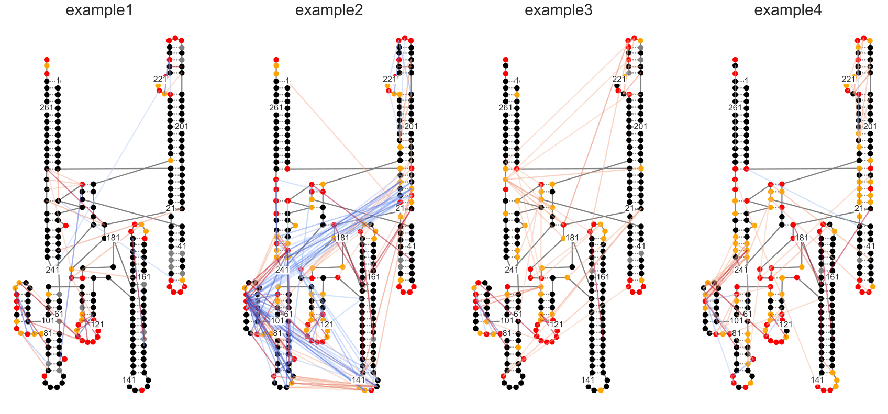

Plotting multiple samples
=========================

Contents:
- [Notebook set-up](#notebook-set-up)
- [Initializing MaP sample](#initializing-map-sample)
- [ShapeMapper QC](#shapemapper-qc)
- [Skyline plots](#skyline-plots)
- [Arc Plots](#arc-plots)
- [Secondary Structure](#secondary-structure)

Notebook set-up
---------------


```python
# This sets plots to display in-line by default
%matplotlib inline

# Import module. For high-level functions, no additional modules are needed
import plotmapper as MaP

# Creates an HTML button that hides/shows code cells
# Useful for lab notebook reports and research updates
# Note: This works in html and jupyter notebooks
#   but not github markdown (where you are likely looking.)
MaP.create_code_button()
```


<script>
                 code_show=true;
                 function code_toggle() {
                 if (code_show) {$('div.input').hide();}
                 else {$('div.input').show();}
                 code_show = !code_show
                 }
                 $( document ).ready(code_toggle);
                 </script>
                 <form action="javascript:code_toggle()">
                 <input type="submit" value="Hide/show raw code.">
                 </form>


Initializing MaP sample
-----------------------
If you have consistently named files, (which you should), you can use a function to create a dictionary of keyword arguments (kwargs). Then, "unpack" the dictionary using the double asterisk.


```python
path = 'data/'
def kwargs(sample):
    kwargs = {}
    kwargs["profile"] = path+sample+"_rnasep_profile.txt"
    kwargs["ct"] = path+"RNaseP.ct"
    kwargs["ss"] = path+"RC_CRYSTAL_STRUCTURE.xrna"
    kwargs["rings"] = path+sample+"-rnasep.corrs"
    kwargs["pairs"] = path+sample+"-rnasep-pairmap.txt"
    kwargs["log"] = path+sample+"_shapemapper_log.txt"
    kwargs["dance_reactivities"] = path+sample+"_rnasep-reactivities.txt"
    return kwargs

samples = [MaP.Sample(sample="example"+n, **kwargs("example"+n)) for n in "1234"]
```

ShapeMapper QC
--------------

This plot is ugly. It will look better in the future, but the function call will stay the same.
- Mutations per Molecule, separated by modified and untreated
- Read length distribution, separated by modified and untreated
- Boxplot of Mutation rates, colored by modified and untreated


```python
MaP.array_qc(samples)
```


Skyline Plots
-------------
Each sample is plotted on the same skyline.


```python
MaP.array_skyline(samples)
```


Arc Plots
---------


```python
#arcplot grid
MaP.array_ap(samples)

```


Secondary Structure
-------------------


```python
MaP.array_ss(samples)
```




