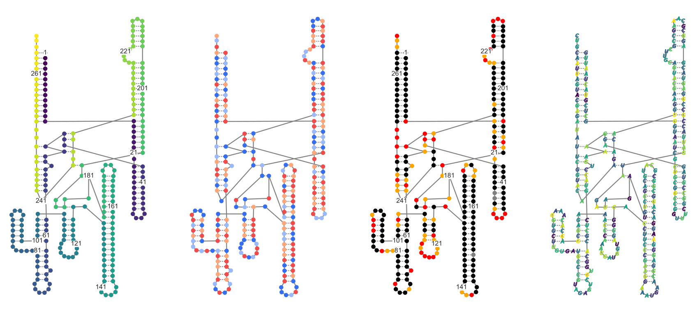
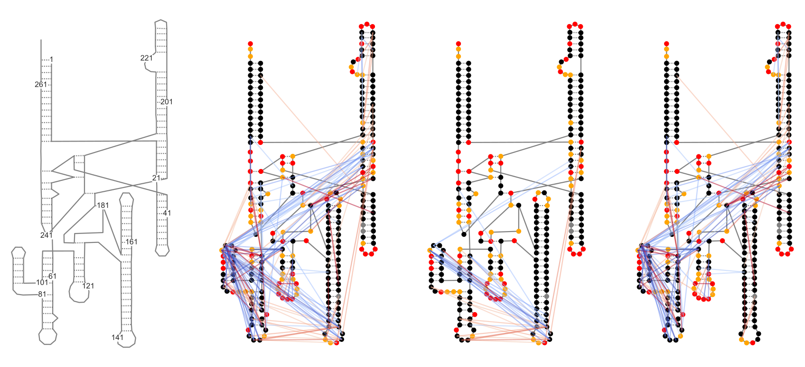

Example Notebook for using secondaryStructure.py
========================================
This module contains the SecondaryStructure object, with methods for convenient plotting of data on top of secondary structure diagrams.
* [Importing modules](#importing-modules)
* [Defining data paths](#defining-data-paths)
* [Sequence coloring](#sequence-coloring)
* [Plotting RInG data](#plotting-ring-data)


Importing modules
-----------------
I like to put this at the top of my notebook, all in one place, so that I can see my whole
python environment. The first line, `%matplotlib inline` ensures that plots are rendered
within the notebook. You can use `sys.path.append('path/to/module')` to add modules that are
not normally in your path.


```
# Set up Python environment

%matplotlib inline
# import sys
# sys.path.append('/nas/longleaf/home/psirving/JNBTools')
import secondaryStructure as ss
import numpy as np
import matplotlib.pyplot as plt
import seaborn as sns
import pandas as pd
```

Defining data paths
-------------------
This is where I read in all of my data and set paths to files.

For plottingTools.py functions, a pandas dataframe object is passed.

For JNBarcPlot.py, only the file paths are needed.


```
path = 'data/'
xrnapath = path+'RC_CRYSTAL_STRUCTURE.xrna'
profilepath = path+'example1_rnasep_profile.txt'
ringpath = path+'example-rnasep.corrs'
```

Sequence coloring
-----------------
There are two built-in color schemes, "profile" which is based on the reactivity profile, and "sequence" which is based on nucleotide identity.
- Sequence:
  - A: darker blue
  - U: lighter blue
  - G: darker red
  - C: lighter red
- Profile:
  - negative: grey
  - 0.0-0.4: black
  - 0.4-0.85: orange
  - over 0.85: red

You can also pass a list of valid matplotlib colors, with the same length as the RNA.

Sequence markers
----------------
Any valid matplotlib marker can be passed to marker. You can also pass "sequence" which will use the sequence lettering for the data marker. This defaults to closed circles ('o').


```
RNaseP = ss.SecondaryStructure(xrnafile=xrnapath, profile=profilepath, structureCassettes=True)

# for figsize, use RNA.figsize(rows,columns)
fig, ax = plt.subplots(1,4, figsize=RNaseP.figsize(1,4))

# Plot 1: no markers
RNaseP.makePlot(ax[0], colorby='position')
# Plot 2: Default colors and markers
RNaseP.makePlot(ax[1], positions=False)

# Plot 3: color by reactivity profile
# Alternative syntax
RNaseP.setPlot(ax[2])
RNaseP.plotSS(ax[2])
RNaseP.plotSequence(ax[2], colorby='profile')
RNaseP.plotPositions(ax[2])


# Plot 4: custom color map and Sequence markers
cmap = plt.get_cmap('viridis')
cmap = [cmap(np.random.random()) for n in range(RNaseP.length)]
RNaseP.makePlot(ax[3], colorby=cmap, positions=False, markers='sequence')

```





Plotting RInG data
------------------
Ring coordinates can be adjusted for structure cassettes, filtered by contact distance, or filtered by significance or statistic.


```
RNaseP = ss.SecondaryStructure(xrnafile=xrnapath, ringfile=ringpath, profile=profilepath, structureCassettes=True)

# use secondaryStructure.figsize(rows, columns) to get appropriate figure size
fig, ax = plt.subplots(1,4, figsize=RNaseP.figsize(1,4))

# Plot 1: Don't plot sequence or rings
RNaseP.makePlot(ax[0], sequence=False, rings=False)

# Plot 2: default plot
RNaseP.makePlot(ax[1], colorby='profile', positions=False)

# Plot 3: filter RInGs by cd > 20, stat > 20
RNaseP.filterRings(cdAbove=20, statistic=20)
RNaseP.setPlot(ax[2])
RNaseP.plotSS(ax[2])
RNaseP.plotSequence(ax[2], colorby='profile')
RNaseP.plotRings(ax[2])

# Plot 4: filter RInGs by cd < 20, stat > 20
RNaseP.filterRings(cdBelow=21, statistic=20)
RNaseP.makePlot(ax[3], colorby='profile', positions=False)

```





```

```
