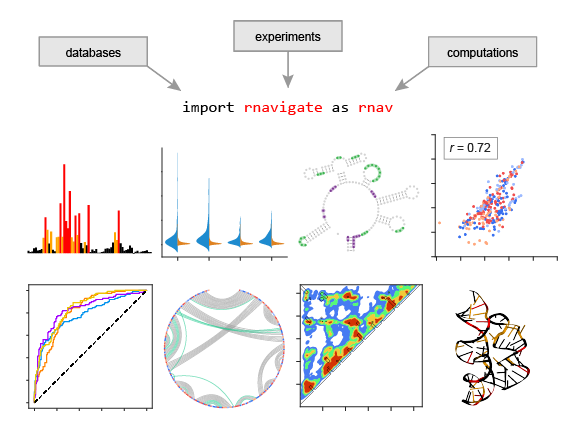

RNAvigate
=========

RNAvigate is a toolset to explore and compare chemical probing data, structure models, and annotations between experimental samples. RNAvigate's interface is designed to be easy to learn for non-programmers. It is most powerful when used in a Jupyter Notebook, which provides a convenient environment to explore data, to document thoughts, and to share transparent and reproducible analyses.

* [Full documentation](https://rnavigate.readthedocs.io/en/latest/)
