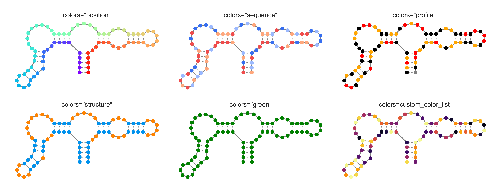
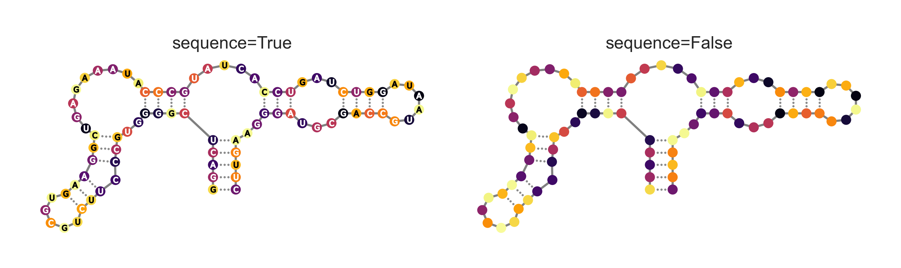
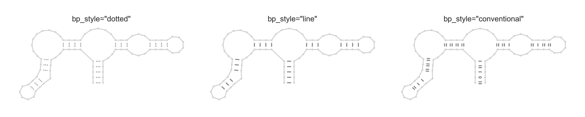

Secondary structure drawings
============================

Secondary structure drawings are a standard and intuitive way to visualize
secondary structures. It is also a useful way to visualize sequence
annotations and per-nucleotide and inter-nucleotide data in the context of a
secondary structure. RNAvigate will not make the layout for you, but it will
accept file formats from StructureEditor, R2DT, VARNA, and XRNA.

There are two ways to quickly make secondary structure drawings:

```python
plot1 = sample.plot_ss()
plot2 = rnavigate.plot_ss(samples=[sample])
```

`sample` here is a hypothetical `rnavigate.Sample` object containing data. As
written, these two lines of code do exactly the same thing: create a
single panel plot using the data from `sample`. With the second method, you
can also create a multi-panel plot by passing multiple samples to the samples
argument. e.g.:

```python
plot3 = rnavigate.plot_ss(samples=[sample, another_sample])
```

Using either method, you can explore multiple filtering schemes per sample
using the `filters` argument, explained below. Below are all of the optional
arguments that work with each of the methods above, along with their default
values. `plot4` below would produce exactly the same result as `plot1` and
`plot2`.

```python
plot4 = sample.plot_ss(
    ss="ss",
    interactions=None,
    interactions_filter={},
    interactions2=None,
    interactions2_filter={},
    filters=None,
    labels=None,
    title=True,
    annotations=[],
    profile="profile",
    colors="sequence",
    apply_color_to="background",
    sequence=False,
    colorbar=True,
    positions=False,
    bp_style="dotted"
    plot_kwargs={
        "rows": None, "cols": None,
        "figsize": None,
        "structure_lw": 3,
        "structure_z": 2,
        "data_a": None,
        "data_lw": 1.5,
        "data_z": 15,
        "annotations_a": 0.4,
        "annotations_lw": 30,
        "annotations_z": 5,
        "annotations_s": 30**2,
        "marker_s": 10**2,
        "basepair_z": 0,
        "nucleotide_z": 10,
        "sequence_z": 20,
        "position_z": 25},
)
```

Some of these arguments accept a key of `sample.data`. These are typically the
argument names given to the `rnavigate.Sample()` method when data are loaded.
To see these keys, run: `print(sample.data.keys())`.

---

`ss`

* A `sample.data` key that points to secondary structure drawing data.

---

`interactions` and `interactions2`

* These values are `sample.data` keys that point to inter-nucleotide data,
  e.g.:`"ringmap"`, `"pairmap"`, `"pairprob"`, `"shapejump"`, etc.
* These data are mapped to `ss`, filtered, then plotted as lines.

---

`interactions_filter` and `interactions2_filter`

* A dictionary of key-value pairs that specifies how `interactions` and
  `interactions2` are filtered and displayed
* See [interactions guide](../guides/filters.md) for more detail.

---

`filters`

* A list of dictionaries specifying interactions data and filtering schemes.
* Each filtering scheme will be applied to each sample, and plotted on separate
  plots. e.g. 3 samples and 2 filtering schemes produces 6 plots.
* This is an alternative to `interactions` and `interactions_filter`, those
  arguments will be ignored.
* See [interactions guide](../guides/filters.md) for more detail.

---

`labels`

* A list of strings, one for each sample.
* Defaults to using the sample name by retrieving `sample.sample`.

---

`title`

* `True` or `False`. Display titles using `labels`.

---

`annotations`

* A list of `sample.data` keys that point to sequence annotations.
* These are mapped to `ss`, then used to highlight nucleotides.

---

`profile`

* A `sample.data` key that points to per-nucleotide data.
* The default is "profile" which uses the first valid value in this list:
  ["shapemap", "dmsmap", "dancemap", "rnpmap"]
* These data are mapped to `ss` and used to color nucleotides if
  `colors="profile"`.

---

`colors`

* Can be any valid matplotlib color, a list of colors with length equal
  to the sequence of `ss`, or one of the following:
* `"position"` colors by position using a spectrum.
* `"sequence"` colors by nucleotide.
    * A: red
    * U: light red
    * G: blue
    * C: light blue
* `"profile"` colors using `profile` data.
* `"structure"` colors using base-pairing status.



---

`apply_color_to`

* `"background"` applies `colors` to nucleotide markers.
* `"sequence"` applies `colors` to nucleotide letters.
* `"structure"` applies `colors` to structure outline.


---

`sequence`

* `True` or `False`, whether to display nucleotide letters.
* Only applies if `apply_color_to="background"`.



---

`colorbar`

* `True` or `False`, whether to display the color scale for interactions data.

---

`positions`

* `True` or `False`, whether to display every 10th nucleotide position.

---

`bp_style`

* `"dotted"` draws three dots in a line between basepairs
* `"line"` draws a solid line between basepairs
* `"conventional"` draws single lines for A-U, double for G-C, circles for A-G
  and G-U



---

`plot_kwargs`

* A dictionary of keyword argument pairs passed to `rnavigate.SS()`.
* These values are automatically determined by the plotting function if not
  provided.
* `"rows"` and `"cols"` specifies the number of axes rows and columns of the
  matplotlib figure.
* `"figsize"` specifies the total size of the matplotlib figure in inches.
* The other arguments control the appearance of various elements of the
  structure drawing. They take the form `"element_attribute": value`
* Elements:
  * `"structure"`: the line and markers outlining the structure
  * `"data"`: inter-nucleotide data lines
  * `"annotations"`: annotation markers and lines
  * `"basepair"`: basepair lines
  * `"nucleotide"`: nucleotide markers
  * `"sequence"`: nucleotide letters
  * `"position"`: position numbering
* Attributes:
  * `"a"`: alpha value from 0.0 (invisible) to 1.0 (opaque)
  * `"lw"`: line width in pts
  * `"s"`: marker size in pts**2
  * `"z"`: z-order
