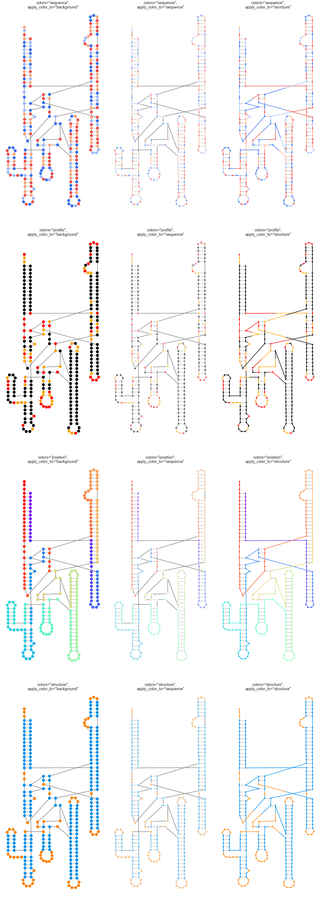

Secondary structure plots
=========================

Secondary structure plots are a useful and standard way to visualize
interaction and profile data on a secondary structure. RNAvigate will not
make the layout for you, but it will accept file formats from VARNA, XRNA,
and StructureEditor.

There are three functions for making secondary structure plots:

```python
plot1 = sample.plot_ss()
plot2 = sample.plot_ss_multifilter(filters=filters)
plot3 = rnavigate.plot_ss_multisample(samples=samples)
```

* `plot1` creates a single plot.
* `plot2` creates multiple plots, displaying interactions data from one
  experimental sample, filtered in different ways.
* `plot3` creates multiple plots, displaying interactions data from multiple
  experimental samples.

Below are all of the optional arguments that work with each of the functions
above, along with their default values.

```python
plot1 = sample.plot_arcs(
    ss="ss",
    interactions=None,
    interactions_filter={},
    interactions2=None,
    interactions2_filter={},
    profile="profile",
    annotations=[],
    labels=None,
    prefiltered=False,
    colorbar=True,
    title=True,
    colors="sequence",
    positions=False,
    bp_style="dotted",
    sequence=False,
    apply_color_to="background")
```

`ss`

* This must be a structure datatype with drawing coordinates, usually "ss".

`interactions` and `interactions2`

* These can be any interactions datatype: "ringmap", "pairmap", "pairprob",
  "shapejump", etc.
* `_filter` defines the filtering scheme to be applied.
* See [interactions guide](../filters.md) for more info.

`profile`

* This can be any per-nucleotide data.
* The default is "profile" which uses the first valid value in this list:
  ["shapemap", "dmsmap", "dancemap", "rnpmap"]

`annotations`

* This must be a list of valid annotation datatypes.
* See [annotations guide](../annotations.md) for more info.

`labels`

* A list of strings, one for each sample. Defaults to using the sample name.

`prefiltered`

* True or False. Preserves previous filtering schemes.

`colorbar`

* True or False. Display the color scale for interactions data.

`seqbar`

* True or False. Display the sequence along the x-axis.

`title`

* True or False. Display a title (usually the sample name).

`positions`

* True or False, whether to display every 10th nucleotide position.

`bp_style`

* `"dotted"` draws three dots in a line between basepairs
* `"line"` draws a solid line between basepairs
* `"conventional"` draws single lines for A-U, double for G-C, circles for A-G and G-U

`sequence`

* True or False, whether to display nucleotide letters.
* Only applies if `apply_color_to="background"`.

`colors` and `apply_color_to`


