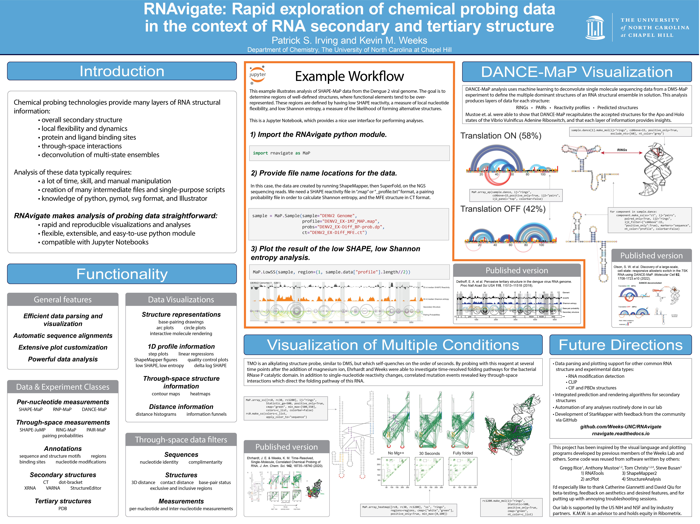

RNA Society 2022
================

On this page, you'll find the poster I presented at RNA 2022, and the Jupyter
notebooks that I used to create each figure element.

Note: Some of the code on the actual poster is broken, but I will try to keep
these notebooks up to date with the most recent version of RNAvigate.

Jupyter Notebooks
-----------------
- [DANCE-MaP](poster/addRS/AddWT.ipynb)
- [Time-resolved Probing](poster/RNaseP/RNaseP.ipynb)
- [Low SHAPE/Shannon entropy](poster/denv2/DENV2.ipynb)

