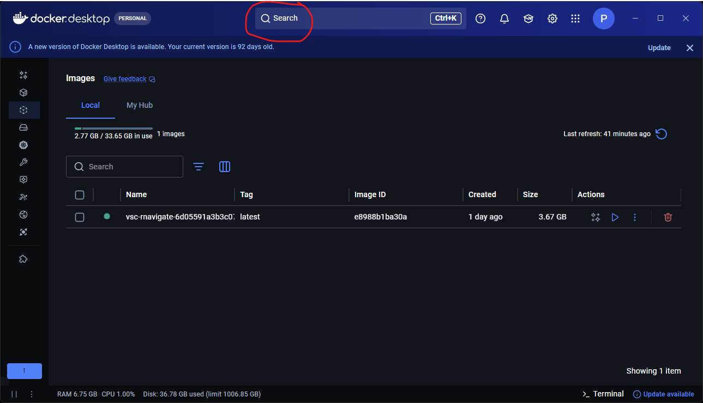
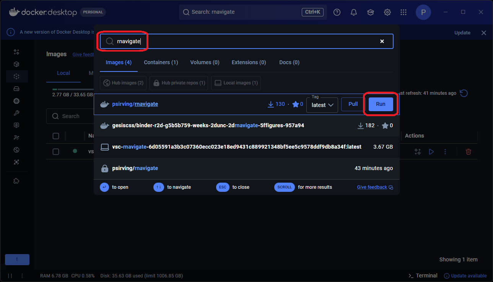
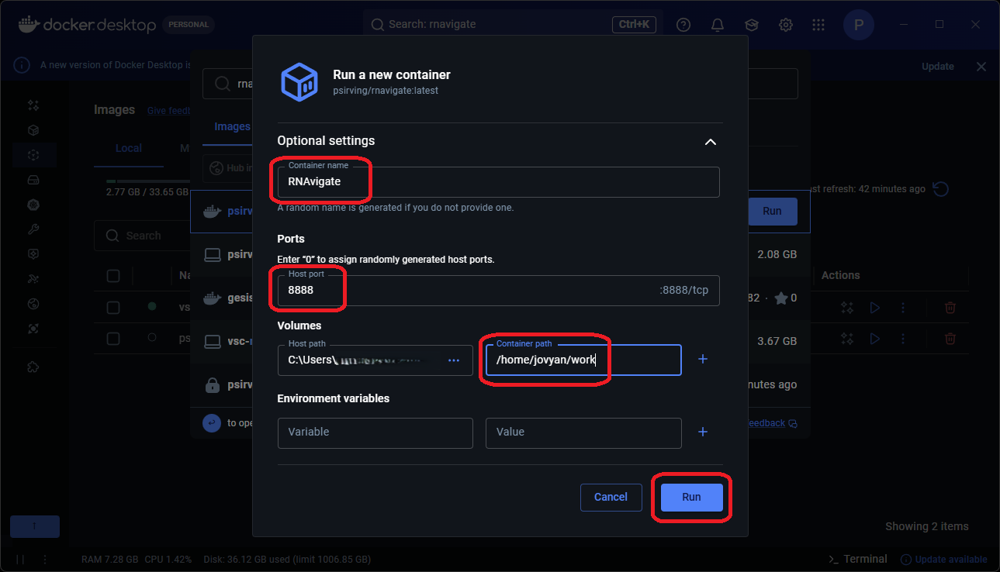
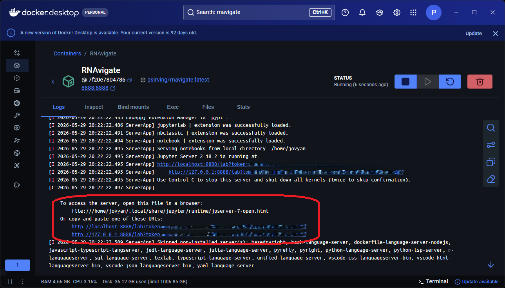
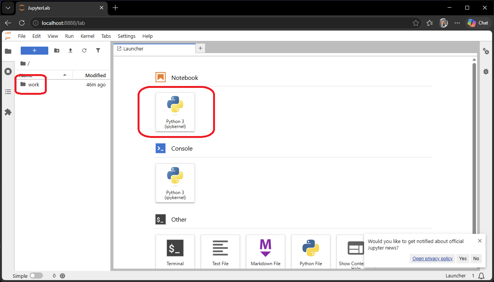

Installing RNAvigate
====================

If you have any questions about installation, please submit a `GitHub Issue <https://github.com/Weeks-UNC/RNAvigate/issues>`_.

RNAvigate can be installed several ways. Choose the option that best fits your environment:

- `Docker`_: easy, fast setup to work locally on Windows, macOS, or Linux
- `Conda`_: easy if you are comfortable on the command line or already use conda/mamba
- `Pip`_: if you are more comfortable with pip and virtual environments
- `VS Code`_: a worthwhile workflow improvement with a little more setup required
- `UNC Longleaf`_: for UNC users working on the Longleaf HPC cluster
- `Dev Container <../resources/developer_installation>`_: to contribute to the codebase

Each method follows the same three steps:

1. **Install dependencies**: set up RNAvigate and Jupyter in your environment
2. **Open a notebook**: launch JupyterLab in a browser or open a notebook in VS Code
3. **Test the installation**: run a sample plot to confirm everything works

Docker
------

The easiest way to get started locally. No dependency management required;
the container boots with JupyterLab already running.

Install Docker
~~~~~~~~~~~~~~

1. Install `Docker Desktop <https://www.docker.com/products/docker-desktop/>`_.

2. Open Docker Desktop and search for ``psirving/rnavigate``.

3. Make sure the tag is set to ``latest`` and click **Run**.

4. Expand the **Optional settings** drop-down and enter the following:

   - **Container name**: ``RNAvigate``
   - **Host port**: ``8888``
   - **Volumes**:

     - **Host path**: use the (...) button to choose a directory.
     - **Container path**: ``/home/jovyan/work``

   .. note::

      Choose a **Host path** that contains your data files.
      RNAvigate will *only* have access to this directory.

5. Click **Run**. A terminal window opens showing the container logs.

Connect to JupyterLab from Docker
~~~~~~~~~~~~~~~~~~~~~~~~~~~~~~~~~

6. Click one of the links shown in the terminal to open JupyterLab in your browser.

7. Click on the **Work** directory; this is linked to the host path you set in step 4.

8. Open a new Jupyter Notebook.

Test the Installation
~~~~~~~~~~~~~~~~~~~~~

See `Test Plot`_ below.

Stop and Restart
~~~~~~~~~~~~~~~~

- **Stop**: go back to Docker Desktop and click the **Stop** button on the container.
- **Restart**: go to **Containers**, click **Start** on the RNAvigate container,
  then click **(...) > View Details** and return to step 6.

Conda
-----

Use this method if you prefer conda or mamba, or if Docker is unavailable. Mamba can be
used in place of conda.

Install the Environment
~~~~~~~~~~~~~~~~~~~~~~~

1. Download the ``environment.yml`` file.

.. code-block:: bash

   curl -O https://raw.githubusercontent.com/Weeks-UNC/RNAvigate/master/environment.yml

.. note::

   On Windows, open the URL above in a browser and save the file as ``environment.yml``.

2. Create the conda environment. This step can take several minutes: grab a coffee.

.. code-block:: bash

   conda env create -f environment.yml

3. Activate the environment.

.. code-block:: bash

   conda activate rnavigate

Connect to JupyterLab
~~~~~~~~~~~~~~~~~~~~~

4. Launch JupyterLab.

.. code-block:: bash

   jupyter lab

A browser window will open automatically. If it does not, copy the URL printed in the terminal.

Test the Installation
~~~~~~~~~~~~~~~~~~~~~

See `Test Plot`_ below.

Pip
---

Install RNAvigate and Jupyter
~~~~~~~~~~~~~~~~~~~~~~~~~~~~~

1. Create and activate a virtual environment.

.. code-block:: bash

   python -m venv rnavigate-env
   source rnavigate-env/bin/activate

.. note::

   On Windows, use ``rnavigate-env\Scripts\activate`` instead.

2. Install RNAvigate and JupyterLab.

.. code-block:: bash

   pip install rnavigate jupyterlab

Connect to JupyterLab
~~~~~~~~~~~~~~~~~~~~~

3. Launch JupyterLab.

.. code-block:: bash

   jupyter lab

A browser window will open automatically. If it does not, copy the URL printed in the terminal.

Test the Installation
~~~~~~~~~~~~~~~~~~~~~

See `Test Plot`_ below.

VS Code
-------

Use this method if you prefer to work in VS Code rather than a browser-based JupyterLab.
VS Code runs Jupyter notebooks natively through an extension: no separate server needed.

Install VS Code
~~~~~~~~~~~~~~~

1. Install `Visual Studio Code <https://code.visualstudio.com/>`_.

2. Open VS Code and install the following extensions from the Extensions panel
   (**Ctrl+Shift+X** / **Cmd+Shift+X**):

   - `Python <https://marketplace.visualstudio.com/items?itemName=ms-python.python>`_ (``ms-python.python``)
   - `Jupyter <https://marketplace.visualstudio.com/items?itemName=ms-toolsai.jupyter>`_ (``ms-toolsai.jupyter``)

3. Create and activate a virtual environment with pip, then install RNAvigate.

.. code-block:: bash

   python -m venv rnavigate-env
   source rnavigate-env/bin/activate
   pip install rnavigate

.. note::

   On Windows, use ``rnavigate-env\Scripts\activate`` instead.
   A conda environment from the `Conda`_ section also works: VS Code detects conda environments automatically.

Open a Notebook
~~~~~~~~~~~~~~~

4. Open VS Code in your working directory.

.. code-block:: bash

   code /path/to/your/data

5. Create a new Jupyter Notebook: press **Ctrl+Shift+P** (**Cmd+Shift+P** on macOS),
   type **Jupyter: Create New Jupyter Notebook**, and press **Enter**.

6. Click **Select Kernel** in the top-right corner of the notebook, choose
   **Python Environments**, and select ``rnavigate-env``.

Test the Installation
~~~~~~~~~~~~~~~~~~~~~

See `Test Plot`_ below.

UNC Longleaf
------------

For UNC users working on the Longleaf HPC cluster.

Install the Environment
~~~~~~~~~~~~~~~~~~~~~~~

Load the required modules and create a conda environment.
This does not change your default modules: they will be restored on your next login.

.. code-block:: bash

   module rm python pymol pyrosetta
   module load anaconda/2019.10
   conda env create -f /proj/kweeks/bin/RNAvigate_v1.1.1/environment.yml
   source activate rnavigate
   python -m ipykernel install --user --name=rnavigate

If this completes without errors, exit Longleaf and open UNC's
`OpenOnDemand Service <https://ondemand.rc.unc.edu/>`_.

Connect to Jupyter on OnDemand
~~~~~~~~~~~~~~~~~~~~~~~~~~~~~~

Log in with your ONYEN and start a Jupyter Notebook.

1. Click **Interactive Apps** and under **Servers** click **Jupyter Notebook**.
2. Enter the number of hours you will need, set CPU to 1, and leave other fields blank.
3. Don't forget to save your work before time runs out!

Test the Installation
~~~~~~~~~~~~~~~~~~~~~

See `Test Plot`_ below.

Test Plot
---------

Run the following in a Jupyter Notebook cell to confirm RNAvigate is working correctly.
This loads a built-in example dataset and generates an arc plot of DMS-MaP reactivity.

.. code-block:: python

   import rnavigate as rnav
   from rnavigate.examples import tpp

   rnav.plot_arcs(
       samples=[tpp],
       sequence="ss",
       structure="ss",
       profile="dmsmap",
   )

If the plot appears without errors, your installation is working correctly.
