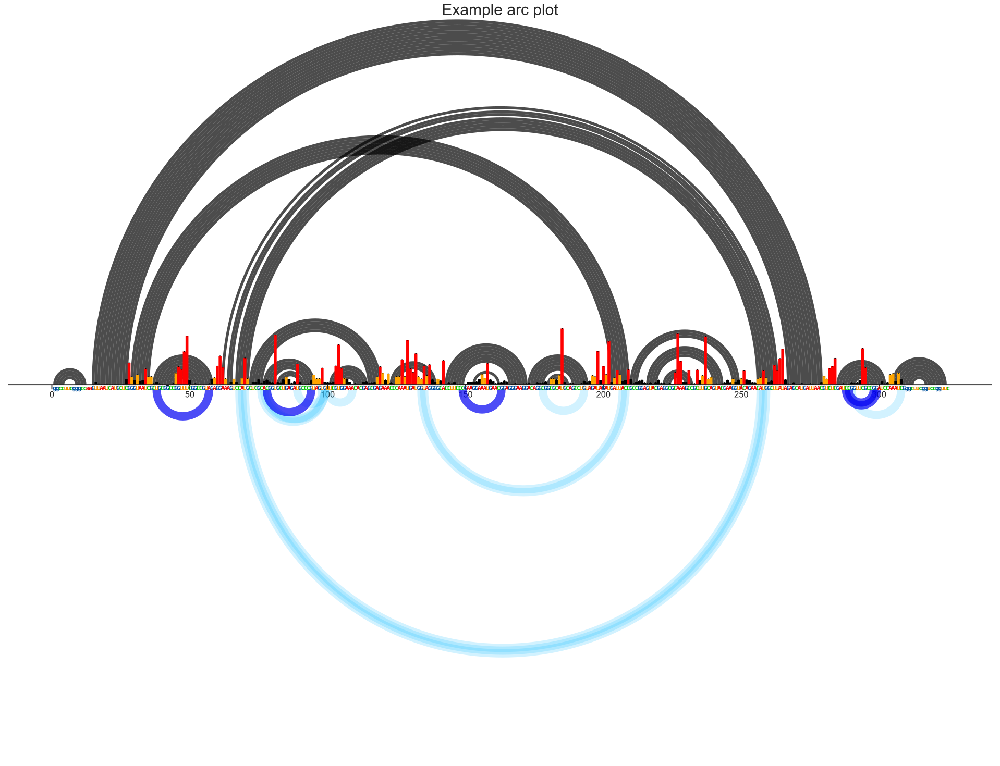

Example Notebook for using JNBarcPlot.py
========================================
* Import necessary modules for your analysis.
* Import data and set data paths.
* Make an arc plot with PAIR data.
* Make an arc plot with RInG data. (not yet available)


Importing modules.
------------------
I like to put this at the top of my notebook, all in one place, so that I can see my whole
python environment. The first line, `%matplotlib inline` ensures that plots are rendered
within the notebook. You can use `sys.path.append('path/to/module')` to add modules that are
not normally in your path.


```python
# Set up Python environment

%matplotlib inline
import sys
sys.path.append('/nas/longleaf/home/psirving/JNBTools')
import JNBarcPlot as arc
import plottingTools as pt
import numpy as np
import matplotlib.pyplot as plt
import seaborn as sns
import pandas as pd
```

Defining data path and reading in data
--------------------------------------
This is where I read in all of my data and set paths to files.

For plottingTools.py functions, a pandas dataframe object is passed.

For JNBarcPlot.py, only the file paths are needed.


```python
path = 'data/'
ctpath = path+'RNaseP.ct'
profilepath = path+'example1_rnasep_profile.txt'
pairmappath = path+'example-rnasep-pairmap.txt'
```

Make arc plot with PAIR data
----------------------------
To compare two ct files, use `arc.addCTcompare(ax, ctpath1, ctpath2)` in place of `arc.addCT(ax, ctpath)`.

In the plot below, the ax.set_ylim() parameters are very important.

The sequence bar added during `arc.addProfile()` will appear at the center of the yaxis. It looks best just below the x-axis.
To accomplish this, center the ylims around -2.

To accomodate long range arcs, the ylims should be at least half the length of the longest arc above 0 and below -4.
For example, here, my longest arc is about 264 nt, so I am using (-133-4, 133).

TODO: Create a function to set ylims appropriately.


```python
# This is messy and will be fixed later. Figsize method of ReactivityProfile returns appropriate dimensions for a skyline plot.
# I'm taking the width and applying it to width and height for an arcPlot
dims = pt.ReactivityProfile(profilepath).figsize(1,1)[0]

fig, ax = plt.subplots(1,1, figsize=(dims, dims))

arc.setArcPlot(ax)
ax.set_ylim(-137,133)
ax.set_title('Example arc plot', fontsize=30)
arc.addCT(ax, ctpath)
arc.addProfile(ax, profilepath)
arc.addPairmap(ax, pairmappath)
```





Make arc plot with RInG data
----------------------------
This functionality is coming soon. There will be options to add cutoffs based on statistics and contact distance.


```python

```
